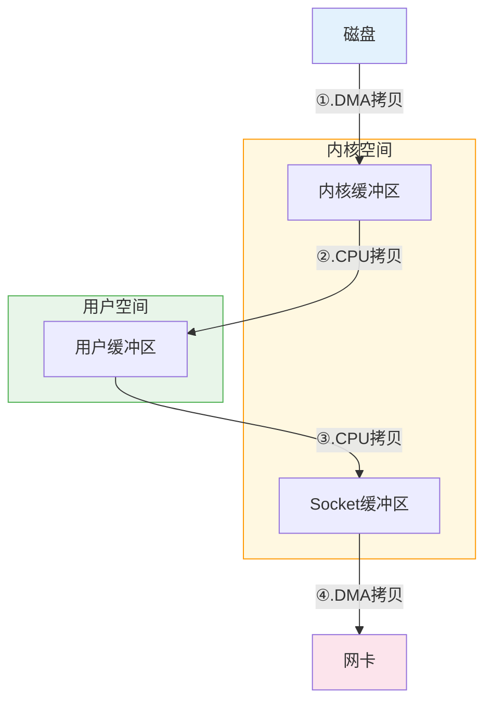

# 传统I/O数据传输流程

**总计：4次数据拷贝 + 4次上下文切换**

## 数据拷贝详解

| 步骤 | 操作 | 类型 | 说明 |
|------|------|------|------|
| ① | 磁盘 → 内核缓冲区 | DMA拷贝 | read()系统调用触发 |
| ② | 内核缓冲区 → 用户缓冲区 | CPU拷贝 | read()返回数据 |
| ③ | 用户缓冲区 → Socket缓冲区 | CPU拷贝 | write()系统调用触发 |
| ④ | Socket缓冲区 → 网卡 | DMA拷贝 | write()执行期间，内核态操作 |

> 注：DMA拷贝由DMA控制器完成，不占用CPU；CPU拷贝需要CPU参与数据搬运

## 上下文切换详解

上下文切换是指CPU从执行一个进程切换到执行另一个进程（或内核）的过程，需要保存和恢复寄存器、程序计数器、栈指针等状态信息。

| 切换时机 | 触发原因 | 说明 |
|----------|----------|------|
| 用户态 → 内核态 | read()系统调用 | 应用程序请求读取磁盘数据 |
| 内核态 → 用户态 | read()返回 | 数据已拷贝到用户缓冲区 |
| 用户态 → 内核态 | write()系统调用 | 应用程序请求发送数据到网络 |
| 内核态 → 用户态 | write()返回 | 数据已拷贝到Socket缓冲区 |

**上下文切换的开销**：
- 保存/恢复寄存器状态
- 切换内核栈
- 刷新TLB（部分架构）
- 可能触发缓存失效

## 缓冲区说明

### 内核缓冲区 (Kernel Buffer)

- **位置**：内核空间
- **作用**：作为磁盘与用户空间之间的中转站
- **特点**：
  - 用户程序无法直接访问
  - 通过read/write系统调用间接操作
  - 大小通常为4KB（一个内存页）
  - 操作系统会进行预读和延迟写优化

### Socket缓冲区

- **位置**：内核空间
- **作用**：网络数据传输的缓冲区域
- **分类**：
  - **发送缓冲区**：存储待发送的数据
  - **接收缓冲区**：存储已接收但未被应用读取的数据
- **特点**：
  - 由网络协议栈管理
  - 数据按TCP/UDP协议封装后发送
  - 大小可通过`/proc/sys/net/core/rmem_max`等参数调整

### 用户缓冲区

- **位置**：用户空间
- **作用**：应用程序自己维护的数据缓冲区
- **特点**：
  - 应用程序可直接读写
  - 大小由应用程序决定
  - 是数据在用户空间的唯一驻留点

## 为什么传统I/O效率低？

1. **多次数据拷贝**：数据在内核空间和用户空间之间来回拷贝
2. **多次上下文切换**：每次系统调用都涉及用户态/内核态切换
3. **CPU参与拷贝**：CPU拷贝占用CPU资源，无法执行其他任务
4. **缓存污染**：数据多次拷贝会占用CPU缓存，影响其他操作

## 优化方案

针对传统I/O的缺点，Linux提供了以下优化方案：

- **mmap**：内存映射，减少一次CPU拷贝
- **sendfile**：零拷贝，数据不经过用户空间
- **splice**：在两个文件描述符之间移动数据，无需用户空间参与
