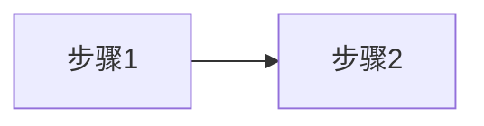
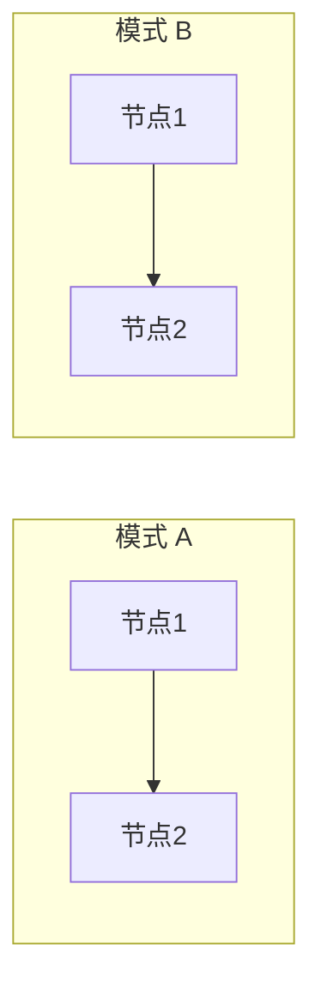

# 子图排列示例

## 上下排列

适用于对比不同方案的流程图，子图从上到下依次展示。

**推荐方式：独立图表**

将多个子图拆分为独立的图表，用标题分隔：

**方案 A**：

**方案 B**：

**实现要点**：
- 每个方案使用独立的 `mermaid` 代码块
- 用标题分隔不同方案
- 兼容所有渲染器

---

## 左右排列

适用于并排对比两种模式，子图从左到右依次展示。

**实现要点**：
- 使用 `flowchart LR`（从左到右布局）
- 使用 `subgraph` 划分不同区域

---

## 注意事项

`~~~` 隐形连接符在部分渲染器中不支持，推荐使用独立图表方式实现上下排列，确保兼容性。
