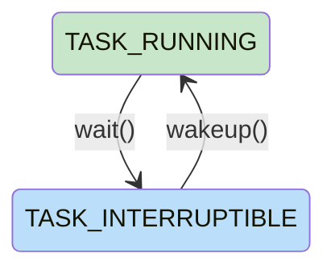
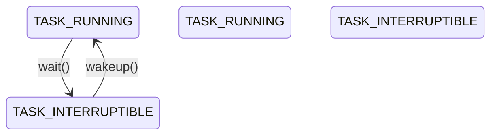

# 状态图别名示例

## 别名使用原则

别名定义必须有实际用途，禁止定义后不使用。

## 场景对照

| 场景 | 正确做法 | 错误做法 |
|------|---------|---------|
| 需要设置样式 | 定义别名 + 使用别名定义转换 + 添加 `style` 样式 | 只定义别名，不使用 |
| 不需要样式 | 直接使用完整名称定义转换，不定义别名 | 定义别名但未使用 |

## 正确示例

别名用于样式设置：

**说明**：
- 定义别名 `RUNNING` 和 `SLEEP`
- 使用别名定义状态转换
- 使用别名设置样式颜色

## 错误示例

别名定义但未使用：

**问题**：
- 定义了别名 `RUNNING` 和 `SLEEP`
- 但状态转换直接使用完整名称 `TASK_RUNNING`、`TASK_INTERRUPTIBLE`
- 别名成为死代码，应删除
