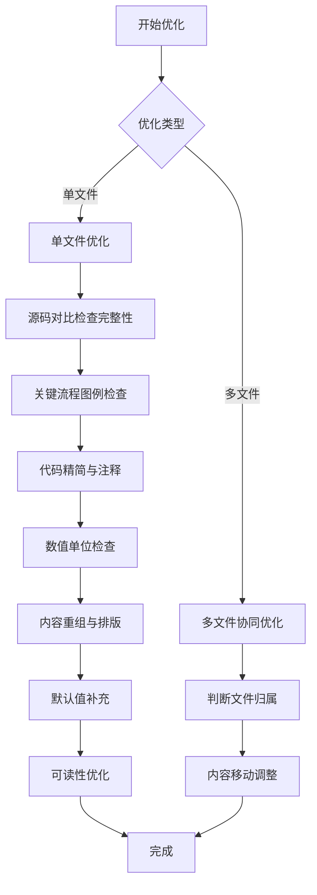
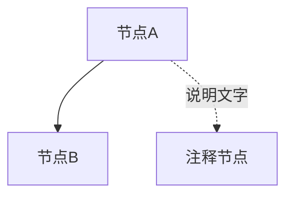

# 技术文档优化技能

## 执行流程



---

## 一、单文件优化

### 1. 源码对比 - 内容完整性检查

**目的**：依据源码检查当前文档内容是否有缺失，如核心类、核心概念、核心属性、核心流程等是否遗漏，主要目的是**补充缺失内容**。

| 检查项 | 处理方式 |
|--------|----------|
| 核心类缺失 | 从源码补充核心类的定义和说明，标注源码位置 |
| 核心概念缺失 | 从源码补充核心概念的定义和说明，标注源码位置 |
| 类/接口属性缺失 | 从源码补充完整字段，标注源码位置 |
| 核心流程缺失 | 从源码补充核心流程说明，标注源码位置 |
| 枚举值缺失 | 从源码补充所有枚举值，标注源码位置 |
| 配置项缺失 | 从源码补充所有配置项，标注源码位置 |
| 方法参数缺失 | 从源码补充参数类型和说明，标注源码位置 |
| 章节内容缺失 | 补充缺失的章节内容，标注源码位置 |

**原则**：
- 所有内容必须与源码一致，禁止凭记忆或推测编写
- 重点关注**是否有遗漏**，而非仅验证已有内容的正确性
- 补充缺失内容时需标注源码位置
- 源码路径使用相对路径，格式：`模块名/src/main/java/org/apache/rocketmq/...`

---

### 2. 关键流程图例检查

| 检查项 | 处理方式 |
|--------|----------|
| 核心流程无图例 | 使用 Mermaid 补充流程图 |
| 状态转换无图例 | 使用 Mermaid 补充状态图 |
| 组件交互无图例 | 使用 Mermaid 补充时序图 |
| 架构说明无图例 | 使用 Mermaid 补充架构图 |

**图例类型选择**：
- `flowchart`：业务流程、决策流程
- `sequenceDiagram`：组件交互、API调用
- `stateDiagram-v2`：状态转换、生命周期

---

### 3. 代码精简与注释

| 检查项 | 判断标准 | 处理方式 |
|--------|----------|----------|
| 代码过长 | 超过 30 行 | 精简为核心逻辑 |
| 缺少中文注释 | 代码块无中文注释 | 添加关键行中文注释 |
| 格式混乱 | 缩进不一致 | 统一代码格式 |

**精简原则**：
- 保留核心逻辑，删除异常处理、日志打印等非关键代码
- 使用 `// ...` 省略非关键代码
- 关键行必须添加中文注释

**注释优化原则**：
- ✅ **添加注释**：为无注释的关键代码添加中文注释
- ✅ **补充注释**：为不完整的注释补充说明
- ❌ **禁止删除/简化已有注释**：如果注释已清晰说明原因、目的或背景，不得删除或简化
- ❌ **禁止降低可读性**：优化后的注释可读性不得低于原文

**反例（禁止）**：
```java
// 优化前（注释清晰，说明了原因）
if (diff < 0 && diff > -1000_000) {
    diff = 0;  // NTP 时间校准处理，防止时钟回拨导致负值
}

// 优化后（错误！简化了注释，降低了可读性）
if (diff < 0 && diff > -1000_000) {
    diff = 0;  // NTP 时间校准处理
}
```

**正例（正确）**：
```java
// 优化前（无注释）
if (diff < 0 && diff > -1000_000) {
    diff = 0;
}

// 优化后（添加注释说明原因）
if (diff < 0 && diff > -1000_000) {
    diff = 0;  // NTP 时间校准处理，防止时钟回拨导致负值
}
```

**示例**：
```java
// 精简前（过长且无注释）
public PutMessageResult putMessage(final MessageExtBrokerInner msg) {
    long beginTime = this.defaultMessageStore.now();
    if (null == msg.getTopic()) {
        return new PutMessageResult(PutMessageStatus.MESSAGE_ILLEGAL, null);
    }
    if (msg.getTransactionId() != null) {
        // ... 大量代码
    }
}

// 精简后（精简 + 中文注释）
public PutMessageResult putMessage(final MessageExtBrokerInner msg) {
    // 1. 消息校验
    if (null == msg.getTopic()) {
        return new PutMessageResult(PutMessageStatus.MESSAGE_ILLEGAL, null);
    }
    // 2. 获取写入偏移量
    long wroteOffset = this.commitLog.getNextOffset();
    // 3. 写入 CommitLog
    // ...
}
```

---

### 4. 数值单位检查

| 检查项 | 处理方式 |
|--------|----------|
| 数值缺少单位 | 补充单位（如 `1000` → `1000ms`） |
| 单位可读性差 | 转换为大单位（如 `60000ms` → `60s`） |
| 单位不一致 | 统一单位表述 |

**常用单位规范**：
- 时间：ms、s、min、h
- 大小：B、KB、MB、GB
- 数量：个、条、次

**示例**：
- 修正前：`超时时间 30000`
- 修正后：`超时时间 30s（30000ms）`

**注意**：转换为大单位时，需保留原始数值。

---

### 5. 内容重组与排版

#### 5.1 章节合并

| 条件 | 处理方式 |
|------|----------|
| 章节内容过少（< 50 行） | 合并到关联章节，修改章节标题 |

#### 5.2 章节拆分

| 条件 | 处理方式 |
|------|----------|
| 章节内容过多（> 500 行） | 按主题拆分为多个章节 |

#### 5.3 章节标题修正

| 条件 | 处理方式 |
|------|----------|
| 标题不能归纳内容 | 修改章节标题 |
| 标题遗漏关键内容 | 修改标题或补充遗漏内容 |

**标题与内容一致性检查**：

| 检查项 | 示例 | 处理方式 |
|--------|------|----------|
| 标题只列出部分内容 | 标题 "CommitLog + ConsumeQueue 存储架构" 但内容包含 IndexFile | 修改标题为更通用的名称，如 "存储架构设计" |
| 标题与内容主题不符 | 标题 "性能优化" 但内容包含架构设计 | 拆分或重命名章节 |
| 标题包含非核心组件 | 标题 "三层存储架构" 但 IndexFile 是可选扩展 | 区分核心组件与可选组件，标题聚焦核心 |

**正例**：
```markdown
❌ 错误：标题包含非核心组件
### 1.1 三层存储架构
RocketMQ 采用 "CommitLog + ConsumeQueue + IndexFile" 三层存储架构...
（IndexFile 是可选的扩展查询索引，不参与核心消息存储流程）

✅ 正确：标题聚焦核心架构
### 1.1 二层存储架构
RocketMQ 采用 "CommitLog + ConsumeQueue" 二层存储架构，IndexFile 是可选的扩展查询索引...
```

#### 5.4 内容合并

**目的**：消除重复内容，提升文档简洁性和可维护性。

**合并类型**：

| 类型 | 判断条件 | 处理方式 |
|------|----------|----------|
| 相同表格重复 | 同一表格内容出现多次 | 保留信息更完整的版本，删除重复表格 |
| 相同章节重复 | 同一主题内容分散在多处 | 合并到同一章节，保留所有重要信息 |
| 相同概念重复 | 同一概念在多处解释 | 合并到首次出现位置，其他位置保留引用 |

**表格合并原则**：

| 情况 | 处理方式 |
|------|----------|
| 两个表格列数相同 | 合并为一个表格，去重后保留 |
| 两个表格列数不同 | 保留列数更多（信息更完整）的版本 |
| 表格内容有差异 | 合并所有重要信息，保留完整版本 |

**表格合并示例**：

```markdown
❌ 优化前：相同表格重复出现
**LocalTransactionState 枚举值**：

| 状态 | 说明 | 后续动作 |
| --- | --- | --- |
| `COMMIT_MESSAGE` | 提交事务 | 消息变为可见，消费者可消费 |
| `ROLLBACK_MESSAGE` | 回滚事务 | 消息被删除，消费者不可见 |
| `UNKNOW` | 中间状态 | Broker 发起事务回查 |

...（其他内容）...

**LocalTransactionState 枚举值**：

| 枚举值 | 说明 |
| --- | --- |
| `COMMIT_MESSAGE` | 提交事务消息，消息对消费者可见 |
| `ROLLBACK_MESSAGE` | 回滚事务消息，删除半消息 |
| `UNKNOW` | 事务状态未知，Broker 会定时回查 |

✅ 优化后：合并所有重要信息
**LocalTransactionState 枚举值**：

| 状态 | 说明 | 后续动作 |
| --- | --- | --- |
| `COMMIT_MESSAGE` | 提交事务 | 消息变为可见，消费者可消费 |
| `ROLLBACK_MESSAGE` | 回滚事务，删除半消息 | 消息被删除，消费者不可见 |
| `UNKNOW` | 中间状态，事务状态未知 | Broker 发起事务回查（定时回查） |
```

**合并注意事项**：
- 合并前对比两个版本，确保保留所有重要信息
- 合并后检查上下文逻辑是否连贯
- 如合并后内容过长，可考虑拆分到独立章节

#### 5.5 章节结构扁平化

**目的**：减少嵌套层级，提升文档可读性。过多的子章节会导致结构臃肿，读者难以快速把握主要内容。

**扁平化原则**：

| 条件 | 处理方式 |
|------|----------|
| 子章节内容过少（< 20 行） | 合并到父章节，移除子标题 |
| 子章节之间逻辑紧密 | 合并为一个章节，用段落分隔 |
| 图例/表格作为独立子章节 | 移除子标题，直接作为章节内容 |
| 子标题仅为"问题背景"等通用名称 | 移除子标题，内容直接归属父章节 |

**扁平化示例**：

```markdown
❌ 优化前：嵌套层级过多
### 8.2 为什么需要 swapMap？

#### 8.2.1 问题背景

RocketMQ 使用 mmap 将磁盘文件映射到虚拟内存...

```plain
┌─────────────────────────────────────────────────────────────────────────────┐
│                    问题：虚拟内存持续增长                                      │
├─────────────────────────────────────────────────────────────────────────────┤
│  Broker 运行时间越长，累积的 CommitLog 文件越多：                              │
│  ...                                                                         │
│  问题：                                                                      │
│  ┌──────────────────────────────────────────────────────────────────────┐  │
│  │  1. 虚拟内存占用持续增长...                                            │  │
│  └──────────────────────────────────────────────────────────────────────┘  │
└─────────────────────────────────────────────────────────────────────────────┘
```

#### 8.2.2 为什么不直接删除旧映射？

| 方案 | 问题 |
|------|------|
| **删除旧文件** | 文件可能还需要被消费者读取 |

### 8.3 swapMap 解决方案

#### 8.3.1 核心思路

swapMap 采用**重新映射**的方式间接释放旧映射...

#### 8.3.2 解决了什么问题？

| 问题 | swapMap 解决方案 |
|------|------------------|
| **虚拟内存泄漏** | 定期释放旧映射，回收虚拟地址空间 |

✅ 优化后：结构扁平，内容紧凑
### 8.2 为什么需要 swapMap？

RocketMQ 使用 mmap 将磁盘文件映射到虚拟内存，每个映射文件都会占用进程的虚拟地址空间。Broker 运行时间越长，虚拟内存占用持续增长：

```plain
┌─────────────────────────────────────────────────────────────────────────────┐
│                    问题：虚拟内存持续增长                                      │
├─────────────────────────────────────────────────────────────────────────────┤
│  时间线:  T0 ──────────────────────────────────────────────────────► Tn     │
│  文件数量: 1个 ──► 10个 ──► 100个 ──► 1000个 ──► ...                        │
│  虚拟内存占用: 1GB ──► 10GB ──► 100GB ──► 1TB ──► ...                       │
└─────────────────────────────────────────────────────────────────────────────┘
```

**核心问题**：旧文件的映射内存无法被释放，原因如下：

| 尝试方案 | 问题 |
|------|------|
| **删除旧文件** | 文件可能还需要被消费者读取 |
| **手动 munmap** | Java 没有这个方法 |

**后果**：长期运行的 Broker 可能累积数 TB 的虚拟内存映射，可能触发 OOM Killer。

### 8.3 swapMap 解决方案

swapMap 采用**重新映射**的方式间接释放旧映射：

```plain
┌─────────────────────────────────────────────────────────────────────────────┐
│  swapMap 方式：                                                              │
│  1. 保存旧映射引用: oldBuffer = mappedByteBuffer                            │
│  2. 重新映射文件:   mappedByteBuffer = fileChannel.map(...)                 │
│  3. 延迟释放旧映射: UtilAll.cleanBuffer(oldBuffer)                          │
└─────────────────────────────────────────────────────────────────────────────┘
```

**问题与解决方案对照**：

| 问题 | swapMap 解决方案 |
|------|------------------|
| 虚拟内存泄漏 | 定期释放旧映射，回收虚拟地址空间 |
```

**扁平化要点**：
- 移除冗余的子标题（如"问题背景"、"核心思路"）
- 精简图例内容，去除重复信息
- 合并相关表格，使用"问题与解决方案对照"替代独立的"解决了什么问题"
- 保留所有重要信息，仅调整结构和表达方式

#### 5.6 概念解释优化

**目的**：当读者反馈"不理解为什么需要某机制"、"不清楚触发时机"、"不知道解决了什么问题"时，需要优化概念解释的完整性。

**核心问题框架**：每个技术机制应回答以下三个核心问题：

| 问题类型 | 说明 | 示例 |
|----------|------|------|
| **为什么需要？** | 问题背景、现有方案的局限性 | 虚拟内存持续增长、无法手动释放映射 |
| **触发时机？** | 何时执行、执行条件、执行频率 | 定时任务每 5 分钟检查、强制/正常交换条件 |
| **解决了什么问题？** | 具体解决的问题、带来的收益 | 释放虚拟内存、降低内存压力、避免 OOM |

**优化方法**：

| 检查项 | 处理方式 |
|--------|----------|
| 缺少问题背景 | 补充"问题背景"子章节，说明该机制要解决的根本问题 |
| 缺少触发时机 | 补充"触发时机"子章节，说明执行条件、执行频率、执行流程 |
| 缺少问题解决说明 | 补充表格说明"问题 → 解决方案"的对应关系 |
| 概念解释不清晰 | 使用图例、表格、对比等方式增强可读性 |

**优化示例**：

```markdown
❌ 优化前：直接介绍原理
### 8.1 原理概述
swapMap 用于释放长期未访问的内存映射，通过重新映射文件获得新的虚拟地址...

✅ 优化后：先回答核心问题
### 8.1 为什么需要 swapMap？
#### 8.1.1 问题背景
RocketMQ 使用 mmap 将磁盘文件映射到虚拟内存，每个映射文件都会占用进程的虚拟地址空间...

#### 8.1.2 为什么不直接删除旧映射？
| 方案 | 问题 |
|------|------|
| 删除旧文件 | 文件可能还需要被消费者读取 |
| 手动 munmap | Java 没有这个方法 |
| 等待 GC | MappedByteBuffer 不受 GC 管理 |

### 8.2 解决了什么问题？
| 问题 | swapMap 解决方案 |
|------|------------------|
| 虚拟内存泄漏 | 定期释放旧映射，回收虚拟地址空间 |
| 长期运行内存增长 | 只保留热点文件的映射 |

### 8.3 触发时机
定时任务周期性执行（默认每 5 分钟检查一次）...
```

**优化原则**：
- 先回答"为什么需要"，再介绍"如何实现"
- 使用表格对比"问题 → 解决方案"的对应关系
- 触发时机要说明：执行主体、执行频率、执行条件
- 图例要能直观展示问题背景和解决思路

#### 5.6 重组原则

- 相同概念的内容在同一章节展示
- 不同概念的内容在不同章节展示
- **必须保留所有重要信息**

---

### 6. 默认值与默认参数补充

| 检查项 | 处理方式 |
|--------|----------|
| 配置项缺少默认值 | 从源码查找并补充 |
| 方法参数缺少默认值说明 | 从源码查找并补充 |
| 枚举值缺少说明 | 补充含义和使用场景 |

**示例**：
- 修正前：`maxMessageSize 消息最大大小`
- 修正后：`maxMessageSize 消息最大大小，默认值 4MB`

---

### 7. 可读性优化

在保证所有重要信息的前提下，可进行以下优化：

| 优化项 | 说明 |
|--------|------|
| 添加表格 | 将列表内容转为表格 |
| 添加图例 | 为复杂流程添加可视化图例 |
| 调整顺序 | 按逻辑顺序重新排列内容 |
| 补充说明 | 为关键概念添加简要说明 |
| 统一格式 | 统一标题、列表、代码格式 |

#### 7.1 Mermaid 图表语法规范

**不同图表类型有各自专属语法，不可混用：**

| 图表类型 | 声明关键字 | 专属语法 | 说明 |
|----------|-----------|----------|------|
| 流程图 | `flowchart` / `graph` | 节点连接、subgraph | 不支持 `Note over`、`participant` |
| 时序图 | `sequenceDiagram` | `participant`、`Note over`、`activate` | 不支持 `subgraph` |
| 类图 | `classDiagram` | `class`、`<<interface>>` | 不支持流程图节点语法 |
| 状态图 | `stateDiagram-v2` | `state`、`[*]` | 不支持 `subgraph` |

**常见错误示例**：

```mermaid
flowchart TD
    A[节点A] --> B[节点B]
    Note over A: 这是错误的！
```

**正确写法**：使用节点或带标签的连接线替代注释：



---

## 二、多文件协同优化

### 1. 文件归属判断

| 判断依据 | 说明 |
|----------|------|
| 内容主题 | 按主题归类到对应文件 |
| 文档结构 | 按文档目录结构归类 |
| 引用关系 | 考虑内容间的引用关系 |

### 1.1 云原生内容归属规则

**RocketMQ 云原生相关内容统一归属到 `09-云原生篇.md`**。

| 归属内容 | 说明 |
|----------|------|
| **Proxy** | 代理服务、Cluster/Local 模式、gRPC 协议支持 |
| **Controller** | 主从切换控制器、Raft 选主、SyncStateSet |
| **Pop 消费模式** | 无状态消费、服务端 Rebalance、PopResult |
| **云原生架构** | 计算存储分离、多协议支持、弹性伸缩 |
| **DLedger 模式** | 自动故障转移、Raft 共识（与 Controller 模式对比） |

**处理原则**：
- 其他文档中云原生相关内容应移动到 `09-云原生篇.md`
- 源文件保留简要引用说明，指向云原生篇
- 简要提及（如组件列表中的 Proxy、Controller）无需移动

### 2. 内容移动调整

#### 2.1 内容移入

| 场景 | 处理方式 |
|------|----------|
| 其他文件有内容需归属到当前文件 | 移动内容到当前文件 |

#### 2.2 内容移出

| 场景 | 处理方式 |
|------|----------|
| 当前文件有内容需归属到其他文件 | 移动内容到目标文件 |

#### 2.3 移动规范

**操作步骤（必须按顺序执行）**：

1. **确定目标位置**：分析内容归属，确定目标文件和章节位置
2. **目标文件添加完整内容**：将完整内容添加到目标文件
3. **源文件保留简要说明**：将原内容替换为简要说明 + 引用链接
4. **验证双向引用**：确认引用链接和锚点正确

**引用格式**：`详见 [文档名 - 章节名](./文件名.md#章节锚点)`

**重要提醒**：
- 内容移动是**两个文件的协同操作**，必须同时修改源文件和目标文件
- 禁止只修改源文件（删除内容）而不在目标文件补充完整内容
- 禁止只修改目标文件（添加内容）而不在源文件保留引用说明

---

## 三、优化报告

优化完成后，输出优化报告：

```markdown
## [文件名] 优化报告

### 优化统计
| 优化类型 | 数量 |
|----------|------|
| 补充内容 | N |
| 补充图例 | N |
| 精简代码 | N |
| 补充单位 | N |
| 合并章节 | N |
| 拆分章节 | N |
| 移动内容 | N |

### 优化详情
| 序号 | 优化类型 | 位置 | 内容摘要 |
|------|----------|------|----------|
| 1 | 补充图例 | 第X章 | 添加流程图说明XXX流程 |
| 2 | 精简代码 | 第Y章 | 精简代码从50行到20行 |
```

---

## 注意事项

1. **源码为准**：所有信息必须来自源码，禁止凭记忆或推测
2. **保留信息**：重组时必须保留所有重要信息
3. **标注来源**：每个概念标注源码位置
4. **备份原文**：优化前备份原文档内容
5. **验证结果**：优化后验证文档可读性和逻辑性
6. **引用正确**：跨文件优化时注意引用关系的正确性

---

## 格式规范

### 源码路径格式规则

**必须使用相对路径**，禁止使用绝对路径。

| 路径类型 | 格式 | 示例 | 是否允许 |
|----------|------|------|----------|
| 相对路径 | `../../模块名/src/...` | `../../client/src/main/java/...` | ✅ 允许 |
| 绝对路径 | `file:///盘符/项目路径/...` | `file:///d:/work/rocketmq/...` | ❌ 禁止 |

**相对路径计算规则**：

| 文档位置 | 相对路径前缀 | 说明 |
|----------|--------------|------|
| `docs/` 目录下 | `../` | 向上一级到项目根目录 |
| `docs/RocketMQ技术架构/` 目录下 | `../../` | 向上两级到项目根目录 |

**转换示例**：

```markdown
❌ 错误：使用绝对路径
[DefaultMQProducer.java](file:///d:/work/github/rocketmq/client/src/main/java/org/apache/rocketmq/client/producer/DefaultMQProducer.java)

✅ 正确：使用相对路径（文档位于 docs/RocketMQ技术架构/ 目录）
[DefaultMQProducer.java](../../client/src/main/java/org/apache/rocketmq/client/producer/DefaultMQProducer.java)
```

**批量转换方法**：

当文档中存在大量绝对路径需要转换时，可使用以下替换规则：

| 替换前 | 替换后 |
|--------|--------|
| `](file:///d:/work/github/rocketmq/` | `](../../` |
| `](file:///d:/work/github/rocketmq/`（docs/ 目录下） | `](../` |

---

### 源码链接标注规则

| 场景 | 是否标注源码链接 | 说明 |
|------|------------------|------|
| 表格内容 | ✅ 标注 | 可点击跳转 |
| 普通段落 | ✅ 标注 | 可点击跳转 |
| Mermaid 图表 | ✅ 标注 | 支持 markdown 链接语法 |
| ASCII 图表 | ❌ 不标注 | 纯文本无法添加可点击链接 |

**行号锚点使用规则**：

| 链接格式 | 是否允许 | 说明 |
|----------|----------|------|
| `[LibC.java](../../store/src/main/java/.../LibC.java)` | ✅ 允许 | 无行号，可正常跳转 |
| `[LibC.java:28-53](../../store/src/main/java/.../LibC.java)` | ✅ 允许 | 链接文本带行号，方便读者了解代码范围 |
| `[LibC.java](../../store/src/main/java/.../LibC.java#L28-L53)` | ❌ 禁止 | 不添加行号锚点，锚点兼容性不一致 |

**处理原则**：
- 链接文本**可标注行号**（如 `LibC.java:28-53`），方便读者了解代码范围
- 链接本身**不添加行号锚点**（如 `#L28-L53`），锚点在不同 IDE 和 Markdown 渲染器中兼容性不一致

**ASCII 图表处理示例**：

```plain
❌ 错误：ASCII 图表中添加源码路径（无法点击，影响可读性）
│  超时判定：DEFAULT_BROKER_CHANNEL_EXPIRED_TIME = 120s ([RouteInfoManager.java](file:///...)) │

✅ 正确：ASCII 图表中不添加源码路径，在图表外单独标注
│  超时判定：DEFAULT_BROKER_CHANNEL_EXPIRED_TIME = 120s（2min），无心跳则认为 Broker 下线 │

> 源码位置：[RouteInfoManager.java](namesrv/src/main/java/org/apache/rocketmq/namesrv/routeinfo/RouteInfoManager.java)
```

---

### Markdown 锚点格式规则

**IDEA Markdown 锚点生成规则**：标题 `### 4.5 路由数据模型` 对应的锚点为 `#45-路由数据模型`（点号被移除）。

| 标题格式 | 正确锚点 | 错误锚点 |
|----------|----------|----------|
| `### 4.5 路由数据模型` | `#45-路由数据模型` | `#4.5-路由数据模型`、`#路由数据模型` |
| `#### 4.5.3 路由转换与队列映射` | `#453-路由转换与队列映射` | `#4.5.3-路由转换与队列映射` |
| `## 二、故障转移机制` | `#二故障转移机制` | `#二、故障转移机制` |

**锚点生成规则**：
1. 移除标题中的点号 `.` 
2. 移除标题中的中文标点（如 `、`）
3. 中文标题直接使用中文作为锚点
4. 英文标题转小写，空格替换为 `-`

**验证方法**：在 IDEA 中点击链接，确认能正确跳转到目标位置。

---

### Markdown 表格渲染规则

**引用块内表格渲染问题**：表格在引用块（blockquote `>`）内时，需要前面有一个空行才能被正确解析渲染。

| 场景 | 格式 | 是否正确渲染 |
|------|------|--------------|
| 表格前无空行 | `> **标题**：\n> \| 列1 \| 列2 \|` | ❌ 无法渲染 |
| 表格前有空行 | `> **标题**：\n>\n> \| 列1 \| 列2 \|` | ✅ 正确渲染 |

**示例**：

```markdown
❌ 错误：表格前无空行，无法渲染
> **设计目的**：
> | 目的 | 说明 |
> |------|------|
> | **分批刷盘** | 避免预热完成后一次性刷盘导致大延迟 |

✅ 正确：表格前有空行，可正确渲染
> **设计目的**：
>
> | 目的 | 说明 |
> |------|------|
> | **分批刷盘** | 避免预热完成后一次性刷盘导致大延迟 |
```

**处理原则**：
- 引用块内的表格前必须添加空行 `>`
- 如果表格仍无法渲染，可考虑将表格改为列表形式
