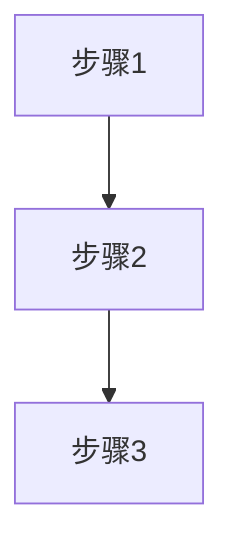

# 章节输出模板

```markdown
# 1. [章节名称]

## 1.1 概述
[一句话总结本章核心内容，说明该操作系统子系统的作用]

## 1.2 核心原理

### 1.2.1 [子主题名称]

#### 操作系统原理
[操作系统如何实现、为什么这样设计、核心思想]

#### 内核数据结构
[关键数据结构、字段说明、组织方式]

```c
// 内核数据结构示例（可选）
struct example {
    int field1;    // 字段说明
    void *field2;  // 字段说明
};
```

#### 处理流程
[算法流程、状态转换、关键步骤]



**流程说明**：

| 步骤 | 操作 | 说明 |
|------|------|------|
| 1 | ... | ... |

#### 系统调用接口
[相关系统调用、参数、返回值]

| 系统调用 | 参数 | 返回值 | 说明 |
|----------|------|--------|------|
| syscall() | ... | ... | ... |

#### 内核参数
[/proc接口、sysctl参数、可调选项]

| 参数路径 | 默认值 | 说明 |
|----------|--------|------|
| /proc/sys/... | ... | ... |

#### 性能特征
[性能特点、权衡取舍、适用场景]

#### 项目应用示例
[项目中如何使用该原理，仅保留关键代码片段]

```java
// 关键代码片段（不超过10行）
// 来源：[文件路径:行号]
```

## 1.3 调试方法
[相关命令、工具、排查思路]

```bash
# 查看相关状态
cat /proc/...

# 调试命令
strace -e trace=...
```

## 1.4 参考资料
- Linux内核源码：[路径]
- man手册：man 2 syscall
- 项目代码：[文件路径]
```
