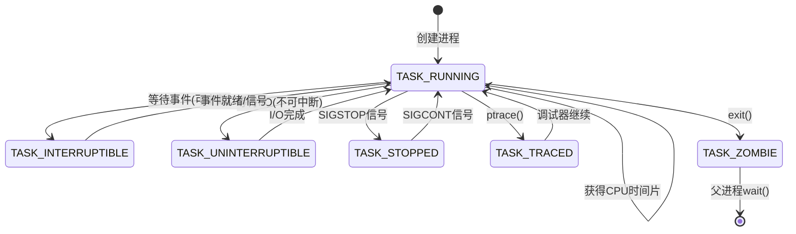

# 枚举值说明示例

## 基本格式

当文档中出现枚举值时，需按以下表格格式展开说明：

| 列名 | 说明 | 必填 |
|------|------|------|
| 状态/名称 | 枚举值名称 | ✅ |
| 值 | 枚举值对应的数值或常量 | ✅ |
| 说明 | 枚举值的含义描述 | ✅ |
| 触发条件 | 进入该状态/值的条件 | 可选 |

## 示例：Linux内核线程状态

**Linux内核线程状态详解**：

| 状态 | 值 | 说明 | 触发条件 |
|------|-----|------|---------|
| `TASK_RUNNING` | 0 | 运行态，正在运行或等待CPU调度 | 获得CPU时间片 |
| `TASK_INTERRUPTIBLE` | 1 | 可中断睡眠，等待事件，可被信号唤醒 | 等待I/O、锁、信号量 |
| `TASK_UNINTERRUPTIBLE` | 2 | 不可中断睡眠，只能被事件唤醒，不响应信号 | 等待磁盘I/O完成 |
| `TASK_ZOMBIE` | 4 | 僵尸态，进程已终止但父进程未回收 | 进程exit()后 |
| `TASK_STOPPED` | 8 | 停止态，被信号暂停 | SIGSTOP、SIGTSTP信号 |
| `TASK_TRACED` | 16 | 跟踪态，被调试器跟踪 | ptrace()系统调用 |

**状态转换关系**：

**Java线程状态与Linux状态映射**：

| Java状态 | Linux状态 | 说明 |
|---------|----------|------|
| RUNNABLE | TASK_RUNNING | 可运行状态 |
| BLOCKED | TASK_INTERRUPTIBLE | 等待monitor锁 |
| WAITING | TASK_INTERRUPTIBLE | 无限等待 |
| TIMED_WAITING | TASK_INTERRUPTIBLE | 计时等待 |
| TERMINATED | TASK_ZOMBIE | 终止状态 |

## 补充内容要求

1. **状态转换图**：使用Mermaid `stateDiagram-v2` 展示状态之间的转换关系
2. **映射关系表**：如果存在不同系统/语言之间的状态映射，需补充映射表
3. **关键概念**：对特殊术语进行简要解释
