# RocketMQ 技术架构分析
## 1. 系统整体架构设计
RocketMQ 是一个分布式消息和流处理平台，具有低延迟、高性能、高可靠性、万亿级容量和灵活的可扩展性。其整体架构设计采用了分层架构，主要包含以下四个核心组件：

### 1.1 核心组件
| 组件 | 功能描述 | 部署特性 |
| --- | --- | --- |
| Producer | 消息发布角色，支持分布式集群部署 | 完全无状态，可水平扩展 |
| Consumer | 消息消费角色，支持分布式集群部署 | 支持推(push)、拉(pull)两种消费模式 |
| NameServer | Topic路由注册中心，类似服务发现 | 几乎无状态，节点间无信息同步 |
| BrokerServer | 消息存储、投递和查询，高可用保证 | 支持Master-Slave架构 |


### 1.2 架构图
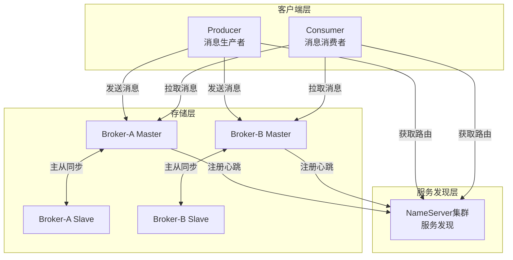
```mermaid
flowchart TD
    subgraph 客户端层
        Producer["Producer<br/>消息生产者"]
        Consumer["Consumer<br/>消息消费者"]
    end

    subgraph 服务发现层
        NameServers["NameServer集群<br/>服务发现"]
    end

    subgraph 存储层
        BrokerA["Broker-A Master"]
        BrokerAS["Broker-A Slave"]
        BrokerB["Broker-B Master"]
        BrokerBS["Broker-B Slave"]
    end

    Producer -->|获取路由| NameServers
    Producer -->|发送消息| BrokerA
    Producer -->|发送消息| BrokerB

    Consumer -->|获取路由| NameServers
    Consumer -->|拉取消息| BrokerA
    Consumer -->|拉取消息| BrokerB

    BrokerA -->|注册心跳| NameServers
    BrokerB -->|注册心跳| NameServers
    BrokerA <-->|主从同步| BrokerAS
    BrokerB <-->|主从同步| BrokerBS
```

## 2. 核心技术栈选型
RocketMQ 采用了以下核心技术栈：

| 技术/组件 | 用途 | 版本要求 | 选型理由 |
| --- | --- | --- | --- |
| Java | 主要开发语言 | JDK 8+ | 跨平台、生态成熟、性能稳定 |
| Netty | 网络通信框架 | 4.x | 高性能、异步非阻塞、事件驱动 |
| Fastjson | JSON序列化 | 1.x | 高性能、功能丰富 |
| ByteBuffer | 内存缓冲区 | JDK内置 | 高效的字节操作 |
| MappedFile | 内存映射文件 | 自定义实现 | 高性能文件操作 |
| ZooKeeper | 可选，用于Controller | 3.5+ | 分布式协调服务 |
| DLedger | 一致性协议实现 | 内置 | 基于Raft协议的领导者选举 |


## 3. 模块划分及交互关系
### 3.1 模块划分
RocketMQ 项目采用了清晰的模块化设计，主要包含以下核心模块：

| 模块 | 主要职责 | 文件位置 | 核心类 |
| --- | --- | --- | --- |
| acl | 访问控制列表 | acl/ | AccessValidator.java |
| broker | 消息存储与投递 | broker/ | BrokerStartup.java, BrokerController.java |
| client | 客户端API | client/ | DefaultMQProducer.java, DefaultMQConsumer.java |
| common | 公共组件 | common/ | MixAll.java, TopicConfig.java |
| filter | 消息过滤 | filter/ | SqlFilter.java |
| namesrv | 服务发现与路由 | namesrv/ | NamesrvStartup.java, RouteInfoManager.java |
| proxy | 代理服务 | proxy/ | ProxyStartup.java |
| remoting | 远程通信 | remoting/ | NettyRemotingServer.java |
| store | 消息存储 | store/ | CommitLog.java, ConsumeQueue.java |


### 3.2 模块交互关系
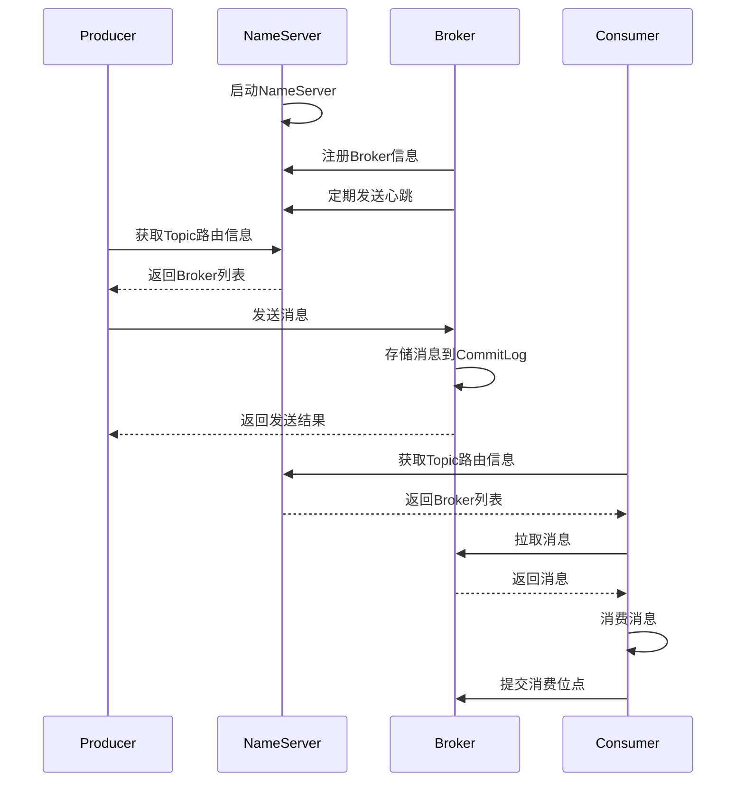
```mermaid
sequenceDiagram
    participant P as Producer
    participant N as NameServer
    participant B as Broker
    participant C as Consumer

    %% 启动流程
    N->>N: 启动NameServer
    B->>N: 注册Broker信息
    B->>N: 定期发送心跳

    %% 消息发送流程
    P->>N: 获取Topic路由信息
    N-->>P: 返回Broker列表
    P->>B: 发送消息
    B->>B: 存储消息到CommitLog
    B-->>P: 返回发送结果

    %% 消息消费流程
    C->>N: 获取Topic路由信息
    N-->>C: 返回Broker列表
    C->>B: 拉取消息
    B-->>C: 返回消息
    C->>C: 消费消息
    C->>B: 提交消费位点
```

## 4. 核心概念与业务领域模型
### 4.1 核心概念
#### 4.1.1 基本概念

| 概念 | 说明 | 详细描述 | 关键属性（源码字段） |
| --- | --- | --- | --- |
| **Topic** | 消息主题 | 消息的第一级分类逻辑集合，Producer发送消息时指定Topic，Consumer订阅Topic消费消息 | `topicName`(名称)、`readQueueNums`(读队列数)、`writeQueueNums`(写队列数)、`perm`(权限) |
| **Queue** | 消息队列 | Topic的分区，消息存储和消费的实际单元，Queue数量决定并发度和负载均衡粒度 | `topic`(所属Topic)、`brokerName`(Broker名称)、`queueId`(队列ID) |
| **Message** | 消息 | 消息传递的基本单元，包含消息体和元数据，通过Topic分类、Tag二级分类 | `topic`(主题)、`body`(消息体)、`properties`(属性Map，含tags/keys)、`transactionId`(事务ID) |
| **Producer** | 消息生产者 | 负责发送消息的应用，无状态可水平扩展，支持同步/异步/单向发送 | `producerGroup`(生产者组)、`sendMsgTimeout`(发送超时)、`retryTimesWhenSendFailed`(重试次数) |
| **Consumer** | 消息消费者 | 负责接收消息的应用，支持Push/Pull两种消费模式 | `consumerGroup`(消费者组)、`messageModel`(消费模式：CLUSTERING/BROADCASTING) |
| **ConsumerGroup** | 消费者组 | 同一类Consumer的集合，组内消费者共同消费Topic消息，实现负载均衡 | 负载均衡、消费进度共享、订阅关系一致性 |
| **Broker** | 消息服务器 | 消息存储、投递和查询的核心组件，支持Master-Slave架构实现高可用 | `brokerName`(名称)、`brokerId`=0为Master、`brokerRole`(角色：SYNC_MASTER/ASYNC_MASTER/SLAVE) |
| **NameServer** | 路由注册中心 | 管理Broker路由信息，Producer和Consumer通过NameServer获取Topic路由 | 无状态、心跳检测、路由映射 |
| **Offset** | 消费位点 | 记录消费者的消费进度，表示消费者在队列中下一个要消费的位置 | 存储为 queueOffset 值 |


**偏移量相关术语说明**：

RocketMQ 中有多个与"偏移量/位点"相关的术语，它们指代不同的概念：

> **示例场景**：队列中有5条消息(Msg1~Msg5)，消费者已消费到Msg3，下次将从Msg4开始消费。

| 术语 | 英文 | 含义 | 所属层级 | 使用场景 | 示例值 |
| --- | --- | --- | --- | --- | --- |
| **消息偏移量** | Message Offset | 消息在队列中的逻辑序号，从0开始递增，也称为 Queue Offset | Broker端 | 消息定位、消费进度记录 | Msg3的消息偏移量为2 |
| **消费位点** | Consumer Offset | 消费者下次要消费的位置，等于下一条待消费消息的 Queue Offset | 消费者端 | 消费进度管理、断点续传、消息回溯 | 已消费到Msg3，消费位点=3（下次从Msg4开始） |
| **最小偏移量** | MinOffset | 队列中最早消息的偏移量 | Broker端 | 消息过期清理边界、堆积计算 | MinOffset=0（Msg1的位置） |
| **最大偏移量** | MaxOffset | 队列中最新消息的偏移量 | Broker端 | 堆积量计算：MaxOffset - Consumer Offset | MaxOffset=4（Msg5的位置） |
| **CommitLog偏移量** | CommitLog Offset | 消息在CommitLog文件中的物理字节位置 | Broker端 | 消息实体读取、物理存储定位 | Msg3在CommitLog中的物理位置为200字节 |

**消息偏移量（Queue Offset）使用场景详解**：

| 场景 | 说明 |
| --- | --- |
| **消息定位** | 通过 Queue Offset 快速定位消息在 ConsumeQueue 中的条目位置 |
| **消费进度管理** | Consumer Offset 的值等于下一个待消费消息的 Queue Offset，记录消费者消费到哪条消息 |
| **消息读取** | 根据 Queue Offset 查找 ConsumeQueue 条目，获取 CommitLog Offset 后读取消息实体 |
| **消息回溯** | 重置消费位点本质是修改 Consumer Offset，实现消息重新消费 |
| **堆积监控** | `MaxOffset - Consumer Offset` 计算消息堆积量 |

```plain
┌─────────────────────────────────────────────────────────────────────────────┐
│                           偏移量关系图                                        │
├─────────────────────────────────────────────────────────────────────────────┤
│  示例：队列有5条消息(Msg1~Msg5)，消费者已消费到Msg3                            │
├─────────────────────────────────────────────────────────────────────────────┤
│                                                                             │
│  CommitLog（物理存储）                                                       │
│  ┌─────────┬─────────┬─────────┬─────────┬─────────┐                       │
│  │  Msg1   │  Msg2   │  Msg3   │  Msg4   │  Msg5   │  ...                  │
│  │ phyOff=0│phyOff=100│phyOff=200│phyOff=300│phyOff=400│                    │
│  └─────────┴─────────┴─────────┴─────────┴─────────┘                       │
│       ↑                                           ↑                         │
│       │                                           │                         │
│  CommitLog Offset=0                         CommitLog Offset=400            │
│  (Msg1物理位置)                              (Msg5物理位置)                  │
│                                                                             │
│  ConsumeQueue（逻辑索引）                                                    │
│  ┌─────────┬─────────┬─────────┬─────────┬─────────┐                       │
│  │ Entry1  │ Entry2  │ Entry3  │ Entry4  │ Entry5  │  ...                  │
│  │ qOff=0  │ qOff=1  │ qOff=2  │ qOff=3  │ qOff=4  │                       │
│  │phyOff=0 │phyOff=100│phyOff=200│phyOff=300│phyOff=400│                    │
│  └─────────┴─────────┴─────────┴─────────┴─────────┘                       │
│       ↑                  ↑            ↑           ↑                         │
│       │                  │            │           │                         │
│  MinOffset=0        Queue Offset=2  消费位点=3  MaxOffset=4                  │
│  (最早消息)          (Msg3位置)     (下次消费)   (最新消息)                   │
│                                                                             │
│  关系：消费位点 = 下一条待消费消息的队列偏移量 = 3                             │
│                                                                             │
└─────────────────────────────────────────────────────────────────────────────┘
```

**关系总结**：`消费位点 = 下一条待消费消息的队列偏移量`


#### 4.1.2 队列类型

RocketMQ 有 **3 种业务队列类型**，用于不同的业务场景：

| 队列类型 | Topic格式 | 用途 | 特点 |
| --- | --- | --- | --- |
| **普通队列** | 用户定义的Topic | 业务消息存储 | 用户创建的业务Topic |
| **重试队列** | `%RETRY%` + ConsumerGroup | 消费失败消息重试 | 自动创建，使用延迟消息机制 |
| **死信队列** | `%DLQ%` + ConsumerGroup | 存储无法消费的消息 | 永久存储，需人工处理 |

此外，RocketMQ 还有一个**系统内部队列**：

| 队列类型 | Topic格式 | 用途 | 特点 |
| --- | --- | --- | --- |
| **延迟队列** | `SCHEDULE_TOPIC_XXXX` | 延迟消息中转存储 | 系统Topic，18个队列对应延迟级别，用户不可直接发送 |

> **注意**：重试队列的延迟投递功能，底层依赖 `SCHEDULE_TOPIC_XXXX` 实现。两者是协作关系，而非互斥关系。


#### 4.1.3 队列流转关系

```plain
┌─────────────────────────────────────────────────────────────────────────────┐
│                     场景一：普通延迟消息流转                                   │
├─────────────────────────────────────────────────────────────────────────────┤
│                                                                             │
│  Producer                          SCHEDULE_TOPIC_XXXX         Consumer     │
│  ┌──────────┐                      ┌──────────────┐          ┌──────────┐  │
│  │发送延迟  │   Topic替换          │  延迟队列    │  到期    │ 订阅     │  │
│  │消息      │ ──────────────────► │              │ ───────► │ OrderTopic│  │
│  │delayLevel│                      │  按级别分队列 │ 恢复Topic│          │  │
│  └──────────┘                      └──────────────┘          └──────────┘  │
│                                                                             │
│  流程：业务Topic → SCHEDULE_TOPIC_XXXX → 到期恢复业务Topic → Consumer消费   │
│                                                                             │
└─────────────────────────────────────────────────────────────────────────────┘

┌─────────────────────────────────────────────────────────────────────────────┐
│                     场景二：消费失败重试流转                                   │
├─────────────────────────────────────────────────────────────────────────────┤
│                                                                             │
│  普通队列              SCHEDULE_TOPIC_XXXX        重试队列         死信队列  │
│  ┌──────────┐          ┌──────────────┐        ┌──────────────┐ ┌────────┐ │
│  │OrderTopic│ 消费失败 │  延迟队列    │        │%RETRY%+Group │ │%DLQ%+  │ │
│  │          │ ───────► │              │ ──────►│              │ │Group   │ │
│  └──────────┘          └──────────────┘        └──────────────┘ └────────┘ │
│       ▲                      ▲                       │            ▲        │
│       │                      │                       │ 重试超限   │        │
│       │                      │                       └────────────┘        │
│       │                      │                                             │
│       │        ┌─────────────┴─────────────┐                               │
│       │        │ Consumer 订阅重试队列      │                               │
│       │        │ 消费成功 → 流程结束        │                               │
│       │        │ 消费失败 → 再次进入延迟队列 │                               │
│       └────────┴───────────────────────────┘                               │
│                                                                             │
│  流程：消费失败 → SCHEDULE_TOPIC_XXXX → %RETRY%+Group → Consumer重新消费   │
│        重试超限（默认16次）→ %DLQ%+Group（死信队列）                        │
│                                                                             │
└─────────────────────────────────────────────────────────────────────────────┘

┌─────────────────────────────────────────────────────────────────────────────┐
│                           两种场景对比                                       │
├─────────────────────────────────────────────────────────────────────────────┤
│  对比项            │ 普通延迟消息               │ 重试消息                    │
├───────────────────┼───────────────────────────┼─────────────────────────────┤
│  触发方式         │ Producer主动设置delayLevel │ Consumer消费失败自动触发    │
│  延迟后目标       │ 原始业务Topic              │ 重试队列 %RETRY%+Group      │
│  Consumer订阅     │ 业务Topic                  │ 业务Topic + 重试队列        │
│  延迟级别         │ 1-18均可                   │ 固定从级别4开始递增         │
│  是否进入死信队列  │ 否                         │ 重试超限后进入              │
└─────────────────────────────────────────────────────────────────────────────┘
```

**各队列类型详细说明**：

| 队列类型 | 示例 | 产生场景 | 消费方式 |
| --- | --- | --- | --- |
| **普通队列** | `OrderTopic` | Producer发送消息 | Consumer正常消费 |
| **重试队列** | `%RETRY%OrderConsumerGroup` | 消费失败，重试次数 < 最大值 | 延迟后自动重新投递 |
| **死信队列** | `%DLQ%OrderConsumerGroup` | 重试次数超过最大值 | 需人工处理或专门消费者 |


> **详细实现参见**：
> - 延迟消息实现原理 → [5.9 延迟消息](#59-延迟消息)
> - 消费失败重试机制 → [5.3.8 消费失败处理流程](#538-消费失败处理流程)
> - 死信队列机制 → [5.11 死信队列](#511-死信队列)


### 4.2 业务领域模型
#### 4.2.1 Message (消息)

##### 消息基本结构

**Message 基础属性** ([Message.java](file:///d:/github/rocketmq/common/src/main/java/org/apache/rocketmq/common/message/Message.java))：

```java
public class Message implements Serializable {
    private String topic;                      // 消息主题
    private int flag;                          // 消息标志
    private Map<String, String> properties;    // 消息属性（tags、keys等存储于此）
    private byte[] body;                       // 消息体
    private String transactionId;              // 事务ID
}
```

**Message 属性说明**：

| 属性 | 类型 | 说明 |
| --- | --- | --- |
| `topic` | String | 消息主题，消息的第一级分类 |
| `flag` | int | 消息标志，用于RPC通信 |
| `properties` | Map | 扩展属性，存储tags、keys等 |
| `body` | byte[] | 消息体，实际业务数据 |
| `transactionId` | String | 事务消息ID |


**tags 和 keys 存储方式**：

`tags` 和 `keys` 不是 Message 的直接字段，而是存储在 `properties` 中：

```java
// 设置 tags（存储到 properties）
public void setTags(String tags) {
    this.putProperty(MessageConst.PROPERTY_TAGS, tags);
}

// 设置 keys（存储到 properties）
public void setKeys(String keys) {
    this.putProperty(MessageConst.PROPERTY_KEYS, keys);
}
```

##### 消息标识与属性详解

RocketMQ 消息有多种标识和属性，容易混淆，下面详细说明各概念的区别。

**标识概念总览**：

| 概念 | 设置方式 | 存储位置 | 主要用途 | 索引 |
| --- | --- | --- | --- | --- |
| **Tags** | `setTags()` | properties | 消息过滤 | ✅ ConsumeQueue |
| **Keys** | `setKeys()` | properties | 消息查询、追踪 | ✅ IndexFile |
| **MsgId/UNIQ_KEY** | 系统自动 | properties | 唯一标识 | ✅ IndexFile |
| **Sharding Key** | `putUserProperty()` | properties | 顺序消息路由 | ❌ |
| **路由参数** | `send(msg, selector, arg)` | 不存储 | 队列选择 | ❌ |

---

**Tags（标签）**：

Tags 的核心用途是**消息过滤**，用于同一 Topic 下区分不同业务类型的消息：

```java
// 生产者设置 Tag
Message msg = new Message("TopicTest", "TagA", "OrderID123", body);

// 消费者按 Tag 订阅（支持多个 Tag，用 || 分隔）
consumer.subscribe("TopicTest", "TagA || TagB || TagC");
```

**Tags 特点**：
- 一个消息**只能有一个 Tag**
- Tag 存储在 `ConsumeQueue` 的 8 字节 hashcode 中，Broker 端高效过滤
- 适用于同一 Topic 下区分不同业务类型的消息

**典型场景**：
- 订单消息：`Tag_OrderCreate`、`Tag_OrderPay`、`Tag_OrderCancel`
- 用户消息：`Tag_UserRegister`、`Tag_UserLogin`

---

**Keys（业务 Key）**：

Keys 的核心用途是**消息查询与追踪**，不参与消费过滤：

```java
// 设置单个 Key
message.setKeys("OrderID123");

// 设置多个 Key（空格分隔）
message.setKeys("OrderID123 UserID456 ProductID789");

// 或使用集合
message.setKeys(Arrays.asList("OrderID123", "UserID456"));
```

**Keys 特点**：
- 一个消息可以有**多个 Key**，用空格分隔
- Broker 会基于 `IndexFile` 创建哈希索引
- 可通过 Topic + Key 在控制台精确查询消息

**Keys 使用场景**：

| 场景 | 说明 |
| --- | --- |
| **消息查询** | 通过 `topic + key` 在 IndexFile 中检索消息，运维排查问题 |
| **链路追踪** | 在 TraceBean 中记录，用于消息轨迹追踪 |
| **业务幂等** | 消费端通过 keys 判断消息是否已处理，实现去重 |
| **事务关联** | 事务消息场景下关联业务流水，便于回查定位 |

---

**MsgId / UNIQ_KEY（唯一消息标识）**：

MsgId 是系统自动生成的消息唯一标识，存储在 properties 中，键为 `UNIQ_KEY`：

```java
// 系统自动生成
String msgId = MessageClientIDSetter.createUniqID();
msg.setProperty(MessageConst.PROPERTY_UNIQ_CLIENT_MESSAGE_ID_KEYIDX, msgId);

// 格式：IP(4B) + PID(2B) + ClassLoader Hash(4B) + 时间差(4B) + 序列号(2B) = 16字节
// 示例：AC1100012A9F00000010000000000001
```

**MsgId 使用场景**：

```java
SendResult sendResult = producer.send(msg);
String msgId = sendResult.getMsgId();

// 1. 精确查询（通过 MessageId 直接定位消息）
MessageExt msgFound = producer.viewMessage(msgId);

// 2. 消息追踪
log.info("发送成功, msgId={}", msgId);
```

> **MsgId 结构详解**：参见 [消息标识详解 - MsgId 结构解析](#518-消息标识详解)

---

**Sharding Key（分片键）**：

Sharding Key 用于**顺序消息队列路由**，相同 Sharding Key 的消息会路由到同一队列：

```java
// RocketMQ 5.0 新增
msg.putUserProperty(MessageConst.PROPERTY_SHARDING_KEY, "ORDER_12345");
```

**Sharding Key 特点**：
- 存储在 properties 中，键为 `__SHARDINGKEY`
- 用于顺序消息场景，保证相同 Key 的消息顺序
- 通过 MurmurHash 计算队列索引

---

**顺序消息路由参数**：

传统顺序消息使用路由参数进行队列选择：

```java
// send() 方法的第三个参数
producer.send(msg, new SelectMessageQueueByHash(), "ORDER_12345");

// 队列选择逻辑
public MessageQueue select(List<MessageQueue> mqs, Message msg, Object arg) {
    int value = arg.hashCode() % mqs.size();
    return mqs.get(value);
}
```

**路由参数特点**：
- 不存储在消息中，仅运行时计算
- 相同参数值 → 相同队列
- 用于 RocketMQ 4.x 的顺序消息实现

---

**各标识对比**：

| 特性 | Tags | Keys | MsgId/UNIQ_KEY | Sharding Key | 路由参数 |
| --- | --- | --- | --- | --- | --- |
| **主要用途** | 消息过滤 | 消息查询 | 唯一标识 | 顺序消息路由 | 队列选择 |
| **设置方** | 用户设置 | 用户设置 | 系统自动 | 用户设置 | 用户传入 |
| **数量限制** | 只能 1 个 | 可多个 | 只能 1 个 | 只能 1 个 | 1 个 |
| **存储位置** | ConsumeQueue | IndexFile | IndexFile | properties | 不存储 |
| **可重复** | 多消息相同 | 多消息相同 | 全局唯一 | 多消息相同 | - |

**使用场景推荐**：

| 场景 | 推荐使用 |
| --- | --- |
| 消息过滤 | **Tags** |
| 消息查询/追踪 | **Keys**（业务标识） |
| 消息去重/幂等 | **Keys**（业务唯一标识） |
| 精确定位单条消息 | **MsgId** |
| 顺序消息（RocketMQ 4.x） | **路由参数** + `SelectMessageQueueByHash` |
| 顺序消息（RocketMQ 5.x） | **Sharding Key** |

---

**长度与格式限制**：

| 限制项 | Tags | Keys |
| --- | --- | --- |
| **长度限制** | 无明确限制，受 properties 总大小约束（16KB） | 同左 |
| **禁止字符** | `\|`（管道符）、控制字符 | 控制字符 |
| **内容限制** | 不能是纯空白字符串 | 不能是纯空白字符串 |

**整体消息大小约束**：

```java
// 消息体最大 4MB
private int maxMessageSize = 4 * 1024 * 1024;

// 用户属性最大 16KB（tags/keys/shardingKey 属于 properties）
private int maxUserPropertySize = 16 * 1024;

// 用户属性数量最大 128 个
private int userPropertyMaxNum = 128;
```

##### 消息扩展属性

**MessageExt 扩展属性** ([MessageExt.java](file:///d:/github/rocketmq/common/src/main/java/org/apache/rocketmq/common/message/MessageExt.java))：

`MessageExt` 继承自 `Message`，增加了消息在传输和存储过程中的元数据：

```java
public class MessageExt extends Message {
    private String brokerName;              // Broker名称
    private int queueId;                    // 队列ID
    private int storeSize;                  // 存储大小（字节）
    private long queueOffset;               // 队列偏移量（Queue Offset）
    private int sysFlag;                    // 系统标志
    private long bornTimestamp;             // 消息生成时间戳
    private SocketAddress bornHost;         // 消息来源地址
    private long storeTimestamp;            // 存储时间戳
    private SocketAddress storeHost;        // 存储Broker地址
    private String msgId;                   // 消息唯一ID（客户端生成）
    private long commitLogOffset;           // CommitLog物理偏移量
    private int bodyCRC;                    // 消息体CRC校验码
    private int reconsumeTimes;             // 重试消费次数
    private long preparedTransactionOffset; // 事务消息预处理偏移量
}
```

**MessageExt 属性分类**：

| 分类 | 属性 | 说明 |
| --- | --- | --- |
| **位置信息** | brokerName, queueId, queueOffset, commitLogOffset | 消息在Broker中的位置 |
| **时间信息** | bornTimestamp, storeTimestamp | 消息生命周期时间点 |
| **来源信息** | bornHost, storeHost | 消息来源和存储的网络地址 |
| **存储信息** | storeSize, bodyCRC | 消息存储大小和校验 |
| **消费信息** | reconsumeTimes | 消息重试次数 |
| **事务信息** | preparedTransactionOffset | 事务消息相关 |

##### 系统标志位

**sysFlag 系统标志位** ([MessageSysFlag.java](file:///d:/github/rocketmq/common/src/main/java/org/apache/rocketmq/common/sysflag/MessageSysFlag.java))：

| 标志位 | 值 | 含义 |
| --- | --- | --- |
| `COMPRESSED_FLAG` | 0x1 | 消息体已压缩 |
| `MULTI_TAGS_FLAG` | 0x2 | 多标签消息 |
| `TRANSACTION_NOT_TYPE` | 0 | 非事务消息 |
| `TRANSACTION_PREPARED_TYPE` | 0x4 | 事务预处理消息 |
| `TRANSACTION_COMMIT_TYPE` | 0x8 | 事务提交消息 |
| `TRANSACTION_ROLLBACK_TYPE` | 0xC | 事务回滚消息 |
| `BORNHOST_V6_FLAG` | 0x10 | bornHost是IPv6地址 |
| `STOREHOSTADDRESS_V6_FLAG` | 0x20 | storeHost是IPv6地址 |


**使用示例**：

```java
consumer.registerMessageListener((msgs, context) -> {
    for (MessageExt msg : msgs) {
        // 获取消息元数据
        String topic = msg.getTopic();
        String brokerName = msg.getBrokerName();
        int queueId = msg.getQueueId();
        long queueOffset = msg.getQueueOffset();
        long commitLogOffset = msg.getCommitLogOffset();
        int reconsumeTimes = msg.getReconsumeTimes();
        
        // 获取时间信息
        long bornTime = msg.getBornTimestamp();
        long storeTime = msg.getStoreTimestamp();
        
        // 获取来源信息
        String bornHost = msg.getBornHostString();
        String storeHost = msg.getStoreHostString();
        
        log.info("消息: topic={}, queue={}:{}, offset={}, retry={}", 
            topic, brokerName, queueId, queueOffset, reconsumeTimes);
    }
    return ConsumeConcurrentlyStatus.CONSUME_SUCCESS;
});
```

#### 4.2.2 Topic (主题)
```java
// 核心属性
private String topicName;      // 主题名称
private int readQueueNums;     // 读队列数
private int writeQueueNums;    // 写队列数
private int perm;              // 权限
private int topicSysFlag;      // 系统标志
```

#### 4.2.3 Broker (消息服务器)
```java
// 核心属性
private String brokerName;     // Broker名称
private long brokerId;         // Broker ID
private String clusterName;    // 集群名称
private String brokerAddr;     // Broker地址
private BrokerRole brokerRole; // Broker角色
private FlushDiskType flushDiskType; // 刷盘方式
```

#### 4.2.4 MessageQueue 与 ProcessQueue
`MessageQueue` 是队列的逻辑标识（用于定位具体队列），`ProcessQueue` 是消费者端的消息处理快照：

```plain
┌─────────────────────────────────────────────────────────────────────────────┐
│                              消息流转过程                                    │
├─────────────────────────────────────────────────────────────────────────────┤
│                                                                             │
│  Broker端                           消费者端                                │
│  ┌──────────────────┐              ┌──────────────────────────────────────┐ │
│  │   MessageQueue   │              │           ProcessQueue               │ │
│  │  (逻辑队列标识)    │   Pull      │         (消息处理快照)                 │ │
│  │                  │  ───────►   │                                      │ │
│  │ topic: Order     │              │  msgTreeMap: {offset → MessageExt}   │ │
│  │ brokerName: A    │              │  msgCount: 消息数量                    │ │
│  │ queueId: 0       │              │  msgSize: 消息总大小                   │ │
│  └──────────────────┘              │  queueOffsetMax: 最大偏移量           │ │
│                                    │  dropped: 是否已丢弃                  │ │
│                                    │  locked: 是否已锁定(顺序消费)          │ │
│                                    └──────────────────────────────────────┘ │
└─────────────────────────────────────────────────────────────────────────────┘
```

**核心属性对比**：

| 属性 | MessageQueue | ProcessQueue |
| --- | --- | --- |
| 所在位置 | 消费者端（标识Broker端队列） | 消费者端 |
| 本质 | 队列的逻辑标识（不可变） | 队列的消费状态快照（动态变化） |
| 核心属性 | topic, brokerName, queueId | msgTreeMap, msgCount, dropped, locked |
| 生命周期 | Topic创建时存在 | 消费者订阅队列时创建，取消订阅时销毁 |
| 序列化 | 可序列化，用于网络传输 | 不可序列化，仅内存中存在 |


**MessageQueue 核心属性**：

```java
public class MessageQueue implements Comparable<MessageQueue>, Serializable {
    private String topic;        // 主题名称
    private String brokerName;   // Broker名称
    private int queueId;         // 队列ID
}
```

**ProcessQueue 核心属性**：

```java
public class ProcessQueue {
    private final TreeMap<Long, MessageExt> msgTreeMap = new TreeMap<>();  // 消息存储
    private final TreeMap<Long, MessageExt> consumingMsgOrderlyTreeMap = new TreeMap<>();  // 顺序消费中
    private final AtomicLong msgCount = new AtomicLong();    // 消息数量
    private final AtomicLong msgSize = new AtomicLong();     // 消息总大小
    private volatile long queueOffsetMax = 0L;               // 最大偏移量
    private volatile boolean dropped = false;                // 是否已丢弃
    private volatile boolean locked = false;                 // 是否已锁定
    private volatile boolean consuming = false;              // 是否正在消费
    private final Lock consumeLock = new ReentrantLock();    // 消费锁
}
```

**两个TreeMap的作用**：

| Map | 含义 | 使用场景 |
| --- | --- | --- |
| `msgTreeMap` | 待消费消息 | 所有消费模式 |
| `consumingMsgOrderlyTreeMap` | 正在消费的消息 | 仅顺序消费 |


**顺序消费与并发消费的加锁差异**：

| 锁 | 顺序消费 | 并发消费 | 原因 |
| --- | --- | --- | --- |
| 队列锁 (objLock) | ✅ 需要 | ❌ 不需要 | 并发消费允许多线程同时消费同一队列 |
| Broker锁状态 (locked) | ✅ 需要 | ❌ 不需要 | 并发消费不需要独占队列 |
| 消费锁 (consumeLock) | ✅ 需要 | ❌ 不需要 | 并发消费失败直接发回Broker重试 |

> **详细的顺序消费三重锁机制、加锁流程参见 [5.5.4 顺序消费与并发消费](#554-顺序消费与并发消费)。**

**两者关系**：

```java
// 一个 MessageQueue 对应一个 ProcessQueue
ConcurrentMap<MessageQueue, ProcessQueue> processQueueTable;

class PullRequest {
    private MessageQueue messageQueue;      // 目标队列标识
    private ProcessQueue processQueue;      // 该队列的消费快照
    private long nextOffset;                // 下次拉取的偏移量
}
```

**ProcessQueue 核心方法**：

| 方法 | 功能 | 代码实现要点 | 使用场景 |
| --- | --- | --- | --- |
| `putMessage()` | 将拉取的消息存入msgTreeMap | `msgTreeMap.put(msg.getQueueOffset(), msg)` | PullMessage后调用 |
| `takeMessages()` | 批量取出消息准备消费 | `msgTreeMap.pollFirstEntry()` + `consumingMsgOrderlyTreeMap.put()` | 顺序消费前调用 |
| `removeMessage()` | 移除已消费消息，返回新偏移量 | `msgTreeMap.remove(msg.getQueueOffset())` | 并发消费成功/失败后调用 |
| `makeMessageToConsumeAgain()` | 消息放回队列头部 | 从consumingMsgOrderlyTreeMap移除，放回msgTreeMap | 顺序消费失败重试 |
| `commit()` | 提交消费进度，返回新位点 | `consumingMsgOrderlyTreeMap.clear()` + 返回`lastKey() + 1` | 顺序消费成功 |
| `rollback()` | 回滚消息到msgTreeMap | 将consumingMsgOrderlyTreeMap消息放回msgTreeMap | 顺序消费ROLLBACK状态 |


**Offset 取值案例**：

假设 Broker 端队列当前 offset 范围为 1256800-1256899，消费者分批拉取和消费：

```plain
初始状态:
  Broker队列: [1256800, 1256801, 1256802, ..., 1256899]
  ProcessQueue.msgTreeMap: {}
  ProcessQueue.queueOffsetMax: 0

第1步: 拉取消息 [1256800, 1256801, 1256802] 调用 putMessage()
  msgTreeMap: {1256800→msg, 1256801→msg, 1256802→msg}
  queueOffsetMax: 1256802

第2步: 顺序消费 takeMessages(2) 取出 [1256800, 1256801]
  msgTreeMap: {1256802→msg}
  consumingMsgOrderlyTreeMap: {1256800→msg, 1256801→msg}

第3步: 消费成功 commit()
  consumingMsgOrderlyTreeMap.lastKey() = 1256801
  返回 offset = 1256801 + 1 = 1256802  ← 新的消费位点

第4步: 拉取消息 [1256803, 1256804, 1256805] 调用 putMessage()
  msgTreeMap: {1256802→msg, 1256803→msg, 1256804→msg, 1256805→msg}
  queueOffsetMax: 1256805

第5步: 顺序消费 takeMessages(3) 取出 [1256802, 1256803, 1256804]
  msgTreeMap: {1256805→msg}
  consumingMsgOrderlyTreeMap: {1256802→msg, 1256803→msg, 1256804→msg}

第6步: 消费失败 makeMessageToConsumeAgain([1256803])
  consumingMsgOrderlyTreeMap: {1256802→msg, 1256804→msg}
  msgTreeMap: {1256803→msg, 1256805→msg}  ← 1256803 放回头部等待重试
```

**关键 offset 变量说明**：

| 变量 | 来源 | 说明 |
| --- | --- | --- |
| `msg.getQueueOffset()` | Broker分配 | 消息在队列中的逻辑序号，作为 TreeMap 的 key |
| `queueOffsetMax` | `putMessage()` 更新 | 当前 ProcessQueue 中消息的最大 offset |
| `commit()` 返回值 | `lastKey() + 1` | 顺序消费成功后，下一个待消费的 offset |
| `removeMessage()` 返回值 | `msgTreeMap.firstKey()` | 并发消费后，队列中剩余最小 offset |


**ProcessQueue 在消息消费中的使用流程**：

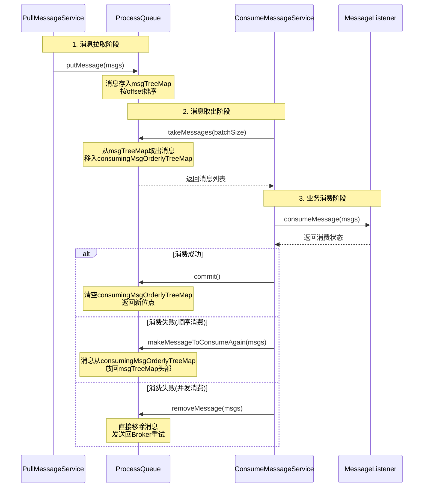
```mermaid
sequenceDiagram
    participant P as PullMessageService
    participant PQ as ProcessQueue
    participant C as ConsumeMessageService
    participant L as MessageListener

    Note over P,PQ: 1. 消息拉取阶段
    P->>PQ: putMessage(msgs)
    Note over PQ: 消息存入msgTreeMap<br/>按offset排序

    Note over PQ,C: 2. 消息取出阶段
    C->>PQ: takeMessages(batchSize)
    Note over PQ: 从msgTreeMap取出消息<br/>移入consumingMsgOrderlyTreeMap
    PQ-->>C: 返回消息列表

    Note over C,L: 3. 业务消费阶段
    C->>L: consumeMessage(msgs)
    L-->>C: 返回消费状态

    alt 消费成功
        C->>PQ: commit()
        Note over PQ: 清空consumingMsgOrderlyTreeMap<br/>返回新位点
    else 消费失败(顺序消费)
        C->>PQ: makeMessageToConsumeAgain(msgs)
        Note over PQ: 消息从consumingMsgOrderlyTreeMap<br/>放回msgTreeMap头部
    else 消费失败(并发消费)
        C->>PQ: removeMessage(msgs)
        Note over PQ: 直接移除消息<br/>发送回Broker重试
    end
```

**两种消费模式的 ProcessQueue 使用对比**：

```plain
┌─────────────────────────────────────────────────────────────────────────────┐
│                        并发消费模式                                          │
├─────────────────────────────────────────────────────────────────────────────┤
│  msgTreeMap                                                                 │
│  ┌──────────────────────────────────────────────────────────────────────┐  │
│  │ offset:100 → msg1 │ offset:101 → msg2 │ offset:102 → msg3 │ ...     │  │
│  └──────────────────────────────────────────────────────────────────────┘  │
│         │                                                                   │
│         │ 直接取出消费（不经过consumingMsgOrderlyTreeMap）                    │
│         ▼                                                                   │
│  消费成功 → removeMessage() 移除                                            │
│  消费失败 → removeMessage() + 发送回Broker重试                              │
└─────────────────────────────────────────────────────────────────────────────┘

┌─────────────────────────────────────────────────────────────────────────────┐
│                        顺序消费模式                                          │
├─────────────────────────────────────────────────────────────────────────────┤
│  msgTreeMap (等待消费)              consumingMsgOrderlyTreeMap (正在消费)   │
│  ┌───────────────────────────┐      ┌────────────────────────────────────┐ │
│  │ 102 → msg3 │ 103 → ...    │      │ 100 → msg1 │ 101 → msg2            │ │
│  └───────────────────────────┘      └────────────────────────────────────┘ │
│         │                                      │                            │
│         │ takeMessages()                       │ commit() / rollback()      │
│         ▼                                      ▼                            │
│  消息移入consumingMsgOrderlyTreeMap    成功:清空 / 失败:放回msgTreeMap       │
└─────────────────────────────────────────────────────────────────────────────┘
```

**顺序消费 ProcessQueue 使用代码** ([ConsumeMessageOrderlyService.java](file:///d:/github/rocketmq/client/src/main/java/org/apache/rocketmq/client/impl/consumer/ConsumeMessageOrderlyService.java))：

```java
// 1. 取消息：从msgTreeMap移入consumingMsgOrderlyTreeMap
List<MessageExt> msgs = this.processQueue.takeMessages(consumeBatchSize);

// 2. processConsumeResult() 处理消费结果
// 根据 context.isAutoCommit() 有不同的处理逻辑

// === autoCommit=true（默认） ===
case COMMIT:
case ROLLBACK:
    // COMMIT/ROLLBACK在autoCommit=true时视为SUCCESS
case SUCCESS:
    commitOffset = consumeRequest.getProcessQueue().commit();
    break;
case SUSPEND_CURRENT_QUEUE_A_MOMENT:
    if (checkReconsumeTimes(msgs)) {
        // 未超过最大重试次数，消息放回msgTreeMap
        consumeRequest.getProcessQueue().makeMessageToConsumeAgain(msgs);
        submitConsumeRequestLater(..., context.getSuspendCurrentQueueTimeMillis());
        continueConsume = false;
    } else {
        // 超过最大重试次数，已发送到Broker，提交位点
        commitOffset = consumeRequest.getProcessQueue().commit();
    }
    break;

// === autoCommit=false ===
case SUCCESS:
    // 仅统计，不提交位点
    break;
case COMMIT:
    commitOffset = consumeRequest.getProcessQueue().commit();
    break;
case ROLLBACK:
    consumeRequest.getProcessQueue().rollback();
    submitConsumeRequestLater(..., context.getSuspendCurrentQueueTimeMillis());
    continueConsume = false;
    break;
case SUSPEND_CURRENT_QUEUE_A_MOMENT:
    // 与autoCommit=true逻辑相同
    break;

// 3. 提交位点（commitOffset >= 0 时）
if (commitOffset >= 0 && !consumeRequest.getProcessQueue().isDropped()) {
    this.defaultMQPushConsumerImpl.getOffsetStore()
        .updateOffset(consumeRequest.getMessageQueue(), commitOffset, false);
}
```

**并发消费 ProcessQueue 使用代码** ([ConsumeMessageConcurrentlyService.java](file:///d:/github/rocketmq/client/src/main/java/org/apache/rocketmq/client/impl/consumer/ConsumeMessageConcurrentlyService.java))：

```java
// 1. 消息在PullMessageService拉取后已通过putMessage存入msgTreeMap
// ConsumeRequest构造时传入msgs列表

// 2. 执行消费监听器
status = listener.consumeMessage(Collections.unmodifiableList(msgs), context);

// 3. 处理消费结果 processConsumeResult()
int ackIndex = context.getAckIndex();  // 默认为 Integer.MAX_VALUE

switch (status) {
    case CONSUME_SUCCESS:
        // ackIndex 之前的消息视为成功
        // ackIndex 之后的消息（如果有）视为失败
        int ok = ackIndex + 1;
        int failed = msgs.size() - ok;
        break;
    case RECONSUME_LATER:
        ackIndex = -1;  // 所有消息都失败
        break;
}

// 4. 根据消息模式处理失败消息
switch (messageModel) {
    case BROADCASTING:
        // 广播模式：失败消息直接丢弃
        for (int i = ackIndex + 1; i < msgs.size(); i++) {
            log.warn("BROADCASTING, the message consume failed, drop it, {}", msgs.get(i));
        }
        break;
    case CLUSTERING:
        // 集群模式：失败消息发送回Broker重试队列
        for (int i = ackIndex + 1; i < msgs.size(); i++) {
            boolean result = sendMessageBack(msgs.get(i), context);
            if (!result) {
                // 发送失败，本地延迟重试
                submitConsumeRequestLater(msgBackFailed, processQueue, messageQueue);
            }
        }
        break;
}

// 5. 从ProcessQueue移除消息，获取新位点
long offset = processQueue.removeMessage(msgs);

// 6. 更新位点（increaseOnly=true，位点只增不减）
if (offset >= 0 && !processQueue.isDropped()) {
    this.defaultMQPushConsumerImpl.getOffsetStore()
        .updateOffset(messageQueue, offset, true);
}
```

**核心区别总结**：

| 操作 | 顺序消费 | 并发消费 |
| --- | --- | --- |
| 取消息 | `takeMessages()` → 移入 `consumingMsgOrderlyTreeMap` | 直接从 `msgTreeMap` 取 |
| 成功提交 | `commit()` → 清空 `consumingMsgOrderlyTreeMap` | `removeMessage()` → 直接移除 |
| 失败处理 | `makeMessageToConsumeAgain()` → 放回 `msgTreeMap` | `removeMessage()` + 发回Broker重试 |
| 位点来源 | `commit()` 返回新位点 | `removeMessage()` 返回新位点 |


**位点管理关键差异**：

```java
// 顺序消费：increaseOnly=false，位点可回退
this.defaultMQPushConsumerImpl.getOffsetStore()
    .updateOffset(messageQueue, commitOffset, false);

// 并发消费：increaseOnly=true，位点只增不减
this.defaultMQPushConsumerImpl.getOffsetStore()
    .updateOffset(messageQueue, offset, true);
```

| 特性 | 顺序消费 | 并发消费 |
| --- | --- | --- |
| `increaseOnly` | `false` | `true` |
| 位点可回退 | ✅ 支持（ROLLBACK场景） | ❌ 不支持 |
| 失败消息去向 | 放回本地 `msgTreeMap` | 发回Broker重试队列 |
| 位点更新时机 | `commit()` 成功后 | `removeMessage()` 后立即更新 |


**并发消费"发回Broker重试"详解**：

并发消费失败时，消费者将消息发送回Broker的特殊队列（重试队列），而不是在本地重试：

```plain
┌─────────────────────────────────────────────────────────────────────────────┐
│                        并发消费失败处理流程                                   │
├─────────────────────────────────────────────────────────────────────────────┤
│  Consumer                                                                   │
│  ┌──────────────────────────────────────────────────────────────────────┐  │
│  │ 消费失败 → sendMessageBack(msg) → 发送到Broker重试队列                 │  │
│  └──────────────────────────────────────────────────────────────────────┘  │
│                              │                                              │
│                              ▼                                              │
│  Broker                                                                     │
│  ┌──────────────────────────────────────────────────────────────────────┐  │
│  │ 重试队列: %RETRY%ConsumerGroup1                                       │  │
│  │ ┌─────┬─────┬─────┬─────┐                                            │  │
│  │ │ M1  │ M2  │ M3  │ ... │  ← 失败消息存入这里                         │  │
│  │ └─────┴─────┴─────┴─────┘                                            │  │
│  └──────────────────────────────────────────────────────────────────────┘  │
│                              │                                              │
│                              ▼ 延迟后重新投递                                │
│  Consumer                                                                   │
│  ┌──────────────────────────────────────────────────────────────────────┐  │
│  │ 重新收到消息 → 再次消费                                                │  │
│  └──────────────────────────────────────────────────────────────────────┘  │
└─────────────────────────────────────────────────────────────────────────────┘
```

**重试队列关键代码**：

```java
// ConsumeMessageConcurrentlyService.sendMessageBack()
public boolean sendMessageBack(final MessageExt msg, final ConsumeConcurrentlyContext context) {
    int delayLevel = context.getDelayLevelWhenNextConsume();
    
    msg.setTopic(this.defaultMQPushConsumer.withNamespace(msg.getTopic()));
    try {
        // 调用内部方法发送回Broker
        this.defaultMQPushConsumerImpl.sendMessageBack(
            msg, 
            delayLevel, 
            this.defaultMQPushConsumer.queueWithNamespace(context.getMessageQueue()));
        return true;
    } catch (Exception e) {
        log.error("sendMessageBack exception, group: " + this.consumerGroup + " msg: " + msg, e);
    }
    return false;
}

// DefaultMQPushConsumerImpl.sendMessageBack() 内部实现
public void sendMessageBack(MessageExt msg, int delayLevel, final MessageQueue mq) {
    // 构造重试消息，Topic改为 %RETRY%+ConsumerGroup
    Message newMsg = new Message(MixAll.getRetryTopic(this.consumerGroup), msg.getBody());
    // 保留原始Topic
    MessageAccessor.putProperty(newMsg, MessageConst.PROPERTY_RETRY_TOPIC, msg.getTopic());
    // 设置延迟级别（重试次数越大，延迟越长）
    newMsg.setDelayTimeLevel(3 + msg.getReconsumeTimes());
    // 发送到Broker
    this.mQClientFactory.getDefaultMQProducer().send(newMsg);
}
```

**重试队列自动订阅机制**：

业务代码**不需要**手动订阅重试队列，RocketMQ 会自动处理：

```java
// DefaultMQPushConsumerImpl.java - 消费者启动时自动订阅重试队列
switch (this.defaultMQPushConsumer.getMessageModel()) {
    case CLUSTERING:
        // 自动订阅重试队列
        final String retryTopic = MixAll.getRetryTopic(this.defaultMQPushConsumer.getConsumerGroup());
        SubscriptionData subscriptionData = FilterAPI.buildSubscriptionData(retryTopic, SubscriptionData.SUB_ALL);
        this.rebalanceImpl.getSubscriptionInner().put(retryTopic, subscriptionData);
        break;
}
```

| 特性 | 说明 |
| --- | --- |
| 自动订阅 | 集群模式下消费者启动时自动订阅 `%RETRY%+ConsumerGroup` |
| 透明处理 | 业务代码无感知，重试消息会自动调用同一个 `MessageListener` |
| 消息属性 | 重试消息携带原始Topic（`PROPERTY_RETRY_TOPIC`），消费成功后自动提交 |


**延迟投递实现原理**：

重试队列的延迟投递利用**延迟消息机制**实现：

```plain
┌─────────────────────────────────────────────────────────────────────────────┐
│                        重试队列延迟投递流程                                   │
├─────────────────────────────────────────────────────────────────────────────┤
│  1. 消费失败，发送回Broker                                                   │
│     newMsg.setDelayTimeLevel(3 + msg.getReconsumeTimes())                   │
│     // 第1次重试: level=4(30s), 第2次: level=5(1m)...                       │
│                              │                                              │
│                              ▼                                              │
│  2. Broker处理延迟消息                                                       │
│     写入CommitLog → Topic替换为SCHEDULE_TOPIC_XXXX                          │
│     写入对应延迟级别的ConsumeQueue                                           │
│                              │                                              │
│                              ▼                                              │
│  3. ScheduleMessageService定时扫描                                          │
│     每个延迟级别一个定时任务，扫描到达投递时间的消息                            │
│                              │                                              │
│                              ▼                                              │
│  4. 到达投递时间                                                             │
│     恢复原Topic(%RETRY%ConsumerGroup) → 写入ConsumeQueue                    │
│                              │                                              │
│                              ▼                                              │
│  5. 消费者正常消费                                                           │
│     消费者自动收到重试消息 → 调用MessageListener                              │
└─────────────────────────────────────────────────────────────────────────────┘
```

**延迟级别与重试次数对应关系**：参见 [5.3.8 消费失败处理流程](#538-消费失败处理流程) 中的重试延迟级别表。

**reconsumeTimes 维护流程**：

重试次数存储在 `MessageExt` 消息对象中，Broker 和 Consumer 共同维护：

```java
// MessageExt.java
public class MessageExt extends Message {
    private int reconsumeTimes;  // 重试次数，存储在消息属性中
}

// Consumer 发送回 Broker 时递增
MessageAccessor.setReconsumeTime(newMsg, String.valueOf(msg.getReconsumeTimes() + 1));

// Broker 再次递增
msgInner.setReconsumeTimes(msgExt.getReconsumeTimes() + 1);
```

**业务代码获取重试次数**：

```java
consumer.registerMessageListener((msgs, context) -> {
    for (MessageExt msg : msgs) {
        int retryCount = msg.getReconsumeTimes();
        
        if (retryCount > 3) {
            log.warn("消息已重试{}次: {}", retryCount, msg.getMsgId());
        }
        
        try {
            processMessage(msg);
            return ConsumeConcurrentlyStatus.CONSUME_SUCCESS;
        } catch (Exception e) {
            if (retryCount >= 10) {
                // 重试次数过多，直接成功避免进入死信队列
                return ConsumeConcurrentlyStatus.CONSUME_SUCCESS;
            }
            return ConsumeConcurrentlyStatus.RECONSUME_LATER;
        }
    }
    return ConsumeConcurrentlyStatus.CONSUME_SUCCESS;
});
```

**顺序消费"位点回退"详解**：

位点回退**不会立即修改Broker位点**，只更新消费者内存：

```plain
┌─────────────────────────────────────────────────────────────────────────────┐
│                        顺序消费位点管理流程                                   │
├─────────────────────────────────────────────────────────────────────────────┤
│                                                                             │
│  1. 消费成功/ROLLBACK时                                                      │
│     Consumer内存位点表 ← commit()返回的位点（可能回退）                        │
│                                                                             │
│  2. 定期持久化（默认5秒）                                                     │
│     Consumer内存位点 → Broker (consumerOffset.json)                          │
│                                                                             │
│  注意：位点回退只影响消费者内存，不会立即同步到Broker                           │
│                                                                             │
└─────────────────────────────────────────────────────────────────────────────┘
```

**位点回退场景示例**：

```plain
初始状态：位点=100，msgTreeMap有消息[100,101,102]

1. takeMessages() → consumingMsgOrderlyTreeMap=[100,101,102]
2. 消费100成功，消费101失败 → ROLLBACK
3. rollback() → 消息放回msgTreeMap=[100,101,102]
4. commit() → 返回位点100（回退！）
5. updateOffset(100, false) → 内存位点=100
6. 下次从位点100重新消费
```

**位点更新影响范围**：

| 阶段 | 操作 | 影响范围 |
| --- | --- | --- |
| 消费时 | `updateOffset(offset, false)` | 仅更新消费者内存 |
| 定时任务 | `persistAll()` | 同步到Broker |
| 消费者关闭 | `shutdown()` | 同步到Broker |


顺序消费使用 `consumingMsgOrderlyTreeMap` 追踪"正在消费"的消息，确保消息不会丢失且可以回滚；并发消费不需要这个机制，因为消费失败的消息会发回Broker重试队列。

**ProcessQueue 状态管理**：

| 状态 | 类型 | 说明 | 设置时机 |
| --- | --- | --- | --- |
| `dropped` | boolean | 队列是否被丢弃 | Rebalance时队列被分配给其他消费者 |
| `locked` | boolean | 是否持有Broker锁 | 顺序消费时向Broker申请锁 |
| `consuming` | boolean | 是否正在消费 | 有消息待消费时为true |


**dropped状态的作用**：

```java
// ConsumeRequest.run()
if (this.processQueue.isDropped()) {
    log.warn("the message queue not be able to consume, because it's dropped.");
    return;  // 直接返回，不再消费
}
```

当Rebalance发生时，队列可能被重新分配，原消费者的ProcessQueue会被标记为`dropped=true`，此时停止消费避免重复消费。

**ProcessQueue 与消息流控**：

```java
// 流控判断
if (processQueue.getMsgCount() > pullThresholdForQueue) {
    // 本地缓存消息数超过阈值(默认1000)，暂停拉取
}
if (processQueue.getMsgSize() > pullThresholdSizeForQueue) {
    // 本地缓存消息大小超过阈值(默认100MB)，暂停拉取
}
```

## 5. 主要业务流程与技术实现细节
### 5.1 消息发送流程
#### 5.1.1 发送流程总览
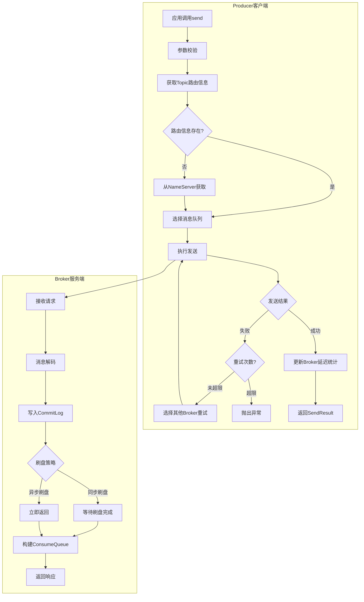
```mermaid
flowchart TD
    subgraph Producer客户端
        A[应用调用send] --> B[参数校验]
        B --> C[获取Topic路由信息]
        C --> D{路由信息存在?}
        D -->|否| E[从NameServer获取]
        D -->|是| F[选择消息队列]
        E --> F
        F --> G[执行发送]
        G --> H{发送结果}
        H -->|成功| I[更新Broker延迟统计]
        H -->|失败| J{重试次数?}
        J -->|未超限| K[选择其他Broker重试]
        K --> G
        J -->|超限| L[抛出异常]
        I --> M[返回SendResult]
    end
    
    subgraph Broker服务端
        G --> N[接收请求]
        N --> O[消息解码]
        O --> P[写入CommitLog]
        P --> Q{刷盘策略}
        Q -->|同步刷盘| R[等待刷盘完成]
        Q -->|异步刷盘| S[立即返回]
        R --> T[构建ConsumeQueue]
        S --> T
        T --> U[返回响应]
    end
```

#### 5.1.2 同步发送详细流程
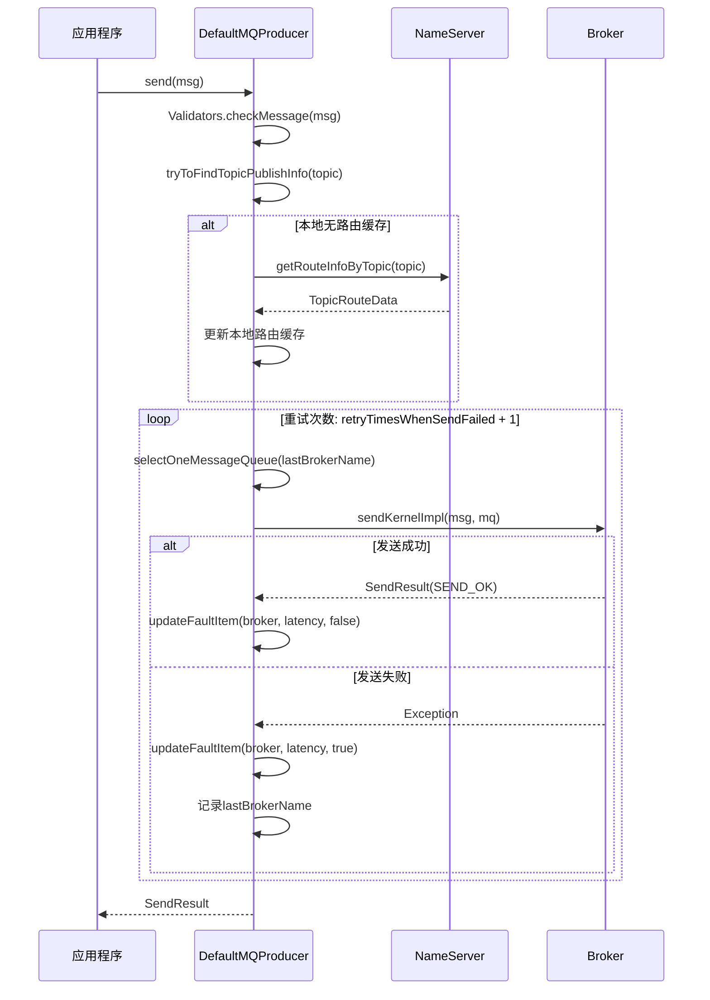
```mermaid
sequenceDiagram
    participant App as 应用程序
    participant P as DefaultMQProducer
    participant NS as NameServer
    participant B as Broker

    App->>P: send(msg)
    P->>P: Validators.checkMessage(msg)
    P->>P: tryToFindTopicPublishInfo(topic)
    
    alt 本地无路由缓存
        P->>NS: getRouteInfoByTopic(topic)
        NS-->>P: TopicRouteData
        P->>P: 更新本地路由缓存
    end
    
    loop 重试次数: retryTimesWhenSendFailed + 1
        P->>P: selectOneMessageQueue(lastBrokerName)
        P->>B: sendKernelImpl(msg, mq)
        
        alt 发送成功
            B-->>P: SendResult(SEND_OK)
            P->>P: updateFaultItem(broker, latency, false)
        else 发送失败
            B-->>P: Exception
            P->>P: updateFaultItem(broker, latency, true)
            P->>P: 记录lastBrokerName
        end
    end
    
    P-->>App: SendResult
```

#### 5.1.3 三种发送方式对比
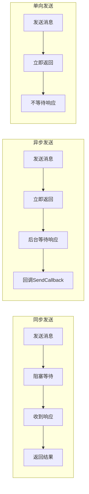
```mermaid
flowchart LR
    subgraph 同步发送
        S1[发送消息] --> S2[阻塞等待]
        S2 --> S3[收到响应]
        S3 --> S4[返回结果]
    end
    
    subgraph 异步发送
        A1[发送消息] --> A2[立即返回]
        A2 --> A3[后台等待响应]
        A3 --> A4[回调SendCallback]
    end
    
    subgraph 单向发送
        O1[发送消息] --> O2[立即返回]
        O2 --> O3[不等待响应]
    end
```

| 发送方式 | 可靠性 | 性能 | 返回结果 | 适用场景 |
| --- | --- | --- | --- | --- |
| 同步发送 | 最高 | 较低 | SendResult | 重要消息，需要确认发送结果 |
| 异步发送 | 高 | 较高 | 回调通知 | 对响应时间敏感的场景 |
| 单向发送 | 低 | 最高 | 无返回 | 日志收集、非关键消息 |


#### 5.1.4 队列选择策略
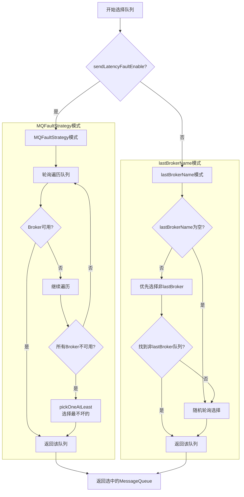
```mermaid
flowchart TD
    A[开始选择队列] --> B{sendLatencyFaultEnable?}
    
    B -->|是| C[MQFaultStrategy模式]
    B -->|否| D[lastBrokerName模式]
    
    subgraph MQFaultStrategy模式
        C --> C1[轮询遍历队列]
        C1 --> C2{Broker可用?}
        C2 -->|是| C3[返回该队列]
        C2 -->|否| C4[继续遍历]
        C4 --> C5{所有Broker不可用?}
        C5 -->|是| C6[pickOneAtLeast<br/>选择最不坏的]
        C5 -->|否| C1
        C6 --> C3
    end
    
    subgraph lastBrokerName模式
        D --> D1{lastBrokerName为空?}
        D1 -->|是| D2[随机轮询选择]
        D1 -->|否| D3[优先选择非lastBroker]
        D3 --> D4{找到非lastBroker队列?}
        D4 -->|是| D5[返回该队列]
        D4 -->|否| D2
        D2 --> D5
    end
    
    C3 --> E[返回选中的MessageQueue]
    D5 --> E
```

**MessageQueueSelector 接口**：

```java
public interface MessageQueueSelector {
    MessageQueue select(final List<MessageQueue> mqs, final Message msg, final Object arg);
}
```

**内置选择器实现**：

| 选择器 | 策略 | 使用场景 |
| --- | --- | --- |
| `SelectMessageQueueByHash` | `arg.hashCode() % mqs.size()` | 顺序消息，相同key发到同一队列 |
| `SelectMessageQueueByRandom` | `random.nextInt(mqs.size())` | 随机负载均衡 |
| `SelectMessageQueueByMachineRoom` | 按机房选择 | 同机房优先 |


```java
// 使用示例：订单消息按订单ID发送到同一队列，保证顺序
producer.send(msg, new SelectMessageQueueByHash(), orderId);
```

#### 5.1.5 消息压缩机制
消息体超过阈值（默认4KB）时自动压缩：

```java
// DefaultMQProducer 配置
private int compressMsgBodyOverHowmuch = 1024 * 4;  // 压缩阈值: 4KB

// 消息发送时的压缩逻辑
if (msgBody.length > compressMsgBodyOverHowmuch) {
    byte[] compressed = UtilAll.compress(msgBody, 5);  // 压缩级别5
    msg.setBody(compressed);
    msg.setProperty(MessageConst.PROPERTY_COMPRESSED, "true");
}
```

**压缩配置**：

| 参数 | 默认值 | 说明 |
| --- | --- | --- |
| `compressMsgBodyOverHowmuch` | 4096 (4KB) | 触发压缩的消息体大小阈值 |
| 压缩级别 | 5 | ZIP压缩级别 (1-9) |


**消费端解压**：Consumer 自动检测 `PROPERTY_COMPRESSED` 属性并解压。

**压缩性能对比**：

| 消息大小 | 压缩前 | 压缩后 | 压缩比 | 压缩耗时 |
| --- | --- | --- | --- | --- |
| 1KB | 1024B | ~800B | ~22% | <1ms |
| 10KB | 10240B | ~4000B | ~60% | ~2ms |
| 100KB | 102400B | ~20000B | ~80% | ~10ms |
| 1MB | 1048576B | ~150000B | ~85% | ~50ms |

**建议**：消息体大于4KB时开启压缩，权衡压缩比和CPU开销。

#### 5.1.6 批量发送机制
多条消息合并发送，减少网络开销：

```java
List<Message> messages = new ArrayList<>();
messages.add(new Message("TopicTest", "TagA", "OrderID001", "Body1".getBytes()));
messages.add(new Message("TopicTest", "TagA", "OrderID002", "Body2".getBytes()));
messages.add(new Message("TopicTest", "TagA", "OrderID003", "Body3".getBytes()));

SendResult sendResult = producer.send(messages);
```

**批量发送限制**：

| 限制项 | 默认值 | 说明 |
| --- | --- | --- |
| 批量消息大小 | 4MB | 所有消息体总大小不超过4MB |
| 批量消息条数 | 无限制 | 受总大小限制 |
| 延迟消息 | 不支持 | 批量消息不支持延迟 |
| 事务消息 | 不支持 | 批量消息不支持事务 |


**批量消息编码格式**：

```plain
┌─────────────────────────────────────────────────────────────────┐
│                    批量消息编码结构                              │
├─────────────────────────────────────────────────────────────────┤
│  MessageBatch编码:                                              │
│  ┌─────────────┬─────────────┬─────────────┬─────────────┐     │
│  │ msg1 length │   msg1 body │ msg2 length │   msg2 body │ ... │
│  │   4 bytes   │   n bytes   │   4 bytes   │   n bytes   │     │
│  └─────────────┴─────────────┴─────────────┴─────────────┘     │
└─────────────────────────────────────────────────────────────────┘
```

**批量发送最佳实践**：

```java
// 批量发送优化建议
List<Message> batch = new ArrayList<>();

// 1. 控制批量大小（建议单批次不超过1MB）
int batchSize = 0;
for (Message msg : messages) {
    if (batchSize + msg.getBody().length > 1024 * 1024) {
        producer.send(batch);  // 发送当前批次
        batch.clear();
        batchSize = 0;
    }
    batch.add(msg);
    batchSize += msg.getBody().length;
}

// 发送剩余消息
if (!batch.isEmpty()) {
    producer.send(batch);
}
```

#### 5.1.7 发送重试机制
```java
// DefaultMQProducerImpl.sendDefaultImpl()
int timesTotal = communicationMode == CommunicationMode.SYNC 
    ? 1 + this.defaultMQProducer.getRetryTimesWhenSendFailed()  // 同步: 默认3次
    : 1;                                                         // 异步/单向: 不重试

for (int times = 0; times < timesTotal; times++) {
    String lastBrokerName = null == mq ? null : mq.getBrokerName();
    MessageQueue mqSelected = this.selectOneMessageQueue(topicPublishInfo, lastBrokerName);
    
    try {
        SendResult sendResult = this.sendKernelImpl(msg, mq, communicationMode, ...);
        this.updateFaultItem(mq.getBrokerName(), latency, false);  // 更新延迟统计
        return sendResult;
    } catch (RemotingException | MQClientException e) {
        this.updateFaultItem(mq.getBrokerName(), latency, true);   // 标记隔离
        exception = e;
        continue;  // 重试
    }
}
```

**重试触发条件**：

| 异常类型 | 是否重试 | 说明 |
| --- | --- | --- |
| RemotingException | ✅ 重试 | 网络异常 |
| MQClientException | ✅ 重试 | 客户端异常 |
| MQBrokerException | ⚠️ 视情况 | Broker返回错误码 |
| InterruptedException | ❌ 不重试 | 线程中断 |


#### 5.1.8 MsgId 结构解析

> **各标识概念总览**：参见 [消息标识与属性详解](#消息标识与属性详解)，包括 Tags、Keys、MsgId、Sharding Key、路由参数的区别与使用场景。

本节重点介绍 **MsgId** 的内部结构与生成机制。

**MsgId 结构解析**：

```plain
MsgId: AC1100012A9F00000010000000000001
       ├──────┤├──┤├──────┤├──────┤├────┤
         IP    PID 类加载器  时间差   自增序列
        4B     2B   哈希4B   4B       2B

AC110001 = 172.17.0.1 (客户端 IP 地址的十六进制)
2A9F = 进程ID (PID, 2字节short)
00000010 = 类加载器哈希 (ClassLoader Hash, 4字节int)
00000000 = 时间差 (与本月1日0点的时间差, 4字节int)
0001 = 自增序列 (COUNTER, 2字节short)

注：MsgId 由客户端生成，用于唯一标识一条消息
总长度：4+2+4+4+2 = 16字节 = 32个十六进制字符
```

**MsgId 生成源码** ([MessageClientIDSetter.java](file:///d:/github/rocketmq/common/src/main/java/org/apache/rocketmq/common/message/MessageClientIDSetter.java))：

```java
static {
    byte[] ip = UtilAll.getIP();
    // LEN = IP(4) + PID(2) + ClassLoader(4) + 时间差(4) + 序列号(2) = 16字节
    LEN = ip.length + 2 + 4 + 4 + 2;
    
    ByteBuffer tempBuffer = ByteBuffer.allocate(ip.length + 2 + 4);
    tempBuffer.put(ip);                                    // IP地址
    tempBuffer.putShort((short) UtilAll.getPid());         // PID (2字节)
    tempBuffer.putInt(MessageClientIDSetter.class          // ClassLoader Hash (4字节)
        .getClassLoader().hashCode());
    FIX_STRING = UtilAll.bytes2string(tempBuffer.array());
}

public static String createUniqID() {
    char[] sb = new char[LEN * 2];
    System.arraycopy(FIX_STRING, 0, sb, 0, FIX_STRING.length);
    
    long current = System.currentTimeMillis();
    int diff = (int)(current - startTime);  // 与本月1日0点的时间差 (4字节)
    
    int pos = FIX_STRING.length;
    UtilAll.writeInt(sb, pos, diff);        // 时间差 (4字节)
    pos += 8;
    UtilAll.writeShort(sb, pos, COUNTER.getAndIncrement());  // 自增序列 (2字节)
    return new String(sb);
}
```

**MsgId 使用场景**：

```java
SendResult sendResult = producer.send(msg);
String msgId = sendResult.getMsgId();  // 系统生成的唯一ID

// 1. 精确查询（通过 MessageId 直接定位消息）
MessageExt msgFound = producer.viewMessage(msgId);

// 2. 消息追踪
log.info("发送成功, msgId={}", msgId);

// 3. 问题排查：根据 msgId 在控制台查询消息详情
```

**顺序消息中的 Key 含义**：

顺序消息中的"相同 Key"指的是**业务标识符**，用于确定消息应该发送到哪个队列：

```java
// 订单场景：订单ID就是 Key
String orderId = "ORDER_12345";

// 相同 orderId 的消息会路由到同一队列，保证顺序
producer.send(msg1, new SelectMessageQueueByHash(), orderId);
producer.send(msg2, new SelectMessageQueueByHash(), orderId);
producer.send(msg3, new SelectMessageQueueByHash(), orderId);
```

| 业务场景 | Key 选择 | 原因 |
| --- | --- | --- |
| 订单处理 | 订单ID | 同一订单的状态变更需要顺序处理 |
| 用户操作 | 用户ID | 同一用户的操作需要顺序执行 |
| 设备数据 | 设备ID | 同一设备上报数据需要顺序处理 |
| 交易流水 | 账户ID | 同一账户的交易需要顺序处理 |


### 5.2 消息存储流程
#### 5.2.1 存储流程总览
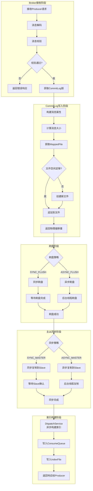
```mermaid
flowchart TD
    subgraph Broker接收阶段
        A[接收Producer请求] --> B[消息解码]
        B --> C[消息校验]
        C --> D{校验通过?}
        D -->|否| E[返回错误响应]
        D -->|是| F[获取CommitLog锁]
    end
    
    subgraph CommitLog写入阶段
        F --> G[构建消息属性]
        G --> H[计算消息大小]
        H --> I[获取MappedFile]
        I --> J{文件空间足够?}
        J -->|否| K[创建新文件]
        J -->|是| L[追加到文件]
        K --> L
        L --> M[返回物理偏移量]
    end
    
    subgraph 刷盘阶段
        M --> N{刷盘策略}
        N -->|SYNC_FLUSH| O[同步刷盘]
        N -->|ASYNC_FLUSH| P[异步刷盘]
        O --> Q[等待刷盘完成]
        P --> R[后台线程刷盘]
        Q --> S[刷盘成功]
        R --> S
    end
    
    subgraph 主从同步阶段
        S --> T{同步策略}
        T -->|SYNC_MASTER| U[同步复制到Slave]
        T -->|ASYNC_MASTER| V[异步复制到Slave]
        U --> W[等待Slave确认]
        V --> X[后台线程复制]
        W --> Y[同步完成]
        X --> Y
    end
    
    subgraph 索引构建阶段
        Y --> Z[DispatchService<br/>异步构建索引]
        Z --> AA[写入ConsumeQueue]
        AA --> AB[写入IndexFile]
        AB --> AC[返回响应给Producer]
    end
```

#### 5.2.2 CommitLog写入详细流程
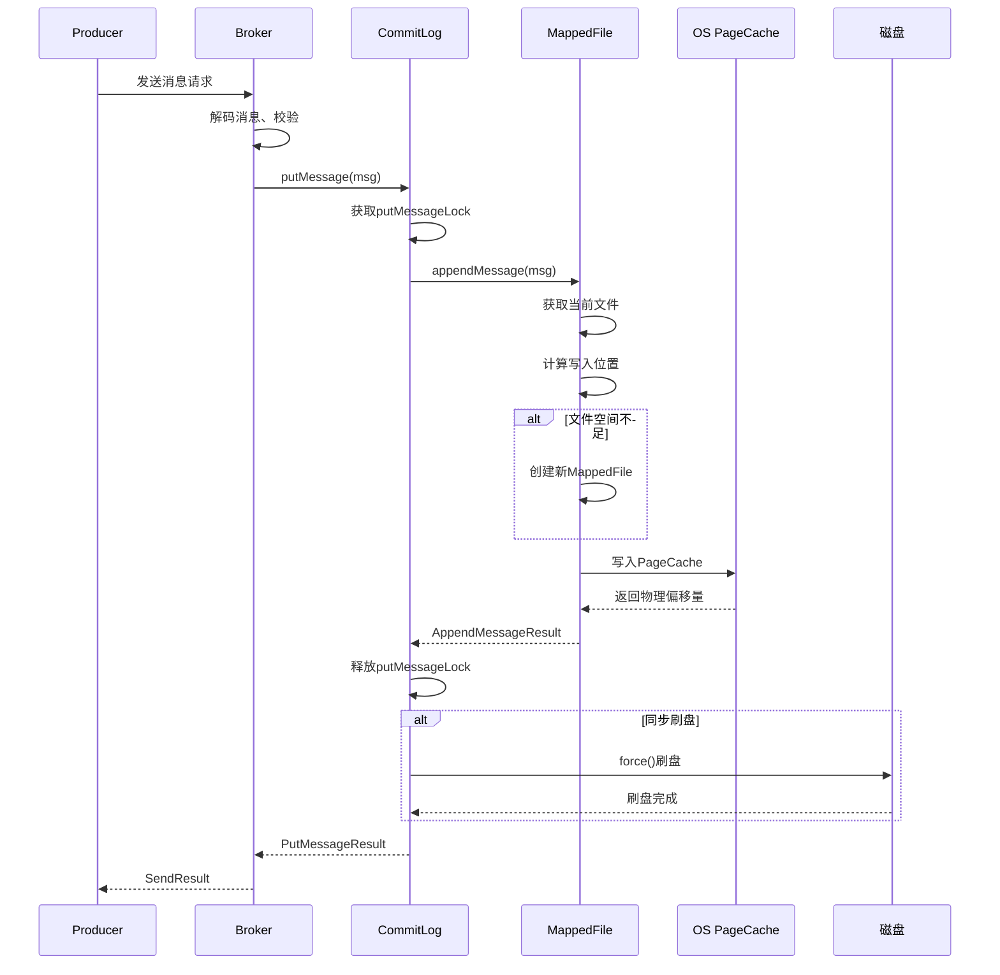
```mermaid
sequenceDiagram
    participant P as Producer
    participant B as Broker
    participant CL as CommitLog
    participant MF as MappedFile
    participant OS as OS PageCache
    participant Disk as 磁盘

    P->>B: 发送消息请求
    B->>B: 解码消息、校验
    
    B->>CL: putMessage(msg)
    CL->>CL: 获取putMessageLock
    
    CL->>MF: appendMessage(msg)
    MF->>MF: 获取当前文件
    MF->>MF: 计算写入位置
    
    alt 文件空间不足
        MF->>MF: 创建新MappedFile
    end
    
    MF->>OS: 写入PageCache
    OS-->>MF: 返回物理偏移量
    MF-->>CL: AppendMessageResult
    
    CL->>CL: 释放putMessageLock
    
    alt 同步刷盘
        CL->>Disk: force()刷盘
        Disk-->>CL: 刷盘完成
    end
    
    CL-->>B: PutMessageResult
    B-->>P: SendResult
```

#### 5.2.3 刷盘策略对比
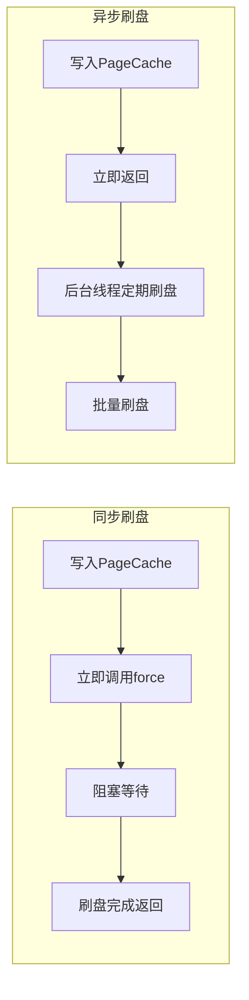
```mermaid
flowchart LR
    subgraph 同步刷盘
        S1[写入PageCache] --> S2[立即调用force]
        S2 --> S3[阻塞等待]
        S3 --> S4[刷盘完成返回]
    end
    
    subgraph 异步刷盘
        A1[写入PageCache] --> A2[立即返回]
        A2 --> A3[后台线程定期刷盘]
        A3 --> A4[批量刷盘]
    end
```

| 刷盘方式 | 可靠性 | 性能 | 数据丢失风险 | 适用场景 |
| --- | --- | --- | --- | --- |
| 同步刷盘 | 最高 | 较低 | 几乎无 | 金融交易、重要业务 |
| 异步刷盘 | 高 | 高 | 可能丢失少量 | 日志、非关键数据 |


#### 5.2.4 主从复制策略

##### BrokerRole 角色定义

BrokerRole 定义了 Broker 在主从架构中的角色：

```java
public enum BrokerRole {
    ASYNC_MASTER,  // 异步主节点
    SYNC_MASTER,   // 同步主节点
    SLAVE;         // 从节点
}
```

**三种角色对比**：

| 角色 | 含义 | 写入流程 | 数据可靠性 | 性能 | 适用场景 |
| --- | --- | --- | --- | --- | --- |
| **ASYNC_MASTER** | 异步主节点 | 主节点写入成功即返回 | 较低（可能丢失未同步数据） | 最高 | 高吞吐、允许少量数据丢失 |
| **SYNC_MASTER** | 同步主节点 | 主节点写入 + 等待从节点同步成功才返回 | 较高（同步复制） | 较低 | 金融/交易类、数据不能丢 |
| **SLAVE** | 从节点 | 不接收写入，只同步主节点数据 | - | - | 数据备份、读扩展 |

**相关配置参数**：

| 参数 | 默认值 | 说明 |
| --- | --- | --- |
| `brokerRole` | ASYNC_MASTER | Broker 角色 |
| `slaveTimeout` | 3000ms | SYNC_MASTER 等待从节点确认的超时时间 |
| `inSyncReplicas` | - | 需要同步确认的从节点数量 |
| `haMasterAddress` | - | SLAVE 连接的主节点地址 |

**配置示例**：

```properties
# 异步主节点 - 配置文件 2m-2s-async
brokerRole=ASYNC_MASTER

# 同步主节点 - 配置文件 2m-2s-sync
brokerRole=SYNC_MASTER

# 从节点
brokerRole=SLAVE
```

##### 复制流程对比

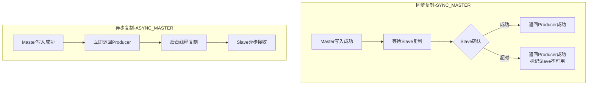
```mermaid
flowchart TD
    subgraph 同步复制-SYNC_MASTER
        S1[Master写入成功] --> S2[等待Slave复制]
        S2 --> S3{Slave确认}
        S3 -->|成功| S4[返回Producer成功]
        S3 -->|超时| S5[返回Producer成功<br/>标记Slave不可用]
    end
    
    subgraph 异步复制-ASYNC_MASTER
        A1[Master写入成功] --> A2[立即返回Producer]
        A2 --> A3[后台线程复制]
        A3 --> A4[Slave异步接收]
    end
```

| 复制方式 | 可靠性 | 性能 | 数据丢失风险 | 适用场景 |
| --- | --- | --- | --- | --- |
| 同步复制 | 最高 | 较低 | 极低 | 金融交易、高可靠场景 |
| 异步复制 | 高 | 高 | Master宕机可能丢失 | 一般业务场景 |


#### 5.2.5 RocketMQ 文件概念总览

RocketMQ 的文件体系是其高性能存储的核心，采用"CommitLog + ConsumeQueue + IndexFile"三层存储架构。

##### 文件体系架构

```plain
RocketMQ 文件体系
├── 消息存储文件        # 消息数据的物理存储
│   ├── CommitLog              # 消息主体存储文件 (1GB/文件)
│   ├── ConsumeQueue           # 消费队列索引文件 (600MB/文件)
│   ├── IndexFile              # 消息Key索引文件 (400MB/文件)
│   └── BatchConsumeQueue      # 批量消费队列（优化版）
│
├── 基础设施文件        # 文件操作的基础设施
│   ├── MappedFile             # 内存映射文件基类 (mmap零拷贝)
│   └── MappedFileQueue        # 映射文件队列管理
│
├── 状态检查点文件      # 系统状态持久化
│   ├── StoreCheckpoint        # 存储检查点文件
│   └── EpochFileCache         # Epoch缓存文件（主从切换）
│
└── 配置管理文件        # 元数据和配置信息
    ├── topics.json            # Topic配置
    ├── subscriptionGroup.json # 订阅组配置
    └── consumerOffset.json    # 消费位点
```

**三种核心存储文件对比**：

| 对比项 | CommitLog | ConsumeQueue | IndexFile |
| --- | --- | --- | --- |
| **存储内容** | 完整消息体 | 20字节索引单元 | 20字节索引条目 |
| **组织方式** | 全局顺序写入 | 按 Topic-QueueId 组织 | 按时间戳命名 |
| **写入方式** | 顺序写入 | 异步构建 | 异步构建 |
| **主要用途** | 消息存储、恢复、同步 | 消费定位、过滤 | 按Key查询 |
| **查询复杂度** | O(1) 按偏移量 | O(1) 按队列偏移量 | O(1)~O(n) 按Key Hash |

##### 文件存储目录结构

```plain
${storePathRootDir}/
├── commitlog/                          # 消息存储目录
│   ├── 00000000000000000000.msg        # CommitLog 文件 (偏移量 0)
│   └── 00000000001073741824.msg        # CommitLog 文件 (偏移量 1GB)
├── consumequeue/                       # 消费索引目录
│   └── {Topic}/{QueueId}/              # 按 Topic-QueueId 组织
├── index/                              # Key索引目录
│   └── {timestamp}                     # 按时间戳命名
├── checkpoint                          # 存储检查点
└── config/                             # 配置文件目录
    ├── topics.json                     # Topic配置
    ├── consumerOffset.json             # 消费位点
    └── subscriptionGroup.json          # 订阅组配置
```

##### CommitLog 与 ConsumeQueue 详解

**CommitLog** 是所有消息的物理存储文件，采用顺序写入实现高性能。每条消息包含：TOTAL_SIZE(4B) + MAGIC_CODE(4B) + BODY_CRC(4B) + QUEUE_ID(4B) + ...

**ConsumeQueue** 是按 Topic-QueueId 组织的索引文件，每个索引单元固定 20 字节：

```plain
┌──────────────────┬──────────────┬──────────────────┐
│ CommitLog Offset │   Msg Size   │    TagsCode      │
│     8 bytes      │   4 bytes    │     8 bytes      │
└──────────────────┴──────────────┴──────────────────┘
```

**IndexFile** 实现按 Key 查询消息，逻辑结构类似 HashMap，使用链地址法处理 Hash 冲突。

##### MappedFile 内存映射

MappedFile 是所有存储文件的基类，使用 mmap 实现零拷贝：

```plain
传统IO (4次拷贝): 磁盘 → 内核缓冲区 → 用户缓冲区 → Socket缓冲 → 网卡
mmap零拷贝 (2次拷贝): 磁盘 → mmap映射区域(用户态直接访问) → 网卡
```

##### 偏移量概念与配置参数

> 详细概念说明参见 [4.1.1 基本概念 - 偏移量相关术语](#411-基本概念)

| 概念 | 含义 | 单位 |
| --- | --- | --- |
| **CommitLog Offset** | 消息在 CommitLog 文件中的字节位置 | 字节 |
| **Queue Offset** | 消息在队列中的序号 | 消息条数 |
| **Consumer Offset** | 消费者下次要消费的位置 | 消息条数 |

**核心关系**：`Queue Offset × 20字节 = ConsumeQueue 文件中的物理位置`

**关键配置参数**：

| 参数 | 默认值 | 说明 |
| --- | --- | --- |
| `mappedFileSizeCommitLog` | 1GB | CommitLog 单文件大小 |
| `mappedFileSizeConsumeQueue` | 600MB | ConsumeQueue 单文件大小 |
| `maxHashSlotNum` | 500万 | IndexFile Hash 槽位数量 |

##### 存储设计优势

| 优势 | 说明 |
| --- | --- |
| **写入性能** | CommitLog 顺序写入，避免随机 IO |
| **读取性能** | ConsumeQueue 作为索引，快速定位消息 |
| **存储空间** | ConsumeQueue 只存储索引，占用空间小 |
| **高可用** | CommitLog 支持主从同步，ConsumeQueue 可从 CommitLog 重建 |

**mmap 零拷贝优缺点**：

| 优点 | 缺点 |
| --- | --- |
| 减少数据拷贝，提高性能 | 映射文件大小受限（受限于虚拟内存） |
| 用户态直接访问文件数据 | 文件关闭后映射不会立即释放 |
| 适合大文件顺序读写 | 小文件映射开销较大 |


#### 5.2.6 HA主从同步机制
```plain
┌─────────────────────────────────────────────────────────────────────────────┐
│                          HA主从同步架构                                      │
├─────────────────────────────────────────────────────────────────────────────┤
│                                                                              │
│   Master Broker                              Slave Broker                   │
│  ┌─────────────────────┐                    ┌─────────────────────┐        │
│  │   HAService         │                    │      HAClient       │        │
│  │  ┌───────────────┐  │     TCP连接        │  ┌───────────────┐  │        │
│  │  │AcceptSocket   │◄─┼────────────────────┼──│connectMaster  │  │        │
│  │  │Service        │  │                    │  │               │  │        │
│  │  └───────────────┘  │                    │  └───────────────┘  │        │
│  │         │           │                    │         │           │        │
│  │         ▼           │                    │         ▼           │        │
│  │  ┌───────────────┐  │  同步CommitLog     │  ┌───────────────┐  │        │
│  │  │HAConnection   │──┼───────────────────►│  │写入CommitLog  │  │        │
│  │  │(每个Slave一个) │  │                    │  │               │  │        │
│  │  └───────────────┘  │                    │  └───────────────┘  │        │
│  │         │           │                    │         │           │        │
│  │         ▼           │                    │         ▼           │        │
│  │  ┌───────────────┐  │                    │  ┌───────────────┐  │        │
│  │  │CommitLog      │  │                    │  │CommitLog      │  │        │
│  │  │maxOffset      │  │                    │  │slaveOffset    │  │        │
│  │  └───────────────┘  │                    │  └───────────────┘  │        │
│  └─────────────────────┘                    └─────────────────────┘        │
│                                                                              │
└─────────────────────────────────────────────────────────────────────────────┘
```

**HA同步协议**：

```plain
Slave → Master: 上报已同步偏移量
┌────────────────────────────────────────┐
│  slaveOffset (8B) │  bodySize (4B)     │
│  12345678         │  0                 │
└────────────────────────────────────────┘

Master → Slave: 推送CommitLog数据
┌────────────────────────────────────────┐
│  offset (8B) │  bodySize (4B) │ body   │
│  12345678    │  1024          │ ...    │
└────────────────────────────────────────┘
```

**同步复制核心逻辑**：

```java
// CommitLog.java - SYNC_MASTER 等待从节点确认
private CompletableFuture<PutMessageStatus> handleHA(...) {
    GroupCommitRequest request = new GroupCommitRequest(nextOffset, slaveTimeout, needAckNums);
    haService.putRequest(request);
    return request.future();  // 阻塞等待从节点同步完成
}
```

**HA配置参数**：

| 参数 | 默认值 | 说明 |
| --- | --- | --- |
| `haListenPort` | 10912 | HA服务监听端口 |
| `haSendHeartbeatInterval` | 5s | 心跳间隔 |
| `haSlaveFallbehindMax` | 1024_1024_256 | Slave落后最大字节数(256MB) |
| `haTransferOneByOne` | false | 是否逐条传输 |

### 5.3 消息消费流程
#### 5.3.1 消费流程总览
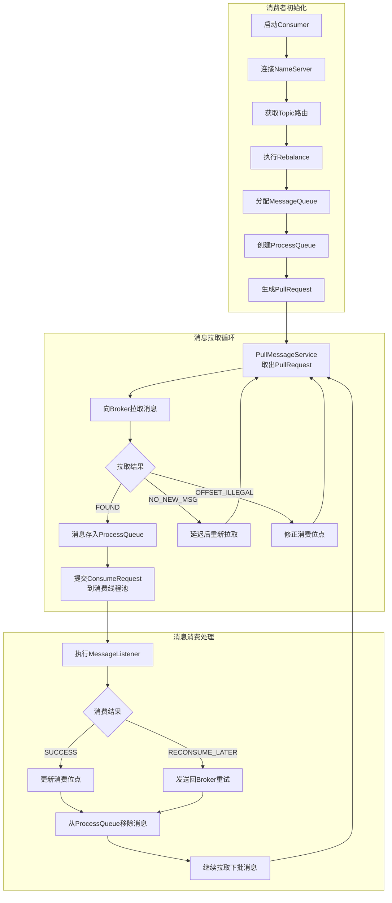
```mermaid
flowchart TD
    subgraph 消费者初始化
        A[启动Consumer] --> B[连接NameServer]
        B --> C[获取Topic路由]
        C --> D[执行Rebalance]
        D --> E[分配MessageQueue]
        E --> F[创建ProcessQueue]
        F --> G[生成PullRequest]
    end
    
    subgraph 消息拉取循环
        G --> H[PullMessageService<br/>取出PullRequest]
        H --> I[向Broker拉取消息]
        I --> J{拉取结果}
        J -->|FOUND| K[消息存入ProcessQueue]
        J -->|NO_NEW_MSG| L[延迟后重新拉取]
        J -->|OFFSET_ILLEGAL| M[修正消费位点]
        K --> N[提交ConsumeRequest<br/>到消费线程池]
        L --> H
        M --> H
    end
    
    subgraph 消息消费处理
        N --> O[执行MessageListener]
        O --> P{消费结果}
        P -->|SUCCESS| Q[更新消费位点]
        P -->|RECONSUME_LATER| R[发送回Broker重试]
        Q --> S[从ProcessQueue移除消息]
        R --> S
        S --> T[继续拉取下批消息]
        T --> H
    end
```

#### 5.3.2 Push模式详细流程
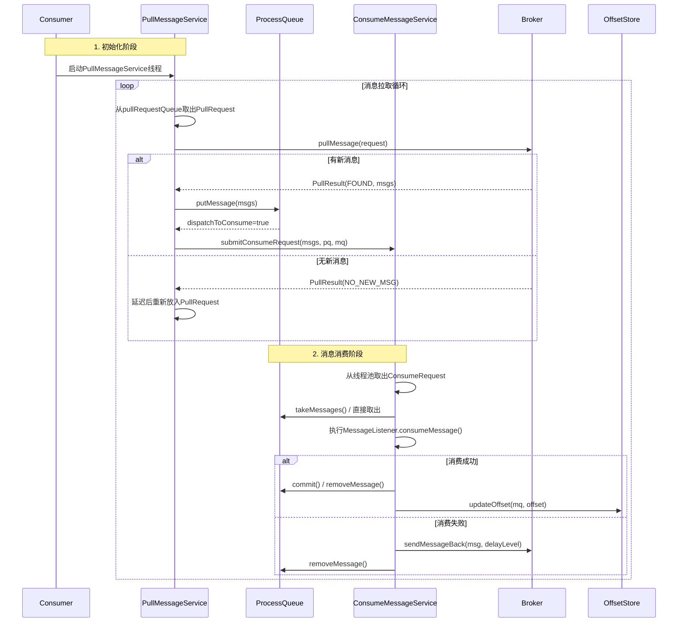
```mermaid
sequenceDiagram
    participant C as Consumer
    participant PMS as PullMessageService
    participant PQ as ProcessQueue
    participant CMS as ConsumeMessageService
    participant B as Broker
    participant OS as OffsetStore

    Note over C,PMS: 1. 初始化阶段
    C->>PMS: 启动PullMessageService线程
    
    loop 消息拉取循环
        PMS->>PMS: 从pullRequestQueue取出PullRequest
        PMS->>B: pullMessage(request)
        
        alt 有新消息
            B-->>PMS: PullResult(FOUND, msgs)
            PMS->>PQ: putMessage(msgs)
            PQ-->>PMS: dispatchToConsume=true
            PMS->>CMS: submitConsumeRequest(msgs, pq, mq)
        else 无新消息
            B-->>PMS: PullResult(NO_NEW_MSG)
            PMS->>PMS: 延迟后重新放入PullRequest
        end
        
        Note over CMS,PQ: 2. 消息消费阶段
        CMS->>CMS: 从线程池取出ConsumeRequest
        CMS->>PQ: takeMessages() / 直接取出
        CMS->>CMS: 执行MessageListener.consumeMessage()
        
        alt 消费成功
            CMS->>PQ: commit() / removeMessage()
            CMS->>OS: updateOffset(mq, offset)
        else 消费失败
            CMS->>B: sendMessageBack(msg, delayLevel)
            CMS->>PQ: removeMessage()
        end
    end
```

#### 5.3.3 Pull模式 vs Push模式
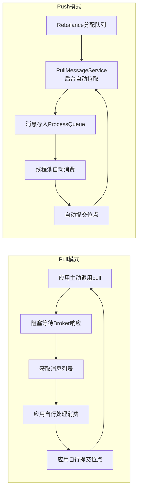
```mermaid
flowchart LR
    subgraph Pull模式
        P1[应用主动调用pull] --> P2[阻塞等待Broker响应]
        P2 --> P3[获取消息列表]
        P3 --> P4[应用自行处理消费]
        P4 --> P5[应用自行提交位点]
        P5 --> P1
    end
    
    subgraph Push模式
        R1[Rebalance分配队列] --> R2[PullMessageService<br/>后台自动拉取]
        R2 --> R3[消息存入ProcessQueue]
        R3 --> R4[线程池自动消费]
        R4 --> R5[自动提交位点]
        R5 --> R2
    end
```

| 特性 | Pull模式 | Push模式 |
| --- | --- | --- |
| 消费方式 | 应用主动拉取 | 后台自动拉取 |
| 消费控制 | 应用完全控制 | 框架自动管理 |
| 实现复杂度 | 较高 | 较低 |
| 流量控制 | 应用自行实现 | 内置流控机制 |
| 适用场景 | 特殊消费逻辑、批量处理 | 大多数业务场景 |


#### 5.3.4 消息拉取核心流程
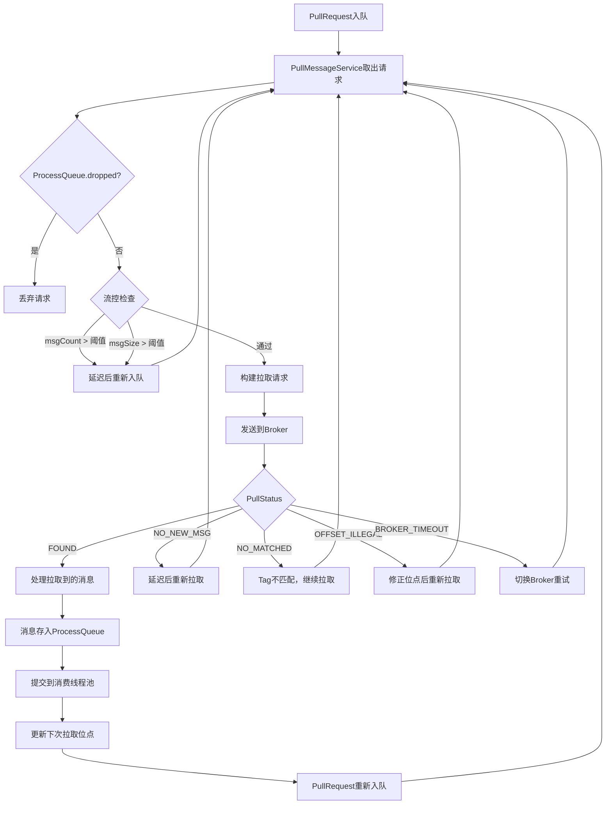
```mermaid
flowchart TD
    A[PullRequest入队] --> B[PullMessageService取出请求]
    B --> C{ProcessQueue.dropped?}
    C -->|是| D[丢弃请求]
    C -->|否| E{流控检查}
    
    E -->|msgCount > 阈值| F[延迟后重新入队]
    E -->|msgSize > 阈值| F
    E -->|通过| G[构建拉取请求]
    
    G --> H[发送到Broker]
    H --> I{PullStatus}
    
    I -->|FOUND| J[处理拉取到的消息]
    I -->|NO_NEW_MSG| K[延迟后重新拉取]
    I -->|NO_MATCHED| L[Tag不匹配，继续拉取]
    I -->|OFFSET_ILLEGAL| M[修正位点后重新拉取]
    I -->|BROKER_TIMEOUT| N[切换Broker重试]
    
    J --> O[消息存入ProcessQueue]
    O --> P[提交到消费线程池]
    P --> Q[更新下次拉取位点]
    Q --> R[PullRequest重新入队]
    
    F --> B
    K --> B
    L --> B
    M --> B
    N --> B
    R --> B
```

#### 5.3.5 长轮询机制
RocketMQ 通过长轮询实现"伪 Push"效果，Consumer 拉取请求在 Broker 端挂起，直到有新消息或超时：

```plain
┌─────────────────────────────────────────────────────────────────────────────┐
│                          长轮询机制                                          │
├─────────────────────────────────────────────────────────────────────────────┤
│                                                                              │
│  Consumer                           Broker                                   │
│  ┌──────────────┐                  ┌──────────────────────────────────────┐ │
│  │              │  pullRequest     │                                      │ │
│  │              │ ───────────────► │  PullRequestHoldService              │ │
│  │              │                  │  ┌────────────────────────────────┐  │ │
│  │              │                  │  │ suspendPullRequest()           │  │ │
│  │   等待响应    │                  │  │ 挂起请求，放入pullRequestTable  │  │ │
│  │   (不超时)    │                  │  └────────────────────────────────┘  │ │
│  │              │                  │                 │                     │ │
│  │              │                  │                 ▼                     │ │
│  │              │                  │  ┌────────────────────────────────┐  │ │
│  │              │                  │  │ 新消息到达 → notifyMessageArriving│ │ │
│  │              │  消息到达立即返回  │  │ 立即唤醒挂起的请求              │  │ │
│  │              │ ◄─────────────── │  └────────────────────────────────┘  │ │
│  └──────────────┘                  └──────────────────────────────────────┘ │
│                                                                              │
│  长轮询超时: 默认15秒 (brokerSuspendMaxTimeMillis)                           │
│  短轮询模式: 禁用长轮询时，立即返回空结果                                      │
└─────────────────────────────────────────────────────────────────────────────┘
```

**PullRequestHoldService 核心实现**：

```java
// Broker端挂起拉取请求
public void suspendPullRequest(final String topic, final int queueId, 
                               final PullRequest pullRequest) {
    String key = topic + "@" + queueId;
    ManyPullRequest mpr = this.pullRequestTable.get(key);
    if (null == mpr) {
        mpr = new ManyPullRequest();
        this.pullRequestTable.putIfAbsent(key, mpr);
    }
    mpr.addPullRequest(pullRequest);  // 挂起请求
}

// 新消息到达时唤醒
public void notifyMessageArriving(final String topic, final int queueId, 
                                  final long maxOffset) {
    String key = topic + "@" + queueId;
    ManyPullRequest mpr = this.pullRequestTable.get(key);
    if (mpr != null) {
        List<PullRequest> requestList = mpr.cloneListAndClear();
        for (PullRequest request : requestList) {
            // 检查是否有新消息
            if (maxOffset >= request.getPullFromOffset()) {
                request.wakeup();  // 唤醒请求，立即返回消息
            }
        }
    }
}
```

**长轮询配置参数**：

| 参数 | 默认值 | 说明 |
| --- | --- | --- |
| `longPollingEnable` | true | 是否启用长轮询 |
| `shortPollingTimeMills` | 1000ms | 短轮询等待时间 |
| `brokerSuspendMaxTimeMillis` | 15000ms | 长轮询最大挂起时间 |
| `consumerTimeoutWhenSuspend` | 30000ms | Consumer超时时间 |


#### 5.3.6 消费者流控机制
RocketMQ 在多个层面实现流控，防止消费者过载：

```plain
┌─────────────────────────────────────────────────────────────────────────────┐
│                          消费者流控层次                                      │
├─────────────────────────────────────────────────────────────────────────────┤
│                                                                              │
│  1. ProcessQueue 本地缓存流控                                                │
│  ┌──────────────────────────────────────────────────────────────────────┐  │
│  │  msgCount > 1000  → 暂停拉取，延迟50ms后重试                           │  │
│  │  msgSize > 100MB  → 暂停拉取，延迟50ms后重试                           │  │
│  │  maxSpan > 2000   → 暂停拉取（消息跨度太大）                           │  │
│  └──────────────────────────────────────────────────────────────────────┘  │
│                                                                              │
│  2. 消费线程池流控                                                           │
│  ┌──────────────────────────────────────────────────────────────────────┐  │
│  │  consumeThreadMin  → 核心线程数（默认20）                              │  │
│  │  consumeThreadMax  → 最大线程数（默认20）                              │  │
│  │  pullThresholdForQueue → 单队列最大拉取消息数（默认1000）              │  │
│  └──────────────────────────────────────────────────────────────────────┘  │
│                                                                              │
│  3. Broker端流控                                                            │
│  ┌──────────────────────────────────────────────────────────────────────┐  │
│  │  maxMsgNums → 单次拉取最大消息数（默认32）                             │  │
│  │  maxMsgSize → 单次拉取最大字节数（默认1MB）                            │  │
│  └──────────────────────────────────────────────────────────────────────┘  │
│                                                                              │
└─────────────────────────────────────────────────────────────────────────────┘
```

**流控核心代码**：

```java
// DefaultMQPushConsumerImpl 流控检查
long cachedMessageCount = processQueue.getMsgCount();
long cachedMessageSizeInMiB = processQueue.getMsgSize() / (1024 * 1024);

if (cachedMessageCount > this.defaultMQPushConsumer.getPullThresholdForQueue()) {
    // 本地缓存消息数量超限，延迟拉取
    this.executePullRequestLater(pullRequest, PULL_TIME_DELAY_MILLS_WHEN_FLOW_CONTROL);
    return;
}

if (cachedMessageSizeInMiB > this.defaultMQPushConsumer.getPullThresholdSizeForQueue()) {
    // 本地缓存消息大小超限，延迟拉取
    this.executePullRequestLater(pullRequest, PULL_TIME_DELAY_MILLS_WHEN_FLOW_CONTROL);
    return;
}

if (processQueue.getMaxSpan() > this.defaultMQPushConsumer.getConsumeConcurrentlyMaxSpan()) {
    // 消息跨度太大（最早和最晚消息offset差），延迟拉取
    this.executePullRequestLater(pullRequest, PULL_TIME_DELAY_MILLS_WHEN_FLOW_CONTROL);
    return;
}
```

**流控配置参数**：

| 参数 | 默认值 | 说明 |
| --- | --- | --- |
| `pullThresholdForQueue` | 1000 | 单队列最大缓存消息数 |
| `pullThresholdSizeForQueue` | 100MB | 单队列最大缓存消息大小 |
| `consumeConcurrentlyMaxSpan` | 2000 | 单队列消息最大跨度 |
| `pullInterval` | 0 | 拉取间隔（0表示无间隔） |
| `consumeThreadMin` | 20 | 消费线程池核心线程数 |
| `consumeThreadMax` | 20 | 消费线程池最大线程数 |


#### 5.3.7 消费位点管理
**位点管理架构**：

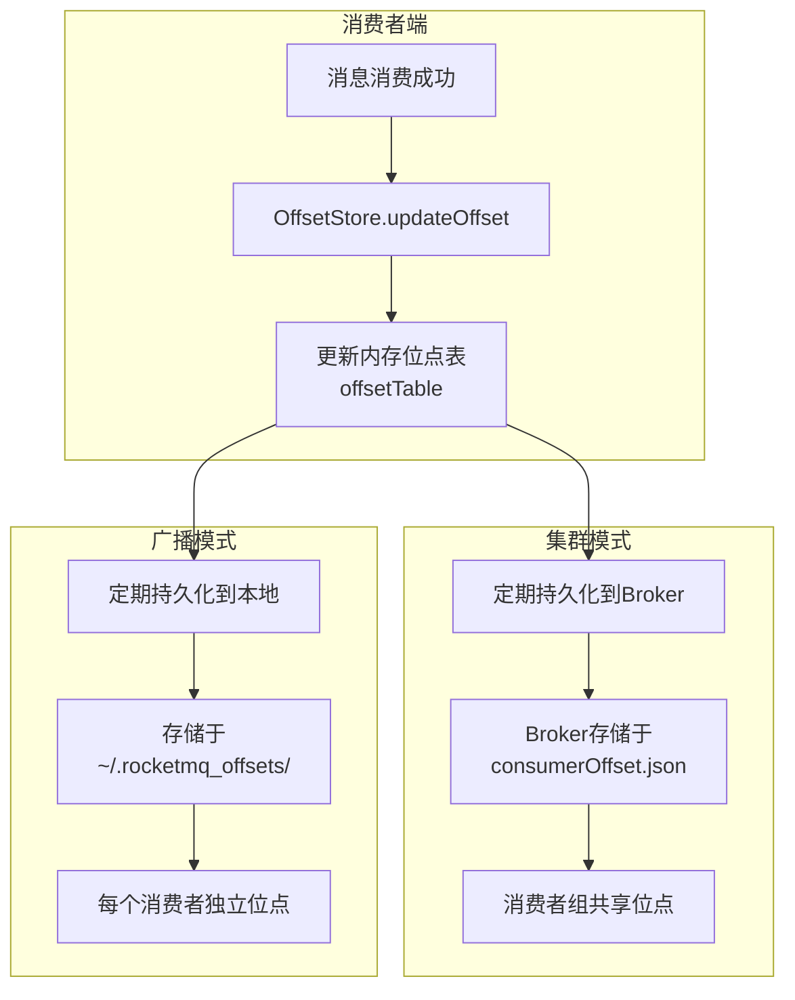
```mermaid
flowchart TD
    subgraph 消费者端
        A[消息消费成功] --> B[OffsetStore.updateOffset]
        B --> C[更新内存位点表<br/>offsetTable]
    end
    
    subgraph 集群模式
        C --> D1[定期持久化到Broker]
        D1 --> E1[Broker存储于<br/>consumerOffset.json]
        E1 --> F1[消费者组共享位点]
    end
    
    subgraph 广播模式
        C --> D2[定期持久化到本地]
        D2 --> E2[存储于<br/>~/.rocketmq_offsets/]
        E2 --> F2[每个消费者独立位点]
    end
```

**OffsetStore 接口设计** ([OffsetStore.java](file:///d:/github/rocketmq/client/src/main/java/org/apache/rocketmq/client/consumer/store/OffsetStore.java))：

```java
public interface OffsetStore {
    void load() throws MQClientException;                    // 加载位点
    
    void updateOffset(MessageQueue mq, long offset,          // 更新位点（内存）
                      boolean increaseOnly);
    
    long readOffset(MessageQueue mq, ReadOffsetType type);   // 读取位点
    
    void persistAll(Set<MessageQueue> mqs);                  // 持久化所有位点
    
    void persist(MessageQueue mq);                           // 持久化单个位点
    
    void removeOffset(MessageQueue mq);                      // 移除位点
    
    void updateConsumeOffsetToBroker(MessageQueue mq,        // 同步位点到Broker
                                     long offset, boolean isOneway);
}
```

**两种实现类对比**：

| 实现类 | 存储位置 | 适用模式 | 持久化方式 |
| --- | --- | --- | --- |
| `RemoteBrokerOffsetStore` | Broker端 | 集群模式 | 通过网络请求同步到Broker |
| `LocalFileOffsetStore` | 消费者本地 | 广播模式 | 写入本地JSON文件 |


**集群模式位点管理** ([RemoteBrokerOffsetStore.java](file:///d:/github/rocketmq/client/src/main/java/org/apache/rocketmq/client/consumer/store/RemoteBrokerOffsetStore.java))：

```java
public class RemoteBrokerOffsetStore implements OffsetStore {
    // 消费者端内存位点表（缓存）
    private ConcurrentMap<MessageQueue, AtomicLong> offsetTable = new ConcurrentHashMap<>();
    
    @Override
    public void updateOffset(MessageQueue mq, long offset, boolean increaseOnly) {
        AtomicLong offsetOld = this.offsetTable.get(mq);
        if (null == offsetOld) {
            offsetOld = this.offsetTable.putIfAbsent(mq, new AtomicLong(offset));
        }
        if (null != offsetOld) {
            if (increaseOnly) {
                MixAll.compareAndIncreaseOnly(offsetOld, offset);  // 只增不减
            } else {
                offsetOld.set(offset);
            }
        }
    }
    
    @Override
    public long readOffset(MessageQueue mq, ReadOffsetType type) {
        switch (type) {
            case READ_FROM_MEMORY:       // 仅从内存读取
                return offsetTable.get(mq).get();
            case READ_FROM_STORE:        // 从Broker读取
                return fetchConsumeOffsetFromBroker(mq);
            case MEMORY_FIRST_THEN_STORE: // 先内存，后Broker
                AtomicLong offset = offsetTable.get(mq);
                return offset != null ? offset.get() : fetchConsumeOffsetFromBroker(mq);
        }
    }
}
```

**Broker端位点存储** ([ConsumerOffsetManager.java](file:///d:/github/rocketmq/broker/src/main/java/org/apache/rocketmq/broker/offset/ConsumerOffsetManager.java))：

```java
public class ConsumerOffsetManager extends ConfigManager {
    // 位点表：key = "topic@group", value = {queueId: offset}
    private ConcurrentMap<String/* topic@group */, 
                          ConcurrentMap<Integer/* queueId */, Long/* offset */>> offsetTable;
    
    // 存储路径：{storePathRootDir}/config/consumerOffset.json
    // 示例内容：
    // {
    //   "offsetTable": {
    //     "TopicA@ConsumerGroup1": {0: 1000, 1: 2000, 2: 1500, 3: 1800},
    //     "TopicB@ConsumerGroup2": {0: 500, 1: 600}
    //   }
    // }
}
```

**广播模式位点管理** ([LocalFileOffsetStore.java](file:///d:/github/rocketmq/client/src/main/java/org/apache/rocketmq/client/consumer/store/LocalFileOffsetStore.java))：

```java
public class LocalFileOffsetStore implements OffsetStore {
    // 存储路径：~/.rocketmq_offsets/{clientId}/{groupName}/offsets.json
    public final static String LOCAL_OFFSET_STORE_DIR = 
        System.getProperty("user.home") + File.separator + ".rocketmq_offsets";
    
    private String storePath = LOCAL_OFFSET_STORE_DIR + File.separator +
        clientId + File.separator + groupName + File.separator + "offsets.json";
    
    @Override
    public void load() throws MQClientException {
        OffsetSerializeWrapper wrapper = this.readLocalOffset();
        if (wrapper != null) {
            offsetTable.putAll(wrapper.getOffsetTable());
        }
    }
    
    @Override
    public void persistAll(Set<MessageQueue> mqs) {
        OffsetSerializeWrapper wrapper = new OffsetSerializeWrapper();
        for (Map.Entry<MessageQueue, AtomicLong> entry : offsetTable.entrySet()) {
            if (mqs.contains(entry.getKey())) {
                wrapper.getOffsetTable().put(entry.getKey(), entry.getValue());
            }
        }
        MixAll.string2File(wrapper.toJson(true), this.storePath);
    }
}
```

**位点更新流程**：

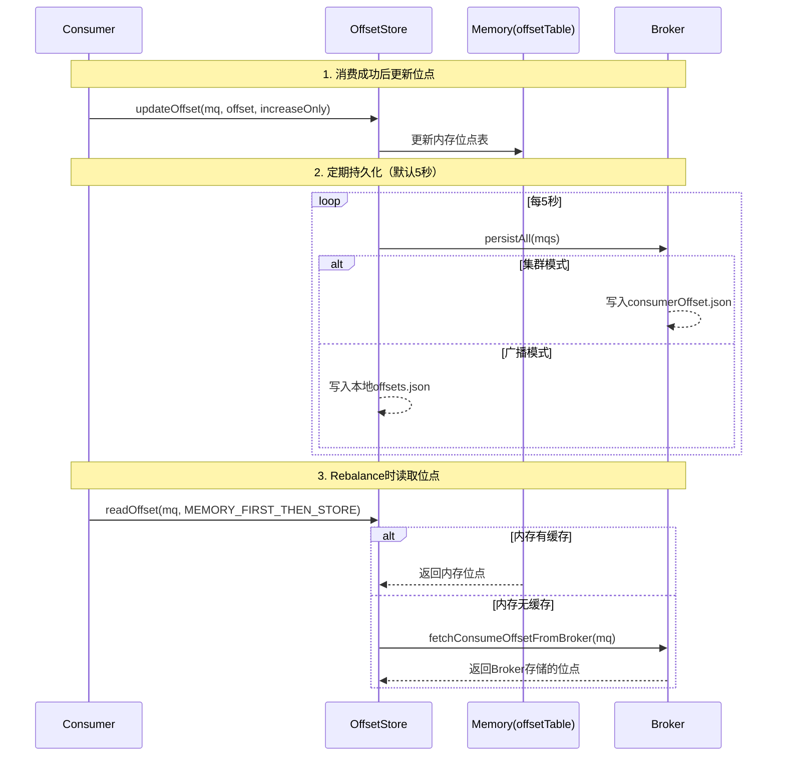
```mermaid
sequenceDiagram
    participant C as Consumer
    participant OS as OffsetStore
    participant M as Memory(offsetTable)
    participant B as Broker

    Note over C,B: 1. 消费成功后更新位点
    C->>OS: updateOffset(mq, offset, increaseOnly)
    OS->>M: 更新内存位点表
    
    Note over C,B: 2. 定期持久化（默认5秒）
    loop 每5秒
        OS->>B: persistAll(mqs)
        alt 集群模式
            B-->>B: 写入consumerOffset.json
        else 广播模式
            OS-->>OS: 写入本地offsets.json
        end
    end
    
    Note over C,B: 3. Rebalance时读取位点
    C->>OS: readOffset(mq, MEMORY_FIRST_THEN_STORE)
    alt 内存有缓存
        M-->>OS: 返回内存位点
    else 内存无缓存
        OS->>B: fetchConsumeOffsetFromBroker(mq)
        B-->>OS: 返回Broker存储的位点
    end
```

**位点读取类型**：

| ReadOffsetType | 说明 | 使用场景 |
| --- | --- | --- |
| `READ_FROM_MEMORY` | 仅从内存读取 | 快速获取，不保证最新 |
| `READ_FROM_STORE` | 从存储读取 | 内存无数据时使用 |
| `MEMORY_FIRST_THEN_STORE` | 先内存后存储 | Rebalance时获取初始位点 |


**位点提交时机**：

| 场景 | 位点更新 | 说明 |
| --- | --- | --- |
| 并发消费成功 | 立即更新 | `removeMessage()` 返回新位点 |
| 并发消费失败 | 不更新 | 消息发回Broker重试 |
| 顺序消费成功 | `commit()` 后更新 | 清空 `consumingMsgOrderlyTreeMap` |
| 顺序消费失败 | 不更新 | 消息放回 `msgTreeMap` |


**位点持久化配置**：

```java
// DefaultMQPushConsumer
persistConsumerOffsetInterval = 5000  // 位点持久化间隔，默认5秒

// 持久化触发时机
// 1. 定时任务：每5秒执行 persistAll()
// 2. 消费者关闭：shutdown() 时执行 persistAll()
// 3. Rebalance移除队列：执行 persist() 后 removeOffset()
```

**Rebalance时的位点处理**：

```java
// RebalancePushImpl.java
private boolean updateProcessQueueTableInRebalance(...) {
    // 新分配的队列
    for (MessageQueue mq : mqSet) {
        if (!this.processQueueTable.containsKey(mq)) {
            // 读取位点：先内存，后Broker
            long nextOffset = this.defaultMQPushConsumerImpl.getOffsetStore()
                .readOffset(mq, ReadOffsetType.MEMORY_FIRST_THEN_STORE);
            
            if (nextOffset >= 0) {
                ProcessQueue pq = new ProcessQueue();
                this.processQueueTable.put(mq, pq);
                
                PullRequest pullRequest = new PullRequest();
                pullRequest.setMessageQueue(mq);
                pullRequest.setNextOffset(nextOffset);
                this.defaultMQPushConsumerImpl.executePullRequestImmediately(pullRequest);
            }
        }
    }
    
    // 被移除的队列
    for (MessageQueue mq : mqSetFromConsumerSubscription) {
        if (!mqSet.contains(mq)) {
            ProcessQueue pq = this.processQueueTable.remove(mq);
            if (pq != null) {
                pq.setDropped(true);
                this.defaultMQPushConsumerImpl.getOffsetStore().persist(mq);
                this.defaultMQPushConsumerImpl.getOffsetStore().removeOffset(mq);
            }
        }
    }
}
```

**位点管理注意事项**：

| 注意点 | 说明 |
| --- | --- |
| `increaseOnly=true` | 位点只增不减，防止重复消费 |
| 内存缓存 | 消费者端维护内存位点表，减少网络请求 |
| 持久化延迟 | 默认5秒持久化一次，异常退出可能丢失位点 |
| 广播模式独立 | 每个消费者独立维护位点，互不影响 |
| 集群模式共享 | 同一消费者组共享位点，支持负载均衡 |


#### 5.3.8 消费失败处理流程
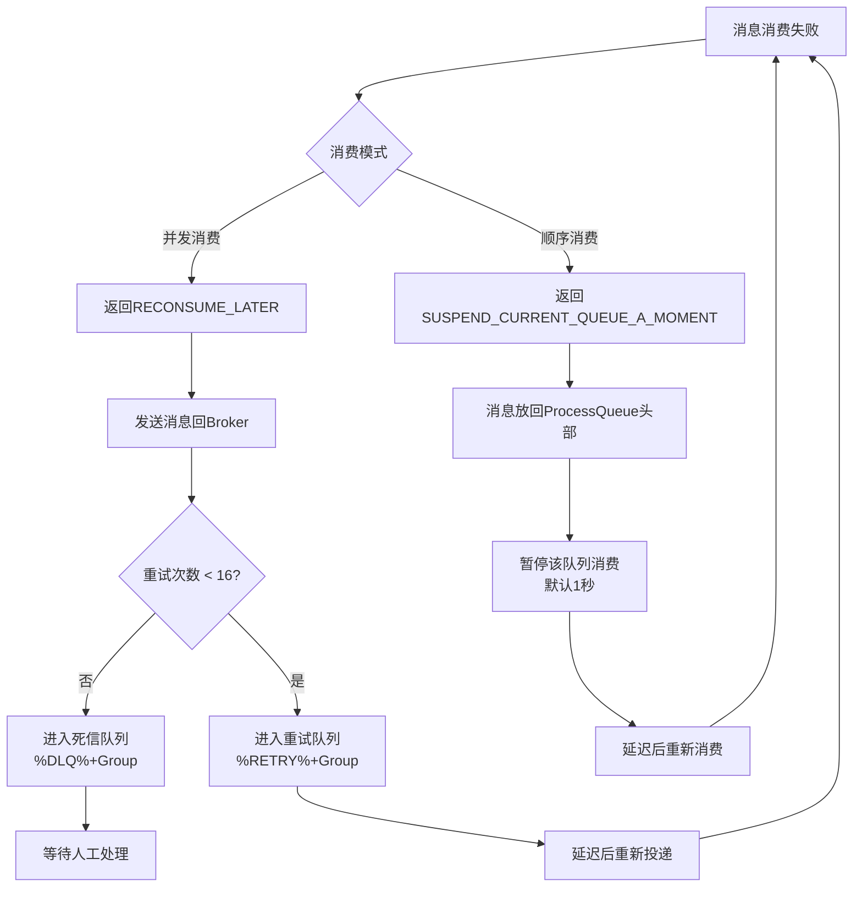
```mermaid
flowchart TD
    A[消息消费失败] --> B{消费模式}
    
    B -->|并发消费| C[返回RECONSUME_LATER]
    B -->|顺序消费| D[返回SUSPEND_CURRENT_QUEUE_A_MOMENT]
    
    C --> E[发送消息回Broker]
    E --> F{重试次数 < 16?}
    F -->|是| G[进入重试队列<br/>%RETRY%+Group]
    F -->|否| H[进入死信队列<br/>%DLQ%+Group]
    G --> I[延迟后重新投递]
    I --> A
    
    D --> J[消息放回ProcessQueue头部]
    J --> K[暂停该队列消费<br/>默认1秒]
    K --> L[延迟后重新消费]
    L --> A
    
    H --> M[等待人工处理]
```

**重试延迟级别**：

| 重试次数 | 延迟级别 | 延迟时间 | 重试次数 | 延迟级别 | 延迟时间 |
| --- | --- | --- | --- | --- | --- |
| 1 | 4 | 30秒 | 9 | 12 | 8分钟 |
| 2 | 5 | 1分钟 | 10 | 13 | 9分钟 |
| 3 | 6 | 2分钟 | 11 | 14 | 10分钟 |
| 4 | 7 | 3分钟 | 12 | 15 | 20分钟 |
| 5 | 8 | 4分钟 | 13 | 16 | 30分钟 |
| 6 | 9 | 5分钟 | 14 | 17 | 1小时 |
| 7 | 10 | 6分钟 | 15 | 18 | 2小时 |
| 8 | 11 | 7分钟 | 16 | → | 死信队列 |


#### 5.3.9 集群消费 vs 广播消费
RocketMQ 支持两种消费模式：集群消费（CLUSTERING）和广播消费（BROADCASTING），它们在消息投递、可靠性保障和适用场景上有本质区别。

**核心区别**：

```plain
┌─────────────────────────────────────────────────────────────────────────────┐
│                     集群消费 vs 广播消费 核心区别                              │
├─────────────────────────────────────────────────────────────────────────────┤
│                                                                             │
│  【集群消费 CLUSTERING】                                                      │
│  ─────────────────────                                                      │
│                                                                             │
│     Producer                                                                │
│        │                                                                    │
│        ▼                                                                    │
│     ┌──────┐      ┌──────┐      ┌──────┐                                   │
│     │Broker│ ───► │Broker│ ───► │Broker│                                   │
│     │ Q0   │      │ Q1   │      │ Q2   │                                   │
│     └──┬───┘      └──┬───┘      └──┬───┘                                   │
│        │             │             │                                        │
│        ▼             ▼             ▼                                        │
│     ┌──────┐      ┌──────┐      ┌──────┐                                   │
│     │ C1   │      │ C2   │      │ C3   │   ← 同一消费组                     │
│     └──────┘      └──────┘      └──────┘                                   │
│                                                                             │
│  特点：每条消息只被消费组内一个消费者消费（负载均衡）                             │
│                                                                             │
├─────────────────────────────────────────────────────────────────────────────┤
│                                                                             │
│  【广播消费 BROADCASTING】                                                    │
│  ─────────────────────                                                      │
│                                                                             │
│     Producer                                                                │
│        │                                                                    │
│        ▼                                                                    │
│     ┌──────┐                                                                │
│     │Broker│                                                                │
│     │ Topic│                                                                │
│     └──┬───┘                                                                │
│        │                                                                    │
│        ├──────────────────┬──────────────────┐                              │
│        ▼                  ▼                  ▼                              │
│     ┌──────┐           ┌──────┐           ┌──────┐                         │
│     │ C1   │           │ C2   │           │ C3   │  ← 同一消费组            │
│     └──────┘           └──────┘           └──────┘                         │
│                                                                             │
│  特点：每条消息被消费组内所有消费者消费（全量广播）                              │
│                                                                             │
└─────────────────────────────────────────────────────────────────────────────┘
```

**功能对比**：

| 对比维度 | 集群消费 (CLUSTERING) | 广播消费 (BROADCASTING) |
| --- | --- | --- |
| 消息投递 | 每条消息只投递给一个消费者 | 每条消息投递给所有消费者 |
| 消费进度存储 | Broker端（集中管理） | 本地文件（分散管理） |
| 重试机制 | ✅ 支持（最多16次） | ❌ 不支持 |
| 死信队列 | ✅ 支持 | ❌ 不支持 |
| 消息可靠性 | 高（有重试保障） | 低（失败即丢弃） |
| 消费者扩容 | 自动负载均衡 | 新消费者从最新开始 |
| 水平扩展能力 | ✅ 可通过增加消费者提升吞吐 | ❌ 增加消费者不提升吞吐 |

**广播消费的消息丢失场景**：

```plain
┌─────────────────────────────────────────────────────────────────────────────┐
│                     广播消费模式的消息丢失场景                                 │
├─────────────────────────────────────────────────────────────────────────────┤
│                                                                             │
│  场景一：消费失败                                                            │
│  ─────────────────                                                          │
│  消息到达 Consumer → 业务处理失败 → 直接丢弃消息，打印日志                      │
│  ❌ 没有重试机制，消息永久丢失                                                 │
│                                                                             │
│  场景二：消费者宕机                                                          │
│  ─────────────────                                                          │
│  消费者正在处理消息 → 宕机 → 本地消费进度文件丢失/过期                          │
│  ❌ 消费进度不持久化到Broker，依赖本地文件                                      │
│                                                                             │
│  场景三：新消费者加入                                                        │
│  ─────────────────                                                          │
│  新 Consumer 启动 → 没有历史消费进度 → 从最新消息开始消费                       │
│  ❌ 广播模式下新消费者无法消费历史消息                                          │
│                                                                             │
└─────────────────────────────────────────────────────────────────────────────┘
```

**源码分析 - 广播消费失败处理** ([ConsumeMessageConcurrentlyService.java](file:///d:/work/github/rocketmq/client/src/main/java/org/apache/rocketmq/client/impl/consumer/ConsumeMessageConcurrentlyService.java))：

```java
switch (this.defaultMQPushConsumer.getMessageModel()) {
    case BROADCASTING:
        for (int i = ackIndex + 1; i < consumeRequest.getMsgs().size(); i++) {
            MessageExt msg = consumeRequest.getMsgs().get(i);
            log.warn("BROADCASTING, the message consume failed, drop it, {}", msg.toString());
        }
        break;
    case CLUSTERING:
        // 集群模式：发送到重试队列
        for (int i = ackIndex + 1; i < consumeRequest.getMsgs().size(); i++) {
            MessageExt msg = consumeRequest.getMsgs().get(i);
            boolean result = this.sendMessageBack(msg, context);
            // ...
        }
        break;
}
```

**源码分析 - 消费进度存储差异** ([DefaultMQPushConsumerImpl.java](file:///d:/work/github/rocketmq/client/src/main/java/org/apache/rocketmq/client/impl/consumer/DefaultMQPushConsumerImpl.java))：

```java
switch (this.defaultMQPushConsumer.getMessageModel()) {
    case BROADCASTING:
        // 广播模式：消费进度存储在本地文件
        this.offsetStore = new LocalFileOffsetStore(this.mQClientFactory, 
            this.defaultMQPushConsumer.getConsumerGroup());
        break;
    case CLUSTERING:
        // 集群模式：消费进度存储在Broker
        this.offsetStore = new RemoteBrokerOffsetStore(this.mQClientFactory, 
            this.defaultMQPushConsumer.getConsumerGroup());
        break;
}
```

**集群消费适用场景**：

| 场景 | 说明 | 原因 |
| --- | --- | --- |
| 订单处理系统 | 订单创建后需要处理（扣库存、发通知） | 每个订单只需处理一次，需要重试保障 |
| 支付回调处理 | 支付成功后更新订单状态 | 必须保证消息不丢失，需要死信处理 |
| 数据同步 | MySQL → Elasticsearch 数据同步 | 每条数据变更只需同步一次，保证一致性 |
| 消息推送 | App推送通知、短信发送 | 每条消息只需发送一次，需要水平扩展 |
| 任务分发 | 分布式任务调度 | 任务只需被一个worker执行，需要负载均衡 |

**广播消费适用场景**：

| 场景 | 说明 | 原因 |
| --- | --- | --- |
| 本地缓存刷新 | 多台服务器本地缓存需要同步刷新 | 所有节点需要通知，丢失可接受（缓存会过期） |
| 日志收集（本地） | 每台服务器收集自己的日志 | 丢失少量日志可接受 |
| 监控告警（多实例） | 每个服务实例独立监控 | 丢失少量监控数据影响不大 |
| 配置更新通知 | 配置变更时通知所有节点 | 所有实例需要更新，最终会再次推送 |
| 分布式缓存失效 | 多级缓存场景，L1缓存需要广播失效 | 每个节点的本地缓存都需要失效 |

**选择决策**：

| 场景类型 | 推荐模式 | 原因 |
| --- | --- | --- |
| 核心业务（订单、支付） | 集群消费 | 需要可靠性保障 |
| 数据同步 | 集群消费 | 避免重复处理 |
| 高并发处理 | 集群消费 | 可水平扩展 |
| 缓存刷新 | 广播消费 | 所有节点需要通知 |
| 配置更新 | 广播消费 | 所有实例需要更新 |
| 日志收集 | 广播消费 | 可接受少量丢失 |

**代码示例**：

```java
// 集群消费配置（默认）
DefaultMQPushConsumer consumer = new DefaultMQPushConsumer("order_consumer_group");
consumer.setMessageModel(MessageModel.CLUSTERING);  // 默认值
consumer.subscribe("OrderTopic", "*");
consumer.registerMessageListener(new MessageListenerConcurrently() {
    @Override
    public ConsumeConcurrentlyStatus consumeMessage(List<MessageExt> msgs, 
            ConsumeConcurrentlyContext context) {
        // 处理订单消息
        // 失败返回 RECONSUME_LATER 会自动重试
        return ConsumeConcurrentlyStatus.CONSUME_SUCCESS;
    }
});
consumer.start();

// 广播消费配置
DefaultMQPushConsumer consumer = new DefaultMQPushConsumer("cache_refresh_group");
consumer.setMessageModel(MessageModel.BROADCASTING);  // 设置为广播模式
consumer.subscribe("ConfigChangeTopic", "*");
consumer.registerMessageListener(new MessageListenerConcurrently() {
    @Override
    public ConsumeConcurrentlyStatus consumeMessage(List<MessageExt> msgs, 
            ConsumeConcurrentlyContext context) {
        // 刷新本地缓存
        // 注意：失败不会重试，消息会丢失
        refreshLocalCache();
        return ConsumeConcurrentlyStatus.CONSUME_SUCCESS;
    }
});
consumer.start();
```


### 5.4 服务发现与路由管理
NameServer是RocketMQ的路由注册中心，负责管理Broker的路由信息，为Producer和Consumer提供服务发现能力。

#### 5.4.1 NameServer核心数据结构
**RouteInfoManager** ([RouteInfoManager.java](file:///d:/github/rocketmq/namesrv/src/main/java/org/apache/rocketmq/namesrv/routeinfo/RouteInfoManager.java)):

```java
public class RouteInfoManager {
    // Topic -> QueueData映射（每个Topic在各个Broker上的队列信息）
    private final HashMap<String/* topic */, Map<String /* brokerName */, QueueData>> topicQueueTable;
    
    // BrokerName -> BrokerData映射（Broker的基础信息）
    private final HashMap<String/* brokerName */, BrokerData> brokerAddrTable;
    
    // Cluster -> BrokerName集合（集群信息）
    private final HashMap<String/* clusterName */, Set<String/* brokerName */>> clusterAddrTable;
    
    // Broker地址 -> 存活信息（心跳检测）
    private final HashMap<BrokerAddrInfo/* brokerAddr */, BrokerLiveInfo> brokerLiveTable;
    
    // Broker地址 -> FilterServer列表
    private final HashMap<BrokerAddrInfo/* brokerAddr */, List<String>/* Filter Server */> filterServerTable;
}
```

**核心数据结构关系**:

```plain
┌─────────────────────────────────────────────────────────────────────────────┐
│                           NameServer路由信息                                 │
├─────────────────────────────────────────────────────────────────────────────┤
│                                                                             │
│  topicQueueTable                    brokerAddrTable                         │
│  ┌──────────────────────┐          ┌──────────────────────────────────┐    │
│  │ TopicA               │          │ Broker-A                         │    │
│  │  ├── Broker-A: QD1   │          │  ├── cluster: DefaultCluster     │    │
│  │  └── Broker-B: QD2   │          │  ├── brokerAddrs: {0:ip1, 1:ip2} │    │
│  │ TopicB               │          │  └── zoneName: zone1             │    │
│  │  └── Broker-A: QD3   │          │ Broker-B                         │    │
│  └──────────────────────┘          │  └── ...                         │    │
│                                    └──────────────────────────────────┘    │
│                                                                             │
│  clusterAddrTable                   brokerLiveTable                        │
│  ┌──────────────────────┐          ┌──────────────────────────────────┐    │
│  │ DefaultCluster       │          │ ip1:10911                        │    │
│  │  ├── Broker-A        │          │  ├── lastUpdate: 1234567890      │    │
│  │  └── Broker-B        │          │  ├── heartbeatTimeout: 10000     │    │
│  └──────────────────────┘          │  └── channel: NettyChannel       │    │
│                                    └──────────────────────────────────┘    │
└─────────────────────────────────────────────────────────────────────────────┘
```

**QueueData结构**:

```java
public class QueueData implements Comparable<QueueData> {
    private String brokerName;      // Broker名称
    private int readQueueNums;      // 读队列数量
    private int writeQueueNums;     // 写队列数量
    private int perm;               // 权限(读/写)
    private int topicSysFlag;       // Topic系统标记
}
```

**BrokerData结构**:

```java
public class BrokerData implements Comparable<BrokerData> {
    private String cluster;         // 所属集群
    private String brokerName;      // Broker名称
    private HashMap<Long/* brokerId */, String/* brokerAddr */> brokerAddrs;
                                    // brokerId: 0=Master, 1,2,3...=Slave
    private String zoneName;        // 可用区名称
}
```

**BrokerLiveInfo结构**:

```java
class BrokerLiveInfo {
    private long lastUpdateTimestamp;       // 最后更新时间
    private long heartbeatTimeoutMillis;    // 心跳超时时间
    private DataVersion dataVersion;        // 数据版本
    private Channel channel;                // Netty通道
    private String haServerAddr;            // HA服务地址
}
```

#### 5.4.2 Broker注册流程
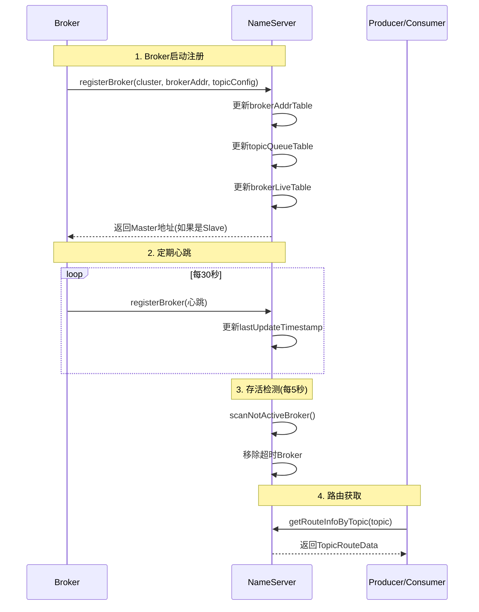
```mermaid
sequenceDiagram
    participant B as Broker
    participant N as NameServer
    participant P as Producer/Consumer

    Note over B,N: 1. Broker启动注册
    B->>N: registerBroker(cluster, brokerAddr, topicConfig)
    N->>N: 更新brokerAddrTable
    N->>N: 更新topicQueueTable
    N->>N: 更新brokerLiveTable
    N-->>B: 返回Master地址(如果是Slave)

    Note over B,N: 2. 定期心跳
    loop 每30秒
        B->>N: registerBroker(心跳)
        N->>N: 更新lastUpdateTimestamp
    end

    Note over N: 3. 存活检测(每5秒)
    N->>N: scanNotActiveBroker()
    N->>N: 移除超时Broker

    Note over P,N: 4. 路由获取
    P->>N: getRouteInfoByTopic(topic)
    N-->>P: 返回TopicRouteData
```

**Broker注册核心代码**:

```java
public RegisterBrokerResult registerBroker(
    final String clusterName,
    final String brokerAddr,
    final String brokerName,
    final long brokerId,
    final TopicConfigSerializeWrapper topicConfigWrapper,
    final Channel channel) {
    
    try {
        this.lock.writeLock().lockInterruptibly();
        
        // 1. 更新集群信息
        Set<String> brokerNames = clusterAddrTable.computeIfAbsent(clusterName, k -> new HashSet<>());
        brokerNames.add(brokerName);
        
        // 2. 更新Broker信息
        BrokerData brokerData = brokerAddrTable.get(brokerName);
        if (brokerData == null) {
            brokerData = new BrokerData(clusterName, brokerName, new HashMap<>());
            brokerAddrTable.put(brokerName, brokerData);
        }
        brokerData.getBrokerAddrs().put(brokerId, brokerAddr);
        
        // 3. 更新Topic信息
        if (topicConfigWrapper != null) {
            for (TopicConfig topicConfig : topicConfigWrapper.getTopicConfigTable().values()) {
                QueueData queueData = new QueueData(brokerName, 
                    topicConfig.getReadQueueNums(), 
                    topicConfig.getWriteQueueNums(), 
                    topicConfig.getPerm());
                topicQueueTable.computeIfAbsent(topicConfig.getTopicName(), k -> new HashMap<>())
                    .put(brokerName, queueData);
            }
        }
        
        // 4. 更新存活信息
        BrokerLiveInfo prevBrokerLiveInfo = brokerLiveTable.put(
            new BrokerAddrInfo(clusterName, brokerAddr),
            new BrokerLiveInfo(System.currentTimeMillis(), 
                DEFAULT_BROKER_CHANNEL_EXPIRED_TIME, 
                topicConfigWrapper.getDataVersion(), 
                channel, haServerAddr));
        
    } finally {
        this.lock.writeLock().unlock();
    }
    
    return result;
}
```

#### 5.4.3 Broker存活检测
NameServer通过定时任务检测Broker是否存活：

```java
// 每5秒扫描一次
public void scanNotActiveBroker() {
    for (Entry<BrokerAddrInfo, BrokerLiveInfo> next : brokerLiveTable.entrySet()) {
        long last = next.getValue().getLastUpdateTimestamp();
        long timeoutMillis = next.getValue().getHeartbeatTimeoutMillis();
        
        // 当前时间 > 最后更新时间 + 超时时间，则判定Broker不活跃
        if ((last + timeoutMillis) < System.currentTimeMillis()) {
            // 关闭通道
            RemotingUtil.closeChannel(next.getValue().getChannel());
            // 移除Broker
            this.onChannelDestroy(next.getKey());
        }
    }
}
```

**心跳超时配置**:

| 配置项 | 默认值 | 说明 |
| --- | --- | --- |
| `DEFAULT_BROKER_CHANNEL_EXPIRED_TIME` | 120000ms (2分钟) | Broker心跳超时时间 |
| `registerNameServerPeriod` | 30000ms (30秒) | Broker注册间隔 |
| `brokerHeartbeatInterval` | 1000ms | Broker心跳间隔(RocketMQ 5.0+) |


#### 5.4.4 路由信息获取
Producer和Consumer通过NameServer获取路由信息：

```java
public TopicRouteData pickupTopicRouteData(final String topic) {
    TopicRouteData topicRouteData = new TopicRouteData();
    boolean foundQueueData = false;
    boolean foundBrokerData = false;
    
    // 1. 获取Topic对应的队列信息
    Map<String, QueueData> queueDataMap = topicQueueTable.get(topic);
    if (queueDataMap != null) {
        topicRouteData.setQueueDatas(new ArrayList<>(queueDataMap.values()));
        foundQueueData = true;
        
        // 2. 获取对应的Broker信息
        for (QueueData qd : queueDataMap.values()) {
            BrokerData brokerData = brokerAddrTable.get(qd.getBrokerName());
            if (brokerData != null) {
                BrokerData brokerDataClone = new BrokerData();
                brokerDataClone.setBrokerName(brokerData.getBrokerName());
                brokerDataClone.setBrokerAddrs(new HashMap<>(brokerData.getBrokerAddrs()));
                topicRouteData.getBrokerDatas().add(brokerDataClone);
                foundBrokerData = true;
            }
        }
    }
    
    return foundQueueData && foundBrokerData ? topicRouteData : null;
}
```

#### 5.4.5 NameServer设计特点
| 特点 | 说明 |
| --- | --- |
| 无状态 | 各NameServer节点独立，无信息同步 |
| AP设计 | 优先可用性，允许短暂的数据不一致 |
| 轻量级 | 不依赖ZooKeeper，独立部署 |
| 最终一致 | Broker心跳机制保证最终一致性 |


**NameServer vs ZooKeeper**:

| 特性 | NameServer | ZooKeeper |
| --- | --- | --- |
| 一致性协议 | 无 | ZAB协议 |
| 部署复杂度 | 简单 | 复杂 |
| 性能 | 高 | 较低 |
| 功能 | 路由注册 | 分布式协调 |
| 适用场景 | 轻量级服务发现 | 复杂分布式协调 |


#### 5.4.6 NameServer高可用部署
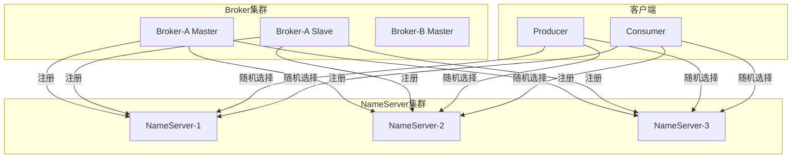
```mermaid
flowchart TD
    subgraph NameServer集群
        NS1[NameServer-1]
        NS2[NameServer-2]
        NS3[NameServer-3]
    end
    
    subgraph Broker集群
        B1[Broker-A Master]
        B2[Broker-A Slave]
        B3[Broker-B Master]
    end
    
    subgraph 客户端
        P[Producer]
        C[Consumer]
    end
    
    B1 -->|注册| NS1
    B1 -->|注册| NS2
    B1 -->|注册| NS3
    
    B2 -->|注册| NS1
    B2 -->|注册| NS2
    B2 -->|注册| NS3
    
    P -->|随机选择| NS1
    P -->|随机选择| NS2
    P -->|随机选择| NS3
    
    C -->|随机选择| NS1
    C -->|随机选择| NS2
    C -->|随机选择| NS3
```

**客户端连接策略**:

```java
// 客户端配置多个NameServer地址
producer.setNamesrvAddr("ns1:9876;ns2:9876;ns3:9876");

// 客户端随机选择一个NameServer获取路由
// 如果失败，自动切换到下一个
public TopicRouteData getAnExistTopicRouteInfoFromNameServer(final String topic) {
    for (String namesrvAddr : namesrvAddrList) {
        try {
            return this.mQClientAPIImpl.getTopicRouteInfoFromNameServer(topic, namesrvAddr);
        } catch (Exception e) {
            log.warn("getTopicRouteInfoFromNameServer failed, try next", e);
        }
    }
    return null;
}
```

### 5.5 消息发送高可用机制
本节深入介绍消息发送的高可用机制，包括队列选择策略的详细实现、故障规避机制等。队列选择的基本流程参见 [5.1.4 队列选择策略](#514-队列选择策略)。

#### 5.5.1 队列选择策略详解
在多Broker环境下，Producer需要从多个Broker的队列中选择合适的队列发送消息。RocketMQ提供了以下选择策略：

```mermaid
flowchart TD
    A[开始发送消息] --> B{lastBrokerName是否为空?}
    B -->|是| C[轮询选择队列]
    B -->|否| D[优先选择非lastBroker的队列]
    C --> E[返回选中的MessageQueue]
    D --> F{找到非lastBroker队列?}
    F -->|是| E
    F -->|否| C
```

**核心代码实现** ([TopicPublishInfo.java](file:///d:/github/rocketmq/client/src/main/java/org/apache/rocketmq/client/impl/producer/TopicPublishInfo.java)):

```java
public MessageQueue selectOneMessageQueue(final String lastBrokerName) {
    if (lastBrokerName == null) {
        return selectOneMessageQueue();
    } else {
        // 优先选择非上次失败Broker的队列
        for (int i = 0; i < this.messageQueueList.size(); i++) {
            int index = this.sendWhichQueue.incrementAndGet();
            int pos = Math.abs(index) % this.messageQueueList.size();
            MessageQueue mq = this.messageQueueList.get(pos);
            if (!mq.getBrokerName().equals(lastBrokerName)) {
                return mq;
            }
        }
        return selectOneMessageQueue();
    }
}

public MessageQueue selectOneMessageQueue() {
    // 简单轮询选择队列
    int index = this.sendWhichQueue.incrementAndGet();
    int pos = Math.abs(index) % this.messageQueueList.size();
    return this.messageQueueList.get(pos);
}
```

#### 5.5.2 多Broker负载均衡机制
```mermaid
flowchart LR
    subgraph Topic:OrderTopic
        Q0[Queue0<br/>Broker-A]
        Q1[Queue1<br/>Broker-A]
        Q2[Queue2<br/>Broker-B]
        Q3[Queue3<br/>Broker-B]
    end

    subgraph Producer集群
        P1[Producer1]
        P2[Producer2]
        P3[Producer3]
    end

    P1 -->|轮询| Q0
    P1 -->|轮询| Q2
    P2 -->|轮询| Q1
    P2 -->|轮询| Q3
    P3 -->|轮询| Q0
    P3 -->|轮询| Q2
```

**负载均衡特点**：

| 特性 | 描述 | 实现方式 |
| --- | --- | --- |
| 轮询选择 | 按顺序依次选择队列 | ThreadLocalIndex递增取模 |
| 故障隔离 | 避免选择失败的Broker | 记录lastBrokerName |
| 延迟容错 | 根据Broker响应时间调整选择 | MQFaultStrategy |
| 本地线程安全 | 每个线程独立的选择器 | ThreadLocalIndex |


**lastBrokerName详解**：

`lastBrokerName`是Producer在消息发送失败重试时用于**故障隔离**的关键参数：

| 属性 | 说明 |
| --- | --- |
| **定义** | 上一次消息发送失败的Broker名称 |
| **初始值** | `null`（首次发送时） |
| **更新时机** | 每次发送失败后更新为当前Broker名称 |
| **作用** | 重试时优先选择其他Broker，实现故障隔离 |
| **适用场景** | 同步发送重试、异步发送重试 |


```java
// 核心逻辑 (DefaultMQProducerImpl.java)
for (; times < timesTotal; times++) {
    // 获取上次选择的Broker名称（首次为null）
    String lastBrokerName = null == mq ? null : mq.getBrokerName();
    
    // 选择队列时避开lastBrokerName对应的Broker
    MessageQueue mqSelected = this.selectOneMessageQueue(topicPublishInfo, lastBrokerName);
    
    try {
        sendResult = this.sendKernelImpl(msg, mq, ...);
        // 发送成功...
    } catch (Exception e) {
        // 发送失败，记录故障项，继续重试
        this.updateFaultItem(mq.getBrokerName(), ..., true);
        continue;  // 下次循环时，lastBrokerName就是当前失败的Broker
    }
}
```

**连续失败场景分析**：

`lastBrokerName`只会保留**最后一次**失败的Broker名称，而不是所有失败的Broker列表：

```mermaid
sequenceDiagram
    participant P as Producer
    participant BA as Broker-A
    participant BB as Broker-B

    Note over P: 假设只有2个Broker
    Note over P: 第1次尝试，lastBrokerName=null
    P->>BA: 发送消息
    BA-->>P: ❌ 失败
    Note over P: lastBrokerName = "Broker-A"
    
    Note over P: 第2次尝试，避开Broker-A
    P->>BB: 发送消息
    BB-->>P: ❌ 失败
    Note over P: lastBrokerName = "Broker-B"（覆盖了之前的）
    
    Note over P: 第3次尝试，避开Broker-B
    Note over P: 可能又选到Broker-A！
    P->>BA: 发送消息
    BA-->>P: ❌ 失败
```

**潜在问题**：如果只有2个Broker，连续失败时会出现"来回切换"：

| 重试次数 | lastBrokerName | 选择的Broker |
| --- | --- | --- |
| 1 | null | Broker-A（随机） |
| 2 | Broker-A | Broker-B |
| 3 | Broker-B | Broker-A（又回到失败的Broker） |
| 4 | Broker-A | Broker-B |


**补偿机制：MQFaultStrategy**：

RocketMQ通过`updateFaultItem`机制记录每个Broker的故障情况，作为额外保护：

```java
// MQFaultStrategy.java
private boolean sendLatencyFaultEnable = false;  // 默认关闭！

public void updateFaultItem(final String brokerName, final long currentLatency, boolean isolation) {
    if (this.sendLatencyFaultEnable) {  // 只有开启时才生效
        long duration = computeNotAvailableDuration(isolation ? 30000 : currentLatency);
        this.latencyFaultTolerance.updateFaultItem(brokerName, currentLatency, duration);
    }
}
```

**重要说明**：`sendLatencyFaultEnable`默认值为`false`，意味着：

| 配置状态 | lastBrokerName | MQFaultStrategy |
| --- | --- | --- |
| 默认（false） | ✅ 生效 | ❌ 不生效 |
| 开启（true） | ✅ 生效 | ✅ 生效 |


**默认情况下，只有**`lastBrokerName`**机制在工作**。如需启用完整的故障规避能力，需要手动开启：

```java
producer.setSendLatencyFaultEnable(true);
```

**两种机制互斥关系**：

| sendLatencyFaultEnable | 使用的机制 | 说明 |
| --- | --- | --- |
| `false`（默认） | lastBrokerName | 简单避开上次失败的Broker |
| `true` | MQFaultStrategy | 基于延迟动态隔离，不使用lastBrokerName |


```java
// MQFaultStrategy.selectOneMessageQueue()
public MessageQueue selectOneMessageQueue(TopicPublishInfo tpInfo, String lastBrokerName) {
    if (this.sendLatencyFaultEnable) {
        // 启用时：使用MQFaultStrategy机制，忽略lastBrokerName参数
        // ... 基于延迟容错选择队列
    }
    // 关闭时：使用lastBrokerName机制
    return tpInfo.selectOneMessageQueue(lastBrokerName);
}
```

##### MQFaultStrategy故障规避机制
**核心原理**：根据Broker的响应延迟动态调整隔离时间，延迟越高隔离时间越长。

```java
private long[] latencyMax = {50L, 100L, 550L, 1000L, 2000L, 3000L, 15000L};
private long[] notAvailableDuration = {0L, 0L, 30000L, 60000L, 120000L, 180000L, 600000L};

// 从后往前匹配
private long computeNotAvailableDuration(long currentLatency) {
    for (int i = latencyMax.length - 1; i >= 0; i--) {
        if (currentLatency >= latencyMax[i])
            return notAvailableDuration[i];
    }
    return 0;
}
```

| 延迟范围 | 隔离时长 | 说明 |
| --- | --- | --- |
| >= 15s | 10分钟 | 极严重延迟 |
| >= 3s | 3分钟 | 严重延迟 |
| >= 2s | 2分钟 | 高延迟 |
| >= 1s | 1分钟 | 较高延迟 |
| >= 550ms | 30秒 | 中等延迟 |
| < 550ms | 不隔离 | 正常 |


**isolation隔离参数**：

```java
public void updateFaultItem(String brokerName, long currentLatency, boolean isolation) {
    // isolation=true: 固定30秒隔离
    // isolation=false: 根据延迟动态计算
    long duration = computeNotAvailableDuration(isolation ? 30000 : currentLatency);
}
```

| isolation | 隔离时长 | 触发场景 |
| --- | --- | --- |
| `true` | 固定30秒 | 发送异常（网络/客户端/Broker错误） |
| `false` | 根据延迟计算 | 发送成功或线程中断 |


**队列选择流程**：

```java
public MessageQueue selectOneMessageQueue(TopicPublishInfo tpInfo, String lastBrokerName) {
    if (this.sendLatencyFaultEnable) {
        // Step 1: 轮询遍历，找可用Broker
        int index = tpInfo.getSendWhichQueue().incrementAndGet();
        for (int i = 0; i < tpInfo.getMessageQueueList().size(); i++) {
            int pos = Math.abs(index++) % tpInfo.getMessageQueueList().size();
            MessageQueue mq = tpInfo.getMessageQueueList().get(pos);
            if (latencyFaultTolerance.isAvailable(mq.getBrokerName()))
                return mq;
        }
        // Step 2: 所有Broker不可用，选择"最不坏"的
        String notBestBroker = latencyFaultTolerance.pickOneAtLeast();
        // Step 3: 兜底随机选择
        return tpInfo.selectOneMessageQueue();
    }
    return tpInfo.selectOneMessageQueue(lastBrokerName);
}
```

| 步骤 | 条件 | 动作 |
| --- | --- | --- |
| 1 | 存在可用Broker | 直接返回该队列 |
| 2 | 所有Broker不可用 | 选择延迟最低/恢复最早的Broker |
| 3 | 异常或无队列 | 兜底随机选择 |


**轮询遍历示例**：

```plain
队列列表: [Q0, Q1, Q2, Q3], Broker-A(Q0,Q1)不可用, Broker-B(Q2,Q3)可用

第1次调用: index=1
  pos=1 → Q1(Broker-A)不可用 → pos=2 → Q2(Broker-B)可用 → 返回

第2次调用: index=2
  pos=2 → Q2(Broker-B)可用 → 返回

第3次调用: index=3
  pos=3 → Q3(Broker-B)可用 → 返回
```

**工作流程**：

```mermaid
flowchart LR
    A[发送消息] --> B{Broker可用?}
    B -->|是| C[选择该Broker]
    B -->|否| D[选择隔离时间最短的Broker]
    C --> E[记录响应延迟]
    E --> F{延迟是否超阈值?}
    F -->|是| G[隔离该Broker]
    F -->|否| H[正常使用]
```

**两种机制对比**：

| 特性 | lastBrokerName | MQFaultStrategy |
| --- | --- | --- |
| 记录范围 | 仅最后一次失败的Broker | 所有Broker的故障状态 |
| 隔离策略 | 简单避开 | 根据延迟动态隔离 |
| 默认状态 | ✅ 始终生效 | ❌ 默认关闭 |
| 适用场景 | 简单故障隔离 | 高可用生产环境 |


**启用方式**：

```java
producer.setSendLatencyFaultEnable(true);
```

##### LatencyFaultTolerance延迟容错
**核心数据结构**：

```plain
ConcurrentHashMap<String, FaultItem> faultItemTable
┌─────────────────────────────────────────────────────────┐
│  Key: BrokerName                                        │
│  Value: FaultItem                                       │
│    ├── name: Broker名称                                  │
│    ├── currentLatency: 当前延迟                          │
│    └── startTimestamp: 可用开始时间 (= 当前时间 + 隔离时长) │
└─────────────────────────────────────────────────────────┘
```

**核心方法**：

| 方法 | 功能 | 说明 |
| --- | --- | --- |
| `updateFaultItem` | 更新故障项 | 记录延迟，设置隔离结束时间 |
| `isAvailable` | 判断是否可用 | 当前时间 >= startTimestamp |
| `pickOneAtLeast` | 选择最不坏的Broker | 所有Broker都不可用时使用 |


**可用性判断**：

```java
// FaultItem.isAvailable()
public boolean isAvailable() {
    // startTimestamp = 当前时间 + 隔离时长
    // 当 当前时间 >= startTimestamp 时，表示隔离期已过，可用
    return (System.currentTimeMillis() - startTimestamp) >= 0;
}
```

**pickOneAtLeast选择策略**：

当所有Broker都不可用时，从故障列表中选择"最不坏"的：

```java
public String pickOneAtLeast() {
    List<FaultItem> tmpList = new LinkedList<>(faultItemTable.values());
    Collections.sort(tmpList);  // 排序：可用优先 > 延迟低优先 > 恢复早优先
    
    final int half = tmpList.size() / 2;
    if (half <= 0) {
        return tmpList.get(0).getName();
    } else {
        // 从前半部分（较好的）中轮询选择
        return tmpList.get(whichItemWorst.incrementAndGet() % half).getName();
    }
}
```

**FaultItem排序规则**：

```java
public int compareTo(FaultItem other) {
    // 1. 可用优先
    if (this.isAvailable() != other.isAvailable())
        return this.isAvailable() ? -1 : 1;
    
    // 2. 延迟低优先
    if (this.currentLatency != other.currentLatency)
        return this.currentLatency < other.currentLatency ? -1 : 1;
    
    // 3. 恢复时间早优先
    return this.startTimestamp < other.startTimestamp ? -1 : 1;
}
```

**示例场景**：

```plain
假设3个Broker状态：
- Broker-A: 延迟200ms, 隔离30秒 (startTimestamp = 12:00:30)
- Broker-B: 延迟500ms, 隔离30秒 (startTimestamp = 12:00:30)  
- Broker-C: 延迟2s, 隔离120秒 (startTimestamp = 12:02:00)

当前时间 12:00:10，排序结果：
1. Broker-A (延迟最低)
2. Broker-B (延迟次低)
3. Broker-C (延迟最高)

pickOneAtLeast返回: Broker-A 或 Broker-B (轮询选择)
```

##### TopicPublishInfo主题发布信息
**核心属性**：

| 属性 | 类型 | 说明 |
| --- | --- | --- |
| `messageQueueList` | List | Topic下所有可写队列 |
| `sendWhichQueue` | ThreadLocalIndex | 线程本地队列选择器 |
| `topicRouteData` | TopicRouteData | 原始路由数据 |
| `orderTopic` | boolean | 是否顺序消息 |


**messageQueueList初始化逻辑**：

```java
// MQClientInstance.topicRouteData2TopicPublishInfo()
public static TopicPublishInfo topicRouteData2TopicPublishInfo(String topic, TopicRouteData route) {
    TopicPublishInfo info = new TopicPublishInfo();
    
    // 遍历所有QueueData，筛选可写的队列
    for (QueueData qd : route.getQueueDatas()) {
        if (PermName.isWriteable(qd.getPerm())) {  // 检查写权限
            // 找到对应的BrokerData
            BrokerData brokerData = findBrokerData(route, qd.getBrokerName());
            
            // 确保Master存在
            if (brokerData.getBrokerAddrs().containsKey(MASTER_ID)) {
                // 根据writeQueueNums创建MessageQueue
                for (int i = 0; i < qd.getWriteQueueNums(); i++) {
                    MessageQueue mq = new MessageQueue(topic, qd.getBrokerName(), i);
                    info.getMessageQueueList().add(mq);
                }
            }
        }
    }
    return info;
}
```

**初始化流程**：

```plain
TopicRouteData (从NameServer获取)
├── QueueData列表
│   ├── brokerName: "Broker-A"
│   ├── readQueueNums: 4
│   ├── writeQueueNums: 4
│   └── perm: 6 (可读可写)
├── QueueData列表
│   ├── brokerName: "Broker-B"
│   └── ...
└── BrokerData列表
    ├── brokerName: "Broker-A"
    └── brokerAddrs: {0=ip1:10911, 1=ip1:10912}
    
           ↓ 转换

TopicPublishInfo
└── messageQueueList:
    ├── MessageQueue{topic="Order", brokerName="Broker-A", queueId=0}
    ├── MessageQueue{topic="Order", brokerName="Broker-A", queueId=1}
    ├── MessageQueue{topic="Order", brokerName="Broker-B", queueId=0}
    └── MessageQueue{topic="Order", brokerName="Broker-B", queueId=1}
```

##### Client元数据管理
**核心元数据表**：

```java
// MQClientInstance.java
public class MQClientInstance {
    // Topic路由信息表
    ConcurrentMap<String/*Topic*/, TopicRouteData> topicRouteTable;
    
    // Broker地址表
    ConcurrentMap<String/*BrokerName*/, HashMap<Long/*brokerId*/, String/*address*/>> brokerAddrTable;
    
    // Topic端点表（静态Topic）
    ConcurrentMap<String, ConcurrentMap<MessageQueue, String>> topicEndPointsTable;
    
    // Broker版本表
    ConcurrentMap<String/*BrokerName*/, HashMap<String/*address*/, Integer/*version*/>> brokerVersionTable;
}
```

**TopicRouteData结构**：

```plain
TopicRouteData (从NameServer获取)
├── orderTopicConf: 顺序Topic配置
├── queueDatas: List<QueueData>
│   ├── brokerName: "Broker-A"
│   ├── readQueueNums: 4
│   ├── writeQueueNums: 4
│   └── perm: 6 (权限)
├── brokerDatas: List<BrokerData>
│   ├── brokerName: "Broker-A"
│   └── brokerAddrs: {0=ip:10911, 1=ip:10912}
└── filterServerTable: 过滤服务器地址
```

**元数据更新流程**：

```mermaid
sequenceDiagram
    participant C as Client
    participant NS as NameServer
    participant B as Broker

    Note over C: 1. 启动时/发送消息前
    C->>NS: getTopicRouteInfoFromNameServer(topic)
    NS-->>C: TopicRouteData
    C->>C: 更新topicRouteTable
    C->>C: 更新brokerAddrTable
    C->>C: 生成TopicPublishInfo

    Note over C: 2. 定时刷新(30秒)
    C->>NS: getTopicRouteInfoFromNameServer
    NS-->>C: TopicRouteData
    C->>C: 检测变化并更新

    Note over C,B: 3. Broker上下线
    B->>NS: 注册/注销
    C->>NS: 下次获取时感知变化
```

**更新触发时机**：

| 时机 | 说明 |
| --- | --- |
| 启动时 | 初始化时从NameServer拉取 |
| 发送消息前 | 发现本地无路由信息时拉取 |
| 定时任务 | 每30秒刷新一次 |
| 路由变化 | NameServer检测到Broker变化 |


**队列选择逻辑**：

```java
// 简单轮询选择
public MessageQueue selectOneMessageQueue() {
    int index = this.sendWhichQueue.incrementAndGet();
    int pos = Math.abs(index) % this.messageQueueList.size();
    return this.messageQueueList.get(pos);
}

// 避开指定Broker选择
public MessageQueue selectOneMessageQueue(final String lastBrokerName) {
    if (lastBrokerName == null) {
        return selectOneMessageQueue();
    }
    for (int i = 0; i < this.messageQueueList.size(); i++) {
        int index = this.sendWhichQueue.incrementAndGet();
        int pos = Math.abs(index) % this.messageQueueList.size();
        MessageQueue mq = this.messageQueueList.get(pos);
        if (!mq.getBrokerName().equals(lastBrokerName)) {
            return mq;
        }
    }
    return selectOneMessageQueue();  // 找不到则降级为简单轮询
}
```

**队列列表示例**：

```plain
Topic: OrderTopic
messageQueueList:
┌────────────────────────────────────────┐
│ [0] MessageQueue{brokerName=Broker-A, queueId=0} │
│ [1] MessageQueue{brokerName=Broker-A, queueId=1} │
│ [2] MessageQueue{brokerName=Broker-B, queueId=0} │
│ [3] MessageQueue{brokerName=Broker-B, queueId=1} │
└────────────────────────────────────────┘

轮询选择过程:
- 第1次: index=1, pos=1 → Queue1(Broker-A)
- 第2次: index=2, pos=2 → Queue0(Broker-B)
- 第3次: index=3, pos=3 → Queue1(Broker-B)
- 第4次: index=4, pos=0 → Queue0(Broker-A)
```

**ThreadLocalIndex线程安全**：

```java
// 每个线程独立的计数器，避免多线程竞争
public class ThreadLocalIndex {
    private final ThreadLocal<Integer> threadLocalIndex = new ThreadLocal<Integer>();
    
    public int incrementAndGet() {
        Integer index = threadLocalIndex.get();
        if (null == index) {
            index = 0;
        }
        index = Math.abs(index + 1);
        threadLocalIndex.set(index);
        return index;
    }
}
```

#### 5.5.3 发送失败重试机制详解
发送重试的基本流程参见 [5.1.5 发送重试机制](#515-发送重试机制)。本节重点介绍重试过程中的消息重复问题及解决方案。

```mermaid
sequenceDiagram
    participant P as Producer
    participant NS as NameServer
    participant BA as Broker-A
    participant BB as Broker-B

    P->>NS: 获取Topic路由信息
    NS-->>P: 返回Broker列表
    P->>BA: 发送消息到Queue0
    BA-->>P: 发送失败
    Note over P: 记录lastBrokerName=Broker-A
    P->>BB: 重试发送到Queue2
    BB-->>P: 发送成功
```

**重试策略配置**：

```java
// 默认重试次数
private int retryTimesWhenSendFailed = 2;

// 重试逻辑
for (int times = 0; times <= retryTimesWhenSendFailed; times++) {
    MessageQueue mqSelected = this.selectOneMessageQueue(topicPublishInfo, lastBrokerName);
    try {
        SendResult sendResult = this.sendKernelImpl(msg, mqSelected);
        return sendResult;
    } catch (Exception e) {
        lastBrokerName = mqSelected.getBrokerName();
        if (times >= retryTimesWhenSendFailed) {
            throw e;
        }
    }
}
```

**消息重复问题**：

RocketMQ 的设计理念是**至少投递一次（At Least Once）**，这意味着消息可能会重复。理解重复场景对设计幂等消费者至关重要。

**消息重复的场景**：

| 场景 | 原因 | 发生时机 |
| --- | --- | --- |
| 发送重试 | Broker存储成功但响应丢失 | 网络抖动、Broker重启 |
| 消费重试 | 消费成功但提交位点失败 | 消费者宕机、网络中断 |
| 消费超时 | 消费处理时间超过阈值 | 业务处理慢、系统负载高 |
| Rebalance | 位点回退导致重复消费 | 消费者上下线、队列重新分配 |
| 主从切换 | Slave未同步完全部消息 | Master宕机、HA延迟 |


**场景详解**：

```plain
场景1: 发送重试导致重复（Broker间重复）
Producer                    Broker-A        Broker-B
   │                           │                │
   │──发送消息────────────────→│                │
   │                        存储成功✓            │
   │←─响应丢失✗──────────────│                │
   │                        超时重试            │
   │──发送消息────────────────────────────────→│
   │                                        存储成功✓
   │←─响应成功────────────────────────────────│
   │                                           │
结果: 同一消息在Broker-A和Broker-B各存一份
特点: MsgId相同，但存储在不同Broker

场景2: 消费重试导致重复（位点未提交）
Consumer                    Broker
   │                           │
   │←──拉取消息(offset=100)────│
   │  消费成功✓                 │
   │  提交位点失败✗(宕机)        │
   │                           │
   │  重启后重新消费             │
   │←──拉取消息(offset=100)────│
   │  再次消费同一消息           │
结果: 同一消息被消费两次
特点: MsgId相同，同一Broker

场景3: 消费超时导致重复投递
Consumer                    Broker
   │                           │
   │←──拉取消息(offset=100)────│
   │  开始处理消息               │
   │  处理耗时过长(>15分钟)       │
   │                           │
   │  Broker判定超时            │
   │  消息重新可见              │
   │←──重新投递消息─────────────│
   │  再次收到同一消息           │
结果: 消息被重复投递
特点: 第一次消费可能成功也可能失败

场景4: Rebalance导致重复消费
Consumer-A                  Consumer-B      Broker
   │                           │               │
   │  持有Queue0, offset=100    │               │
   │  消费offset=100成功        │               │
   │  提交位点(offset=101)      │               │
   │        │                  │               │
   │     Rebalance触发          │               │
   │  Queue0分配给Consumer-B    │               │
   │        │                  │               │
   │  位点同步延迟              │               │
   │        │                  │               │
   │                           │←─拉取消息────│
   │                           │  offset=100   │
   │                           │  再次消费     │
结果: Consumer-A和Consumer-B都消费了offset=100
特点: 位点同步存在延迟窗口

场景5: 主从切换导致重复
Consumer                    Master           Slave
   │                           │               │
   │←──拉取消息(offset=100)────│               │
   │  消费成功                  │               │
   │                           │   Master宕机  │
   │                           │       ↓       │
   │                           │   Slave升主   │
   │                           │               │
   │  位点未同步到Slave         │               │
   │                           │               │
   │←──重新拉取(新Master)─────────────────────│
   │  offset=100 (Slave未同步) │               │
结果: 消息被重复消费
特点: HA同步延迟导致位点丢失
```

**广播模式的重复特点**：

广播模式下，每个消费者独立消费所有队列，重复场景有所不同：

| 特性 | 集群模式 | 广播模式 |
| --- | --- | --- |
| 重复范围 | 同一消费者组内 | 每个消费者独立 |
| 位点存储 | Broker端共享 | 消费者本地文件 |
| Rebalance影响 | 可能导致重复 | 无Rebalance |
| 消费失败重试 | ✅ 支持 | ❌ 不支持，直接丢弃 |
| 重复概率 | 较高 | 较低（位点本地管理） |


```plain
广播模式重复场景:
Consumer-A (本地位点: 100)        Consumer-B (本地位点: 100)
        │                                │
        │  各自独立消费                    │
        │  各自维护本地位点                │
        │                                │
        │  Consumer-A宕机                 │
        │  本地位点文件可能损坏             │
        │                                │
        │  重启后从备份位点恢复             │
        │  可能回退到offset=95             │
        │                                │
        │←─重新消费offset=95-100          │
        │                                │
结果: Consumer-A可能重复消费，Consumer-B不受影响
```

**幂等处理方案**：

| 方案 | 实现方式 | 适用场景 | 优缺点 |
| --- | --- | --- | --- |
| 数据库唯一索引 | `INSERT IGNORE` 或唯一约束 | 关系型数据库存储 | 简单可靠，依赖数据库 |
| Redis去重 | `SETNX` + 过期时间 | 高并发场景 | 性能高，需考虑Redis可靠性 |
| 状态机 | 业务状态流转控制 | 复杂业务流程 | 业务侵入性强，但最准确 |
| 多版本并发控制 | 乐观锁版本号 | 更新操作 | 避免并发更新问题 |


**幂等处理最佳实践**：

```java
// 方案1: 数据库唯一索引（推荐）
consumer.registerMessageListener((msgs, context) -> {
    for (MessageExt msg : msgs) {
        String messageId = msg.getMsgId();  // 或使用业务Key
        String businessKey = msg.getKeys();
        
        try {
            // 利用数据库唯一索引保证幂等
            orderMapper.insertOrderLog(messageId, businessKey, ...);
            // 业务处理
            processOrder(msg);
        } catch (DuplicateKeyException e) {
            // 消息已处理，直接确认
            log.warn("消息已处理, msgId={}", messageId);
        }
    }
    return ConsumeConcurrentlyStatus.CONSUME_SUCCESS;
});

// 方案2: Redis去重
consumer.registerMessageListener((msgs, context) -> {
    for (MessageExt msg : msgs) {
        String key = "mq:processed:" + msg.getMsgId();
        
        // SETNX + 过期时间（建议设置较长，如24小时）
        Boolean isNew = redisTemplate.opsForValue()
            .setIfAbsent(key, "1", 24, TimeUnit.HOURS);
        
        if (Boolean.TRUE.equals(isNew)) {
            process(msg);  // 首次处理
        } else {
            log.warn("消息已处理, msgId={}", msg.getMsgId());
        }
    }
    return ConsumeConcurrentlyStatus.CONSUME_SUCCESS;
});

// 方案3: 业务状态机（订单场景）
consumer.registerMessageListener((msgs, context) -> {
    for (MessageExt msg : msgs) {
        Order order = parseOrder(msg);
        
        // 检查当前状态是否允许处理
        Order current = orderMapper.selectById(order.getId());
        if (current.getStatus() == OrderStatus.PAID 
            && order.getTargetStatus() == OrderStatus.SHIPPED) {
            // 状态流转：已支付 → 已发货
            orderMapper.updateStatus(order.getId(), 
                OrderStatus.PAID, OrderStatus.SHIPPED);
        } else {
            log.warn("订单状态不匹配, orderId={}, current={}", 
                order.getId(), current.getStatus());
        }
    }
    return ConsumeConcurrentlyStatus.CONSUME_SUCCESS;
});
```

**幂等Key选择建议**：

| Key类型 | 示例 | 适用场景 |
| --- | --- | --- |
| MsgId | `AC110001...` | 通用去重，无业务含义 |
| 业务Key | `ORDER_12345` | 业务关联，便于追踪 |
| 组合Key | `ORDER_12345_CREATE` | 同一业务多操作 |


**设计理念**：消息重复优于消息丢失，由消费者保证幂等。

#### 5.5.4 顺序消费与并发消费
**基本对比**：

| 特性 | 顺序消费 | 并发消费 |
| --- | --- | --- |
| 消费方式 | 单线程串行 | 多线程并行 |
| 消息顺序 | 严格保证 | 不保证 |
| 吞吐量 | 较低 | 较高 |
| 实现类 | ConsumeMessageOrderlyService | ConsumeMessageConcurrentlyService |
| 队列锁 | ✅ MessageQueueLock | ❌ 无 |
| Broker锁 | ✅ 集群模式需要 | ❌ 无 |
| 消费锁 | ✅ ProcessQueue.consumeLock | ❌ 无 |
| 失败处理 | 暂停队列，消息放回队列头部重试 | 发送回Broker重试队列，继续消费后续消息 |
| 重试次数 | 默认Integer.MAX_VALUE | 默认16次 |
| 位点提交 | 消费成功后自动提交 | 消费后立即更新 |
| 连续消费时间限制 | MAX_TIME_CONSUME_CONTINUOUSLY=60s | 无限制 |
| 消费超时检测 | 无 | consumeTimeout=15分钟，超时发回Broker |
| 过期消息清理 | 无 | cleanExpireMsg定时任务（每15分钟） |


**顺序消费流程**：

```plain
┌─────────────────────────────────────────────────────────┐
│  Queue0                                                 │
│  ┌─────┬─────┬─────┬─────┐                             │
│  │ M1  │ M2  │ M3  │ M4  │ → 单线程按顺序消费           │
│  └─────┴─────┴─────┴─────┘                             │
│         ↓ M1 → M2 → M3 → M4                            │
│  锁: 队列级别，同一队列只能被一个消费者线程处理           │
└─────────────────────────────────────────────────────────┘
```

**并发消费流程**：

```plain
┌─────────────────────────────────────────────────────────┐
│  Queue0                                                 │
│  ┌─────┬─────┬─────┬─────┐                             │
│  │ M1  │ M2  │ M3  │ M4  │ → 线程池并行消费             │
│  └─────┴─────┴─────┴─────┘                             │
│    ↓     ↓     ↓     ↓                                  │
│  Thread1 Thread2 Thread3 Thread4                        │
│  (M1)   (M2)   (M3)   (M4)                              │
└─────────────────────────────────────────────────────────┘
```

**代码示例**：

```java
// 并发消费
consumer.registerMessageListener((msgs, context) -> {
    // 多线程并行处理，不保证顺序
    processMessages(msgs);
    return ConsumeConcurrentlyStatus.CONSUME_SUCCESS;
});

// 顺序消费
consumer.registerMessageListener((msgs, context) -> {
    // 单线程串行处理，保证顺序
    for (MessageExt msg : msgs) {
        processMessage(msg);
    }
    return ConsumeOrderlyStatus.SUCCESS;
});
```

**顺序消费核心实现**：

顺序消费通过**三重锁机制**保证消息顺序性：

```mermaid
flowchart TD
    A[ConsumeRequest.run] --> B[获取队列锁 objLock]
    B --> C{synchronized objLock}
    C --> D{检查ProcessQueue状态}
    D -->|已丢弃| E[退出]
    D -->|集群模式| F{检查Broker锁}
    F -->|未锁定/过期| G[延迟重试获取锁]
    F -->|已锁定| H[开始消费循环]
    D -->|广播模式| H
    H --> I[批量取消息]
    I --> J[获取消费锁 consumeLock]
    J --> K[执行业务监听器]
    K --> L[处理消费结果]
    L --> M{是否继续消费?}
    M -->|是| I
    M -->|否| N[释放锁退出]
```

**三重锁详解**：

| 锁类型 | 作用范围 | 目的 | 源码位置 |
| --- | --- | --- | --- |
| 队列锁 (objLock) | MessageQueue级别 | 保证同一队列只有一个线程消费 | MessageQueueLock.fetchLockObject() |
| Broker锁 (processQueue.locked) | ProcessQueue级别 | 集群模式下标识队列是否被当前消费者锁定 | RebalanceImpl.lock() |
| 消费锁 (consumeLock) | ProcessQueue内部 | 消费过程中防止队列被丢弃 | ProcessQueue.consumeLock |


```java
// ConsumeMessageOrderlyService.ConsumeRequest.run()
final Object objLock = messageQueueLock.fetchLockObject(this.messageQueue);
synchronized (objLock) {
    // 1. 集群模式检查Broker锁
    if (MessageModel.CLUSTERING.equals(messageModel)
        && (!this.processQueue.isLocked() || this.processQueue.isLockExpired())) {
        // 未获取到Broker锁，延迟重试
        tryLockLaterAndReconsume(this.messageQueue, this.processQueue, 10);
        break;
    }
    
    // 2. 消费循环（持续消费直到超时或无消息）
    for (boolean continueConsume = true; continueConsume; ) {
        // 批量取消息
        List<MessageExt> msgs = this.processQueue.takeMessages(consumeBatchSize);
        
        // 3. 获取消费锁后执行业务逻辑
        this.processQueue.getConsumeLock().lock();
        try {
            status = messageListener.consumeMessage(msgs, context);
        } finally {
            this.processQueue.getConsumeLock().unlock();
        }
        
        // 4. 处理消费结果
        continueConsume = processConsumeResult(msgs, status, context, this);
    }
}
```

**顺序消费失败处理**：

```java
// processConsumeResult() - 消费结果处理
switch (status) {
    case SUCCESS:
        commitOffset = processQueue.commit();  // 提交位点，移除已消费消息
        break;
    case SUSPEND_CURRENT_QUEUE_A_MOMENT:
        if (checkReconsumeTimes(msgs)) {
            // 消息重新放回队列头部，延迟后重新消费
            processQueue.makeMessageToConsumeAgain(msgs);
            submitConsumeRequestLater(..., context.getSuspendCurrentQueueTimeMillis());
            continueConsume = false;  // 暂停当前队列消费
        } else {
            // 超过最大重试次数，已发送到Broker重试队列/死信队列
            commitOffset = processQueue.commit();
        }
        break;
    case ROLLBACK:  // 仅非自动提交模式有效
        processQueue.rollback();  // 回滚消息
        break;
    case COMMIT:    // 仅非自动提交模式有效
        commitOffset = processQueue.commit();
        break;
}
```

**顺序消费重试机制详解**：

顺序消费的重试逻辑与并发消费不同，通过 `checkReconsumeTimes()` 判断：

```java
// ConsumeMessageOrderlyService.checkReconsumeTimes()
private boolean checkReconsumeTimes(List<MessageExt> msgs) {
    boolean suspend = false;
    for (MessageExt msg : msgs) {
        if (msg.getReconsumeTimes() >= getMaxReconsumeTimes()) {
            // 超过最大重试次数，尝试发送到Broker重试队列/死信队列
            if (!sendMessageBack(msg)) {
                // 发送失败，继续本地重试
                suspend = true;
                msg.setReconsumeTimes(msg.getReconsumeTimes() + 1);
            }
            // 发送成功，跳过该消息（不暂停队列）
        } else {
            // 未超过最大重试次数，继续本地重试
            suspend = true;
            msg.setReconsumeTimes(msg.getReconsumeTimes() + 1);
        }
    }
    return suspend;  // true=暂停队列继续本地重试, false=跳过消息继续消费
}
```

| 重试次数 | sendMessageBack结果 | 处理方式 |
| --- | --- | --- |
| < 最大值 | - | 本地重试（消息放回msgTreeMap头部） |
| >= 最大值 | 成功 | 发送到Broker重试队列/死信队列，跳过消息 |
| >= 最大值 | 失败 | 继续本地重试 |


**顺序消费 vs 并发消费重试对比**：

| 特性 | 顺序消费 | 并发消费 |
| --- | --- | --- |
| 重试位置 | 本地ProcessQueue | Broker重试队列 |
| 失败处理 | 暂停队列，消息放回头部 | 发回Broker，继续消费后续消息 |
| 重试次数限制 | 默认Integer.MAX_VALUE | 默认16次 |
| 超限处理 | 发送到Broker重试队列/死信队列 | 直接进入死信队列 |
| 队列影响 | 暂停整个队列 | 不影响队列 |


**最大重试次数配置** ([DefaultMQPushConsumer.java](file:///d:/github/rocketmq/client/src/main/java/org/apache/rocketmq/client/consumer/DefaultMQPushConsumer.java))：

| 消费模式 | 默认值 | 说明 |
| --- | --- | --- |
| **并发消费** | **16次** | `maxReconsumeTimes = -1` 时，-1 表示 16 |
| **顺序消费** | **Integer.MAX_VALUE** | `maxReconsumeTimes = -1` 时，-1 表示无限重试 |


```java
// DefaultMQPushConsumer.java
private int maxReconsumeTimes = -1;  // 默认值

// 并发消费模式下获取最大重试次数
private int getMaxReconsumeTimes() {
    if (this.defaultMQPushConsumer.getMaxReconsumeTimes() == -1) {
        return 16;  // -1 表示 16
    } else {
        return this.defaultMQPushConsumer.getMaxReconsumeTimes();
    }
}

// 顺序消费模式下获取最大重试次数
private int getMaxReconsumeTimes() {
    if (this.defaultMQPushConsumer.getMaxReconsumeTimes() == -1) {
        return Integer.MAX_VALUE;  // -1 表示无限重试
    } else {
        return this.defaultMQPushConsumer.getMaxReconsumeTimes();
    }
}
```

**自定义最大重试次数**：

```java
// 设置最大重试次数为 20 次
consumer.setMaxReconsumeTimes(20);
```

| 配置项 | 说明 |
| --- | --- |
| `maxReconsumeTimes = -1` | 使用默认值（并发16次，顺序无限） |
| `maxReconsumeTimes = 5` | 自定义为 5 次 |
| `maxReconsumeTimes = 0` | 不重试，直接进入死信队列 |


**死信队列 (DLQ)**：

当消息重试次数超过最大值后，会进入死信队列（Dead Letter Queue）：

| 项目 | 说明 |
| --- | --- |
| Topic命名 | `%DLQ%` + ConsumerGroup |
| 示例 | `%DLQ%OrderConsumerGroup` |
| 消息特性 | 永久存储，不会自动删除 |

> **详细的死信队列机制、产生条件、处理方式参见 [5.11 死信队列](#511-死信队列)。**

**消费结果状态对比**：

**ConsumeOrderlyStatus 枚举** ([ConsumeOrderlyStatus.java](file:///d:/github/rocketmq/client/src/main/java/org/apache/rocketmq/client/consumer/listener/ConsumeOrderlyStatus.java))：

| 枚举值 | 含义 | 说明 |
| --- | --- | --- |
| `SUCCESS` | 消费成功 | 消息消费成功，提交位点 |
| `ROLLBACK` | 回滚消费 | 已废弃，仅用于binlog消费场景 |
| `COMMIT` | 提交位点 | 已废弃，仅用于binlog消费场景 |
| `SUSPEND_CURRENT_QUEUE_A_MOMENT` | 暂停队列 | 消费失败，暂停当前队列一段时间，消息放回队列头部重试 |


**ConsumeConcurrentlyStatus 枚举** ([ConsumeConcurrentlyStatus.java](file:///d:/github/rocketmq/client/src/main/java/org/apache/rocketmq/client/consumer/listener/ConsumeConcurrentlyStatus.java))：

| 枚举值 | 含义 | 说明 |
| --- | --- | --- |
| `CONSUME_SUCCESS` | 消费成功 | 消息消费成功，更新位点 |
| `RECONSUME_LATER` | 稍后重试 | 消费失败，消息发回Broker重试队列 |


**状态对比表**：

| 状态 | 顺序消费 (ConsumeOrderlyStatus) | 并发消费 (ConsumeConcurrentlyStatus) |
| --- | --- | --- |
| 成功 | SUCCESS | CONSUME_SUCCESS |
| 失败重试 | SUSPEND_CURRENT_QUEUE_A_MOMENT | RECONSUME_LATER |
| 提交 | COMMIT (仅非autoCommit, 已废弃) | - |
| 回滚 | ROLLBACK (仅非autoCommit, 已废弃) | - |
| 返回null | 视为SUSPEND_CURRENT_QUEUE_A_MOMENT | 视为RECONSUME_LATER |
| 抛异常 | 视为SUSPEND_CURRENT_QUEUE_A_MOMENT | 视为RECONSUME_LATER |


**注意事项**：

| 状态 | 说明 |
| --- | --- |
| `COMMIT` | 已标记 `@Deprecated`，仅用于binlog消费场景，普通业务不应使用 |
| `ROLLBACK` | 已标记 `@Deprecated`，仅用于binlog消费场景，普通业务不应使用 |
| `SUSPEND_CURRENT_QUEUE_A_MOMENT` | 暂停当前队列一段时间（默认10ms），消息放回队列头部等待重试 |


**autoCommit机制（顺序消费特有）**：

顺序消费支持手动控制消息提交，通过 `ConsumeOrderlyContext.setAutoCommit(false)` 开启：

```java
consumer.registerMessageListener((List<MessageExt> msgs, ConsumeOrderlyContext context) -> {
    context.setAutoCommit(false);  // 关闭自动提交
    
    try {
        processMessages(msgs);
        return ConsumeOrderlyStatus.COMMIT;    // 手动提交，消息确认消费
    } catch (Exception e) {
        return ConsumeOrderlyStatus.ROLLBACK;  // 手动回滚，消息重新消费
    }
});
```

| autoCommit | COMMIT | ROLLBACK | SUSPEND_CURRENT_QUEUE_A_MOMENT |
| --- | --- | --- | --- |
| true (默认) | 视为SUCCESS | 视为SUCCESS | 消息放回队列头部重试 |
| false | 提交位点，确认消费 | 回滚消息，重新消费 | 消息放回队列头部重试 |


**ackIndex机制（并发消费特有）**：

并发消费支持**部分成功**处理，通过 `ConsumeConcurrentlyContext.setAckIndex()` 标记成功边界：

```java
consumer.registerMessageListener((List<MessageExt> msgs, ConsumeConcurrentlyContext context) -> {
    for (int i = 0; i < msgs.size(); i++) {
        try {
            processMessage(msgs.get(i));
        } catch (Exception e) {
            // 设置ackIndex：[0, ackIndex] 成功，(ackIndex, n) 失败
            context.setAckIndex(i - 1);
            return ConsumeConcurrentlyStatus.CONSUME_SUCCESS;  // 部分成功
        }
    }
    return ConsumeConcurrentlyStatus.CONSUME_SUCCESS;  // 全部成功
});
```

| ackIndex值 | 成功消息 | 失败消息处理 |
| --- | --- | --- |
| msgs.size()-1 | 全部 | 无 |
| 0 | msgs[0] | msgs[1..n] 发回Broker重试 |
| -1 | 无 | 全部发回Broker重试 |


**消费超时清理机制（并发消费特有）**：

并发消费服务启动时，会创建定时任务清理过期消息：

```java
// ConsumeMessageConcurrentlyService.start()
this.cleanExpireMsgExecutors.scheduleAtFixedRate(new Runnable() {
    public void run() {
        cleanExpireMsg();  // 清理过期消息
    }
}, consumeTimeout, consumeTimeout, TimeUnit.MINUTES);  // 默认15分钟

// cleanExpireMsg() 遍历所有ProcessQueue，清理超时消息
private void cleanExpireMsg() {
    for (ProcessQueue pq : processQueueTable.values()) {
        pq.cleanExpiredMsg(defaultMQPushConsumer);  // 发送超时消息回Broker
    }
}
```

顺序消费**没有**此机制，因为顺序消费失败会暂停队列，消息不会无限期滞留。

**消费返回类型（用于监控统计）**：

| 返回类型 | 触发条件 | 说明 |
| --- | --- | --- |
| SUCCESS | 正常返回SUCCESS/CONSUME_SUCCESS | 消费成功 |
| FAILED | 返回SUSPEND_CURRENT_QUEUE_A_MOMENT/RECONSUME_LATER | 消费失败 |
| EXCEPTION | 抛出异常 | 消费异常 |
| RETURN_NULL | 返回null | 监听器返回空 |
| TIME_OUT | 消费耗时超过consumeTimeout | 消费超时 |


```java
// 消费耗时判断
long consumeRT = System.currentTimeMillis() - beginTimestamp;
if (consumeRT >= defaultMQPushConsumer.getConsumeTimeout() * 60 * 1000) {
    returnType = ConsumeReturnType.TIME_OUT;
}
```

**并发消费核心实现**：

并发消费无需队列锁，消息直接提交到线程池并行处理：

```mermaid
flowchart TD
    A[PullMessage获取消息] --> B[放入ProcessQueue]
    B --> C[提交ConsumeRequest到线程池]
    C --> D[线程池取出任务执行]
    D --> E[执行业务监听器]
    E --> F{消费结果}
    F -->|CONSUME_SUCCESS| G[更新消费位点]
    F -->|RECONSUME_LATER| H[发送回Broker重试]
    G --> I[从ProcessQueue移除消息]
    H --> J[消息进入重试队列]
```

```java
// ConsumeMessageConcurrentlyService.ConsumeRequest.run()
public void run() {
    if (this.processQueue.isDropped()) {
        return;  // 队列已丢弃，直接退出
    }
    
    // 无需队列锁，直接消费
    ConsumeConcurrentlyContext context = new ConsumeConcurrentlyContext(messageQueue);
    
    try {
        // 设置消费开始时间
        for (MessageExt msg : msgs) {
            MessageAccessor.setConsumeStartTimeStamp(msg, String.valueOf(System.currentTimeMillis()));
        }
        // 执行业务监听器
        status = listener.consumeMessage(Collections.unmodifiableList(msgs), context);
    } catch (Throwable e) {
        hasException = true;
    }
    
    // 处理消费结果
    if (null == status || hasException) {
        status = ConsumeConcurrentlyStatus.RECONSUME_LATER;
    }
    
    // 更新位点或发送回Broker
    long offset = processQueue.removeMessage(msgs);
    if (status == ConsumeConcurrentlyStatus.RECONSUME_LATER) {
        sendMessageBack(msg, context);  // 发送回Broker重试队列
    }
    defaultMQPushConsumerImpl.getOffsetStore().updateOffset(messageQueue, offset, true);
}
```

**顺序消费关键点**：

+ 同一Queue的消息严格按顺序消费
+ 通过队列锁实现（MessageQueueLock）
+ 消费失败会阻塞后续消息（SUSPEND_CURRENT_QUEUE_A_MOMENT）

**顺序消费多线程配置的作用**：

顺序消费服务内部使用线程池，但通过队列锁保证同一队列只能被一个线程消费：

```java
// ConsumeMessageOrderlyService.java
final Object objLock = messageQueueLock.fetchLockObject(this.messageQueue);
synchronized (objLock) {
    // 同一队列只能有一个线程进入
}
```

多线程的实际作用是**并行消费不同队列**，而非同一队列内的并行：

```plain
┌─────────────────────────────────────────────────────────────────┐
│  Consumer实例（配置了4个消费线程）                                │
│                                                                 │
│  ┌─────────┐  ┌─────────┐  ┌─────────┐  ┌─────────┐            │
│  │ Thread1 │  │ Thread2 │  │ Thread3 │  │ Thread4 │            │
│  └────┬────┘  └────┬────┘  └────┬────┘  └────┬────┘            │
│       │            │            │            │                  │
│       ▼            ▼            ▼            ▼                  │
│  ┌─────────┐  ┌─────────┐  ┌─────────┐  ┌─────────┐            │
│  │ Queue0  │  │ Queue1  │  │ Queue2  │  │ Queue3  │  ← 不同队列  │
│  │ M1→M2→M3│  │ M1→M2→M3│  │ M1→M2→M3│  │ M1→M2→M3│    并行消费  │
│  └─────────┘  └─────────┘  └─────────┘  └─────────┘            │
│       ↑            ↑            ↑            ↑                  │
│       └────────────┴────────────┴────────────┘                  │
│              每个队列内部：单线程串行，保证顺序                     │
└─────────────────────────────────────────────────────────────────┘
```

| 场景 | 配置多线程的效果 |
| --- | --- |
| 消费者分配到多个队列 | ✅ 有用 - 不同队列并行消费，提升吞吐量 |
| 消费者只分配到1个队列 | ❌ 无用 - 只有1个线程能获取锁，其他线程空闲 |
| 同一队列内的消息 | ❌ 无法并行 - 队列锁保证串行消费 |


**最佳实践**：线程数建议与分配到的队列数匹配，例如每个消费者分配4个队列，则`consumeThreadMin=4`即可。

### 5.6 消息消费负载均衡机制
#### 5.6.1 消费者Rebalance机制
在多Broker环境下，消费者通过Rebalance机制实现队列的动态分配：

```mermaid
flowchart TD
    subgraph 触发阶段
        A[Rebalance触发] --> B{触发源}
        B -->|定时任务| B1[每20秒检查]
        B -->|消费者变化| B2[上线/下线]
        B -->|队列变化| B3[Topic配置变更]
        B -->|Broker变化| B4[Broker上下线]
    end
    
    subgraph 信息收集阶段
        B1 & B2 & B3 & B4 --> C[获取Topic所有队列]
        C --> D[获取消费者组所有消费者]
        D --> E[从NameServer/Broker获取]
    end
    
    subgraph 分配计算阶段
        E --> F[排序队列和消费者列表]
        F --> G[执行分配策略]
        G --> H{分配结果是否变化?}
    end
    
    subgraph 执行阶段
        H -->|是| I[更新消费队列]
        H -->|否| J[保持现状]
        I --> K[处理新增队列]
        I --> L[处理移除队列]
        K --> M[创建ProcessQueue]
        M --> N[生成PullRequest]
        N --> O[开始拉取消息]
        L --> P[设置dropped=true]
        P --> Q[停止消费]
    end
```

**Rebalance详细时序图**：

```mermaid
sequenceDiagram
    participant C as Consumer
    participant MQF as MQClientInstance
    participant NS as NameServer
    participant B as Broker
    participant R as RebalanceImpl

    Note over C,R: 定时触发 (每20秒)
    C->>MQF: doRebalance()
    MQF->>R: rebalanceByTopic(topic)
    
    R->>NS: 获取Topic路由信息
    NS-->>R: TopicRouteData
    
    R->>B: 获取消费者组列表
    B-->>R: 消费者ID列表
    
    R->>R: 排序队列和消费者
    R->>R: 执行分配策略
    
    alt 分配结果变化
        R->>R: updateProcessQueueTableInRebalance()
        
        loop 新增队列
            R->>R: 创建ProcessQueue
            R->>R: 创建PullRequest
            R->>MQF: putPullRequest()
        end
        
        loop 移除队列
            R->>R: 设置dropped=true
            R->>R: 移除ProcessQueue
        end
    end
```

#### 5.6.2 队列分配策略
**平均分配策略** ([AllocateMessageQueueAveragely.java](file:///d:/github/rocketmq/client/src/main/java/org/apache/rocketmq/client/consumer/rebalance/AllocateMessageQueueAveragely.java)):

```java
public List<MessageQueue> allocate(String consumerGroup, String currentCID, 
    List<MessageQueue> mqAll, List<String> cidAll) {
    
    List<MessageQueue> result = new ArrayList<>();
    int index = cidAll.indexOf(currentCID);
    int mod = mqAll.size() % cidAll.size();
    
    // 计算每个消费者分配的队列数量
    int averageSize = mqAll.size() <= cidAll.size() ? 1 : 
        (mod > 0 && index < mod ? mqAll.size() / cidAll.size() + 1 : 
         mqAll.size() / cidAll.size());
    
    // 计算起始索引
    int startIndex = (mod > 0 && index < mod) ? 
        index * averageSize : index * averageSize + mod;
    
    // 分配队列
    int range = Math.min(averageSize, mqAll.size() - startIndex);
    for (int i = 0; i < range; i++) {
        result.add(mqAll.get((startIndex + i) % mqAll.size()));
    }
    return result;
}
```

**分配示例**：

```plain
假设: 8个队列(Q0-Q7), 3个消费者(C0-C1-C2)

队列列表: [Q0, Q1, Q2, Q3, Q4, Q5, Q6, Q7]
消费者列表: [C0, C1, C2]

分配结果:
- C0: [Q0, Q1, Q2]    (3个队列)
- C1: [Q3, Q4, Q5]    (3个队列)
- C2: [Q6, Q7]        (2个队列)

计算过程:
- mod = 8 % 3 = 2
- C0(index=0): averageSize=3, startIndex=0, range=3 → [Q0,Q1,Q2]
- C1(index=1): averageSize=3, startIndex=3, range=3 → [Q3,Q4,Q5]
- C2(index=2): averageSize=2, startIndex=6, range=2 → [Q6,Q7]
```

#### 5.6.3 多Broker消费流程
```mermaid
sequenceDiagram
    participant C1 as Consumer1
    participant C2 as Consumer2
    participant NS as NameServer
    participant BA as Broker-A
    participant BB as Broker-B

    Note over C1,C2: Rebalance阶段
    C1->>NS: 获取Topic路由信息
    NS-->>C1: 返回Broker列表
    C2->>NS: 获取Topic路由信息
    NS-->>C2: 返回Broker列表
    
    Note over C1,C2: 队列分配
    C1->>C1: 分配到Queue0,Queue2
    C2->>C2: 分配到Queue1,Queue3
    
    Note over C1,C2: 消费阶段
    C1->>BA: 拉取Queue0消息
    C1->>BB: 拉取Queue2消息
    C2->>BA: 拉取Queue1消息
    C2->>BB: 拉取Queue3消息
    
    BA-->>C1: 返回消息
    BB-->>C1: 返回消息
    BA-->>C2: 返回消息
    BB-->>C2: 返回消息
```

#### 5.6.4 消费模式对比
| 消费模式 | 队列分配 | 消息处理 | 适用场景 |
| --- | --- | --- | --- |
| 集群模式(Clustering) | 每个队列只被一个消费者消费 | 负载均衡，提高吞吐量 | 大数据处理、日志收集 |
| 广播模式(Broadcasting) | 每个消费者消费所有队列 | 消息广播，所有消费者都收到 | 配置推送、缓存更新 |


```mermaid
flowchart TB
    subgraph 集群模式
        subgraph Topic
            Q0[Queue0]
            Q1[Queue1]
            Q2[Queue2]
        end
        C1[Consumer1] --> Q0
        C2[Consumer2] --> Q1
        C3[Consumer3] --> Q2
    end

    subgraph 广播模式
        subgraph Topic2
            Q3[Queue0]
            Q4[Queue1]
        end
        C4[Consumer1] --> Q3
        C4 --> Q4
        C5[Consumer2] --> Q3
        C5 --> Q4
    end
```

**广播消费核心实现**：

广播模式下，每个消费者实例都会消费Topic下的所有队列，无需队列分配：

```mermaid
flowchart TD
    A[Rebalance触发] --> B{消息模式}
    B -->|BROADCASTING| C[获取Topic所有队列]
    C --> D[消费者订阅所有队列]
    D --> E[创建所有队列的PullRequest]
    E --> F[每个消费者独立消费所有消息]
    
    B -->|CLUSTERING| G[获取消费者组所有消费者]
    G --> H[队列分配策略]
    H --> I[每个消费者分配部分队列]
```

**广播模式关键特性**：

| 特性 | 广播模式 | 集群模式 |
| --- | --- | --- |
| 队列分配 | 所有消费者订阅全部队列 | 队列按消费者数量均分 |
| 位点存储 | 本地文件 (LocalFileOffsetStore) | Broker端 (RemoteBrokerOffsetStore) |
| 消费进度 | 每个消费者独立维护 | 消费者组共享 |
| 消息重试 | ❌ 不支持 | ✅ 支持（发送回Broker重试队列） |
| 消费失败 | 消息丢弃，记录日志 | 发送回Broker重试 |
| Broker锁 | ❌ 不需要 | ✅ 顺序消费需要 |


**广播消费位点存储**：

广播模式消费位点存储在消费者本地文件：

```java
// DefaultMQPushConsumerImpl.java
switch (this.defaultMQPushConsumer.getMessageModel()) {
    case BROADCASTING:
        // 广播模式：位点存储在本地文件
        this.offsetStore = new LocalFileOffsetStore(this.mQClientFactory, groupName);
        break;
    case CLUSTERING:
        // 集群模式：位点存储在Broker
        this.offsetStore = new RemoteBrokerOffsetStore(this.mQClientFactory, groupName);
        break;
}

// LocalFileOffsetStore 存储路径
// 默认: ${user.home}/.rocketmq_offsets/{clientId}/{groupName}/offsets.json
public final static String LOCAL_OFFSET_STORE_DIR = System.getProperty(
    "rocketmq.client.localOffsetStoreDir",
    System.getProperty("user.home") + File.separator + ".rocketmq_offsets");
```

**广播消费失败处理**：

广播模式不支持消息重试，消费失败的消息直接丢弃：

```java
// ConsumeMessageConcurrentlyService.processConsumeResult()
switch (this.defaultMQPushConsumer.getMessageModel()) {
    case BROADCASTING:
        // 广播模式：消费失败的消息直接丢弃
        for (int i = ackIndex + 1; i < msgs.size(); i++) {
            MessageExt msg = msgs.get(i);
            log.warn("BROADCASTING, the message consume failed, drop it, {}", msg.toString());
        }
        break;
    case CLUSTERING:
        // 集群模式：发送回Broker重试队列
        for (int i = ackIndex + 1; i < msgs.size(); i++) {
            MessageExt msg = msgs.get(i);
            msg.setReconsumeTimes(msg.getReconsumeTimes() + 1);
            sendMessageBack(msg, context);
        }
        break;
}
```

**广播模式Rebalance实现**：

```java
// RebalanceImpl.rebalanceByTopic()
switch (messageModel) {
    case BROADCASTING: {
        // 广播模式：直接获取Topic所有队列，无需分配
        Set<MessageQueue> mqSet = this.topicSubscribeInfoTable.get(topic);
        if (mqSet != null) {
            // 消费者订阅所有队列
            boolean changed = this.updateProcessQueueTableInRebalance(topic, mqSet, isOrder);
            if (changed) {
                this.messageQueueChanged(topic, mqSet, mqSet);
            }
        }
        break;
    }
    case CLUSTERING: {
        // 集群模式：需要获取消费者列表并执行分配策略
        Set<MessageQueue> mqSet = this.topicSubscribeInfoTable.get(topic);
        List<String> cidAll = this.mQClientFactory.findConsumerIdList(topic, consumerGroup);
        // ... 执行分配策略
        List<MessageQueue> allocateResult = strategy.allocate(consumerGroup, currentCID, mqAll, cidAll);
        break;
    }
}
```

**广播模式顺序消费**：

广播模式下顺序消费不需要Broker锁，因为每个消费者独立消费：

```java
// ConsumeMessageOrderlyService.ConsumeRequest.run()
synchronized (objLock) {
    // 广播模式：直接消费，无需检查Broker锁
    // 集群模式：需要检查 processQueue.isLocked()
    if (MessageModel.BROADCASTING.equals(messageModel)
        || this.processQueue.isLocked() && !this.processQueue.isLockExpired()) {
        // 开始消费
    }
}
```

**广播模式使用场景**：

| 场景 | 说明 |
| --- | --- |
| 配置推送 | 所有应用实例都需要收到配置更新 |
| 缓存刷新 | 所有节点的本地缓存需要同步更新 |
| 事件通知 | 所有服务实例都需要响应同一事件 |
| 日志收集 | 每个节点独立收集自己的日志 |


**广播模式注意事项**：

1. **消费进度独立**：每个消费者独立维护消费位点，重启后从自己的位点继续消费
2. **不支持重试**：消费失败的消息不会重试，需要业务自行处理
3. **队列数不影响消费者**：即使只有1个队列，所有消费者都能收到消息
4. **消费者组概念弱化**：消费者组主要用于标识应用，不用于负载均衡

#### 5.6.5 Rebalance触发条件
| 触发条件 | 描述 | 处理方式 |
| --- | --- | --- |
| 消费者上线 | 新消费者加入消费者组 | 重新分配队列 |
| 消费者下线 | 消费者宕机或主动退出 | 将其队列分配给其他消费者 |
| Topic队列变化 | Topic的读写队列数发生变化 | 重新分配队列 |
| Broker变化 | Broker上线或下线 | 更新路由信息，重新分配 |
| 定时触发 | 默认每20秒检查一次 | 检测变化并触发Rebalance |


### 5.7 多Broker高可用机制
#### 5.7.1 Master-Slave架构

RocketMQ 采用 Master-Slave 架构实现高可用，Master 负责读写，Slave 负责只读备份。

> **BrokerRole 角色定义**：参见 [5.2.4 主从复制策略](#524-主从复制策略)
> 
> **HA 同步机制**：参见 [5.2.6 HA主从同步机制](#526-ha主从同步机制)

```mermaid
flowchart TD
    subgraph Broker-A集群
        MA[Master<br/>读写]
        SA[Slave<br/>只读]
        MA <-->|数据同步| SA
    end

    subgraph Broker-B集群
        MB[Master<br/>读写]
        SB[Slave<br/>只读]
        MB <-->|数据同步| SB
    end

    P[Producer] -->|写入| MA
    P -->|写入| MB

    C[Consumer] -->|读取| MA
    C -->|读取| SA
    C -->|读取| MB
    C -->|读取| SB
```

#### 5.7.2 故障转移机制
| 场景 | 处理方式 | 影响 |
| --- | --- | --- |
| Master宕机 | Slave接管读请求，写请求转发到其他Master | 短暂写入不可用 |
| Slave宕机 | Master继续提供服务 | 无影响 |
| NameServer宕机 | 其他NameServer继续提供服务 | 无影响（多节点部署） |
| 网络分区 | 根据配置选择同步/异步复制 | 可能导致数据不一致 |


### 5.8 事务消息
事务消息是RocketMQ提供的分布式事务解决方案，采用两阶段提交（2PC）机制，确保本地事务与消息发送的原子性。

#### 5.8.1 事务消息流程总览
```mermaid
flowchart TD
    subgraph 第一阶段-发送半消息
        A[Producer发送消息] --> B[设置TRANSACTION_PREPARED标记]
        B --> C[发送到Broker]
        C --> D[Broker写入CommitLog]
        D --> E[写入RMQ_SYS_TRANS_HALF_TOPIC]
        E --> F[返回Offset给Producer]
        Note over E: 消息对消费者不可见
    end
    
    subgraph 第二阶段-执行本地事务
        F --> G[Producer执行本地事务]
        G --> H{事务执行结果}
        H -->|成功| I[返回COMMIT_MESSAGE]
        H -->|失败| J[返回ROLLBACK_MESSAGE]
        H -->|未知| K[返回UNKNOW]
    end
    
    subgraph 第三阶段-提交或回滚
        I --> L[发送Commit请求]
        J --> M[发送Rollback请求]
        K --> N[等待Broker回查]
        
        L --> O[Broker将消息转为可见]
        O --> P[写入原Topic]
        P --> Q[消费者可消费]
        
        M --> R[Broker删除半消息]
        R --> S[写入OP_TOPIC标记删除]
        
        N --> T[Broker定时回查]
        T --> U[Producer检查本地事务状态]
        U --> V{事务状态}
        V -->|已提交| L
        V -->|已回滚| M
        V -->|未知| W[继续等待回查]
        W --> T
    end
```

#### 5.8.2 事务消息详细时序图
```mermaid
sequenceDiagram
    participant P as Producer
    participant B as Broker
    participant L as LocalDB
    participant C as Consumer

    Note over P,B: 第一阶段：发送半消息
    P->>B: 1. 发送半消息(Half Message)
    B->>B: 写入CommitLog
    B->>B: Topic替换为RMQ_SYS_TRANS_HALF_TOPIC
    B-->>P: 返回消息Offset
    Note over B: 半消息对消费者不可见

    Note over P,L: 第二阶段：执行本地事务
    P->>L: 2. 执行本地事务
    L-->>P: 返回事务结果

    alt 事务成功
        P->>B: 3a. 提交消息(Commit)
        B->>B: 消息变为可见
        B->>C: 消费者可消费
    else 事务失败
        P->>B: 3b. 回滚消息(Rollback)
        B->>B: 删除半消息
    else 状态未知
        Note over B,P: 4. 事务回查
        B->>P: 回查本地事务状态
        P->>L: 查询事务状态
        L-->>P: 返回状态
        P->>B: Commit/Rollback
    end
```

#### 5.8.3 事务消息状态
| 状态 | 说明 | 后续动作 |
| --- | --- | --- |
| `COMMIT_MESSAGE` | 提交事务 | 消息变为可见，消费者可消费 |
| `ROLLBACK_MESSAGE` | 回滚事务 | 消息被删除，消费者不可见 |
| `UNKNOW` | 中间状态 | Broker发起事务回查 |


#### 5.8.4 核心代码实现
**发送事务消息** ([DefaultMQProducerImpl.java](file:///d:/github/rocketmq/client/src/main/java/org/apache/rocketmq/client/impl/producer/DefaultMQProducerImpl.java)):

```java
public TransactionSendResult sendMessageInTransaction(final Message msg,
    final LocalTransactionExecuter localTransactionExecuter, final Object arg) {
    
    // 1. 设置事务prepared标记
    MessageAccessor.putProperty(msg, MessageConst.PROPERTY_TRANSACTION_PREPARED, "true");
    MessageAccessor.putProperty(msg, MessageConst.PROPERTY_PRODUCER_GROUP, 
        this.defaultMQProducer.getProducerGroup());
    
    // 2. 发送半消息
    SendResult sendResult = this.send(msg);
    
    LocalTransactionState localTransactionState = LocalTransactionState.UNKNOW;
    switch (sendResult.getSendStatus()) {
        case SEND_OK: {
            // 3. 半消息发送成功，执行本地事务
            localTransactionState = transactionListener.executeLocalTransaction(msg, arg);
            break;
        }
        case FLUSH_DISK_TIMEOUT:
        case FLUSH_SLAVE_TIMEOUT:
        case SLAVE_NOT_AVAILABLE:
            // 半消息发送失败，回滚
            localTransactionState = LocalTransactionState.ROLLBACK_MESSAGE;
            break;
    }
    
    // 4. 结束事务（提交/回滚）
    this.endTransaction(msg, sendResult, localTransactionState, localException);
    
    return transactionSendResult;
}
```

**事务监听器** ([TransactionListener.java](file:///d:/github/rocketmq/client/src/main/java/org/apache/rocketmq/client/producer/TransactionListener.java)):

```java
public interface TransactionListener {
    // 执行本地事务
    LocalTransactionState executeLocalTransaction(final Message msg, final Object arg);
    
    // 事务回查
    LocalTransactionState checkLocalTransaction(final MessageExt msg);
}
```

**事务监听器实现示例**:

```java
public class TransactionListenerImpl implements TransactionListener {
    private ConcurrentHashMap<String, Integer> localTrans = new ConcurrentHashMap<>();
    
    @Override
    public LocalTransactionState executeLocalTransaction(Message msg, Object arg) {
        // 执行本地事务
        int status = executeLocalDbTransaction(msg);
        localTrans.put(msg.getTransactionId(), status);
        
        // 返回UNKNOW，等待回查确认
        return LocalTransactionState.UNKNOW;
    }
    
    @Override
    public LocalTransactionState checkLocalTransaction(MessageExt msg) {
        // 回查本地事务状态
        Integer status = localTrans.get(msg.getTransactionId());
        if (status == null) {
            return LocalTransactionState.ROLLBACK_MESSAGE;
        }
        switch (status) {
            case 0: return LocalTransactionState.UNKNOW;      // 继续等待
            case 1: return LocalTransactionState.COMMIT_MESSAGE;
            case 2: return LocalTransactionState.ROLLBACK_MESSAGE;
            default: return LocalTransactionState.COMMIT_MESSAGE;
        }
    }
}
```

#### 5.8.5 事务回查机制
当本地事务返回`UNKNOW`或Producer与Broker断开连接时，Broker会定时发起事务回查：

```mermaid
flowchart TD
    A[Broker定时扫描] --> B{发现未决事务消息}
    B --> C[检查回查次数]
    C --> D{回查次数 < 最大值?}
    D -->|是| E[发送回查请求到Producer]
    D -->|否| F[默认回滚消息]
    E --> G{Producer响应}
    G -->|COMMIT| H[提交消息]
    G -->|ROLLBACK| I[删除消息]
    G -->|UNKNOW| J[增加回查次数]
    J --> A
```

**事务回查配置**:

| 配置项 | 默认值 | 说明 |
| --- | --- | --- |
| `transactionTimeout` | 6000ms | 事务超时时间，超时后开始回查 |
| `transactionCheckMax` | 5 | 最大回查次数 |
| `transactionCheckInterval` | 60000ms | 回查间隔 |


#### 5.8.6 使用限制
| 限制项 | 说明 |
| --- | --- |
| 不支持延迟消息 | 事务消息的`delayTimeLevel`会被忽略 |
| 不支持批量发送 | 事务消息不支持批量发送 |
| 单条消息事务 | 每条事务消息独立提交/回滚 |
| 回查线程池 | 需要配置独立的线程池处理回查 |


### 5.9 延迟消息
延迟消息是指消息发送后，不立即投递给消费者，而是在指定时间后才可被消费。

#### 5.9.1 延迟级别
RocketMQ不支持任意时间的延迟，而是提供固定的延迟级别：

| 延迟级别 | 延迟时间 | 延迟级别 | 延迟时间 |
| --- | --- | --- | --- |
| 1 | 1秒 | 10 | 6分钟 |
| 2 | 5秒 | 11 | 7分钟 |
| 3 | 10秒 | 12 | 8分钟 |
| 4 | 30秒 | 13 | 9分钟 |
| 5 | 1分钟 | 14 | 10分钟 |
| 6 | 2分钟 | 15 | 20分钟 |
| 7 | 3分钟 | 16 | 30分钟 |
| 8 | 4分钟 | 17 | 1小时 |
| 9 | 5分钟 | 18 | 2小时 |


**延迟级别配置** ([messageDelayLevel](file:///d:/github/rocketmq/store/src/main/java/org/apache/rocketmq/store/config/MessageStoreConfig.java)):

```properties
# 默认配置
messageDelayLevel=1s 5s 10s 30s 1m 2m 3m 4m 5m 6m 7m 8m 9m 10m 20m 30m 1h 2h
```

#### 5.9.2 延迟消息实现原理
```mermaid
flowchart TD
    subgraph Producer
        A[发送延迟消息] --> B[设置delayTimeLevel]
    end
    
    subgraph Broker
        B --> C[写入CommitLog]
        C --> D{delayTimeLevel > 0?}
        D -->|是| E[Topic替换为SCHEDULE_TOPIC_XXXX]
        E --> F[写入对应延迟级别的ConsumeQueue]
        D -->|否| G[正常写入原Topic]
        
        F --> H[ScheduleMessageService定时任务]
        H --> I{到达投递时间?}
        I -->|是| J[恢复原Topic]
        J --> K[写入原Topic的ConsumeQueue]
        I -->|否| H
    end
    
    subgraph Consumer
        K --> L[消费者正常消费]
    end
```

#### 5.9.3 核心代码实现
**ScheduleMessageService** ([ScheduleMessageService.java](file:///d:/github/rocketmq/broker/src/main/java/org/apache/rocketmq/broker/schedule/ScheduleMessageService.java)):

```java
public class ScheduleMessageService extends ConfigManager {
    // 延迟级别 -> 延迟时间映射
    private final ConcurrentMap<Integer, Long> delayLevelTable = new ConcurrentHashMap<>();
    
    // 延迟级别 -> 消费进度映射
    private final ConcurrentMap<Integer, Long> offsetTable = new ConcurrentHashMap<>();
    
    // 启动定时任务
    public void start() {
        for (Map.Entry<Integer, Long> entry : this.delayLevelTable.entrySet()) {
            Integer level = entry.getKey();
            Long timeDelay = entry.getValue();
            Long offset = this.offsetTable.get(level);
            
            // 为每个延迟级别启动一个定时任务
            this.deliverExecutorService.schedule(
                new DeliverDelayedMessageTimerTask(level, offset), 
                timeDelay, TimeUnit.MILLISECONDS);
        }
    }
    
    // 计算投递时间
    public long computeDeliverTimestamp(final int delayLevel, final long storeTimestamp) {
        Long time = this.delayLevelTable.get(delayLevel);
        return time + storeTimestamp;  // 存储时间 + 延迟时间 = 投递时间
    }
}
```

**消息投递任务**:

```java
class DeliverDelayedMessageTimerTask implements Runnable {
    private final int delayLevel;
    private final long offset;
    
    @Override
    public void run() {
        // 1. 从SCHEDULE_TOPIC_XXXX的对应队列读取消息
        ConsumeQueue cq = findConsumeQueue(TopicValidator.RMQ_SYS_SCHEDULE_TOPIC, 
            delayLevel2QueueId(delayLevel));
        
        // 2. 检查是否到达投递时间
        long deliverTimestamp = computeDeliverTimestamp(delayLevel, storeTimestamp);
        if (deliverTimestamp > System.currentTimeMillis()) {
            // 未到时间，重新调度
            scheduleNextTimerTask();
            return;
        }
        
        // 3. 恢复原Topic，投递消息
        MessageExtBrokerInner msgInner = messageToMessageExtBrokerInner(msgExt);
        msgInner.setTopic(realTopic);  // 恢复原Topic
        PutMessageResult result = putMessage(msgInner);
        
        // 4. 更新进度
        updateOffset(delayLevel, result.getNextOffset());
    }
}
```

#### 5.9.4 使用示例
```java
Message message = new Message("TestTopic", "Hello".getBytes());
message.setDelayTimeLevel(3);  // 10秒后消费
producer.send(message);
```

#### 5.9.5 延迟消息与消息重试
消费失败的消息会自动进入延迟重试队列，延迟级别与重试次数相关：

```java
// 消息重试延迟级别计算
int delayLevel = 3 + reconsumeTimes;  // 第1次重试: level=4(30s), 第2次: level=5(1m)...
```

详细的16次重试延迟级别参见 [5.3.8 消费失败处理流程](#538-消费失败处理流程) 中的重试延迟级别表。

### 5.10 消息过滤
RocketMQ支持两种消息过滤方式：Tag过滤和SQL92过滤。

#### 5.10.1 消息过滤流程总览
```mermaid
flowchart TD
    subgraph 消息发送阶段
        A[Producer发送消息] --> B{设置Tag/属性?}
        B -->|Tag| C[计算Tag HashCode]
        B -->|属性| D[序列化属性]
        C --> E[写入ConsumeQueue<br/>存储HashCode]
        D --> F[写入ConsumeQueueExt<br/>存储属性]
    end
    
    subgraph Broker过滤阶段
        G[Consumer拉取请求] --> H{过滤方式}
        H -->|Tag过滤| I[读取ConsumeQueue]
        I --> J[比较HashCode]
        J --> K{匹配?}
        K -->|是| L[返回消息偏移量]
        K -->|否| M[跳过该消息]
        
        H -->|SQL过滤| N[读取ConsumeQueueExt]
        N --> O[BloomFilter预判]
        O --> P{可能匹配?}
        P -->|否| M
        P -->|是| Q[读取消息属性]
        Q --> R[执行SQL表达式]
        R --> S{匹配?}
        S -->|是| L
        S -->|否| M
    end
    
    subgraph 客户端过滤阶段
        L --> T[Consumer收到消息]
        T --> U[精确匹配Tag字符串]
        U --> V{最终匹配?}
        V -->|是| W[业务消费]
        V -->|否| X[丢弃消息]
    end
```

#### 5.10.2 Tag过滤
Tag是最简单常用的消息过滤方式，通过消息标签进行过滤：

```mermaid
flowchart LR
    subgraph Producer
        A[发送消息] --> B[设置Tag]
    end
    
    subgraph Broker
        B --> C[存储Tag HashCode到ConsumeQueue]
    end
    
    subgraph Consumer
        D[订阅TagA || TagB] --> E[Broker按Tag HashCode过滤]
        E --> F[客户端精确匹配Tag字符串]
    end
```

**ConsumeQueue存储结构**:

```plain
┌─────────────────────────────────────────────────────────────┐
│ ConsumeQueue 每条记录 (固定20字节)                           │
├─────────────────────────────────────────────────────────────┤
│ CommitLog Offset (8B) │ Size (4B) │ Tags HashCode (8B)     │
├─────────────────────────────────────────────────────────────┤
│  12345678            │ 1024     │ 0x7A8B9C0D              │
└─────────────────────────────────────────────────────────────┘
```

**Tag过滤流程**:

```java
// 消费者订阅
consumer.subscribe("TopicTest", "TagA || TagB || TagC");

// Broker端过滤（基于HashCode）
public boolean isMatchedByConsumeQueue(Long tagsCode, ConsumeQueueExt.CqExtUnit cqExtUnit) {
    if (subscriptionData.getTagsSet().isEmpty()) {
        return true;  // 订阅所有
    }
    return subscriptionData.getTagsSet().contains(tagsCode);  // HashCode匹配
}

// 客户端二次过滤（精确匹配Tag字符串）
for (MessageExt msg : msgs) {
    if (!subscriptionData.getTagsSet().contains(msg.getTags())) {
        continue;  // 跳过不匹配的消息
    }
    // 处理匹配的消息
}
```

#### 5.10.3 SQL92过滤
SQL92过滤支持基于消息属性的复杂过滤条件：

**语法支持**:

| 类型 | 操作符 |
| --- | --- |
| 数值比较 | >, >=, <, <=, BETWEEN, = |
| 字符比较 | =, <>, IN |
| 空值判断 | IS NULL, IS NOT NULL |
| 逻辑运算 | AND, OR, NOT |


**使用示例**:

```java
// 发送消息时设置属性
Message msg = new Message("TopicTest", "Hello".getBytes());
msg.putUserProperty("a", "10");
msg.putUserProperty("b", "abc");
producer.send(msg);

// 消费时使用SQL过滤
consumer.subscribe("TopicTest", 
    MessageSelector.bySql("a > 5 AND b = 'abc'"));
```

**SQL过滤实现** ([ExpressionMessageFilter.java](file:///d:/github/rocketmq/broker/src/main/java/org/apache/rocketmq/broker/filter/ExpressionMessageFilter.java)):

```java
public class ExpressionMessageFilter implements MessageFilter {
    private final SubscriptionData subscriptionData;
    private final ConsumerFilterData consumerFilterData;
    private final boolean bloomDataValid;  // BloomFilter优化
    
    @Override
    public boolean isMatchedByConsumeQueue(Long tagsCode, ConsumeQueueExt.CqExtUnit cqExtUnit) {
        // 1. 先用BloomFilter快速判断
        if (bloomDataValid && !bloomFilter.isHit(cqExtUnit.getFilterBitMap())) {
            return false;  // BloomFilter未命中，直接过滤
        }
        
        // 2. Tag过滤
        if (subscriptionData.getTagsSet().contains(tagsCode)) {
            return true;
        }
        
        return false;
    }
    
    @Override
    public boolean isMatchedByCommitLog(ByteBuffer msgBuffer, Map<String, String> properties) {
        // 3. SQL表达式过滤（需要读取消息属性）
        Object eval = expression.evaluate(properties);
        return eval != null && eval.equals(Boolean.TRUE);
    }
}
```

#### 5.10.4 两种过滤方式对比
| 特性 | Tag过滤 | SQL92过滤 |
| --- | --- | --- |
| 性能 | 高（仅HashCode比较） | 较低（需解析属性） |
| 功能 | 简单标签匹配 | 复杂条件组合 |
| 存储 | ConsumeQueue存储HashCode | 需要ConsumeQueueExt存储属性 |
| Broker配置 | 默认支持 | 需要开启`enablePropertyFilter` |
| 适用场景 | 简单分类过滤 | 复杂业务条件过滤 |


### 5.11 死信队列
死信队列（Dead Letter Queue, DLQ）用于存储无法被正常消费的消息。

#### 5.11.1 消息重试与死信流程总览
```mermaid
flowchart TD
    subgraph 消费阶段
        A[Consumer拉取消息] --> B[执行消费逻辑]
        B --> C{消费结果}
    end
    
    subgraph 重试处理
        C -->|成功| D[提交消费进度]
        C -->|失败| E[返回RECONSUME_LATER]
        E --> F[发送消息回Broker]
        F --> G{重试次数判断}
        
        G -->|reconsumeTimes < 16| H[进入重试队列]
        G -->|reconsumeTimes >= 16| I[进入死信队列]
    end
    
    subgraph 重试队列处理
        H --> J[%RETRY%+ConsumerGroup]
        J --> K[设置延迟级别<br/>3+reconsumeTimes]
        K --> L[延迟后重新投递]
        L --> M[恢复原Topic]
        M --> A
    end
    
    subgraph 死信队列处理
        I --> N[%DLQ%+ConsumerGroup]
        N --> O[永久存储]
        O --> P[等待人工处理]
        P --> Q{处理方式}
        Q -->|控制台重发| R[重新发送到原Topic]
        Q -->|程序消费| S[专门消费者处理]
        Q -->|手动处理| T[分析原因后处理]
    end
```

#### 5.11.2 死信队列产生条件
```mermaid
flowchart TD
    A[消息消费] --> B{消费成功?}
    B -->|是| C[提交消费进度]
    B -->|否| D[消息重试]
    D --> E{重试次数 < 最大值?}
    E -->|是| F[发送到重试队列<br/>%RETRY%+ConsumerGroup]
    F --> G[延迟后重新投递]
    G --> A
    E -->|否| H[发送到死信队列<br/>%DLQ%+ConsumerGroup]
    H --> I[等待人工处理]
```

**死信队列产生条件**:

| 条件 | 说明 |
| --- | --- |
| 重试次数超限 | 默认16次重试后仍失败 |
| delayLevel < 0 | 特殊标记强制进入死信队列 |


#### 5.11.3 死信队列命名规则
```plain
死信队列Topic: %DLQ% + ConsumerGroup
示例: %DLQ%OrderConsumerGroup
```

#### 5.11.4 核心代码实现
**消息重试与死信判断** ([AbstractSendMessageProcessor.java](file:///d:/github/rocketmq/broker/src/main/java/org/apache/rocketmq/broker/processor/AbstractSendMessageProcessor.java)):

```java
// 判断是否进入死信队列
int maxReconsumeTimes = subscriptionGroupConfig.getRetryMaxTimes();  // 默认16
int reconsumeTimes = msgExt.getReconsumeTimes();

boolean isDLQ = false;
if (reconsumeTimes >= maxReconsumeTimes || delayLevel < 0) {
    isDLQ = true;
    // 发送到死信队列
    newTopic = MixAll.getDLQTopic(requestHeader.getGroup());
    queueIdInt = randomQueueId(DLQ_NUMS_PER_GROUP);
} else {
    // 发送到重试队列
    if (delayLevel == 0) {
        delayLevel = 3 + reconsumeTimes;  // 延迟级别递增
    }
    msgExt.setDelayTimeLevel(delayLevel);
}
```

**消费者发送消息回Broker** ([ConsumeMessageOrderlyService.java](file:///d:/github/rocketmq/client/src/main/java/org/apache/rocketmq/client/impl/consumer/ConsumeMessageOrderlyService.java)):

```java
public boolean sendMessageBack(final MessageExt msg) {
    // 构造重试/死信消息
    Message newMsg = new Message(
        MixAll.getRetryTopic(this.defaultMQPushConsumer.getConsumerGroup()), 
        msg.getBody());
    
    MessageAccessor.putProperty(newMsg, MessageConst.PROPERTY_RETRY_TOPIC, msg.getTopic());
    MessageAccessor.setReconsumeTime(newMsg, String.valueOf(msg.getReconsumeTimes()));
    MessageAccessor.setMaxReconsumeTimes(newMsg, String.valueOf(getMaxReconsumeTimes()));
    
    // 设置延迟级别（重试次数越大，延迟越长）
    newMsg.setDelayTimeLevel(3 + msg.getReconsumeTimes());
    
    // 发送到Broker
    this.defaultMQPushConsumer.getDefaultMQPushConsumerImpl()
        .getmQClientFactory().getDefaultMQProducer().send(newMsg);
    return true;
}
```

#### 5.11.5 死信队列处理
| 处理方式 | 说明 |
| --- | --- |
| 控制台重发 | 通过RocketMQ Console重新发送消息 |
| 程序消费 | 编写专门的消费者订阅死信队列 |
| 手动处理 | 分析失败原因，修复后手动处理 |


**死信队列消费示例**:

```java
DefaultMQPushConsumer dlqConsumer = new DefaultMQPushConsumer("DLQ_HANDLER_GROUP");
dlqConsumer.subscribe("%DLQ%OrderConsumerGroup", "*");
dlqConsumer.registerMessageListener(new MessageListenerConcurrently() {
    @Override
    public ConsumeConcurrentlyStatus consumeMessage(List<MessageExt> msgs, 
        ConsumeConcurrentlyContext context) {
        for (MessageExt msg : msgs) {
            String originTopic = msg.getProperty(MessageConst.PROPERTY_RETRY_TOPIC);
            int reconsumeTimes = msg.getReconsumeTimes();
            // 处理死信消息
            handleDeadLetter(msg, originTopic, reconsumeTimes);
        }
        return ConsumeConcurrentlyStatus.CONSUME_SUCCESS;
    }
});
dlqConsumer.start();
```

#### 5.11.6 重试队列与死信队列对比
| 特性 | 重试队列 | 死信队列 |
| --- | --- | --- |
| Topic格式 | %RETRY%+ConsumerGroup | %DLQ%+ConsumerGroup |
| 消息来源 | 消费失败的消息 | 重试次数超限的消息 |
| 可见性 | 延迟后可见 | 立即可见 |
| 消费方式 | 原消费者自动消费 | 需要专门处理 |
| 消息生命周期 | 临时存储 | 持久化存储 |


### 5.12 消息轨迹
消息轨迹用于追踪消息从生产到消费的完整链路，便于问题排查和审计。

#### 5.12.1 轨迹数据结构
```plain
┌─────────────────────────────────────────────────────────────────────────────┐
│                          消息轨迹数据                                        │
├─────────────────────────────────────────────────────────────────────────────┤
│  TraceBean (生产端):                                                         │
│  ├── topic: 消息主题                                                         │
│  ├── msgId: 消息ID                                                          │
│  ├── tags: 消息标签                                                         │
│  ├── keys: 消息Key                                                          │
│  ├── storeTime: 存储时间                                                     │
│  ├── brokerName: Broker名称                                                 │
│  └── traceType: Publish                                                     │
│                                                                              │
│  TraceBean (消费端):                                                         │
│  ├── topic: 消息主题                                                         │
│  ├── msgId: 消息ID                                                          │
│  ├── consumerGroup: 消费者组                                                 │
│  ├── retryTimes: 重试次数                                                    │
│  ├── storeTime: 存储时间                                                     │
│  ├── consumeTime: 消费时间                                                   │
│  ├── status: 消费状态                                                        │
│  └── traceType: SubBefore/SubAfter                                          │
└─────────────────────────────────────────────────────────────────────────────┘
```

#### 5.12.2 轨迹开启方式
```java
// 生产者开启轨迹
DefaultMQProducer producer = new DefaultMQProducer("ProducerGroup", true);  // true开启轨迹

// 消费者开启轨迹
DefaultMQPushConsumer consumer = new DefaultMQPushConsumer("ConsumerGroup", true);

// 自定义轨迹Topic
producer.setTraceTopic("RMQ_SYS_TRACE_TOPIC_CUSTOM");
```

#### 5.12.3 轨迹存储
轨迹数据存储在独立的Topic中：

| 轨迹Topic | 默认值 | 说明 |
| --- | --- | --- |
| `RMQ_SYS_TRACE_TOPIC` | 系统内置 | 默认轨迹存储Topic |
| 自定义Topic | 用户配置 | 可自定义轨迹存储位置 |


### 5.13 请求-响应模式
RocketMQ 支持类似 RPC 的请求-响应模式，Producer 发送消息后等待 Consumer 的响应。

#### 5.13.1 模式架构
```plain
┌─────────────────────────────────────────────────────────────────────────────┐
│                        请求-响应模式                                         │
├─────────────────────────────────────────────────────────────────────────────┤
│                                                                              │
│  Producer (请求方)                   Consumer (响应方)                       │
│  ┌──────────────────┐               ┌──────────────────┐                    │
│  │                  │   请求消息     │                  │                    │
│  │  request()       │ ────────────► │  消费消息        │                    │
│  │                  │               │  处理业务        │                    │
│  │  等待响应...      │               │  reply()        │                    │
│  │                  │ ◄──────────── │                  │                    │
│  │  收到响应        │   响应消息     │                  │                    │
│  └──────────────────┘               └──────────────────┘                    │
│                                                                              │
│  响应消息发送到临时Topic: reply-to-{uniqueId}                                │
│  Producer 订阅该临时Topic接收响应                                            │
└─────────────────────────────────────────────────────────────────────────────┘
```

#### 5.13.2 使用示例
```java
// Producer 发送请求并等待响应
Message requestMsg = new Message("RequestTopic", "Hello".getBytes());
Message responseMsg = producer.request(requestMsg, 3000);  // 超时3秒
System.out.println("收到响应: " + new String(responseMsg.getBody()));

// Consumer 处理请求并回复
consumer.registerMessageListener(new MessageListenerConcurrently() {
    @Override
    public ConsumeConcurrentlyStatus consumeMessage(List<MessageExt> msgs,
        ConsumeConcurrentlyContext context) {
        for (MessageExt msg : msgs) {
            try {
                // 处理请求
                String result = processRequest(msg);
                
                // 回复响应
                Message responseMsg = new Message(msg.getProperty(MessageConst.PROPERTY_REPLY_TO),
                    result.getBytes());
                responseMsg.setProperty(MessageConst.PROPERTY_CORRELATION_ID,
                    msg.getProperty(MessageConst.PROPERTY_CORRELATION_ID));
                producer.send(responseMsg);
            } catch (Exception e) {
                e.printStackTrace();
            }
        }
        return ConsumeConcurrentlyStatus.CONSUME_SUCCESS;
    }
});
```

#### 5.13.3 关键属性
| 属性 | 说明 |
| --- | --- |
| `PROPERTY_REPLY_TO` | 响应消息的目标Topic |
| `PROPERTY_CORRELATION_ID` | 请求-响应关联ID |
| `PROPERTY_MESSAGE_TTL` | 请求超时时间 |


### 5.14 消息堆积处理最佳实践
消息堆积是消息中间件常见的运维问题，理解堆积原因和处理方法对系统稳定性至关重要。

#### 5.14.1 堆积原因分析
| 原因类型 | 具体原因 | 排查方法 |
| --- | --- | --- |
| 生产过快 | 生产速率 > 消费速率 | 监控生产TPS vs 消费TPS |
| 消费慢 | 业务处理耗时过长 | 分析消费耗时、数据库慢查询 |
| 消费失败 | 大量消息进入重试队列 | 检查死信队列、重试队列 |
| 消费者不足 | 消费者实例数或线程数不够 | 检查消费者实例数、线程池配置 |
| 队列数限制 | 队列数 < 消费者实例数 | Topic队列数应 >= 消费者实例数 |


#### 5.14.2 堆积监控指标
```java
// 关键监控指标
public class ConsumerMetrics {
    // 消费延迟（最重要指标）
    long consumeLatency;        // 消费延迟时间
    long lagMessages;           // 堆积消息数量
    
    // 消费TPS
    long consumeTPS;            // 消费速率
    long produceTPS;            // 生产速率
    
    // 消费者状态
    int activeConsumers;        // 活跃消费者数
    int activeQueues;           // 分配的队列数
}
```

#### 5.14.3 堆积处理策略
**策略一：临时扩容消费者**

```java
// 1. 增加消费者实例（需要队列数足够）
// 队列数 >= 消费者实例数 才能充分利用消费者

// 2. 增加消费线程数
consumer.setConsumeThreadMin(20);
consumer.setConsumeThreadMax(64);

// 3. 增加批量消费数量
consumer.setConsumeMessageBatchMaxSize(50);  // 默认1，增大可提高吞吐
```

**策略二：异步消费 + 本地缓冲**

```java
// 使用线程池异步处理，提高消费吞吐
private ExecutorService businessExecutor = Executors.newFixedThreadPool(100);

consumer.registerMessageListener((msgs, context) -> {
    for (MessageExt msg : msgs) {
        businessExecutor.submit(() -> {
            processMessage(msg);  // 异步处理业务逻辑
        });
    }
    return ConsumeConcurrentlyStatus.CONSUME_SUCCESS;  // 快速返回
});

// 注意：需要考虑本地缓冲队列溢出风险
```

**策略三：跳过非关键消息**

```java
// 对于可以丢弃的非关键消息
consumer.registerMessageListener((msgs, context) -> {
    for (MessageExt msg : msgs) {
        // 检查消息延迟时间
        long delay = System.currentTimeMillis() - msg.getBornTimestamp();
        if (delay > TimeUnit.HOURS.toMillis(1)) {
            // 超过1小时的消息直接跳过
            log.warn("消息超时跳过, msgId={}, delay={}ms", msg.getMsgId(), delay);
            continue;
        }
        processMessage(msg);
    }
    return ConsumeConcurrentlyStatus.CONSUME_SUCCESS;
});
```

**策略四：分流消费（紧急情况）**

```java
// 1. 创建临时消费者组，从堆积位置开始消费
DefaultMQPushConsumer tempConsumer = new DefaultMQPushConsumer("TEMP_GROUP");
tempConsumer.setConsumeFromWhere(ConsumeFromWhere.CONSUME_FROM_FIRST_OFFSET);

// 2. 原消费者暂停或停止
// 3. 临时消费者处理完堆积后停止
// 4. 原消费者恢复，从最新位置继续
```

#### 5.14.4 堆积预防措施
| 措施 | 配置项 | 建议值 | 说明 |
| --- | --- | --- | --- |
| 预估容量 | Topic队列数 | >= 消费者实例数 | 保证消费者能充分并行 |
| 消费超时 | consumeTimeout | 15分钟 | 消费超时后重新投递 |
| 流控保护 | pullThresholdForQueue | 1000 | 单队列最大拉取消息数 |
| 监控告警 | 堆积阈值 | 业务决定 | 建议分级告警 |


```java
// 消费者核心配置
consumer.setConsumeThreadMin(20);                    // 最小消费线程
consumer.setConsumeThreadMax(64);                    // 最大消费线程
consumer.setConsumeMessageBatchMaxSize(16);          // 批量消费数量
consumer.setPullBatchSize(32);                       // 拉取批量大小
consumer.setConsumeTimeout(15);                      // 消费超时(分钟)
consumer.setPullThresholdForQueue(1000);             // 流控阈值
```

#### 5.14.5 消费者线程模型
**并发消费线程模型**：

```plain
┌─────────────────────────────────────────────────────────────────────────────┐
│                        ConsumeMessageConcurrentlyService                    │
├─────────────────────────────────────────────────────────────────────────────┤
│                                                                             │
│  PullRequest ──→ ProcessQueue.msgTreeMap                                    │
│                           │                                                 │
│                           ▼                                                 │
│                  ┌─────────────────────┐                                    │
│                  │  consumeExecutor    │ ← ThreadPoolExecutor              │
│                  │  (线程池)            │   coreSize: consumeThreadMin      │
│                  │                     │   maxSize: consumeThreadMax       │
│                  └─────────────────────┘                                    │
│                    │  │  │  │  │                                            │
│                    ▼  ▼  ▼  ▼  ▼                                            │
│                  ┌──┐┌──┐┌──┐┌──┐┌──┐                                      │
│                  │T1││T2││T3││T4││T5│  ← 多线程并发消费                      │
│                  └──┘└──┘└──┘└──┘└──┘                                      │
│                    │                                                         │
│                    ▼                                                         │
│              MessageListener.consumeMessage()                               │
│                                                                             │
│  特点:                                                                       │
│  - 同一ProcessQueue的消息可被多个线程并发消费                                 │
│  - 不保证消息顺序                                                            │
│  - 吞吐量高                                                                  │
└─────────────────────────────────────────────────────────────────────────────┘
```

**顺序消费线程模型**：

```plain
┌─────────────────────────────────────────────────────────────────────────────┐
│                        ConsumeMessageOrderlyService                         │
├─────────────────────────────────────────────────────────────────────────────┤
│                                                                             │
│  MessageQueue ──→ MessageQueueLock.fetchLockObject(mq)                      │
│                           │                                                 │
│                           ▼                                                 │
│                    ┌─────────────┐                                          │
│                    │  objLock    │ ← 每个MessageQueue一个锁对象              │
│                    │ (队列锁)     │                                          │
│                    └─────────────┘                                          │
│                           │                                                 │
│         synchronized(objLock)                                               │
│                           │                                                 │
│                           ▼                                                 │
│                  ┌─────────────────────┐                                    │
│                  │  consumeExecutor    │                                    │
│                  └─────────────────────┘                                    │
│                           │                                                 │
│                           ▼                                                 │
│                  ProcessQueue.consumeLock                                   │
│                           │                                                 │
│                           ▼                                                 │
│              MessageListener.consumeMessage()                               │
│                                                                             │
│  特点:                                                                       │
│  - 同一MessageQueue的消息串行消费                                            │
│  - 不同MessageQueue可并行消费                                                │
│  - 保证消息顺序                                                              │
│  - 吞吐量受限于队列数和单队列处理速度                                          │
└─────────────────────────────────────────────────────────────────────────────┘
```

**线程模型对比**：

| 特性 | 并发消费 | 顺序消费 |
| --- | --- | --- |
| 线程池 | 共享线程池 | 共享线程池 |
| 队列锁 | 无 | MessageQueue级别 |
| 消费锁 | 无 | ProcessQueue级别 |
| 并行度 | 线程数 × 消息数 | 队列数 |
| 适用场景 | 高吞吐、无顺序要求 | 需要顺序保证 |


**消费线程池详细配置**：

两种消费服务使用相同的线程池配置，但行为不同：

```java
// ConsumeMessageConcurrentlyService / ConsumeMessageOrderlyService 构造函数
this.consumeExecutor = new ThreadPoolExecutor(
    this.defaultMQPushConsumer.getConsumeThreadMin(),    // 核心线程数，默认20
    this.defaultMQPushConsumer.getConsumeThreadMax(),    // 最大线程数，默认20
    1000 * 60,                                            // 空闲线程存活时间：60秒
    TimeUnit.MILLISECONDS,
    this.consumeRequestQueue,                             // 任务队列：LinkedBlockingQueue
    new ThreadFactoryImpl(consumeThreadPrefix));          // 线程名：ConsumeMessageThread_{group}_N
```

| 配置项 | 默认值 | 说明 |
| --- | --- | --- |
| consumeThreadMin | 20 | 核心线程数 |
| consumeThreadMax | 20 | 最大线程数（建议与consumeThreadMin相同） |
| 任务队列 | LinkedBlockingQueue | 无界队列，可无限堆积任务 |
| 线程存活时间 | 60秒 | 非核心线程空闲后的存活时间 |


**线程池配置建议**：

| 场景 | consumeThreadMin | consumeThreadMax | 说明 |
| --- | --- | --- | --- |
| 并发消费 | 消费者队列数 × 2~4 | 与min相同 | 充分利用多线程并行消费 |
| 顺序消费 | 消费者队列数 | 与min相同 | 线程数超过队列数无意义 |
| 消费慢业务 | 适当增加 | 与min相同 | 避免线程过多导致上下文切换 |
| 资源受限 | 适当减少 | 与min相同 | 避免占用过多资源 |


**线程池监控指标**：

```java
// 获取线程池状态
int corePoolSize = consumeMessageService.getCorePoolSize();  // 核心线程数
// 注意：ConsumeMessageService未直接暴露ThreadPoolExecutor，可通过其他方式监控
```

## 6. 架构优势与潜在改进点
### 6.1 架构优势
| 优势 | 描述 | 技术实现 |
| --- | --- | --- |
| 高性能 | 百万级TPS，低延迟 | 零拷贝、批量发送、异步刷盘 |
| 高可靠 | 消息不丢失，持久化存储 | 同步复制、同步刷盘、事务消息 |
| 可扩展 | 水平扩展能力强 | 无状态设计、分布式架构 |
| 功能丰富 | 支持多种消息模式 | 普通消息、顺序消息、事务消息、定时消息 |
| 运维友好 | 提供丰富的监控和管理工具 | Dashboard、命令行工具 |


### 6.2 潜在改进点
| 改进点 | 描述 | 建议方案 |
| --- | --- | --- |
| 资源占用 | 内存占用较高 | 优化内存管理，引入内存池 |
| 配置复杂度 | 配置项较多 | 简化配置，提供默认值和配置验证 |
| 跨语言支持 | 原生客户端语言有限 | 加强多语言SDK支持，完善gRPC协议 |
| 运维复杂度 | 集群管理复杂 | 提供自动化运维工具，支持K8s编排 |
| 监控体系 | 监控指标不够全面 | 完善监控体系，提供更多维度的指标 |


## 7. 关键技术难点解决方案
### 7.1 高可用设计
**问题**：如何保证消息服务的高可用性？

**解决方案**：

+ Master-Slave架构，支持主从切换
+ 基于DLedger的自动故障转移
+ 多副本数据同步，保证数据安全
+ 消费者支持从Slave读取消息，提高可用性

### 7.2 高性能存储
**问题**：如何实现高吞吐量的消息存储？

**解决方案**：

+ 顺序写入CommitLog，提高磁盘IO效率
+ 内存映射文件(MappedFile)，减少IO开销
+ 异步刷盘，提高写入性能
+ 批量操作，减少网络和磁盘IO次数

### 7.3 消息可靠性
**问题**：如何保证消息不丢失？

**解决方案**：

+ 同步复制，确保数据多副本
+ 同步刷盘，确保数据持久化
+ 事务消息，确保消息发送与业务操作的一致性
+ 消费确认机制，确保消息被正确消费

### 7.4 负载均衡
**问题**：如何实现消息的均匀分布和消费？

**解决方案**：

+ 生产者负载均衡，轮询选择队列
+ 消费者负载均衡，基于队列分配算法
+ 动态扩缩容，自动调整消费分配
+ 支持权重配置，灵活调整负载

## 8. 部署与运维建议
### 8.1 部署架构
| 部署模式 | 适用场景 | 优点 | 缺点 |
| --- | --- | --- | --- |
| 单Master | 开发测试 | 部署简单 | 无高可用 |
| 多Master | 高吞吐场景 | 高可用，高吞吐 | 无数据冗余 |
| 多Master多Slave-异步复制 | 一般生产环境 | 高可用，性能好 | 有少量消息丢失风险 |
| 多Master多Slave-同步复制 | 金融级场景 | 消息零丢失 | 性能略有下降 |


### 8.2 运维建议
1. **监控指标**：
    - Broker状态、消息堆积、消费延迟
    - 磁盘使用率、内存使用率、网络流量
    - 消息发送/消费TPS、RT
2. **告警机制**：
    - 消息堆积告警
    - Broker不可用告警
    - 磁盘空间不足告警
    - 消费延迟告警
3. **容量规划**：
    - 根据消息量和存储时间规划磁盘空间
    - 根据并发量规划Broker数量
    - 预留足够的网络带宽
4. **常见问题排查**：
    - 消息丢失：检查发送确认、复制策略、刷盘方式
    - 消息重复：检查消费幂等性、确认机制
    - 消费延迟：检查消费者性能、消息堆积情况
    - 系统瓶颈：检查磁盘IO、网络带宽、内存使用

## 9. 总结
RocketMQ 是一款设计精良的分布式消息中间件，具有以下特点：

1. **架构清晰**：采用分层架构，各组件职责明确，易于理解和扩展。
2. **性能优异**：通过顺序写入、内存映射、批量操作等技术，实现了百万级TPS的高性能。
3. **可靠性高**：通过多副本复制、持久化存储、事务消息等机制，确保消息的可靠性。
4. **功能丰富**：支持多种消息模式，满足不同业务场景的需求。
5. **运维友好**：提供丰富的监控和管理工具，便于运维和故障排查。

RocketMQ 适用于以下场景：

+ 金融交易系统：需要高可靠性和事务支持
+ 电商系统：需要高吞吐量和峰值处理能力
+ 日志处理：需要高吞吐量和持久化存储
+ 流处理：需要实时消息传递和处理

作为一款成熟的分布式消息中间件，RocketMQ 在设计理念和技术实现上都有很多值得学习和借鉴的地方，是构建可靠分布式系统的重要基础设施之一。

