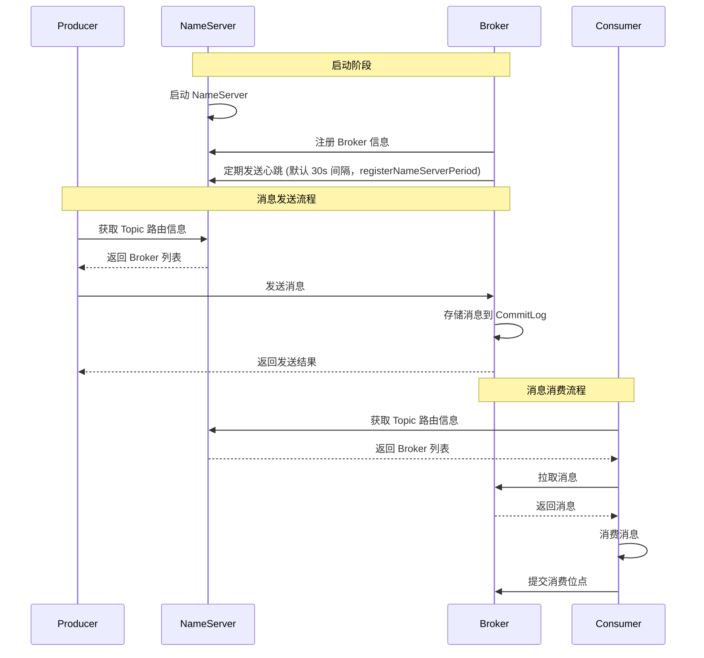
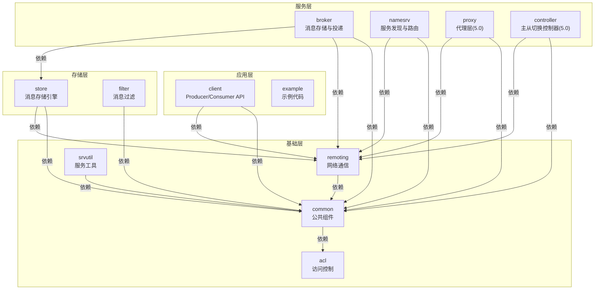

# RocketMQ 技术架构分析 - 概述篇

> 本文档面向想要深入理解 RocketMQ 底层原理的 Java 开发者，采用分层架构视角组织内容。

---

## 一、RocketMQ 是什么

RocketMQ 是阿里巴巴开源的分布式消息和流处理平台，采用分布式集群架构实现高可用、高性能的消息存储与投递。

具有以下核心特性：

| 特性 | 说明 |
| --- | --- |
| 低延迟 | 消息投递延迟在毫秒级别 |
| 高性能 | 单机 TPS 可达 10 万+ |
| 高可靠 | 支持同步复制、同步刷盘，消息零丢失 |
| 万亿级容量 | 支撑阿里双十一万亿级消息流转 |
| 灵活扩展 | 无状态设计，支持水平扩展 |

---

## 二、整体架构设计

本节介绍 RocketMQ 的整体架构，包括与主流消息中间件的对比、核心组件、架构图和交互流程。

### 2.1 主流消息中间件对比

| 对比项 | RocketMQ | Kafka | RabbitMQ |
| --- | --- | --- | --- |
| **开发语言** | Java | Scala/Java | Erlang |
| **协议支持** | 自定义协议、gRPC | 自定义协议 | AMQP、STOMP、MQTT |
| **消息模型** | Topic + Queue | Topic + Partition | Exchange + Queue |
| **消息顺序** | 分区顺序 | 分区顺序 | 单队列顺序 |
| **事务消息** | ✅ 原生支持 | ❌ 不支持 | ✅ 支持（有限） |
| **延迟消息** | ✅ 原生支持（18级） | ❌ 不支持 | ✅ 支持（插件） |
| **消息过滤** | ✅ Tag/SQL92 | ❌ 不支持 | ✅ Routing Key |
| **消息回溯** | ✅ 按时间/Offset | ✅ 按Offset | ❌ 不支持 |
| **死信队列** | ✅ 原生支持 | ❌ 不支持 | ✅ 原生支持 |
| **消息堆积** | 亿级（磁盘） | 亿级（磁盘） | 百万级（内存） |
| **吞吐量** | 10万+ TPS/单机 | 10万+ TPS/单机 | 1-2万 TPS/单机 |
| **延迟** | 毫秒级 | 毫秒级 | 微秒级 |
| **高可用** | Master-Slave/DLedger | Leader-Follower | Mirror Queue |
| **适用场景** | 业务消息、事务、延迟 | 日志采集、流处理 | 传统业务、跨语言 |

**选型建议**：

| 场景 | 推荐方案 | 原因 |
| --- | --- | --- |
| 电商/金融交易 | RocketMQ | 事务消息、高可靠、消息过滤 |
| 日志/大数据 | Kafka | 高吞吐、流处理生态 |
| 传统企业应用 | RabbitMQ | AMQP 标准、多协议、易用 |
| 多语言微服务 | RocketMQ 5.0 | gRPC 协议统一客户端 |
| IoT/边缘计算 | RabbitMQ | MQTT 支持、轻量级 |

### 2.2 核心组件

RocketMQ 采用分层架构，包含以下核心组件：

| 组件 | 功能描述 | 部署特性 | 默认端口 | 源码入口 |
| --- | --- | --- | --- | --- |
| **Producer** | 消息发布角色，支持分布式集群部署 | 完全无状态，可水平扩展 | - | [DefaultMQProducer.java](../../client/src/main/java/org/apache/rocketmq/client/producer/DefaultMQProducer.java) |
| **Consumer** | 消息消费角色，支持分布式集群部署 | 支持 Push/Pull 两种消费模式 | - | [DefaultMQPushConsumer.java](../../client/src/main/java/org/apache/rocketmq/client/consumer/DefaultMQPushConsumer.java) |
| **NameServer** | Topic 路由注册中心，类似服务发现 | 几乎无状态，节点间无信息同步 | 9876 | [NamesrvStartup.java](../../namesrv/src/main/java/org/apache/rocketmq/namesrv/NamesrvStartup.java) |
| **BrokerServer** | 消息存储、投递和查询，高可用保证 | 支持 Master-Slave 架构 | 10911（客户端）/ 10912（HA 同步） | [BrokerStartup.java](../../broker/src/main/java/org/apache/rocketmq/broker/BrokerStartup.java) |
| **Proxy**（5.0 新增） | 代理层，提供 gRPC 协议支持 | 支持 Local/Cluster 模式 | 8081（gRPC） | [ProxyStartup.java](../../proxy/src/main/java/org/apache/rocketmq/proxy/ProxyStartup.java) |

### 2.3 架构图

```mermaid
flowchart TD
    subgraph 客户端层
        Producer["Producer<br/>消息生产者"]
        Consumer["Consumer<br/>消息消费者"]
    end

    subgraph 服务发现层
        NameServers["NameServer集群<br/>服务发现"]
    end

    subgraph 存储层
        BrokerA["Broker-A Master"]
        BrokerAS["Broker-A Slave"]
        BrokerB["Broker-B Master"]
        BrokerBS["Broker-B Slave"]
    end

    Producer -->|获取路由| NameServers
    Producer -->|发送消息| BrokerA
    Producer -->|发送消息| BrokerB

    Consumer -->|获取路由| NameServers
    Consumer -->|拉取消息| BrokerA
    Consumer -->|拉取消息| BrokerB

    BrokerA -->|注册心跳| NameServers
    BrokerB -->|注册心跳| NameServers
    BrokerA <-->|主从同步| BrokerAS
    BrokerB <-->|主从同步| BrokerBS
```



### 2.4 核心交互流程



---

## 三、技术栈选型

本节介绍 RocketMQ 采用的核心技术栈及其选型理由。

| 技术/组件 | 用途 | 版本要求 | 选型理由 |
| --- | --- | --- | --- |
| Java | 主要开发语言 | JDK 8+ | 跨平台、生态成熟、性能稳定 |
| Netty | 网络通信框架 | 4.1.x | 高性能、异步非阻塞、事件驱动 |
| Fastjson | JSON 序列化 | 1.2.x | 高性能、功能丰富 |
| gRPC | RPC 框架（5.0 新增） | 1.45.x | 跨语言、高性能、HTTP/2 支持 |
| Protobuf | 序列化协议（5.0 新增） | 3.20.x | 高效、跨语言、向后兼容 |
| ByteBuffer | 内存缓冲区 | JDK 内置 | 高效的字节操作 |
| MappedFile | 内存映射文件 | 自定义实现 | 高性能文件操作，零拷贝 |

---

## 四、模块划分

RocketMQ 采用模块化设计，各模块职责清晰、依赖关系明确，便于理解和扩展。

### 4.1 核心模块一览

| 模块 | 主要职责 | 核心类 |
| --- | --- | --- |
| `acl` | 访问控制列表 | `AccessValidator.java` |
| `broker` | 消息存储与投递 | [BrokerStartup.java](../../broker/src/main/java/org/apache/rocketmq/broker/BrokerStartup.java)、[BrokerController.java](../../broker/src/main/java/org/apache/rocketmq/broker/BrokerController.java) |
| `client` | 客户端 API | [DefaultMQProducer.java](../../client/src/main/java/org/apache/rocketmq/client/producer/DefaultMQProducer.java)、[DefaultMQPushConsumer.java](../../client/src/main/java/org/apache/rocketmq/client/consumer/DefaultMQPushConsumer.java) |
| `common` | 公共组件 | `MixAll.java`、`TopicConfig.java` |
| `container` | Broker 容器化（5.0 新增） | `BrokerContainer.java` |
| `controller` | 主从切换控制器（5.0 新增） | `ControllerManager.java` |
| `distribution` | 发布包构建 | 打包脚本、配置文件 |
| `example` | 示例代码 | `Producer.java`、`Consumer.java` |
| `filter` | 消息过滤 | `ExpressionMessageFilter.java` |
| `logging` | 日志组件 | `InternalLogger.java` |
| `namesrv` | 服务发现与路由 | [NamesrvStartup.java](../../namesrv/src/main/java/org/apache/rocketmq/namesrv/NamesrvStartup.java)、[RouteInfoManager.java](../../namesrv/src/main/java/org/apache/rocketmq/namesrv/routeinfo/RouteInfoManager.java) |
| `openmessaging` | OpenMessaging 规范实现 | `MessagingAccessPointImpl.java` |
| `proxy` | 代理层（5.0 新增） | [ProxyStartup.java](../../proxy/src/main/java/org/apache/rocketmq/proxy/ProxyStartup.java)、`GrpcServer.java` |
| `remoting` | 远程通信 | `NettyRemotingServer.java`、`NettyRemotingClient.java` |
| `srvutil` | 服务工具类 | `ServerUtil.java` |
| `store` | 消息存储 | [CommitLog.java](../../store/src/main/java/org/apache/rocketmq/store/CommitLog.java)、[ConsumeQueue.java](../../store/src/main/java/org/apache/rocketmq/store/ConsumeQueue.java)、[DefaultMappedFile.java](../../store/src/main/java/org/apache/rocketmq/store/logfile/DefaultMappedFile.java) |
| `test` | 集成测试 | 测试用例 |
| `tools` | 运维工具 | `MQAdminStartup.java` |

### 4.2 模块依赖关系



**依赖层次说明**：

| 层次 | 模块 | 职责 | 依赖关系 |
| --- | --- | --- | --- |
| **应用层** | `client`、`example` | 对外 API，Producer/Consumer 入口，示例代码 | client 依赖 remoting、common |
| **服务层** | `broker`、`namesrv`、`proxy`、`controller` | 核心服务，消息存储、路由发现、代理、主从切换 | broker 依赖 store、remoting；namesrv/proxy/controller 依赖 remoting |
| **存储层** | `store`、`filter` | 消息存储引擎与过滤 | store 依赖 remoting、common |
| **基础层** | `remoting`、`common`、`acl`、`srvutil` | 网络通信、公共组件、访问控制、服务工具 | remoting 依赖 common；common 依赖 acl |

**关键依赖路径**：
- **Producer 发送消息**：`client → remoting → broker → store`
- **Consumer 消费消息**：`client → remoting → broker → store`
- **服务发现**：`client → remoting → namesrv`

---

## 五、设计理念

本节介绍 RocketMQ 的核心设计理念，包括 NameServer 设计选择、存储架构和性能优化策略。

### 5.1 NameServer vs ZooKeeper

RocketMQ 选择自研 NameServer 而非 ZooKeeper，原因如下：

- **路由信息不需要强一致性**：Producer/Consumer 可容忍短暂的路由信息不一致
- **简化部署**：NameServer 无状态，无需集群选举
- **高性能**：无选举开销，纯内存操作

**Broker 存活检测**：NameServer 通过心跳机制检测 Broker 存活状态，若 Broker 超过 **120s**（`DEFAULT_BROKER_CHANNEL_EXPIRED_TIME`，默认 2min）未发送心跳，则认为 Broker 下线并移除其路由信息。

> **源码位置**：`registerNameServerPeriod` 定义于 [BrokerConfig.java](../../common/src/main/java/org/apache/rocketmq/common/BrokerConfig.java)；`DEFAULT_BROKER_CHANNEL_EXPIRED_TIME` 定义于 [RouteInfoManager.java](../../namesrv/src/main/java/org/apache/rocketmq/namesrv/routeinfo/RouteInfoManager.java)。

### 5.2 存储架构设计

RocketMQ 采用 **CommitLog + ConsumeQueue** 二层存储架构，将数据和索引分离，针对不同访问模式优化。**IndexFile** 是可选的扩展查询索引，用于支持按 Key 或时间区间查询消息。

| 存储组件 | 写入特性 | 读取特性 | 是否核心 |
| --- | --- | --- | --- |
| **CommitLog** | 所有 Topic 顺序写入 | 随机读 | ✅ 核心 |
| **ConsumeQueue** | 追加写 | 按 Topic-QueueId 顺序读 | ✅ 核心 |
| **IndexFile** | 随机写 | 支持 Key/时间区间查询 | ❌ 可选（默认开启） |

**文件格式说明**：

| 存储组件 | 文件大小 | 单条记录大小 | 核心字段 | 源码 |
| --- | --- | --- | --- | --- |
| **CommitLog** | 默认 1GB（`mappedFileSizeCommitLog`） | 变长（消息体+元数据） | 消息头(固定部分) + BODY + TOPIC + PROPERTIES | [CommitLog.java](../../store/src/main/java/org/apache/rocketmq/store/CommitLog.java) |
| **ConsumeQueue** | 默认约 5.7MB（`300000 * 20` 字节） | 固定 20 字节（`CQ_STORE_UNIT_SIZE`） | `commitlogOffset`(8B) + `msgSize`(4B) + `tagsCode`(8B) | [ConsumeQueue.java](../../store/src/main/java/org/apache/rocketmq/store/ConsumeQueue.java) |
| **IndexFile** | 默认约 400MB | 索引条目 20 字节（`indexSize`） | `keyHash`(4B) + `phyOffset`(8B) + `timeDiff`(4B) + `prevIndex`(4B) | [IndexFile.java](../../store/src/main/java/org/apache/rocketmq/store/index/IndexFile.java) |

**IndexFile 文件大小计算**：
```
fileTotalSize = INDEX_HEADER_SIZE(40B) + hashSlotNum(500万) * hashSlotSize(4B) + indexNum(2000万) * indexSize(20B)
             = 40 + 20,000,000 + 400,000,000
             = 420,000,040 字节 ≈ 400MB
```

> **配置说明**：IndexFile 可通过 `messageIndexEnable=false` 关闭（默认开启）。`maxHashSlotNum` 和 `maxIndexNum` 定义于 [MessageStoreConfig.java](../../store/src/main/java/org/apache/rocketmq/store/config/MessageStoreConfig.java)，`INDEX_HEADER_SIZE` 定义于 [IndexHeader.java](../../store/src/main/java/org/apache/rocketmq/store/index/IndexHeader.java)，`hashSlotSize` 和 `indexSize` 定义于 [IndexFile.java](../../store/src/main/java/org/apache/rocketmq/store/index/IndexFile.java)。

### 5.3 性能优化设计

| 优化手段 | 实现原理 | 未优化时 | 优化后 |
| --- | --- | --- | --- |
| **零拷贝** | `MappedFile` 将文件映射到内存，避免内核态与用户态数据拷贝；`transferTo()` 直接从文件通道传输到网络通道 | 4 次数据拷贝，多次上下文切换 | 2 次数据拷贝，减少 CPU 开销 |
| **PageCache** | 写入时先写入 PageCache，异步刷盘；读取时利用 OS 预读取机制，热点数据常驻内存 | 同步刷盘，每次写入等待磁盘 IO | 异步刷盘，写入延迟降低至微秒级 |
| **异步索引** | 消息写入 CommitLog 后立即返回，`ReputMessageService` 后台线程异步构建 ConsumeQueue 和 IndexFile | 写入时同步构建索引，增加延迟 | 写入与索引解耦，吞吐量提升 30%+ |
| **长轮询** | Consumer 拉取请求若无消息则挂起（由客户端 `brokerSuspendMaxTimeMillis` 控制，默认 20s），Broker 有新消息时立即唤醒并返回 | 短轮询频繁请求，空轮询浪费资源 | 减少无效请求，降低网络开销 |

**举例说明**：

- **零拷贝**：传统方式读取 1GB 文件并发送，数据需经过 磁盘→内核缓冲区→用户缓冲区→Socket缓冲区→网卡，共 4 次拷贝；零拷贝只需 磁盘→内核缓冲区→网卡，仅 2 次拷贝
- **PageCache**：写入 10 万条消息，同步刷盘需等待 10 万次磁盘 IO；异步刷盘先写入内存，后台线程批量刷盘，写入延迟从毫秒级降至微秒级
- **异步索引**：每条消息写入后需构建 2 个索引（ConsumeQueue + IndexFile），同步构建时每条消息增加约 50μs；异步构建后写入立即返回，吞吐量显著提升
- **长轮询**：Consumer 每秒轮询 100 次，90% 为空轮询；长轮询挂起等待（默认 `longPollingEnable=true`），有消息时立即返回，网络请求减少 90%

---

## 六、快速上手

本节提供 RocketMQ 的环境要求、启动步骤和基本使用示例，帮助快速入门。

### 6.1 环境要求

- JDK 8+
- Maven 3.2+
- 4G+ 可用内存

### 6.2 启动步骤

```bash
# 1. 构建
mvn -Prelease-all -DskipTests clean install -U

# 2. 启动 NameServer
nohup sh bin/mqnamesrv &

# 3. 启动 Broker
nohup sh bin/mqbroker -n localhost:9876 &

# 4. 验证
sh bin/mqadmin clusterList -n localhost:9876
```

### 6.3 发送消息示例

```java
// 1. 创建生产者实例，指定生产者组名
DefaultMQProducer producer = new DefaultMQProducer("ProducerGroup");
// 2. 设置 NameServer 地址
producer.setNamesrvAddr("localhost:9876");
// 3. 启动生产者
producer.start();

// 4. 创建消息，指定 Topic、Tag 和消息体
Message msg = new Message("TopicTest", "TagA", "Hello RocketMQ".getBytes());
// 5. 发送消息并获取结果
SendResult result = producer.send(msg);
System.out.println(result);

// 6. 关闭生产者
producer.shutdown();
```

### 6.4 消费消息示例

```java
// 1. 创建消费者实例，指定消费者组名
DefaultMQPushConsumer consumer = new DefaultMQPushConsumer("ConsumerGroup");
// 2. 设置 NameServer 地址
consumer.setNamesrvAddr("localhost:9876");
// 3. 订阅 Topic，"*" 表示订阅所有 Tag
consumer.subscribe("TopicTest", "*");
// 4. 注册消息监听器
consumer.registerMessageListener((msgs, context) -> {
    for (MessageExt msg : msgs) {
        System.out.println(new String(msg.getBody()));
    }
    return ConsumeConcurrentlyStatus.CONSUME_SUCCESS;  // 返回消费成功状态
});
// 5. 启动消费者
consumer.start();
```

---

## 七、文档导航

本节提供本系列文档的阅读指引，帮助读者按需深入学习各主题。

本系列文档按主题组织，建议按以下顺序阅读：

| 序号 | 文档 | 内容 |
| --- | --- | --- |
| 1 | [概述篇](./01-概述篇.md) | 架构设计、技术栈、模块划分 |
| 2 | [核心概念篇](./02-核心概念篇.md) | Topic/Queue/Message、消息标识、领域模型 |
| 3 | [消息发送篇](./03-消息发送篇.md) | 发送流程、队列选择、高可用机制 |
| 4 | [消息存储篇](./04-消息存储篇.md) | 存储架构、CommitLog、刷盘、主从复制 |
| 5 | [操作系统级优化篇](./05-操作系统级优化篇.md) | mmap、PageCache、堆外内存、文件预热 |
| 6 | [消息消费篇](./06-消息消费篇.md) | 消费流程、Push/Pull、流控、Rebalance |
| 7 | [高级特性篇](./07-高级特性篇.md) | 顺序消息、事务消息、延迟消息、过滤、死信队列 |
| 8 | [高可用与运维篇](./08-高可用与运维篇.md) | Master-Slave、故障转移、堆积处理 |
| 9 | [云原生篇](./09-云原生篇.md) | Proxy、Controller、Pop 消费、云原生部署 |
| 10 | [项目接入实战篇](./10-项目接入实战篇.md) | Spring Boot 集成、最佳实践、性能调优 |

---

## 八、总结

本节总结 RocketMQ 架构设计的核心目标与设计手段，为后续深入学习奠定基础。

RocketMQ 的架构设计围绕以下核心目标：

| 目标 | 设计手段 |
| --- | --- |
| 高性能 | 顺序写入、零拷贝、异步刷盘、PageCache |
| 高可靠 | 同步复制、同步刷盘、事务消息 |
| 高可用 | NameServer 无状态、Master-Slave 架构 |
| 可扩展 | 分层解耦、无状态设计、水平扩展 |

理解这些设计理念，是深入学习 RocketMQ 源码的基础。
