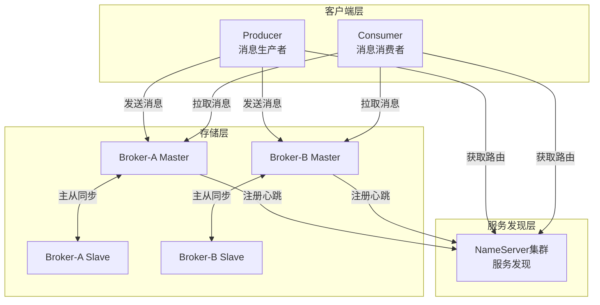
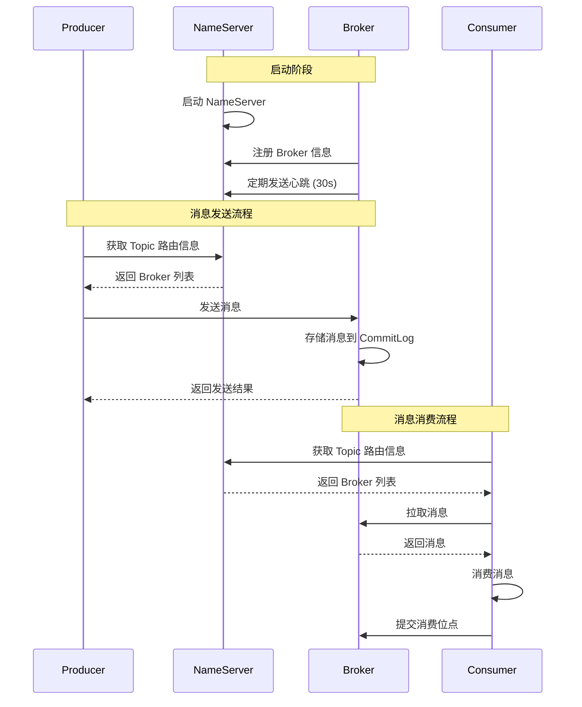
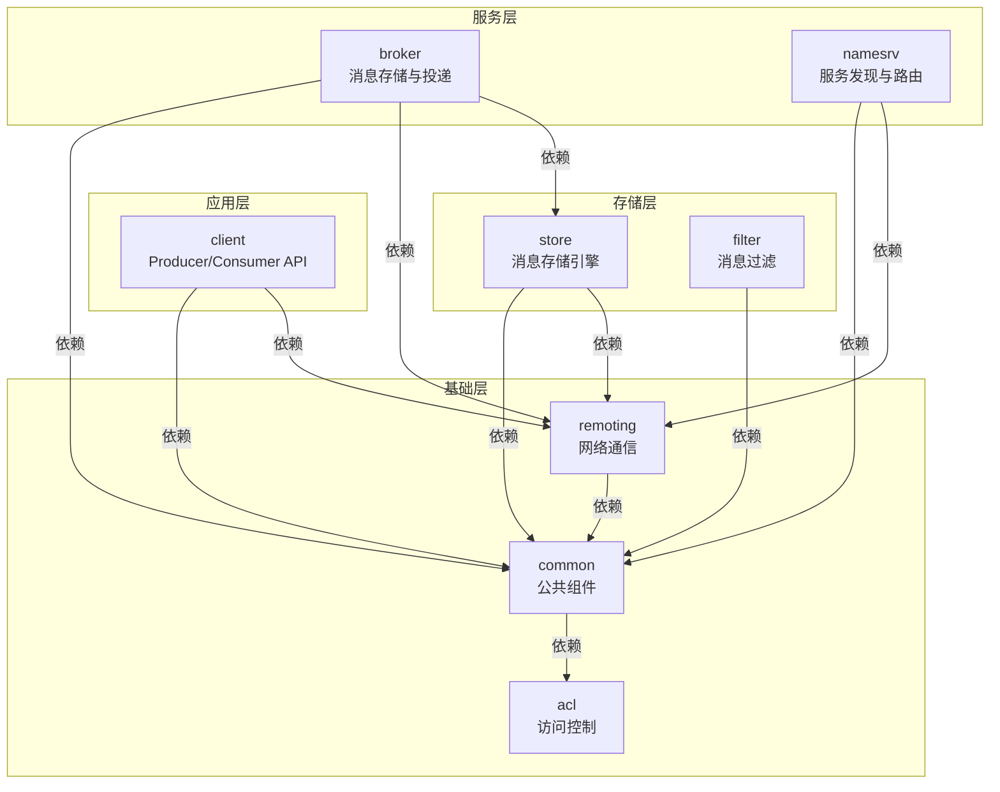

# RocketMQ 技术架构分析 - 概述篇

> 本文档面向想要深入理解 RocketMQ 底层原理的 Java 开发者，采用分层架构视角组织内容。

---

## 一、RocketMQ 是什么

RocketMQ 是阿里巴巴开源的分布式消息和流处理平台，具有以下核心特性：

| 特性 | 说明 |
| --- | --- |
| 低延迟 | 消息投递延迟在毫秒级别 |
| 高性能 | 单机 TPS 可达 10 万+ |
| 高可靠 | 支持同步复制、同步刷盘，消息零丢失 |
| 万亿级容量 | 支撑阿里双十一万亿级消息流转 |
| 灵活扩展 | 无状态设计，支持水平扩展 |

---

## 二、整体架构设计

### 2.1 核心组件

RocketMQ 采用分层架构，包含以下核心组件：

| 组件 | 功能描述 | 部署特性 | 源码入口 |
| --- | --- | --- | --- |
| **Producer** | 消息发布角色，支持分布式集群部署 | 完全无状态，可水平扩展 | `client/DefaultMQProducer.java` |
| **Consumer** | 消息消费角色，支持分布式集群部署 | 支持 Push/Pull 两种消费模式 | `client/DefaultMQPushConsumer.java` |
| **NameServer** | Topic 路由注册中心，类似服务发现 | 几乎无状态，节点间无信息同步 | `namesrv/NamesrvStartup.java` |
| **BrokerServer** | 消息存储、投递和查询，高可用保证 | 支持 Master-Slave 架构 | `broker/BrokerStartup.java` |

### 2.2 架构图



### 2.3 核心交互流程



---

## 三、技术栈选型

| 技术/组件 | 用途 | 版本要求 | 选型理由 |
| --- | --- | --- | --- |
| Java | 主要开发语言 | JDK 8+ | 跨平台、生态成熟、性能稳定 |
| Netty | 网络通信框架 | 4.x | 高性能、异步非阻塞、事件驱动 |
| Fastjson | JSON 序列化 | 1.x | 高性能、功能丰富 |
| ByteBuffer | 内存缓冲区 | JDK 内置 | 高效的字节操作 |
| MappedFile | 内存映射文件 | 自定义实现 | 高性能文件操作，零拷贝 |

---

## 四、模块划分

### 4.1 核心模块一览

| 模块 | 主要职责 | 核心类 |
| --- | --- | --- |
| `acl` | 访问控制列表 | `AccessValidator.java` |
| `broker` | 消息存储与投递 | `BrokerStartup.java`, `BrokerController.java` |
| `client` | 客户端 API | `DefaultMQProducer.java`, `DefaultMQPushConsumer.java` |
| `common` | 公共组件 | `MixAll.java`, `TopicConfig.java` |
| `filter` | 消息过滤 | `ExpressionMessageFilter.java` |
| `logging` | 日志组件 | `InternalLogger.java` |
| `namesrv` | 服务发现与路由 | `NamesrvStartup.java`, `RouteInfoManager.java` |
| `openmessaging` | OpenMessaging 规范实现 | `MessagingAccessPointImpl.java` |
| `remoting` | 远程通信 | `NettyRemotingServer.java`, `NettyRemotingClient.java` |
| `store` | 消息存储 | `CommitLog.java`, `ConsumeQueue.java`, `MappedFile.java` |
| `tools` | 运维工具 | `MQAdminStartup.java` |

### 4.2 模块依赖关系



**依赖层次说明**：

| 层次 | 模块 | 职责 | 依赖关系 |
| --- | --- | --- | --- |
| **应用层** | `client` | 对外 API，Producer/Consumer 入口 | 依赖 remoting、common |
| **服务层** | `broker`、`namesrv` | 核心服务，消息存储与路由发现 | broker 依赖 store、remoting；namesrv 依赖 remoting |
| **存储层** | `store`、`filter` | 消息存储引擎与过滤 | store 依赖 remoting、common |
| **基础层** | `remoting`、`common`、`acl` | 网络通信、公共组件、访问控制 | remoting 依赖 common；common 依赖 acl |

**关键依赖路径**：
- **Producer 发送消息**：`client → remoting → broker → store`
- **Consumer 消费消息**：`client → remoting → broker → store`
- **服务发现**：`client → remoting → namesrv`

---

## 五、设计理念

### 5.1 NameServer vs ZooKeeper

RocketMQ 选择自研 NameServer 而非 ZooKeeper，原因如下：

- **路由信息不需要强一致性**：Producer/Consumer 可容忍短暂的路由信息不一致
- **简化部署**：NameServer 无状态，无需集群选举
- **高性能**：无选举开销，纯内存操作

### 5.2 CommitLog + ConsumeQueue 存储架构

采用 **CommitLog + ConsumeQueue** 混合存储架构，将数据和索引分离，针对不同访问模式优化：

| 存储组件 | 写入特性 | 读取特性 |
| --- | --- | --- |
| **CommitLog** | 所有 Topic 顺序写入 | 随机读 |
| **ConsumeQueue** | 追加写 | 按 Topic-QueueId 顺序读 |
| **IndexFile** | 随机写 | 支持 Key/时间区间查询 |

**文件格式说明**：

| 存储组件 | 文件大小 | 单条记录大小 | 核心字段 |
| --- | --- | --- | --- |
| **CommitLog** | 默认 1GB | 变长（消息体+元数据） | `TOTALSIZE` + `MAGICCODE` + `BODYCRC` + `QUEUEID` + `QUEUEOFFSET` + `PHYSICALOFFSET` + `BORNTIMESTAMP` + `STORETIMESTAMP` + `BODY` + `TOPIC` + `PROPERTIES` |
| **ConsumeQueue** | 默认 600MB | 固定 20 字节 | `commitlogOffset`(8B) + `msgSize`(4B) + `tagsCode`(8B) |
| **IndexFile** | 约 400MB | 索引条目 20 字节 | `keyHash`(4B) + `phyOffset`(8B) + `timeDiff`(4B) + `slotValue`(4B) |

### 5.3 性能优化设计

| 优化手段 | 实现原理 | 未优化时 | 优化后 |
| --- | --- | --- | --- |
| **零拷贝** | `MappedFile` 将文件映射到内存，避免内核态与用户态数据拷贝；`transferTo()` 直接从文件通道传输到网络通道 | 4 次数据拷贝，多次上下文切换 | 2 次数据拷贝，减少 CPU 开销 |
| **PageCache** | 写入时先写入 PageCache，异步刷盘；读取时利用 OS 预读取机制，热点数据常驻内存 | 同步刷盘，每次写入等待磁盘 IO | 异步刷盘，写入延迟降低至微秒级 |
| **异步索引** | 消息写入 CommitLog 后立即返回，`ReputMessageService` 后台线程异步构建 ConsumeQueue 和 IndexFile | 写入时同步构建索引，增加延迟 | 写入与索引解耦，吞吐量提升 30%+ |
| **长轮询** | Consumer 拉取请求若无消息则挂起（最长 30s），Broker 有新消息时立即唤醒并返回 | 短轮询频繁请求，空轮询浪费资源 | 减少无效请求，降低网络开销 |

**举例说明**：

- **零拷贝**：传统方式读取 1GB 文件并发送，数据需经过 磁盘→内核缓冲区→用户缓冲区→Socket缓冲区→网卡，共 4 次拷贝；零拷贝只需 磁盘→内核缓冲区→网卡，仅 2 次拷贝
- **PageCache**：写入 10 万条消息，同步刷盘需等待 10 万次磁盘 IO；异步刷盘先写入内存，后台线程批量刷盘，写入延迟从毫秒级降至微秒级
- **异步索引**：每条消息写入后需构建 2 个索引（ConsumeQueue + IndexFile），同步构建时每条消息增加约 50μs；异步构建后写入立即返回，吞吐量显著提升
- **长轮询**：Consumer 每秒轮询 100 次，90% 为空轮询；长轮询挂起等待，有消息时立即返回，网络请求减少 90%

---

## 六、快速上手

### 6.1 环境要求

- JDK 8+
- Maven 3.2+
- 4G+ 可用内存

### 6.2 启动步骤

```bash
# 1. 构建
mvn -Prelease-all -DskipTests clean install -U

# 2. 启动 NameServer
nohup sh bin/mqnamesrv &

# 3. 启动 Broker
nohup sh bin/mqbroker -n localhost:9876 &

# 4. 验证
sh bin/mqadmin clusterList -n localhost:9876
```

### 6.3 发送消息示例

```java
DefaultMQProducer producer = new DefaultMQProducer("ProducerGroup");
producer.setNamesrvAddr("localhost:9876");
producer.start();

Message msg = new Message("TopicTest", "TagA", "Hello RocketMQ".getBytes());
SendResult result = producer.send(msg);
System.out.println(result);

producer.shutdown();
```

### 6.4 消费消息示例

```java
DefaultMQPushConsumer consumer = new DefaultMQPushConsumer("ConsumerGroup");
consumer.setNamesrvAddr("localhost:9876");
consumer.subscribe("TopicTest", "*");
consumer.registerMessageListener((msgs, context) -> {
    for (MessageExt msg : msgs) {
        System.out.println(new String(msg.getBody()));
    }
    return ConsumeConcurrentlyStatus.CONSUME_SUCCESS;
});
consumer.start();
```

---

## 七、文档导航

本系列文档按主题组织，建议按以下顺序阅读：

| 序号 | 文档 | 内容 |
| --- | --- | --- |
| 1 | [概述篇](./01-概述篇.md) | 架构设计、技术栈、模块划分 |
| 2 | [核心概念篇](./02-核心概念篇.md) | Topic/Queue/Message、消息标识、领域模型 |
| 3 | [消息发送篇](./03-消息发送篇.md) | 发送流程、队列选择、高可用机制 |
| 4 | [消息存储篇](./04-消息存储篇.md) | 存储架构、CommitLog、刷盘、主从复制 |
| 5 | [消息消费篇](./05-消息消费篇.md) | 消费流程、Push/Pull、流控、Rebalance |
| 6 | [高级特性篇](./06-高级特性篇.md) | 顺序消息、事务消息、延迟消息、过滤、死信队列 |
| 7 | [高可用与运维篇](./07-高可用与运维篇.md) | Master-Slave、故障转移、堆积处理 |
| 8 | [云原生篇](./08-云原生篇.md) | Proxy、Controller、Pop 消费、云原生部署 |

---

## 八、总结

RocketMQ 的架构设计围绕以下核心目标：

| 目标 | 设计手段 |
| --- | --- |
| 高性能 | 顺序写入、零拷贝、异步刷盘、PageCache |
| 高可靠 | 同步复制、同步刷盘、事务消息 |
| 高可用 | NameServer 无状态、Master-Slave 架构 |
| 可扩展 | 分层解耦、无状态设计、水平扩展 |

理解这些设计理念，是深入学习 RocketMQ 源码的基础。
