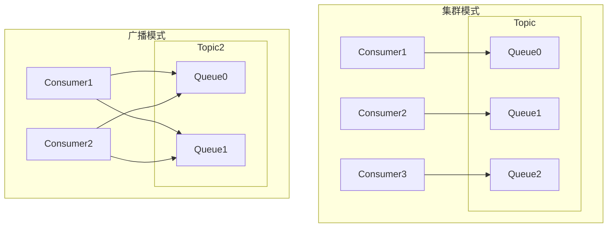

# RocketMQ 技术架构分析 - 核心概念篇

> 本篇深入介绍 RocketMQ 的核心概念、消息标识体系、队列类型和领域模型，是理解 RocketMQ 底层原理的基础。

---

## 一、核心概念

### 1.1 基本概念总览

| 概念 | 说明 | 关键属性（源码字段） |
| --- | --- | --- |
| **Topic** | 消息主题，消息的第一级分类 | `topicName`, `readQueueNums`, `writeQueueNums`, `perm` |
| **Queue** | Topic 的分区，消息存储和消费的实际单元 | `topic`, `brokerName`, `queueId` |
| **Message** | 消息传递的基本单元 | `topic`, `body`, `properties`, `transactionId` |
| **Producer** | 消息生产者，无状态可水平扩展 | `producerGroup`, `sendMsgTimeout`, `retryTimesWhenSendFailed` |
| **Consumer** | 消息消费者，支持 Push/Pull 模式 | `consumerGroup`, `messageModel` |
| **ConsumerGroup** | 消费者组，组内消费者共同消费实现负载均衡 | 负载均衡、消费进度共享 |
| **Broker** | 消息服务器，支持 Master-Slave 架构 | `brokerName`, `brokerId`, `brokerRole` |
| **NameServer** | 路由注册中心 | 无状态、心跳检测、路由映射 |
| **Offset** | 消费位点，记录消费进度 | 存储为 `queueOffset` 值 |

### 1.2 偏移量术语详解

RocketMQ 中有多个与"偏移量/位点"相关的术语，容易混淆：

> **示例场景**：队列中有 5 条消息 (Msg1~Msg5)，消费者已消费到 Msg3，下次将从 Msg4 开始消费。

| 术语 | 含义 | 所属层级 | 使用场景 | 示例值 |
| --- | --- | --- | --- | --- |
| **消息偏移量 (Queue Offset)** | 消息在队列中的逻辑序号，从 0 开始 | Broker 端 | 消息定位、消费进度记录 | Msg3 的偏移量为 2 |
| **消费位点 (Consumer Offset)** | 下次要消费的位置 | 消费者端 | 断点续传、消息回溯 | 消费位点 = 3 |
| **最小偏移量 (MinOffset)** | 队列中最早消息的偏移量 | Broker 端 | 消息过期清理边界 | MinOffset = 0 |
| **最大偏移量 (MaxOffset)** | 队列中最新消息的偏移量 | Broker 端 | 堆积量计算 | MaxOffset = 4 |
| **CommitLog 偏移量** | 消息在 CommitLog 中的物理字节位置 | Broker 端 | 消息实体读取 | Msg3 物理位置 = 200 字节 |

**偏移量关系图**：

```plain
┌─────────────────────────────────────────────────────────────────────────────┐
│  CommitLog（物理存储）                                                       │
│  ┌─────────┬─────────┬─────────┬─────────┬─────────┐                       │
│  │  Msg1   │  Msg2   │  Msg3   │  Msg4   │  Msg5   │                       │
│  │ phyOff=0│phyOff=100│phyOff=200│phyOff=300│phyOff=400│                    │
│  └─────────┴─────────┴─────────┴─────────┴─────────┘                       │
│       ↑                                           ↑                         │
│  CommitLog Offset=0                         CommitLog Offset=400            │
│                                                                             │
│  ConsumeQueue（逻辑索引）                                                    │
│  ┌─────────┬─────────┬─────────┬─────────┬─────────┐                       │
│  │ Entry1  │ Entry2  │ Entry3  │ Entry4  │ Entry5  │                       │
│  │ qOff=0  │ qOff=1  │ qOff=2  │ qOff=3  │ qOff=4  │                       │
│  │phyOff=0 │phyOff=100│phyOff=200│phyOff=300│phyOff=400│                    │
│  └─────────┴─────────┴─────────┴─────────┴─────────┘                       │
│       ↑                  ↑            ↑           ↑                         │
│  MinOffset=0        Queue Offset=2  消费位点=3  MaxOffset=4                  │
│                                                                             │
│  关系：消费位点 = 下一条待消费消息的队列偏移量 = 3                             │
└─────────────────────────────────────────────────────────────────────────────┘
```

**关系总结**：`消费位点 = 下一条待消费消息的队列偏移量`

---

## 二、消息标识体系

RocketMQ 消息有多种标识和属性，理解它们的区别至关重要。

### 2.1 标识概念总览

| 概念 | 设置方式 | 存储位置 | 主要用途 | 索引支持 |
| --- | --- | --- | --- | --- |
| **Tags** | `setTags()` | properties | 消息过滤 | ✅ ConsumeQueue |
| **Keys** | `setKeys()` | properties | 消息查询、追踪 | ✅ IndexFile |
| **MsgId/UNIQ_KEY** | 系统自动 | properties | 唯一标识 | ✅ IndexFile |
| **Sharding Key** | `putUserProperty()` | properties | 顺序消息路由 | ❌ |
| **路由参数** | `send(msg, selector, arg)` | 不存储 | 队列选择 | ❌ |

### 2.2 Tags（标签）

Tags 用于**消息过滤**，同一 Topic 下区分不同业务类型：

```java
// 生产者设置 Tag
Message msg = new Message("TopicTest", "TagA", "OrderID123", body);

// 消费者按 Tag 订阅（支持多个 Tag，用 || 分隔）
consumer.subscribe("TopicTest", "TagA || TagB || TagC");
```

**Tags 特点**：
- 一个消息**只能有一个 Tag**
- Tag 存储在 ConsumeQueue 的 8 字节 hashcode 中，Broker 端高效过滤
- 适用于同一 Topic 下区分不同业务类型的消息

**典型场景**：
- 订单消息：`Tag_OrderCreate`、`Tag_OrderPay`、`Tag_OrderCancel`
- 用户消息：`Tag_UserRegister`、`Tag_UserLogin`

### 2.3 Keys（业务 Key）

Keys 用于**消息查询与追踪**，不参与消费过滤：

```java
// 设置单个 Key
message.setKeys("OrderID123");

// 设置多个 Key（空格分隔）
message.setKeys("OrderID123 UserID456 ProductID789");
```

**Keys 使用场景**：

| 场景 | 说明 |
| --- | --- |
| **消息查询** | 通过 `topic + key` 在 IndexFile 中检索消息 |
| **链路追踪** | 在 TraceBean 中记录，用于消息轨迹追踪 |
| **业务幂等** | 消费端通过 keys 判断消息是否已处理 |
| **事务关联** | 事务消息场景下关联业务流水 |

### 2.4 MsgId / UNIQ_KEY（唯一消息标识）

MsgId 是系统自动生成的消息唯一标识，存储在 properties 中：

```java
// 格式：IP(4B) + PID(2B) + ClassLoader Hash(4B) + 时间差(4B) + 序列号(2B) = 16字节
// 示例：AC1100012A9F00000010000000000001
```

**MsgId 结构解析**：

```plain
MsgId: AC1100012A9F00000010000000000001
       ├──────┤├──┤├──────┤├──────┤├────┤
         IP    PID 类加载器  时间差   自增序列
        4B     2B   哈希4B   4B       2B

AC110001 = 172.17.0.1 (客户端 IP 地址的十六进制)
2A9F = 进程ID (PID)
00000010 = 类加载器哈希
00000000 = 时间差 (与本月1日0点的时间差)
0001 = 自增序列
```

**MsgId 生成源码** ([MessageClientIDSetter.java](file:///d:/work/github/rocketmq/common/src/main/java/org/apache/rocketmq/common/message/MessageClientIDSetter.java))：

```java
public static String createUniqID() {
    char[] sb = new char[LEN * 2];
    System.arraycopy(FIX_STRING, 0, sb, 0, FIX_STRING.length);
    
    long current = System.currentTimeMillis();
    int diff = (int)(current - startTime);  // 与本月1日0点的时间差
    
    int pos = FIX_STRING.length;
    UtilAll.writeInt(sb, pos, diff);        // 时间差 (4字节)
    pos += 8;
    UtilAll.writeShort(sb, pos, COUNTER.getAndIncrement());  // 自增序列 (2字节)
    return new String(sb);
}
```

### 2.5 Sharding Key（分片键）

Sharding Key 用于**顺序消息队列路由**：

```java
msg.putUserProperty(MessageConst.PROPERTY_SHARDING_KEY, "ORDER_12345");
```

相同 Sharding Key 的消息会路由到同一队列，保证顺序。

### 2.6 消息常量 MessageConst

**MessageConst** 定义了所有消息属性的常量 ([MessageConst.java](file:///d:/work/github/rocketmq/common/src/main/java/org/apache/rocketmq/common/message/MessageConst.java))：

| 常量 | 值 | 说明 |
| --- | --- | --- |
| `PROPERTY_KEYS` | KEYS | 消息 Key |
| `PROPERTY_TAGS` | TAGS | 消息 Tag |
| `PROPERTY_DELAY_TIME_LEVEL` | DELAY | 延迟级别 |
| `PROPERTY_RETRY_TOPIC` | RETRY_TOPIC | 重试 Topic |
| `PROPERTY_REAL_TOPIC` | REAL_TOPIC | 真实 Topic |
| `PROPERTY_REAL_QUEUE_ID` | REAL_QID | 真实队列 ID |
| `PROPERTY_TRANSACTION_PREPARED` | TRAN_MSG | 事务消息标志 |
| `PROPERTY_PRODUCER_GROUP` | PGROUP | 生产者组 |
| `PROPERTY_UNIQ_CLIENT_MESSAGE_ID_KEYIDX` | UNIQ_KEY | 消息唯一 ID |
| `PROPERTY_RECONSUME_TIME` | RECONSUME_TIME | 重试次数 |
| `PROPERTY_MSG_REGION` | MSG_REGION | 消息区域 |
| `PROPERTY_TRACE_SWITCH` | TRACE_ON | 追踪开关 |
| `PROPERTY_MAX_RECONSUME_TIMES` | MAX_RECONSUME_TIMES | 最大重试次数 |
| `PROPERTY_CONSUME_START_TIMESTAMP` | CONSUME_START_TIME | 消费开始时间戳 |
| `PROPERTY_TRANSACTION_ID` | __transactionId__ | 事务 ID |
| `PROPERTY_SHARDING_KEY` | __SHARDINGKEY__ | 分片键 |
| `PROPERTY_TIMER_DELAY_SEC` | TIMER_DELAY_SEC | 定时消息延迟秒数 |
| `PROPERTY_TIMER_DELIVER_MS` | TIMER_DELIVER_MS | 定时消息投递毫秒 |
| `PROPERTY_BORN_HOST` | __BORNHOST__ | 消息来源主机 |
| `PROPERTY_BORN_TIMESTAMP` | BORN_TIMESTAMP | 消息生成时间戳 |

**临时属性前缀**：
```java
// 以 __RMQ.TRANSIENT. 开头的属性不会存储到 Broker 磁盘
public static final String PROPERTY_TRANSIENT_PREFIX = "__RMQ.TRANSIENT.";
```

### 2.7 各标识对比

| 特性 | Tags | Keys | MsgId | Sharding Key | 路由参数 |
| --- | --- | --- | --- | --- | --- |
| **主要用途** | 消息过滤 | 消息查询 | 唯一标识 | 顺序消息路由 | 队列选择 |
| **设置方** | 用户设置 | 用户设置 | 系统自动 | 用户设置 | 用户传入 |
| **数量限制** | 只能 1 个 | 可多个 | 只能 1 个 | 只能 1 个 | 1 个 |
| **存储位置** | ConsumeQueue | IndexFile | IndexFile | properties | 不存储 |
| **可重复** | 多消息相同 | 多消息相同 | 全局唯一 | 多消息相同 | - |

**使用场景推荐**：

| 场景 | 推荐使用 |
| --- | --- |
| 消息过滤 | **Tags** |
| 消息查询/追踪 | **Keys**（业务标识） |
| 消息去重/幂等 | **Keys**（业务唯一标识） |
| 精确定位单条消息 | **MsgId** |
| 顺序消息（RocketMQ 4.x） | **路由参数** + `SelectMessageQueueByHash` |
| 顺序消息（RocketMQ 5.x） | **Sharding Key** |

---

## 三、队列类型

### 3.1 业务队列类型

RocketMQ 有 **3 种业务队列类型**：

| 队列类型 | Topic 格式 | 用途 | 特点 |
| --- | --- | --- | --- |
| **普通队列** | 用户定义的 Topic | 业务消息存储 | 用户创建的业务 Topic |
| **重试队列** | `%RETRY%` + ConsumerGroup | 消费失败消息重试 | 自动创建，使用延迟消息机制 |
| **死信队列** | `%DLQ%` + ConsumerGroup | 存储无法消费的消息 | 永久存储，需人工处理 |

### 3.2 系统内部队列

| 队列类型 | Topic 格式 | 用途 | 特点 |
| --- | --- | --- | --- |
| **延迟队列** | `SCHEDULE_TOPIC_XXXX` | 延迟消息中转存储 | 18 个队列对应延迟级别 |

### 3.3 队列流转关系

```plain
┌─────────────────────────────────────────────────────────────────────────────┐
│                     场景一：普通延迟消息流转                                   │
├─────────────────────────────────────────────────────────────────────────────┤
│  Producer                          SCHEDULE_TOPIC_XXXX         Consumer     │
│  ┌──────────┐                      ┌──────────────┐          ┌──────────┐  │
│  │发送延迟  │   Topic替换          │  延迟队列    │  到期    │ 订阅     │  │
│  │消息      │ ──────────────────► │              │ ───────► │ OrderTopic│  │
│  │delayLevel│                      │  按级别分队列 │ 恢复Topic│          │  │
│  └──────────┘                      └──────────────┘          └──────────┘  │
│                                                                             │
│  流程：业务Topic → SCHEDULE_TOPIC_XXXX → 到期恢复业务Topic → Consumer消费   │
└─────────────────────────────────────────────────────────────────────────────┘

┌─────────────────────────────────────────────────────────────────────────────┐
│                     场景二：消费失败重试流转                                   │
├─────────────────────────────────────────────────────────────────────────────┤
│  普通队列              SCHEDULE_TOPIC_XXXX        重试队列         死信队列  │
│  ┌──────────┐          ┌──────────────┐        ┌──────────────┐ ┌────────┐ │
│  │OrderTopic│ 消费失败 │  延迟队列    │        │%RETRY%+Group │ │%DLQ%+  │ │
│  │          │ ───────► │              │ ──────►│              │ │Group   │ │
│  └──────────┘          └──────────────┘        └──────────────┘ └────────┘ │
│       ▲                      ▲                       │            ▲        │
│       │                      │                       │ 重试超限   │        │
│       │        ┌─────────────┴─────────────┐         └────────────┘        │
│       │        │ Consumer 订阅重试队列      │                               │
│       └────────┴───────────────────────────┘                               │
│                                                                             │
│  流程：消费失败 → SCHEDULE_TOPIC_XXXX → %RETRY%+Group → Consumer重新消费   │
│        重试超限（默认16次）→ %DLQ%+Group（死信队列）                        │
└─────────────────────────────────────────────────────────────────────────────┘
```

**两种场景对比**：

| 对比项 | 普通延迟消息 | 重试消息 |
| --- | --- | --- |
| 触发方式 | Producer 主动设置 delayLevel | Consumer 消费失败自动触发 |
| 延迟后目标 | 原始业务 Topic | 重试队列 `%RETRY%+Group` |
| Consumer 订阅 | 业务 Topic | 业务 Topic + 重试队列 |
| 延迟级别 | 1-18 均可 | 固定从级别 4 开始递增 |
| 是否进入死信队列 | 否 | 重试超限后进入 |

---

## 四、领域模型

### 4.1 Message（消息）

#### 4.1.1 消息基本结构

**Message 基础属性** ([Message.java](file:///d:/work/github/rocketmq/common/src/main/java/org/apache/rocketmq/common/message/Message.java))：

```java
public class Message implements Serializable {
    private String topic;                      // 消息主题
    private int flag;                          // 消息标志
    private Map<String, String> properties;    // 消息属性（tags、keys等存储于此）
    private byte[] body;                       // 消息体
    private String transactionId;              // 事务ID
}
```

**Message 属性说明**：

| 属性 | 类型 | 说明 |
| --- | --- | --- |
| `topic` | String | 消息主题，消息的第一级分类 |
| `flag` | int | 消息标志，用于 RPC 通信 |
| `properties` | Map | 扩展属性，存储 tags、keys 等 |
| `body` | byte[] | 消息体，实际业务数据 |
| `transactionId` | String | 事务消息 ID |

#### 4.1.2 MessageExt 扩展属性

`MessageExt` 继承自 `Message`，增加了消息在传输和存储过程中的元数据：

```java
public class MessageExt extends Message {
    private String brokerName;              // Broker名称
    private int queueId;                    // 队列ID
    private int storeSize;                  // 存储大小（字节）
    private long queueOffset;               // 队列偏移量
    private int sysFlag;                    // 系统标志
    private long bornTimestamp;             // 消息生成时间戳
    private SocketAddress bornHost;         // 消息来源地址
    private long storeTimestamp;            // 存储时间戳
    private SocketAddress storeHost;        // 存储Broker地址
    private String msgId;                   // 消息唯一ID
    private long commitLogOffset;           // CommitLog物理偏移量
    private int bodyCRC;                    // 消息体CRC校验码
    private int reconsumeTimes;             // 重试消费次数
    private long preparedTransactionOffset; // 事务消息预处理偏移量
}
```

**MessageExt 属性分类**：

| 分类 | 属性 | 说明 |
| --- | --- | --- |
| **位置信息** | brokerName, queueId, queueOffset, commitLogOffset | 消息在 Broker 中的位置 |
| **时间信息** | bornTimestamp, storeTimestamp | 消息生命周期时间点 |
| **来源信息** | bornHost, storeHost | 消息来源和存储的网络地址 |
| **存储信息** | storeSize, bodyCRC | 消息存储大小和校验 |
| **消费信息** | reconsumeTimes | 消息重试次数 |
| **事务信息** | preparedTransactionOffset | 事务消息相关 |

#### 4.1.3 系统标志位

**sysFlag 系统标志位** ([MessageSysFlag.java](file:///d:/work/github/rocketmq/common/src/main/java/org/apache/rocketmq/common/sysflag/MessageSysFlag.java))：

| 标志位 | 值 | 含义 |
| --- | --- | --- |
| `COMPRESSED_FLAG` | 0x1 | 消息体已压缩 |
| `MULTI_TAGS_FLAG` | 0x2 | 多标签消息 |
| `TRANSACTION_NOT_TYPE` | 0 | 非事务消息 |
| `TRANSACTION_PREPARED_TYPE` | 0x4 | 事务预处理消息 |
| `TRANSACTION_COMMIT_TYPE` | 0x8 | 事务提交消息 |
| `TRANSACTION_ROLLBACK_TYPE` | 0xC | 事务回滚消息 |
| `BORNHOST_V6_FLAG` | 0x10 | bornHost 是 IPv6 地址 |
| `STOREHOSTADDRESS_V6_FLAG` | 0x20 | storeHost 是 IPv6 地址 |

### 4.2 Topic（主题）

#### 4.2.1 Topic 核心属性

```java
// 核心属性
private String topicName;      // 主题名称
private int readQueueNums;     // 读队列数
private int writeQueueNums;    // 写队列数
private int perm;              // 权限
private int topicSysFlag;      // 系统标志
```

**Topic 属性说明**：

| 属性 | 类型 | 说明 |
| --- | --- | --- |
| `topicName` | String | 主题名称，全局唯一 |
| `readQueueNums` | int | 读队列数，用于消息消费 |
| `writeQueueNums` | int | 写队列数，用于消息发送 |
| `perm` | int | 权限位（读/写权限） |
| `topicSysFlag` | int | 主题系统标志 |

#### 4.2.2 TopicConfig（主题配置）

**TopicConfig** 是主题的完整配置信息 ([TopicConfig.java](file:///d:/work/github/rocketmq/common/src/main/java/org/apache/rocketmq/common/TopicConfig.java))：

```java
public class TopicConfig {
    private String topicName;              // 主题名称
    private int readQueueNums;           // 读队列数
    private int writeQueueNums;          // 写队列数
    private int perm;                    // 权限（6=读写，4=只读，2=只写）
    private String topicFilterType;        // 过滤类型（SINGLE_TAG、MULTI_TAG）
    private String topicSysFlag;          // 系统标志
    private int order;                   // 顺序
}
```

**TopicConfig 使用场景**：

| 场景 | 说明 |
| --- | --- |
| **主题创建** | 创建新 Topic 时指定队列数和权限 |
| **主题管理** | 通过管理工具查询和修改主题配置 |
| **路由信息** | NameServer 存储和返回主题配置信息 |

**权限说明**：

| 权限值 | 二进制 | 说明 |
| --- | --- | --- |
| 6 | 110 | 读写权限 |
| 4 | 100 | 只读权限 |
| 2 | 010 | 只写权限 |
| 0 | 000 | 无权限 |

### 4.3 Broker（消息服务器）

#### 4.3.1 Broker 核心属性

```java
// 核心属性
private String brokerName;     // Broker名称
private long brokerId;         // Broker ID (0=Master, 非0=Slave)
private String clusterName;    // 集群名称
private String brokerAddr;     // Broker地址
private BrokerRole brokerRole; // Broker角色
private FlushDiskType flushDiskType; // 刷盘方式
```

**Broker 属性说明**：

| 属性 | 类型 | 说明 |
| --- | --- | --- |
| `brokerName` | String | Broker 名称，同一组 Master/Slave 相同 |
| `brokerId` | long | Broker ID（0=Master，非0=Slave） |
| `clusterName` | String | 集群名称 |
| `brokerAddr` | String | Broker 地址（IP:Port） |
| `brokerRole` | BrokerRole | Broker 角色（ASYNC_MASTER、SYNC_MASTER、SLAVE） |
| `flushDiskType` | FlushDiskType | 刷盘方式（ASYNC_FLUSH、SYNC_FLUSH） |

#### 4.3.2 BrokerData（Broker 数据）

**BrokerData** 是 Broker 的元数据信息 ([BrokerData.java](file:///d:/work/github/rocketmq/common/src/main/java/org/apache/rocketmq/common/protocol/route/BrokerData.java))：

```java
public class BrokerData {
    private String cluster;                    // 集群名称
    private String brokerName;                // Broker 名称
    private HashMap<Long/* brokerId */, String/* broker address */> brokerAddrs;
    // Broker 地址列表，key 为 brokerId，value 为 broker 地址
}
```

**BrokerData 结构说明**：

```plain
BrokerData 示例：
{
  cluster: "DefaultCluster",
  brokerName: "broker-a",
  brokerAddrs: {
    0: "192.168.1.1:10911",    // Master
    1: "192.168.1.2:10911"     // Slave
  }
}
```

**BrokerData 使用场景**：

| 场景 | 说明 |
| --- | --- |
| **路由信息** | NameServer 存储和返回 Broker 路由信息 |
| **客户端选择** | Producer/Consumer 根据 brokerId 选择 Master 或 Slave |
| **主从切换** | DLedger 模式下动态更新 brokerAddrs |

#### 4.3.3 BrokerRole（Broker 角色）

**BrokerRole** 枚举值 ([BrokerRole.java](file:///d:/work/github/rocketmq/common/src/main/java/org/apache/rocketmq/common/protocol/BrokerRole.java))：

| 枚举值 | 说明 | 可靠性 | 性能 |
| --- | --- | --- | --- |
| `ASYNC_MASTER` | 异步 Master | 中 | 高 |
| `SYNC_MASTER` | 同步 Master | 高 | 中 |
| `SLAVE` | 从节点 | - | - |

**刷盘方式 FlushDiskType** ([FlushDiskType.java](file:///d:/work/github/rocketmq/common/src/main/java/org/apache/rocketmq/common/protocol/FlushDiskType.java))：

| 枚举值 | 说明 | 可靠性 | 性能 |
| --- | --- | --- | --- |
| `ASYNC_FLUSH` | 异步刷盘 | 中 | 高 |
| `SYNC_FLUSH` | 同步刷盘 | 高 | 中 |

### 4.4 TopicRouteData（主题路由数据）

**TopicRouteData** 是 Topic 的完整路由信息 ([TopicRouteData.java](file:///d:/work/github/rocketmq/common/src/main/java/org/apache/rocketmq/common/protocol/route/TopicRouteData.java))：

```java
public class TopicRouteData extends RemotingSerializable {
    private String orderTopicConf;
    private List<QueueData> queueDatas;              // 队列数据列表
    private List<BrokerData> brokerDatas;            // Broker数据列表
    private HashMap<String/* brokerAddr */, List<String>/* Filter Server */> filterServerTable;
    private Map<String/*brokerName*/, TopicQueueMappingInfo> topicQueueMappingByBroker;
}
```

**TopicRouteData 结构说明**：

| 属性 | 说明 |
| --- | --- |
| `queueDatas` | 队列数据列表，每个 Broker 一个 QueueData |
| `brokerDatas` | Broker 数据列表，包含 Broker 地址 |
| `filterServerTable` | Filter Server 列表（已废弃） |
| `topicQueueMappingByBroker` | 主题队列映射信息 |

**TopicRouteData 示例**：

```json
{
  "queueDatas": [
    {
      "brokerName": "broker-a",
      "readQueueNums": 8,
      "writeQueueNums": 8,
      "perm": 6,
      "topicSysFlag": 0
    },
    {
      "brokerName": "broker-b",
      "readQueueNums": 8,
      "writeQueueNums": 8,
      "perm": 6,
      "topicSysFlag": 0
    }
  ],
  "brokerDatas": [
    {
      "cluster": "DefaultCluster",
      "brokerName": "broker-a",
      "brokerAddrs": {
        "0": "192.168.1.1:10911"
      }
    },
    {
      "cluster": "DefaultCluster",
      "brokerName": "broker-b",
      "brokerAddrs": {
        "0": "192.168.1.2:10911"
      }
    }
  ]
}
```

### 4.5 QueueData（队列数据）

**QueueData** 是单个 Broker 的队列元数据 ([QueueData.java](file:///d:/work/github/rocketmq/common/src/main/java/org/apache/rocketmq/common/protocol/route/QueueData.java))：

```java
public class QueueData implements Comparable<QueueData> {
    private String brokerName;     // Broker 名称
    private int readQueueNums;     // 读队列数
    private int writeQueueNums;    // 写队列数
    private int perm;              // 权限
    private int topicSysFlag;      // 主题系统标志
}
```

**QueueData 属性说明**：

| 属性 | 说明 |
| --- | --- |
| `brokerName` | Broker 名称 |
| `readQueueNums` | 读队列数量，Consumer 根据此值分配队列 |
| `writeQueueNums` | 写队列数量，Producer 根据此值选择队列 |
| `perm` | 权限（6=读写，4=只读，2=只写） |
| `topicSysFlag` | 主题系统标志 |

**读写队列分离**：
- readQueueNums 和 writeQueueNums 可以不同
- 常用于灰度发布：先增加 writeQueueNums，再增加 readQueueNums

### 4.6 MessageQueue 与 ProcessQueue

`MessageQueue` 是队列的逻辑标识，`ProcessQueue` 是消费者端的消息处理快照：

```plain
┌─────────────────────────────────────────────────────────────────────────────┐
│  Broker端                           消费者端                                │
│  ┌──────────────────┐              ┌──────────────────────────────────────┐ │
│  │   MessageQueue   │              │           ProcessQueue               │ │
│  │  (逻辑队列标识)    │   Pull      │         (消息处理快照)                 │ │
│  │                  │  ───────►   │                                      │ │
│  │ topic: Order     │              │  msgTreeMap: {offset → MessageExt}   │ │
│  │ brokerName: A    │              │  msgCount: 消息数量                    │ │
│  │ queueId: 0       │              │  msgSize: 消息总大小                   │ │
│  └──────────────────┘              │  queueOffsetMax: 最大偏移量           │ │
│                                    │  dropped: 是否已丢弃                  │ │
│                                    │  locked: 是否已锁定(顺序消费)          │ │
│                                    └──────────────────────────────────────┘ │
└─────────────────────────────────────────────────────────────────────────────┘
```

**核心属性对比**：

| 属性 | MessageQueue | ProcessQueue |
| --- | --- | --- |
| 所在位置 | 消费者端（标识 Broker 端队列） | 消费者端 |
| 本质 | 队列的逻辑标识（不可变） | 队列的消费状态快照（动态变化） |
| 核心属性 | topic, brokerName, queueId | msgTreeMap, msgCount, dropped, locked |
| 生命周期 | Topic 创建时存在 | 消费者订阅队列时创建 |

**MessageQueue 核心属性**：

```java
public class MessageQueue implements Comparable<MessageQueue>, Serializable {
    private String topic;        // 主题名称
    private String brokerName;   // Broker名称
    private int queueId;         // 队列ID
}
```

**ProcessQueue 核心属性**：

```java
public class ProcessQueue {
    private final TreeMap<Long, MessageExt> msgTreeMap = new TreeMap<>();  // 待消费消息
    private final TreeMap<Long, MessageExt> consumingMsgOrderlyTreeMap = new TreeMap<>();  // 顺序消费中
    private final AtomicLong msgCount = new AtomicLong();    // 消息数量
    private final AtomicLong msgSize = new AtomicLong();     // 消息总大小
    private volatile long queueOffsetMax = 0L;               // 最大偏移量
    private volatile boolean dropped = false;                // 是否已丢弃
    private volatile boolean locked = false;                 // 是否已锁定
}
```

**两个 TreeMap 的作用**：

| Map | 含义 | 使用场景 |
| --- | --- | --- |
| `msgTreeMap` | 待消费消息 | 所有消费模式 |
| `consumingMsgOrderlyTreeMap` | 正在消费的消息 | 仅顺序消费 |

**ProcessQueue 核心方法**：

| 方法 | 功能 | 使用场景 |
| --- | --- | --- |
| `putMessage()` | 将拉取的消息存入 msgTreeMap | PullMessage 后调用 |
| `takeMessages()` | 批量取出消息准备消费 | 顺序消费前调用 |
| `removeMessage()` | 移除已消费消息 | 并发消费成功/失败后调用 |
| `makeMessageToConsumeAgain()` | 消息放回队列头部 | 顺序消费失败重试 |
| `commit()` | 提交消费进度 | 顺序消费成功 |

---

## 五、消息发送与拉取结果

### 5.1 SendResult（发送结果）

**SendResult** 是 Producer 发送消息后返回的结果 ([SendResult.java](file:///d:/work/github/rocketmq/client/src/main/java/org/apache/rocketmq/client/producer/SendResult.java))：

```java
public class SendResult {
    private SendStatus sendStatus;       // 发送状态
    private String msgId;               // 消息ID
    private MessageQueue messageQueue;    // 消息队列
    private long queueOffset;           // 队列偏移量
    private String transactionId;        // 事务ID
    private String offsetMsgId;         // Broker端消息ID
    private String regionId;             // 区域ID
}
```

**SendResult 属性说明**：

| 属性 | 类型 | 说明 |
| --- | --- | --- |
| `sendStatus` | SendStatus | 发送状态（SEND_OK、FLUSH_DISK_TIMEOUT 等） |
| `msgId` | String | 客户端生成的消息ID |
| `messageQueue` | MessageQueue | 消息所在的队列 |
| `queueOffset` | long | 消息在队列中的偏移量 |
| `transactionId` | String | 事务消息ID |
| `offsetMsgId` | String | Broker端生成的消息ID |
| `regionId` | String | 区域ID（多区域部署时使用） |

### 5.2 SendStatus（发送状态）

**SendStatus** 枚举值 ([SendStatus.java](file:///d:/work/github/rocketmq/client/src/main/java/org/apache/rocketmq/client/producer/SendStatus.java))：

| 枚举值 | 说明 | 处理建议 |
| --- | --- | --- |
| `SEND_OK` | 发送成功 | 正常处理 |
| `FLUSH_DISK_TIMEOUT` | 刷盘超时 | 消息可能丢失，需检查配置 |
| `FLUSH_SLAVE_TIMEOUT` | 从节点同步超时 | 消息可能丢失，需检查配置 |
| `SLAVE_NOT_AVAILABLE` | 从节点不可用 | 消息可能丢失，需检查配置 |

**SendStatus 使用示例**：

```java
SendResult result = producer.send(msg);
if (result.getSendStatus() == SendStatus.SEND_OK) {
    System.out.println("消息发送成功，偏移量：" + result.getQueueOffset());
} else {
    System.err.println("消息发送失败：" + result.getSendStatus());
}
```

### 5.3 PullResult（拉取结果）

**PullResult** 是 Consumer 拉取消息后返回的结果 ([PullResult.java](file:///d:/work/github/rocketmq/client/src/main/java/org/apache/rocketmq/client/consumer/PullResult.java))：

```java
public class PullResult {
    private final PullStatus pullStatus;   // 拉取状态
    private final long nextBeginOffset;    // 下次拉取起始偏移量
    private final long minOffset;          // 最小偏移量
    private final long maxOffset;          // 最大偏移量
    private List<MessageExt> msgFoundList; // 拉取到的消息列表
}
```

**PullResult 属性说明**：

| 属性 | 类型 | 说明 |
| --- | --- | --- |
| `pullStatus` | PullStatus | 拉取状态（FOUND、NO_NEW_MSG 等） |
| `nextBeginOffset` | long | 下次拉取的起始偏移量 |
| `minOffset` | long | 队列最小偏移量 |
| `maxOffset` | long | 队列最大偏移量 |
| `msgFoundList` | List<MessageExt> | 拉取到的消息列表 |

### 5.4 PullStatus（拉取状态）

**PullStatus** 枚举值 ([PullStatus.java](file:///d:/work/github/rocketmq/client/src/main/java/org/apache/rocketmq/client/consumer/PullStatus.java))：

| 枚举值 | 说明 | 处理建议 |
| --- | --- | --- |
| `FOUND` | 拉取到消息 | 处理消息列表 |
| `NO_NEW_MSG` | 没有新消息 | 等待下次拉取 |
| `NO_MATCHED_MSG` | 没有匹配的消息（过滤） | 检查过滤条件 |
| `OFFSET_ILLEGAL` | 偏移量非法 | 重置消费位点 |

**PullStatus 使用示例**：

```java
PullResult pullResult = consumer.pull(messageQueue, "*", nextBeginOffset, 32);
switch (pullResult.getPullStatus()) {
    case FOUND:
        List<MessageExt> messages = pullResult.getMsgFoundList();
        for (MessageExt msg : messages) {
            // 处理消息
        }
        nextBeginOffset = pullResult.getNextBeginOffset();
        break;
    case NO_NEW_MSG:
        // 没有新消息，等待
        break;
    case NO_MATCHED_MSG:
        // 没有匹配的消息
        break;
    case OFFSET_ILLEGAL:
        // 偏移量非法，重置
        break;
}
```

### 5.5 PullRequest（拉取请求）

**PullRequest** 是 Consumer 拉取消息时的请求对象 ([PullRequest.java](file:///d:/work/github/rocketmq/client/src/main/java/org/apache/rocketmq/client/impl/consumer/PullRequest.java))：

```java
public class PullRequest {
    private String consumerGroup;          // 消费者组
    private MessageQueue messageQueue;    // 消息队列
    private ProcessQueue processQueue;    // 处理队列
    private long nextOffset;             // 下次拉取偏移量
    private boolean lockedFirst;          // 是否已锁定（顺序消费）
}
```

**PullRequest 属性说明**：

| 属性 | 类型 | 说明 |
| --- | --- | --- |
| `consumerGroup` | String | 消费者组名称 |
| `messageQueue` | MessageQueue | 要拉取的消息队列 |
| `processQueue` | ProcessQueue | 消息处理队列 |
| `nextOffset` | long | 下次拉取的起始偏移量 |
| `lockedFirst` | boolean | 是否已锁定（顺序消费时使用） |

**PullRequest 工作流程**：

```plain
┌─────────────────────────────────────────────────────────────────────────────┐
│  PullRequest 工作流程                                                      │
├─────────────────────────────────────────────────────────────────────────────┤
│                                                                             │
│  1. 创建 PullRequest                                                        │
│     └─ consumerGroup: "ConsumerGroup1"                                      │
│     └─ messageQueue: TopicTest@BrokerA@0                                     │
│     └─ processQueue: ProcessQueue实例                                        │
│     └─ nextOffset: 100                                                      │
│                                                                             │
│  2. 发送拉取请求                                                            │
│     └─ PullMessageService 从 PullRequestQueue 获取 PullRequest                  │
│     └─ 调用 pullAPIWrapper.pullMessage() 发送请求                             │
│                                                                             │
│  3. 接收 PullResult                                                         │
│     └─ Broker 返回 PullResult                                                │
│     └─ 包含拉取状态、消息列表、下次偏移量等                                   │
│                                                                             │
│  4. 处理拉取结果                                                            │
│     └─ 将消息放入 ProcessQueue                                                │
│     └─ 提交 ConsumeRequest 给消费线程                                         │
│     └─ 更新 nextOffset                                                      │
│                                                                             │
│  5. 重新入队 PullRequest                                                     │
│     └─ 更新 nextOffset 后重新放入 PullRequestQueue                              │
│     └─ 等待下次拉取                                                         │
│                                                                             │
└─────────────────────────────────────────────────────────────────────────────┘
```

### 5.6 MessageQueueSelector（队列选择器）

**MessageQueueSelector** 是 Producer 发送消息时的队列选择器接口 ([MessageQueueSelector.java](file:///d:/work/github/rocketmq/client/src/main/java/org/apache/rocketmq/client/producer/MessageQueueSelector.java))：

```java
public interface MessageQueueSelector {
    MessageQueue select(final List<MessageQueue> mqs, final Message msg, final Object arg);
}
```

**MessageQueueSelector 使用场景**：

| 场景 | 说明 |
| --- | --- |
| **顺序消息** | 根据 Sharding Key 选择队列，保证相同 Key 的消息进入同一队列 |
| **自定义路由** | 根据业务逻辑选择队列，实现负载均衡或数据分片 |
| **特殊需求** | 根据消息内容选择特定队列 |

**MessageQueueSelector 使用示例**：

```java
// 示例1：根据订单ID选择队列（顺序消息）
Message msg = new Message("OrderTopic", "OrderPay", orderJson.getBytes());
SendResult result = producer.send(msg, new MessageQueueSelector() {
    @Override
    public MessageQueue select(List<MessageQueue> mqs, Message msg, Object arg) {
        String orderId = (String) arg;
        int index = Math.abs(orderId.hashCode()) % mqs.size();
        return mqs.get(index);
    }
}, orderId);

// 示例2：使用内置的哈希选择器
SendResult result = producer.send(msg, new SelectMessageQueueByHash(), orderId);

// 示例3：随机选择队列
SendResult result = producer.send(msg, new SelectMessageQueueByRandom());
```

**内置队列选择器**：

| 选择器 | 说明 | 使用场景 |
| --- | --- | --- |
| `SelectMessageQueueByHash` | 根据参数的哈希值选择队列 | 顺序消息 |
| `SelectMessageQueueByRandom` | 随机选择队列 | 普通消息 |
| `SelectMessageQueueByMachineRoom` | 根据机房选择队列 | 多机房部署 |

---

## 六、消费模式

### 6.1 集群模式 vs 广播模式

| 消费模式 | 队列分配 | 消息处理 | 适用场景 |
| --- | --- | --- | --- |
| **集群模式 (Clustering)** | 每个队列只被一个消费者消费 | 负载均衡，提高吞吐量 | 大数据处理、日志收集 |
| **广播模式 (Broadcasting)** | 每个消费者消费所有队列 | 消息广播，所有消费者都收到 | 配置推送、缓存更新 |



### 6.2 广播模式特性

| 特性 | 广播模式 | 集群模式 |
| --- | --- | --- |
| 队列分配 | 所有消费者订阅全部队列 | 队列按消费者数量均分 |
| 位点存储 | 本地文件 (LocalFileOffsetStore) | Broker 端 (RemoteBrokerOffsetStore) |
| 消费进度 | 每个消费者独立维护 | 消费者组共享 |
| 消息重试 | ❌ 不支持 | ✅ 支持 |
| Broker 锁 | ❌ 不需要 | ✅ 顺序消费需要 |

> 位点存储详情见 [6.5 OffsetStore（位点存储）](#65-offsetstore位点存储)

### 6.3 MessageModel（消息模型）

**MessageModel** 枚举 ([MessageModel.java](file:///d:/work/github/rocketmq/common/src/main/java/org/apache/rocketmq/common/protocol/heartbeat/MessageModel.java))：

```java
public enum MessageModel {
    BROADCASTING("BROADCASTING"),
    CLUSTERING("CLUSTERING");
}
```

**MessageModel 使用示例**：

```java
// 集群模式（默认）
consumer.setMessageModel(MessageModel.CLUSTERING);

// 广播模式
consumer.setMessageModel(MessageModel.BROADCASTING);
```

### 6.4 ConsumeFromWhere（消费起始位置）

**ConsumeFromWhere** 定义消费者从哪里开始消费 ([ConsumeFromWhere.java](file:///d:/work/github/rocketmq/common/src/main/java/org/apache/rocketmq/common/consumer/ConsumeFromWhere.java))：

| 枚举值 | 说明 | 使用场景 |
| --- | --- | --- |
| `CONSUME_FROM_LAST_OFFSET` | 从上次消费的偏移量开始 | 默认值，断点续传 |
| `CONSUME_FROM_FIRST_OFFSET` | 从队列最小偏移量开始 | 重新消费所有消息 |
| `CONSUME_FROM_TIMESTAMP` | 从指定时间戳开始 | 按时间回溯消息 |

**ConsumeFromWhere 使用示例**：

```java
DefaultMQPushConsumer consumer = new DefaultMQPushConsumer("ConsumerGroup");

// 设置消费起始位置
consumer.setConsumeFromWhere(ConsumeFromWhere.CONSUME_FROM_LAST_OFFSET);

// 或者从指定时间开始消费
consumer.setConsumeFromWhere(ConsumeFromWhere.CONSUME_FROM_TIMESTAMP);
consumer.setConsumeTimestamp("20240101000000"); // 格式：yyyyMMddHHmmss
```

**ConsumeFromWhere 工作流程**：

```plain
┌─────────────────────────────────────────────────────────────────────────────┐
│  ConsumeFromWhere 工作流程                                                │
├─────────────────────────────────────────────────────────────────────────────┤
│                                                                             │
│  1. CONSUME_FROM_LAST_OFFSET（默认）                                        │
│     ┌─────────────────────────────────────────────────────────────────┐       │
│     │  队列状态              消费起始位置                            │       │
│     │  ──────────────────────────────────────────────────────────────  │       │
│     │  新队列（无消费记录）  从最小偏移量开始（MinOffset）           │       │
│     │  已有消费记录        从上次消费位点开始（Consumer Offset）      │       │
│     └─────────────────────────────────────────────────────────────────┘       │
│                                                                             │
│  2. CONSUME_FROM_FIRST_OFFSET                                               │
│     ┌─────────────────────────────────────────────────────────────────┐       │
│     │  无论队列状态如何，都从最小偏移量开始（MinOffset）               │       │
│     │  适用于需要重新消费所有历史消息的场景                              │       │
│     └─────────────────────────────────────────────────────────────────┘       │
│                                                                             │
│  3. CONSUME_FROM_TIMESTAMP                                                 │
│     ┌─────────────────────────────────────────────────────────────────┐       │
│     │  根据指定时间戳查找对应的偏移量，从该位置开始消费              │       │
│     │  适用于按时间回溯消息的场景                                       │       │
│     │  示例：setConsumeTimestamp("20240101000000")                     │       │
│     └─────────────────────────────────────────────────────────────────┘       │
│                                                                             │
└─────────────────────────────────────────────────────────────────────────────┘
```

**ConsumeFromWhere 与 OffsetStore 的关系**：

| 消费模式 | OffsetStore 类型 | ConsumeFromWhere 生效时机 |
| --- | --- | --- |
| 集群模式 | RemoteBrokerOffsetStore | 首次订阅队列时 |
| 广播模式 | LocalFileOffsetStore | 每次启动时 |

**注意事项**：

1. **集群模式**：ConsumeFromWhere 只在首次订阅队列时生效，后续消费位点由 Broker 端维护
2. **广播模式**：ConsumeFromWhere 每次启动都会生效，因为位点存储在本地
3. **时间戳模式**：如果指定时间戳超出消息存储时间范围，会自动调整到有效范围

### 6.5 OffsetStore（位点存储）

**OffsetStore** 是消费位点的存储接口 ([OffsetStore.java](file:///d:/work/github/rocketmq/client/src/main/java/org/apache/rocketmq/client/consumer/store/OffsetStore.java))：

```java
public interface OffsetStore {
    void load() throws MQClientException;                                    // 加载位点
    void updateOffset(final MessageQueue mq, final long offset, final boolean increaseOnly); // 更新位点（内存）
    long readOffset(final MessageQueue mq, final ReadOffsetType type);             // 读取位点
    void persistAll(final Set<MessageQueue> mqs);                               // 持久化位点
    void persist(final MessageQueue mq);                                          // 持久化单个队列位点
    void removeOffset(final MessageQueue mq);                                     // 移除位点
}
```

**OffsetStore 实现类**：

| 实现类 | 存储位置 | 使用场景 | 特点 |
| --- | --- | --- | --- |
| `LocalFileOffsetStore` | 本地文件 | 广播模式 | 位点存储在本地文件，不共享 |
| `RemoteBrokerOffsetStore` | Broker 端 | 集群模式 | 位点存储在 Broker，消费者组共享 |

**LocalFileOffsetStore（本地文件存储）**：

```java
// 广播模式使用
this.offsetStore = new LocalFileOffsetStore(this.mQClientFactory, groupName);

// 存储路径: ~/.rocketmq_offsets/{clientId}/{groupName}/offsets.json
```

**存储格式示例**：

```json
{
  "offsetTable": {
    "TopicTest@BrokerA@0": 100,
    "TopicTest@BrokerA@1": 200,
    "OrderTopic@BrokerB@0": 50
  }
}
```

**RemoteBrokerOffsetStore（Broker 端存储）**：

```java
// 集群模式使用
this.offsetStore = new RemoteBrokerOffsetStore(this.mQClientFactory, groupName);

// 位点存储在 Broker 端的 {storePathRootDir}/config/consumerOffset.json
```

**OffsetStore 工作流程**：

```plain
┌─────────────────────────────────────────────────────────────────────────────┐
│  OffsetStore 工作流程                                                    │
├─────────────────────────────────────────────────────────────────────────────┤
│                                                                             │
│  1. 启动时加载位点                                                         │
│     ┌─────────────────────────────────────────────────────────────────┐       │
│     │  LocalFileOffsetStore: 从本地文件加载                              │       │
│     │  RemoteBrokerOffsetStore: 从 Broker 端加载                        │       │
│     └─────────────────────────────────────────────────────────────────┘       │
│                                                                             │
│  2. 消费消息时更新位点                                                       │
│     ┌─────────────────────────────────────────────────────────────────┐       │
│     │  先更新内存中的位点（updateOffset）                              │       │
│     │  定期持久化到存储（persistAll，默认5秒）                       │       │
│     └─────────────────────────────────────────────────────────────────┘       │
│                                                                             │
│  3. 关闭时持久化位点                                                         │
│     ┌─────────────────────────────────────────────────────────────────┐       │
│     │  将内存中的所有位点持久化到存储                              │       │
│     │  确保下次启动时能够恢复消费进度                              │       │
│     └─────────────────────────────────────────────────────────────────┘       │
│                                                                             │
└─────────────────────────────────────────────────────────────────────────────┘
```

**ReadOffsetType 读取类型**：

| 读取类型 | 说明 | 使用场景 |
| --- | --- | --- |
| `READ_FROM_MEMORY` | 从内存读取 | 获取当前内存中的位点 |
| `READ_FROM_STORE` | 从存储读取 | 获取持久化的位点 |
| `MEMORY_FIRST_THEN_STORE` | 优先内存，不存在则从存储读取 | 默认值 |

---

## 七、队列分配策略

### 7.1 AllocateMessageQueueStrategy（队列分配策略接口）

**AllocateMessageQueueStrategy** 是队列分配策略的顶层接口 ([AllocateMessageQueueStrategy.java](file:///d:/work/github/rocketmq/client/src/main/java/org/apache/rocketmq/client/consumer/AllocateMessageQueueStrategy.java))：

```java
public interface AllocateMessageQueueStrategy {
    List<MessageQueue> allocate(
        final String consumerGroup,
        final String currentCID,
        final List<MessageQueue> mqAll,
        final List<String> cidAll
    );

    String getName();
}
```

**参数说明**：

| 参数 | 说明 |
| --- | --- |
| `consumerGroup` | 消费者组名称 |
| `currentCID` | 当前消费者 ID |
| `mqAll` | Topic 的所有队列列表 |
| `cidAll` | 消费者组内所有消费者 ID 列表 |

**返回值**：当前消费者应该分配到的队列列表

### 7.2 内置分配策略

RocketMQ 提供了多种内置的队列分配策略：

| 策略类 | 策略名称 | 说明 | 适用场景 |
| --- | --- | --- | --- |
| `AllocateMessageQueueAveragely` | AVG | 平均分配 | 大多数场景 |
| `AllocateMessageQueueAveragelyByCircle` | AVG_BY_CIRCLE | 环形平均分配 | 希望队列分布更均匀 |
| `AllocateMessageQueueConsistentHash` | CONSISTENT_HASH | 一致性哈希 | 消费者增减时队列迁移少 |
| `AllocateMessageQueueByMachineRoom` | MACHINE_ROOM | 按机房分配 | 多机房部署 |
| `AllocateMessageQueueByConfig` | CONFIG | 按配置分配 | 自定义配置 |

### 7.3 AllocateMessageQueueAveragely（平均分配）

**平均分配**是默认策略，将队列平均分配给每个消费者 ([AllocateMessageQueueAveragely.java](file:///d:/work/github/rocketmq/client/src/main/java/org/apache/rocketmq/client/consumer/rebalance/AllocateMessageQueueAveragely.java))：

```java
public class AllocateMessageQueueAveragely extends AbstractAllocateMessageQueueStrategy {
    @Override
    public List<MessageQueue> allocate(String consumerGroup, String currentCID, 
                                        List<MessageQueue> mqAll, List<String> cidAll) {
        List<MessageQueue> result = new ArrayList<MessageQueue>();
        if (!check(consumerGroup, currentCID, mqAll, cidAll)) {
            return result;
        }

        int index = cidAll.indexOf(currentCID);
        int mod = mqAll.size() % cidAll.size();
        int averageSize =
            mqAll.size() <= cidAll.size() ? 1 : (mod > 0 && index < mod ? mqAll.size() / cidAll.size()
                + 1 : mqAll.size() / cidAll.size());
        int startIndex = (mod > 0 && index < mod) ? index * averageSize : index * averageSize + mod;
        int range = Math.min(averageSize, mqAll.size() - startIndex);
        for (int i = 0; i < range; i++) {
            result.add(mqAll.get((startIndex + i) % mqAll.size()));
        }
        return result;
    }

    @Override
    public String getName() {
        return "AVG";
    }
}
```

**分配示例**：

假设有 8 个队列，3 个消费者：

| 消费者 | 分配的队列 |
| --- | --- |
| Consumer1 | Queue0, Queue1, Queue2 |
| Consumer2 | Queue3, Queue4, Queue5 |
| Consumer3 | Queue6, Queue7 |

**算法逻辑**：
- 8 ÷ 3 = 2 余 2
- 前 2 个消费者各分配 3 个队列（2 + 1）
- 最后 1 个消费者分配 2 个队列

### 7.4 AllocateMessageQueueConsistentHash（一致性哈希）

**一致性哈希**策略，消费者增减时队列迁移较少 ([AllocateMessageQueueConsistentHash.java](file:///d:/work/github/rocketmq/client/src/main/java/org/apache/rocketmq/client/consumer/rebalance/AllocateMessageQueueConsistentHash.java))：

```java
public class AllocateMessageQueueConsistentHash extends AbstractAllocateMessageQueueStrategy {
    private final int virtualNodeCnt;
    private final HashFunction customHashFunction;

    @Override
    public List<MessageQueue> allocate(String consumerGroup, String currentCID, 
                                        List<MessageQueue> mqAll, List<String> cidAll) {
        List<MessageQueue> result = new ArrayList<MessageQueue>();
        if (!check(consumerGroup, currentCID, mqAll, cidAll)) {
            return result;
        }

        Collection<ClientNode> cidNodes = new ArrayList<ClientNode>();
        for (String cid : cidAll) {
            cidNodes.add(new ClientNode(cid));
        }

        final ConsistentHashRouter<ClientNode> router;
        if (customHashFunction != null) {
            router = new ConsistentHashRouter<ClientNode>(cidNodes, virtualNodeCnt, customHashFunction);
        } else {
            router = new ConsistentHashRouter<ClientNode>(cidNodes, virtualNodeCnt);
        }

        List<MessageQueue> results = new ArrayList<MessageQueue>();
        for (MessageQueue mq : mqAll) {
            ClientNode clientNode = router.routeNode(mq.toString());
            if (clientNode != null && currentCID.equals(clientNode.getKey())) {
                results.add(mq);
            }
        }

        return results;
    }

    @Override
    public String getName() {
        return "CONSISTENT_HASH";
    }
}
```

**一致性哈希特点**：
- 消费者增减时，只有少量队列需要重新分配
- 使用虚拟节点使分配更均匀
- 默认虚拟节点数为 10

**使用示例**：

```java
// 使用一致性哈希策略，虚拟节点数 10
consumer.setAllocateMessageQueueStrategy(new AllocateMessageQueueConsistentHash(10));

// 使用自定义哈希函数
consumer.setAllocateMessageQueueStrategy(
    new AllocateMessageQueueConsistentHash(10, new HashFunction() {
        @Override
        public int hash(String key) {
            return key.hashCode();
        }
    })
);
```

### 7.5 其他分配策略

**AllocateMessageQueueAveragelyByCircle（环形平均分配）**：
- 按环形方式平均分配队列
- 与 AVG 类似，但分配顺序不同

**AllocateMessageQueueByMachineRoom（按机房分配）**：
- 根据机房信息分配队列
- 消费者只消费同机房的队列
- 需要在 consumer 配置中指定机房信息

**AllocateMessageQueueByConfig（按配置分配）**：
- 根据预定义的配置分配队列
- 适用于需要精确控制队列分配的场景

### 7.6 策略选择建议

| 场景 | 推荐策略 | 原因 |
| --- | --- | --- |
| 普通业务场景 | AllocateMessageQueueAveragely | 简单高效，大多数场景适用 |
| 消费者频繁增减 | AllocateMessageQueueConsistentHash | 队列迁移少，稳定性好 |
| 多机房部署 | AllocateMessageQueueByMachineRoom | 避免跨机房消费，降低延迟 |
| 需要精确控制 | AllocateMessageQueueByConfig | 自定义配置，灵活可控 |

**使用示例**：

```java
// 设置队列分配策略
DefaultMQPushConsumer consumer = new DefaultMQPushConsumer("ConsumerGroup");

// 使用平均分配（默认）
consumer.setAllocateMessageQueueStrategy(new AllocateMessageQueueAveragely());

// 或使用一致性哈希
consumer.setAllocateMessageQueueStrategy(new AllocateMessageQueueConsistentHash());

// 或使用环形平均
consumer.setAllocateMessageQueueStrategy(new AllocateMessageQueueAveragelyByCircle());
```

---

## 八、消费状态与监听器

### 8.1 ConsumeConcurrentlyStatus（并发消费状态）

**ConsumeConcurrentlyStatus** 是并发消费模式下的消费状态枚举 ([ConsumeConcurrentlyStatus.java](file:///d:/work/github/rocketmq/client/src/main/java/org/apache/rocketmq/client/consumer/listener/ConsumeConcurrentlyStatus.java))：

```java
public enum ConsumeConcurrentlyStatus {
    CONSUME_SUCCESS,      // 消费成功
    RECONSUME_LATER;      // 消费失败，稍后重试
}
```

**ConsumeConcurrentlyStatus 枚举值说明**：

| 枚举值 | 说明 | 处理建议 |
| --- | --- | --- |
| `CONSUME_SUCCESS` | 消费成功 | 正常处理，提交消费位点 |
| `RECONSUME_LATER` | 消费失败 | 稍后重试，不提交消费位点 |

**使用示例**：

```java
consumer.registerMessageListener(new MessageListenerConcurrently() {
    @Override
    public ConsumeConcurrentlyStatus consumeMessage(
        List<MessageExt> msgs, 
        ConsumeConcurrentlyContext context) {
        
        try {
            for (MessageExt msg : msgs) {
                // 处理消息
                System.out.println("消费消息：" + new String(msg.getBody()));
            }
            return ConsumeConcurrentlyStatus.CONSUME_SUCCESS;
        } catch (Exception e) {
            // 消费失败，稍后重试
            return ConsumeConcurrentlyStatus.RECONSUME_LATER;
        }
    }
});
```

**重试机制**：

```plain
┌─────────────────────────────────────────────────────────────────────────────┐
│  并发消费重试流程                                                          │
├─────────────────────────────────────────────────────────────────────────────┤
│                                                                             │
│  1. 消费返回 RECONSUME_LATER                                              │
│     └─ 消息不提交消费位点                                                  │
│     └─ 消息重新放入消费队列                                                │
│                                                                             │
│  2. 重试延迟级别                                                             │
│     ┌─────────────────────────────────────────────────────────────────┐       │
│     │  重试次数    延迟级别    延迟时间                        │       │
│     │  ──────────────────────────────────────────────────────────────  │       │
│     │  1           level 1     1s                             │       │
│     │  2           level 2     5s                             │       │
│     │  3           level 3     10s                            │       │
│     │  4           level 4     30s                            │       │
│     │  ...         ...        ...                             │       │
│     │  16+         level 16    2h                             │       │
│     └─────────────────────────────────────────────────────────────────┘       │
│                                                                             │
│  3. 重试超限                                                               │
│     ┌─────────────────────────────────────────────────────────────────┐       │
│     │  重试超过 16 次后，消息进入死信队列                          │       │
│     │  死信队列 Topic: %DLQ% + ConsumerGroup                       │       │
│     │  需要人工处理死信队列中的消息                                  │       │
│     └─────────────────────────────────────────────────────────────────┘       │
│                                                                             │
└─────────────────────────────────────────────────────────────────────────────┘
```

### 8.2 ConsumeOrderlyStatus（顺序消费状态）

**ConsumeOrderlyStatus** 是顺序消费模式下的消费状态枚举 ([ConsumeOrderlyStatus.java](file:///d:/work/github/rocketmq/client/src/main/java/org/apache/rocketmq/client/consumer/listener/ConsumeOrderlyStatus.java))：

```java
public enum ConsumeOrderlyStatus {
    SUCCESS,                           // 消费成功
    @Deprecated
    ROLLBACK,                          // 回滚（已废弃）
    @Deprecated
    COMMIT,                            // 提交（已废弃）
    SUSPEND_CURRENT_QUEUE_A_MOMENT;     // 暂停当前队列
}
```

**ConsumeOrderlyStatus 枚举值说明**：

| 枚举值 | 说明 | 处理建议 |
| --- | --- | --- |
| `SUCCESS` | 消费成功 | 正常处理，提交消费位点 |
| `ROLLBACK` | 回滚消费 | **已废弃**，不建议使用 |
| `COMMIT` | 提交消费 | **已废弃**，不建议使用 |
| `SUSPEND_CURRENT_QUEUE_A_MOMENT` | 暂停当前队列 | 稍后重试，不提交消费位点 |

**使用示例**：

```java
consumer.registerMessageListener(new MessageListenerOrderly() {
    @Override
    public ConsumeOrderlyStatus consumeMessage(
        List<MessageExt> msgs, 
        ConsumeOrderlyContext context) {
        
        try {
            for (MessageExt msg : msgs) {
                // 处理消息（保证顺序）
                System.out.println("顺序消费消息：" + new String(msg.getBody()));
            }
            return ConsumeOrderlyStatus.SUCCESS;
        } catch (Exception e) {
            // 消费失败，暂停当前队列
            return ConsumeOrderlyStatus.SUSPEND_CURRENT_QUEUE_A_MOMENT;
        }
    }
});
```

**顺序消费特点**：

| 特性 | 说明 |
| --- | --- |
| **单线程消费** | 每个队列只有一个线程消费，保证顺序 |
| **队列锁定** | 消费时会锁定队列，避免并发 |
| **暂停机制** | 返回 SUSPEND_CURRENT_QUEUE_A_MOMENT 会暂停队列 |
| **重试策略** | 失败后会暂停队列，稍后重试 |

### 8.3 MessageListener（消息监听器）

**MessageListener** 是消息监听器的顶层接口 ([MessageListener.java](file:///d:/work/github/rocketmq/client/src/main/java/org/apache/rocketmq/client/consumer/listener/MessageListener.java))：

```java
public interface MessageListener {
}
```

**MessageListener 子接口**：

| 子接口 | 消费模式 | 线程模型 | 使用场景 |
| --- | --- | --- | --- |
| `MessageListenerConcurrently` | 并发消费 | 多线程 | 普通消息，高吞吐量 |
| `MessageListenerOrderly` | 顺序消费 | 单线程 | 顺序消息，保证顺序 |

**MessageListenerConcurrently**：

```java
public interface MessageListenerConcurrently extends MessageListener {
    ConsumeConcurrentlyStatus consumeMessage(
        final List<MessageExt> msgs,
        final ConsumeConcurrentlyContext context);
}
```

**MessageListenerOrderly**：

```java
public interface MessageListenerOrderly extends MessageListener {
    ConsumeOrderlyStatus consumeMessage(
        final List<MessageExt> msgs,
        final ConsumeOrderlyContext context);
}
```

**监听器对比**：

| 对比项 | MessageListenerConcurrently | MessageListenerOrderly |
| --- | --- | --- |
| **消费模式** | 并发消费 | 顺序消费 |
| **线程模型** | 多线程 | 单线程（每队列） |
| **吞吐量** | 高 | 中 |
| **顺序保证** | 不保证 | 保证 |
| **返回状态** | ConsumeConcurrentlyStatus | ConsumeOrderlyStatus |
| **重试机制** | 延迟重试 | 暂停重试 |
| **适用场景** | 日志收集、数据处理 | 订单处理、流水线 |

**监听器选择建议**：

| 场景 | 推荐监听器 | 原因 |
| --- | --- | --- |
| 普通业务消息 | MessageListenerConcurrently | 高吞吐量，不要求顺序 |
| 订单、支付等顺序消息 | MessageListenerOrderly | 保证消息顺序 |
| 日志收集、监控 | MessageListenerConcurrently | 高吞吐量，允许乱序 |
| 流水线、状态机 | MessageListenerOrderly | 严格顺序，状态流转 |

---

## 九、总结

本篇深入介绍了 RocketMQ 的核心概念体系，要点如下：

1. **核心概念**：Topic、Queue、Message、Producer、Consumer、ConsumerGroup、Broker、NameServer、Offset
2. **消息标识**：Tags（过滤）、Keys（查询）、MsgId（唯一标识）、Sharding Key（顺序路由）、MessageConst（消息常量）
3. **队列类型**：普通队列、重试队列、死信队列、延迟队列
4. **领域模型**：Message、MessageExt、Topic、TopicConfig、Broker、BrokerData、TopicRouteData、QueueData、MessageQueue、ProcessQueue
5. **发送与拉取**：SendResult、SendStatus、PullResult、PullStatus、PullRequest、MessageQueueSelector
6. **消费模式**：集群模式（负载均衡）、广播模式（全量消费）、MessageModel、ConsumeFromWhere（消费起始位置）
7. **位点存储**：OffsetStore、LocalFileOffsetStore、RemoteBrokerOffsetStore
8. **队列分配策略**：AllocateMessageQueueStrategy、AllocateMessageQueueAveragely（平均）、AllocateMessageQueueConsistentHash（一致性哈希）等
9. **消费状态与监听器**：ConsumeConcurrentlyStatus、ConsumeOrderlyStatus、MessageListener

理解这些核心概念是深入学习 RocketMQ 消息发送、存储、消费流程的基础。