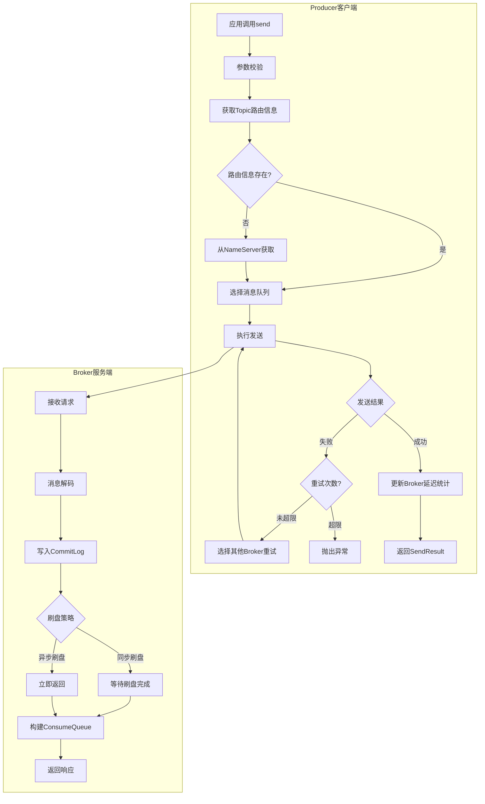
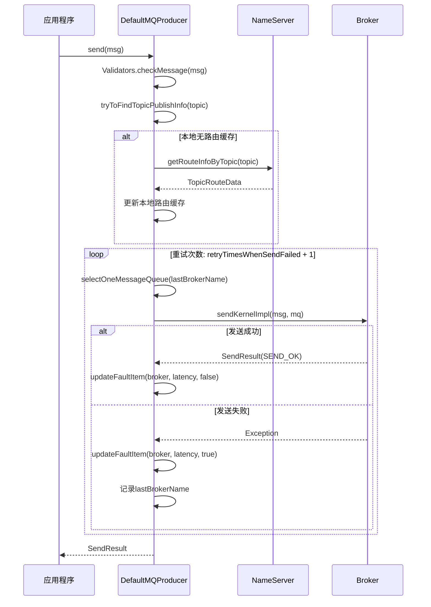
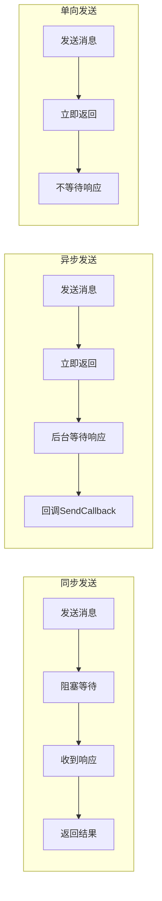
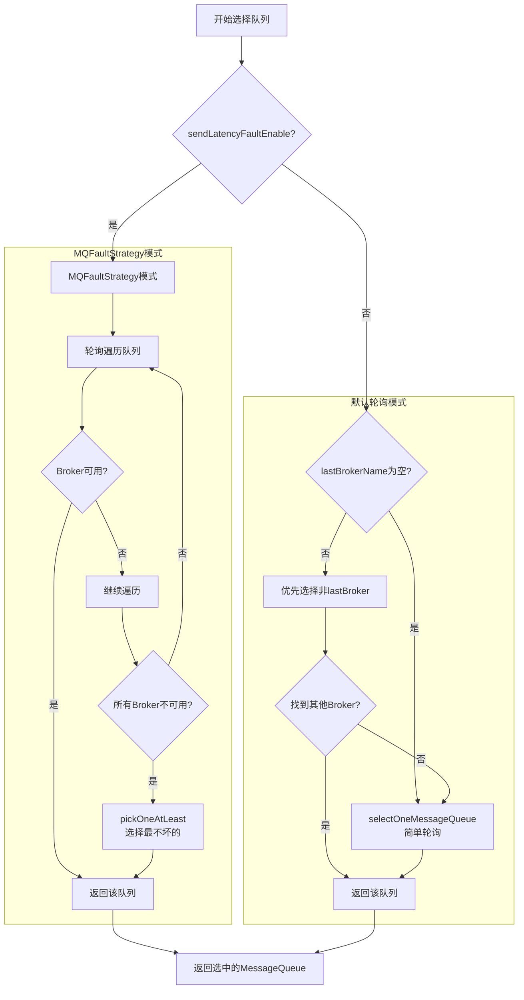
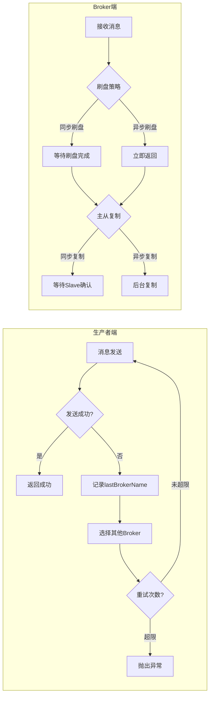
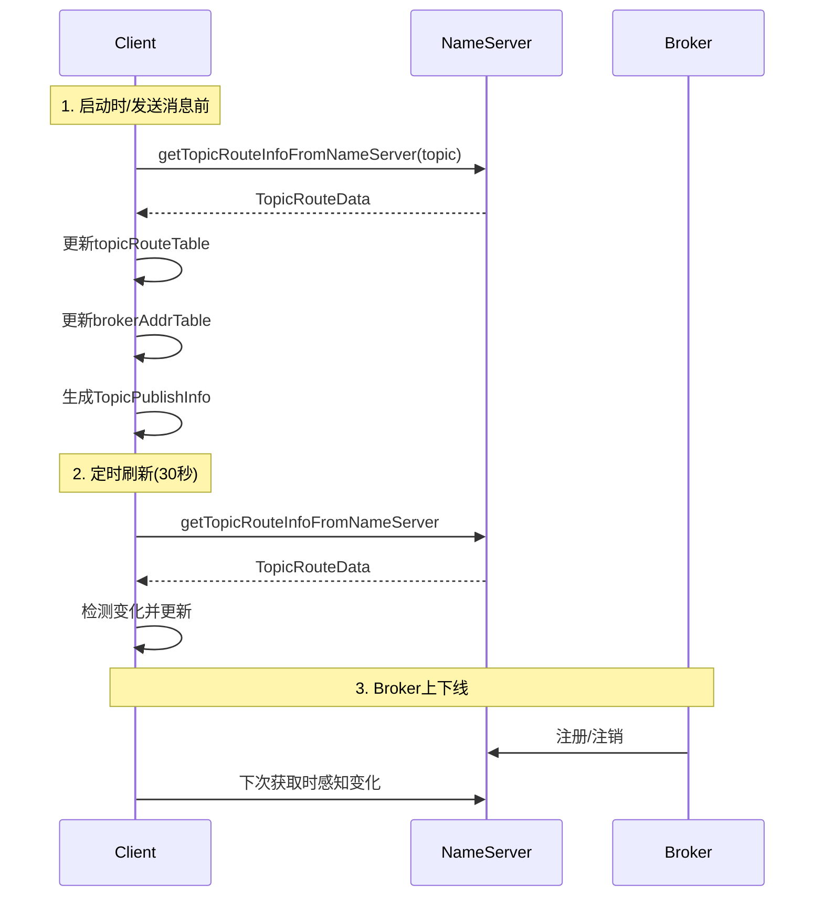

# RocketMQ 技术架构分析 - 消息发送篇

> 本篇深入分析 RocketMQ 消息发送的完整流程，包括发送方式、队列选择策略、高可用机制和批量发送。

---

## 一、发送流程总览

### 1.1 发送流程图



### 1.2 同步发送详细时序



---

## 二、三种发送方式

### 2.1 发送方式对比



| 发送方式 | 可靠性 | 性能 | 返回结果 | 适用场景 |
| --- | --- | --- | --- | --- |
| **同步发送** | 最高 | 较低 | SendResult | 重要消息，需要确认发送结果 |
| **异步发送** | 高 | 较高 | 回调通知 | 对响应时间敏感的场景 |
| **单向发送** | 低 | 最高 | 无返回 | 日志收集、非关键消息 |

### 2.2 同步发送

```java
DefaultMQProducer producer = new DefaultMQProducer("ProducerGroup");
producer.start();

Message msg = new Message("TopicTest", "TagA", "Hello".getBytes());
SendResult result = producer.send(msg);  // 阻塞等待响应

System.out.println("发送结果: " + result.getSendStatus());
System.out.println("消息ID: " + result.getMsgId());
System.out.println("队列: " + result.getMessageQueue());
```

### 2.3 异步发送

```java
producer.send(msg, new SendCallback() {
    @Override
    public void onSuccess(SendResult sendResult) {
        System.out.println("发送成功: " + sendResult.getMsgId());
    }
    
    @Override
    public void onException(Throwable e) {
        System.err.println("发送失败: " + e.getMessage());
    }
});
// 立即返回，不阻塞
```

### 2.4 单向发送

```java
producer.sendOneway(msg);  // 不等待响应，不保证送达
```

---

## 三、队列选择策略

> **重要说明**：Producer 看到的队列列表是**可写队列**（`writeQueueNums`），而非读队列。Topic 的读写队列数可以不同，Producer 只关心可写队列，Consumer 只关心可读队列。

**读写队列数不一致的影响**：

| 场景 | writeQueueNums | readQueueNums | 后果 |
| --- | --- | --- | --- |
| 写多读少 | 8 | 4 | 队列 4-7 的消息**无法被消费** |
| 写少读多 | 4 | 8 | 队列 4-7 **无消息**，Consumer 空转 |

```plain
示例：writeQueueNums=8, readQueueNums=4

Producer 可见队列:     [0] [1] [2] [3] [4] [5] [6] [7]
Consumer 可见队列:     [0] [1] [2] [3]
                              ↑
                        队列4-7的消息无法被消费！
```

**建议**：生产环境中 `writeQueueNums` 和 `readQueueNums` 应保持一致，避免消息丢失或消费空转。

### 3.1 选择策略总览

**方法入口调用链**：

```
producer.send(msg)
    ↓
DefaultMQProducerImpl.sendDefaultImpl()  ← 核心入口
    ↓
this.selectOneMessageQueue(topicPublishInfo, lastBrokerName)
    ↓
mqFaultStrategy.selectOneMessageQueue(tpInfo, lastBrokerName)
    ↓
根据 sendLatencyFaultEnable 配置分流
```

**核心代码** ([DefaultMQProducerImpl.java:627](file:///d:/work/github/rocketmq/client/src/main/java/org/apache/rocketmq/client/impl/producer/DefaultMQProducerImpl.java#L627)):

```java
// sendDefaultImpl() 方法内，重试循环中
for (; times < timesTotal; times++) {
    String lastBrokerName = null == mq ? null : mq.getBrokerName();
    MessageQueue mqSelected = this.selectOneMessageQueue(topicPublishInfo, lastBrokerName);
    // ...
}
```



**三种选择策略对比**：

| 策略 | 触发条件 | 核心逻辑 | 章节 |
| --- | --- | --- | --- |
| **默认轮询** | `lastBrokerName == null` | `index % queueCount` 均匀分布 | 3.2 |
| **故障隔离** | `lastBrokerName != null` 且 `sendLatencyFaultEnable = false` | 避开上次失败的 Broker | 3.3.1 |
| **延迟容错** | `sendLatencyFaultEnable = true` | 根据延迟动态隔离 Broker | 3.3.2 |

### 3.2 默认轮询选择

默认的 `send(msg)` 使用 `TopicPublishInfo.selectOneMessageQueue()` 进行轮询选择：

```java
// TopicPublishInfo.java
public MessageQueue selectOneMessageQueue() {
    int index = this.sendWhichQueue.incrementAndGet();  // ThreadLocal 自增
    int pos = Math.abs(index) % this.messageQueueList.size();
    return this.messageQueueList.get(pos);  // 轮询选择
}
```

**核心特点**：

| 特性 | 说明 |
| --- | --- |
| **轮询策略** | `index % queueCount`，均匀分布到所有队列 |
| **线程安全** | 使用 `ThreadLocalIndex`，每个线程独立计数，避免竞争 |
| **随机起点** | 首次调用时随机初始化，避免多 Producer 同时从 0 开始 |

#### ThreadLocalIndex 线程安全实现

每个线程独立的计数器，避免多线程竞争 ([ThreadLocalIndex.java](file:///d:/work/github/rocketmq/client/src/main/java/org/apache/rocketmq/client/common/ThreadLocalIndex.java))：

```java
public class ThreadLocalIndex {
    private final ThreadLocal<Integer> threadLocalIndex = new ThreadLocal<Integer>();
    private final Random random = new Random();
    private final static int POSITIVE_MASK = 0x7FFFFFFF;
    
    public int incrementAndGet() {
        Integer index = this.threadLocalIndex.get();
        if (null == index) {
            index = random.nextInt();  // 随机初始化
            this.threadLocalIndex.set(index);
        }
        this.threadLocalIndex.set(++index);  // 先自增再设置
        return Math.abs(index & POSITIVE_MASK);  // 位运算保证正数
    }
}
```

**为什么使用 ThreadLocal**：

| 方案 | 优点 | 缺点 |
| --- | --- | --- |
| AtomicInteger | 简单 | 多线程竞争，性能下降 |
| synchronized | 线程安全 | 锁开销大 |
| **ThreadLocal** | 无锁，高性能 | 内存占用略高 |

**多线程均衡性分析**：ThreadLocalIndex 不会造成队列消息不均衡。每个线程独立轮询遍历所有队列，数学上仍然均匀分布。

| 设计点 | 作用 |
| --- | --- |
| ThreadLocal 隔离 | 消除多线程竞争，提高性能 |
| 随机初始值 | 避免所有线程同时从 Q0 开始，分散初始负载 |
| 自增轮询 | 每个线程独立遍历所有队列，保证单线程内均匀 |

### 3.3 故障规避机制

RocketMQ 提供了两种故障规避机制，用于在消息发送失败时选择其他 Broker 重试：

| sendLatencyFaultEnable | 使用的机制 | 说明 |
| --- | --- | --- |
| `false`（默认） | lastBrokerName | 简单避开上次失败的 Broker |
| `true` | MQFaultStrategy | 基于延迟动态隔离，不使用 lastBrokerName |

#### 3.3.1 lastBrokerName 简单隔离

在默认轮询基础上，`selectOneMessageQueue(lastBrokerName)` 增加了故障隔离能力：

`lastBrokerName` 是 Producer 在消息发送失败重试时用于**故障隔离**的关键参数：

| 属性 | 说明 |
| --- | --- |
| **定义** | 上一次消息发送失败的 Broker 名称 |
| **初始值** | `null`（首次发送时） |
| **更新时机** | 每次发送失败后更新为当前 Broker 名称 |
| **作用** | 重试时优先选择其他 Broker，实现故障隔离 |

**核心代码** ([TopicPublishInfo.java](file:///d:/work/github/rocketmq/client/src/main/java/org/apache/rocketmq/client/impl/producer/TopicPublishInfo.java)):

```java
public MessageQueue selectOneMessageQueue(final String lastBrokerName) {
    if (lastBrokerName == null) {
        return selectOneMessageQueue();  // 首次发送，使用默认轮询
    } else {
        // 重试时：优先选择非上次失败Broker的队列
        for (int i = 0; i < this.messageQueueList.size(); i++) {
            int index = this.sendWhichQueue.incrementAndGet();
            int pos = Math.abs(index) % this.messageQueueList.size();
            MessageQueue mq = this.messageQueueList.get(pos);
            if (!mq.getBrokerName().equals(lastBrokerName)) {
                return mq;
            }
        }
        return selectOneMessageQueue();  // 找不到其他Broker，降级为默认轮询
    }
}
```

**降级场景分析**：

`return selectOneMessageQueue()` 降级逻辑触发条件是：**该 Topic 的所有可写队列都属于同一个 Broker**。

注意：这里说的是"该 Topic 的可写队列"，而非"集群中只有一个 Broker"。可能的情况包括：

| 场景 | 说明 |
| --- | --- |
| 单 Broker 部署 | 集群只有一个 Broker |
| Topic 单节点创建 | 集群有多个 Broker，但该 Topic 只在一个 Broker 上创建队列 |
| 写队列为 0 | 其他 Broker 上该 Topic 的 `writeQueueNums = 0` |
| Broker 下线 | 其他 Broker 的队列已从路由信息中移除 |

#### 3.3.2 MQFaultStrategy 延迟容错

**核心原理**：根据 Broker 的响应延迟动态调整隔离时间 ([MQFaultStrategy.java](file:///d:/work/github/rocketmq/client/src/main/java/org/apache/rocketmq/client/latency/MQFaultStrategy.java))。

```java
private long[] latencyMax = {50L, 100L, 550L, 1000L, 2000L, 3000L, 15000L};
private long[] notAvailableDuration = {0L, 0L, 30000L, 60000L, 120000L, 180000L, 600000L};
```

| 延迟范围 | 隔离时长 | 说明 |
| --- | --- | --- |
| >= 15s | 10 分钟 | 极严重延迟 |
| >= 3s | 3 分钟 | 严重延迟 |
| >= 2s | 2 分钟 | 高延迟 |
| >= 1s | 1 分钟 | 较高延迟 |
| >= 550ms | 30 秒 | 中等延迟 |
| < 550ms | 不隔离 | 正常 |

**启用方式**：

```java
producer.setSendLatencyFaultEnable(true);  // 默认 false
```

**LatencyFaultTolerance 底层实现**：

`LatencyFaultTolerance` 是 MQFaultStrategy 的核心组件，用于管理 Broker 的故障状态 ([LatencyFaultToleranceImpl.java](file:///d:/work/github/rocketmq/client/src/main/java/org/apache/rocketmq/client/latency/LatencyFaultToleranceImpl.java))。

**核心数据结构**：

```plain
ConcurrentHashMap<String, FaultItem> faultItemTable
┌─────────────────────────────────────────────────────────┐
│  Key: BrokerName                                        │
│  Value: FaultItem                                       │
│    ├── name: Broker名称                                  │
│    ├── currentLatency: 当前延迟                          │
│    └── startTimestamp: 可用开始时间 (= 当前时间 + 隔离时长) │
└─────────────────────────────────────────────────────────┘
```

**核心方法**：

| 方法 | 功能 | 说明 |
| --- | --- | --- |
| `updateFaultItem` | 更新故障项 | 记录延迟，设置隔离结束时间 |
| `isAvailable` | 判断是否可用 | 当前时间 >= startTimestamp |
| `pickOneAtLeast` | 选择最不坏的 Broker | 所有 Broker 都不可用时使用 |

**FaultItem 排序规则**：

1. 可用优先
2. 延迟低优先
3. 恢复时间早优先

#### 3.3.3 两种机制对比

| 特性 | lastBrokerName | MQFaultStrategy |
| --- | --- | --- |
| 记录范围 | 仅最后一次失败的 Broker | 所有 Broker 的故障状态 |
| 隔离策略 | 简单避开 | 根据延迟动态隔离 |
| 默认状态 | ✅ 始终生效 | ❌ 默认关闭 |
| 适用场景 | 简单故障隔离 | 高可用生产环境 |

**互斥关系**：

```java
// MQFaultStrategy.selectOneMessageQueue()
public MessageQueue selectOneMessageQueue(...) {
    if (sendLatencyFaultEnable) {
        // 使用延迟容错机制，不依赖 lastBrokerName
    } else {
        // 使用 lastBrokerName 简单隔离
    }
}
```

### 3.4 MessageQueueSelector 接口

> **注意**：`MessageQueueSelector` **不是默认使用的**。只有调用 `send(msg, selector, arg)` 方法时才会使用。默认的 `send(msg)` 使用的是 `TopicPublishInfo.selectOneMessageQueue()` 轮询选择。

```java
public interface MessageQueueSelector {
    MessageQueue select(final List<MessageQueue> mqs, final Message msg, final Object arg);
}
```

**内置选择器实现**：

| 选择器 | 策略 | 使用场景 |
| --- | --- | --- |
| `SelectMessageQueueByHash` | `arg.hashCode() % mqs.size()` | 顺序消息 |
| `SelectMessageQueueByRandom` | `random.nextInt(mqs.size())` | 随机负载均衡 |
| `SelectMessageQueueByMachineRoom` | 空实现，需用户扩展 | 按机房路由 |

**使用示例**：

```java
// 订单消息按订单ID发送到同一队列，保证顺序
producer.send(msg, new SelectMessageQueueByHash(), orderId);
```

### 3.5 TopicPublishInfo 详解

`TopicPublishInfo` 是 Producer 端用于**管理 Topic 发布路由信息**的核心数据结构。它封装了从 NameServer 获取的原始路由数据（`TopicRouteData`），转换为 Producer 可直接使用的消息队列列表。

**核心属性**：

| 属性 | 类型 | 说明 |
| --- | --- | --- |
| `messageQueueList` | List | Topic 下所有可写队列 |
| `sendWhichQueue` | ThreadLocalIndex | 线程本地队列选择器 |
| `topicRouteData` | TopicRouteData | 原始路由数据 |
| `orderTopic` | boolean | 是否顺序消息 |

**messageQueueList 初始化逻辑**：

```java
// MQClientInstance.topicRouteData2TopicPublishInfo()
public static TopicPublishInfo topicRouteData2TopicPublishInfo(String topic, TopicRouteData route) {
    TopicPublishInfo info = new TopicPublishInfo();
    
    // 遍历所有QueueData，筛选可写的队列
    for (QueueData qd : route.getQueueDatas()) {
        if (PermName.isWriteable(qd.getPerm())) {  // 检查写权限
            // 找到对应的BrokerData
            BrokerData brokerData = findBrokerData(route, qd.getBrokerName());
            
            // 确保Master存在
            if (brokerData.getBrokerAddrs().containsKey(MASTER_ID)) {
                // 根据writeQueueNums创建MessageQueue
                for (int i = 0; i < qd.getWriteQueueNums(); i++) {
                    MessageQueue mq = new MessageQueue(topic, qd.getBrokerName(), i);
                    info.getMessageQueueList().add(mq);
                }
            }
        }
    }
    return info;
}
```

**初始化流程**：

```plain
TopicRouteData (从NameServer获取)
├── QueueData
│   ├── brokerName: "Broker-A"
│   ├── readQueueNums: 4
│   ├── writeQueueNums: 4
│   └── perm: 6 (可读可写)
├── QueueData
│   ├── brokerName: "Broker-B"
│   ├── readQueueNums: 4
│   ├── writeQueueNums: 4
│   └── perm: 6 (可读可写)
└── BrokerData列表
    ├── BrokerData
    │   ├── brokerName: "Broker-A"
    │   └── brokerAddrs: {0=192.168.1.1:10911, 1=192.168.1.1:10912}
    └── BrokerData
        ├── brokerName: "Broker-B"
        └── brokerAddrs: {0=192.168.1.2:10911, 1=192.168.1.2:10912}
    
           ↓ 转换

TopicPublishInfo
└── messageQueueList:
    ├── MessageQueue{topic="Order", brokerName="Broker-A", queueId=0}
    ├── MessageQueue{topic="Order", brokerName="Broker-A", queueId=1}
    ├── MessageQueue{topic="Order", brokerName="Broker-A", queueId=2}
    ├── MessageQueue{topic="Order", brokerName="Broker-A", queueId=3}
    ├── MessageQueue{topic="Order", brokerName="Broker-B", queueId=0}
    ├── MessageQueue{topic="Order", brokerName="Broker-B", queueId=1}
    ├── MessageQueue{topic="Order", brokerName="Broker-B", queueId=2}
    └── MessageQueue{topic="Order", brokerName="Broker-B", queueId=3}
```

> **扩展阅读**：关于路由缓存层级结构、Producer vs Consumer 路由处理对比等详细内容，见 [十一、Client 元数据管理](#十一client-元数据管理)。

---

## 四、发送重试机制

### 4.1 重试核心逻辑

**同步发送重试**（在 `sendDefaultImpl` 循环中）：

```java
// DefaultMQProducerImpl.sendDefaultImpl()
int timesTotal = communicationMode == CommunicationMode.SYNC 
    ? 1 + this.defaultMQProducer.getRetryTimesWhenSendFailed()  // 同步: 默认3次
    : 1;                                                         // 异步/单向: 此循环不重试

for (int times = 0; times < timesTotal; times++) {
    String lastBrokerName = null == mq ? null : mq.getBrokerName();
    MessageQueue mqSelected = this.selectOneMessageQueue(topicPublishInfo, lastBrokerName);
    
    try {
        SendResult sendResult = this.sendKernelImpl(msg, mq, communicationMode, ...);
        this.updateFaultItem(mq.getBrokerName(), latency, false);
        return sendResult;
    } catch (RemotingException | MQClientException e) {
        this.updateFaultItem(mq.getBrokerName(), latency, true);
        continue;  // 重试
    }
}
```

**异步发送重试**（在 `MQClientAPIImpl.onExceptionImpl` 回调中）：

```java
// MQClientAPIImpl.onExceptionImpl()
private void onExceptionImpl(...) {
    int tmp = curTimes.incrementAndGet();
    if (needRetry && tmp <= timesTotal) {  // timesTotal = retryTimesWhenSendAsyncFailed
        // 异步重试，默认发送到同一个 Broker
        String retryBrokerName = brokerName;
        if (topicPublishInfo != null) {
            MessageQueue mqChosen = producer.selectOneMessageQueue(topicPublishInfo, brokerName);
            retryBrokerName = instance.getBrokerNameFromMessageQueue(mqChosen);
        }
        sendMessageAsync(addr, retryBrokerName, msg, ...);
    } else {
        sendCallback.onException(e);  // 最终失败，回调用户
    }
}
```

### 4.2 同步 vs 异步重试对比

| 特性 | 同步发送 | 异步发送 | 单向发送 |
| --- | --- | --- | --- |
| 重试层次 | `sendDefaultImpl` 循环 | `onExceptionImpl` 回调 | 无重试 |
| 配置参数 | `retryTimesWhenSendFailed` | `retryTimesWhenSendAsyncFailed` | - |
| 默认值 | 2（总共3次） | 2（总共3次） | - |
| Broker选择 | **选择其他 Broker** | **默认同一 Broker** | - |
| 重试时机 | 同步阻塞重试 | 异步回调中重试 | - |

> **注意**：异步发送的重试在更底层的网络回调中处理，`sendDefaultImpl` 中的 `timesTotal = 1` 只是表示该层循环不重试，并非异步发送无重试机制。

### 4.3 异步回调与重试的关系

`SendCallback` 的回调时机与异步重试机制密切相关：

| 场景 | 回调方法 | 说明 |
| --- | --- | --- |
| 首次发送成功 | `onSuccess()` | 立即回调 |
| 首次失败 → 重试成功 | `onSuccess()` | 重试成功后回调 |
| 所有重试都失败 | `onException()` | 最终失败才回调 |

```
producer.send(msg, sendCallback)
         │
         ▼
    网络异步发送
         │
    ┌────┴────┐
    ▼         ▼
 成功       失败
    │         │
    ▼         ▼
onSuccess()  onExceptionImpl()
              │
         ┌────┴────┐
         ▼         ▼
    重试次数未达上限  重试次数已达上限
         │              │
         ▼              ▼
    重新发送       onException()
```

> **注意**：重试过程对用户透明，用户只会收到**一次**回调（成功或最终失败）。

### 4.4 重试触发条件

| 异常类型 | 是否重试 | 说明 |
| --- | --- | --- |
| `RemotingException` | ✅ 重试 | 网络异常 |
| `MQClientException` | ✅ 重试 | 客户端异常 |
| `MQBrokerException` | ⚠️ 视情况 | Broker 返回错误码 |
| `InterruptedException` | ❌ 不重试 | 线程中断 |

### 4.5 重试配置

**核心配置项** ([DefaultMQProducer.java:113](file:///d:/work/github/rocketmq/client/src/main/java/org/apache/rocketmq/client/producer/DefaultMQProducer.java#L113)):

```java
// 同步发送重试次数，默认值 2（总共最多尝试 1 + 2 = 3 次）
private int retryTimesWhenSendFailed = 2;

// 异步发送重试次数，默认值 2
private int retryTimesWhenSendAsyncFailed = 2;
```

**配置示例**：

```java
producer.setRetryTimesWhenSendFailed(3);       // 同步发送重试次数
producer.setRetryTimesWhenSendAsyncFailed(3);  // 异步发送重试次数
producer.setSendLatencyFaultEnable(true);      // 启用延迟容错
```

**注意**：`retryTimesWhenSendFailed = 2` 表示重试 2 次，加上首次发送，**总共最多尝试 3 次**。

---

## 五、消息压缩机制

RocketMQ 使用**无损压缩**算法，压缩后可完全还原原始消息内容，不会丢失任何数据。

**支持的压缩算法** ([CompressionType.java](file:///d:/work/github/rocketmq/common/src/main/java/org/apache/rocketmq/common/compression/CompressionType.java))：

| 算法 | 压缩比 | 压缩速度 | 解压速度 | 说明 |
|------|--------|---------|---------|------|
| **ZLIB** (默认) | 2.743 | 95 MB/s | 400 MB/s | ZIP/DEFLATE 算法 |
| **ZSTD** | 2.887 | 530 MB/s | 1700 MB/s | 高压缩比 |
| **LZ4** | 2.101 | 740 MB/s | 4500 MB/s | 极速压缩/解压 |

### 5.1 压缩触发条件

消息体超过阈值（默认 4KB）时自动压缩：

```java
// DefaultMQProducer 配置
private int compressMsgBodyOverHowmuch = 1024 * 4;  // 压缩阈值: 4KB

// 消息发送时的压缩逻辑
if (msgBody.length > compressMsgBodyOverHowmuch) {
    byte[] compressed = UtilAll.compress(msgBody, 5);  // 压缩级别5
    msg.setBody(compressed);
    msg.setProperty(MessageConst.PROPERTY_COMPRESSED, "true");
}
```

### 5.2 压缩配置

| 参数 | 默认值 | 说明 |
| --- | --- | --- |
| `compressMsgBodyOverHowmuch` | 4096 (4KB) | 触发压缩的消息体大小阈值 |
| 压缩级别 | 5 | ZIP 压缩级别 (1-9) |

### 5.3 压缩标志机制

RocketMQ 通过 **sysFlag 系统标志位** 感知消息是否被压缩 ([MessageSysFlag.java](file:///d:/work/github/rocketmq/common/src/main/java/org/apache/rocketmq/common/sysflag/MessageSysFlag.java))：

```plain
sysFlag 位分布:
| bit    | 7 | 6 | 5         | 4        | 3           | 2                | 1                | 0                |
|--------|---|---|-----------|----------|-------------|------------------|------------------|------------------|
| byte 1 |   |   | STOREHOST | BORNHOST | TRANSACTION | TRANSACTION      | MULTI_TAGS       | COMPRESSED       |
| byte 2 |   |   |           |          |             | COMPRESSION_TYPE | COMPRESSION_TYPE | COMPRESSION_TYPE |
```

**关键标志位**：

| 标志位 | 值 | 说明 |
| --- | --- | --- |
| `COMPRESSED_FLAG` | `0x1` (bit 0) | 是否压缩 |
| `COMPRESSION_LZ4_TYPE` | `0x1 << 8` | LZ4 压缩 |
| `COMPRESSION_ZSTD_TYPE` | `0x2 << 8` | ZSTD 压缩 |
| `COMPRESSION_ZLIB_TYPE` | `0x3 << 8` | ZLIB 压缩 |

**发送端设置标志** ([DefaultMQProducerImpl.java](file:///d:/work/github/rocketmq/client/src/main/java/org/apache/rocketmq/client/impl/producer/DefaultMQProducerImpl.java))：

```java
int sysFlag = 0;
if (this.tryToCompressMessage(msg)) {
    sysFlag |= MessageSysFlag.COMPRESSED_FLAG;      // 设置压缩标志
    sysFlag |= compressType.getCompressionFlag();   // 设置压缩类型
}
requestHeader.setSysFlag(sysFlag);
```

**接收端解压** ([ClientRemotingProcessor.java](file:///d:/work/github/rocketmq/client/src/main/java/org/apache/rocketmq/client/impl/ClientRemotingProcessor.java))：

```java
int sysFlag = requestHeader.getSysFlag();
if ((sysFlag & MessageSysFlag.COMPRESSED_FLAG) == MessageSysFlag.COMPRESSED_FLAG) {
    Compressor compressor = CompressorFactory.getCompressor(
        MessageSysFlag.getCompressionType(sysFlag));
    body = compressor.decompress(body);
}
```

### 5.4 压缩性能对比

| 消息大小 | 压缩前 | 压缩后 | 压缩比 | 压缩耗时 |
| --- | --- | --- | --- | --- |
| 1KB | 1KB | ~0.8KB | ~22% | <1ms |
| 10KB | 10KB | ~4KB | ~60% | ~2ms |
| 100KB | 100KB | ~20KB | ~80% | ~10ms |
| 1MB | 1MB | ~150KB | ~85% | ~50ms |

**建议**：消息体大于 4KB 时开启压缩，权衡压缩比和 CPU 开销。

---

## 六、批量发送机制

### 6.1 批量发送使用

多条消息合并发送，减少网络开销：

```java
List<Message> messages = new ArrayList<>();
messages.add(new Message("TopicTest", "TagA", "OrderID001", "Body1".getBytes()));
messages.add(new Message("TopicTest", "TagA", "OrderID002", "Body2".getBytes()));
messages.add(new Message("TopicTest", "TagA", "OrderID003", "Body3".getBytes()));

SendResult sendResult = producer.send(messages);
```

### 6.2 批量发送限制

| 限制项 | 默认值 | 说明 |
| --- | --- | --- |
| 批量消息大小 | 4MB | 所有消息体总大小不超过 4MB |
| 批量消息条数 | 无限制 | 受总大小限制 |
| 延迟消息 | 不支持 | 批量消息不支持延迟 |
| 事务消息 | 不支持 | 批量消息不支持事务 |

### 6.3 批量消息编码格式

```plain
┌─────────────────────────────────────────────────────────────────┐
│                    批量消息编码结构                              │
├─────────────────────────────────────────────────────────────────┤
│  MessageBatch编码:                                              │
│  ┌─────────────┬─────────────┬─────────────┬─────────────┐     │
│  │ msg1 length │   msg1 body │ msg2 length │   msg2 body │ ... │
│  │   4 bytes   │   n bytes   │   4 bytes   │   n bytes   │     │
│  └─────────────┴─────────────┴─────────────┴─────────────┘     │
└─────────────────────────────────────────────────────────────────┘
```

### 6.4 批量发送最佳实践

```java
List<Message> batch = new ArrayList<>();
int batchSize = 0;

for (Message msg : messages) {
    // 控制批量大小（建议单批次不超过1MB）
    if (batchSize + msg.getBody().length > 1024 * 1024) {
        producer.send(batch);  // 发送当前批次
        batch.clear();
        batchSize = 0;
    }
    batch.add(msg);
    batchSize += msg.getBody().length;
}

// 发送剩余消息
if (!batch.isEmpty()) {
    producer.send(batch);
}
```

---

## 七、消息发送高可用

### 7.1 高可用机制总览



### 7.2 客户端高可用

| 机制 | 说明 |
| --- | --- |
| **路由缓存** | 本地缓存 Topic 路由信息，减少 NameServer 访问 |
| **故障隔离** | lastBrokerName 机制避开失败的 Broker |
| **延迟容错** | MQFaultStrategy 根据延迟动态隔离 |
| **发送重试** | 同步发送默认重试 2 次 |

### 7.3 服务端高可用

| 机制 | 说明 |
| --- | --- |
| **同步刷盘** | 确保消息持久化到磁盘 |
| **同步复制** | 确保消息复制到 Slave |
| **主从切换** | Master 故障时 Slave 接管 |

**Master 故障时 Slave 接管流程**：

| 部署模式 | 接管方式 | 接管流程 | 写入影响 |
| --- | --- | --- | --- |
| **传统模式** | 手动切换 | 1. 检测 Master 故障<br>2. 修改 Slave 配置为 Master<br>3. 重启 Slave | 故障期间写入不可用 |
| **DLedger 模式** | 自动切换 | 1. Raft 检测 Leader 故障<br>2. 自动选举新 Leader<br>3. 更新路由元数据 | 秒级恢复写入 |
| **Controller 模式** | 自动切换 | 1. Controller 检测心跳超时<br>2. 从 SyncStateSet 选新 Master<br>3. 通知 Slave 升级 | 秒级恢复写入 |

> 详细的主从切换机制见 [高可用与运维篇](./07-高可用与运维篇.md#二故障转移机制)。

---

## 八、发送结果状态

### 8.1 SendResult 类

`SendResult` 是消息发送的返回结果，包含发送状态、消息ID、队列信息等 ([SendResult.java](file:///d:/work/github/rocketmq/client/src/main/java/org/apache/rocketmq/client/producer/SendResult.java))：

```java
public class SendResult {
    private SendStatus sendStatus;      // 发送状态
    private String msgId;               // 客户端生成的唯一消息ID
    private String offsetMsgId;         // Broker生成的消息ID（包含Broker地址和offset）
    private MessageQueue messageQueue;  // 消息发送到的队列
    private long queueOffset;           // 消息在队列中的偏移量
    private String transactionId;       // 事务ID（事务消息使用）
    private String regionId;            // 区域ID
    private boolean traceOn = true;     // 是否开启消息追踪
    private byte[] rawRespBody;         // 原始响应体（内部使用）
}
```

**核心属性说明**：

| 属性 | 类型 | 说明 |
| --- | --- | --- |
| `sendStatus` | SendStatus | 发送状态枚举 |
| `msgId` | String | 客户端生成的唯一ID，格式：`IP + 进程ID + 时间戳 + 自增序号` |
| `offsetMsgId` | String | Broker 生成的 ID，格式：`Broker IP + CommitLog Offset` |
| `messageQueue` | MessageQueue | 消息发送到的队列信息 |
| `queueOffset` | long | 消息在 ConsumeQueue 中的偏移量 |
| `transactionId` | String | 事务消息的事务ID |

**msgId vs offsetMsgId**：

| 属性 | 生成位置 | 用途 | 格式示例 |
| --- | --- | --- | --- |
| `msgId` | Producer 客户端 | 全局唯一标识，用于消息查询 | `C0A8010100002A9F00000000000001F4` |
| `offsetMsgId` | Broker 服务端 | 定位消息在 Broker 上的物理位置 | `C0A8010100002A9F00000000000001F4` |

### 8.2 SendStatus 枚举

| 状态 | 说明 | 后续处理 |
| --- | --- | --- |
| `SEND_OK` | 发送成功 | 无需处理 |
| `FLUSH_DISK_TIMEOUT` | 刷盘超时 | 消息可能丢失，需重发 |
| `FLUSH_SLAVE_TIMEOUT` | 主从同步超时 | Slave 未同步，可能丢失 |
| `SLAVE_NOT_AVAILABLE` | Slave 不可用 | 无 Slave，可能丢失 |

**返回条件详解**：

| 状态 | 返回条件 | 消息状态 | 源码位置 |
| --- | --- | --- | --- |
| `SEND_OK` | 消息写入成功 + 刷盘成功（同步模式）+ 复制成功（同步模式） | 已持久化，安全 | [SendMessageProcessor.java](file:///d:/work/github/rocketmq/broker/src/main/java/org/apache/rocketmq/broker/processor/SendMessageProcessor.java) |
| `FLUSH_DISK_TIMEOUT` | 同步刷盘模式下，刷盘超时（默认 5s） | 已写入 PageCache，未落盘 | [CommitLog.java](file:///d:/work/github/rocketmq/store/src/main/java/org/apache/rocketmq/store/CommitLog.java) |
| `FLUSH_SLAVE_TIMEOUT` | 同步复制模式下，Slave 同步超时（默认 5s） | Master 已持久化，Slave 未同步 | [GroupTransferService.java](file:///d:/work/github/rocketmq/store/src/main/java/org/apache/rocketmq/store/ha/GroupTransferService.java) |
| `SLAVE_NOT_AVAILABLE` | 同步复制模式下，无可用 Slave 连接 | Master 已持久化，无 Slave | [SendMessageProcessor.java](file:///d:/work/github/rocketmq/broker/src/main/java/org/apache/rocketmq/broker/processor/SendMessageProcessor.java) |

**状态与配置的关系**：

| 配置 | flushDiskType | brokerRole | 可能返回的状态 |
| --- | --- | --- | --- |
| 高性能 | ASYNC_FLUSH | ASYNC_MASTER | `SEND_OK` |
| 高可靠（刷盘） | SYNC_FLUSH | ASYNC_MASTER | `SEND_OK`, `FLUSH_DISK_TIMEOUT` |
| 高可靠（复制） | ASYNC_FLUSH | SYNC_MASTER | `SEND_OK`, `SLAVE_NOT_AVAILABLE`, `FLUSH_SLAVE_TIMEOUT` |
| 最高可靠 | SYNC_FLUSH | SYNC_MASTER | `SEND_OK`, `FLUSH_DISK_TIMEOUT`, `SLAVE_NOT_AVAILABLE`, `FLUSH_SLAVE_TIMEOUT` |

> **注意**：`FLUSH_DISK_TIMEOUT`、`FLUSH_SLAVE_TIMEOUT`、`SLAVE_NOT_AVAILABLE` 这三种状态在 Broker 端 `sendOK = true`，表示消息已写入成功，只是未达到高可靠要求。

### 8.3 处理建议

```java
SendResult result = producer.send(msg);
switch (result.getSendStatus()) {
    case SEND_OK:
        log.info("发送成功: {}", result.getMsgId());
        break;
    case FLUSH_DISK_TIMEOUT:
    case FLUSH_SLAVE_TIMEOUT:
    case SLAVE_NOT_AVAILABLE:
        log.warn("发送异常: {}, msgId={}", result.getSendStatus(), result.getMsgId());
        // 根据业务需求决定是否重发
        break;
}
```

### 8.4 发送失败场景分析

**重要区分**：消息发送失败有两种不同的表现形式：

| 失败类型 | 表现形式 | 是否有 SendResult | 说明 |
| --- | --- | --- | --- |
| **部分成功** | 返回 `SendResult`（非 `SEND_OK`） | ✅ 有 | 消息已写入 Broker，但未达到高可靠要求 |
| **完全失败** | 抛出异常 | ❌ 无 | 消息未成功写入 Broker |

#### 8.4.1 返回 SendResult 的场景

以下场景**返回 SendResult**，消息已写入 Broker：

| 状态 | 触发条件 | 消息状态 |
| --- | --- | --- |
| `SEND_OK` | 正常写入 | 已持久化 |
| `FLUSH_DISK_TIMEOUT` | 同步刷盘超时 | 在 PageCache，可能丢失 |
| `FLUSH_SLAVE_TIMEOUT` | 同步复制超时 | Master 已持久化，Slave 未同步 |
| `SLAVE_NOT_AVAILABLE` | 无可用 Slave | Master 已持久化 |

#### 8.4.2 抛出异常的场景

以下场景**抛出异常**，消息未成功写入 Broker：

| 异常类型 | 触发条件 | 错误码 |
| --- | --- | --- |
| `MQClientException` | 重试次数耗尽 | `CONNECT_BROKER_EXCEPTION` |
| `RemotingTooMuchRequestException` | 发送超时 | - |
| `RemotingConnectException` | 连接 Broker 失败 | `CONNECT_BROKER_EXCEPTION` |
| `RemotingTimeoutException` | 请求 Broker 超时 | `ACCESS_BROKER_TIMEOUT` |
| `MQBrokerException` | Broker 返回错误码 | Broker 响应码 |
| `InterruptedException` | 线程被中断 | - |

**源码分析** ([DefaultMQProducerImpl.java:707-727](file:///d:/work/github/rocketmq/client/src/main/java/org/apache/rocketmq/client/impl/producer/DefaultMQProducerImpl.java#L707-L727))：

```java
// 重试次数耗尽后抛出异常
if (sendResult != null) {
    return sendResult;
}

String info = String.format("Send [%d] times, still failed, cost [%d]ms, Topic: %s, BrokersSent: %s",
    times, System.currentTimeMillis() - beginTimestampFirst, msg.getTopic(), Arrays.toString(brokersSent));

MQClientException mqClientException = new MQClientException(info, exception);
if (callTimeout) {
    throw new RemotingTooMuchRequestException("sendDefaultImpl call timeout");
}

if (exception instanceof MQBrokerException) {
    mqClientException.setResponseCode(((MQBrokerException) exception).getResponseCode());
} else if (exception instanceof RemotingConnectException) {
    mqClientException.setResponseCode(ClientErrorCode.CONNECT_BROKER_EXCEPTION);
} else if (exception instanceof RemotingTimeoutException) {
    mqClientException.setResponseCode(ClientErrorCode.ACCESS_BROKER_TIMEOUT);
}

throw mqClientException;  // 抛出异常，无 SendResult
```

#### 8.4.3 完整的发送结果处理示例

```java
try {
    SendResult result = producer.send(msg);
    
    switch (result.getSendStatus()) {
        case SEND_OK:
            log.info("发送成功: msgId={}, queue={}", result.getMsgId(), result.getMessageQueue());
            break;
        case FLUSH_DISK_TIMEOUT:
            log.warn("刷盘超时: msgId={}", result.getMsgId());
            break;
        case FLUSH_SLAVE_TIMEOUT:
            log.warn("主从同步超时: msgId={}", result.getMsgId());
            break;
        case SLAVE_NOT_AVAILABLE:
            log.warn("Slave不可用: msgId={}", result.getMsgId());
            break;
    }
} catch (RemotingTooMuchRequestException e) {
    log.error("发送超时: {}", e.getMessage());
} catch (MQClientException e) {
    log.error("客户端异常: code={}, msg={}", e.getResponseCode(), e.getMessage());
} catch (RemotingConnectException e) {
    log.error("连接Broker失败: {}", e.getMessage());
} catch (RemotingTimeoutException e) {
    log.error("请求Broker超时: {}", e.getMessage());
} catch (MQBrokerException e) {
    log.error("Broker异常: code={}, msg={}", e.getResponseCode(), e.getMessage());
} catch (InterruptedException e) {
    log.error("发送被中断: {}", e.getMessage());
    Thread.currentThread().interrupt();
}
```

---

## 九、生产者核心配置

### 9.1 必要配置

```java
DefaultMQProducer producer = new DefaultMQProducer("ProducerGroup");
producer.setNamesrvAddr("localhost:9876");
producer.start();
```

### 9.2 性能配置

| 配置项 | 默认值 | 说明 |
| --- | --- | --- |
| `createTopicKey` | `TBW102` | 自动创建 Topic 时使用的默认 Topic 模板 |
| `defaultTopicQueueNums` | 4 | 自动创建 Topic 时的队列数 |
| `compressMsgBodyOverHowmuch` | 4096 (4KB) | 压缩阈值 |
| `maxMessageSize` | 4MB | 消息最大大小 |
| `retryTimesWhenSendFailed` | 2 | 同步发送重试次数 |
| `sendMsgTimeout` | 3000ms | 发送超时时间 |
| `sendLatencyFaultEnable` | false | 是否启用延迟容错 |

### 9.3 完整配置示例

```java
DefaultMQProducer producer = new DefaultMQProducer("ProducerGroup");
producer.setNamesrvAddr("localhost:9876");
producer.setRetryTimesWhenSendFailed(3);
producer.setSendMsgTimeout(5000);
producer.setCompressMsgBodyOverHowmuch(1024 * 4);
producer.setSendLatencyFaultEnable(true);
producer.setMaxMessageSize(4 * 1024 * 1024);
producer.start();
```

---

## 十、Topic 自动创建机制

RocketMQ 支持 **Broker 端自动创建 Topic**，无需预先创建即可发送消息。

### 10.1 工作原理

**核心概念**：`TBW102` 是一个**配置模板**，用于为新 Topic 提供默认配置（队列数、权限）。新 Topic 的名称由 Producer 发送消息时指定。

```
Producer 发送消息到 "OrderService" Topic
                ↓
Broker 检查 "OrderService" 是否存在
                ↓ (不存在)
Broker 使用 TBW102 的配置作为模板
    - 队列数: 8
    - 权限: RWX (READ|WRITE|INHERIT)
                ↓
创建新 Topic "OrderService"（继承 TBW102 配置）
                ↓
注册到 NameServer
                ↓
消息存储到 "OrderService" Topic
```

**关键区分**：

| 概念 | 说明 |
| --- | --- |
| **模板 Topic 名称** | `TBW102`（固定值） |
| **新 Topic 名称** | Producer 发送消息时指定的 Topic 名称（如 `OrderService`） |
| **继承内容** | 队列数、权限（去掉 INHERIT 标志） |

### 10.2 关键配置

**Producer 端** ([DefaultMQProducer.java](file:///d:/work/github/rocketmq/client/src/main/java/org/apache/rocketmq/client/producer/DefaultMQProducer.java)):

```java
private String createTopicKey = TopicValidator.AUTO_CREATE_TOPIC_KEY_TOPIC; // "TBW102"
private volatile int defaultTopicQueueNums = 4;
```

**Broker 端** ([BrokerConfig.java](file:///d:/work/github/rocketmq/common/src/main/java/org/apache/rocketmq/common/BrokerConfig.java)):

```java
private boolean autoCreateTopicEnable = true;  // 是否允许自动创建
private int defaultTopicQueueNums = 8;         // 默认队列数
```

### 10.3 自动创建条件

Broker 端的 `createTopicInSendMessageMethod` 方法 ([TopicConfigManager.java:204](file:///d:/work/github/rocketmq/broker/src/main/java/org/apache/rocketmq/broker/topic/TopicConfigManager.java#L204)) 执行以下检查：

| 条件 | 说明 |
| --- | --- |
| `autoCreateTopicEnable = true` | Broker 开启自动创建 |
| `TBW102` Topic 存在 | 默认模板 Topic 必须存在 |
| `PERM_INHERIT` 权限 | TBW102 必须具有继承权限 (perm=7) |

### 10.4 权限标志位

TBW102 的权限为 `PERM_INHERIT | PERM_READ | PERM_WRITE = 7` ([PermName.java](file:///d:/work/github/rocketmq/common/src/main/java/org/apache/rocketmq/common/constant/PermName.java))：

| 标志位 | 值 | 说明 |
| --- | --- | --- |
| `PERM_INHERIT` | 1 (bit 0) | 允许作为模板继承创建新 Topic |
| `PERM_READ` | 2 (bit 1) | 可读 |
| `PERM_WRITE` | 4 (bit 2) | 可写 |

### 10.5 队列数计算

```java
int queueNums = Math.min(clientDefaultTopicQueueNums, defaultTopicConfig.getWriteQueueNums());
```

取 Producer 请求的队列数和 TBW102 配置队列数的**较小值**。

### 10.6 Consumer 与自动创建

**Consumer 不会自动创建 Topic**，但会自动创建 Consumer Group。

| 角色 | Topic 自动创建 | Group 自动创建 | 配置项 |
| --- | --- | --- | --- |
| Producer | ✅ 支持 | - | `autoCreateTopicEnable` |
| Consumer | ❌ 不支持 | ✅ 支持 | `autoCreateSubscriptionGroup` |

> **Consumer Group 自动创建机制详见**：[消息消费篇 - Consumer Group 自动创建机制](./05-消息消费篇.md#十一consumer-group-自动创建机制)

### 10.7 生产环境建议

| 场景 | 建议 |
| --- | --- |
| 开发/测试 | 保持 `autoCreateTopicEnable=true` |
| 生产环境 | 设置 `autoCreateTopicEnable=false`，预先创建 Topic |
| 权限隔离 | 禁用自动创建，通过 ACL 控制访问 |

> **注意**：生产环境建议禁用自动创建，避免 Topic 混乱和权限失控。

---

## 十一、Client 元数据管理

### 11.1 核心元数据表

```java
// MQClientInstance.java
public class MQClientInstance {
    // Topic路由信息表（普通Topic）
    ConcurrentMap<String/*Topic*/, TopicRouteData> topicRouteTable;
    
    // Broker地址表
    ConcurrentMap<String/*BrokerName*/, HashMap<Long/*brokerId*/, String/*address*/>> brokerAddrTable;
    
    // Topic端点表（静态Topic专用）
    ConcurrentMap<String, ConcurrentMap<MessageQueue, String/*brokerName*/>> topicEndPointsTable;
    
    // Broker版本表
    ConcurrentMap<String/*BrokerName*/, HashMap<String/*address*/, Integer/*version*/>> brokerVersionTable;
}
```

**topicRouteTable vs topicEndPointsTable**：

| 特性 | topicRouteTable | topicEndPointsTable |
|------|-----------------|---------------------|
| **数据类型** | `TopicRouteData` | `Map<MessageQueue, brokerName>` |
| **用途** | 普通 Topic 路由信息 | **静态 Topic** 队列端点映射 |
| **存储内容** | Broker 列表、QueueData | MessageQueue → brokerName |
| **适用场景** | 普通 Topic（队列数随 Broker 变化） | 静态 Topic（队列数固定） |

**静态 Topic**：RocketMQ 5.x 新特性，使用**逻辑队列**，队列数固定不随 Broker 数量变化，支持跨 Broker 队列迁移。

- **核心概念与数据结构**：详见 [02-核心概念篇 - TopicQueueMappingInfo](02-核心概念篇.md#441-topicroutedata路由数据)
- **使用场景、命令示例、迁移流程**：详见 [06-高级特性篇 - 静态 Topic](06-高级特性篇.md#十静态-topic)

### 11.2 TopicRouteData 结构

```plain
TopicRouteData (从NameServer获取)
├── orderTopicConf: 顺序Topic配置
├── queueDatas: List<QueueData>
│   ├── brokerName: "Broker-A"
│   ├── readQueueNums: 4
│   ├── writeQueueNums: 4
│   └── perm: 6 (权限)
├── brokerDatas: List<BrokerData>
│   ├── brokerName: "Broker-A"
│   └── brokerAddrs: {0=ip:10911, 1=ip:10912}
└── filterServerTable: 过滤服务器地址
```

### 11.3 路由缓存层级结构

| 层级 | 存储位置 | 数据类型 | 作用域 |
| --- | --- | --- | --- |
| **原始路由缓存** | `MQClientInstance.topicRouteTable` | `TopicRouteData` | 同一 ClientInstance 下所有 Producer/Consumer 共享 |
| **Producer 转换缓存** | `DefaultMQProducerImpl.topicPublishInfoTable` | `TopicPublishInfo` | 每个 Producer 实例独立 |
| **Consumer 转换缓存** | `RebalanceImpl.topicSubscribeInfoTable` | `Set<MessageQueue>` | 每个 Consumer 实例独立 |

**共享的原始路由缓存**：

```java
// MQClientInstance.java
private final ConcurrentMap<String/* Topic */, TopicRouteData> topicRouteTable = new ConcurrentHashMap<>();
```

**Producer 端转换缓存**：

```java
// DefaultMQProducerImpl.java
public class DefaultMQProducerImpl implements MQProducerInner {
    private final ConcurrentMap<String/* topic */, TopicPublishInfo> topicPublishInfoTable =
        new ConcurrentHashMap<String, TopicPublishInfo>();
}
```

**Consumer 端转换缓存**：

```java
// RebalanceImpl.java
protected final ConcurrentMap<String/* topic */, Set<MessageQueue>> topicSubscribeInfoTable =
    new ConcurrentHashMap<String, Set<MessageQueue>>();
```

> **设计原因**：
> 1. `MQClientInstance.topicRouteTable` 存储原始路由数据，同一 JVM 内相同 `clientId` 的 Producer/Consumer 共享，减少 NameServer 请求
> 2. `TopicPublishInfo` 封装了 `ThreadLocalIndex` 用于轮询选择队列，这是 Producer 特有的需求
> 3. Consumer 通过 Rebalance 机制分配队列，不需要轮询逻辑，所以直接使用 `Set<MessageQueue>` 即可
> 4. Producer 发送是幂等操作，多个 Producer 发到同一队列没问题；Consumer 消费需要保证不重复，同一队列只能被一个 Consumer 消费

### 11.4 Producer vs Consumer 路由处理对比

| 特性 | Producer | Consumer |
| --- | --- | --- |
| **数据结构** | `TopicPublishInfo` | `Set<MessageQueue>` |
| **转换方法** | `topicRouteData2TopicPublishInfo()` | `topicRouteData2TopicSubscribeInfo()` |
| **关注队列数** | `writeQueueNums`（可写队列） | `readQueueNums`（可读队列） |
| **权限检查** | `PermName.isWriteable()` | `PermName.isReadable()` |
| **额外功能** | `sendWhichQueue`（ThreadLocalIndex）用于轮询 | 无需轮询计数器 |
| **队列可见性** | 看到该 Topic 的**全部**可写队列 | 只看到**分配给自己**的队列 |
| **分配策略** | 无分配，直接轮询 | `AllocateMessageQueueStrategy` 均分 |
| **多实例关系** | 独立、无协调 | 同一 Group 内协调分配 |

**转换逻辑对比**：

```java
// Producer 端转换 (MQClientInstance.java)
public static TopicPublishInfo topicRouteData2TopicPublishInfo(String topic, TopicRouteData route) {
    TopicPublishInfo info = new TopicPublishInfo();
    for (QueueData qd : route.getQueueDatas()) {
        if (PermName.isWriteable(qd.getPerm())) {  // 检查写权限
            for (int i = 0; i < qd.getWriteQueueNums(); i++) {  // 使用 writeQueueNums
                MessageQueue mq = new MessageQueue(topic, qd.getBrokerName(), i);
                info.getMessageQueueList().add(mq);
            }
        }
    }
    return info;
}

// Consumer 端转换 (MQClientInstance.java)
public static Set<MessageQueue> topicRouteData2TopicSubscribeInfo(String topic, TopicRouteData route) {
    Set<MessageQueue> mqList = new HashSet<>();
    for (QueueData qd : route.getQueueDatas()) {
        if (PermName.isReadable(qd.getPerm())) {  // 检查读权限
            for (int i = 0; i < qd.getReadQueueNums(); i++) {  // 使用 readQueueNums
                MessageQueue mq = new MessageQueue(topic, qd.getBrokerName(), i);
                mqList.add(mq);
            }
        }
    }
    return mqList;
}
```

### 11.5 元数据更新流程



### 11.6 更新触发时机

| 时机 | 说明 |
| --- | --- |
| 启动时 | 初始化时从 NameServer 拉取 |
| 发送消息前 | 发现本地无路由信息时拉取 |
| 定时任务 | 每 30 秒刷新一次 |
| 路由变化 | NameServer 检测到 Broker 变化 |

> **扩展阅读**：关于 MQClientInstance 创建机制、Spring Boot Starter 集成、Docker 容器问题等实战内容，详见 [09-项目接入实战篇](./09-项目接入实战篇.md)。

---

## 十二、总结

本篇介绍了 RocketMQ 消息发送的核心机制：

1. **发送方式**：同步、异步、单向三种方式，适用不同场景
2. **队列选择**：lastBrokerName 简单隔离 + MQFaultStrategy 延迟容错
3. **发送重试**：同步发送默认重试 2 次，可配置
4. **消息压缩**：超过 4KB 自动压缩，减少网络传输
5. **批量发送**：合并多条消息，减少网络开销
6. **高可用**：客户端故障隔离 + 服务端刷盘/复制

理解这些机制，有助于在生产环境中正确配置和使用 RocketMQ 生产者。
