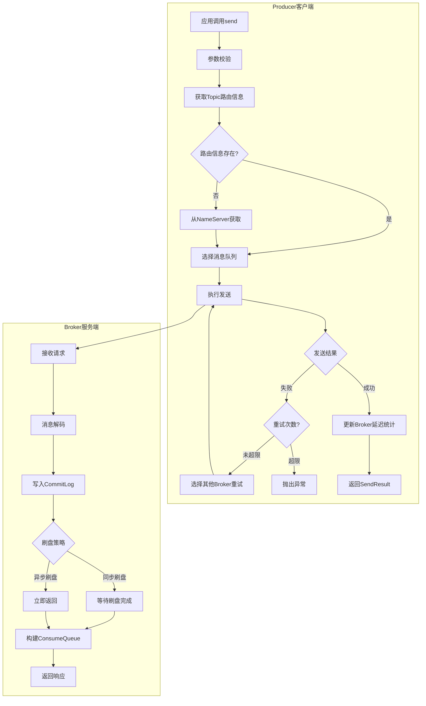
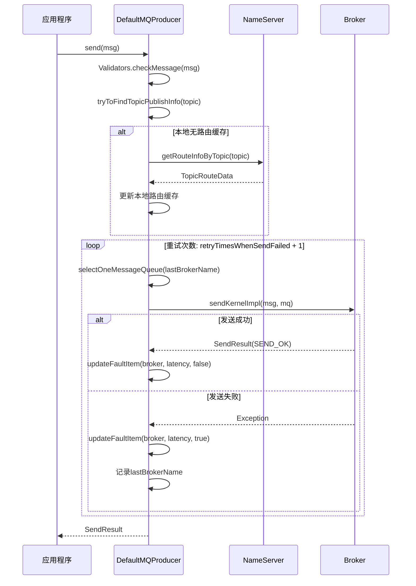
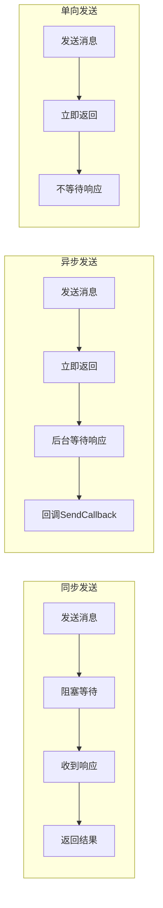
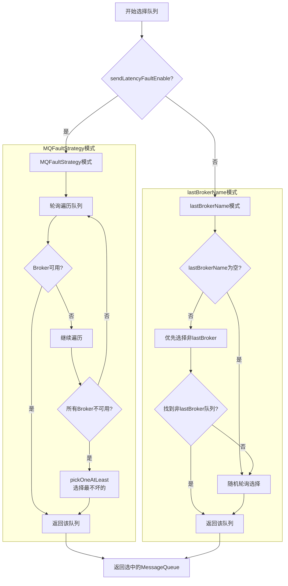
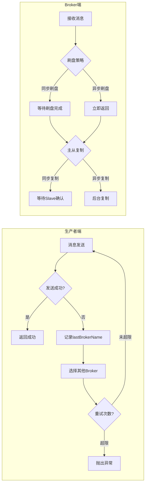
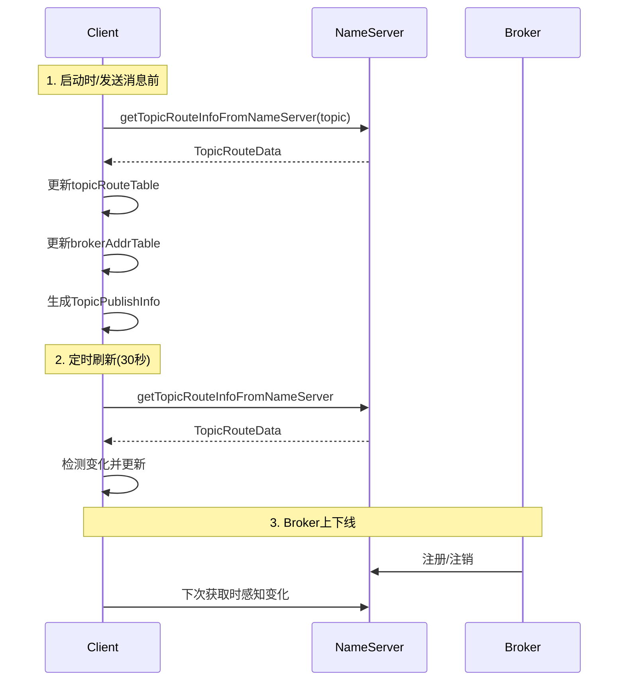
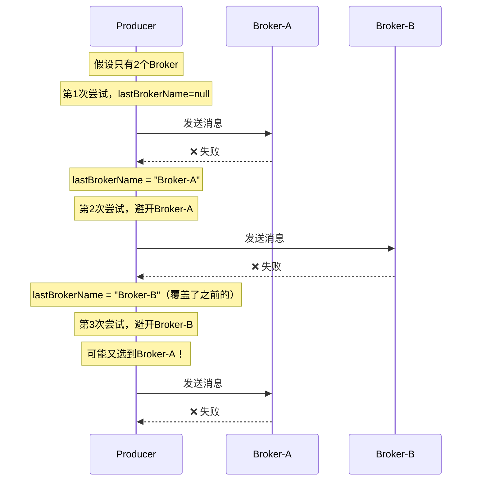

# RocketMQ 技术架构分析 - 消息发送篇

> 本篇深入分析 RocketMQ 消息发送的完整流程，包括发送方式、队列选择策略、高可用机制和批量发送。

---

## 一、发送流程总览

### 1.1 发送流程图



### 1.2 同步发送详细时序



---

## 二、三种发送方式

### 2.1 发送方式对比



| 发送方式 | 可靠性 | 性能 | 返回结果 | 适用场景 |
| --- | --- | --- | --- | --- |
| **同步发送** | 最高 | 较低 | SendResult | 重要消息，需要确认发送结果 |
| **异步发送** | 高 | 较高 | 回调通知 | 对响应时间敏感的场景 |
| **单向发送** | 低 | 最高 | 无返回 | 日志收集、非关键消息 |

### 2.2 同步发送

```java
DefaultMQProducer producer = new DefaultMQProducer("ProducerGroup");
producer.start();

Message msg = new Message("TopicTest", "TagA", "Hello".getBytes());
SendResult result = producer.send(msg);  // 阻塞等待响应

System.out.println("发送结果: " + result.getSendStatus());
System.out.println("消息ID: " + result.getMsgId());
System.out.println("队列: " + result.getMessageQueue());
```

### 2.3 异步发送

```java
producer.send(msg, new SendCallback() {
    @Override
    public void onSuccess(SendResult sendResult) {
        System.out.println("发送成功: " + sendResult.getMsgId());
    }
    
    @Override
    public void onException(Throwable e) {
        System.err.println("发送失败: " + e.getMessage());
    }
});
// 立即返回，不阻塞
```

### 2.4 单向发送

```java
producer.sendOneway(msg);  // 不等待响应，不保证送达
```

---

## 三、队列选择策略

### 3.1 选择策略总览



### 3.2 lastBrokerName 机制

`lastBrokerName` 是 Producer 在消息发送失败重试时用于**故障隔离**的关键参数：

| 属性 | 说明 |
| --- | --- |
| **定义** | 上一次消息发送失败的 Broker 名称 |
| **初始值** | `null`（首次发送时） |
| **更新时机** | 每次发送失败后更新为当前 Broker 名称 |
| **作用** | 重试时优先选择其他 Broker，实现故障隔离 |

**核心代码** ([TopicPublishInfo.java](file:///d:/work/github/rocketmq/client/src/main/java/org/apache/rocketmq/client/impl/producer/TopicPublishInfo.java)):

```java
public MessageQueue selectOneMessageQueue(final String lastBrokerName) {
    if (lastBrokerName == null) {
        return selectOneMessageQueue();  // 简单轮询
    } else {
        // 优先选择非上次失败Broker的队列
        for (int i = 0; i < this.messageQueueList.size(); i++) {
            int index = this.sendWhichQueue.incrementAndGet();
            int pos = Math.abs(index) % this.messageQueueList.size();
            MessageQueue mq = this.messageQueueList.get(pos);
            if (!mq.getBrokerName().equals(lastBrokerName)) {
                return mq;
            }
        }
        return selectOneMessageQueue();  // 找不到则降级
    }
}
```

### 3.3 MQFaultStrategy 故障规避机制

**核心原理**：根据 Broker 的响应延迟动态调整隔离时间。

```java
private long[] latencyMax = {50L, 100L, 550L, 1000L, 2000L, 3000L, 15000L};
private long[] notAvailableDuration = {0L, 0L, 30000L, 60000L, 120000L, 180000L, 600000L};
```

| 延迟范围 | 隔离时长 | 说明 |
| --- | --- | --- |
| >= 15s | 10 分钟 | 极严重延迟 |
| >= 3s | 3 分钟 | 严重延迟 |
| >= 2s | 2 分钟 | 高延迟 |
| >= 1s | 1 分钟 | 较高延迟 |
| >= 550ms | 30 秒 | 中等延迟 |
| < 550ms | 不隔离 | 正常 |

**启用方式**：

```java
producer.setSendLatencyFaultEnable(true);  // 默认 false
```

**两种机制对比**：

| 特性 | lastBrokerName | MQFaultStrategy |
| --- | --- | --- |
| 记录范围 | 仅最后一次失败的 Broker | 所有 Broker 的故障状态 |
| 隔离策略 | 简单避开 | 根据延迟动态隔离 |
| 默认状态 | ✅ 始终生效 | ❌ 默认关闭 |
| 适用场景 | 简单故障隔离 | 高可用生产环境 |

### 3.4 MessageQueueSelector 接口

```java
public interface MessageQueueSelector {
    MessageQueue select(final List<MessageQueue> mqs, final Message msg, final Object arg);
}
```

**内置选择器实现**：

| 选择器 | 策略 | 使用场景 |
| --- | --- | --- |
| `SelectMessageQueueByHash` | `arg.hashCode() % mqs.size()` | 顺序消息 |
| `SelectMessageQueueByRandom` | `random.nextInt(mqs.size())` | 随机负载均衡 |
| `SelectMessageQueueByMachineRoom` | 按机房选择 | 同机房优先 |

**使用示例**：

```java
// 订单消息按订单ID发送到同一队列，保证顺序
producer.send(msg, new SelectMessageQueueByHash(), orderId);
```

---

## 四、发送重试机制

### 4.1 重试核心逻辑

```java
// DefaultMQProducerImpl.sendDefaultImpl()
int timesTotal = communicationMode == CommunicationMode.SYNC 
    ? 1 + this.defaultMQProducer.getRetryTimesWhenSendFailed()  // 同步: 默认3次
    : 1;                                                         // 异步/单向: 不重试

for (int times = 0; times < timesTotal; times++) {
    String lastBrokerName = null == mq ? null : mq.getBrokerName();
    MessageQueue mqSelected = this.selectOneMessageQueue(topicPublishInfo, lastBrokerName);
    
    try {
        SendResult sendResult = this.sendKernelImpl(msg, mq, communicationMode, ...);
        this.updateFaultItem(mq.getBrokerName(), latency, false);
        return sendResult;
    } catch (RemotingException | MQClientException e) {
        this.updateFaultItem(mq.getBrokerName(), latency, true);
        continue;  // 重试
    }
}
```

### 4.2 重试触发条件

| 异常类型 | 是否重试 | 说明 |
| --- | --- | --- |
| `RemotingException` | ✅ 重试 | 网络异常 |
| `MQClientException` | ✅ 重试 | 客户端异常 |
| `MQBrokerException` | ⚠️ 视情况 | Broker 返回错误码 |
| `InterruptedException` | ❌ 不重试 | 线程中断 |

### 4.3 重试配置

```java
producer.setRetryTimesWhenSendFailed(3);       // 同步发送重试次数，默认2
producer.setRetryTimesWhenSendAsyncFailed(3);  // 异步发送重试次数，默认2
producer.setSendLatencyFaultEnable(true);      // 启用延迟容错
```

---

## 五、消息压缩机制

### 5.1 压缩触发条件

消息体超过阈值（默认 4KB）时自动压缩：

```java
// DefaultMQProducer 配置
private int compressMsgBodyOverHowmuch = 1024 * 4;  // 压缩阈值: 4KB

// 消息发送时的压缩逻辑
if (msgBody.length > compressMsgBodyOverHowmuch) {
    byte[] compressed = UtilAll.compress(msgBody, 5);  // 压缩级别5
    msg.setBody(compressed);
    msg.setProperty(MessageConst.PROPERTY_COMPRESSED, "true");
}
```

### 5.2 压缩配置

| 参数 | 默认值 | 说明 |
| --- | --- | --- |
| `compressMsgBodyOverHowmuch` | 4096 (4KB) | 触发压缩的消息体大小阈值 |
| 压缩级别 | 5 | ZIP 压缩级别 (1-9) |

### 5.3 压缩性能对比

| 消息大小 | 压缩前 | 压缩后 | 压缩比 | 压缩耗时 |
| --- | --- | --- | --- | --- |
| 1KB | 1024B | ~800B | ~22% | <1ms |
| 10KB | 10240B | ~4000B | ~60% | ~2ms |
| 100KB | 102400B | ~20000B | ~80% | ~10ms |
| 1MB | 1048576B | ~150000B | ~85% | ~50ms |

**建议**：消息体大于 4KB 时开启压缩，权衡压缩比和 CPU 开销。

---

## 六、批量发送机制

### 6.1 批量发送使用

多条消息合并发送，减少网络开销：

```java
List<Message> messages = new ArrayList<>();
messages.add(new Message("TopicTest", "TagA", "OrderID001", "Body1".getBytes()));
messages.add(new Message("TopicTest", "TagA", "OrderID002", "Body2".getBytes()));
messages.add(new Message("TopicTest", "TagA", "OrderID003", "Body3".getBytes()));

SendResult sendResult = producer.send(messages);
```

### 6.2 批量发送限制

| 限制项 | 默认值 | 说明 |
| --- | --- | --- |
| 批量消息大小 | 4MB | 所有消息体总大小不超过 4MB |
| 批量消息条数 | 无限制 | 受总大小限制 |
| 延迟消息 | 不支持 | 批量消息不支持延迟 |
| 事务消息 | 不支持 | 批量消息不支持事务 |

### 6.3 批量消息编码格式

```plain
┌─────────────────────────────────────────────────────────────────┐
│                    批量消息编码结构                              │
├─────────────────────────────────────────────────────────────────┤
│  MessageBatch编码:                                              │
│  ┌─────────────┬─────────────┬─────────────┬─────────────┐     │
│  │ msg1 length │   msg1 body │ msg2 length │   msg2 body │ ... │
│  │   4 bytes   │   n bytes   │   4 bytes   │   n bytes   │     │
│  └─────────────┴─────────────┴─────────────┴─────────────┘     │
└─────────────────────────────────────────────────────────────────┘
```

### 6.4 批量发送最佳实践

```java
List<Message> batch = new ArrayList<>();
int batchSize = 0;

for (Message msg : messages) {
    // 控制批量大小（建议单批次不超过1MB）
    if (batchSize + msg.getBody().length > 1024 * 1024) {
        producer.send(batch);  // 发送当前批次
        batch.clear();
        batchSize = 0;
    }
    batch.add(msg);
    batchSize += msg.getBody().length;
}

// 发送剩余消息
if (!batch.isEmpty()) {
    producer.send(batch);
}
```

---

## 七、消息发送高可用

### 7.1 高可用机制总览



### 7.2 客户端高可用

| 机制 | 说明 |
| --- | --- |
| **路由缓存** | 本地缓存 Topic 路由信息，减少 NameServer 访问 |
| **故障隔离** | lastBrokerName 机制避开失败的 Broker |
| **延迟容错** | MQFaultStrategy 根据延迟动态隔离 |
| **发送重试** | 同步发送默认重试 2 次 |

### 7.3 服务端高可用

| 机制 | 说明 |
| --- | --- |
| **同步刷盘** | 确保消息持久化到磁盘 |
| **同步复制** | 确保消息复制到 Slave |
| **主从切换** | Master 故障时 Slave 接管 |

---

## 八、发送结果状态

### 8.1 SendStatus 枚举

| 状态 | 说明 | 后续处理 |
| --- | --- | --- |
| `SEND_OK` | 发送成功 | 无需处理 |
| `FLUSH_DISK_TIMEOUT` | 刷盘超时 | 消息可能丢失，需重发 |
| `FLUSH_SLAVE_TIMEOUT` | 主从同步超时 | Slave 未同步，可能丢失 |
| `SLAVE_NOT_AVAILABLE` | Slave 不可用 | 无 Slave，可能丢失 |

### 8.2 处理建议

```java
SendResult result = producer.send(msg);
switch (result.getSendStatus()) {
    case SEND_OK:
        log.info("发送成功: {}", result.getMsgId());
        break;
    case FLUSH_DISK_TIMEOUT:
    case FLUSH_SLAVE_TIMEOUT:
    case SLAVE_NOT_AVAILABLE:
        log.warn("发送异常: {}, msgId={}", result.getSendStatus(), result.getMsgId());
        // 根据业务需求决定是否重发
        break;
}
```

---

## 九、生产者核心配置

### 9.1 必要配置

```java
DefaultMQProducer producer = new DefaultMQProducer("ProducerGroup");
producer.setNamesrvAddr("localhost:9876");
producer.start();
```

### 9.2 性能配置

| 配置项 | 默认值 | 说明 |
| --- | --- | --- |
| `defaultTopicQueueNums` | 4 | 自动创建 Topic 时的队列数 |
| `compressMsgBodyOverHowmuch` | 4096 | 压缩阈值 |
| `maxMessageSize` | 4MB | 消息最大大小 |
| `retryTimesWhenSendFailed` | 2 | 同步发送重试次数 |
| `sendMsgTimeout` | 3000ms | 发送超时时间 |
| `sendLatencyFaultEnable` | false | 是否启用延迟容错 |

### 9.3 完整配置示例

```java
DefaultMQProducer producer = new DefaultMQProducer("ProducerGroup");
producer.setNamesrvAddr("localhost:9876");
producer.setRetryTimesWhenSendFailed(3);
producer.setSendMsgTimeout(5000);
producer.setCompressMsgBodyOverHowmuch(1024 * 4);
producer.setSendLatencyFaultEnable(true);
producer.setMaxMessageSize(4 * 1024 * 1024);
producer.start();
```

---

## 十、TopicPublishInfo 详解

### 11.1 核心属性

| 属性 | 类型 | 说明 |
| --- | --- | --- |
| `messageQueueList` | List | Topic 下所有可写队列 |
| `sendWhichQueue` | ThreadLocalIndex | 线程本地队列选择器 |
| `topicRouteData` | TopicRouteData | 原始路由数据 |
| `orderTopic` | boolean | 是否顺序消息 |

### 11.2 messageQueueList 初始化逻辑

```java
// MQClientInstance.topicRouteData2TopicPublishInfo()
public static TopicPublishInfo topicRouteData2TopicPublishInfo(String topic, TopicRouteData route) {
    TopicPublishInfo info = new TopicPublishInfo();
    
    // 遍历所有QueueData，筛选可写的队列
    for (QueueData qd : route.getQueueDatas()) {
        if (PermName.isWriteable(qd.getPerm())) {  // 检查写权限
            // 找到对应的BrokerData
            BrokerData brokerData = findBrokerData(route, qd.getBrokerName());
            
            // 确保Master存在
            if (brokerData.getBrokerAddrs().containsKey(MASTER_ID)) {
                // 根据writeQueueNums创建MessageQueue
                for (int i = 0; i < qd.getWriteQueueNums(); i++) {
                    MessageQueue mq = new MessageQueue(topic, qd.getBrokerName(), i);
                    info.getMessageQueueList().add(mq);
                }
            }
        }
    }
    return info;
}
```

### 11.3 初始化流程

```plain
TopicRouteData (从NameServer获取)
├── QueueData列表
│   ├── brokerName: "Broker-A"
│   ├── readQueueNums: 4
│   ├── writeQueueNums: 4
│   └── perm: 6 (可读可写)
├── QueueData列表
│   ├── brokerName: "Broker-B"
│   └── ...
└── BrokerData列表
    ├── brokerName: "Broker-A"
    └── brokerAddrs: {0=ip1:10911, 1=ip1:10912}
    
           ↓ 转换

TopicPublishInfo
└── messageQueueList:
    ├── MessageQueue{topic="Order", brokerName="Broker-A", queueId=0}
    ├── MessageQueue{topic="Order", brokerName="Broker-A", queueId=1}
    ├── MessageQueue{topic="Order", brokerName="Broker-B", queueId=0}
    └── MessageQueue{topic="Order", brokerName="Broker-B", queueId=1}
```

### 11.4 队列列表示例

```plain
Topic: OrderTopic
messageQueueList:
┌────────────────────────────────────────┐
│ [0] MessageQueue{brokerName=Broker-A, queueId=0} │
│ [1] MessageQueue{brokerName=Broker-A, queueId=1} │
│ [2] MessageQueue{brokerName=Broker-B, queueId=0} │
│ [3] MessageQueue{brokerName=Broker-B, queueId=1} │
└────────────────────────────────────────┘

轮询选择过程:
- 第1次: index=1, pos=1 → Queue1(Broker-A)
- 第2次: index=2, pos=2 → Queue0(Broker-B)
- 第3次: index=3, pos=3 → Queue1(Broker-B)
- 第4次: index=4, pos=0 → Queue0(Broker-A)
```

---

## 十一、ThreadLocalIndex 线程安全

### 12.1 核心实现

每个线程独立的计数器，避免多线程竞争：

```java
public class ThreadLocalIndex {
    private final ThreadLocal<Integer> threadLocalIndex = new ThreadLocal<Integer>();
    
    public int incrementAndGet() {
        Integer index = threadLocalIndex.get();
        if (null == index) {
            index = 0;
        }
        index = Math.abs(index + 1);
        threadLocalIndex.set(index);
        return index;
    }
}
```

### 12.2 为什么使用 ThreadLocal

| 方案 | 优点 | 缺点 |
| --- | --- | --- |
| AtomicInteger | 简单 | 多线程竞争，性能下降 |
| synchronized | 线程安全 | 锁开销大 |
| **ThreadLocal** | 无锁，高性能 | 内存占用略高 |

---

## 十二、LatencyFaultTolerance 延迟容错

### 13.1 核心数据结构

```plain
ConcurrentHashMap<String, FaultItem> faultItemTable
┌─────────────────────────────────────────────────────────┐
│  Key: BrokerName                                        │
│  Value: FaultItem                                       │
│    ├── name: Broker名称                                  │
│    ├── currentLatency: 当前延迟                          │
│    └── startTimestamp: 可用开始时间 (= 当前时间 + 隔离时长) │
└─────────────────────────────────────────────────────────┘
```

### 13.2 核心方法

| 方法 | 功能 | 说明 |
| --- | --- | --- |
| `updateFaultItem` | 更新故障项 | 记录延迟，设置隔离结束时间 |
| `isAvailable` | 判断是否可用 | 当前时间 >= startTimestamp |
| `pickOneAtLeast` | 选择最不坏的 Broker | 所有 Broker 都不可用时使用 |

### 13.3 可用性判断

```java
// FaultItem.isAvailable()
public boolean isAvailable() {
    // startTimestamp = 当前时间 + 隔离时长
    // 当 当前时间 >= startTimestamp 时，表示隔离期已过，可用
    return (System.currentTimeMillis() - startTimestamp) >= 0;
}
```

### 13.4 pickOneAtLeast 选择策略

当所有 Broker 都不可用时，从故障列表中选择"最不坏"的：

```java
public String pickOneAtLeast() {
    List<FaultItem> tmpList = new LinkedList<>(faultItemTable.values());
    Collections.sort(tmpList);  // 排序：可用优先 > 延迟低优先 > 恢复早优先
    
    final int half = tmpList.size() / 2;
    if (half <= 0) {
        return tmpList.get(0).getName();
    } else {
        // 从前半部分（较好的）中轮询选择
        return tmpList.get(whichItemWorst.incrementAndGet() % half).getName();
    }
}
```

### 13.5 FaultItem 排序规则

```java
public int compareTo(FaultItem other) {
    // 1. 可用优先
    if (this.isAvailable() != other.isAvailable())
        return this.isAvailable() ? -1 : 1;
    
    // 2. 延迟低优先
    if (this.currentLatency != other.currentLatency)
        return this.currentLatency < other.currentLatency ? -1 : 1;
    
    // 3. 恢复时间早优先
    return this.startTimestamp < other.startTimestamp ? -1 : 1;
}
```

### 13.6 示例场景

```plain
假设3个Broker状态：
- Broker-A: 延迟200ms, 隔离30秒 (startTimestamp = 12:00:30)
- Broker-B: 延迟500ms, 隔离30秒 (startTimestamp = 12:00:30)  
- Broker-C: 延迟2s, 隔离120秒 (startTimestamp = 12:02:00)

当前时间 12:00:10，排序结果：
1. Broker-A (延迟最低)
2. Broker-B (延迟次低)
3. Broker-C (延迟最高)

pickOneAtLeast返回: Broker-A 或 Broker-B (轮询选择)
```

---

## 十三、Client 元数据管理

### 14.1 核心元数据表

```java
// MQClientInstance.java
public class MQClientInstance {
    // Topic路由信息表
    ConcurrentMap<String/*Topic*/, TopicRouteData> topicRouteTable;
    
    // Broker地址表
    ConcurrentMap<String/*BrokerName*/, HashMap<Long/*brokerId*/, String/*address*/>> brokerAddrTable;
    
    // Topic端点表（静态Topic）
    ConcurrentMap<String, ConcurrentMap<MessageQueue, String>> topicEndPointsTable;
    
    // Broker版本表
    ConcurrentMap<String/*BrokerName*/, HashMap<String/*address*/, Integer/*version*/>> brokerVersionTable;
}
```

### 14.2 TopicRouteData 结构

```plain
TopicRouteData (从NameServer获取)
├── orderTopicConf: 顺序Topic配置
├── queueDatas: List<QueueData>
│   ├── brokerName: "Broker-A"
│   ├── readQueueNums: 4
│   ├── writeQueueNums: 4
│   └── perm: 6 (权限)
├── brokerDatas: List<BrokerData>
│   ├── brokerName: "Broker-A"
│   └── brokerAddrs: {0=ip:10911, 1=ip:10912}
└── filterServerTable: 过滤服务器地址
```

### 14.3 元数据更新流程



### 14.4 更新触发时机

| 时机 | 说明 |
| --- | --- |
| 启动时 | 初始化时从 NameServer 拉取 |
| 发送消息前 | 发现本地无路由信息时拉取 |
| 定时任务 | 每 30 秒刷新一次 |
| 路由变化 | NameServer 检测到 Broker 变化 |

---

## 十四、两种故障规避机制对比

### 15.1 互斥关系

| sendLatencyFaultEnable | 使用的机制 | 说明 |
| --- | --- | --- |
| `false`（默认） | lastBrokerName | 简单避开上次失败的 Broker |
| `true` | MQFaultStrategy | 基于延迟动态隔离，不使用 lastBrokerName |

### 15.2 核心代码逻辑

```java
// MQFaultStrategy.selectOneMessageQueue()
public MessageQueue selectOneMessageQueue(TopicPublishInfo tpInfo, String lastBrokerName) {
    if (this.sendLatencyFaultEnable) {
        // 启用时：使用MQFaultStrategy机制，忽略lastBrokerName参数
        // ... 基于延迟容错选择队列
    }
    // 关闭时：使用lastBrokerName机制
    return tpInfo.selectOneMessageQueue(lastBrokerName);
}
```

### 15.3 连续失败场景分析

`lastBrokerName` 只会保留**最后一次**失败的 Broker 名称：



**潜在问题**：如果只有 2 个 Broker，连续失败时会出现"来回切换"。

### 15.4 建议配置

```java
// 生产环境建议开启延迟容错
producer.setSendLatencyFaultEnable(true);
producer.setRetryTimesWhenSendFailed(3);
```

---

## 十五、总结

本篇介绍了 RocketMQ 消息发送的核心机制：

1. **发送方式**：同步、异步、单向三种方式，适用不同场景
2. **队列选择**：lastBrokerName 简单隔离 + MQFaultStrategy 延迟容错
3. **发送重试**：同步发送默认重试 2 次，可配置
4. **消息压缩**：超过 4KB 自动压缩，减少网络传输
5. **批量发送**：合并多条消息，减少网络开销
6. **高可用**：客户端故障隔离 + 服务端刷盘/复制

理解这些机制，有助于在生产环境中正确配置和使用 RocketMQ 生产者。
