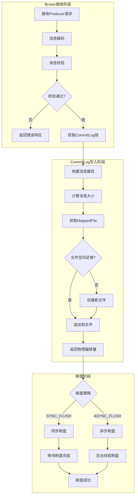
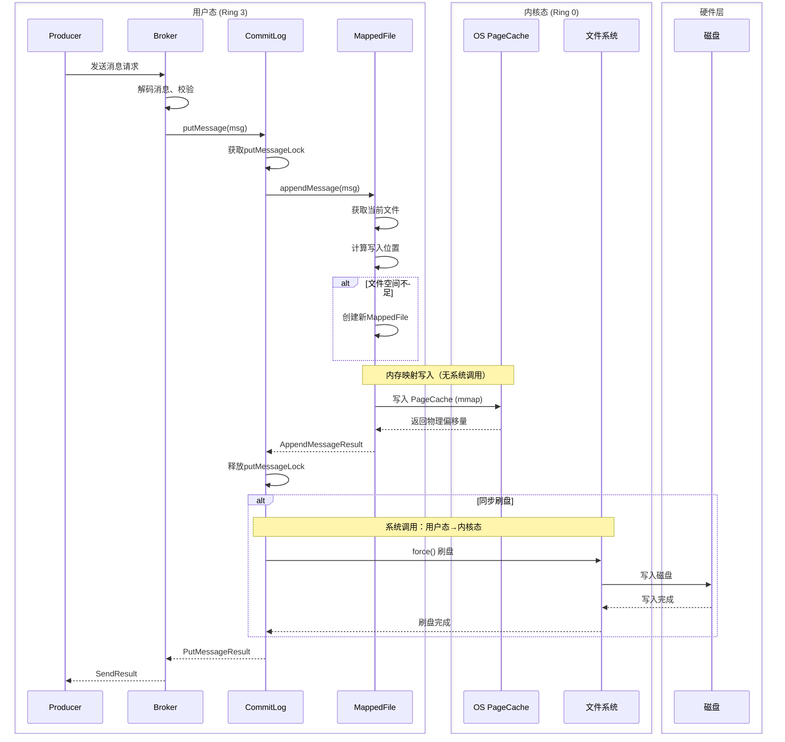
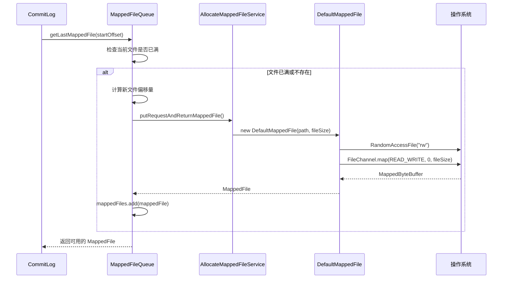
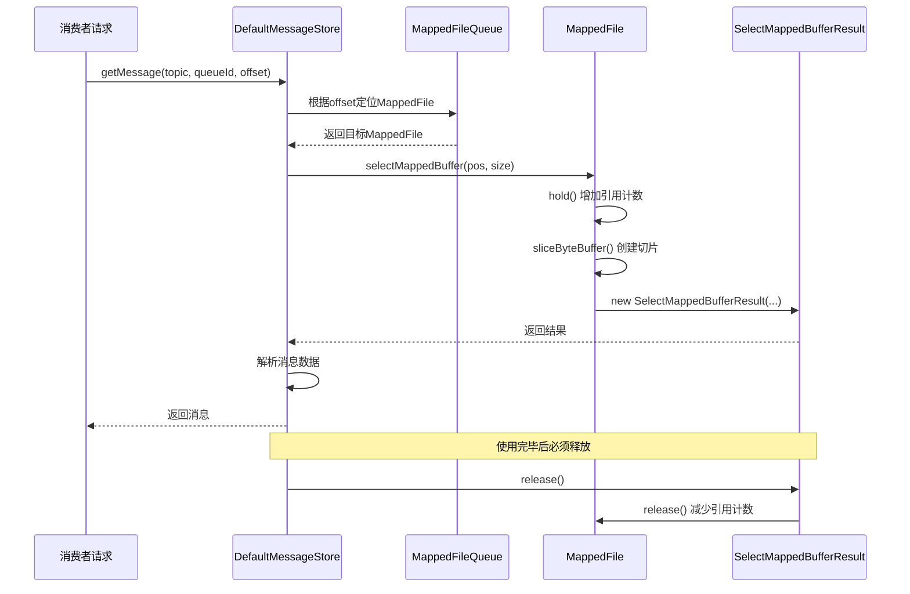
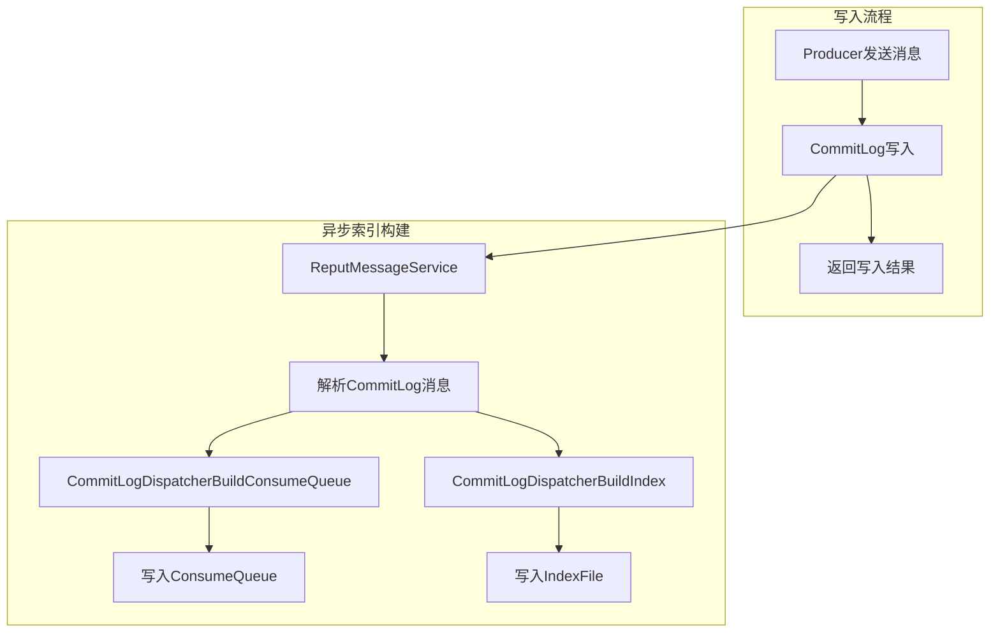
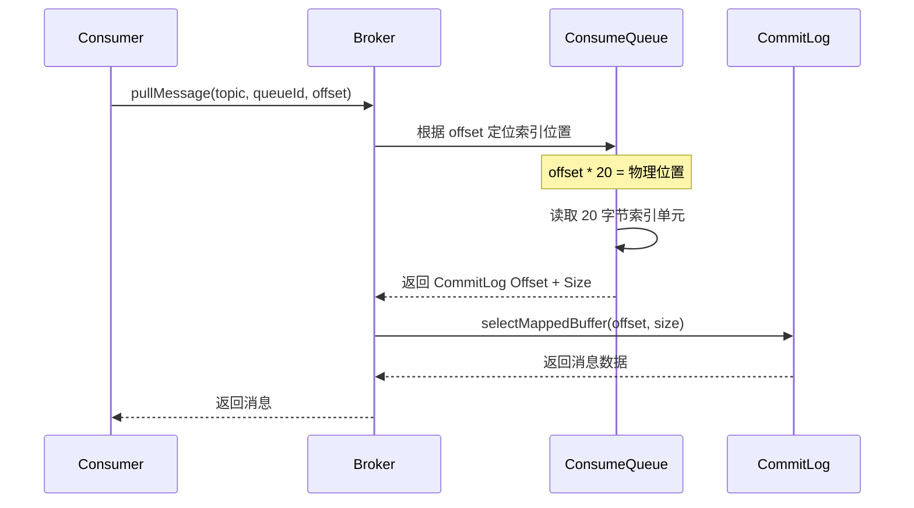
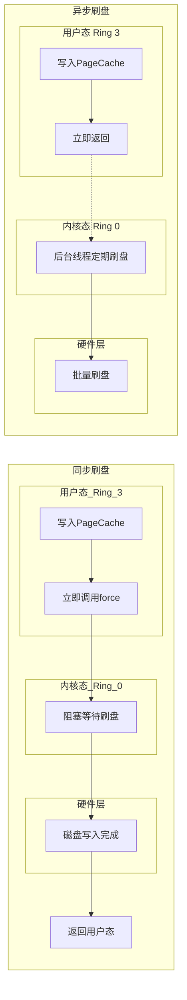
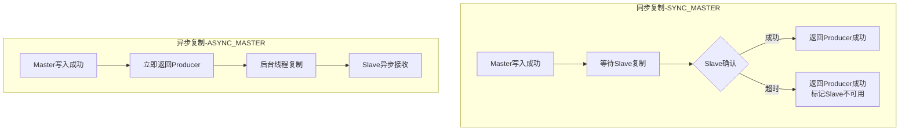
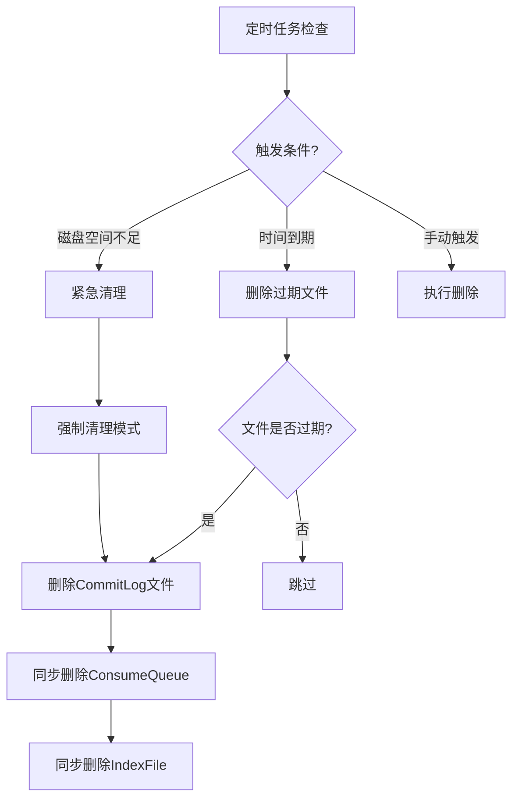
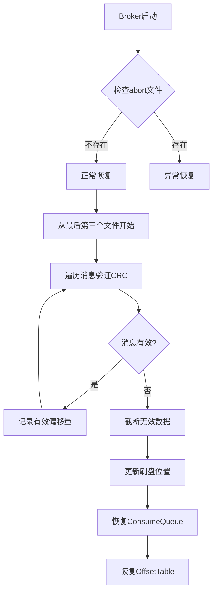

# RocketMQ 技术架构分析 - 消息存储篇

> 本篇深入分析 RocketMQ 的消息存储架构，包括 CommitLog、ConsumeQueue、刷盘机制、主从复制和文件体系。

---

## 一、存储架构总览

### 1.1 三层存储架构

RocketMQ 采用 "CommitLog + ConsumeQueue + IndexFile" 三层存储架构：

```plain
┌─────────────────────────────────────────────────────────────────────────────┐
│                           RocketMQ 存储架构                                  │
├─────────────────────────────────────────────────────────────────────────────┤
│                                                                             │
│  ┌─────────────────────────────────────────────────────────────────────┐   │
│  │                         CommitLog                                    │   │
│  │                    (消息主体存储，顺序写入)                             │   │
│  │  ┌─────────┬─────────┬─────────┬─────────┬─────────┐               │   │
│  │  │  Msg1   │  Msg2   │  Msg3   │  Msg4   │  Msg5   │  ...          │   │
│  │  │TopicA   │TopicB   │TopicA   │TopicC   │TopicA   │               │   │
│  │  └─────────┴─────────┴─────────┴─────────┴─────────┘               │   │
│  └─────────────────────────────────────────────────────────────────────┘   │
│                                    │                                        │
│                    异步构建索引 (DispatchService)                            │
│                                    ▼                                        │
│  ┌─────────────────────────────────────────────────────────────────────┐   │
│  │                       ConsumeQueue                                   │   │
│  │                   (按 Topic-QueueId 组织的索引)                        │   │
│  │  ┌───────────────────┐  ┌───────────────────┐                       │   │
│  │  │ TopicA/Queue0     │  │ TopicB/Queue0     │  ...                  │   │
│  │  │ ┌───┬───┬───┐    │  │ ┌───┬───┐         │                       │   │
│  │  │ │ 1 │ 3 │ 5 │    │  │ │ 2 │...│         │                       │   │
│  │  │ └───┴───┴───┘    │  │ └───┴───┘         │                       │   │
│  │  └───────────────────┘  └───────────────────┘                       │   │
│  └─────────────────────────────────────────────────────────────────────┘   │
│                                    │                                        │
│                                    ▼                                        │
│  ┌─────────────────────────────────────────────────────────────────────┐   │
│  │                        IndexFile                                     │   │
│  │                    (按 Key 查询的哈希索引)                              │   │
│  │  ┌─────────────────────────────────────────────────────────────┐   │   │
│  │  │ Key Hash → CommitLog Offset                                  │   │   │
│  │  └─────────────────────────────────────────────────────────────┘   │   │
│  └─────────────────────────────────────────────────────────────────────┘   │
│                                                                             │
└─────────────────────────────────────────────────────────────────────────────┘
```

### 1.2 三种核心文件对比

| 对比项 | CommitLog | ConsumeQueue | IndexFile |
| --- | --- | --- | --- |
| **存储内容** | 完整消息体 | 20 字节索引单元 | 20 字节索引条目 |
| **组织方式** | 全局顺序写入 | 按 Topic-QueueId 组织 | 按时间戳命名 |
| **写入方式** | 顺序写入 | 异步构建 | 异步构建 |
| **主要用途** | 消息存储、恢复、同步 | 消费定位、过滤 | 按 Key 查询 |
| **查询复杂度** | O(1) 按偏移量 | O(1) 按队列偏移量 | O(1)~O(n) 按 Key Hash |

### 1.3 为什么这样设计？

#### 1.3.1 三种存储方案对比

| 存储方案 | 优点 | 缺点 |
| --- | --- | --- |
| 按 Topic 分文件 | 消费高效 | 写入随机 IO，性能差 |
| 单一 CommitLog | 写入顺序 IO，性能高 | 消费需要索引 |
| **CommitLog + ConsumeQueue** | **写入顺序 IO + 消费高效** | 需要维护索引 |

#### 1.3.2 方案详细分析

**方案一：按 Topic 分文件存储**

```plain
┌─────────────────────────────────────────────────────────────────┐
│  TopicA.mappedfile     TopicB.mappedfile     TopicC.mappedfile  │
│  ┌─────────────────┐   ┌─────────────────┐   ┌─────────────────┐│
│  │ Msg1 Msg3 Msg5  │   │ Msg2 Msg4       │   │ Msg6 Msg7 Msg8  ││
│  │ TopicA 消息      │   │ TopicB 消息      │   │ TopicC 消息      ││
│  └─────────────────┘   └─────────────────┘   └─────────────────┘│
│                                                                 │
│  写入流程: Producer 发送 Msg1(TopicA) → 定位 TopicA 文件 → 写入  │
│           Producer 发送 Msg2(TopicB) → 定位 TopicB 文件 → 写入  │
│           Producer 发送 Msg3(TopicA) → 定位 TopicA 文件 → 写入  │
│                                                                 │
│  问题: 多 Topic 并发写入时，磁盘磁头在不同文件间频繁跳转          │
│        → 随机 IO → 写入性能急剧下降                              │
└─────────────────────────────────────────────────────────────────┘
```

**方案二：单一 CommitLog 存储**

```plain
┌─────────────────────────────────────────────────────────────────┐
│                    CommitLog (全局顺序写入)                      │
│  ┌─────────────────────────────────────────────────────────────┐│
│  │ Msg1 │ Msg2 │ Msg3 │ Msg4 │ Msg5 │ Msg6 │ Msg7 │ Msg8 │... ││
│  │TopicA│TopicB│TopicA│TopicB│TopicA│TopicC│TopicC│TopicC│    ││
│  └─────────────────────────────────────────────────────────────┘│
│                                                                 │
│  写入流程: 所有消息按到达顺序追加写入 → 顺序 IO → 写入性能极高    │
│                                                                 │
│  问题: 消费者订阅 TopicA 时，需要遍历整个 CommitLog 过滤消息     │
│        → 消费效率低，无法快速定位                                │
└─────────────────────────────────────────────────────────────────┘
```

**方案三：CommitLog + ConsumeQueue（RocketMQ 选择）**

```plain
┌─────────────────────────────────────────────────────────────────┐
│  写入路径                          消费路径                      │
│                                                                 │
│  Producer                                                          │
│     │                                                              │
│     ▼ 顺序写入 (高性能)                                            │
│  ┌─────────────────────────────────────────────────────────────┐ │
│  │                    CommitLog                                 │ │
│  │  Msg1 │ Msg2 │ Msg3 │ Msg4 │ Msg5 │ Msg6 │ ...              │ │
│  └─────────────────────────────────────────────────────────────┘ │
│     │                                                              │
│     │ 异步构建索引 (不阻塞写入)                                     │
│     ▼                                                              │
│  ┌──────────────────────┐   ┌──────────────────────┐            │
│  │ ConsumeQueue:TopicA  │   │ ConsumeQueue:TopicB  │            │
│  │ ┌────┬────┬────┐    │   │ ┌────┬────┐          │            │
│  │ │ 1  │ 3  │ 5  │    │   │ │ 2  │ 4  │          │            │
│  │ │偏移│偏移│偏移│    │   │ │偏移│偏移│          │            │
│  │ └────┴────┴────┘    │   │ └────┴────┘          │            │
│  └──────────────────────┘   └──────────────────────┘            │
│     │                                                              │
│     ▼ 顺序读取 (高效)                                              │
│  Consumer (订阅 TopicA)                                           │
└─────────────────────────────────────────────────────────────────┘
```

#### 1.3.3 设计核心思想

| 场景 | 需求 | 解决方案 |
|------|------|----------|
| **消息写入** | 高吞吐量、低延迟 | CommitLog 顺序追加写入，充分利用磁盘顺序 IO 性能 |
| **消息消费** | 快速定位、顺序读取 | ConsumeQueue 按 Topic-QueueId 组织，消费者顺序读取索引 |
| **索引构建** | 不阻塞主流程 | 异步 Dispatch 线程构建，写入成功即返回 |

**性能对比**：顺序 IO 比随机 IO 性能高出 1-2 个数量级，这是 RocketMQ 高吞吐的核心原因。

---

## 二、CommitLog

CommitLog 是消息存储的核心组件，负责消息的顺序写入和持久化存储，是 RocketMQ 高吞吐量的基础 ([CommitLog.java](file:///d:/work/github/rocketmq/store/src/main/java/org/apache/rocketmq/store/CommitLog.java))。

### 2.1 消息写入流程

消息写入流程分为 Broker 接收、CommitLog 写入、刷盘三个阶段，支持单条和批量两种写入方式。

#### 2.1.1 写入流程概览



#### 2.1.2 写入时序图



#### 2.1.3 批量消息写入

RocketMQ 支持批量消息写入，通过 `putMessages()` 方法将多条消息一次性写入 CommitLog ([CommitLog.java:935-1075](file:///d:/work/github/rocketmq/store/src/main/java/org/apache/rocketmq/store/CommitLog.java#L935-L1075))。

| 对比项 | 单条写入 `putMessage()` | 批量写入 `putMessages()` |
|--------|-------------------------|--------------------------|
| **消息数量** | 1 条 | N 条 |
| **编码方式** | 单独编码 | 批量编码，共享 Topic/Properties |
| **锁持有时间** | 短 | 较长（取决于批量大小） |
| **网络开销** | 每条消息一次请求 | 一次请求传输多条 |
| **性能** | 较低 | **更高**（减少锁竞争和系统调用） |

**批量写入限制**：

- 批量消息必须属于同一 Topic
- 批量消息不支持延迟发送（delayLevel > 0）
- 批量消息不支持事务消息

### 2.2 消息存储格式

每条消息在 CommitLog 中的存储格式固定，包含消息头、消息体和扩展属性三部分。

| 字段 | 长度 | 作用说明 |
|------|------|----------|
| **TOTALSIZE** | 4B | 消息总长度，读取消息时先读此字段确定消息边界，实现顺序读取下一条消息 |
| **MAGICCODE** | 4B | 魔数标识，`MESSAGE_MAGIC_CODE(-626843481)` 表示正常消息，`BLANK_MAGIC_CODE(-875286124)` 表示文件结束空白区域 |
| **BODYCRC** | 4B | 消息体 CRC32 校验码，Broker 恢复时用于校验消息完整性，防止数据损坏 |
| **QUEUEID** | 4B | 队列编号，同一 Topic 下不同队列实现并行消费，提高吞吐量 |
| **FLAG** | 4B | 用户自定义标志位，可用于消息过滤或业务标记 |
| **QUEUEOFFSET** | 8B | 消息在 ConsumeQueue 中的逻辑偏移量，用于构建消费索引 |
| **PHYSICALOFFSET** | 8B | 消息在 CommitLog 中的物理偏移量，全局唯一，用于定位消息 |
| **SYSFLAG** | 4B | 系统标志位，包含多种信息：是否压缩、是否事务消息、地址类型（IPv4/IPv6）等 |
| **BORNTIMESTAMP** | 8B | 消息创建时间，由 Producer 在发送时设置，用于消息轨迹追踪 |
| **BORNHOST** | 8B/20B | Producer 地址（IP+端口），用于问题排查和消息溯源；IPv4 占 8B，IPv6 占 20B |
| **STORETIMESTAMP** | 8B | Broker 存储时间，在写入 CommitLog 时设置，用于消息过期清理判断 |
| **STOREHOSTADDRESS** | 8B/20B | Broker 地址（IP+端口），用于主从切换后定位消息来源；IPv4 占 8B，IPv6 占 20B |
| **RECONSUMETIMES** | 4B | 重试消费次数，消费失败后重试时递增，超过最大重试次数进入死信队列 |
| **PREPAREDTXOFFSET** | 8B | 事务消息预处理偏移量，记录事务半消息的原始位置，用于事务提交/回滚 |
| **BODYLEN** | 4B | 消息体长度，标识 BODY 字段的字节数，读取时据此截取消息体内容 |
| **BODY** | N | 消息体，实际传输的业务数据，支持压缩存储（由 SYSFLAG 标识是否压缩） |
| **TOPICLEN** | 1B | Topic 长度，标识 TOPIC 字段的字节数，最大 255 字节（1B 存储） |
| **TOPIC** | N | 主题名称，消息的第一级分类，用于消息路由和队列分配 |
| **PROPERTIESLEN** | 2B | 属性长度，标识 PROPERTIES 字段的字节数，最大 32767 字节（2B 存储） |
| **PROPERTIES** | N | 扩展属性，存储 keys、tags、delayLevel 等自定义属性，以键值对字符串形式存储 |

### 2.3 文件存储架构

CommitLog 通过 MappedFile 和 MappedFileQueue 实现高效的文件管理，采用内存映射（mmap）技术实现零拷贝读写。

#### 2.3.1 文件组织架构

```plain
┌─────────────────────────────────────────────────────────────────────────────┐
│                              CommitLog 存储架构                              │
├─────────────────────────────────────────────────────────────────────────────┤
│                                                                             │
│   CommitLog (逻辑概念)                                                       │
│        │                                                                    │
│        ▼                                                                    │
│   MappedFileQueue (文件队列管理)                                              │
│        │                                                                    │
│        ▼                                                                    │
│   ┌─────────────────────────────────────────────────────────────────────┐   │
│   │  mappedFiles (CopyOnWriteArrayList<MappedFile>)                     │   │
│   │  ┌─────────────────┐ ┌─────────────────┐ ┌─────────────────┐       │   │
│   │  │ 000000000000... │ │ 1073741824...   │ │ 2147483648...   │       │   │
│   │  │ .mappedfile     │ │ .mappedfile     │ │ .mappedfile     │       │   │
│   │  │ (0 ~ 1GB)       │ │ (1GB ~ 2GB)     │ │ (2GB ~ 3GB)     │       │   │
│   │  └─────────────────┘ └─────────────────┘ └─────────────────┘       │   │
│   └─────────────────────────────────────────────────────────────────────┘   │
│                                                                             │
└─────────────────────────────────────────────────────────────────────────────┘
```

#### 2.3.2 核心类关系

| 类名 | 源码位置 | 职责 |
|------|----------|------|
| [CommitLog](file:///d:/work/github/rocketmq/store/src/main/java/org/apache/rocketmq/store/CommitLog.java) | CommitLog.java | 消息存储入口，管理消息写入和读取 |
| [MappedFileQueue](file:///d:/work/github/rocketmq/store/src/main/java/org/apache/rocketmq/store/MappedFileQueue.java) | MappedFileQueue.java | 管理多个 MappedFile 的队列 |
| [MappedFile](file:///d:/work/github/rocketmq/store/src/main/java/org/apache/rocketmq/store/logfile/MappedFile.java) | MappedFile.java | 单个物理文件的接口定义 |
| [DefaultMappedFile](file:///d:/work/github/rocketmq/store/src/main/java/org/apache/rocketmq/store/logfile/DefaultMappedFile.java) | DefaultMappedFile.java | MappedFile 的默认实现 |

#### 2.3.3 文件命名与大小

**文件名 = 起始物理偏移量（20位数字）**

```plain
文件名格式：00000000000000000000.mappedfile
           ↑
           文件起始偏移量

示例：
- 第1个文件：00000000000000000000.mappedfile  → 偏移量 0
- 第2个文件：00000000001073741824.mappedfile  → 偏移量 1073741824 (1GB)
- 第3个文件：00000000002147483648.mappedfile  → 偏移量 2147483648 (2GB)
```

**文件大小 = 1GB（默认）**

| 文件类型 | 默认大小 | 配置项 | 说明 |
|----------|----------|--------|------|
| CommitLog | 1GB (1073741824) | `mappedFileSizeCommitLog` | 单个消息存储文件大小 |
| ConsumeQueue | ~5.7MB (6000000) | `mappedFileSizeConsumeQueue` | 约 30 万条索引（每条 20 字节） |

**为什么 CommitLog 文件大小是 1GB？**

| 原因 | 说明 |
|------|------|
| **mmap 限制** | 单次映射最大 2GB（Integer.MAX_VALUE），1GB 留有余量 |
| **内存管理** | 1GB 文件映射后占用虚拟地址空间适中，便于管理 |
| **预热效率** | 文件预热时按 4KB 页加载，1GB 预热时间可接受 |
| **清理粒度** | 过期清理时以文件为单位，1GB 粒度适中 |

源码依据 - [MessageStoreConfig.java:48](file:///d:/work/github/rocketmq/store/src/main/java/org/apache/rocketmq/store/config/MessageStoreConfig.java#L48)：
```java
private int mappedFileSizeCommitLog = 1024 * 1024 * 1024;  // 1GB
```

源码依据 - [MappedFileQueue.java:207-211](file:///d:/work/github/rocketmq/store/src/main/java/org/apache/rocketmq/store/MappedFileQueue.java#L207-L211)：
```java
protected MappedFile tryCreateMappedFile(long createOffset) {
    String nextFilePath = this.storePath + File.separator + UtilAll.offset2FileName(createOffset);
    // ...
}
```

#### 2.3.4 内存映射机制

RocketMQ 使用内存映射（mmap）实现高性能文件读写，核心是让用户程序直接操作 PageCache，实现零拷贝。默认文件大小为 1GB。

> **mmap 原理、PageCache 机制、MappedByteBuffer 与其他 Buffer 对比** 详见 [05-操作系统级优化篇 - mmap 内存映射](./05-操作系统级优化篇.md#二mmap-内存映射)。

源码位置 - [DefaultMappedFile.java:87-88](file:///d:/work/github/rocketmq/store/src/main/java/org/apache/rocketmq/store/logfile/DefaultMappedFile.java#L87-L88)：

```java
this.fileChannel = new RandomAccessFile(this.file, "rw").getChannel();
this.mappedByteBuffer = this.fileChannel.map(FileChannel.MapMode.READ_WRITE, 0, fileSize);
```

**注意事项**：

| 问题 | 说明 | RocketMQ 解决方案 |
|------|------|-------------------|
| **内存泄漏** | MappedByteBuffer 无法被 GC 直接回收 | 使用 `Cleaner` 主动释放 |
| **数据安全** | 进程崩溃时 PageCache 数据可能丢失 | 提供同步/异步刷盘策略 |
| **文件大小限制** | 单次映射最大 2GB（Integer.MAX_VALUE） | CommitLog 文件固定 1GB |

#### 2.3.5 文件创建流程

当 CommitLog 文件空间不足时，需要创建新的 MappedFile 文件。

> **文件预分配机制（AllocateMappedFileService）** 详见 [05-操作系统级优化篇 - 文件预分配](./05-操作系统级优化篇.md#六文件预分配-allocatemappedfileservice)。



### 2.4 位置指针与写入优化

消息写入涉及多个层次的位置指针，RocketMQ 通过堆外内存池优化异步刷盘场景的性能，实现读写分离。

#### 2.4.1 核心位置指针

消息从写入到持久化经历三个阶段，对应三个核心位置指针：

| 指针 | 含义 | 所属层级 | 更新时机 |
|------|------|----------|----------|
| `wrotePosition` | 写入位置 | MappedFile | 消息写入内存后立即更新 |
| `committedPosition` | 提交位置 | MappedFile | 数据从 writeBuffer 提交到 PageCache |
| `flushedPosition` | 刷盘位置 | MappedFile | 数据从 PageCache 刷入磁盘 |

此外，MappedFileQueue 维护两个全局位置：

| 全局指针 | 含义 | 说明 |
|----------|------|------|
| `committedWhere` | 全局提交位置 | 所有 MappedFile 的累计提交位置 |
| `flushedWhere` | 全局刷盘位置 | 所有 MappedFile 的累计刷盘位置 |

**核心字段** - [DefaultMappedFile.java:54-76](file:///d:/work/github/rocketmq/store/src/main/java/org/apache/rocketmq/store/logfile/DefaultMappedFile.java#L54-L76)：

```java
protected volatile int wrotePosition;        // 写入位置
protected volatile int committedPosition;    // 提交位置
protected volatile int flushedPosition;      // 刷盘位置
protected int fileSize;                      // 文件大小
protected FileChannel fileChannel;           // 文件通道
protected ByteBuffer writeBuffer = null;     // 写缓冲区（堆外内存池模式）
protected MappedByteBuffer mappedByteBuffer; // 内存映射缓冲区
```

#### 2.4.2 两种写入模式对比

RocketMQ 支持两种写入模式，根据配置自动选择：

| 对比项 | 默认模式 | 堆外内存池模式 |
|--------|----------|----------------|
| **写入缓冲区** | MappedByteBuffer | writeBuffer（堆外内存） |
| **写入阶段** | 1 阶段（直接写入 PageCache） | 2 阶段（writeBuffer → PageCache） |
| **位置关系** | `wrotePosition = committedPosition` | `wrotePosition ≥ committedPosition` |
| **系统调用** | 写入时无系统调用 | commit 时需要系统调用 |
| **性能特点** | 写入快，但读写共享 PageCache 锁 | 读写分离，高并发下性能更优 |

**启用条件**（三者缺一不可）：
- `transientStorePoolEnable = true`
- `flushDiskType = ASYNC_FLUSH`（异步刷盘）
- `brokerRole ≠ SLAVE`（非从节点）

#### 2.4.3 默认模式数据流转

默认模式直接使用 MappedByteBuffer 写入，数据流转如下：

```plain
┌─────────────────────────────────────────────────────────────────────────────┐
│                        默认模式数据流转                                       │
├─────────────────────────────────────────────────────────────────────────────┤
│                                                                             │
│  用户态:  [MappedByteBuffer]                                                │
│               │                                                             │
│               │ 内存映射（无系统调用）                                         │
│               ▼                                                             │
│         wrotePosition = committedPosition                                   │
│               │                                                             │
│  ─────────────┼───────────────────────────────────────────────────────────  │
│               │                                                             │
│  内核态:  [PageCache] ← MappedByteBuffer 与 PageCache 映射同一物理内存        │
│               │                                                             │
│               │ flushedPosition                                             │
│               ▼                                                             │
│  硬件层:    [磁盘]                                                           │
│                                                                             │
└─────────────────────────────────────────────────────────────────────────────┘
```

**特点**：写入即进入 PageCache，`wrotePosition = committedPosition`。

#### 2.4.4 堆外内存池模式数据流转

启用 TransientStorePool 后，数据流转变为三阶段：

```plain
┌─────────────────────────────────────────────────────────────────────────────┐
│                    堆外内存池模式数据流转                                      │
├─────────────────────────────────────────────────────────────────────────────┤
│                                                                             │
│  用户态:  [writeBuffer]                                                     │
│               │                                                             │
│               ▼                                                             │
│         wrotePosition (1)                                                   │
│               │                                                             │
│               │ ① commit：FileChannel.write() 系统调用                       │
│               ▼                                                             │
│  ─────────────┼───────────────────────────────────────────────────────────  │
│               │                                                             │
│  内核态:  [PageCache]                                                        │
│               │                                                             │
│               │ committedPosition (2)                                       │
│               │                                                             │
│               │ ② flush：FileChannel.force() 系统调用                        │
│               │ DMA 传输                                                     │
│               ▼                                                             │
│  硬件层:    [磁盘]                                                           │
│               │                                                             │
│               ▼                                                             │
│         flushedPosition (3)                                                 │
│                                                                             │
└─────────────────────────────────────────────────────────────────────────────┘
```

**特点**：`wrotePosition ≥ committedPosition ≥ flushedPosition`，三者独立推进，实现读写分离。

> **TransientStorePool 原理、配置参数、与默认模式详细对比** 详见 [05-操作系统级优化篇 - 堆外内存池](./05-操作系统级优化篇.md#四堆外内存池-transientstorepool)。

#### 2.4.5 位置指针演进示例

以 1GB MappedFile 为例，依次写入 3 条消息，观察位置指针变化：

**消息序列**：Msg1 (1000B) → Msg2 (2000B) → Msg3 (1500B)

```plain
┌─────────────────────────────────────────────────────────────────────────────┐
│                    位置指针时间线演进（堆外内存池模式）                          │
├─────────────────────────────────────────────────────────────────────────────┤
│                                                                             │
│  T1: 写入 Msg1                                                              │
│  ┌─────────────────────────────────────────────────────────────────────┐   │
│  │ wrotePosition = 1000    committedPosition = 0    flushedPosition = 0 │   │
│  └─────────────────────────────────────────────────────────────────────┘   │
│                                                                             │
│  T2: 写入 Msg2                                                              │
│  ┌─────────────────────────────────────────────────────────────────────┐   │
│  │ wrotePosition = 3000    committedPosition = 0    flushedPosition = 0 │   │
│  └─────────────────────────────────────────────────────────────────────┘   │
│                                                                             │
│  T3: 执行 commit 操作（writeBuffer → PageCache）                          │
│  ┌─────────────────────────────────────────────────────────────────────┐   │
│  │ wrotePosition = 3000    committedPosition = 3000  flushedPosition = 0 │   │
│  └─────────────────────────────────────────────────────────────────────┘   │
│                                                                             │
│  T4: 写入 Msg3                                                              │
│  ┌─────────────────────────────────────────────────────────────────────┐   │
│  │ wrotePosition = 4500    committedPosition = 3000  flushedPosition = 0 │   │
│  └─────────────────────────────────────────────────────────────────────┘   │
│                                                                             │
│  T5: 执行 flush 操作（PageCache → 磁盘）                                     │
│  ┌─────────────────────────────────────────────────────────────────────┐   │
│  │ wrotePosition = 4500    committedPosition = 4500  flushedPosition = 4500│   │
│  └─────────────────────────────────────────────────────────────────────┘   │
│                                                                             │
└─────────────────────────────────────────────────────────────────────────────┘
```

**默认模式对比**：`wrotePosition` 始终等于 `committedPosition`，无需 commit 步骤。

#### 2.4.6 关键判断规则

| 判断场景 | 条件 | 说明 |
|----------|------|------|
| **数据安全** | `offset < flushedWhere` | 只有已刷盘的数据才算安全 |
| **文件已满** | `wrotePosition = fileSize` | 当前文件写满后创建新文件 |
| **可读取范围** | `offset < committedPosition` | 只有已提交的数据才能被读取 |

### 2.5 消息读取流程

消息读取通过 slice() 创建共享视图，返回 SelectMappedBufferResult 对象，调用方负责释放引用。

#### 2.5.1 slice() 的作用

`slice()` 用于创建**共享底层数据的子缓冲区视图**，RocketMQ 通过**双重 slice** 实现线程安全的消息读取。

> **Buffer API 详解（slice、flip、clear 等）** 详见 [Java与操作系统交互API.md - Buffer API 详解](Java与操作系统交互API.md#15-buffer-api-详解)。

**双重 slice 源码** - [DefaultMappedFile.java:419-424](file:///d:/work/github/rocketmq/store/src/main/java/org/apache/rocketmq/store/logfile/DefaultMappedFile.java#L419-L424)：

```java
ByteBuffer byteBuffer = this.mappedByteBuffer.slice();  // 第一次：保护原始 Buffer
byteBuffer.position(pos);                               // 定位到目标位置
ByteBuffer byteBufferNew = byteBuffer.slice();          // 第二次：position 重置为 0
byteBufferNew.limit(size);                              // 设置读取长度
```

#### 2.5.2 SelectMappedBufferResult 详解

`SelectMappedBufferResult` 是消息读取的**核心数据结构**，封装了从 MappedFile 中查询到的消息数据 ([SelectMappedBufferResult.java](file:///d:/work/github/rocketmq/store/src/main/java/org/apache/rocketmq/store/SelectMappedBufferResult.java))：

```plain
┌─────────────────────────────────────────────────────────────────────────────┐
│                      SelectMappedBufferResult 结构                           │
├─────────────────────────────────────────────────────────────────────────────┤
│                                                                             │
│  ┌─────────────────────────────────────────────────────────────────────┐   │
│  │                    SelectMappedBufferResult                          │   │
│  │  ┌──────────────────────────────────────────────────────────────┐   │   │
│  │  │ startOffset: long      → 消息在文件中的起始物理偏移量            │   │   │
│  │  │ byteBuffer: ByteBuffer → 消息数据的切片视图（零拷贝）            │   │   │
│  │  │ size: int              → 消息数据大小                          │   │   │
│  │  │ mappedFile: MappedFile → 引用计数管理（必须 release）           │   │   │
│  │  └──────────────────────────────────────────────────────────────┘   │   │
│  └─────────────────────────────────────────────────────────────────────┘   │
│                                                                             │
│  关键方法：                                                                   │
│  • getByteBuffer() → 获取消息数据，可直接读取                                  │
│  • release()       → 释放引用，减少 mappedFile 引用计数                        │
│  • hasReleased()   → 检查是否已释放                                          │
│                                                                             │
└─────────────────────────────────────────────────────────────────────────────┘
```

**核心字段说明**：

| 字段 | 类型 | 说明 |
|------|------|------|
| **startOffset** | long | 消息在 CommitLog 中的物理偏移量，用于构建响应 |
| **byteBuffer** | ByteBuffer | 消息数据的切片视图，position=0，limit=size |
| **size** | int | 消息数据大小，等于 byteBuffer.remaining() |
| **mappedFile** | MappedFile | 持有引用，用于生命周期管理 |

#### 2.5.3 消息读取流程



#### 2.5.4 引用计数与生命周期管理

MappedFile 使用**引用计数**管理生命周期，防止读取过程中文件被清理：

```plain
┌─────────────────────────────────────────────────────────────────────────────┐
│                        引用计数生命周期                                       │
├─────────────────────────────────────────────────────────────────────────────┤
│                                                                             │
│   MappedFile 引用计数 (refCount)                                             │
│                                                                             │
│   ┌─────────┐     hold()      ┌─────────┐     release()    ┌─────────┐     │
│   │ ref = 0 │ ──────────────► │ ref = 1 │ ──────────────► │ ref = 0 │     │
│   │ (空闲)  │                 │ (使用中) │                 │ (可清理) │     │
│   └─────────┘                 └─────────┘                 └─────────┘     │
│        ▲                                                       │           │
│        │                                                       │           │
│        └───────────────────────────────────────────────────────┘           │
│                                                                             │
│   规则：                                                                     │
│   1. selectMappedBuffer() 时调用 hold()，refCount++                          │
│   2. SelectMappedBufferResult.release() 时调用 mappedFile.release()          │
│   3. refCount > 0 时，文件不能被 cleanup() 和 destroy()                       │
│   4. refCount = 0 且 isShutdown() 时，才能释放内存映射                         │
│                                                                             │
└─────────────────────────────────────────────────────────────────────────────┘
```

**内存泄漏风险**：

```java
// ❌ 错误：忘记 release 会导致内存泄漏
SelectMappedBufferResult result = mappedFile.selectMappedBuffer(pos);
byte[] data = new byte[result.getSize()];
result.getByteBuffer().get(data);
// 缺少 result.release()！

// ✅ 正确：使用 try-finally 确保释放
SelectMappedBufferResult result = null;
try {
    result = mappedFile.selectMappedBuffer(pos);
    byte[] data = new byte[result.getSize()];
    result.getByteBuffer().get(data);
} finally {
    if (result != null) {
        result.release();
    }
}
```

#### 2.5.5 Buffer 类型使用总结

| 场景 | Buffer 类型 | 获取方式 | 生命周期 |
|------|-------------|----------|----------|
| **消息写入** | MappedByteBuffer / writeBuffer | init() 时创建 | 文件级别 |
| **消息读取** | ByteBuffer (slice) | selectMappedBuffer() | 调用方管理，需 release |
| **索引读取** | ByteBuffer (slice) | sliceByteBuffer() | 调用方管理 |
| **网络传输** | ByteBuffer (slice) | getMessage() 返回 | 随请求释放 |

---

## 三、ConsumeQueue

ConsumeQueue 是按 Topic-QueueId 组织的消息索引文件，用于快速定位消息在 CommitLog 中的位置，每条记录固定 20 字节 ([ConsumeQueue.java](file:///d:/work/github/rocketmq/store/src/main/java/org/apache/rocketmq/store/ConsumeQueue.java))。

### 3.1 ConsumeQueue 存储结构

每个 Topic-QueueId 对应一个 ConsumeQueue，每条记录固定 20 字节，由三部分组成：

| 字段 | 长度 | 说明 |
|------|------|------|
| **CommitLog Offset** | 8B | 消息在 CommitLog 中的物理偏移量 |
| **Size** | 4B | 消息大小（字节） |
| **Tags HashCode** | 8B | Tag 的哈希值，用于 Broker 端消息过滤 |

```plain
┌─────────────────────────────────────────────────────────────────────────────┐
│                    ConsumeQueue 每条记录 (固定20字节)                         │
├─────────────────────────────────────────────────────────────────────────────┤
│  CommitLog Offset (8B) │ Size (4B) │ Tags HashCode (8B)                    │
├────────────────────────┼───────────┼────────────────────────────────────────┤
│  12345678              │ 1024      │ 0x7A8B9C0D                             │
└─────────────────────────────────────────────────────────────────────────────┘
```

**常量定义** - [ConsumeQueue.java:30](file:///d:/work/github/rocketmq/store/src/main/java/org/apache/rocketmq/store/ConsumeQueue.java#L30)：

```java
public static final int CQ_STORE_UNIT_SIZE = 20;  // 每条记录固定 20 字节
```

### 3.2 ConsumeQueue 文件组织

ConsumeQueue 按 Topic-QueueId 组织目录结构，文件名表示起始逻辑偏移量：

```plain
${storePathRootDir}/consumequeue/
├── TopicA/
│   ├── 0/                              # QueueId = 0
│   │   ├── 00000000000000000000        # 文件名 = 起始偏移量
│   │   └── 00000000000006000000        # 6000000 / 20 = 300000 条记录
│   ├── 1/                              # QueueId = 1
│   │   └── ...
│   └── ...
├── TopicB/
│   └── ...
└── ...
```

**文件大小计算**：

| 配置项 | 默认值 | 说明 |
|--------|--------|------|
| `mappedFileSizeConsumeQueue` | 6000000 (~5.7MB) | 单个 ConsumeQueue 文件大小 |
| 每条记录大小 | 20 字节 | CQ_STORE_UNIT_SIZE |
| 每文件记录数 | 300000 条 | 6000000 / 20 |

**文件命名规则**：文件名 = 起始逻辑偏移量（即第几条记录 × 20）

### 3.3 索引异步构建

CommitLog 写入后，`CommitLogDispatcher` 异步构建 ConsumeQueue 和 IndexFile 索引，不阻塞主写入流程：



**核心实现** - [ConsumeQueue.java:532-551](file:///d:/work/github/rocketmq/store/src/main/java/org/apache/rocketmq/store/ConsumeQueue.java#L532-L551)：

```java
public void putMessagePositionInfoWrapper(DispatchRequest request) {
    final int maxRetries = 30;
    boolean canWrite = this.messageStore.isRunning();
    
    for (int i = 0; i < maxRetries && canWrite; i++) {
        boolean result = this.putMessagePositionInfo(request.getCommitLogOffset(),
            request.getMsgSize(), request.getTagsCode(), request.getConsumeQueueOffset());
        if (result) {
            return;
        }
    }
}

private boolean putMessagePositionInfo(final long offset, final int size, final long tagsCode,
    final long cqOffset) {
    this.byteBufferIndex.flip();
    this.byteBufferIndex.limit(CQ_STORE_UNIT_SIZE);
    this.byteBufferIndex.putLong(offset);      // CommitLog 偏移量
    this.byteBufferIndex.putInt(size);         // 消息大小
    this.byteBufferIndex.putLong(tagsCode);    // Tags 哈希值
    
    return this.mappedFileQueue.appendMessage(this.byteBufferIndex.array());
}
```

### 3.4 消息消费定位流程

消费者通过 ConsumeQueue 快速定位消息，实现高效消费：



#### 3.4.1 commitLogOffset 跨文件定位机制

`commitLogOffset` 是**全局物理偏移量**，在整个 CommitLog 目录中唯一。CommitLog 由多个固定大小的 `MappedFile` 组成，通过以下机制定位：

**定位流程**：

```plain
CommitLog 目录结构：
┌─────────────────────────────────────────────────────────────────┐
│  00000000000000000000.mappedfile  (0 ~ 1GB)                     │
│  00000000001073741824.mappedfile  (1GB ~ 2GB)                   │
│  00000000002147483648.mappedfile  (2GB ~ 3GB)                   │
└─────────────────────────────────────────────────────────────────┘

commitLogOffset = 1,500,000,000 (约1.5GB)
                    │
                    ▼
┌─────────────────────────────────────────────────────────────────┐
│  Step 1: 找到对应的 MappedFile                                   │
│  index = 1,500,000,000 / 1,073,741,824 = 1                      │
│  → mappedFiles[1] = 00000000001073741824.mappedfile             │
├─────────────────────────────────────────────────────────────────┤
│  Step 2: 计算文件内位置                                          │
│  pos = 1,500,000,000 % 1,073,741,824 = 426,258,176              │
│  → 从该文件的第 426,258,176 字节处读取消息                        │
└─────────────────────────────────────────────────────────────────┘
```

**核心源码** ([MappedFileQueue.java](file:///d:/work/github/rocketmq/store/src/main/java/org/apache/rocketmq/store/MappedFileQueue.java))：

```java
public MappedFile findMappedFileByOffset(final long offset, final boolean returnFirstOnNotFound) {
    MappedFile firstMappedFile = this.getFirstMappedFile();
    MappedFile lastMappedFile = this.getLastMappedFile();
    
    // 计算文件索引
    int index = (int) ((offset / this.mappedFileSize) 
                     - (firstMappedFile.getFileFromOffset() / this.mappedFileSize));
    MappedFile targetFile = this.mappedFiles.get(index);
    
    // 验证偏移量在该文件范围内
    if (offset >= targetFile.getFileFromOffset()
        && offset < targetFile.getFileFromOffset() + this.mappedFileSize) {
        return targetFile;
    }
    // ...
}
```

**CommitLog 读取消息** ([CommitLog.java](file:///d:/work/github/rocketmq/store/src/main/java/org/apache/rocketmq/store/CommitLog.java))：

```java
public SelectMappedBufferResult getMessage(final long offset, final int size) {
    int mappedFileSize = this.defaultMessageStore.getMessageStoreConfig().getMappedFileSizeCommitLog();
    MappedFile mappedFile = this.mappedFileQueue.findMappedFileByOffset(offset, offset == 0);
    if (mappedFile != null) {
        int pos = (int) (offset % mappedFileSize);  // 取模得到文件内位置
        return mappedFile.selectMappedBuffer(pos, size);
    }
    return null;
}
```

**关键概念**：

| 概念 | 说明 |
| --- | --- |
| **commitLogOffset** | 全局物理偏移量，在整个 Broker 中唯一 |
| **mappedFileSize** | 单个 MappedFile 大小，默认 1GB |
| **fileFromOffset** | 文件名，表示该文件的起始偏移量 |
| **定位公式** | `文件索引 = offset / mappedFileSize`，`文件内位置 = offset % mappedFileSize` |

这种设计使得消息定位非常高效，时间复杂度为 O(1)。

#### 3.4.2 storeSize 与消息读取

`getMessage(offset, size)` 中的 `size` 参数就是 `MessageExt.storeSize`，即消息在 CommitLog 中的完整字节数。数据流向如下：

| 来源 | 字段名 | 说明 |
| --- | --- | --- |
| CommitLog 消息头 | TOTALSIZE | 消息存储时的第一个字段，记录消息总字节数 |
| MessageExt | storeSize | 解码后保存的值，与 TOTALSIZE 相同 |
| ConsumeQueue 条目 | size (4字节) | 索引中记录的值，与 storeSize 相同 |
| getMessage 参数 | size | 读取时传入的值，与 storeSize 相同 |

读取消息时，先从 ConsumeQueue 获取 `offsetPy` 和 `sizePy`，然后调用 `commitLog.getMessage(offsetPy, sizePy)`：

```java
// DefaultMessageStore.java
CqUnit cqUnit = bufferConsumeQueue.next();
long offsetPy = cqUnit.getPos();    // CommitLog 物理偏移量
int sizePy = cqUnit.getSize();       // 消息大小 (即 storeSize)

SelectMappedBufferResult selectResult = this.commitLog.getMessage(offsetPy, sizePy);
```

#### 3.4.3 关键计算汇总

| 计算项 | 公式 | 示例 |
|--------|------|------|
| 索引物理位置 | `offset * 20` | offset=100 → 物理位置=2000 |
| 定位 MappedFile | `物理位置 / fileSize` | 2000 / 6000000 → 第0个文件 |
| 文件内偏移 | `物理位置 % fileSize` | 2000 % 6000000 → 2000 |

### 3.5 Tags 过滤机制

ConsumeQueue 存储的 Tags HashCode 用于 Broker 端消息过滤，减少网络传输：

```plain
┌─────────────────────────────────────────────────────────────────────────────┐
│                        Tags 过滤流程                                         │
├─────────────────────────────────────────────────────────────────────────────┤
│                                                                             │
│  Consumer 订阅: TopicA 且 Tag = "Order"                                     │
│                                                                             │
│  ConsumeQueue:                                                              │
│  ┌─────────────────────────────────────────────────────────────────────┐   │
│  │ Offset │ Size │ Tags HashCode                                       │   │
│  │ 1000   │ 500  │ hash("Order") = 0x7A8B ──► 匹配，读取消息            │   │
│  │ 1500   │ 600  │ hash("Payment") = 0x3C4D ──► 不匹配，跳过            │   │
│  │ 2100   │ 450  │ hash("Order") = 0x7A8B ──► 匹配，读取消息            │   │
│  └─────────────────────────────────────────────────────────────────────┘   │
│                                                                             │
│  优势：Broker 端过滤，减少返回给 Consumer 的消息数量                          │
│                                                                             │
└─────────────────────────────────────────────────────────────────────────────┘
```

**注意事项**：

- Tags HashCode 可能存在哈希冲突，Consumer 端仍需进行二次过滤
- 不订阅 Tags 时，Tags HashCode 字段忽略，返回所有消息

---

## 四、IndexFile

IndexFile 是按消息 Key 组织的哈希索引文件，支持通过消息 Key 快速查询消息 ([IndexFile.java](file:///d:/work/github/rocketmq/store/src/main/java/org/apache/rocketmq/store/index/IndexFile.java))。

### 4.1 IndexFile 文件结构

IndexFile 采用哈希索引结构，由 Header、Slot Table、Index List 三部分组成：

```plain
┌─────────────────────────────────────────────────────────────────────────────┐
│                        IndexFile 文件结构                                    │
├─────────────────────────────────────────────────────────────────────────────┤
│                                                                             │
│  ┌─────────────────────────────────────────────────────────────────────┐   │
│  │                        IndexHeader (40字节)                          │   │
│  │  ┌──────────────┬──────────────┬──────────────┬──────────────┐      │   │
│  │  │beginTimestamp│ endTimestamp │beginPhyOffset│ endPhyOffset │      │   │
│  │  │   (8字节)     │   (8字节)     │   (8字节)     │   (8字节)     │      │   │
│  │  └──────────────┴──────────────┴──────────────┴──────────────┘      │   │
│  │  ┌──────────────┬──────────────┐                                    │   │
│  │  │hashSlotCount │ indexCount   │                                    │   │
│  │  │   (4字节)     │   (4字节)     │                                    │   │
│  │  └──────────────┴──────────────┘                                    │   │
│  └─────────────────────────────────────────────────────────────────────┘   │
│                                                                             │
│  ┌─────────────────────────────────────────────────────────────────────┐   │
│  │                      Slot Table (4字节 × N)                          │   │
│  │  ┌────────┬────────┬────────┬────────┬────────┬────────┐           │   │
│  │  │Slot[0] │Slot[1] │Slot[2] │Slot[3] │  ...   │Slot[N-1]│           │   │
│  │  │4字节   │4字节   │4字节   │4字节   │        │4字节    │           │   │
│  │  └────────┴────────┴────────┴────────┴────────┴────────┘           │   │
│  │  每个Slot存储该哈希槽对应的最新Index条目位置                              │   │
│  └─────────────────────────────────────────────────────────────────────┘   │
│                                                                             │
│  ┌─────────────────────────────────────────────────────────────────────┐   │
│  │                      Index List (20字节 × M)                         │   │
│  │  ┌───────────────────────────────────────────────────────────────┐  │   │
│  │  │                    Index Entry (20字节)                        │  │   │
│  │  │  ┌───────────┬───────────────┬───────────┬───────────────┐   │  │   │
│  │  │  │ keyHash   │ phyOffset     │ timeDiff  │ prevIndex     │   │  │   │
│  │  │  │  (4字节)   │   (8字节)      │  (4字节)   │   (4字节)      │   │  │   │
│  │  │  └───────────┴───────────────┴───────────┴───────────────┘   │  │   │
│  │  └───────────────────────────────────────────────────────────────┘  │   │
│  │  通过 prevIndex 实现链表解决哈希冲突                                     │   │
│  └─────────────────────────────────────────────────────────────────────┘   │
│                                                                             │
└─────────────────────────────────────────────────────────────────────────────┘
```

### 4.2 IndexHeader 字段说明

IndexHeader 占用 40 字节，记录文件的元数据信息 ([IndexHeader.java](file:///d:/work/github/rocketmq/store/src/main/java/org/apache/rocketmq/store/index/IndexHeader.java))：

| 字段 | 大小 | 说明 |
| --- | --- | --- |
| `beginTimestamp` | 8字节 | 文件中第一条消息的存储时间 |
| `endTimestamp` | 8字节 | 文件中最后一条消息的存储时间 |
| `beginPhyOffset` | 8字节 | 文件中第一条消息的 CommitLog 偏移量 |
| `endPhyOffset` | 8字节 | 文件中最后一条消息的 CommitLog 偏移量 |
| `hashSlotCount` | 4字节 | 已使用的哈希槽数量 |
| `indexCount` | 4字节 | 索引条目数量（从1开始） |

### 4.3 Index Entry 字段说明

每个 Index Entry 占用 20 字节，存储单条消息的索引信息：

| 字段 | 大小 | 说明 |
| --- | --- | --- |
| `keyHash` | 4字节 | 消息 Key 的哈希值 |
| `phyOffset` | 8字节 | 消息在 CommitLog 中的物理偏移量 |
| `timeDiff` | 4字节 | 与文件开始时间的差值（秒） |
| `prevIndex` | 4字节 | 前一个冲突索引的位置（链表解决冲突） |

### 4.4 索引写入流程

索引写入由 `CommitLogDispatcherBuildIndex` 触发，调用 `IndexFile.putKey` 方法：

```java
public boolean putKey(final String key, final long phyOffset, final long storeTimestamp) {
    // 1. 计算 Key 的哈希值和槽位
    int keyHash = indexKeyHashMethod(key);
    int slotPos = keyHash % this.hashSlotNum;
    int absSlotPos = IndexHeader.INDEX_HEADER_SIZE + slotPos * hashSlotSize;
    
    // 2. 读取当前槽位的值（可能是上一个冲突的索引位置）
    int slotValue = this.mappedByteBuffer.getInt(absSlotPos);
    
    // 3. 计算时间差
    long timeDiff = (storeTimestamp - this.indexHeader.getBeginTimestamp()) / 1000;
    
    // 4. 写入索引条目
    int absIndexPos = IndexHeader.INDEX_HEADER_SIZE + this.hashSlotNum * hashSlotSize 
                    + this.indexHeader.getIndexCount() * indexSize;
    this.mappedByteBuffer.putInt(absIndexPos, keyHash);           // Key哈希
    this.mappedByteBuffer.putLong(absIndexPos + 4, phyOffset);    // 物理偏移
    this.mappedByteBuffer.putInt(absIndexPos + 12, (int)timeDiff);// 时间差
    this.mappedByteBuffer.putInt(absIndexPos + 16, slotValue);    // 前一个索引位置
    
    // 5. 更新槽位指向新索引
    this.mappedByteBuffer.putInt(absSlotPos, this.indexHeader.getIndexCount());
    
    // 6. 更新 Header
    this.indexHeader.incIndexCount();
    return true;
}
```

### 4.5 索引查询流程

通过 Key 查询消息时，调用 `IndexFile.selectPhyOffset` 方法：

```java
public void selectPhyOffset(final List<Long> phyOffsets, final String key, 
    final long begin, final long end) {
    // 1. 计算哈希值和槽位
    int keyHash = indexKeyHashMethod(key);
    int slotPos = keyHash % this.hashSlotNum;
    int absSlotPos = IndexHeader.INDEX_HEADER_SIZE + slotPos * hashSlotSize;
    
    // 2. 获取槽位对应的索引位置
    int slotValue = this.mappedByteBuffer.getInt(absSlotPos);
    
    // 3. 遍历链表查找匹配的索引
    for (int nextIndexToRead = slotValue; nextIndexToRead > 0; ) {
        int absIndexPos = IndexHeader.INDEX_HEADER_SIZE + this.hashSlotNum * hashSlotSize 
                        + nextIndexToRead * indexSize;
        
        int keyHashRead = this.mappedByteBuffer.getInt(absIndexPos);
        long phyOffsetRead = this.mappedByteBuffer.getLong(absIndexPos + 4);
        long timeDiff = this.mappedByteBuffer.getInt(absIndexPos + 12);
        int prevIndexRead = this.mappedByteBuffer.getInt(absIndexPos + 16);
        
        // 时间匹配且哈希匹配
        long timeRead = this.indexHeader.getBeginTimestamp() + timeDiff * 1000L;
        if (keyHash == keyHashRead && timeRead >= begin && timeRead <= end) {
            phyOffsets.add(phyOffsetRead);
        }
        
        // 继续遍历链表
        nextIndexToRead = prevIndexRead;
    }
}
```

---

## 五、刷盘机制

刷盘机制决定了消息从 PageCache 写入磁盘的时机，直接影响消息的可靠性和性能，是 RocketMQ 高可靠性的关键保障。

### 5.1 刷盘策略对比

同步刷盘和异步刷盘在可靠性和性能之间做出不同权衡。



| 刷盘方式 | 可靠性 | 性能 | 数据丢失风险 | 适用场景 |
| --- | --- | --- | --- | --- |
| **同步刷盘** | 最高 | 较低 | 几乎无 | 金融交易、重要业务 |
| **异步刷盘** | 高 | 高 | 可能丢失少量 | 日志、非关键数据 |

### 5.2 同步刷盘实现

同步刷盘通过 `GroupCommitService` 实现，写入后立即刷盘并等待完成 ([CommitLog.java:1446](file:///d:/work/github/rocketmq/store/src/main/java/org/apache/rocketmq/store/CommitLog.java#L1446))。

```java
// GroupCommitService
public void run() {
    while (!this.stopped) {
        // 等待刷盘请求
        this.waitForRunning(10);
        
        // 执行刷盘
        this.doCommit();
    }
}

private void doCommit() {
    for (GroupCommitRequest req : this.requestsRead) {
        // 刷盘到指定位置
        boolean result = CommitLog.this.mappedFileQueue.getFlushedWhere() >= req.getNextOffset();
        
        for (int i = 0; i < 2 && !result; i++) {
            CommitLog.this.mappedFileQueue.flush(0);
            result = CommitLog.this.mappedFileQueue.getFlushedWhere() >= req.getNextOffset();
        }
        
        // 唤醒等待的请求
        req.wakeupCustomer(result ? PutMessageStatus.PUT_OK : PutMessageStatus.FLUSH_DISK_TIMEOUT);
    }
}
```

### 5.3 异步刷盘实现

异步刷盘通过 `FlushRealTimeService` 实现，后台线程定期执行刷盘操作 ([CommitLog.java:1319](file:///d:/work/github/rocketmq/store/src/main/java/org/apache/rocketmq/store/CommitLog.java#L1319))。

```java
// FlushRealTimeService
public void run() {
    while (!this.stopped) {
        // 定期刷盘
        this.waitForRunning(500);  // 默认500ms
        
        // 刷盘
        CommitLog.this.mappedFileQueue.flush(0);
    }
}
```

### 5.4 刷盘配置

| 配置项 | 默认值 | 说明 |
| --- | --- | --- |
| `flushDiskType` | ASYNC_FLUSH | 刷盘方式：ASYNC_FLUSH(异步)、SYNC_FLUSH(同步) |
| `flushIntervalCommitLog` | 500ms | 异步刷盘间隔 |
| `syncFlushTimeout` | 5s | 同步刷盘超时时间 |
| `flushCommitLogLeastPages` | 4 页 | 刷盘最小页数 |
| `flushCommitLogThoroughInterval` | 10s | 完全刷盘间隔 |

**配置示例**：

```properties
# 刷盘方式: ASYNC_FLUSH(异步), SYNC_FLUSH(同步)
flushDiskType=ASYNC_FLUSH

# 异步刷盘间隔，默认 500ms
flushIntervalCommitLog=500

# 同步刷盘超时，默认 5s
syncFlushTimeout=5000
```

---

## 六、主从复制

主从复制机制实现了 Broker 之间的数据同步，是 RocketMQ 高可用架构的核心组件，保障了数据的冗余备份和故障恢复能力。

### 6.1 BrokerRole 角色定义

BrokerRole 定义了 Broker 在集群中的角色，影响数据同步策略。

> **BrokerRole 枚举定义**详见 [02-核心概念篇 - BrokerRole](./02-核心概念篇.md#433-brokerrolebroker-角色)。

| 角色 | 含义 | 写入流程 | 数据可靠性 | 性能 |
| --- | --- | --- | --- | --- |
| **ASYNC_MASTER** | 异步主节点 | 主节点写入成功即返回 | 较低 | 最高 |
| **SYNC_MASTER** | 同步主节点 | 主节点写入 + 等待从节点同步 | 较高 | 较低 |
| **SLAVE** | 从节点 | 不接收写入，只同步主节点数据 | - | - |

### 6.2 复制流程对比

同步复制和异步复制在数据可靠性和写入性能之间做出不同权衡。



| 复制方式 | 可靠性 | 性能 | 数据丢失风险 |
| --- | --- | --- | --- |
| **同步复制** | 最高 | 较低 | 极低 |
| **异步复制** | 高 | 高 | Master 宕机可能丢失 |

### 6.3 HA 同步机制

HA 同步机制通过 HAService 和 HAClient 实现 Master 与 Slave 之间的数据同步。

```plain
Master (用户态)                              Slave (用户态)
┌──────────────────────┐                    ┌──────────────────────┐
│ HAService            │                    │ HAClient             │
│ • AcceptSocketService│◄─── 网络连接 ───────│ • 连接 Master        │
│ • GroupTransferService│◄─── 已同步偏移量 ───│ • 发送已同步偏移量    │
│   等待 Slave 同步完成 │──── 增量数据 ──────►│ • 写入本地 CommitLog │
└──────────────────────┘                    └──────────────────────┘
         │                                           │
         │ 系统调用 (send/recv/write)                 │
         ▼                                           ▼
┌──────────────────────────────────────────────────────────────────┐
│ 内核态: TCP/IP 协议栈 + PageCache                                 │
│ Master PageCache ←──── 网络传输 ────→ Slave PageCache            │
└──────────────────────────────────────────────────────────────────┘
         │                                           │
         │ DMA 传输                                   │ DMA 传输
         ▼                                           ▼
    [Master 磁盘]                               [Slave 磁盘]
```

**同步流程**：
1. Slave 连接 Master，报告已同步偏移量
2. Master 发送增量数据（从 PageCache 读取）
3. Slave 写入本地 CommitLog（到 PageCache）
4. Slave 更新已同步偏移量，下次心跳报告
5. Master 收到确认，唤醒等待的请求

### 6.4 HA 配置参数

| 参数 | 默认值 | 说明 |
| --- | --- | --- |
| `haListenPort` | 10912 | HA 服务监听端口 |
| `haSendHeartbeatInterval` | 5s | 心跳间隔 |
| `haMaxGapNotInSync` | 256MB | Slave 落后最大字节数 |
| `brokerRole` | ASYNC_MASTER | Broker 角色 |
| `slaveTimeout` | 3000ms | SYNC_MASTER 等待 Slave 确认超时 |

---

## 七、文件体系

文件体系描述了 RocketMQ 存储层的目录结构和文件组织方式，是理解消息存储物理布局的基础。

### 7.1 文件存储目录结构

RocketMQ 的存储目录按功能划分为 commitlog、consumequeue、index、config 等子目录。

```plain
${storePathRootDir}/
├── commitlog/                          # 消息存储目录
│   ├── 00000000000000000000.msg        # CommitLog 文件 (偏移量 0)
│   └── 00000000001073741824.msg        # CommitLog 文件 (偏移量 1GB)
├── consumequeue/                       # 消费索引目录
│   └── {Topic}/{QueueId}/              # 按 Topic-QueueId 组织
│       └── 00000000000000000000        # ConsumeQueue 文件
├── index/                              # Key 索引目录
│   └── 20231201000000000               # IndexFile 文件 (时间戳命名)
├── config/                             # 配置文件目录
│   ├── topics.json                     # Topic 配置
│   ├── subscriptionGroup.json          # 订阅组配置
│   └── consumerOffset.json             # 消费位点
└── checkpoint                          # 存储检查点文件
```

### 7.2 底层存储实现

> **MappedFile 内存映射、MappedFileQueue 文件队列管理、文件大小配置** 详见 [二、CommitLog - 2.3 文件存储架构](#23-文件存储架构)。

---

## 八、文件过期清理机制

文件过期清理机制负责定期清理过期的存储文件，释放磁盘空间，防止磁盘写满，是 RocketMQ 存储管理的重要组成部分。

### 8.1 清理触发条件

RocketMQ 通过 `CleanCommitLogService` 定期清理过期的存储文件，触发条件包括时间到期、磁盘空间不足和手动触发。

| 触发条件 | 说明 |
| --- | --- |
| **时间到期** | 默认凌晨 4 点执行（配置 `deleteWhen`） |
| **磁盘空间不足** | 磁盘使用率超过阈值（默认 75%） |
| **手动触发** | 通过管理命令手动删除 |

### 8.2 清理流程

清理流程根据触发条件选择不同的清理策略，时间到期执行常规清理，磁盘空间不足执行紧急清理。



### 8.3 核心实现

清理核心逻辑在 `CleanCommitLogService.deleteExpiredFiles()` 方法中实现。

```java
// CleanCommitLogService.deleteExpiredFiles()
private void deleteExpiredFiles() {
    long fileReservedTime = DefaultMessageStore.this.getMessageStoreConfig().getFileReservedTime();
    int deletePhysicFilesInterval = DefaultMessageStore.this.getMessageStoreConfig().getDeleteCommitLogFilesInterval();
    
    boolean isTimeUp = this.isTimeToDelete();           // 时间到期
    boolean isUsageExceedsThreshold = this.isSpaceToDelete();  // 空间不足
    boolean isManualDelete = this.manualDeleteFileSeveralTimes > 0;  // 手动触发
    
    if (isTimeUp || isUsageExceedsThreshold || isManualDelete) {
        // 执行删除
        int deleteCount = DefaultMessageStore.this.commitLog.deleteExpiredFile(
            expiredTime, deletePhysicFilesInterval, 
            intervalForcibly, cleanImmediately);
    }
}
```

### 8.4 清理相关配置

| 配置项 | 默认值 | 说明 |
| --- | --- | --- |
| `fileReservedTime` | 72小时 | 文件保留时间 |
| `deleteWhen` | 04 | 执行删除的时间点（凌晨4点） |
| `diskMaxUsedSpaceRatio` | 75 | 磁盘最大使用率阈值 |
| `deleteCommitLogFilesInterval` | 100ms | 删除文件间隔 |
| `cleanFileForciblyEnable` | true | 是否强制清理 |

### 8.5 ConsumeQueue 清理

`CleanConsumeQueueService` 根据 CommitLog 的最小偏移量清理对应的 ConsumeQueue 和 IndexFile。

```java
private void deleteExpiredFiles() {
    long minOffset = DefaultMessageStore.this.commitLog.getMinOffset();
    
    // 根据 CommitLog 最小偏移量清理 ConsumeQueue
    for (ConsumeQueueInterface logic : maps.values()) {
        int deleteCount = DefaultMessageStore.this.consumeQueueStore.deleteExpiredFile(logic, minOffset);
    }
    
    // 清理 IndexFile
    DefaultMessageStore.this.indexService.deleteExpiredFile(minOffset);
}
```

---

## 九、消息恢复机制

消息恢复机制在 Broker 启动时执行，用于恢复存储状态并保证数据一致性，是 RocketMQ 故障恢复和数据完整性的关键保障。

### 9.1 恢复场景

Broker 启动时根据上次退出情况选择恢复策略，正常退出从最后第三个文件开始恢复，异常退出从最后一个有效文件开始恢复。

| 场景 | 恢复方式 | 说明 |
| --- | --- | --- |
| **正常退出** | `recoverNormally` | 从最后第三个文件开始恢复 |
| **异常退出** | `recoverAbnormally` | 从最后一个有效文件开始恢复 |

### 9.2 正常恢复流程

正常恢复从最后第三个文件开始，遍历消息验证 CRC，截断无效数据。



### 9.3 正常恢复实现

`CommitLog.recoverNormally` 实现正常恢复逻辑 ([CommitLog.java:287](file:///d:/work/github/rocketmq/store/src/main/java/org/apache/rocketmq/store/CommitLog.java#L287))。

```java
public void recoverNormally(long maxPhyOffsetOfConsumeQueue) {
    boolean checkCRCOnRecover = this.defaultMessageStore.getMessageStoreConfig().isCheckCRCOnRecover();
    final List<MappedFile> mappedFiles = this.mappedFileQueue.getMappedFiles();
    
    // 从最后第三个文件开始恢复
    int index = mappedFiles.size() - 3;
    if (index < 0) index = 0;
    
    MappedFile mappedFile = mappedFiles.get(index);
    ByteBuffer byteBuffer = mappedFile.sliceByteBuffer();
    long processOffset = mappedFile.getFileFromOffset();
    long mappedFileOffset = 0;
    
    while (true) {
        // 检查消息完整性
        DispatchRequest dispatchRequest = this.checkMessageAndReturnSize(byteBuffer, checkCRCOnRecover);
        int size = dispatchRequest.getMsgSize();
        
        if (dispatchRequest.isSuccess() && size > 0) {
            // 消息有效，继续
            mappedFileOffset += size;
        } else if (size == 0) {
            // 文件结束，切换到下一个文件
            // ...
        } else {
            // 消息无效，截断
            log.info("recover current file damaged, " + mappedFile.getFileName());
            break;
        }
    }
    
    // 更新刷盘位置
    this.mappedFileQueue.setFlushedWhere(processOffset);
    this.mappedFileQueue.setCommittedWhere(processOffset);
    
    // 截断脏数据
    this.mappedFileQueue.truncateDirtyFiles(processOffset);
    
    // 清理 ConsumeQueue 多余数据
    if (maxPhyOffsetOfConsumeQueue >= processOffset) {
        this.defaultMessageStore.truncateDirtyLogicFiles(processOffset);
    }
}
```

### 9.4 异常恢复实现

`CommitLog.recoverAbnormally` 实现异常恢复逻辑，从最后一个文件向前查找有效文件开始恢复 ([CommitLog.java:595](file:///d:/work/github/rocketmq/store/src/main/java/org/apache/rocketmq/store/CommitLog.java#L595))。

```java
public void recoverAbnormally(long maxPhyOffsetOfConsumeQueue) {
    final List<MappedFile> mappedFiles = this.mappedFileQueue.getMappedFiles();
    
    // 从最后一个文件开始向前查找有效文件
    int index = mappedFiles.size() - 1;
    for (; index >= 0; index--) {
        MappedFile mappedFile = mappedFiles.get(index);
        if (this.isMappedFileMatchedRecover(mappedFile)) {
            log.info("recover from this mapped file " + mappedFile.getFileName());
            break;
        }
    }
    
    // 从找到的文件开始恢复
    // ... 类似正常恢复流程，但需要重新构建索引
    
    // 异常恢复需要重新构建 ConsumeQueue 和 IndexFile
    boolean doDispatch = true;
}
```

### 9.5 恢复流程总览

```java
// DefaultMessageStore.recover()
private void recover(final boolean lastExitOK) {
    // 1. 恢复 ConsumeQueue
    long maxPhyOffsetOfConsumeQueue = this.recoverConsumeQueue();
    
    // 2. 恢复 CommitLog
    if (lastExitOK) {
        this.commitLog.recoverNormally(maxPhyOffsetOfConsumeQueue);
    } else {
        this.commitLog.recoverAbnormally(maxPhyOffsetOfConsumeQueue);
    }
    
    // 3. 恢复 OffsetTable
    this.recoverTopicQueueTable();
}
```

### 9.6 Abort 文件机制

Broker 启动时创建 `abort` 文件，正常退出时删除：

```java
// 启动时
private void createTempFile() {
    String fileName = StorePathConfigHelper.getAbortFile(this.messageStoreConfig.getStorePathRootDir());
    File file = new File(fileName);
    file.createNewFile();  // 创建 abort 文件
}

// 正常关闭时
private void deleteTempFile() {
    String fileName = StorePathConfigHelper.getAbortFile(this.messageStoreConfig.getStorePathRootDir());
    File file = new File(fileName);
    file.delete();  // 删除 abort 文件
}
```

---

## 十、存储配置汇总

存储配置汇总列出了消息存储相关的核心配置项及其默认值，为实际部署和调优提供参考依据。

### 10.1 核心配置项

核心配置项控制存储路径、文件大小、刷盘策略等基础行为。

| 配置项 | 默认值 | 说明 |
| --- | --- | --- |
| `storePathRootDir` | ${user.home}/store | 存储根目录 |
| `storePathCommitLog` | ${storePathRootDir}/commitlog | CommitLog 目录 |
| `mappedFileSizeCommitLog` | 1073741824 (1GB) | CommitLog 文件大小 |
| `mappedFileSizeConsumeQueue` | 6000000 (~5.7MB) | ConsumeQueue 文件大小（300000 × 20字节） |
| `maxHashSlotNum` | 5000000 (500万) | IndexFile 哈希槽数量 |
| `maxIndexNum` | 20000000 (2000万) | IndexFile 索引条目数量 |
| `flushDiskType` | ASYNC_FLUSH | 刷盘方式 |
| `flushIntervalCommitLog` | 500ms | 异步刷盘间隔 |
| `syncFlushTimeout` | 5s | 同步刷盘超时时间 |
| `brokerRole` | ASYNC_MASTER | Broker 角色 |

### 10.2 性能相关配置

性能相关配置控制线程池大小、锁策略、刷盘时机等性能参数。

| 配置项 | 默认值 | 说明 |
| --- | --- | --- |
| `sendMessageThreadPoolNums` | 4 + CPU核数 | 发送消息线程池大小 |
| `pullMessageThreadPoolNums` | 4 + CPU核数 | 拉取消息线程池大小 |
| `useReentrantLockWhenPutMessage` | true | 写入是否使用可重入锁 |
| `flushCommitLogTimed` | true | 是否定时刷盘 |

---

## 十一、总结

本篇介绍了 RocketMQ 消息存储的核心机制：

1. **三层存储架构**：CommitLog（顺序写入）+ ConsumeQueue（消费索引）+ IndexFile（Key 索引）
2. **CommitLog**：所有消息顺序写入，实现高性能存储
3. **ConsumeQueue**：按 Topic-QueueId 组织的索引，实现高效消费
4. **刷盘机制**：同步刷盘（高可靠）vs 异步刷盘（高性能）
5. **主从复制**：同步复制（高可靠）vs 异步复制（高性能）
6. **文件过期清理**：定时清理过期文件，释放磁盘空间
7. **消息恢复**：正常恢复与异常恢复，保证数据一致性
8. **文件体系**：MappedFile 内存映射实现零拷贝

理解这些存储机制，有助于优化 RocketMQ 的性能和可靠性配置。
