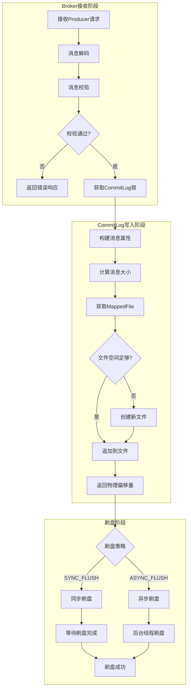
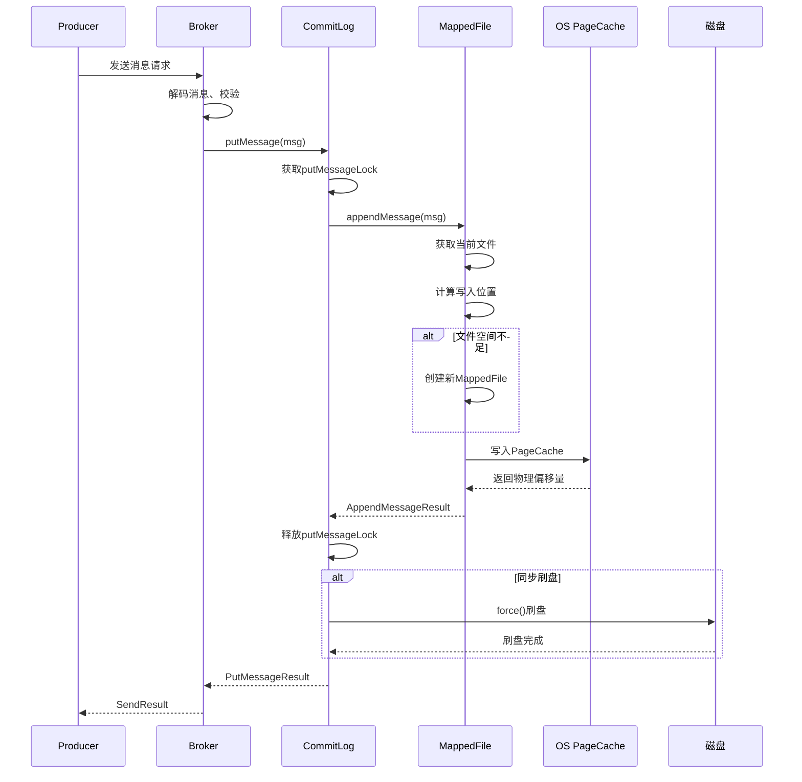
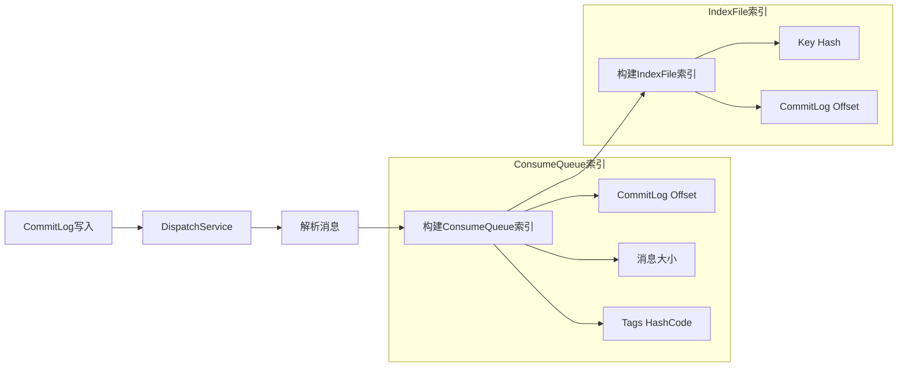
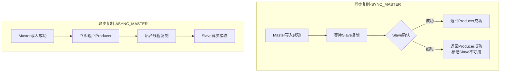

# RocketMQ 技术架构分析 - 消息存储篇

> 本篇深入分析 RocketMQ 的消息存储架构，包括 CommitLog、ConsumeQueue、刷盘机制、主从复制和文件体系。

---

## 一、存储架构总览

### 1.1 三层存储架构

RocketMQ 采用 "CommitLog + ConsumeQueue + IndexFile" 三层存储架构：

```plain
┌─────────────────────────────────────────────────────────────────────────────┐
│                           RocketMQ 存储架构                                  │
├─────────────────────────────────────────────────────────────────────────────┤
│                                                                             │
│  ┌─────────────────────────────────────────────────────────────────────┐   │
│  │                         CommitLog                                    │   │
│  │                    (消息主体存储，顺序写入)                             │   │
│  │  ┌─────────┬─────────┬─────────┬─────────┬─────────┐               │   │
│  │  │  Msg1   │  Msg2   │  Msg3   │  Msg4   │  Msg5   │  ...          │   │
│  │  │TopicA   │TopicB   │TopicA   │TopicC   │TopicA   │               │   │
│  │  └─────────┴─────────┴─────────┴─────────┴─────────┘               │   │
│  └─────────────────────────────────────────────────────────────────────┘   │
│                                    │                                        │
│                    异步构建索引 (DispatchService)                            │
│                                    ▼                                        │
│  ┌─────────────────────────────────────────────────────────────────────┐   │
│  │                       ConsumeQueue                                   │   │
│  │                   (按 Topic-QueueId 组织的索引)                        │   │
│  │  ┌───────────────────┐  ┌───────────────────┐                       │   │
│  │  │ TopicA/Queue0     │  │ TopicB/Queue0     │  ...                  │   │
│  │  │ ┌───┬───┬───┐    │  │ ┌───┬───┐         │                       │   │
│  │  │ │ 1 │ 3 │ 5 │    │  │ │ 2 │...│         │                       │   │
│  │  │ └───┴───┴───┘    │  │ └───┴───┘         │                       │   │
│  │  └───────────────────┘  └───────────────────┘                       │   │
│  └─────────────────────────────────────────────────────────────────────┘   │
│                                    │                                        │
│                                    ▼                                        │
│  ┌─────────────────────────────────────────────────────────────────────┐   │
│  │                        IndexFile                                     │   │
│  │                    (按 Key 查询的哈希索引)                              │   │
│  │  ┌─────────────────────────────────────────────────────────────┐   │   │
│  │  │ Key Hash → CommitLog Offset                                  │   │   │
│  │  └─────────────────────────────────────────────────────────────┘   │   │
│  └─────────────────────────────────────────────────────────────────────┘   │
│                                                                             │
└─────────────────────────────────────────────────────────────────────────────┘
```

### 1.2 三种核心文件对比

| 对比项 | CommitLog | ConsumeQueue | IndexFile |
| --- | --- | --- | --- |
| **存储内容** | 完整消息体 | 20 字节索引单元 | 20 字节索引条目 |
| **组织方式** | 全局顺序写入 | 按 Topic-QueueId 组织 | 按时间戳命名 |
| **写入方式** | 顺序写入 | 异步构建 | 异步构建 |
| **主要用途** | 消息存储、恢复、同步 | 消费定位、过滤 | 按 Key 查询 |
| **查询复杂度** | O(1) 按偏移量 | O(1) 按队列偏移量 | O(1)~O(n) 按 Key Hash |

### 1.3 为什么这样设计？

| 存储方案 | 优点 | 缺点 |
| --- | --- | --- |
| 按 Topic 分文件 | 消费高效 | 写入随机 IO，性能差 |
| 单一 CommitLog | 写入顺序 IO，性能高 | 消费需要索引 |
| **CommitLog + ConsumeQueue** | **写入顺序 IO + 消费高效** | 需要维护索引 |

---

## 二、CommitLog

### 2.1 存储流程



### 2.2 CommitLog 写入详细时序



### 2.3 CommitLog 消息格式

每条消息在 CommitLog 中的存储格式：

```plain
┌─────────────────────────────────────────────────────────────────────────────┐
│                        CommitLog 消息存储格式                                │
├─────────────────────────────────────────────────────────────────────────────┤
│  字段                    │ 长度    │ 说明                                    │
├──────────────────────────┼─────────┼─────────────────────────────────────────┤
│  msgLen                  │ 4B      │ 消息总长度                               │
│  magicCode               │ 4B      │ 魔数                                    │
│  bodyCRC                 │ 4B      │ 消息体CRC校验码                          │
│  queueId                 │ 4B      │ 队列ID                                  │
│  flag                    │ 4B      │ 消息标志                                │
│  queueOffset             │ 8B      │ 队列偏移量                               │
│  physicalOffset          │ 8B      │ 物理偏移量                               │
│  sysFlag                 │ 4B      │ 系统标志                                │
│  bornTimestamp           │ 8B      │ 消息生成时间                             │
│  bornHost                │ 8B      │ 消息来源地址                             │
│  storeTimestamp          │ 8B      │ 存储时间戳                               │
│  storeHost               │ 8B      │ 存储Broker地址                           │
│  reconsumeTimes          │ 4B      │ 重试消费次数                             │
│  preparedTransactionOffset│ 8B     │ 事务消息预处理偏移量                       │
│  bodyLen                 │ 4B      │ 消息体长度                               │
│  body                    │ bodyLen │ 消息体                                  │
│  topicLen                │ 1B      │ Topic长度                               │
│  topic                   │ topicLen│ Topic名称                               │
│  propertiesLen           │ 2B      │ 属性长度                                │
│  properties              │ propLen │ 属性数据                                │
└─────────────────────────────────────────────────────────────────────────────┘
```

---

## 三、ConsumeQueue

### 3.1 ConsumeQueue 存储结构

每个 Topic-QueueId 对应一个 ConsumeQueue，每条记录固定 20 字节：

```plain
┌─────────────────────────────────────────────────────────────────────────────┐
│                    ConsumeQueue 每条记录 (固定20字节)                         │
├─────────────────────────────────────────────────────────────────────────────┤
│  CommitLog Offset (8B) │ Size (4B) │ Tags HashCode (8B)                    │
├────────────────────────┼───────────┼────────────────────────────────────────┤
│  12345678              │ 1024      │ 0x7A8B9C0D                             │
└─────────────────────────────────────────────────────────────────────────────┘

说明：
- CommitLog Offset: 消息在 CommitLog 中的物理偏移量
- Size: 消息大小
- Tags HashCode: Tag 的哈希值，用于 Broker 端过滤
```

### 3.2 ConsumeQueue 文件组织

```plain
${storePathRootDir}/consumequeue/
├── TopicA/
│   ├── 0/                          # QueueId = 0
│   │   ├── 00000000000000000000    # 文件名 = 起始偏移量 / 20
│   │   └── 00000000000006000000
│   ├── 1/                          # QueueId = 1
│   │   └── ...
│   └── ...
├── TopicB/
│   └── ...
└── ...
```

### 3.3 索引构建流程



---

## 四、刷盘机制

### 4.1 刷盘策略对比

```mermaid
flowchart LR
    subgraph 同步刷盘
        S1[写入PageCache] --> S2[立即调用force]
        S2 --> S3[阻塞等待]
        S3 --> S4[刷盘完成返回]
    end
    
    subgraph 异步刷盘
        A1[写入PageCache] --> A2[立即返回]
        A2 --> A3[后台线程定期刷盘]
        A3 --> A4[批量刷盘]
    end
```



| 刷盘方式 | 可靠性 | 性能 | 数据丢失风险 | 适用场景 |
| --- | --- | --- | --- | --- |
| **同步刷盘** | 最高 | 较低 | 几乎无 | 金融交易、重要业务 |
| **异步刷盘** | 高 | 高 | 可能丢失少量 | 日志、非关键数据 |

### 4.2 同步刷盘实现

```java
// GroupCommitService
public void run() {
    while (!this.stopped) {
        // 等待刷盘请求
        this.waitForRunning(10);
        
        // 执行刷盘
        this.doCommit();
    }
}

private void.doCommit() {
    for (GroupCommitRequest req : this.requestsRead) {
        // 刷盘到指定位置
        boolean result = CommitLog.this.mappedFileQueue.getFlushedWhere() >= req.getNextOffset();
        
        for (int i = 0; i < 2 && !result; i++) {
            CommitLog.this.mappedFileQueue.flush(0);
            result = CommitLog.this.mappedFileQueue.getFlushedWhere() >= req.getNextOffset();
        }
        
        // 唤醒等待的请求
        req.wakeupCustomer(result ? PutMessageStatus.PUT_OK : PutMessageStatus.FLUSH_DISK_TIMEOUT);
    }
}
```

### 4.3 异步刷盘实现

```java
// FlushCommitLogService
public void run() {
    while (!this.stopped) {
        // 定期刷盘
        this.waitForRunning(500);  // 默认500ms
        
        // 刷盘
        CommitLog.this.mappedFileQueue.flush(0);
    }
}
```

### 4.4 刷盘配置

```properties
# 刷盘方式: ASYNC_FLUSH(异步), SYNC_FLUSH(同步)
flushDiskType=ASYNC_FLUSH

# 异步刷盘间隔
flushIntervalCommitLog=500

# 同步刷盘超时
syncFlushTimeout=5000
```

---

## 五、主从复制

### 5.1 BrokerRole 角色定义

```java
public enum BrokerRole {
    ASYNC_MASTER,  // 异步主节点
    SYNC_MASTER,   // 同步主节点
    SLAVE;         // 从节点
}
```

| 角色 | 含义 | 写入流程 | 数据可靠性 | 性能 |
| --- | --- | --- | --- | --- |
| **ASYNC_MASTER** | 异步主节点 | 主节点写入成功即返回 | 较低 | 最高 |
| **SYNC_MASTER** | 同步主节点 | 主节点写入 + 等待从节点同步 | 较高 | 较低 |
| **SLAVE** | 从节点 | 不接收写入，只同步主节点数据 | - | - |

### 5.2 复制流程对比



| 复制方式 | 可靠性 | 性能 | 数据丢失风险 |
| --- | --- | --- | --- |
| **同步复制** | 最高 | 较低 | 极低 |
| **异步复制** | 高 | 高 | Master 宕机可能丢失 |

### 5.3 HA 同步机制

```plain
┌─────────────────────────────────────────────────────────────────────────────┐
│                          HA 主从同步机制                                     │
├─────────────────────────────────────────────────────────────────────────────┤
│                                                                             │
│  Master                                    Slave                            │
│  ┌──────────────────────────────────┐     ┌──────────────────────────────┐ │
│  │  HAService                       │     │  HAClient                    │ │
│  │  ┌────────────────────────────┐  │     │  ┌────────────────────────┐  │ │
│  │  │ AcceptSocketService        │  │     │  │ 连接Master             │  │ │
│  │  │ 监听Slave连接              │◄─┼─────┼──│ 发送已同步偏移量        │  │ │
│  │  └────────────────────────────┘  │     │  └────────────────────────┘  │ │
│  │                │                 │     │              │               │ │
│  │                ▼                 │     │              ▼               │ │
│  │  ┌────────────────────────────┐  │     │  ┌────────────────────────┐  │ │
│  │  │ GroupTransferService       │  │     │  │ 读取Master数据         │  │ │
│  │  │ 等待Slave同步完成          │──┼─────┼──│ 写入本地CommitLog      │  │ │
│  │  └────────────────────────────┘  │     │  └────────────────────────┘  │ │
│  └──────────────────────────────────┘     └──────────────────────────────┘ │
│                                                                             │
│  同步流程:                                                                   │
│  1. Slave 连接 Master，报告已同步偏移量                                      │
│  2. Master 发送增量数据 (从已同步偏移量开始)                                  │
│  3. Slave 写入本地 CommitLog                                                │
│  4. Slave 更新已同步偏移量，下次心跳报告                                      │
│  5. Master 收到确认，唤醒等待的请求                                          │
│                                                                             │
└─────────────────────────────────────────────────────────────────────────────┘
```

### 5.4 HA 配置参数

| 参数 | 默认值 | 说明 |
| --- | --- | --- |
| `haListenPort` | 10912 | HA 服务监听端口 |
| `haSendHeartbeatInterval` | 5s | 心跳间隔 |
| `haSlaveFallbehindMax` | 256MB | Slave 落后最大字节数 |
| `brokerRole` | ASYNC_MASTER | Broker 角色 |
| `slaveTimeout` | 3000ms | SYNC_MASTER 等待 Slave 确认超时 |

---

## 六、文件体系

### 6.1 文件存储目录结构

```plain
${storePathRootDir}/
├── commitlog/                          # 消息存储目录
│   ├── 00000000000000000000.msg        # CommitLog 文件 (偏移量 0)
│   └── 00000000001073741824.msg        # CommitLog 文件 (偏移量 1GB)
├── consumequeue/                       # 消费索引目录
│   └── {Topic}/{QueueId}/              # 按 Topic-QueueId 组织
│       └── 00000000000000000000        # ConsumeQueue 文件
├── index/                              # Key 索引目录
│   └── 20231201000000000               # IndexFile 文件 (时间戳命名)
├── config/                             # 配置文件目录
│   ├── topics.json                     # Topic 配置
│   ├── subscriptionGroup.json          # 订阅组配置
│   └── consumerOffset.json             # 消费位点
└── checkpoint                          # 存储检查点文件
```

### 6.2 MappedFile 内存映射

RocketMQ 使用 `MappedFile` 实现零拷贝：

```java
public class MappedFile {
    private FileChannel fileChannel;
    private MappedByteBuffer mappedByteBuffer;  // 内存映射
    private volatile long wrotePosition;        // 写位置
    private volatile long committedPosition;    // 提交位置
    private volatile long flushedPosition;      // 刷盘位置
    
    public AppendMessageResult appendMessage(final MessageExtBrokerInner msg) {
        // 直接写入内存映射区域
        return msgStoreItemMemory.putLong(commitLogOffset);
        // ...
    }
}
```

### 6.3 MappedFileQueue 文件队列

```java
public class MappedFileQueue {
    private final CopyOnWriteArrayList<MappedFile> mappedFiles;  // 文件列表
    private long flushedWhere;    // 已刷盘位置
    private long committedWhere;  // 已提交位置
    
    // 根据偏移量获取 MappedFile
    public MappedFile findMappedFileByOffset(final long offset) {
        int index = (int) ((offset / this.mappedFileSize) - (this.getFirstMappedFile().getFileFromOffset() / this.mappedFileSize));
        return this.mappedFiles.get(index);
    }
}
```

### 6.4 文件大小配置

| 文件类型 | 默认大小 | 配置项 |
| --- | --- | --- |
| CommitLog | 1GB | `mapedFileSizeCommitLog` |
| ConsumeQueue | 600MB | `mapedFileSizeConsumeQueue` |
| IndexFile | 400MB | `mapedFileSizeIndexFile` |

---

## 七、存储配置汇总

### 7.1 核心配置项

| 配置项 | 默认值 | 说明 |
| --- | --- | --- |
| `storePathRootDir` | ${user.home}/store | 存储根目录 |
| `storePathCommitLog` | ${storePathRootDir}/commitlog | CommitLog 目录 |
| `mapedFileSizeCommitLog` | 1073741824 (1GB) | CommitLog 文件大小 |
| `mapedFileSizeConsumeQueue` | 6000000 (600MB) | ConsumeQueue 文件大小 |
| `flushDiskType` | ASYNC_FLUSH | 刷盘方式 |
| `flushIntervalCommitLog` | 500ms | 异步刷盘间隔 |
| `brokerRole` | ASYNC_MASTER | Broker 角色 |

### 7.2 性能相关配置

| 配置项 | 默认值 | 说明 |
| --- | --- | --- |
| `sendMessageThreadPoolNums` | 4 + CPU核数 | 发送消息线程池大小 |
| `pullMessageThreadPoolNums` | 4 + CPU核数 | 拉取消息线程池大小 |
| `useReentrantLockWhenPutMessage` | false | 写入是否使用可重入锁 |
| `flushCommitLogTimed` | false | 是否定时刷盘 |

---

## 八、总结

本篇介绍了 RocketMQ 消息存储的核心机制：

1. **三层存储架构**：CommitLog（顺序写入）+ ConsumeQueue（消费索引）+ IndexFile（Key 索引）
2. **CommitLog**：所有消息顺序写入，实现高性能存储
3. **ConsumeQueue**：按 Topic-QueueId 组织的索引，实现高效消费
4. **刷盘机制**：同步刷盘（高可靠）vs 异步刷盘（高性能）
5. **主从复制**：同步复制（高可靠）vs 异步复制（高性能）
6. **文件体系**：MappedFile 内存映射实现零拷贝

理解这些存储机制，有助于优化 RocketMQ 的性能和可靠性配置。
