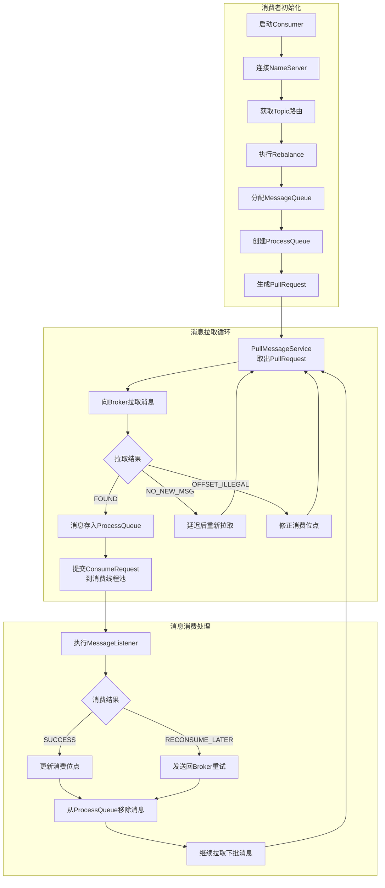
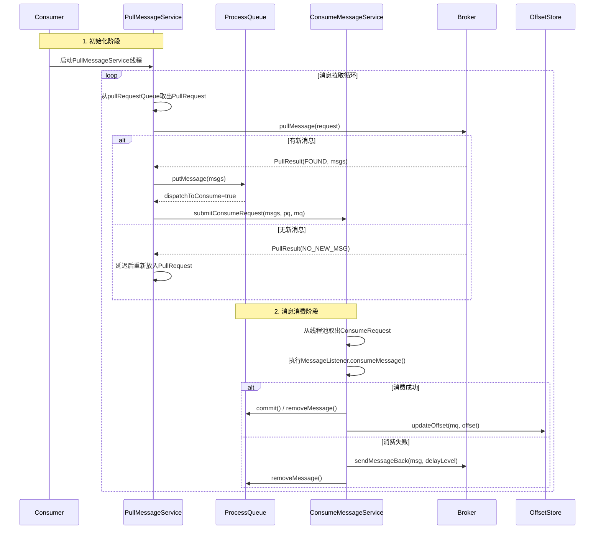
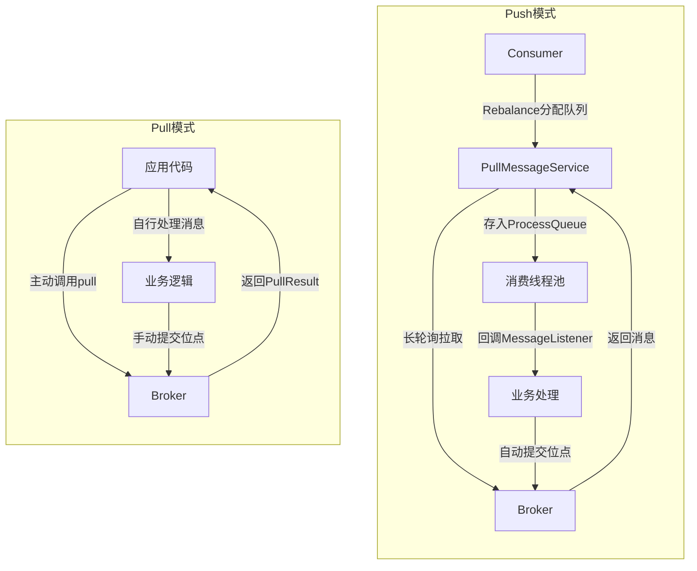
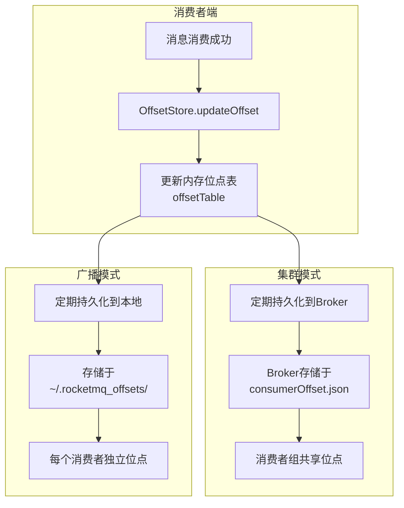
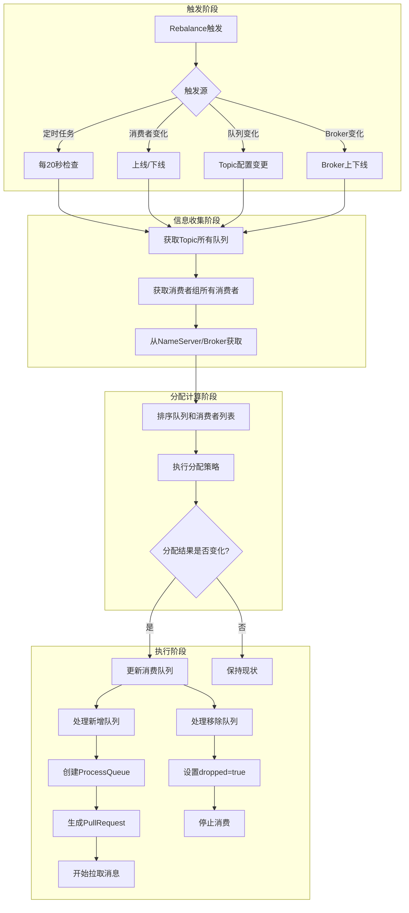
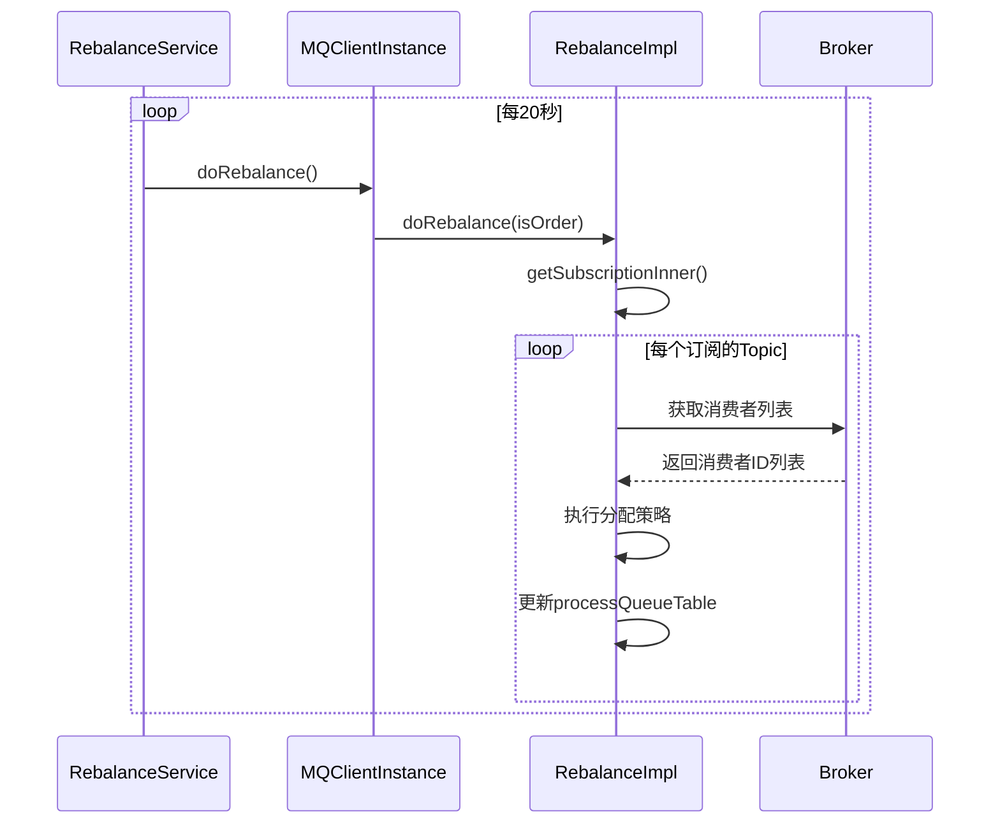
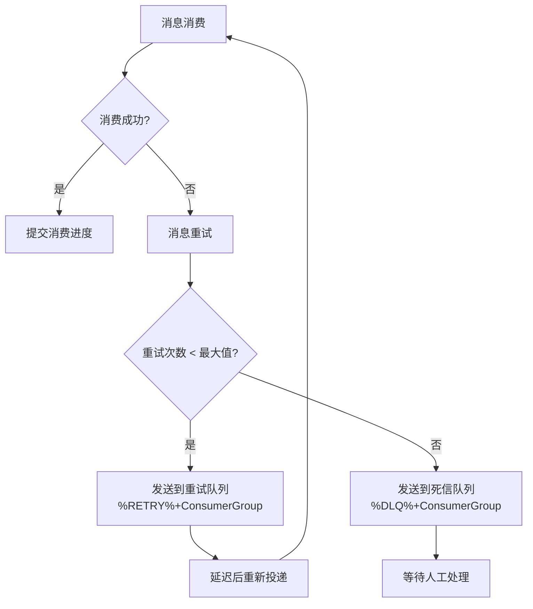
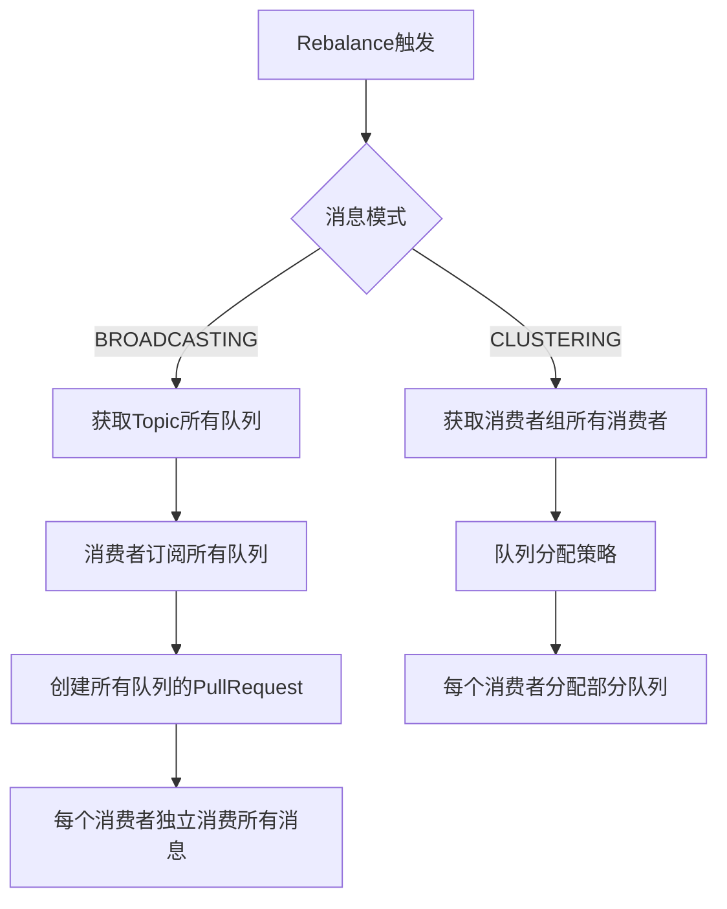

# RocketMQ 技术架构分析 - 消息消费篇

> 本篇深入分析 RocketMQ 消息消费的完整流程，包括 Push/Pull 模式、长轮询、流控机制、位点管理和 Rebalance。

---

## 一、消费流程总览

`PullMessageService` 是 Push 模式的核心拉取线程 ([PullMessageService.java](file:///d:/work/github/rocketmq/client/src/main/java/org/apache/rocketmq/client/impl/consumer/PullMessageService.java))。

### 1.1 消费流程图



### 1.2 Push 模式详细时序



---

## 二、Push vs Pull 模式

> **默认消费模式**：RocketMQ 默认使用 **Push 模式**，通过 `DefaultMQPushConsumer` 实现。Push 模式简单易用，自动管理 Rebalance、位点提交和流控，适合大多数业务场景。

### 2.1 核心架构对比



### 2.2 模式特性对比

| 特性 | Pull 模式 | Push 模式 |
| --- | --- | --- |
| 消费方式 | 应用主动拉取 | 后台自动拉取 |
| 消费控制 | 应用完全控制 | 框架自动管理 |
| 实现复杂度 | 较高 | 较低 |
| 流量控制 | 应用自行实现 | 内置流控机制 |
| 位点管理 | 手动管理 | 自动管理 |
| 消息重试 | 无 | 发送回重试队列 |
| 适用场景 | 特殊消费逻辑、批量处理 | 大多数业务场景 |

### 2.3 API 层面对比

| 对比项 | Push 模式 | Pull 模式 |
| --- | --- | --- |
| **核心类** | `DefaultMQPushConsumer` | `DefaultLitePullConsumer` |
| **消息获取** | 自动拉取 | 应用主动调用 `poll()` |
| **结果类型** | 回调函数 | `PullResult` |
| **消费监听** | `MessageListener` | 无（应用自行处理） |

### 2.4 Push 模式本质

RocketMQ 的 Push 模式本质上是 **Pull + 长轮询**：

```plain
┌─────────────────────────────────────────────────────────────────────────────┐
│                          Push 模式实现原理                                   │
├─────────────────────────────────────────────────────────────────────────────┤
│                                                                             │
│  Consumer                           Broker                                   │
│  ┌──────────────┐                  ┌──────────────────────────────────────┐ │
│  │              │  pullRequest     │                                      │ │
│  │              │ ───────────────► │  PullRequestHoldService              │ │
│  │              │                  │  挂起请求，等待新消息                  │ │
│  │   等待响应    │                  │                                      │ │
│  │   (不超时)    │                  │                                      │ │
│  │              │                  │                                      │ │
│  │              │  消息到达立即返回  │                                      │ │
│  │              │ ◄─────────────── │                                      │ │
│  └──────────────┘                  └──────────────────────────────────────┘ │
│                                                                             │
│  长轮询超时: 默认15秒 (brokerSuspendMaxTimeMillis)                           │
│  实现效果: Consumer 无需频繁轮询，有消息时 Broker 立即推送                     │
└─────────────────────────────────────────────────────────────────────────────┘
```

### 2.5 代码示例对比

**Push 模式**：

```java
DefaultMQPushConsumer consumer = new DefaultMQPushConsumer("ConsumerGroup");
consumer.setNamesrvAddr("localhost:9876");
consumer.subscribe("TopicTest", "*");
consumer.registerMessageListener((msgs, context) -> {
    return ConsumeConcurrentlyStatus.CONSUME_SUCCESS;
});
consumer.start();
```

**Pull 模式**：

```java
DefaultLitePullConsumer consumer = new DefaultLitePullConsumer("ConsumerGroup");
consumer.setNamesrvAddr("localhost:9876");
consumer.start();
consumer.subscribe("TopicTest", "*");

while (running) {
    List<MessageExt> msgs = consumer.poll(3000);
    for (MessageExt msg : msgs) {
        // 业务处理
    }
    consumer.commitSync();
}
```

### 2.6 模式选择建议

| 场景 | 推荐模式 | 原因 |
| --- | --- | --- |
| **普通业务消费** | Push | 简单易用，自动管理 |
| **批量数据处理** | Pull | 可控制拉取节奏 |
| **需要精确控制位点** | Pull | 手动管理位点 |
| **顺序消息** | Push | 支持顺序消费 |
| **事务消息** | Push | 支持事务消息 |

---

## 三、长轮询机制

### 3.1 长轮询原理

RocketMQ 通过长轮询实现"伪 Push"效果，Consumer 拉取请求在 Broker 端挂起：

```java
// Broker端挂起拉取请求
public void suspendPullRequest(final String topic, final int queueId, 
                               final PullRequest pullRequest) {
    String key = topic + "@" + queueId;
    ManyPullRequest mpr = this.pullRequestTable.get(key);
    if (null == mpr) {
        mpr = new ManyPullRequest();
        this.pullRequestTable.putIfAbsent(key, mpr);
    }
    mpr.addPullRequest(pullRequest);  // 挂起请求
}

// 新消息到达时唤醒
public void notifyMessageArriving(final String topic, final int queueId, 
                                  final long maxOffset) {
    String key = topic + "@" + queueId;
    ManyPullRequest mpr = this.pullRequestTable.get(key);
    if (mpr != null) {
        List<PullRequest> requestList = mpr.cloneListAndClear();
        for (PullRequest request : requestList) {
            if (maxOffset >= request.getPullFromOffset()) {
                request.wakeup();  // 唤醒请求，立即返回消息
            }
        }
    }
}
```

### 3.2 长轮询配置

| 参数 | 默认值 | 说明 |
| --- | --- | --- |
| `longPollingEnable` | true | 是否启用长轮询 |
| `shortPollingTimeMills` | 1000ms | 短轮询等待时间 |
| `brokerSuspendMaxTimeMillis` | 15000ms | 长轮询最大挂起时间 |
| `consumerTimeoutWhenSuspend` | 30000ms | Consumer 超时时间 |

---

## 四、消费者流控机制

### 4.1 流控层次

RocketMQ 在多个层面实现流控，防止消费者过载。`ProcessQueue` 是消费者端的本地消息缓存 ([ProcessQueue.java](file:///d:/work/github/rocketmq/client/src/main/java/org/apache/rocketmq/client/impl/consumer/ProcessQueue.java))：

```plain
┌─────────────────────────────────────────────────────────────────────────────┐
│                          消费者流控层次                                      │
├─────────────────────────────────────────────────────────────────────────────┤
│                                                                             │
│  1. ProcessQueue 本地缓存流控                                                │
│  ┌──────────────────────────────────────────────────────────────────────┐  │
│  │  msgCount > 1000  → 暂停拉取，延迟50ms后重试                           │  │
│  │  msgSize > 100MB  → 暂停拉取，延迟50ms后重试                           │  │
│  │  maxSpan > 2000   → 暂停拉取（消息跨度太大）                           │  │
│  └──────────────────────────────────────────────────────────────────────┘  │
│                                                                             │
│  2. 消费线程池流控                                                           │
│  ┌──────────────────────────────────────────────────────────────────────┐  │
│  │  consumeThreadMin  → 核心线程数（默认20）                              │  │
│  │  consumeThreadMax  → 最大线程数（默认20）                              │  │
│  │  pullThresholdForQueue → 单队列最大拉取消息数（默认1000）              │  │
│  └──────────────────────────────────────────────────────────────────────┘  │
│                                                                             │
│  3. Broker端流控                                                            │
│  ┌──────────────────────────────────────────────────────────────────────┐  │
│  │  maxMsgNums → 单次拉取最大消息数（默认32）                             │  │
│  │  maxMsgSize → 单次拉取最大字节数（默认1MB）                            │  │
│  └──────────────────────────────────────────────────────────────────────┘  │
│                                                                             │
└─────────────────────────────────────────────────────────────────────────────┘
```

### 4.2 流控核心代码

```java
// DefaultMQPushConsumerImpl 流控检查
long cachedMessageCount = processQueue.getMsgCount();
long cachedMessageSizeInMiB = processQueue.getMsgSize() / (1024 * 1024);

if (cachedMessageCount > this.defaultMQPushConsumer.getPullThresholdForQueue()) {
    // 本地缓存消息数量超限，延迟拉取
    this.executePullRequestLater(pullRequest, PULL_TIME_DELAY_MILLS_WHEN_FLOW_CONTROL);
    return;
}

if (cachedMessageSizeInMiB > this.defaultMQPushConsumer.getPullThresholdSizeForQueue()) {
    // 本地缓存消息大小超限，延迟拉取
    this.executePullRequestLater(pullRequest, PULL_TIME_DELAY_MILLS_WHEN_FLOW_CONTROL);
    return;
}

if (processQueue.getMaxSpan() > this.defaultMQPushConsumer.getConsumeConcurrentlyMaxSpan()) {
    // 消息跨度太大，延迟拉取
    this.executePullRequestLater(pullRequest, PULL_TIME_DELAY_MILLS_WHEN_FLOW_CONTROL);
    return;
}
```

### 4.3 流控配置参数

| 参数 | 默认值 | 说明 |
| --- | --- | --- |
| `pullThresholdForQueue` | 1000 | 单队列最大缓存消息数 |
| `pullThresholdSizeForQueue` | 100MB | 单队列最大缓存消息大小 |
| `consumeConcurrentlyMaxSpan` | 2000 | 单队列消息最大跨度 |
| `pullInterval` | 0 | 拉取间隔（0 表示无间隔） |
| `consumeThreadMin` | 20 | 消费线程池核心线程数 |
| `consumeThreadMax` | 20 | 消费线程池最大线程数 |

---

## 五、消费位点管理

### 5.1 位点管理架构



### 5.2 OffsetStore 接口

`OffsetStore` 是消费位点管理的核心接口 ([OffsetStore.java](file:///d:/work/github/rocketmq/client/src/main/java/org/apache/rocketmq/client/consumer/store/OffsetStore.java))：

```java
public interface OffsetStore {
    void load() throws MQClientException;                    // 加载位点
    void updateOffset(MessageQueue mq, long offset,          // 更新位点（内存）
                      boolean increaseOnly);
    long readOffset(MessageQueue mq, ReadOffsetType type);   // 读取位点
    void persistAll(Set<MessageQueue> mqs);                  // 持久化所有位点
    void persist(MessageQueue mq);                           // 持久化单个位点
    void removeOffset(MessageQueue mq);                      // 移除位点
}
```

### 5.3 两种实现类对比

| 实现类 | 存储位置 | 适用模式 | 持久化方式 |
| --- | --- | --- | --- |
| `RemoteBrokerOffsetStore` | Broker 端 | 集群模式 | 通过网络请求同步到 Broker |
| `LocalFileOffsetStore` | 消费者本地 | 广播模式 | 写入本地 JSON 文件 |

### 5.4 集群模式位点管理

`RemoteBrokerOffsetStore` 是集群模式的位点存储实现 ([RemoteBrokerOffsetStore.java](file:///d:/work/github/rocketmq/client/src/main/java/org/apache/rocketmq/client/consumer/store/RemoteBrokerOffsetStore.java))：

```java
public class RemoteBrokerOffsetStore implements OffsetStore {
    // 消费者端内存位点表（缓存）
    private ConcurrentMap<MessageQueue, AtomicLong> offsetTable = new ConcurrentHashMap<>();
    
    @Override
    public void updateOffset(MessageQueue mq, long offset, boolean increaseOnly) {
        AtomicLong offsetOld = this.offsetTable.get(mq);
        if (null == offsetOld) {
            offsetOld = this.offsetTable.putIfAbsent(mq, new AtomicLong(offset));
        }
        if (null != offsetOld) {
            if (increaseOnly) {
                MixAll.compareAndIncreaseOnly(offsetOld, offset);  // 只增不减
            } else {
                offsetOld.set(offset);
            }
        }
    }
}
```

### 5.5 Broker 端位点存储

```java
public class ConsumerOffsetManager extends ConfigManager {
    // 位点表：key = "topic@group", value = {queueId: offset}
    private ConcurrentMap<String/* topic@group */, 
                          ConcurrentMap<Integer/* queueId */, Long/* offset */>> offsetTable;
    
    // 存储路径：{storePathRootDir}/config/consumerOffset.json
}
```

---

## 六、Rebalance 机制

`RebalanceService` 负责消费者组的队列重新分配 ([RebalanceService.java](file:///d:/work/github/rocketmq/client/src/main/java/org/apache/rocketmq/client/impl/consumer/RebalanceService.java))。

### 6.1 Rebalance 流程



### 6.2 队列分配策略

**平均分配策略** ([AllocateMessageQueueAveragely.java](file:///d:/work/github/rocketmq/client/src/main/java/org/apache/rocketmq/client/consumer/rebalance/AllocateMessageQueueAveragely.java)):

```java
public List<MessageQueue> allocate(String consumerGroup, String currentCID, 
    List<MessageQueue> mqAll, List<String> cidAll) {
    
    List<MessageQueue> result = new ArrayList<>();
    int index = cidAll.indexOf(currentCID);
    int mod = mqAll.size() % cidAll.size();
    
    // 计算每个消费者分配的队列数量
    int averageSize = mqAll.size() <= cidAll.size() ? 1 : 
        (mod > 0 && index < mod ? mqAll.size() / cidAll.size() + 1 : 
         mqAll.size() / cidAll.size());
    
    // 计算起始索引
    int startIndex = (mod > 0 && index < mod) ? 
        index * averageSize : index * averageSize + mod;
    
    // 分配队列
    int range = Math.min(averageSize, mqAll.size() - startIndex);
    for (int i = 0; i < range; i++) {
        result.add(mqAll.get((startIndex + i) % mqAll.size()));
    }
    return result;
}
```

### 6.3 分配示例

```plain
假设: 8个队列(Q0-Q7), 3个消费者(C0-C1-C2)

队列列表: [Q0, Q1, Q2, Q3, Q4, Q5, Q6, Q7]
消费者列表: [C0, C1, C2]

分配结果:
- C0: [Q0, Q1, Q2]    (3个队列)
- C1: [Q3, Q4, Q5]    (3个队列)
- C2: [Q6, Q7]        (2个队列)

计算过程:
- mod = 8 % 3 = 2
- C0(index=0): averageSize=3, startIndex=0, range=3 → [Q0,Q1,Q2]
- C1(index=1): averageSize=3, startIndex=3, range=3 → [Q3,Q4,Q5]
- C2(index=2): averageSize=2, startIndex=6, range=2 → [Q6,Q7]
```

### 6.4 Rebalance 触发条件

| 触发条件 | 描述 | 处理方式 |
| --- | --- | --- |
| 消费者上线 | 新消费者加入消费者组 | 重新分配队列 |
| 消费者下线 | 消费者宕机或主动退出 | 将其队列分配给其他消费者 |
| Topic 队列变化 | Topic 的读写队列数发生变化 | 重新分配队列 |
| Broker 变化 | Broker 上线或下线 | 更新路由信息，重新分配 |
| 定时触发 | 默认每 20 秒检查一次 | 检测变化并触发 Rebalance |

**触发机制详解**：

```java
// RebalanceService.java - 定时触发（最主要）
public class RebalanceService extends ServiceThread {
    private static long waitInterval =
        Long.parseLong(System.getProperty(
            "rocketmq.client.rebalance.waitInterval", "20000"));

    @Override
    public void run() {
        while (!this.isStopped()) {
            this.waitForRunning(waitInterval);  // 等待 20 秒
            this.mqClientFactory.doRebalance(); // 执行 Rebalance
        }
    }
}
```

**立即触发方式**：

```java
// MQClientInstance.java
public void rebalanceImmediately() {
    this.rebalanceService.wakeup();  // 唤醒 RebalanceService，立即执行
}
```

**触发场景时序**：



### 6.5 订阅信息存储

RebalanceImpl 维护了消费者订阅的核心数据结构：

```java
// RebalanceImpl.java
public abstract class RebalanceImpl {
    // 订阅信息表：Topic -> SubscriptionData
    protected final ConcurrentMap<String /* topic */, SubscriptionData> subscriptionInner =
        new ConcurrentHashMap<String, SubscriptionData>();
    
    // Topic 队列信息表：Topic -> Set<MessageQueue>
    protected final ConcurrentMap<String/* topic */, Set<MessageQueue>> topicSubscribeInfoTable =
        new ConcurrentHashMap<String, Set<MessageQueue>>();
    
    // 处理队列表：MessageQueue -> ProcessQueue
    protected final ConcurrentMap<MessageQueue, ProcessQueue> processQueueTable = 
        new ConcurrentHashMap<MessageQueue, ProcessQueue>(64);
}
```

**subscriptionInner 数据结构**：

| 字段 | 类型 | 说明 |
| --- | --- | --- |
| `subscriptionInner` | `ConcurrentMap<String, SubscriptionData>` | 存储消费者订阅的所有 Topic 及其订阅信息 |
| `topicSubscribeInfoTable` | `ConcurrentMap<String, Set<MessageQueue>>` | 存储每个 Topic 的队列路由信息 |
| `processQueueTable` | `ConcurrentMap<MessageQueue, ProcessQueue>` | 存储当前消费者正在处理的队列 |

> **Consumer 路由缓存详解**：Consumer 的 `topicSubscribeInfoTable` 与 Producer 的 `topicPublishInfoTable` 都源自 `MQClientInstance.topicRouteTable`，详见 [消息发送篇 - Client 元数据管理](./03-消息发送篇.md#十一client-元数据管理)

**SubscriptionData 结构**：详见 [02-核心概念篇 - SubscriptionData](./02-核心概念篇.md#47-subscriptiondata订阅数据)

**订阅流程**：

```java
// DefaultMQPushConsumerImpl.subscribe()
public void subscribe(String topic, String subExpression) throws MQClientException {
    SubscriptionData subscriptionData = FilterAPI.buildSubscriptionData(topic, subExpression);
    this.rebalanceImpl.getSubscriptionInner().put(topic, subscriptionData);
    // 发送心跳到所有 Broker，通知订阅变化
    this.mQClientFactory.sendHeartbeatToAllBrokerWithLock();
}
```

---

## 七、消费失败处理

### 7.1 消费失败流程



### 7.2 重试延迟级别

消费失败的消息会自动进入延迟重试队列，延迟级别与重试次数相关：

| 重试次数 | 延迟级别 | 延迟时间 |
| --- | --- | --- |
| 1 | 4 | 30s |
| 2 | 5 | 1m |
| 3 | 6 | 2m |
| 4 | 7 | 3m |
| 5 | 8 | 4m |
| 6 | 9 | 5m |
| 7 | 10 | 6m |
| 8 | 11 | 7m |
| 9 | 12 | 8m |
| 10 | 13 | 9m |
| 11 | 14 | 10m |
| 12 | 15 | 20m |
| 13 | 16 | 30m |
| 14 | 17 | 1h |
| 15 | 18 | 2h |
| 16 | - | 进入死信队列 |

### 7.3 重试消息生成流程

**核心源码** ([AbstractSendMessageProcessor.java](file:///d:/work/github/rocketmq/broker/src/main/java/org/apache/rocketmq/broker/processor/AbstractSendMessageProcessor.java))：

```java
// Broker 处理消费失败消息
public RemotingCommand processRequest(ChannelHandlerContext ctx, RemotingCommand request) {
    // 从原始 offset 获取消息
    MessageExt msgExt = currentBroker.getMessageStore().lookMessageByOffset(requestHeader.getOffset());
    
    // 判断是否进入死信队列
    if (msgExt.getReconsumeTimes() >= maxReconsumeTimes || delayLevel < 0) {
        // 进入死信队列
        newTopic = MixAll.getDLQTopic(requestHeader.getGroup());
        queueIdInt = randomQueueId(DLQ_NUMS_PER_GROUP);
    } else {
        // 计算延迟级别：3 + reconsumeTimes
        if (0 == delayLevel) {
            delayLevel = 3 + msgExt.getReconsumeTimes();
        }
        msgExt.setDelayTimeLevel(delayLevel);
    }
    
    // 创建新的重试消息
    MessageExtBrokerInner msgInner = new MessageExtBrokerInner();
    msgInner.setTopic(newTopic);                    // 设置重试 Topic
    msgInner.setBody(msgExt.getBody());             // 复制消息体
    msgInner.setReconsumeTimes(msgExt.getReconsumeTimes() + 1);  // 重试次数 +1
    
    // 存储到 CommitLog（生成新消息）
    PutMessageResult putMessageResult = masterBroker.getMessageStore().putMessage(msgInner);
}
```

**重试消息特点**：

| 问题 | 答案 |
| --- | --- |
| 消费重试是否生成新消息？ | **是**，每次重试都生成一条全新的消息 |
| 多次重试是否生成多条消息？ | **是**，每次重试都会在 CommitLog 中写入新消息 |
| MsgId 是否变化？ | **是**，每次重试生成新的 MsgId |
| commitLogOffset 是否变化？ | **是**，每次重试占用新的物理空间 |
| reconsumeTimes 如何变化？ | 每次重试 +1，存储在消息属性中 |

### 7.4 重试队列的消费者分配

**Consumer 自动订阅重试队列** ([DefaultMQPushConsumerImpl.java](file:///d:/work/github/rocketmq/client/src/main/java/org/apache/rocketmq/client/impl/consumer/DefaultMQPushConsumerImpl.java))：

```java
private void copySubscription() throws MQClientException {
    // ... 订阅业务 Topic ...
    
    // 集群模式下，自动订阅重试队列
    switch (this.defaultMQPushConsumer.getMessageModel()) {
        case CLUSTERING:
            final String retryTopic = MixAll.getRetryTopic(this.defaultMQPushConsumer.getConsumerGroup());
            SubscriptionData subscriptionData = FilterAPI.buildSubscriptionData(retryTopic, SubscriptionData.SUB_ALL);
            this.rebalanceImpl.getSubscriptionInner().put(retryTopic, subscriptionData);
            break;
    }
}
```

**重试队列特点**：

| 特点 | 说明 |
| --- | --- |
| **自动创建** | Broker 自动为每个 ConsumerGroup 创建重试 Topic |
| **队列数量** | 默认 1 个队列，保证顺序消费 |
| **自动订阅** | Consumer 启动时自动订阅对应的重试队列 |
| **Topic 隔离** | 不同 ConsumerGroup 的重试消息相互隔离 |
| **延迟递增** | 每次重试延迟时间递增，避免频繁重试 |

**多消费者实例场景**：

当 ConsumerGroup 有多个 Consumer 实例（如 K8s 部署 3 个 Pod）时：

| 场景 | 业务 Topic（4 队列） | 重试队列（默认 1 队列） |
| --- | --- | --- |
| Pod1 | Queue0, Queue1 | Queue0 ✅ |
| Pod2 | Queue2 | 无 ❌ |
| Pod3 | Queue3 | 无 ❌ |

**问题**：重试队列只有 1 个，只能被 1 个 Consumer 消费，其他 Consumer 无法参与重试消息的消费。

**解决方案**：增加重试队列数量

```bash
# 将重试队列数量增加到 3
mqadmin updateSubGroup -c DefaultCluster -g <ConsumerGroup> -q 3
```

| 参数 | 说明 |
| --- | --- |
| `-c` | 集群名称 |
| `-g` | 消费者组名 |
| `-q` | 重试队列数量（建议与 Consumer 实例数一致） |

> **注意**：增加重试队列数量后，同一消息的多次重试可能被不同 Consumer 消费，但每次重试仍会按延迟级别顺序执行。

### 7.5 广播模式消费失败

广播模式不支持消息重试，消费失败的消息直接丢弃。详细实现见 [10.4 广播消费失败处理](#104-广播消费失败处理)。

---

## 八、消费者线程模型

### 8.1 并发消费线程模型

`ConsumeMessageConcurrentlyService` 实现并发消费 ([ConsumeMessageConcurrentlyService.java](file:///d:/work/github/rocketmq/client/src/main/java/org/apache/rocketmq/client/impl/consumer/ConsumeMessageConcurrentlyService.java))：

```plain
┌─────────────────────────────────────────────────────────────────────────────┐
│                        ConsumeMessageConcurrentlyService                    │
├─────────────────────────────────────────────────────────────────────────────┤
│                                                                             │
│  PullRequest ──→ ProcessQueue.msgTreeMap                                    │
│                           │                                                 │
│                           ▼                                                 │
│                  ┌─────────────────────┐                                    │
│                  │  consumeExecutor    │ ← ThreadPoolExecutor              │
│                  │  (线程池)            │   coreSize: consumeThreadMin      │
│                  │                     │   maxSize: consumeThreadMax       │
│                  └─────────────────────┘                                    │
│                    │  │  │  │  │                                            │
│                    ▼  ▼  ▼  ▼  ▼                                            │
│                  ┌──┐┌──┐┌──┐┌──┐┌──┐                                      │
│                  │T1││T2││T3││T4││T5│  ← 多线程并发消费                      │
│                  └──┘└──┘└──┘└──┘└──┘                                      │
│                    │                                                         │
│                    ▼                                                         │
│              MessageListener.consumeMessage()                               │
│                                                                             │
│  特点: 同一ProcessQueue的消息可被多个线程并发消费，不保证消息顺序              │
└─────────────────────────────────────────────────────────────────────────────┘
```

### 8.2 顺序消费线程模型

`ConsumeMessageOrderlyService` 实现顺序消费 ([ConsumeMessageOrderlyService.java](file:///d:/work/github/rocketmq/client/src/main/java/org/apache/rocketmq/client/impl/consumer/ConsumeMessageOrderlyService.java))：

```plain
┌─────────────────────────────────────────────────────────────────────────────┐
│                        ConsumeMessageOrderlyService                         │
├─────────────────────────────────────────────────────────────────────────────┤
│                                                                             │
│  MessageQueue ──→ MessageQueueLock.fetchLockObject(mq)                      │
│                           │                                                 │
│                           ▼                                                 │
│                    ┌─────────────┐                                          │
│                    │  objLock    │ ← 每个MessageQueue一个锁对象              │
│                    │ (队列锁)     │                                          │
│                    └─────────────┘                                          │
│                           │                                                 │
│         synchronized(objLock)                                               │
│                           │                                                 │
│                           ▼                                                 │
│                  ProcessQueue.consumeLock                                   │
│                           │                                                 │
│                           ▼                                                 │
│              MessageListener.consumeMessage()                               │
│                                                                             │
│  特点: 同一MessageQueue的消息串行消费，不同MessageQueue可并行消费              │
└─────────────────────────────────────────────────────────────────────────────┘
```

### 8.3 线程模型对比

| 特性 | 并发消费 | 顺序消费 |
| --- | --- | --- |
| 线程池 | 共享线程池 | 共享线程池 |
| 队列锁 | 无 | MessageQueue 级别 |
| 消费锁 | 无 | ProcessQueue 级别 |
| 并行度 | 线程数 × 消息数 | 队列数 |
| 适用场景 | 高吞吐、无顺序要求 | 需要顺序保证 |

### 8.4 线程池配置

```java
// ConsumeMessageConcurrentlyService / ConsumeMessageOrderlyService 构造函数
this.consumeExecutor = new ThreadPoolExecutor(
    this.defaultMQPushConsumer.getConsumeThreadMin(),    // 核心线程数，默认20
    this.defaultMQPushConsumer.getConsumeThreadMax(),    // 最大线程数，默认20
    1000 * 60,                                            // 空闲线程存活时间：60秒
    TimeUnit.MILLISECONDS,
    this.consumeRequestQueue,                             // 任务队列：LinkedBlockingQueue
    new ThreadFactoryImpl(consumeThreadPrefix));          // 线程名
```

| 配置项 | 默认值 | 说明 |
| --- | --- | --- |
| `consumeThreadMin` | 20 | 核心线程数 |
| `consumeThreadMax` | 20 | 最大线程数（建议与 min 相同） |
| 任务队列 | LinkedBlockingQueue | 无界队列，可无限堆积任务 |
| 线程存活时间 | 60 秒 | 非核心线程空闲后的存活时间 |

---

## 九、消费者核心配置

### 9.1 必要配置

```java
DefaultMQPushConsumer consumer = new DefaultMQPushConsumer("ConsumerGroup");
consumer.setNamesrvAddr("localhost:9876");
consumer.subscribe("TopicTest", "*");
consumer.registerMessageListener((msgs, context) -> {
    return ConsumeConcurrentlyStatus.CONSUME_SUCCESS;
});
consumer.start();
```

### 9.2 性能配置

| 配置项 | 默认值 | 说明 |
| --- | --- | --- |
| `consumeThreadMin` | 20 | 消费线程池核心线程数 |
| `consumeThreadMax` | 20 | 消费线程池最大线程数 |
| `pullBatchSize` | 32 | 单次拉取最大消息数 |
| `consumeMessageBatchMaxSize` | 1 | 单次消费最大消息数 |
| `pullInterval` | 0 | 拉取间隔 |
| `consumeTimeout` | 15 | 消费超时（分钟） |

### 9.3 完整配置示例

> 流控相关配置详见 [第四章 流控配置参数](#43-流控配置参数)。

```java
DefaultMQPushConsumer consumer = new DefaultMQPushConsumer("ConsumerGroup");
consumer.setNamesrvAddr("localhost:9876");
consumer.setConsumeThreadMin(20);
consumer.setConsumeThreadMax(64);
consumer.setPullBatchSize(32);
consumer.setConsumeMessageBatchMaxSize(16);
consumer.setPullThresholdForQueue(1000);
consumer.setConsumeTimeout(15);
consumer.subscribe("TopicTest", "*");
consumer.start();
```

---

## 十、广播模式详解

### 10.1 广播消费核心实现

广播模式下，每个消费者实例都会消费 Topic 下的所有队列，无需队列分配：



### 10.2 广播模式关键特性

| 特性 | 广播模式 | 集群模式 |
| --- | --- | --- |
| 队列分配 | 所有消费者订阅全部队列 | 队列按消费者数量均分 |
| 位点存储 | 本地文件 (LocalFileOffsetStore) | Broker 端 (RemoteBrokerOffsetStore) |
| 消费进度 | 每个消费者独立维护 | 消费者组共享 |
| 消息重试 | ❌ 不支持 | ✅ 支持（发送回 Broker 重试队列） |
| 消费失败 | 消息丢弃，记录日志 | 发送回 Broker 重试 |
| Broker 锁 | ❌ 不需要 | ✅ 顺序消费需要 |

### 10.3 广播消费位点存储

广播模式消费位点存储在消费者本地文件：

```java
// DefaultMQPushConsumerImpl.java
switch (this.defaultMQPushConsumer.getMessageModel()) {
    case BROADCASTING:
        // 广播模式：位点存储在本地文件
        this.offsetStore = new LocalFileOffsetStore(this.mQClientFactory, groupName);
        break;
    case CLUSTERING:
        // 集群模式：位点存储在Broker
        this.offsetStore = new RemoteBrokerOffsetStore(this.mQClientFactory, groupName);
        break;
}

// LocalFileOffsetStore 存储路径
// 默认: ${user.home}/.rocketmq_offsets/{clientId}/{groupName}/offsets.json
public final static String LOCAL_OFFSET_STORE_DIR = System.getProperty(
    "rocketmq.client.localOffsetStoreDir",
    System.getProperty("user.home") + File.separator + ".rocketmq_offsets");
```

### 10.4 广播消费失败处理

广播模式不支持消息重试，消费失败的消息直接丢弃：

```java
// ConsumeMessageConcurrentlyService.processConsumeResult()
switch (this.defaultMQPushConsumer.getMessageModel()) {
    case BROADCASTING:
        // 广播模式：消费失败的消息直接丢弃
        for (int i = ackIndex + 1; i < msgs.size(); i++) {
            MessageExt msg = msgs.get(i);
            log.warn("BROADCASTING, the message consume failed, drop it, {}", msg.toString());
        }
        break;
    case CLUSTERING:
        // 集群模式：发送回Broker重试队列
        for (int i = ackIndex + 1; i < msgs.size(); i++) {
            MessageExt msg = msgs.get(i);
            msg.setReconsumeTimes(msg.getReconsumeTimes() + 1);
            sendMessageBack(msg, context);
        }
        break;
}
```

### 10.5 广播模式 Rebalance 实现

```java
// RebalanceImpl.rebalanceByTopic()
switch (messageModel) {
    case BROADCASTING: {
        // 广播模式：直接获取Topic所有队列，无需分配
        Set<MessageQueue> mqSet = this.topicSubscribeInfoTable.get(topic);
        if (mqSet != null) {
            // 消费者订阅所有队列
            boolean changed = this.updateProcessQueueTableInRebalance(topic, mqSet, isOrder);
            if (changed) {
                this.messageQueueChanged(topic, mqSet, mqSet);
            }
        }
        break;
    }
    case CLUSTERING: {
        // 集群模式：需要获取消费者列表并执行分配策略
        Set<MessageQueue> mqSet = this.topicSubscribeInfoTable.get(topic);
        List<String> cidAll = this.mQClientFactory.findConsumerIdList(topic, consumerGroup);
        // ... 执行分配策略
        List<MessageQueue> allocateResult = strategy.allocate(consumerGroup, currentCID, mqAll, cidAll);
        break;
    }
}
```

### 10.6 广播模式顺序消费

广播模式下顺序消费不需要 Broker 锁，因为每个消费者独立消费：

```java
// ConsumeMessageOrderlyService.ConsumeRequest.run()
synchronized (objLock) {
    // 广播模式：直接消费，无需检查Broker锁
    // 集群模式：需要检查 processQueue.isLocked()
    if (MessageModel.BROADCASTING.equals(messageModel)
        || this.processQueue.isLocked() && !this.processQueue.isLockExpired()) {
        // 开始消费
    }
}
```

### 10.7 广播模式使用场景

| 场景 | 说明 |
| --- | --- |
| 配置推送 | 所有应用实例都需要收到配置更新 |
| 缓存刷新 | 所有节点的本地缓存需要同步更新 |
| 事件通知 | 所有服务实例都需要响应同一事件 |
| 日志收集 | 每个节点独立收集自己的日志 |

### 10.8 广播模式注意事项

1. **消费进度独立**：每个消费者独立维护消费位点，重启后从自己的位点继续消费
2. **不支持重试**：消费失败的消息不会重试，需要业务自行处理
3. **队列数不影响消费者**：即使只有 1 个队列，所有消费者都能收到消息
4. **消费者组概念弱化**：消费者组主要用于标识应用，不用于负载均衡

---

## 十一、Consumer Group 自动创建机制

> **Consumer 不会自动创建 Topic**，但会自动创建 Consumer Group。Topic 必须由 Producer 或运维预先创建。

### 11.1 检查顺序

Broker 处理 Consumer 拉取请求时，按以下顺序检查：

```
Consumer 请求拉取 "OrderService" Topic 消息
                ↓
        1. 检查 Topic 是否存在
                ↓
        ┌───────┴───────┐
        ↓               ↓
   Topic 不存在      Topic 存在
        ↓               ↓
   返回错误         2. 检查 Consumer Group
   Consumer 失败          ↓
                  ┌──────┴──────┐
                  ↓             ↓
             Group 存在      Group 不存在
                  ↓             ↓
               正常拉取     自动创建 Group
```

### 11.2 Topic 不存在时的错误

当 Consumer 订阅一个不存在的 Topic 时，Broker 会返回 `TOPIC_NOT_EXIST` 错误 ([PullMessageProcessor.java:336-339](file:///d:/work/github/rocketmq/broker/src/main/java/org/apache/rocketmq/broker/processor/PullMessageProcessor.java#L336-L339))：

```java
TopicConfig topicConfig = this.brokerController.getTopicConfigManager().selectTopicConfig(requestHeader.getTopic());
if (null == topicConfig) {
    response.setCode(ResponseCode.TOPIC_NOT_EXIST);
    response.setRemark(String.format("topic[%s] not exist, apply first please!", requestHeader.getTopic()));
    return response;
}
```

### 11.3 Consumer Group 自动创建

**前提条件**：Topic 必须已存在（由 Producer 或运维创建）

**自动创建逻辑** ([SubscriptionGroupManager.java:209-224](file:///d:/work/github/rocketmq/broker/src/main/java/org/apache/rocketmq/broker/subscription/SubscriptionGroupManager.java#L209-L224))：

```java
public SubscriptionGroupConfig findSubscriptionGroupConfig(final String group) {
    SubscriptionGroupConfig subscriptionGroupConfig = this.subscriptionGroupTable.get(group);
    if (null == subscriptionGroupConfig) {
        if (brokerController.getBrokerConfig().isAutoCreateSubscriptionGroup() || MixAll.isSysConsumerGroup(group)) {
            subscriptionGroupConfig = new SubscriptionGroupConfig();
            subscriptionGroupConfig.setGroupName(group);
            // 自动创建 Consumer Group
        }
    }
    return subscriptionGroupConfig;
}
```

### 11.4 与 Producer 自动创建对比

| 角色 | Topic 自动创建 | Group 自动创建 | 配置项 |
| --- | --- | --- | --- |
| Producer | ✅ 支持 | - | `autoCreateTopicEnable` |
| Consumer | ❌ 不支持 | ✅ 支持 | `autoCreateSubscriptionGroup` |

> **Topic 自动创建机制详见**：[消息发送篇 - Topic 自动创建机制](./03-消息发送篇.md#十topic-自动创建机制)

### 11.5 典型启动顺序

| 启动顺序 | Topic 状态 | Consumer Group 状态 | 结果 |
|---------|-----------|-------------------|------|
| Consumer 先启动 | 不存在 | 不存在 | **失败**（Topic 不存在） |
| Producer 先启动 | 自动创建 | - | - |
| Consumer 后启动 | 已存在 | 不存在 | Consumer Group 自动创建 ✅ |

---

## 十二、总结

本篇介绍了 RocketMQ 消息消费的核心机制：

1. **消费流程**：初始化 → Rebalance → 拉取 → 消费 → 提交位点
2. **两种消费模式**：
   - **Push 模式**：Pull + 长轮询，客户端 Rebalance，简单易用
   - **Pull 模式**：应用主动拉取，手动管理位点，灵活可控
3. **长轮询**：Broker 挂起请求，有消息时立即返回
4. **流控机制**：ProcessQueue 缓存 + 消费线程池 + Broker 端限制
5. **位点管理**：集群模式存储在 Broker，广播模式存储在本地
6. **Rebalance**：消费者组内队列重新分配，每 20 秒检查一次
7. **消费失败**：集群模式进入重试队列，广播模式直接丢弃
8. **Consumer Group 自动创建**：Topic 存在时自动创建 Consumer Group

理解这些消费机制，有助于优化 RocketMQ 消费者的性能和可靠性配置。
