# RocketMQ 技术架构分析 - 消息消费篇

> 本篇深入分析 RocketMQ 消息消费的完整流程，包括 Push/Pull 模式、长轮询、流控机制、位点管理和 Rebalance。

---

## 一、消费流程总览

`PullMessageService` 是 Push 模式的核心拉取线程 ([PullMessageService.java](../../client/src/main/java/org/apache/rocketmq/client/impl/consumer/PullMessageService.java))。

### 1.1 消费流程图

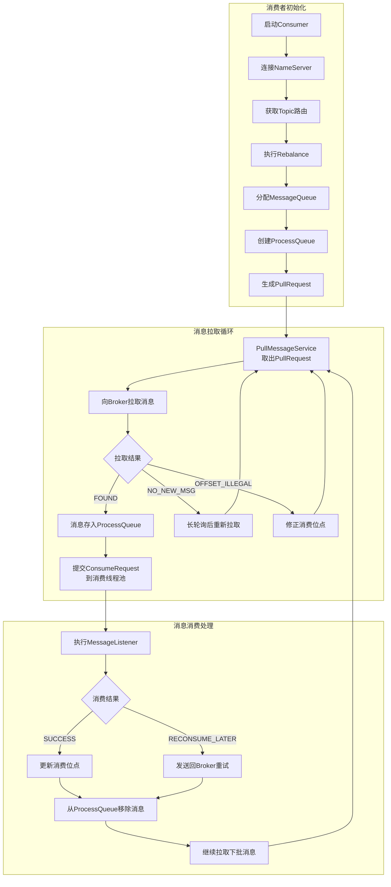

### 1.2 拉取结果处理

消息拉取会返回不同的 `PullStatus`，Consumer 根据结果类型执行不同处理 ([PullStatus.java](../../client/src/main/java/org/apache/rocketmq/client/consumer/PullStatus.java))：

| PullStatus | 说明 | Consumer 处理 |
| --- | --- | --- |
| `FOUND` | 找到消息 | 消息存入 ProcessQueue，提交消费线程池 |
| `NO_NEW_MSG` | 没有新消息 | **立即**重新发起拉取（无延迟） |
| `NO_MATCHED_MSG` | 没有匹配消息 | 立即重新发起拉取 |
| `OFFSET_ILLEGAL` | 位点非法 | 修正位点后重新拉取 |

> **注意**：`NO_NEW_MSG` 时 Consumer 端实际上是**立即重新拉取**，真正的"延迟"来自 Broker 端的**长轮询机制**。Broker 会挂起请求等待新消息，最长等待 `brokerSuspendMaxTimeMillis`（Push 模式默认 **15 秒**，Pull 模式默认 **20 秒**）。详见 [二、Push vs Pull 模式 - 长轮询机制](#23-长轮询机制)。

### 1.3 OFFSET_ILLEGAL 处理

当 Broker 返回 `OFFSET_ILLEGAL` 时，表示 Consumer 请求的消费位点非法。Broker 端的 `GetMessageStatus` 枚举定义了所有拉取结果状态 ([GetMessageStatus.java](../../store/src/main/java/org/apache/rocketmq/store/GetMessageStatus.java))：

| GetMessageStatus | 说明 | 触发条件 |
| --- | --- | --- |
| `FOUND` | 找到消息 | 正常情况 |
| `NO_MATCHED_MESSAGE` | 无匹配消息 | Tag 过滤后无匹配 |
| `MESSAGE_WAS_REMOVING` | 消息正在删除 | 消息已被标记删除 |
| `OFFSET_FOUND_NULL` | 位点对应消息为空 | 位点对应的消息已被删除 |
| `OFFSET_OVERFLOW_BADLY` | 位点严重越界 | offset > maxOffset |
| `OFFSET_OVERFLOW_ONE` | 位点刚好越界 | offset == maxOffset |
| `OFFSET_TOO_SMALL` | 位点过小 | offset < minOffset |
| `NO_MATCHED_LOGIC_QUEUE` | 无匹配逻辑队列 | 队列不存在 |
| `NO_MESSAGE_IN_QUEUE` | 队列无消息 | 队列为空 |

其中触发 `OFFSET_ILLEGAL`（对应 `PULL_OFFSET_MOVED` 响应码）的状态：

| GetMessageStatus | 触发条件 | nextBeginOffset |
| --- | --- | --- |
| `OFFSET_TOO_SMALL` | offset < minOffset | 修正为 minOffset |
| `OFFSET_OVERFLOW_BADLY` | offset > maxOffset | 修正为 maxOffset |
| `OFFSET_OVERFLOW_ONE` | offset == maxOffset | 保持不变 |
| `OFFSET_FOUND_NULL` | 位点对应的消息已被删除 | 修正为有效位点 |

**Broker 不主动修改位点**：Broker 只计算正确的 `nextBeginOffset` 返回给 Consumer，不会修改存储的消费位点。位点管理权在 Consumer，由 Consumer 主动提交到 Broker。

**Consumer 端处理流程**：

```
Consumer                              Broker
   │                                    │
   │── pullRequest(offset=100) ────────►│
   │                                    │ 检测：minOffset=500
   │                                    │ offset < minOffset → OFFSET_TOO_SMALL
   │◄── PULL_OFFSET_MOVED ──────────────│ nextBeginOffset=500
   │                                    │ (Broker 不修改存储的位点)
   │                                    │
   │  Consumer 延迟 10 秒后执行：        │
   │  1. updateOffset(mq, 500)          │ ← 更新本地位点
   │  2. persist(mq) ──────────────────►│ ← 同步到 Broker
   │                                    │ Broker 更新 consumerOffset.json
   │  3. removeProcessQueue(mq)         │ ← 移除队列，等待 Rebalance 恢复
```

**处理要点**：
- **延迟 10 秒**执行修正，避免频繁修正导致的问题
- 标记 `dropped=true` 是保护机制：立即停止拉取、消费、更新位点，防止错误位点导致数据不一致
- `persist()` 将正确位点同步到 Broker，避免下次拉取继续报错
- `removeProcessQueue()` 移除队列，等待下次 Rebalance（最多 20 秒）时恢复消费

> **Rebalance 恢复**：OFFSET_ILLEGAL 处理时调用了 `persist(mq)`，将修正后的位点同步到了 Broker。Rebalance 时从 Broker 获取的就是修正后的正确位点，确保从正确位置继续消费。

### 1.4 Push 模式详细时序

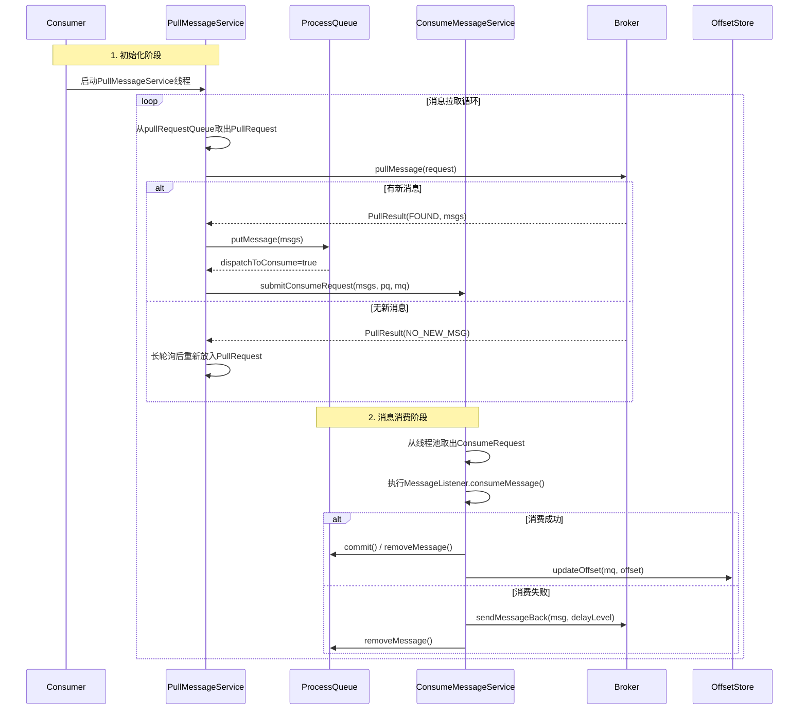

---

## 二、Push vs Pull 模式

> 本节对比 RocketMQ 的两种消费模式，帮助开发者根据业务场景选择合适的消费方式。

> **默认消费模式**：RocketMQ 默认使用 **Push 模式**，通过 `DefaultMQPushConsumer` 实现。Push 模式简单易用，自动管理 Rebalance、位点提交和流控，适合大多数业务场景。

### 2.1 核心架构对比

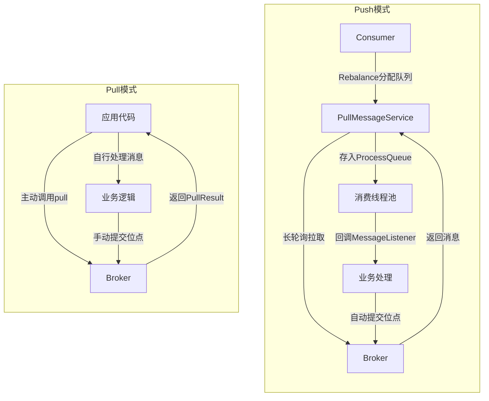

### 2.2 模式特性对比

| 特性 | Pull 模式 | Push 模式 |
| --- | --- | --- |
| 消费方式 | 应用主动拉取 | 后台自动拉取 |
| 消费控制 | 应用完全控制 | 框架自动管理 |
| 实现复杂度 | 较高 | 较低 |
| 流量控制 | 应用自行实现 | 内置流控机制 |
| 位点管理 | 手动管理 | 自动管理 |
| 消息重试 | 无 | 发送回重试队列 |
| 适用场景 | 特殊消费逻辑、批量处理 | 大多数业务场景 |

### 2.3 长轮询机制

> 长轮询是 RocketMQ 实现"伪 Push"效果的核心机制，Broker 端挂起请求等待新消息到达。

RocketMQ 的 Push 模式本质上是 **Pull + 长轮询**：

```plain
┌─────────────────────────────────────────────────────────────────────────────┐
│                          Push 模式实现原理                                   │
├─────────────────────────────────────────────────────────────────────────────┤
│                                                                             │
│  Consumer                           Broker                                   │
│  ┌──────────────┐                  ┌──────────────────────────────────────┐ │
│  │              │  pullRequest     │                                      │ │
│  │              │ ───────────────► │  PullRequestHoldService              │ │
│  │              │                  │  挂起请求，等待新消息                  │ │
│  │   等待响应    │                  │                                      │ │
│  │   (不超时)    │                  │                                      │ │
│  │              │                  │                                      │ │
│  │              │  消息到达立即返回  │                                      │ │
│  │              │ ◄─────────────── │                                      │ │
│  └──────────────┘                  └──────────────────────────────────────┘ │
│                                                                             │
│  长轮询超时: Push模式15秒 / Pull模式20秒 (brokerSuspendMaxTimeMillis)           │
│  实现效果: Consumer 无需频繁轮询，有消息时 Broker 立即推送                     │
└─────────────────────────────────────────────────────────────────────────────┘
```

**Broker 端核心逻辑** ([PullRequestHoldService.java](../../broker/src/main/java/org/apache/rocketmq/broker/longpolling/PullRequestHoldService.java))：

```java
// Broker端挂起拉取请求，将请求加入挂起队列
public void suspendPullRequest(final String topic, final int queueId, 
                               final PullRequest pullRequest) {
    String key = topic + "@" + queueId;
    ManyPullRequest mpr = this.pullRequestTable.get(key);
    if (null == mpr) {
        mpr = new ManyPullRequest();
        this.pullRequestTable.putIfAbsent(key, mpr);
    }
    mpr.addPullRequest(pullRequest);  // 将请求加入挂起队列
}

// 新消息到达时唤醒挂起的请求，立即返回消息给Consumer
public void notifyMessageArriving(final String topic, final int queueId, 
                                  final long maxOffset, final Long tagsCode,
                                  long msgStoreTime, byte[] filterBitMap, 
                                  Map<String, String> properties) {
    String key = this.buildKey(topic, queueId);
    ManyPullRequest mpr = this.pullRequestTable.get(key);
    if (mpr != null) {
        List<PullRequest> requestList = mpr.cloneListAndClear();
        List<PullRequest> replayList = new ArrayList<PullRequest>();
        
        for (PullRequest request : requestList) {
            long newestOffset = maxOffset;
            // 有新消息到达，且消息偏移量大于请求的拉取偏移量
            if (newestOffset > request.getPullFromThisOffset()) {
                // 消息过滤匹配检查
                boolean match = request.getMessageFilter()
                    .isMatchedByConsumeQueue(tagsCode, ...);
                if (match) {
                    // 唤醒请求，重新执行拉取逻辑
                    this.brokerController.getPullMessageProcessor()
                        .executeRequestWhenWakeup(request.getClientChannel(), 
                            request.getRequestCommand());
                    continue;  // 处理完成，继续下一个请求
                }
            }
            // 超时检查：挂起时间超过阈值，也需要唤醒
            if (System.currentTimeMillis() >= 
                (request.getSuspendTimestamp() + request.getTimeoutMillis())) {
                this.brokerController.getPullMessageProcessor()
                    .executeRequestWhenWakeup(request.getClientChannel(), 
                        request.getRequestCommand());
                continue;
            }
            replayList.add(request);  // 未满足条件，重新加入等待队列
        }
        if (!replayList.isEmpty()) {
            mpr.addPullRequest(replayList);
        }
    }
}
```

**长轮询配置参数**：

| 参数 | 默认值 | 说明 |
| --- | --- | --- |
| `longPollingEnable` | true | 是否启用长轮询 |
| `shortPollingTimeMills` | 1000 ms（1s） | 短轮询等待时间（长轮询关闭时生效） |
| `brokerSuspendMaxTimeMillis` | Push: 15000 ms（15s）<br/>Pull: 20000 ms（20s） | Consumer 设置的长轮询最大挂起时间 |
| `consumerTimeoutMillisWhenSuspend` | 30000 ms（30s） | Consumer 超时时间（需大于 brokerSuspendMaxTimeMillis） |

> **源码位置**：`longPollingEnable` 和 `shortPollingTimeMills` 定义于 [BrokerConfig.java](../../common/src/main/java/org/apache/rocketmq/common/BrokerConfig.java)；Push 模式的长轮询超时定义于 [DefaultMQPushConsumerImpl.java](../../client/src/main/java/org/apache/rocketmq/client/impl/consumer/DefaultMQPushConsumerImpl.java)；Pull 模式的 `brokerSuspendMaxTimeMillis` 和 `consumerTimeoutMillisWhenSuspend` 定义于 [DefaultMQPullConsumer.java](../../client/src/main/java/org/apache/rocketmq/client/consumer/DefaultMQPullConsumer.java) 和 [DefaultLitePullConsumer.java](../../client/src/main/java/org/apache/rocketmq/client/consumer/DefaultLitePullConsumer.java)。

### 2.4 API 层面对比

| 对比项 | Push 模式 | Pull 模式 |
| --- | --- | --- |
| **核心类** | `DefaultMQPushConsumer` | `DefaultLitePullConsumer` |
| **消息获取** | 自动拉取 | 应用主动调用 `poll()` |
| **结果类型** | 回调函数 | `PullResult` |
| **消费监听** | `MessageListener` | 无（应用自行处理） |

### 2.5 代码示例对比

**Push 模式**：

```java
// 创建Push消费者，指定消费者组
DefaultMQPushConsumer consumer = new DefaultMQPushConsumer("ConsumerGroup");
consumer.setNamesrvAddr("localhost:9876");  // 设置NameServer地址
consumer.subscribe("TopicTest", "*");        // 订阅Topic，"*"表示订阅所有Tag

// 注册消息监听器，消费消息
consumer.registerMessageListener((msgs, context) -> {
    // 处理消息...
    return ConsumeConcurrentlyStatus.CONSUME_SUCCESS;  // 返回消费成功状态
});
consumer.start();  // 启动消费者
```

**Pull 模式**：

```java
// 创建Pull消费者，指定消费者组
DefaultLitePullConsumer consumer = new DefaultLitePullConsumer("ConsumerGroup");
consumer.setNamesrvAddr("localhost:9876");  // 设置NameServer地址
consumer.start();                           // 启动消费者
consumer.subscribe("TopicTest", "*");       // 订阅Topic

while (running) {
    // 主动拉取消息，最多等待3秒
    List<MessageExt> msgs = consumer.poll(3000);
    for (MessageExt msg : msgs) {
        // 业务处理...
    }
    consumer.commitSync();  // 同步提交消费位点
}
```

### 2.6 模式选择建议

| 场景 | 推荐模式 | 原因 |
| --- | --- | --- |
| **普通业务消费** | Push | 简单易用，自动管理 |
| **批量数据处理** | Pull | 可控制拉取节奏 |
| **需要精确控制位点** | Pull | 手动管理位点 |
| **顺序消息** | Push | 支持顺序消费 |
| **事务消息** | Push | 支持事务消息 |

---

## 三、消费者流控机制

> 流控机制防止消费者过载，通过 ProcessQueue 缓存限制和消费线程池控制实现。

### 3.1 流控层次

RocketMQ 在多个层面实现流控，防止消费者过载。`ProcessQueue` 是消费者端的本地消息缓存 ([ProcessQueue.java](../../client/src/main/java/org/apache/rocketmq/client/impl/consumer/ProcessQueue.java))：

```plain
┌─────────────────────────────────────────────────────────────────────────────┐
│                          消费者流控层次                                      │
├─────────────────────────────────────────────────────────────────────────────┤
│                                                                             │
│  1. ProcessQueue 本地缓存流控                                                │
│  ┌──────────────────────────────────────────────────────────────────────┐  │
│  │  msgCount > 1000  → 暂停拉取，延迟50ms后重试                           │  │
│  │  msgSize > 100MB  → 暂停拉取，延迟50ms后重试                           │  │
│  │  maxSpan > 2000   → 暂停拉取，延迟50ms后重试                           │  │
│  │  （延迟值：PULL_TIME_DELAY_MILLS_WHEN_FLOW_CONTROL = 50ms）            │  │
│  └──────────────────────────────────────────────────────────────────────┘  │
│                                                                             │
│  2. 消费线程池流控                                                           │
│  ┌──────────────────────────────────────────────────────────────────────┐  │
│  │  consumeThreadMin  → 核心线程数（默认20）                              │  │
│  │  consumeThreadMax  → 最大线程数（默认20）                              │  │
│  │  任务队列          → LinkedBlockingQueue（无界）                       │  │
│  └──────────────────────────────────────────────────────────────────────┘  │
│                                                                             │
│  3. Broker 端流控                                                           │
│  ┌──────────────────────────────────────────────────────────────────────┐  │
│  │  pullThresholdForQueue    → 单队列最大缓存消息数（默认1000）            │  │
│  │  pullThresholdSizeForQueue → 单队列最大缓存大小（默认100MB）            │  │
│  └──────────────────────────────────────────────────────────────────────┘  │
│                                                                             │
└─────────────────────────────────────────────────────────────────────────────┘
```

### 3.2 流控配置参数

| 配置项 | 默认值 | 说明 |
| --- | --- | --- |
| `pullThresholdForQueue` | 1000 条 | 单队列最大缓存消息数（Pull 模式） |
| `pullThresholdSizeForQueue` | 100 MB | 单队列最大缓存大小（Pull 模式） |
| `popThresholdForQueue` | 96 条 | 单队列最大等待 ACK 消息数（Pop 模式） |
| `pullThresholdForTopic` | -1 条 | Topic 级别最大缓存消息数（-1 表示不限制） |
| `pullThresholdSizeForTopic` | -1 MB | Topic 级别最大缓存大小（-1 表示不限制） |
| `consumeThreadMin` | 20 个 | 消费线程池核心线程数 |
| `consumeThreadMax` | 20 个 | 消费线程池最大线程数 |
| `consumeConcurrentlyMaxSpan` | 2000 条 | 并发消费最大跨度（首位消息偏移量差） |

> **源码位置**：以上配置项定义于 [DefaultMQPushConsumer.java](../../client/src/main/java/org/apache/rocketmq/client/consumer/DefaultMQPushConsumer.java)。流控延迟值 `PULL_TIME_DELAY_MILLS_WHEN_FLOW_CONTROL = 50ms` 定义于 [DefaultMQPushConsumerImpl.java](../../client/src/main/java/org/apache/rocketmq/client/impl/consumer/DefaultMQPushConsumerImpl.java)。

### 3.3 消费者线程模型

消费者线程模型决定了消息的并发消费方式，包括并发消费和顺序消费两种模式。两种模式共享同一个线程池，但通过不同的锁机制实现不同的消费语义。

#### 3.3.1 并发消费线程模型

`ConsumeMessageConcurrentlyService` 实现并发消费 ([ConsumeMessageConcurrentlyService.java](../../client/src/main/java/org/apache/rocketmq/client/impl/consumer/ConsumeMessageConcurrentlyService.java))：

```plain
┌─────────────────────────────────────────────────────────────────────────────┐
│                        ConsumeMessageConcurrentlyService                    │
├─────────────────────────────────────────────────────────────────────────────┤
│                                                                             │
│  PullRequest ──→ ProcessQueue.msgTreeMap                                    │
│                           │                                                 │
│                           ▼                                                 │
│                  ┌─────────────────────┐                                    │
│                  │  consumeExecutor    │ ← ThreadPoolExecutor              │
│                  │  (线程池)            │   coreSize: consumeThreadMin      │
│                  │                     │   maxSize: consumeThreadMax       │
│                  └─────────────────────┘                                    │
│                    │  │  │  │  │                                            │
│                    ▼  ▼  ▼  ▼  ▼                                            │
│                  ┌──┐┌──┐┌──┐┌──┐┌──┐                                      │
│                  │T1││T2││T3││T4││T5│  ← 多线程并发消费                      │
│                  └──┘└──┘└──┘└──┘└──┘                                      │
│                    │                                                         │
│                    ▼                                                         │
│              MessageListener.consumeMessage()                               │
│                                                                             │
│  特点: 同一ProcessQueue的消息可被多个线程并发消费，不保证消息顺序              │
└─────────────────────────────────────────────────────────────────────────────┘
```

**并发消费核心流程**：

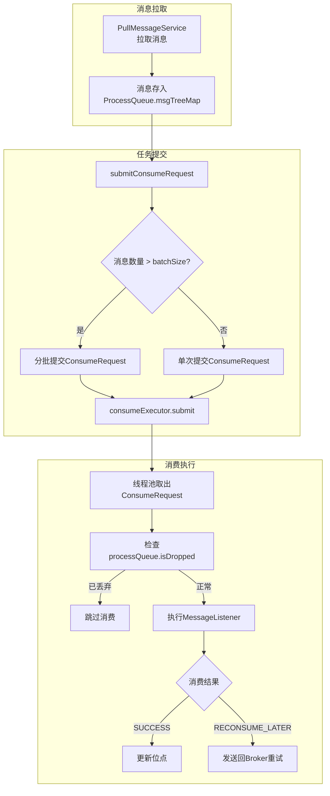

**submitConsumeRequest 方法详解** ([ConsumeMessageConcurrentlyService.java:191](../../client/src/main/java/org/apache/rocketmq/client/impl/consumer/ConsumeMessageConcurrentlyService.java))：

```java
public void submitConsumeRequest(
    final List<MessageExt> msgs,
    final ProcessQueue processQueue,
    final MessageQueue messageQueue,
    final boolean dispatchToConsume) {
    
    final int consumeBatchSize = this.defaultMQPushConsumer.getConsumeMessageBatchMaxSize();
    
    // 情况1: 消息数量 <= 批次大小，直接提交
    if (msgs.size() <= consumeBatchSize) {
        ConsumeRequest consumeRequest = new ConsumeRequest(msgs, processQueue, messageQueue);
        this.consumeExecutor.submit(consumeRequest);
    } 
    // 情况2: 消息数量 > 批次大小，分批提交
    else {
        for (int total = 0; total < msgs.size(); ) {
            List<MessageExt> msgThis = new ArrayList<MessageExt>(consumeBatchSize);
            for (int i = 0; i < consumeBatchSize; i++, total++) {
                if (total < msgs.size()) {
                    msgThis.add(msgs.get(total));
                } else {
                    break;
                }
            }
            ConsumeRequest consumeRequest = new ConsumeRequest(msgThis, processQueue, messageQueue);
            this.consumeExecutor.submit(consumeRequest);
        }
    }
}
```

**ConsumeRequest 消费任务** ([ConsumeMessageConcurrentlyService.java:356](../../client/src/main/java/org/apache/rocketmq/client/impl/consumer/ConsumeMessageConcurrentlyService.java))：

```java
class ConsumeRequest implements Runnable {
    private final List<MessageExt> msgs;
    private final ProcessQueue processQueue;
    private final MessageQueue messageQueue;

    @Override
    public void run() {
        // 1. 检查队列是否已丢弃（Rebalance 移除）
        if (this.processQueue.isDropped()) {
            return;
        }

        // 2. 重置重试消息的 Topic 和命名空间
        defaultMQPushConsumerImpl.resetRetryAndNamespace(msgs, consumerGroup);

        // 3. 执行消费前钩子
        if (hasHook()) {
            executeHookBefore(consumeMessageContext);
        }

        // 4. 执行用户消费逻辑
        long beginTimestamp = System.currentTimeMillis();
        ConsumeConcurrentlyStatus status = listener.consumeMessage(msgs, context);
        long consumeRT = System.currentTimeMillis() - beginTimestamp;

        // 5. 执行消费后钩子
        if (hasHook()) {
            executeHookAfter(consumeMessageContext);
        }

        // 6. 处理消费结果（更新位点或发送重试）
        if (!processQueue.isDropped()) {
            processConsumeResult(status, context, this);
        }
    }
}
```

**并发消费特点**：

| 特性 | 说明 |
|------|------|
| **无队列锁** | 同一 ProcessQueue 的消息可被多个线程并发消费 |
| **批次消费** | 支持一次消费多条消息（`consumeMessageBatchMaxSize`） |
| **无序保证** | 消息消费顺序不保证，适合无顺序要求的场景 |
| **高吞吐** | 充分利用多线程并发能力，最大化消费吞吐量 |

#### 3.3.2 顺序消费线程模型

`ConsumeMessageOrderlyService` 实现顺序消费 ([ConsumeMessageOrderlyService.java](../../client/src/main/java/org/apache/rocketmq/client/impl/consumer/ConsumeMessageOrderlyService.java))：

```plain
┌─────────────────────────────────────────────────────────────────────────────┐
│                        ConsumeMessageOrderlyService                         │
├─────────────────────────────────────────────────────────────────────────────┤
│                                                                             │
│  MessageQueue ──→ MessageQueueLock.fetchLockObject(mq)                      │
│                           │                                                 │
│                           ▼                                                 │
│                    ┌─────────────┐                                          │
│                    │  objLock    │ ← 每个MessageQueue一个锁对象              │
│                    │ (队列锁)     │                                          │
│                    └─────────────┘                                          │
│                           │                                                 │
│         synchronized(objLock)                                               │
│                           │                                                 │
│                           ▼                                                 │
│                  ProcessQueue.consumeLock                                   │
│                           │                                                 │
│                           ▼                                                 │
│              MessageListener.consumeMessage()                               │
│                                                                             │
│  特点: 同一MessageQueue的消息串行消费，不同MessageQueue可并行消费              │
└─────────────────────────────────────────────────────────────────────────────┘
```

**顺序消费核心流程**：

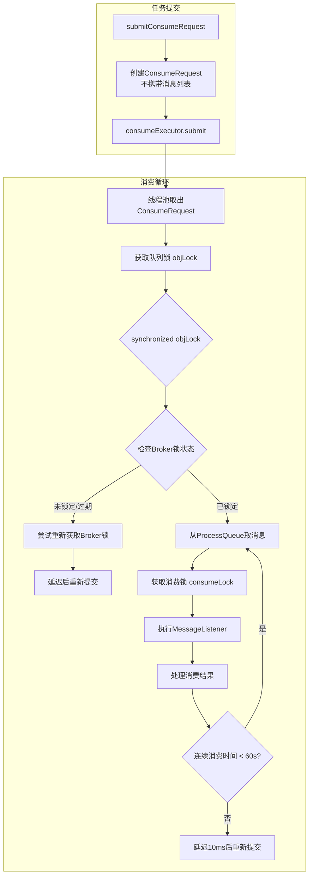

**MessageQueueLock 队列锁实现** ([MessageQueueLock.java](../../client/src/main/java/org/apache/rocketmq/client/impl/consumer/MessageQueueLock.java))：

```java
public class MessageQueueLock {
    // 每个 MessageQueue 对应一个锁对象
    private ConcurrentMap<MessageQueue, ConcurrentMap<Integer, Object>> mqLockTable =
        new ConcurrentHashMap<MessageQueue, ConcurrentMap<Integer, Object>>(32);

    // 获取指定队列的锁对象
    public Object fetchLockObject(final MessageQueue mq, final int shardingKeyIndex) {
        ConcurrentMap<Integer, Object> objMap = this.mqLockTable.get(mq);
        if (null == objMap) {
            objMap = new ConcurrentHashMap<Integer, Object>(32);
            ConcurrentMap<Integer, Object> prevObjMap = this.mqLockTable.putIfAbsent(mq, objMap);
            if (prevObjMap != null) {
                objMap = prevObjMap;
            }
        }

        Object lock = objMap.get(shardingKeyIndex);
        if (null == lock) {
            lock = new Object();
            Object prevLock = objMap.putIfAbsent(shardingKeyIndex, lock);
            if (prevLock != null) {
                lock = prevLock;
            }
        }
        return lock;
    }
}
```

**顺序消费双重锁机制**：

| 锁类型 | 作用范围 | 目的 |
|--------|----------|------|
| **objLock（队列锁）** | MessageQueue 级别 | 保证同一队列的消息串行消费 |
| **consumeLock（消费锁）** | ProcessQueue 级别 | 保护消费过程状态，防止 Rebalance 干扰 |
| **Broker 锁** | Broker 端 | 集群模式下保证同一队列只被一个消费者消费 |

**ConsumeRequest 顺序消费实现** ([ConsumeMessageOrderlyService.java:414](../../client/src/main/java/org/apache/rocketmq/client/impl/consumer/ConsumeMessageOrderlyService.java))：

```java
class ConsumeRequest implements Runnable {
    private final ProcessQueue processQueue;
    private final MessageQueue messageQueue;

    @Override
    public void run() {
        if (this.processQueue.isDropped()) {
            return;
        }

        // 1. 获取队列锁（每个 MessageQueue 一个锁对象）
        final Object objLock = messageQueueLock.fetchLockObject(this.messageQueue);
        
        synchronized (objLock) {
            // 2. 检查 Broker 锁状态（集群模式）
            if (MessageModel.BROADCASTING.equals(messageModel)
                || this.processQueue.isLocked() && !this.processQueue.isLockExpired()) {
                
                final long beginTime = System.currentTimeMillis();
                // 3. 循环消费，直到队列为空或超时
                for (boolean continueConsume = true; continueConsume; ) {
                    
                    // 连续消费时间限制（默认60秒），避免长时间占用线程
                    long interval = System.currentTimeMillis() - beginTime;
                    if (interval > MAX_TIME_CONSUME_CONTINUOUSLY) {
                        submitConsumeRequestLater(processQueue, messageQueue, 10);
                        break;
                    }

                    // 4. 从 ProcessQueue 取消息
                    List<MessageExt> msgs = this.processQueue.takeMessages(consumeBatchSize);
                    
                    if (!msgs.isEmpty()) {
                        try {
                            // 5. 获取消费锁（保护消费过程状态）
                            this.processQueue.getConsumeLock().lock();
                            
                            // 6. 执行用户消费逻辑
                            status = messageListener.consumeMessage(msgs, context);
                        } finally {
                            this.processQueue.getConsumeLock().unlock();
                        }
                        
                        // 7. 处理消费结果
                        continueConsume = processConsumeResult(msgs, status, context, this);
                    } else {
                        continueConsume = false;  // 队列为空，退出循环
                    }
                }
            } else {
                // Broker 锁未获取或已过期，延迟后重试
                tryLockLaterAndReconsume(this.messageQueue, this.processQueue, 10);
            }
        }
    }
}
```

**顺序消费关键配置**：

| 配置项 | 默认值 | 说明 |
|--------|--------|------|
| `MAX_TIME_CONSUME_CONTINUOUSLY` | 60000 ms（60s） | 单次连续消费最大时间，避免长时间占用线程 |
| `REBALANCE_LOCK_MAX_LIVE_TIME` | 30000 ms（30s） | Broker 锁最大存活时间，超时需重新获取 |

**顺序消费特点**：

| 特性 | 说明 |
|------|------|
| **队列级顺序** | 同一 MessageQueue 的消息严格按顺序消费 |
| **跨队列并行** | 不同 MessageQueue 可并行消费，互不影响 |
| **Broker 锁** | 集群模式下需要向 Broker 申请队列锁 |
| **连续消费** | 单次任务可连续消费多条消息，减少锁竞争 |

#### 3.3.3 线程模型对比

| 特性 | 并发消费 | 顺序消费 | 说明 |
| --- | --- | --- | --- |
| 线程池 | 共享线程池 | 共享线程池 | 同一消费者组内所有队列共享线程池 |
| 队列锁 | 无 | MessageQueue 级别 | 顺序消费通过队列锁保证同一队列串行 |
| 消费锁 | 无 | ProcessQueue 级别 | 顺序消费通过消费锁保护消费过程状态 |
| Broker 锁 | 无 | 需要（集群模式） | 顺序消费需向 Broker 申请队列锁 |
| 并行度 | 线程数 | min(队列数, 线程数) | 并发消费受线程数限制，顺序消费额外受队列数限制 |
| 适用场景 | 高吞吐、无顺序要求 | 需要顺序保证 | 根据业务是否需要顺序选择 |

#### 3.3.4 线程池配置

```java
// ConsumeMessageConcurrentlyService / ConsumeMessageOrderlyService 构造函数
this.consumeExecutor = new ThreadPoolExecutor(
    this.defaultMQPushConsumer.getConsumeThreadMin(),    // 核心线程数，默认20个
    this.defaultMQPushConsumer.getConsumeThreadMax(),    // 最大线程数，默认20个
    1000 * 60,                                            // 空闲线程存活时间：60秒
    TimeUnit.MILLISECONDS,
    this.consumeRequestQueue,                             // 任务队列：LinkedBlockingQueue（无界）
    new ThreadFactoryImpl(consumeThreadPrefix));          // 线程名前缀
```

| 配置项 | 默认值 | 说明 |
| --- | --- | --- |
| `consumeThreadMin` | 20 个 | 核心线程数 |
| `consumeThreadMax` | 20 个 | 最大线程数（建议与 min 相同） |
| 任务队列 | LinkedBlockingQueue | 无界队列，可无限堆积任务 |
| 线程存活时间 | 60 s | 非核心线程空闲后的存活时间 |

> **源码位置**：线程池创建于 [ConsumeMessageConcurrentlyService.java](../../client/src/main/java/org/apache/rocketmq/client/impl/consumer/ConsumeMessageConcurrentlyService.java)。

#### 3.3.5 消费可视化案例

**案例一：并发消费场景**

假设 Topic 有 4 个队列（Q0-Q3），消费者配置 3 个消费线程：

```plain
┌─────────────────────────────────────────────────────────────────────────────┐
│                    并发消费 - 多队列多线程场景                                │
├─────────────────────────────────────────────────────────────────────────────┤
│                                                                             │
│  Topic: OrderTopic (4 队列)                                                 │
│  ┌─────────┐ ┌─────────┐ ┌─────────┐ ┌─────────┐                          │
│  │  Q0     │ │  Q1     │ │  Q2     │ │  Q3     │                          │
│  │ [M1,M2] │ │ [M3,M4] │ │ [M5,M6] │ │ [M7,M8] │                          │
│  └────┬────┘ └────┬────┘ └────┬────┘ └────┬────┘                          │
│       │           │           │           │                                │
│       ▼           ▼           ▼           ▼                                │
│  ┌─────────────────────────────────────────────────────┐                   │
│  │              消费线程池 (3 线程)                      │                   │
│  │  ┌───────┐  ┌───────┐  ┌───────┐                    │                   │
│  │  │Thread1│  │Thread2│  │Thread3│                    │                   │
│  │  └───┬───┘  └───┬───┘  └───┬───┘                    │                   │
│  └──────┼──────────┼──────────┼────────────────────────┘                   │
│         │          │          │                                             │
│         ▼          ▼          ▼                                             │
│    ┌─────────┐ ┌─────────┐ ┌─────────┐                                     │
│    │消费 Q0   │ │消费 Q1   │ │消费 Q2   │  ← 并发消费，无顺序保证            │
│    │M1, M2   │ │M3, M4   │ │M5, M6   │                                     │
│    └─────────┘ └─────────┘ └─────────┘                                     │
│                                                                             │
│  消费顺序: M1, M3, M5 可能同时被消费，顺序不确定                             │
│  吞吐量: 高（3 线程并行）                                                    │
└─────────────────────────────────────────────────────────────────────────────┘
```

**关键点**：
- 同一队列的消息可能被不同线程消费（如 Q0 的 M1、M2 可能被 Thread1、Thread2 分别消费）
- 消费顺序不保证，适合无顺序要求的场景
- 吞吐量受线程数限制

**案例二：顺序消费场景**

相同配置，使用顺序消费模式：

```plain
┌─────────────────────────────────────────────────────────────────────────────┐
│                    顺序消费 - 队列锁保证顺序                                  │
├─────────────────────────────────────────────────────────────────────────────┤
│                                                                             │
│  Topic: OrderTopic (4 队列)                                                 │
│  ┌─────────┐ ┌─────────┐ ┌─────────┐ ┌─────────┐                          │
│  │  Q0     │ │  Q1     │ │  Q2     │ │  Q3     │                          │
│  │ [M1,M2] │ │ [M3,M4] │ │ [M5,M6] │ │ [M7,M8] │                          │
│  └────┬────┘ └────┬────┘ └────┬────┘ └────┬────┘                          │
│       │           │           │           │                                │
│       ▼           ▼           ▼           ▼                                │
│  ┌─────────────────────────────────────────────────────┐                   │
│  │              消费线程池 (3 线程)                      │                   │
│  │  ┌───────┐  ┌───────┐  ┌───────┐                    │                   │
│  │  │Thread1│  │Thread2│  │Thread3│                    │                   │
│  │  │ 🔒Q0  │  │ 🔒Q1  │  │ 🔒Q2  │  ← 每线程锁定一个队列  │                   │
│  │  └───┬───┘  └───┬───┘  └───┬───┘                    │                   │
│  └──────┼──────────┼──────────┼────────────────────────┘                   │
│         │          │          │                                             │
│         ▼          ▼          ▼                                             │
│    ┌─────────┐ ┌─────────┐ ┌─────────┐                                     │
│    │消费 Q0   │ │消费 Q1   │ │消费 Q2   │  ← 队列内串行，队列间并行           │
│    │M1 → M2  │ │M3 → M4  │ │M5 → M6  │                                     │
│    └─────────┘ └─────────┘ └─────────┘                                     │
│                                                                             │
│  Q3 等待: 当有线程释放队列锁后，才能消费 Q7, M8                              │
│  消费顺序: Q0 内 M1 → M2 严格有序，Q1 内 M3 → M4 严格有序                    │
│  并行度: min(队列数, 线程数) = min(4, 3) = 3                                │
└─────────────────────────────────────────────────────────────────────────────┘
```

**关键点**：
- 每个队列有独立的锁对象（objLock），保证队列内消息串行消费
- 不同队列可以并行消费，互不影响
- 并行度 = min(队列数, 线程数)，本例中为 3

**案例三：顺序消费 - 订单场景**

订单消息按订单 ID 分片到不同队列，保证同一订单的消息顺序：

```plain
┌─────────────────────────────────────────────────────────────────────────────┐
│                    顺序消费 - 订单消息顺序保证                                │
├─────────────────────────────────────────────────────────────────────────────┤
│                                                                             │
│  订单消息路由规则: queueId = orderId.hashCode() % queueNum                  │
│                                                                             │
│  订单 1001 → Q0    订单 1002 → Q1    订单 1003 → Q2                         │
│                                                                             │
│  Q0 消息流:                     Q1 消息流:                     Q2 消息流:    │
│  ┌─────────────────────┐       ┌─────────────────────┐       ┌───────────┐ │
│  │ 订单1001-创建        │       │ 订单1002-创建        │       │ 订单1003  │ │
│  │ 订单1001-支付        │       │ 订单1002-支付        │       │ -创建     │ │
│  │ 订单1001-发货        │       │ 订单1002-取消        │       │ 订单1003  │ │
│  └──────────┬──────────┘       └──────────┬──────────┘       │ -发货     │ │
│             │                             │                  └─────┬─────┘ │
│             ▼                             ▼                        ▼       │
│       Thread1 消费                  Thread2 消费              Thread3 消费 │
│       (严格顺序)                    (严格顺序)                (严格顺序)   │
│                                                                             │
│  ✅ 订单1001: 创建 → 支付 → 发货 (顺序正确)                                  │
│  ✅ 订单1002: 创建 → 支付 → 取消 (顺序正确)                                  │
│  ✅ 订单1003: 创建 → 发货 (顺序正确)                                         │
│                                                                             │
│  不同订单的消息可以并行处理，同一订单的消息严格按顺序处理                      │
└─────────────────────────────────────────────────────────────────────────────┘
```

**配置建议**：

| 场景 | consumeThreadMin | consumeThreadMax | 说明 |
|------|------------------|------------------|------|
| 并发消费 - CPU 密集型 | CPU 核心数 + 1 | CPU 核心数 + 1 | 避免过多线程竞争 CPU |
| 并发消费 - IO 密集型 | 2 × CPU 核心数 | 4 × CPU 核心数 | 充分利用 IO 等待时间 |
| 顺序消费 | 队列数 | 队列数 | 线程数 ≥ 队列数才能充分利用并行 |
| 顺序消费 - 高吞吐 | 2 × 队列数 | 2 × 队列数 | 预留线程处理等待锁的情况 |

**注意事项**：

1. **线程数设置**：建议将 `consumeThreadMin` 和 `consumeThreadMax` 设置为相同值，避免线程动态创建/销毁的开销
2. **顺序消费并行度**：顺序消费的并行度受队列数限制，增加线程数不会超过队列数
3. **任务队列无界**：`LinkedBlockingQueue` 是无界队列，任务过多时可能导致内存溢出
4. **消费超时**：消费超时只是标记 `TIME_OUT`，不会中断正在执行的线程

---

## 四、位点管理

> 位点（Offset）记录消费者的消费进度，集群模式存储在 Broker 端，广播模式存储在消费者本地。位点管理是消息可靠消费的关键，确保消费者重启后能从正确的位置继续消费。

### 4.1 位点管理架构

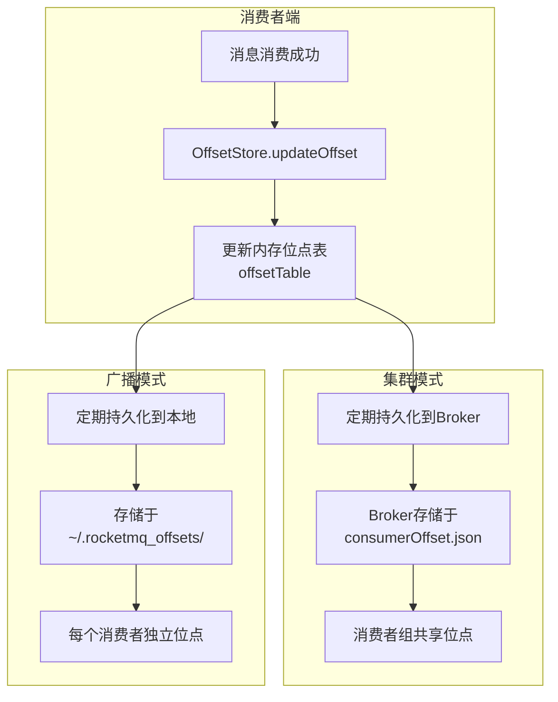

### 4.2 OffsetStore 接口

`OffsetStore` 是消费位点管理的核心接口 ([OffsetStore.java](../../client/src/main/java/org/apache/rocketmq/client/consumer/store/OffsetStore.java))：

```java
public interface OffsetStore {
    void load() throws MQClientException;                    // 加载位点
    void updateOffset(MessageQueue mq, long offset,          // 更新位点（内存）
                      boolean increaseOnly);
    long readOffset(MessageQueue mq, ReadOffsetType type);   // 读取位点
    void persistAll(Set<MessageQueue> mqs);                  // 持久化所有位点
    void persist(MessageQueue mq);                           // 持久化单个位点
    void removeOffset(MessageQueue mq);                      // 移除位点
}
```

> **位点持久化间隔**：默认 5 秒，由 `persistConsumerOffsetInterval` 配置，定义于 [ClientConfig.java](../../client/src/main/java/org/apache/rocketmq/client/ClientConfig.java)。

### 4.3 两种实现类对比

| 实现类 | 存储位置 | 适用模式 | 持久化方式 |
| --- | --- | --- | --- |
| `RemoteBrokerOffsetStore` | Broker 端 | 集群模式 | 通过网络请求同步到 Broker |
| `LocalFileOffsetStore` | 消费者本地 | 广播模式 | 写入本地 JSON 文件 |

### 4.4 集群模式位点管理

`RemoteBrokerOffsetStore` 是集群模式的位点存储实现 ([RemoteBrokerOffsetStore.java](../../client/src/main/java/org/apache/rocketmq/client/consumer/store/RemoteBrokerOffsetStore.java))：

```java
public class RemoteBrokerOffsetStore implements OffsetStore {
    private ConcurrentMap<MessageQueue, AtomicLong> offsetTable = new ConcurrentHashMap<>();
    
    @Override
    public void updateOffset(MessageQueue mq, long offset, boolean increaseOnly) {
        AtomicLong offsetOld = this.offsetTable.get(mq);
        if (null == offsetOld) {
            offsetOld = this.offsetTable.putIfAbsent(mq, new AtomicLong(offset));
        }
        if (null != offsetOld) {
            if (increaseOnly) {
                MixAll.compareAndIncreaseOnly(offsetOld, offset);  // 只增不减
            } else {
                offsetOld.set(offset);
            }
        }
    }
}
```

**Consumer 本地位点存储特性**：

| 存储位置 | 集群模式 | 广播模式 |
| --- | --- | --- |
| **Consumer 内存** | ✅ `offsetTable` 缓存 | ✅ `offsetTable` 缓存 |
| **Consumer 本地文件** | ❌ 不写入 | ✅ 写入 `~/.rocketmq_offsets/` |
| **Broker 文件** | ✅ `consumerOffset.json` | ❌ 不存储 |

集群模式下 Consumer 本地位点**仅存于内存**，原因：

1. **位点共享需求**：消费者组共享消费进度，必须集中存储在 Broker
2. **故障转移支持**：消费者宕机后，其他消费者可从 Broker 获取位点继续消费
3. **`load()` 空实现**：`RemoteBrokerOffsetStore.load()` 方法为空，不加载任何本地文件

**位点流转过程**：

```
Consumer 内存                    Broker 文件
┌─────────────────┐              ┌─────────────────────────┐
│ offsetTable     │              │ consumerOffset.json     │
│ (ConcurrentMap) │              │                         │
│                 │   persist()  │ topic@group:            │
│ mq → offset     │ ───────────► │   queueId → offset      │
│                 │   网络请求    │                         │
└─────────────────┘              └─────────────────────────┘
      ↑                                    │
      │           重启后从 Broker 拉取      │
      └────────────────────────────────────┘
```

### 4.5 Broker 端位点存储

Broker 端通过 `ConsumerOffsetManager` 管理消费位点 ([ConsumerOffsetManager.java](../../broker/src/main/java/org/apache/rocketmq/broker/offset/ConsumerOffsetManager.java))：

```java
public class ConsumerOffsetManager extends ConfigManager {
    // 位点表：key = "topic@group", value = {queueId: offset}
    private ConcurrentMap<String/* topic@group */, 
                          ConcurrentMap<Integer/* queueId */, Long/* offset */>> offsetTable;
}
```

> **存储路径**：`{storePathRootDir}/config/consumerOffset.json`

> **位点持久化**：Broker 端位点定期持久化到 `consumerOffset.json` 文件，确保 Broker 重启后位点不丢失。

---

## 五、Rebalance 机制

> Rebalance（重平衡）负责消费者组内的队列重新分配，确保每个队列只被一个消费者消费。Rebalance 是实现消费者负载均衡和高可用的核心机制。

`RebalanceService` 负责消费者组的队列重新分配 ([RebalanceService.java](../../client/src/main/java/org/apache/rocketmq/client/impl/consumer/RebalanceService.java))。

### 5.1 Rebalance 流程

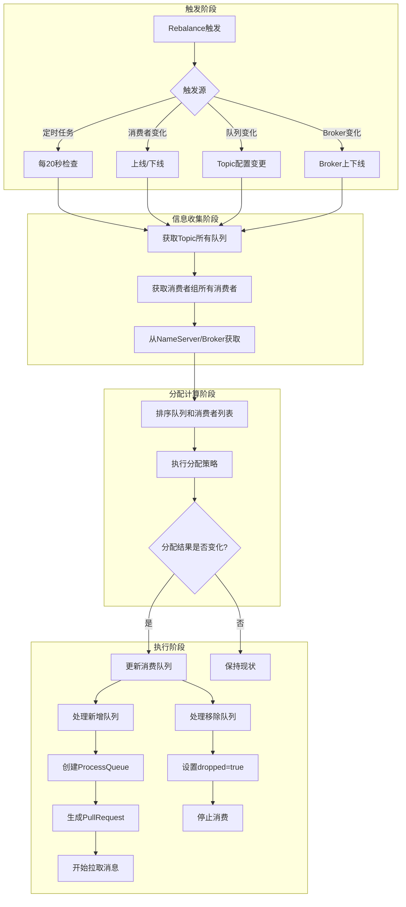

### 5.2 队列分配策略

RocketMQ 提供多种分配策略，通过 `AllocateMessageQueueStrategy` 接口实现：

| 策略 | 名称 | 说明 |
| --- | --- | --- |
| `AllocateMessageQueueAveragely` | AVG | **默认策略**，平均分配，连续分配 |
| `AllocateMessageQueueAveragelyByCircle` | AVG_BY_CIRCLE | 环形平均分配，间隔分配 |
| `AllocateMessageQueueConsistentHash` | CONSISTENT_HASH | 一致性哈希，减少 Rebalance 影响范围 |
| `AllocateMessageQueueByMachineRoom` | MACHINE_ROOM | 机房就近分配（简单过滤模式） |
| `AllocateMachineRoomNearby` | MACHINE_ROOM_NEARBY | 机房就近分配（代理模式，支持容错） |
| `AllocateMessageQueueByConfig` | CONFIG | 按配置固定分配 |

#### 5.2.1 平均分配（默认）

**平均分配策略** ([AllocateMessageQueueAveragely.java](../../client/src/main/java/org/apache/rocketmq/client/consumer/rebalance/AllocateMessageQueueAveragely.java)):

```java
public List<MessageQueue> allocate(String consumerGroup,    // 消费者组名
    String currentCID,                                     // 当前消费者客户端ID
    List<MessageQueue> mqAll,                              // 该 Topic 所有队列（已排序）
    List<String> cidAll) {                                 // 该消费者组所有消费者ID（已排序）
    
    List<MessageQueue> result = new ArrayList<>();
    int index = cidAll.indexOf(currentCID);       // 当前消费者在列表中的索引
    int mod = mqAll.size() % cidAll.size();       // 队列数 % 消费者数 = 余数
    
    // 计算当前消费者分配的队列数量
    int averageSize = mqAll.size() <= cidAll.size() ? 1 : 
        (mod > 0 && index < mod ? mqAll.size() / cidAll.size() + 1 : 
         mqAll.size() / cidAll.size());
    
    // 计算当前消费者分配的队列起始索引
    int startIndex = (mod > 0 && index < mod) ? 
        index * averageSize : index * averageSize + mod;
    
    // 分配队列
    int range = Math.min(averageSize, mqAll.size() - startIndex);
    for (int i = 0; i < range; i++) {
        result.add(mqAll.get((startIndex + i) % mqAll.size()));
    }
    return result;
}
```

#### 5.2.2 环形分配

**环形分配策略** ([AllocateMessageQueueAveragelyByCircle.java](../../client/src/main/java/org/apache/rocketmq/client/consumer/rebalance/AllocateMessageQueueAveragelyByCircle.java)):

```java
public List<MessageQueue> allocate(String consumerGroup, String currentCID, 
    List<MessageQueue> mqAll, List<String> cidAll) {
    
    List<MessageQueue> result = new ArrayList<>();
    int index = cidAll.indexOf(currentCID);
    
    // 间隔分配：每个消费者取 index, index+n, index+2n... 位置的队列
    for (int i = index; i < mqAll.size(); i++) {
        if (i % cidAll.size() == index) {
            result.add(mqAll.get(i));
        }
    }
    return result;
}
```

**两种策略对比**（8 队列，3 消费者）：

| 策略 | C0 | C1 | C2 |
| --- | --- | --- | --- |
| AVG（连续） | Q0, Q1, Q2 | Q3, Q4, Q5 | Q6, Q7 |
| AVG_BY_CIRCLE（间隔） | Q0, Q3, Q6 | Q1, Q4, Q7 | Q2, Q5 |

#### 5.2.3 一致性哈希分配

**一致性哈希策略** ([AllocateMessageQueueConsistentHash.java](../../client/src/main/java/org/apache/rocketmq/client/consumer/rebalance/AllocateMessageQueueConsistentHash.java)):

```java
public AllocateMessageQueueConsistentHash() {
    this(10);  // 默认 10 个虚拟节点
}

public List<MessageQueue> allocate(...) {
    // 构建一致性哈希环
    Collection<ClientNode> cidNodes = new ArrayList<>();
    for (String cid : cidAll) {
        cidNodes.add(new ClientNode(cid));
    }
    ConsistentHashRouter<ClientNode> router = new ConsistentHashRouter<>(cidNodes, virtualNodeCnt);
    
    // 每个队列路由到对应的消费者
    for (MessageQueue mq : mqAll) {
        ClientNode clientNode = router.routeNode(mq.toString());
        if (clientNode.getClientId().equals(currentCID)) {
            result.add(mq);
        }
    }
}
```

**优势**：消费者上下线时，只影响相邻节点的队列分配，减少 Rebalance 影响范围。

#### 5.2.4 机房分配策略

RocketMQ 提供两种机房相关的分配策略：

| 策略 | 名称 | 说明 |
| --- | --- | --- |
| `AllocateMessageQueueByMachineRoom` | MACHINE_ROOM | 简单过滤，只分配指定机房的队列 |
| `AllocateMachineRoomNearby` | MACHINE_ROOM_NEARBY | 代理模式，支持自定义底层策略和容错机制 |

**两者核心区别**：

| 特性 | MACHINE_ROOM | MACHINE_ROOM_NEARBY |
| --- | --- | --- |
| 设计模式 | 独立策略 | **代理模式**（包装其他策略） |
| 底层策略 | 固定平均分配 | **可指定**（AVG、CONSISTENT_HASH 等） |
| 机房解析 | 固定格式：`brokerName` 按 `@` 分割 | **自定义接口** `MachineRoomResolver` |
| 容错机制 | 无 | 有（无消费者机房的队列会被共享） |

**AllocateMessageQueueByMachineRoom** ([AllocateMessageQueueByMachineRoom.java](../../client/src/main/java/org/apache/rocketmq/client/consumer/rebalance/AllocateMessageQueueByMachineRoom.java)):

```java
// 只分配指定机房的队列
// brokerName 格式必须为：机房@broker名，如 "room1@broker-a"
private Set<String> consumeridcs;  // 配置消费者所属机房

public List<MessageQueue> allocate(...) {
    List<MessageQueue> premqAll = new ArrayList<>();
    for (MessageQueue mq : mqAll) {
        String[] temp = mq.getBrokerName().split("@");
        // 只保留属于指定机房的队列
        if (temp.length == 2 && consumeridcs.contains(temp[0])) {
            premqAll.add(mq);
        }
    }
    // 对过滤后的队列进行平均分配...
}
```

**AllocateMachineRoomNearby** ([AllocateMachineRoomNearby.java](../../client/src/main/java/org/apache/rocketmq/client/consumer/rebalance/AllocateMachineRoomNearby.java)):

```java
// 可包装任意底层策略
private final AllocateMessageQueueStrategy allocateMessageQueueStrategy;

// 自定义机房解析接口
public interface MachineRoomResolver {
    String brokerDeployIn(MessageQueue messageQueue);  // Broker 所属机房
    String consumerDeployIn(String clientID);          // Consumer 所属机房
}

public List<MessageQueue> allocate(...) {
    // 1. 按机房分组队列和消费者
    Map<String, List<MessageQueue>> mr2Mq = groupByMachineRoom(mqAll);
    Map<String, List<String>> mr2c = groupByMachineRoom(cidAll);
    
    // 2. 优先分配同机房队列给同机房消费者
    String currentMachineRoom = machineRoomResolver.consumerDeployIn(currentCID);
    List<MessageQueue> mqInThisMachineRoom = mr2Mq.get(currentMachineRoom);
    List<String> consumerInThisMachineRoom = mr2c.get(currentMachineRoom);
    result.addAll(allocateMessageQueueStrategy.allocate(
        consumerGroup, currentCID, mqInThisMachineRoom, consumerInThisMachineRoom));
    
    // 3. 无消费者机房的队列被所有消费者共享（容错机制）
    for (Entry<String, List<MessageQueue>> entry : mr2Mq.entrySet()) {
        if (!mr2c.containsKey(entry.getKey())) {
            result.addAll(allocateMessageQueueStrategy.allocate(
                consumerGroup, currentCID, entry.getValue(), cidAll));
        }
    }
}
```

**使用场景**：

| 场景 | 推荐策略 |
| --- | --- |
| Broker 名称格式固定为 `机房@broker` | `AllocateMessageQueueByMachineRoom` |
| 需要自定义机房解析逻辑 | `AllocateMachineRoomNearby` |
| 需要结合一致性哈希等策略 | `AllocateMachineRoomNearby` |
| 机房可能临时无消费者 | `AllocateMachineRoomNearby` |

#### 5.2.5 配置固定分配

**配置固定分配策略** ([AllocateMessageQueueByConfig.java](../../client/src/main/java/org/apache/rocketmq/client/consumer/rebalance/AllocateMessageQueueByConfig.java)):

```java
public class AllocateMessageQueueByConfig extends AbstractAllocateMessageQueueStrategy {
    private List<MessageQueue> messageQueueList;  // 预先配置的队列列表
    
    @Override
    public List<MessageQueue> allocate(...) {
        return this.messageQueueList;  // 直接返回配置的队列
    }
}
```

**使用场景**：需要手动指定消费者消费哪些队列，适用于特殊业务场景。

```java
List<MessageQueue> assignedQueues = new ArrayList<>();
assignedQueues.add(new MessageQueue("TopicTest", "BrokerA", 0));
assignedQueues.add(new MessageQueue("TopicTest", "BrokerA", 1));

AllocateMessageQueueByConfig strategy = new AllocateMessageQueueByConfig();
strategy.setMessageQueueList(assignedQueues);
consumer.setAllocateMessageQueueStrategy(strategy);
```

#### 5.2.6 同机房就近消费实践

通过机房分配策略实现**同机房就近消费**，可显著减少跨机房网络耗时。

**架构示意**：

```plain
┌─────────────────────────────────────────────────────────────────┐
│                        Consumer Group                           │
├─────────────────────────────────────────────────────────────────┤
│  ┌─────────────────┐              ┌─────────────────┐          │
│  │  机房A消费者      │              │  机房B消费者      │          │
│  │  Consumer-A1    │              │  Consumer-B1    │          │
│  │  Consumer-A2    │              │  Consumer-B2    │          │
│  └────────┬────────┘              └────────┬────────┘          │
│           │                                │                    │
│           ▼                                ▼                    │
│  ┌─────────────────┐              ┌─────────────────┐          │
│  │  机房A Broker    │              │  机房B Broker    │          │
│  │  Broker-A1      │              │  Broker-B1      │          │
│  │  Broker-A2      │              │  Broker-B2      │          │
│  └─────────────────┘              └─────────────────┘          │
│                                                                 │
│  ✅ 同机房消费，网络延迟 < 1ms      ✅ 同机房消费，网络延迟 < 1ms    │
│  ❌ 避免跨机房消费（延迟 10-50ms）                                  │
└─────────────────────────────────────────────────────────────────┘
```

**配置示例**：

```java
DefaultMQPushConsumer consumer = new DefaultMQPushConsumer("consumer_group");

// 使用 AllocateMachineRoomNearby（推荐）
consumer.setAllocateMessageQueueStrategy(
    new AllocateMachineRoomNearby(
        new AllocateMessageQueueAveragely(),  // 底层分配策略
        new MachineRoomResolver() {
            @Override
            public String brokerDeployIn(MessageQueue mq) {
                // 从 brokerName 解析机房，如 "room_a-broker-01" -> "room_a"
                return mq.getBrokerName().split("-")[0];
            }
            
            @Override
            public String consumerDeployIn(String clientId) {
                // 从 clientId 解析机房
                return clientId.split("-")[0];
            }
        }
    )
);
```

**关键配置要点**：

| 配置项 | 说明 |
|--------|------|
| **brokerName 命名规范** | 需包含机房标识，如 `room_a-broker-01` |
| **clientId 命名规范** | 需包含机房标识，如 `room_a-consumer-192.168.1.1` |
| **MachineRoomResolver** | 自定义解析逻辑，从 brokerName/clientId 提取机房标识 |

**性能收益**：

| 场景 | 跨机房延迟 | 同机房延迟 | 收益 |
|------|-----------|-----------|------|
| 同城双机房 | 1-5ms | < 0.5ms | **50%-90%** |
| 跨地域机房 | 20-100ms | < 1ms | **95%+** |

**注意事项**：

1. **容灾考虑**：机房A消费者全部宕机时，机房A消息将无人消费（除非配置容错策略）
2. **Broker 部署**：确保每个机房都有完整的 Broker 集群
3. **推荐 `AllocateMachineRoomNearby`**：支持容错机制，无消费者机房的队列会被其他机房共享

### 5.3 分配示例

```plain
假设: 8个队列(Q0-Q7), 3个消费者(C0-C1-C2)

队列列表: [Q0, Q1, Q2, Q3, Q4, Q5, Q6, Q7]
消费者列表: [C0, C1, C2]

分配结果:
- C0: [Q0, Q1, Q2]    (3个队列)
- C1: [Q3, Q4, Q5]    (3个队列)
- C2: [Q6, Q7]        (2个队列)

计算过程:
- mod = 8 % 3 = 2
- C0(index=0): averageSize=3, startIndex=0, range=3 → [Q0,Q1,Q2]
- C1(index=1): averageSize=3, startIndex=3, range=3 → [Q3,Q4,Q5]
- C2(index=2): averageSize=2, startIndex=6, range=2 → [Q6,Q7]
```

### 5.4 Rebalance 触发条件

| 触发条件 | 描述 | 处理方式 |
| --- | --- | --- |
| 消费者上线 | 新消费者加入消费者组 | 重新分配队列 |
| 消费者下线 | 消费者宕机或主动退出 | 将其队列分配给其他消费者 |
| Topic 队列变化 | Topic 的读写队列数发生变化 | 重新分配队列 |
| Broker 变化 | Broker 上线或下线 | 更新路由信息，重新分配 |
| 定时触发 | 默认每 20 秒检查一次 | 检测变化并触发 Rebalance |

> **Rebalance 间隔配置**：默认 20 秒，由 `rocketmq.client.rebalance.waitInterval` 系统属性配置，定义于 [RebalanceService.java](../../client/src/main/java/org/apache/rocketmq/client/impl/consumer/RebalanceService.java)。

> **OFFSET_ILLEGAL 与 Rebalance 的关系**：OFFSET_ILLEGAL **不会主动触发 Rebalance**，而是通过 `removeProcessQueue(mq)` 移除队列后，等待定时 Rebalance（最多 20 秒）时恢复消费。

### 5.5 变化感知机制

#### 5.5.1 消费者变化感知（实时）

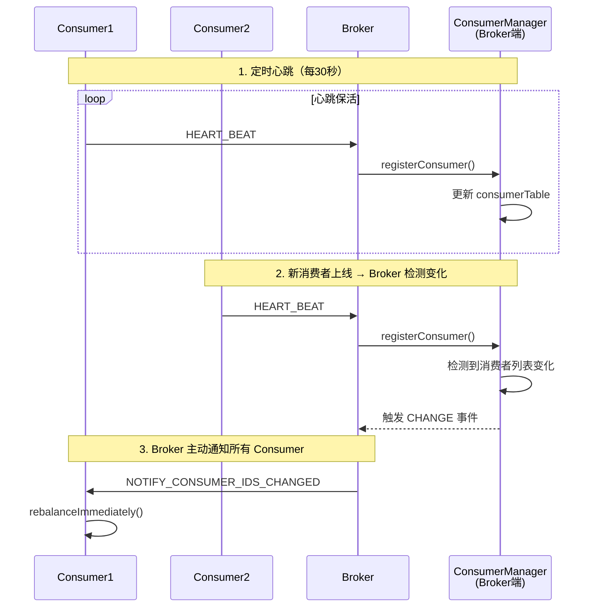

**核心组件**（Broker 端）：

| 组件 | 作用 |
| --- | --- |
| `ConsumerManager` | 维护消费者组信息，检测变化 |
| `DefaultConsumerIdsChangeListener` | 消费者变化事件监听，触发通知 |
| `Broker2Client` | 向 Consumer 发送 `NOTIFY_CONSUMER_IDS_CHANGED` |

#### 5.5.2 队列/Broker 变化感知（定时）

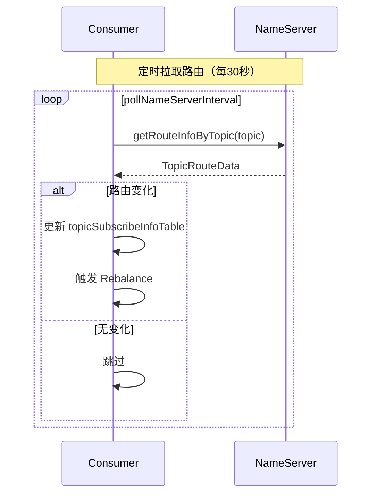

#### 5.5.3 感知机制总结

| 变化类型 | 感知方式 | 感知延迟 | 触发方式 |
| --- | --- | --- | --- |
| 消费者上线/下线 | Broker 主动通知 | **实时** | `rebalanceImmediately()` |
| 队列数量变化 | 定时拉取 NameServer | 最多 **30 秒** | 路由变化触发 |
| Broker 上下线 | 定时拉取 NameServer | 最多 **30 秒** | 路由变化触发 |
| 定时检查兜底 | RebalanceService | 最多 **20 秒** | 定时触发 |

> **配置参数**：
> - `heartbeatBrokerInterval`：心跳间隔，默认 30 秒
> - `pollNameServerInterval`：路由拉取间隔，默认 30 秒
> - `rocketmq.client.rebalance.waitInterval`：Rebalance 间隔，默认 20 秒
> - `REBALANCE_LOCK_MAX_LIVE_TIME`：顺序消费队列锁最大存活时间，默认 30 秒，定义于 [ProcessQueue.java](../../client/src/main/java/org/apache/rocketmq/client/impl/consumer/ProcessQueue.java)

### 5.6 订阅信息存储

RebalanceImpl 维护了消费者订阅的核心数据结构：

```java
// RebalanceImpl.java
public abstract class RebalanceImpl {
    // 订阅信息表：Topic -> SubscriptionData
    protected final ConcurrentMap<String /* topic */, SubscriptionData> subscriptionInner =
        new ConcurrentHashMap<String, SubscriptionData>();
    
    // Topic 队列信息表：Topic -> Set<MessageQueue>
    protected final ConcurrentMap<String/* topic */, Set<MessageQueue>> topicSubscribeInfoTable =
        new ConcurrentHashMap<String, Set<MessageQueue>>();
    
    // 处理队列表：MessageQueue -> ProcessQueue
    protected final ConcurrentMap<MessageQueue, ProcessQueue> processQueueTable = 
        new ConcurrentHashMap<MessageQueue, ProcessQueue>(64);
}
```

> **Consumer 路由缓存详解**：Consumer 的 `topicSubscribeInfoTable` 与 Producer 的 `topicPublishInfoTable` 都源自 `MQClientInstance.topicRouteTable`，详见 [消息发送篇 - Client 元数据管理](./03-消息发送篇.md#十一client-元数据管理)

---

## 六、消费失败处理

> 集群模式下消费失败的消息会进入重试队列，达到最大重试次数后进入死信队列。消息重试机制是保证消息最终被成功消费的重要保障。

### 6.1 消费失败流程

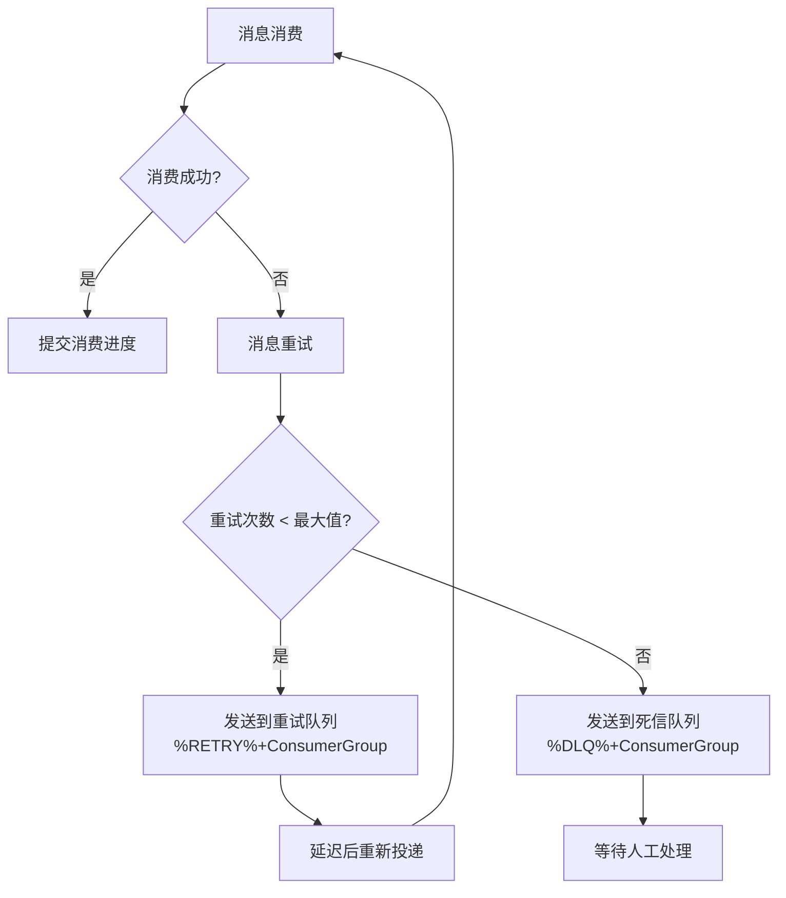

**消费状态枚举**：

| 消费模式 | 状态枚举 | 说明 |
| --- | --- | --- |
| 并发消费 | `CONSUME_SUCCESS` | 消费成功，更新位点 |
| 并发消费 | `RECONSUME_LATER` | 消费失败，稍后重试 |
| 顺序消费 | `SUCCESS` | 消费成功，更新位点 |
| 顺序消费 | `SUSPEND_CURRENT_QUEUE_A_MOMENT` | 消费失败，挂起队列片刻后重试 |
| 顺序消费 | `ROLLBACK` | 回滚（已废弃，仅用于 binlog 消费） |
| 顺序消费 | `COMMIT` | 提交（已废弃，仅用于 binlog 消费） |

> **源码位置**：并发消费状态定义于 [ConsumeConcurrentlyStatus.java](../../client/src/main/java/org/apache/rocketmq/client/consumer/listener/ConsumeConcurrentlyStatus.java)；顺序消费状态定义于 [ConsumeOrderlyStatus.java](../../client/src/main/java/org/apache/rocketmq/client/consumer/listener/ConsumeOrderlyStatus.java)。

### 6.2 重试延迟级别

消费失败的消息会自动进入延迟重试队列，延迟级别与重试次数相关：

| 重试次数 | 延迟级别 | 延迟时间 |
| --- | --- | --- |
| 1 | 4 | 30s |
| 2 | 5 | 1m |
| 3 | 6 | 2m |
| 4 | 7 | 3m |
| 5 | 8 | 4m |
| 6 | 9 | 5m |
| 7 | 10 | 6m |
| 8 | 11 | 7m |
| 9 | 12 | 8m |
| 10 | 13 | 9m |
| 11 | 14 | 10m |
| 12 | 15 | 20m |
| 13 | 16 | 30m |
| 14 | 17 | 1h |
| 15 | 18 | 2h |
| 16 | - | 进入死信队列 |

> **延迟级别说明**：RocketMQ 默认延迟级别为 `1s 5s 10s 30s 1m 2m 3m 4m 5m 6m 7m 8m 9m 10m 20m 30m 1h 2h`（共 18 级），定义于 [MessageStoreConfig.java](../../store/src/main/java/org/apache/rocketmq/store/config/MessageStoreConfig.java)。消费重试从级别 4（30s）开始递增。

### 6.3 重试消息生成流程

**核心源码** ([AbstractSendMessageProcessor.java](../../broker/src/main/java/org/apache/rocketmq/broker/processor/AbstractSendMessageProcessor.java))：

```java
// Broker 处理消费失败消息
public RemotingCommand processRequest(ChannelHandlerContext ctx, RemotingCommand request) {
    // 从原始 offset 获取消息
    MessageExt msgExt = currentBroker.getMessageStore().lookMessageByOffset(requestHeader.getOffset());
    
    // 判断是否进入死信队列
    if (msgExt.getReconsumeTimes() >= maxReconsumeTimes || delayLevel < 0) {
        newTopic = MixAll.getDLQTopic(requestHeader.getGroup());  // 进入死信队列
        queueIdInt = randomQueueId(DLQ_NUMS_PER_GROUP);
    } else {
        if (0 == delayLevel) {
            delayLevel = 3 + msgExt.getReconsumeTimes();  // 计算延迟级别
        }
        msgExt.setDelayTimeLevel(delayLevel);
    }
    
    // 创建新的重试消息并存储到 CommitLog
    MessageExtBrokerInner msgInner = new MessageExtBrokerInner();
    msgInner.setTopic(newTopic);
    msgInner.setReconsumeTimes(msgExt.getReconsumeTimes() + 1);
    // ...
    PutMessageResult putMessageResult = masterBroker.getMessageStore().putMessage(msgInner);
}
```

**重试消息特点**：

| 问题 | 答案 |
| --- | --- | 
| 消费重试是否生成新消息？ | **是**，每次重试都生成一条全新的消息 |
| 多次重试是否生成多条消息？ | **是**，每次重试都会在 CommitLog 中写入新消息 |
| MsgId 是否变化？ | **是**，每次重试生成新的 MsgId |
| commitLogOffset 是否变化？ | **是**，每次重试占用新的物理空间 |
| reconsumeTimes 如何变化？ | 每次重试 +1，存储在消息属性中 |

### 6.4 重试队列的消费者分配

**Consumer 自动订阅重试队列** ([DefaultMQPushConsumerImpl.java](../../client/src/main/java/org/apache/rocketmq/client/impl/consumer/DefaultMQPushConsumerImpl.java))：

```java
private void copySubscription() throws MQClientException {
    // ... 订阅业务 Topic ...
    
    // 集群模式下，自动订阅重试队列
    switch (this.defaultMQPushConsumer.getMessageModel()) {
        case CLUSTERING:
            final String retryTopic = MixAll.getRetryTopic(this.defaultMQPushConsumer.getConsumerGroup());
            SubscriptionData subscriptionData = FilterAPI.buildSubscriptionData(retryTopic, SubscriptionData.SUB_ALL);
            this.rebalanceImpl.getSubscriptionInner().put(retryTopic, subscriptionData);
            break;
    }
}
```

**重试队列分配流程**：

重试队列与业务 Topic 在**同一个 Rebalance 流程**中独立分配：

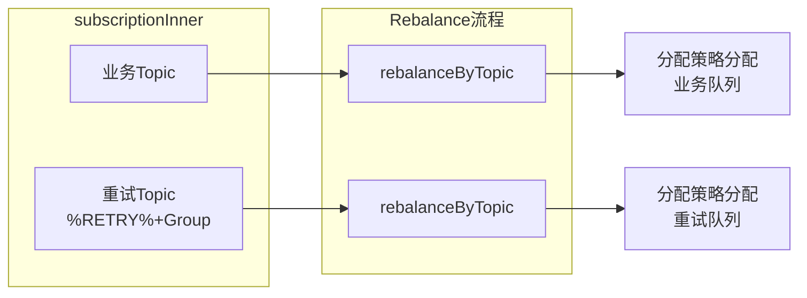

**重试队列特点**：

| 特点 | 说明 |
| --- | --- |
| **自动创建** | Broker 自动为每个 ConsumerGroup 创建重试 Topic |
| **队列数量** | 默认 1 个队列，保证顺序消费 |
| **自动订阅** | Consumer 启动时自动订阅对应的重试队列 |
| **Topic 隔离** | 不同 ConsumerGroup 的重试消息相互隔离 |
| **延迟递增** | 每次重试延迟时间递增，避免频繁重试 |

**多消费者实例场景**：

当 ConsumerGroup 有多个 Consumer 实例时：

| 场景 | 业务 Topic（4 队列） | 重试队列（默认 1 队列） |
| --- | --- | --- |
| Pod1 | Queue0, Queue1 | Queue0 ✅ |
| Pod2 | Queue2 | 无 ❌ |
| Pod3 | Queue3 | 无 ❌ |

**解决方案**：增加重试队列数量

```bash
# 将重试队列数量增加到 3
mqadmin updateSubGroup -c DefaultCluster -g <ConsumerGroup> -q 3
```

### 6.5 广播模式消费失败

广播模式不支持消息重试，消费失败的消息直接丢弃：

```java
// ConsumeMessageConcurrentlyService.processConsumeResult()
switch (this.defaultMQPushConsumer.getMessageModel()) {
    case BROADCASTING:
        // 广播模式：消费失败的消息直接丢弃
        for (int i = ackIndex + 1; i < msgs.size(); i++) {
            MessageExt msg = msgs.get(i);
            log.warn("BROADCASTING, the message consume failed, drop it, {}", msg.toString());
        }
        break;
    case CLUSTERING:
        // 集群模式：发送回Broker重试队列
        for (int i = ackIndex + 1; i < msgs.size(); i++) {
            MessageExt msg = msgs.get(i);
            msg.setReconsumeTimes(msg.getReconsumeTimes() + 1);
            sendMessageBack(msg, context);
        }
        break;
}
```

---

## 七、广播模式详解

> 广播模式下，每个消费者实例都会消费 Topic 下的所有消息，适用于消息需要被所有消费者处理的场景。广播模式与集群模式的核心区别在于队列分配和位点存储策略。

### 7.1 广播消费核心实现

广播模式下，每个消费者实例都会消费 Topic 下的所有队列，无需队列分配：

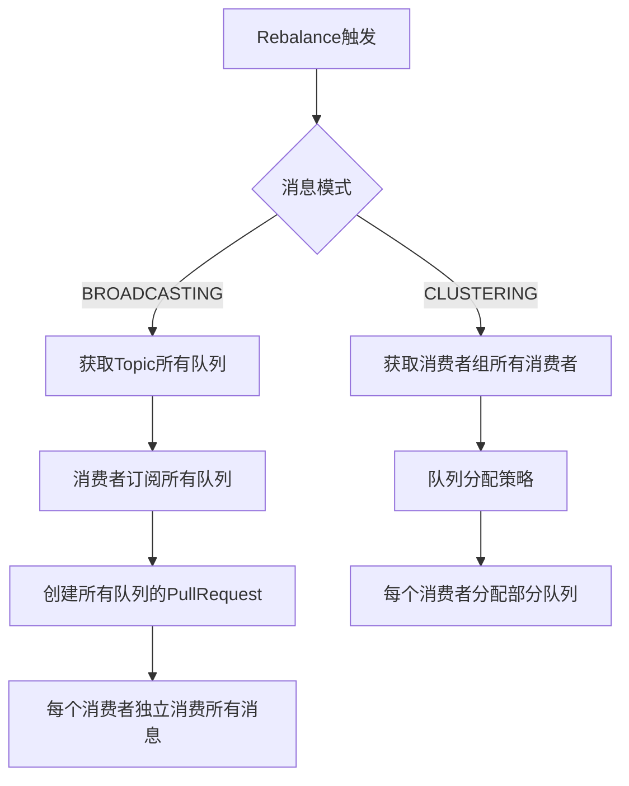

### 7.2 广播模式关键特性

| 特性 | 广播模式 | 集群模式 |
| --- | --- | --- |
| 队列分配 | 所有消费者订阅全部队列 | 队列按消费者数量均分 |
| 位点存储 | 本地文件 (LocalFileOffsetStore) | Broker 端 (RemoteBrokerOffsetStore) |
| 消费进度 | 每个消费者独立维护 | 消费者组共享 |
| 消息重试 | ❌ 不支持 | ✅ 支持（发送回 Broker 重试队列） |
| 消费失败 | 消息丢弃，记录日志 | 发送回 Broker 重试 |
| Broker 锁 | ❌ 不需要 | ✅ 顺序消费需要 |

### 7.3 广播消费位点存储

广播模式消费位点存储在消费者本地文件：

```java
// DefaultMQPushConsumerImpl.java
switch (this.defaultMQPushConsumer.getMessageModel()) {
    case BROADCASTING:
        // 广播模式：位点存储在本地文件
        this.offsetStore = new LocalFileOffsetStore(this.mQClientFactory, groupName);
        break;
    case CLUSTERING:
        // 集群模式：位点存储在Broker
        this.offsetStore = new RemoteBrokerOffsetStore(this.mQClientFactory, groupName);
        break;
}

// LocalFileOffsetStore 存储路径
// 默认: ${user.home}/.rocketmq_offsets/{clientId}/{groupName}/offsets.json
```

### 7.4 广播模式顺序消费

广播模式下顺序消费不需要 Broker 锁，因为每个消费者独立消费：

```java
// ConsumeMessageOrderlyService.ConsumeRequest.run()
synchronized (objLock) {
    // 广播模式：直接消费，无需检查Broker锁
    // 集群模式：需要检查 processQueue.isLocked()
    if (MessageModel.BROADCASTING.equals(messageModel)
        || this.processQueue.isLocked() && !this.processQueue.isLockExpired()) {
        // 开始消费
    }
}
```

### 7.5 广播模式使用场景

| 场景 | 说明 |
| --- | --- |
| 配置推送 | 所有应用实例都需要收到配置更新 |
| 缓存刷新 | 所有节点的本地缓存需要同步更新 |
| 事件通知 | 所有服务实例都需要响应同一事件 |
| 日志收集 | 每个节点独立收集自己的日志 |

### 7.6 广播模式注意事项

1. **消费进度独立**：每个消费者独立维护消费位点，重启后从自己的位点继续消费
2. **不支持重试**：消费失败的消息不会重试，需要业务自行处理
3. **队列数不影响消费者**：即使只有 1 个队列，所有消费者都能收到消息
4. **消费者组概念弱化**：消费者组主要用于标识应用，不用于负载均衡

---

## 八、消费者核心配置

> 本节汇总消费者的核心配置项，包括必要配置、性能配置和流控配置。

### 8.1 必要配置

```java
DefaultMQPushConsumer consumer = new DefaultMQPushConsumer("ConsumerGroup");
consumer.setNamesrvAddr("localhost:9876");
consumer.subscribe("TopicTest", "*");
consumer.registerMessageListener((msgs, context) -> {
    return ConsumeConcurrentlyStatus.CONSUME_SUCCESS;
});
consumer.start();
```

### 8.2 初始消费位置配置

`ConsumeFromWhere` 控制消费者首次启动时的消费位置 ([ConsumeFromWhere.java](../../common/src/main/java/org/apache/rocketmq/common/consumer/ConsumeFromWhere.java))：

| 枚举值 | 说明 |
| --- | --- |
| `CONSUME_FROM_LAST_OFFSET` | **默认值**。从上次消费位置继续；首次启动从最新消息开始 |
| `CONSUME_FROM_FIRST_OFFSET` | 从最早消息开始消费 |
| `CONSUME_FROM_TIMESTAMP` | 从指定时间戳开始消费（配合 `consumeTimestamp` 使用） |

> **已废弃的枚举值**：`CONSUME_FROM_LAST_OFFSET_AND_FROM_MIN_WHEN_BOOT_FIRST`、`CONSUME_FROM_MIN_OFFSET`、`CONSUME_FROM_MAX_OFFSET` 已标记 `@Deprecated`，不建议使用。

> **consumeTimestamp 默认值**：当前时间往前推 30 分钟，格式为 `yyyyMMddHHmmss`。定义于 [DefaultMQPushConsumer.java](../../client/src/main/java/org/apache/rocketmq/client/consumer/DefaultMQPushConsumer.java)。

**配置示例**：

```java
// 从最新消息开始消费（默认）
consumer.setConsumeFromWhere(ConsumeFromWhere.CONSUME_FROM_LAST_OFFSET);

// 从最早消息开始消费
consumer.setConsumeFromWhere(ConsumeFromWhere.CONSUME_FROM_FIRST_OFFSET);

// 从指定时间开始消费（格式：yyyyMMddHHmmss）
consumer.setConsumeFromWhere(ConsumeFromWhere.CONSUME_FROM_TIMESTAMP);
consumer.setConsumeTimestamp("20231201120000");
```

### 8.3 性能配置

| 配置项 | 默认值 | 说明 |
| --- | --- | --- |
| `consumeThreadMin` | 20 个 | 消费线程池核心线程数 |
| `consumeThreadMax` | 20 个 | 消费线程池最大线程数 |
| `pullBatchSize` | 32 条 | 单次拉取最大消息数 |
| `pullBatchSizeInBytes` | 256 KB（262144 B） | 单次拉取最大字节数 |
| `consumeMessageBatchMaxSize` | 1 条 | 单次消费最大消息数 |
| `pullInterval` | 0 ms | 拉取间隔（0 表示连续拉取） |
| `consumeTimeout` | 15 min | 消费超时时间 |
| `suspendCurrentQueueTimeMillis` | 1000 ms（1s） | 流控时队列挂起时间 |
| `maxReconsumeTimes` | -1 | 最大重试次数（-1 表示并发模式 16 次，顺序模式无限制） |
| `pullTimeDelayMillsWhenException` | 3000 ms（3s） | 拉取异常时的重试延迟时间 |

> **源码位置**：`pullTimeDelayMillsWhenException` 定义于 [DefaultMQPushConsumerImpl.java](../../client/src/main/java/org/apache/rocketmq/client/impl/consumer/DefaultMQPushConsumerImpl.java)。

#### 8.3.1 consumeThreadMin / consumeThreadMax（消费线程池）

**配置建议**：

| 场景 | consumeThreadMin | consumeThreadMax | 说明 |
| --- | --- | --- | --- |
| CPU 密集型 | CPU 核心数 + 1 | CPU 核心数 + 1 | 避免过多线程竞争 CPU |
| IO 密集型 | 2 × CPU 核心数 | 4 × CPU 核心数 | 充分利用 IO 等待时间 |
| 混合型 | CPU 核心数 × 2 | CPU 核心数 × 4 | 根据实际压测调整 |

**注意事项**：
- 建议将 `consumeThreadMin` 和 `consumeThreadMax` 设置为相同值，避免线程动态创建/销毁的开销
- 线程数过多会导致上下文切换开销增加，反而降低吞吐量

#### 8.3.2 pullBatchSize（单次拉取消息数）

控制每次从 Broker 拉取消息的最大数量。

```java
consumer.setPullBatchSize(32);  // 默认32条
```

**配置建议**：

| 场景 | pullBatchSize | 说明 |
| --- | --- | --- |
| 低延迟优先 | 16-32 | 减少单次拉取时间，快速响应 |
| 高吞吐优先 | 64-128 | 减少网络往返次数，提高吞吐 |
| 消息体较大 | 8-16 | 避免单次拉取数据量过大 |

#### 8.3.3 consumeMessageBatchMaxSize（单次消费消息数）

控制每次传给消费监听器的消息列表最大长度。

```java
consumer.setConsumeMessageBatchMaxSize(16);  // 默认1条
```

#### 8.3.4 pullInterval（拉取间隔）

控制两次拉取之间的间隔时间，用于限流。

```java
consumer.setPullInterval(0);  // 默认0，连续拉取
```

**使用场景**：

| 场景 | pullInterval | 说明 |
| --- | --- | --- |
| 正常消费 | 0 | 连续拉取，最大化吞吐 |
| 限流保护 | 100-1000 | 降低消费速度，保护下游系统 |

#### 8.3.5 consumeTimeout（消费超时）

控制单次消费的最大执行时间，超时后会被强制中断。

```java
consumer.setConsumeTimeout(15);  // 默认15分钟
```

**注意事项**：
- 超时只是标记 `TIME_OUT`，不会中断正在执行的线程
- 真正的线程中断需要配合 `shutdown()` 实现
- 单位为分钟，实际超时时间 = consumeTimeout × 60 × 1000 ms

### 8.4 流控配置

> 流控相关配置详见 [三、消费者流控机制 - 流控配置参数](#32-流控配置参数)。

### 8.5 从 Slave 读消息配置

当消费落后过多时（如消费位点重置到历史位置），RocketMQ 支持自动切换到 Slave 读取消息，降低 Master IO 压力。详见 [十、从 Slave 读消息机制](#十从-slave-读消息机制)。

### 8.6 完整配置示例

```java
// 创建Push消费者，指定消费者组
DefaultMQPushConsumer consumer = new DefaultMQPushConsumer("ConsumerGroup");
consumer.setNamesrvAddr("localhost:9876");              // NameServer地址

// 性能配置
consumer.setConsumeThreadMin(20);                       // 消费线程池核心线程数
consumer.setConsumeThreadMax(64);                       // 消费线程池最大线程数
consumer.setPullBatchSize(32);                          // 单次拉取最大消息数
consumer.setConsumeMessageBatchMaxSize(16);             // 单次消费最大消息数

// 流控配置
consumer.setPullThresholdForQueue(1000);                // 单队列最大缓存消息数
consumer.setPullThresholdSizeForQueue(100);             // 单队列最大缓存大小（MB）
consumer.setConsumeConcurrentlyMaxSpan(2000);           // 并发消费最大跨度

// 超时配置
consumer.setConsumeTimeout(15);                         // 消费超时时间（分钟）
consumer.setSuspendCurrentQueueTimeMillis(1000);        // 流控时队列挂起时间（毫秒）

// 订阅Topic并启动
consumer.subscribe("TopicTest", "*");
consumer.registerMessageListener((msgs, context) -> {
    return ConsumeConcurrentlyStatus.CONSUME_SUCCESS;
});
consumer.start();
```

---

## 九、从 Slave 读消息机制

> 本节介绍 RocketMQ 在消费落后过多时自动切换到 Slave 读取消息的机制，帮助降低 Master Broker 的 IO 压力。

### 9.1 为什么需要从 Slave 读消息？

在主从架构中，Master Broker 承担所有写请求和大部分读请求。当消费落后过多时（如消费位点重置到 1-2 天前），Master 的 CommitLog 会承受巨大的 IO 压力：

```plain
┌─────────────────────────────────────────────────────────────────────────────┐
│                    问题：消费落后导致 Master IO 压力                           │
├─────────────────────────────────────────────────────────────────────────────┤
│                                                                             │
│  正常消费：                                                                  │
│  ┌──────────────────────────────────────────────────────────────────────┐  │
│  │  Consumer 消费位点接近最新，读取的消息大多在 Page Cache 中              │  │
│  │  → 磁盘 IO 压力小，响应速度快                                          │  │
│  └──────────────────────────────────────────────────────────────────────┘  │
│                                                                             │
│  消费落后过多：                                                              │
│  ┌──────────────────────────────────────────────────────────────────────┐  │
│  │  Consumer 消费位点落后很多，需要读取历史消息                            │  │
│  │  → 历史消息不在 Page Cache，需要从磁盘读取                              │  │
│  │  → 大量磁盘 IO，影响 Master 的写入性能和其他消费组的消费                │  │
│  └──────────────────────────────────────────────────────────────────────┘  │
│                                                                             │
└─────────────────────────────────────────────────────────────────────────────┘
```

**解决方案**：当消费落后量超过阈值时，自动切换到 Slave 读取消息，将读压力分散到从节点。

### 9.2 触发机制

#### 9.2.1 触发条件判断

Broker 在处理拉取请求时，会计算消费落后量并判断是否建议从 Slave 读取：

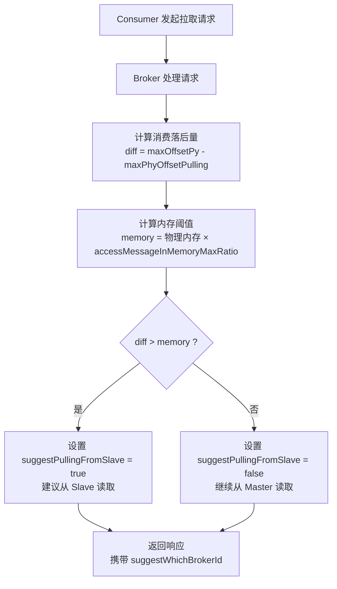

**核心判断逻辑** ([DefaultMessageStore.java](../../store/src/main/java/org/apache/rocketmq/store/DefaultMessageStore.java))：

```java
// 计算消费落后量：CommitLog 最大偏移量 - 当前拉取的最大物理偏移量
long diff = maxOffsetPy - maxPhyOffsetPulling;

// 计算内存阈值：物理内存 × accessMessageInMemoryMaxRatio(默认40%)
long memory = (long) (StoreUtil.TOTAL_PHYSICAL_MEMORY_SIZE
    * (this.messageStoreConfig.getAccessMessageInMemoryMaxRatio() / 100.0));

// 判断是否建议从 Slave 读取
getResult.setSuggestPullingFromSlave(diff > memory);
```

#### 9.2.2 Broker 响应逻辑

Broker 根据配置和判断结果决定返回哪个 BrokerId：

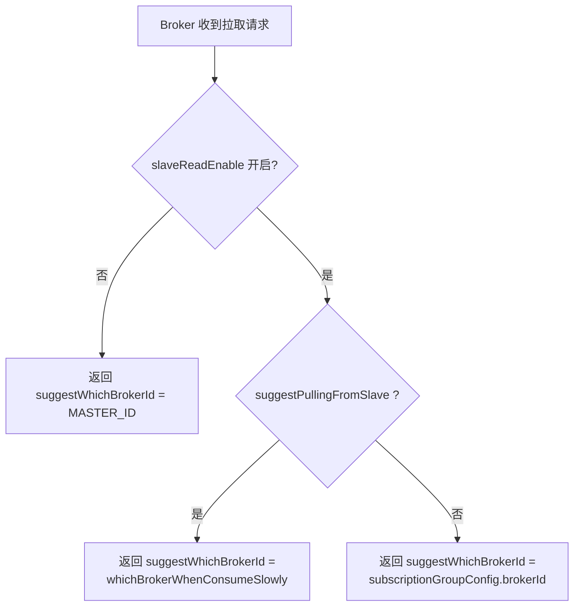

**Broker 响应逻辑** ([PullMessageProcessor.java](../../broker/src/main/java/org/apache/rocketmq/broker/processor/PullMessageProcessor.java))：

```java
if (this.brokerController.getBrokerConfig().isSlaveReadEnable()
    && !this.brokerController.getBrokerConfig().isInBrokerContainer()) {
    if (getMessageResult.isSuggestPullingFromSlave()) {
        // 消费落后太多，建议从 Slave 读取
        responseHeader.setSuggestWhichBrokerId(
            subscriptionGroupConfig.getWhichBrokerWhenConsumeSlowly());
    } else {
        // 正常消费，从配置的 brokerId 读取
        responseHeader.setSuggestWhichBrokerId(subscriptionGroupConfig.getBrokerId());
    }
} else {
    // 未开启 slaveReadEnable，始终从 Master 读取
    responseHeader.setSuggestWhichBrokerId(MixAll.MASTER_ID);
}
```

### 9.3 Consumer 端处理

Consumer 收到 Broker 响应后，会记录建议的 BrokerId，下次拉取时使用该 BrokerId：

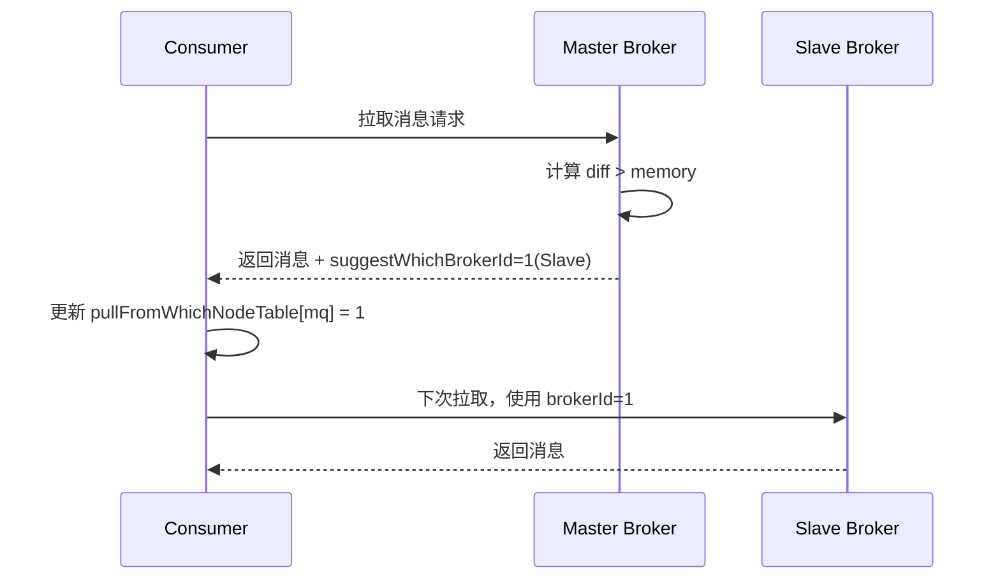

**Consumer 端核心逻辑** ([PullAPIWrapper.java](../../client/src/main/java/org/apache/rocketmq/client/impl/consumer/PullAPIWrapper.java))：

```java
// 处理拉取结果时，记录 Broker 建议的 brokerId
public PullResult processPullResult(final MessageQueue mq, final PullResult pullResult,
    final SubscriptionData subscriptionData) {
    PullResultExt pullResultExt = (PullResultExt) pullResult;
    
    // 更新该 MessageQueue 建议从哪个 Broker 拉取
    this.updatePullFromWhichNode(mq, pullResultExt.getSuggestWhichBrokerId());
    // ...
}

// 拉取消息时，使用记录的 brokerId
public long recalculatePullFromWhichNode(final MessageQueue mq) {
    AtomicLong suggest = this.pullFromWhichNodeTable.get(mq);
    if (suggest != null) {
        return suggest.get();  // 使用 Broker 建议的 brokerId
    }
    return MixAll.MASTER_ID;  // 默认从 Master 读取
}
```

### 9.4 配置参数

#### 9.4.1 Broker 端配置

| 配置项 | 默认值 | 说明 | 源码位置 |
| --- | --- | --- | --- |
| `slaveReadEnable` | false | 是否开启从 Slave 读功能 | [BrokerConfig.java](../../common/src/main/java/org/apache/rocketmq/common/BrokerConfig.java) |
| `accessMessageInMemoryMaxRatio` | 40 | 内存访问最大比例阈值（%），消费落后量超过此阈值时建议从 Slave 读取 | [MessageStoreConfig.java](../../store/src/main/java/org/apache/rocketmq/store/config/MessageStoreConfig.java) |
| `disableConsumeIfConsumerReadSlowly` | false | 是否禁止消费缓慢的消费者 | [BrokerConfig.java](../../common/src/main/java/org/apache/rocketmq/common/BrokerConfig.java) |
| `consumerFallbehindThreshold` | 16GB | 消费者落后阈值，配合 disableConsumeIfConsumerReadSlowly 使用 | [BrokerConfig.java](../../common/src/main/java/org/apache/rocketmq/common/BrokerConfig.java) |

**配置示例** (`broker.conf`)：

```properties
# 开启从 Slave 读功能
slaveReadEnable=true

# 内存访问最大比例阈值（默认 40%）
# 当消费落后量超过机器物理内存的 40% 时，建议从 Slave 读取
accessMessageInMemoryMaxRatio=40
```

#### 9.4.2 订阅组配置

通过 CLI 工具配置消费组的读取策略：

```bash
# 更新订阅组配置
mqadmin updateSubGroup -c DefaultCluster -g ConsumerGroupName \
  -i 0 \    # 正常情况从哪个 BrokerId 消费（默认 0 = Master）
  -w 1      # 消费缓慢时从哪个 Slave 消费（默认 1 = 第一个 Slave）
```

| 参数 | 默认值 | 说明 |
| --- | --- | --- |
| `-i` (brokerId) | 0 (Master) | 正常情况下从哪个 BrokerId 消费 |
| `-w` (whichBrokerWhenConsumeSlowly) | 1 (Slave) | 消费缓慢时建议从哪个 Slave 消费 |

**源码位置**：[SubscriptionGroupConfig.java](../../common/src/main/java/org/apache/rocketmq/common/subscription/SubscriptionGroupConfig.java)

### 9.5 使用场景

| 场景 | 说明 |
| --- | --- |
| 消费位点重置 | 重置到历史位点时，Master IO 压力大，自动切换到 Slave |
| 消费积压严重 | 积压消息量超过内存阈值时，减轻 Master 读压力 |
| Master 负载均衡 | 将读请求分散到 Slave，提高整体读性能 |

### 9.6 注意事项

1. **前提条件**：需要部署 Master-Slave 架构，且 Slave 数据同步正常
2. **Slave 数据延迟**：Slave 数据可能略落后于 Master，对实时性要求极高的场景需谨慎使用
3. **自动切换**：Consumer 会根据 Broker 的建议自动切换，无需应用代码干预
4. **恢复机制**：当消费追上后（diff < memory），会自动切换回 Master 读取

---

## 十、总结

本篇介绍了 RocketMQ 消息消费的核心机制：

1. **消费流程**：初始化 → Rebalance → 拉取 → 消费 → 提交位点
2. **两种消费模式**：
   - **Push 模式**：Pull + 长轮询，客户端 Rebalance，简单易用
   - **Pull 模式**：应用主动拉取，手动管理位点，灵活可控
3. **长轮询**：Broker 挂起请求，有消息时立即返回
4. **流控机制**：ProcessQueue 缓存 + 消费线程池 + Broker 端限制
5. **位点管理**：集群模式存储在 Broker，广播模式存储在本地
6. **Rebalance**：消费者组内队列重新分配，每 20 秒检查一次
7. **消费失败**：集群模式进入重试队列，广播模式直接丢弃
8. **从 Slave 读消息**：消费落后过多时自动切换到 Slave，降低 Master IO 压力

理解这些消费机制，有助于优化 RocketMQ 消费者的性能和可靠性配置。


