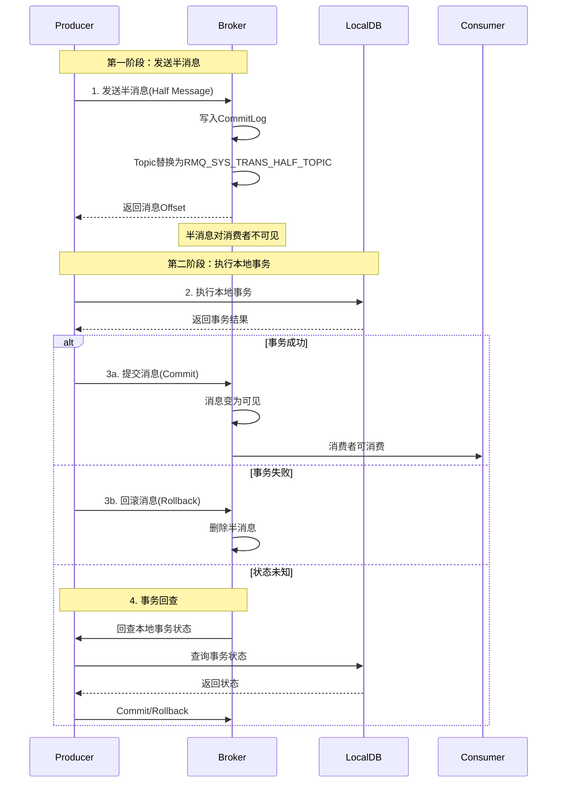
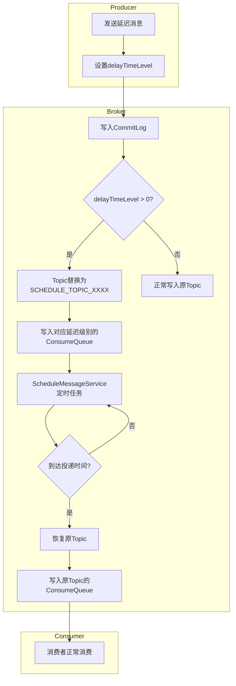
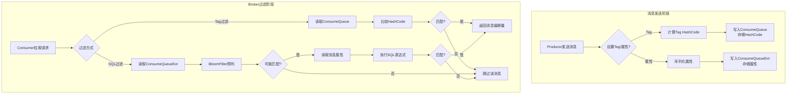
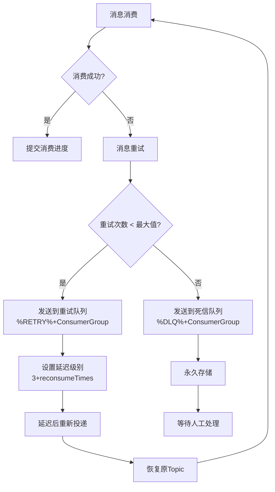
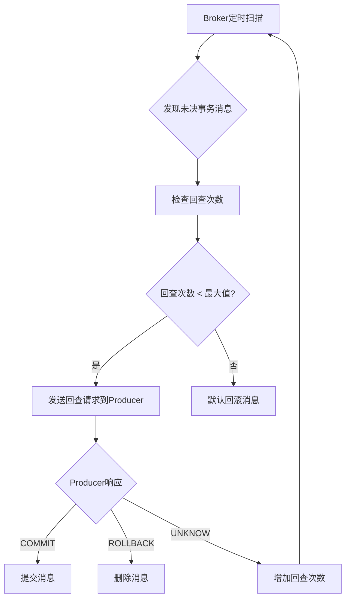
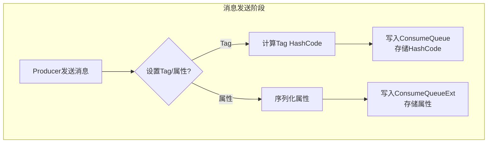
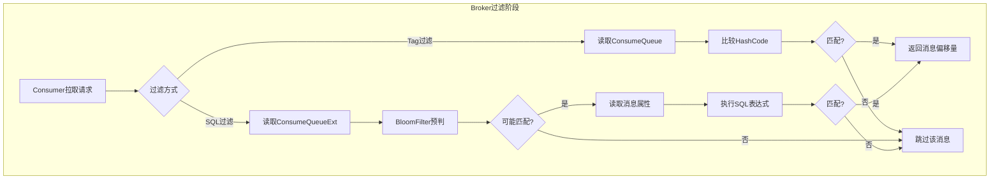
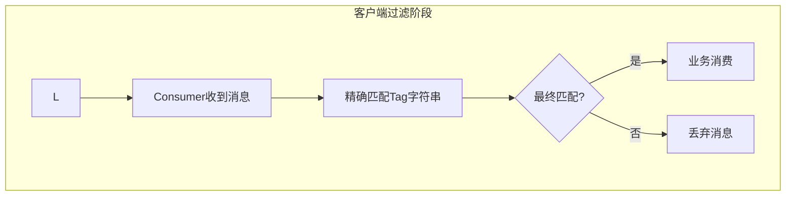

# RocketMQ 技术架构分析 - 高级特性篇

> 本篇深入介绍 RocketMQ 的高级特性，包括顺序消息、事务消息、延迟消息、消息过滤和死信队列。

---

## 一、顺序消息

### 1.1 顺序消息概述

顺序消息分为两种：

| 类型 | 说明 | 场景 |
| --- | --- | --- |
| **全局顺序** | 所有消息严格按 FIFO 顺序消费 | 性能差，极少使用 |
| **分区顺序** | 同一 Sharding Key 的消息顺序消费 | 订单状态流转、数据库 Binlog 同步 |

### 1.2 分区顺序消息原理

```plain
┌─────────────────────────────────────────────────────────────────────────────┐
│                        分区顺序消息原理                                       │
├─────────────────────────────────────────────────────────────────────────────┤
│                                                                             │
│  Producer                          Broker                         Consumer  │
│  ┌──────────────┐                  ┌───────────────────┐        ┌────────┐ │
│  │ OrderID=001  │                  │ Queue0            │        │ C1     │ │
│  │ Msg1,Msg2,Msg3│ ──Hash(001)──► │ [Msg1,Msg2,Msg3]  │ ─────► │ 锁定Q0 │ │
│  └──────────────┘                  └───────────────────┘        └────────┘ │
│                                                                             │
│  ┌──────────────┐                  ┌───────────────────┐        ┌────────┐ │
│  │ OrderID=002  │                  │ Queue1            │        │ C2     │ │
│  │ Msg4,Msg5    │ ──Hash(002)──► │ [Msg4,Msg5]       │ ─────► │ 锁定Q1 │ │
│  └──────────────┘                  └───────────────────┘        └────────┘ │
│                                                                             │
│  关键点:                                                                     │
│  1. 相同 OrderID 的消息 → 相同 Queue (Hash 路由)                             │
│  2. 同一 Queue 的消息 → 单线程串行消费 (队列锁)                               │
│  3. 不同 Queue 的消息 → 可并行消费                                           │
│                                                                             │
└─────────────────────────────────────────────────────────────────────────────┘
```

### 1.3 顺序消息发送

```java
// RocketMQ 4.x 方式：使用 MessageQueueSelector
producer.send(msg, new SelectMessageQueueByHash(), orderId);

// RocketMQ 5.x 方式：使用 Sharding Key
msg.putUserProperty(MessageConst.PROPERTY_SHARDING_KEY, orderId);
producer.send(msg);
```

### 1.4 顺序消息消费

```java
consumer.registerMessageListener(new MessageListenerOrderly() {
    @Override
    public ConsumeOrderlyStatus consumeMessage(List<MessageExt> msgs, 
        ConsumeOrderlyContext context) {
        // 单线程串行消费，保证顺序
        for (MessageExt msg : msgs) {
            processMessage(msg);
        }
        return ConsumeOrderlyStatus.SUCCESS;
    }
});
```

### 1.5 顺序消费三重锁

```plain
┌─────────────────────────────────────────────────────────────────────────────┐
│                        顺序消费三重锁机制                                     │
├─────────────────────────────────────────────────────────────────────────────┤
│                                                                             │
│  Lock 1: Broker 锁 (MessageQueueLock)                                       │
│  ┌───────────────────────────────────────────────────────────────────────┐ │
│  │ 作用: 保证同一时刻只有一个 Consumer 可以消费该队列                       │ │
│  │ 实现: Broker 端维护锁状态，Consumer 定期续约（默认30秒）                  │ │
│  │ 触发: Rebalance 时向 Broker 申请锁                                      │ │
│  └───────────────────────────────────────────────────────────────────────┘ │
│                                                                             │
│  Lock 2: 队列锁 (objLock)                                                   │
│  ┌───────────────────────────────────────────────────────────────────────┐ │
│  │ 作用: 保证同一 Consumer 内同一队列只能被一个线程消费                     │ │
│  │ 实现: synchronized(objLock)，每个 MessageQueue 一个锁对象              │ │
│  │ 触发: 消费前获取锁                                                      │ │
│  └───────────────────────────────────────────────────────────────────────┘ │
│                                                                             │
│  Lock 3: 消费锁 (ProcessQueue.consumeLock)                                  │
│  ┌───────────────────────────────────────────────────────────────────────┐ │
│  │ 作用: 保证消费过程中 ProcessQueue 状态不被修改                          │ │
│  │ 实现: ReentrantLock，消费前获取锁                                       │ │
│  │ 触发: 消费过程中持有锁                                                  │ │
│  └───────────────────────────────────────────────────────────────────────┘ │
│                                                                             │
└─────────────────────────────────────────────────────────────────────────────┘
```

### 1.6 顺序消费与并发消费对比

| 特性 | 并发消费 | 顺序消费 |
| --- | --- | --- |
| 线程模型 | 多线程并行 | 单线程串行（同一队列） |
| Broker 锁 | 不需要 | 需要 |
| 消费失败处理 | 发回 Broker 重试 | 本地重试，不回 Broker |
| 吞吐量 | 高 | 较低 |
| 适用场景 | 无顺序要求 | 需要顺序保证 |

---

## 二、事务消息

### 2.1 事务消息原理

事务消息采用两阶段提交（2PC）机制，确保本地事务与消息发送的原子性：

```mermaid
flowchart TD
    subgraph 第一阶段-发送半消息
        A[Producer发送消息] --> B[设置TRANSACTION_PREPARED标记]
        B --> C[发送到Broker]
        C --> D[Broker写入CommitLog]
        D --> E[写入RMQ_SYS_TRANS_HALF_TOPIC]
        E --> F[返回Offset给Producer]
        Note over E: 消息对消费者不可见
    end
    
    subgraph 第二阶段-执行本地事务
        F --> G[Producer执行本地事务]
        G --> H{事务执行结果}
        H -->|成功| I[返回COMMIT_MESSAGE]
        H -->|失败| J[返回ROLLBACK_MESSAGE]
        H -->|未知| K[返回UNKNOW]
    end
    
    subgraph 第三阶段-提交或回滚
        I --> L[发送Commit请求]
        J --> M[发送Rollback请求]
        K --> N[等待Broker回查]
        
        L --> O[Broker将消息转为可见]
        O --> P[写入原Topic]
        P --> Q[消费者可消费]
        
        M --> R[Broker删除半消息]
        
        N --> T[Broker定时回查]
        T --> U[Producer检查本地事务状态]
        U --> V{事务状态}
        V -->|已提交| L
        V -->|已回滚| M
    end
```

### 2.2 事务消息详细时序



### 2.3 事务消息状态

| 状态 | 说明 | 后续动作 |
| --- | --- | --- |
| `COMMIT_MESSAGE` | 提交事务 | 消息变为可见，消费者可消费 |
| `ROLLBACK_MESSAGE` | 回滚事务 | 消息被删除，消费者不可见 |
| `UNKNOW` | 中间状态 | Broker 发起事务回查 |

### 2.4 事务消息使用示例

```java
// 1. 创建事务监听器
TransactionListener transactionListener = new TransactionListener() {
    @Override
    public LocalTransactionState executeLocalTransaction(Message msg, Object arg) {
        // 执行本地事务
        try {
            doLocalTransaction();
            return LocalTransactionState.COMMIT_MESSAGE;
        } catch (Exception e) {
            return LocalTransactionState.ROLLBACK_MESSAGE;
        }
    }
    
    @Override
    public LocalTransactionState checkLocalTransaction(MessageExt msg) {
        // 回查本地事务状态
        boolean committed = checkTransactionStatus(msg);
        return committed ? LocalTransactionState.COMMIT_MESSAGE 
                         : LocalTransactionState.ROLLBACK_MESSAGE;
    }
};

// 2. 创建事务生产者
TransactionMQProducer producer = new TransactionMQProducer("TransactionProducerGroup");
producer.setNamesrvAddr("localhost:9876");
producer.setTransactionListener(transactionListener);
producer.start();

// 3. 发送事务消息
Message msg = new Message("TopicTest", "Hello".getBytes());
TransactionSendResult result = producer.sendMessageInTransaction(msg, null);
```

### 2.5 事务消息注意事项

| 注意事项 | 说明 |
| --- | --- |
| 不支持延迟消息 | 事务消息的 `delayTimeLevel` 会被忽略 |
| 不支持批量发送 | 事务消息不支持批量发送 |
| 单条消息事务 | 每条事务消息独立提交/回滚 |
| 回查线程池 | 需要配置独立的线程池处理回查 |

---

## 三、延迟消息

### 3.1 延迟级别

RocketMQ 不支持任意时间的延迟，而是提供固定的延迟级别：

| 延迟级别 | 延迟时间 | 延迟级别 | 延迟时间 |
| --- | --- | --- | --- |
| 1 | 1 秒 | 10 | 6 分钟 |
| 2 | 5 秒 | 11 | 7 分钟 |
| 3 | 10 秒 | 12 | 8 分钟 |
| 4 | 30 秒 | 13 | 9 分钟 |
| 5 | 1 分钟 | 14 | 10 分钟 |
| 6 | 2 分钟 | 15 | 20 分钟 |
| 7 | 3 分钟 | 16 | 30 分钟 |
| 8 | 4 分钟 | 17 | 1 小时 |
| 9 | 5 分钟 | 18 | 2 小时 |

### 3.2 延迟消息实现原理



### 3.3 延迟消息使用

```java
Message message = new Message("TestTopic", "Hello".getBytes());
message.setDelayTimeLevel(3);  // 10秒后消费
producer.send(message);
```

### 3.4 ScheduleMessageService 核心实现

```java
public class ScheduleMessageService extends ConfigManager {
    // 延迟级别 -> 延迟时间映射
    private final ConcurrentMap<Integer, Long> delayLevelTable = new ConcurrentHashMap<>();
    
    // 延迟级别 -> 消费进度映射
    private final ConcurrentMap<Integer, Long> offsetTable = new ConcurrentHashMap<>();
    
    // 启动定时任务
    public void start() {
        for (Map.Entry<Integer, Long> entry : this.delayLevelTable.entrySet()) {
            Integer level = entry.getKey();
            Long timeDelay = entry.getValue();
            
            // 为每个延迟级别启动一个定时任务
            this.deliverExecutorService.schedule(
                new DeliverDelayedMessageTimerTask(level, offset), 
                timeDelay, TimeUnit.MILLISECONDS);
        }
    }
}
```

---

## 四、消息过滤

### 4.1 过滤方式对比

| 特性 | Tag 过滤 | SQL92 过滤 |
| --- | --- | --- |
| 性能 | 高（仅 HashCode 比较） | 较低（需解析属性） |
| 功能 | 简单标签匹配 | 复杂条件组合 |
| 存储 | ConsumeQueue 存储 HashCode | 需要 ConsumeQueueExt 存储属性 |
| Broker 配置 | 默认支持 | 需要开启 `enablePropertyFilter` |
| 适用场景 | 简单分类过滤 | 复杂业务条件过滤 |

### 4.2 Tag 过滤

```java
// 生产者设置 Tag
Message msg = new Message("TopicTest", "TagA", "Hello".getBytes());

// 消费者按 Tag 订阅（支持多个 Tag，用 || 分隔）
consumer.subscribe("TopicTest", "TagA || TagB || TagC");
```

**Tag 过滤流程**：

```plain
┌─────────────────────────────────────────────────────────────────────────────┐
│                          Tag 过滤流程                                        │
├─────────────────────────────────────────────────────────────────────────────┤
│                                                                             │
│  1. Broker 端过滤（基于 HashCode）                                           │
│  ┌───────────────────────────────────────────────────────────────────────┐ │
│  │ ConsumeQueue 每条记录存储 Tags HashCode (8字节)                        │ │
│  │ 订阅表达式的 Tags 也计算 HashCode                                       │ │
│  │ 比较 HashCode 快速过滤                                                  │ │
│  └───────────────────────────────────────────────────────────────────────┘ │
│                                                                             │
│  2. 客户端二次过滤（精确匹配 Tag 字符串）                                     │
│  ┌───────────────────────────────────────────────────────────────────────┐ │
│  │ Broker 端 HashCode 可能碰撞                                             │ │
│  │ 客户端再次精确匹配 Tag 字符串                                            │ │
│  └───────────────────────────────────────────────────────────────────────┘ │
│                                                                             │
└─────────────────────────────────────────────────────────────────────────────┘
```

### 4.3 SQL92 过滤

**语法支持**：

| 类型 | 操作符 |
| --- | --- | --- |
| 数值比较 | >, >=, <, <=, BETWEEN, = |
| 字符比较 | =, <>, IN |
| 空值判断 | IS NULL, IS NOT NULL |
| 逻辑运算 | AND, OR, NOT |

**使用示例**：

```java
// 发送消息时设置属性
Message msg = new Message("TopicTest", "Hello".getBytes());
msg.putUserProperty("a", "10");
msg.putUserProperty("b", "abc");
producer.send(msg);

// 消费时使用 SQL 过滤
consumer.subscribe("TopicTest", 
    MessageSelector.bySql("a > 5 AND b = 'abc'"));
```


### 4.4 过滤流程图



---

## 五、死信队列

### 5.1 死信队列概述

死信队列（Dead Letter Queue, DLQ）用于存储无法被正常消费的消息：

| 特性 | 说明 |
| --- | --- |
| Topic 格式 | `%DLQ%` + ConsumerGroup |
| 消息来源 | 重试次数超限的消息 |
| 可见性 | 立即可见 |
| 消费方式 | 需要专门处理 |
| 消息生命周期 | 持久化存储 |

### 5.2 消息重试与死信流程



### 5.3 死信队列产生条件

| 条件 | 说明 |
| --- | --- |
| 重试次数超限 | 默认 16 次重试后仍失败 |
| delayLevel < 0 | 特殊标记强制进入死信队列 |

### 5.4 死信队列处理

```java
// 创建死信队列消费者
DefaultMQPushConsumer dlqConsumer = new DefaultMQPushConsumer("DLQ_HANDLER_GROUP");
dlqConsumer.subscribe("%DLQ%OrderConsumerGroup", "*");
dlqConsumer.registerMessageListener(new MessageListenerConcurrently() {
    @Override
    public ConsumeConcurrentlyStatus consumeMessage(List<MessageExt> msgs, 
        ConsumeConcurrentlyContext context) {
        for (MessageExt msg : msgs) {
            String originTopic = msg.getProperty(MessageConst.PROPERTY_RETRY_TOPIC);
            int reconsumeTimes = msg.getReconsumeTimes();
            // 处理死信消息
            handleDeadLetter(msg, originTopic, reconsumeTimes);
        }
        return ConsumeConcurrentlyStatus.CONSUME_SUCCESS;
    }
});
dlqConsumer.start();
```

### 5.5 重试队列与死信队列对比

| 特性 | 重试队列 | 死信队列 |
| --- | --- | --- |
| Topic 格式 | `%RETRY%` + ConsumerGroup | `%DLQ%` + ConsumerGroup |
| 消息来源 | 消费失败的消息 | 重试次数超限的消息 |
| 可见性 | 延迟后可见 | 立即可见 |
| 消费方式 | 原消费者自动消费 | 需要专门处理 |
| 消息生命周期 | 临时存储 | 持久化存储 |

---

## 六、消息轨迹

### 6.1 轨迹数据结构

```plain
┌─────────────────────────────────────────────────────────────────────────────┐
│                          消息轨迹数据                                        │
├─────────────────────────────────────────────────────────────────────────────┤
│  TraceBean (生产端):                                                         │
│  ├── topic: 消息主题                                                         │
│  ├── msgId: 消息ID                                                          │
│  ├── tags: 消息标签                                                         │
│  ├── keys: 消息Key                                                          │
│  ├── storeTime: 存储时间                                                     │
│  ├── brokerName: Broker名称                                                 │
│  └── traceType: Publish                                                     │
│                                                                              │
│  TraceBean (消费端):                                                         │
│  ├── topic: 消息主题                                                         │
│  ├── msgId: 消息ID                                                          │
│  ├── consumerGroup: 消费者组                                                 │
│  ├── retryTimes: 重试次数                                                    │
│  ├── storeTime: 存储时间                                                     │
│  ├── consumeTime: 消费时间                                                   │
│  ├── status: 消费状态                                                        │
│  └── traceType: SubBefore/SubAfter                                          │
└─────────────────────────────────────────────────────────────────────────────┘
```

### 6.2 轨迹开启方式

```java
// 生产者开启轨迹
DefaultMQProducer producer = new DefaultMQProducer("ProducerGroup", true);

// 消费者开启轨迹
DefaultMQPushConsumer consumer = new DefaultMQPushConsumer("ConsumerGroup", true);

// 自定义轨迹Topic
producer.setTraceTopic("RMQ_SYS_TRACE_TOPIC_CUSTOM");
```

---

## 七、请求-响应模式

### 7.1 模式架构

```plain
┌─────────────────────────────────────────────────────────────────────────────┐
│                        请求-响应模式                                         │
├─────────────────────────────────────────────────────────────────────────────┤
│                                                                             │
│  Producer (请求方)                   Consumer (响应方)                       │
│  ┌──────────────────┐               ┌──────────────────┐                    │
│  │                  │   请求消息     │                  │                    │
│  │  request()       │ ────────────► │  消费消息        │                    │
│  │                  │               │  处理业务        │                    │
│  │  等待响应...      │               │  reply()        │                    │
│  │                  │ ◄──────────── │                  │                    │
│  │  收到响应        │   响应消息     │                  │                    │
│  └──────────────────┘               └──────────────────┘                    │
│                                                                             │
│  响应消息发送到临时Topic: reply-to-{uniqueId}                                │
│  Producer 订阅该临时Topic接收响应                                            │
└─────────────────────────────────────────────────────────────────────────────┘
```

### 7.2 使用示例

```java
// Producer 发送请求并等待响应
Message requestMsg = new Message("RequestTopic", "Hello".getBytes());
Message responseMsg = producer.request(requestMsg, 3000);  // 超时3秒

// Consumer 处理请求并回复
consumer.registerMessageListener(new MessageListenerConcurrently() {
    @Override
    public ConsumeConcurrentlyStatus consumeMessage(List<MessageExt> msgs,
        ConsumeConcurrentlyContext context) {
        for (MessageExt msg : msgs) {
            String result = processRequest(msg);
            
            // 回复响应
            Message responseMsg = new Message(
                msg.getProperty(MessageConst.PROPERTY_REPLY_TO),
                result.getBytes());
            responseMsg.setProperty(MessageConst.PROPERTY_CORRELATION_ID,
                msg.getProperty(MessageConst.PROPERTY_CORRELATION_ID));
            producer.send(responseMsg);
        }
        return ConsumeConcurrentlyStatus.CONSUME_SUCCESS;
    }
});
```

---

## 八、事务消息详细实现

### 9.1 发送事务消息核心代码

```java
// DefaultMQProducerImpl.java
public TransactionSendResult sendMessageInTransaction(final Message msg,
    final LocalTransactionExecuter localTransactionExecuter, final Object arg) {
    
    // 1. 设置事务prepared标记
    MessageAccessor.putProperty(msg, MessageConst.PROPERTY_TRANSACTION_PREPARED, "true");
    MessageAccessor.putProperty(msg, MessageConst.PROPERTY_PRODUCER_GROUP, 
        this.defaultMQProducer.getProducerGroup());
    
    // 2. 发送半消息
    SendResult sendResult = this.send(msg);
    
    LocalTransactionState localTransactionState = LocalTransactionState.UNKNOW;
    switch (sendResult.getSendStatus()) {
        case SEND_OK: {
            // 3. 半消息发送成功，执行本地事务
            localTransactionState = transactionListener.executeLocalTransaction(msg, arg);
            break;
        }
        case FLUSH_DISK_TIMEOUT:
        case FLUSH_SLAVE_TIMEOUT:
        case SLAVE_NOT_AVAILABLE:
            // 半消息发送失败，回滚
            localTransactionState = LocalTransactionState.ROLLBACK_MESSAGE;
            break;
    }
    
    // 4. 结束事务（提交/回滚）
    this.endTransaction(msg, sendResult, localTransactionState, localException);
    
    return transactionSendResult;
}
```

### 9.2 事务监听器接口

```java
// TransactionListener.java
public interface TransactionListener {
    // 执行本地事务
    LocalTransactionState executeLocalTransaction(final Message msg, final Object arg);
    
    // 事务回查
    LocalTransactionState checkLocalTransaction(final MessageExt msg);
}
```

### 9.3 事务监听器实现示例

```java
public class TransactionListenerImpl implements TransactionListener {
    private ConcurrentHashMap<String, Integer> localTrans = new ConcurrentHashMap<>();
    
    @Override
    public LocalTransactionState executeLocalTransaction(Message msg, Object arg) {
        // 执行本地事务
        int status = executeLocalDbTransaction(msg);
        localTrans.put(msg.getTransactionId(), status);
        
        // 返回UNKNOW，等待回查确认
        return LocalTransactionState.UNKNOW;
    }
    
    @Override
    public LocalTransactionState checkLocalTransaction(MessageExt msg) {
        // 回查本地事务状态
        Integer status = localTrans.get(msg.getTransactionId());
        if (status == null) {
            return LocalTransactionState.ROLLBACK_MESSAGE;
        }
        switch (status) {
            case 0: return LocalTransactionState.UNKNOW;      // 继续等待
            case 1: return LocalTransactionState.COMMIT_MESSAGE;
            case 2: return LocalTransactionState.ROLLBACK_MESSAGE;
            default: return LocalTransactionState.COMMIT_MESSAGE;
        }
    }
}
```

### 9.4 事务回查机制

当本地事务返回 `UNKNOW` 或 Producer 与 Broker 断开连接时，Broker 会定时发起事务回查：



### 9.5 事务回查配置

| 配置项 | 默认值 | 说明 |
| --- | --- | --- |
| `transactionTimeout` | 6000ms | 事务超时时间，超时后开始回查 |
| `transactionCheckMax` | 5 | 最大回查次数 |
| `transactionCheckInterval` | 60000ms | 回查间隔 |

---

## 九、延迟消息核心实现

### 10.1 ScheduleMessageService 核心代码

```java
public class ScheduleMessageService extends ConfigManager {
    // 延迟级别 -> 延迟时间映射
    private final ConcurrentMap<Integer, Long> delayLevelTable = new ConcurrentHashMap<>();
    
    // 延迟级别 -> 消费进度映射
    private final ConcurrentMap<Integer, Long> offsetTable = new ConcurrentHashMap<>();
    
    // 启动定时任务
    public void start() {
        for (Map.Entry<Integer, Long> entry : this.delayLevelTable.entrySet()) {
            Integer level = entry.getKey();
            Long timeDelay = entry.getValue();
            Long offset = this.offsetTable.get(level);
            
            // 为每个延迟级别启动一个定时任务
            this.deliverExecutorService.schedule(
                new DeliverDelayedMessageTimerTask(level, offset), 
                timeDelay, TimeUnit.MILLISECONDS);
        }
    }
    
    // 计算投递时间
    public long computeDeliverTimestamp(final int delayLevel, final long storeTimestamp) {
        Long time = this.delayLevelTable.get(delayLevel);
        return time + storeTimestamp;  // 存储时间 + 延迟时间 = 投递时间
    }
}
```

### 10.2 消息投递任务

```java
class DeliverDelayedMessageTimerTask implements Runnable {
    private final int delayLevel;
    private final long offset;
    
    @Override
    public void run() {
        // 1. 从SCHEDULE_TOPIC_XXXX的对应队列读取消息
        ConsumeQueue cq = findConsumeQueue(TopicValidator.RMQ_SYS_SCHEDULE_TOPIC, 
            delayLevel2QueueId(delayLevel));
        
        // 2. 检查是否到达投递时间
        long deliverTimestamp = computeDeliverTimestamp(delayLevel, storeTimestamp);
        if (deliverTimestamp > System.currentTimeMillis()) {
            // 未到时间，重新调度
            scheduleNextTimerTask();
            return;
        }
        
        // 3. 恢复原Topic，投递消息
        MessageExtBrokerInner msgInner = messageToMessageExtBrokerInner(msgExt);
        msgInner.setTopic(realTopic);  // 恢复原Topic
        PutMessageResult result = putMessage(msgInner);
        
        // 4. 更新进度
        updateOffset(delayLevel, result.getNextOffset());
    }
}
```

### 10.3 延迟消息与消息重试

消费失败的消息会自动进入延迟重试队列，延迟级别与重试次数相关：

```java
// 消息重试延迟级别计算
int delayLevel = 3 + reconsumeTimes;  // 第1次重试: level=4(30s), 第2次: level=5(1m)...
```

---

## 十、消息过滤完整流程

### 11.1 消息发送阶段



### 11.2 Broker 过滤阶段



### 11.3 客户端过滤阶段



### 11.4 Tag 过滤原理

```plain
┌─────────────────────────────────────────────────────────────────────────────┐
│                          Tag 过滤流程                                        │
├─────────────────────────────────────────────────────────────────────────────┤
│                                                                             │
│  1. Broker 端过滤（基于 HashCode）                                           │
│  ┌───────────────────────────────────────────────────────────────────────┐ │
│  │ ConsumeQueue 每条记录存储 Tags HashCode (8字节)                        │ │
│  │ 订阅表达式的 Tags 也计算 HashCode                                       │ │
│  │ 比较 HashCode 快速过滤                                                  │ │
│  └───────────────────────────────────────────────────────────────────────┘ │
│                                                                             │
│  2. 客户端二次过滤（精确匹配 Tag 字符串）                                     │
│  ┌───────────────────────────────────────────────────────────────────────┐ │
│  │ Broker 端 HashCode 可能碰撞                                             │ │
│  │ 客户端再次精确匹配 Tag 字符串                                            │ │
│  └───────────────────────────────────────────────────────────────────────┘ │
│                                                                             │
└─────────────────────────────────────────────────────────────────────────────┘
```

### 11.5 SQL92 过滤语法

| 类型 | 操作符 |
| --- | --- |
| 数值比较 | >, >=, <, <=, BETWEEN, = |
| 字符比较 | =, <>, IN |
| 空值判断 | IS NULL, IS NOT NULL |
| 逻辑运算 | AND, OR, NOT |

**使用示例**：

```java
// 发送消息时设置属性
Message msg = new Message("TopicTest", "Hello".getBytes());
msg.putUserProperty("a", "10");
msg.putUserProperty("b", "abc");
producer.send(msg);

// 消费时使用 SQL 过滤
consumer.subscribe("TopicTest", 
    MessageSelector.bySql("a > 5 AND b = 'abc'"));
```

---

## 十一、总结

本篇介绍了 RocketMQ 的高级特性：

1. **顺序消息**：通过 Hash 路由 + 三重锁机制保证同一 Sharding Key 的消息顺序
2. **事务消息**：两阶段提交 + 事务回查，确保本地事务与消息发送的原子性
3. **延迟消息**：18 个固定延迟级别，通过 `SCHEDULE_TOPIC_XXXX` 中转实现
4. **消息过滤**：Tag 过滤（高性能）和 SQL92 过滤（功能丰富）
5. **死信队列**：重试超限的消息进入死信队列，需人工处理
6. **消息轨迹**：追踪消息从生产到消费的完整链路
7. **请求-响应模式**：类似 RPC 的同步调用模式

理解这些高级特性，有助于在不同业务场景下正确使用 RocketMQ。
