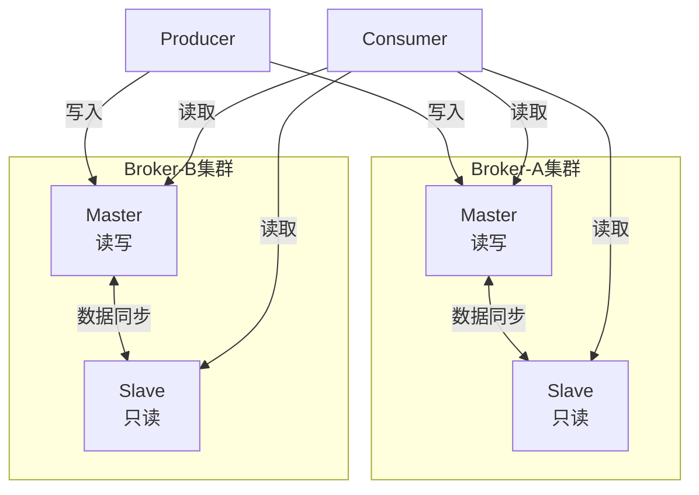
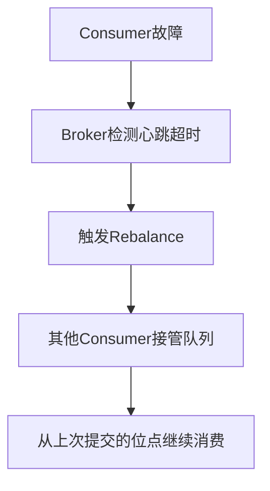
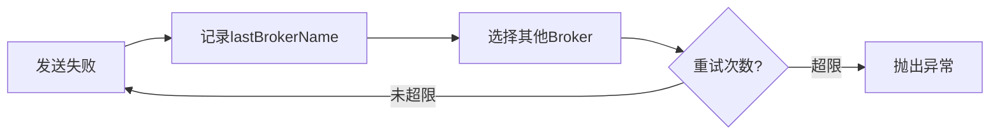

# RocketMQ 技术架构分析 - 高可用与运维篇

> 本篇介绍 RocketMQ 的高可用架构、故障转移机制、消息堆积处理和部署运维建议。
> 
> **前置阅读**：BrokerRole、刷盘策略、主从复制机制详见 [消息存储篇](./04-消息存储篇.md)。

---

## 一、高可用架构

### 1.1 Master-Slave 架构

RocketMQ 采用 Master-Slave 架构实现高可用：



### 1.2 高可用配置要点

| 配置项 | 推荐值 | 说明 |
| --- | --- | --- |
| `brokerRole` | SYNC_MASTER | 同步复制，保证数据不丢失 |
| `flushDiskType` | SYNC_FLUSH | 同步刷盘，保证数据持久化 |
| `syncFlushTimeout` | 5000ms | 同步刷盘超时时间 |
| `haListenPort` | 10912 | HA 监听端口 |

> **详细说明**：BrokerRole、刷盘策略的详细对比见 [消息存储篇 - 主从复制](./04-消息存储篇.md#五主从复制)。

---

## 二、故障转移机制

### 2.1 故障场景处理

| 场景 | 处理方式 | 影响 |
| --- | --- | --- |
| Master 宕机 | Slave 接管读请求，写请求转发到其他 Master | 短暂写入不可用 |
| Slave 宕机 | Master 继续提供服务 | 无影响 |
| NameServer 宕机 | 其他 NameServer 继续提供服务 | 无影响（多节点部署） |
| 网络分区 | 根据配置选择同步/异步复制 | 可能导致数据不一致 |

### 2.2 消费者故障转移



### 2.3 生产者故障转移



### 2.4 DLedger 自动故障转移

RocketMQ 4.5+ 引入 DLedger 模式，实现自动故障转移：

```plain
┌─────────────────────────────────────────────────────────────────────────────┐
│                        DLedger 模式架构                                      │
├─────────────────────────────────────────────────────────────────────────────┤
│                                                                             │
│  ┌─────────────────────────────────────────────────────────────────────┐   │
│  │                        DLedger Group                                 │   │
│  │  ┌───────────────┐  ┌───────────────┐  ┌───────────────┐           │   │
│  │  │   Leader      │  │   Follower    │  │   Follower    │           │   │
│  │  │  (Master)     │  │   (Slave)     │  │   (Slave)     │           │   │
│  │  │               │  │               │  │               │           │   │
│  │  │  Raft 协议    │◄─┤  Raft 协议    │◄─┤  Raft 协议    │           │   │
│  │  │  自动选举     │  │  数据同步     │  │  数据同步     │           │   │
│  │  └───────────────┘  └───────────────┘  └───────────────┘           │   │
│  └─────────────────────────────────────────────────────────────────────┘   │
│                                                                             │
│  特点:                                                                       │
│  1. 基于 Raft 协议自动选举 Leader                                           │
│  2. Leader 故障时自动切换到 Follower                                        │
│  3. 强一致性写入，确保数据不丢失                                             │
│                                                                             │
└─────────────────────────────────────────────────────────────────────────────┘
```

---

## 三、消息堆积处理

### 3.1 堆积原因分析

| 原因类型 | 具体原因 | 排查方法 |
| --- | --- | --- |
| 生产过快 | 生产速率 > 消费速率 | 监控生产 TPS vs 消费 TPS |
| 消费慢 | 业务处理耗时过长 | 分析消费耗时、数据库慢查询 |
| 消费失败 | 大量消息进入重试队列 | 检查死信队列、重试队列 |
| 消费者不足 | 消费者实例数或线程数不够 | 检查消费者实例数、线程池配置 |
| 队列数限制 | 队列数 < 消费者实例数 | Topic 队列数应 >= 消费者实例数 |

### 3.2 堆积监控指标

```java
// 关键监控指标
public class ConsumerMetrics {
    long consumeLatency;        // 消费延迟时间
    long lagMessages;           // 堆积消息数量
    long consumeTPS;            // 消费速率
    long produceTPS;            // 生产速率
    int activeConsumers;        // 活跃消费者数
    int activeQueues;           // 分配的队列数
}
```

### 3.3 堆积处理策略

**策略一：临时扩容消费者**

```java
// 1. 增加消费者实例（需要队列数足够）
// 队列数 >= 消费者实例数 才能充分利用消费者

// 2. 增加消费线程数
consumer.setConsumeThreadMin(20);
consumer.setConsumeThreadMax(64);

// 3. 增加批量消费数量
consumer.setConsumeMessageBatchMaxSize(50);  // 默认1
```

**策略二：异步消费 + 本地缓冲**

```java
private ExecutorService businessExecutor = Executors.newFixedThreadPool(100);

consumer.registerMessageListener((msgs, context) -> {
    for (MessageExt msg : msgs) {
        businessExecutor.submit(() -> {
            processMessage(msg);  // 异步处理业务逻辑
        });
    }
    return ConsumeConcurrentlyStatus.CONSUME_SUCCESS;  // 快速返回
});
```

**策略三：跳过非关键消息**

```java
consumer.registerMessageListener((msgs, context) -> {
    for (MessageExt msg : msgs) {
        long delay = System.currentTimeMillis() - msg.getBornTimestamp();
        if (delay > TimeUnit.HOURS.toMillis(1)) {
            // 超过1小时的消息直接跳过
            log.warn("消息超时跳过, msgId={}", msg.getMsgId());
            continue;
        }
        processMessage(msg);
    }
    return ConsumeConcurrentlyStatus.CONSUME_SUCCESS;
});
```

**策略四：分流消费（紧急情况）**

```java
// 1. 创建临时消费者组，从堆积位置开始消费
DefaultMQPushConsumer tempConsumer = new DefaultMQPushConsumer("TEMP_GROUP");
tempConsumer.setConsumeFromWhere(ConsumeFromWhere.CONSUME_FROM_FIRST_OFFSET);

// 2. 原消费者暂停或停止
// 3. 临时消费者处理完堆积后停止
// 4. 原消费者恢复，从最新位置继续
```

### 3.4 堆积预防措施

| 措施 | 配置项 | 建议值 | 说明 |
| --- | --- | --- | --- |
| 预估容量 | Topic 队列数 | >= 消费者实例数 | 保证消费者能充分并行 |
| 消费超时 | consumeTimeout | 15 分钟 | 消费超时后重新投递 |
| 流控保护 | pullThresholdForQueue | 1000 | 单队列最大拉取消息数 |
| 监控告警 | 堆积阈值 | 业务决定 | 建议分级告警 |

---

## 四、部署架构

### 4.1 部署模式对比

| 部署模式 | 适用场景 | 优点 | 缺点 |
| --- | --- | --- | --- |
| **单 Master** | 开发测试 | 部署简单 | 无高可用 |
| **多 Master** | 高吞吐场景 | 高可用，高吞吐 | 无数据冗余 |
| **多 Master 多 Slave-异步复制** | 一般生产环境 | 高可用，性能好 | 有少量消息丢失风险 |
| **多 Master 多 Slave-同步复制** | 金融级场景 | 消息零丢失 | 性能略有下降 |

### 4.2 推荐部署架构

```plain
┌─────────────────────────────────────────────────────────────────────────────┐
│                        生产环境推荐架构                                       │
├─────────────────────────────────────────────────────────────────────────────┤
│                                                                             │
│  NameServer 集群 (至少3节点)                                                 │
│  ┌─────────────┐  ┌─────────────┐  ┌─────────────┐                         │
│  │ NameServer1 │  │ NameServer2 │  │ NameServer3 │                         │
│  └─────────────┘  └─────────────┘  └─────────────┘                         │
│                                                                             │
│  Broker 集群 (至少2组 Master-Slave)                                         │
│  ┌─────────────────────────────┐  ┌─────────────────────────────┐          │
│  │       Broker-A 集群         │  │       Broker-B 集群         │          │
│  │  ┌─────────┐  ┌─────────┐  │  │  ┌─────────┐  ┌─────────┐  │          │
│  │  │ Master  │  │ Slave   │  │  │  │ Master  │  │ Slave   │  │          │
│  │  │ (SYNC)  │◄─┤ (SYNC)  │  │  │  │ (SYNC)  │◄─┤ (SYNC)  │  │          │
│  │  └─────────┘  └─────────┘  │  │  └─────────┘  └─────────┘  │          │
│  └─────────────────────────────┘  └─────────────────────────────┘          │
│                                                                             │
│  Producer 集群                    Consumer 集群                             │
│  ┌─────┐ ┌─────┐ ┌─────┐         ┌─────┐ ┌─────┐ ┌─────┐                  │
│  │ P1  │ │ P2  │ │ P3  │         │ C1  │ │ C2  │ │ C3  │                  │
│  └─────┘ └─────┘ └─────┘         └─────┘ └─────┘ └─────┘                  │
│                                                                             │
└─────────────────────────────────────────────────────────────────────────────┘
```

### 4.3 硬件配置建议

| 组件 | CPU | 内存 | 磁盘 | 网络 |
| --- | --- | --- | --- | --- |
| NameServer | 2 核 | 4GB | 20GB SSD | 千兆网卡 |
| Broker (Master) | 8-16 核 | 32-64GB | 500GB+ SSD | 万兆网卡 |
| Broker (Slave) | 8-16 核 | 32-64GB | 500GB+ SSD | 万兆网卡 |

---

## 五、运维建议

### 5.1 监控指标

| 监控类型 | 监控指标 | 说明 |
| --- | --- | --- |
| **Broker 状态** | brokerStatus | Broker 存活状态 |
| **消息堆积** | consumerLag | 消费延迟 |
| **磁盘使用** | diskUsage | 磁盘使用率 |
| **内存使用** | memoryUsage | 内存使用率 |
| **网络流量** | networkTraffic | 网络吞吐量 |
| **TPS** | sendTps, pullTps | 发送/拉取 TPS |
| **RT** | sendRt, pullRt | 发送/拉取响应时间 |

### 5.2 告警机制

| 告警类型 | 告警条件 | 告警级别 |
| --- | --- | --- |
| 消息堆积 | 堆积量 > 阈值 | P1 |
| Broker 不可用 | 心跳超时 | P0 |
| 磁盘空间不足 | 使用率 > 85% | P1 |
| 消费延迟 | 延迟 > 阈值 | P2 |

### 5.3 容量规划

| 规划项 | 计算方法 | 说明 |
| --- | --- | --- |
| 磁盘空间 | 日消息量 × 消息大小 × 存储天数 × 1.5 | 预留 50% 空间 |
| Broker 数量 | 总 TPS / 单 Broker TPS | 根据峰值计算 |
| 队列数量 | 消费者实例数 × 2~4 | 保证并行消费能力 |
| 网络带宽 | 峰值 TPS × 平均消息大小 | 预留 30% 余量 |

### 5.4 常见问题排查

| 问题 | 排查步骤 |
| --- | --- |
| **消息丢失** | 1. 检查发送确认<br>2. 检查复制策略<br>3. 检查刷盘方式 |
| **消息重复** | 1. 检查消费幂等性<br>2. 检查确认机制<br>3. 检查网络抖动 |
| **消费延迟** | 1. 检查消费者性能<br>2. 检查消息堆积情况<br>3. 检查消费失败率 |
| **系统瓶颈** | 1. 检查磁盘 IO<br>2. 检查网络带宽<br>3. 检查内存使用 |

---

## 六、配置优化

### 6.1 Broker 核心配置

```properties
# Broker 基本配置
brokerClusterName=DefaultCluster
brokerName=broker-a
brokerId=0
brokerRole=SYNC_MASTER
flushDiskType=SYNC_FLUSH

# 存储配置
storePathRootDir=/data/rocketmq/store
storePathCommitLog=/data/rocketmq/store/commitlog
mapedFileSizeCommitLog=1073741824
mapedFileSizeConsumeQueue=6000000

# 性能配置
sendMessageThreadPoolNums=16
pullMessageThreadPoolNums=16
useReentrantLockWhenPutMessage=true

# HA 配置
haListenPort=10912
haSlaveFallbehindMax=268435456
```

### 6.2 Producer 核心配置

```java
DefaultMQProducer producer = new DefaultMQProducer("ProducerGroup");
producer.setNamesrvAddr("localhost:9876");
producer.setRetryTimesWhenSendFailed(3);
producer.setSendMsgTimeout(5000);
producer.setCompressMsgBodyOverHowmuch(4096);
producer.setSendLatencyFaultEnable(true);
producer.setMaxMessageSize(4 * 1024 * 1024);
```

### 6.3 Consumer 核心配置

```java
DefaultMQPushConsumer consumer = new DefaultMQPushConsumer("ConsumerGroup");
consumer.setNamesrvAddr("localhost:9876");
consumer.setConsumeThreadMin(20);
consumer.setConsumeThreadMax(64);
consumer.setPullBatchSize(32);
consumer.setConsumeMessageBatchMaxSize(16);
consumer.setPullThresholdForQueue(1000);
consumer.setConsumeTimeout(15);
```

---

## 七、最佳实践

### 7.1 Topic 设计

| 建议 | 说明 |
| --- | --- |
| 按业务划分 | 不同业务使用不同 Topic |
| 队列数合理 | 队列数 >= 消费者实例数 |
| 避免过多 Topic | 减少资源消耗 |

### 7.2 消息设计

| 建议 | 说明 |
| --- | --- |
| 消息体精简 | 减少网络传输和存储开销 |
| 设置 Key | 便于消息查询和追踪 |
| 合理使用 Tag | 实现消息过滤 |

### 7.3 消费者设计

| 建议 | 说明 |
| --- | --- |
| 实现幂等 | 消费者需要支持重复消费 |
| 异步处理 | 耗时操作异步处理，提高吞吐 |
| 异常处理 | 捕获异常，避免无限重试 |

### 7.4 高可用设计

| 建议 | 说明 |
| --- | --- |
| 多机房部署 | 跨机房部署，提高容灾能力 |
| 同步复制 | 金融场景使用同步复制 |
| 监控告警 | 完善监控体系，及时发现问题 |

---

## 八、总结

本篇介绍了 RocketMQ 的高可用架构和运维实践：

1. **高可用架构**：Master-Slave 架构，支持同步/异步复制
2. **故障转移**：消费者 Rebalance、生产者重试、DLedger 自动切换
3. **堆积处理**：扩容消费者、异步消费、跳过非关键消息
4. **部署架构**：多 Master 多 Slave，NameServer 集群
5. **运维建议**：监控指标、告警机制、容量规划
6. **配置优化**：Broker、Producer、Consumer 核心配置
7. **最佳实践**：Topic 设计、消息设计、消费者设计

掌握这些高可用和运维知识，有助于在生产环境中稳定运行 RocketMQ 集群。
