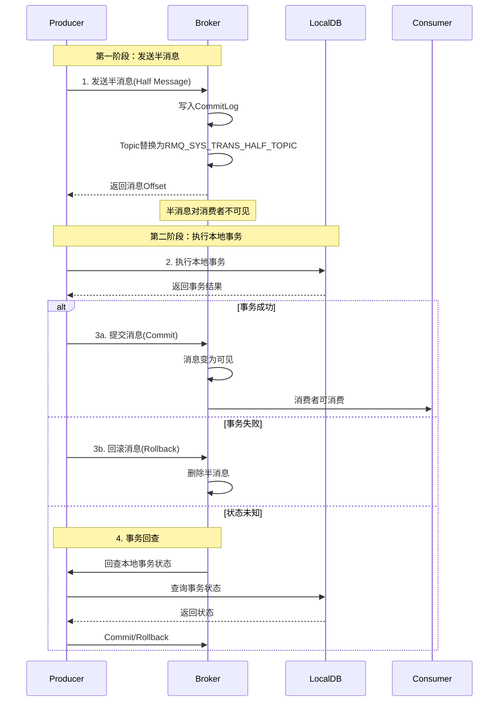
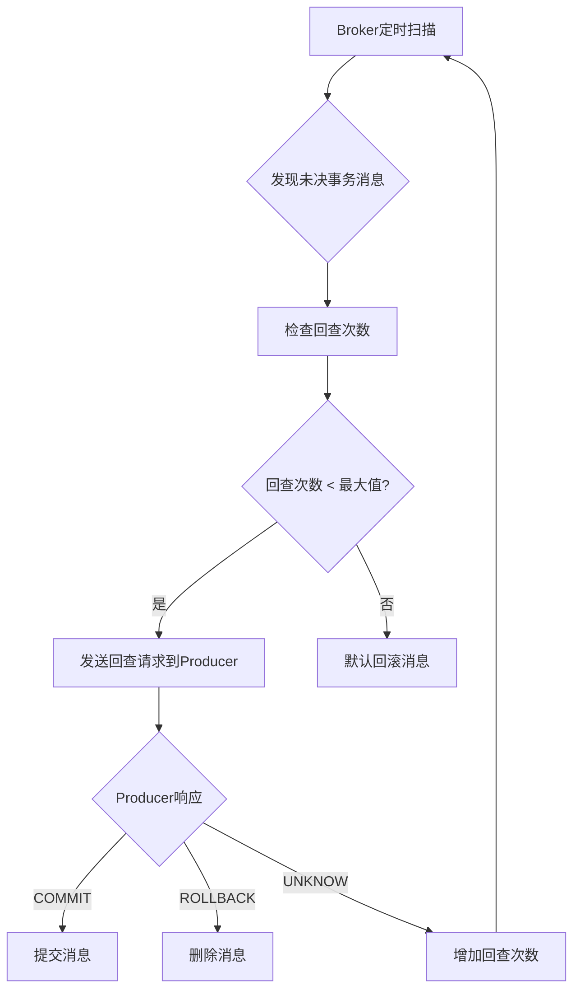
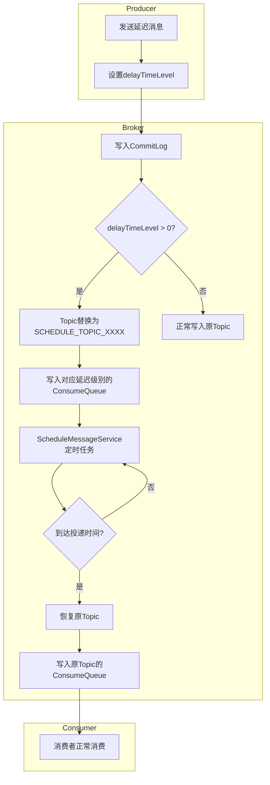
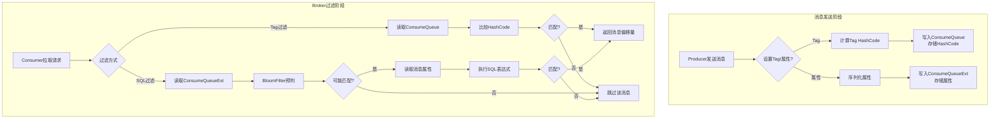
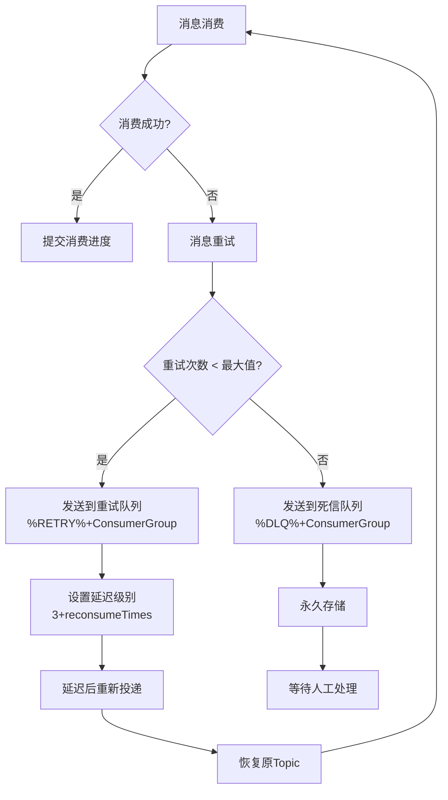
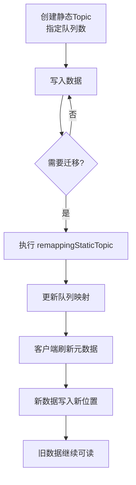

# RocketMQ 技术架构分析 - 高级特性篇

> 本篇深入介绍 RocketMQ 的高级特性，包括顺序消息、事务消息、延迟消息、消息过滤和死信队列。

---

## 一、顺序消息

### 1.1 顺序消息概述

顺序消息分为两种：

| 类型 | 说明 | 场景 |
| --- | --- | --- |
| **全局顺序** | 所有消息严格按 FIFO 顺序消费 | 性能差，极少使用 |
| **分区顺序** | 同一 Sharding Key 的消息顺序消费 | 订单状态流转、数据库 Binlog 同步 |

### 1.2 分区顺序消息原理

```plain
┌─────────────────────────────────────────────────────────────────────────────┐
│                        分区顺序消息原理                                       │
├─────────────────────────────────────────────────────────────────────────────┤
│                                                                             │
│  Producer                          Broker                         Consumer  │
│  ┌──────────────┐                  ┌───────────────────┐        ┌────────┐ │
│  │ OrderID=001  │                  │ Queue0            │        │ C1     │ │
│  │ Msg1,Msg2,Msg3│ ──Hash(001)──► │ [Msg1,Msg2,Msg3]  │ ─────► │ 锁定Q0 │ │
│  └──────────────┘                  └───────────────────┘        └────────┘ │
│                                                                             │
│  ┌──────────────┐                  ┌───────────────────┐        ┌────────┐ │
│  │ OrderID=002  │                  │ Queue1            │        │ C2     │ │
│  │ Msg4,Msg5    │ ──Hash(002)──► │ [Msg4,Msg5]       │ ─────► │ 锁定Q1 │ │
│  └──────────────┘                  └───────────────────┘        └────────┘ │
│                                                                             │
│  关键点:                                                                     │
│  1. 相同 OrderID 的消息 → 相同 Queue (Hash 路由)                             │
│  2. 同一 Queue 的消息 → 单线程串行消费 (队列锁)                               │
│  3. 不同 Queue 的消息 → 可并行消费                                           │
│                                                                             │
└─────────────────────────────────────────────────────────────────────────────┘
```

### 1.3 顺序消息发送

`SelectMessageQueueByHash` 是顺序消息的队列选择器 ([SelectMessageQueueByHash.java](file:///d:/work/github/rocketmq/client/src/main/java/org/apache/rocketmq/client/producer/selector/SelectMessageQueueByHash.java))：

```java
// RocketMQ 4.x 方式：使用 MessageQueueSelector
producer.send(msg, new SelectMessageQueueByHash(), orderId);

// RocketMQ 5.x 方式：使用 Sharding Key
msg.putUserProperty(MessageConst.PROPERTY_SHARDING_KEY, orderId);
producer.send(msg);
```

### 1.4 顺序消息消费

`MessageListenerOrderly` 是顺序消费的监听器接口 ([MessageListenerOrderly.java](file:///d:/work/github/rocketmq/client/src/main/java/org/apache/rocketmq/client/consumer/listener/MessageListenerOrderly.java))：

```java
consumer.registerMessageListener(new MessageListenerOrderly() {
    @Override
    public ConsumeOrderlyStatus consumeMessage(List<MessageExt> msgs, 
        ConsumeOrderlyContext context) {
        // 单线程串行消费，保证顺序
        for (MessageExt msg : msgs) {
            processMessage(msg);
        }
        return ConsumeOrderlyStatus.SUCCESS;
    }
});
```

### 1.5 顺序消费三重锁

```plain
┌─────────────────────────────────────────────────────────────────────────────┐
│                        顺序消费三重锁机制                                     │
├─────────────────────────────────────────────────────────────────────────────┤
│                                                                             │
│  Lock 1: Broker 锁 (MessageQueueLock)                                       │
│  ┌───────────────────────────────────────────────────────────────────────┐ │
│  │ 作用: 保证同一时刻只有一个 Consumer 可以消费该队列                       │ │
│  │ 实现: Broker 端维护锁状态，Consumer 定期续约（默认30秒）                  │ │
│  │ 触发: Rebalance 时向 Broker 申请锁                                      │ │
│  └───────────────────────────────────────────────────────────────────────┘ │
│                                                                             │
│  Lock 2: 队列锁 (objLock)                                                   │
│  ┌───────────────────────────────────────────────────────────────────────┐ │
│  │ 作用: 保证同一 Consumer 内同一队列只能被一个线程消费                     │ │
│  │ 实现: synchronized(objLock)，每个 MessageQueue 一个锁对象              │ │
│  │ 触发: 消费前获取锁                                                      │ │
│  └───────────────────────────────────────────────────────────────────────┘ │
│                                                                             │
│  Lock 3: 消费锁 (ProcessQueue.consumeLock)                                  │
│  ┌───────────────────────────────────────────────────────────────────────┐ │
│  │ 作用: 保证消费过程中 ProcessQueue 状态不被修改                          │ │
│  │ 实现: ReentrantLock，消费前获取锁                                       │ │
│  │ 触发: 消费过程中持有锁                                                  │ │
│  └───────────────────────────────────────────────────────────────────────┘ │
│                                                                             │
└─────────────────────────────────────────────────────────────────────────────┘
```

### 1.6 顺序消费与并发消费对比

| 特性 | 并发消费 | 顺序消费 |
| --- | --- | --- |
| 线程模型 | 多线程并行 | 单线程串行（同一队列） |
| Broker 锁 | 不需要 | 需要 |
| 消费失败处理 | 发回 Broker 重试 | 本地重试，不回 Broker |
| 吞吐量 | 高 | 较低 |
| 适用场景 | 无顺序要求 | 需要顺序保证 |

### 1.7 顺序消息队列扩容问题

**核心问题**：增加队列数会破坏顺序消息的顺序性。

**原因分析**：顺序消息通过 Hash 取模算法将相同 Key 的消息路由到同一队列：

```java
// SelectMessageQueueByHash.java
public MessageQueue select(List<MessageQueue> mqs, Message msg, Object arg) {
    int hashCode = arg.hashCode();  // arg 通常是订单ID等业务Key
    int index = Math.abs(hashCode) % mqs.size();  // 取模决定队列
    return mqs.get(index);
}
```

当队列数从 `N` 变为 `N+1` 时，取模结果会发生变化：

| 场景 | 队列数 | Hash值 | 队列索引 | 结果 |
|------|--------|--------|----------|------|
| 增加前 | 4 | 100 | 100 % 4 = 0 | Queue-0 |
| 增加后 | 5 | 100 | 100 % 5 = 0 | Queue-0 ✅ |
| 增加前 | 4 | 104 | 104 % 4 = 0 | Queue-0 |
| 增加后 | 5 | 104 | 104 % 5 = **4** | Queue-4 ❌ |

**约 20-40% 的 Key 会被重新分配到不同队列**，导致同一业务的消息分散到多个队列，破坏顺序性。

**解决方案**：

| 方案 | 适用场景 | 复杂度 | 说明 |
|------|----------|--------|------|
| **提前规划队列数** | 新系统、可预估规模 | 低 | 队列数 = 消费者实例数 × 2~4 |
| **一致性 Hash** | 需要动态扩容 | 中 | 自定义队列选择器，减少数据迁移 |
| **双写过渡** | 生产环境平滑迁移 | 高 | 新建Topic，双写过渡后切换 |
| **静态 Topic** | RocketMQ 5.x | 中 | 队列数固定，不随 Broker 变化 |

**方案一：提前规划队列数（推荐）**

```bash
# 创建Topic时预留足够的队列
mqadmin updateTopic -c DefaultCluster -t OrderTopic -n 16
```

**方案二：一致性 Hash 队列选择器**

```java
public class ConsistentHashQueueSelector implements MessageQueueSelector {
    private final ConsistentHash<MessageQueue> consistentHash;
    
    public ConsistentHashQueueSelector(List<MessageQueue> mqs) {
        this.consistentHash = new ConsistentHash<>(100, mqs);  // 100个虚拟节点
    }
    
    @Override
    public MessageQueue select(List<MessageQueue> mqs, Message msg, Object arg) {
        return consistentHash.get(arg.toString());
    }
}

// 使用
producer.send(msg, new ConsistentHashQueueSelector(mqs), orderId);
```

**方案三：双写过渡**

```plain
阶段1: 创建新Topic（队列数=目标值）
  Topic: OrderTopic-v2 (16 queues)

阶段2: 双写过渡
  新订单 → OrderTopic-v2
  老订单 → OrderTopic (保持队列数不变)

阶段3: 消费完旧Topic后切换
  Consumer 切换到 OrderTopic-v2
  下线 OrderTopic
```

**方案四：静态 Topic（RocketMQ 5.x）**

```bash
# 创建静态Topic，队列数固定
mqadmin updateTopic -c DefaultCluster -t OrderTopic -n 8 --attribute '+static=true'
```

### 1.8 顺序消息 Rebalance 问题

顺序消息在 Rebalance 时面临特殊挑战，RocketMQ 设计了多层保护机制来应对。

#### 1.8.1 Rebalance 面临的问题

| 问题 | 原因 | 影响 |
| --- | --- | --- |
| **消息重复消费** | Rebalance 时 offset 可能未提交 | 需要业务幂等处理 |
| **Broker 锁竞争** | 新消费者需等待旧消费者释放锁 | 消费短暂暂停（最多60秒） |
| **消费中断** | 队列从旧消费者转移到新消费者 | 短暂延迟 |

#### 1.8.2 保护机制一：消费锁保护

Rebalance 移除队列时，会尝试获取消费锁，确保消费完成后再释放：

```java
// RebalancePushImpl.java
public boolean removeUnnecessaryMessageQueue(MessageQueue mq, ProcessQueue pq) {
    this.defaultMQPushConsumerImpl.getOffsetStore().persist(mq);  // 持久化offset
    this.defaultMQPushConsumerImpl.getOffsetStore().removeOffset(mq);
    
    if (this.defaultMQPushConsumerImpl.isConsumeOrderly()
        && MessageModel.CLUSTERING.equals(this.defaultMQPushConsumerImpl.messageModel())) {
        try {
            // 尝试获取消费锁，等待1秒
            if (pq.getConsumeLock().tryLock(1000, TimeUnit.MILLISECONDS)) {
                try {
                    return this.unlockDelay(mq, pq);  // 延迟解锁
                } finally {
                    pq.getConsumeLock().unlock();
                }
            } else {
                // 获取锁失败，说明正在消费，暂不移除
                log.warn("[WRONG]mq is consuming, so can not unlock it, {}.", mq);
                pq.incTryUnlockTimes();
            }
        } catch (Exception e) {
            log.error("removeUnnecessaryMessageQueue Exception", e);
        }
        return false;  // 移除失败，等待下次 Rebalance
    }
    return true;
}
```

#### 1.8.3 保护机制二：延迟解锁

如果 ProcessQueue 中有未处理完的消息，会延迟 10 秒再解锁：

```java
// RebalancePushImpl.java
private boolean unlockDelay(final MessageQueue mq, final ProcessQueue pq) {
    if (pq.hasTempMessage()) {  // 有临时消息（正在处理）
        // 延迟10秒后解锁，给消费完成留出时间
        this.defaultMQPushConsumerImpl.getmQClientFactory().getScheduledExecutorService()
            .schedule(new Runnable() {
                @Override
                public void run() {
                    RebalancePushImpl.this.unlock(mq, true);
                }
            }, UNLOCK_DELAY_TIME_MILLS, TimeUnit.MILLISECONDS);  // 默认10秒
    } else {
        this.unlock(mq, true);  // 无消息，立即解锁
    }
    return true;
}
```

#### 1.8.4 保护机制三：isDropped 标志

消费过程中会检查队列是否已被标记为丢弃：

```java
// ConsumeMessageOrderlyService.ConsumeRequest.run()
public void run() {
    if (this.processQueue.isDropped()) {
        log.warn("run, the message queue not be able to consume, because it's dropped. {}", 
            this.messageQueue);
        return;  // 队列已标记丢弃，停止消费
    }
    
    final Object objLock = messageQueueLock.fetchLockObject(this.messageQueue);
    synchronized (objLock) {
        // 消费前再次检查
        if (this.processQueue.isDropped()) {
            break;
        }
        // ... 消费逻辑
    }
}
```

#### 1.8.5 保护机制四：Broker 锁过期

Broker 端的队列锁有过期时间，防止消费者宕机导致锁无法释放：

```java
// RebalanceLockManager.java
private final static long REBALANCE_LOCK_MAX_LIVE_TIME = 60000;  // 锁最长存活60秒

public boolean tryLock(final String group, final MessageQueue mq, final String clientId) {
    // ...
    if (lockEntry.isExpired()) {  // 锁过期（60秒未更新）
        lockEntry.setClientId(clientId);  // 新消费者可以获取锁
        return true;
    }
    // ...
}
```

#### 1.8.6 Rebalance 流程图

```plain
┌─────────────────────────────────────────────────────────────────────────────┐
│                      顺序消息 Rebalance 流程                                  │
├─────────────────────────────────────────────────────────────────────────────┤
│                                                                             │
│  Rebalance 触发                                                              │
│       │                                                                     │
│       ▼                                                                     │
│  ┌─────────────────────────────────────────────────────────────────────┐   │
│  │ 旧消费者处理队列移除                                                   │   │
│  │  1. 持久化 offset                                                     │   │
│  │  2. 尝试获取 consumeLock (等待1秒)                                     │   │
│  │     ├─ 成功 → 检查是否有临时消息                                       │   │
│  │     │         ├─ 有 → 延迟10秒后 unlock                               │   │
│  │     │         └─ 无 → 立即 unlock                                     │   │
│  │     └─ 失败 → 标记 tryUnlockTimes++，暂不移除                          │   │
│  │  3. 设置 isDropped = true                                             │   │
│  └─────────────────────────────────────────────────────────────────────┘   │
│       │                                                                     │
│       ▼                                                                     │
│  ┌─────────────────────────────────────────────────────────────────────┐   │
│  │ 新消费者处理队列添加                                                   │   │
│  │  1. 向 Broker 申请队列锁                                               │   │
│  │     ├─ 成功 → 创建 ProcessQueue，开始消费                              │   │
│  │     └─ 失败 → 等待下次 Rebalance 或锁过期（最多60秒）                   │   │
│  │  2. 从 offset store 读取消费位点                                       │   │
│  │  3. 创建 PullRequest，开始拉取消息                                     │   │
│  └─────────────────────────────────────────────────────────────────────┘   │
│                                                                             │
└─────────────────────────────────────────────────────────────────────────────┘
```

#### 1.8.7 最佳实践

| 建议 | 说明 |
| --- | --- |
| **业务幂等** | 顺序消息消费逻辑必须支持幂等，Rebalance 可能导致重复消费 |
| **合理设置消费者数量** | 消费者数量不要超过队列数量，否则部分消费者空闲且增加 Rebalance 复杂度 |
| **监控 Rebalance 频率** | 频繁 Rebalance 会影响顺序消费稳定性 |
| **使用 clientRebalance** | 顺序消费默认使用客户端 Rebalance，确保锁机制生效 |

```java
// 顺序消费会强制使用客户端 Rebalance
@Override
public boolean clientRebalance(String topic) {
    return defaultMQPushConsumerImpl.isConsumeOrderly() 
        || MessageModel.BROADCASTING.equals(messageModel);
}
```

---

## 二、事务消息

### 2.1 事务消息原理

事务消息采用两阶段提交（2PC）机制，确保本地事务与消息发送的原子性：

```mermaid
flowchart TD
    subgraph 第一阶段-发送半消息
        A[Producer发送消息] --> B[设置TRANSACTION_PREPARED标记]
        B --> C[发送到Broker]
        C --> D[Broker写入CommitLog]
        D --> E[写入RMQ_SYS_TRANS_HALF_TOPIC]
        E --> F[返回Offset给Producer]
        Note over E: 消息对消费者不可见
    end
    
    subgraph 第二阶段-执行本地事务
        F --> G[Producer执行本地事务]
        G --> H{事务执行结果}
        H -->|成功| I[返回COMMIT_MESSAGE]
        H -->|失败| J[返回ROLLBACK_MESSAGE]
        H -->|未知| K[返回UNKNOW]
    end
    
    subgraph 第三阶段-提交或回滚
        I --> L[发送Commit请求]
        J --> M[发送Rollback请求]
        K --> N[等待Broker回查]
        
        L --> O[Broker将消息转为可见]
        O --> P[写入原Topic]
        P --> Q[消费者可消费]
        
        M --> R[Broker删除半消息]
        
        N --> T[Broker定时回查]
        T --> U[Producer检查本地事务状态]
        U --> V{事务状态}
        V -->|已提交| L
        V -->|已回滚| M
    end
```

### 2.2 事务消息详细时序



### 2.3 事务消息状态

| 状态 | 说明 | 后续动作 |
| --- | --- | --- |
| `COMMIT_MESSAGE` | 提交事务 | 消息变为可见，消费者可消费 |
| `ROLLBACK_MESSAGE` | 回滚事务 | 消息被删除，消费者不可见 |
| `UNKNOW` | 中间状态 | Broker 发起事务回查 |

### 2.4 事务消息使用示例

`TransactionListener` 是事务消息的监听器接口 ([TransactionListener.java](file:///d:/work/github/rocketmq/client/src/main/java/org/apache/rocketmq/client/producer/TransactionListener.java))，`TransactionMQProducer` 是事务消息生产者 ([TransactionMQProducer.java](file:///d:/work/github/rocketmq/client/src/main/java/org/apache/rocketmq/client/producer/TransactionMQProducer.java))：

```java
// 1. 创建事务监听器
TransactionListener transactionListener = new TransactionListener() {
    @Override
    public LocalTransactionState executeLocalTransaction(Message msg, Object arg) {
        // 执行本地事务
        try {
            doLocalTransaction();
            return LocalTransactionState.COMMIT_MESSAGE;
        } catch (Exception e) {
            return LocalTransactionState.ROLLBACK_MESSAGE;
        }
    }
    
    @Override
    public LocalTransactionState checkLocalTransaction(MessageExt msg) {
        // 回查本地事务状态
        boolean committed = checkTransactionStatus(msg);
        return committed ? LocalTransactionState.COMMIT_MESSAGE 
                         : LocalTransactionState.ROLLBACK_MESSAGE;
    }
};

// 2. 创建事务生产者
TransactionMQProducer producer = new TransactionMQProducer("TransactionProducerGroup");
producer.setNamesrvAddr("localhost:9876");
producer.setTransactionListener(transactionListener);
producer.start();

// 3. 发送事务消息
Message msg = new Message("TopicTest", "Hello".getBytes());
TransactionSendResult result = producer.sendMessageInTransaction(msg, null);
```

### 2.5 事务消息注意事项

| 注意事项 | 说明 |
| --- | --- |
| 不支持延迟消息 | 事务消息的 `delayTimeLevel` 会被忽略 |
| 不支持批量发送 | 事务消息不支持批量发送 |
| 单条消息事务 | 每条事务消息独立提交/回滚 |
| 回查线程池 | 需要配置独立的线程池处理回查 |

### 2.6 发送事务消息核心代码

```java
// DefaultMQProducerImpl.java
public TransactionSendResult sendMessageInTransaction(final Message msg,
    final LocalTransactionExecuter localTransactionExecuter, final Object arg) {
    
    // 1. 设置事务prepared标记
    MessageAccessor.putProperty(msg, MessageConst.PROPERTY_TRANSACTION_PREPARED, "true");
    MessageAccessor.putProperty(msg, MessageConst.PROPERTY_PRODUCER_GROUP, 
        this.defaultMQProducer.getProducerGroup());
    
    // 2. 发送半消息
    SendResult sendResult = this.send(msg);
    
    LocalTransactionState localTransactionState = LocalTransactionState.UNKNOW;
    switch (sendResult.getSendStatus()) {
        case SEND_OK: {
            // 3. 半消息发送成功，执行本地事务
            localTransactionState = transactionListener.executeLocalTransaction(msg, arg);
            break;
        }
        case FLUSH_DISK_TIMEOUT:
        case FLUSH_SLAVE_TIMEOUT:
        case SLAVE_NOT_AVAILABLE:
            // 半消息发送失败，回滚
            localTransactionState = LocalTransactionState.ROLLBACK_MESSAGE;
            break;
    }
    
    // 4. 结束事务（提交/回滚）
    this.endTransaction(msg, sendResult, localTransactionState, localException);
    
    return transactionSendResult;
}
```

### 2.7 事务回查机制

当本地事务返回 `UNKNOW` 或 Producer 与 Broker 断开连接时，Broker 会定时发起事务回查：



**事务回查配置**：

| 配置项 | 默认值 | 说明 |
| --- | --- | --- |
| `transactionTimeout` | 6000ms | 事务超时时间，超时后开始回查 |
| `transactionCheckMax` | 5 | 最大回查次数 |
| `transactionCheckInterval` | 60000ms | 回查间隔 |

---

## 三、延迟消息

### 3.1 延迟级别

RocketMQ 不支持任意时间的延迟，而是提供固定的延迟级别：

| 延迟级别 | 延迟时间 | 延迟级别 | 延迟时间 |
| --- | --- | --- | --- |
| 1 | 1 秒 | 10 | 6 分钟 |
| 2 | 5 秒 | 11 | 7 分钟 |
| 3 | 10 秒 | 12 | 8 分钟 |
| 4 | 30 秒 | 13 | 9 分钟 |
| 5 | 1 分钟 | 14 | 10 分钟 |
| 6 | 2 分钟 | 15 | 20 分钟 |
| 7 | 3 分钟 | 16 | 30 分钟 |
| 8 | 4 分钟 | 17 | 1 小时 |
| 9 | 5 分钟 | 18 | 2 小时 |

### 3.2 延迟消息实现原理



### 3.3 延迟消息使用

```java
Message message = new Message("TestTopic", "Hello".getBytes());
message.setDelayTimeLevel(3);  // 10秒后消费
producer.send(message);
```

### 3.4 ScheduleMessageService 核心实现

`ScheduleMessageService` 是延迟消息的核心实现 ([ScheduleMessageService.java](file:///d:/work/github/rocketmq/broker/src/main/java/org/apache/rocketmq/broker/schedule/ScheduleMessageService.java))，负责：
- 解析延迟级别配置，建立级别与延迟时间的映射
- 为每个延迟级别启动定时任务，扫描到期消息
- 将到期消息恢复原 Topic 并投递

**核心数据结构**：

```java
public class ScheduleMessageService extends ConfigManager {
    // 延迟级别 -> 延迟时间映射
    private final ConcurrentMap<Integer, Long> delayLevelTable = new ConcurrentHashMap<>();
    
    // 延迟级别 -> 消费进度映射
    private final ConcurrentMap<Integer, Long> offsetTable = new ConcurrentHashMap<>();
    
    // 定时任务执行器
    private ScheduledExecutorService deliverExecutorService;
    
    // 最大延迟级别
    private int maxDelayLevel;
}
```

**启动流程**：

```java
public void start() {
    if (started.compareAndSet(false, true)) {
        this.load();  // 加载消费进度
        this.deliverExecutorService = new ScheduledThreadPoolExecutor(this.maxDelayLevel);
        
        // 为每个延迟级别启动一个定时任务
        for (Map.Entry<Integer, Long> entry : this.delayLevelTable.entrySet()) {
            Integer level = entry.getKey();
            Long timeDelay = entry.getValue();
            Long offset = this.offsetTable.get(level);
            
            this.deliverExecutorService.schedule(
                new DeliverDelayedMessageTimerTask(level, offset), 
                FIRST_DELAY_TIME, TimeUnit.MILLISECONDS);
        }
    }
}
```

**消息投递任务**：

```java
class DeliverDelayedMessageTimerTask implements Runnable {
    private final int delayLevel;
    private final long offset;
    
    @Override
    public void run() {
        // 1. 从延迟队列读取消息
        // 2. 检查是否到达投递时间
        // 3. 恢复原 Topic 并写入 CommitLog
        // 4. 更新消费进度
        // 5. 调度下一次检查
    }
}
```

**计算投递时间**：

```java
public long computeDeliverTimestamp(final int delayLevel, final long storeTimestamp) {
    Long time = this.delayLevelTable.get(delayLevel);
    if (time != null) {
        return time + storeTimestamp;  // 存储时间 + 延迟时间 = 投递时间
    }
    return storeTimestamp + 1000;
}
```

### 3.5 延迟消息与消息重试

消费失败的消息会自动进入延迟重试队列，延迟级别与重试次数相关：

```java
// 消息重试延迟级别计算
int delayLevel = 3 + reconsumeTimes;  // 第1次重试: level=4(30s), 第2次: level=5(1m)...
```

---

## 四、消息过滤

### 4.1 过滤方式对比

| 特性 | Tag 过滤 | SQL92 过滤 |
| --- | --- | --- |
| 性能 | 高（仅 HashCode 比较） | 较低（需解析属性） |
| 功能 | 简单标签匹配 | 复杂条件组合 |
| 存储 | ConsumeQueue 存储 HashCode | 需要 ConsumeQueueExt 存储属性 |
| Broker 配置 | 默认支持 | 需要开启 `enablePropertyFilter` |
| 适用场景 | 简单分类过滤 | 复杂业务条件过滤 |

### 4.2 Tag 过滤

```java
// 生产者设置 Tag
Message msg = new Message("TopicTest", "TagA", "Hello".getBytes());

// 消费者按 Tag 订阅（支持多个 Tag，用 || 分隔）
consumer.subscribe("TopicTest", "TagA || TagB || TagC");
```

**Tag 过滤流程**：

```plain
┌─────────────────────────────────────────────────────────────────────────────┐
│                          Tag 过滤流程                                        │
├─────────────────────────────────────────────────────────────────────────────┤
│                                                                             │
│  1. Broker 端过滤（基于 HashCode）                                           │
│  ┌───────────────────────────────────────────────────────────────────────┐ │
│  │ ConsumeQueue 每条记录存储 Tags HashCode (8字节)                        │ │
│  │ 订阅表达式的 Tags 也计算 HashCode                                       │ │
│  │ 比较 HashCode 快速过滤                                                  │ │
│  └───────────────────────────────────────────────────────────────────────┘ │
│                                                                             │
│  2. 客户端二次过滤（精确匹配 Tag 字符串）                                     │
│  ┌───────────────────────────────────────────────────────────────────────┐ │
│  │ Broker 端 HashCode 可能碰撞                                             │ │
│  │ 客户端再次精确匹配 Tag 字符串                                            │ │
│  └───────────────────────────────────────────────────────────────────────┘ │
│                                                                             │
└─────────────────────────────────────────────────────────────────────────────┘
```

### 4.3 SQL92 过滤

除了 Tag 过滤，RocketMQ 还支持 **SQL92 表达式过滤**，可以基于消息属性进行更灵活的过滤：

```java
// 生产者设置消息属性
Message msg = new Message("TopicTest", "TagA", body);
msg.putUserProperty("orderStatus", "PAID");
msg.putUserProperty("amount", "1000");
msg.putUserProperty("region", "BJ");

// 消费者使用 SQL92 表达式订阅
consumer.subscribe("TopicTest", 
    MessageSelector.bySql("orderStatus = 'PAID' AND amount > 500"));
```

**SQL92 过滤语法** ([ExpressionType.java](file:///d:/work/github/rocketmq/common/src/main/java/org/apache/rocketmq/common/filter/ExpressionType.java))：

| 语法元素 | 说明 | 示例 |
| --- | --- | --- |
| **比较运算符** | `>`, `>=`, `<`, `<=`, `=` | `amount > 100` |
| **逻辑运算符** | `AND`, `OR`, `NOT` | `a > 10 AND b = 'test'` |
| **BETWEEN** | 范围查询 | `amount BETWEEN 100 AND 500` |
| **IN** | 集合匹配 | `region IN ('BJ', 'SH', 'GZ')` |
| **IS NULL / IS NOT NULL** | 空值判断 | `orderId IS NOT NULL` |
| **TRUE / FALSE** | 布尔值判断 | `isVip = TRUE` |

**数据类型支持**：

| 类型 | 说明 | 示例 |
| --- | --- | --- |
| Boolean | 布尔值 | `TRUE`, `FALSE` |
| String | 字符串（单引号） | `'abc'` |
| Decimal | 整数 | `123` |
| Float | 浮点数 | `3.1415` |

**Tag 过滤 vs SQL92 过滤对比**：

| 对比项 | Tag 过滤 | SQL92 过滤 |
| --- | --- | --- |
| **表达式类型** | `ExpressionType.TAG` | `ExpressionType.SQL92` |
| **过滤依据** | 消息 Tag | 消息用户属性 |
| **语法复杂度** | 简单（`TagA \|\| TagB`） | 复杂（支持 SQL92 语法） |
| **性能** | 高（ConsumeQueue 中直接过滤） | 较低（需读取消息属性） |
| **适用场景** | 简单分类过滤 | 多维度属性过滤 |

**注意事项**：
- SQL92 过滤需要 Broker 开启 `enablePropertyFilter=true`
- 属性名区分大小写
- 只有通过 `putUserProperty()` 设置的属性才能参与过滤


### 4.4 过滤流程图



---

## 五、死信队列

### 5.1 死信队列概述

死信队列（Dead Letter Queue, DLQ）用于存储无法被正常消费的消息：

| 特性 | 说明 |
| --- | --- |
| Topic 格式 | `%DLQ%` + ConsumerGroup |
| 消息来源 | 重试次数超限的消息 |
| 可见性 | 立即可见 |
| 消费方式 | 需要专门处理 |
| 消息生命周期 | 持久化存储 |

### 5.2 消息重试与死信流程



### 5.3 死信队列产生条件

| 条件 | 说明 |
| --- | --- |
| 重试次数超限 | 默认 16 次重试后仍失败 |
| delayLevel < 0 | 特殊标记强制进入死信队列 |

### 5.4 死信队列处理

```java
// 创建死信队列消费者
DefaultMQPushConsumer dlqConsumer = new DefaultMQPushConsumer("DLQ_HANDLER_GROUP");
dlqConsumer.subscribe("%DLQ%OrderConsumerGroup", "*");
dlqConsumer.registerMessageListener(new MessageListenerConcurrently() {
    @Override
    public ConsumeConcurrentlyStatus consumeMessage(List<MessageExt> msgs, 
        ConsumeConcurrentlyContext context) {
        for (MessageExt msg : msgs) {
            String originTopic = msg.getProperty(MessageConst.PROPERTY_RETRY_TOPIC);
            int reconsumeTimes = msg.getReconsumeTimes();
            // 处理死信消息
            handleDeadLetter(msg, originTopic, reconsumeTimes);
        }
        return ConsumeConcurrentlyStatus.CONSUME_SUCCESS;
    }
});
dlqConsumer.start();
```

### 5.5 重试队列与死信队列对比

| 特性 | 重试队列 | 死信队列 |
| --- | --- | --- |
| Topic 格式 | `%RETRY%` + ConsumerGroup | `%DLQ%` + ConsumerGroup |
| 消息来源 | 消费失败的消息 | 重试次数超限的消息 |
| 可见性 | 延迟后可见 | 立即可见 |
| 消费方式 | 原消费者自动消费 | 需要专门处理 |
| 消息生命周期 | 临时存储 | 持久化存储 |

---

## 六、消息轨迹

### 6.1 轨迹数据结构

```plain
┌─────────────────────────────────────────────────────────────────────────────┐
│                          消息轨迹数据                                        │
├─────────────────────────────────────────────────────────────────────────────┤
│  TraceBean (生产端):                                                         │
│  ├── topic: 消息主题                                                         │
│  ├── msgId: 消息ID                                                          │
│  ├── tags: 消息标签                                                         │
│  ├── keys: 消息Key                                                          │
│  ├── storeTime: 存储时间                                                     │
│  ├── brokerName: Broker名称                                                 │
│  └── traceType: Publish                                                     │
│                                                                              │
│  TraceBean (消费端):                                                         │
│  ├── topic: 消息主题                                                         │
│  ├── msgId: 消息ID                                                          │
│  ├── consumerGroup: 消费者组                                                 │
│  ├── retryTimes: 重试次数                                                    │
│  ├── storeTime: 存储时间                                                     │
│  ├── consumeTime: 消费时间                                                   │
│  ├── status: 消费状态                                                        │
│  └── traceType: SubBefore/SubAfter                                          │
└─────────────────────────────────────────────────────────────────────────────┘
```

### 6.2 轨迹开启方式

```java
// 生产者开启轨迹
DefaultMQProducer producer = new DefaultMQProducer("ProducerGroup", true);

// 消费者开启轨迹
DefaultMQPushConsumer consumer = new DefaultMQPushConsumer("ConsumerGroup", true);

// 自定义轨迹Topic
producer.setTraceTopic("RMQ_SYS_TRACE_TOPIC_CUSTOM");
```

---

## 七、请求-响应模式

### 7.1 模式架构

```plain
┌─────────────────────────────────────────────────────────────────────────────┐
│                        请求-响应模式                                         │
├─────────────────────────────────────────────────────────────────────────────┤
│                                                                             │
│  Producer (请求方)                   Consumer (响应方)                       │
│  ┌──────────────────┐               ┌──────────────────┐                    │
│  │                  │   请求消息     │                  │                    │
│  │  request()       │ ────────────► │  消费消息        │                    │
│  │                  │               │  处理业务        │                    │
│  │  等待响应...      │               │  reply()        │                    │
│  │                  │ ◄──────────── │                  │                    │
│  │  收到响应        │   响应消息     │                  │                    │
│  └──────────────────┘               └──────────────────┘                    │
│                                                                             │
│  响应消息发送到临时Topic: reply-to-{uniqueId}                                │
│  Producer 订阅该临时Topic接收响应                                            │
└─────────────────────────────────────────────────────────────────────────────┘
```

### 7.2 使用示例

```java
// Producer 发送请求并等待响应
Message requestMsg = new Message("RequestTopic", "Hello".getBytes());
Message responseMsg = producer.request(requestMsg, 3000);  // 超时3秒

// Consumer 处理请求并回复
consumer.registerMessageListener(new MessageListenerConcurrently() {
    @Override
    public ConsumeConcurrentlyStatus consumeMessage(List<MessageExt> msgs,
        ConsumeConcurrentlyContext context) {
        for (MessageExt msg : msgs) {
            String result = processRequest(msg);
            
            // 回复响应
            Message responseMsg = new Message(
                msg.getProperty(MessageConst.PROPERTY_REPLY_TO),
                result.getBytes());
            responseMsg.setProperty(MessageConst.PROPERTY_CORRELATION_ID,
                msg.getProperty(MessageConst.PROPERTY_CORRELATION_ID));
            producer.send(responseMsg);
        }
        return ConsumeConcurrentlyStatus.CONSUME_SUCCESS;
    }
});
```

---

## 八、静态 Topic

静态 Topic 是 RocketMQ 5.x 引入的高级特性，使用**逻辑队列**实现队列数固定、支持跨 Broker 迁移的 Topic。

### 10.1 使用场景

| 场景 | 说明 | 静态 Topic 优势 |
|------|------|----------------|
| **顺序消息** | 需要固定队列数保证顺序 | 队列数固定，分区键映射稳定 |
| **资源规划** | 需要精确控制并发度 | 队列数可预测，便于容量规划 |
| **Broker 迁移** | 需要在不中断服务的情况下迁移 | 逻辑队列透明迁移，客户端无感知 |
| **多租户隔离** | 每个租户固定队列配额 | 队列数固定，便于配额管理 |
| **数据集成** | Flink/Spark 等大数据组件 | 固定分区数，避免数据倾斜 |

**普通主题 vs 静态 Topic**：

| 特性 | 普通主题 | 静态 Topic |
| --- | --- | --- |
| 队列数量 | 随 Broker 数量动态变化 | 固定不变 |
| topicSysFlag | 0 | 1, 2, 3 |
| 适用场景 | 普通业务消息 | 数据集成、多机房容灾 |
| 使用比例 | ~99% | ~1% |

**典型场景：两地三中心容灾部署**：

```
                    ┌──────────────────────────────────────┐
                    │           NameServer                 │
                    └──────────────────────────────────────┘
                                     │
              ┌──────────────────────┴──────────────────────┐
              ▼                                              ▼
    ┌─────────────────┐                          ┌─────────────────┐
    │   Cluster A     │                          │   Cluster B     │
    │   (北京机房)     │                          │   (上海机房)     │
    └─────────────────┘                          └─────────────────┘

正常情况：
- 北京机房只看到本单元的队列，机房内就近访问
- 上海机房只看到本单元的队列，保证顺序性

灾难情况（北京机房宕机）：
- 上海机房的 Consumer 可跨单元消费北京机房未消费完的数据
```

> **注意**：普通业务系统不需要关心 `topicSysFlag`，保持默认值 `0` 即可。只有在大规模多机房部署、全球容灾、或需要固定队列数的数据集成场景（如 Flink、Spark）才需要使用静态 Topic。

### 10.2 创建与迁移命令

**创建静态 Topic**：

```bash
# 创建静态 Topic，指定 10 个队列，分布在指定集群
mqadmin updateStaticTopic -t StaticTopicTest -c DefaultCluster -qn 10

# 创建静态 Topic，指定队列数和 Broker
mqadmin updateStaticTopic -t StaticTopicTest -b broker-a,broker-b -qn 20
```

**重新映射静态 Topic（迁移队列）**：

```bash
# 将静态 Topic 迁移到新的 Broker 集合
mqadmin remappingStaticTopic -t StaticTopicTest -c NewCluster
```

### 10.3 代码示例

```java
// 生产者使用静态 Topic（与普通 Topic 无区别）
DefaultMQProducer producer = new DefaultMQProducer("ProducerGroup");
producer.setNamesrvAddr("localhost:9876");
producer.start();

Message msg = new Message("StaticTopicTest", "Hello Static Topic".getBytes());
SendResult result = producer.send(msg);
// 队列选择基于逻辑队列ID，不受 Broker 变化影响

// 消费者使用静态 Topic
DefaultMQPushConsumer consumer = new DefaultMQPushConsumer("ConsumerGroup");
consumer.subscribe("StaticTopicTest", "*");
consumer.registerMessageListener(new MessageListenerConcurrently() {
    @Override
    public ConsumeConcurrentlyStatus consumeMessage(List<MessageExt> msgs, ConsumeConcurrentlyContext context) {
        // 消费逻辑队列，底层自动路由到正确的物理队列
        return ConsumeConcurrentlyStatus.CONSUME_SUCCESS;
    }
});
consumer.start();
```

### 10.4 迁移流程



**迁移命令执行流程**：

1. **计算新映射**：根据目标 Broker 集合重新分配逻辑队列
2. **保存旧映射**：自动备份当前映射到临时文件
3. **更新配置**：将新映射下发到所有 Broker
4. **客户端刷新**：客户端定期刷新元数据，获取新映射
5. **透明迁移**：新消息写入新位置，旧消息仍可读取

> **注意**：静态 Topic 的队列迁移是**逻辑层面的映射变更**，实际数据仍存储在原 Broker，仅新消息写入新位置。

### 10.5 核心数据结构

静态 Topic 的核心数据结构详见 [02-核心概念篇 - TopicQueueMappingInfo](02-核心概念篇.md#441-topicroutedata路由数据)。

---

## 九、Consumer Group 自动创建机制

> **Consumer 不会自动创建 Topic**，但会自动创建 Consumer Group。Topic 必须由 Producer 或运维预先创建。

### 9.1 检查顺序

Broker 处理 Consumer 拉取请求时，按以下顺序检查：

```
Consumer 请求拉取 "OrderService" Topic 消息
                ↓
        1. 检查 Topic 是否存在
                ↓
        ┌───────┴───────┐
        ↓               ↓
   Topic 不存在      Topic 存在
        ↓               ↓
   返回错误         2. 检查 Consumer Group
   Consumer 失败          ↓
                  ┌──────┴──────┐
                  ↓             ↓
             Group 存在      Group 不存在
                  ↓             ↓
               正常拉取     自动创建 Group
```

### 9.2 Topic 不存在时的错误

当 Consumer 订阅一个不存在的 Topic 时，Broker 会返回 `TOPIC_NOT_EXIST` 错误 ([PullMessageProcessor.java:336-339](file:///d:/work/github/rocketmq/broker/src/main/java/org/apache/rocketmq/broker/processor/PullMessageProcessor.java#L336-L339))：

```java
TopicConfig topicConfig = this.brokerController.getTopicConfigManager().selectTopicConfig(requestHeader.getTopic());
if (null == topicConfig) {
    response.setCode(ResponseCode.TOPIC_NOT_EXIST);
    response.setRemark(String.format("topic[%s] not exist, apply first please!", requestHeader.getTopic()));
    return response;
}
```

### 9.3 Consumer Group 自动创建

**前提条件**：Topic 必须已存在（由 Producer 或运维创建）

**自动创建逻辑** ([SubscriptionGroupManager.java:209-224](file:///d:/work/github/rocketmq/broker/src/main/java/org/apache/rocketmq/broker/subscription/SubscriptionGroupManager.java#L209-L224))：

```java
public SubscriptionGroupConfig findSubscriptionGroupConfig(final String group) {
    SubscriptionGroupConfig subscriptionGroupConfig = this.subscriptionGroupTable.get(group);
    if (null == subscriptionGroupConfig) {
        if (brokerController.getBrokerConfig().isAutoCreateSubscriptionGroup() || MixAll.isSysConsumerGroup(group)) {
            subscriptionGroupConfig = new SubscriptionGroupConfig();
            subscriptionGroupConfig.setGroupName(group);
            // 自动创建 Consumer Group
        }
    }
    return subscriptionGroupConfig;
}
```

### 9.4 与 Producer 自动创建对比

| 角色 | Topic 自动创建 | Group 自动创建 | 配置项 |
| --- | --- | --- | --- |
| Producer | ✅ 支持 | - | `autoCreateTopicEnable` |
| Consumer | ❌ 不支持 | ✅ 支持 | `autoCreateSubscriptionGroup` |

> **Topic 自动创建机制详见**：[消息发送篇 - Topic 自动创建机制](./03-消息发送篇.md#十topic-自动创建机制)

### 9.5 典型启动顺序

| 启动顺序 | Topic 状态 | Consumer Group 状态 | 结果 |
|---------|-----------|-------------------|------|
| Consumer 先启动 | 不存在 | 不存在 | **失败**（Topic 不存在） |
| Producer 先启动 | 自动创建 | - | - |
| Consumer 后启动 | 已存在 | 不存在 | Consumer Group 自动创建 ✅ |

---

## 十、总结

本篇介绍了 RocketMQ 的高级特性：

1. **顺序消息**：通过 Hash 路由 + 三重锁机制保证同一 Sharding Key 的消息顺序
2. **事务消息**：两阶段提交 + 事务回查，确保本地事务与消息发送的原子性
3. **延迟消息**：18 个固定延迟级别，通过 `SCHEDULE_TOPIC_XXXX` 中转实现
4. **消息过滤**：Tag 过滤（高性能）和 SQL92 过滤（功能丰富）
5. **死信队列**：重试超限的消息进入死信队列，需人工处理
6. **消息轨迹**：追踪消息从生产到消费的完整链路
7. **请求-响应模式**：类似 RPC 的同步调用模式
8. **静态 Topic**：逻辑队列实现队列数固定，支持跨 Broker 透明迁移
9. **Consumer Group 自动创建**：Topic 存在时自动创建 Consumer Group

理解这些高级特性，有助于在不同业务场景下正确使用 RocketMQ。
