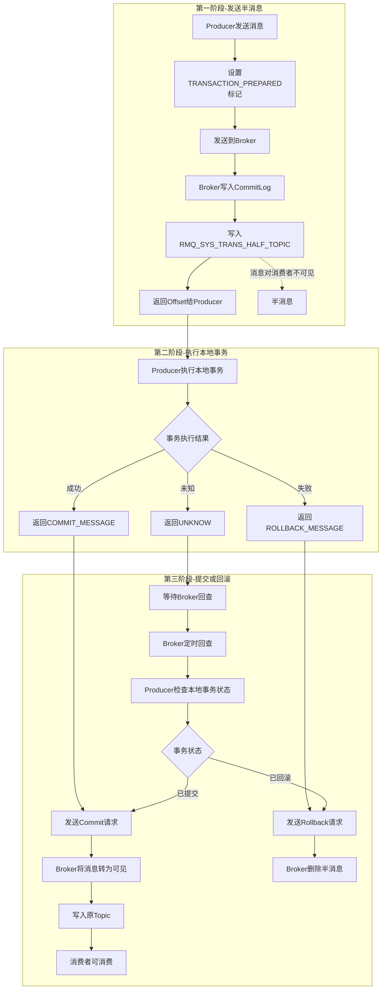
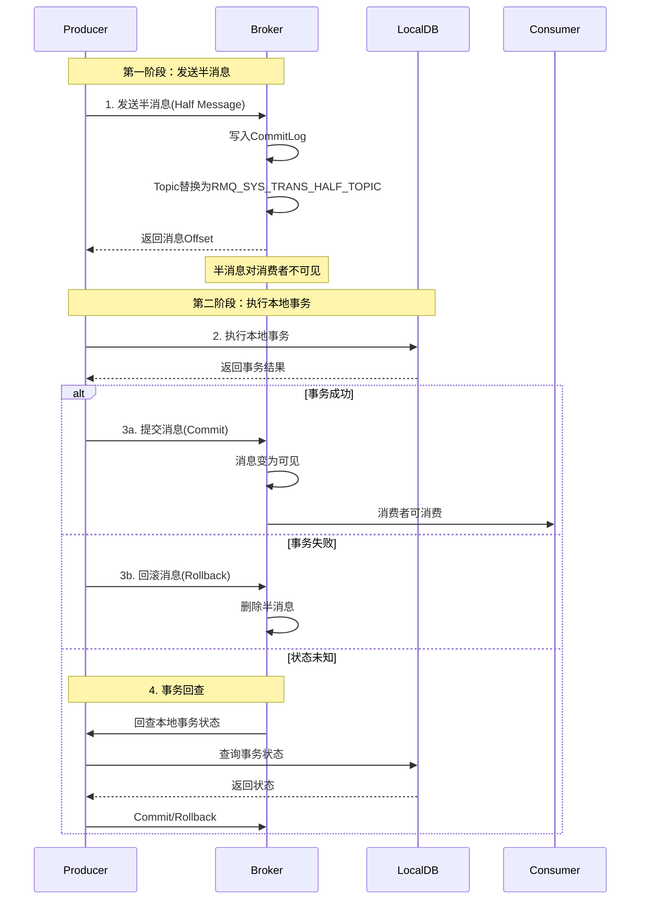
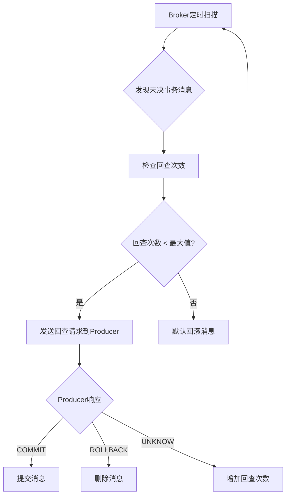
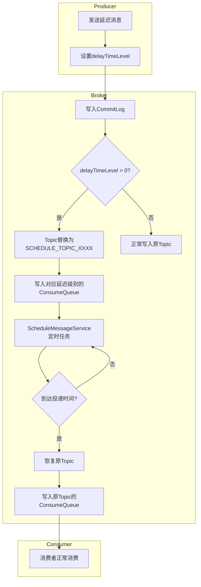
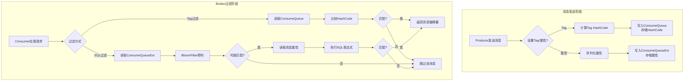
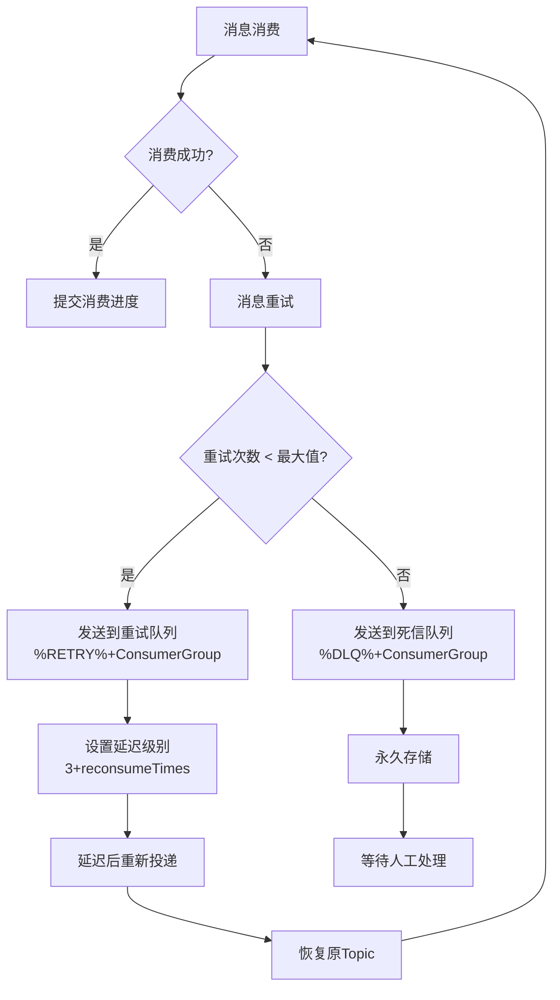
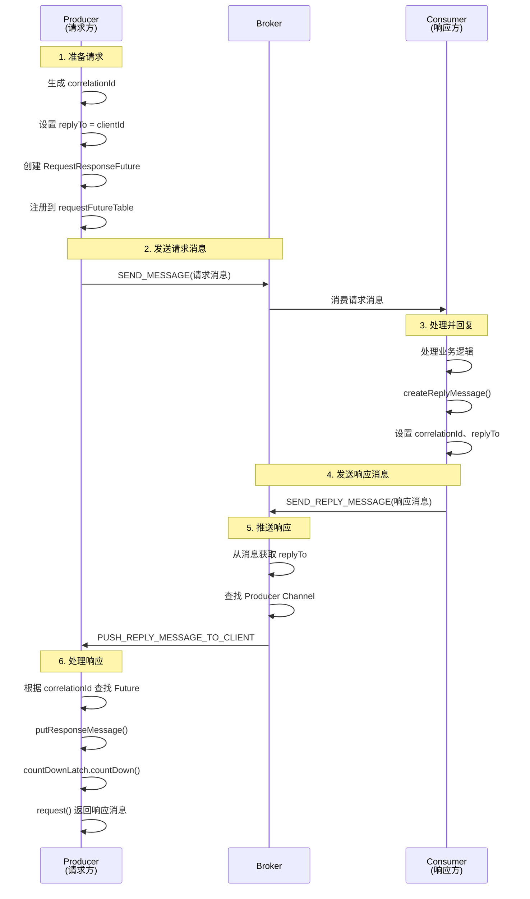
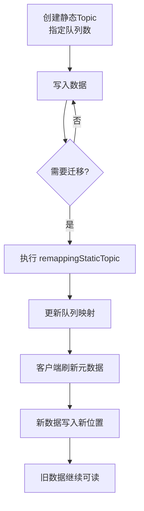

# RocketMQ 技术架构分析 - 高级特性篇

> 本篇深入介绍 RocketMQ 的高级特性，包括顺序消息、事务消息、延迟消息、消息过滤和死信队列。

---

## 一、顺序消息

### 1.1 顺序消息概述

顺序消息分为两种：

| 类型 | 说明 | 场景 |
| --- | --- | --- |
| **全局顺序** | 所有消息严格按 FIFO 顺序消费 | 性能差，极少使用 |
| **分区顺序** | 同一 Sharding Key 的消息顺序消费 | 订单状态流转、数据库 Binlog 同步 |

### 1.2 分区顺序消息原理

```plain
┌─────────────────────────────────────────────────────────────────────────────┐
│                        分区顺序消息原理                                       │
├─────────────────────────────────────────────────────────────────────────────┤
│                                                                             │
│  Producer                          Broker                         Consumer  │
│  ┌──────────────┐                  ┌───────────────────┐        ┌────────┐ │
│  │ OrderID=001  │                  │ Queue0            │        │ C1     │ │
│  │ Msg1,Msg2,Msg3│ ──Hash(001)──► │ [Msg1,Msg2,Msg3]  │ ─────► │ 锁定Q0 │ │
│  └──────────────┘                  └───────────────────┘        └────────┘ │
│                                                                             │
│  ┌──────────────┐                  ┌───────────────────┐        ┌────────┐ │
│  │ OrderID=002  │                  │ Queue1            │        │ C2     │ │
│  │ Msg4,Msg5    │ ──Hash(002)──► │ [Msg4,Msg5]       │ ─────► │ 锁定Q1 │ │
│  └──────────────┘                  └───────────────────┘        └────────┘ │
│                                                                             │
│  关键点:                                                                     │
│  1. 相同 OrderID 的消息 → 相同 Queue (Hash 路由)                             │
│  2. 同一 Queue 的消息 → 单线程串行消费 (队列锁)                               │
│  3. 不同 Queue 的消息 → 可并行消费                                           │
│                                                                             │
└─────────────────────────────────────────────────────────────────────────────┘
```

### 1.3 顺序消息发送

`SelectMessageQueueByHash` 是顺序消息的队列选择器 ([SelectMessageQueueByHash.java](../../client/src/main/java/org/apache/rocketmq/client/producer/selector/SelectMessageQueueByHash.java))：

```java
// RocketMQ 4.x 方式：使用 MessageQueueSelector
producer.send(msg, new SelectMessageQueueByHash(), orderId);

// RocketMQ 5.x 方式：使用 Sharding Key
msg.putUserProperty(MessageConst.PROPERTY_SHARDING_KEY, orderId);
producer.send(msg);
```

### 1.4 顺序消息消费

`MessageListenerOrderly` 是顺序消费的监听器接口 ([MessageListenerOrderly.java](../../client/src/main/java/org/apache/rocketmq/client/consumer/listener/MessageListenerOrderly.java))：

```java
consumer.registerMessageListener(new MessageListenerOrderly() {
    @Override
    public ConsumeOrderlyStatus consumeMessage(List<MessageExt> msgs, 
        ConsumeOrderlyContext context) {
        // 单线程串行消费，保证顺序
        for (MessageExt msg : msgs) {
            processMessage(msg);
        }
        return ConsumeOrderlyStatus.SUCCESS;
    }
});
```

**ConsumeOrderlyStatus 枚举值** ([ConsumeOrderlyStatus.java](../../client/src/main/java/org/apache/rocketmq/client/consumer/listener/ConsumeOrderlyStatus.java))：

| 枚举值 | 说明 | 使用场景 |
| --- | --- | --- |
| `SUCCESS` | 消费成功 | 正常消费完成，提交消费进度 |
| `SUSPEND_CURRENT_QUEUE_A_MOMENT` | 暂停当前队列消费 | 消费失败，挂起当前队列一段时间后重试 |
| `ROLLBACK` | 回滚消费（已废弃） | 仅用于 Binlog 消费场景 |
| `COMMIT` | 提交偏移量（已废弃） | 仅用于 Binlog 消费场景 |

**ConsumeOrderlyContext 上下文属性** ([ConsumeOrderlyContext.java](../../client/src/main/java/org/apache/rocketmq/client/consumer/listener/ConsumeOrderlyContext.java))：

| 属性 | 类型 | 默认值 | 说明 |
| --- | --- | --- | --- |
| `messageQueue` | MessageQueue | - | 当前消费的消息队列 |
| `autoCommit` | boolean | true | 是否自动提交消费进度 |
| `suspendCurrentQueueTimeMillis` | long | -1 | 挂起时间（毫秒），-1 表示使用默认值 1000ms（1s） |

> **默认挂起时间**：当 `suspendCurrentQueueTimeMillis = -1` 时，使用 `DefaultMQPushConsumer.suspendCurrentQueueTimeMillis` 的默认值 1000ms（1s）。可通过 `consumer.setSuspendCurrentQueueTimeMillis()` 修改。

**顺序消费失败处理**：

```java
consumer.registerMessageListener(new MessageListenerOrderly() {
    @Override
    public ConsumeOrderlyStatus consumeMessage(List<MessageExt> msgs, 
        ConsumeOrderlyContext context) {
        for (MessageExt msg : msgs) {
            try {
                processMessage(msg);
            } catch (Exception e) {
                // 消费失败，挂起当前队列一段时间
                context.setSuspendCurrentQueueTimeMillis(3000);  // 挂起 3 秒
                return ConsumeOrderlyStatus.SUSPEND_CURRENT_QUEUE_A_MOMENT;
            }
        }
        return ConsumeOrderlyStatus.SUCCESS;
    }
});
```

> **注意**：顺序消费失败时**不会发回 Broker 重试**，而是在本地挂起当前队列后重新消费，这保证了消息顺序性。

### 1.5 顺序消费三重锁

```plain
┌─────────────────────────────────────────────────────────────────────────────┐
│                        顺序消费三重锁机制                                     │
├─────────────────────────────────────────────────────────────────────────────┤
│                                                                             │
│  Lock 1: Broker 锁 (MessageQueueLock)                                       │
│  ┌───────────────────────────────────────────────────────────────────────┐ │
│  │ 作用: 保证同一时刻只有一个 Consumer 可以消费该队列                       │ │
│  │ 实现: Broker 端维护锁状态，Consumer 定期续约（默认20s）                   │ │
│  │ 触发: Rebalance 时向 Broker 申请锁                                      │ │
│  └───────────────────────────────────────────────────────────────────────┘ │
│                                                                             │
│  Lock 2: 队列锁 (objLock)                                                   │
│  ┌───────────────────────────────────────────────────────────────────────┐ │
│  │ 作用: 保证同一 Consumer 内同一队列只能被一个线程消费                     │ │
│  │ 实现: synchronized(objLock)，每个 MessageQueue 一个锁对象              │ │
│  │ 触发: 消费前获取锁                                                      │ │
│  └───────────────────────────────────────────────────────────────────────┘ │
│                                                                             │
│  Lock 3: 消费锁 (ProcessQueue.consumeLock)                                  │
│  ┌───────────────────────────────────────────────────────────────────────┐ │
│  │ 作用: 保证消费过程中 ProcessQueue 状态不被修改                          │ │
│  │ 实现: ReentrantLock，消费前获取锁                                       │ │
│  │ 触发: 消费过程中持有锁                                                  │ │
│  └───────────────────────────────────────────────────────────────────────┘ │
│                                                                             │
└─────────────────────────────────────────────────────────────────────────────┘
```

### 1.6 顺序消费与并发消费对比

| 特性 | 并发消费 | 顺序消费 |
| --- | --- | --- |
| 线程模型 | 多线程并行 | 单线程串行（同一队列） |
| Broker 锁 | 不需要 | 需要 |
| 消费失败处理 | 发回 Broker 重试 | 本地重试，不回 Broker |
| 吞吐量 | 高 | 较低 |
| 适用场景 | 无顺序要求 | 需要顺序保证 |

### 1.7 顺序消息队列扩容问题

**核心问题**：增加队列数会破坏顺序消息的顺序性。

**原因分析**：顺序消息通过 Hash 取模算法将相同 Key 的消息路由到同一队列：

```java
// SelectMessageQueueByHash.java
public MessageQueue select(List<MessageQueue> mqs, Message msg, Object arg) {
    int value = arg.hashCode() % mqs.size();  // arg 通常是订单ID等业务Key
    if (value < 0) {
        value = Math.abs(value);  // 处理负数 hashCode
    }
    return mqs.get(value);
}
```

当队列数从 `N` 变为 `N+1` 时，取模结果会发生变化：

| 场景 | 队列数 | Hash值 | 队列索引 | 结果 |
|------|--------|--------|----------|------|
| 增加前 | 4 | 100 | 100 % 4 = 0 | Queue-0 |
| 增加后 | 5 | 100 | 100 % 5 = 0 | Queue-0 ✅ |
| 增加前 | 4 | 104 | 104 % 4 = 0 | Queue-0 |
| 增加后 | 5 | 104 | 104 % 5 = **4** | Queue-4 ❌ |

**约 20-40% 的 Key 会被重新分配到不同队列**，导致同一业务的消息分散到多个队列，破坏顺序性。

**解决方案**：

| 方案 | 适用场景 | 复杂度 | 说明 |
|------|----------|--------|------|
| **提前规划队列数** | 新系统、可预估规模 | 低 | 队列数 = 消费者实例数 × 2~4 |
| **一致性 Hash** | 需要动态扩容 | 中 | 自定义队列选择器，减少数据迁移 |
| **双写过渡** | 生产环境平滑迁移 | 高 | 新建Topic，双写过渡后切换 |
| **静态 Topic** | RocketMQ 5.x | 中 | 队列数固定，不随 Broker 变化 |

**方案一：提前规划队列数（推荐）**

```bash
# 创建Topic时预留足够的队列
mqadmin updateTopic -c DefaultCluster -t OrderTopic -n 16
```

**方案二：一致性 Hash 队列选择器**

```java
public class ConsistentHashQueueSelector implements MessageQueueSelector {
    private final ConsistentHash<MessageQueue> consistentHash;
    
    public ConsistentHashQueueSelector(List<MessageQueue> mqs) {
        this.consistentHash = new ConsistentHash<>(100, mqs);  // 100个虚拟节点
    }
    
    @Override
    public MessageQueue select(List<MessageQueue> mqs, Message msg, Object arg) {
        return consistentHash.get(arg.toString());
    }
}

// 使用
producer.send(msg, new ConsistentHashQueueSelector(mqs), orderId);
```

**方案三：双写过渡**

```plain
阶段1: 创建新Topic（队列数=目标值）
  Topic: OrderTopic-v2 (16 queues)

阶段2: 双写过渡
  新订单 → OrderTopic-v2
  老订单 → OrderTopic (保持队列数不变)

阶段3: 消费完旧Topic后切换
  Consumer 切换到 OrderTopic-v2
  下线 OrderTopic
```

**方案四：静态 Topic（RocketMQ 5.x）**

```bash
# 创建静态Topic，队列数固定
mqadmin updateTopic -c DefaultCluster -t OrderTopic -n 8 --attribute '+static=true'
```

### 1.8 顺序消息 Rebalance 问题

顺序消息在 Rebalance 时面临特殊挑战，RocketMQ 设计了多层保护机制来应对。

**Rebalance 面临的问题**：

| 问题 | 原因 | 影响 |
| --- | --- | --- |
| **消息重复消费** | Rebalance 时 offset 可能未提交 | 需要业务幂等处理 |
| **Broker 锁竞争** | 新消费者需等待旧消费者释放锁 | 消费短暂暂停（最多60秒） |
| **消费中断** | 队列从旧消费者转移到新消费者 | 短暂延迟 |

**四层保护机制**：

| 保护机制 | 作用 | 关键参数 |
| --- | --- | --- |
| **消费锁保护** | 确保消费完成后再释放队列 | 等待 1s 获取 consumeLock |
| **延迟解锁** | 有临时消息时延迟解锁 | 默认延迟 20s |
| **isDropped 标志** | 标记队列已丢弃，停止消费 | 消费前检查 |
| **Broker 锁过期** | 防止消费者宕机导致锁无法释放 | 锁最长存活 60s |

#### 1.8.1 消费锁保护

Rebalance 移除队列时，会尝试获取消费锁，确保消费完成后再释放：

```java
// RebalancePushImpl.java
public boolean removeUnnecessaryMessageQueue(MessageQueue mq, ProcessQueue pq) {
    this.defaultMQPushConsumerImpl.getOffsetStore().persist(mq);  // 持久化offset
    this.defaultMQPushConsumerImpl.getOffsetStore().removeOffset(mq);
    
    if (this.defaultMQPushConsumerImpl.isConsumeOrderly()
        && MessageModel.CLUSTERING.equals(this.defaultMQPushConsumerImpl.messageModel())) {
        try {
            // 尝试获取消费锁，等待1秒
            if (pq.getConsumeLock().tryLock(1000, TimeUnit.MILLISECONDS)) {
                try {
                    return this.unlockDelay(mq, pq);  // 延迟解锁
                } finally {
                    pq.getConsumeLock().unlock();
                }
            } else {
                // 获取锁失败，说明正在消费，暂不移除
                log.warn("[WRONG]mq is consuming, so can not unlock it, {}.", mq);
                pq.incTryUnlockTimes();
            }
        } catch (Exception e) {
            log.error("removeUnnecessaryMessageQueue Exception", e);
        }
        return false;  // 移除失败，等待下次 Rebalance
    }
    return true;
}
```

#### 1.8.2 延迟解锁

如果 ProcessQueue 中有未处理完的消息，会延迟 20 秒再解锁：

```java
// RebalancePushImpl.java
private final static long UNLOCK_DELAY_TIME_MILLS = Long.parseLong(
    System.getProperty("rocketmq.client.unlockDelayTimeMills", "20000"));

private boolean unlockDelay(final MessageQueue mq, final ProcessQueue pq) {
    if (pq.hasTempMessage()) {  // 有临时消息（正在处理）
        // 延迟20秒后解锁，给消费完成留出时间
        this.defaultMQPushConsumerImpl.getmQClientFactory().getScheduledExecutorService()
            .schedule(new Runnable() {
                @Override
                public void run() {
                    RebalancePushImpl.this.unlock(mq, true);
                }
            }, UNLOCK_DELAY_TIME_MILLS, TimeUnit.MILLISECONDS);  // 默认20s
    } else {
        this.unlock(mq, true);  // 无消息，立即解锁
    }
    return true;
}
```

#### 1.8.3 isDropped 标志

消费过程中会检查队列是否已被标记为丢弃：

```java
// ConsumeMessageOrderlyService.ConsumeRequest.run()
public void run() {
    if (this.processQueue.isDropped()) {
        log.warn("run, the message queue not be able to consume, because it's dropped. {}", 
            this.messageQueue);
        return;  // 队列已标记丢弃，停止消费
    }
    
    final Object objLock = messageQueueLock.fetchLockObject(this.messageQueue);
    synchronized (objLock) {
        // 消费前再次检查
        if (this.processQueue.isDropped()) {
            break;
        }
        // ... 消费逻辑
    }
}
```

#### 1.8.4 Broker 锁过期

Broker 端的队列锁有过期时间，防止消费者宕机导致锁无法释放：

```java
// RebalanceLockManager.java
private final static long REBALANCE_LOCK_MAX_LIVE_TIME = 60000;  // 锁最长存活60秒

public boolean tryLock(final String group, final MessageQueue mq, final String clientId) {
    // ...
    if (lockEntry.isExpired()) {  // 锁过期（60秒未更新）
        lockEntry.setClientId(clientId);  // 新消费者可以获取锁
        return true;
    }
    // ...
}
```

#### 1.8.5 Rebalance 流程图

```plain
┌─────────────────────────────────────────────────────────────────────────────┐
│                      顺序消息 Rebalance 流程                                  │
├─────────────────────────────────────────────────────────────────────────────┤
│                                                                             │
│  Rebalance 触发                                                              │
│       │                                                                     │
│       ▼                                                                     │
│  ┌─────────────────────────────────────────────────────────────────────┐   │
│  │ 旧消费者处理队列移除                                                   │   │
│  │  1. 持久化 offset                                                     │   │
│  │  2. 尝试获取 consumeLock (等待1秒)                                     │   │
│  │     ├─ 成功 → 检查是否有临时消息                                       │   │
│  │     │         ├─ 有 → 延迟20秒后 unlock                               │   │
│  │     │         └─ 无 → 立即 unlock                                     │   │
│  │     └─ 失败 → 标记 tryUnlockTimes++，暂不移除                          │   │
│  │  3. 设置 isDropped = true                                             │   │
│  └─────────────────────────────────────────────────────────────────────┘   │
│       │                                                                     │
│       ▼                                                                     │
│  ┌─────────────────────────────────────────────────────────────────────┐   │
│  │ 新消费者处理队列添加                                                   │   │
│  │  1. 向 Broker 申请队列锁                                               │   │
│  │     ├─ 成功 → 创建 ProcessQueue，开始消费                              │   │
│  │     └─ 失败 → 等待下次 Rebalance 或锁过期（最多60秒）                   │   │
│  │  2. 从 offset store 读取消费位点                                       │   │
│  │  3. 创建 PullRequest，开始拉取消息                                     │   │
│  └─────────────────────────────────────────────────────────────────────┘   │
│                                                                             │
└─────────────────────────────────────────────────────────────────────────────┘
```

#### 1.8.6 最佳实践

| 建议 | 说明 |
| --- | --- |
| **业务幂等** | 顺序消息消费逻辑必须支持幂等，Rebalance 可能导致重复消费 |
| **合理设置消费者数量** | 消费者数量不要超过队列数量，否则部分消费者空闲且增加 Rebalance 复杂度 |
| **监控 Rebalance 频率** | 频繁 Rebalance 会影响顺序消费稳定性 |
| **使用 clientRebalance** | 顺序消费默认使用客户端 Rebalance，确保锁机制生效 |

```java
// 顺序消费会强制使用客户端 Rebalance
@Override
public boolean clientRebalance(String topic) {
    return defaultMQPushConsumerImpl.isConsumeOrderly() 
        || MessageModel.BROADCASTING.equals(messageModel);
}
```

---

## 二、事务消息

### 2.1 事务消息原理

事务消息采用两阶段提交（2PC）机制，确保本地事务与消息发送的原子性：



### 2.2 事务消息详细时序



### 2.3 事务消息状态

**LocalTransactionState 枚举值** ([LocalTransactionState.java](../../client/src/main/java/org/apache/rocketmq/client/producer/LocalTransactionState.java))：

| 状态 | 说明 | 后续动作 |
| --- | --- | --- |
| `COMMIT_MESSAGE` | 提交事务 | 消息变为可见，消费者可消费 |
| `ROLLBACK_MESSAGE` | 回滚事务，删除半消息 | 消息被删除，消费者不可见 |
| `UNKNOW` | 中间状态，事务状态未知 | Broker 发起事务回查（定时回查） |

**TransactionListener 接口方法** ([TransactionListener.java](../../client/src/main/java/org/apache/rocketmq/client/producer/TransactionListener.java))：

| 方法 | 说明 | 返回值 |
| --- | --- | --- |
| `executeLocalTransaction(Message msg, Object arg)` | 半消息发送成功后执行本地事务 | LocalTransactionState |
| `checkLocalTransaction(MessageExt msg)` | Broker 回查本地事务状态 | LocalTransactionState |

**TransactionListener 调用链路**：

```plain
┌─────────────────────────────────────────────────────────────────────────────┐
│                    TransactionListener 调用链路                              │
├─────────────────────────────────────────────────────────────────────────────┤
│                                                                             │
│  【场景1：发送事务消息】                                                       │
│                                                                             │
│  Producer                          Broker                                   │
│  ┌──────────────────────┐         ┌─────────────────┐                      │
│  │ sendMessageInTransaction │ ───► │ 存储半消息        │                      │
│  └──────────────────────┘         └─────────────────┘                      │
│           │                           │                                     │
│           │◄──── SEND_OK ────────────┘                                     │
│           ▼                                                                 │
│  ┌──────────────────────────────────────────────────────────────┐          │
│  │ DefaultMQProducerImpl.sendMessageInTransaction()              │          │
│  │                                                               │          │
│  │   transactionListener.executeLocalTransaction(msg, arg)       │ ◄─ 调用点 │
│  │                                                               │          │
│  └──────────────────────────────────────────────────────────────┘          │
│           │                                                                 │
│           ▼                                                                 │
│  ┌──────────────────────┐         ┌─────────────────┐                      │
│  │ endTransaction()     │ ───► │ 提交/回滚半消息   │                      │
│  └──────────────────────┘         └─────────────────┘                      │
│                                                                             │
│  【场景2：Broker 回查】                                                       │
│                                                                             │
│  Broker                            Producer                                 │
│  ┌──────────────────────┐         ┌─────────────────────────────┐          │
│  │ 定时扫描未决事务       │ ───► │ ClientRemotingProcessor      │          │
│  │ 发送回查请求          │         │   └─► checkTransactionState()│          │
│  └──────────────────────┘         └─────────────────────────────┘          │
│                                              │                              │
│                                              ▼                              │
│                                   ┌─────────────────────────────┐          │
│                                   │ 提交到 checkExecutor 线程池  │          │
│                                   │                             │          │
│                                   │ transactionListener         │ ◄─ 调用点 │
│                                   │   .checkLocalTransaction()  │          │
│                                   └─────────────────────────────┘          │
│                                              │                              │
│                                              ▼                              │
│                                   ┌─────────────────────────────┐          │
│                                   │ endTransaction()            │          │
│                                   │ 通知 Broker 最终状态         │          │
│                                   └─────────────────────────────┘          │
│                                                                             │
└─────────────────────────────────────────────────────────────────────────────┘
```

**调用位置** ([DefaultMQProducerImpl.java](../../client/src/main/java/org/apache/rocketmq/client/impl/producer/DefaultMQProducerImpl.java))：

| 方法 | 调用位置 | 触发条件 |
| --- | --- | --- |
| `executeLocalTransaction` | 第 1322 行 | 半消息发送成功后 |
| `checkLocalTransaction` | 第 353 行 | Broker 发起回查请求时 |

**异常情况状态处理**：

| 异常场景 | localTransactionState | endTransaction 发送 | Broker 状态 | 后续动作 |
| --- | --- | --- | --- | --- |
| `executeLocalTransaction` 抛异常 | `UNKNOW` | `TRANSACTION_NOT_TYPE` | 保持 PREPARED | Broker 定时回查 |
| `executeLocalTransaction` 返回 null | `UNKNOW` | `TRANSACTION_NOT_TYPE` | 保持 PREPARED | Broker 定时回查 |
| `endTransaction` 网络异常 | 任意 | 发送失败 | 保持 PREPARED | Broker 定时回查 |
| Producer 宕机 | - | 无法发送 | 保持 PREPARED | Broker 定时回查 |

> **设计原则**：RocketMQ 采用"宁可回查，不可丢消息"的策略。任何异常情况默认保持消息（PREPARED 状态），通过回查机制最终确认状态。

### 2.4 事务消息使用示例

`TransactionListener` 是事务消息的监听器接口 ([TransactionListener.java](../../client/src/main/java/org/apache/rocketmq/client/producer/TransactionListener.java))，`TransactionMQProducer` 是事务消息生产者 ([TransactionMQProducer.java](../../client/src/main/java/org/apache/rocketmq/client/producer/TransactionMQProducer.java))：

```java
// 1. 创建事务监听器
TransactionListener transactionListener = new TransactionListener() {
    @Override
    public LocalTransactionState executeLocalTransaction(Message msg, Object arg) {
        // 执行本地事务
        try {
            doLocalTransaction();
            return LocalTransactionState.COMMIT_MESSAGE;
        } catch (Exception e) {
            return LocalTransactionState.ROLLBACK_MESSAGE;
        }
    }
    
    @Override
    public LocalTransactionState checkLocalTransaction(MessageExt msg) {
        // 回查本地事务状态
        boolean committed = checkTransactionStatus(msg);
        return committed ? LocalTransactionState.COMMIT_MESSAGE 
                         : LocalTransactionState.ROLLBACK_MESSAGE;
    }
};

// 2. 创建事务生产者
TransactionMQProducer producer = new TransactionMQProducer("TransactionProducerGroup");
producer.setNamesrvAddr("localhost:9876");
producer.setTransactionListener(transactionListener);
producer.start();

// 3. 发送事务消息
Message msg = new Message("TopicTest", "Hello".getBytes());
TransactionSendResult result = producer.sendMessageInTransaction(msg, null);
```

### 2.5 事务消息注意事项

| 注意事项 | 说明 |
| --- | --- |
| 不支持延迟消息 | 事务消息的 `delayTimeLevel` 会被忽略 |
| 不支持批量发送 | 事务消息不支持批量发送 |
| 单条消息事务 | 每条事务消息独立提交/回滚 |
| 回查线程池 | 需要配置独立的线程池处理回查 |

**TransactionMQProducer 核心属性** ([TransactionMQProducer.java](../../client/src/main/java/org/apache/rocketmq/client/producer/TransactionMQProducer.java))：

| 属性 | 类型 | 默认值 | 说明 |
| --- | --- | --- | --- |
| `transactionListener` | TransactionListener | null | 事务监听器，必须设置 |
| `executorService` | ExecutorService | null | 回查线程池，不设置则使用默认线程池 |
| `checkThreadPoolMinSize` | int | 1 | 回查线程池最小线程数（已废弃） |
| `checkThreadPoolMaxSize` | int | 1 | 回查线程池最大线程数（已废弃） |
| `checkRequestHoldMax` | int | 2000 | 回查请求最大持有数（已废弃） |

**回查线程池配置示例**：

```java
TransactionMQProducer producer = new TransactionMQProducer("transaction_producer_group");

ExecutorService executorService = new ThreadPoolExecutor(
    2,                                          // 核心线程数
    5,                                          // 最大线程数
    100,                                        // 空闲线程存活时间
    TimeUnit.SECONDS,                           // 时间单位
    new ArrayBlockingQueue<>(2000),             // 任务队列
    r -> {
        Thread thread = new Thread(r);
        thread.setName("client-transaction-msg-check-thread");
        return thread;
    }
);

producer.setExecutorService(executorService);
producer.setTransactionListener(transactionListener);
producer.start();
```

**线程池配置建议**：

| 参数 | 建议值 | 说明 |
| --- | --- | --- |
| 核心线程数 | 2-4 | 回查频率通常不高 |
| 最大线程数 | 5-10 | 应对突发回查请求 |
| 队列容量 | 1000-2000 | 根据业务量调整 |
| 线程名 | 有意义的名称 | 便于监控和排查问题 |

**线程池初始化逻辑** ([DefaultMQProducerImpl.java](../../client/src/main/java/org/apache/rocketmq/client/impl/producer/DefaultMQProducerImpl.java))：

```java
public void initTransactionEnv() {
    TransactionMQProducer producer = (TransactionMQProducer) this.defaultMQProducer;
    if (producer.getExecutorService() != null) {
        this.checkExecutor = producer.getExecutorService();  // 使用自定义线程池
    } else {
        // 使用废弃参数创建默认线程池
        this.checkRequestQueue = new LinkedBlockingQueue<Runnable>(producer.getCheckRequestHoldMax());
        this.checkExecutor = new ThreadPoolExecutor(
            producer.getCheckThreadPoolMinSize(),
            producer.getCheckThreadPoolMaxSize(),
            1000 * 60,
            TimeUnit.MILLISECONDS,
            this.checkRequestQueue);
    }
}
```

**多个 Producer 共享线程池**：

多个 `TransactionMQProducer` 可以共享同一个回查线程池，只需手动设置相同的 `ExecutorService` 实例：

```java
ExecutorService sharedExecutor = new ThreadPoolExecutor(
    4, 10, 100, TimeUnit.SECONDS,
    new ArrayBlockingQueue<>(5000),
    r -> {
        Thread thread = new Thread(r);
        thread.setName("shared-transaction-check-thread");
        return thread;
    }
);

TransactionMQProducer producer1 = new TransactionMQProducer("ProducerGroup1");
producer1.setExecutorService(sharedExecutor);
producer1.setTransactionListener(listener1);

TransactionMQProducer producer2 = new TransactionMQProducer("ProducerGroup2");
producer2.setExecutorService(sharedExecutor);  // 共享同一个线程池
producer2.setTransactionListener(listener2);
```

| 模式 | 资源占用 | 隔离性 | 适用场景 |
| --- | --- | --- | --- |
| 独立线程池（默认） | 较多 | 完全隔离 | 生产环境、回查频率高 |
| 共享线程池 | 较少 | 无隔离 | Producer 数量多、回查频率低 |

> **注意**：共享线程池时，不要在单个 Producer 关闭时调用 `executorService.shutdown()`，应单独管理线程池生命周期。

### 2.6 发送事务消息核心代码

```java
// DefaultMQProducerImpl.java
public TransactionSendResult sendMessageInTransaction(final Message msg,
    final LocalTransactionExecuter localTransactionExecuter, final Object arg) {
    
    // 1. 设置事务prepared标记
    MessageAccessor.putProperty(msg, MessageConst.PROPERTY_TRANSACTION_PREPARED, "true");
    MessageAccessor.putProperty(msg, MessageConst.PROPERTY_PRODUCER_GROUP, 
        this.defaultMQProducer.getProducerGroup());
    
    // 2. 发送半消息
    SendResult sendResult = this.send(msg);
    
    LocalTransactionState localTransactionState = LocalTransactionState.UNKNOW;
    switch (sendResult.getSendStatus()) {
        case SEND_OK: {
            // 3. 半消息发送成功，执行本地事务
            localTransactionState = transactionListener.executeLocalTransaction(msg, arg);
            break;
        }
        case FLUSH_DISK_TIMEOUT:
        case FLUSH_SLAVE_TIMEOUT:
        case SLAVE_NOT_AVAILABLE:
            // 半消息发送失败，回滚
            localTransactionState = LocalTransactionState.ROLLBACK_MESSAGE;
            break;
    }
    
    // 4. 结束事务（提交/回滚）
    this.endTransaction(msg, sendResult, localTransactionState, localException);
    
    return transactionSendResult;
}
```

### 2.7 事务回查机制

当本地事务返回 `UNKNOW` 或 Producer 与 Broker 断开连接时，Broker 会定时发起事务回查：



**事务回查配置** ([BrokerConfig.java](../../common/src/main/java/org/apache/rocketmq/common/BrokerConfig.java))：

| 配置项 | 默认值 | 说明 |
| --- | --- | --- |
| `transactionCheckMax` | 15 | 最大回查次数，超过后丢弃消息 |
| `transactionCheckInterval` | 60000ms（60s） | 回查间隔 |

---

## 三、延迟消息

### 3.1 延迟级别

RocketMQ 不支持任意时间的延迟，而是提供固定的延迟级别：

| 延迟级别 | 延迟时间 | 延迟级别 | 延迟时间 |
| --- | --- | --- | --- |
| 1 | 1 秒 | 10 | 6 分钟 |
| 2 | 5 秒 | 11 | 7 分钟 |
| 3 | 10 秒 | 12 | 8 分钟 |
| 4 | 30 秒 | 13 | 9 分钟 |
| 5 | 1 分钟 | 14 | 10 分钟 |
| 6 | 2 分钟 | 15 | 20 分钟 |
| 7 | 3 分钟 | 16 | 30 分钟 |
| 8 | 4 分钟 | 17 | 1 小时 |
| 9 | 5 分钟 | 18 | 2 小时 |

**延迟级别配置** ([MessageStoreConfig.java](../../store/src/main/java/org/apache/rocketmq/store/config/MessageStoreConfig.java))：

```java
// 默认延迟级别配置（Broker 级别，不可按 Topic 单独配置）
private String messageDelayLevel = "1s 5s 10s 30s 1m 2m 3m 4m 5m 6m 7m 8m 9m 10m 20m 30m 1h 2h";
```

> **注意**：延迟级别是 Broker 级别的配置，不是 Topic 级别。可通过修改 `messageDelayLevel` 自定义延迟级别。修改后需重启 Broker 生效。

### 3.2 延迟消息实现原理



### 3.3 延迟消息使用

```java
Message message = new Message("TestTopic", "Hello".getBytes());
message.setDelayTimeLevel(3);  // 10秒后消费
producer.send(message);
```

### 3.4 ScheduleMessageService 核心实现

`ScheduleMessageService` 是延迟消息的核心实现 ([ScheduleMessageService.java](../../broker/src/main/java/org/apache/rocketmq/broker/schedule/ScheduleMessageService.java))，负责：
- 解析延迟级别配置，建立级别与延迟时间的映射
- 为每个延迟级别启动定时任务，扫描到期消息
- 将到期消息恢复原 Topic 并投递

**核心数据结构**：

```java
public class ScheduleMessageService extends ConfigManager {
    // 延迟级别 -> 延迟时间映射
    private final ConcurrentMap<Integer, Long> delayLevelTable = new ConcurrentHashMap<>();
    
    // 延迟级别 -> 消费进度映射
    private final ConcurrentMap<Integer, Long> offsetTable = new ConcurrentHashMap<>();
    
    // 定时任务执行器
    private ScheduledExecutorService deliverExecutorService;
    
    // 最大延迟级别
    private int maxDelayLevel;
}
```

**启动流程**：

```java
public void start() {
    if (started.compareAndSet(false, true)) {
        this.load();  // 加载消费进度
        this.deliverExecutorService = new ScheduledThreadPoolExecutor(this.maxDelayLevel);
        
        // 为每个延迟级别启动一个定时任务
        for (Map.Entry<Integer, Long> entry : this.delayLevelTable.entrySet()) {
            Integer level = entry.getKey();
            Long timeDelay = entry.getValue();
            Long offset = this.offsetTable.get(level);
            
            this.deliverExecutorService.schedule(
                new DeliverDelayedMessageTimerTask(level, offset), 
                FIRST_DELAY_TIME, TimeUnit.MILLISECONDS);  // 首次延迟 1 秒（1000ms）
        }
    }
}
```

**消息投递任务**：

```java
class DeliverDelayedMessageTimerTask implements Runnable {
    private final int delayLevel;
    private final long offset;
    
    @Override
    public void run() {
        // 1. 从延迟队列读取消息
        // 2. 检查是否到达投递时间
        // 3. 恢复原 Topic 并写入 CommitLog
        // 4. 更新消费进度
        // 5. 调度下一次检查
    }
}
```

**计算投递时间**：

```java
public long computeDeliverTimestamp(final int delayLevel, final long storeTimestamp) {
    Long time = this.delayLevelTable.get(delayLevel);
    if (time != null) {
        return time + storeTimestamp;  // 存储时间 + 延迟时间 = 投递时间
    }
    return storeTimestamp + 1000;  // 默认延迟 1 秒（1000ms）
}
```

### 3.5 延迟消息与消息重试

消费失败的消息会自动进入延迟重试队列，延迟级别与重试次数相关：

```java
// 消息重试延迟级别计算
int delayLevel = 3 + reconsumeTimes;  // 第1次重试: level=4(30s), 第2次: level=5(1m)...
```

---

## 四、消息过滤

### 4.1 过滤方式对比

| 特性 | Tag 过滤 | SQL92 过滤 |
| --- | --- | --- |
| 性能 | 高（仅 HashCode 比较） | 较低（需解析属性） |
| 功能 | 简单标签匹配 | 复杂条件组合 |
| 存储 | ConsumeQueue 存储 HashCode | 需要 ConsumeQueueExt 存储属性 |
| Broker 配置 | 默认支持 | 需要开启 `enablePropertyFilter` |
| 适用场景 | 简单分类过滤 | 复杂业务条件过滤 |

### 4.2 Tag 过滤

```java
// 生产者设置 Tag
Message msg = new Message("TopicTest", "TagA", "Hello".getBytes());

// 消费者按 Tag 订阅（支持多个 Tag，用 || 分隔）
consumer.subscribe("TopicTest", "TagA || TagB || TagC");
```

**Tag 过滤流程**：

```plain
┌─────────────────────────────────────────────────────────────────────────────┐
│                          Tag 过滤流程                                        │
├─────────────────────────────────────────────────────────────────────────────┤
│                                                                             │
│  1. Broker 端过滤（基于 HashCode）                                           │
│  ┌───────────────────────────────────────────────────────────────────────┐ │
│  │ ConsumeQueue 每条记录存储 Tags HashCode (8字节)                        │ │
│  │ 订阅表达式的 Tags 也计算 HashCode                                       │ │
│  │ 比较 HashCode 快速过滤                                                  │ │
│  └───────────────────────────────────────────────────────────────────────┘ │
│                                                                             │
│  2. 客户端二次过滤（精确匹配 Tag 字符串）                                     │
│  ┌───────────────────────────────────────────────────────────────────────┐ │
│  │ Broker 端 HashCode 可能碰撞                                             │ │
│  │ 客户端再次精确匹配 Tag 字符串                                            │ │
│  └───────────────────────────────────────────────────────────────────────┘ │
│                                                                             │
└─────────────────────────────────────────────────────────────────────────────┘
```

### 4.3 SQL92 过滤

除了 Tag 过滤，RocketMQ 还支持 **SQL92 表达式过滤**，可以基于消息属性进行更灵活的过滤：

```java
// 生产者设置消息属性
Message msg = new Message("TopicTest", "TagA", body);
msg.putUserProperty("orderStatus", "PAID");
msg.putUserProperty("amount", "1000");
msg.putUserProperty("region", "BJ");

// 消费者使用 SQL92 表达式订阅
consumer.subscribe("TopicTest", 
    MessageSelector.bySql("orderStatus = 'PAID' AND amount > 500"));
```

**SQL92 过滤语法** ([ExpressionType.java](../../common/src/main/java/org/apache/rocketmq/common/filter/ExpressionType.java))：

| 语法元素 | 说明 | 示例 |
| --- | --- | --- |
| **比较运算符** | `>`, `>=`, `<`, `<=`, `=` | `amount > 100` |
| **逻辑运算符** | `AND`, `OR`, `NOT` | `a > 10 AND b = 'test'` |
| **BETWEEN** | 范围查询 | `amount BETWEEN 100 AND 500` |
| **IN** | 集合匹配 | `region IN ('BJ', 'SH', 'GZ')` |
| **IS NULL / IS NOT NULL** | 空值判断 | `orderId IS NOT NULL` |
| **TRUE / FALSE** | 布尔值判断 | `isVip = TRUE` |

**数据类型支持**：

| 类型 | 说明 | 示例 |
| --- | --- | --- |
| Boolean | 布尔值 | `TRUE`, `FALSE` |
| String | 字符串（单引号） | `'abc'` |
| Decimal | 整数 | `123` |
| Float | 浮点数 | `3.1415` |

**Tag 过滤 vs SQL92 过滤对比**：

| 对比项 | Tag 过滤 | SQL92 过滤 |
| --- | --- | --- |
| **表达式类型** | `ExpressionType.TAG` | `ExpressionType.SQL92` |
| **过滤依据** | 消息 Tag | 消息用户属性 |
| **语法复杂度** | 简单（`TagA \|\| TagB`） | 复杂（支持 SQL92 语法） |
| **性能** | 高（ConsumeQueue 中直接过滤） | 较低（需读取消息属性） |
| **适用场景** | 简单分类过滤 | 多维度属性过滤 |

**注意事项**：
- SQL92 过滤需要 Broker 开启 `enablePropertyFilter=true`
- 属性名区分大小写
- 只有通过 `putUserProperty()` 设置的属性才能参与过滤


### 4.4 过滤流程图



---

## 五、死信队列

### 5.1 死信队列概述

死信队列（Dead Letter Queue, DLQ）用于存储无法被正常消费的消息：

| 特性 | 说明 |
| --- | --- |
| Topic 格式 | `%DLQ%` + ConsumerGroup |
| 消息来源 | 重试次数超限的消息 |
| 可见性 | 立即可见 |
| 消费方式 | 需要专门处理 |
| 消息生命周期 | 持久化存储 |

### 5.2 消息重试与死信流程



### 5.3 死信队列产生条件

| 条件 | 说明 |
| --- | --- |
| 重试次数超限 | 默认 16 次重试后仍失败 |
| delayLevel < 0 | 特殊标记强制进入死信队列 |

**最大重试次数配置** ([DefaultMQPushConsumer.java](../../client/src/main/java/org/apache/rocketmq/client/consumer/DefaultMQPushConsumer.java))：

| 消费模式 | maxReconsumeTimes 默认值 | 实际最大重试次数 | 说明 |
| --- | --- | --- | --- |
| **并发消费** | -1 | 16 次 | -1 表示使用默认值 16 |
| **顺序消费** | -1 | Integer.MAX_VALUE | -1 表示无限重试 |

```java
// DefaultMQPushConsumer.java
private int maxReconsumeTimes = -1;  // 默认值

// 设置自定义最大重试次数
consumer.setMaxReconsumeTimes(5);  // 最多重试 5 次
```

### 5.4 死信队列处理

```java
// 创建死信队列消费者
DefaultMQPushConsumer dlqConsumer = new DefaultMQPushConsumer("DLQ_HANDLER_GROUP");
dlqConsumer.subscribe("%DLQ%OrderConsumerGroup", "*");
dlqConsumer.registerMessageListener(new MessageListenerConcurrently() {
    @Override
    public ConsumeConcurrentlyStatus consumeMessage(List<MessageExt> msgs, 
        ConsumeConcurrentlyContext context) {
        for (MessageExt msg : msgs) {
            String originTopic = msg.getProperty(MessageConst.PROPERTY_RETRY_TOPIC);
            int reconsumeTimes = msg.getReconsumeTimes();
            // 处理死信消息
            handleDeadLetter(msg, originTopic, reconsumeTimes);
        }
        return ConsumeConcurrentlyStatus.CONSUME_SUCCESS;
    }
});
dlqConsumer.start();
```

### 5.5 重试队列与死信队列对比

| 特性 | 重试队列 | 死信队列 |
| --- | --- | --- |
| Topic 格式 | `%RETRY%` + ConsumerGroup | `%DLQ%` + ConsumerGroup |
| 消息来源 | 消费失败的消息 | 重试次数超限的消息 |
| 可见性 | 延迟后可见 | 立即可见 |
| 消费方式 | 原消费者自动消费 | 需要专门处理 |
| 消息生命周期 | 临时存储 | 持久化存储 |

---

## 六、消息轨迹

消息轨迹是 RocketMQ 提供的消息链路追踪功能，用于记录消息从生产到消费的完整生命周期，帮助排查消息丢失、消费延迟等问题。

### 6.1 轨迹数据结构

**核心类关系**：

```plain
┌─────────────────────────────────────────────────────────────────────────────┐
│                        消息轨迹核心类关系                                     │
├─────────────────────────────────────────────────────────────────────────────┤
│                                                                             │
│  TraceContext (轨迹上下文)                                                   │
│  ├── traceType: TraceType (轨迹类型)                                        │
│  ├── timeStamp: 时间戳                                                      │
│  ├── groupName: 生产者/消费者组名                                            │
│  ├── costTime: 耗时                                                         │
│  ├── isSuccess: 是否成功                                                    │
│  ├── requestId: 请求ID                                                      │
│  └── traceBeans: List<TraceBean> (轨迹数据列表)                              │
│                                                                             │
│  TraceBean (轨迹数据单元)                                                    │
│  ├── topic: 消息主题                                                        │
│  ├── msgId: 消息ID (客户端生成)                                              │
│  ├── offsetMsgId: 消息偏移ID (Broker生成)                                    │
│  ├── tags: 消息标签                                                        │
│  ├── keys: 消息Key                                                         │
│  ├── storeHost: 存储主机                                                    │
│  ├── clientHost: 客户端主机                                                 │
│  ├── storeTime: 存储时间                                                    │
│  ├── retryTimes: 重试次数                                                   │
│  ├── bodyLength: 消息体长度                                                 │
│  ├── msgType: 消息类型                                                      │
│  ├── transactionState: 事务状态                                              │
│  ├── transactionId: 事务ID                                                  │
│  └── fromTransactionCheck: 是否来自事务回查                                   │
│                                                                             │
│  TraceType (轨迹类型枚举)                                                    │
│  ├── Pub: 生产者发送消息                                                    │
│  ├── SubBefore: 消费者拉取消息前                                             │
│  ├── SubAfter: 消费者消费完成后                                              │
│  └── EndTransaction: 事务消息提交/回滚                                       │
│                                                                             │
└─────────────────────────────────────────────────────────────────────────────┘
```

**轨迹类型详解**：

| TraceType | 触发时机 | 记录信息 |
| --- | --- | --- |
| **Pub** | 生产者发送消息后 | topic、msgId、tags、keys、storeTime、brokerName、发送耗时、是否成功 |
| **SubBefore** | 消费者拉取消息后、消费前 | topic、msgId、consumerGroup、retryTimes |
| **SubAfter** | 消费者消费完成后 | topic、msgId、consumeTime、消费状态、消费耗时 |
| **EndTransaction** | 事务消息提交/回滚 | topic、msgId、transactionId、transactionState |

**轨迹数据示例**：

```plain
Pub_ProducerGroup_DefaultRegion_true_MsgId123_TopicTest_
SubBefore_ConsumerGroup_DefaultRegion_true_MsgId123_TopicTest_
SubAfter_ConsumerGroup_DefaultRegion_true_MsgId123_TopicTest_
```

### 6.2 核心组件

#### 6.2.1 AsyncTraceDispatcher

`AsyncTraceDispatcher` 是消息轨迹的核心调度器，负责收集、编码、批量发送轨迹数据。

```plain
┌─────────────────────────────────────────────────────────────────────────────┐
│                     AsyncTraceDispatcher 架构                                │
├─────────────────────────────────────────────────────────────────────────────┤
│                                                                             │
│  ┌─────────────────┐      ┌─────────────────┐      ┌─────────────────┐     │
│  │   Producer      │      │   Consumer      │      │ Transaction     │     │
│  │   发送消息       │      │   消费消息       │      │ 提交/回滚        │     │
│  └────────┬────────┘      └────────┬────────┘      └────────┬────────┘     │
│           │                        │                        │               │
│           ▼                        ▼                        ▼               │
│  ┌─────────────────────────────────────────────────────────────────┐       │
│  │                    traceContextQueue (阻塞队列)                   │       │
│  │                         容量: 1024                               │       │
│  └─────────────────────────────┬───────────────────────────────────┘       │
│                                │                                            │
│                                ▼                                            │
│  ┌─────────────────────────────────────────────────────────────────┐       │
│  │                   AsyncRunnable (消费者线程)                      │       │
│  │  1. 从队列中取出 TraceContext                                     │       │
│  │  2. 编码为 TraceTransferBean                                      │       │
│  │  3. 按Topic分组存入 TraceDataSegment                              │       │
│  └─────────────────────────────┬───────────────────────────────────┘       │
│                                │                                            │
│                                ▼                                            │
│  ┌─────────────────────────────────────────────────────────────────┐       │
│  │              TraceDataSegment (数据分段，按Topic分组)              │       │
│  │  - batchSize: 100 条/批                                          │       │
│  │  - maxMsgSize: 128KB                                             │       │
│  │  - waitTimeThreshold: 500ms                                      │       │
│  └─────────────────────────────┬───────────────────────────────────┘       │
│                                │                                            │
│                                ▼                                            │
│  ┌─────────────────────────────────────────────────────────────────┐       │
│  │              traceExecutor (线程池)                               │       │
│  │              coreSize: 10, maxSize: 20                           │       │
│  └─────────────────────────────┬───────────────────────────────────┘       │
│                                │                                            │
│                                ▼                                            │
│  ┌─────────────────────────────────────────────────────────────────┐       │
│  │              traceProducer (内部生产者)                           │       │
│  │              发送轨迹数据到 TraceTopic                            │       │
│  └─────────────────────────────────────────────────────────────────┘       │
│                                                                             │
└─────────────────────────────────────────────────────────────────────────────┘
```

**关键配置参数**：

| 参数 | 默认值 | 说明 |
| --- | --- | --- |
| queueSize | 2048 | 异步发送队列大小 |
| batchSize | 100 | 批量发送条数 |
| maxMsgSize | 128KB | 单条轨迹消息最大大小 |
| pollingTimeMil | 100ms | 轮询间隔 |
| waitTimeThresholdMil | 500ms | 等待时间阈值，超时强制发送 |

#### 6.2.2 TraceDataEncoder

`TraceDataEncoder` 负责将 `TraceContext` 编码为可传输的格式：

```java
public class TraceDataEncoder {
    public static TraceTransferBean encoderFromContextBean(TraceContext ctx) {
        StringBuilder sb = new StringBuilder(256);
        TraceTransferBean transferBean = new TraceTransferBean();
        
        // 格式: traceType_regionId_groupName_costTime_isSuccess
        sb.append(ctx.getTraceType()).append(TraceConstants.CONTENT_SPLITOR)
          .append(ctx.getRegionId()).append(TraceConstants.CONTENT_SPLITOR)
          .append(ctx.getGroupName()).append(TraceConstants.CONTENT_SPLITOR)
          .append(ctx.getCostTime()).append(TraceConstants.CONTENT_SPLITOR)
          .append(ctx.isSuccess());
        
        // 遍历 TraceBean
        for (TraceBean bean : ctx.getTraceBeans()) {
            sb.append(TraceConstants.FIELD_SPLITOR);
            sb.append(bean.getTopic()).append(TraceConstants.CONTENT_SPLITOR)
              .append(bean.getMsgId()).append(TraceConstants.CONTENT_SPLITOR)
              // ... 其他字段
        }
        
        transferBean.setTransData(sb.toString());
        return transferBean;
    }
}
```

### 6.3 工作流程

```plain
┌─────────────────────────────────────────────────────────────────────────────┐
│                          消息轨迹工作流程                                     │
├─────────────────────────────────────────────────────────────────────────────┤
│                                                                             │
│  Producer 端:                                                               │
│  ┌──────────┐    ┌──────────────┐    ┌────────────────┐                    │
│  │ 发送消息  │───►│ 创建TraceBean │───►│ 构建TraceContext │                    │
│  └──────────┘    └──────────────┘    └───────┬────────┘                    │
│                                               │                             │
│                                               ▼                             │
│                                      ┌────────────────┐                     │
│                                      │ append到队列    │                     │
│                                      └───────┬────────┘                     │
│                                              │                              │
│  Consumer 端:                                │                              │
│  ┌──────────┐    ┌──────────────┐           │                              │
│  │ 拉取消息  │───►│ SubBefore记录 │───────────┤                              │
│  └──────────┘    └──────────────┘           │                              │
│  ┌──────────┐    ┌──────────────┐           │                              │
│  │ 消费完成  │───►│ SubAfter记录  │───────────┤                              │
│  └──────────┘    └──────────────┘           │                              │
│                                               ▼                             │
│  ┌─────────────────────────────────────────────────────────────────┐       │
│  │                    AsyncTraceDispatcher                          │       │
│  │  ┌─────────────┐   ┌─────────────┐   ┌─────────────┐            │       │
│  │  │ 批量编码     │──►│ 分段聚合     │──►│ 异步发送     │            │       │
│  │  └─────────────┘   └─────────────┘   └──────┬──────┘            │       │
│  └─────────────────────────────────────────────┼───────────────────┘       │
│                                                 │                           │
│                                                 ▼                           │
│  ┌─────────────────────────────────────────────────────────────────┐       │
│  │                         TraceTopic                               │       │
│  │                    (RMQ_SYS_TRACE_TOPIC)                         │       │
│  └─────────────────────────────────────────────────────────────────┘       │
│                                                                             │
└─────────────────────────────────────────────────────────────────────────────┘
```

### 6.4 部署模式

#### 6.4.1 普通模式

每个 Broker 节点都存储轨迹数据，适用于轨迹数据量较小的场景。

```plain
┌─────────────────────────────────────────────────────────────────────────────┐
│                          普通模式部署                                        │
├─────────────────────────────────────────────────────────────────────────────┤
│                                                                             │
│  ┌─────────────────┐     ┌─────────────────┐     ┌─────────────────┐       │
│  │   Broker-A      │     │   Broker-B      │     │   Broker-C      │       │
│  │  ┌───────────┐  │     │  ┌───────────┐  │     │  ┌───────────┐  │       │
│  │  │ 业务Topic │  │     │  │ 业务Topic │  │     │  │ 业务Topic │  │       │
│  │  └───────────┘  │     │  └───────────┘  │     │  └───────────┘  │       │
│  │  ┌───────────┐  │     │  ┌───────────┐  │     │  ┌───────────┐  │       │
│  │  │ TraceTopic│  │     │  │ TraceTopic│  │     │  │ TraceTopic│  │       │
│  │  └───────────┘  │     │  └───────────┘  │     │  └───────────┘  │       │
│  └─────────────────┘     └─────────────────┘     └─────────────────┘       │
│                                                                             │
│  特点: 轨迹数据分散存储，无额外节点要求                                         │
│                                                                             │
└─────────────────────────────────────────────────────────────────────────────┘
```

#### 6.4.2 IO 物理隔离模式

指定专用 Broker 存储轨迹数据，适用于轨迹数据量大的场景。

```plain
┌─────────────────────────────────────────────────────────────────────────────┐
│                        IO 物理隔离模式部署                                    │
├─────────────────────────────────────────────────────────────────────────────┤
│                                                                             │
│  ┌─────────────────┐     ┌─────────────────┐     ┌─────────────────┐       │
│  │   Broker-A      │     │   Broker-B      │     │   Broker-C      │       │
│  │  ┌───────────┐  │     │  ┌───────────┐  │     │  ┌───────────┐  │       │
│  │  │ 业务Topic │  │     │  │ 业务Topic │  │     │  │ TraceTopic│  │       │
│  │  │  (专用)   │  │     │  │  (专用)   │  │     │  │  (专用)   │  │       │
│  │  └───────────┘  │     │  └───────────┘  │     │  └───────────┘  │       │
│  └─────────────────┘     └─────────────────┘     └─────────────────┘       │
│         │                        │                        │                 │
│         │                        │                        │                 │
│         └────────────────────────┼────────────────────────┘                 │
│                                  │                                          │
│                                  ▼                                          │
│                    业务消息 IO 与轨迹 IO 物理隔离                              │
│                                                                             │
└─────────────────────────────────────────────────────────────────────────────┘
```

### 6.5 轨迹开启方式

#### 6.5.1 Broker 端配置

```properties
# 开启消息轨迹
traceTopicEnable=true

# 其他必要配置
brokerClusterName=DefaultCluster
brokerName=broker-a
namesrvAddr=localhost:9876
```

#### 6.5.2 客户端开启

```java
// 生产者开启轨迹（第二个参数 enableMsgTrace = true）
DefaultMQProducer producer = new DefaultMQProducer("ProducerGroup", true);
producer.setNamesrvAddr("localhost:9876");
producer.start();

// 消费者开启轨迹（第二个参数 enableMsgTrace = true）
DefaultMQPushConsumer consumer = new DefaultMQPushConsumer("ConsumerGroup", true);
consumer.setNamesrvAddr("localhost:9876");
consumer.subscribe("TopicTest", "*");
consumer.start();

// 自定义轨迹 Topic（可选）
DefaultMQProducer producer = new DefaultMQProducer("ProducerGroup", true, "CustomTraceTopic");
```

#### 6.5.3 构造函数参数说明

```java
// DefaultMQProducer 构造函数
public DefaultMQProducer(
    String producerGroup,        // 生产者组名
    boolean enableMsgTrace,      // 是否开启消息轨迹
    String customizedTraceTopic  // 自定义轨迹Topic（可选）
)

// DefaultMQPushConsumer 构造函数
public DefaultMQPushConsumer(
    String consumerGroup,        // 消费者组名
    boolean enableMsgTrace,      // 是否开启消息轨迹
    String customizedTraceTopic  // 自定义轨迹Topic（可选）
)
```

### 6.6 TraceTopic 存储策略

| 存储方式 | Topic 名称 | 说明 |
| --- | --- | --- |
| **系统级 TraceTopic** | `RMQ_SYS_TRACE_TOPIC` | 默认方式，Broker 自动创建 |
| **用户自定义 TraceTopic** | 用户指定 | 需手动创建 Topic，适用于隔离场景 |

```java
// 系统级 TraceTopic（默认）
DefaultMQProducer producer = new DefaultMQProducer("Group", true);

// 用户自定义 TraceTopic
DefaultMQProducer producer = new DefaultMQProducer("Group", true, "MY_TRACE_TOPIC");
```

### 6.7 轨迹数据查询

可通过管理命令或 SDK 查询轨迹数据：

```bash
# 查询轨迹消息
mqadmin queryMsgByKey -t RMQ_SYS_TRACE_TOPIC -k MsgId123

# 查询轨迹 Topic 信息
mqadmin topicStatus -t RMQ_SYS_TRACE_TOPIC
```

### 6.8 使用场景

| 场景 | 说明 |
| --- | --- |
| **消息丢失排查** | 通过轨迹定位消息在哪个环节丢失 |
| **消费延迟分析** | 分析消息从生产到消费的各阶段耗时 |
| **问题复现** | 追踪特定消息的完整生命周期 |
| **审计追踪** | 记录消息的生产和消费行为 |

### 6.9 注意事项

1. **性能影响**：开启轨迹会增加约 5-10% 的性能开销，生产环境需评估
2. **存储空间**：轨迹数据会占用额外存储空间，需定期清理
3. **异步发送**：轨迹数据异步发送，可能存在短暂延迟
4. **队列容量**：轨迹队列容量有限（1024），高并发时可能丢弃部分轨迹

---

## 七、请求-响应模式

请求-响应模式是 RocketMQ 4.6.0 引入的特性，支持基于消息的 RPC 同步调用，适用于金融服务等领域使用消息队列构建服务总线的场景。

### 7.1 使用场景

| 场景 | 说明 |
|------|------|
| **服务总线** | 金融领域使用消息队列构建服务总线，实现联机调用 |
| **同步调用** | 需要等待响应结果的业务场景 |
| **解耦调用** | 希望保持消息队列解耦优势的同时实现同步语义 |

**与普通 RPC 的对比**：

#### 优势对比

| 对比项 | 普通 RPC | 请求-响应模式 | 说明 |
|--------|----------|---------------|------|
| **解耦程度** | 低，调用方需知道服务地址 | 高，通过 Topic 解耦 | 服务上下线对调用方透明 |
| **削峰填谷** | 不支持 | 支持，消息队列缓冲 | 高峰期请求堆积，平滑处理 |
| **可靠性** | 依赖服务端可用性 | 消息持久化，支持重试 | 服务端宕机不丢请求 |
| **异步处理** | 需额外实现 | 天然支持 | 响应方可异步处理请求 |
| **流量控制** | 需自行实现限流 | Broker 级别流控 | 保护后端服务不被压垮 |
| **消息追踪** | 需自行实现 | 支持消息轨迹 | 便于问题排查和审计 |
| **跨语言** | 需要各语言 SDK | 协议标准，跨语言友好 | 多语言系统集成方便 |

#### 劣势对比

| 对比项 | 普通 RPC | 请求-响应模式 | 说明 |
|--------|----------|---------------|------|
| **调用延迟** | 低，毫秒级 | 较高，增加消息存储开销 | 至少增加一次网络往返 + 磁盘 IO |
| **实现复杂度** | 简单，直接调用 | 复杂，需管理请求生命周期 | correlationId 匹配、超时处理等 |
| **资源开销** | 低 | 高，Broker 存储压力 | 每个请求都是一条消息 |
| **运维成本** | 低 | 高，需维护消息集群 | Broker 集群运维成本 |
| **调试难度** | 低，调用链清晰 | 较高，异步流程复杂 | 需要追踪消息流转 |
| **超时处理** | 简单，直接返回 | 复杂，需清理 Future | 需要定期扫描超时请求 |
| **连接管理** | 长连接复用 | 每个请求独立消息 | 连接利用率相对较低 |

#### 适用场景建议

| 场景 | 推荐方案 | 原因 |
|------|----------|------|
| 内部微服务调用 | 普通 RPC | 延迟低，实现简单 |
| 金融服务总线 | 请求-响应模式 | 可靠性高，审计完整 |
| 跨系统集成 | 请求-响应模式 | 解耦程度高，协议标准 |
| 高并发同步调用 | 普通 RPC | 延迟敏感场景 |
| 需要削峰填谷 | 请求-响应模式 | 消息队列缓冲能力 |
| 需要消息审计 | 请求-响应模式 | 消息持久化可追溯 |

### 7.2 模式架构

```plain
┌─────────────────────────────────────────────────────────────────────────────┐
│                        请求-响应模式架构                                      │
├─────────────────────────────────────────────────────────────────────────────┤
│                                                                             │
│  Producer (请求方)              Broker                Consumer (响应方)       │
│  ┌──────────────────┐     ┌─────────────┐        ┌──────────────────┐       │
│  │                  │     │             │        │                  │       │
│  │  request(msg)    │     │  Topic      │        │  消费请求消息     │       │
│  │    ↓             │     │             │        │  处理业务        │       │
│  │  生成 correlationId    │ RequestTopic│ ────►  │  createReplyMessage()     │
│  │  设置 replyTo    │     │             │        │  send(replyMsg)  │       │
│  │  异步发送请求     │ ──► │             │        │         │        │       │
│  │    ↓             │     │             │        │         ↓        │       │
│  │  CountDownLatch  │     ├─────────────┤        │  ReplyTopic      │       │
│  │  等待响应...      │     │             │ ◄────  │  (reply-to-cluster)      │
│  │    ↓             │ ◄─  │  ReplyTopic │        │                  │       │
│  │  Broker 推送响应  │     │             │        └──────────────────┘       │
│  │  根据 correlationId    │ Broker 直接 │                                   │
│  │  匹配 Future     │     │ 推送给 Producer                                  │
│  │    ↓             │     │             │                                   │
│  │  返回响应消息     │     └─────────────┘                                   │
│  └──────────────────┘                                                       │
│                                                                             │
└─────────────────────────────────────────────────────────────────────────────┘
```

**核心流程**：

1. **请求方发送请求**：调用 `request()` 方法，生成唯一 `correlationId`，设置 `replyTo` 属性，异步发送请求消息
2. **响应方处理请求**：消费请求消息，处理业务逻辑，创建响应消息并回复
3. **Broker 推送响应**：Broker 收到响应消息后，根据 `replyTo` 找到请求方 Channel，直接推送响应
4. **请求方接收响应**：根据 `correlationId` 匹配 `RequestResponseFuture`，唤醒等待线程

### 7.3 与手动实现两个 Topic 的对比

使用两个 Topic 手动实现请求-响应也可以工作，但请求-响应模式有核心优势：**Broker 直接推送响应**，避免响应消息的存储和拉取开销。

```plain
┌─────────────────────────────────────────────────────────────────────────────┐
│                    两种实现方式对比                                           │
├─────────────────────────────────────────────────────────────────────────────┤
│                                                                             │
│  【手动实现：两个 Topic】                                                     │
│                                                                             │
│  Producer                        Broker                     Consumer        │
│  ┌──────────┐                   ┌─────────┐               ┌──────────┐     │
│  │ 发送请求  │ ──RequestTopic──► │ 存储    │ ──消费──────► │ 处理请求  │     │
│  └──────────┘                   └─────────┘               └──────────┘     │
│                                                                │            │
│  ┌──────────┐                   ┌─────────┐                     │            │
│  │ 拉取响应  │ ◄─ReplyTopic──── │ 存储    │ ◄──发送响应────────┘            │
│  └──────────┘                   └─────────┘                                  │
│       ↑                                                                     │
│       │                                                                     │
│  需要 Producer 作为 Consumer 拉取响应消息                                    │
│                                                                             │
├─────────────────────────────────────────────────────────────────────────────┤
│                                                                             │
│  【请求-响应模式】                                                            │
│                                                                             │
│  Producer                        Broker                     Consumer        │
│  ┌──────────┐                   ┌─────────┐               ┌──────────┐     │
│  │ 发送请求  │ ──RequestTopic──► │ 存储    │ ──消费──────► │ 处理请求  │     │
│  └──────────┘                   └─────────┘               └──────────┘     │
│       ↑                              │                          │            │
│       │                              │                          │            │
│       │         ┌────────────────────┘                          │            │
│       │         │                                             │            │
│       │         ▼                                             │            │
│       │    ┌─────────┐                                        │            │
│       └────│ 直接推送 │ ◄─────ReplyTopic────────────────────────┘            │
│            │ (不存储) │                                                     │
│            └─────────┘                                                     │
│                                                                             │
│  Broker 收到响应后，直接通过 Channel 推送给请求方，无需存储和拉取              │
│                                                                             │
└─────────────────────────────────────────────────────────────────────────────┘
```

**核心优势对比**：

| 优势 | 手动实现 | 请求-响应模式 |
|------|----------|---------------|
| **响应延迟** | 需要存储 + 拉取，延迟较高 | Broker 直接推送，延迟低 |
| **资源开销** | 响应消息需要持久化存储 | 响应消息直接推送，无需存储 |
| **超时处理** | 需要自己实现超时清理 | 内置 RequestFutureHolder 自动清理 |
| **请求匹配** | 需要自己管理 correlationId | 内置匹配机制 |
| **API 复杂度** | 需要管理两个 Topic、两个 Producer/Consumer | 一行代码 `producer.request(msg, timeout)` |

**Broker 直接推送源码** ([ReplyMessageProcessor.java](../../broker/src/main/java/org/apache/rocketmq/broker/processor/ReplyMessageProcessor.java))：

```java
private PushReplyResult pushReplyMessage(...) {
    // 1. 从消息获取请求方客户端 ID
    String senderId = msg.getProperties().get(MessageConst.PROPERTY_MESSAGE_REPLY_TO_CLIENT);
    
    // 2. 查找请求方 Channel
    Channel channel = this.brokerController.getProducerManager().findChannel(senderId);
    
    if (channel != null) {
        // 3. 直接推送给请求方，无需存储
        this.brokerController.getBroker2Client().callClient(channel, request);
    }
}
```

### 7.4 核心消息属性

请求-响应模式通过消息属性传递关键信息：

| 属性 | 说明 | 来源 |
|------|------|------|
| `CORRELATION_ID` | 请求唯一标识，用于匹配请求和响应 | 请求方生成 |
| `REPLY_TO_CLIENT` | 请求方客户端 ID，用于 Broker 推送响应 | 请求方设置 |
| `TTL` | 请求超时时间（ms） | 请求方设置 |
| `MSG_TYPE` | 消息类型标识 | 响应方设置 |
| `CLUSTER` | 集群名称，用于构建响应 Topic | 请求消息携带 |

> 源码位置：[MessageConst.java](../../common/src/main/java/org/apache/rocketmq/common/message/MessageConst.java)

### 7.5 核心数据结构

#### 7.5.1 RequestResponseFuture

`RequestResponseFuture` 是请求-响应模式的核心数据结构，用于管理请求的生命周期：

> 源码位置：[RequestResponseFuture.java](../../client/src/main/java/org/apache/rocketmq/client/producer/RequestResponseFuture.java)

```java
public class RequestResponseFuture {
    private final String correlationId;           // 请求唯一标识
    private final RequestCallback requestCallback; // 异步回调（可选）
    private final long beginTimestamp;            // 请求开始时间
    private long timeoutMillis;                   // 超时时间
    private CountDownLatch countDownLatch = new CountDownLatch(1);  // 同步等待
    private volatile Message responseMsg;         // 响应消息
    private volatile boolean sendRequestOk;       // 发送是否成功
    private volatile Throwable cause;             // 异常信息
}
```

**核心方法**：

| 方法 | 说明 |
|------|------|
| `waitResponseMessage(timeout)` | 阻塞等待响应，使用 `CountDownLatch` 实现 |
| `putResponseMessage(msg)` | 设置响应消息，唤醒等待线程 |
| `isTimeout()` | 判断请求是否超时 |
| `executeRequestCallback()` | 执行异步回调 |

#### 7.5.2 RequestFutureHolder

`RequestFutureHolder` 是单例管理器，维护所有待响应的请求：

> 源码位置：[RequestFutureHolder.java](../../client/src/main/java/org/apache/rocketmq/client/producer/RequestFutureHolder.java)

```java
public class RequestFutureHolder {
    // 单例实例
    private static final RequestFutureHolder INSTANCE = new RequestFutureHolder();
    // 请求 Future 表：correlationId -> RequestResponseFuture
    private ConcurrentHashMap<String, RequestResponseFuture> requestFutureTable;
    // 定时清理过期请求的线程池
    private ScheduledExecutorService scheduledExecutorService;
}
```

**核心职责**：

| 职责 | 说明 |
|------|------|
| **请求管理** | 维护 `requestFutureTable`，存储所有待响应的请求 |
| **超时清理** | 定时扫描（每 1s）过期请求，触发超时回调 |
| **生命周期** | Producer 启动时启动清理任务，关闭时停止 |

### 7.6 实现原理

#### 7.6.1 请求方发送请求

> 源码位置：[DefaultMQProducerImpl.java:1429-1458](../../client/src/main/java/org/apache/rocketmq/client/impl/producer/DefaultMQProducerImpl.java)

```java
public Message request(final Message msg, long timeout) {
    long beginTimestamp = System.currentTimeMillis();
    // 1. 准备请求：生成 correlationId，设置 replyTo、TTL
    prepareSendRequest(msg, timeout);
    final String correlationId = msg.getProperty(MessageConst.PROPERTY_CORRELATION_ID);

    try {
        // 2. 创建 Future 并注册到请求表
        final RequestResponseFuture requestResponseFuture = 
            new RequestResponseFuture(correlationId, timeout, null);
        RequestFutureHolder.getInstance().getRequestFutureTable().put(correlationId, requestResponseFuture);

        // 3. 异步发送请求消息
        this.sendDefaultImpl(msg, CommunicationMode.ASYNC, new SendCallback() {
            @Override
            public void onSuccess(SendResult sendResult) {
                requestResponseFuture.setSendRequestOk(true);
            }
            @Override
            public void onException(Throwable e) {
                requestResponseFuture.setSendRequestOk(false);
                requestResponseFuture.putResponseMessage(null);
                requestResponseFuture.setCause(e);
            }
        }, timeout - cost);

        // 4. 阻塞等待响应
        return waitResponse(msg, timeout, requestResponseFuture, cost);
    } finally {
        // 5. 清理请求表
        RequestFutureHolder.getInstance().getRequestFutureTable().remove(correlationId);
    }
}
```

**prepareSendRequest 方法**：

```java
private void prepareSendRequest(final Message msg, long timeout) {
    // 生成唯一请求标识
    String correlationId = CorrelationIdUtil.createCorrelationId();
    // 获取客户端 ID（用于 Broker 推送响应）
    String requestClientId = this.getMqClientFactory().getClientId();
    // 设置消息属性
    MessageAccessor.putProperty(msg, MessageConst.PROPERTY_CORRELATION_ID, correlationId);
    MessageAccessor.putProperty(msg, MessageConst.PROPERTY_MESSAGE_REPLY_TO_CLIENT, requestClientId);
    MessageAccessor.putProperty(msg, MessageConst.PROPERTY_MESSAGE_TTL, String.valueOf(timeout));
}
```

#### 7.6.2 响应方回复消息

响应方使用 `MessageUtil.createReplyMessage()` 创建响应消息：

> 源码位置：[MessageUtil.java](../../client/src/main/java/org/apache/rocketmq/client/utils/MessageUtil.java)

```java
public static Message createReplyMessage(final Message requestMessage, final byte[] body) {
    Message replyMessage = new Message();
    // 从请求消息中获取属性
    String cluster = requestMessage.getProperty(MessageConst.PROPERTY_CLUSTER);
    String replyTo = requestMessage.getProperty(MessageConst.PROPERTY_MESSAGE_REPLY_TO_CLIENT);
    String correlationId = requestMessage.getProperty(MessageConst.PROPERTY_CORRELATION_ID);
    String ttl = requestMessage.getProperty(MessageConst.PROPERTY_MESSAGE_TTL);
    
    replyMessage.setBody(body);
    // 设置响应 Topic：reply-to-{cluster}
    String replyTopic = MixAll.getReplyTopic(cluster);
    replyMessage.setTopic(replyTopic);
    // 设置响应消息属性
    MessageAccessor.putProperty(replyMessage, MessageConst.PROPERTY_MESSAGE_TYPE, MixAll.REPLY_MESSAGE_FLAG);
    MessageAccessor.putProperty(replyMessage, MessageConst.PROPERTY_CORRELATION_ID, correlationId);
    MessageAccessor.putProperty(replyMessage, MessageConst.PROPERTY_MESSAGE_REPLY_TO_CLIENT, replyTo);
    MessageAccessor.putProperty(replyMessage, MessageConst.PROPERTY_MESSAGE_TTL, ttl);
    
    return replyMessage;
}
```

#### 7.6.3 Broker 推送响应

Broker 收到响应消息后，通过 `ReplyMessageProcessor` 处理：

> 源码位置：[ReplyMessageProcessor.java](../../broker/src/main/java/org/apache/rocketmq/broker/processor/ReplyMessageProcessor.java)

```java
private PushReplyResult pushReplyMessage(final ChannelHandlerContext ctx,
    final SendMessageRequestHeader requestHeader, final Message msg) {
    // 1. 构建推送请求
    RemotingCommand request = RemotingCommand.createRequestCommand(
        RequestCode.PUSH_REPLY_MESSAGE_TO_CLIENT, replyMessageRequestHeader);
    request.setBody(msg.getBody());

    // 2. 获取请求方客户端 ID
    String senderId = msg.getProperties().get(MessageConst.PROPERTY_MESSAGE_REPLY_TO_CLIENT);
    
    // 3. 查找请求方 Channel
    Channel channel = this.brokerController.getProducerManager().findChannel(senderId);
    
    if (channel != null) {
        // 4. 直接推送给请求方
        RemotingCommand pushResponse = this.brokerController.getBroker2Client().callClient(channel, request);
        // 处理推送结果...
    }
}
```

#### 7.6.4 请求方接收响应

请求方通过 `ClientRemotingProcessor` 接收 Broker 推送的响应：

> 源码位置：[ClientRemotingProcessor.java:227-294](../../client/src/main/java/org/apache/rocketmq/client/impl/ClientRemotingProcessor.java)

```java
private void processReplyMessage(MessageExt replyMsg) {
    // 1. 获取 correlationId
    final String correlationId = replyMsg.getUserProperty(MessageConst.PROPERTY_CORRELATION_ID);
    
    // 2. 从请求表中查找对应的 Future
    final RequestResponseFuture requestResponseFuture = 
        RequestFutureHolder.getInstance().getRequestFutureTable().get(correlationId);
    
    if (requestResponseFuture != null) {
        // 3. 设置响应消息，唤醒等待线程
        requestResponseFuture.putResponseMessage(replyMsg);
        // 4. 从请求表中移除
        RequestFutureHolder.getInstance().getRequestFutureTable().remove(correlationId);
        // 5. 如果有异步回调，执行回调
        if (requestResponseFuture.getRequestCallback() != null) {
            requestResponseFuture.getRequestCallback().onSuccess(replyMsg);
        }
    }
}
```

### 7.7 完整交互流程



### 7.8 API 接口详解

#### 7.8.1 同步请求（阻塞等待响应）

```java
// 基础同步请求
public Message request(Message msg, long timeout)

// 指定队列选择器
public Message request(Message msg, MessageQueueSelector selector, Object arg, long timeout)

// 指定目标队列
public Message request(Message msg, MessageQueue mq, long timeout)
```

#### 7.8.2 异步请求（回调处理响应）

```java
// 异步请求，通过回调处理响应
public void request(Message msg, RequestCallback requestCallback, long timeout)

// 指定队列选择器 + 异步回调
public void request(Message msg, MessageQueueSelector selector, Object arg, 
    RequestCallback requestCallback, long timeout)

// 指定目标队列 + 异步回调
public void request(Message msg, MessageQueue mq, 
    RequestCallback requestCallback, long timeout)
```

**RequestCallback 接口**：

```java
public interface RequestCallback {
    void onSuccess(Message responseMsg);  // 成功回调
    void onException(Throwable e);        // 异常回调
}
```

### 7.9 使用示例

#### 7.9.1 同步请求示例

```java
DefaultMQProducer producer = new DefaultMQProducer("RequestProducerGroup");
producer.setNamesrvAddr("localhost:9876");
producer.start();

// 创建请求消息
Message requestMsg = new Message("RequestTopic", "TagA", "Hello Request".getBytes());

try {
    // 同步发送请求，阻塞等待响应（超时 3s）
    Message responseMsg = producer.request(requestMsg, 3000);
    System.out.println("收到响应: " + new String(responseMsg.getBody()));
} catch (RequestTimeoutException e) {
    System.out.println("请求超时: " + e.getMessage());
} catch (Exception e) {
    e.printStackTrace();
}
```

#### 7.9.2 异步请求示例

```java
// 异步请求，通过回调处理响应
producer.request(requestMsg, new RequestCallback() {
    @Override
    public void onSuccess(Message responseMsg) {
        System.out.println("收到响应: " + new String(responseMsg.getBody()));
    }

    @Override
    public void onException(Throwable e) {
        System.err.println("请求异常: " + e.getMessage());
    }
}, 3000);
```

#### 7.9.3 响应方处理示例

```java
// 响应方需要启动一个 Producer 用于发送响应消息
DefaultMQProducer replyProducer = new DefaultMQProducer("ReplyProducerGroup");
replyProducer.setNamesrvAddr("localhost:9876");
replyProducer.start();

// 消费请求消息并回复
DefaultMQPushConsumer consumer = new DefaultMQPushConsumer("RequestConsumerGroup");
consumer.setNamesrvAddr("localhost:9876");
consumer.subscribe("RequestTopic", "*");

consumer.registerMessageListener(new MessageListenerConcurrently() {
    @Override
    public ConsumeConcurrentlyStatus consumeMessage(List<MessageExt> msgs,
        ConsumeConcurrentlyContext context) {
        for (MessageExt msg : msgs) {
            try {
                // 1. 处理请求
                String result = processRequest(msg);
                
                // 2. 创建响应消息（使用工具方法）
                Message replyMessage = MessageUtil.createReplyMessage(msg, result.getBytes());
                
                // 3. 发送响应消息
                SendResult replyResult = replyProducer.send(replyMessage, 3000);
                System.out.println("响应发送成功: " + replyResult);
            } catch (Exception e) {
                e.printStackTrace();
            }
        }
        return ConsumeConcurrentlyStatus.CONSUME_SUCCESS;
    }
});

consumer.start();
```

### 7.10 注意事项

| 注意事项 | 说明 |
|----------|------|
| **响应方需要 Producer** | Consumer 需要创建一个 Producer 用于发送响应消息 |
| **使用工具方法创建响应** | 推荐使用 `MessageUtil.createReplyMessage()` 创建响应消息，避免属性遗漏 |
| **超时处理** | 请求超时会抛出 `RequestTimeoutException`，需捕获处理 |
| **响应 Topic** | 响应消息发送到 `reply-to-{cluster}` Topic，由 Broker 推送给请求方 |
| **超时清理** | `RequestFutureHolder` 每 1s 扫描过期请求，自动清理并触发超时回调 |

---

## 八、静态 Topic

静态 Topic 是 RocketMQ 5.x 引入的高级特性，使用**逻辑队列**实现队列数固定、支持跨 Broker 迁移的 Topic。

### 8.1 使用场景

| 场景 | 说明 | 静态 Topic 优势 |
|------|------|----------------|
| **顺序消息** | 需要固定队列数保证顺序 | 队列数固定，分区键映射稳定 |
| **资源规划** | 需要精确控制并发度 | 队列数可预测，便于容量规划 |
| **Broker 迁移** | 需要在不中断服务的情况下迁移 | 逻辑队列透明迁移，客户端无感知 |
| **多租户隔离** | 每个租户固定队列配额 | 队列数固定，便于配额管理 |
| **数据集成** | Flink/Spark 等大数据组件 | 固定分区数，避免数据倾斜 |

**普通主题 vs 静态 Topic**：

| 特性 | 普通主题 | 静态 Topic |
| --- | --- | --- |
| 队列数量 | 随 Broker 数量动态变化 | 固定不变 |
| topicSysFlag | 0 | 1, 2, 3 |
| 适用场景 | 普通业务消息 | 数据集成、多机房容灾 |
| 使用比例 | ~99% | ~1% |

**典型场景：两地三中心容灾部署**：

```
                    ┌──────────────────────────────────────┐
                    │           NameServer                 │
                    └──────────────────────────────────────┘
                                     │
              ┌──────────────────────┴──────────────────────┐
              ▼                                              ▼
    ┌─────────────────┐                          ┌─────────────────┐
    │   Cluster A     │                          │   Cluster B     │
    │   (北京机房)     │                          │   (上海机房)     │
    └─────────────────┘                          └─────────────────┘

正常情况：
- 北京机房只看到本单元的队列，机房内就近访问
- 上海机房只看到本单元的队列，保证顺序性

灾难情况（北京机房宕机）：
- 上海机房的 Consumer 可跨单元消费北京机房未消费完的数据
```

> **注意**：普通业务系统不需要关心 `topicSysFlag`，保持默认值 `0` 即可。只有在大规模多机房部署、全球容灾、或需要固定队列数的数据集成场景（如 Flink、Spark）才需要使用静态 Topic。

### 8.2 创建与迁移命令

**创建静态 Topic**：

```bash
# 创建静态 Topic，指定 10 个队列，分布在指定集群
mqadmin updateStaticTopic -t StaticTopicTest -c DefaultCluster -qn 10

# 创建静态 Topic，指定队列数和 Broker
mqadmin updateStaticTopic -t StaticTopicTest -b broker-a,broker-b -qn 20
```

**重新映射静态 Topic（迁移队列）**：

```bash
# 将静态 Topic 迁移到新的 Broker 集合
mqadmin remappingStaticTopic -t StaticTopicTest -c NewCluster
```

### 8.3 代码示例

```java
// 生产者使用静态 Topic（与普通 Topic 无区别）
DefaultMQProducer producer = new DefaultMQProducer("ProducerGroup");
producer.setNamesrvAddr("localhost:9876");
producer.start();

Message msg = new Message("StaticTopicTest", "Hello Static Topic".getBytes());
SendResult result = producer.send(msg);
// 队列选择基于逻辑队列ID，不受 Broker 变化影响

// 消费者使用静态 Topic
DefaultMQPushConsumer consumer = new DefaultMQPushConsumer("ConsumerGroup");
consumer.subscribe("StaticTopicTest", "*");
consumer.registerMessageListener(new MessageListenerConcurrently() {
    @Override
    public ConsumeConcurrentlyStatus consumeMessage(List<MessageExt> msgs, ConsumeConcurrentlyContext context) {
        // 消费逻辑队列，底层自动路由到正确的物理队列
        return ConsumeConcurrentlyStatus.CONSUME_SUCCESS;
    }
});
consumer.start();
```

### 8.4 迁移流程



**迁移命令执行流程**：

1. **计算新映射**：根据目标 Broker 集合重新分配逻辑队列
2. **保存旧映射**：自动备份当前映射到临时文件
3. **更新配置**：将新映射下发到所有 Broker
4. **客户端刷新**：客户端定期刷新元数据，获取新映射
5. **透明迁移**：新消息写入新位置，旧消息仍可读取

> **注意**：静态 Topic 的队列迁移是**逻辑层面的映射变更**，实际数据仍存储在原 Broker，仅新消息写入新位置。

> **核心数据结构**：静态 Topic 的核心数据结构详见 [02-核心概念篇 - TopicQueueMappingInfo](02-核心概念篇.md#441-topicroutedata路由数据)。

---

## 九、Consumer Group 自动创建机制

> **Consumer 不会自动创建 Topic**，但会自动创建 Consumer Group。Topic 必须由 Producer 或运维预先创建。

### 9.1 检查顺序

Broker 处理 Consumer 拉取请求时，按以下顺序检查：

```
Consumer 请求拉取 "OrderService" Topic 消息
                ↓
        1. 检查 Topic 是否存在
                ↓
        ┌───────┴───────┐
        ↓               ↓
   Topic 不存在      Topic 存在
        ↓               ↓
   返回错误         2. 检查 Consumer Group
   Consumer 失败          ↓
                  ┌──────┴──────┐
                  ↓             ↓
             Group 存在      Group 不存在
                  ↓             ↓
               正常拉取     自动创建 Group
```

### 9.2 Topic 不存在时的错误

当 Consumer 订阅一个不存在的 Topic 时，Broker 会返回 `TOPIC_NOT_EXIST` 错误 ([PullMessageProcessor.java](../../broker/src/main/java/org/apache/rocketmq/broker/processor/PullMessageProcessor.java))：

```java
TopicConfig topicConfig = this.brokerController.getTopicConfigManager().selectTopicConfig(requestHeader.getTopic());
if (null == topicConfig) {
    response.setCode(ResponseCode.TOPIC_NOT_EXIST);
    response.setRemark(String.format("topic[%s] not exist, apply first please!", requestHeader.getTopic()));
    return response;
}
```

### 9.3 Consumer Group 自动创建

**前提条件**：Topic 必须已存在（由 Producer 或运维创建）

**自动创建逻辑** ([SubscriptionGroupManager.java](../../broker/src/main/java/org/apache/rocketmq/broker/subscription/SubscriptionGroupManager.java))：

```java
public SubscriptionGroupConfig findSubscriptionGroupConfig(final String group) {
    SubscriptionGroupConfig subscriptionGroupConfig = this.subscriptionGroupTable.get(group);
    if (null == subscriptionGroupConfig) {
        // 条件1: 开启自动创建 或 条件2: 系统消费者组
        if (brokerController.getBrokerConfig().isAutoCreateSubscriptionGroup() 
            || MixAll.isSysConsumerGroup(group)) {
            subscriptionGroupConfig = new SubscriptionGroupConfig();
            subscriptionGroupConfig.setGroupName(group);
            SubscriptionGroupConfig preConfig = this.subscriptionGroupTable.putIfAbsent(group, subscriptionGroupConfig);
            if (null == preConfig) {
                log.info("auto create a subscription group, {}", subscriptionGroupConfig.toString());
            }
            // 持久化配置到文件
            this.persist();
        }
    }
    return subscriptionGroupConfig;
}
```

**触发条件**：

| 条件 | 说明 |
| --- | --- |
| `autoCreateSubscriptionGroup = true` | Broker 配置项，默认开启 |
| `MixAll.isSysConsumerGroup(group)` | 系统消费者组，不受配置项限制 |

**Broker 配置项** ([BrokerConfig.java](../../common/src/main/java/org/apache/rocketmq/common/BrokerConfig.java))：

| 配置项 | 默认值 | 说明 |
| --- | --- | --- |
| `autoCreateSubscriptionGroup` | `true` | 是否自动创建 Consumer Group |

### 9.4 SubscriptionGroupConfig 属性

Consumer Group 自动创建时，会使用默认配置 ([SubscriptionGroupConfig.java](../../common/src/main/java/org/apache/rocketmq/common/subscription/SubscriptionGroupConfig.java))：

| 属性 | 默认值 | 说明 |
| --- | --- | --- |
| `groupName` | - | 消费者组名（自动设置） |
| `consumeEnable` | `true` | 是否允许消费 |
| `consumeFromMinEnable` | `true` | 是否允许从最小 offset 消费 |
| `consumeBroadcastEnable` | `true` | 是否允许广播消费 |
| `consumeMessageOrderly` | `false` | 是否顺序消费 |
| `retryQueueNums` | `1` | 重试队列数量 |
| `retryMaxTimes` | `16` | 最大重试次数 |
| `groupRetryPolicy` | `new GroupRetryPolicy()` | 重试策略 |
| `brokerId` | `MixAll.MASTER_ID` | 消费的 Broker ID |
| `whichBrokerWhenConsumeSlowly` | `1` | 消费慢时切换的 Broker |
| `notifyConsumerIdsChangedEnable` | `true` | 是否通知消费者 ID 变化 |
| `groupSysFlag` | `0` | 组系统标志 |
| `consumeTimeoutMinute` | `15` | 消费超时时间（分钟） |

### 9.5 与 Producer 自动创建对比

| 角色 | Topic 自动创建 | Group 自动创建 | 配置项 |
| --- | --- | --- | --- |
| Producer | ✅ 支持 | - | `autoCreateTopicEnable`（默认 `true`） |
| Consumer | ❌ 不支持 | ✅ 支持 | `autoCreateSubscriptionGroup`（默认 `true`） |

> **Topic 自动创建机制详见**：[消息发送篇 - Topic 自动创建机制](./03-消息发送篇.md#十topic-自动创建机制)

### 9.6 典型启动顺序

| 启动顺序 | Topic 状态 | Consumer Group 状态 | 结果 |
|---------|-----------|-------------------|------|
| Consumer 先启动 | 不存在 | 不存在 | **失败**（Topic 不存在） |
| Producer 先启动 | 自动创建 | - | - |
| Consumer 后启动 | 已存在 | 不存在 | Consumer Group 自动创建 ✅ |

### 9.7 手动创建 Consumer Group

生产环境建议关闭自动创建，通过命令行手动创建：

```bash
# 创建 Consumer Group（需指定 Broker 地址）
mqadmin updateSubGroup -c DefaultCluster -g OrderConsumerGroup

# 查看 Consumer Group 配置
mqadmin getConsumerConfig -c DefaultCluster -g OrderConsumerGroup
```

**关闭自动创建**：

```properties
# broker.conf
autoCreateSubscriptionGroup=false
```

---

## 十、总结

本篇介绍了 RocketMQ 的高级特性：

1. **顺序消息**：通过 Hash 路由 + 三重锁机制保证同一 Sharding Key 的消息顺序
2. **事务消息**：两阶段提交 + 事务回查，确保本地事务与消息发送的原子性
3. **延迟消息**：18 个固定延迟级别，通过 `SCHEDULE_TOPIC_XXXX` 中转实现
4. **消息过滤**：Tag 过滤（高性能）和 SQL92 过滤（功能丰富）
5. **死信队列**：重试超限的消息进入死信队列，需人工处理
6. **消息轨迹**：追踪消息从生产到消费的完整链路
7. **请求-响应模式**：类似 RPC 的同步调用模式
8. **静态 Topic**：逻辑队列实现队列数固定，支持跨 Broker 透明迁移
9. **Consumer Group 自动创建**：Topic 存在时自动创建 Consumer Group

理解这些高级特性，有助于在不同业务场景下正确使用 RocketMQ。
