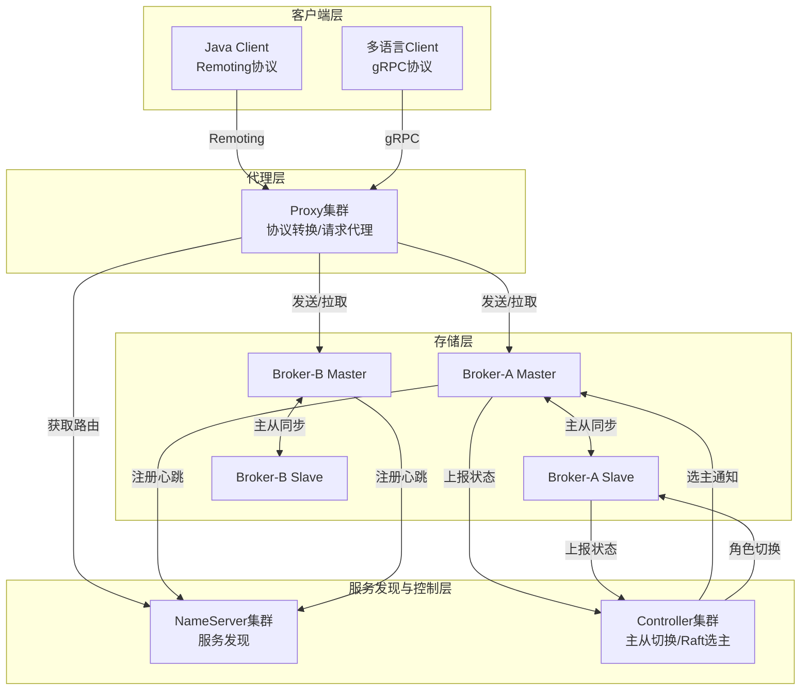
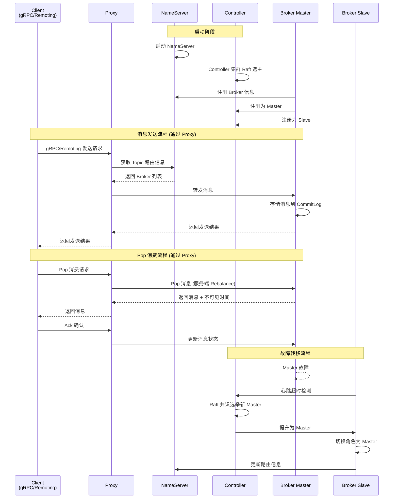
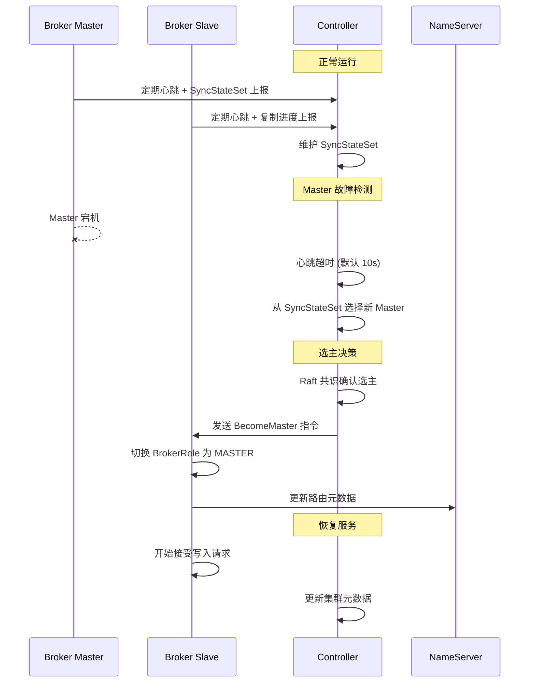
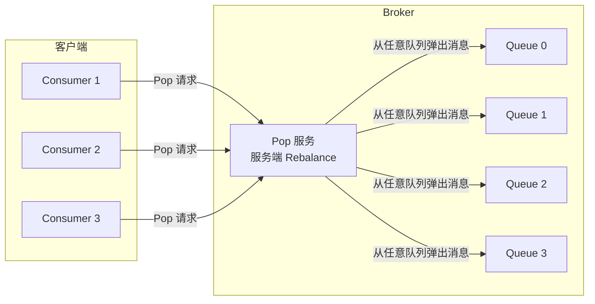
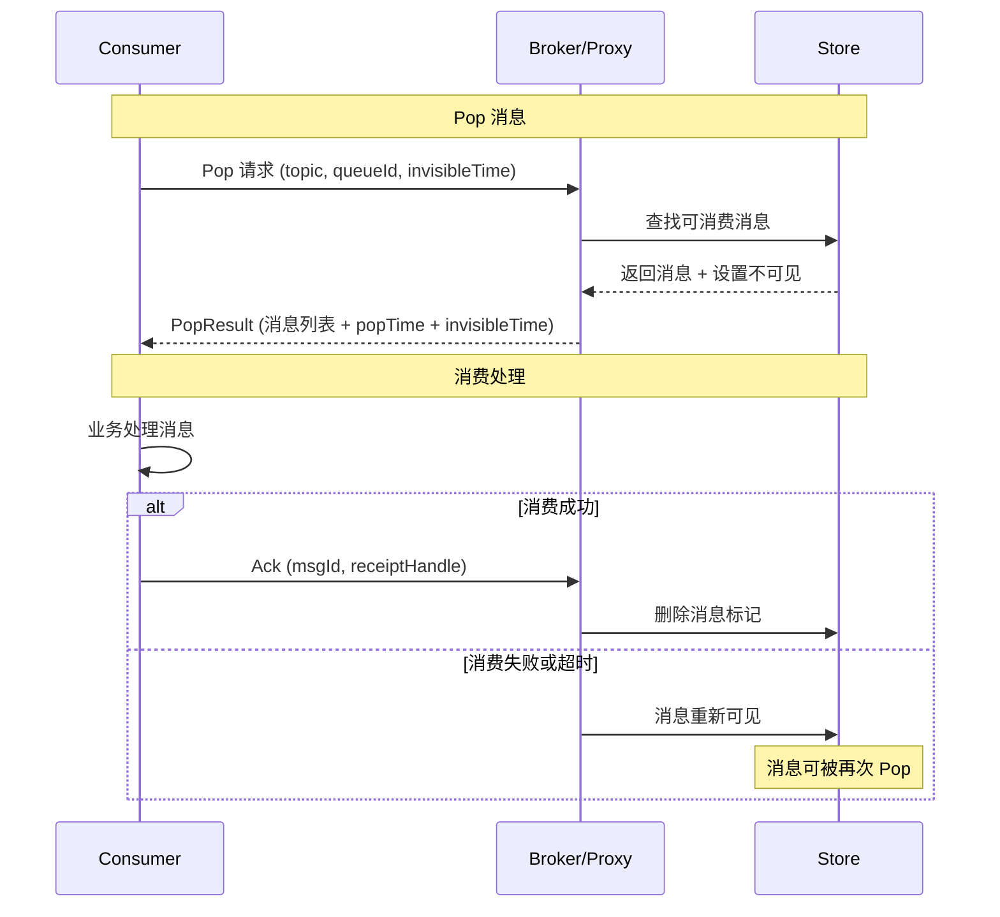
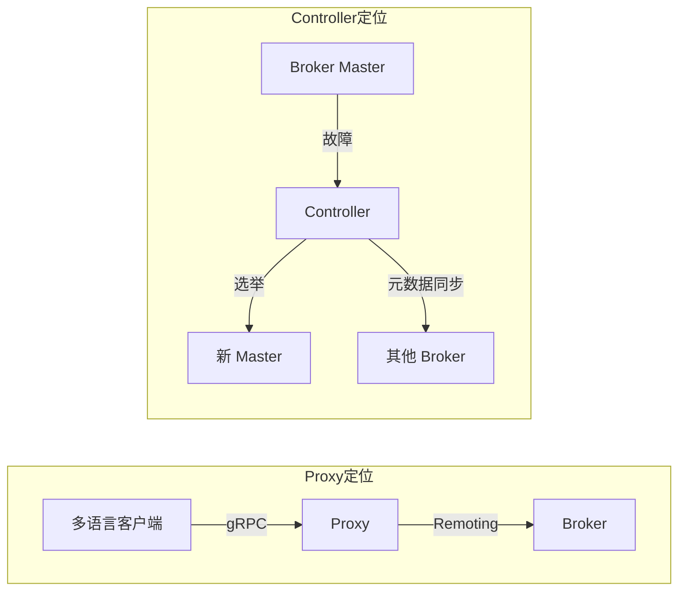

# RocketMQ 技术架构分析 - 云原生篇

> 本文档详细介绍 RocketMQ 5.0 引入的云原生架构，包括 Proxy、Controller、Pop 消费模式等核心特性。

---

## 一、云原生架构概述

### 1.1 什么是云原生模式

云原生模式是 RocketMQ 5.0 引入的新架构模式，专为云环境（Kubernetes、Serverless）设计：

| 特征 | 说明 |
| --- | --- |
| **计算存储分离** | Proxy（计算层）与 Broker（存储层）独立部署、独立扩展 |
| **多协议支持** | gRPC 协议统一多语言客户端，Remoting 协议兼容旧客户端 |
| **无状态消费** | Pop 消费模式，消费者无需维护队列分配状态 |
| **自动故障转移** | Controller 基于 Raft 实现 Master 自动选举 |
| **弹性伸缩** | Proxy 无状态，可按需水平扩展 |

### 1.2 与传统模式对比

| 对比项 | 传统模式 (4.x) | 云原生模式 (5.0+) |
| --- | --- | --- |
| **客户端协议** | Remoting (Java only) | gRPC (多语言) + Remoting |
| **计算存储** | 紧耦合 | 分离部署 |
| **消费模式** | Push/Pull | Push/Pull/Pop |
| **Rebalance** | 客户端执行 | 服务端执行 (Pop 模式) |
| **故障转移** | 手动切换 | Controller 自动选主 |
| **适用场景** | 中小规模、Java 技术栈 | 大规模、多语言、Serverless |

---

## 二、架构设计

### 2.1 云原生架构图



### 2.2 核心交互流程



### 2.3 部署模式对比

| 部署模式 | 适用场景 | 组件要求 | 复杂度 |
| --- | --- | --- | --- |
| **传统模式** | 中小规模、Java 技术栈 | NameServer + Broker | 低 |
| **云原生模式** | 大规模、多语言、Serverless | NameServer + Proxy + Broker + Controller | 高 |
| **混合模式** | 渐进式升级 | 传统组件 + Proxy (Local 模式) | 中 |

---

## 三、Proxy 代理服务

### 3.1 Proxy 简介

Proxy 是 RocketMQ 5.0 引入的无状态代理组件，位于客户端与 Broker 之间：

| 特性 | 说明 |
| --- | --- |
| **多语言支持** | 基于 gRPC + Protocol Buffer，支持多语言客户端 |
| **多协议支持** | 支持 gRPC、Remoting 协议，未来支持 HTTP |
| **部署模式** | Cluster 模式（独立集群）、Local 模式（与 Broker 同进程） |
| **Pop 消费** | 原生支持 Pop 消费模式，实现无状态消费 |

**核心源码**：[ProxyStartup.java](file:///d:/work/github/rocketmq/proxy/src/main/java/org/apache/rocketmq/proxy/ProxyStartup.java) - Proxy 启动入口

### 3.2 部署模式

| 模式 | 说明 | 适用场景 |
| --- | --- | --- |
| **Cluster 模式** | Proxy 独立集群，计算存储分离 | 大规模生产环境 |
| **Local 模式** | Proxy 与 Broker 同进程 | 升级迁移、简化部署 |

**Cluster 模式架构**：

```plain
┌─────────────────────────────────────────────────────────────────────────────┐
│                        Cluster 模式架构                                      │
├─────────────────────────────────────────────────────────────────────────────┤
│                                                                             │
│  客户端层                  代理层                    存储层                  │
│  ┌─────────┐            ┌─────────┐             ┌─────────┐                │
│  │ Java    │──Remoting──│         │             │ Broker  │                │
│  │ Client  │            │  Proxy  │─────────────│ Master  │                │
│  └─────────┘            │ Cluster │             └─────────┘                │
│  ┌─────────┐            │         │             ┌─────────┐                │
│  │ Go/Python│──gRPC─────│ (无状态) │─────────────│ Broker  │                │
│  │ Client  │            │         │             │ Slave   │                │
│  └─────────┘            └─────────┘             └─────────┘                │
│                                                                             │
│  优势: 计算存储分离，独立扩展，弹性伸缩                                        │
│                                                                             │
└─────────────────────────────────────────────────────────────────────────────┘
```

**Local 模式架构**：

```plain
┌─────────────────────────────────────────────────────────────────────────────┐
│                        Local 模式架构                                        │
├─────────────────────────────────────────────────────────────────────────────┤
│                                                                             │
│  客户端层                         Broker 节点                               │
│  ┌─────────┐                   ┌─────────────────────────┐                 │
│  │ Java    │──Remoting── ─ ─ ─│  Proxy (嵌入)           │                 │
│  │ Client  │                  │  ┌─────────────────┐    │                 │
│  └─────────┘                  │  │ gRPC Server     │    │                 │
│  ┌─────────┐                  │  │ Remoting Server │    │                 │
│  │ Go/Python│──gRPC── ─ ─ ─ ─│  └────────┬────────┘    │                 │
│  │ Client  │                  │           │             │                 │
│  └─────────┘                  │  ┌────────▼────────┐    │                 │
│                               │  │ Broker Store    │    │                 │
│                               │  │ (CommitLog)     │    │                 │
│                               │  └─────────────────┘    │                 │
│                               └─────────────────────────┘                 │
│                                                                             │
│  优势: 简化部署，适合渐进式升级                                               │
│                                                                             │
└─────────────────────────────────────────────────────────────────────────────┘
```

### 3.3 Proxy 配置

**Cluster 模式配置**：

```properties
# proxy.properties
proxyMode=cluster
namesrvAddr=localhost:9876
grpcServerPort=8081
remotingListenPort=8080

# 线程池配置
grpcThreadPoolNums=16
remotingThreadPoolNums=16

# 流控配置
maxMessageSize=4194304
```

**Local 模式配置**：

```properties
# broker.conf
enableProxyInBroker=true
grpcServerPort=8081
```

### 3.4 Proxy 核心功能

| 功能 | 说明 |
| --- | --- |
| **协议转换** | gRPC ↔ Remoting 协议转换 |
| **请求路由** | 根据 Topic 路由到正确的 Broker |
| **流量控制** | 限流、熔断、降级 |
| **安全认证** | ACL 权限验证 |
| **监控统计** | TPS、延迟、错误率统计 |

---

## 四、Controller 控制器

### 4.1 Controller 简介

Controller 是 RocketMQ 5.0 引入的主从切换控制器，基于 Raft 协议实现：

| 特性 | 说明 |
| --- | --- |
| **自动选主** | Master 故障时自动选举新 Master |
| **强一致性** | 基于 Raft 协议保证元数据一致性 |
| **灵活部署** | 支持独立部署或嵌入 NameServer |
| **SyncStateSet** | 动态维护同步副本集合 |

### 4.2 核心组件

| 组件 | 说明 |
| --- | --- |
| **DLedgerController** | 基于 Raft 的控制器，管理 Broker 元数据 ([DLedgerController.java](file:///d:/work/github/rocketmq/controller/src/main/java/org/apache/rocketmq/controller/impl/DLedgerController.java)) |
| **SyncStateSet** | 同步副本集合，选主的重要依据 |
| **AutoSwitchHAService** | 支持 BrokerRole 切换的 HA 服务 |
| **ReplicasManager** | 副本管理器，监控 HA 状态并同步控制指令 |

### 4.3 部署方式

| 方式 | 说明 | 适用场景 |
| --- | --- | --- |
| **嵌入 NameServer** | Controller 内嵌在 NameServer 中 | 简化部署 |
| **独立部署** | Controller 作为独立进程 | 大规模集群 |

**嵌入 NameServer 配置**：

```properties
# namesrv.conf
enableControllerInNameServer=true
controllerDLedgerGroup=controller-group
controllerDLedgerPeers=n0@127.0.0.1:9878;n1@127.0.0.1:9879;n2@127.0.0.1:9880
controllerDLedgerSelfId=n0
```

**独立部署配置**：

```properties
# controller.properties
controllerDLedgerGroup=controller-group
controllerDLedgerPeers=n0@127.0.0.1:9878;n1@127.0.0.1:9879;n2@127.0.0.1:9880
controllerDLedgerSelfId=n0
```

### 4.4 选主流程



### 4.5 与 DLedger 模式对比

| 对比项 | DLedger 模式 | Controller 模式 |
| --- | --- | --- |
| **副本数要求** | 必须 3 副本及以上 | 2 副本即可 |
| **HA 复制流程** | 独立实现 | 复用 RocketMQ 原生 HA |
| **存储能力** | 无法利用原生优化 | 完全利用原生存储能力 |
| **部署复杂度** | 较高 | 较低 |
| **选主延迟** | 秒级 | 秒级 |
| **数据一致性** | Raft 强一致 | Raft 元数据一致 + HA 复制 |

---

## 五、Pop 消费模式

### 5.1 Pop 模式简介

Pop 消费是 RocketMQ 5.0 引入的新消费模式，专为云原生场景设计：

| 特性 | 说明 |
| --- | --- |
| **无状态消费** | 消费者无需维护队列分配状态 |
| **服务端 Rebalance** | 由 Broker 进行消息分配 |
| **轻量级客户端** | 简化客户端实现复杂度 |
| **支持所有消息类型** | 普通消息、顺序消息、事务消息、延迟消息 |

### 5.2 Pop 模式原理



### 5.3 Pop 消费流程



### 5.4 PopResult 结构

`PopResult` 是 Pop 消费模式的返回结果 ([PopResult.java](file:///d:/work/github/rocketmq/client/src/main/java/org/apache/rocketmq/client/consumer/PopResult.java))：

```java
public class PopResult {
    private List<MessageExt> msgFoundList;  // 弹出的消息列表
    private PopStatus popStatus;            // 弹出状态
    private long popTime;                   // 弹出时间
    private long invisibleTime;             // 不可见时间
    private long restNum;                   // 剩余消息数
}
```

**PopStatus 状态**：

| 状态 | 说明 |
| --- | --- |
| `FOUND` | 找到消息 |
| `NO_NEW_MSG` | 没有新消息 |
| `POLLING_FULL` | 轮询池已满 |
| `POLLING_NOT_FOUND` | 轮询超时但未找到消息 |

### 5.5 Pop 模式配置

| 配置项 | 默认值 | 说明 |
| --- | --- | --- |
| `popInvisibleTime` | 60000 | 消息不可见时间 (ms) |
| `popBatchNums` | 32 | 单次 Pop 最大消息数 |
| `popThresholdForQueue` | 500 | 单队列 Pop 缓存阈值 |
| `clientRebalance` | true | 是否客户端 Rebalance (Pop 需设为 false) |

### 5.6 Pop 模式代码示例

```java
// 1. 通过管理工具切换消费模式为 POP
// mqadmin setMessageRequestMode -b brokerAddr -t TopicTest -g ConsumerGroup -m POP -n 8

// 2. 使用 DefaultMQPushConsumer，设置 clientRebalance=false
DefaultMQPushConsumer consumer = new DefaultMQPushConsumer("ConsumerGroup");
consumer.setNamesrvAddr("localhost:9876");
consumer.setClientRebalance(false);  // 关键：禁用客户端 Rebalance
consumer.setPopInvisibleTime(60000);  // 消息不可见时间
consumer.subscribe("TopicTest", "*");
consumer.registerMessageListener((msgs, context) -> {
    // 业务处理
    return ConsumeConcurrentlyStatus.CONSUME_SUCCESS;
});
consumer.start();
```

---

## 六、Push/Pull/Pop 消费模式对比

### 6.1 核心架构对比

| 对比项 | Push 模式 | Pull 模式 | Pop 模式 |
| --- | --- | --- | --- |
| **核心类** | `DefaultMQPushConsumer` | `DefaultLitePullConsumer` | `DefaultMQPushConsumer` |
| **消息获取** | 自动拉取 | 应用主动调用 `pull()` | 自动 Pop |
| **结果类型** | 回调函数 | `PullResult` | `PopResult` |
| **位点管理** | 自动管理 | 手动管理 | 自动管理 |
| **消费监听** | `MessageListener` | 无（应用自行处理） | `MessageListener` |

### 6.2 Rebalance 机制对比

| 对比项 | Push 模式 | Pull 模式 | Pop 模式 |
| --- | --- | --- | --- |
| **Rebalance 位置** | 客户端 | 客户端 | 服务端 (Broker/Proxy) |
| **队列分配策略** | `AllocateMessageQueueStrategy` | 应用自行管理 | 服务端自动分配 |
| **消费者状态** | 维护队列分配状态 | 应用自行维护 | 无状态 |
| **消费者上下线影响** | 触发 Rebalance | 无影响 | 服务端自动感知 |
| **分配延迟** | 最多 20 秒 | 无 | 实时 |

### 6.3 消息确认机制对比

| 对比项 | Push 模式 | Pull 模式 | Pop 模式 |
| --- | --- | --- | --- |
| **确认方式** | 返回消费状态 | 手动更新位点 | 显式 Ack/Nack |
| **消费成功** | `CONSUME_SUCCESS` | `updateOffset()` | `ack()` |
| **消费失败** | `RECONSUME_LATER` | 不更新位点 | `nack()` 或超时 |
| **消息可见性** | 始终可见 | 始终可见 | 可配置不可见时间 |
| **重试机制** | 发送回重试队列 | 无 | 消息重新可见 |

### 6.4 使用场景对比

| 场景 | 推荐模式 | 原因 |
| --- | --- | --- |
| **普通业务消费** | Push | 简单易用，自动管理 |
| **批量数据处理** | Pull | 可控制拉取节奏 |
| **多语言客户端** | Pop | gRPC 协议统一 |
| **Serverless/容器化** | Pop | 无状态，弹性伸缩 |
| **需要精确控制位点** | Pull | 手动管理位点 |
| **顺序消息** | Push/Pop | 都支持顺序消费 |
| **事务消息** | Push/Pop | 都支持事务消息 |

---

## 七、Proxy 与 Controller 对比

### 7.1 功能定位对比

| 对比项 | Proxy | Controller |
| --- | --- | --- |
| **核心职责** | 协议转换、请求代理 | 主从切换、元数据管理 |
| **解决问题** | 多语言客户端、计算存储分离 | 自动故障转移、高可用 |
| **协议支持** | gRPC + Remoting | 内部 Raft 协议 |
| **状态特性** | 完全无状态 | 有状态 (Raft 共识) |
| **部署位置** | 客户端与 Broker 之间 | Broker 集群侧 |
| **依赖组件** | 依赖 NameServer/Broker | 依赖 DLedger/ZooKeeper |
| **替代方案** | 无 (新增能力) | 替代手动主从切换 |

### 7.2 功能定位图



### 7.3 部署架构对比

| 部署模式 | Proxy | Controller |
| --- | --- | --- |
| **独立部署** | Cluster 模式，独立集群 | 独立进程，3 节点起 |
| **嵌入部署** | Local 模式，嵌入 Broker | 嵌入 NameServer |
| **最小节点数** | 1 个即可 | 3 个 (Raft 多数派) |
| **跨机房部署** | 支持多机房代理 | 需要网络延迟优化 |

### 7.4 使用场景对比

| 场景 | 推荐组件 | 说明 |
| --- | --- | --- |
| 多语言客户端接入 | Proxy | gRPC 协议统一，简化客户端开发 |
| Serverless/云原生 | Proxy | 无状态代理，弹性伸缩 |
| 自动故障转移 | Controller | Master 故障自动选举 |
| 高可用生产环境 | Controller | 减少人工干预，快速恢复 |
| 计算存储分离 | Proxy | 代理层与存储层独立扩展 |
| 跨机房容灾 | Proxy + Controller | Proxy 就近接入，Controller 跨机房选主 |

---

## 八、BrokerContainer

### 8.1 BrokerContainer 简介

BrokerContainer 是 RocketMQ 5.0 引入的新特性，允许一个进程管理多个 Broker：

| 特性 | 说明 |
| --- | --- |
| **资源共享** | 多 Broker 共享传输层 |
| **对等部署** | 每个节点一主一备，资源均衡 |
| **动态管理** | 运行时动态增减 Broker |

### 8.2 部署架构

```plain
┌─────────────────────────────────────────────────────────────────────────────┐
│                        BrokerContainer 架构                                  │
├─────────────────────────────────────────────────────────────────────────────┤
│                                                                             │
│  BrokerContainer 进程                                                       │
│  ┌─────────────────────────────────────────────────────────────────────┐   │
│  │                                                                     │   │
│  │  ┌─────────────────┐  ┌─────────────────┐  ┌─────────────────┐    │   │
│  │  │ Broker-A        │  │ Broker-B        │  │ Broker-C        │    │   │
│  │  │ (Master)        │  │ (Slave)         │  │ (Master)        │    │   │
│  │  │                 │  │                 │  │                 │    │   │
│  │  │ Topic: Order    │  │ Topic: Order    │  │ Topic: Payment  │    │   │
│  │  │ Topic: User     │  │ Topic: User     │  │ Topic: Notify   │    │   │
│  │  └─────────────────┘  └─────────────────┘  └─────────────────┘    │   │
│  │                                                                     │   │
│  │  ┌─────────────────────────────────────────────────────────────┐  │   │
│  │  │              共享传输层 (Netty Server)                       │  │   │
│  │  └─────────────────────────────────────────────────────────────┘  │   │
│  │                                                                     │   │
│  └─────────────────────────────────────────────────────────────────────┘   │
│                                                                             │
│  优势: 资源均衡、对等部署、简化运维                                          │
│                                                                             │
└─────────────────────────────────────────────────────────────────────────────┘
```

### 8.3 对等部署模式

传统部署 vs 对等部署：

| 部署模式 | 节点 1 | 节点 2 | 资源利用 |
| --- | --- | --- | --- |
| **传统部署** | Master A + Slave B | Master B + Slave A | 不均衡 |
| **对等部署** | Master A + Slave B | Master B + Slave A | 均衡 |

对等部署优势：
1. 每个节点一主一备，资源均衡
2. 故障时负载分散到其他节点
3. 简化运维，统一管理

---

## 九、云原生部署实践

### 9.1 Kubernetes 部署架构

```plain
┌─────────────────────────────────────────────────────────────────────────────┐
│                    Kubernetes 部署架构                                       │
├─────────────────────────────────────────────────────────────────────────────┤
│                                                                             │
│  ┌─────────────────────────────────────────────────────────────────────┐   │
│  │                         Namespace: rocketmq                          │   │
│  │                                                                     │   │
│  │  ┌─────────────────────────────────────────────────────────────┐   │   │
│  │  │                    StatefulSet: namesrv                      │   │   │
│  │  │  ┌─────────┐  ┌─────────┐  ┌─────────┐                      │   │   │
│  │  │  │namesrv-0│  │namesrv-1│  │namesrv-2│                      │   │   │
│  │  │  └─────────┘  └─────────┘  └─────────┘                      │   │   │
│  │  └─────────────────────────────────────────────────────────────┘   │   │
│  │                                                                     │   │
│  │  ┌─────────────────────────────────────────────────────────────┐   │   │
│  │  │                    StatefulSet: controller                   │   │   │
│  │  │  ┌───────────┐  ┌───────────┐  ┌───────────┐                │   │   │
│  │  │  │controller-0│ │controller-1│ │controller-2│               │   │   │
│  │  │  └───────────┘  └───────────┘  └───────────┘                │   │   │
│  │  └─────────────────────────────────────────────────────────────┘   │   │
│  │                                                                     │   │
│  │  ┌─────────────────────────────────────────────────────────────┐   │   │
│  │  │                    StatefulSet: broker                       │   │   │
│  │  │  ┌───────────┐  ┌───────────┐  ┌───────────┐                │   │   │
│  │  │  │ broker-a-0│  │ broker-b-0│  │ broker-c-0│                │   │   │
│  │  │  │ (Master)  │  │ (Master)  │  │ (Master)  │                │   │   │
│  │  │  └───────────┘  └───────────┘  └───────────┘                │   │   │
│  │  │  ┌───────────┐  ┌───────────┐  ┌───────────┐                │   │   │
│  │  │  │ broker-a-1│  │ broker-b-1│  │ broker-c-1│                │   │   │
│  │  │  │ (Slave)   │  │ (Slave)   │  │ (Slave)   │                │   │   │
│  │  │  └───────────┘  └───────────┘  └───────────┘                │   │   │
│  │  └─────────────────────────────────────────────────────────────┘   │   │
│  │                                                                     │   │
│  │  ┌─────────────────────────────────────────────────────────────┐   │   │
│  │  │                    Deployment: proxy                         │   │   │
│  │  │  ┌─────────┐  ┌─────────┐  ┌─────────┐                      │   │   │
│  │  │  │ proxy-0 │  │ proxy-1 │  │ proxy-2 │                      │   │   │
│  │  │  └─────────┘  └─────────┘  └─────────┘                      │   │   │
│  │  └─────────────────────────────────────────────────────────────┘   │   │
│  │                                                                     │   │
│  └─────────────────────────────────────────────────────────────────────┘   │
│                                                                             │
└─────────────────────────────────────────────────────────────────────────────┘
```

### 9.2 完整部署 YAML

**Namespace**：

```yaml
apiVersion: v1
kind: Namespace
metadata:
  name: rocketmq
```

**ConfigMap - NameServer**：

```yaml
apiVersion: v1
kind: ConfigMap
metadata:
  name: namesrv-config
  namespace: rocketmq
data:
  namesrv.conf: |
    listenPort=9876
```

**ConfigMap - Broker**：

```yaml
apiVersion: v1
kind: ConfigMap
metadata:
  name: broker-config
  namespace: rocketmq
data:
  broker.conf: |
    brokerClusterName=DefaultCluster
    brokerName=broker-a
    brokerId=0
    brokerRole=SYNC_MASTER
    flushDiskType=ASYNC_FLUSH
    namesrvAddr=namesrv-0.namesrv:9876;namesrv-1.namesrv:9876;namesrv-2.namesrv:9876
    storePathRootDir=/data/rocketmq/store
    storePathCommitLog=/data/rocketmq/store/commitlog
    enableControllerMode=true
    controllerAddr=controller-0.controller:9878;controller-1.controller:9878;controller-2.controller:9878
```

**StatefulSet - NameServer**：

```yaml
apiVersion: apps/v1
kind: StatefulSet
metadata:
  name: namesrv
  namespace: rocketmq
spec:
  serviceName: namesrv
  replicas: 3
  selector:
    matchLabels:
      app: namesrv
  template:
    metadata:
      labels:
        app: namesrv
    spec:
      containers:
      - name: namesrv
        image: apache/rocketmq:5.1.0
        command: ["sh", "mqnamesrv"]
        args: ["-c", "/home/rocketmq/rocketmq-5.1.0/conf/namesrv.conf"]
        ports:
        - containerPort: 9876
        volumeMounts:
        - name: config
          mountPath: /home/rocketmq/rocketmq-5.1.0/conf/namesrv.conf
          subPath: namesrv.conf
        resources:
          requests:
            cpu: "500m"
            memory: "1Gi"
          limits:
            cpu: "1"
            memory: "2Gi"
      volumes:
      - name: config
        configMap:
          name: namesrv-config
```

**StatefulSet - Controller**：

```yaml
apiVersion: apps/v1
kind: StatefulSet
metadata:
  name: controller
  namespace: rocketmq
spec:
  serviceName: controller
  replicas: 3
  selector:
    matchLabels:
      app: controller
  template:
    metadata:
      labels:
        app: controller
    spec:
      containers:
      - name: controller
        image: apache/rocketmq:5.1.0
        command: ["sh", "mqcontroller"]
        env:
        - name: CONTROLLER_DLEDGER_GROUP
          value: "controller-group"
        - name: CONTROLLER_DLEDGER_PEERS
          value: "n0@controller-0.controller:9878;n1@controller-1.controller:9878;n2@controller-2.controller:9878"
        - name: CONTROLLER_DLEDGER_SELF_ID
          valueFrom:
            fieldRef:
              fieldPath: metadata.name
        ports:
        - containerPort: 9878
        resources:
          requests:
            cpu: "500m"
            memory: "1Gi"
          limits:
            cpu: "1"
            memory: "2Gi"
```

**StatefulSet - Broker (Master)**：

```yaml
apiVersion: apps/v1
kind: StatefulSet
metadata:
  name: broker-a-master
  namespace: rocketmq
spec:
  serviceName: broker
  replicas: 1
  selector:
    matchLabels:
      app: broker
      broker-name: broker-a
      broker-role: master
  template:
    metadata:
      labels:
        app: broker
        broker-name: broker-a
        broker-role: master
    spec:
      affinity:
        podAntiAffinity:
          requiredDuringSchedulingIgnoredDuringExecution:
          - labelSelector:
              matchLabels:
                app: broker
            topologyKey: kubernetes.io/hostname
      containers:
      - name: broker
        image: apache/rocketmq:5.1.0
        command: ["sh", "mqbroker"]
        args: ["-c", "/home/rocketmq/rocketmq-5.1.0/conf/broker.conf"]
        ports:
        - containerPort: 10911
        - containerPort: 10912
        - containerPort: 10909
        volumeMounts:
        - name: config
          mountPath: /home/rocketmq/rocketmq-5.1.0/conf/broker.conf
          subPath: broker.conf
        - name: storage
          mountPath: /data/rocketmq/store
        resources:
          requests:
            cpu: "2"
            memory: "8Gi"
          limits:
            cpu: "4"
            memory: "16Gi"
      volumes:
      - name: config
        configMap:
          name: broker-config
  volumeClaimTemplates:
  - metadata:
      name: storage
    spec:
      accessModes: ["ReadWriteOnce"]
      storageClassName: standard
      resources:
        requests:
          storage: 100Gi
```

**StatefulSet - Broker (Slave)**：

```yaml
apiVersion: apps/v1
kind: StatefulSet
metadata:
  name: broker-a-slave
  namespace: rocketmq
spec:
  serviceName: broker
  replicas: 1
  selector:
    matchLabels:
      app: broker
      broker-name: broker-a
      broker-role: slave
  template:
    metadata:
      labels:
        app: broker
        broker-name: broker-a
        broker-role: slave
    spec:
      affinity:
        podAntiAffinity:
          requiredDuringSchedulingIgnoredDuringExecution:
          - labelSelector:
              matchLabels:
                broker-name: broker-a
            topologyKey: kubernetes.io/hostname
      containers:
      - name: broker
        image: apache/rocketmq:5.1.0
        command: ["sh", "mqbroker"]
        env:
        - name: BROKER_ID
          value: "1"
        - name: BROKER_ROLE
          value: "SLAVE"
        ports:
        - containerPort: 10911
        - containerPort: 10912
        volumeMounts:
        - name: storage
          mountPath: /data/rocketmq/store
        resources:
          requests:
            cpu: "2"
            memory: "8Gi"
          limits:
            cpu: "4"
            memory: "16Gi"
  volumeClaimTemplates:
  - metadata:
      name: storage
    spec:
      accessModes: ["ReadWriteOnce"]
      storageClassName: standard
      resources:
        requests:
          storage: 100Gi
```

**Deployment - Proxy**：

```yaml
apiVersion: apps/v1
kind: Deployment
metadata:
  name: proxy
  namespace: rocketmq
spec:
  replicas: 3
  selector:
    matchLabels:
      app: proxy
  template:
    metadata:
      labels:
        app: proxy
    spec:
      containers:
      - name: proxy
        image: apache/rocketmq:5.1.0
        command: ["sh", "mqproxy"]
        env:
        - name: NAMESRV_ADDR
          value: "namesrv-0.namesrv:9876;namesrv-1.namesrv:9876;namesrv-2.namesrv:9876"
        - name: PROXY_MODE
          value: "CLUSTER"
        ports:
        - containerPort: 8080
          name: remoting
        - containerPort: 8081
          name: grpc
        resources:
          requests:
            cpu: "1"
            memory: "2Gi"
          limits:
            cpu: "2"
            memory: "4Gi"
```

**Service - NameServer**：

```yaml
apiVersion: v1
kind: Service
metadata:
  name: namesrv
  namespace: rocketmq
spec:
  clusterIP: None
  selector:
    app: namesrv
  ports:
  - port: 9876
    targetPort: 9876
```

**Service - Controller**：

```yaml
apiVersion: v1
kind: Service
metadata:
  name: controller
  namespace: rocketmq
spec:
  clusterIP: None
  selector:
    app: controller
  ports:
  - port: 9878
    targetPort: 9878
```

**Service - Proxy (LoadBalancer)**：

```yaml
apiVersion: v1
kind: Service
metadata:
  name: proxy
  namespace: rocketmq
spec:
  type: LoadBalancer
  selector:
    app: proxy
  ports:
  - name: remoting
    port: 8080
    targetPort: 8080
  - name: grpc
    port: 8081
    targetPort: 8081
```

### 9.3 部署命令

```bash
# 创建命名空间
kubectl apply -f namespace.yaml

# 部署 NameServer
kubectl apply -f namesrv-config.yaml
kubectl apply -f namesrv-statefulset.yaml
kubectl apply -f namesrv-service.yaml

# 部署 Controller
kubectl apply -f controller-statefulset.yaml
kubectl apply -f controller-service.yaml

# 部署 Broker
kubectl apply -f broker-config.yaml
kubectl apply -f broker-master-statefulset.yaml
kubectl apply -f broker-slave-statefulset.yaml

# 部署 Proxy
kubectl apply -f proxy-deployment.yaml
kubectl apply -f proxy-service.yaml

# 验证部署状态
kubectl get pods -n rocketmq
kubectl get svc -n rocketmq

# 查看 Broker 状态
kubectl exec -n rocketmq broker-a-master-0 -- sh mqadmin clusterList -n namesrv-0.namesrv:9876
```

### 9.4 监控指标

| 组件 | 关键指标 | 说明 |
| --- | --- | --- |
| **Proxy** | `proxy_tps` | 请求吞吐量 |
| **Proxy** | `proxy_latency` | 请求延迟 |
| **Proxy** | `proxy_connection_count` | 连接数 |
| **Controller** | `controller_election_count` | 选主次数 |
| **Controller** | `controller_sync_state_set_size` | 同步副本数 |
| **Broker** | `broker_pop_inflight` | Pop 进行中请求数 |

---

## 十、总结

RocketMQ 5.0 云原生架构的核心改进：

| 特性 | 说明 | 价值 |
| --- | --- | --- |
| **Proxy** | 无状态代理，协议转换 | 多语言支持、计算存储分离 |
| **Controller** | Raft 选主，自动故障转移 | 高可用、运维简化 |
| **Pop 消费** | 服务端 Rebalance，无状态消费 | 弹性伸缩、Serverless 友好 |
| **BrokerContainer** | 多 Broker 共享进程 | 资源均衡、对等部署 |

**云原生模式适用场景**：

1. **多语言客户端**：gRPC 协议统一，支持 Go、Python、C++ 等
2. **Serverless/容器化**：无状态消费，弹性伸缩
3. **大规模集群**：计算存储分离，独立扩展
4. **高可用要求**：Controller 自动故障转移
5. **跨机房容灾**：Proxy 就近接入，Controller 跨机房选主
