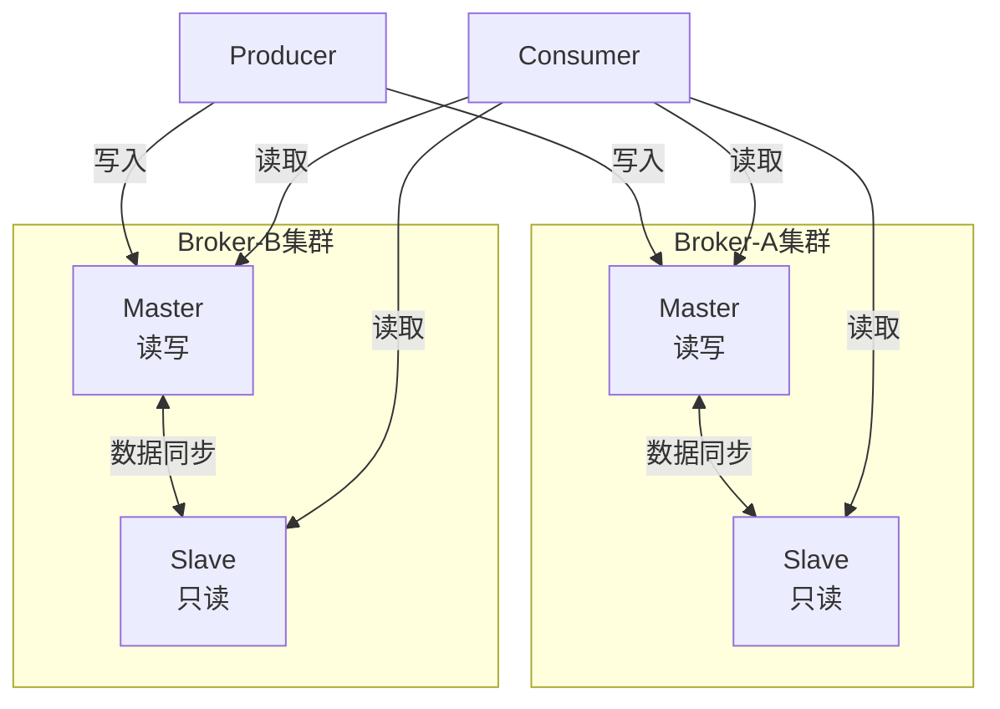
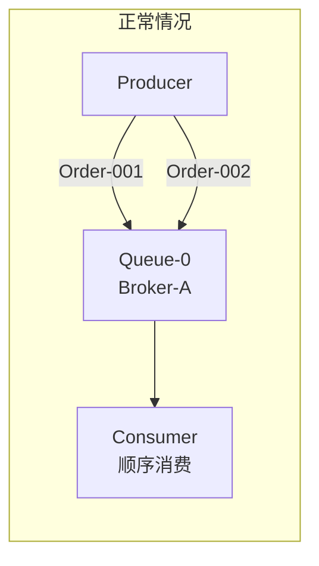
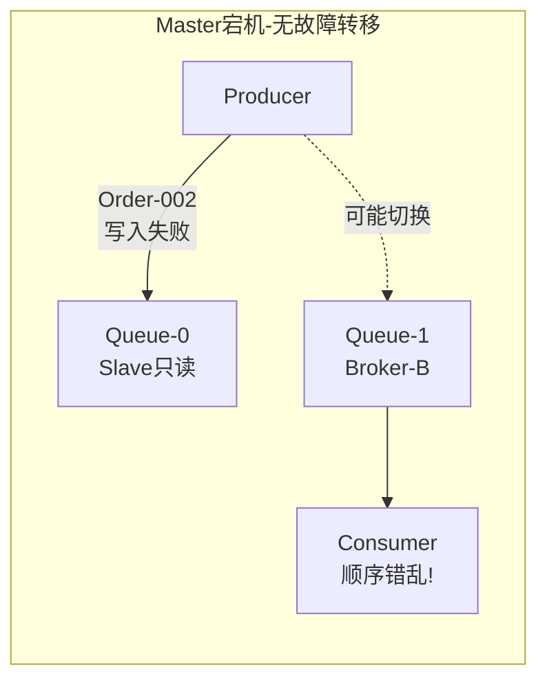
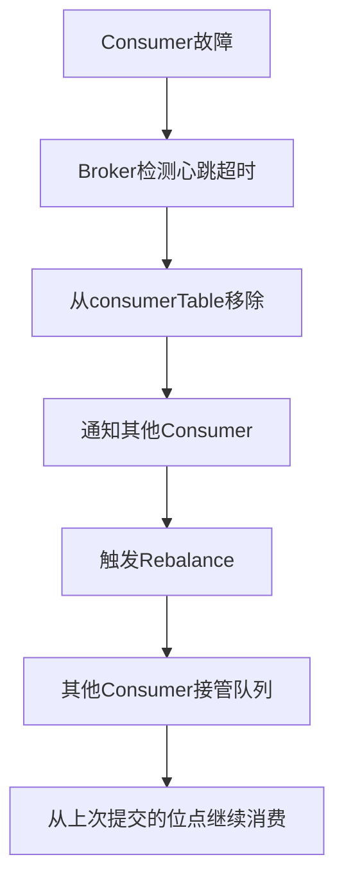
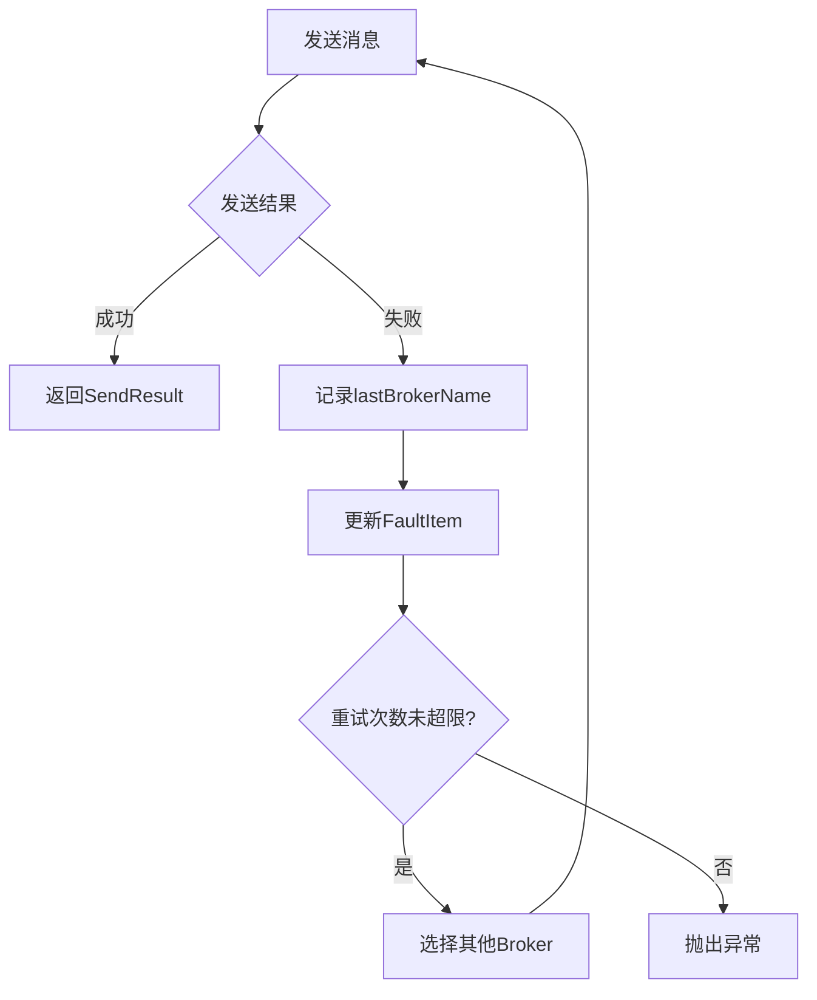

# RocketMQ 技术架构分析 - 高可用与运维篇

> 本篇介绍 RocketMQ 的高可用架构、故障转移机制、消息堆积处理和部署运维建议。
> 
> **前置阅读**：BrokerRole、刷盘策略、主从复制机制详见 [消息存储篇](./04-消息存储篇.md)。

---

## 一、高可用架构

### 1.1 Master-Slave 架构

RocketMQ 采用 Master-Slave 架构实现高可用：



### 1.2 高可用配置要点

#### 1.2.1 主从复制配置

| 配置项 | 默认值 | 推荐值 | 说明 |
| --- | --- | --- | --- |
| `brokerRole` | ASYNC_MASTER | SYNC_MASTER | 同步复制，保证数据不丢失 |
| `flushDiskType` | ASYNC_FLUSH | SYNC_FLUSH | 同步刷盘，保证数据持久化 |
| `syncFlushTimeout` | 5s（5000ms） | 5s | 同步刷盘超时时间 |
| `haListenPort` | 10912 | 10912 | HA 监听端口 |
| `haSendHeartbeatInterval` | 5s（5000ms） | 5s | HA 心跳发送间隔 |
| `haHousekeepingInterval` | 20s（20000ms） | 20s | HA 连接清理间隔 |
| `haMaxGapNotInSync` | 256MB | 256MB | 判定 Slave 同步的最大偏移差距 |
| `haTransferBatchSize` | 32KB | 32KB | 主从传输批次大小 |
| `haMasterAddress` | null | - | Slave 连接的 Master 地址 |
| `haMaxTimeSlaveNotCatchup` | 15s（15000ms） | 15s | Slave 未追上 Master 的最大时间 |
| `haFlowControlEnable` | false | false | 是否开启 HA 流控 |
| `maxHaTransferByteInSecond` | 100MB/s | 100MB/s | HA 传输最大速率（流控开启时生效） |

#### 1.2.2 副本同步配置（5.0+）

| 配置项 | 默认值 | 推荐值 | 说明 |
| --- | --- | --- | --- |
| `totalReplicas` | 1 | 3 | 副本总数（包含 Master） |
| `inSyncReplicas` | 1 | 2 | 同步副本数，消息需写入至少 N 个副本才算成功 |
| `minInSyncReplicas` | 1 | 1 | 最小同步副本数，用于动态调整 |
| `allAckInSyncStateSet` | false | false | 是否要求所有 InSyncStateSet 中的副本都确认 |
| `enableAutoInSyncReplicas` | false | false | 是否启用动态调整同步副本数 |

> **详细说明**：BrokerRole、刷盘策略的详细对比见 [消息存储篇 - 主从复制](./04-消息存储篇.md#五主从复制)。

**核心源码**：
- [MessageStoreConfig.java](../../store/src/main/java/org/apache/rocketmq/store/config/MessageStoreConfig.java) - 存储层核心配置类
- [DefaultHAService.java](../../store/src/main/java/org/apache/rocketmq/store/ha/DefaultHAService.java) - 默认主从同步服务实现
- [HAService.java](../../store/src/main/java/org/apache/rocketmq/store/ha/HAService.java) - 主从同步服务接口

---

## 二、故障转移机制

### 2.1 故障场景处理

| 场景 | 处理方式 | 影响 |
| --- | --- | --- |
| Master 宕机 | Slave 接管读请求，写请求转发到其他 Master | 短暂写入不可用 |
| Slave 宕机 | Master 继续提供服务 | 无影响 |
| NameServer 宕机 | 其他 NameServer 继续提供服务 | 无影响（多节点部署） |
| 网络分区 | 根据配置选择同步/异步复制 | 可能导致数据不一致 |

#### 2.1.1 Master 宕机对顺序消息的影响

顺序消息的关键约束是：**同一顺序 ID 的消息必须写入同一个队列**。Master 宕机对顺序消息有严重影响。

**问题分析**：





**不同故障转移方案的影响对比**：

| 故障转移方案 | 顺序消息影响 | 原因 |
| --- | --- | --- |
| **无自动故障转移** | **严重**：顺序中断或错乱 | Slave 只读，新消息无法写入原队列 |
| **切换到其他 Master** | **严重**：顺序性破坏 | 新队列 ≠ 原队列，消费顺序错乱 |
| **DLedger 模式** | **轻微**：短暂暂停后恢复 | Slave 升级为 Master，队列不变 |
| **Controller 模式** | **轻微**：短暂暂停后恢复 | 统一调度，队列绑定关系保持 |

**场景详解**：

| 场景 | 时间线 | 结果 |
| --- | --- | --- |
| 传统 Master-Slave | T1: Order-001 → Queue-0 (Master-A)<br/>T2: Master-A 宕机<br/>T3: Order-002 无法写入 Queue-0<br/>T4: 可能切换到 Broker-B 的 Queue-1 | Consumer 先消费 Order-002，顺序错乱 |
| DLedger/Controller | T1: Order-001 → Queue-0 (Master-A)<br/>T2: Master-A 宕机<br/>T3: Slave-A 自动升级为新 Master<br/>T4: Order-002 → Queue-0 (新 Master) | Consumer 继续按顺序消费 |

**代码层面的处理建议**：

```java
DefaultMQProducer producer = new DefaultMQProducer("OrderProducer");
producer.setRetryTimesWhenSendFailed(3);
producer.setSendMsgTimeout(5000);

Message msg = new Message("OrderTopic", "Order-001".getBytes());

try {
    SendResult result = producer.send(msg, new MessageQueueSelector() {
        @Override
        public MessageQueue select(List<MessageQueue> mqs, Message msg, Object arg) {
            Long orderId = (Long) arg;
            long index = orderId % mqs.size();
            return mqs.get((int) index);
        }
    }, orderId);
} catch (Exception e) {
    if (e instanceof MQBrokerException) {
        log.error("Broker 宕机，顺序消息发送失败，需等待故障转移或恢复");
    }
}
```

> **结论**：如果业务依赖顺序消息，**必须**部署 DLedger 或 Controller 模式实现自动故障转移，否则 Master 宕机会导致顺序性无法保证。

#### 2.1.2 Broker 心跳检测

NameServer 通过心跳检测判断 Broker 是否存活：

| 配置项 | 默认值 | 说明 |
| --- | --- | --- |
| `brokerHeartbeatInterval` | 1s（1000ms） | Broker 向 NameServer 发送心跳间隔 |
| `DEFAULT_BROKER_CHANNEL_EXPIRED_TIME` | 2min（120s） | Broker 心跳超时常量，超时则认为 Broker 下线 |

> **源码位置**：[BrokerConfig.java](../../common/src/main/java/org/apache/rocketmq/common/BrokerConfig.java)、[RouteInfoManager.java](../../namesrv/src/main/java/org/apache/rocketmq/namesrv/routeinfo/RouteInfoManager.java)

**心跳检测流程**：

```plain
┌─────────────────────────────────────────────────────────────────────────────┐
│                        Broker 心跳检测机制                                    │
├─────────────────────────────────────────────────────────────────────────────┤
│                                                                             │
│  Broker                               NameServer                            │
│  ┌─────────────┐                      ┌─────────────┐                      │
│  │             │  HEART_BEAT (1s)    │             │                      │
│  │   定时发送   │ ──────────────────► │  更新心跳时间 │                      │
│  │   心跳包     │                      │  到brokerLiveTable│                 │
│  │             │                      │             │                      │
│  └─────────────┘                      └─────────────┘                      │
│                                                                             │
│  心跳周期：brokerHeartbeatInterval = 1s（默认值，可配置）                      │
│  超时判定：DEFAULT_BROKER_CHANNEL_EXPIRED_TIME = 120s（2min），无心跳则认为 Broker 下线 │
│                                                                             │
└─────────────────────────────────────────────────────────────────────────────┘
```

### 2.2 消费者故障转移

消费者故障转移通过心跳检测和 Rebalance 机制实现，确保消费者宕机时其他消费者能接管队列。

#### 2.2.1 故障转移流程



#### 2.2.2 消费者心跳检测

Broker 通过心跳检测判断消费者是否存活：

| 配置项 | 默认值 | 说明 |
| --- | --- | --- |
| `heartbeatBrokerInterval` | 30s（30000ms） | 消费者向 Broker 发送心跳间隔 |
| `pollNameServerInterval` | 30s（30000ms） | 消费者从 NameServer 拉取路由信息间隔 |

> **源码位置**：[ClientConfig.java](../../client/src/main/java/org/apache/rocketmq/client/ClientConfig.java)

**心跳检测流程**：

```plain
┌─────────────────────────────────────────────────────────────────────────────┐
│                        消费者心跳检测机制                                      │
├─────────────────────────────────────────────────────────────────────────────┤
│                                                                             │
│  Consumer                              Broker                               │
│  ┌─────────────┐                      ┌─────────────┐                      │
│  │             │  HEART_BEAT (30s)   │             │                      │
│  │   定时发送   │ ──────────────────► │  更新心跳时间 │                      │
│  │   心跳包     │                      │  到consumerTable│                   │
│  │             │                      │             │                      │
│  └─────────────┘                      └─────────────┘                      │
│                                                                             │
│  心跳周期：heartbeatBrokerInterval = 30s（默认值，可配置）                    │
│  超时判定：超时未收到心跳，从 consumerTable 移除                               │
│                                                                             │
└─────────────────────────────────────────────────────────────────────────────┘
```

#### 2.2.3 Rebalance 触发条件

| 触发条件 | 描述 | 处理方式 |
| --- | --- | --- |
| 消费者上线 | 新消费者加入消费者组 | 重新分配队列 |
| 消费者下线 | 消费者宕机或主动退出 | 将其队列分配给其他消费者 |
| Topic 队列变化 | Topic 的读写队列数发生变化 | 重新分配队列 |
| Broker 变化 | Broker 上线或下线 | 更新路由信息，重新分配 |
| 定时触发 | 默认每 20 秒检查一次 | 检测变化并触发 Rebalance |

> **Rebalance 间隔配置**：默认 20 秒，由 `rocketmq.client.rebalance.waitInterval` 系统属性配置。

#### 2.2.4 顺序消息故障转移

顺序消息在 Rebalance 时面临特殊挑战，RocketMQ 设计了多层保护机制：

| 保护机制 | 作用 | 关键参数 |
| --- | --- | --- |
| **消费锁保护** | 确保消费完成后再释放队列 | 等待 1s 获取 consumeLock |
| **延迟解锁** | 有临时消息时延迟解锁 | 默认延迟 20s |
| **isDropped 标志** | 标记队列已丢弃，停止消费 | 消费前检查 |
| **Broker 锁过期** | 防止消费者宕机导致锁无法释放 | 锁最长存活 60s |

**延迟解锁实现** ([RebalancePushImpl.java](../../client/src/main/java/org/apache/rocketmq/client/impl/consumer/RebalancePushImpl.java))：

```java
private final static long UNLOCK_DELAY_TIME_MILLS = Long.parseLong(
    System.getProperty("rocketmq.client.unlockDelayTimeMills", "20000"));

private boolean unlockDelay(final MessageQueue mq, final ProcessQueue pq) {
    if (pq.hasTempMessage()) {  // 有临时消息（正在处理）
        // 延迟20秒后解锁，给消费完成留出时间
        this.defaultMQPushConsumerImpl.getmQClientFactory().getScheduledExecutorService()
            .schedule(() -> {
                RebalancePushImpl.this.unlock(mq, true);
            }, UNLOCK_DELAY_TIME_MILLS, TimeUnit.MILLISECONDS);
    } else {
        this.unlock(mq, true);  // 无消息，立即解锁
    }
    return true;
}
```

> **详细说明**：顺序消息 Rebalance 的完整流程见 [高级特性篇 - 顺序消息 Rebalance 问题](./07-高级特性篇.md#18-顺序消息-rebalance-问题)。

### 2.3 生产者故障转移

生产者故障转移通过重试机制和故障隔离策略实现，确保消息发送失败时能够自动切换到其他 Broker。

#### 2.3.1 故障转移流程



#### 2.3.2 重试机制

**同步发送重试** ([DefaultMQProducerImpl.java](../../client/src/main/java/org/apache/rocketmq/client/impl/producer/DefaultMQProducerImpl.java))：

```java
// 同步发送重试次数计算
int timesTotal = communicationMode == CommunicationMode.SYNC 
    ? 1 + this.defaultMQProducer.getRetryTimesWhenSendFailed()  // 同步: 默认3次
    : 1;                                                         // 异步/单向: 此循环不重试

for (int times = 0; times < timesTotal; times++) {
    String lastBrokerName = null == mq ? null : mq.getBrokerName();
    MessageQueue mqSelected = this.selectOneMessageQueue(topicPublishInfo, lastBrokerName);
    
    try {
        SendResult sendResult = this.sendKernelImpl(msg, mq, communicationMode, ...);
        this.updateFaultItem(mq.getBrokerName(), latency, false);  // 成功：更新延迟统计
        return sendResult;
    } catch (RemotingException | MQClientException e) {
        this.updateFaultItem(mq.getBrokerName(), latency, true);   // 失败：标记故障
        continue;  // 继续重试
    }
}
```

**生产者重试配置**：

| 配置项 | 默认值 | 说明 |
| --- | --- | --- |
| `retryTimesWhenSendFailed` | 2 | 同步发送失败重试次数（总发送次数 = 1 + 重试次数 = 3 次） |
| `retryTimesWhenSendAsyncFailed` | 2 | 异步发送失败重试次数 |
| `sendMsgTimeout` | 3s（3000ms） | 发送消息超时时间 |
| `retryAnotherBrokerWhenNotStoreOK` | false | 非 SEND_OK 状态是否重试其他 Broker |

> **源码位置**：[DefaultMQProducer.java](../../client/src/main/java/org/apache/rocketmq/client/producer/DefaultMQProducer.java)

#### 2.3.3 故障隔离策略

RocketMQ 提供两种故障隔离机制：

| sendLatencyFaultEnable | 使用的机制 | 说明 |
| --- | --- | --- |
| `false`（默认） | lastBrokerName | 简单避开上次失败的 Broker |
| `true` | MQFaultStrategy | 基于延迟动态隔离，不使用 lastBrokerName |

**lastBrokerName 简单隔离**：

| 属性 | 说明 |
| --- | --- |
| **定义** | 上一次消息发送失败的 Broker 名称 |
| **初始值** | `null`（首次发送时） |
| **更新时机** | 每次发送失败后更新为当前 Broker 名称 |
| **作用** | 重试时优先选择其他 Broker，实现故障隔离 |

**MQFaultStrategy 延迟容错**：

开启后，Producer 会维护所有 Broker 的故障状态表，根据延迟动态隔离：

```plain
┌─────────────────────────────────────────────────────────────────────────────┐
│                     MQFaultStrategy 故障状态表                               │
├─────────────────────────────────────────────────────────────────────────────┤
│                                                                             │
│  ConcurrentHashMap<String, FaultItem> faultItemTable                        │
│  Key: BrokerName                                                            │
│  Value: FaultItem                                                           │
│    ├── name: Broker名称                                                     │
│    ├── currentLatency: 当前延迟                                              │
│    └── startTimestamp: 可用开始时间 (= 当前时间 + 隔离时长)                    │
│                                                                             │
│  选择策略：                                                                   │
│  1. 可用优先                                                                  │
│  2. 延迟低优先                                                                │
│  3. 恢复时间早优先                                                            │
│                                                                             │
└─────────────────────────────────────────────────────────────────────────────┘
```

**两种机制对比**：

| 特性 | lastBrokerName | MQFaultStrategy |
| --- | --- | --- |
| 记录范围 | 仅最后一次失败的 Broker | 所有 Broker 的故障状态 |
| 隔离策略 | 简单避开 | 根据延迟动态隔离 |
| 默认状态 | ✅ 始终生效 | ❌ 默认关闭 |
| 适用场景 | 简单故障隔离 | 高可用生产环境 |

#### 2.3.4 生产环境推荐配置

```java
DefaultMQProducer producer = new DefaultMQProducer("order_producer_group");
producer.setNamesrvAddr("namesrv1:9876;namesrv2:9876");
producer.setSendLatencyFaultEnable(true);  // 开启延迟容错
producer.setRetryTimesWhenSendFailed(3);   // 重试3次（总发送4次）
producer.setSendMsgTimeout(5000);          // 超时时间5秒
producer.setRetryAnotherBrokerWhenNotStoreOK(true);  // 非 SEND_OK 也重试
producer.start();
```

> **详细说明**：生产者故障隔离的完整实现见 [消息发送篇 - 故障规避机制](./03-消息发送篇.md#33-故障规避机制)。

### 2.4 自动故障转移方案

RocketMQ 提供两种自动故障转移方案：

| 方案 | 版本 | 实现方式 | 适用场景 |
| --- | --- | --- | --- |
| **DLedger 模式** | 4.5+ | Raft 协议自动选主 | 传统部署环境 |
| **Controller 模式** | 5.0+ | Controller 统一调度 | 云原生环境 |

> **详细说明**：DLedger 模式和 Controller 模式的架构设计、配置方法详见 [云原生篇 - 自动故障转移](./09-云原生篇.md#六自动故障转移)。

**核心源码**：
- [DLedgerCommitLog.java](../../store/src/main/java/org/apache/rocketmq/store/dledger/DLedgerCommitLog.java) - DLedger 模式的 CommitLog 实现
- [AutoSwitchHAService.java](../../store/src/main/java/org/apache/rocketmq/store/ha/autoswitch/AutoSwitchHAService.java) - Controller 模式的 HA 服务

---

## 三、消息堆积处理

### 3.1 为什么需要关注消息堆积？

消息堆积是消息队列运维中最常见的问题之一，堆积过大会导致：

| 问题 | 影响 | 严重程度 |
| --- | --- | --- |
| **消费延迟** | 业务处理不及时，影响用户体验 | 高 |
| **磁盘空间耗尽** | Broker 磁盘满，无法写入新消息 | 严重 |
| **内存压力** | Consumer 本地缓存（ProcessQueue）占用过多内存 | 中 |
| **恢复时间长** | 堆积百万级消息后，恢复需要数小时 | 高 |

**堆积量计算公式**：

```plain
堆积量 = Broker 最大偏移量（maxOffset） - 消费者消费偏移量（consumerOffset）
堆积延迟时间 = 堆积量 / 消费速率（TPS）
```

### 3.2 堆积原因分析

| 原因类型 | 具体原因 | 排查方法 |
| --- | --- | --- |
| 生产过快 | 生产速率 > 消费速率 | 监控生产 TPS vs 消费 TPS |
| 消费慢 | 业务处理耗时过长 | 分析消费耗时、数据库慢查询 |
| 消费失败 | 大量消息进入重试队列 | 检查死信队列、重试队列 |
| 消费者不足 | 消费者实例数或线程数不够 | 检查消费者实例数、线程池配置 |
| 队列数限制 | 队列数 < 消费者实例数 | Topic 队列数应 >= 消费者实例数 |

### 3.3 堆积检测机制

#### 3.3.1 Consumer 端流控触发

当 ProcessQueue 本地缓存触发流控时，说明消费速度跟不上拉取速度：

```plain
┌─────────────────────────────────────────────────────────────────────────────┐
│                     ProcessQueue 流控触发条件                                 │
├─────────────────────────────────────────────────────────────────────────────┤
│                                                                             │
│  条件1: msgCount > pullThresholdForQueue (默认 1000 条)                      │
│  条件2: msgSize > pullThresholdSizeForQueue (默认 100 MiB)                   │
│  条件3: span > consumeConcurrentlyMaxSpan (默认 2000)                        │
│                                                                             │
│  触发后动作:                                                                 │
│  ┌──────────────────────────────────────────────────────────────────────┐  │
│  │  executePullRequestLater(pullRequest, 50ms)                          │  │
│  │  延迟 50ms 后重新拉取，避免持续拉取导致内存溢出                          │  │
│  └──────────────────────────────────────────────────────────────────────┘  │
│                                                                             │
│  源码位置: DefaultMQPushConsumerImpl.java:106                               │
│  常量定义: PULL_TIME_DELAY_MILLS_WHEN_FLOW_CONTROL = 50                     │
│                                                                             │
└─────────────────────────────────────────────────────────────────────────────┘
```

> **源码位置**：[DefaultMQPushConsumerImpl.java](../../client/src/main/java/org/apache/rocketmq/client/impl/consumer/DefaultMQPushConsumerImpl.java)

#### 3.3.2 Broker 端堆积检测

Broker 通过 `ConsumerOffsetManager` 记录消费位点，可计算堆积量：

```java
// 堆积量计算逻辑
long maxOffset = consumeQueue.getMaxOffsetInQueue();  // 队列最大偏移量
long consumerOffset = consumerOffsetManager.queryOffset(group, topic, queueId);  // 消费位点
long lag = maxOffset - consumerOffset;  // 堆积量
```

> **源码位置**：[ConsumerOffsetManager.java](../../broker/src/main/java/org/apache/rocketmq/broker/offset/ConsumerOffsetManager.java)

#### 3.3.3 堆积监控命令

```bash
# 查看消费者组堆积情况
mqadmin consumerProgress -g <consumerGroup> -n <namesrvAddr>

# 查看 Topic 统计信息
mqadmin topicStatus -t <topic> -n <namesrvAddr>

# 查看集群整体状态
mqadmin clusterList -n <namesrvAddr>
```

### 3.4 堆积监控指标

```java
// 关键监控指标
public class ConsumerMetrics {
    long consumeLatency;        // 消费延迟时间（ms）
    long lagMessages;           // 堆积消息数量（条）
    long consumeTPS;            // 消费速率（条/秒）
    long produceTPS;            // 生产速率（条/秒）
    int activeConsumers;        // 活跃消费者数（个）
    int activeQueues;           // 分配的队列数（个）
}
```

### 3.3 堆积处理策略

**策略一：临时扩容消费者**

```java
// 1. 增加消费者实例（需要队列数足够）
// 队列数 >= 消费者实例数 才能充分利用消费者

// 2. 增加消费线程数（默认值：min=20, max=20）
consumer.setConsumeThreadMin(64);   // 最小消费线程数，默认 20
consumer.setConsumeThreadMax(128);  // 最大消费线程数，默认 20

// 3. 增加批量消费数量（默认值：1）
consumer.setConsumeMessageBatchMaxSize(50);  // 批量消费大小，默认 1

// 4. 增加批量拉取数量（默认值：32）
consumer.setPullBatchSize(64);  // 批量拉取大小，默认 32
```

**策略二：异步消费 + 本地缓冲**

```java
// 创建独立线程池处理业务逻辑
private ExecutorService businessExecutor = Executors.newFixedThreadPool(100);

consumer.registerMessageListener((msgs, context) -> {
    for (MessageExt msg : msgs) {
        // 提交到业务线程池异步处理，避免阻塞消费线程
        businessExecutor.submit(() -> processMessage(msg));
    }
    // 快速返回成功，释放消费线程
    return ConsumeConcurrentlyStatus.CONSUME_SUCCESS;
});
```

**策略三：跳过非关键消息**

```java
consumer.registerMessageListener((msgs, context) -> {
    for (MessageExt msg : msgs) {
        // 计算消息延迟时间
        long delay = System.currentTimeMillis() - msg.getBornTimestamp();
        if (delay > TimeUnit.HOURS.toMillis(1)) {
            // 超过 1 小时的过期消息直接跳过，避免阻塞正常消费
            log.warn("消息超时跳过, msgId={}", msg.getMsgId());
            continue;
        }
        processMessage(msg);
    }
    return ConsumeConcurrentlyStatus.CONSUME_SUCCESS;
});
```

**策略四：分流消费（紧急情况）**

```java
// 1. 创建临时消费者组，从堆积位置开始消费
DefaultMQPushConsumer tempConsumer = new DefaultMQPushConsumer("TEMP_GROUP");
tempConsumer.setConsumeFromWhere(ConsumeFromWhere.CONSUME_FROM_FIRST_OFFSET);

// 2. 原消费者暂停或停止
// 3. 临时消费者处理完堆积后停止
// 4. 原消费者恢复，从最新位置继续
```

### 3.4 堆积预防措施

| 措施 | 配置项 | 默认值 | 建议值 | 说明 |
| --- | --- | --- | --- | --- |
| 预估容量 | Topic 队列数 | 8 | >= 消费者实例数 | 保证消费者能充分并行 |
| 消费超时 | consumeTimeout | 15min | 15min | 消费超时后重新投递 |
| 流控保护 | pullThresholdForQueue | 1000 | 1000 | 单队列最大拉取消息数（条） |
| 流控保护 | pullThresholdSizeForQueue | 100 MiB | 100 MiB | 单队列最大拉取消息大小 |
| 流控保护 | pullThresholdForTopic | -1 | -1 | Topic 级别最大拉取消息数（-1 表示不限制） |
| 流控保护 | pullThresholdSizeForTopic | -1 | -1 | Topic 级别最大拉取消息大小（-1 表示不限制） |
| 流控保护 | popThresholdForQueue | 96 | 96 | 单队列最大 Pop 消息数（Pop 模式） |
| 消费重试 | maxReconsumeTimes | -1 | 16 | 最大重试次数（-1 表示使用默认值 16） |
| 消费重试 | suspendCurrentQueueTimeMillis | 1s（1000ms） | 1s | 消费失败后挂起时间 |
| 监控告警 | 堆积阈值 | - | 业务决定 | 建议分级告警 |

> **源码位置**：[DefaultMQPushConsumer.java](../../client/src/main/java/org/apache/rocketmq/client/consumer/DefaultMQPushConsumer.java)

---

## 四、部署架构

### 4.1 部署模式对比

| 部署模式 | 适用场景 | 优点 | 缺点 |
| --- | --- | --- | --- |
| **单 Master** | 开发测试 | 部署简单 | 无高可用 |
| **多 Master** | 高吞吐场景 | 高可用，高吞吐 | 无数据冗余 |
| **多 Master 多 Slave-异步复制** | 一般生产环境 | 高可用，性能好 | 有少量消息丢失风险 |
| **多 Master 多 Slave-同步复制** | 金融级场景 | 消息零丢失 | 性能略有下降 |

### 4.2 推荐部署架构

```plain
┌─────────────────────────────────────────────────────────────────────────────┐
│                        生产环境推荐架构                                       │
├─────────────────────────────────────────────────────────────────────────────┤
│                                                                             │
│  NameServer 集群 (至少3节点)                                                 │
│  ┌─────────────┐  ┌─────────────┐  ┌─────────────┐                         │
│  │ NameServer1 │  │ NameServer2 │  │ NameServer3 │                         │
│  └─────────────┘  └─────────────┘  └─────────────┘                         │
│                                                                             │
│  Broker 集群 (至少2组 Master-Slave)                                         │
│  ┌─────────────────────────────┐  ┌─────────────────────────────┐          │
│  │       Broker-A 集群         │  │       Broker-B 集群         │          │
│  │  ┌─────────┐  ┌─────────┐  │  │  ┌─────────┐  ┌─────────┐  │          │
│  │  │ Master  │  │ Slave   │  │  │  │ Master  │  │ Slave   │  │          │
│  │  │ (SYNC)  │◄─┤ (SYNC)  │  │  │  │ (SYNC)  │◄─┤ (SYNC)  │  │          │
│  │  └─────────┘  └─────────┘  │  │  └─────────┘  └─────────┘  │          │
│  └─────────────────────────────┘  └─────────────────────────────┘          │
│                                                                             │
│  Producer 集群                    Consumer 集群                             │
│  ┌─────┐ ┌─────┐ ┌─────┐         ┌─────┐ ┌─────┐ ┌─────┐                  │
│  │ P1  │ │ P2  │ │ P3  │         │ C1  │ │ C2  │ │ C3  │                  │
│  └─────┘ └─────┘ └─────┘         └─────┘ └─────┘ └─────┘                  │
│                                                                             │
└─────────────────────────────────────────────────────────────────────────────┘
```

### 4.3 硬件配置建议

| 组件 | CPU | 内存 | 磁盘 | 网络 |
| --- | --- | --- | --- | --- |
| NameServer | 2 核 | 4GB | 20GB SSD | 千兆网卡 |
| Broker (Master) | 8-16 核 | 32-64GB | 500GB+ SSD | 万兆网卡 |
| Broker (Slave) | 8-16 核 | 32-64GB | 500GB+ SSD | 万兆网卡 |

---

## 五、运维建议

### 5.1 监控指标

| 监控类型 | 监控指标 | 说明 |
| --- | --- | --- |
| **Broker 状态** | brokerStatus | Broker 存活状态 |
| **消息堆积** | consumerLag | 消费延迟 |
| **磁盘使用** | diskUsage | 磁盘使用率 |
| **内存使用** | memoryUsage | 内存使用率 |
| **网络流量** | networkTraffic | 网络吞吐量 |
| **TPS** | sendTps, pullTps | 发送/拉取 TPS |
| **RT** | sendRt, pullRt | 发送/拉取响应时间 |

### 5.2 Prometheus + Grafana 监控配置

RocketMQ 5.0 原生支持 Prometheus 指标暴露，可通过 Grafana 进行可视化监控。

**架构示意**：

```plain
┌─────────────────────────────────────────────────────────────────────────────┐
│                        监控架构                                              │
├─────────────────────────────────────────────────────────────────────────────┤
│                                                                             │
│  ┌─────────────┐    ┌─────────────┐    ┌─────────────┐                     │
│  │ NameServer  │    │   Broker    │    │   Proxy     │                     │
│  │  :9876      │    │   :10911    │    │   :8081     │                     │
│  └──────┬──────┘    └──────┬──────┘    └──────┬──────┘                     │
│         │                  │                  │                             │
│         │ /metrics         │ /metrics         │ /metrics                   │
│         ▼                  ▼                  ▼                             │
│  ┌─────────────────────────────────────────────────────────────────────┐   │
│  │                      Prometheus Server                               │   │
│  │                      (数据采集 + 存储)                                │   │
│  └─────────────────────────────────────────────────────────────────────┘   │
│                                    │                                        │
│                                    │ PromQL 查询                            │
│                                    ▼                                        │
│  ┌─────────────────────────────────────────────────────────────────────┐   │
│  │                         Grafana                                      │   │
│  │                      (可视化 + 告警)                                  │   │
│  └─────────────────────────────────────────────────────────────────────┘   │
│                                                                             │
└─────────────────────────────────────────────────────────────────────────────┘
```

**Step 1: 开启 Broker Prometheus 指标**

```properties
# broker.conf
enablePrometheusEndpoint=true
prometheusPort=5557
```

**Step 2: 配置 Prometheus 采集**

```yaml
# prometheus.yml
global:
  scrape_interval: 15s
  evaluation_interval: 15s

scrape_configs:
  - job_name: 'rocketmq-broker'
    static_configs:
      - targets:
          - 'broker-a-master:5557'
          - 'broker-a-slave:5557'
          - 'broker-b-master:5557'
          - 'broker-b-slave:5557'
        labels:
          cluster: 'DefaultCluster'

  - job_name: 'rocketmq-namesrv'
    static_configs:
      - targets:
          - 'namesrv1:5557'
          - 'namesrv2:5557'
          - 'namesrv3:5557'

  - job_name: 'rocketmq-proxy'
    static_configs:
      - targets:
          - 'proxy1:5557'
          - 'proxy2:5557'
```

**Step 3: 启动 Prometheus**

```bash
docker run -d \
  --name prometheus \
  -p 9090:9090 \
  -v /path/to/prometheus.yml:/etc/prometheus/prometheus.yml \
  prom/prometheus:v2.45.0
```

**Step 4: 配置 Grafana Dashboard**

```bash
docker run -d \
  --name grafana \
  -p 3000:3000 \
  grafana/grafana:10.0.0
```

**Step 5: 导入 RocketMQ Dashboard**

在 Grafana 中导入官方 Dashboard（ID: 10477）或自定义 Dashboard：

```json
{
  "title": "RocketMQ Dashboard",
  "panels": [
    {
      "title": "Broker TPS",
      "type": "graph",
      "targets": [
        {
          "expr": "sum(rate(rocketmq_broker_tps[1m])) by (cluster, broker)",
          "legendFormat": "{{cluster}}-{{broker}}"
        }
      ]
    },
    {
      "title": "消息堆积量",
      "type": "graph",
      "targets": [
        {
          "expr": "sum(rocketmq_consumer_lag) by (group, topic)",
          "legendFormat": "{{group}}-{{topic}}"
        }
      ]
    },
    {
      "title": "磁盘使用率",
      "type": "gauge",
      "targets": [
        {
          "expr": "rocketmq_disk_usage_ratio * 100",
          "legendFormat": "{{broker}}"
        }
      ]
    }
  ]
}
```

**核心监控指标说明**：

| 指标名称 | 说明 | PromQL |
| --- | --- | --- |
| `rocketmq_broker_tps` | Broker 发送 TPS | `rate(rocketmq_broker_tps[1m])` |
| `rocketmq_broker_qps` | Broker 消费 QPS | `rate(rocketmq_broker_qps[1m])` |
| `rocketmq_consumer_lag` | 消费者堆积量 | `sum(rocketmq_consumer_lag) by (group)` |
| `rocketmq_disk_usage_ratio` | 磁盘使用率 | `rocketmq_disk_usage_ratio * 100` |
| `rocketmq_message_size` | 消息大小 | `avg(rocketmq_message_size)` |
| `rocketmq_put_message_time` | 消息写入耗时 | `histogram_quantile(0.99, rate(rocketmq_put_message_time_bucket[5m]))` |

**告警规则配置**：

```yaml
# alert_rules.yml
groups:
  - name: rocketmq-alerts
    rules:
      - alert: BrokerDown
        expr: up{job="rocketmq-broker"} == 0
        for: 1m
        labels:
          severity: critical
        annotations:
          summary: "Broker {{ $labels.instance }} 宕机"
          description: "Broker 已宕机超过 1 分钟"

      - alert: MessageLagHigh
        expr: sum(rocketmq_consumer_lag) by (group) > 100000
        for: 5m
        labels:
          severity: warning
        annotations:
          summary: "消费者组 {{ $labels.group }} 消息堆积过高"
          description: "堆积量: {{ $value }}"

      - alert: DiskUsageHigh
        expr: rocketmq_disk_usage_ratio > 0.85
        for: 5m
        labels:
          severity: warning
        annotations:
          summary: "Broker {{ $labels.broker }} 磁盘使用率过高"
          description: "使用率: {{ $value | humanizePercentage }}"

      - alert: SendLatencyHigh
        expr: histogram_quantile(0.99, rate(rocketmq_put_message_time_bucket[5m])) > 100
        for: 5m
        labels:
          severity: warning
        annotations:
          summary: "Broker {{ $labels.broker }} 发送延迟过高"
          description: "P99 延迟: {{ $value }}ms"
```

### 5.3 告警机制

#### 5.3.1 告警分级

| 告警级别 | 级别名称 | 触发条件 | 响应时间 | 处理方式 |
| --- | --- | --- | --- | --- |
| **P0** | 紧急 | Broker 宕机、集群不可用 | 5 分钟内 | 电话通知，立即处理 |
| **P1** | 严重 | 消息堆积超阈值、磁盘 > 85% | 15 分钟内 | 短信通知，优先处理 |
| **P2** | 警告 | 消费延迟、主从同步延迟 | 1 小时内 | 邮件通知，计划处理 |
| **P3** | 提示 | 性能波动、资源使用率上升 | 工作时间 | 邮件通知，观察处理 |

#### 5.3.2 告警规则配置建议

| 告警类型 | 告警条件 | 持续时间 | 告警级别 | 处理建议 |
| --- | --- | --- | --- | --- |
| Broker 宕机 | `up{job="rocketmq-broker"} == 0` | 1 分钟 | P0 | 立即重启 Broker，排查宕机原因 |
| 消息堆积 | 堆积量 > 100000 | 5 分钟 | P1 | 扩容消费者，排查消费慢原因 |
| 磁盘空间不足 | 使用率 > 85% | 5 分钟 | P1 | 清理过期消息或扩容磁盘 |
| 磁盘空间严重不足 | 使用率 > 95% | 1 分钟 | P0 | 紧急清理或扩容，否则 Broker 停止写入 |
| 消费延迟 | 延迟 > 5 分钟 | 10 分钟 | P2 | 检查消费者性能，优化消费逻辑 |
| 主从同步延迟 | diff > 100MB | 10 分钟 | P2 | 检查网络带宽，检查 Slave 性能 |
| 发送延迟过高 | P99 > 100ms | 5 分钟 | P2 | 检查 Broker 负载，检查磁盘 IO |
| 消费失败率过高 | 失败率 > 5% | 5 分钟 | P2 | 检查消费逻辑，检查下游服务 |

#### 5.3.3 告警通知渠道

| 渠道 | 适用级别 | 配置方式 |
| --- | --- | --- |
| 电话 | P0 | 阿里云语音通知、腾讯云语音通知 |
| 短信 | P0、P1 | 阿里云短信、腾讯云短信 |
| 邮件 | P1、P2、P3 | SMTP 邮件服务 |
| IM（钉钉/企微） | P1、P2、P3 | Webhook 机器人 |
| Grafana Alerting | 所有级别 | Grafana 内置告警 |

#### 5.3.4 告警抑制与静默

为避免告警风暴，建议配置：

| 机制 | 说明 | 配置示例 |
| --- | --- | --- |
| **告警抑制** | 同一告警在恢复前不重复发送 | `repeat_interval: 4h` |
| **告警静默** | 维护期间暂停告警 | Prometheus Silence 功能 |
| **告警聚合** | 相同告警合并发送 | Alertmanager `group_by: ['alertname', 'cluster']` |

### 5.4 容量规划

| 规划项 | 计算方法 | 说明 |
| --- | --- | --- |
| 磁盘空间 | 日消息量 × 消息大小 × 存储天数 × 1.5 | 预留 50% 空间 |
| Broker 数量 | 总 TPS / 单 Broker TPS | 根据峰值计算 |
| 队列数量 | 消费者实例数 × 2~4 | 保证并行消费能力 |
| 网络带宽 | 峰值 TPS × 平均消息大小 | 预留 30% 余量 |

### 5.5 常见问题排查

| 问题 | 排查步骤 |
| --- | --- |
| **消息丢失** | 1. 检查发送确认<br>2. 检查复制策略（SYNC_MASTER）<br>3. 检查刷盘方式（SYNC_FLUSH） |
| **消息重复** | 1. 检查消费幂等性<br>2. 检查确认机制<br>3. 检查网络抖动 |
| **消费延迟** | 1. 检查消费者性能<br>2. 检查消息堆积情况<br>3. 检查消费失败率 |
| **系统瓶颈** | 1. 检查磁盘 IO<br>2. 检查网络带宽<br>3. 检查内存使用 |
| **Broker 宕机** | 1. 检查磁盘空间<br>2. 检查内存溢出日志<br>3. 检查网络连接 |
| **NameServer 不可达** | 1. 检查网络连通性<br>2. 检查防火墙配置<br>3. 检查 NameServer 进程状态 |

### 5.6 运维巡检清单

#### 5.6.1 日常巡检（每日）

| 检查项 | 检查方法 | 正常标准 | 异常处理 |
| --- | --- | --- | --- |
| Broker 存活状态 | `mqadmin clusterList` | 所有 Broker 在线 | 重启 Broker 或排查宕机原因 |
| 消息堆积量 | `mqadmin consumerProgress` | 堆积量 < 阈值 | 扩容消费者或排查消费慢原因 |
| 磁盘使用率 | `df -h` 或监控面板 | 使用率 < 80% | 清理过期消息或扩容磁盘 |
| 错误日志 | 检查 `logs/rocketmqlogs/broker.log` | 无 ERROR 日志 | 分析错误原因并修复 |
| TPS/RT 监控 | Grafana 面板 | 在正常范围内 | 排查性能瓶颈 |

#### 5.6.2 定期巡检（每周）

| 检查项 | 检查方法 | 正常标准 | 异常处理 |
| --- | --- | --- | --- |
| 主从同步延迟 | `mqadmin clusterList` 查看 `diff` | diff < 1MB | 检查网络或 Slave 性能 |
| 消费者组状态 | `mqadmin consumerConnection` | 消费者数量正常 | 排查消费者异常下线 |
| Topic 配置 | `mqadmin topicList` | 无异常 Topic | 清理测试 Topic |
| 集群负载均衡 | 检查各 Broker TPS | 负载均衡 | 调整 Topic 队列分布 |

#### 5.6.3 深度巡检（每月）

| 检查项 | 检查方法 | 正常标准 | 异常处理 |
| --- | --- | --- | --- |
| 配置一致性 | 对比各节点配置文件 | 配置一致 | 同步配置并重启 |
| JVM 内存使用 | `jstat -gcutil <pid>` | GC 正常 | 调整 JVM 参数 |
| 系统资源趋势 | 监控历史数据 | 资源充足 | 提前扩容规划 |
| 备份有效性 | 验证备份恢复流程 | 可正常恢复 | 修复备份流程 |

### 5.7 日常运维操作

#### 5.7.1 Broker 上下线

**Broker 上线流程**：

```bash
# 1. 准备配置文件
cp broker.conf.template broker-a.conf
vim broker-a.conf  # 修改 brokerName、brokerId 等

# 2. 启动 Broker
nohup sh bin/mqbroker -c conf/broker-a.conf &

# 3. 验证上线成功
mqadmin clusterList -n localhost:9876
```

**Broker 下线流程**：

```bash
# 1. 停止写入（可选，优雅下线）
# 修改 brokerPermission=4（只读）

# 2. 等待消息消费完成
# 监控消费者进度，确认无堆积

# 3. 停止 Broker
sh bin/mqshutdown broker

# 4. 验证下线成功
mqadmin clusterList -n localhost:9876
```

#### 5.7.2 Topic 管理

```bash
# 创建 Topic（8 个读写队列）
mqadmin updateTopic -t TopicTest -c DefaultCluster -n localhost:9876 -r 8 -w 8

# 查看 Topic 列表
mqadmin topicList -n localhost:9876

# 查看 Topic 路由信息
mqadmin topicRoute -t TopicTest -n localhost:9876

# 删除 Topic（慎用）
mqadmin deleteTopic -t TopicTest -c DefaultCluster -n localhost:9876
```

#### 5.7.3 消费者组管理

```bash
# 查看消费者组列表
mqadmin listSubGroup -c DefaultCluster -n localhost:9876

# 查看消费者组详情
mqadmin consumerProgress -g ConsumerGroup -n localhost:9876

# 查看消费者连接
mqadmin consumerConnection -g ConsumerGroup -n localhost:9876

# 重置消费位点（慎用）
mqadmin resetOffsetByTime -t TopicTest -g ConsumerGroup -s now -n localhost:9876
```

#### 5.7.4 消息查询与追踪

```bash
# 按 Key 查询消息
mqadmin queryMsgByKey -t TopicTest -k OrderKey123 -n localhost:9876

# 按 MsgId 查询消息
mqadmin queryMsgById -i MsgId123 -n localhost:9876

# 查看消息轨迹（需开启轨迹功能）
mqadmin queryMsgTrace -t TopicTest -i MsgId123 -n localhost:9876
```

---

## 六、配置优化

### 6.1 Broker 核心配置

```properties
# Broker 基本配置
brokerClusterName=DefaultCluster       # 集群名称，默认值：DefaultCluster
brokerName=broker-a                    # Broker 名称，默认值：机器主机名
brokerId=0                             # 0 表示 Master，非 0 表示 Slave
brokerRole=SYNC_MASTER                 # Broker 角色，默认值：ASYNC_MASTER
flushDiskType=SYNC_FLUSH               # 刷盘方式，默认值：ASYNC_FLUSH

# 存储配置
storePathRootDir=/data/rocketmq/store              # 存储根目录，默认值：user.home/store
storePathCommitLog=/data/rocketmq/store/commitlog  # CommitLog 目录，默认值：storePathRootDir/commitlog
mappedFileSizeCommitLog=1073741824                 # CommitLog 文件大小，默认值：1GB
mappedFileSizeConsumeQueue=6000000                 # ConsumeQueue 文件大小，默认值：30万条

# 性能配置
sendMessageThreadPoolNums=16           # 发送消息线程池大小，默认值：min(CPU核数, 4)
pullMessageThreadPoolNums=16           # 拉取消息线程池大小，默认值：16 + CPU核数 * 2
useReentrantLockWhenPutMessage=true    # 写消息使用可重入锁，默认值：true

# HA 配置
haListenPort=10912                     # HA 监听端口，默认值：10912
haMaxGapNotInSync=268435456            # Slave 同步最大差距，默认值：256MB
```

> **源码位置**：[BrokerConfig.java](../../common/src/main/java/org/apache/rocketmq/common/BrokerConfig.java)、[MessageStoreConfig.java](../../store/src/main/java/org/apache/rocketmq/store/config/MessageStoreConfig.java)

### 6.2 Producer 核心配置

```java
DefaultMQProducer producer = new DefaultMQProducer("ProducerGroup");
producer.setNamesrvAddr("localhost:9876");
producer.setRetryTimesWhenSendFailed(3);           // 发送失败重试次数，默认值：2
producer.setSendMsgTimeout(5000);                  // 发送超时时间（ms），默认值：3000
producer.setCompressMsgBodyOverHowmuch(4096);      // 压缩阈值（字节），默认值：4096
producer.setSendLatencyFaultEnable(true);          // 延迟故障隔离，默认值：false
producer.setMaxMessageSize(4 * 1024 * 1024);       // 消息最大大小（字节），默认值：4MB
producer.setRetryTimesWhenSendAsyncFailed(3);      // 异步发送失败重试次数，默认值：2
producer.setTraceTopic("RMQ_SYS_TRACE_TOPIC");     // 消息轨迹 Topic，默认值：RMQ_SYS_TRACE_TOPIC
```

> **源码位置**：[DefaultMQProducer.java](../../client/src/main/java/org/apache/rocketmq/client/producer/DefaultMQProducer.java)

### 6.3 Consumer 核心配置

```java
DefaultMQPushConsumer consumer = new DefaultMQPushConsumer("ConsumerGroup");
consumer.setNamesrvAddr("localhost:9876");
consumer.setConsumeThreadMin(20);                  // 最小消费线程数，默认值：20
consumer.setConsumeThreadMax(64);                  // 最大消费线程数，默认值：20
consumer.setPullBatchSize(32);                     // 每次拉取批量大小，默认值：32
consumer.setConsumeMessageBatchMaxSize(16);        // 批量消费大小，默认值：1
consumer.setPullThresholdForQueue(1000);           // 单队列流控阈值（条），默认值：1000
consumer.setPullThresholdSizeForQueue(100);        // 单队列流控阈值（MiB），默认值：100
consumer.setConsumeTimeout(15);                    // 消费超时时间（分钟），默认值：15
consumer.setMaxReconsumeTimes(16);                 // 最大重试次数，默认值：-1（并发消费16次，顺序消费Integer.MAX_VALUE）
```

> **源码位置**：[DefaultMQPushConsumer.java](../../client/src/main/java/org/apache/rocketmq/client/consumer/DefaultMQPushConsumer.java)

---

## 七、最佳实践

### 7.1 Topic 设计

| 建议 | 说明 | 示例 |
| --- | --- | --- |
| 按业务划分 | 不同业务使用不同 Topic，便于管理和监控 | `OrderTopic`、`PaymentTopic`、`NotificationTopic` |
| 队列数合理 | 队列数 >= 消费者实例数，保证并行消费能力 | 消费者 10 个实例，队列数设置为 16 |
| 避免过多 Topic | 每个 Topic 占用内存和文件句柄，建议 < 500 个 | 合并相似业务到同一 Topic，用 Tag 区分 |
| 预估容量 | 根据业务增长预估，提前规划队列数 | 预计消费者扩容到 20 个，队列数设置为 32 |

**队列数规划建议**：

| 场景 | 队列数建议 | 说明 |
| --- | --- | --- |
| 低并发（< 1000 TPS） | 4-8 | 满足基本并行需求 |
| 中并发（1000-10000 TPS） | 16-32 | 支持消费者扩容 |
| 高并发（> 10000 TPS） | 64-128 | 充分利用多 Broker 并行 |

### 7.2 消息设计

| 建议 | 说明 | 示例 |
| --- | --- | --- |
| 消息体精简 | 减少网络传输和存储开销，建议 < 50KB | 使用紧凑的 JSON 格式，避免冗余字段 |
| 设置 Key | 便于消息查询和追踪，建议使用业务唯一标识 | `msg.setKeys("Order_" + orderId)` |
| 合理使用 Tag | 实现消息过滤，减少无效消息传输 | `Tag_OrderCreate`、`Tag_OrderPay` |
| 设置业务标识 | 在 Properties 中设置业务标识，便于问题排查 | `msg.putUserProperty("traceId", traceId)` |

**消息大小限制**：

| 配置项 | 默认值 | 说明 |
| --- | --- | --- |
| `maxMessageSize` | 4MB | 单条消息最大大小，超过会抛出异常 |
| `compressMsgBodyOverHowmuch` | 4KB | 超过此大小自动压缩 |

> **源码位置**：[DefaultMQProducer.java](../../client/src/main/java/org/apache/rocketmq/client/producer/DefaultMQProducer.java)

### 7.3 消费者设计

| 建议 | 说明 | 示例 |
| --- | --- | --- |
| 实现幂等 | 消费者需要支持重复消费，使用业务唯一标识去重 | 使用 Redis 或数据库唯一索引 |
| 异步处理 | 耗时操作异步处理，提高吞吐 | 使用独立线程池处理业务逻辑 |
| 异常处理 | 捕获异常，避免无限重试 | 捕获异常后记录日志，返回 `RECONSUME_LATER` |
| 批量消费 | 提高消费吞吐，减少网络开销 | `setConsumeMessageBatchMaxSize(16)` |
| 超时控制 | 设置合理的消费超时时间 | 根据业务处理时间设置 `consumeTimeout` |

**幂等消费示例**：

```java
consumer.registerMessageListener((msgs, context) -> {
    for (MessageExt msg : msgs) {
        String msgId = msg.getKeys();  // 使用业务唯一标识
        // 使用 Redis 或数据库实现幂等
        if (isProcessed(msgId)) {
            continue;  // 跳过已处理的消息
        }
        try {
            processMessage(msg);
            markProcessed(msgId);  // 标记为已处理
        } catch (Exception e) {
            log.error("消费失败, msgId={}", msgId, e);
            return ConsumeConcurrentlyStatus.RECONSUME_LATER;
        }
    }
    return ConsumeConcurrentlyStatus.CONSUME_SUCCESS;
});
```

### 7.4 高可用设计

| 建议 | 说明 | 配置示例 |
| --- | --- | --- |
| 多机房部署 | 跨机房部署，提高容灾能力 | 机房 A 和机房 B 各部署一组 Broker |
| 同步复制 | 金融场景使用同步复制，保证数据不丢失 | `brokerRole=SYNC_MASTER` |
| 同步刷盘 | 关键数据使用同步刷盘 | `flushDiskType=SYNC_FLUSH` |
| 监控告警 | 完善监控体系，及时发现问题 | Prometheus + Grafana |
| 定期演练 | 定期进行故障演练，验证高可用方案 | 模拟 Broker 宕机，验证故障转移 |

**高可用配置模板**：

```properties
# 金融级高可用配置
brokerRole=SYNC_MASTER              # 同步复制
flushDiskType=SYNC_FLUSH            # 同步刷盘
syncFlushTimeout=5000               # 同步刷盘超时时间
haListenPort=10912                  # HA 端口
haMaxGapNotInSync=268435456         # Slave 同步最大差距
```

### 7.5 性能优化建议

| 优化项 | 优化方法 | 预期效果 |
| --- | --- | --- |
| **Broker 端** | 增加 `sendMessageThreadPoolNums` | 提高发送并发能力 |
| **Broker 端** | 使用 SSD 磁盘 | 降低 IO 延迟，提高 TPS |
| **Producer 端** | 开启 `sendLatencyFaultEnable` | 自动隔离故障 Broker |
| **Producer 端** | 使用批量发送 | 减少网络开销，提高吞吐 |
| **Consumer 端** | 增加 `consumeThreadMin/Max` | 提高消费并发能力 |
| **Consumer 端** | 增加 `pullBatchSize` | 减少拉取次数，提高吞吐 |

---

## 八、总结

本篇介绍了 RocketMQ 的高可用架构和运维实践：

1. **高可用架构**：Master-Slave 架构，支持同步/异步复制，副本同步配置
2. **故障转移**：消费者 Rebalance、生产者重试、DLedger/Controller 自动切换
3. **消息堆积处理**：堆积原因分析、检测机制、处理策略、预防措施
4. **部署架构**：多 Master 多 Slave，NameServer 集群，硬件配置建议
5. **运维建议**：监控指标、告警机制（分级、规则、通知）、容量规划、运维巡检清单、日常运维操作
6. **配置优化**：Broker、Producer、Consumer 核心配置及默认值
7. **最佳实践**：Topic 设计、消息设计、消费者设计、高可用设计、性能优化

掌握这些高可用和运维知识，有助于在生产环境中稳定运行 RocketMQ 集群。

---

## 九、延伸阅读

| 主题 | 详见 |
| --- | --- |
| **主从复制机制** | [消息存储篇 - 主从复制](./04-消息存储篇.md#五主从复制) |
| **消费者流控机制** | [消息消费篇 - 流控机制](./06-消息消费篇.md#三消费者流控机制) |
| **生产者故障规避** | [消息发送篇 - 故障规避机制](./03-消息发送篇.md#33-故障规避机制) |
| **DLedger 模式** | [云原生篇 - 自动故障转移](./09-云原生篇.md#六自动故障转移) |
| **Controller 模式** | [云原生篇 - 自动故障转移](./09-云原生篇.md#六自动故障转移) |
| **消息轨迹** | [高级特性篇 - 消息轨迹](./07-高级特性篇.md#六消息轨迹) |
