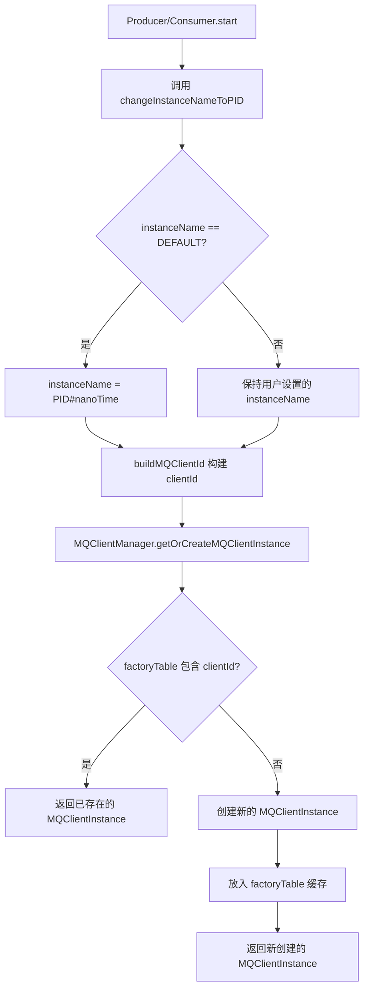
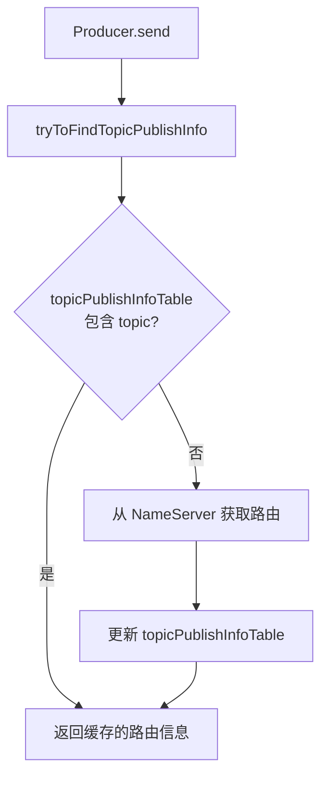

# RocketMQ 项目接入实战

> 本文档面向需要在项目中集成 RocketMQ 的开发者，涵盖客户端集成方式、MQClientInstance 管理、常见问题解决方案。

---

## 一、客户端集成方式

### 1.1 原生客户端使用

**Maven 依赖**：

```xml
<dependency>
    <groupId>org.apache.rocketmq</groupId>
    <artifactId>rocketmq-client</artifactId>
    <version>5.1.0</version>
</dependency>
```

**Producer 示例**：

```java
// 1. 创建 Producer 实例，指定生产者组名
DefaultMQProducer producer = new DefaultMQProducer("producer-group");
// 2. 设置 NameServer 地址
producer.setNamesrvAddr("localhost:9876");
// 3. 启动 Producer（此时才修改 instanceName 为 PID#nanoTime）
producer.start();

// 4. 构建消息（Topic、Tag、消息体）
Message msg = new Message("TopicTest", "TagA", "Hello RocketMQ".getBytes());
// 5. 同步发送消息
SendResult result = producer.send(msg);

// 6. 关闭 Producer
producer.shutdown();
```

**Consumer 示例**：

```java
// 1. 创建 Consumer 实例，指定消费者组名
DefaultMQPushConsumer consumer = new DefaultMQPushConsumer("consumer-group");
// 2. 设置 NameServer 地址
consumer.setNamesrvAddr("localhost:9876");
// 3. 订阅 Topic，"*" 表示订阅所有 Tag
consumer.subscribe("TopicTest", "*");
// 4. 注册消息监听器（并发消费）
consumer.registerMessageListener(new MessageListenerConcurrently() {
    @Override
    public ConsumeConcurrentlyStatus consumeMessage(List<MessageExt> msgs, ConsumeConcurrentlyContext context) {
        // 处理消息
        System.out.println("Received: " + msgs);
        // 返回消费成功状态
        return ConsumeConcurrentlyStatus.CONSUME_SUCCESS;
    }
});
// 5. 启动 Consumer
consumer.start();
```

### 1.2 Spring Boot Starter 集成

**Maven 依赖**：

```xml
<dependency>
    <groupId>org.apache.rocketmq</groupId>
    <artifactId>rocketmq-spring-boot-starter</artifactId>
    <version>2.2.3</version>
</dependency>
```

**配置文件**：

```yaml
rocketmq:
  name-server: localhost:9876
  producer:
    group: producer-group              # 生产者组名
    send-message-timeout: 3000         # 发送超时时间，默认 3000ms
    retry-times-when-send-failed: 2    # 同步发送重试次数，默认 2
```

**发送消息**：

```java
@Autowired
private RocketMQTemplate rocketMQTemplate;

public void send() {
    // 发送消息到 TopicTest，Tag 为 TagA
    // 格式：topic:tag
    rocketMQTemplate.convertAndSend("TopicTest:TagA", "Hello RocketMQ");
}
```

**消费消息**：

```java
@Service
// topic: 监听的 Topic
// consumerGroup: 消费者组名
@RocketMQMessageListener(topic = "TopicTest", consumerGroup = "consumer-group")
public class Consumer implements RocketMQListener<String> {
    @Override
    public void onMessage(String message) {
        // 处理消息
        System.out.println("Received: " + message);
    }
}
```

### 1.3 集成方式对比

| 对比维度 | 原生客户端 | Spring Boot Starter |
| --- | --- | --- |
| **配置方式** | 代码硬编码或手动读取配置 | YAML 配置文件 |
| **消息发送** | `DefaultMQProducer.send()` | `RocketMQTemplate.convertAndSend()` |
| **消息消费** | 手动注册监听器 | 注解 `@RocketMQMessageListener` |
| **MQClientInstance** | 每个实例独立（默认） | 每个实例独立（默认） |
| **学习成本** | 较高 | 较低 |
| **灵活性** | 高，可深度定制 | 中，约定优于配置 |

---

## 二、MQClientInstance 管理

### 2.1 创建机制与 clientId 生成

#### 2.1.1 MQClientInstance 创建流程

> 源码位置：[MQClientManager.java](../../client/src/main/java/org/apache/rocketmq/client/impl/MQClientManager.java)



#### 2.1.2 MQClientManager 单例管理

```java
// MQClientManager.java
public class MQClientManager {
    private static MQClientManager instance = new MQClientManager();  // 单例
    
    private ConcurrentMap<String/* clientId */, MQClientInstance> factoryTable =
        new ConcurrentHashMap<String, MQClientInstance>();

    public MQClientInstance getOrCreateMQClientInstance(ClientConfig clientConfig, RPCHook rpcHook) {
        String clientId = clientConfig.buildMQClientId();  // 根据 clientId 决定是否共享
        MQClientInstance instance = this.factoryTable.get(clientId);
        if (null == instance) {
            instance = new MQClientInstance(clientConfig.cloneClientConfig(),
                this.factoryIndexGenerator.getAndIncrement(), clientId, rpcHook);
            MQClientInstance prev = this.factoryTable.putIfAbsent(clientId, instance);
            if (prev != null) {
                instance = prev;  // 已存在则使用已有的
            }
        }
        return instance;
    }
}
```

#### 2.1.3 clientId 组成

> 源码位置：[ClientConfig.java](../../client/src/main/java/org/apache/rocketmq/client/ClientConfig.java)

```java
// ClientConfig.java
public String buildMQClientId() {
    StringBuilder sb = new StringBuilder();
    sb.append(this.getClientIP());      // 本机 IP
    sb.append("@");
    sb.append(this.getInstanceName());  // 实例名
    if (!UtilAll.isBlank(this.unitName)) {
        sb.append("@");
        sb.append(this.unitName);       // 单元名（可选）
    }
    if (enableStreamRequestType) {      // Stream 模式（可选，默认 false）
        sb.append("@");
        sb.append(RequestType.STREAM);
    }
    return sb.toString();  // 格式: {clientIP}@{instanceName}[@{unitName}][@STREAM]
}
```

**clientId 组成部分**：

| 组成部分 | 来源 | 默认值 | 说明 |
| --- | --- | --- | --- |
| `clientIP` | `RemotingUtil.getLocalAddress()` | 本机 IP | 客户端 IP 地址 |
| `instanceName` | `System.getProperty("rocketmq.client.name", "DEFAULT")` | `"DEFAULT"` | 实例名，启动时会被修改 |
| `unitName` | 用户设置 | `null` | 单元名（多机房场景） |
| `STREAM` | `enableStreamRequestType` | 不添加 | Stream 模式标识 |

#### 2.1.4 instanceName 默认值处理

> 源码位置：[DefaultMQProducerImpl.java:223](../../client/src/main/java/org/apache/rocketmq/client/impl/producer/DefaultMQProducerImpl.java)、[DefaultMQPushConsumerImpl.java:892](../../client/src/main/java/org/apache/rocketmq/client/impl/consumer/DefaultMQPushConsumerImpl.java)

```java
// DefaultMQProducerImpl.start() - Producer 启动时
if (!this.defaultMQProducer.getProducerGroup().equals(MixAll.CLIENT_INNER_PRODUCER_GROUP)) {
    this.defaultMQProducer.changeInstanceNameToPID();  // 改为 PID#nanoTime
}

// DefaultMQPushConsumerImpl.start() - Consumer 启动时
if (this.defaultMQPushConsumer.getMessageModel() == MessageModel.CLUSTERING) {
    this.defaultMQPushConsumer.changeInstanceNameToPID();  // 改为 PID#nanoTime
}

// ClientConfig.changeInstanceNameToPID()
public void changeInstanceNameToPID() {
    if (this.instanceName.equals("DEFAULT")) {
        this.instanceName = UtilAll.getPid() + "#" + System.nanoTime();  // 如：12345#987654321
    }
}
```

> **赋值时机**：`instanceName` 在 **`start()` 方法中**才被修改为 `PID#nanoTime`，而不是创建实例时。
>
> | 阶段 | instanceName | 说明 |
> | --- | --- | --- |
> | `new DefaultMQProducer()` | `"DEFAULT"` | 构造时默认值 |
> | `producer.start()` | `PID#nanoTime` | **启动时才修改** |
>
> 如果想在 `start()` 之前手动设置 `instanceName`，需要调用 `producer.setInstanceName("xxx")`，且设置的值不能是 `"DEFAULT"`，否则仍会被覆盖。

**不同场景下的 MQClientInstance 数量**：

| 使用方式 | instanceName | clientId | MQClientInstance 数量 |
| --- | --- | --- | --- |
| **原生 Producer（默认）** | `PID#nanoTime` | `IP@PID#nanoTime` | 每个 Producer 实例独立 |
| **原生 Consumer（集群模式）** | `PID#nanoTime` | `IP@PID#nanoTime` | 每个 Consumer 实例独立 |
| **原生 Consumer（广播模式）** | `"DEFAULT"` | `IP@DEFAULT` | 可能共享 |
| **Spring Boot Starter Producer** | `PID#nanoTime` | `IP@PID#nanoTime` | 每个 Producer 实例独立 |
| **Spring Boot Starter Consumer 2.2.x** | `consumerGroup@timestamp` | `IP@consumerGroup@timestamp` | 每个 Consumer 实例独立 |
| **Spring Boot Starter 2.3.0+** | 用户配置 | 取决于配置 | 取决于配置 |

> **关键说明**：`nanoTime` 是 `System.nanoTime()` 的返回值，**每次调用都不同**。因此即使同一个 JVM 内创建多个 Producer/Consumer，每个实例的 `clientId` 都不同，从而创建独立的 MQClientInstance。
>
> 示例：同一个 JVM 内创建两个 Producer：
> - Producer 1: `192.168.1.1@12345#987654321000`
> - Producer 2: `192.168.1.1@12345#987654321999`
>
> IP 和 PID 相同，但 `nanoTime` 不同，所以 clientId 不同，各自创建独立的 MQClientInstance。

> **Spring Boot Starter 差异**：
> - **Producer**：走原生逻辑，`instanceName = PID#nanoTime`
> - **Consumer**：由 `RocketMQUtil.getInstanceName()` 生成，`instanceName = consumerGroup@timestamp`
>
> 两者都包含时间相关变量，所以默认情况下每个实例都会创建独立的 MQClientInstance。

#### 2.1.6 MQClientInstance 内部结构

> 源码位置：[MQClientInstance.java](../../client/src/main/java/org/apache/rocketmq/client/impl/factory/MQClientInstance.java)

```java
public class MQClientInstance {
    private final ClientConfig clientConfig;
    private final String clientId;
    
    // 生产者/消费者/管理员注册表
    private final ConcurrentMap<String, MQProducerInner> producerTable = new ConcurrentHashMap<>();
    private final ConcurrentMap<String, MQConsumerInner> consumerTable = new ConcurrentHashMap<>();
    private final ConcurrentMap<String, MQAdminExtInner> adminExtTable = new ConcurrentHashMap<>();
    
    // 路由信息缓存（核心共享资源）
    private final ConcurrentMap<String, TopicRouteData> topicRouteTable = new ConcurrentHashMap<>();
    private final ConcurrentMap<String, HashMap<Long, String>> brokerAddrTable = new ConcurrentHashMap<>();
    
    // 核心服务组件
    private final MQClientAPIImpl mQClientAPIImpl;           // 网络通信 API
    private final PullMessageService pullMessageService;      // 拉消息服务
    private final RebalanceService rebalanceService;          // Rebalance 服务
    private final DefaultMQProducer defaultMQProducer;        // 内部 Producer
    private final ScheduledExecutorService scheduledExecutorService;  // 定时任务线程池
}
```

**MQClientInstance 核心组件说明**：

| 组件 | 类型 | 说明 |
| --- | --- | --- |
| `producerTable` | `ConcurrentMap` | 注册的 Producer 实例，key 为 producerGroup |
| `consumerTable` | `ConcurrentMap` | 注册的 Consumer 实例，key 为 consumerGroup |
| `topicRouteTable` | `ConcurrentMap` | Topic 路由信息缓存，**所有 Producer/Consumer 共享** |
| `brokerAddrTable` | `ConcurrentMap` | Broker 地址缓存，**所有 Producer/Consumer 共享** |
| `mQClientAPIImpl` | `MQClientAPIImpl` | 网络通信封装，与 NameServer/Broker 交互 |
| `pullMessageService` | `PullMessageService` | 拉消息服务（Push Consumer 使用） |
| `rebalanceService` | `RebalanceService` | 负载均衡服务（Consumer 使用） |
| `scheduledExecutorService` | `ScheduledExecutorService` | 定时任务线程池（心跳、路由更新等） |

**Spring Boot Starter 的特殊处理**：

> **说明**：以下源码来自 `rocketmq-spring` 项目（[GitHub](https://github.com/apache/rocketmq-spring)），不在 RocketMQ 主仓库中。

```java
// rocketmq-spring 2.2.x 版本 - RocketMQUtil.getInstanceName()
public static String getInstanceName(RPCHook rpcHook, String identify) {
    if (rpcHook == null) {
        return identify + "@" + System.currentTimeMillis();  // 无认证：consumerGroup@timestamp
    } else {
        // 有认证：accessKey@consumerGroup@timestamp
        SessionCredentials sessionCredentials = ((AclClientRPCHook) rpcHook).getSessionCredentials();
        return sessionCredentials.getAccessKey() + "@" + identify + "@" + System.currentTimeMillis();
    }
}
```

> **版本差异**：
>
> | 版本 | instanceName 生成方式 | 说明 |
> | --- | --- | --- |
> | **2.1.x** | 不同逻辑 | 可能导致 clientId 冲突 |
> | **2.2.x** | `consumerGroup@timestamp` | 修复了部分问题，但每个 Consumer 仍独立 |
> | **2.3.0+** | 用户自定义配置 | 删除了 `RocketMQUtil.getInstanceName`，需手动配置 |
>
> **关键点**：Spring Boot Starter 在 2.2.x 版本中，`instanceName` 包含 `System.currentTimeMillis()`，所以每个 Consumer 启动时 instanceName 不同，仍然会创建独立的 MQClientInstance。如需共享，需手动配置相同的 `instanceName`。

#### 2.1.7 ClientConfig 核心配置项

> 源码位置：[ClientConfig.java](../../client/src/main/java/org/apache/rocketmq/client/ClientConfig.java)

| 配置项 | 默认值 | 说明 |
| --- | --- | --- |
| `namesrvAddr` | 环境变量 `NAMESRV_ADDR` | NameServer 地址 |
| `clientIP` | `RemotingUtil.getLocalAddress()` | 客户端 IP |
| `instanceName` | `"DEFAULT"` | 实例名，启动后改为 `PID#nanoTime` |
| `clientCallbackExecutorThreads` | CPU 核心数 | 回调线程池大小 |
| `pollNameServerInterval` | `30000ms`（30s） | 从 NameServer 拉取路由信息间隔 |
| `heartbeatBrokerInterval` | `30000ms`（30s） | 心跳发送间隔 |
| `persistConsumerOffsetInterval` | `5000ms`（5s） | 消费位点持久化间隔 |
| `pullTimeDelayMillsWhenException` | `1000ms`（1s） | 异常时拉取延迟时间 |
| `mqClientApiTimeout` | `3000ms`（3s） | 客户端 API 超时时间 |
| `useTLS` | `false` | 是否启用 TLS |
| `unitMode` | `false` | 是否启用单元模式 |
| `unitName` | `null` | 单元名称（多机房场景） |

### 2.2 一个 vs 多个 MQClientInstance 对比

| 对比维度 | 共享 MQClientInstance | 独立 MQClientInstance |
| --- | --- | --- |
| **内存占用** | 低，共享路由缓存、网络连接 | 高，每个实例独立缓存和连接 |
| **NameServer 请求** | 少，路由信息共享 | 多，每个实例独立请求 |
| **网络连接数** | 少，与 Broker 建立一套连接 | 多，每个实例独立建立连接 |
| **心跳发送** | 统一发送，频率可控 | 每个实例独立发送，频率翻倍 |
| **线程资源** | 共享后台线程（定时任务、Netty） | 每个实例独立线程池 |
| **隔离性** | 差，一个实例故障影响全部 | 好，实例间相互隔离 |
| **配置灵活性** | 低，统一配置 | 高，可针对不同实例定制 |
| **适用场景** | 单一业务、资源受限环境 | 多业务隔离、高可用要求 |

> **注意**：默认情况下（无论是原生客户端还是 Spring Boot Starter），每个 Producer/Consumer 实例都会创建独立的 MQClientInstance。如需共享，需手动配置相同的 `instanceName`。

### 2.3 资源消耗对比示意

```
┌─────────────────────────────────────────────────────────────────┐
│                    一个 MQClientInstance                         │
├─────────────────────────────────────────────────────────────────┤
│  ┌─────────────┐  ┌─────────────┐  ┌─────────────┐             │
│  │ Producer A  │  │ Producer B  │  │ Consumer C  │             │
│  └──────┬──────┘  └──────┬──────┘  └──────┬──────┘             │
│         │                │                │                     │
│         └────────────────┼────────────────┘                     │
│                          ▼                                      │
│         ┌────────────────────────────────────┐                  │
│         │       MQClientInstance (1个)        │                 │
│         │  ┌──────────────────────────────┐  │                  │
│         │  │ topicRouteTable (共享)        │  │                  │
│         │  │ brokerAddrTable (共享)        │  │                  │
│         │  │ Netty 连接池 (共享)           │  │                  │
│         │  │ 定时任务线程 (共享)            │  │                  │
│         │  └──────────────────────────────┘  │                  │
│         └────────────────────────────────────┘                  │
│                          │                                      │
│              ┌───────────┴───────────┐                          │
│              ▼                       ▼                          │
│        NameServer (1套)        Broker (1套连接)                  │
└─────────────────────────────────────────────────────────────────┘

┌─────────────────────────────────────────────────────────────────┐
│                   多个 MQClientInstance                          │
├─────────────────────────────────────────────────────────────────┤
│  ┌─────────────┐  ┌─────────────┐  ┌─────────────┐             │
│  │ Producer A  │  │ Producer B  │  │ Consumer C  │             │
│  └──────┬──────┘  └──────┬──────┘  └──────┬──────┘             │
│         │                │                │                     │
│         ▼                ▼                ▼                     │
│  ┌─────────────┐  ┌─────────────┐  ┌─────────────┐             │
│  │MQClientInst │  │MQClientInst │  │MQClientInst │             │
│  │    (1)      │  │    (2)      │  │    (3)      │             │
│  │ 路由缓存    │  │ 路由缓存    │  │ 路由缓存    │             │
│  │ Netty连接   │  │ Netty连接   │  │ Netty连接   │             │
│  │ 定时线程    │  │ 定时线程    │  │ 定时线程    │             │
│  └──────┬──────┘  └──────┬──────┘  └──────┬──────┘             │
│         │                │                │                     │
│         └────────────────┼────────────────┘                     │
│                          ▼                                      │
│              ┌───────────┴───────────┐                          │
│              ▼                       ▼                          │
│        NameServer (3套请求)   Broker (3套连接)                   │
└─────────────────────────────────────────────────────────────────┘
```

> **建议**：对于资源受限环境，可以考虑手动配置相同的 `instanceName` 来共享 MQClientInstance，减少资源消耗。但需要注意隔离性问题，一个实例故障可能影响全部。只有在需要严格隔离的场景下，才推荐使用多个独立实例。

### 2.4 Spring Boot 中 Producer/Consumer 实例数量

#### 2.4.1 Producer 实例数量

**一个 Spring Boot 应用只有一个 Producer**。

```java
// Spring Boot Starter 默认只创建一个 RocketMQTemplate（单例）
// RocketMQTemplate 内部持有一个 DefaultMQProducer

@Autowired
private RocketMQTemplate rocketMQTemplate;

// 同一个 RocketMQTemplate 可以发送多个 Topic
rocketMQTemplate.convertAndSend("TopicA", messageA);
rocketMQTemplate.convertAndSend("TopicB", messageB);
rocketMQTemplate.convertAndSend("TopicC", messageC);
```

**原理**：Producer 与 Topic 无关，只负责发送消息。发送时从 `topicPublishInfoTable` 获取对应 Topic 的路由信息。

> 源码位置：[DefaultMQProducerImpl.java:739](../../client/src/main/java/org/apache/rocketmq/client/impl/producer/DefaultMQProducerImpl.java)

```java
// DefaultMQProducerImpl.tryToFindTopicPublishInfo()
private TopicPublishInfo tryToFindTopicPublishInfo(final String topic) {
    // 1. 从本地缓存获取 Topic 路由信息
    TopicPublishInfo topicPublishInfo = this.topicPublishInfoTable.get(topic);
    if (null == topicPublishInfo || !topicPublishInfo.ok()) {
        // 2. 缓存中没有，创建空的 TopicPublishInfo 并放入缓存
        this.topicPublishInfoTable.putIfAbsent(topic, new TopicPublishInfo());
        // 3. 从 NameServer 获取路由信息并更新缓存
        this.mQClientFactory.updateTopicRouteInfoFromNameServer(topic);
        topicPublishInfo = this.topicPublishInfoTable.get(topic);
    }
    
    if (topicPublishInfo.isHaveTopicRouterInfo() || topicPublishInfo.ok()) {
        return topicPublishInfo;
    } else {
        // 4. 使用默认 Topic 再次尝试获取路由信息
        this.mQClientFactory.updateTopicRouteInfoFromNameServer(topic, true, this.defaultMQProducer);
        topicPublishInfo = this.topicPublishInfoTable.get(topic);
        return topicPublishInfo;
    }
}
```

**路由信息获取流程**：



#### 2.4.2 Consumer 实例数量

**每个 `@RocketMQMessageListener` 注解都会创建一个独立的 Consumer**。

```java
// Consumer 1 - 监听 TopicA
@Service
@RocketMQMessageListener(topic = "TopicA", consumerGroup = "group-a")
public class ConsumerA implements RocketMQListener<String> {
    @Override
    public void onMessage(String message) {
        // 处理 TopicA 的消息
        System.out.println("TopicA: " + message);
    }
}

// Consumer 2 - 监听 TopicB
@Service
@RocketMQMessageListener(topic = "TopicB", consumerGroup = "group-b")
public class ConsumerB implements RocketMQListener<String> {
    @Override
    public void onMessage(String message) {
        // 处理 TopicB 的消息
        System.out.println("TopicB: " + message);
    }
}
// 以上两个注解会创建两个独立的 Consumer 实例
```

**源码分析**：

> 源码位置：`rocketmq-spring` 项目 [ListenerContainerConfiguration.java](https://github.com/apache/rocketmq-spring)

```java
// ListenerContainerConfiguration.java
@Override
public void afterSingletonsInstantiated() {
    // 1. 获取所有加了 @RocketMQMessageListener 注解的 bean
    Map<String, Object> beans = this.applicationContext
        .getBeansWithAnnotation(RocketMQMessageListener.class);
    
    // 2. 每个 bean 创建一个独立的 Container
    beans.forEach(this::registerContainer);
}

private void registerContainer(String beanName, Object bean) {
    // 3. 每个 @RocketMQMessageListener 创建一个 DefaultRocketMQListenerContainer
    // 4. 每个 Container 内部创建一个 DefaultMQPushConsumer
    genericApplicationContext.registerBean(containerBeanName, 
        DefaultRocketMQListenerContainer.class,
        () -> createRocketMQListenerContainer(containerBeanName, bean, annotation));
}
```

#### 2.4.3 Producer vs Consumer 对比

| 维度 | Producer | Consumer |
| --- | --- | --- |
| **数量** | 1个（单例） | N个（每个 `@RocketMQMessageListener` 一个） |
| **Topic 关系** | 1个 Producer 可发送多个 Topic | 1个 Consumer 只能监听 1个 Topic |
| **设计原因** | 发送是无状态的，可复用 | 消费需要独立的状态、线程池、Rebalance |

#### 2.4.4 一个 Consumer 监听多个 Topic

如果需要一个 Consumer 监听多个 Topic，可以使用原生客户端：

```java
@Bean(initMethod = "start", destroyMethod = "shutdown")
public DefaultMQPushConsumer multiTopicConsumer() throws MQClientException {
    DefaultMQPushConsumer consumer = new DefaultMQPushConsumer("multi-topic-group");
    consumer.setNamesrvAddr("localhost:9876");
    consumer.subscribe("TopicA", "*");
    consumer.subscribe("TopicB", "*");
    consumer.subscribe("TopicC", "*");
    consumer.registerMessageListener(new MessageListenerConcurrently() {
        @Override
        public ConsumeConcurrentlyStatus consumeMessage(List<MessageExt> msgs, ConsumeConcurrentlyContext context) {
            for (MessageExt msg : msgs) {
                String topic = msg.getTopic();
                // 根据 topic 区分处理逻辑
                switch (topic) {
                    case "TopicA": handleTopicA(msg); break;
                    case "TopicB": handleTopicB(msg); break;
                    case "TopicC": handleTopicC(msg); break;
                }
            }
            return ConsumeConcurrentlyStatus.CONSUME_SUCCESS;
        }
    });
    return consumer;
}
```

#### 2.4.5 实例数量总结

```
┌─────────────────────────────────────────────────────────────┐
│                    Spring Boot 应用                          │
├─────────────────────────────────────────────────────────────┤
│                                                              │
│   Producer:                                                  │
│   ┌─────────────────────────────────────────────────────┐   │
│   │         RocketMQTemplate (单例)                      │   │
│   │              ↓                                       │   │
│   │         DefaultMQProducer (1个)                      │   │
│   │         可发送 TopicA, TopicB, TopicC...             │   │
│   └─────────────────────────────────────────────────────┘   │
│                                                              │
│   Consumer:                                                  │
│   ┌─────────────────┐ ┌─────────────────┐ ┌─────────────┐   │
│   │ @RocketMQ       │ │ @RocketMQ       │ │ @RocketMQ   │   │
│   │ MessageListener │ │ MessageListener │ │ MessageList │   │
│   │ (TopicA)        │ │ (TopicB)        │ │ (TopicC)    │   │
│   │      ↓          │ │      ↓          │ │      ↓      │   │
│   │ Container 1     │ │ Container 2     │ │ Container 3 │   │
│   │      ↓          │ │      ↓          │ │      ↓      │   │
│   │ Consumer 1      │ │ Consumer 2      │ │ Consumer 3  │   │
│   └─────────────────┘ └─────────────────┘ └─────────────┘   │
│                                                              │
└─────────────────────────────────────────────────────────────┘
```

| 场景 | Producer 数量 | Consumer 数量 |
| --- | --- | --- |
| 1个 Topic | 1个 | 1个 |
| N个 Topic | 1个 | N个（每个 `@RocketMQMessageListener` 一个） |

#### 2.4.6 什么时候需要多个 Producer？

| 场景 | 是否需要多个 Producer |
| --- | --- |
| 发送多个 Topic | ❌ 不需要 |
| 不同的 Producer Group | ✅ 需要（如不同业务隔离） |
| 不同的 NameServer | ✅ 需要 |
| 不同的发送配置（超时、重试等） | ✅ 需要 |

**多 Producer 配置示例**：

```java
@Configuration
public class MultiProducerConfig {
    
    @Bean("producerA")
    public DefaultMQProducer producerA() {
        DefaultMQProducer producer = new DefaultMQProducer("group-a");
        producer.setNamesrvAddr("nameserver-a:9876");
        producer.setSendMsgTimeout(3000);
        return producer;
    }
    
    @Bean("producerB")
    public DefaultMQProducer producerB() {
        DefaultMQProducer producer = new DefaultMQProducer("group-b");
        producer.setNamesrvAddr("nameserver-b:9876");
        producer.setSendMsgTimeout(5000);
        return producer;
    }
}
```

---

## 三、常见问题与解决方案

### 3.1 Docker 容器 clientId 冲突

**问题描述**：Docker 容器 + host 网络模式下，多个容器可能出现 clientId 重复。

**问题原因**：

| 原因 | 说明 |
| --- | --- |
| PID 相同 | Docker 容器内 PID 通常都是 1 |
| IP 相同 | host 网络模式下，多个容器共享宿主机 IP |
| clientId 重复 | `IP@PID#nanoTime` 可能重复 |

**后果**：
- 消费队列分布不均
- 消息重复消费
- 消息堆积

**解决方案**：

**方案一：手动设置 instanceName**

```java
// 原生客户端
producer.setInstanceName(UUID.randomUUID().toString());
consumer.setInstanceName(UUID.randomUUID().toString());

// Spring Boot 配置
rocketmq:
  producer:
    instance-name: ${random.uuid}
```

**方案二：BeanPostProcessor 二次改造**

```java
@Component
public class RocketMqConsumerPostProcessor implements BeanPostProcessor {
    @Override
    public Object postProcessAfterInitialization(Object bean, String beanName) {
        if (bean instanceof DefaultRocketMQListenerContainer) {
            DefaultRocketMQListenerContainer container = (DefaultRocketMQListenerContainer) bean;
            // 使用时间戳拼接组成新的 instanceName
            String newInstanceName = container.getConsumerGroup() + "@" + System.currentTimeMillis();
            container.getConsumer().setInstanceName(newInstanceName);
        }
        return bean;
    }
}
```

### 3.2 生产环境最佳实践

**Producer 配置建议**：

| 配置项 | 建议值 | 默认值 | 说明 |
| --- | --- | --- | --- |
| `retryTimesWhenSendFailed` | 2 | 2 | 同步发送重试次数 |
| `sendMsgTimeout` | 3000ms（3s） | 3000ms | 发送超时时间 |
| `compressMsgBodyOverHowmuch` | 4096B（4KB） | 4096B | 超过此阈值自动压缩 |
| `maxMessageSize` | 4MB | 4MB | 最大消息大小 |
| `retryAnotherBrokerWhenNotStoreOK` | true | false | 存储失败时切换 Broker |

**Consumer 配置建议**：

| 配置项 | 建议值 | 默认值 | 说明 |
| --- | --- | --- | --- |
| `consumeThreadMin` | 20 | 20 | 最小消费线程数 |
| `consumeThreadMax` | 64 | 20 | 最大消费线程数 |
| `pullBatchSize` | 32 | 32 | 每次拉取消息数量 |
| `consumeMessageBatchMaxSize` | 16 | 1 | 批量消费消息数量 |
| `messageModel` | CLUSTERING | CLUSTERING | 消费模式（集群/广播） |
| `persistConsumerOffsetInterval` | 5000ms（5s） | 5000ms | 消费位点持久化间隔 |

**Topic 创建建议**：

```bash
# 创建 Topic 时指定读写队列数
./mqadmin updateTopic -n localhost:9876 -t TopicTest -c DefaultCluster -r 8 -w 8
```

| 参数 | 说明 |
| --- | --- |
| `-r` | 读队列数量 |
| `-w` | 写队列数量 |

### 3.3 性能调优建议

**JVM 参数**：

```bash
# 推荐 JVM 参数
-Xms4g -Xmx4g -Xmn2g
-XX:+UseG1GC
-XX:MaxGCPauseMillis=50
-XX:+ParallelRefProcEnabled
```

**Producer 调优**：

| 调优项 | 方法 |
| --- | --- |
| 批量发送 | 使用 `send(Collection<Message>)` 减少网络开销 |
| 异步发送 | 使用 `send(msg, callback)` 提高吞吐量 |
| 消息压缩 | 超过 4KB 自动压缩，可调整阈值 |
| 连接复用 | 手动配置相同的 `instanceName` 共享 MQClientInstance |

**Consumer 调优**：

| 调优项 | 方法 |
| --- | --- |
| 增加消费线程 | 调整 `consumeThreadMax` |
| 批量消费 | 调整 `consumeMessageBatchMaxSize` |
| 预取消息 | 调整 `pullBatchSize` |
| 顺序消费 | 使用 `MessageListenerOrderly` |

---

## 四、问题排查指南

### 4.1 常见错误码

| 错误码 | 说明 | 解决方案 |
| --- | --- | --- |
| `CLIENT_SERVICE_NOT_READY` | 客户端未启动 | 检查 `producer.start()` 或 `consumer.start()` |
| `NOT_FOUND_TOPIC_EXCEPTION` | Topic 不存在 | 创建 Topic 或开启自动创建 |
| `SERVICE_NOT_AVAILABLE` | Broker 不可用 | 检查 Broker 状态和网络连接 |
| `FLOW_CONTROL` | 流控限制 | 降低发送频率或调整 Broker 配置 |

### 4.2 日志分析

**开启客户端日志**：

```java
// 设置日志目录
System.setProperty("rocketmq.client.logRoot", "/var/log/rocketmq");
```

**关键日志文件**：

| 日志文件 | 内容 |
| --- | --- |
| `rocketmq_client.log` | 客户端操作日志 |
| `stats.log` | 统计信息日志 |
| `filter.log` | 消息过滤日志 |

### 4.3 监控指标

**Producer 关键指标**：

| 指标 | 说明 |
| --- | --- |
| `rocketmq_producer_send_success_total` | 发送成功总数 |
| `rocketmq_producer_send_failed_total` | 发送失败总数 |
| `rocketmq_producer_send_latency` | 发送延迟 |

**Consumer 关键指标**：

| 指标 | 说明 |
| --- | --- |
| `rocketmq_consumer_consume_success_total` | 消费成功总数 |
| `rocketmq_consumer_consume_failed_total` | 消费失败总数 |
| `rocketmq_consumer_consume_latency` | 消费延迟 |
| `rocketmq_consumer_lag` | 消费延迟量 |

---

## 五、总结

### 5.1 核心要点回顾

| 核心概念 | 关键点 |
| --- | --- |
| **MQClientInstance** | 客户端实例，管理路由缓存、网络连接、心跳等 |
| **clientId** | 格式 `IP@instanceName`，决定是否共享 MQClientInstance |
| **instanceName** | 默认 `"DEFAULT"`，启动后改为 `PID#nanoTime`（每次不同） |
| **Producer 数量** | Spring Boot 默认 1 个，可发送多个 Topic |
| **Consumer 数量** | 每个 `@RocketMQMessageListener` 创建 1 个 |

### 5.2 最佳实践速查

**Producer**：

```java
// 推荐配置
producer.setRetryTimesWhenSendFailed(2);       // 重试 2 次
producer.setSendMsgTimeout(3000);              // 超时 3s
producer.setMaxMessageSize(4 * 1024 * 1024);   // 最大 4MB
```

**Consumer**：

```java
// 推荐配置
consumer.setConsumeThreadMin(20);              // 最小线程数
consumer.setConsumeThreadMax(64);              // 最大线程数
consumer.setPullBatchSize(32);                 // 每次拉取 32 条
consumer.setConsumeMessageBatchMaxSize(16);    // 批量消费 16 条
```

**Docker 环境**：

```java
// 避免 clientId 冲突
producer.setInstanceName(UUID.randomUUID().toString());
consumer.setInstanceName(UUID.randomUUID().toString());
```

---

## 六、参考资料

- [RocketMQ 官方文档](https://rocketmq.apache.org/docs/quickStart/01quickstart/)
- [rocketmq-spring 项目](https://github.com/apache/rocketmq-spring)
- [RocketMQ 最佳实践](https://rocketmq.apache.org/docs/bestPractice/06bestpractice/)
