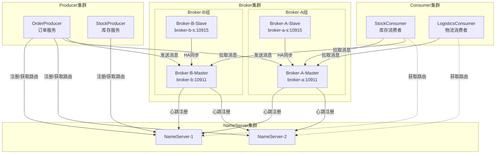
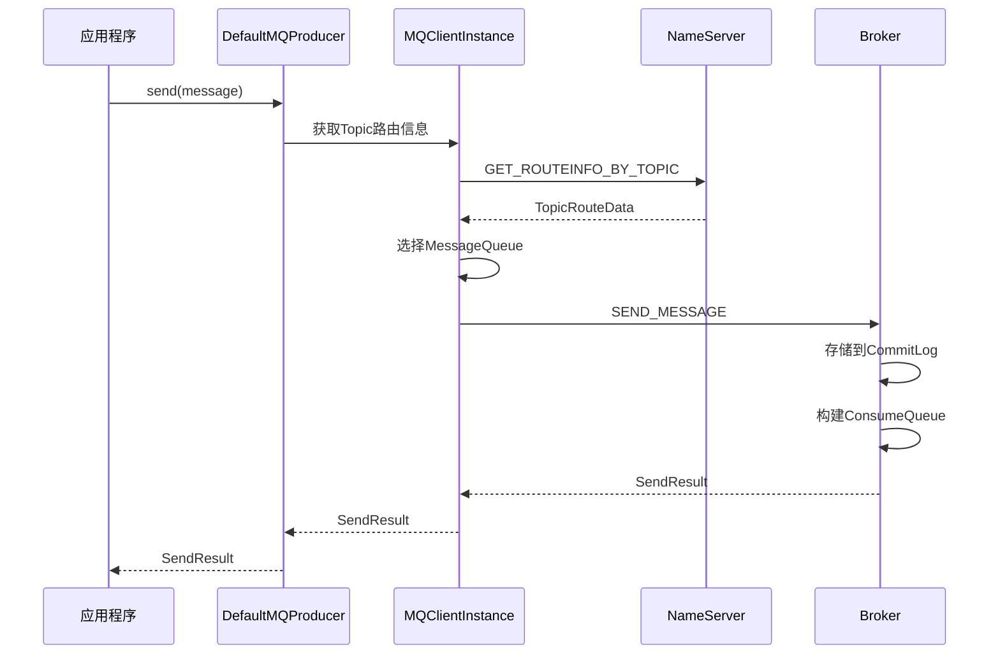
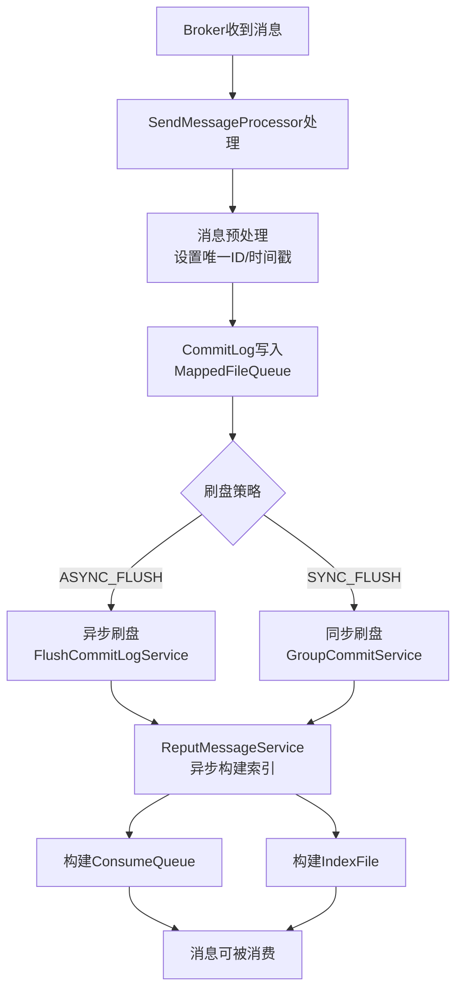
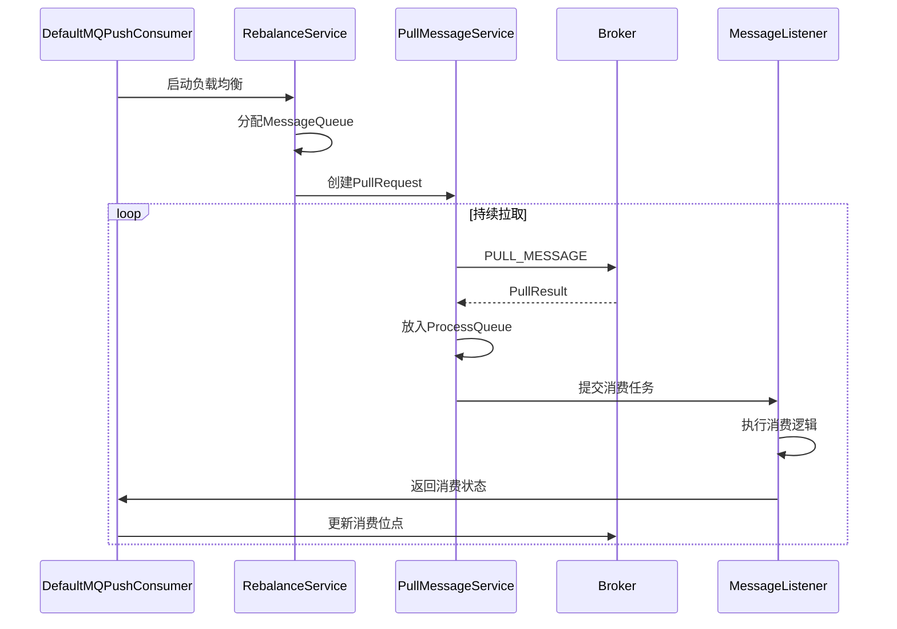
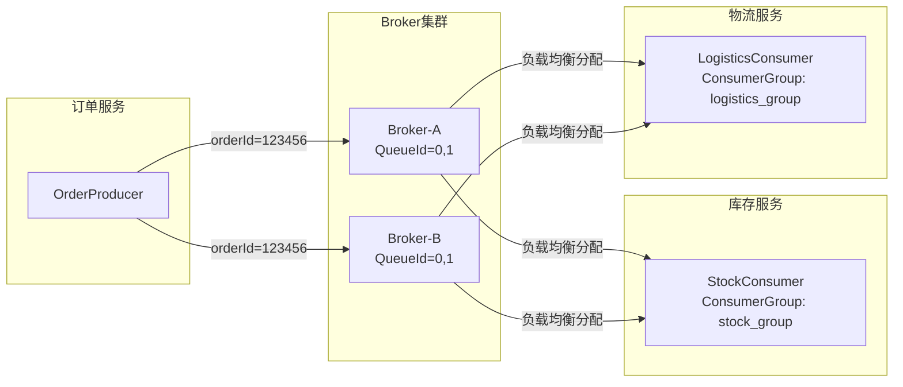

# 01-RocketMQ-整体架构与消息全流程

## 一、模块定位与核心职责

RocketMQ 是 Apache 顶级开源分布式消息中间件，核心职责包括：

| 模块 | 核心职责 | 源码位置 |
|------|---------|---------|
| NameServer | 轻量级注册中心，管理 Broker 路由信息 | namesrv/ |
| Broker | 消息存储、转发、主从同步 | broker/ + store/ |
| Producer | 消息发送客户端 | client/producer/ |
| Consumer | 消息消费客户端 | client/consumer/ |
| Remoting | 基于 Netty 的网络通信层 | remoting/ |
| Common | 公共组件、协议定义 | common/ |

## 二、整体架构图



## 三、核心组件说明

### 3.1 NameServer（名字服务器）

**源码入口**：`namesrv/src/main/java/org/apache/rocketmq/namesrv/NamesrvController.java`

```java
public class NamesrvController {
    private final NamesrvConfig namesrvConfig;
    private final NettyServerConfig nettyServerConfig;
    private final KVConfigManager kvConfigManager;
    private final RouteInfoManager routeInfoManager;
    private RemotingServer remotingServer;
    // ...
}
```

**核心职责**：
- 管理 Broker 路由信息（topic → broker 地址映射）
- 提供 Topic 路由查询服务
- 无状态设计，节点间互不通信

**关键配置**（`NamesrvConfig.java`）：

| 配置项 | 默认值 | 说明 |
|--------|--------|------|
| scanNotActiveBrokerInterval | 5000ms（5秒） | 扫描不活跃 Broker 间隔 |
| defaultThreadPoolNums | 16 | 默认处理线程数 |
| clientRequestThreadPoolNums | 8 | 客户端请求处理线程数 |
| clientRequestThreadPoolQueueCapacity | 50000 | 客户端请求队列容量 |
| defaultThreadPoolQueueCapacity | 10000 | 默认请求队列容量 |

### 3.2 Broker（消息服务器）

**源码入口**：`broker/src/main/java/org/apache/rocketmq/broker/BrokerController.java`

```java
public class BrokerController {
    protected final BrokerConfig brokerConfig;
    protected final MessageStoreConfig messageStoreConfig;
    protected final ConsumerOffsetManager consumerOffsetManager;
    protected final ConsumerManager consumerManager;
    protected final ProducerManager producerManager;
    protected final MessageStore messageStore;
    protected RemotingServer remotingServer;
    // ...
}
```

**核心职责**：
- 消息存储（CommitLog + ConsumeQueue）
- 消息索引构建
- 主从同步（HA）
- 消费者管理、生产者管理
- 消息过滤、事务消息处理

**关键配置**（`BrokerConfig.java`）：

| 配置项 | 默认值 | 说明 |
|--------|--------|------|
| listenPort | 6888 | Broker 监听端口 |
| brokerHeartbeatInterval | 1000ms（1秒） | 心跳发送间隔 |
| registerNameServerPeriod | 30000ms（30秒） | 注册到 NameServer 周期 |
| sendMessageThreadPoolNums | min(CPU核数, 4) | 发送消息线程池大小 |
| pullMessageThreadPoolNums | 16 + CPU核数*2 | 拉取消息线程池大小 |
| flushConsumerOffsetInterval | 5000ms（5秒） | 消费位点持久化间隔 |
| transactionCheckInterval | 60000ms（1分钟） | 事务消息检查间隔 |
| transactionCheckMax | 15 | 事务消息最大检查次数 |

### 3.3 Producer（消息生产者）

**源码入口**：`client/src/main/java/org/apache/rocketmq/client/producer/DefaultMQProducer.java`

```java
public class DefaultMQProducer extends ClientConfig implements MQProducer {
    private String producerGroup;
    private int sendMsgTimeout = 3000;
    private int compressMsgBodyOverHowmuch = 1024 * 4;
    private int retryTimesWhenSendFailed = 2;
    private int retryTimesWhenSendAsyncFailed = 2;
    private int maxMessageSize = 1024 * 1024 * 4; // 4MB
    // ...
}
```

**核心职责**：
- 消息发送（同步/异步/单向）
- 消息压缩
- 发送重试
- 故障隔离

**关键配置**：

| 配置项 | 默认值 | 说明 |
|--------|--------|------|
| sendMsgTimeout | 3000ms（3秒） | 同步发送超时时间 |
| retryTimesWhenSendFailed | 2 | 同步发送失败重试次数 |
| retryTimesWhenSendAsyncFailed | 2 | 异步发送失败重试次数 |
| compressMsgBodyOverHowmuch | 4096字节（4KB） | 消息压缩阈值 |
| maxMessageSize | 4194304字节（4MB） | 最大消息体大小 |
| defaultTopicQueueNums | 4 | 默认 Topic 队列数 |

### 3.4 Consumer（消息消费者）

**源码入口**：`client/src/main/java/org/apache/rocketmq/client/consumer/DefaultMQPushConsumer.java`

```java
public class DefaultMQPushConsumer extends ClientConfig implements MQPushConsumer {
    private String consumerGroup;
    private MessageModel messageModel = MessageModel.CLUSTERING;
    private ConsumeFromWhere consumeFromWhere = ConsumeFromWhere.CONSUME_FROM_LAST_OFFSET;
    private int consumeThreadMin = 20;
    private int consumeThreadMax = 20;
    private int pullThresholdForQueue = 1000;
    private int pullBatchSize = 32;
    // ...
}
```

**核心职责**：
- 消息拉取（Push 模式本质是 Pull）
- 消费者负载均衡
- 消费位点管理
- 消息过滤

**关键配置**：

| 配置项 | 默认值 | 说明 |
|--------|--------|------|
| consumeThreadMin | 20 | 最小消费线程数 |
| consumeThreadMax | 20 | 最大消费线程数 |
| pullThresholdForQueue | 1000条 | 队列流控阈值 |
| pullThresholdSizeForQueue | 100MB | 队列流控大小阈值 |
| pullBatchSize | 32条 | 单次拉取消息数 |
| consumeMessageBatchMaxSize | 1条 | 单次消费消息数 |
| consumeConcurrentlyMaxSpan | 2000 | 并发消费最大跨度 |

## 四、消息全流程

### 4.1 消息发送流程



### 4.2 消息存储流程



### 4.3 消息消费流程



## 五、统一贯穿示例

### 5.1 业务场景

**电商订单创建流程**：
1. 用户下单 → OrderProducer 发送订单消息
2. StockConsumer 消费消息 → 扣减库存
3. LogisticsConsumer 消费消息 → 推送物流通知

### 5.2 Topic 与消息体

```
Topic: Topic_Order_Trade
生产者: OrderProducer（订单服务）
消费者: StockConsumer（库存服务）、LogisticsConsumer（物流服务）

消息体:
{
    "orderId": "123456",
    "price": 99,
    "userId": "8888",
    "status": "CREATED"
}
```

### 5.3 消息流转示意



## 六、核心数据结构

### 6.1 消息存储结构

```
CommitLog 文件结构（每条消息）:
┌─────────────────────────────────────────────────────────────┐
│ TOTAL_SIZE(4) │ MAGIC_CODE(4) │ BODY_CRC(4) │ QUEUE_ID(4)  │
├─────────────────────────────────────────────────────────────┤
│ FLAG(4) │ QUEUE_OFFSET(8) │ PHYSICAL_OFFSET(8)             │
├─────────────────────────────────────────────────────────────┤
│ SYS_FLAG(4) │ BORN_TIMESTAMP(8) │ BORN_HOST(8)             │
├─────────────────────────────────────────────────────────────┤
│ STORE_TIMESTAMP(8) │ STORE_HOST(8) │ RECONSUME_TIMES(4)    │
├─────────────────────────────────────────────────────────────┤
│ PREPARED_TRANSACTION_OFFSET(8) │ BODY_LENGTH(4) │ BODY     │
├─────────────────────────────────────────────────────────────┤
│ TOPIC_LENGTH(2) │ TOPIC │ PROPERTIES_LENGTH(2) │ PROPERTIES│
└─────────────────────────────────────────────────────────────┘
```

### 6.2 ConsumeQueue 结构

```
ConsumeQueue 单元结构（每条索引 20 字节）:
┌─────────────────────────────────────────────────────────────┐
│ CommitLog Offset (8字节) │ Message Size (4字节)             │
├─────────────────────────────────────────────────────────────┤
│ Tag HashCode (8字节)                                        │
└─────────────────────────────────────────────────────────────┘
```

## 七、生产环境最佳实践

### 7.1 集群规划建议

| 规模 | NameServer | Broker | 说明 |
|------|------------|--------|------|
| 小型 | 2 节点 | 2 Master | 日消息量 < 1000万 |
| 中型 | 3 节点 | 2M-2S-Async | 日消息量 1000万~1亿 |
| 大型 | 3+ 节点 | 多组 M-S | 日消息量 > 1亿 |

### 7.2 关键参数配置

**Broker 端**：
```properties
# 消息存储
flushDiskType=ASYNC_FLUSH
brokerRole=ASYNC_MASTER
flushIntervalCommitLog=500

# 性能优化
sendMessageThreadPoolNums=16
pullMessageThreadPoolNums=32

# 高可用
brokerHeartbeatInterval=1000
registerNameServerPeriod=30000
```

**Producer 端**：
```java
DefaultMQProducer producer = new DefaultMQProducer("OrderProducer");
producer.setNamesrvAddr("namesrv1:9876;namesrv2:9876");
producer.setSendMsgTimeout(5000);
producer.setRetryTimesWhenSendFailed(3);
producer.setMaxMessageSize(4 * 1024 * 1024);
producer.start();
```

**Consumer 端**：
```java
DefaultMQPushConsumer consumer = new DefaultMQPushConsumer("StockConsumer");
consumer.setNamesrvAddr("namesrv1:9876;namesrv2:9876");
consumer.setConsumeThreadMin(20);
consumer.setConsumeThreadMax(50);
consumer.setPullBatchSize(32);
consumer.setConsumeMessageBatchMaxSize(10);
consumer.subscribe("Topic_Order_Trade", "*");
consumer.registerMessageListener(new MessageListenerConcurrently() {
    @Override
    public ConsumeConcurrentlyStatus consumeMessage(List<MessageExt> msgs, ConsumeConcurrentlyContext context) {
        // 消费逻辑
        return ConsumeConcurrentlyStatus.CONSUME_SUCCESS;
    }
});
consumer.start();
```

## 八、常见问题与避坑指南

### 8.1 消息丢失问题

**原因**：
- 异步刷盘 + 主从异步复制
- Producer 发送失败未重试
- Consumer 消费失败未正确处理

**解决方案**：
```java
// Producer 端：使用同步发送 + 适当重试
producer.setRetryTimesWhenSendFailed(3);
SendResult result = producer.send(message);

// Broker 端：同步刷盘 + 主从同步复制
flushDiskType=SYNC_FLUSH
brokerRole=SYNC_MASTER
```

### 8.2 消息重复消费

**原因**：
- 网络抖动导致 ACK 丢失
- Consumer 重启后重新拉取

**解决方案**：
```java
// 业务层实现幂等性
@Override
public ConsumeConcurrentlyStatus consumeMessage(List<MessageExt> msgs, ConsumeConcurrentlyContext context) {
    for (MessageExt msg : msgs) {
        String msgId = msg.getKeys(); // 使用业务唯一ID
        if (isProcessed(msgId)) {
            continue; // 跳过已处理消息
        }
        processMessage(msg);
        markProcessed(msgId);
    }
    return ConsumeConcurrentlyStatus.CONSUME_SUCCESS;
}
```

### 8.3 消息堆积问题

**原因**：
- 消费速度 < 生产速度
- 消费者处理逻辑耗时过长

**解决方案**：
- 增加消费者实例数
- 优化消费逻辑
- 使用批量消费
- 调整流控参数

## 九、核心总结

1. **架构设计**：RocketMQ 采用 NameServer 无状态设计，Broker 主从架构，支持水平扩展
2. **存储模型**：CommitLog 统一存储 + ConsumeQueue 逻辑队列，实现高效读写
3. **高可用**：支持同步/异步刷盘、同步/异步复制，满足不同可靠性需求
4. **性能优化**：零拷贝、内存映射、批量处理等机制保证高性能
5. **扩展性**：支持亿级消息堆积、万级 Topic、灵活的集群部署模式

> 详细底层组件说明请参考：《07-底层公共组件-线程池-Netty-存储-SPI-JDK-OS-API.md》
