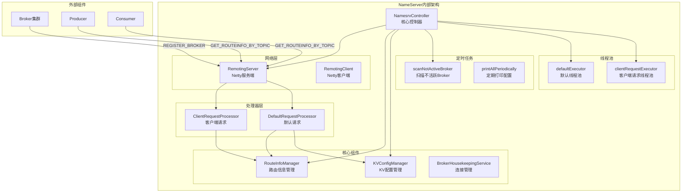
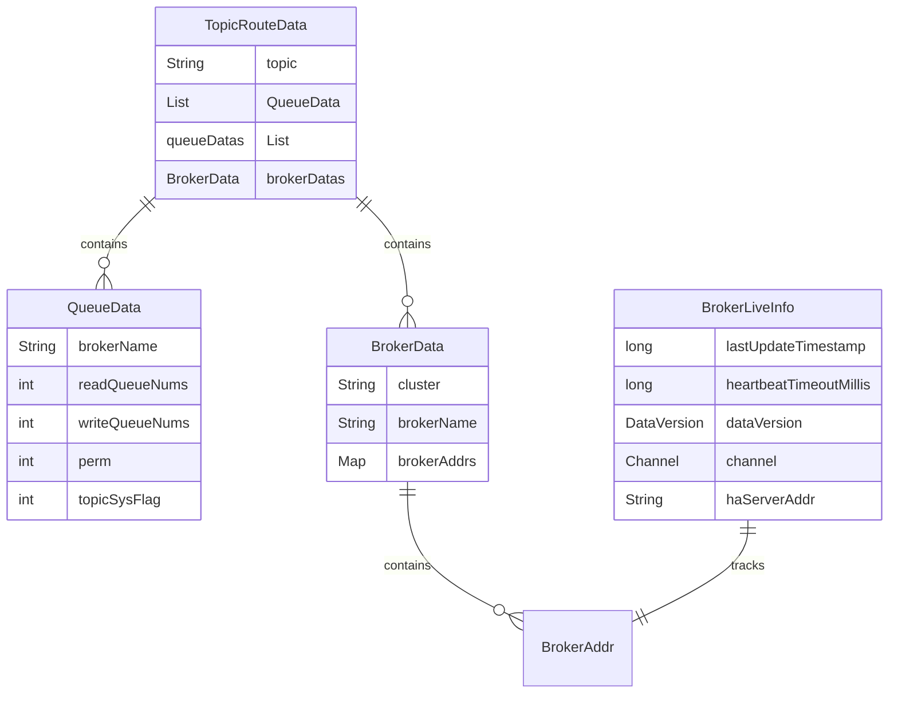
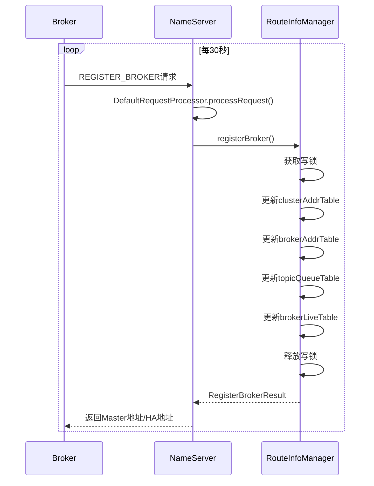
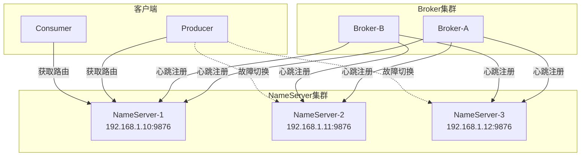

# 02-NameServer-源码完整解析

## 一、模块定位与核心职责

NameServer 是 RocketMQ 的轻量级注册中心，核心职责包括：

| 职责 | 说明 | 源码位置 |
|------|------|---------|
| 路由注册 | 接收 Broker 注册，维护路由表 | RouteInfoManager.java |
| 路由发现 | 提供 Topic 路由查询服务 | ClientRequestProcessor.java |
| 心跳检测 | 定期扫描不活跃 Broker | RouteInfoManager.scanNotActiveBroker() |
| KV 配置 | 管理命名空间配置 | KVConfigManager.java |

**源码目录结构**：
```
namesrv/
├── NamesrvController.java      # 核心控制器
├── NamesrvStartup.java         # 启动入口
├── kvconfig/
│   ├── KVConfigManager.java    # KV配置管理
│   └── KVConfigSerializeWrapper.java
├── processor/
│   ├── DefaultRequestProcessor.java   # 默认请求处理器
│   ├── ClientRequestProcessor.java    # 客户端请求处理器
│   └── ClusterTestRequestProcessor.java
├── routeinfo/
│   ├── RouteInfoManager.java          # 路由信息管理核心
│   ├── BrokerHousekeepingService.java # Broker连接管理
│   └── BatchUnregistrationService.java # 批量注销服务
└── route/
    └── ZoneRouteRPCHook.java          # 区域路由钩子
```

## 二、整体架构图



## 三、核心源码解析

### 3.1 NamesrvController（核心控制器）

**源码位置**：`namesrv/src/main/java/org/apache/rocketmq/namesrv/NamesrvController.java`

```java
public class NamesrvController {
    private static final InternalLogger LOGGER = InternalLoggerFactory.getLogger(LoggerName.NAMESRV_LOGGER_NAME);
    
    // 配置类
    private final NamesrvConfig namesrvConfig;
    private final NettyServerConfig nettyServerConfig;
    private final NettyClientConfig nettyClientConfig;
    
    // 定时任务调度器
    private final ScheduledExecutorService scheduledExecutorService = new ScheduledThreadPoolExecutor(1,
            new BasicThreadFactory.Builder().namingPattern("NSScheduledThread").daemon(true).build());
    
    private final ScheduledExecutorService scanExecutorService = new ScheduledThreadPoolExecutor(1,
            new BasicThreadFactory.Builder().namingPattern("NSScanScheduledThread").daemon(true).build());
    
    // 核心组件
    private final KVConfigManager kvConfigManager;
    private final RouteInfoManager routeInfoManager;
    
    // 网络组件
    private RemotingClient remotingClient;
    private RemotingServer remotingServer;
    
    // 线程池
    private ExecutorService defaultExecutor;
    private ExecutorService clientRequestExecutor;
    private BlockingQueue<Runnable> defaultThreadPoolQueue;
    private BlockingQueue<Runnable> clientRequestThreadPoolQueue;
    
    // 配置管理
    private final Configuration configuration;
    private FileWatchService fileWatchService;
}
```

**初始化流程**：

```java
public boolean initialize() {
    loadConfig();                    // 1. 加载KV配置
    initiateNetworkComponents();     // 2. 初始化网络组件
    initiateThreadExecutors();       // 3. 初始化线程池
    registerProcessor();             // 4. 注册请求处理器
    startScheduleService();          // 5. 启动定时任务
    initiateSslContext();            // 6. 初始化SSL
    initiateRpcHooks();              // 7. 初始化RPC钩子
    return true;
}
```

### 3.2 RouteInfoManager（路由信息管理）

**源码位置**：`namesrv/src/main/java/org/apache/rocketmq/namesrv/routeinfo/RouteInfoManager.java`

```java
public class RouteInfoManager {
    private static final InternalLogger log = InternalLoggerFactory.getLogger(LoggerName.NAMESRV_LOGGER_NAME);
    
    // Broker 默认过期时间：120秒（2分钟）
    private final static long DEFAULT_BROKER_CHANNEL_EXPIRED_TIME = 1000 * 60 * 2;
    
    // 读写锁，保护路由表的并发访问
    private final ReadWriteLock lock = new ReentrantReadWriteLock();
    
    // 核心数据结构
    // Topic -> BrokerName -> QueueData 映射
    private final Map<String/* topic */, Map<String, QueueData>> topicQueueTable;
    
    // BrokerName -> BrokerData 映射
    private final Map<String/* brokerName */, BrokerData> brokerAddrTable;
    
    // ClusterName -> BrokerName Set 映射
    private final Map<String/* clusterName */, Set<String/* brokerName */>> clusterAddrTable;
    
    // BrokerAddr -> BrokerLiveInfo 映射（心跳信息）
    private final Map<BrokerAddrInfo/* brokerAddr */, BrokerLiveInfo> brokerLiveTable;
    
    // BrokerAddr -> FilterServer List 映射
    private final Map<BrokerAddrInfo/* brokerAddr */, List<String>/* Filter Server */> filterServerTable;
    
    // Topic -> BrokerName -> TopicQueueMappingInfo 映射
    private final Map<String/* topic */, Map<String/*brokerName*/, TopicQueueMappingInfo>> topicQueueMappingInfoTable;
    
    // 批量注销服务
    private final BatchUnregistrationService unRegisterService;
}
```

**数据结构关系图**：



### 3.3 Broker 注册流程

**时序图**：



**核心源码**：

```java
public RegisterBrokerResult registerBroker(
    final String clusterName,
    final String brokerAddr,
    final String brokerName,
    final long brokerId,
    final String haServerAddr,
    final String zoneName,
    final Long timeoutMillis,
    final Boolean enableActingMaster,
    final TopicConfigSerializeWrapper topicConfigWrapper,
    final List<String> filterServerList,
    final Channel channel) {
    
    RegisterBrokerResult result = new RegisterBrokerResult();
    try {
        this.lock.writeLock().lockInterruptibly();
        
        // 1. 初始化或更新集群信息
        Set<String> brokerNames = ConcurrentHashMapUtils.computeIfAbsent(
            (ConcurrentHashMap<String, Set<String>>) this.clusterAddrTable, 
            clusterName, k -> new HashSet<>());
        brokerNames.add(brokerName);
        
        boolean registerFirst = false;
        
        // 2. 初始化或更新Broker信息
        BrokerData brokerData = this.brokerAddrTable.get(brokerName);
        if (null == brokerData) {
            registerFirst = true;
            brokerData = new BrokerData(clusterName, brokerName, new HashMap<>());
            this.brokerAddrTable.put(brokerName, brokerData);
        }
        
        Map<Long, String> brokerAddrsMap = brokerData.getBrokerAddrs();
        
        // 3. 移除旧地址（处理Master/Slave切换）
        brokerAddrsMap.entrySet().removeIf(item -> 
            null != brokerAddr && brokerAddr.equals(item.getValue()) && brokerId != item.getKey());
        
        // 4. 更新Broker地址
        String oldAddr = brokerAddrsMap.put(brokerId, brokerAddr);
        registerFirst = registerFirst || (StringUtils.isEmpty(oldAddr));
        
        boolean isMaster = MixAll.MASTER_ID == brokerId;
        boolean isPrimeSlave = !isOldVersionBroker && !isMaster
            && brokerId == Collections.min(brokerAddrsMap.keySet());
        
        // 5. 更新Topic路由信息（仅Master或PrimeSlave）
        if (null != topicConfigWrapper && (isMaster || isPrimeSlave)) {
            ConcurrentMap<String, TopicConfig> tcTable = topicConfigWrapper.getTopicConfigTable();
            if (tcTable != null) {
                for (Map.Entry<String, TopicConfig> entry : tcTable.entrySet()) {
                    if (registerFirst || this.isTopicConfigChanged(...)) {
                        this.createAndUpdateQueueData(brokerName, topicConfig);
                    }
                }
            }
        }
        
        // 6. 更新心跳信息
        BrokerAddrInfo brokerAddrInfo = new BrokerAddrInfo(clusterName, brokerAddr);
        BrokerLiveInfo prevBrokerLiveInfo = this.brokerLiveTable.put(brokerAddrInfo,
            new BrokerLiveInfo(
                System.currentTimeMillis(),
                timeoutMillis == null ? DEFAULT_BROKER_CHANNEL_EXPIRED_TIME : timeoutMillis,
                topicConfigWrapper == null ? new DataVersion() : topicConfigWrapper.getDataVersion(),
                channel,
                haServerAddr));
        
        // 7. 返回Master地址
        if (MixAll.MASTER_ID != brokerId) {
            String masterAddr = brokerData.getBrokerAddrs().get(MixAll.MASTER_ID);
            if (masterAddr != null) {
                result.setHaServerAddr(masterLiveInfo.getHaServerAddr());
                result.setMasterAddr(masterAddr);
            }
        }
    } catch (Exception e) {
        log.error("registerBroker Exception", e);
    } finally {
        this.lock.writeLock().unlock();
    }
    return result;
}
```

### 3.4 心跳检测机制

**扫描不活跃 Broker**：

```java
// NamesrvController.java - 启动定时扫描
private void startScheduleService() {
    // 每5秒扫描一次不活跃Broker（默认配置）
    this.scanExecutorService.scheduleAtFixedRate(
        NamesrvController.this.routeInfoManager::scanNotActiveBroker,
        5,  // 初始延迟5ms
        this.namesrvConfig.getScanNotActiveBrokerInterval(),  // 默认5000ms
        TimeUnit.MILLISECONDS);
}

// RouteInfoManager.java - 扫描逻辑
public void scanNotActiveBroker() {
    Iterator<Entry<BrokerAddrInfo, BrokerLiveInfo>> it = this.brokerLiveTable.entrySet().iterator();
    while (it.hasNext()) {
        Entry<BrokerAddrInfo, BrokerLiveInfo> next = it.next();
        long last = next.getValue().getLastUpdateTimestamp();
        long timeoutMillis = next.getValue().getHeartbeatTimeoutMillis();
        
        // 判断是否超时（默认120秒）
        if ((last + timeoutMillis) < System.currentTimeMillis()) {
            Channel channel = next.getValue().getChannel();
            it.remove();
            this.channelInactive(channel);
            log.warn("The broker channel expired, {} {}ms", next.getKey(), timeoutMillis);
        }
    }
}
```

**关键时间参数**：

| 参数 | 默认值 | 说明 |
|------|--------|------|
| scanNotActiveBrokerInterval | 5000ms（5秒） | 扫描间隔 |
| DEFAULT_BROKER_CHANNEL_EXPIRED_TIME | 120000ms（2分钟） | Broker过期时间 |
| brokerHeartbeatInterval | 1000ms（1秒） | Broker心跳间隔 |

### 3.5 路由查询流程

**ClientRequestProcessor 处理**：

```java
// ClientRequestProcessor.java
public RemotingCommand processRequest(ChannelHandlerContext ctx, RemotingCommand request) {
    try {
        switch (request.getCode()) {
            case RequestCode.GET_ROUTEINFO_BY_TOPIC:
                return this.getRouteInfoByTopic(ctx, request);
            default:
                return RemotingCommand.createResponseCommand(
                    RemotingSysResponseCode.REQUEST_CODE_NOT_SUPPORTED, 
                    "request type not supported");
        }
    } catch (Exception e) {
        return RemotingCommand.createResponseCommand(
            RemotingSysResponseCode.SYSTEM_ERROR, 
            e.getMessage());
    }
}

public RemotingCommand getRouteInfoByTopic(ChannelHandlerContext ctx, RemotingCommand request) {
    final GetRouteInfoRequestHeader requestHeader = request.decodeCommandCustomHeader(GetRouteInfoRequestHeader.class);
    
    // 调用RouteInfoManager获取路由信息
    TopicRouteData topicRouteData = this.namesrvController.getRouteInfoManager().pickupTopicRouteData(requestHeader.getTopic());
    
    if (topicRouteData != null) {
        // 如果需要，添加顺序消息配置
        if (this.namesrvController.getNamesrvConfig().isOrderMessageEnable()) {
            String orderTopicConf = this.namesrvController.getKvConfigManager()
                .getKVConfig(NamesrvUtil.NAMESPACE_ORDER_TOPIC_CONFIG, requestHeader.getTopic());
            topicRouteData.setOrderTopicConf(orderTopicConf);
        }
        
        byte[] content = topicRouteData.encode();
        response.setBody(content);
        response.setCode(ResponseCode.SUCCESS);
    } else {
        response.setCode(ResponseCode.TOPIC_NOT_EXIST);
        response.setRemark("No topic route info in name server for the topic: " + requestHeader.getTopic());
    }
    return response;
}
```

**RouteInfoManager.pickupTopicRouteData()**：

```java
public TopicRouteData pickupTopicRouteData(final String topic) {
    TopicRouteData topicRouteData = new TopicRouteData();
    boolean foundQueueData = false;
    boolean foundBrokerData = false;
    Set<String> brokerNameSet = new HashSet<String>();
    
    List<QueueData> queueDataList = new ArrayList<QueueData>();
    List<BrokerData> brokerDataList = new ArrayList<BrokerData>();
    
    try {
        this.lock.readLock().lockInterruptibly();
        
        // 1. 获取Topic对应的QueueData列表
        Map<String, QueueData> queueDataMap = this.topicQueueTable.get(topic);
        if (queueDataMap != null) {
            queueDataList.addAll(queueDataMap.values());
            foundQueueData = true;
            
            // 2. 收集所有BrokerName
            for (QueueData qd : queueDataMap.values()) {
                brokerNameSet.add(qd.getBrokerName());
            }
            
            // 3. 根据BrokerName获取BrokerData
            for (String brokerName : brokerNameSet) {
                BrokerData brokerData = this.brokerAddrTable.get(brokerName);
                if (null != brokerData) {
                    BrokerData brokerDataClone = new BrokerData();
                    brokerDataClone.setBrokerName(brokerData.getBrokerName());
                    brokerDataClone.setCluster(brokerData.getCluster());
                    brokerDataClone.setBrokerAddrs(new HashMap<Long, String>(brokerData.getBrokerAddrs()));
                    brokerDataList.add(brokerDataClone);
                    foundBrokerData = true;
                }
            }
        }
    } catch (Exception e) {
        log.error("pickupTopicRouteData Exception", e);
    } finally {
        this.lock.readLock().unlock();
    }
    
    if (foundQueueData && foundBrokerData) {
        topicRouteData.setQueueDatas(queueDataList);
        topicRouteData.setBrokerDatas(brokerDataList);
        return topicRouteData;
    }
    return null;
}
```

## 四、请求处理器详解

### 4.1 DefaultRequestProcessor

**处理的请求类型**：

| RequestCode | 方法 | 说明 |
|-------------|------|------|
| PUT_KV_CONFIG | putKVConfig | 添加KV配置 |
| GET_KV_CONFIG | getKVConfig | 获取KV配置 |
| DELETE_KV_CONFIG | deleteKVConfig | 删除KV配置 |
| REGISTER_BROKER | registerBroker | Broker注册 |
| UNREGISTER_BROKER | unregisterBroker | Broker注销 |
| BROKER_HEARTBEAT | brokerHeartbeat | Broker心跳 |
| GET_BROKER_CLUSTER_INFO | getBrokerClusterInfo | 获取集群信息 |
| WIPE_WRITE_PERM_OF_BROKER | wipeWritePermOfBroker | 清除写权限 |
| GET_ALL_TOPIC_LIST_FROM_NAMESERVER | getAllTopicListFromNameserver | 获取所有Topic |
| DELETE_TOPIC_IN_NAMESRV | deleteTopicInNamesrv | 删除Topic |

### 4.2 ClientRequestProcessor

**专门处理客户端请求**：

```java
// NamesrvController.java - 注册处理器
private void registerProcessor() {
    ClientRequestProcessor clientRequestProcessor = new ClientRequestProcessor(this);
    this.remotingServer.registerProcessor(RequestCode.GET_ROUTEINFO_BY_TOPIC, 
        clientRequestProcessor, this.clientRequestExecutor);
    this.remotingServer.registerDefaultProcessor(new DefaultRequestProcessor(this), this.defaultExecutor);
}
```

## 五、统一贯穿示例

### 5.1 Broker 注册示例

**场景**：Broker-A（Master）启动后向 NameServer 注册

```
Broker信息:
- clusterName: DefaultCluster
- brokerName: broker-a
- brokerId: 0 (Master)
- brokerAddr: 192.168.1.100:10911
- haServerAddr: 192.168.1.100:10912
```

**注册后的数据结构**：

```
clusterAddrTable:
  DefaultCluster -> [broker-a]

brokerAddrTable:
  broker-a -> BrokerData{
    cluster: DefaultCluster,
    brokerName: broker-a,
    brokerAddrs: {0 -> 192.168.1.100:10911}
  }

brokerLiveTable:
  BrokerAddrInfo(DefaultCluster, 192.168.1.100:10911) -> BrokerLiveInfo{
    lastUpdateTimestamp: 1700000000000,
    heartbeatTimeoutMillis: 120000,
    haServerAddr: 192.168.1.100:10912
  }

topicQueueTable:
  Topic_Order_Trade -> {
    broker-a -> QueueData{
      brokerName: broker-a,
      readQueueNums: 8,
      writeQueueNums: 8,
      perm: 6
    }
  }
```

### 5.2 Producer 获取路由示例

**场景**：OrderProducer 发送订单消息前获取 Topic 路由

```java
// Producer请求
GET_ROUTEINFO_BY_TOPIC
topic: Topic_Order_Trade

// NameServer响应
TopicRouteData{
  queueDatas: [
    QueueData{brokerName: broker-a, readQueueNums: 8, writeQueueNums: 8},
    QueueData{brokerName: broker-b, readQueueNums: 8, writeQueueNums: 8}
  ],
  brokerDatas: [
    BrokerData{brokerName: broker-a, brokerAddrs: {0: 192.168.1.100:10911}},
    BrokerData{brokerName: broker-b, brokerAddrs: {0: 192.168.1.101:10911}}
  ]
}

// Producer 根据路由选择队列发送消息
MessageQueue{topic: Topic_Order_Trade, brokerName: broker-a, queueId: 0}
```

## 六、关键配置参数

### 6.1 NamesrvConfig 配置

| 配置项 | 默认值 | 说明 |
|--------|--------|------|
| rocketmqHome | 环境变量 | RocketMQ安装目录 |
| kvConfigPath | ~/namesrv/kvConfig.json | KV配置存储路径 |
| configStorePath | ~/namesrv/namesrv.properties | 配置存储路径 |
| scanNotActiveBrokerInterval | 5000ms（5秒） | 扫描不活跃Broker间隔 |
| defaultThreadPoolNums | 16 | 默认线程池大小 |
| defaultThreadPoolQueueCapacity | 10000 | 默认队列容量 |
| clientRequestThreadPoolNums | 8 | 客户端请求线程池大小 |
| clientRequestThreadPoolQueueCapacity | 50000 | 客户端请求队列容量 |
| unRegisterBrokerQueueCapacity | 3000 | 注销请求队列容量 |
| supportActingMaster | false | 是否支持Acting Master |
| enableAllTopicList | true | 是否允许获取所有Topic列表 |
| notifyMinBrokerIdChanged | false | 是否通知最小BrokerId变化 |

### 6.2 NettyServerConfig 配置

| 配置项 | 默认值 | 说明 |
|--------|--------|------|
| listenPort | 9876 | NameServer监听端口 |
| serverWorkerThreads | 8 | Worker线程数 |
| serverCallbackExecutorThreads | 0 | 回调执行线程数 |
| serverSelectorThreads | 3 | Selector线程数 |
| serverOnewaySemaphoreValue | 256 | 单向请求信号量 |
| serverAsyncSemaphoreValue | 64 | 异步请求信号量 |
| serverChannelMaxIdleTimeSeconds | 120 | 通道最大空闲时间 |

## 七、生产环境最佳实践

### 7.1 集群部署建议



### 7.2 启动命令

```bash
# 启动NameServer
nohup sh bin/mqnamesrv &

# 查看日志
tail -f ~/logs/rocketmqlogs/namesrv.log

# 指定JVM参数
nohup sh bin/mqnamesrv -n "192.168.1.10:9876" &

# 自定义配置
nohup sh bin/mqnamesrv -c conf/namesrv.conf &
```

### 7.3 配置文件示例

```properties
# conf/namesrv.properties

# 监听端口
listenPort=9876

# 线程池配置
defaultThreadPoolNums=32
clientRequestThreadPoolNums=16
defaultThreadPoolQueueCapacity=20000
clientRequestThreadPoolQueueCapacity=100000

# 心跳检测
scanNotActiveBrokerInterval=5000

# KV配置存储
kvConfigPath=/data/rocketmq/namesrv/kvConfig.json
configStorePath=/data/rocketmq/namesrv/namesrv.properties

# 日志配置
rocketmqHome=/opt/rocketmq
```

## 八、常见问题与排查

### 8.1 Broker 注册失败

**现象**：Broker 日志显示注册成功，但 Producer 无法获取路由

**排查步骤**：
1. 检查 NameServer 是否正常启动
```bash
netstat -tlnp | grep 9876
```

2. 检查 Broker 配置的 NameServer 地址
```bash
grep namesrvAddr conf/broker.conf
```

3. 检查网络连通性
```bash
telnet 192.168.1.10 9876
```

### 8.2 Topic 不存在

**现象**：Producer 发送消息时报 `TOPIC_NOT_EXIST`

**原因**：
- Topic 未创建
- autoCreateTopicEnable=false
- Broker 未成功注册

**解决方案**：
```bash
# 手动创建Topic
sh bin/mqadmin updateTopic -n 192.168.1.10:9876 -t Topic_Order_Trade -c DefaultCluster -r 8 -w 8

# 检查Topic是否存在
sh bin/mqadmin topicList -n 192.168.1.10:9876

# 检查Topic路由
sh bin/mqadmin topicRoute -n 192.168.1.10:9876 -t Topic_Order_Trade
```

### 8.3 NameServer 内存占用高

**原因**：
- Topic 数量过多
- Broker 数量过多
- 队列数量过多

**解决方案**：
- 增加堆内存：`JAVA_OPT="-server -Xms4g -Xmx4g"`
- 定期清理无用 Topic
- 监控 brokerLiveTable 大小

## 九、核心总结

1. **轻量级设计**：NameServer 无状态，节点间不通信，部署简单
2. **路由管理**：维护 Topic → Broker 的映射关系，支持动态注册/注销
3. **心跳机制**：定期扫描不活跃 Broker（默认120秒过期）
4. **高性能**：读写锁保护并发访问，独立线程池处理不同类型请求
5. **可扩展**：支持多 NameServer 节点，客户端自动故障切换

> 底层网络通信基于 Netty 实现，详见：《07-底层公共组件-线程池-Netty-存储-SPI-JDK-OS-API.md》
