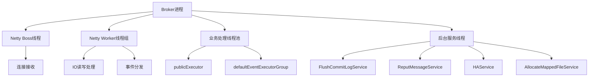
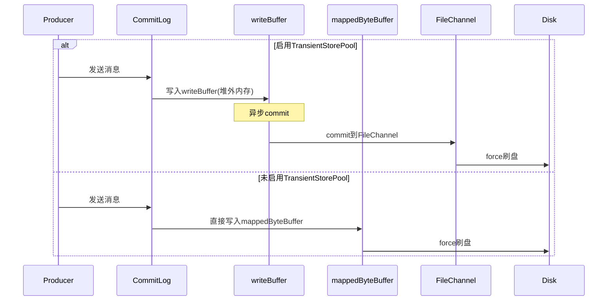
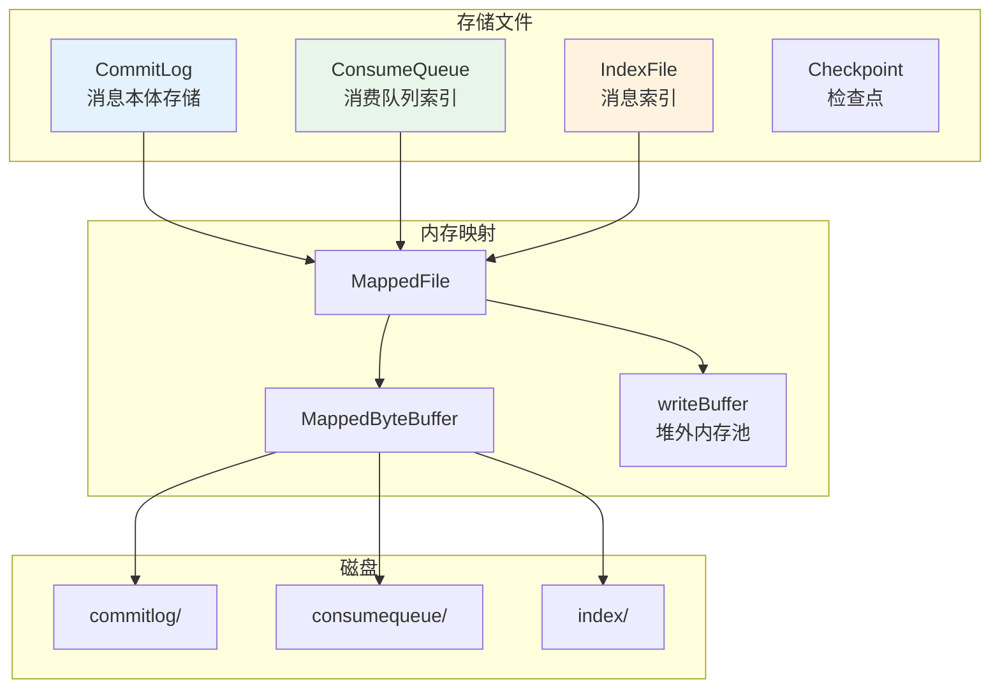
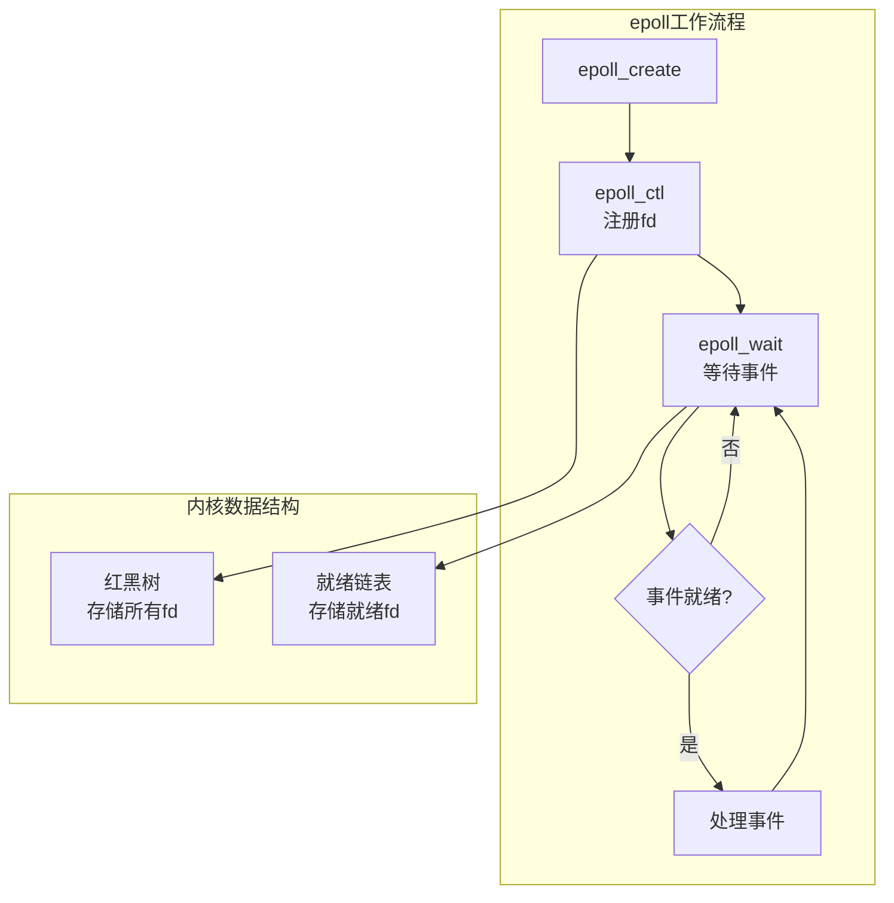
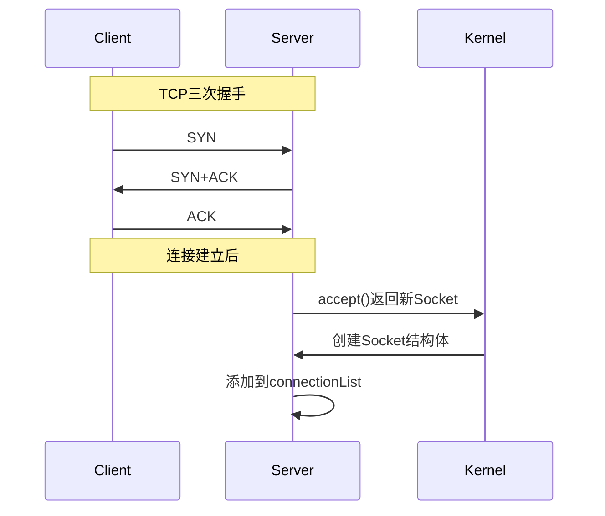
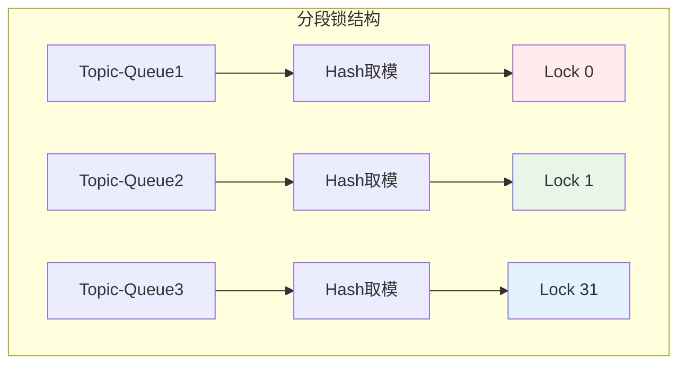
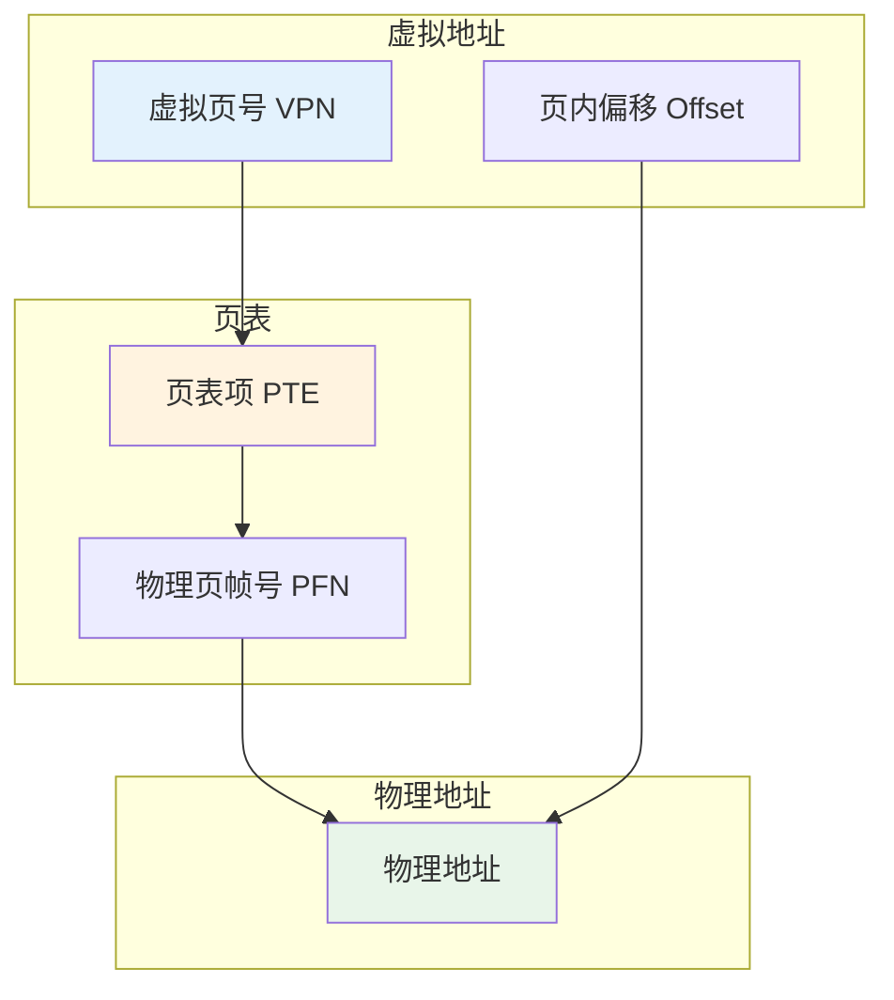
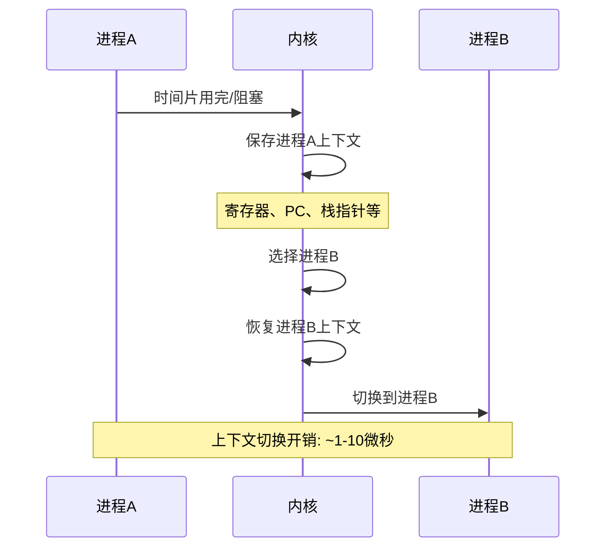
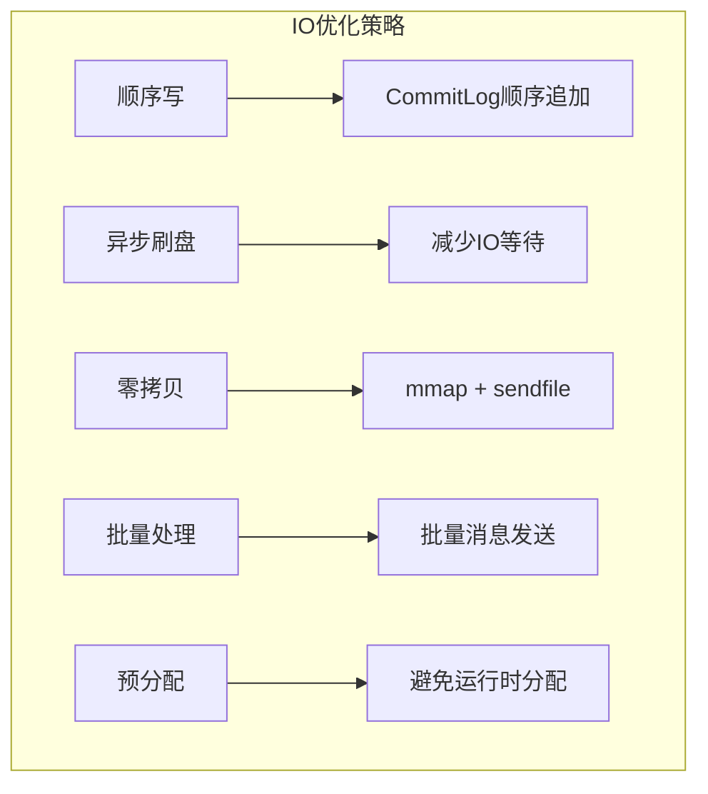

# RocketMQ 操作系统功能深度解析

> 本文档从操作系统视角深度解析 RocketMQ 项目中的核心功能实现，涵盖进程/线程管理、内存管理、文件系统、IO模型、网络编程、并发同步等关键领域。

---

## 目录

1. [概述](#1-概述)
2. [进程与线程管理](#2-进程与线程管理)
3. [内存管理](#3-内存管理)
4. [文件系统与零拷贝](#4-文件系统与零拷贝)
5. [IO模型与多路复用](#5-io模型与多路复用)
6. [网络编程](#6-网络编程)
7. [并发与同步机制](#7-并发与同步机制)
8. [操作系统底层概念详解](#8-操作系统底层概念详解)
9. [性能优化最佳实践](#9-性能优化最佳实践)

---

## 1. 概述

### 1.1 RocketMQ 与操作系统的交互层次

RocketMQ 作为高性能分布式消息中间件，其核心设计大量利用了操作系统提供的底层能力：

```
┌─────────────────────────────────────────────────────────────┐
│                    RocketMQ 应用层                           │
├─────────────────────────────────────────────────────────────┤
│  消息存储    │  网络通信    │  高可用复制  │  定时消息       │
├──────────────┴──────────────┴──────────────┴────────────────┤
│                    Java NIO / Netty 层                       │
├─────────────────────────────────────────────────────────────┤
│                    JVM 内存管理                              │
├─────────────────────────────────────────────────────────────┤
│                    操作系统内核层                            │
│  ┌──────────┬──────────┬──────────┬──────────┬──────────┐  │
│  │ 内存管理 │ 文件系统 │ 网络协议栈│ 进程调度 │ IO调度   │  │
│  └──────────┴──────────┴──────────┴──────────┴──────────┘  │
├─────────────────────────────────────────────────────────────┤
│                    硬件层 (CPU/Memory/Disk/Network)          │
└─────────────────────────────────────────────────────────────┘
```

### 1.2 核心操作系统功能分布

| 功能领域 | 核心类/模块 | 操作系统机制 |
|---------|------------|-------------|
| 内存映射 | DefaultMappedFile | mmap系统调用 |
| 内存锁定 | TransientStorePool | mlock系统调用 |
| 文件IO | CommitLog, ConsumeQueue | FileChannel, write/read |
| 网络IO | NettyRemotingServer/Client | Socket, epoll |
| 线程管理 | ServiceThread, 各类线程池 | 线程调度 |
| 并发同步 | PutMessageLock, TopicQueueLock | 锁机制, CAS |

---

## 2. 进程与线程管理

### 2.1 线程模型架构

RocketMQ 采用多线程架构处理并发请求，主要线程类型包括：



### 2.2 ServiceThread 服务线程基类

**文件位置**: [ServiceThread.java](file:///d:/work/github/rocketmq/common/src/main/java/org/apache/rocketmq/common/ServiceThread.java)

```java
/**
 * 服务线程抽象基类
 * 
 * 设计理念：
 * 1. 封装线程生命周期管理（启动、停止、等待）
 * 2. 提供优雅的等待/唤醒机制，避免忙等待
 * 3. 支持守护线程和普通线程两种模式
 * 
 * 操作系统层面：
 * - 线程创建：通过 clone 系统调用创建新线程
 * - 线程等待：通过 futex 系统调用实现阻塞
 * - 线程唤醒：通过 futex 唤醒等待的线程
 */
public abstract class ServiceThread implements Runnable {
    
    // 实际运行的线程对象
    protected Thread thread;
    
    // 等待点：用于实现线程的等待/唤醒机制
    // 底层依赖 futex 系统调用，比 Object.wait/notify 更高效
    protected final CountDownLatch2 waitPoint = new CountDownLatch2(1);
    
    // 唤醒标志：true 表示已被唤醒，无需再次等待
    // 使用 AtomicBoolean 保证多线程可见性
    protected volatile AtomicBoolean hasNotified = new AtomicBoolean(false);
    
    // 停止标志：控制线程生命周期
    protected volatile boolean stopped = false;
    
    /**
     * 启动服务线程
     * 
     * 使用 CAS 保证线程只启动一次，避免重复启动
     */
    public void start() {
        // CAS 操作：如果 started 为 false，则设置为 true
        // 如果已经是 true，说明线程已启动，直接返回
        if (!started.compareAndSet(false, true)) {
            return;
        }
        
        stopped = false;
        
        // 创建新线程，以服务名称命名，便于问题排查
        this.thread = new Thread(this, getServiceName());
        this.thread.setDaemon(isDaemon);  // 设置是否为守护线程
        this.thread.start();              // 调用 clone 系统调用创建线程
    }
    
    /**
     * 等待运行：线程进入等待状态
     * 
     * @param interval 等待超时时间（毫秒）
     * 
     * 工作流程：
     * 1. 如果已被唤醒，直接执行 onWaitEnd() 并返回
     * 2. 否则重置等待点，进入阻塞状态
     * 3. 超时或被唤醒后执行 onWaitEnd()
     */
    protected void waitForRunning(long interval) {
        // 检查是否已被唤醒，如果是则清除标志并执行回调
        if (hasNotified.compareAndSet(true, false)) {
            this.onWaitEnd();
            return;
        }
        
        // 重置等待点，准备进入阻塞
        waitPoint.reset();
        
        try {
            // 进入阻塞等待，底层调用 futex
            // 超时或被唤醒后返回
            waitPoint.await(interval, TimeUnit.MILLISECONDS);
        } catch (InterruptedException e) {
            log.error("Interrupted", e);
        } finally {
            // 清除唤醒标志
            hasNotified.set(false);
            // 执行等待结束后的回调
            this.onWaitEnd();
        }
    }
}
```

**操作系统原理分析**：

| 机制 | 操作系统层面 | RocketMQ实现 |
|-----|-------------|-------------|
| 线程创建 | clone系统调用 | new Thread() |
| 线程等待 | futex系统调用 | CountDownLatch2.await() |
| 线程唤醒 | futex唤醒 | CountDownLatch2.countDown() |
| 线程终止 | 线程退出 | stopped标志位 |

### 2.3 Netty 线程模型

**文件位置**: [NettyRemotingServer.java](file:///d:/work/github/rocketmq/remoting/src/main/java/org/apache/rocketmq/remoting/netty/NettyRemotingServer.java)

```java
/**
 * Netty 远程服务端
 * 
 * 线程模型：Reactor 多线程模型
 * - Boss 线程：负责接收连接（accept）
 * - Worker 线程组：负责 IO 读写（read/write）
 * - 业务线程池：负责业务逻辑处理
 * 
 * IO 模型选择：
 * - Linux 平台优先使用 epoll（高性能）
 * - 其他平台使用 NIO（兼容性）
 */
public class NettyRemotingServer extends NettyRemotingAbstract implements RemotingServer {
    
    // Boss 线程组：负责接收客户端连接
    private final EventLoopGroup eventLoopGroupBoss;
    
    // Worker 线程组：负责处理 IO 读写事件
    private final EventLoopGroup eventLoopGroupSelector;
    
    /**
     * 构建 Worker 线程组
     * 
     * 根据平台选择最优的 IO 多路复用实现：
     * - Linux：使用 epoll（O(1) 时间复杂度）
     * - 其他：使用 NIO 的 select
     */
    private EventLoopGroup buildEventLoopGroupSelector() {
        if (useEpoll()) {
            // Linux 平台使用 EpollEventLoopGroup
            // epoll 相比 select/poll 有显著性能优势：
            // 1. 无需遍历所有文件描述符
            // 2. 只返回就绪的文件描述符
            // 3. 支持边缘触发模式
            return new EpollEventLoopGroup(
                nettyServerConfig.getServerSelectorThreads(),  // 线程数量
                new ThreadFactory() {
                    private final AtomicInteger threadIndex = new AtomicInteger(0);
                    
                    @Override
                    public Thread newThread(Runnable r) {
                        // 线程命名格式：NettyServerEPOLLSelector_线程总数_线程序号
                        return new Thread(r, String.format(
                            "NettyServerEPOLLSelector_%d_%d", 
                            threadTotal, 
                            this.threadIndex.incrementAndGet()));
                    }
                });
        } else {
            // 非 Linux 平台使用 NioEventLoopGroup
            return new NioEventLoopGroup(
                nettyServerConfig.getServerSelectorThreads(), ...);
        }
    }
    
    /**
     * 判断是否使用 epoll
     * 
     * 条件：
     * 1. 运行在 Linux 平台
     * 2. 配置启用原生 epoll selector
     * 3. epoll 库可用（Netty 提供的 native 库）
     */
    private boolean useEpoll() {
        return RemotingUtil.isLinuxPlatform()           // 是否为 Linux
            && nettyServerConfig.isUseEpollNativeSelector()  // 配置是否启用
            && Epoll.isAvailable();                     // epoll 库是否可用
    }
}
```

**Reactor线程模型**：

```
┌─────────────────────────────────────────────────────────────┐
│                    Reactor 模型架构                          │
├─────────────────────────────────────────────────────────────┤
│                                                              │
│    ┌──────────────┐                                         │
│    │ Boss Thread  │ ← 接收连接 (accept)                      │
│    │   (1个)      │                                         │
│    └──────┬───────┘                                         │
│           │                                                  │
│           ▼                                                  │
│    ┌──────────────────────────────────────┐                 │
│    │        Worker Threads (N个)           │                 │
│    │  ┌────────┐ ┌────────┐ ┌────────┐   │                 │
│    │  │Worker 1│ │Worker 2│ │Worker N│   │ ← IO读写处理    │
│    │  └────────┘ └────────┘ └────────┘   │                 │
│    └──────────────────────────────────────┘                 │
│           │                                                  │
│           ▼                                                  │
│    ┌──────────────────────────────────────┐                 │
│    │      Business Thread Pool            │                 │
│    │  ┌────────┐ ┌────────┐ ┌────────┐   │                 │
│    │  │Handler1│ │Handler2│ │HandlerN│   │ ← 业务处理      │
│    │  └────────┘ └────────┘ └────────┘   │                 │
│    └──────────────────────────────────────┘                 │
│                                                              │
└─────────────────────────────────────────────────────────────┘
```

### 2.4 后台服务线程一览

| 服务线程 | 功能 | 操作系统交互 |
|---------|------|-------------|
| FlushCommitLogService | 刷盘服务 | fsync系统调用 |
| ReputMessageService | 消息分发服务 | 内存读取 |
| HAService | 主从复制服务 | Socket IO |
| AllocateMappedFileService | 预分配映射文件 | mmap系统调用 |
| CleanCommitLogService | 过期文件清理 | unlink系统调用 |
| IndexService | 索引构建 | 文件IO |

---

## 3. 内存管理

### 3.1 内存映射文件 (mmap)

**文件位置**: [DefaultMappedFile.java](file:///d:/work/github/rocketmq/store/src/main/java/org/apache/rocketmq/store/logfile/DefaultMappedFile.java)

```java
/**
 * 默认映射文件实现
 * 
 * 核心功能：将磁盘文件映射到内存，实现高效读写
 * 
 * 技术原理：
 * 1. 使用 mmap 系统调用将文件映射到虚拟地址空间
 * 2. 读写操作直接在内存中进行，无需系统调用
 * 3. 通过缺页中断按需加载文件内容
 * 
 * 性能优势：
 * - 减少数据拷贝：从 4 次减少到 2 次
 * - 减少上下文切换：避免频繁的系统调用
 * - 支持大文件：虚拟地址空间远大于物理内存
 */
public class DefaultMappedFile extends AbstractMappedFile {
    
    // 操作系统页大小：4KB
    // 内存映射以页为单位，不足一页也会占用一页
    public static final int OS_PAGE_SIZE = 1024 * 4;
    
    // 文件通道：用于文件读写和映射操作
    protected FileChannel fileChannel;
    
    // 映射字节缓冲区：mmap 的 Java 封装
    // 直接操作虚拟地址空间，无需拷贝到用户态缓冲区
    protected MappedByteBuffer mappedByteBuffer;
    
    // 写缓冲区：可选的堆外内存缓冲区
    // 启用 TransientStorePool 时使用，减少 GC 压力
    protected ByteBuffer writeBuffer = null;
    
    // 临时存储池：管理堆外内存缓冲区
    protected TransientStorePool transientStorePool = null;
    
    /**
     * 初始化映射文件
     * 
     * @param fileName 文件名（全路径）
     * @param fileSize 文件大小
     * 
     * 工作流程：
     * 1. 打开文件，获取 FileChannel
     * 2. 调用 mmap 将文件映射到内存
     * 3. 更新统计信息
     */
    private void init(final String fileName, final int fileSize) throws IOException {
        // 以读写方式打开文件
        // RandomAccessFile 支持随机访问，适合消息存储场景
        this.fileChannel = new RandomAccessFile(this.file, "rw").getChannel();
        
        // 核心操作：将文件映射到内存
        // MapMode.READ_WRITE：读写模式
        // 0：从文件起始位置开始映射
        // fileSize：映射整个文件
        // 
        // 底层系统调用：mmap(NULL, fileSize, PROT_READ|PROT_WRITE, MAP_SHARED, fd, 0)
        this.mappedByteBuffer = this.fileChannel.map(MapMode.READ_WRITE, 0, fileSize);
        
        // 更新全局统计：映射的虚拟内存总量
        TOTAL_MAPPED_VIRTUAL_MEMORY.addAndGet(fileSize);
        
        // 更新全局统计：映射文件数量
        TOTAL_MAPPED_FILES.incrementAndGet();
    }
}
```

**mmap 工作原理**：


**mmap 优势分析**：

| 特性 | 传统IO | mmap |
|-----|--------|------|
| 数据拷贝 | 4次 (磁盘→内核→用户→内核→网络) | 2次 (磁盘→内核→网络) |
| 上下文切换 | 4次系统调用 | 1次mmap + 缺页中断 |
| 内存占用 | 用户态缓冲区 | 直接映射到虚拟地址空间 |
| 适用场景 | 小文件、随机访问 | 大文件、顺序访问 |

### 3.2 内存池 TransientStorePool

**文件位置**: [TransientStorePool.java](file:///d:/work/github/rocketmq/store/src/main/java/org/apache/rocketmq/store/TransientStorePool.java)

```java
/**
 * 临时存储池
 * 
 * 设计目的：
 * 1. 预分配堆外内存，避免运行时分配开销
 * 2. 使用 mlock 锁定内存，防止被换出到 Swap
 * 3. 内存复用，减少 GC 压力
 * 
 * 适用场景：
 * - 高吞吐量场景
 * - 对延迟敏感的应用
 * - 消息写入密集型业务
 */
public class TransientStorePool {
    
    // 池大小：预分配的缓冲区数量
    private final int poolSize;
    
    // 单个缓冲区大小：通常与 CommitLog 文件大小一致
    private final int fileSize;
    
    // 可用缓冲区队列：使用双端队列支持高效的头尾操作
    private final Deque<ByteBuffer> availableBuffers;
    
    /**
     * 初始化内存池
     * 
     * 工作流程：
     * 1. 分配堆外内存（DirectByteBuffer）
     * 2. 获取内存地址
     * 3. 调用 mlock 锁定内存
     * 
     * mlock 的作用：
     * - 防止内存页被换出到 Swap 分区
     * - 保证内存访问的实时性
     * - 避免页面换入换出的开销
     */
    public void init() {
        for (int i = 0; i < poolSize; i++) {
            // 分配堆外内存
            // DirectByteBuffer 在 JVM 堆外分配，不受 GC 管理
            ByteBuffer byteBuffer = ByteBuffer.allocateDirect(fileSize);
            
            // 获取堆外内存的物理地址
            // DirectBuffer 接口提供了访问底层内存地址的能力
            final long address = ((DirectBuffer) byteBuffer).address();
            
            // 创建 JNA Pointer，用于调用原生函数
            Pointer pointer = new Pointer(address);
            
            // 调用 mlock 系统调用锁定内存
            // 底层系统调用：mlock(addr, size)
            // 效果：该内存区域不会被换出到 Swap
            LibC.INSTANCE.mlock(pointer, new NativeLong(fileSize));
            
            // 加入可用队列
            availableBuffers.offer(byteBuffer);
        }
    }
    
    /**
     * 销毁内存池
     * 
     * 工作流程：
     * 1. 遍历所有缓冲区
     * 2. 调用 munlock 解锁内存
     * 3. JVM 会自动回收堆外内存
     */
    public void destroy() {
        for (ByteBuffer byteBuffer : availableBuffers) {
            // 获取内存地址
            final long address = ((DirectBuffer) byteBuffer).address();
            Pointer pointer = new Pointer(address);
            
            // 解锁内存
            // 底层系统调用：munlock(addr, size)
            LibC.INSTANCE.munlock(pointer, new NativeLong(fileSize));
        }
    }
    
    /**
     * 归还缓冲区
     * 
     * @param byteBuffer 要归还的缓冲区
     * 
     * 重置缓冲区状态后放回队列头部，优先复用
     */
    public void returnBuffer(ByteBuffer byteBuffer) {
        byteBuffer.position(0);          // 重置 position
        byteBuffer.limit(fileSize);      // 重置 limit
        this.availableBuffers.offerFirst(byteBuffer);  // 放入队列头部
    }
    
    /**
     * 借用缓冲区
     * 
     * @return 可用的缓冲区，如果池为空返回 null
     */
    public ByteBuffer borrowBuffer() {
        ByteBuffer buffer = availableBuffers.pollFirst();
        
        // 监控告警：当可用缓冲区少于 40% 时发出警告
        if (availableBuffers.size() < poolSize * 0.4) {
            log.warn("TransientStorePool only remain {} sheets.", availableBuffers.size());
        }
        return buffer;
    }
}
```

**mlock 系统调用原理**：

```
┌─────────────────────────────────────────────────────────────┐
│                    内存锁定机制                              │
├─────────────────────────────────────────────────────────────┤
│                                                              │
│   正常内存:                                                  │
│   ┌──────────┐    swap out    ┌──────────┐                 │
│   │ 物理内存  │ ←────────────→ │ Swap分区  │                 │
│   └──────────┘                └──────────┘                 │
│                                                              │
│   mlock锁定后:                                               │
│   ┌──────────┐                                              │
│   │ 物理内存  │ ← 禁止换出，常驻内存                          │
│   │ (锁定)   │                                              │
│   └──────────┘                                              │
│                                                              │
│   优势: 避免页面换入换出，保证实时性                          │
│   劣势: 占用物理内存，需合理配置池大小                        │
│                                                              │
└─────────────────────────────────────────────────────────────┘
```

### 3.3 写缓冲区与刷盘机制

**写入流程**：



**刷盘策略**：

| 刷盘方式 | 配置 | 性能 | 可靠性 |
|---------|------|------|--------|
| 同步刷盘 | SYNC_FLUSH | 低 | 高 |
| 异步刷盘 | ASYNC_FLUSH | 高 | 中 |

---

## 4. 文件系统与零拷贝

### 4.1 零拷贝技术对比

**文件位置**: [LibC.java](file:///d:/work/github/rocketmq/store/src/main/java/org/apache/rocketmq/store/util/LibC.java)

```java
/**
 * LibC 接口：JNA 封装的原生 C 库函数
 * 
 * 通过 JNA (Java Native Access) 调用操作系统原生函数
 * 无需编写 JNI 代码，使用更方便
 * 
 * 支持的函数：
 * - mlock/munlock：内存锁定/解锁
 * - madvise：内存访问建议
 * - msync：内存同步
 */
public interface LibC extends Library {
    
    // 单例模式：加载原生库
    // Windows 使用 msvcrt.dll，Linux/Unix 使用 libc.so
    LibC INSTANCE = (LibC) Native.loadLibrary(
        Platform.isWindows() ? "msvcrt" : "c", LibC.class);
    
    // ========== madvise 常量 ==========
    
    // 预读建议：告诉内核即将访问该区域，内核会预读数据
    int MADV_WILLNEED = 3;
    
    // 释放建议：告诉内核不再需要该区域，内核可释放相关资源
    int MADV_DONTNEED = 4;
    
    // ========== mlock 常量 ==========
    
    // 锁定当前已映射的页面
    int MCL_CURRENT = 1;
    
    // 锁定未来映射的页面
    int MCL_FUTURE = 2;
    
    // 锁定页面（Linux 4.4+）
    int MCL_ONFAULT = 4;
    
    // ========== msync 常量 ==========
    
    // 异步同步：立即返回，后台执行同步
    int MS_ASYNC = 0x0001;
    
    // 使缓存失效：同步后使其他进程的映射失效
    int MS_INVALIDATE = 0x0002;
    
    // 同步同步：等待同步完成才返回
    int MS_SYNC = 0x0004;
    
    // ========== 原生函数声明 ==========
    
    /**
     * 锁定内存区域
     * 
     * @param var1 内存起始地址
     * @param var2 锁定大小
     * @return 0 成功，-1 失败
     * 
     * 效果：防止内存被换出到 Swap 分区
     */
    int mlock(Pointer var1, NativeLong var2);
    
    /**
     * 解锁内存区域
     */
    int munlock(Pointer var1, NativeLong var2);
    
    /**
     * 内存访问建议
     * 
     * @param var1 内存起始地址
     * @param var2 区域大小
     * @param var3 建议类型（MADV_WILLNEED/MADV_DONTNEED等）
     * @return 0 成功，-1 失败
     */
    int madvise(Pointer var1, NativeLong var2, int var3);
    
    /**
     * 内存设置（类似 memset）
     */
    Pointer memset(Pointer p, int v, long len);
    
    /**
     * 锁定所有内存
     */
    int mlockall(int flags);
    
    /**
     * 同步内存到磁盘
     * 
     * @param p 内存起始地址
     * @param length 同步长度
     * @param flags 同步标志（MS_SYNC/MS_ASYNC等）
     * @return 0 成功，-1 失败
     */
    int msync(Pointer p, NativeLong length, int flags);
}
```

**零拷贝技术演进**：

```
┌─────────────────────────────────────────────────────────────┐
│                    传统IO (4次拷贝, 4次上下文切换)           │
├─────────────────────────────────────────────────────────────┤
│  磁盘 ──read()──→ 内核缓冲区 ──copy──→ 用户缓冲区           │
│  用户缓冲区 ──write()──→ Socket缓冲区 ──copy──→ 网卡        │
└─────────────────────────────────────────────────────────────┘
                              ↓
┌─────────────────────────────────────────────────────────────┐
│                    mmap (减少用户态拷贝)                     │
├─────────────────────────────────────────────────────────────┤
│  磁盘 ──缺页中断──→ 页缓存 ←──mmap──→ 用户虚拟地址          │
│  用户虚拟地址 ──write()──→ Socket缓冲区 ──copy──→ 网卡      │
└─────────────────────────────────────────────────────────────┘
                              ↓
┌─────────────────────────────────────────────────────────────┐
│                    sendfile (2次拷贝, 2次上下文切换)         │
├─────────────────────────────────────────────────────────────┤
│  磁盘 ──read()──→ 页缓存 ──DMA──→ 网卡                      │
│  (完全在内核态完成，无需用户态参与)                          │
└─────────────────────────────────────────────────────────────┘
```

### 4.2 RocketMQ 消息存储架构



### 4.3 文件预分配机制

**文件位置**: [AllocateMappedFileService.java](file:///d:/work/github/rocketmq/store/src/main/java/org/apache/rocketmq/store/AllocateMappedFileService.java)

```java
/**
 * 映射文件预分配服务
 * 
 * 设计目的：
 * 1. 提前创建并映射文件，避免运行时等待
 * 2. 保证消息写入的连续性，避免 IO 抖动
 * 3. 支持异步预分配，不阻塞主流程
 * 
 * 工作原理：
 * - 后台线程持续处理预分配请求
 * - 使用优先队列管理请求顺序
 * - 通过 CountDownLatch 实现等待/通知
 */
public class AllocateMappedFileService extends ServiceThread {
    
    // 等待超时时间：5秒
    private static int waitTimeOut = 1000 * 5;
    
    // 请求表：文件路径 -> 分配请求
    // 使用 ConcurrentHashMap 保证线程安全
    private ConcurrentMap<String, AllocateRequest> requestTable =
        new ConcurrentHashMap<String, AllocateRequest>();
    
    // 请求队列：使用优先队列按优先级处理
    private PriorityBlockingQueue<AllocateRequest> requestQueue =
        new PriorityBlockingQueue<AllocateRequest>();
    
    /**
     * 提交预分配请求并返回映射文件
     * 
     * @param nextFilePath     下一个文件路径
     * @param nextNextFilePath 下下个文件路径
     * @param fileSize         文件大小
     * @return 分配好的映射文件
     * 
     * 设计思路：
     * 1. 同时提交两个文件的预分配请求（当前文件和下一个文件）
     * 2. 等待当前文件分配完成
     * 3. 下一个文件在后台继续分配
     */
    public MappedFile putRequestAndReturnMappedFile(String nextFilePath, 
            String nextNextFilePath, int fileSize) {
        
        // 计算可提交的请求数量
        // 如果启用了 TransientStorePool，需要检查可用缓冲区数量
        int canSubmitRequests = 2;
        if (this.messageStore.getMessageStoreConfig().isTransientStorePoolEnable()) {
            if (this.messageStore.getMessageStoreConfig().isFastFailIfNoBufferInStorePool()
                && BrokerRole.SLAVE != this.messageStore.getMessageStoreConfig().getBrokerRole()) {
                // 可提交数 = 可用缓冲区数 - 队列中等待数
                canSubmitRequests = this.messageStore.getTransientStorePool()
                    .availableBufferNums() - this.requestQueue.size();
            }
        }
        
        // 创建下一个文件的分配请求
        AllocateRequest nextReq = new AllocateRequest(nextFilePath, fileSize);
        
        // 使用 putIfAbsent 保证请求不重复
        boolean nextPutOK = this.requestTable.putIfAbsent(nextFilePath, nextReq) == null;
        
        if (nextPutOK) {
            // 检查是否还有配额
            if (canSubmitRequests <= 0) {
                log.warn("[NOTIFYME]TransientStorePool is not enough...");
                this.requestTable.remove(nextFilePath);
                return null;
            }
            
            // 加入优先队列
            boolean offerOK = this.requestQueue.offer(nextReq);
            canSubmitRequests--;
        }
        
        // 创建下下个文件的分配请求（预分配）
        AllocateRequest nextNextReq = new AllocateRequest(nextNextFilePath, fileSize);
        boolean nextNextPutOK = this.requestTable.putIfAbsent(nextNextFilePath, nextNextReq) == null;
        
        if (nextNextPutOK && canSubmitRequests > 0) {
            this.requestQueue.offer(nextNextReq);
        }
        
        // 等待当前文件分配完成
        AllocateRequest result = this.requestTable.get(nextFilePath);
        try {
            if (result != null) {
                // 等待分配完成，最多等待 5 秒
                boolean waitOK = result.getCountDownLatch().await(waitTimeOut, TimeUnit.MILLISECONDS);
                
                if (!waitOK) {
                    log.warn("create mmap timeout " + result.getFilePath());
                    return null;
                } else {
                    // 分配成功，从请求表移除
                    this.requestTable.remove(nextFilePath);
                    return result.getMappedFile();
                }
            }
        } catch (InterruptedException e) {
            log.warn(this.getServiceName() + " service has exception. ", e);
        }
        
        return null;
    }
    
    /**
     * 服务线程主循环
     * 
     * 持续从队列中取出请求并执行 mmap 操作
     */
    @Override
    public void run() {
        log.info(this.getServiceName() + " service started");
        
        // 循环处理请求，直到服务停止
        while (!this.isStopped() && this.mmapOperation()) {
            // mmapOperation 返回 false 时退出循环
        }
        
        log.info(this.getServiceName() + " service end");
    }
}
```

---

## 5. IO模型与多路复用

### 5.1 IO模型对比

```
┌─────────────────────────────────────────────────────────────┐
│                    五种IO模型对比                            │
├─────────────────────────────────────────────────────────────┤
│                                                              │
│  1. 阻塞IO (BIO)                                            │
│     ┌─────────────────────────────────────┐                 │
│     │ 用户进程 ──recvfrom──→ 阻塞等待      │                 │
│     │         ←──── 数据就绪 ────────     │                 │
│     └─────────────────────────────────────┘                 │
│     特点: 简单，但并发能力差                                 │
│                                                              │
│  2. 非阻塞IO (NIO)                                          │
│     ┌─────────────────────────────────────┐                 │
│     │ 用户进程 ──recvfrom──→ 立即返回EAGAIN│                 │
│     │       ──recvfrom──→ 立即返回EAGAIN   │                 │
│     │       ──recvfrom──→ 成功返回数据     │                 │
│     └─────────────────────────────────────┘                 │
│     特点: 轮询消耗CPU                                       │
│                                                              │
│  3. IO多路复用 (select/poll/epoll)                          │
│     ┌─────────────────────────────────────┐                 │
│     │ 用户进程 ──select──→ 阻塞等待事件    │                 │
│     │        ←─── 事件就绪 ────────       │                 │
│     │        ──recvfrom──→ 读取数据       │                 │
│     └─────────────────────────────────────┘                 │
│     特点: 高并发，RocketMQ采用此模型                        │
│                                                              │
│  4. 信号驱动IO                                              │
│  5. 异步IO (AIO)                                            │
│                                                              │
└─────────────────────────────────────────────────────────────┘
```

### 5.2 epoll 机制详解

**文件位置**: [NettyRemotingServer.java](file:///d:/work/github/rocketmq/remoting/src/main/java/org/apache/rocketmq/remoting/netty/NettyRemotingServer.java)

```java
/**
 * 判断是否使用 epoll
 * 
 * epoll 相比 select/poll 的优势：
 * 1. 时间复杂度：O(1) vs O(n)
 * 2. 只返回就绪的 fd，无需遍历所有 fd
 * 3. 支持边缘触发（ET）模式
 * 4. 使用红黑树管理 fd，增删改效率高
 */
private boolean useEpoll() {
    // 条件1：运行在 Linux 平台
    // epoll 是 Linux 特有的 IO 多路复用机制
    return RemotingUtil.isLinuxPlatform()
        // 条件2：配置启用原生 epoll selector
        && nettyServerConfig.isUseEpollNativeSelector()
        // 条件3：Netty 的 epoll 库可用
        && Epoll.isAvailable();
}
```

**epoll 核心API**：

| API | 功能 | 内核实现 |
|-----|------|---------|
| epoll_create | 创建epoll实例 | 分配eventpoll结构 |
| epoll_ctl | 添加/修改/删除监控 | 红黑树管理fd |
| epoll_wait | 等待事件就绪 | 就绪链表返回 |

**epoll 工作模式**：



**LT vs ET 模式**：

| 模式 | 触发条件 | 特点 |
|-----|---------|------|
| LT (Level Trigger) | 缓冲区有数据就触发 | 安全，支持阻塞IO |
| ET (Edge Trigger) | 状态变化时触发 | 高效，需非阻塞IO |

---

## 6. 网络编程

### 6.1 TCP连接管理

**文件位置**: [DefaultHAService.java](file:///d:/work/github/rocketmq/store/src/main/java/org/apache/rocketmq/store/ha/DefaultHAService.java)

```java
/**
 * 默认高可用服务实现
 * 
 * 功能：
 * 1. 管理 Master 与 Slave 之间的连接
 * 2. 处理主从复制的数据传输
 * 3. 监控连接状态
 * 
 * 架构：
 * - Master：AcceptSocketService 接收连接，HAConnection 处理数据
 * - Slave：HAClient 主动连接 Master，同步数据
 */
public class DefaultHAService implements HAService {
    
    // 连接计数器：当前活跃的连接数
    protected final AtomicInteger connectionCount = new AtomicInteger(0);
    
    // 连接列表：存储所有 HA 连接
    // 使用 synchronized 保护，因为 LinkedList 非线程安全
    protected final List<HAConnection> connectionList = new LinkedList<>();
    
    // 接收 Socket 服务：监听并接收 Slave 连接
    protected AcceptSocketService acceptSocketService;
    
    // 等待通知对象：用于主从同步的等待/通知
    protected WaitNotifyObject waitNotifyObject = new WaitNotifyObject();
    
    // 已同步到 Slave 的最大偏移量
    protected AtomicLong push2SlaveMaxOffset = new AtomicLong(0);
    
    /**
     * 添加连接
     * 
     * 当 Slave 连接成功时调用
     */
    public void addConnection(final HAConnection conn) {
        synchronized (this.connectionList) {
            this.connectionList.add(conn);
        }
    }
    
    /**
     * 移除连接
     * 
     * 当 Slave 断开连接时调用
     */
    public void removeConnection(final HAConnection conn) {
        // 通知连接状态变化
        this.haConnectionStateNotificationService.checkConnectionStateAndNotify(conn);
        
        synchronized (this.connectionList) {
            this.connectionList.remove(conn);
        }
    }
}
```

**TCP三次握手与连接建立**：



### 6.2 主从复制网络通信

**文件位置**: [DefaultHAClient.java](file:///d:/work/github/rocketmq/store/src/main/java/org/apache/rocketmq/store/ha/DefaultHAClient.java)

```java
/**
 * 默认 HA 客户端实现
 * 
 * 运行在 Slave 节点，负责：
 * 1. 连接 Master 节点
 * 2. 接收 Master 推送的数据
 * 3. 向 Master 汇报同步进度
 * 
 * 网络模型：
 * - 使用 Java NIO 的 SocketChannel
 * - 使用 Selector 实现 IO 多路复用
 */
public class DefaultHAClient extends ServiceThread implements HAClient {
    
    // 读缓冲区最大大小：4MB
    private static final int READ_MAX_BUFFER_SIZE = 1024 * 1024 * 4;
    
    // Master HA 地址（原子引用，支持原子更新）
    private final AtomicReference<String> masterHaAddress = new AtomicReference<>();
    
    // Socket 通道：与 Master 的网络连接
    private SocketChannel socketChannel;
    
    // 选择器：实现 IO 多路复用
    private Selector selector;
    
    // 汇报偏移量缓冲区：8字节，存储 Slave 的最大偏移量
    private final ByteBuffer reportOffset = ByteBuffer.allocate(8);
    
    // 读缓冲区：存储从 Master 接收的数据
    private ByteBuffer byteBufferRead = ByteBuffer.allocate(READ_MAX_BUFFER_SIZE);
    
    // 备份缓冲区：用于缓冲区交换
    private ByteBuffer byteBufferBackup = ByteBuffer.allocate(READ_MAX_BUFFER_SIZE);
    
    /**
     * 处理读事件
     * 
     * 从 Master 接收数据并处理
     * 
     * @return 是否成功
     */
    private boolean processReadEvent() {
        int readSizeZeroTimes = 0;
        
        // 循环读取数据，直到缓冲区满
        while (this.byteBufferRead.hasRemaining()) {
            try {
                // 从 Socket 读取数据
                int readSize = this.socketChannel.read(this.byteBufferRead);
                
                if (readSize > 0) {
                    // 记录流量统计
                    flowMonitor.addByteCountTransferred(readSize);
                    readSizeZeroTimes = 0;
                    
                    // 分发读取请求（处理数据）
                    boolean result = this.dispatchReadRequest();
                    if (!result) {
                        log.error("HAClient, dispatchReadRequest error");
                        return false;
                    }
                    
                    // 更新最后读取时间
                    lastReadTimestamp = System.currentTimeMillis();
                }
                // ... 其他情况处理
            } catch (IOException e) {
                // 异常处理
            }
        }
        return true;
    }
}
```

---

## 7. 并发与同步机制

### 7.1 锁机制实现

#### 7.1.1 自旋锁 (PutMessageSpinLock)

**文件位置**: [PutMessageSpinLock.java](file:///d:/work/github/rocketmq/store/src/main/java/org/apache/rocketmq/store/PutMessageSpinLock.java)

```java
/**
 * 消息写入自旋锁
 * 
 * 设计理念：
 * 1. 使用 CAS 实现无锁化
 * 2. 适用于锁竞争少、持锁时间短的场景
 * 3. 避免线程上下文切换开销
 * 
 * 适用场景：
 * - 低竞争环境
 * - 持锁时间极短（微秒级）
 * 
 * 不适用场景：
 * - 高竞争环境（CPU 空转浪费）
 * - 持锁时间长（影响其他线程）
 */
public class PutMessageSpinLock implements PutMessageLock {
    
    // 锁状态：true 表示可获取，false 表示已被占用
    // 使用 AtomicBoolean 保证原子性
    private AtomicBoolean putMessageSpinLock = new AtomicBoolean(true);
    
    /**
     * 获取锁
     * 
     * 工作原理：
     * 1. 尝试 CAS 将 true 改为 false
     * 2. 成功则获取锁
     * 3. 失败则自旋重试
     * 
     * 底层实现：
     * - CAS 操作对应 CPU 的 cmpxchg 指令
     * - 原子操作，无需加锁
     */
    @Override
    public void lock() {
        boolean flag;
        do {
            // CAS：如果当前值为 true，则设置为 false
            // 成功返回 true，失败返回 false
            flag = this.putMessageSpinLock.compareAndSet(true, false);
        } while (!flag);  // 失败则继续自旋
    }
    
    /**
     * 释放锁
     * 
     * 将锁状态重置为 true
     */
    @Override
    public void unlock() {
        // CAS：将 false 改为 true
        // 无论成功与否都会设置回 true
        this.putMessageSpinLock.compareAndSet(false, true);
    }
}
```

**CAS操作原理**：

```
┌─────────────────────────────────────────────────────────────┐
│                    CAS (Compare And Swap)                   │
├─────────────────────────────────────────────────────────────┤
│                                                              │
│  伪代码:                                                    │
│  boolean CAS(memory, expected, new_value) {                 │
│      if (*memory == expected) {                             │
│          *memory = new_value;                               │
│          return true;                                       │
│      }                                                      │
│      return false;                                          │
│  }                                                          │
│                                                              │
│  CPU指令: cmpxchg (x86)                                     │
│  特点: 原子操作，无需加锁                                   │
│  问题: ABA问题、自旋开销                                    │
│                                                              │
└─────────────────────────────────────────────────────────────┘
```

#### 7.1.2 可重入锁 (PutMessageReentrantLock)

**文件位置**: [PutMessageReentrantLock.java](file:///d:/work/github/rocketmq/store/src/main/java/org/apache/rocketmq/store/PutMessageReentrantLock.java)

```java
/**
 * 消息写入可重入锁
 * 
 * 设计理念：
 * 1. 基于 ReentrantLock 实现
 * 2. 支持可重入（同一线程可多次获取锁）
 * 3. 使用非公平锁（吞吐量更高）
 * 
 * 适用场景：
 * - 高竞争环境
 * - 持锁时间较长
 * 
 * 底层实现：
 * - 使用 AQS (AbstractQueuedSynchronizer)
 * - 竞争时线程会阻塞，避免 CPU 空转
 */
public class PutMessageReentrantLock implements PutMessageLock {
    
    // 可重入锁实例
    // 默认使用非公平锁（NonfairSync）
    // 非公平锁吞吐量更高，但可能导致线程饥饿
    private ReentrantLock putMessageNormalLock = new ReentrantLock();
    
    /**
     * 获取锁
     * 
     * 底层流程：
     * 1. 尝试 CAS 获取锁
     * 2. 失败则加入等待队列
     * 3. 阻塞等待唤醒
     * 
     * 操作系统层面：
     * - 阻塞通过 futex 系统调用实现
     * - 唤醒通过 futex 唤醒实现
     */
    @Override
    public void lock() {
        putMessageNormalLock.lock();
    }
    
    /**
     * 释放锁
     * 
     * 底层流程：
     * 1. 释放锁资源
     * 2. 唤醒等待队列中的下一个线程
     */
    @Override
    public void unlock() {
        putMessageNormalLock.unlock();
    }
}
```

#### 7.1.3 分段锁 (TopicQueueLock)

**文件位置**: [TopicQueueLock.java](file:///d:/work/github/rocketmq/store/src/main/java/org/apache/rocketmq/store/TopicQueueLock.java)

```java
/**
 * Topic-Queue 分段锁
 * 
 * 设计理念：
 * 1. 将锁分段，减少竞争
 * 2. 相同 Topic-Queue 使用同一把锁
 * 3. 不同 Topic-Queue 可以并行处理
 * 
 * 优势：
 * - 提高并发度
 * - 减少锁竞争
 * - 保证同一队列的顺序性
 * 
 * 实现原理：
 * - 使用 32 个锁实例
 * - 通过 hash 取模确定使用哪把锁
 */
public class TopicQueueLock {
    
    // 锁分段数量：32
    // 数量越多，并发度越高，但内存占用也越大
    private final int size = 32;
    
    // 锁列表：存储 32 个 ReentrantLock 实例
    private final List<Lock> lockList;
    
    /**
     * 构造函数：初始化锁列表
     */
    public TopicQueueLock() {
        this.lockList = new ArrayList<>(32);
        for (int i = 0; i < this.size; i++) {
            this.lockList.add(new ReentrantLock());
        }
    }
    
    /**
     * 获取锁
     * 
     * @param topicQueueKey Topic-Queue 的唯一标识
     * 
     * 工作原理：
     * 1. 计算 key 的 hash 值
     * 2. 取模得到锁索引
     * 3. 获取对应的锁
     * 
     * 注意：相同的 key 总是映射到同一把锁
     */
    public void lock(String topicQueueKey) {
        // & 0x7fffffff：确保结果为正数
        // % size：取模得到 0-31 的索引
        Lock lock = this.lockList.get((topicQueueKey.hashCode() & 0x7fffffff) % this.size);
        lock.lock();
    }
    
    /**
     * 释放锁
     */
    public void unlock(String topicQueueKey) {
        Lock lock = this.lockList.get((topicQueueKey.hashCode() & 0x7fffffff) % this.size);
        lock.unlock();
    }
}
```

**分段锁设计**：



### 7.2 锁选择策略

**文件位置**: [CommitLog.java](file:///d:/work/github/rocketmq/store/src/main/java/org/apache/rocketmq/store/CommitLog.java)

```java
/**
 * CommitLog 构造函数
 * 
 * 根据配置选择合适的锁实现：
 * - 自旋锁：低竞争、短持锁
 * - 可重入锁：高竞争、长持锁
 */
public CommitLog(final DefaultMessageStore messageStore) {
    // ... 其他初始化
    
    // 根据配置选择锁类型
    this.putMessageLock = messageStore.getMessageStoreConfig()
        .isUseReentrantLockWhenPutMessage() 
        ? new PutMessageReentrantLock()   // 使用可重入锁
        : new PutMessageSpinLock();       // 使用自旋锁（默认）
}
```

| 锁类型 | 适用场景 | 优势 | 劣势 |
|-------|---------|------|------|
| 自旋锁 | 竞争少、持锁时间短 | 无上下文切换 | CPU空转 |
| 可重入锁 | 竞争多、持锁时间长 | 公平调度 | 上下文切换开销 |

### 7.3 信号量限流

**文件位置**: [NettyRemotingAbstract.java](file:///d:/work/github/rocketmq/remoting/src/main/java/org/apache/rocketmq/remoting/netty/NettyRemotingAbstract.java)

```java
/**
 * Netty 远程通信抽象基类
 * 
 * 提供远程通信的通用功能：
 * 1. 请求/响应处理
 * 2. 限流控制
 * 3. 超时管理
 * 
 * 限流机制：
 * - 使用信号量限制并发请求数
 * - 保护系统资源，防止过载
 */
public abstract class NettyRemotingAbstract {
    
    // 单向请求信号量：限制单向请求的并发数
    // 单向请求：不等待响应，fire-and-forget
    protected final Semaphore semaphoreOneway;
    
    // 异步请求信号量：限制异步请求的并发数
    // 异步请求：发送后通过回调获取响应
    protected final Semaphore semaphoreAsync;
    
    // 响应表：存储等待响应的请求
    // key: opaque（请求唯一标识）
    // value: ResponseFuture（响应未来对象）
    protected final ConcurrentMap<Integer, ResponseFuture> responseTable =
            new ConcurrentHashMap<>(256);
    
    /**
     * 构造函数：初始化信号量
     * 
     * @param permitsOneway 单向请求许可数
     * @param permitsAsync  异步请求许可数
     * 
     * 信号量参数说明：
     * - permitsOneway：默认 256，限制单向请求并发数
     * - permitsAsync：默认 64，限制异步请求并发数
     * 
     * 第二个参数 true 表示使用公平模式：
     * - 公平模式：按请求顺序获取许可
     * - 非公平模式：可能插队，吞吐量更高
     */
    public NettyRemotingAbstract(final int permitsOneway, final int permitsAsync) {
        this.semaphoreOneway = new Semaphore(permitsOneway, true);  // 公平模式
        this.semaphoreAsync = new Semaphore(permitsAsync, true);    // 公平模式
    }
}
```

**信号量工作原理**：

```
┌─────────────────────────────────────────────────────────────┐
│                    信号量限流机制                            │
├─────────────────────────────────────────────────────────────┤
│                                                              │
│   permits = 10 (最大并发数)                                 │
│                                                              │
│   请求1 ──acquire()──→ permits: 10→9 ──处理──→ release()   │
│   请求2 ──acquire()──→ permits: 9→8  ──处理──→ release()   │
│   ...                                                       │
│   请求10 ──acquire()──→ permits: 1→0 ──处理──→ release()   │
│   请求11 ──acquire()──→ permits: 0, 阻塞等待               │
│                                                              │
│   作用: 保护系统资源，防止过载                              │
│                                                              │
└─────────────────────────────────────────────────────────────┘
```

---

## 8. 操作系统底层概念详解

### 8.1 虚拟内存管理

#### 8.1.1 虚拟地址空间

```
┌─────────────────────────────────────────────────────────────┐
│                    进程虚拟地址空间 (64位)                   │
├─────────────────────────────────────────────────────────────┤
│  0xFFFFFFFFFFFFFFFF ┌────────────────────┐                  │
│                     │    内核空间          │                  │
│                     │  (用户态不可访问)    │                  │
│  0x7FFFFFFFFFFF     ├────────────────────┤                  │
│                     │    栈 (向下增长)     │                  │
│                     │         ↓           │                  │
│                     ├────────────────────┤                  │
│                     │    共享库/内存映射   │ ← mmap区域      │
│                     │  (MappedByteBuffer) │                  │
│                     ├────────────────────┤                  │
│                     │         ↑           │                  │
│                     │    堆 (向上增长)     │ ← JVM堆         │
│  0x400000           ├────────────────────┤                  │
│                     │    BSS/数据段       │                  │
│                     ├────────────────────┤                  │
│                     │    代码段           │                  │
│  0x0                └────────────────────┘                  │
└─────────────────────────────────────────────────────────────┘
```

#### 8.1.2 页表映射



**TLB (Translation Lookaside Buffer)**：

| 组件 | 作用 | 命中率影响 |
|-----|------|-----------|
| TLB | 页表缓存 | 高命中率减少内存访问 |
| Page Table | 完整页表 | 多级页表遍历开销 |
| Page Cache | 文件缓存 | 减少磁盘IO |

### 8.2 进程调度

#### 8.2.1 Linux调度策略

```
┌─────────────────────────────────────────────────────────────┐
│                    Linux进程调度策略                         │
├─────────────────────────────────────────────────────────────┤
│                                                              │
│  SCHED_OTHER (默认)                                         │
│  ├── 完全公平调度器 (CFS)                                   │
│  ├── 适用于普通进程                                         │
│  └── 动态优先级调整                                         │
│                                                              │
│  SCHED_FIFO (实时)                                          │
│  ├── 先进先出                                               │
│  ├── 高优先级先执行                                         │
│  └── 不主动让出CPU                                          │
│                                                              │
│  SCHED_RR (实时)                                            │
│  ├── 时间片轮转                                             │
│  ├── 同优先级轮转执行                                       │
│  └── 适用于实时任务                                         │
│                                                              │
│  RocketMQ线程默认使用SCHED_OTHER                            │
│                                                              │
└─────────────────────────────────────────────────────────────┘
```

#### 8.2.2 上下文切换



### 8.3 文件系统

#### 8.3.1 文件IO层次

```
┌─────────────────────────────────────────────────────────────┐
│                    文件IO层次结构                            │
├─────────────────────────────────────────────────────────────┤
│                                                              │
│  应用层    ┌──────────────────────────────────┐             │
│           │  RocketMQ: MappedFile, CommitLog  │             │
│           └──────────────────────────────────┘             │
│                          ↓                                  │
│  JVM层    ┌──────────────────────────────────┐             │
│           │  FileChannel, MappedByteBuffer   │             │
│           └──────────────────────────────────┘             │
│                          ↓                                  │
│  系统调用 ┌──────────────────────────────────┐             │
│           │  open, read, write, mmap, fsync  │             │
│           └──────────────────────────────────┘             │
│                          ↓                                  │
│  VFS层    ┌──────────────────────────────────┐             │
│           │  虚拟文件系统抽象层               │             │
│           └──────────────────────────────────┘             │
│                          ↓                                  │
│  文件系统 ┌──────────────────────────────────┐             │
│           │  ext4, xfs, etc.                 │             │
│           └──────────────────────────────────┘             │
│                          ↓                                  │
│  块设备层 ┌──────────────────────────────────┐             │
│           │  Page Cache, IO调度              │             │
│           └──────────────────────────────────┘             │
│                          ↓                                  │
│  驱动层   ┌──────────────────────────────────┐             │
│           │  磁盘驱动                         │             │
│           └──────────────────────────────────┘             │
│                                                              │
└─────────────────────────────────────────────────────────────┘
```

#### 8.3.2 Page Cache


**Page Cache优化**：

| 技术 | 作用 | RocketMQ应用 |
|-----|------|-------------|
| 预读 | 提前加载后续数据 | 顺序读优化 |
| 延迟写 | 合并写入 | 异步刷盘 |
| mmap | 零拷贝 | 消息存储 |

### 8.4 网络协议栈

#### 8.4.1 数据包收发流程


#### 8.4.2 TCP参数调优

| 参数 | 作用 | 推荐值 |
|-----|------|--------|
| net.core.somaxconn | 连接队列长度 | 65535 |
| net.ipv4.tcp_max_syn_backlog | SYN队列长度 | 65535 |
| net.ipv4.tcp_tw_reuse | TIME_WAIT复用 | 1 |
| net.ipv4.tcp_fin_timeout | FIN超时时间 | 30 |
| net.core.rmem_max | 最大接收缓冲区 | 16777216 |
| net.core.wmem_max | 最大发送缓冲区 | 16777216 |

---

## 9. 性能优化最佳实践

### 9.1 内存优化

```
┌─────────────────────────────────────────────────────────────┐
│                    内存优化建议                              │
├─────────────────────────────────────────────────────────────┤
│                                                              │
│  1. 合理配置TransientStorePool                              │
│     - transientStorePoolSize: 根据内存大小调整              │
│     - 启用后消息先写堆外内存，减少GC压力                    │
│                                                              │
│  2. JVM堆内存配置                                           │
│     - Xms = Xmx (避免堆动态调整)                            │
│     - 新生代大小: 避免频繁GC                                │
│     - 使用G1或ZGC收集器                                     │
│                                                              │
│  3. mmap文件大小                                             │
│     - mappedFileSizeCommitLog: 1G (默认)                    │
│     - 过大: 映射开销大                                       │
│     - 过小: 文件切换频繁                                     │
│                                                              │
│  4. 避免内存泄漏                                            │
│     - 及时release MappedFile                                │
│     - 监控TOTAL_MAPPED_VIRTUAL_MEMORY                       │
│                                                              │
└─────────────────────────────────────────────────────────────┘
```

### 9.2 IO优化



### 9.3 线程优化

| 优化项 | 配置参数 | 建议值 |
|-------|---------|--------|
| Selector线程数 | serverSelectorThreads | CPU核心数 |
| 业务线程数 | serverCallbackExecutorThreads | 2*CPU核心数 |
| 锁策略 | useReentrantLockWhenPutMessage | 低竞争用自旋锁 |
| 线程优先级 | - | 关键线程适当提高 |

### 9.4 监控指标

```
┌─────────────────────────────────────────────────────────────┐
│                    关键监控指标                              │
├─────────────────────────────────────────────────────────────┤
│                                                              │
│  内存指标:                                                  │
│  ├── TOTAL_MAPPED_VIRTUAL_MEMORY (映射内存总量)             │
│  ├── TOTAL_MAPPED_FILES (映射文件数量)                      │
│  └── JVM堆内存使用率                                        │
│                                                              │
│  IO指标:                                                    │
│  ├── 刷盘延迟 (flush latency)                               │
│  ├── commit延迟 (commit latency)                            │
│  └── Page Cache命中率                                       │
│                                                              │
│  线程指标:                                                  │
│  ├── 线程池队列长度                                         │
│  ├── 线程活跃数                                             │
│  └── 上下文切换频率                                         │
│                                                              │
│  网络指标:                                                  │
│  ├── 连接数                                                 │
│  ├── 请求响应延迟                                           │
│  └── 信号量等待时间                                         │
│                                                              │
└─────────────────────────────────────────────────────────────┘
```

---

## 附录：核心类索引

| 类名 | 文件路径 | 功能 |
|-----|---------|------|
| DefaultMappedFile | store/src/main/java/.../logfile/DefaultMappedFile.java | 内存映射文件实现 |
| TransientStorePool | store/src/main/java/.../TransientStorePool.java | 堆外内存池 |
| CommitLog | store/src/main/java/.../CommitLog.java | 消息存储 |
| NettyRemotingServer | remoting/src/main/java/.../netty/NettyRemotingServer.java | 网络服务端 |
| NettyRemotingClient | remoting/src/main/java/.../netty/NettyRemotingClient.java | 网络客户端 |
| ServiceThread | common/src/main/java/.../ServiceThread.java | 服务线程基类 |
| PutMessageSpinLock | store/src/main/java/.../PutMessageSpinLock.java | 自旋锁 |
| PutMessageReentrantLock | store/src/main/java/.../PutMessageReentrantLock.java | 可重入锁 |
| LibC | store/src/main/java/.../util/LibC.java | JNI系统调用 |
| DefaultHAService | store/src/main/java/.../ha/DefaultHAService.java | 主从复制服务 |

---

> 文档版本: 1.0  
> 最后更新: 2024年  
> 适用版本: RocketMQ 5.x
