# RocketMQ 操作系统原理完整指南

## 概述

本文档汇总 RocketMQ 项目中涉及的操作系统核心知识，面向 Java 程序员讲解底层原理。通过分析 RocketMQ 源码，深入理解操作系统在内存管理、I/O系统、文件系统、网络通信、进程线程管理和存储系统等方面的应用。

**章节导航**：

| 章节 | 核心内容 | 关键技术 |
|------|----------|----------|
| [1. 内存管理](#1-内存管理) | mmap映射、堆外内存、内存锁定 | mmap、mlock、DirectBuffer |
| [2. I/O系统](#2-io系统) | 零拷贝、I/O多路复用、刷盘策略 | sendfile、epoll、fsync |
| [3. 文件系统](#3-文件系统) | 顺序写入、文件预分配、索引结构 | CommitLog、ConsumeQueue |
| [4. 网络系统](#4-网络系统) | Reactor模型、TCP优化、Epoll | Netty、Selector、TCP_NODELAY |
| [5. 进程与线程管理](#5-进程与线程管理) | 线程模型、锁机制、并发工具 | 线程池、自旋锁、信号量 |
| [6. 存储系统](#6-存储系统) | 存储架构、消息分发、文件清理 | DefaultMessageStore、ReputService |
| [附录](#附录) | 核心技术速查表、参考资料 | 参数调优指南 |

---

# 1. 内存管理

## 1.1 核心概念

### 1.1.1 虚拟内存与内存映射

**虚拟内存**是操作系统为每个进程提供的独立地址空间，使每个进程都认为自己拥有连续的内存空间。**内存映射文件（mmap）**是一种将文件内容直接映射到进程虚拟地址空间的技术。

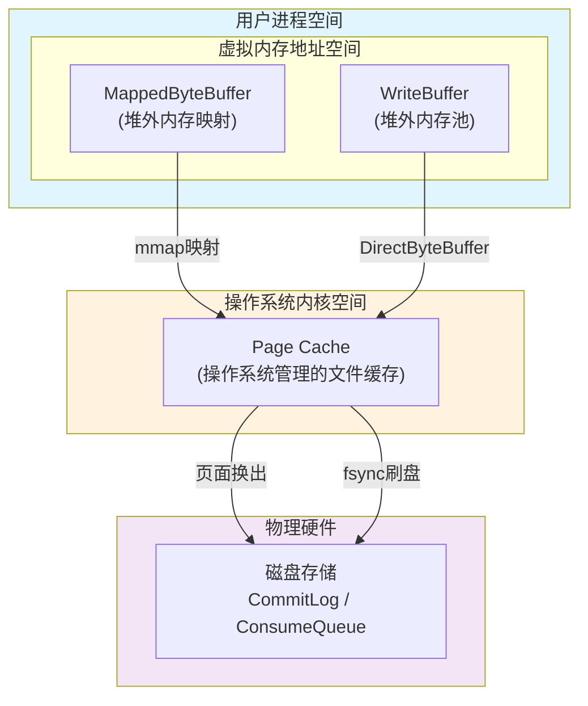

**内存映射数据流向：**

| 步骤 | 组件 | 操作 | 说明 |
|------|------|------|------|
| 1 | MappedByteBuffer | mmap映射 | 将文件映射到虚拟内存地址空间 |
| 2 | WriteBuffer | DirectByteBuffer | 堆外内存池直接操作Page Cache |
| 3 | Page Cache | 页面换出 | 操作系统自动管理页面换入换出 |
| 4 | Page Cache | fsync刷盘 | 将缓存数据持久化到磁盘 |

**内存映射的优势：**
- 避免用户态和内核态之间的数据拷贝
- 操作系统自动管理页面的换入换出
- 多个进程可以共享同一文件的映射

### 1.1.2 堆外内存

Java NIO 提供了 `DirectByteBuffer`，它分配在 JVM 堆外内存中，避免了 Java 堆与 Native 堆之间的数据拷贝。

**堆外内存的优势：**
- 减少垃圾回收（GC）压力
- 避免数据在Java堆与Native堆之间拷贝
- 适合大块数据的I/O操作

**RocketMQ堆外内存池配置：**

| 配置项 | 默认值 | 说明 |
|--------|--------|------|
| `transientStorePoolEnable` | false | 是否启用堆外内存池 |
| `transientStorePoolSize` | 5个 | 内存池中缓冲区数量 |
| `mappedFileSizeCommitLog` | 1GB | 每个缓冲区大小 |

**启用条件**：只有当 `transientStorePoolEnable=true` 且 `BrokerRole != SLAVE` 时才启用堆外内存池。

### 1.1.3 内存锁定

`mlock` 系统调用可以将内存页面锁定在物理内存中，防止被操作系统换出到磁盘。

**mlock 的作用：**
- 防止关键内存被操作系统换出到磁盘
- 保证消息写入的低延迟
- 避免页面错误（Page Fault）导致的性能抖动

**LibC系统调用常量：**

| 常量 | 值 | 说明 |
|------|-----|------|
| `MADV_WILLNEED` | 3 | 预加载页面到内存 |
| `MADV_DONTNEED` | 4 | 释放页面，可被回收 |
| `MCL_CURRENT` | 1 | 锁定当前所有映射页面 |
| `MCL_FUTURE` | 2 | 锁定未来映射的页面 |
| `MS_SYNC` | 0x0004 | 同步内存刷盘 |
| `MS_ASYNC` | 0x0001 | 异步内存刷盘 |

**注意事项**：Linux下执行mlock需要 `CAP_IPC_LOCK` 权限或root用户。

## 1.2 架构与数据流

### 1.2.1 内存管理架构图

RocketMQ通过JVM堆外内存和mmap映射，实现消息存储与操作系统Page Cache的高效交互。

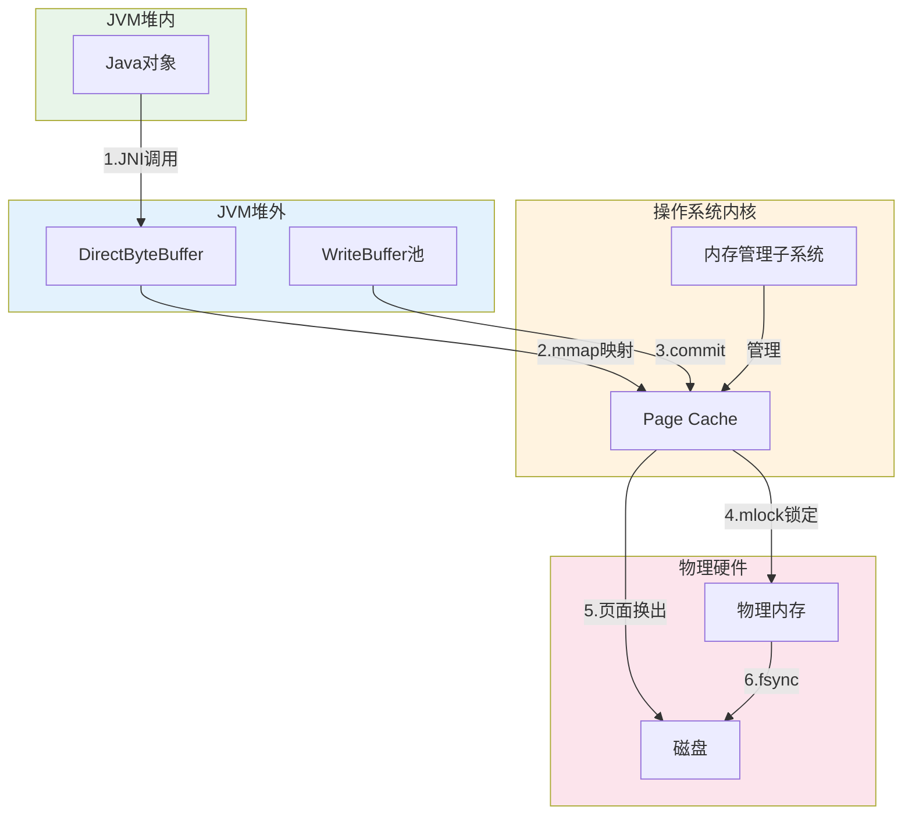

**内存管理层级说明：**

| 层级 | 组件 | 职责 | 内存类型 |
|------|------|------|----------|
| JVM堆内 | Java对象 | 业务逻辑处理 | 堆内存 |
| JVM堆外 | DirectByteBuffer | 零拷贝传输 | Native内存 |
| JVM堆外 | WriteBuffer池 | 写缓冲区 | Native内存 |
| 内核空间 | Page Cache | 文件缓存 | 内核内存 |
| 物理硬件 | 物理内存 | 实际存储 | RAM |
| 物理硬件 | 磁盘 | 持久化存储 | SSD/HDD |

### 1.2.2 内存映射写入流程图

消息写入通过mmap映射直接进入Page Cache，由操作系统管理刷盘，实现零拷贝写入。

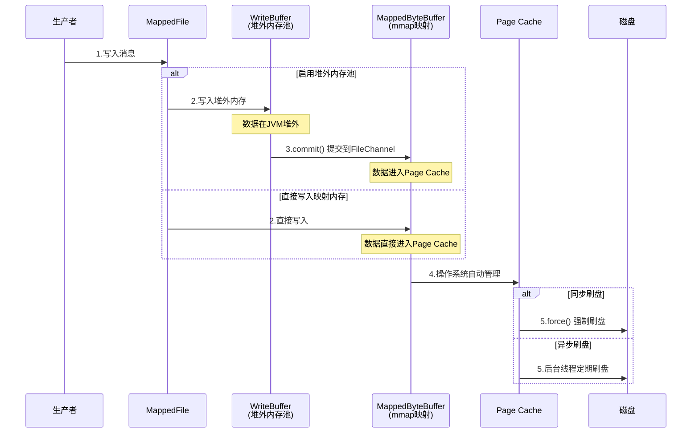

**内存映射写入步骤说明：**

| 步骤 | 操作 | 类型 | 说明 |
|------|------|------|------|
| 1 | 写入消息 | 内存写 | 数据写入MappedByteBuffer或WriteBuffer |
| 2 | commit提交 | 内存拷贝 | 堆外内存池模式下，数据提交到FileChannel |
| 3 | 进入Page Cache | 内核操作 | 数据进入操作系统文件缓存 |
| 4 | force刷盘 | 系统调用 | 同步/异步方式持久化到磁盘 |

## 1.3 源码实现

### 1.3.1 MappedFile 实现

**源码位置：** [DefaultMappedFile.java](../store/src/main/java/org/apache/rocketmq/store/logfile/DefaultMappedFile.java)

```java
public class DefaultMappedFile extends AbstractMappedFile {
    public static final int OS_PAGE_SIZE = 1024 * 4;  // 4KB，操作系统页大小
    protected FileChannel fileChannel;
    protected MappedByteBuffer mappedByteBuffer;
    protected ByteBuffer writeBuffer = null;
    protected TransientStorePool transientStorePool = null;
    
    // 原子更新的位置指针
    protected volatile int wrotePosition;      // 已写入位置
    protected volatile int committedPosition;  // 已提交位置
    protected volatile int flushedPosition;    // 已刷盘位置
    
    private void init(final String fileName, final int fileSize) throws IOException {
        this.fileName = fileName;
        this.fileSize = fileSize;
        this.file = new File(fileName);
        this.fileFromOffset = Long.parseLong(this.file.getName());
        this.fileChannel = new RandomAccessFile(this.file, "rw").getChannel();
        // 调用操作系统的mmap系统调用
        this.mappedByteBuffer = this.fileChannel.map(MapMode.READ_WRITE, 0, fileSize);
        TOTAL_MAPPED_VIRTUAL_MEMORY.addAndGet(fileSize);
        TOTAL_MAPPED_FILES.incrementAndGet();
    }
}
```

**关键点解析：**
1. `fileChannel.map()` 调用操作系统的 mmap 系统调用
2. 映射后的内存区域可以直接读写，无需显式的 read/write 操作
3. 修改会自动同步到文件（由操作系统管理）
4. 使用 `AtomicIntegerFieldUpdater` 实现位置指针的原子更新

### 1.3.2 TransientStorePool 堆外内存池

**源码位置：** [TransientStorePool.java](../store/src/main/java/org/apache/rocketmq/store/TransientStorePool.java)

```java
public class TransientStorePool {
    private final int poolSize;      // 内存池大小，默认5个
    private final int fileSize;      // 每个缓冲区大小，默认1GB
    private final Deque<ByteBuffer> availableBuffers;
    
    public void init() {
        for (int i = 0; i < poolSize; i++) {
            // 分配堆外内存
            ByteBuffer byteBuffer = ByteBuffer.allocateDirect(fileSize);
            final long address = ((DirectBuffer) byteBuffer).address();
            Pointer pointer = new Pointer(address);
            // 锁定内存，防止被换出
            LibC.INSTANCE.mlock(pointer, new NativeLong(fileSize));
            availableBuffers.offer(byteBuffer);
        }
    }
    
    public void destroy() {
        for (ByteBuffer byteBuffer : availableBuffers) {
            final long address = ((DirectBuffer) byteBuffer).address();
            Pointer pointer = new Pointer(address);
            // 解锁内存
            LibC.INSTANCE.munlock(pointer, new NativeLong(fileSize));
        }
    }
}
```

### 1.3.3 LibC 系统调用封装

**源码位置：** [LibC.java](../store/src/main/java/org/apache/rocketmq/store/util/LibC.java)

```java
public interface LibC extends Library {
    LibC INSTANCE = (LibC) Native.loadLibrary(
        Platform.isWindows() ? "msvcrt" : "c", LibC.class);
    
    int mlock(Pointer var1, NativeLong var2);    // 锁定内存
    int munlock(Pointer var1, NativeLong var2);  // 解锁内存
    int madvise(Pointer var1, NativeLong var2, int var3);  // 内存使用建议
    int MADV_WILLNEED = 3;   // 预加载页面
    int MADV_DONTNEED = 4;   // 释放页面
    int msync(Pointer p, NativeLong length, int flags);  // 内存同步
    int mlockall(int flags);  // 锁定所有内存
}
```

### 1.3.4 内存预热与锁定

**源码位置：** [DefaultMappedFile.java](../store/src/main/java/org/apache/rocketmq/store/logfile/DefaultMappedFile.java)

```java
@Override
public void warmMappedFile(FlushDiskType type, int pages) {
    long beginTime = System.currentTimeMillis();
    ByteBuffer byteBuffer = this.mappedByteBuffer.slice();
    int flush = 0;
    
    // 按页写入0，触发页面加载
    for (int i = 0, j = 0; i < this.fileSize; i += OS_PAGE_SIZE, j++) {
        byteBuffer.put(i, (byte) 0);
        if (type == FlushDiskType.SYNC_FLUSH) {
            if ((i / OS_PAGE_SIZE) - (flush / OS_PAGE_SIZE) >= pages) {
                flush = i;
                mappedByteBuffer.force();
            }
        }
        // 定期让出CPU，避免阻塞其他线程
        if (j % 1000 == 0) {
            try {
                Thread.sleep(0);
            } catch (InterruptedException e) {
                log.error("Interrupted", e);
            }
        }
    }
    this.mlock();  // 锁定内存
}
```

**内存预热的作用：**
- 提前将文件页面加载到物理内存
- 避免运行时的页面错误（Page Fault）
- 保证消息写入的稳定延迟

## 1.4 配置与最佳实践

| 配置项 | 默认值 | 优化建议 | 说明 |
|--------|--------|----------|------|
| `transientStorePoolEnable` | false | 高吞吐场景开启 | 启用堆外内存池，减少GC压力 |
| `transientStorePoolSize` | 5个 | 根据内存调整 | 内存池大小，每个缓冲区1GB |
| `mappedFileSizeCommitLog` | 1GB | 不建议修改 | 单个CommitLog文件大小 |

**使用建议：**
1. **高吞吐场景**：启用 `transientStorePoolEnable`，使用堆外内存池
2. **大内存服务器**：增大 `transientStorePoolSize`，分配更多堆外内存

**注意事项：**
1. **内存锁定需要足够权限**：Linux下需要 CAP_IPC_LOCK 权限或 root 用户
2. **堆外内存不受JVM GC管理**：需要手动管理生命周期
3. **mmap文件大小有限制**：受操作系统虚拟地址空间限制（32位系统约2GB，64位系统几乎无限制）
4. **内存预热耗时**：1GB文件预热约需数秒

---

# 2. I/O系统

## 2.1 核心概念

### 2.1.1 零拷贝技术

**零拷贝**是指数据在传输过程中不需要在用户空间和内核空间之间进行拷贝。传统I/O需要4次数据拷贝和4次上下文切换，而零拷贝技术可以大幅减少这些开销。

### 2.1.2 I/O多路复用

**I/O多路复用**允许单个线程同时监控多个文件描述符的I/O状态，是高并发网络编程的基础。

I/O多路复用通过单线程管理多个连接，避免为每个连接创建线程的资源开销。

| 机制 | 时间复杂度 | 特点 | 适用场景 |
|------|------------|------|----------|
| select | O(n) | 有FD数量限制（1024） | 兼容性要求高 |
| poll | O(n) | 无FD数量限制 | 连接数中等 |
| epoll | O(1) | 事件驱动，高性能 | Linux高并发 |

### 2.1.3 Page Cache

**Page Cache**是操作系统管理的文件缓存，位于内存中，用于缓存磁盘文件的内容。

**Page Cache的作用：**
- 减少磁盘I/O操作
- 提高文件读取性能
- 操作系统自动管理，对应用透明

**RocketMQ与Page Cache交互：**

| 操作 | 说明 | 触发时机 |
|------|------|----------|
| 写入 | 数据写入mmap映射区域，自动进入Page Cache | 消息写入时 |
| 刷盘 | force()调用将Page Cache数据持久化到磁盘 | 刷盘服务定时执行 |
| 读取 | 从Page Cache读取，命中则无需磁盘I/O | 消息消费时 |
| 预热 | warmMappedFile提前加载页面到物理内存 | 文件预分配时 |

**Page Cache繁忙检测**：当写入操作在锁中停留时间超过 `osPageCacheBusyTimeOutMills`（默认1000ms）时，判定为Page Cache繁忙。

## 2.2 架构与数据流

### 2.2.1 传统I/O vs 零拷贝对比图

**传统I/O数据传输流程**：需要4次数据拷贝和4次上下文切换，效率低下。

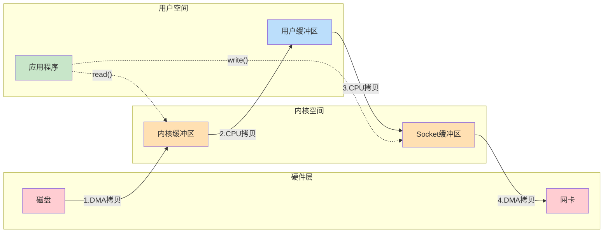

**传统I/O数据传输步骤：**

| 步骤 | 操作 | 类型 | 说明 |
|------|------|------|------|
| 1 | read() | 系统调用 | 用户态→内核态切换 |
| 2 | DMA拷贝 | 硬件操作 | 磁盘→内核缓冲区 |
| 3 | CPU拷贝 | 内核操作 | 内核缓冲区→用户缓冲区 |
| 4 | write() | 系统调用 | 用户态→内核态切换 |
| 5 | CPU拷贝 | 内核操作 | 用户缓冲区→Socket缓冲区 |
| 6 | DMA拷贝 | 硬件操作 | Socket缓冲区→网卡 |

**零拷贝数据传输流程**：仅需2次DMA拷贝和2次上下文切换，无需CPU参与数据拷贝。

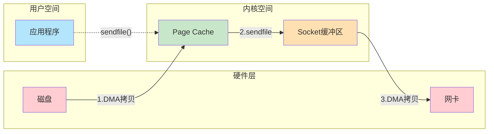

**零拷贝数据传输步骤：**

| 步骤 | 操作 | 类型 | 说明 |
|------|------|------|------|
| 1 | sendfile() | 系统调用 | 用户态→内核态切换 |
| 2 | DMA拷贝 | 硬件操作 | 磁盘→Page Cache |
| 3 | DMA拷贝 | 硬件操作 | Page Cache→网卡 |
| 4 | 返回 | 系统调用 | 内核态→用户态切换 |

### 2.2.2 I/O多路复用架构图

I/O多路复用通过单线程管理多个连接，避免为每个连接创建线程的资源开销，实现高并发连接处理。

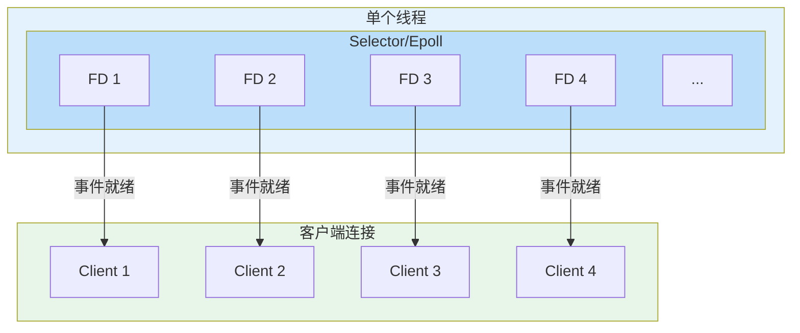

**I/O多路复用处理步骤：**

| 步骤 | 操作 | 类型 | 说明 |
|------|------|------|------|
| 1 | 注册FD | 系统调用 | 将文件描述符注册到Selector/Epoll |
| 2 | 事件轮询 | 内核操作 | 调用select/poll/epoll_wait等待事件 |
| 3 | 事件就绪 | 内核通知 | 内核返回就绪的文件描述符列表 |
| 4 | 事件分发 | 用户态处理 | 根据事件类型分发到对应的Handler |
| 5 | I/O处理 | 用户态操作 | Handler执行读写操作 |

## 2.3 源码实现

### 2.3.1 零拷贝实现

**源码位置：** [DefaultMessageStore.java](../store/src/main/java/org/apache/rocketmq/store/DefaultMessageStore.java)

```java
// 使用FileRegion实现零拷贝传输
public SelectMappedBufferResult getMessage(final String group, final String topic, 
        final int queueId, final long offset, final int maxMsgNums) {
    // 通过mmap映射读取消息，避免数据拷贝
    SelectMappedBufferResult result = this.commitLog.getMessage(offset, size);
    return result;
}
```

### 2.3.2 I/O多路复用实现

**源码位置：** [NettyRemotingServer.java](../remoting/src/main/java/org/apache/rocketmq/remoting/netty/NettyRemotingServer.java)

```java
// 使用Epoll实现高性能I/O多路复用
public void start() {
    // Linux环境使用Epoll
    if (useEpoll()) {
        bossGroup = new EpollEventLoopGroup(1, threadFactory);
        workerGroup = new EpollEventLoopGroup(nThreads, threadFactory);
    } else {
        bossGroup = new NioEventLoopGroup(1, threadFactory);
        workerGroup = new NioEventLoopGroup(nThreads, threadFactory);
    }
    
    ServerBootstrap bootstrap = new ServerBootstrap();
    bootstrap.group(bossGroup, workerGroup)
        .channel(useEpoll() ? EpollServerSocketChannel.class : NioServerSocketChannel.class)
        .childHandler(new ChannelInitializer<SocketChannel>() {
            @Override
            public void initChannel(SocketChannel ch) {
                ch.pipeline().addLast(handler);
            }
        });
}
```

### 2.3.3 刷盘策略

**源码位置：** [CommitLog.java](../store/src/main/java/org/apache/rocketmq/store/CommitLog.java)

**刷盘服务架构：**

| 服务类 | 触发条件 | 说明 |
|--------|----------|------|
| `GroupCommitService` | 同步刷盘 | 处理同步刷盘请求 |
| `FlushRealTimeService` | 异步刷盘 | 定时刷盘，默认500ms |
| `CommitRealTimeService` | 堆外内存池启用时 | 提交数据到FileChannel |

**刷盘配置参数：**

| 配置项 | 默认值 | 说明 |
|--------|--------|------|
| `flushDiskType` | ASYNC_FLUSH | 刷盘方式 |
| `flushCommitLogLeastPages` | 4页（16KB） | 最少刷盘页数 |
| `flushIntervalCommitLog` | 500ms | 异步刷盘间隔 |
| `flushCommitLogTimed` | true | 是否定时刷盘 |
| `flushCommitLogThoroughInterval` | 10s | 完全刷盘间隔 |
| `syncFlushTimeout` | 5s | 同步刷盘超时时间 |
| `commitCommitLogLeastPages` | 4页（16KB） | 最少提交页数 |
| `commitIntervalCommitLog` | 200ms | 提交间隔 |

```java
class FlushRealTimeService extends FlushCommitLogService {
    @Override
    public void run() {
        while (!this.isStopped()) {
            int interval = config.getFlushIntervalCommitLog();  // 默认500ms
            int flushLeastPages = config.getFlushCommitLogLeastPages();  // 默认4页
            
            // 超过thoroughInterval时强制刷盘
            if (currentTime >= lastFlushTimestamp + thoroughInterval) {
                flushLeastPages = 0;  // 0表示强制刷盘
            }
            
            if (flushCommitLogTimed) {
                Thread.sleep(interval);
            } else {
                this.waitForRunning(interval);
            }
            
            CommitLog.this.mappedFileQueue.flush(flushLeastPages);
        }
    }
}
```

**DefaultMappedFile.flush()实现：**

```java
@Override
public int flush(final int flushLeastPages) {
    if (this.isAbleToFlush(flushLeastPages)) {
        if (this.hold()) {
            int value = getReadPosition();
            try {
                // 根据是否使用堆外内存池选择刷盘方式
                if (writeBuffer != null || this.fileChannel.position() != 0) {
                    this.fileChannel.force(false);  // FileChannel刷盘
                } else {
                    this.mappedByteBuffer.force();  // MappedByteBuffer刷盘
                }
                this.lastFlushTime = System.currentTimeMillis();
            } catch (Throwable e) {
                log.error("Error occurred when force data to disk.", e);
            }
            FLUSHED_POSITION_UPDATER.set(this, value);
            this.release();
        }
    }
    return this.getFlushedPosition();
}
```

## 2.4 配置与最佳实践

| 配置项 | 默认值 | 优化建议 | 说明 |
|--------|--------|----------|------|
| `flushCommitLogLeastPages` | 4页（16KB） | 低延迟场景减小 | 最少刷盘页数，每页4KB |
| `flushIntervalCommitLog` | 500ms | 低延迟场景减小 | 异步刷盘间隔 |
| `commitCommitLogLeastPages` | 4页（16KB） | 低延迟场景减小 | 最少提交页数 |
| `commitIntervalCommitLog` | 200ms | 配合堆外内存池使用 | 堆外内存提交间隔 |

**使用建议：**
1. **低延迟场景**：减小 `flushCommitLogLeastPages`（如设为1页），更频繁刷盘
2. **SSD存储**：可以适当增大刷盘间隔，利用SSD的高IOPS

---

# 3. 文件系统

## 3.1 核心概念

### 3.1.1 顺序写入原理

**顺序写入**是指按照文件偏移量递增的方式连续写入数据，相比随机写入具有更高的性能。

**顺序写入的优势：**
- 磁盘寻道时间几乎为零
- 充分利用磁盘带宽
- 写入性能比随机写入高1-2个数量级

**CommitLog顺序写入实现：**

| 组件 | 作用 | 说明 |
|------|------|------|
| `MappedFileQueue` | 文件队列管理 | 管理多个连续的MappedFile |
| `MappedFile` | 单个文件映射 | 每个文件默认1GB |
| `wrotePosition` | 写入位置 | 原子更新，保证顺序写入 |
| `AppendMessageCallback` | 消息追加回调 | 实际执行消息编码和写入 |

**文件大小配置：**

| 配置项 | 默认值 | 说明 |
|--------|--------|------|
| `mappedFileSizeCommitLog` | 1GB | CommitLog单个文件大小 |
| `mappedFileSizeConsumeQueue` | 600万B（30万条×20B） | ConsumeQueue单个文件大小 |
| `mappedFileSizeIndexFile` | 约400MB（500万Hash槽） | IndexFile大小 |

### 3.1.2 文件预分配

**文件预分配**是指在写入数据之前，提前分配好文件空间，避免频繁的文件扩展操作。

**预分配的优势：**
- 避免文件扩展时的元数据更新开销
- 保证文件在磁盘上的连续性
- 减少磁盘碎片

### 3.1.3 索引结构

RocketMQ 使用多种索引结构来加速消息查找：

| 索引类型 | 作用 | 结构特点 |
|----------|------|----------|
| CommitLog | 存储所有消息 | 顺序写入，追加方式 |
| ConsumeQueue | 消费队列索引 | 按Topic-QueueId组织 |
| IndexFile | 消息Key索引 | Hash索引结构 |

**ConsumeQueue索引单元结构（CQ_STORE_UNIT_SIZE = 20B）：**

| 字段 | 大小 | 说明 |
|------|------|------|
| commitlog offset | 8B | 消息在CommitLog中的物理偏移量 |
| size | 4B | 消息大小 |
| tagsCode | 8B | 消息标签哈希值（用于消息过滤） |

**BatchConsumeQueue索引单元结构（CQ_STORE_UNIT_SIZE = 46B）：**

| 字段 | 大小 | 说明 |
|------|------|------|
| commitlog offset | 8B | 消息在CommitLog中的物理偏移量 |
| size | 4B | 消息大小 |
| tagsCode | 8B | 消息标签哈希值 |
| storeTime | 8B | 存储时间戳 |
| msgBaseOffset | 8B | 消息批次基础偏移量 |
| batchSize | 2B | 批次消息数量 |
| compactedOffset | 4B | 压缩偏移量 |
| reserved | 4B | 保留字段 |

**IndexFile索引项结构（indexSize = 20B）：**

| 字段 | 大小 | 说明 |
|------|------|------|
| keyHash | 4B | 消息Key的哈希值 |
| phyOffset | 8B | CommitLog物理偏移量 |
| timeDiff | 4B | 与文件开始时间的时间差（秒） |
| slotValue | 4B | Hash槽值（链表指针） |

## 3.2 架构与数据流

### 3.2.1 文件存储架构图

RocketMQ存储架构分为网络层、存储层、操作系统层三层，通过mmap映射实现高效数据传输。

| 层级 | 组件 | 技术要点 |
|------|------|----------|
| 网络层 | Netty | Epoll多路复用、Reactor模型 |
| 存储层 | CommitLog/ConsumeQueue | mmap映射、顺序写入 |
| 操作系统层 | Page Cache/文件系统 | 零拷贝、缓存管理 |

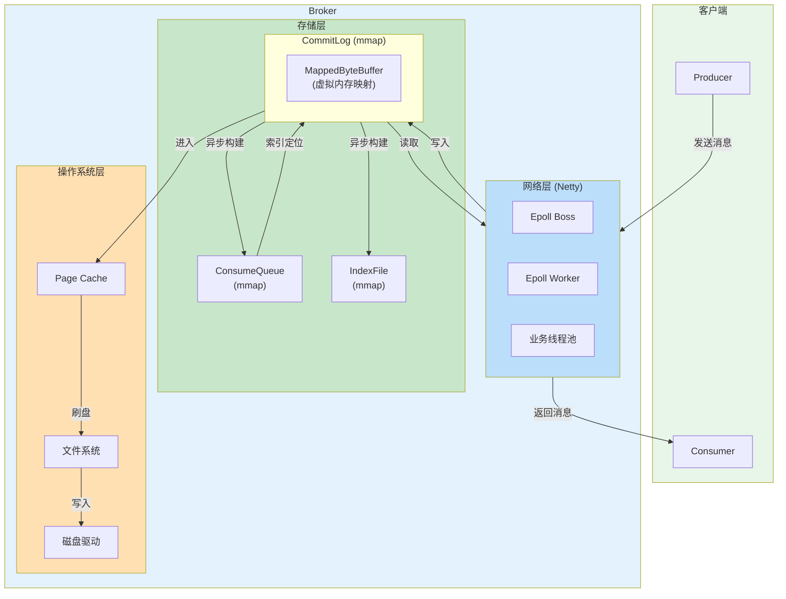

## 3.3 源码实现

### 3.3.1 CommitLog 实现

**源码位置：** [CommitLog.java](../store/src/main/java/org/apache/rocketmq/store/CommitLog.java)

```java
public class CommitLog {
    private final MappedFileQueue mappedFileQueue;
    private final DefaultMessageStore defaultMessageStore;
    
    public PutMessageResult putMessage(final MessageExtBrokerInner msg) {
        // 获取或创建当前写入的MappedFile
        MappedFile mappedFile = this.mappedFileQueue.getLastMappedFile();
        if (null == mappedFile || mappedFile.isFull()) {
            mappedFile = this.mappedFileQueue.getLastMappedFile(0);
        }
        
        // 顺序写入消息
        result = mappedFile.appendMessage(msg, this.appendMessageCallback);
        return result;
    }
}
```

**CommitLog特点：**
- 所有消息顺序写入同一个文件队列
- 单个文件大小默认1GB
- 通过追加写入实现高性能

### 3.3.2 ConsumeQueue 实现

**源码位置：** [ConsumeQueue.java](../store/src/main/java/org/apache/rocketmq/store/ConsumeQueue.java)

```java
public class ConsumeQueue {
    private static final int CQ_STORE_UNIT_SIZE = 20;  // 每个索引单元20字节
    private final MappedFileQueue mappedFileQueue;
    
    // 索引单元结构：8字节偏移量 + 4字节大小 + 8字节tagsCode
    public void putMessagePositionInfoWrapper(long offset, int size, long tagsCode, 
            long storeTimestamp) {
        final int maxRetries = 30;
        boolean canPut = false;
        
        for (int i = 0; i < maxRetries; i++) {
            // 获取当前写入位置
            final int currentPos = this.mappedFileQueue.getWrotePosition();
            if (currentPos < this.mappedFileQueue.getMappedFileSize()) {
                // 写入索引单元
                ByteBuffer byteBuffer = ByteBuffer.allocate(CQ_STORE_UNIT_SIZE);
                byteBuffer.putLong(offset);      // CommitLog偏移量
                byteBuffer.putInt(size);         // 消息大小
                byteBuffer.putLong(tagsCode);    // 标签哈希值
                this.mappedFileQueue.append(byteBuffer.array());
                canPut = true;
                break;
            }
        }
    }
}
```

### 3.3.3 IndexFile 实现

**源码位置：** [IndexFile.java](../store/src/main/java/org/apache/rocketmq/store/index/IndexFile.java)

```java
public class IndexFile {
    private static final int HASH_SLOT_SIZE = 4;   // Hash槽大小4字节
    private static final int INDEX_SIZE = 20;       // 索引项大小20字节
    
    // 索引项结构：4字节keyHash + 8字节phyOffset + 4字节timeDiff + 4字节slotValue
    public boolean putKey(final String key, final long phyOffset, final long storeTimestamp) {
        // 计算key的hash值
        int keyHash = indexKeyHashMethod(key);
        // 计算slot位置
        int slotPos = keyHash % this.hashSlotNum;
        int absSlotPos = IndexHeader.INDEX_HEADER_SIZE + slotPos * HASH_SLOT_SIZE;
        
        // 写入索引项
        int absIndexPos = IndexHeader.INDEX_HEADER_SIZE + 
            this.hashSlotNum * HASH_SLOT_SIZE + 
            this.indexHeader.getIndexCount() * INDEX_SIZE;
        
        ByteBuffer indexBuffer = this.mappedByteBuffer.slice();
        indexBuffer.position(absIndexPos);
        indexBuffer.putInt(keyHash);           // key哈希值
        indexBuffer.putLong(phyOffset);        // CommitLog偏移量
        indexBuffer.putInt(timeDiff);          // 时间差
        indexBuffer.putInt(slotValue);         // 链表指针
        
        return true;
    }
}
```

## 3.4 配置与最佳实践

| 配置项 | 默认值 | 优化建议 | 说明 |
|--------|--------|----------|------|
| `mappedFileSizeCommitLog` | 1GB | 不建议修改 | CommitLog文件大小 |
| `mappedFileSizeConsumeQueue` | 30万条 | 根据业务调整 | ConsumeQueue文件大小 |
| `mappedFileSizeIndexFile` | 4000万个索引 | 不建议修改 | IndexFile文件大小 |

---

# 4. 网络系统

## 4.1 核心概念

### 4.1.1 Reactor模型

**Reactor模型**是一种事件驱动的网络编程模式，通过I/O多路复用机制实现高并发连接处理。

**Reactor模型的核心组件：**
- **Reactor**：负责监听和分发事件
- **Acceptor**：处理新连接请求
- **Handler**：处理具体的I/O事件

### 4.1.2 TCP优化

**TCP优化**是通过调整TCP参数来提升网络传输性能的技术。

**常用TCP优化参数：**

| 参数 | 作用 | RocketMQ应用 |
|------|------|--------------|
| TCP_NODELAY | 禁用Nagle算法 | 降低消息延迟 |
| SO_SNDBUF | 发送缓冲区大小 | 提高吞吐量 |
| SO_RCVBUF | 接收缓冲区大小 | 提高吞吐量 |
| SO_KEEPALIVE | 保持连接活跃 | 检测死连接 |

**NettyServerConfig默认配置：**

| 配置项 | 默认值 | 说明 |
|--------|--------|------|
| `serverWorkerThreads` | 8 | 业务线程数 |
| `serverSelectorThreads` | 3 | I/O选择器线程数 |
| `serverOnewaySemaphoreValue` | 256 | 单向请求信号量 |
| `serverAsyncSemaphoreValue` | 64 | 异步请求信号量 |
| `serverChannelMaxIdleTimeSeconds` | 120s | 连接最大空闲时间 |
| `serverSocketBacklog` | 1024 | 连接等待队列长度 |
| `useEpollNativeSelector` | false | 是否使用Epoll |

**NettyRemotingServer启动配置：**

```java
serverBootstrap.group(this.eventLoopGroupBoss, this.eventLoopGroupSelector)
    .channel(useEpoll() ? EpollServerSocketChannel.class : NioServerSocketChannel.class)
    .option(ChannelOption.SO_BACKLOG, 1024)
    .option(ChannelOption.SO_REUSEADDR, true)
    .childOption(ChannelOption.SO_KEEPALIVE, false)
    .childOption(ChannelOption.TCP_NODELAY, true)
```

### 4.1.3 Epoll机制

**Epoll**是Linux特有的高性能I/O多路复用机制，相比select/poll有显著性能优势。

**Epoll的优势：**
- 事件驱动，时间复杂度O(1)
- 无FD数量限制
- 支持边缘触发（ET）模式

## 4.2 架构与数据流

### 4.2.1 网络架构图

RocketMQ采用主从Reactor模型，Boss线程负责连接建立，Worker线程负责I/O读写，业务线程池处理具体请求。

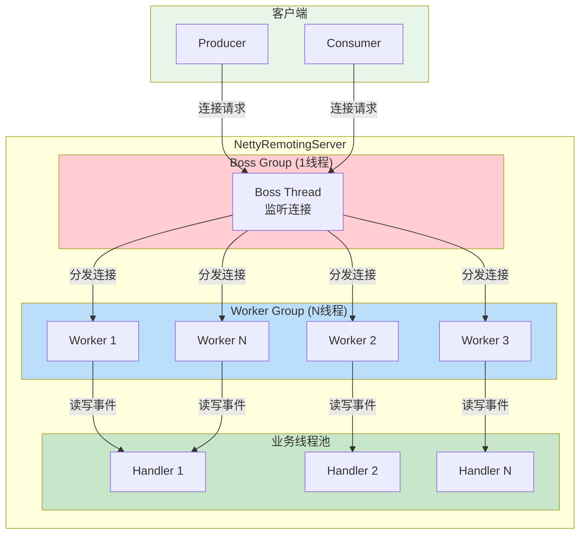

## 4.3 源码实现

### 4.3.1 NettyRemotingServer 实现

**源码位置：** [NettyRemotingServer.java](../remoting/src/main/java/org/apache/rocketmq/remoting/netty/NettyRemotingServer.java)

```java
public class NettyRemotingServer extends NettyRemotingAbstract implements RemotingServer {
    private EventLoopGroup eventLoopGroupBoss;    // Boss线程组
    private EventLoopGroup eventLoopGroupSelector; // Worker线程组
    private DefaultEventExecutorGroup defaultEventExecutorGroup;  // 业务线程组
    
    private EventLoopGroup buildBossEventLoopGroup() {
        if (useEpoll()) {
            return new EpollEventLoopGroup(1, ...);  // Boss线程数固定为1
        } else {
            return new NioEventLoopGroup(1, ...);
        }
    }
    
    private EventLoopGroup buildEventLoopGroupSelector() {
        if (useEpoll()) {
            return new EpollEventLoopGroup(
                nettyServerConfig.getServerSelectorThreads(), ...);  // 默认3个
        } else {
            return new NioEventLoopGroup(
                nettyServerConfig.getServerSelectorThreads(), ...);
        }
    }
    
    @Override
    public void start() {
        this.defaultEventExecutorGroup = new DefaultEventExecutorGroup(
            nettyServerConfig.getServerWorkerThreads(),  // 默认8个
            new ThreadFactory() {
                @Override
                public Thread newThread(Runnable r) {
                    return new Thread(r, "NettyServerCodecThread_" + ...);
                }
            });
        
        serverBootstrap.group(this.eventLoopGroupBoss, this.eventLoopGroupSelector)
            .channel(useEpoll() ? EpollServerSocketChannel.class : NioServerSocketChannel.class)
            .option(ChannelOption.SO_BACKLOG, 1024)
            .option(ChannelOption.SO_REUSEADDR, true)
            .childOption(ChannelOption.SO_KEEPALIVE, false)
            .childOption(ChannelOption.TCP_NODELAY, true)
            .childHandler(new ChannelInitializer<SocketChannel>() {
                @Override
                public void initChannel(SocketChannel ch) {
                    ch.pipeline()
                        .addLast(defaultEventExecutorGroup, 
                            new NettyEncoder(), new NettyDecoder())
                        .addLast(defaultEventExecutorGroup, 
                            new IdleStateHandler(0, 0, 120))  // 120s空闲检测
                        .addLast(defaultEventExecutorGroup, 
                            new NettyConnectManageHandler())
                        .addLast(defaultEventExecutorGroup, 
                            new NettyServerHandler());
                }
            });
    }
}
```

**Reactor线程模型配置：**

| 线程组 | 默认数量 | 职责 |
|--------|----------|------|
| Boss Group | 1 | 监听连接请求 |
| Worker Group | 3 | I/O读写操作 |
| Business Group | 8 | 业务逻辑处理 |

### 4.3.2 Reactor线程模型

**源码位置：** [NettyRemotingServer.java](../remoting/src/main/java/org/apache/rocketmq/remoting/netty/NettyRemotingServer.java)

```java
// Boss线程：监听连接
// Worker线程：处理I/O读写
// 业务线程池：处理具体请求

class NettyServerHandler extends SimpleChannelInboundHandler<RemotingCommand> {
    @Override
    protected void channelRead0(ChannelHandlerContext ctx, RemotingCommand msg) {
        // 将请求分发到业务线程池处理
        processMessageReceived(ctx, msg);
    }
}

// 请求处理
public void processRequestCommand(final ChannelHandlerContext ctx, 
        final RemotingCommand cmd) {
    // 获取请求处理器
    final Pair<NettyRequestProcessor, ExecutorService> matched = 
        this.processorTable.get(cmd.getCode());
    
    // 提交到线程池执行
    final ExecutorService executor = matched.getObject2();
    executor.submit(new Runnable() {
        @Override
        public void run() {
            try {
                // 处理请求
                final RemotingCommand response = processor.processRequest(ctx, cmd);
                ctx.writeAndFlush(response);
            } catch (Exception e) {
                log.error("process request error", e);
            }
        }
    });
}
```

### 4.3.3 TCP参数优化

**源码位置：** [NettySystemConfig.java](../remoting/src/main/java/org/apache/rocketmq/remoting/netty/NettySystemConfig.java)

```java
public class NettySystemConfig {
    // 发送缓冲区大小，默认128KB
    public static final int SEND_BUF_SIZE = Integer.parseInt(
        System.getProperty("com.rocketmq.sendMessageThreadPoolNum", "131072"));
    
    // 接收缓冲区大小，默认128KB
    public static final int RECV_BUF_SIZE = Integer.parseInt(
        System.getProperty("com.rocketmq.receiveMessageThreadPoolNum", "131072"));
    
    // 是否启用Epoll
    public static final boolean USE_EPOLL_NATIVE_SELECTOR = Boolean.parseBoolean(
        System.getProperty("com.rocketmq.useEpollNativeSelector", "false"));
}
```

## 4.4 配置与最佳实践

| 配置项 | 默认值 | 优化建议 | 说明 |
|--------|--------|----------|------|
| `serverSocketRcvBufSize` | 128KB | 高吞吐场景增大 | Socket接收缓冲区 |
| `serverSocketSndBufSize` | 128KB | 高吞吐场景增大 | Socket发送缓冲区 |
| `useEpollNativeSelector` | false | Linux环境开启 | 使用Epoll替代NIO |

---

# 5. 进程与线程管理

## 5.1 核心概念

### 5.1.1 线程模型

**线程模型**是指应用程序如何组织和使用线程来处理并发任务。

**RocketMQ线程模型特点：**
- 分层设计：网络线程、业务线程、存储线程分离
- 线程池复用：避免频繁创建销毁线程
- 任务队列：缓冲待处理的任务

### 5.1.2 锁机制

**锁机制**用于保证多线程环境下对共享资源的互斥访问。

**常用锁类型：**

| 锁类型 | 特点 | 适用场景 |
|--------|------|----------|
| 自旋锁 | 忙等待，不释放CPU | 锁持有时间短 |
| 互斥锁 | 阻塞等待，释放CPU | 锁持有时间长 |
| 读写锁 | 读读不互斥 | 读多写少 |
| CAS | 无锁原子操作 | 简单计数场景 |

**RocketMQ写入锁实现：**

| 锁类型 | 实现类 | 配置项 | 说明 |
|--------|--------|--------|------|
| 自旋锁 | `PutMessageSpinLock` | `useReentrantLockWhenPutMessage=false` | 高并发、锁持有时间短 |
| 重入锁 | `PutMessageReentrantLock` | `useReentrantLockWhenPutMessage=true`（默认） | 锁持有时间长 |

**PutMessageSpinLock实现原理：**

```java
public class PutMessageSpinLock implements PutMessageLock {
    // true: Can lock, false: in lock
    private AtomicBoolean putMessageSpinLock = new AtomicBoolean(true);
    
    @Override
    public void lock() {
        boolean flag;
        do {
            flag = this.putMessageSpinLock.compareAndSet(true, false);
        } while (!flag);  // 自旋等待
    }
    
    @Override
    public void unlock() {
        this.putMessageSpinLock.compareAndSet(false, true);
    }
}
```

**TopicQueueLock实现**：使用分段锁（32个ReentrantLock），根据topic+queueId的哈希值选择锁，减少锁竞争。

### 5.1.3 并发工具

**并发工具**是Java提供的用于协调多线程协作的工具类。

**常用并发工具：**

| 工具 | 作用 | RocketMQ应用 |
|------|------|--------------|
| CountDownLatch | 等待多线程完成 | 异步请求响应 |
| Semaphore | 限流控制 | 并发请求数限制 |
| CyclicBarrier | 多线程汇合 | 批量处理 |
| AtomicLong | 原子计数 | 消息偏移量管理 |

## 5.2 架构与数据流

### 5.2.1 线程模型架构图

RocketMQ采用分层线程模型，各层职责明确，通过任务队列解耦。

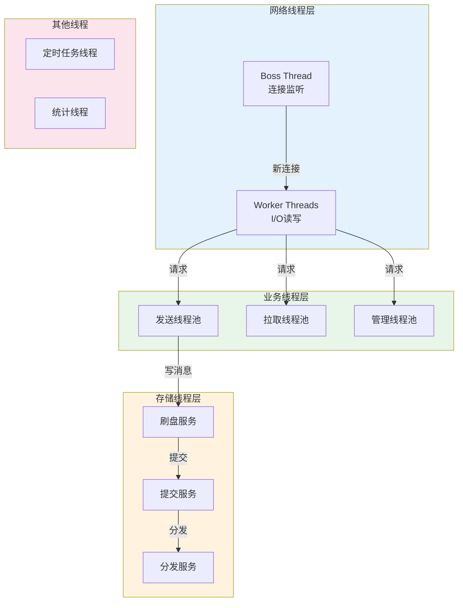

## 5.3 源码实现

### 5.3.1 线程池实现

**源码位置：** [BrokerController.java](../broker/src/main/java/org/apache/rocketmq/broker/BrokerController.java)

```java
public class BrokerController {
    // 发送消息线程池
    protected ExecutorService sendMessageExecutor;
    // 拉取消息线程池
    protected ExecutorService pullMessageExecutor;
    // 轻量拉取线程池
    protected ExecutorService litePullMessageExecutor;
    // 管理请求线程池
    protected ExecutorService adminBrokerExecutor;
    
    public void initialize() {
        // 初始化发送消息线程池
        this.sendMessageExecutor = new ThreadPoolExecutor(
            nettyServerConfig.getServerWorkerThreads(),
            nettyServerConfig.getServerWorkerThreads(),
            1000 * 60,
            TimeUnit.MILLISECONDS,
            this.sendThreadPoolQueue,
            new ThreadFactoryImpl("SendMessageThread_"));
        
        // 初始化拉取消息线程池
        this.pullMessageExecutor = new ThreadPoolExecutor(
            nettyServerConfig.getServerWorkerThreads(),
            nettyServerConfig.getServerWorkerThreads(),
            1000 * 60,
            TimeUnit.MILLISECONDS,
            this.pullThreadPoolQueue,
            new ThreadFactoryImpl("PullMessageThread_"));
    }
}
```

## 5.4 配置与最佳实践

| 配置项 | 默认值 | 优化建议 | 说明 |
|--------|--------|----------|------|
| `sendMessageThreadPoolNums` | 4 | 高并发场景增大 | 发送消息线程池大小 |
| `pullMessageThreadPoolNums` | 4 | 高并发场景增大 | 拉取消息线程池大小 |
| `flushCommitLogTimed` | false | 不建议修改 | 定时刷盘开关 |

---

# 6. 存储系统

## 6.1 核心概念

### 6.1.1 存储架构

**存储架构**是RocketMQ消息存储的整体设计，决定了消息的写入、读取和索引方式。

**存储架构核心组件：**

| 组件 | 职责 | 特点 |
|------|------|------|
| CommitLog | 存储所有消息 | 顺序写入，1GB/文件 |
| ConsumeQueue | 消费队列索引 | 按Topic-QueueId组织 |
| IndexFile | 消息Key索引 | Hash索引结构 |
| DefaultMessageStore | 存储管理器 | 协调各组件工作 |

### 6.1.2 消息分发

**消息分发**是指将CommitLog中的消息异步构建到ConsumeQueue和IndexFile的过程。

**分发流程：**
1. ReputMessageService线程定期扫描CommitLog
2. 解析消息，提取Topic、QueueId、Key等信息
3. 构建ConsumeQueue索引条目
4. 构建IndexFile索引条目

**ReputMessageService核心实现：**

| 配置项 | 默认值 | 说明 |
|--------|--------|------|
| `dispatchCqThreads` | 10 | 分发线程数 |
| `dispatchCqCacheNum` | 4096 | 分发缓存数量 |
| `enableAsyncReput` | true | 是否启用异步分发 |
| `recheckReputOffsetFromCq` | false | 是否从CQ重新校验分发偏移量 |

**分发延迟监控**：`dispatchBehindBytes()` 方法返回分发落后的字节数，用于监控分发进度。

### 6.1.3 文件清理

**文件清理**是指定期删除过期的存储文件，释放磁盘空间。

**清理策略：**
- 基于时间：删除超过保留时间的文件
- 基于空间：磁盘使用率超过阈值时清理
- 基于引用：文件未被引用时才能删除

**文件清理配置：**

| 配置项 | 默认值 | 说明 |
|--------|--------|------|
| `fileReservedTime` | 72h | 文件保留时间 |
| `deleteWhen` | "04" | 文件清理时间点（凌晨4点） |
| `diskMaxUsedSpaceRatio` | 75% | 磁盘最大使用率阈值 |
| `diskSpaceWarningLevelRatio` | 90% | 磁盘空间警告级别 |
| `diskSpaceCleanForciblyRatio` | 85% | 强制清理阈值 |
| `deleteCommitLogFilesInterval` | 100ms | 删除CommitLog文件间隔 |
| `deleteConsumeQueueFilesInterval` | 100ms | 删除ConsumeQueue文件间隔 |
| `deleteFileBatchMax` | 10 | 单次删除文件最大数量 |
| `cleanFileForciblyEnable` | true | 是否允许强制清理 |

**CleanCommitLogService清理逻辑**：
1. 检查磁盘使用率，超过 `diskSpaceCleanForciblyRatio` 时强制清理
2. 删除超过 `fileReservedTime` 的过期文件
3. 在 `deleteWhen` 指定的时间点执行清理

## 6.2 架构与数据流

### 6.2.1 存储系统架构图

存储系统采用CommitLog+ConsumeQueue的分离架构，写入高性能，读取低延迟。

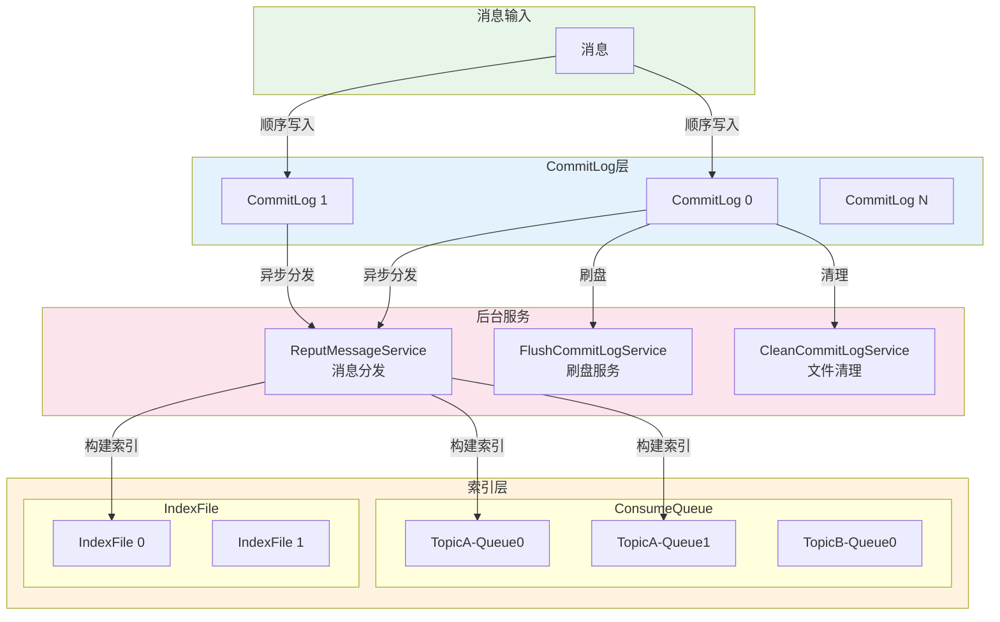

### 6.2.2 消息流转流程图

写入路径通过顺序写入实现高吞吐，读取路径通过索引定位和Page Cache缓存实现低延迟。

| 路径 | 流程 | 特点 |
|------|------|------|
| 写入 | Producer→Network→CommitLog→PageCache→Disk | 顺序写，高吞吐 |
| 分发 | CommitLog→ConsumeQueue/IndexFile | 异步构建，不阻塞写入 |
| 读取 | Consumer←Network←ConsumeQ←CommitLog←PageCache | 索引定位，缓存命中 |

**写入流程详解**：

| 步骤 | 操作 | 类型 | 说明 |
|------|------|------|------|
| 1 | 发送消息 | 网络传输 | Producer通过网络发送消息到Broker |
| 2 | 网络处理 | I/O操作 | Netty接收并解析消息 |
| 3 | 写入CommitLog | 内存写 | 顺序追加写入mmap映射区域 |
| 4 | 进入Page Cache | 内核操作 | 数据自动进入操作系统文件缓存 |
| 5 | 异步刷盘 | 系统调用 | 后台线程定期fsync持久化 |
| 6 | 异步分发 | 后台任务 | ReputService构建ConsumeQueue和IndexFile |

**读取流程详解**：

| 步骤 | 操作 | 类型 | 说明 |
|------|------|------|------|
| 1 | 拉取请求 | 网络传输 | Consumer发送拉取请求（含Topic、QueueId、Offset） |
| 2 | 索引定位 | 内存读 | 根据Offset从ConsumeQueue获取CommitLog偏移量 |
| 3 | 读取消息 | 内存读 | 从CommitLog读取消息（优先从Page Cache） |
| 4 | 返回消息 | 网络传输 | 通过网络返回给Consumer |

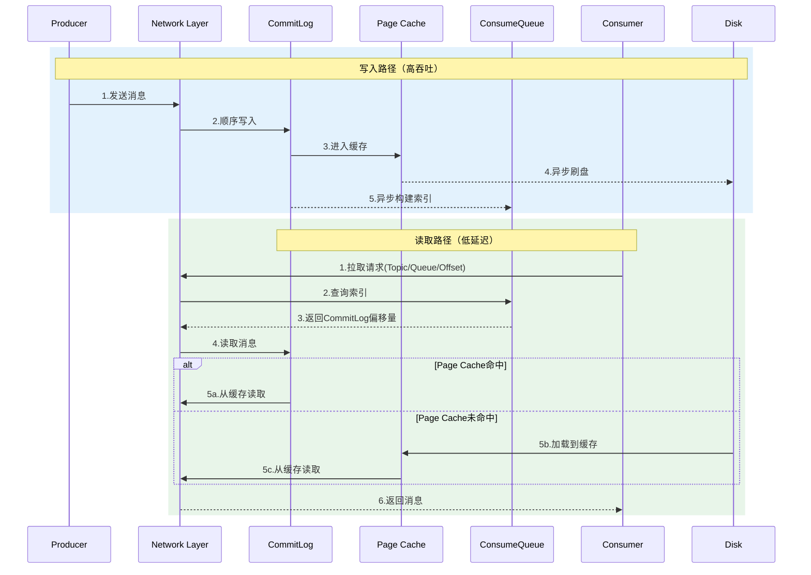

## 6.3 配置与最佳实践

| 配置项 | 默认值 | 优化建议 | 说明 |
|--------|--------|----------|------|
| `fileReservedTime` | 72h | 根据业务调整 | 文件保留时间 |
| `deleteWhen` | 04 | 避免高峰期 | 文件清理时间点 |
| `diskMaxUsedSpaceRatio` | 75% | 根据磁盘调整 | 磁盘最大使用率 |

---

# 附录

## A. 核心技术速查表

### 内存管理

| 技术 | 操作系统原理 | RocketMQ应用 |
|------|--------------|--------------|
| mmap | 将文件映射到进程虚拟地址空间 | CommitLog/ConsumeQueue使用MappedByteBuffer |
| mlock | 锁定内存页面防止换出 | TransientStorePool锁定堆外内存 |
| DirectBuffer | JVM堆外内存分配 | 消息写入缓冲区、减少GC压力 |
| 内存预热 | 提前加载页面到物理内存 | warmMappedFile方法 |

### I/O系统

| 技术 | 操作系统原理 | RocketMQ应用 |
|------|--------------|--------------|
| 零拷贝 | sendfile系统调用 | FileRegion消息传输 |
| I/O多路复用 | select/poll/epoll | Netty EpollEventLoopGroup |
| Page Cache | 操作系统文件缓存 | 消息写入先进入Page Cache |
| fsync | 强制刷盘系统调用 | 同步/异步刷盘策略 |

### 文件系统

| 技术 | 操作系统原理 | RocketMQ应用 |
|------|--------------|--------------|
| 顺序写 | 磁盘顺序访问性能优于随机访问 | CommitLog顺序写入 |
| 文件映射 | 虚拟地址空间映射物理存储 | MappedFileQueue管理 |
| 文件锁 | 进程间互斥访问 | Broker启动时获取文件锁 |
| 预分配 | 提前分配文件空间 | AllocateMappedFileService |

### 网络系统

| 技术 | 操作系统原理 | RocketMQ应用 |
|------|--------------|--------------|
| TCP/IP | 网络协议栈 | 消息传输基础 |
| Epoll | Linux高性能I/O多路复用 | NettyRemotingServer |
| Reactor | 事件驱动网络模型 | Boss/Worker线程组 |
| TCP_NODELAY | 禁用Nagle算法 | 降低网络延迟 |

### 进程线程管理

| 技术 | 操作系统原理 | RocketMQ应用 |
|------|--------------|--------------|
| 线程池 | 线程复用、任务队列 | 各种业务处理线程池 |
| 锁机制 | 互斥、同步 | PutMessageLock写入锁 |
| 信号量 | 资源计数、限流 | 异步请求并发控制 |
| CAS | 原子操作 | 写入位置更新 |

## B. 参考资料

- 《深入理解计算机系统》
- 《操作系统导论》
- 《Linux内核设计与实现》
- RocketMQ官方文档：https://rocketmq.apache.org/
- Netty官方文档：https://netty.io/
