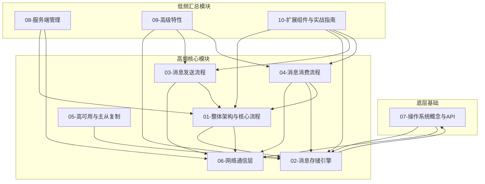

# RocketMQ 5.0.0 源码解读 - 模块文档规划

> **文档版本**: v1.4  
> **生成时间**: 2026-02-19  
> **RocketMQ版本**: 5.0.0  
> **存储路径**: ./docs2

---

## 一、项目概述

Apache RocketMQ 是一款分布式消息中间件，具有高性能、高可靠、高实时等特点。本项目基于 RocketMQ 5.0.0 版本进行源码解析，遵循「高内聚、低耦合+数量足够小」原则进行模块划分。

### 1.1 模块分类说明

| 分类 | 说明 | 文档策略 |
|------|------|----------|
| **高频模块** | 生产环境易出错、面试高频考点、核心性能瓶颈 | 重点讲解，拆分细化 |
| **低频模块** | 使用频率较低、相对稳定、辅助性功能 | 简要说明，合并汇总 |

---

## 二、模块划分清单

### 2.1 高频模块（重点讲解，拆分细化）

> **高频模块特点**：生产环境问题高发区、面试高频考点、核心性能瓶颈

| 模块编号 | 完整文件名 | 核心职责 | 高频原因 | 源码覆盖范围 | 优先级 |
|----------|------------|----------|----------|--------------|--------|
| 01 | 01-整体架构与核心流程.md | 讲解RocketMQ整体架构、核心工作流程、消息全生命周期 | 面试必问，理解基础 | broker/BrokerStartup.java、broker/BrokerController.java、namesrv/*.java | 最高 |
| 02 | 02-消息存储引擎源码解析.md | 解读CommitLog消息写入、ConsumeQueue消费队列、IndexFile索引文件、MappedFile内存映射、刷盘机制、消息查询 | 性能瓶颈核心、面试高频、消费性能关键 | store/CommitLog.java、store/ConsumeQueue.java、store/index/IndexService.java、store/index/IndexFile.java、store/MappedFileQueue.java、store/logfile/MappedFile.java | 最高 |
| 03 | 03-消息发送流程源码解析.md | 解读生产者消息发送、路由选择、重试机制、批量发送、消息压缩 | 生产易出错：消息丢失、超时、顺序 | client/producer/DefaultMQProducer.java、client/impl/producer/DefaultMQProducerImpl.java | 最高 |
| 04 | 04-消息消费流程源码解析.md | 解读消费者Pull/Push模式、Rebalance负载均衡、消费进度提交 | 生产易出错：重复消费、消息积压 | client/consumer/DefaultMQPushConsumer.java、client/impl/consumer/*.java | 最高 |
| 05 | 05-高可用与主从复制源码解析.md | 解读HA主从复制、同步/异步复制、故障切换、DLedger模式 | 生产关键：数据一致性、故障恢复 | store/ha/*.java、store/dledger/DLedgerCommitLog.java | 最高 |
| 06 | 06-网络通信层源码解析.md | 解读Remoting抽象层、Netty实现、协议编解码、RPC调用 | 面试高频：Netty原理、网络模型 | remoting/netty/*.java、remoting/protocol/*.java | 高 |
| 07 | 07-操作系统概念与API源码解析.md | 解读内存映射、零拷贝、PageCache、文件IO、线程调度 | 面试高频：底层原理、性能优化 | store/util/LibC.java、JDK NIO API、Linux系统调用 | 高 |

### 2.2 低频模块（简要说明，合并汇总）

> **低频模块特点**：使用频率较低、相对稳定、辅助性功能

| 模块编号 | 完整文件名 | 核心职责 | 源码覆盖范围 | 优先级 |
|----------|------------|----------|--------------|--------|
| 08 | 08-服务端管理源码解析.md | NameServer路由管理、Broker请求处理、Topic/订阅组管理 | namesrv/*.java、broker/processor/*.java | 中 |
| 09 | 09-高级特性源码解析.md | 事务消息、延迟消息、消息过滤、Pop消费模式 | broker/transaction/*.java、broker/schedule/*.java、filter/*.java、client/consumer/PopConsumer*.java | 中 |
| 10 | 10-扩展组件与实战指南.md | ACL权限验证、Proxy代理、公共组件、生产部署、参数调优、问题排查、项目集成 | acl/*.java、proxy/*.java、common/*.java、distribution/conf/*.properties | 中 |

---

## 三、模块划分说明

### 3.1 高频模块详解（面试/生产核心）

| 模块 | 面试高频考点 | 生产易错点 |
|------|--------------|------------|
| **01-整体架构** | 架构设计、组件职责、消息流转 | 组件配置错误、集群规划不当 |
| **02-消息存储引擎** | 顺序写原理、刷盘策略、内存映射、消费队列结构、索引原理、消息查询 | 磁盘IO瓶颈、刷盘超时、OOM、消费延迟、索引损坏 |
| **03-消息发送** | 发送流程、路由选择、重试机制、批量发送 | 消息丢失、发送超时、顺序消息 |
| **04-消息消费** | Rebalance原理、消费模式、Offset管理 | 重复消费、消息积压、消费失败 |
| **05-高可用** | 主从复制、故障切换、DLedger选主 | 数据不一致、脑裂、切换失败 |
| **06-网络通信** | Netty模型、协议设计、RPC调用 | 连接超时、网络抖动 |
| **07-操作系统API** | 零拷贝、mmap、PageCache、epoll | 内存泄漏、系统调用开销 |

### 3.2 低频模块说明

| 模块 | 说明 | 为何低频 |
|------|------|----------|
| **08-服务端管理** | NameServer路由管理、Broker请求处理、Topic/订阅组管理 | 相对稳定，管理类操作频率较低 |
| **09-高级特性** | 事务消息、延迟消息、消息过滤、Pop消费模式 | 特定场景使用，非核心链路 |
| **10-扩展组件与实战指南** | ACL、Proxy、公共组件、部署调优 | 辅助功能，按需使用 |

### 3.3 模块依赖关系图

---

## 四、全局统一校验规则

### 4.1 源码保真规则

- 覆盖 RocketMQ 5.0.0 所有核心类/方法/流程，无遗漏
- 与官方源码完全一致，不编造、不臆测、不扩展未实现逻辑
- 系统API补充内容100%忠于官方权威来源，标注清晰来源

### 4.2 数字与单位规则

- 所有数字必须包含：**原始值 + 单位 + 注释说明 + 易读格式**
- 时间类示例：`30000ms`（注释：心跳检测间隔，单位：毫秒）= `30秒`（易读格式）
- 大小类示例：`1073741824字节`（注释：CommitLog单文件最大大小，单位：字节）= `1GB`（易读格式）
- 所有等待/间隔/超时必须标注默认时间+单位+注释说明

### 4.3 图表规范

- 仅使用 **Mermaid**（架构/流程/调用链优先）和 **ASCII**（简单结构/表格对齐）
- 箭头方向：请求→接收→处理→响应/存储；启动→初始化→核心流程→销毁
- 禁止反向箭头、混乱箭头、无意义箭头

### 4.4 跨文件引用规则

- 操作系统相关概念统一放在 `08-操作系统概念与API源码解析.md`
- 其他文件引用格式：`详细说明请参考《XX-模块名.md》`
- 禁止多文件重复描述公共内容

---

## 五、系统API依赖标注

### 5.1 需补充查询的系统API

| 模块编号 | 系统API | 补充来源 | 优先级 |
|----------|---------|----------|--------|
| 02-消息存储引擎 | JDK NIO (FileChannel, MappedByteBuffer) | OpenJDK官方源码 | 高 |
| 05-高可用与主从复制 | DLedger库 | DLedger官方仓库 | 高 |
| 06-网络通信层 | Netty框架 (Channel, EventLoop, ByteBuf) | Netty官方文档 | 高 |
| 07-操作系统概念与API | Linux系统调用(mmap, sendfile, epoll)、JDK NIO | Linux官方文档、OpenJDK源码 | 高 |
| 10-扩展组件与实战指南 | gRPC框架、JVM参数、Spring框架 | gRPC-Java、Oracle、Spring官方文档 | 中 |

---

## 六、文档生成计划

### 6.1 生成顺序

1. **第1步**: 生成 `00-模块文档规划.md`（当前文件）
2. **第2步**: 生成 `01-统一示例.md`（统一场景与格式规范）
3. **第3步**: 按优先级顺序生成完整模块文档

### 6.2 预计文档数量

| 分类 | 文档数量 | 说明 |
|------|----------|------|
| 规划文档 | 1个 | 00-模块文档规划.md |
| 统一示例 | 1个 | 01-统一示例.md |
| 高频模块 | 7个 | 重点讲解，拆分细化 |
| 低频模块 | 3个 | 简要说明，合并汇总 |
| **总计** | **12个** | |

---

## 七、修订记录

| 版本 | 修订时间 | 修订内容 | 修订人 |
|------|----------|----------|--------|
| v1.0 | 2026-02-19 | 初始版本，18个模块 | Source Code Reading Expert |
| v1.1 | 2026-02-19 | 精简模块，合并为10个核心模块 | Source Code Reading Expert |
| v1.2 | 2026-02-19 | 新增「操作系统概念与API」独立模块，共11个模块 | Source Code Reading Expert |
| v1.3 | 2026-02-19 | 区分高频/低频模块，高频8个拆分细化，低频2个合并汇总 | Source Code Reading Expert |
| v1.4 | 2026-02-19 | 合并消息存储引擎模块（CommitLog+ConsumeQueue→消息存储引擎），拆分高级特性为独立模块，高频7个、低频3个 | Source Code Reading Expert |

---

> **说明**: 本文档为 RocketMQ 5.0.0 源码解读的模块规划文档，后续所有文档均基于此规划生成。模块划分严格遵循「高内聚、低耦合+数量足够小」原则，同时区分高频/低频模块，高频模块重点讲解，低频模块简要说明。v1.4版本将消息存储引擎合并为单一模块，并将高级特性拆分为独立模块。
