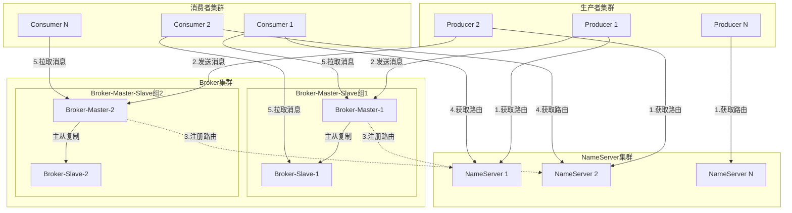
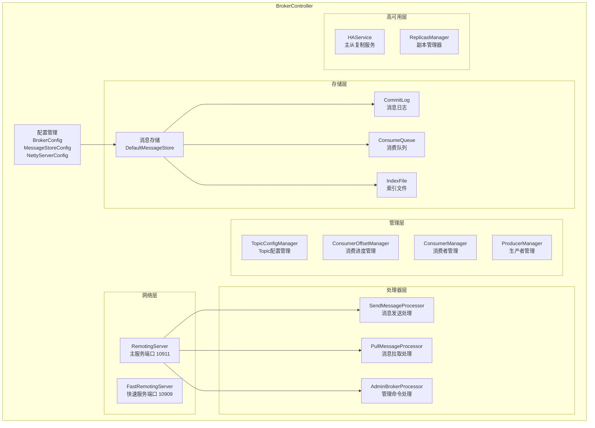
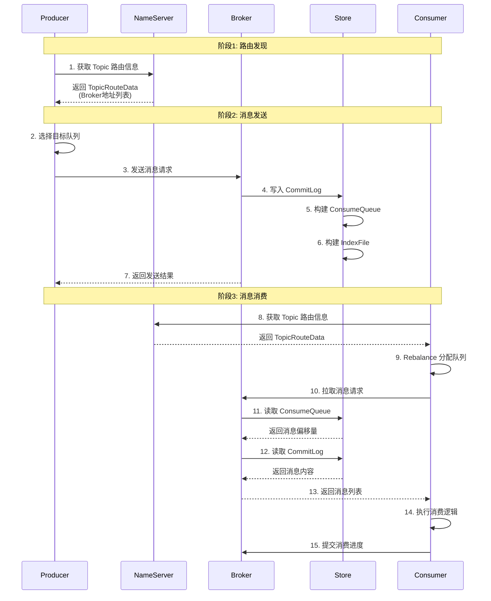
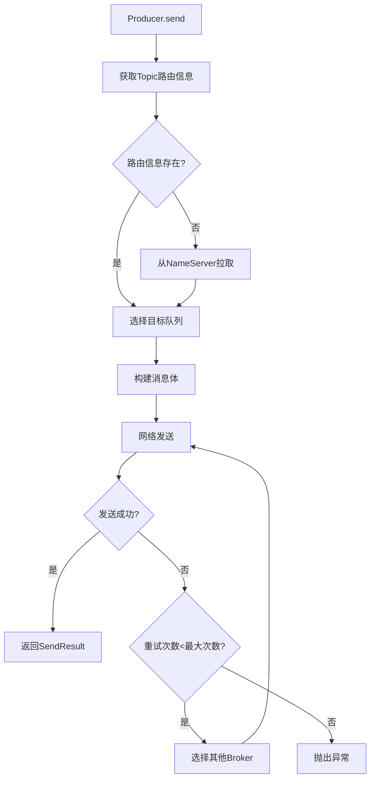
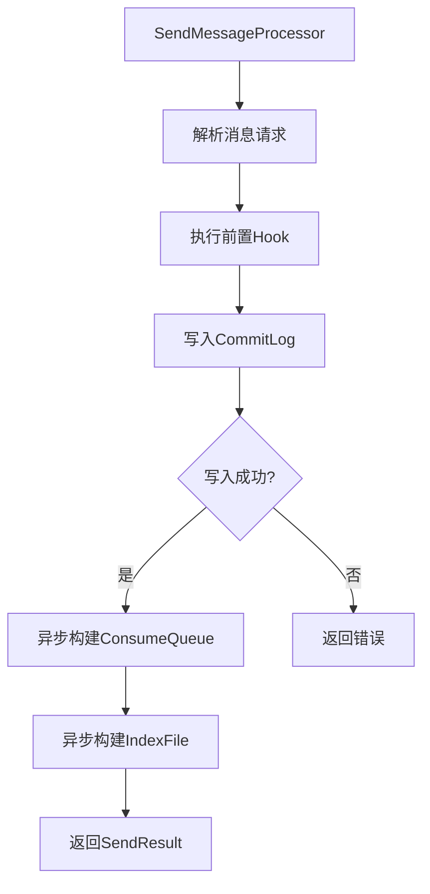
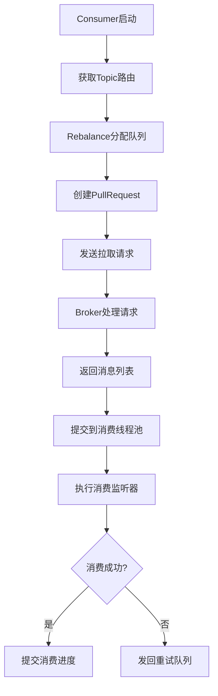
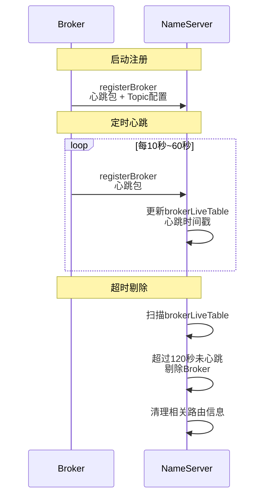
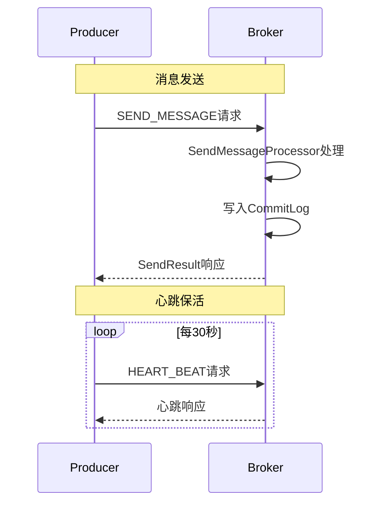
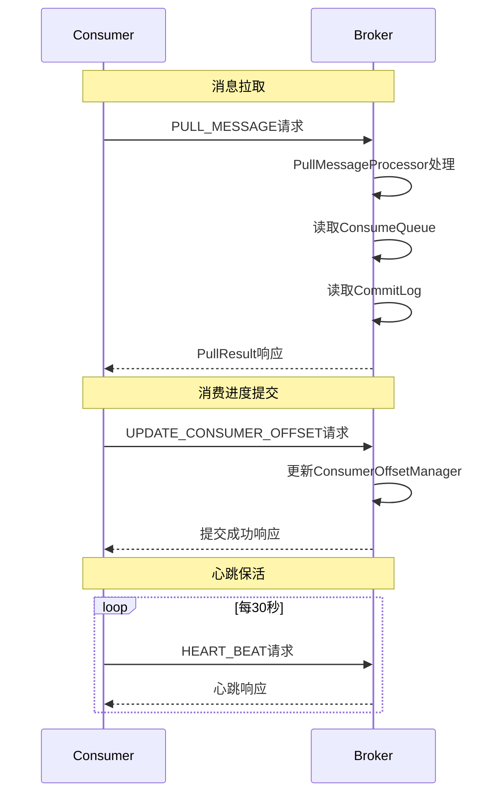
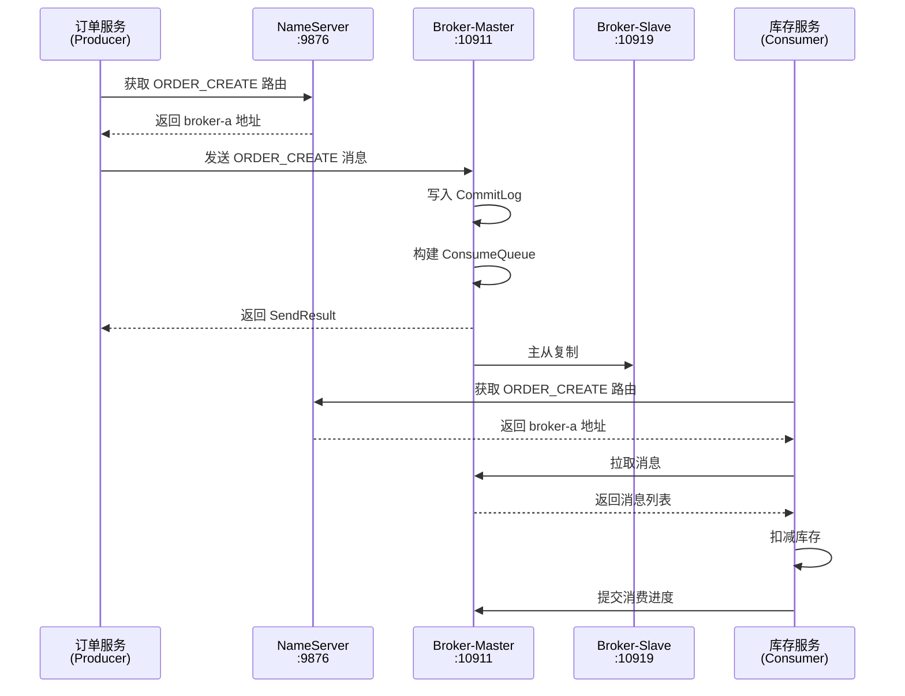

# RocketMQ 5.0.0 源码解读 - 整体架构与核心流程

> **文档版本**: v1.0  
> **生成时间**: 2026-02-19  
> **RocketMQ版本**: 5.0.0  
> **源码覆盖范围**: broker/BrokerStartup.java、broker/BrokerController.java、namesrv/*.java

---

## 一、模块定位与职责

### 1.1 模块定位

本文档是 RocketMQ 5.0.0 源码解读的**入口文档**，负责讲解整体架构设计、核心组件职责、消息全生命周期流转。作为后续所有模块文档的基础，帮助读者建立全局视角。

### 1.2 核心职责

| 职责项 | 说明 | 关联模块 |
|--------|------|----------|
| 架构设计 | 讲解四大核心组件职责与交互关系 | 全部模块 |
| 启动流程 | 解读 NameServer、Broker 启动过程 | 服务端管理 |
| 消息流转 | 讲解消息从发送到消费的完整生命周期 | 消息发送、消息消费、消息存储 |
| 组件交互 | 讲解 Producer、Broker、NameServer、Consumer 之间的协作机制 | 网络通信层 |

### 1.3 模块划分准则符合性

- **高内聚**: 聚焦架构设计与核心流程，无无关内容
- **低耦合**: 仅描述组件接口交互，不深入内部实现
- **数量足够小**: 单一文档覆盖架构与流程，不拆分过细

---

## 二、整体架构设计

### 2.1 架构概览

RocketMQ 采用**分布式集群架构**，由四个核心组件构成：



### 2.2 四大核心组件

| 组件 | 职责 | 核心类 | 默认端口 |
|------|------|--------|----------|
| **NameServer** | 路由注册中心，管理 Topic 路由信息 | [NamesrvStartup.java](namesrv/src/main/java/org/apache/rocketmq/namesrv/NamesrvStartup.java) | 9876 |
| **Broker** | 消息存储、转发、主从复制 | [BrokerStartup.java](broker/src/main/java/org/apache/rocketmq/broker/BrokerStartup.java) | 10911 |
| **Producer** | 消息发送、路由选择、重试机制 | [DefaultMQProducer.java](client/src/main/java/org/apache/rocketmq/client/producer/DefaultMQProducer.java) | - |
| **Consumer** | 消息消费、Rebalance、Offset管理 | [DefaultMQPushConsumer.java](client/src/main/java/org/apache/rocketmq/client/consumer/DefaultMQPushConsumer.java) | - |

### 2.3 NameServer 架构详解

NameServer 是 RocketMQ 的**路由注册中心**，类似于注册中心，但设计更轻量。

#### 2.3.1 核心数据结构

```java
// 文件路径: namesrv/src/main/java/org/apache/rocketmq/namesrv/routeinfo/RouteInfoManager.java

public class RouteInfoManager {
    // Topic -> BrokerName -> QueueData 映射表
    // 存储 Topic 的队列路由信息
    private final Map<String/* topic */, Map<String, QueueData>> topicQueueTable;
    
    // BrokerName -> BrokerData 映射表
    // 存储 Broker 地址信息（Master/Slave）
    private final Map<String/* brokerName */, BrokerData> brokerAddrTable;
    
    // ClusterName -> BrokerName 集合映射表
    // 存储集群下的所有 Broker
    private final Map<String/* clusterName */, Set<String/* brokerName */>> clusterAddrTable;
    
    // BrokerAddr -> BrokerLiveInfo 映射表
    // 存储 Broker 存活状态（心跳时间戳）
    private final Map<BrokerAddrInfo/* brokerAddr */, BrokerLiveInfo> brokerLiveTable;
}
```

#### 2.3.2 关键配置参数

| 参数名 | 默认值 | 说明 |
|--------|--------|------|
| `DEFAULT_BROKER_CHANNEL_EXPIRED_TIME` | 120000ms（注释：Broker心跳超时时间，单位：毫秒）= 2分钟（易读格式） | Broker 失效时间，超过此时间未收到心跳则剔除 |

#### 2.3.3 NameServer 启动流程

```mermaid
sequenceDiagram
    participant Main as main()
    participant Parse as parseCommandlineAndConfigFile
    participant Create as createAndStartNamesrvController
    participant Controller as NamesrvController
    participant Remoting as NettyRemotingServer
    
    Main->>Parse: 解析命令行参数和配置文件
    Parse->>Parse: 创建 NamesrvConfig
    Parse->>Parse: 创建 NettyServerConfig
    Parse->>Parse: 设置监听端口 9876
    
    Main->>Create: 创建并启动 Controller
    Create->>Controller: new NamesrvController()
    Create->>Controller: initialize()
    Controller->>Remoting: 创建 NettyRemotingServer
    Controller->>Controller: 注册处理器
    Create->>Controller: start()
    Controller->>Remoting: remotingServer.start()
    
    Main-->>Main: NameServer 启动完成
```

**源码解读**:

```java
// 文件路径: namesrv/src/main/java/org/apache/rocketmq/namesrv/NamesrvStartup.java

public static void main(String[] args) {
    main0(args);                              // 启动 NameServer
    controllerManagerMain();                  // 可选：启动 Controller 模式
}

public static void main0(String[] args) {
    try {
        parseCommandlineAndConfigFile(args);  // 步骤1: 解析配置
        createAndStartNamesrvController();    // 步骤2: 创建并启动
    } catch (Throwable e) {
        e.printStackTrace();
        System.exit(-1);
    }
}

public static void parseCommandlineAndConfigFile(String[] args) throws Exception {
    // 设置协议版本号
    System.setProperty(RemotingCommand.REMOTING_VERSION_KEY, Integer.toString(MQVersion.CURRENT_VERSION));
    
    // 创建配置对象
    namesrvConfig = new NamesrvConfig();
    nettyServerConfig = new NettyServerConfig();
    nettyClientConfig = new NettyClientConfig();
    
    // 设置默认监听端口: 9876（注释：NameServer默认监听端口）
    nettyServerConfig.setListenPort(9876);
    
    // 加载配置文件（如果指定了 -c 参数）
    if (commandLine.hasOption('c')) {
        String file = commandLine.getOptionValue('c');
        // ... 加载配置文件逻辑
    }
}
```

### 2.4 Broker 架构详解

Broker 是 RocketMQ 的**核心服务节点**，负责消息存储、转发、主从复制。

#### 2.4.1 Broker 核心组件



#### 2.4.2 Broker 启动流程

```mermaid
sequenceDiagram
    participant Main as BrokerStartup.main()
    participant Create as createBrokerController()
    participant Controller as BrokerController
    participant Start as start()
    participant Basic as startBasicService()
    
    Main->>Create: 创建 BrokerController
    Create->>Create: 解析命令行参数
    Create->>Create: 创建配置对象<br/>BrokerConfig<br/>NettyServerConfig<br/>MessageStoreConfig
    Create->>Controller: new BrokerController()
    Create->>Controller: initialize()
    Controller->>Controller: 初始化 MessageStore
    Controller->>Controller: 初始化网络组件
    Controller->>Controller: 注册处理器
    
    Main->>Start: controller.start()
    Start->>Basic: startBasicService()
    Basic->>Basic: messageStore.start()
    Basic->>Basic: remotingServer.start()
    Basic->>Basic: fastRemotingServer.start()
    Basic->>Basic: pullRequestHoldService.start()
    Basic->>Basic: clientHousekeepingService.start()
    
    Start->>Start: registerBrokerAll()<br/>向 NameServer 注册
    Start->>Start: 启动定时注册任务<br/>周期: 10秒~60秒
    
    Main-->>Main: Broker 启动完成
```

**源码解读**:

```java
// 文件路径: broker/src/main/java/org/apache/rocketmq/broker/BrokerStartup.java

public static void main(String[] args) {
    start(createBrokerController(args));  // 创建并启动 Broker
}

public static BrokerController createBrokerController(String[] args) {
    // 设置协议版本号
    System.setProperty(RemotingCommand.REMOTING_VERSION_KEY, Integer.toString(MQVersion.CURRENT_VERSION));
    
    // 创建配置对象
    final BrokerConfig brokerConfig = new BrokerConfig();
    final NettyServerConfig nettyServerConfig = new NettyServerConfig();
    final NettyClientConfig nettyClientConfig = new NettyClientConfig();
    
    // 设置默认监听端口: 10911（注释：Broker默认监听端口）
    nettyServerConfig.setListenPort(10911);
    
    final MessageStoreConfig messageStoreConfig = new MessageStoreConfig();
    
    // 加载配置文件（如果指定了 -c 参数）
    if (commandLine.hasOption('c')) {
        String file = commandLine.getOptionValue('c');
        properties = CONFIG_FILE_HELPER.loadConfig();
        MixAll.properties2Object(properties, brokerConfig);
        MixAll.properties2Object(properties, nettyServerConfig);
        MixAll.properties2Object(properties, messageStoreConfig);
    }
    
    // 创建 BrokerController
    final BrokerController controller = new BrokerController(
        brokerConfig,
        nettyServerConfig,
        nettyClientConfig,
        messageStoreConfig
    );
    
    // 初始化
    boolean initResult = controller.initialize();
    if (!initResult) {
        controller.shutdown();
        System.exit(-3);
    }
    
    return controller;
}

public static BrokerController start(BrokerController controller) {
    try {
        controller.start();
        log.info("The broker[" + controller.getBrokerConfig().getBrokerName() + ", "
            + controller.getBrokerAddr() + "] boot success.");
        return controller;
    } catch (Throwable e) {
        e.printStackTrace();
        System.exit(-1);
    }
    return null;
}
```

#### 2.4.3 Broker 核心服务启动

```java
// 文件路径: broker/src/main/java/org/apache/rocketmq/broker/BrokerController.java

protected void startBasicService() throws Exception {
    // 1. 启动消息存储服务
    if (this.messageStore != null) {
        this.messageStore.start();
    }
    
    // 2. 启动定时消息存储服务
    if (this.timerMessageStore != null) {
        this.timerMessageStore.start();
    }
    
    // 3. 启动副本管理器（高可用）
    if (this.replicasManager != null) {
        this.replicasManager.start();
    }
    
    // 4. 启动主 RemotingServer（端口 10911）
    if (this.remotingServer != null) {
        this.remotingServer.start();
    }
    
    // 5. 启动快速 RemotingServer（端口 10909）
    if (this.fastRemotingServer != null) {
        this.fastRemotingServer.start();
    }
    
    // 6. 启动 Pull 请求长轮询服务
    if (this.pullRequestHoldService != null) {
        this.pullRequestHoldService.start();
    }
    
    // 7. 启动客户端保活服务
    if (this.clientHousekeepingService != null) {
        this.clientHousekeepingService.start();
    }
    
    // 8. 启动 Broker 统计服务
    if (this.brokerStatsManager != null) {
        this.brokerStatsManager.start();
    }
    
    // 9. 启动快速失败处理服务
    if (this.brokerFastFailure != null) {
        this.brokerFastFailure.start();
    }
}

public void start() throws Exception {
    // 计算启动完成时间
    this.shouldStartTime = System.currentTimeMillis() + messageStoreConfig.getDisappearTimeAfterStart();
    
    // 启动对外 API 客户端
    if (this.brokerOuterAPI != null) {
        this.brokerOuterAPI.start();
    }
    
    // 启动核心服务
    startBasicService();
    
    // 向 NameServer 注册（首次注册）
    if (!isIsolated && !this.messageStoreConfig.isEnableDLegerCommitLog()) {
        this.registerBrokerAll(true, false, true);
    }
    
    // 启动定时注册任务
    // 周期: 10000ms~60000ms（注释：Broker向NameServer注册周期，单位：毫秒）= 10秒~60秒（易读格式）
    scheduledFutures.add(this.scheduledExecutorService.scheduleAtFixedRate(
        new AbstractBrokerRunnable(this.getBrokerIdentity()) {
            @Override
            public void run2() {
                try {
                    BrokerController.this.registerBrokerAll(true, false, brokerConfig.isForceRegister());
                } catch (Throwable e) {
                    BrokerController.LOG.error("registerBrokerAll Exception", e);
                }
            }
        }, 
        10000,  // 初始延迟: 10000ms（注释：首次注册延迟时间，单位：毫秒）= 10秒（易读格式）
        Math.max(10000, Math.min(brokerConfig.getRegisterNameServerPeriod(), 60000)),  // 周期
        TimeUnit.MILLISECONDS
    ));
}
```

---

## 三、消息全生命周期

### 3.1 消息流转全景图



### 3.2 阶段详解

#### 3.2.1 阶段1: 路由发现

Producer/Consumer 启动时，从 NameServer 获取 Topic 路由信息：

```java
// 路由信息结构
public class TopicRouteData {
    // Topic 队列信息列表
    private List<QueueData> queueDatas;
    
    // Broker 地址信息列表
    private List<BrokerData> brokerDatas;
}

public class QueueData {
    private String brokerName;      // Broker 名称
    private int readQueueNums;      // 读队列数量
    private int writeQueueNums;     // 写队列数量
    private int perm;               // 权限（读/写）
}

public class BrokerData {
    private String brokerName;                      // Broker 名称
    private HashMap<Long/* brokerId */, String/* brokerAddr */> brokerAddrs;  // Broker 地址映射
    // brokerId = 0 表示 Master，brokerId > 0 表示 Slave
}
```

#### 3.2.2 阶段2: 消息发送

Producer 发送消息的核心流程：



详细流程请参考《03-消息发送流程源码解析.md》。

#### 3.2.3 阶段3: 消息存储

Broker 接收消息后的存储流程：



详细流程请参考《02-消息存储引擎源码解析.md》。

#### 3.2.4 阶段4: 消息消费

Consumer 消费消息的核心流程：



详细流程请参考《04-消息消费流程源码解析.md》。

---

## 四、核心组件交互

### 4.1 Broker 与 NameServer 交互



**关键源码**:

```java
// 文件路径: namesrv/src/main/java/org/apache/rocketmq/namesrv/routeinfo/RouteInfoManager.java

// Broker 心跳超时时间
private final static long DEFAULT_BROKER_CHANNEL_EXPIRED_TIME = 1000 * 60 * 2;  
// 120000ms（注释：Broker心跳超时时间，单位：毫秒）= 2分钟（易读格式）

// Broker 注册方法
public RegisterBrokerResult registerBroker(
    String clusterName,
    String brokerAddr,
    String brokerName,
    long brokerId,
    String haServerAddr,
    TopicConfigSerializeWrapper topicConfigWrapper,
    List<String> filterServerList,
    Channel channel
) {
    // 1. 更新集群信息
    Set<String> brokerNames = this.clusterAddrTable.get(clusterName);
    if (null == brokerNames) {
        brokerNames = new HashSet<String>();
        this.clusterAddrTable.put(clusterName, brokerNames);
    }
    brokerNames.add(brokerName);
    
    // 2. 更新 Broker 地址信息
    BrokerData brokerData = this.brokerAddrTable.get(brokerName);
    if (null == brokerData) {
        brokerData = new BrokerData(clusterName, brokerName);
        this.brokerAddrTable.put(brokerName, brokerData);
    }
    brokerData.getBrokerAddrs().put(brokerId, brokerAddr);
    
    // 3. 更新 Broker 存活信息
    BrokerLiveInfo prevBrokerLiveInfo = this.brokerLiveTable.put(
        new BrokerAddrInfo(clusterName, brokerAddr),
        new BrokerLiveInfo(
            System.currentTimeMillis(),           // 心跳时间戳
            topicConfigWrapper.getDataVersion(),  // 数据版本
            channel,                              // 网络通道
            haServerAddr                          // HA服务地址
        )
    );
    
    // 4. 更新 Topic 路由信息
    if (null != topicConfigWrapper && null != topicConfigWrapper.getTopicConfigTable()) {
        for (Map.Entry<String, TopicConfig> entry : topicConfigWrapper.getTopicConfigTable().entrySet()) {
            this.createAndUpdateQueueData(brokerName, entry.getValue());
        }
    }
    
    return result;
}
```

### 4.2 Producer 与 Broker 交互



### 4.3 Consumer 与 Broker 交互



---

## 五、电商订单系统示例

基于《01-统一示例.md》中的电商订单场景，展示整体架构应用。

### 5.1 集群部署架构

```
┌─────────────────────────────────────────────────────────────────┐
│                        电商订单系统集群                           │
├─────────────────────────────────────────────────────────────────┤
│                                                                 │
│  ┌──────────────┐    ┌──────────────┐    ┌──────────────┐      │
│  │ 订单服务-P1  │    │ 支付服务-P2  │    │ 库存服务-P3  │      │
│  │ (Producer)   │    │ (Producer)   │    │ (Consumer)   │      │
│  └──────┬───────┘    └──────┬───────┘    └──────┬───────┘      │
│         │                   │                   │              │
│         └───────────────────┼───────────────────┘              │
│                             │                                   │
│              ┌──────────────▼──────────────┐                   │
│              │     NameServer 集群          │                   │
│              │  ┌───────┐  ┌───────┐       │                   │
│              │  │ NS-1  │  │ NS-2  │       │                   │
│              │  │:9876  │  │:9876  │       │                   │
│              │  └───────┘  └───────┘       │                   │
│              └──────────────┬──────────────┘                   │
│                             │                                   │
│              ┌──────────────▼──────────────┐                   │
│              │     Broker 集群              │                   │
│              │  ┌─────────────────────┐    │                   │
│              │  │ Broker-Master       │    │                   │
│              │  │ broker-a:10911      │    │                   │
│              │  └──────────┬──────────┘    │                   │
│              │             │ 主从复制       │                   │
│              │  ┌──────────▼──────────┐    │                   │
│              │  │ Broker-Slave        │    │                   │
│              │  │ broker-a:10919      │    │                   │
│              │  └─────────────────────┘    │                   │
│              └─────────────────────────────┘                   │
│                                                                 │
└─────────────────────────────────────────────────────────────────┘
```

### 5.2 Topic 路由信息示例

当订单服务发送 `ORDER_CREATE` 消息时，从 NameServer 获取的路由信息：

```json
{
  "topicRouteData": {
    "queueDatas": [
      {
        "brokerName": "broker-a",
        "readQueueNums": 8,
        "writeQueueNums": 8,
        "perm": 6
      }
    ],
    "brokerDatas": [
      {
        "brokerName": "broker-a",
        "brokerAddrs": {
          "0": "192.168.1.100:10911",
          "1": "192.168.1.101:10919"
        }
      }
    ]
  }
}
```

### 5.3 消息流转示例



---

## 六、生产实践指南

### 6.1 集群规划建议

| 场景 | NameServer 数量 | Broker 数量 | 说明 |
|------|-----------------|-------------|------|
| 开发测试 | 1 个 | 1 个 Master | 单机部署，快速验证 |
| 小规模生产 | 2 个 | 1 主 1 从 | 高可用，无单点故障 |
| 中等规模 | 3 个 | 2 主 2 从 | 负载均衡，高可用 |
| 大规模 | 3+ 个 | 多主多从 | 水平扩展，高吞吐 |

### 6.2 关键配置参数

#### 6.2.1 NameServer 配置

| 参数 | 默认值 | 说明 |
|------|--------|------|
| `listenPort` | 9876 | 监听端口 |
| `kvConfigPath` | 用户目录下 | KV 配置存储路径 |

#### 6.2.2 Broker 配置

| 参数 | 默认值 | 说明 |
|------|--------|------|
| `brokerName` | 本机主机名 | Broker 名称 |
| `brokerClusterName` | DefaultCluster | 集群名称 |
| `brokerId` | 0（Master） | Broker ID，0 表示 Master |
| `namesrvAddr` | 无 | NameServer 地址列表 |
| `listenPort` | 10911 | 监听端口 |
| `haListenPort` | 10912 | HA 服务端口 |
| `brokerRole` | ASYNC_MASTER | Broker 角色 |
| `flushDiskType` | ASYNC_FLUSH | 刷盘方式 |

### 6.3 避坑指南

#### 6.3.1 NameServer 避坑

| 问题 | 原因 | 解决方案 |
|------|------|----------|
| 路由信息不一致 | 多 NameServer 数据未同步 | NameServer 无状态，Broker 同时向所有 NameServer 注册 |
| Broker 频繁上下线 | 网络抖动或 GC 停顿 | 调整 `brokerHeartbeatInterval` 参数 |

#### 6.3.2 Broker 避坑

| 问题 | 原因 | 解决方案 |
|------|------|----------|
| 启动失败 | 端口被占用 | 检查端口占用，修改 `listenPort` |
| 无法连接 NameServer | 地址配置错误 | 检查 `namesrvAddr` 配置格式 |
| 主从同步延迟 | 网络带宽不足 | 优化网络配置，启用压缩 |

#### 6.3.3 常见启动问题排查

```bash
# 检查 NameServer 是否启动
netstat -an | grep 9876

# 检查 Broker 是否启动
netstat -an | grep 10911

# 查看 Broker 日志
tail -f ~/logs/rocketmqlogs/broker.log

# 查看 NameServer 日志
tail -f ~/logs/rocketmqlogs/namesrv.log
```

---

## 七、模块总结

### 7.1 核心要点回顾

1. **架构设计**: RocketMQ 由 NameServer、Broker、Producer、Consumer 四大组件构成，NameServer 负责路由管理，Broker 负责消息存储和转发

2. **启动流程**: NameServer 先启动，Broker 启动后向 NameServer 注册路由信息，并定时发送心跳

3. **消息流转**: 消息从 Producer 发送到 Broker 存储，再到 Consumer 消费，完整生命周期包括路由发现、消息发送、消息存储、消息消费四个阶段

4. **组件交互**: Broker 与 NameServer 通过心跳机制保持连接，Producer/Consumer 与 Broker 通过网络通信进行消息收发

### 7.2 后续模块导航

| 模块 | 内容 | 链接 |
|------|------|------|
| 消息存储引擎 | CommitLog、ConsumeQueue、IndexFile 源码解析 | [02-消息存储引擎源码解析.md](02-消息存储引擎源码解析.md) |
| 消息发送流程 | Producer 发送机制、路由选择、重试机制 | [03-消息发送流程源码解析.md](03-消息发送流程源码解析.md) |
| 消息消费流程 | Consumer 消费机制、Rebalance、Offset 管理 | [04-消息消费流程源码解析.md](04-消息消费流程源码解析.md) |
| 高可用与主从复制 | HA 服务、主从同步、DLedger 模式 | [05-高可用与主从复制源码解析.md](05-高可用与主从复制源码解析.md) |
| 网络通信层 | Remoting 抽象层、Netty 实现 | [06-网络通信层源码解析.md](06-网络通信层源码解析.md) |

---

> **核对标识**: 已完成输出前核对，符合本技能所有既定要求（仅第2、3步添加跳转链接）
