# 线程与并发

> **关联文档**：Reactor模式的详细实现原理请参阅 [04-IO多路复用.md](04-IO多路复用.md)，线程等待唤醒的应用场景请参阅 [06-中断与信号.md](06-中断与信号.md)。

## 1. 概述

线程是CPU调度的基本单位，并发编程是高性能分布式系统的核心技术。Linux内核通过`task_struct`结构体统一管理进程和线程，线程本质是共享地址空间的轻量级进程(LWP)。RocketMQ作为高吞吐量的消息中间件，在并发编程方面有丰富的实践，包括：

- **线程生命周期管理**：通过ServiceThread统一管理后台服务线程
- **高效同步机制**：基于futex和CAS实现轻量级同步
- **灵活锁策略**：自旋锁、可重入锁、分段锁按场景选择
- **线程池监控**：ThreadPoolMonitor实现线程池状态监控和告警
- **Reactor网络模型**：三级线程组处理高并发网络请求

本文将从操作系统原理出发，深入分析RocketMQ的并发编程实践。

## 2. 进程与线程基础

### 2.1 进程与线程概念

#### 进程定义与特征

**进程(Process)** 是操作系统资源分配的基本单位，是程序在执行过程中的一个实例。每个进程拥有独立的地址空间和系统资源。

**进程特征**：

| 特征 | 说明 |
|------|------|
| 独立地址空间 | 每个进程拥有独立的虚拟地址空间，互不干扰 |
| 独立资源 | 文件描述符表、信号处理、工作目录等资源独立 |
| 隔离性 | 进程间通信需要通过IPC机制（管道、共享内存、套接字等） |
| 创建开销 | fork()创建进程需要复制父进程资源，开销较大 |

#### 线程定义与特征

**线程(Thread)** 是CPU调度的基本单位，是进程内的执行流。同一进程内的多个线程共享进程资源，但拥有独立的执行栈和寄存器状态。

**线程特征**：

| 特征 | 说明 |
|------|------|
| 共享地址空间 | 同一进程内的线程共享虚拟地址空间 |
| 共享资源 | 共享文件描述符、信号处理、堆内存等 |
| 独立执行流 | 每个线程拥有独立的栈、程序计数器、寄存器状态 |
| 创建开销 | pthread_create()创建线程开销远小于进程创建 |

#### 进程与线程对比

| 对比维度 | 进程 | 线程 |
|---------|------|------|
| 资源分配 | 独立地址空间和资源 | 共享进程资源 |
| 调度单位 | 不是调度单位 | CPU调度的基本单位 |
| 通信方式 | IPC（管道、共享内存、套接字） | 共享内存、锁、条件变量 |
| 创建开销 | 大（需复制资源） | 小（仅分配栈和寄存器） |
| 上下文切换 | 大（需切换页表） | 小（仅切换寄存器和栈） |
| 隔离性 | 高（地址空间隔离） | 低（共享地址空间） |
| 健壮性 | 高（一个进程崩溃不影响其他进程） | 低（一个线程崩溃可能导致整个进程退出） |

#### 轻量级进程(LWP)

Linux采用"统一进程/线程模型"，线程在内核中被称为**轻量级进程(LWP，Light Weight Process)**，与进程使用相同的数据结构`task_struct`描述，区别在于资源共享粒度。

**设计思想**：
- 进程拥有独立的地址空间、文件描述符表、信号处理等资源
- 线程共享同一进程的资源，仅拥有独立的栈和寄存器状态
- 通过`clone()`系统调用的flags参数控制资源共享粒度

**clone()系统调用flags参数**：

| flags参数 | 说明 | 用途 |
|----------|------|------|
| `CLONE_VM` | 共享地址空间 | 创建线程 |
| `CLONE_FS` | 共享文件系统信息 | 共享根目录、工作目录 |
| `CLONE_FILES` | 共享文件描述符表 | 共享打开的文件 |
| `CLONE_SIGHAND` | 共享信号处理 | 共享信号处理函数 |
| `CLONE_THREAD` | 加入同一线程组 | 共享tgid |

### 2.2 内核数据结构

`task_struct`是Linux内核中最核心的数据结构，定义在`include/linux/sched.h`：

```c
struct task_struct {
    volatile long state;        // 进程状态：TASK_RUNNING等
    void *stack;                // 内核栈指针
    struct mm_struct *mm;       // 用户空间内存描述符
    struct mm_struct *active_mm;// 内核线程借用的内存描述符
    
    pid_t pid;                  // 进程/线程唯一标识符
    pid_t tgid;                 // 线程组ID（主线程pid）
    struct task_struct *parent; // 父进程指针
    struct list_head children;  // 子进程链表
    struct list_head sibling;   // 兄弟进程链表
    
    struct fs_struct *fs;       // 文件系统信息（根目录、工作目录）
    struct files_struct *files; // 打开文件表
    struct nsproxy *nsproxy;    // 命名空间代理
    
    struct signal_struct *signal;    // 信号处理
    struct sighand_struct *sighand;  // 信号处理函数表
    sigset_t blocked;                 // 阻塞信号集
    
    int prio, static_prio, normal_prio; // 调度优先级
    unsigned int rt_priority;           // 实时优先级
    const struct sched_class *sched_class; // 调度类
    struct sched_entity se;             // CFS调度实体
    struct sched_rt_entity rt;          // 实时调度实体
    
    cputime_t utime, stime;            // 用户态/内核态CPU时间
    unsigned long nvcsw, nivcsw;       // 自愿/非自愿上下文切换次数
    
    char comm[TASK_COMM_LEN];          // 进程名称（最长16字节）
};
```

**task_struct关键字段详解**：

| 字段 | 类型 | 说明 | 用途 |
|------|------|------|------|
| `state` | volatile long | 进程状态 | 调度器判断进程是否可运行 |
| `pid` | pid_t | 进程/线程ID | 全局唯一标识符 |
| `tgid` | pid_t | 线程组ID | 同一线程组的线程共享tgid |
| `mm` | mm_struct* | 内存描述符 | 管理进程地址空间 |
| `files` | files_struct* | 打开文件表 | 管理文件描述符 |
| `fs` | fs_struct* | 文件系统信息 | 根目录、工作目录 |
| `prio` | int | 动态优先级 | 调度器使用 |
| `se` | sched_entity | CFS调度实体 | 红黑树节点，包含vruntime |
| `utime/stime` | cputime_t | CPU时间 | 用户态/内核态运行时间 |
| `nvcsw/nivcsw` | unsigned long | 上下文切换次数 | 性能分析指标 |

#### 系统调用接口

| 系统调用 | 参数 | 返回值 | 说明 |
|----------|------|--------|------|
| `getpid()` | 无 | pid_t | 返回进程ID（tgid） |
| `gettid()` | 无 | pid_t | 返回线程ID（pid） |
| `clone()` | flags, stack, ... | pid_t | 创建线程/进程，flags控制资源共享 |
| `fork()` | 无 | pid_t | 创建进程，复制父进程资源 |
| `execve()` | filename, argv, envp | int | 加载新程序 |

#### 内核参数

| 参数路径 | 默认值 | 说明 |
|----------|--------|------|
| `/proc/sys/kernel/pid_max` | 32768 | 最大PID值 |
| `/proc/sys/kernel/threads-max` | 依赖内存 | 系统最大线程数 |
| `/proc/sys/vm/max_map_count` | 65530 | 最大内存映射数量 |

### 2.3 进程状态与转换

**Linux内核进程/线程状态定义**（`include/linux/sched.h`）：

| 状态 | 值 | 说明 | 触发条件 |
|------|-----|------|---------|
| `TASK_RUNNING` | 0 | 运行态，正在运行或等待CPU调度 | 获得CPU时间片 |
| `TASK_INTERRUPTIBLE` | 1 | 可中断睡眠，等待事件，可被信号唤醒 | 等待I/O、锁、信号量 |
| `TASK_UNINTERRUPTIBLE` | 2 | 不可中断睡眠，只能被事件唤醒 | 等待磁盘I/O完成 |
| `TASK_ZOMBIE` | 4 | 僵尸态，进程已终止但父进程未回收 | 进程exit()后 |
| `TASK_STOPPED` | 8 | 停止态，被信号暂停 | SIGSTOP、SIGTSTP信号 |
| `TASK_TRACED` | 16 | 跟踪态，被调试器跟踪 | ptrace()系统调用 |

**两种核心睡眠状态对比**：

| 对比维度 | TASK_INTERRUPTIBLE | TASK_UNINTERRUPTIBLE |
|---------|-------------------|---------------------|
| 状态值 | 1 | 2 |
| 唤醒方式 | 事件发生或收到信号 | 仅事件发生 |
| 信号响应 | ✅ 响应所有信号 | ❌ 不响应任何信号 |
| top显示 | S (Sleeping) | D (Disk Sleep) |
| 典型场景 | 网络I/O、锁等待、定时等待 | 磁盘I/O、内存换页 |

**状态转换关系**：

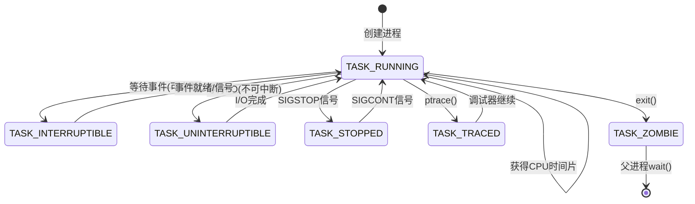
```mermaid
stateDiagram-v2
    [*] --> TASK_RUNNING: 创建进程
    TASK_RUNNING --> TASK_RUNNING: 获得CPU时间片
    TASK_RUNNING --> TASK_INTERRUPTIBLE: 等待事件(可中断)
    TASK_RUNNING --> TASK_UNINTERRUPTIBLE: 等待I/O(不可中断)
    TASK_RUNNING --> TASK_STOPPED: SIGSTOP信号
    TASK_RUNNING --> TASK_TRACED: ptrace()
    TASK_INTERRUPTIBLE --> TASK_RUNNING: 事件就绪/信号
    TASK_UNINTERRUPTIBLE --> TASK_RUNNING: I/O完成
    TASK_STOPPED --> TASK_RUNNING: SIGCONT信号
    TASK_TRACED --> TASK_RUNNING: 调试器继续
    TASK_RUNNING --> TASK_ZOMBIE: exit()
    TASK_ZOMBIE --> [*]: 父进程wait()
```

**图表核心结论**：Linux线程以TASK_RUNNING为核心枢纽，在运行、等待、停止、终止四种状态间流转，其中TASK_INTERRUPTIBLE和TASK_UNINTERRUPTIBLE是两种关键的睡眠状态。

**关键概念**：

- **TASK_RUNNING**：唯一可被CPU执行的状态，包含"正在运行"和"就绪等待调度"两种情况
- **TASK_INTERRUPTIBLE vs TASK_UNINTERRUPTIBLE**：前者可被信号唤醒（如网络I/O），后者只能等待事件完成（如磁盘I/O），避免关键操作被中断
- **TASK_ZOMBIE**：线程已终止但资源未回收，父进程需调用wait()避免僵尸进程累积

### 2.4 进程调度原理

#### CFS调度器原理

Linux使用**CFS(Completely Fair Scheduler，完全公平调度器)**作为默认调度器，核心思想是"公平分配CPU时间"。每个进程维护一个`vruntime`（虚拟运行时间），调度器优先选择`vruntime`最小的进程运行。

**设计思想**：
- 红黑树维护就绪队列，按`vruntime`排序
- `vruntime`小的进程在树左侧，优先被调度
- 运行时间与进程优先级成反比：优先级越高，`vruntime`增长越慢
- 支持实时调度类(SCHED_FIFO/SCHED_RR)和普通调度类(SCHED_NORMAL)

#### 内核数据结构

```c
// CFS调度器核心数据结构
struct cfs_rq {
    struct rb_root tasks_timeline;     // 红黑树根节点
    struct rb_node *rb_leftmost;       // 最左节点（vruntime最小）
    unsigned int nr_running;           // 就绪进程数
    u64 min_vruntime;                  // 最小vruntime基准
    
    struct sched_entity *curr;         // 当前运行的调度实体
    struct sched_entity *next;         // 下一个待运行实体
};

// 调度实体（嵌入在task_struct中）
struct sched_entity {
    struct rb_node run_node;           // 红黑树节点
    u64 vruntime;                      // 虚拟运行时间
    u64 sum_exec_runtime;              // 累计执行时间
    u64 prev_sum_exec_runtime;         // 上次累计执行时间
    struct cfs_rq *cfs_rq;             // 所属CFS队列
};
```

#### 处理流程

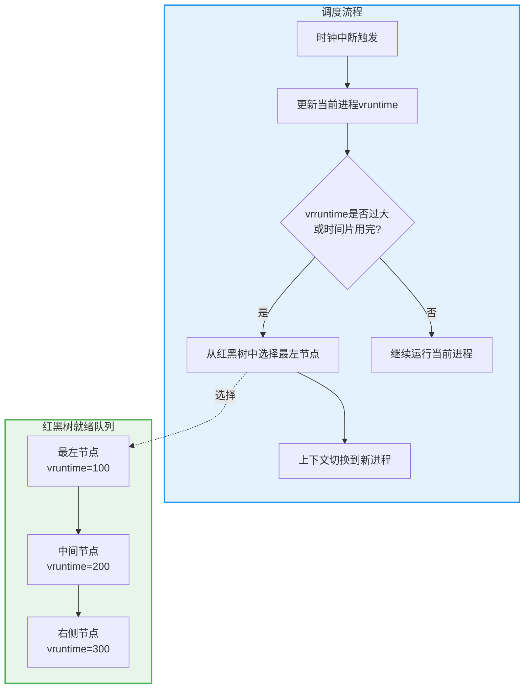
```mermaid
flowchart TD
    subgraph Schedule["调度流程"]
        direction TB
        S1["时钟中断触发"] --> S2["更新当前进程vruntime"]
        S2 --> S3{"vrruntime是否过大<br/>或时间片用完?"}
        S3 -->|"是"| S4["从红黑树中选择最左节点"]
        S3 -->|"否"| S5["继续运行当前进程"]
        S4 --> S6["上下文切换到新进程"]
    end
    
    subgraph RBTree["红黑树就绪队列"]
        direction TB
        R1["最左节点<br/>vruntime=100"] --> R2["中间节点<br/>vruntime=200"]
        R2 --> R3["右侧节点<br/>vruntime=300"]
    end
    
    S4 -.->|"选择"| R1
    
    %% 样式定义
    style Schedule fill:#e3f2fd,stroke:#2196f3,stroke-width:2px
    style RBTree fill:#e8f5e9,stroke:#4caf50,stroke-width:2px
```

**图表核心结论**：CFS调度器通过红黑树维护就绪队列，优先调度vruntime最小的进程，实现公平的CPU时间分配。

**调度类层次**：

| 调度类 | 策略 | 优先级范围 | 说明 |
|--------|------|-----------|------|
| `stop_sched_class` | SCHED_STOP | 最高 | CPU停止任务，内部使用 |
| `dl_sched_class` | SCHED_DEADLINE | -1~97 | 截止时间调度 |
| `rt_sched_class` | SCHED_FIFO/SCHED_RR | 0~99 | 实时调度 |
| `fair_sched_class` | SCHED_NORMAL | 100~139 | CFS公平调度（默认） |
| `idle_sched_class` | SCHED_IDLE | 最低 | 空闲任务 |

#### 内核参数

| 参数路径 | 默认值 | 说明 |
|----------|--------|------|
| `/proc/sys/kernel/sched_min_granularity_ns` | 4000000 | 最小调度粒度（4ms） |
| `/proc/sys/kernel/sched_wakeup_granularity_ns` | 4000000 | 唤醒抢占粒度（4ms） |
| `/proc/sys/kernel/sched_latency_ns` | 20000000 | 目标调度延迟（20ms） |
| `/proc/sys/kernel/sched_nr_migrate` | 32 | 负载均衡迁移任务数 |

### 2.5 上下文切换

#### 切换原理

**上下文切换**是操作系统实现多任务的核心机制，包括保存旧进程状态、切换内核栈和页表、加载新进程状态。每次切换约消耗1-10微秒。

**切换内容**：
- **CPU寄存器**：通用寄存器、程序计数器(PC)、栈指针(SP)
- **内核栈**：每个进程有独立的内核栈（8KB或16KB）
- **页表基址**：CR3寄存器，切换地址空间
- **浮点/向量寄存器**：延迟保存(Lazy FPU)

#### 处理流程

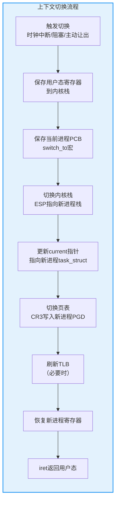
```mermaid
flowchart TD
    subgraph ContextSwitch["上下文切换流程"]
        direction TB
        C1["触发切换<br/>时钟中断/阻塞/主动让出"] --> C2["保存用户态寄存器<br/>到内核栈"]
        C2 --> C3["保存当前进程PCB<br/>switch_to宏"]
        C3 --> C4["切换内核栈<br/>ESP指向新进程栈"]
        C4 --> C5["更新current指针<br/>指向新进程task_struct"]
        C5 --> C6["切换页表<br/>CR3写入新进程PGD"]
        C6 --> C7["刷新TLB<br/>（必要时）"]
        C7 --> C8["恢复新进程寄存器"]
        C8 --> C9["iret返回用户态"]
    end
    
    %% 样式定义
    style ContextSwitch fill:#e3f2fd,stroke:#2196f3,stroke-width:2px
```

**图表核心结论**：上下文切换涉及寄存器保存、内核栈切换、页表切换三个核心步骤，其中页表切换和TLB刷新开销最大。

**switch_to宏核心逻辑**：

```c
// arch/x86/include/asm/switch_to.h
#define switch_to(prev, next, last)               \
do {                                              \
    ((last) = __switch_to((prev), (next)));       \
} while (0)

// __switch_to汇编实现
// 1. 保存当前进程寄存器
// 2. 切换内核栈
// 3. 加载新进程寄存器
```

#### 性能特征

| 操作 | 开销 | 说明 |
|------|------|------|
| 寄存器保存/恢复 | ~100ns | 通用寄存器 |
| 内核栈切换 | ~200ns | ESP指针更新 |
| 页表切换(CR3) | ~500ns | 写入新进程PGD |
| TLB刷新 | ~1-5μs | 进程切换时可能需要 |
| 总开销 | **1-10μs** | 取决于CPU架构和缓存状态 |

#### 调试方法

```bash
# 查看进程上下文切换次数
cat /proc/[pid]/status | grep ctxt

# 输出示例：
# voluntary_ctxt_switches:    150      # 自愿切换（等待I/O等）
# nonvoluntary_ctxt_switches: 50       # 非自愿切换（被抢占）

# 使用perf分析上下文切换
perf stat -e context-switches -p [pid] sleep 10

# 使用perf record记录切换详情
perf record -e sched:sched_switch -p [pid] sleep 10
perf report
```

### 2.6 Java线程模型

#### Java线程与Linux线程映射

Java线程在Linux系统中映射为轻量级进程(LWP)，JVM通过pthread库创建线程：

| Java状态 | Linux状态 | 说明 |
|---------|----------|------|
| RUNNABLE | TASK_RUNNING | 可运行状态 |
| BLOCKED | TASK_INTERRUPTIBLE | 等待monitor锁 |
| WAITING | TASK_INTERRUPTIBLE | 无限等待 |
| TIMED_WAITING | TASK_INTERRUPTIBLE | 计时等待 |
| TERMINATED | TASK_ZOMBIE | 终止状态 |

#### Java线程状态转换

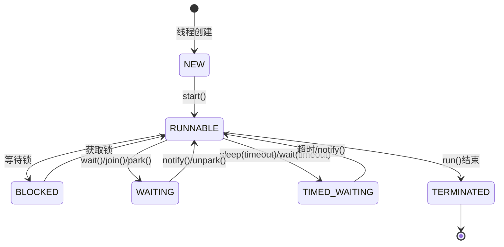
```mermaid
stateDiagram-v2
    [*] --> NEW: 线程创建
    NEW --> RUNNABLE: start()
    RUNNABLE --> BLOCKED: 等待锁
    RUNNABLE --> WAITING: wait()/join()/park()
    RUNNABLE --> TIMED_WAITING: sleep(timeout)/wait(timeout)
    BLOCKED --> RUNNABLE: 获取锁
    WAITING --> RUNNABLE: notify()/unpark()
    TIMED_WAITING --> RUNNABLE: 超时/notify()
    RUNNABLE --> TERMINATED: run()结束
    TERMINATED --> [*]
```

**图表核心结论**：Java线程以RUNNABLE为唯一活跃状态，通过synchronized锁、Object.wait()、Thread.sleep()等方法在6种状态间转换，所有等待状态最终都回归RUNNABLE才能继续执行。

**关键概念**：

- **RUNNABLE**：Java中唯一"活跃"状态，对应Linux的TASK_RUNNING，包含"正在执行"和"等待CPU调度"
- **BLOCKED vs WAITING**：BLOCKED是等待synchronized锁，WAITING是主动等待（如Object.wait()）
- **WAITING vs TIMED_WAITING**：前者无限等待需显式唤醒，后者有超时机制

#### 守护线程

**守护线程(Daemon Thread)** 是为其他线程提供服务的后台线程，JVM退出时不等待守护线程完成：

| 线程类型 | JVM退出行为 | 典型用途 |
|---------|------------|---------|
| 用户线程 | 等待所有用户线程结束 | 业务逻辑执行 |
| 守护线程 | 不等待，直接退出 | GC(Garbage Collection，垃圾回收)、监控、心跳 |

**用户线程 vs 守护线程对比**：

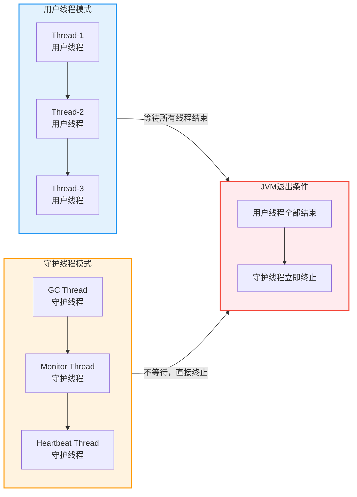
```mermaid
flowchart LR
    subgraph UserThread["用户线程模式"]
        direction TB
        U1["Thread-1<br/>用户线程"]
        U2["Thread-2<br/>用户线程"]
        U3["Thread-3<br/>用户线程"]
        U1 --> U2 --> U3
    end
    
    subgraph DaemonThread["守护线程模式"]
        direction TB
        D1["GC Thread<br/>守护线程"]
        D2["Monitor Thread<br/>守护线程"]
        D3["Heartbeat Thread<br/>守护线程"]
        D1 --> D2 --> D3
    end
    
    subgraph JVMExit["JVM退出条件"]
        direction TB
        E1["用户线程全部结束"]
        E2["守护线程立即终止"]
        E1 --> E2
    end
    
    UserThread -->|"等待所有线程结束"| JVMExit
    DaemonThread -->|"不等待，直接终止"| JVMExit
    
    %% 样式定义
    style UserThread fill:#e3f2fd,stroke:#2196f3,stroke-width:2px
    style DaemonThread fill:#fff3e0,stroke:#ff9800,stroke-width:2px
    style JVMExit fill:#ffebee,stroke:#f44336,stroke-width:2px
```

**图表核心结论**：用户线程阻止JVM退出，必须全部执行完毕；守护线程不阻止JVM退出，JVM退出时立即终止，适用于GC、监控、心跳等后台服务。

#### 线程命名规范

有意义的线程命名便于问题排查，可通过`jstack`或`top -H`查看：

| 命名规范 | 示例 | 说明 |
|---------|------|------|
| 功能描述 | `SendMessageThread` | 描述线程功能 |
| 模块前缀 | `Broker-SendMessage-1` | 区分不同模块 |
| 编号后缀 | `PullThread-1` | 区分同类型多个线程 |

## 3. 同步原语与锁机制

### 3.1 同步原语层次结构

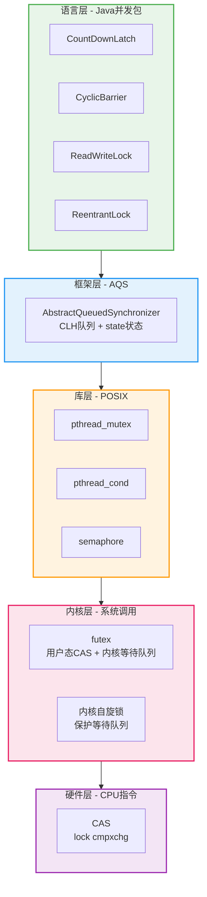
```mermaid
flowchart TD
    subgraph LanguageLayer["语言层 - Java并发包"]
        L1["CountDownLatch"]
        L2["CyclicBarrier"]
        L3["ReadWriteLock"]
        L4["ReentrantLock"]
    end

    subgraph FrameworkLayer["框架层 - AQS"]
        F1["AbstractQueuedSynchronizer<br/>CLH队列 + state状态"]
    end

    subgraph POSIXLayer["库层 - POSIX"]
        P1["pthread_mutex"]
        P2["pthread_cond"]
        P3["semaphore"]
    end

    subgraph KernelLayer["内核层 - 系统调用"]
        K1["futex<br/>用户态CAS + 内核等待队列"]
        K2["内核自旋锁<br/>保护等待队列"]
    end

    subgraph HardwareLayer["硬件层 - CPU指令"]
        H1["CAS<br/>lock cmpxchg"]
    end

    LanguageLayer --> FrameworkLayer
    FrameworkLayer --> POSIXLayer
    POSIXLayer --> KernelLayer
    KernelLayer --> HardwareLayer

    style LanguageLayer fill:#e8f5e9,stroke:#4caf50,stroke-width:2px
    style FrameworkLayer fill:#e3f2fd,stroke:#2196f3,stroke-width:2px
    style POSIXLayer fill:#fff3e0,stroke:#ff9800,stroke-width:2px
    style KernelLayer fill:#fce4ec,stroke:#e91e63,stroke-width:2px
    style HardwareLayer fill:#f3e5f5,stroke:#9c27b0,stroke-width:2px
```

| 层次 | 组件 | 说明 |
|------|------|------|
| 语言层 | CountDownLatch, CyclicBarrier, ReadWriteLock | Java高级同步工具，基于AQS实现 |
| 框架层 | AQS | 抽象队列同步器，CLH队列管理等待线程 |
| 库层 | pthread_mutex, pthread_cond, semaphore | POSIX线程库，跨平台封装 |
| 内核层 | futex | 用户态CAS + 内核等待队列，Linux高效同步基石 |
| 硬件层 | CAS (lock cmpxchg) | CPU原子指令，硬件级保证原子性 |

**硬件层 vs 内核层的"锁"**：

| 层次 | 有锁对象 | 有等待队列 | 能阻塞线程 | 本质 |
|------|---------|-----------|-----------|------|
| 硬件层 | ❌ | ❌ | ❌ | 原子性原语（lock前缀） |
| 内核层 | ✅ | ✅ | ✅ | 完整锁机制（锁对象+队列） |

> 硬件层的`lock`前缀只是原子性保证，内核层才有真正的"锁"概念。

### 3.2 CAS原子操作

#### 3.2.1 CAS原理

**CAS(Compare-And-Swap，比较并交换)** 是原子操作的基础：

```c
// CAS 伪代码
bool CAS(int *addr, int expected, int new_value) {
    if (*addr == expected) {
        *addr = new_value;
        return true;
    }
    return false;
}

// x86 汇编
lock cmpxchg [dest], source
```

**CAS与lock前缀**：

| 层面 | 名称 | 说明 |
|------|------|------|
| 概念层 | CAS | Compare-And-Swap，原子操作语义 |
| 实现层 | `lock cmpxchg` | x86架构的具体指令 |

> `lock`是前缀不是独立指令，修饰后续指令保证原子性。不同架构实现不同：x86用`lock cmpxchg`，ARM用`LDXR/STXR`。

**CAS操作流程**：

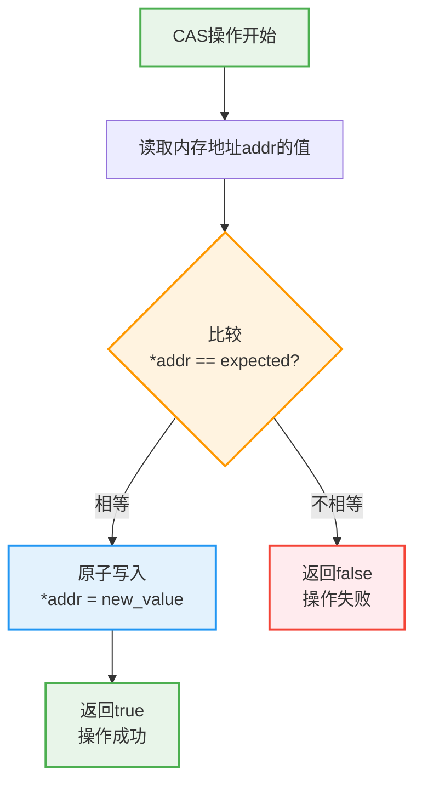
```mermaid
flowchart TD
    Start["CAS操作开始"] --> ReadAddr["读取内存地址addr的值"]
    ReadAddr --> Compare{比较<br/>*addr == expected?}
    
    Compare -->|"相等"| SetNew["原子写入<br/>*addr = new_value"]
    Compare -->|"不相等"| ReturnFalse["返回false<br/>操作失败"]
    
    SetNew --> ReturnTrue["返回true<br/>操作成功"]
    
    %% 样式定义
    style Start fill:#e8f5e9,stroke:#4caf50,stroke-width:2px
    style Compare fill:#fff3e0,stroke:#ff9800,stroke-width:2px
    style SetNew fill:#e3f2fd,stroke:#2196f3,stroke-width:2px
    style ReturnTrue fill:#e8f5e9,stroke:#4caf50,stroke-width:2px
    style ReturnFalse fill:#ffebee,stroke:#f44336,stroke-width:2px
```

**图表核心结论**：CAS是原子性的比较并交换操作，整个操作在硬件层面不可分割，确保多线程环境下的数据一致性，是Java并发包的基础。

**CAS操作步骤说明**：

| 步骤 | 操作 | 类型 | 说明 |
|------|------|------|------|
| 1 | 读取内存值 | 原子操作 | 从内存地址addr读取当前值 |
| 2 | 比较期望值 | 原子操作 | 比较当前值与期望值expected |
| 3 | 条件更新 | 原子操作 | 相等时写入新值new_value，否则失败 |
| 4 | 返回结果 | 原子操作 | 返回操作成功或失败标志 |

#### 3.2.2 ABA问题

**ABA问题场景**：

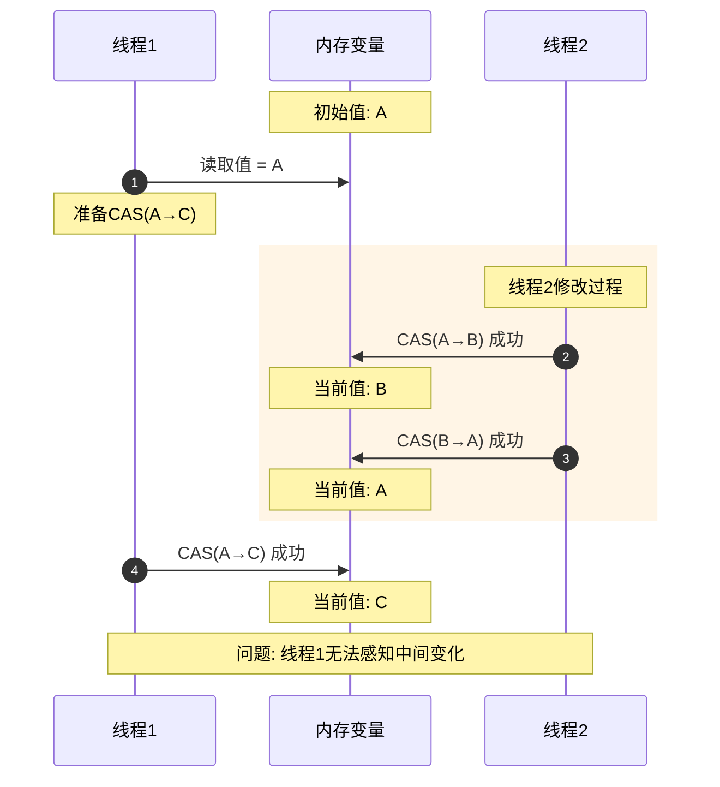
```mermaid
sequenceDiagram
    autonumber
    participant T1 as 线程1
    participant Mem as 内存变量
    participant T2 as 线程2
    
    Note over Mem: 初始值: A
    T1->>Mem: 读取值 = A
    Note over T1: 准备CAS(A→C)
    
    rect rgb(255, 245, 230)
        Note over T2: 线程2修改过程
        T2->>Mem: CAS(A→B) 成功
        Note over Mem: 当前值: B
        T2->>Mem: CAS(B→A) 成功
        Note over Mem: 当前值: A
    end
    
    T1->>Mem: CAS(A→C) 成功
    Note over Mem: 当前值: C
    Note over T1,T2: 问题: 线程1无法感知中间变化
```

**图表核心结论**：ABA问题是指变量值从A变为B再变回A，CAS操作无法感知中间的变化，可能导致逻辑错误，解决方案是使用版本号或时间戳。

**CAS问题与解决方案**：

| 问题 | 说明 | 解决方案 |
|------|------|---------|
| ABA问题 | 值从A变B再变回A | 使用版本号（AtomicStampedReference） |
| 自旋开销 | 高竞争时CPU空转 | 使用自适应自旋或阻塞锁 |
| 单变量限制 | 只能操作一个变量 | 使用锁或AtomicReference |

### 3.3 futex机制

#### 3.3.1 设计思想

**futex(Fast Userspace Mutex，快速用户空间互斥锁)** 是Linux实现高效同步的核心机制。

**核心思想**：
- 无竞争时：完全在用户态完成，避免系统调用开销
- 有竞争时：通过内核等待队列阻塞线程

**锁的层次演进**：
```
硬件层：lock前缀 → 原子性保证（无锁对象）
    ↓
内核层：futex → 锁对象 + 等待队列（完整锁语义）
    ↓
应用层：ReentrantLock → 可重入、公平性等高级特性
```

#### 3.3.2 内核数据结构

```c
// futex等待队列节点
struct futex_q {
    struct plist_node list;          // 优先级链表节点
    struct task_struct *task;        // 等待的进程
    spinlock_t *lock_ptr;            // 自旋锁指针
    union futex_key key;             // futex标识键
    u32 *uaddr;                      // 用户态地址
};

// futex哈希桶
struct futex_hash_bucket {
    spinlock_t lock;                 // 保护链表的自旋锁
    struct plist_head chain;         // 等待队列链表
};
```

#### 3.3.3 快速路径与慢速路径

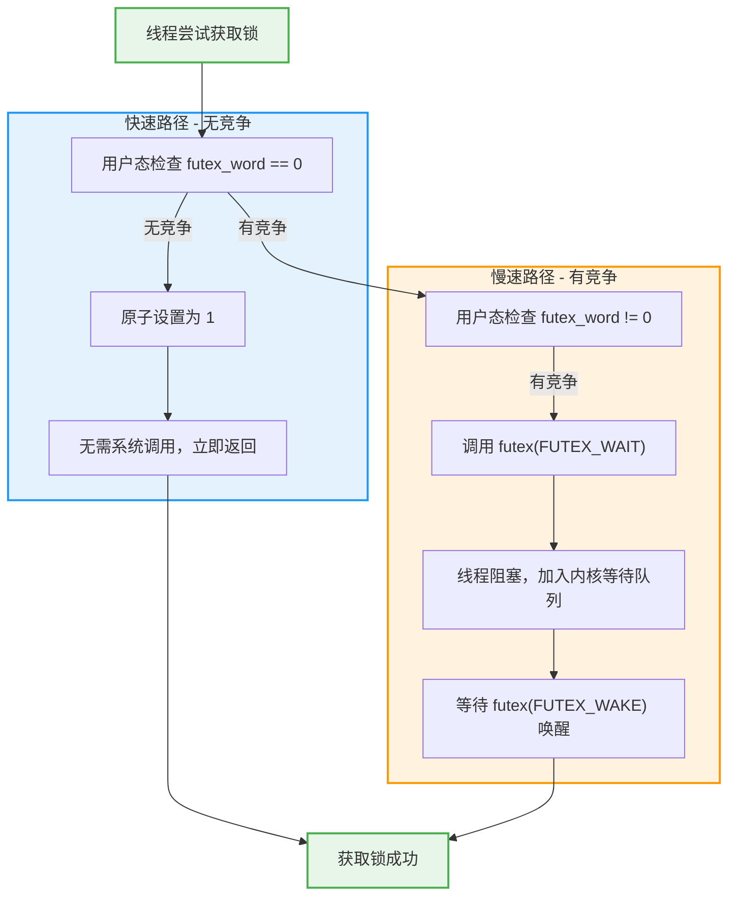
```mermaid
flowchart TD
    Start["线程尝试获取锁"] --> A1

    subgraph FastPath["快速路径 - 无竞争"]
        direction TB
        A1["用户态检查 futex_word == 0"]
        A2["原子设置为 1"]
        A3["无需系统调用，立即返回"]
        A1 -->|"无竞争"| A2 --> A3
    end

    subgraph SlowPath["慢速路径 - 有竞争"]
        direction TB
        B1["用户态检查 futex_word != 0"]
        B2["调用 futex(FUTEX_WAIT)"]
        B3["线程阻塞，加入内核等待队列"]
        B4["等待 futex(FUTEX_WAKE) 唤醒"]
        B1 -->|"有竞争"| B2 --> B3 --> B4
    end

    A1 -->|"有竞争"| B1
    A3 --> End["获取锁成功"]
    B4 --> End

    style Start fill:#e8f5e9,stroke:#4caf50,stroke-width:2px
    style End fill:#e8f5e9,stroke:#4caf50,stroke-width:2px
    style FastPath fill:#e3f2fd,stroke:#2196f3,stroke-width:2px
    style SlowPath fill:#fff3e0,stroke:#ff9800,stroke-width:2px
```

| 路径 | 执行位置 | 延迟 | 说明 |
|------|---------|------|------|
| 快速路径 | 用户态 | ~50ns | CAS原子操作，无系统调用 |
| 慢速路径 | 内核态 | ~5-10μs | 系统调用 + 上下文切换 |

#### 3.3.4 系统调用接口

```c
long sys_futex(u32 *uaddr, int futex_op, u32 val,
               const struct timespec *timeout,
               u32 *uaddr2, u32 val3);
```

| 操作码 | 参数 | 说明 |
|--------|------|------|
| `FUTEX_WAIT` | uaddr, val, timeout | 等待*uaddr == val，否则阻塞 |
| `FUTEX_WAKE` | uaddr, nr_wake | 唤醒nr_wake个等待线程 |
| `FUTEX_REQUEUE` | uaddr, nr_wake, uaddr2 | 唤醒并移动到另一个futex |

#### 3.3.5 FUTEX操作详解

**FUTEX_WAKE vs FUTEX_REQUEUE**：

| 操作 | 效果 | Java对应 |
|------|------|---------|
| `FUTEX_WAKE` | 直接唤醒，线程立即竞争锁 | `unlock()` |
| `FUTEX_REQUEUE` | 唤醒+移动队列，避免惊群 | `signal()` |

**场景1：无Condition（纯锁竞争）**

```java
ReentrantLock lock = new ReentrantLock();
lock.lock();    // CAS竞争，失败则 FUTEX_WAIT
lock.unlock();  // FUTEX_WAKE(1)
```

```
执行流程：
  T1: lock() → CAS成功 → 获取锁
  T2: lock() → CAS失败 → FUTEX_WAIT → 进入锁等待队列
  T3: lock() → CAS失败 → FUTEX_WAIT → 进入锁等待队列

  锁等待队列: [T2, T3]

  T1: unlock() → FUTEX_WAKE(1) → T2唤醒 → 竞争锁成功
```

**场景2：有Condition（条件等待）**

```java
ReentrantLock lock = new ReentrantLock();
Condition notEmpty = lock.newCondition();

// 消费者
lock.lock();
while (queue.isEmpty()) {
    notEmpty.await();  // FUTEX_WAIT，进入Condition队列
}
lock.unlock();

// 生产者
lock.lock();
queue.add(item);
notEmpty.signal();     // FUTEX_REQUEUE，移动到锁队列
lock.unlock();         // FUTEX_WAKE，唤醒锁队列
```

```
执行流程：
  C1, C2, C3: await() → FUTEX_WAIT → 进入Condition队列

  Condition队列: [C1, C2, C3]
  锁等待队列: []

  P1: signal() → FUTEX_REQUEUE(1, lock_futex)
      C1 唤醒 → 竞争锁
      C2, C3 移动到锁等待队列

  Condition队列: []
  锁等待队列: [C2, C3]
  C1: RUNNABLE，竞争锁
```

**Java与futex对应关系**：

| Java操作 | futex操作 | 说明 |
|---------|-----------|------|
| `lock.lock()` | CAS + `FUTEX_WAIT` | 竞争失败则阻塞 |
| `lock.unlock()` | `FUTEX_WAKE(1)` | 唤醒锁等待队列 |
| `condition.await()` | `FUTEX_WAIT` | 进入Condition队列 |
| `condition.signal()` | `FUTEX_REQUEUE(1)` | 唤醒1个，移动其余 |
| `condition.signalAll()` | `FUTEX_REQUEUE(ALL)` | 全部唤醒 |

**signal() vs signalAll()**：

| 方法 | 唤醒数 | 移动数 | 开销 | 适用场景 |
|------|--------|--------|------|---------|
| `signal()` | 1 | N-1 | 小 | 只需唤醒1个线程 |
| `signalAll()` | N | 0 | 大 | 所有线程需重新检查条件 |

#### 3.3.6 性能与调试

**性能特征**：

| 场景 | 延迟 | 说明 |
|------|------|------|
| 快速路径（无竞争） | ~50ns | 纯用户态CAS操作 |
| 慢速路径（有竞争） | ~5-10μs | 系统调用+上下文切换 |
| 唤醒等待线程 | ~2-5μs | 系统调用+调度 |

**调试方法**：

```bash
# 跟踪futex调用
strace -e futex -p [pid]

# 统计futex调用次数
perf stat -e syscalls:sys_enter_futex -p [pid] sleep 10

# 查看进程等待的futex
cat /proc/[pid]/wchan
```

### 3.4 自旋锁

#### 3.4.1 自旋等待原理

**自旋锁(Spinlock)**是一种忙等待锁：

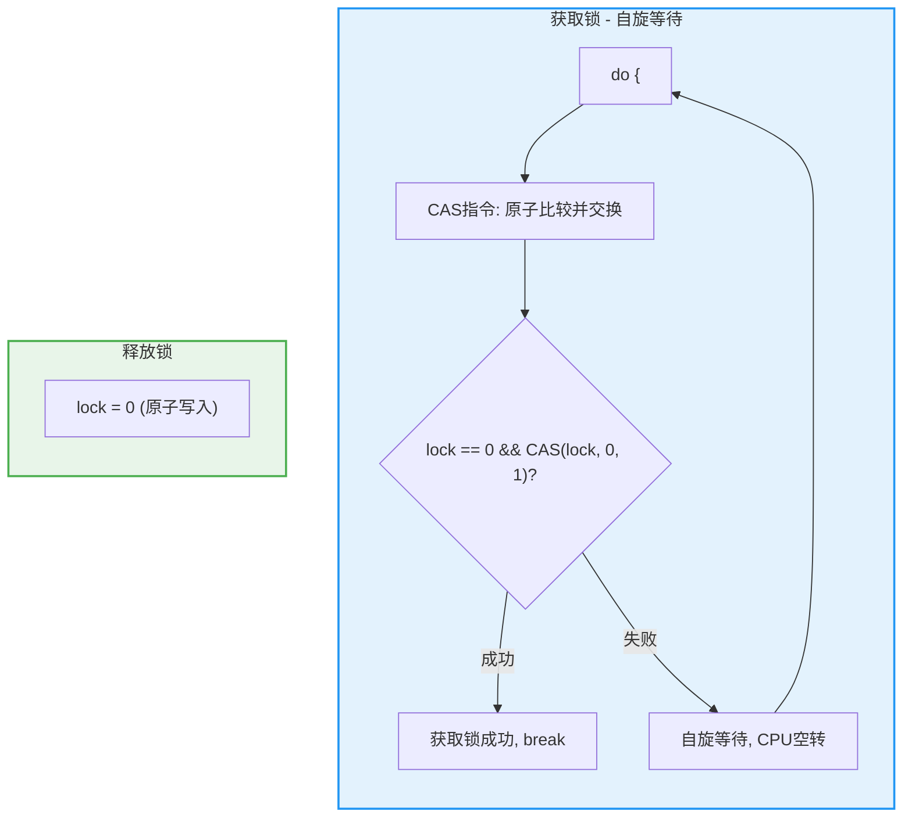
```mermaid
flowchart TD
    subgraph AcquireLock["获取锁 - 自旋等待"]
        direction TB
        A1["do {"] --> A2["CAS指令: 原子比较并交换"]
        A2 --> A3{"lock == 0 && CAS(lock, 0, 1)?"}
        A3 -->|"成功"| A4["获取锁成功, break"]
        A3 -->|"失败"| A5["自旋等待, CPU空转"]
        A5 --> A1
    end

    subgraph ReleaseLock["释放锁"]
        direction TB
        R1["lock = 0 (原子写入)"]
    end

    %% 样式定义
    style AcquireLock fill:#e3f2fd,stroke:#2196f3,stroke-width:2px
    style ReleaseLock fill:#e8f5e9,stroke:#4caf50,stroke-width:2px
```

**图表核心结论**：自旋锁通过CAS指令在用户态忙等待获取锁，无上下文切换开销，但竞争激烈时CPU空转严重，适用于锁持有时间极短的场景。

**适用场景**：

| 场景 | 是否适合 | 原因 |
|------|---------|------|
| 锁持有时间短 | ✅ 适合 | 等待时间短，上下文切换开销更大 |
| 锁竞争少 | ✅ 适合 | 很少需要自旋 |
| 锁持有时间长 | ❌ 不适合 | CPU空转浪费严重 |
| 锁竞争激烈 | ❌ 不适合 | 大量线程自旋，CPU占用高 |

#### 3.4.2 RocketMQ PutMessageSpinLock实现

[PutMessageSpinLock.java](../store/src/main/java/org/apache/rocketmq/store/PutMessageSpinLock.java) 实现自旋锁：

```java
/**
 * Spin lock Implementation to put message, suggest using this with low race conditions
 * 自旋锁实现，建议在低竞争场景下使用
 */
public class PutMessageSpinLock implements PutMessageLock {
    // true: Can lock（可获取锁）, false: in lock（锁被占用）
    private AtomicBoolean putMessageSpinLock = new AtomicBoolean(true);  // 默认值：true（可获取）

    @Override
    public void lock() {
        boolean flag;
        do {
            // CAS: 期望值为true（可获取），更新为false（已锁定）
            flag = this.putMessageSpinLock.compareAndSet(true, false);
        } while (!flag);  // 自旋等待，直到获取锁成功
    }

    @Override
    public void unlock() {
        // CAS: 期望值为false（已锁定），更新为true（可获取）
        this.putMessageSpinLock.compareAndSet(false, true);
    }
}
```

**自旋锁状态说明**：

| 状态值 | 含义 | 说明 |
|--------|------|------|
| `true` | 可获取锁 | 锁未被占用，可尝试获取 |
| `false` | 锁被占用 | 其他线程持有锁，需等待 |

### 3.5 可重入锁

#### 3.5.1 AQS原理

**可重入锁(ReentrantLock)**基于AQS(AbstractQueuedSynchronizer，抽象队列同步器)实现，竞争时线程阻塞：

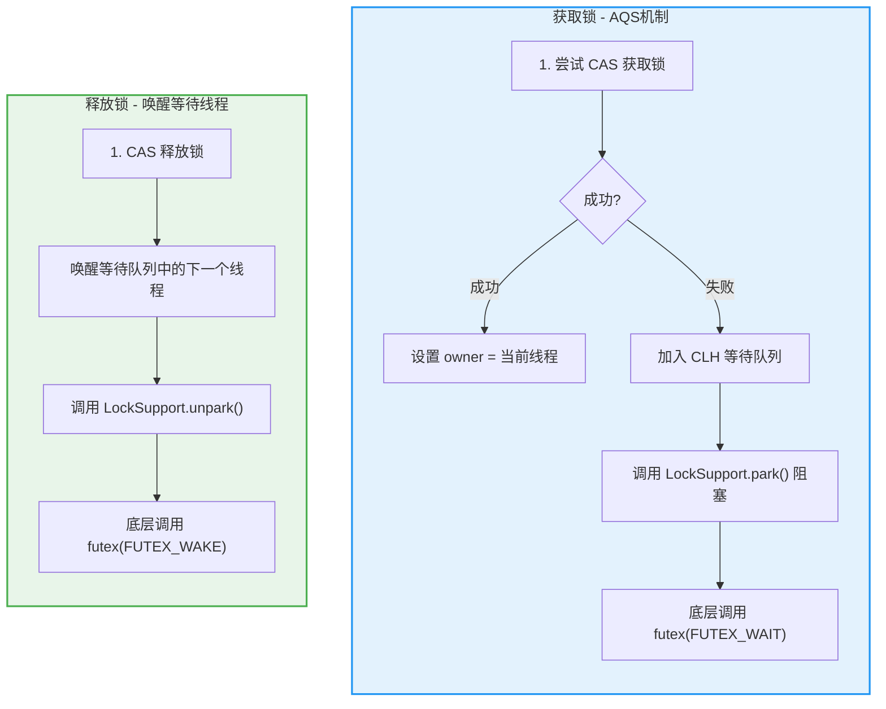
```mermaid
flowchart TD
    subgraph AcquireLock["获取锁 - AQS机制"]
        direction TB
        L1["1. 尝试 CAS 获取锁"] --> L2{"成功?"}
        L2 -->|"成功"| L3["设置 owner = 当前线程"]
        L2 -->|"失败"| L4["加入 CLH 等待队列"]
        L4 --> L5["调用 LockSupport.park() 阻塞"]
        L5 --> L6["底层调用 futex(FUTEX_WAIT)"]
    end

    subgraph ReleaseLock["释放锁 - 唤醒等待线程"]
        direction TB
        R1["1. CAS 释放锁"] --> R2["唤醒等待队列中的下一个线程"]
        R2 --> R3["调用 LockSupport.unpark()"]
        R3 --> R4["底层调用 futex(FUTEX_WAKE)"]
    end

    %% 样式定义
    style AcquireLock fill:#e3f2fd,stroke:#2196f3,stroke-width:2px
    style ReleaseLock fill:#e8f5e9,stroke:#4caf50,stroke-width:2px
```

**图表核心结论**：可重入锁基于AQS实现，通过CLH队列管理等待线程，竞争失败时线程阻塞（调用futex），相比自旋锁有上下文切换开销但不会CPU空转，适用于锁持有时间较长或竞争激烈的场景。

#### 3.5.2 CLH等待队列

**CLH队列结构**：

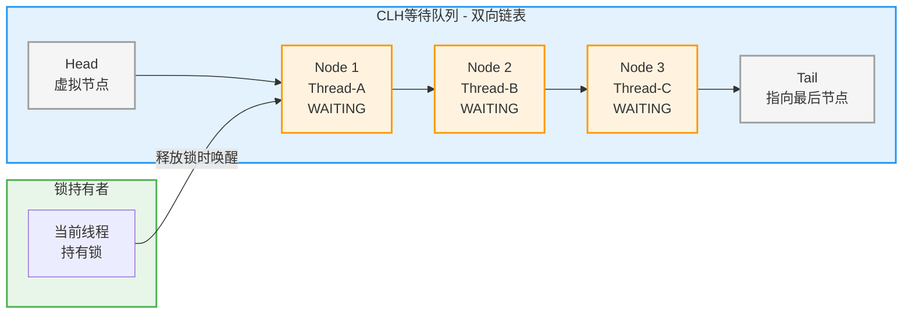
```mermaid
flowchart LR
    subgraph CLHQueue["CLH等待队列 - 双向链表"]
        direction LR
        Head["Head<br/>虚拟节点"] --> Node1["Node 1<br/>Thread-A<br/>WAITING"]
        Node1 --> Node2["Node 2<br/>Thread-B<br/>WAITING"]
        Node2 --> Node3["Node 3<br/>Thread-C<br/>WAITING"]
        Node3 --> Tail["Tail<br/>指向最后节点"]
    end
    
    subgraph OwnerThread["锁持有者"]
        Owner["当前线程<br/>持有锁"]
    end
    
    Owner -->|"释放锁时唤醒"| Node1
    
    %% 样式定义
    style CLHQueue fill:#e3f2fd,stroke:#2196f3,stroke-width:2px
    style OwnerThread fill:#e8f5e9,stroke:#4caf50,stroke-width:2px
    style Head fill:#f5f5f5,stroke:#9e9e9e,stroke-width:2px
    style Node1 fill:#fff3e0,stroke:#ff9800,stroke-width:2px
    style Node2 fill:#fff3e0,stroke:#ff9800,stroke-width:2px
    style Node3 fill:#fff3e0,stroke:#ff9800,stroke-width:2px
    style Tail fill:#f5f5f5,stroke:#9e9e9e,stroke-width:2px
```

**图表核心结论**：CLH队列是双向链表结构，Head为虚拟节点，等待线程按FIFO顺序排队，锁释放时唤醒队首线程，保证公平性。

**AQS工作原理说明**：

| 组件 | 说明 |
|------|------|
| CLH队列 | Craig, Landin, and Hagersten队列，双向链表 |
| 节点内容 | 线程信息和等待状态 |
| Head节点 | 虚拟节点，不存储线程信息 |
| Tail节点 | 指向队列最后一个等待节点 |
| state字段 | 锁状态，0表示未锁定，>0表示重入次数 |

**公平锁 vs 非公平锁**：

| 类型 | 说明 | 特点 |
|------|------|------|
| 公平锁 | 按请求顺序获取 | 公平，但吞吐量低 |
| 非公平锁 | 允许插队 | 吞吐量高，但可能饥饿 |

#### 3.5.3 Condition队列机制

**Condition队列与锁等待队列**是AQS中两种不同的等待队列：

**队列结构**：

```
┌─────────────────────────────────────────────────────────────┐
│                    ReentrantLock                            │
├─────────────────────────────────────────────────────────────┤
│  锁等待队列（AQS CLH队列）                                    │
│  [T4] → [T5] → [T6]     等待获取锁                          │
│  入队：lock()竞争失败  出队：unlock()唤醒                    │
│                                                             │
│  Condition队列（notEmpty）                                   │
│  [C1] → [C2] → [C3]     等待"非空"条件                      │
│  入队：await()释放锁   出队：signal()移动到锁队列            │
│                                                             │
│  Condition队列（notFull）                                    │
│  [P1] → [P2]            等待"非满"条件                      │
└─────────────────────────────────────────────────────────────┘
```

**核心区别**：

| 对比项 | 锁等待队列 | Condition队列 |
|--------|-----------|--------------|
| 等待什么 | 等待获取锁 | 等待条件成立 |
| 入队时机 | `lock()`竞争失败 | `await()`主动等待 |
| 出队时机 | `unlock()`唤醒 | `signal()`通知 |
| 是否释放锁 | 否 | 是（await释放锁） |
| 队列数量 | 1个/锁 | N个/Condition |

**线程流转**：

```
锁等待队列流转：
  T1: lock()失败 → 进入锁等待队列 → BLOCKED
  Owner: unlock() → FUTEX_WAKE → T1唤醒 → 获取锁

Condition队列流转：
  C1: await() → 释放锁 + 进入Condition队列 → BLOCKED
  P1: signal() → FUTEX_REQUEUE → C1移动到锁等待队列
  P1: unlock() → C1唤醒 → 获取锁 → 检查条件
```

**signal() vs signalAll()**：

| 方法 | 唤醒数 | 移动数 | 开销 | 适用场景 |
|------|--------|--------|------|---------|
| `signal()` | 1 | N-1 | 小 | 只需唤醒1个线程 |
| `signalAll()` | N | 0 | 大 | 所有线程需重新检查条件 |

#### 3.5.4 RocketMQ PutMessageReentrantLock实现

[PutMessageReentrantLock.java](../store/src/main/java/org/apache/rocketmq/store/PutMessageReentrantLock.java) 实现可重入锁：

```java
/**
 * Exclusive lock implementation to put message
 * 独占锁实现，用于消息写入
 */
public class PutMessageReentrantLock implements PutMessageLock {
    // NonfairSync: 非公平锁实现，吞吐量更高
    private ReentrantLock putMessageNormalLock = new ReentrantLock();  // 默认值：非公平锁

    @Override
    public void lock() {
        putMessageNormalLock.lock();
    }

    @Override
    public void unlock() {
        putMessageNormalLock.unlock();
    }
}
```

**ReentrantLock 默认行为**：

| 特性 | 值 | 说明 |
|------|-----|------|
| 公平性 | 非公平 | 默认使用 NonfairSync，吞吐量更高 |
| 可重入 | ✅ | 同一线程可多次获取锁 |
| 响应中断 | ✅ | lockInterruptibly() 方法 |

### 3.6 分段锁

#### 3.6.1 分段锁原理

**分段锁**通过将锁分成多个段，减少锁竞争：

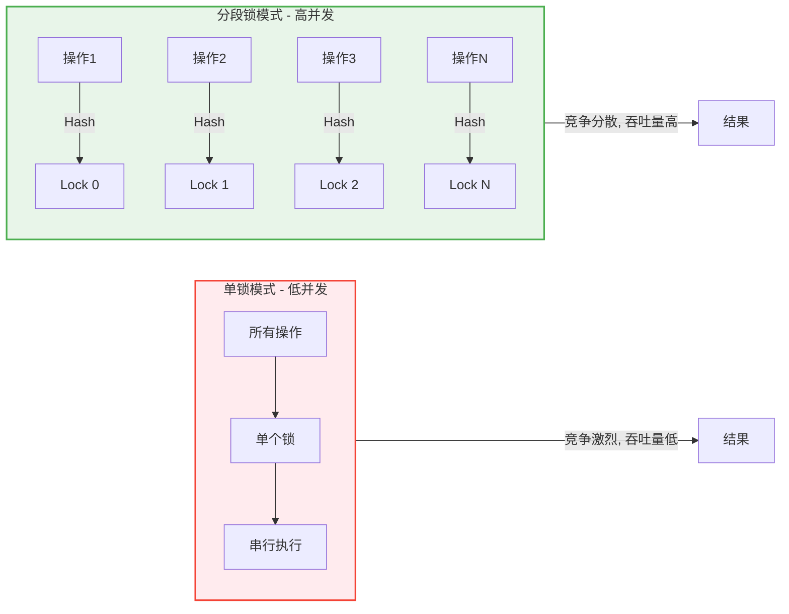
```mermaid
flowchart LR
    subgraph SingleLock["单锁模式 - 低并发"]
        direction TB
        S1["所有操作"] --> S2["单个锁"]
        S2 --> S3["串行执行"]
    end

    subgraph SegmentLock["分段锁模式 - 高并发"]
        direction TB
        O1["操作1"] -->|"Hash"| L1["Lock 0"]
        O2["操作2"] -->|"Hash"| L2["Lock 1"]
        O3["操作3"] -->|"Hash"| L3["Lock 2"]
        O4["操作N"] -->|"Hash"| L4["Lock N"]
    end

    SingleLock -->|"竞争激烈, 吞吐量低"| R1["结果"]
    SegmentLock -->|"竞争分散, 吞吐量高"| R2["结果"]

    %% 样式定义
    style SingleLock fill:#ffebee,stroke:#f44336,stroke-width:2px
    style SegmentLock fill:#e8f5e9,stroke:#4caf50,stroke-width:2px
```

**图表核心结论**：分段锁通过Hash映射将操作分散到多个锁段，显著降低锁竞争，提高并发吞吐量，RocketMQ的TopicQueueLock采用32段设计。

#### 3.6.2 Hash映射机制

**分段锁Hash映射机制**：

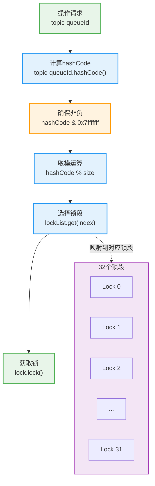
```mermaid
flowchart TD
    Start["操作请求<br/>topic-queueId"] --> HashCalc["计算hashCode<br/>topic-queueId.hashCode()"]
    HashCalc --> PositiveCheck["确保非负<br/>hashCode & 0x7fffffff"]
    PositiveCheck --> ModCalc["取模运算<br/>hashCode % size"]
    ModCalc --> SelectLock["选择锁段<br/>lockList.get(index)"]
    SelectLock --> AcquireLock["获取锁<br/>lock.lock()"]
    
    subgraph LockSegments["32个锁段"]
        direction LR
        L0["Lock 0"]
        L1["Lock 1"]
        L2["Lock 2"]
        L3["..."]
        L31["Lock 31"]
    end
    
    SelectLock -.->|"映射到对应锁段"| LockSegments
    
    %% 样式定义
    style Start fill:#e8f5e9,stroke:#4caf50,stroke-width:2px
    style HashCalc fill:#e3f2fd,stroke:#2196f3,stroke-width:2px
    style PositiveCheck fill:#fff3e0,stroke:#ff9800,stroke-width:2px
    style ModCalc fill:#e3f2fd,stroke:#2196f3,stroke-width:2px
    style SelectLock fill:#e3f2fd,stroke:#2196f3,stroke-width:2px
    style AcquireLock fill:#e8f5e9,stroke:#4caf50,stroke-width:2px
    style LockSegments fill:#f3e5f5,stroke:#9c27b0,stroke-width:2px
```

**图表核心结论**：分段锁通过hashCode计算、非负处理、取模运算三步将操作映射到32个锁段之一，相同key总是映射到同一锁段保证顺序性，不同key分散到不同锁段提高并发度。

**分段锁工作原理说明**：

| 模式 | 锁数量 | 并发度 | 适用场景 |
|------|--------|--------|---------|
| 单锁模式 | 1个 | 低 | 操作简单、竞争少的场景 |
| 分段锁模式 | N个 | 高 | 操作复杂、竞争激烈的场景 |

**关键概念**：

- **Hash映射**：根据key的hash值分配到对应的锁段
- **锁粒度**：分段数越多，锁粒度越细，并发度越高
- **一致性保证**：相同key的操作映射到同一锁段，保证顺序性
- **典型应用**：ConcurrentHashMap（16段）、RocketMQ TopicQueueLock（32段）

#### 3.6.3 RocketMQ TopicQueueLock实现

[TopicQueueLock.java](../store/src/main/java/org/apache/rocketmq/store/TopicQueueLock.java) 实现分段锁：

```java
public class TopicQueueLock {
    private final int size;  // 分段数量，默认值：32
    private final List<Lock> lockList;  // 锁列表

    public TopicQueueLock() {
        this.size = 32;  // 32个分段
        this.lockList = new ArrayList<>(32);
        for (int i = 0; i < this.size; i++) {
            this.lockList.add(new ReentrantLock());  // 每段一个可重入锁
        }
    }

    /**
     * 根据 topicQueueKey 获取对应的锁并加锁
     * @param topicQueueKey 格式：topic-queueId
     */
    public void lock(String topicQueueKey) {
        // 使用 hashCode & 0x7fffffff 确保非负，再取模
        Lock lock = this.lockList.get((topicQueueKey.hashCode() & 0x7fffffff) % this.size);
        lock.lock();
    }

    /**
     * 根据 topicQueueKey 释放对应的锁
     */
    public void unlock(String topicQueueKey) {
        Lock lock = this.lockList.get((topicQueueKey.hashCode() & 0x7fffffff) % this.size);
        lock.unlock();
    }
}
```

**设计要点**：

| 要点 | 说明 |
|------|------|
| 分段数 | 32个分段，平衡并发度和内存开销 |
| Hash算法 | `hashCode & 0x7fffffff` 确保非负，避免负数取模异常 |
| 锁类型 | ReentrantLock（非公平），支持可重入 |
| 一致性保证 | 相同 topicQueueKey 映射到同一锁段，保证顺序性 |

### 3.7 锁机制对比与选择

**自旋锁 vs 可重入锁 vs 分段锁**：

| 对比维度 | 自旋锁 | 可重入锁 | 分段锁 |
|---------|--------|---------|--------|
| 实现原理 | CAS忙等待 | AQS + CLH队列 | 多段ReentrantLock |
| 等待方式 | CPU空转 | 线程阻塞 | 线程阻塞 |
| 上下文切换 | 无 | 有 | 有 |
| 适用场景 | 锁持有时间极短 | 锁持有时间较长 | 高并发写操作 |
| CPU开销 | 高竞争时高 | 中等 | 低 |
| 公平性 | 无 | 可配置 | 可配置 |
| RocketMQ实现 | PutMessageSpinLock | PutMessageReentrantLock | TopicQueueLock |

**锁选择建议**：

| 场景 | 推荐锁类型 | 原因 |
|------|----------|------|
| 低竞争、短持有 | 自旋锁 | 避免上下文切换开销 |
| 高竞争、长持有 | 可重入锁 | 避免CPU空转 |
| 多Key并发写入 | 分段锁 | 降低锁竞争粒度 |
| 单Key顺序操作 | 可重入锁 | 简单可靠 |

**futex快速路径 vs 慢速路径**：

| 路径 | 延迟 | CPU开销 | 适用场景 |
|------|------|---------|---------|
| 快速路径（无竞争） | ~50ns | 低 | 大多数情况 |
| 慢速路径（有竞争） | ~5μs | 中等 | 锁竞争时 |

**CAS vs 锁**：

| 对比维度 | CAS | 锁 |
|---------|-----|-----|
| 操作粒度 | 单变量 | 代码块 |
| 开销 | 低（用户态） | 高（可能内核态） |
| 适用场景 | 简单原子操作 | 复杂临界区 |
| ABA问题 | 存在 | 不存在 |
| 公平性 | 无 | 可配置 |

## 4. 线程池

### 4.1 任务队列与线程复用

**线程池的核心是任务队列和线程复用**，减少线程创建/销毁的开销：

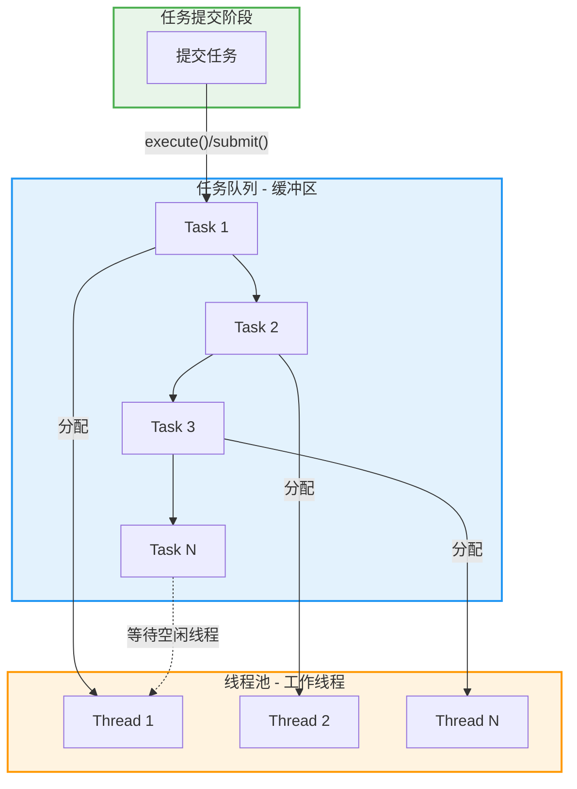
```mermaid
flowchart TD
    subgraph TaskSubmit["任务提交阶段"]
        direction TB
        T1["提交任务"]
    end

    subgraph TaskQueue["任务队列 - 缓冲区"]
        direction LR
        Q1["Task 1"]
        Q2["Task 2"]
        Q3["Task 3"]
        Q4["Task N"]
        Q1 --> Q2 --> Q3 --> Q4
    end

    subgraph ThreadPool["线程池 - 工作线程"]
        direction TB
        W1["Thread 1"]
        W2["Thread 2"]
        W3["Thread N"]
    end

    T1 -->|"execute()/submit()"| Q1
    Q1 -->|"分配"| W1
    Q2 -->|"分配"| W2
    Q3 -->|"分配"| W3
    Q4 -.->|"等待空闲线程"| W1

    %% 样式定义
    style TaskSubmit fill:#e8f5e9,stroke:#4caf50,stroke-width:2px
    style TaskQueue fill:#e3f2fd,stroke:#2196f3,stroke-width:2px
    style ThreadPool fill:#fff3e0,stroke:#ff9800,stroke-width:2px
```

**图表核心结论**：线程池通过任务队列解耦任务提交与执行，实现线程复用和资源控制，避免频繁创建/销毁线程的开销。

**线程池工作原理说明**：

| 步骤 | 操作 | 类型 | 说明 |
|------|------|------|------|
| 1 | 提交任务 | 入队 | 任务通过execute()或submit()提交 |
| 2 | 入队等待 | 排队 | 任务进入工作队列，等待空闲线程 |
| 3 | 获取线程 | 分配 | 空闲线程从队列取出任务执行 |
| 4 | 执行任务 | 执行 | 线程执行任务的run()方法 |
| 5 | 线程复用 | 循环 | 执行完毕后线程返回池中等待下一个任务 |

**关键概念**：

- **任务队列**：缓冲区，解耦任务提交与执行速度差异
- **线程复用**：避免频繁创建/销毁线程的开销（每次约几毫秒）
- **背压控制**：有界队列可防止任务积压导致内存溢出

### 4.2 核心参数

| 参数 | 说明 | 默认值 | 内核影响 |
|------|------|--------|---------|
| `corePoolSize` | 核心线程数 | 依赖具体配置 | 常驻线程，不回收 |
| `maximumPoolSize` | 最大线程数 | 依赖具体配置 | 任务积压时临时创建 |
| `keepAliveTime` | 空闲线程存活时间 | 60,000ms = 60s | 临时线程超时回收 |
| `workQueue` | 任务队列 | LinkedBlockingQueue | 有界/无界，影响背压 |

**线程池任务处理流程**：

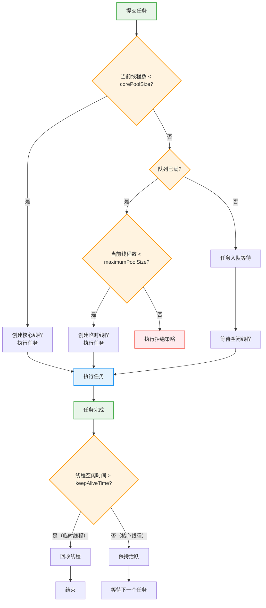
```mermaid
flowchart TD
    SubmitTask["提交任务"] --> CheckCore{当前线程数 < corePoolSize?}
    
    CheckCore -->|"是"| CreateCore["创建核心线程<br/>执行任务"]
    CheckCore -->|"否"| CheckQueue{队列已满?}
    
    CheckQueue -->|"否"| EnqueueTask["任务入队等待"]
    CheckQueue -->|"是"| CheckMax{当前线程数 < maximumPoolSize?}
    
    CheckMax -->|"是"| CreateTemp["创建临时线程<br/>执行任务"]
    CheckMax -->|"否"| RejectPolicy["执行拒绝策略"]
    
    CreateCore --> ExecuteTask["执行任务"]
    CreateTemp --> ExecuteTask
    EnqueueTask --> WaitThread["等待空闲线程"]
    WaitThread --> ExecuteTask
    
    ExecuteTask --> TaskComplete["任务完成"]
    TaskComplete --> CheckIdle{线程空闲时间 > keepAliveTime?}
    
    CheckIdle -->|"是（临时线程）"| RecycleThread["回收线程"]
    CheckIdle -->|"否（核心线程）"| KeepAlive["保持活跃"]
    
    RecycleThread --> End["结束"]
    KeepAlive --> WaitNextTask["等待下一个任务"]
    
    %% 样式定义
    style SubmitTask fill:#e8f5e9,stroke:#4caf50,stroke-width:2px
    style ExecuteTask fill:#e3f2fd,stroke:#2196f3,stroke-width:2px
    style TaskComplete fill:#e8f5e9,stroke:#4caf50,stroke-width:2px
    style RejectPolicy fill:#ffebee,stroke:#f44336,stroke-width:2px
    style CheckCore fill:#fff3e0,stroke:#ff9800,stroke-width:2px
    style CheckQueue fill:#fff3e0,stroke:#ff9800,stroke-width:2px
    style CheckMax fill:#fff3e0,stroke:#ff9800,stroke-width:2px
    style CheckIdle fill:#fff3e0,stroke:#ff9800,stroke-width:2px
```

**图表核心结论**：线程池通过三层策略处理任务：优先创建核心线程，队列满后创建临时线程，最终执行拒绝策略，实现资源控制与背压管理。

**线程池参数配置示例**：

```java
// 使用 ThreadPoolMonitor 创建监控线程池
ThreadPoolExecutor executor = ThreadPoolMonitor.createAndMonitor(
    4,                    // corePoolSize: 核心线程数，4个常驻线程
    8,                    // maximumPoolSize: 最大线程数，任务积压时最多8个线程
    60,                   // keepAliveTime: 空闲线程存活时间
    TimeUnit.SECONDS,     // 时间单位：秒，即 60,000ms = 60s
    "MyThreadPool",       // 线程名称前缀，实际名称为 MyThreadPool-0, MyThreadPool-1...
    1000                  // queueCapacity: 队列容量，1000个任务
);

// 提交任务
executor.execute(() -> {
    // 执行业务逻辑
    doWork();
});

// 提交有返回值的任务
Future<String> future = executor.submit(() -> {
    return "result";
});
```

**线程池拒绝策略说明**：

| 拒绝策略 | 说明 | 适用场景 |
|---------|------|---------|
| `AbortPolicy` | 抛出 RejectedExecutionException | 默认策略，需要处理异常 |
| `CallerRunsPolicy` | 由调用线程执行任务 | 降低提交速度，平滑降级 |
| `DiscardPolicy` | 直接丢弃任务，不抛异常 | 允许任务丢失 |
| `DiscardOldestPolicy` | 丢弃队列中最老的任务，再提交新任务 | RocketMQ默认使用此策略 |

## 5. Reactor模式

> **扩展阅读**：Reactor模式的详细实现原理、epoll机制、Netty配置等内容，请参阅 [04-IO多路复用.md](04-IO多路复用.md)。

### 5.1 Reactor模式原理

**Reactor模式**基于I/O多路复用，用少量线程处理大量连接，是RocketMQ高并发网络处理的核心架构。

**三级线程组架构**：

| 线程组 | 线程数 | 职责 | 系统调用 |
|--------|--------|------|---------|
| Boss Group | 1 | Accept连接 | `accept()`、`epoll_ctl()` |
| Selector Group | serverSelectorThreads（默认值：3） | I/O读写 | `epoll_wait()`、`read()`、`write()` |
| Worker Group | serverWorkerThreads（默认值：8） | 业务处理 | 无I/O系统调用 |

**Reactor模式架构图**：

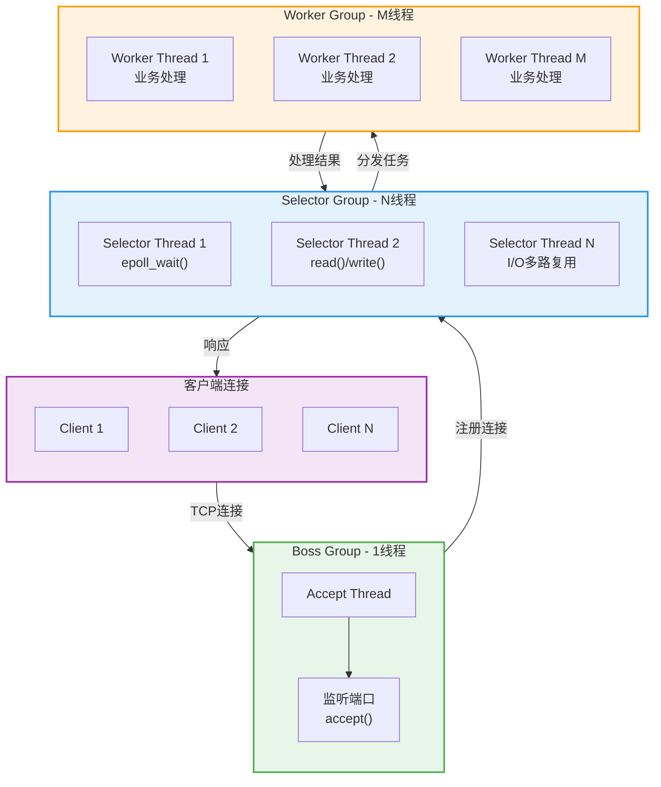
```mermaid
flowchart TB
    subgraph Clients["客户端连接"]
        direction TB
        C1["Client 1"]
        C2["Client 2"]
        C3["Client N"]
    end
    
    subgraph BossGroup["Boss Group - 1线程"]
        direction TB
        B1["Accept Thread"]
        B2["监听端口<br/>accept()"]
        B1 --> B2
    end
    
    subgraph SelectorGroup["Selector Group - N线程"]
        direction TB
        S1["Selector Thread 1<br/>epoll_wait()"]
        S2["Selector Thread 2<br/>read()/write()"]
        S3["Selector Thread N<br/>I/O多路复用"]
    end
    
    subgraph WorkerGroup["Worker Group - M线程"]
        direction TB
        W1["Worker Thread 1<br/>业务处理"]
        W2["Worker Thread 2<br/>业务处理"]
        W3["Worker Thread M<br/>业务处理"]
    end
    
    Clients -->|"TCP连接"| BossGroup
    BossGroup -->|"注册连接"| SelectorGroup
    SelectorGroup -->|"分发任务"| WorkerGroup
    WorkerGroup -->|"处理结果"| SelectorGroup
    SelectorGroup -->|"响应"| Clients
    
    %% 样式定义
    style Clients fill:#f3e5f5,stroke:#9c27b0,stroke-width:2px
    style BossGroup fill:#e8f5e9,stroke:#4caf50,stroke-width:2px
    style SelectorGroup fill:#e3f2fd,stroke:#2196f3,stroke-width:2px
    style WorkerGroup fill:#fff3e0,stroke:#ff9800,stroke-width:2px
```

**图表核心结论**：Reactor模式通过三级线程组实现I/O与业务分离，Boss Group负责连接建立，Selector Group负责I/O读写，Worker Group负责业务处理，实现高并发、低延迟的网络处理。

**关键设计原则**：

- **Boss Group**：单线程负责Accept连接，避免多线程竞争
- **Selector Group**：N线程处理I/O读写，基于epoll多路复用
- **Worker Group**：M线程执行业务逻辑，与I/O线程分离避免阻塞
- **I/O多路复用**：一个线程同时监控多个连接，减少线程数量

### 5.2 RocketMQ线程组配置

[NettyRemotingServer.java](../remoting/src/main/java/org/apache/rocketmq/remoting/netty/NettyRemotingServer.java) 实现Reactor模型：

```java
public class NettyRemotingServer extends NettyRemotingAbstract implements RemotingServer {
    private final EventLoopGroup eventLoopGroupBoss;      // Boss Group: 1线程
    private final EventLoopGroup eventLoopGroupSelector;  // Selector Group: N线程
    private DefaultEventExecutorGroup defaultEventExecutorGroup;  // Worker Group: M线程
}
```

**NettyServerConfig 配置项**：

| 配置项 | 默认值 | 说明 |
|--------|--------|------|
| `bindAddress` | "0.0.0.0" | 绑定地址，支持主机名、IPv4或IPv6，默认监听所有网络接口 |
| `listenPort` | 0 | 监听端口，0表示自动分配 |
| `serverWorkerThreads` | 8 | Worker Group 线程数，执行业务逻辑 |
| `serverSelectorThreads` | 3 | Selector Group 线程数，处理I/O读写 |
| `serverCallbackExecutorThreads` | 0（实际使用4） | 回调线程数，<=0时使用4 |
| `serverOnewaySemaphoreValue` | 256 | 单向请求信号量，控制并发数 |
| `serverAsyncSemaphoreValue` | 64 | 异步请求信号量，控制并发数 |
| `serverChannelMaxIdleTimeSeconds` | 120 | 通道最大空闲时间，单位：s |
| `serverSocketSndBufSize` | NettySystemConfig.socketSndbufSize | Socket发送缓冲区大小，单位：B |
| `serverSocketRcvBufSize` | NettySystemConfig.socketRcvbufSize | Socket接收缓冲区大小，单位：B |
| `writeBufferHighWaterMark` | NettySystemConfig.writeBufferHighWaterMark | 写缓冲区高水位线，单位：B |
| `writeBufferLowWaterMark` | NettySystemConfig.writeBufferLowWaterMark | 写缓冲区低水位线，单位：B |
| `serverSocketBacklog` | NettySystemConfig.socketBacklog | Socket连接队列长度 |
| `serverPooledByteBufAllocatorEnable` | true | 是否启用池化ByteBuf分配器 |
| `useEpollNativeSelector` | false | 是否使用Epoll原生Selector |

**Epoll vs NIO 选择**：

| 条件 | Epoll | NIO |
|------|-------|-----|
| 操作系统 | Linux | 任意 |
| Epoll可用性 | Epoll.isAvailable() = true | Epoll不可用 |
| 配置启用 | useEpollNativeSelector = true | useEpollNativeSelector = false |
| 性能特点 | 更高并发、更低CPU开销 | 通用性好、跨平台 |

> **最佳实践**：在Linux生产环境建议启用Epoll原生Selector（`useEpollNativeSelector=true`），可获得更好的性能表现

### 5.3 线程模型对比

**单线程 vs 多线程 vs Reactor**：

| 对比维度 | 单线程 | 多线程（每连接一线程） | Reactor模式 |
|---------|--------|---------------------|------------|
| 线程数量 | 1 | 连接数 | 固定数量 |
| 连接支持 | 少量 | 受限于线程数 | 大量 |
| 上下文切换 | 无 | 频繁 | 少量 |
| 资源消耗 | 低 | 高 | 中等 |
| 扩展性 | 差 | 差 | 好 |
| 适用场景 | 简单服务 | 低并发 | 高并发 |

**RocketMQ线程模型配置建议**：

| 配置项 | 低负载场景 | 中等负载 | 高负载 |
|--------|----------|---------|--------|
| serverWorkerThreads | 4 | 8 | 16+ |
| serverSelectorThreads | 1 | 3 | 8+ |
| useEpollNativeSelector | true | true | true |

## 6. RocketMQ并发实践

### 6.1 ServiceThread服务线程

RocketMQ所有后台服务线程继承自 [ServiceThread.java](../common/src/main/java/org/apache/rocketmq/common/ServiceThread.java)：

```java
public abstract class ServiceThread implements Runnable {
    private static final long JOIN_TIME = 90 * 1000;  // 等待线程结束超时，默认值：90,000ms = 90s
    
    protected Thread thread;                           // 线程对象
    protected final CountDownLatch2 waitPoint = new CountDownLatch2(1);  // 等待点，初始计数：1
    protected volatile AtomicBoolean hasNotified = new AtomicBoolean(false);  // 唤醒标志，默认值：false
    protected volatile boolean stopped = false;        // 停止标志，默认值：false
    protected boolean isDaemon = false;                // 是否守护线程，默认值：false
    
    private final AtomicBoolean started = new AtomicBoolean(false);  // 启动标志，默认值：false

    public void start() {
        log.info("Try to start service thread:{} started:{} lastThread:{}", 
            getServiceName(), started.get(), thread);
        if (!started.compareAndSet(false, true)) {
            return;  // CAS保证单次启动，已启动则直接返回
        }
        stopped = false;
        this.thread = new Thread(this, getServiceName());
        this.thread.setDaemon(isDaemon);
        this.thread.start();
    }

    public void shutdown(final boolean interrupt) {
        log.info("Try to shutdown service thread:{} started:{} lastThread:{}", 
            getServiceName(), started.get(), thread);
        if (!started.compareAndSet(true, false)) {
            return;  // CAS保证单次关闭，已关闭则直接返回
        }
        this.stopped = true;
        log.info("shutdown thread " + this.getServiceName() + " interrupt " + interrupt);

        // 唤醒等待中的线程，确保shutdown不会被阻塞
        if (hasNotified.compareAndSet(false, true)) {
            waitPoint.countDown();
        }

        try {
            if (interrupt) {
                this.thread.interrupt();  // 可选：中断线程
            }

            long beginTime = System.currentTimeMillis();
            if (!this.thread.isDaemon()) {
                this.thread.join(this.getJoinTime());  // 等待线程结束，最多等待90s
            }
            long elapsedTime = System.currentTimeMillis() - beginTime;
            log.info("join thread " + this.getServiceName() + " elapsed time(ms) " + elapsedTime);
        } catch (InterruptedException e) {
            log.error("Interrupted", e);
        }
    }

    public void shutdown() {
        this.shutdown(false);  // 默认不中断线程
    }

    public long getJoinTime() {
        return JOIN_TIME;  // 返回等待超时时间：90,000ms = 90s
    }

    public void wakeup() {
        if (hasNotified.compareAndSet(false, true)) {
            waitPoint.countDown();  // 唤醒等待中的线程
        }
    }

    protected void waitForRunning(long interval) {
        // 路径1：已被唤醒，直接执行onWaitEnd()
        if (hasNotified.compareAndSet(true, false)) {
            this.onWaitEnd();
            return;
        }

        // 路径2：未被唤醒，进入等待状态
        waitPoint.reset();  // 重置CountDownLatch2

        try {
            waitPoint.await(interval, TimeUnit.MILLISECONDS);  // 等待指定时间或被唤醒
        } catch (InterruptedException e) {
            log.error("Interrupted", e);
        } finally {
            hasNotified.set(false);  // 重置唤醒标志
            this.onWaitEnd();  // 等待结束后执行回调
        }
    }

    protected void onWaitEnd() {
        // 空实现，子类可覆盖以执行等待结束后的逻辑
    }

    public boolean isStopped() {
        return stopped;
    }

    public boolean isDaemon() {
        return isDaemon;
    }

    public void setDaemon(boolean daemon) {
        isDaemon = daemon;
    }

    public abstract String getServiceName();  // 子类必须实现，返回服务名称
}
```

**设计要点**：

| 要点 | 操作系统原理 | RocketMQ实现 |
|------|-------------|-------------|
| 单次启动 | 线程只能启动一次 | CAS保证`started`只从false变true一次 |
| 优雅关闭 | 等待线程执行完毕 | `join()`等待线程结束，默认90,000ms = 90s超时 |
| 守护线程 | JVM退出时不等待守护线程 | `setDaemon()`控制是否为守护线程，默认值：false |
| 唤醒机制 | 避免信号丢失 | `hasNotified`标志位记录唤醒信号，`waitPoint`实现等待/唤醒 |

**ServiceThread生命周期管理流程**：

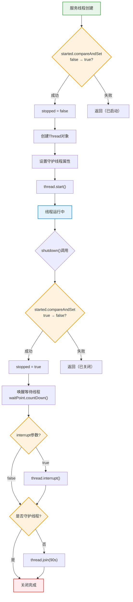
```mermaid
flowchart TD
    Start["服务线程创建"] --> CheckStart{started.compareAndSet<br/>false → true?}
    
    CheckStart -->|"成功"| SetStopped["stopped = false"]
    CheckStart -->|"失败"| ReturnStart["返回（已启动）"]
    
    SetStopped --> CreateThread["创建Thread对象"]
    CreateThread --> SetDaemon["设置守护线程属性"]
    SetDaemon --> StartThread["thread.start()"]
    StartThread --> RunningState["线程运行中"]
    
    RunningState --> CheckShutdown{"shutdown()调用"}
    CheckShutdown --> CheckCAS{"started.compareAndSet<br/>true → false?"}
    
    CheckCAS -->|"成功"| SetStoppedTrue["stopped = true"]
    CheckCAS -->|"失败"| ReturnShutdown["返回（已关闭）"]
    
    SetStoppedTrue --> WakeupThread["唤醒等待线程<br/>waitPoint.countDown()"]
    WakeupThread --> CheckInterrupt{interrupt参数?}
    
    CheckInterrupt -->|"true"| InterruptThread["thread.interrupt()"]
    CheckInterrupt -->|"false"| CheckDaemon{是否守护线程?}
    
    InterruptThread --> CheckDaemon
    CheckDaemon -->|"否"| JoinThread["thread.join(90s)"]
    CheckDaemon -->|"是"| ShutdownEnd["关闭完成"]
    
    JoinThread --> ShutdownEnd
    
    %% 样式定义
    style Start fill:#e8f5e9,stroke:#4caf50,stroke-width:2px
    style RunningState fill:#e3f2fd,stroke:#2196f3,stroke-width:2px
    style ShutdownEnd fill:#ffebee,stroke:#f44336,stroke-width:2px
    style CheckStart fill:#fff3e0,stroke:#ff9800,stroke-width:2px
    style CheckCAS fill:#fff3e0,stroke:#ff9800,stroke-width:2px
    style CheckInterrupt fill:#fff3e0,stroke:#ff9800,stroke-width:2px
    style CheckDaemon fill:#fff3e0,stroke:#ff9800,stroke-width:2px
```

**图表核心结论**：ServiceThread通过CAS原子操作保证线程的单次启动和单次关闭，通过join()机制确保优雅关闭，支持中断和超时两种关闭策略。

**停止方法对比**：

| 方法 | 设置stopped | 唤醒等待线程 | 等待线程结束 | 中断线程 | 状态 |
|------|------------|-------------|-------------|---------|------|
| `shutdown()` | ✅ | ✅ | ✅（非守护线程） | ❌ | 推荐 |
| `shutdown(true)` | ✅ | ✅ | ✅（非守护线程） | ✅ | 推荐 |
| `stop()` | ✅ | ✅ | ❌ | ❌ | @Deprecated |
| `stop(true)` | ✅ | ✅ | ❌ | ✅ | @Deprecated |
| `makeStop()` | ✅ | ❌ | ❌ | ❌ | 仅设置标志 |

**其他方法说明**：

| 方法 | 返回类型 | 说明 |
|------|---------|------|
| `isStopped()` | boolean | 检查线程是否已停止，返回 `stopped` 标志值 |
| `isDaemon()` | boolean | 检查是否为守护线程，返回 `isDaemon` 属性值 |
| `setDaemon(boolean daemon)` | void | 设置守护线程属性，必须在 `start()` 之前调用 |
| `getJoinTime()` | long | 返回等待线程结束的超时时间，默认值：90,000ms = 90s |
| `getServiceName()` | String | 抽象方法，子类必须实现，返回服务名称 |

**wakeup()与waitForRunning()协作流程**：

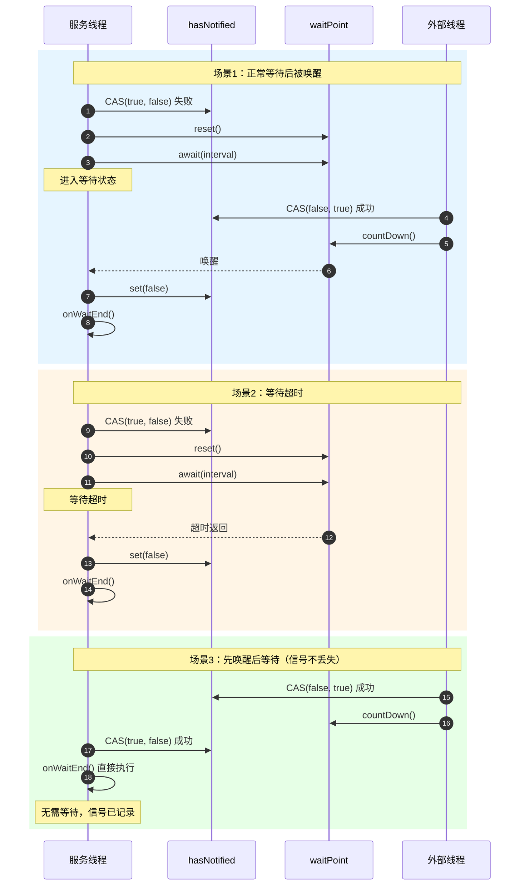
```mermaid
sequenceDiagram
    autonumber
    participant T1 as 服务线程
    participant HN as hasNotified
    participant WP as waitPoint
    participant T2 as 外部线程

    rect rgb(230, 245, 255)
        Note over T1,T2: 场景1：正常等待后被唤醒
        T1->>HN: CAS(true, false) 失败
        T1->>WP: reset()
        T1->>WP: await(interval)
        Note over T1: 进入等待状态
        T2->>HN: CAS(false, true) 成功
        T2->>WP: countDown()
        WP-->>T1: 唤醒
        T1->>HN: set(false)
        T1->>T1: onWaitEnd()
    end

    rect rgb(255, 245, 230)
        Note over T1,T2: 场景2：等待超时
        T1->>HN: CAS(true, false) 失败
        T1->>WP: reset()
        T1->>WP: await(interval)
        Note over T1: 等待超时
        WP-->>T1: 超时返回
        T1->>HN: set(false)
        T1->>T1: onWaitEnd()
    end

    rect rgb(230, 255, 230)
        Note over T1,T2: 场景3：先唤醒后等待（信号不丢失）
        T2->>HN: CAS(false, true) 成功
        T2->>WP: countDown()
        T1->>HN: CAS(true, false) 成功
        T1->>T1: onWaitEnd() 直接执行
        Note over T1: 无需等待，信号已记录
    end
```

**图表核心结论**：RocketMQ通过hasNotified标志位和CountDownLatch2的组合，实现了三种等待/唤醒场景的正确处理，特别是"先唤醒后等待"场景下信号不会丢失。

**onWaitEnd() 回调方法触发条件**：

| 触发路径 | 触发时机 | 说明 |
|---------|---------|------|
| 路径1：已被唤醒 | `hasNotified` 为 true 时 | `waitForRunning()` 开始时检测到唤醒信号，直接执行 |
| 路径2：等待超时 | `await(interval)` 超时返回 | 等待指定时间后自动执行 |
| 路径3：被外部唤醒 | `wakeup()` 调用后 | 外部线程调用 `wakeup()` 唤醒等待中的线程 |
| 路径4：被中断 | `InterruptedException` 抛出 | 线程被中断时在 finally 块中执行 |

**onWaitEnd() 使用示例**：

```java
public class MyServiceThread extends ServiceThread {
    @Override
    public void run() {
        while (!this.isStopped()) {
            // 等待 5,000ms = 5s 或被唤醒
            this.waitForRunning(5000);
        }
    }
    
    @Override
    protected void onWaitEnd() {
        // 等待结束后执行的逻辑
        // 无论是超时、被唤醒还是被中断，都会执行此方法
        doWork();
    }
    
    private void doWork() {
        // 具体业务逻辑
    }
    
    @Override
    public String getServiceName() {
        return "MyServiceThread";
    }
}
```

### 6.2 CountDownLatch2等待唤醒

RocketMQ使用 [CountDownLatch2.java](../common/src/main/java/org/apache/rocketmq/common/CountDownLatch2.java) 实现可重置的等待/唤醒机制：

```java
public class CountDownLatch2 {
    private final Sync sync;  // 基于 AQS 的同步器
    
    public CountDownLatch2(int count) {
        if (count < 0)
            throw new IllegalArgumentException("count < 0");
        this.sync = new Sync(count);
    }
    
    public void await() throws InterruptedException {
        sync.acquireSharedInterruptibly(1);
    }
    
    public boolean await(long timeout, TimeUnit unit) throws InterruptedException {
        return sync.tryAcquireSharedNanos(1, unit.toNanos(timeout));
    }
    
    public void countDown() { 
        sync.releaseShared(1); 
    }
    
    public void reset() { 
        sync.reset();  
    }
    
    private static final class Sync extends AbstractQueuedSynchronizer {
        private final int startCount;  // 初始计数值，用于reset()
        
        Sync(int count) {
            this.startCount = count;
            setState(count);  // AQS state 表示当前计数
        }
        
        @Override
        protected int tryAcquireShared(int acquires) {
            return (getState() == 0) ? 1 : -1;  // 计数为0时返回1（成功），否则返回-1（等待）
        }
        
        @Override
        protected boolean tryReleaseShared(int releases) {
            for (;;) {
                int c = getState();
                if (c == 0)
                    return false;  // 已经是0，无需再减
                int nextc = c - 1;
                if (compareAndSetState(c, nextc))
                    return nextc == 0;  // 减到0时返回true，触发唤醒
            }
        }
        
        protected void reset() {
            setState(startCount);  // 重置到初始计数值
        }
    }
}
```

**CountDownLatch vs CountDownLatch2 对比**：

| 特性 | CountDownLatch | CountDownLatch2 |
|------|---------------|-----------------|
| 可重置 | ❌ 一次性使用 | ✅ 支持reset()重复使用 |
| 计数方式 | 只能减 | 只能减，但可重置 |
| 适用场景 | 一次性事件 | 周期性等待/唤醒 |

**CountDownLatch2 方法说明**：

| 方法 | 返回类型 | 说明 |
|------|---------|------|
| `await()` | void | 阻塞等待计数器归零，可被中断 |
| `await(long timeout, TimeUnit unit)` | boolean | 超时等待，返回true表示计数归零，false表示超时 |
| `countDown()` | void | 计数减1，归零时唤醒所有等待线程 |
| `reset()` | void | 重置计数器到初始值，可重复使用 |
| `getCount()` | long | 返回当前计数值，用于调试和测试 |
| `toString()` | String | 返回标识字符串，格式：`ClassName[Count = N]` |

**关键设计**：

| 问题 | 操作系统原理 | RocketMQ解决方案 |
|------|-------------|-----------------|
| 虚假唤醒 | wait可能无故返回 | 循环检查`hasNotified`标志 |
| 信号丢失 | wakeup在wait之前调用 | `hasNotified`标志位记录唤醒信号 |
| 可重用性 | CountDownLatch只能用一次 | `reset()`方法重置计数器 |

### 6.3 ThreadPoolMonitor线程池监控

[ThreadPoolMonitor.java](../common/src/main/java/org/apache/rocketmq/common/thread/ThreadPoolMonitor.java) 提供线程池监控：

```java
public class ThreadPoolMonitor {
    private static final List<ThreadPoolWrapper> MONITOR_EXECUTOR = new CopyOnWriteArrayList<>();
    private static final ScheduledExecutorService MONITOR_SCHEDULED = Executors.newSingleThreadScheduledExecutor(
        new ThreadFactoryBuilder().setNameFormat("ThreadPoolMonitor-%d").build()
    );

    private static volatile long threadPoolStatusPeriodTime = TimeUnit.SECONDS.toMillis(3);  // 状态打印周期，默认值：3,000ms = 3s
    private static volatile boolean enablePrintJstack = true;  // 是否启用jstack打印，默认值：true
    private static volatile long jstackPeriodTime = 60000;     // jstack打印间隔，默认值：60,000ms = 60s

    public static ThreadPoolExecutor createAndMonitor(int corePoolSize,
        int maximumPoolSize,
        long keepAliveTime,
        TimeUnit unit,
        String name,
        int queueCapacity) {
        ThreadPoolExecutor executor = new ThreadPoolExecutor(
            corePoolSize,
            maximumPoolSize,
            keepAliveTime,
            unit,
            new LinkedBlockingQueue<>(queueCapacity),
            new ThreadFactoryBuilder().setNameFormat(name + "-%d").build(),
            new ThreadPoolExecutor.DiscardOldestPolicy());  // 拒绝策略：丢弃最老的任务
        
        MONITOR_EXECUTOR.add(ThreadPoolWrapper.builder()
            .name(name)
            .threadPoolExecutor(executor)
            .build());
        return executor;
    }

    public static void logThreadPoolStatus() {
        for (ThreadPoolWrapper threadPoolWrapper : MONITOR_EXECUTOR) {
            // 队列积压超过阈值时打印jstack
            if (enablePrintJstack && needPrintJstack) {
                jstackLogger.warn("jstack start\n{}", UtilAll.jstack());
            }
        }
    }
}
```

**监控能力**：

| 监控项 | 说明 | 默认阈值 | 作用 |
|--------|------|---------|------|
| 队列大小 | 监控任务积压 | 队列容量 * 85% | 发现性能瓶颈 |
| 自动jstack | 队列积压时打印线程堆栈 | 间隔 60,000ms = 60s | 排查阻塞原因 |
| 定时输出 | 每 3,000ms = 3s 输出状态 | 3,000ms = 3s | 持续监控 |

**ThreadPoolMonitor 字段说明**：

| 字段 | 类型 | 默认值 | 说明 |
|------|------|--------|------|
| `threadPoolStatusPeriodTime` | long | 3,000ms = 3s | 状态打印周期 |
| `enablePrintJstack` | boolean | true | 是否启用jstack打印 |
| `jstackPeriodTime` | long | 60,000ms = 60s | jstack打印间隔 |
| `jstackTime` | long | System.currentTimeMillis() | 上次jstack打印时间 |
| `MONITOR_EXECUTOR` | List | CopyOnWriteArrayList | 监控的线程池列表 |
| `MONITOR_SCHEDULED` | ScheduledExecutorService | 单线程调度器 | 定时任务执行器 |

**ThreadPoolMonitor 方法说明**：

| 方法 | 返回类型 | 说明 |
|------|---------|------|
| `config(...)` | void | 配置日志器、打印开关、时间参数 |
| `createAndMonitor(...)` | ThreadPoolExecutor | 创建线程池并添加到监控列表 |
| `logThreadPoolStatus()` | void | 打印所有监控线程池的状态 |
| `init()` | void | 启动定时监控任务，延迟 20ms 后每隔 threadPoolStatusPeriodTime 执行一次 |
| `shutdown()` | void | 关闭定时监控任务 |

### 6.4 消息写入锁实现

#### 6.4.1 锁选择策略

[CommitLog.java](../store/src/main/java/org/apache/rocketmq/store/CommitLog.java) 根据配置选择锁：

```java
public class CommitLog implements Swappable {
    protected final PutMessageLock putMessageLock;
    protected final TopicQueueLock topicQueueLock;

    public CommitLog(final DefaultMessageStore messageStore) {
        // 根据配置选择锁类型
        this.putMessageLock = messageStore.getMessageStoreConfig()
            .isUseReentrantLockWhenPutMessage() 
            ? new PutMessageReentrantLock()   // 使用可重入锁
            : new PutMessageSpinLock();       // 使用自旋锁（默认）
        
        this.topicQueueLock = new TopicQueueLock();  // 分段锁
    }
}
```

**配置项**：`useReentrantLockWhenPutMessage`，默认值：**true**（使用可重入锁）。

#### 6.4.2 FlowMonitor服务线程示例

[FlowMonitor.java](../store/src/main/java/org/apache/rocketmq/store/ha/FlowMonitor.java) 是典型的服务线程：

```java
public class FlowMonitor extends ServiceThread {
    private final AtomicLong transferredByte = new AtomicLong(0L);  // 已传输字节数，默认值：0
    private volatile long transferredByteInSecond;  // 每秒传输字节数
    protected MessageStoreConfig messageStoreConfig;  // 消息存储配置

    public FlowMonitor(MessageStoreConfig messageStoreConfig) {
        this.messageStoreConfig = messageStoreConfig;  // 注入配置对象
    }

    @Override
    public void run() {
        while (!this.isStopped()) {
            this.waitForRunning(1 * 1000);  // 等待 1,000ms = 1s
            this.calculateSpeed();  // 计算传输速度
        }
    }

    public void calculateSpeed() {
        this.transferredByteInSecond = this.transferredByte.get();  // 获取累计值
        this.transferredByte.set(0);  // 重置计数器
    }

    public int canTransferMaxByteNum() {
        // 流控未启用时返回最大值
        if (this.isFlowControlEnable()) {
            long res = Math.max(this.maxTransferByteInSecond() - this.transferredByte.get(), 0);
            return res > Integer.MAX_VALUE ? Integer.MAX_VALUE : (int) res;
        }
        return Integer.MAX_VALUE;  // 无流控限制
    }

    public void addByteCountTransferred(long count) {
        this.transferredByte.addAndGet(count);  // 原子增加传输字节数
    }

    public long getTransferredByteInSecond() {
        return this.transferredByteInSecond;  // 返回每秒传输字节数
    }

    @Override
    public String getServiceName() {
        return FlowMonitor.class.getSimpleName();  // 返回 "FlowMonitor"
    }

    protected boolean isFlowControlEnable() {
        return this.messageStoreConfig.isHaFlowControlEnable();  // 是否启用HA流控
    }

    public long maxTransferByteInSecond() {
        return this.messageStoreConfig.getMaxHaTransferByteInSecond();  // 每秒最大传输字节数
    }
}
```

**FlowMonitor 字段说明**：

| 字段 | 类型 | 默认值 | 说明 |
|------|------|--------|------|
| `transferredByte` | AtomicLong | 0 | 已传输字节数，原子计数器 |
| `transferredByteInSecond` | long | 0 | 每秒传输字节数，用于速度统计 |
| `messageStoreConfig` | MessageStoreConfig | null | 消息存储配置对象 |

**FlowMonitor 方法说明**：

| 方法 | 返回类型 | 说明 |
|------|---------|------|
| `run()` | void | 主循环，每 1,000ms = 1s 计算一次传输速度 |
| `calculateSpeed()` | void | 计算每秒传输速度，重置计数器 |
| `canTransferMaxByteNum()` | int | 返回当前可传输的最大字节数，流控未启用时返回 Integer.MAX_VALUE |
| `addByteCountTransferred(long count)` | void | 原子增加传输字节数 |
| `getTransferredByteInSecond()` | long | 返回每秒传输字节数 |
| `getServiceName()` | String | 返回服务名称 "FlowMonitor" |
| `isFlowControlEnable()` | boolean | 检查是否启用HA流控 |
| `maxTransferByteInSecond()` | long | 返回每秒最大传输字节数限制 |

**线程命名规范**：

```java
// 服务线程命名
public abstract String getServiceName();  // 子类实现，返回服务名称

// 线程池命名
new ThreadFactoryBuilder().setNameFormat(name + "-%d").build()

// Netty线程命名
new Thread(r, String.format("NettyServerEPOLLSelector_%d_%d", total, index));
```

### 6.5 原子操作应用

#### 6.5.1 ServiceThread状态管理

[ServiceThread.java](../common/src/main/java/org/apache/rocketmq/common/ServiceThread.java) 使用CAS保证线程安全：

```java
public abstract class ServiceThread implements Runnable {
    private final AtomicBoolean started = new AtomicBoolean(false);  // 默认值：false
    protected volatile boolean stopped = false;  // 默认值：false

    public void start() {
        if (!started.compareAndSet(false, true)) {
            return;  // 已经启动，直接返回
        }
        stopped = false;
        this.thread = new Thread(this, getServiceName());
        this.thread.start();
    }

    public void shutdown(final boolean interrupt) {
        if (!started.compareAndSet(true, false)) {
            return;  // 已经关闭，直接返回
        }
        this.stopped = true;
    }
}
```

#### 6.5.2 ReferenceResource引用计数

[ReferenceResource.java](../store/src/main/java/org/apache/rocketmq/store/ReferenceResource.java) 使用AtomicLong实现引用计数：

```java
public abstract class ReferenceResource {
    protected final AtomicLong refCount = new AtomicLong(1);  // 初始引用计数，默认值：1
    protected volatile boolean available = true;              // 是否可用，默认值：true
    protected volatile boolean cleanupOver = false;           // 是否清理完成，默认值：false
    private volatile long firstShutdownTimestamp = 0;         // 首次关闭时间戳，默认值：0

    /**
     * 持有资源，增加引用计数
     */
    public synchronized boolean hold() {
        if (this.isAvailable()) {
            if (this.refCount.getAndIncrement() > 0) {
                return true;  // 引用计数 > 0，持有成功
            } else {
                this.refCount.getAndDecrement();  // 回滚
            }
        }
        return false;
    }

    /**
     * 检查资源是否可用
     */
    public boolean isAvailable() {
        return this.available;
    }

    /**
     * 关闭资源，支持强制关闭
     * @param intervalForcibly 强制关闭等待间隔，单位：ms
     */
    public void shutdown(final long intervalForcibly) {
        if (this.available) {
            this.available = false;
            this.firstShutdownTimestamp = System.currentTimeMillis();
            this.release();
        } else if (this.getRefCount() > 0) {
            // 超时后强制关闭
            if ((System.currentTimeMillis() - this.firstShutdownTimestamp) >= intervalForcibly) {
                this.refCount.set(-1000 - this.getRefCount());  // 设置为负数触发强制清理
                this.release();
            }
        }
    }

    /**
     * 释放资源，减少引用计数
     */
    public void release() {
        long value = this.refCount.decrementAndGet();
        if (value > 0)
            return;  // 还有引用，不清理

        synchronized (this) {
            this.cleanupOver = this.cleanup(value);  // 引用计数 <= 0，执行清理
        }
    }

    /**
     * 获取当前引用计数
     */
    public long getRefCount() {
        return this.refCount.get();
    }

    /**
     * 抽象方法，子类实现具体清理逻辑
     */
    public abstract boolean cleanup(final long currentRef);

    /**
     * 检查是否清理完成
     */
    public boolean isCleanupOver() {
        return this.refCount.get() <= 0 && this.cleanupOver;
    }
}
```

**ReferenceResource 引用计数流程**：

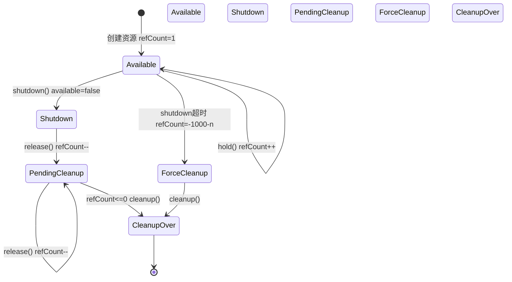
```mermaid
stateDiagram-v2
    [*] --> Available: 创建资源 refCount=1
    Available --> Available: hold() refCount++
    Available --> Shutdown: shutdown() available=false
    Shutdown --> PendingCleanup: release() refCount--
    PendingCleanup --> PendingCleanup: release() refCount--
    PendingCleanup --> CleanupOver: refCount<=0 cleanup()
    Available --> ForceCleanup: shutdown超时 refCount=-1000-n
    ForceCleanup --> CleanupOver: cleanup()
    CleanupOver --> [*]
    
    %% 状态样式定义
    state "Available" as AVAILABLE
    state "Shutdown" as SHUTDOWN
    state "PendingCleanup" as PENDING
    state "ForceCleanup" as FORCE
    state "CleanupOver" as CLEANUP
```

**图表核心结论**：ReferenceResource通过AtomicLong实现引用计数，支持正常关闭和超时强制关闭两种资源释放路径，确保资源生命周期管理的安全性。

**引用计数管理详细流程**：

```mermaid
flowchart TD
    Start["资源创建"] --> Init["初始化<br/>refCount=1<br/>available=true"]
    Init --> HoldPath["hold()路径"]
    
    subgraph HoldPath["持有资源流程"]
        direction TB
        H1["检查available==true?"] --> H2{"refCount.getAndIncrement() > 0?"}
        H2 -->|"是"| H3["持有成功<br/>refCount++"]
        H2 -->|"否"| H4["回滚<br/>refCount.getAndDecrement()"]
        H4 --> H5["持有失败"]
    end
    
    H3 --> ReleasePath
    
    subgraph ReleasePath["释放资源流程"]
        direction TB
        R1["release()"] --> R2["refCount.decrementAndGet()"]
        R2 --> R3{"value > 0?"}
        R3 -->|"是"| R4["还有引用<br/>不清理"]
        R3 -->|"否"| R5["执行清理<br/>cleanup()"]
    end
    
    Init --> ShutdownPath
    
    subgraph ShutdownPath["关闭资源流程"]
        direction TB
        S1["shutdown(intervalForcibly)"] --> S2{"available==true?"}
        S2 -->|"是"| S3["available=false<br/>记录时间戳"]
        S2 -->|"否"| S4{"refCount > 0?"}
        S4 -->|"是"| S5{"超时?"}
        S5 -->|"是"| S6["强制关闭<br/>refCount=-1000-n"]
        S5 -->|"否"| S7["等待超时"]
        S3 --> R1
        S6 --> R1
    end
    
    R5 --> End["资源清理完成"]
    
    %% 样式定义
    style Start fill:#e8f5e9,stroke:#4caf50,stroke-width:2px
    style Init fill:#e3f2fd,stroke:#2196f3,stroke-width:2px
    style HoldPath fill:#fff3e0,stroke:#ff9800,stroke-width:2px
    style ReleasePath fill:#f3e5f5,stroke:#9c27b0,stroke-width:2px
    style ShutdownPath fill:#ffebee,stroke:#f44336,stroke-width:2px
    style End fill:#e8f5e9,stroke:#4caf50,stroke-width:2px
```

**图表核心结论**：ReferenceResource提供三种资源管理路径：hold()增加引用、release()减少引用、shutdown()关闭资源，支持正常关闭和超时强制关闭，确保资源安全释放。

**引用计数状态说明**：

| refCount值 | 状态 | 说明 |
|------------|------|------|
| > 0 | 正常使用 | 有活跃引用，资源可用 |
| = 0 | 可清理 | 无引用，可执行清理 |
| < 0 | 强制清理 | 超时强制关闭，立即清理 |

**ReferenceResource 字段说明**：

| 字段 | 类型 | 默认值 | 说明 |
|------|------|--------|------|
| `refCount` | AtomicLong | 1 | 引用计数器，初始值为1表示创建时有一个引用 |
| `available` | boolean | true | 资源是否可用，shutdown后设为false |
| `cleanupOver` | boolean | false | 清理是否完成 |
| `firstShutdownTimestamp` | long | 0 | 首次调用shutdown的时间戳，用于强制关闭超时判断 |

**ReferenceResource 方法说明**：

| 方法 | 返回类型 | 说明 |
|------|---------|------|
| `hold()` | boolean | 持有资源，引用计数+1，成功返回true |
| `isAvailable()` | boolean | 检查资源是否可用 |
| `shutdown(long intervalForcibly)` | void | 关闭资源，支持超时强制关闭 |
| `release()` | void | 释放资源，引用计数-1，归零时执行清理 |
| `getRefCount()` | long | 获取当前引用计数 |
| `cleanup(long currentRef)` | boolean | 抽象方法，子类实现具体清理逻辑 |
| `isCleanupOver()` | boolean | 检查是否清理完成（refCount<=0 && cleanupOver） |

**原子操作应用场景**：

| 场景 | 使用类 | 说明 |
|------|--------|------|
| 状态标志 | AtomicBoolean | 线程启动/停止状态 |
| 引用计数 | AtomicLong | 资源生命周期管理 |
| 统计计数 | AtomicLong | 流量统计、消息计数 |
| 唤醒标志 | AtomicBoolean | 避免重复唤醒 |

### 6.6 最佳实践总结

**线程池配置**：

- 核心线程数 = CPU核心数 * (1 + 等待时间/计算时间)
- 最大线程数根据业务峰值设置
- 使用有界队列防止OOM
- 选择合适的拒绝策略

**锁选择**：

- 优先考虑无锁设计（CAS、原子类）
- 短持有时间用自旋锁
- 长持有时间用可重入锁
- 高并发写用分段锁

**线程命名**：

- 使用有意义的线程名称
- 便于问题排查和监控
- 格式：`业务模块-功能-序号`
