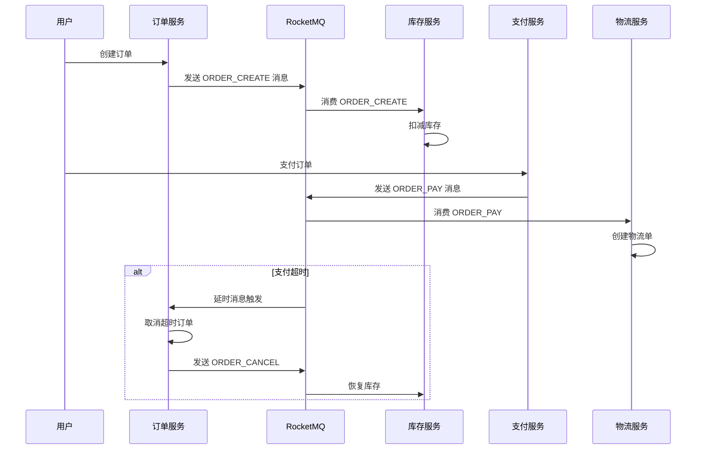
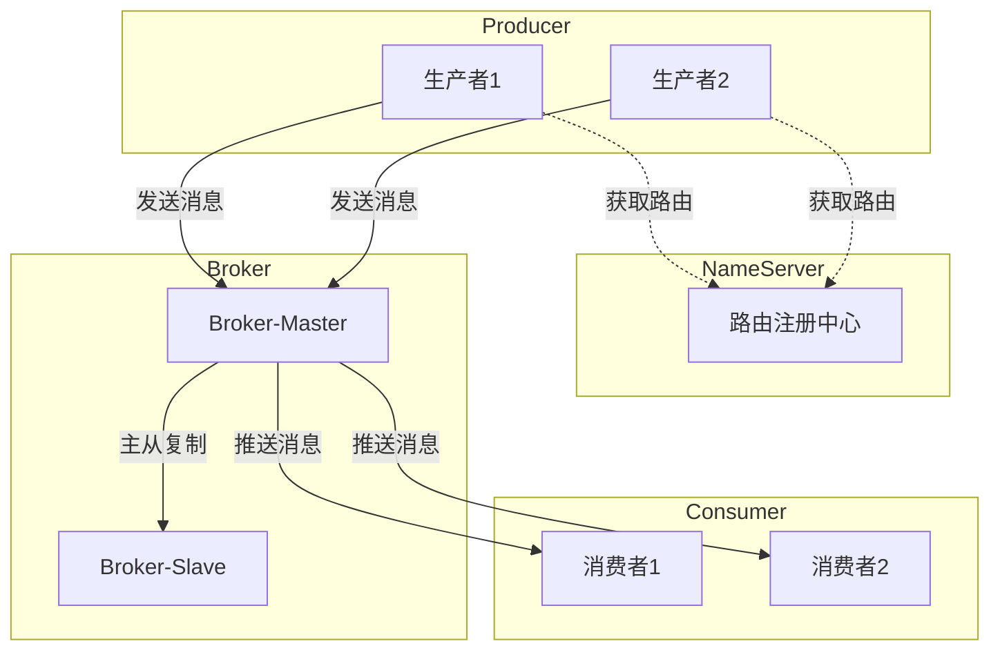
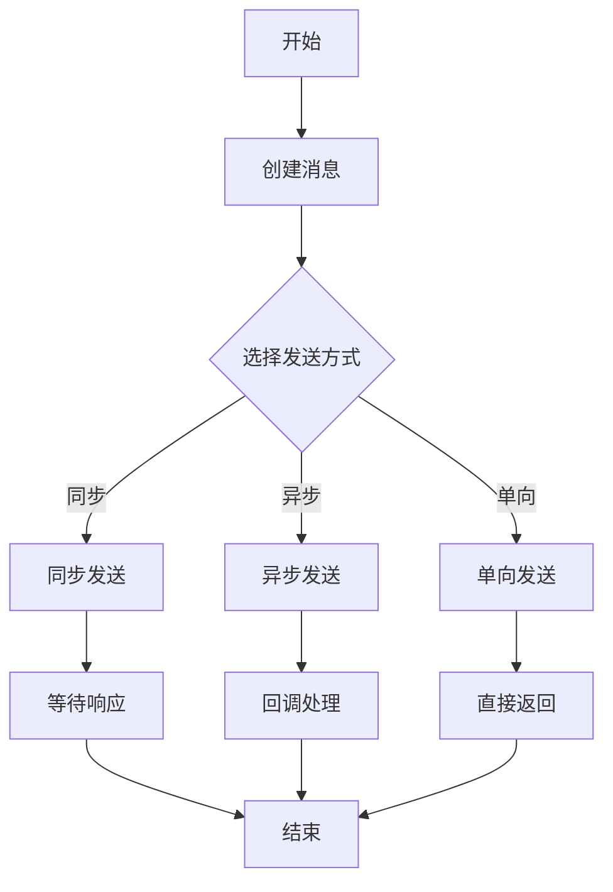
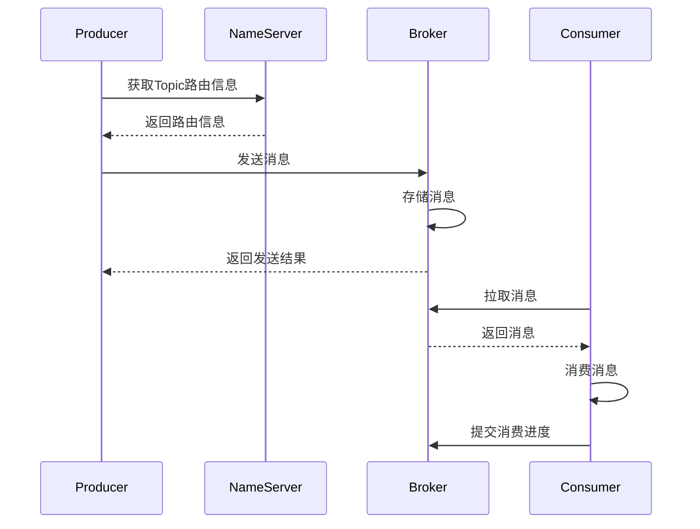

# RocketMQ 5.0.0 源码解读 - 统一示例

> **文档版本**: v1.0  
> **生成时间**: 2026-02-19  
> **RocketMQ版本**: 5.0.0  
> **存储路径**: ./docs2

---

## 一、统一场景说明

### 1.1 业务场景

本文档采用**电商订单系统**作为统一业务场景，贯穿所有模块文档，确保示例逻辑连贯、易于理解。

```
┌─────────────────────────────────────────────────────────────────┐
│                        电商订单系统架构                           │
├─────────────────────────────────────────────────────────────────┤
│                                                                 │
│  ┌──────────┐    ┌──────────┐    ┌──────────┐    ┌──────────┐  │
│  │ 订单服务 │    │ 支付服务 │    │ 库存服务 │    │ 物流服务 │  │
│  └────┬─────┘    └────┬─────┘    └────┬─────┘    └────┬─────┘  │
│       │               │               │               │        │
│       └───────────────┴───────┬───────┴───────────────┘        │
│                               │                                 │
│                    ┌──────────▼──────────┐                     │
│                    │    RocketMQ 集群     │                     │
│                    │  ┌───────────────┐  │                     │
│                    │  │  NameServer   │  │                     │
│                    │  └───────┬───────┘  │                     │
│                    │          │          │                     │
│                    │  ┌───────▼───────┐  │                     │
│                    │  │ Broker-Master │  │                     │
│                    │  └───────┬───────┘  │                     │
│                    │          │          │                     │
│                    │  ┌───────▼───────┐  │                     │
│                    │  │ Broker-Slave  │  │                     │
│                    │  └───────────────┘  │                     │
│                    └─────────────────────┘                     │
│                                                                 │
└─────────────────────────────────────────────────────────────────┘
```

### 1.2 Topic 规划

| Topic名称 | 用途 | 消费者组 | 说明 |
|-----------|------|----------|------|
| `ORDER_CREATE` | 订单创建 | `ORDER_PROCESS_GROUP` | 订单创建后发送，触发库存扣减、支付等待 |
| `ORDER_PAY` | 订单支付 | `PAY_NOTIFY_GROUP` | 支付成功后发送，触发物流发货 |
| `ORDER_CANCEL` | 订单取消 | `CANCEL_PROCESS_GROUP` | 订单取消后发送，触发库存恢复、退款 |
| `ORDER_DELAY` | 延迟订单 | `DELAY_CHECK_GROUP` | 延时检查订单状态，超时自动取消 |

### 1.3 核心消息流转



---

## 二、核心功能示例

### 2.1 消息发送示例

#### 2.1.1 同步发送

```java
// 文件路径: client/producer/DefaultMQProducer.java

DefaultMQProducer producer = new DefaultMQProducer("ORDER_PRODUCER_GROUP");
producer.setNamesrvAddr("192.168.1.100:9876");
producer.start();

Message msg = new Message(
    "ORDER_CREATE",                              // Topic: 订单创建主题
    "TagA",                                      // Tag: 消息标签
    "ORDER_20260219001",                         // Keys: 消息唯一标识
    "订单内容JSON".getBytes(RemotingHelper.DEFAULT_CHARSET)  // Body: 消息体
);

// 同步发送，等待Broker响应
// 参数说明:
//   - msg: 待发送的消息对象
//   - 超时时间: 3000ms（注释：同步发送默认超时时间，单位：毫秒）= 3秒（易读格式）
SendResult sendResult = producer.send(msg, 3000);

System.out.println("发送结果: " + sendResult.getSendStatus());
```

#### 2.1.2 异步发送

```java
// 文件路径: client/producer/DefaultMQProducer.java

// 异步发送，通过回调获取发送结果
// 参数说明:
//   - msg: 待发送的消息对象
//   - SendCallback: 异步回调接口
//   - 超时时间: 3000ms（注释：异步发送默认超时时间，单位：毫秒）= 3秒（易读格式）
producer.send(msg, new SendCallback() {
    @Override
    public void onSuccess(SendResult sendResult) {
        System.out.println("发送成功: " + sendResult.getMsgId());
    }

    @Override
    public void onException(Throwable e) {
        System.err.println("发送失败: " + e.getMessage());
    }
}, 3000);
```

#### 2.1.3 单向发送

```java
// 文件路径: client/producer/DefaultMQProducer.java

// 单向发送，不等待Broker响应，适用于日志收集等场景
// 参数说明:
//   - msg: 待发送的消息对象
producer.sendOneway(msg);
```

### 2.2 消息消费示例

#### 2.2.1 Push模式消费

```java
// 文件路径: client/consumer/DefaultMQPushConsumer.java

DefaultMQPushConsumer consumer = new DefaultMQPushConsumer("ORDER_PROCESS_GROUP");
consumer.setNamesrvAddr("192.168.1.100:9876");
consumer.subscribe("ORDER_CREATE", "TagA || TagB");

// 设置消费模式: 集群消费（默认）
// MessageModel.CLUSTERING: 每条消息被消费组内一个消费者消费
// MessageModel.BROADCASTING: 每条消息被消费组内所有消费者消费
consumer.setMessageModel(MessageModel.CLUSTERING);

// 设置消费线程数
// 最小线程数: 20个（注释：消费线程池最小线程数，单位：个）
// 最大线程数: 64个（注释：消费线程池最大线程数，单位：个）
consumer.setConsumeThreadMin(20);
consumer.setConsumeThreadMax(64);

// 注册消息监听器
consumer.registerMessageListener(new MessageListenerConcurrently() {
    @Override
    public ConsumeConcurrentlyStatus consumeMessage(
            List<MessageExt> msgs,
            ConsumeConcurrentlyContext context) {
        for (MessageExt msg : msgs) {
            System.out.println("收到消息: " + new String(msg.getBody()));
        }
        // 返回消费成功状态
        return ConsumeConcurrentlyStatus.CONSUME_SUCCESS;
    }
});

consumer.start();
```

#### 2.2.2 Pull模式消费

```java
// 文件路径: client/consumer/DefaultMQPullConsumer.java

DefaultMQPullConsumer pullConsumer = new DefaultMQPullConsumer("ORDER_PROCESS_GROUP");
pullConsumer.setNamesrvAddr("192.168.1.100:9876");
pullConsumer.start();

// 获取消息队列
Set<MessageQueue> mqs = pullConsumer.fetchSubscribeMessageQueues("ORDER_CREATE");

for (MessageQueue mq : mqs) {
    // 拉取消息
    // 参数说明:
    //   - mq: 消息队列
    //   - subExpression: 订阅表达式
    //   - offset: 起始偏移量
    //   - maxNums: 最大拉取数量: 32条（注释：单次拉取最大消息数，单位：条）
    PullResult pullResult = pullConsumer.pull(
        mq, 
        "TagA", 
        0L, 
        32
    );
    
    switch (pullResult.getPullStatus()) {
        case FOUND:
            List<MessageExt> msgs = pullResult.getMsgFoundList();
            for (MessageExt msg : msgs) {
                System.out.println("拉取到消息: " + new String(msg.getBody()));
            }
            break;
        case NO_NEW_MSG:
            System.out.println("没有新消息");
            break;
        case NO_MATCHED_MSG:
            System.out.println("没有匹配的消息");
            break;
        case OFFSET_ILLEGAL:
            System.out.println("偏移量非法");
            break;
    }
}
```

### 2.3 顺序消息示例

```java
// 文件路径: client/producer/DefaultMQProducer.java

// 顺序消息发送，保证同一订单的消息按顺序消费
// 通过MessageQueueSelector选择队列，相同订单ID的消息发送到同一队列
Message msg = new Message("ORDER_CREATE", "TagA", "ORDER_20260219001", "订单内容".getBytes());

SendResult result = producer.send(msg, new MessageQueueSelector() {
    @Override
    public MessageQueue select(List<MessageQueue> mqs, Message msg, Object arg) {
        // arg为订单ID，根据订单ID选择队列
        Long orderId = (Long) arg;
        long index = orderId % mqs.size();
        return mqs.get((int) index);
    }
}, 20260219001L);  // 订单ID作为分区键

// 顺序消费监听器
consumer.registerMessageListener(new MessageListenerOrderly() {
    @Override
    public ConsumeOrderlyStatus consumeMessage(
            List<MessageExt> msgs,
            ConsumeOrderlyContext context) {
        for (MessageExt msg : msgs) {
            System.out.println("顺序消费消息: " + new String(msg.getBody()));
        }
        return ConsumeOrderlyStatus.SUCCESS;
    }
});
```

### 2.4 延时消息示例

```java
// 文件路径: client/producer/DefaultMQProducer.java

Message msg = new Message("ORDER_DELAY", "TagA", "ORDER_20260219001", "延时检查".getBytes());

// 设置延时级别
// 延时级别对照表:
// 1s 5s 10s 30s 1m 2m 3m 4m 5m 6m 7m 8m 9m 10m 20m 30m 1h 2h
// 1  2  3   4   5  6  7  8  9  10 11 12 13  14  15  16  17 18
// 示例: level=16 表示延时30分钟
msg.setDelayTimeLevel(16);  // 延时30分钟（注释：延时级别16，对应30分钟延时）

producer.send(msg);
```

### 2.5 事务消息示例

```java
// 文件路径: client/producer/TransactionMQProducer.java

TransactionMQProducer transactionProducer = new TransactionMQProducer("ORDER_TRANSACTION_GROUP");
transactionProducer.setNamesrvAddr("192.168.1.100:9876");

// 设置事务监听器
transactionProducer.setTransactionListener(new TransactionListener() {
    @Override
    public LocalTransactionState executeLocalTransaction(Message msg, Object arg) {
        // 执行本地事务
        try {
            // 创建订单、扣减库存等本地操作
            createOrder((String) arg);
            return LocalTransactionState.COMMIT_MESSAGE;
        } catch (Exception e) {
            return LocalTransactionState.ROLLBACK_MESSAGE;
        }
    }

    @Override
    public LocalTransactionState checkLocalTransaction(MessageExt msg) {
        // 事务回查，检查本地事务状态
        String orderId = msg.getKeys();
        if (checkOrderExists(orderId)) {
            return LocalTransactionState.COMMIT_MESSAGE;
        }
        return LocalTransactionState.ROLLBACK_MESSAGE;
    }
});

transactionProducer.start();

// 发送事务消息
Message msg = new Message("ORDER_CREATE", "TagA", "ORDER_20260219001", "订单内容".getBytes());
TransactionSendResult result = transactionProducer.sendMessageInTransaction(msg, "ORDER_20260219001");
```

### 2.6 批量消息示例

```java
// 文件路径: client/producer/DefaultMQProducer.java

List<Message> messages = new ArrayList<>();
messages.add(new Message("ORDER_CREATE", "TagA", "ORDER_001", "订单1".getBytes()));
messages.add(new Message("ORDER_CREATE", "TagA", "ORDER_002", "订单2".getBytes()));
messages.add(new Message("ORDER_CREATE", "TagA", "ORDER_003", "订单3".getBytes()));

// 批量发送
// 注意: 批量消息的Topic必须相同，不能是延时消息和事务消息
// 单批次大小限制: 4194304字节（注释：批量消息最大字节数，单位：字节）= 4MB（易读格式）
SendResult result = producer.send(messages);
```

---

## 三、全局格式规范

### 3.1 数字格式规范

#### 3.1.1 时间类数字

| 配置项 | 原始值 | 单位 | 注释 | 易读格式 |
|--------|--------|------|------|----------|
| 同步发送超时 | 3000 | 毫秒 | 同步发送默认超时时间 | 3秒 |
| 心跳检测间隔 | 30000 | 毫秒 | Broker与NameServer心跳间隔 | 30秒 |
| 连接超时 | 3000 | 毫秒 | Netty连接超时时间 | 3秒 |
| 刷盘超时 | 5000 | 毫秒 | 同步刷盘超时时间 | 5秒 |
| 消费超时 | 15 | 分钟 | 消费重试最大时间 | 15分钟 |
| 延时消息最大延时 | 2 | 小时 | 延时消息最大延时时间 | 2小时 |

**示例写法**:
```
3000ms（注释：同步发送默认超时时间，单位：毫秒）= 3秒（易读格式）
```

#### 3.1.2 大小类数字

| 配置项 | 原始值 | 单位 | 注释 | 易读格式 |
|--------|--------|------|------|----------|
| CommitLog单文件大小 | 1073741824 | 字节 | CommitLog单个文件最大大小 | 1GB |
| ConsumeQueue单文件大小 | 6000000 | 字节 | ConsumeQueue单个文件大小 | 约5.7MB |
| 消息最大大小 | 4194304 | 字节 | 单条消息最大字节数 | 4MB |
| MappedFile大小 | 1073741824 | 字节 | 内存映射文件大小 | 1GB |
| 批量消息最大大小 | 4194304 | 字节 | 批量消息最大字节数 | 4MB |

**示例写法**:
```
1073741824字节（注释：CommitLog单个文件最大大小，单位：字节）= 1GB（易读格式）
```

#### 3.1.3 数量类数字

| 配置项 | 原始值 | 单位 | 注释 |
|--------|--------|------|------|
| 默认消费线程最小数 | 20 | 个 | 消费线程池最小线程数 |
| 默认消费线程最大数 | 64 | 个 | 消费线程池最大线程数 |
| 单次拉取最大消息数 | 32 | 条 | Pull模式单次拉取最大消息数 |
| 消息重试次数 | 16 | 次 | 消息发送最大重试次数 |
| 默认队列数量 | 4 | 个 | Topic默认队列数量 |

**示例写法**:
```
20个（注释：消费线程池最小线程数，单位：个）
```

### 3.2 源码片段规范

#### 3.2.1 项目自有源码

```java
// 文件路径: store/CommitLog.java
// 说明: 必须标注完整文件路径，便于读者定位源码

public class CommitLog {
    // CommitLog单文件默认大小
    // 1073741824字节（注释：CommitLog单个文件最大大小，单位：字节）= 1GB（易读格式）
    private static final int mappedFileSize = 1024 * 1024 * 1024;
    
    // 消息追加方法
    public PutMessageResult putMessage(final MessageExtBrokerInner msg) {
        // 源码逻辑...
    }
}
```

#### 3.2.2 系统API补充源码

```java
// 来源: OpenJDK官方源码 (jdk/src/share/classes/java/nio/channels/FileChannel.java)
// 说明: 系统API必须标注来源，区分于项目自有代码

public abstract class FileChannel extends AbstractInterruptibleChannel {
    /**
     * 将文件区域映射到内存
     * @param mode 映射模式: READ_ONLY, READ_WRITE, PRIVATE
     * @param position 文件起始位置
     * @param size 映射区域大小
     * @return MappedByteBuffer 内存映射缓冲区
     */
    public abstract MappedByteBuffer map(MapMode mode, long position, long size)
        throws IOException;
}
```

### 3.3 图表规范

#### 3.3.1 Mermaid图表（优先使用）

**架构图示例**:


**流程图示例**:


**时序图示例**:


#### 3.3.2 ASCII图表（简单结构）

**存储结构示例**:
```
+------------------+------------------+------------------+
|    CommitLog     |   ConsumeQueue   |    IndexFile     |
+------------------+------------------+------------------+
| 消息完整内容      | 消息偏移量        | Key哈希值         |
| (顺序写入)        | 消息大小          | 消息偏移量        |
|                  | TagsCode         | 时间戳            |
+------------------+------------------+------------------+
| 1GB/文件         | 5.7MB/文件       | 400MB/文件        |
+------------------+------------------+------------------+
```

**消息结构示例**:
```
+--------+--------+--------+--------+--------+--------+
| 4字节  | 4字节  | 8字节  | 8字节  | 4字节  | N字节  |
+--------+--------+--------+--------+--------+--------+
| 总长度 | 魔数   | CRC32  | 队列ID | 标志位 | 消息体 |
+--------+--------+--------+--------+--------+--------+
```

### 3.4 注释规范

#### 3.4.1 代码注释

```java
// 单行注释: 说明代码作用
int queueId = message.getQueueId();

/*
 * 多行注释: 说明复杂逻辑
 * 1. 获取消息队列ID
 * 2. 根据队列ID选择CommitLog文件
 * 3. 追加消息到CommitLog
 */
public PutMessageResult putMessage(MessageExtBrokerInner msg) {
    // ...
}

/**
 * Javadoc注释: 说明方法用途、参数、返回值
 * @param msg 待存储的消息
 * @return 存储结果，包含状态码和提示信息
 */
public PutMessageResult putMessage(final MessageExtBrokerInner msg) {
    // ...
}
```

#### 3.4.2 配置注释

```properties
# Broker配置文件: broker.conf
# 说明: 每个配置项必须有注释说明

# Broker名称
brokerName = broker-a

# Broker角色: ASYNC_MASTER, SYNC_MASTER, SLAVE
brokerRole = ASYNC_MASTER

# 刷盘方式: ASYNC_FLUSH, SYNC_FLUSH
flushDiskType = ASYNC_FLUSH

# Broker对外服务的监听端口
# 10911（注释：Broker默认监听端口，单位：端口号）
listenPort = 10911

# CommitLog存储路径
storePathCommitLog = /home/rocketmq/store/commitlog

# ConsumeQueue存储路径
storePathConsumeQueue = /home/rocketmq/store/consumequeue
```

---

## 四、跨文件引用规范

### 4.1 引用格式

当需要引用其他模块内容时，使用以下格式：

```
详细说明请参考《02-消息存储引擎源码解析.md》
```

当引用系统API时，需标注来源：

```
详细说明请参考《07-操作系统概念与API源码解析.md》（系统API来源：OpenJDK官方源码）
```

### 4.2 公共内容存放

以下内容统一放在对应模块，其他模块仅引用：

| 内容类型 | 存放模块 | 说明 |
|----------|----------|------|
| 内存映射(mmap)、零拷贝、PageCache | 07-操作系统概念与API | 底层系统调用原理 |
| Netty框架、RPC调用 | 06-网络通信层 | 网络通信框架 |
| JDK NIO API | 07-操作系统概念与API | Java NIO原理 |
| DLedger选主协议 | 05-高可用与主从复制 | 分布式一致性 |

---

## 五、修订记录

| 版本 | 修订时间 | 修订内容 | 修订人 |
|------|----------|----------|--------|
| v1.0 | 2026-02-19 | 初始版本，定义统一场景与格式规范 | Source Code Reading Expert |

---

> **说明**: 本文档为 RocketMQ 5.0.0 源码解读的统一示例文档，定义了统一业务场景、核心功能示例、全局格式规范。后续所有模块文档均遵循此规范，确保内容连贯、格式统一。
