# 内存管理

> **关联文档**：文件存储实现请参阅 [03-文件存储.md](03-文件存储.md)，原子操作请参阅 [01-线程与并发.md](01-线程与并发.md#9-原子操作)。

## 内存管理技术总览

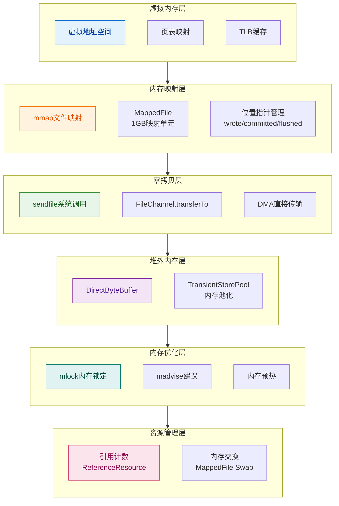

**核心结论**：RocketMQ内存管理采用分层架构，从底层的虚拟内存机制到上层的资源管理，通过mmap实现高效文件访问、零拷贝优化网络传输、堆外内存池避免GC影响，最终实现高吞吐低延迟的消息存储。

## 1. 虚拟内存

### 1.1 虚拟地址空间

**虚拟内存**为每个进程提供独立的地址空间，通过页表映射到物理内存。

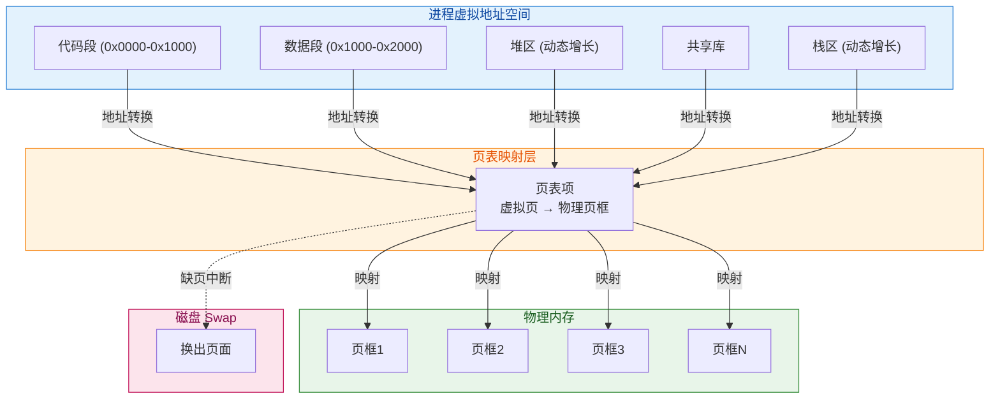

**核心结论**：虚拟内存通过页表将进程独立的虚拟地址空间映射到物理内存，实现进程隔离和内存扩展，Swap机制允许内存页面换出到磁盘以支持超过物理内存大小的地址空间。

**关键概念**：

- **虚拟地址空间**：每个进程独立的地址空间，通常为4GB（32位）或更大（64位），进程间互不干扰
- **页表**：虚拟页到物理页框的映射表，由MMU(Memory Management Unit,内存管理单元)硬件加速地址转换
- **缺页中断**：访问未加载到物理内存的页面时触发，操作系统负责从Swap加载页面

### 1.2 页表与TLB

**虚拟内存映射机制说明**：

| 组件 | 说明 |
|------|------|
| 虚拟地址空间 | 每个进程独立的地址空间，通常为4GB（32位）或更大（64位） |
| 页表 | 虚拟页到物理页框的映射表，由MMU(Memory Management Unit,内存管理单元)硬件加速 |
| 物理内存 | 实际的RAM(Random Access Memory,随机存取存储器)，按页框管理 |
| Swap | 磁盘上的交换空间，用于存放换出的内存页面 |

**TLB缓存查找流程**：

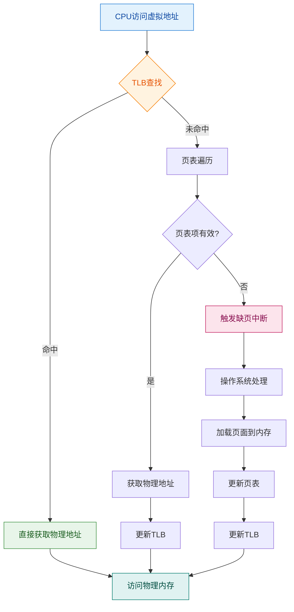

**核心结论**：TLB(Translation Lookaside Buffer)作为页表的硬件缓存，将虚拟地址到物理地址的转换加速到纳秒级别，TLB未命中时需要遍历多级页表，性能下降显著。

### 1.3 缺页中断

当进程访问的虚拟页面不在物理内存中时，触发缺页中断：

| 步骤 | 操作 | 说明 |
|------|------|------|
| 1 | 页表查找 | MMU查找页表，发现页面不在内存 |
| 2 | 触发中断 | 产生缺页中断，陷入内核态 |
| 3 | 加载页面 | 从磁盘或Swap加载页面到物理内存 |
| 4 | 更新页表 | 更新页表项，建立映射关系 |
| 5 | 恢复执行 | 重新执行导致缺页的指令 |

## 2. mmap内存映射

### 2.1 mmap系统调用

**mmap(Memory Map，内存映射)** 系统调用将文件映射到进程地址空间：

```c
void *mmap(void *addr, size_t length, int prot, int flags, int fd, off_t offset);
// 返回值：成功返回映射区域的起始地址，失败返回 MAP_FAILED ((void *)-1)
// prot: PROT_READ, PROT_WRITE
// flags: MAP_SHARED, MAP_PRIVATE
```

**参数说明**：

| 参数 | 类型 | 说明 |
|------|------|------|
| `addr` | `void *` | 建议的映射起始地址，通常设为NULL让内核选择 |
| `length` | `size_t` | 映射的字节数，必须是页大小的整数倍 |
| `prot` | `int` | 访问权限：PROT_READ（读）、PROT_WRITE（写）、PROT_EXEC（执行）、PROT_NONE（无） |
| `flags` | `int` | 映射类型：MAP_SHARED（共享）、MAP_PRIVATE（私有）、MAP_ANONYMOUS（匿名） |
| `fd` | `int` | 文件描述符，MAP_ANONYMOUS 时设为 -1 |
| `offset` | `off_t` | 文件偏移量，必须是页大小的整数倍 |

**返回值说明**：

| 返回值 | 说明 |
|--------|------|
| 非NULL指针 | 映射区域的起始地址 |
| `MAP_FAILED` ((void *)-1) | 映射失败，可通过 errno 获取错误原因 |

**常见错误码**：

| 错误码 | 说明 |
|--------|------|
| `EBADF` | 文件描述符无效 |
| `EINVAL` | 参数无效（如 offset 未对齐） |
| `ENOMEM` | 内存不足或超出进程地址空间限制 |
| `EACCES` | 权限不足（如 prot 与文件打开模式冲突） |

### 2.2 mmap与传统I/O对比

| 特性 | 传统I/O | mmap |
|------|---------|------|
| 数据拷贝 | 4次 | 2次 |
| 上下文切换 | 4次 | 2次 |
| 内存占用 | 需要用户态缓冲区 | 直接映射 |
| 适用场景 | 小文件、随机访问 | 大文件、顺序访问 |

### 2.3 RocketMQ MappedFile实现

[DefaultMappedFile.java](../store/src/main/java/org/apache/rocketmq/store/logfile/DefaultMappedFile.java) 映射1GB文件：

```java
public class DefaultMappedFile extends AbstractMappedFile {
    public static final int OS_PAGE_SIZE = 1024 * 4;  // 操作系统页大小：4KB (4096 B)
    
    protected static final AtomicLong TOTAL_MAPPED_VIRTUAL_MEMORY = new AtomicLong(0);  // 全局映射内存总量
    protected static final AtomicInteger TOTAL_MAPPED_FILES = new AtomicInteger(0);     // 全局映射文件数量
    
    protected volatile int wrotePosition;       // 写入位置
    protected volatile int committedPosition;   // 提交位置（堆外内存场景）
    protected volatile int flushedPosition;     // 刷盘位置
    protected int fileSize;                     // 文件大小，默认值：1GB (1073741824 B)
    protected FileChannel fileChannel;          // 文件通道
    protected MappedByteBuffer mappedByteBuffer; // 映射缓冲区
    protected ByteBuffer writeBuffer = null;    // 写缓冲区（堆外内存池场景）
    
    private void init(final String fileName, final int fileSize) throws IOException {
        this.fileChannel = new RandomAccessFile(this.file, "rw").getChannel();
        // 核心：通过 FileChannel.map 将文件映射到内存
        this.mappedByteBuffer = this.fileChannel.map(MapMode.READ_WRITE, 0, fileSize);
        // 更新全局统计
        TOTAL_MAPPED_VIRTUAL_MEMORY.addAndGet(fileSize);
        TOTAL_MAPPED_FILES.incrementAndGet();
    }
}
```

**为什么是1GB**：

| 原因 | 说明 |
|------|------|
| Integer.MAX_VALUE限制 | Java的map方法最大映射2GB，1GB留有余量 |
| 内存管理 | 1GB映射占用虚拟地址空间适中 |
| 清理粒度 | 过期清理以文件为单位，1GB粒度适中 |

**核心字段说明**：

| 字段 | 类型 | 默认值 | 说明 |
|------|------|--------|------|
| `wrotePosition` | `volatile int` | 0 | 当前写入位置，消息追加时更新 |
| `committedPosition` | `volatile int` | 0 | 已提交到 FileChannel 的位置（仅堆外内存池场景） |
| `flushedPosition` | `volatile int` | 0 | 已刷盘到磁盘的位置 |
| `fileSize` | `int` | 1GB (1073741824 B) | 映射文件大小 |
| `fileChannel` | `FileChannel` | - | 文件通道，用于文件读写操作 |
| `mappedByteBuffer` | `MappedByteBuffer` | - | 内存映射缓冲区，直接映射文件到内存 |
| `writeBuffer` | `ByteBuffer` | null | 写缓冲区（堆外内存池场景使用），非 null 时消息先写入此缓冲区 |
| `transientStorePool` | `TransientStorePool` | null | 堆外内存池引用，用于管理 writeBuffer 的借用和归还 |
| `fileName` | `String` | - | 文件完整路径名 |
| `fileFromOffset` | `long` | - | 文件起始偏移量，从文件名解析得出 |
| `file` | `File` | - | 文件对象 |
| `storeTimestamp` | `volatile long` | 0 | 最后一条消息的存储时间戳 |
| `firstCreateInQueue` | `boolean` | false | 是否是 MappedFileQueue 中第一个创建的文件 |
| `lastFlushTime` | `long` | -1 | 最后一次刷盘时间戳 |
| `mappedByteBufferWaitToClean` | `MappedByteBuffer` | null | 等待清理的旧映射缓冲区（内存交换场景） |
| `swapMapTime` | `long` | 0 | 最近一次交换映射的时间戳 |
| `mappedByteBufferAccessCountSinceLastSwap` | `volatile long` | 0 | 自上次交换以来的访问计数 |

**全局统计字段**：

| 字段 | 类型 | 说明 |
|------|------|------|
| `TOTAL_MAPPED_VIRTUAL_MEMORY` | `AtomicLong` | 全局映射内存总量（字节） |
| `TOTAL_MAPPED_FILES` | `AtomicInteger` | 全局映射文件数量 |

**位置指针关系说明**：


**位置指针协作说明**：

| 场景 | wrotePosition | committedPosition | flushedPosition | 说明 |
|------|---------------|-------------------|-----------------|------|
| 直接映射模式 | 写入位置 | 等于 wrotePosition | 刷盘位置 | writeBuffer 为 null，数据直接写入 mappedByteBuffer |
| 堆外内存池模式 | 写入位置 | 提交位置 | 刷盘位置 | writeBuffer 非空，数据先写入 writeBuffer，再 commit 到 FileChannel |

## 3. 零拷贝

### 3.1 传统I/O的4次拷贝

**传统 I/O 的 4 次数据拷贝与 4 次上下文切换**：

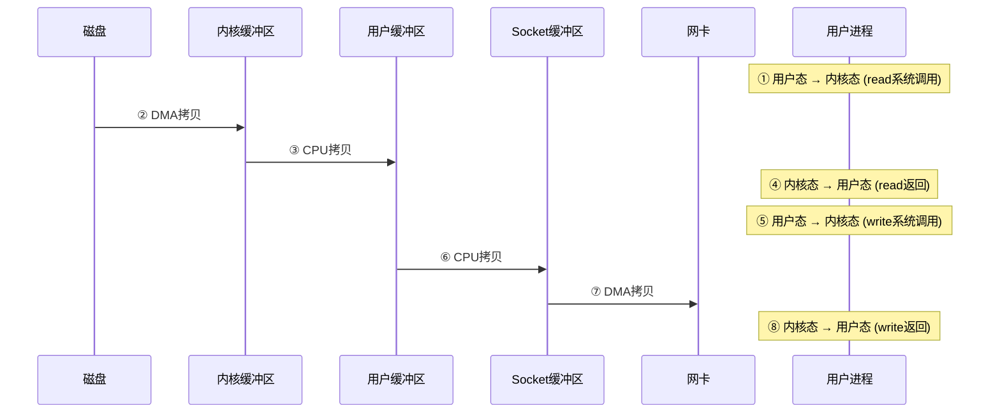

**核心结论**：传统I/O需要4次数据拷贝（2次DMA+2次CPU）和4次上下文切换，数据经过用户态缓冲区，性能开销较大。

| 序号 | 类型 | 数据流向/切换方向 | 说明 |
|------|------|------------------|------|
| ① | 上下文切换 | 用户态 → 内核态 | 调用 `read()` 系统调用 |
| ② | DMA 拷贝 | 磁盘 → 内核缓冲区 | DMA 控制器将磁盘数据读取到 Page Cache |
| ③ | CPU 拷贝 | 内核缓冲区 → 用户缓冲区 | CPU 将数据从内核态拷贝到用户态 |
| ④ | 上下文切换 | 内核态 → 用户态 | `read()` 执行完毕返回 |
| ⑤ | 上下文切换 | 用户态 → 内核态 | 调用 `write()` 系统调用 |
| ⑥ | CPU 拷贝 | 用户缓冲区 → Socket 缓冲区 | CPU 将数据从用户态拷贝到内核态 |
| ⑦ | DMA 拷贝 | Socket 缓冲区 → 网卡 | DMA 控制器将数据发送到网卡 |
| ⑧ | 上下文切换 | 内核态 → 用户态 | `write()` 执行完毕返回 |

### 3.2 sendfile零拷贝

**sendfile 的 2 次数据拷贝与 2 次上下文切换**：

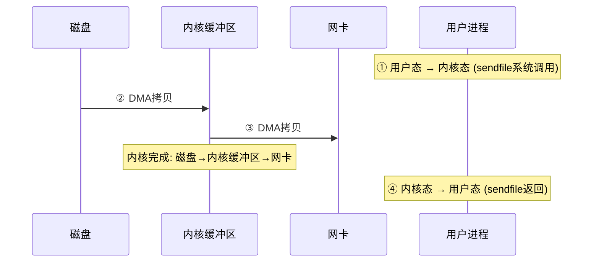

**核心结论**：sendfile实现真正的零拷贝，数据完全不经过用户态，只需2次DMA拷贝和2次上下文切换，适合静态文件传输场景。

**sendfile系统调用**：

```c
ssize_t sendfile(int out_fd, int in_fd, off_t *offset, size_t count);
// 返回值：成功返回传输的字节数，失败返回 -1
// 直接在内核中从文件描述符传输到socket，无需用户态参与
```

**参数说明**：

| 参数 | 类型 | 说明 |
|------|------|------|
| `out_fd` | `int` | 目标文件描述符，必须是支持 mmap 操作的文件（通常是 socket） |
| `in_fd` | `int` | 源文件描述符，必须支持 mmap 操作（普通文件） |
| `offset` | `off_t *` | 输入时指定起始偏移量，输出时返回更新后的偏移量；可为 NULL |
| `count` | `size_t` | 要传输的字节数 |

**返回值说明**：

| 返回值 | 说明 |
|--------|------|
| >= 0 | 成功传输的字节数 |
| -1 | 失败，可通过 errno 获取错误原因 |

**使用限制**：

| 限制 | 说明 |
|------|------|
| `out_fd` 类型 | Linux 2.6.33 前仅支持 socket，之后支持任意文件 |
| `in_fd` 类型 | 必须是支持 mmap 的文件（不能是 socket） |
| 偏移量 | offset 必须在文件范围内 |

### 3.3 transferTo实现

Java NIO 的 `FileChannel.transferTo()` 方法底层使用 sendfile：

```java
// RocketMQ 中使用 transferTo 实现零拷贝传输
fileChannel.transferTo(position, count, socketChannel);
```

### 3.4 RocketMQ零拷贝应用

[DefaultMappedFile.java](../store/src/main/java/org/apache/rocketmq/store/logfile/DefaultMappedFile.java) 使用 FileChannel 实现零拷贝：

**刷盘实现**：

```java
@Override
public int flush(final int flushLeastPages) {
    if (this.isAbleToFlush(flushLeastPages)) {
        if (this.hold()) {
            int value = getReadPosition();
            try {
                if (writeBuffer != null || this.fileChannel.position() != 0) {
                    // 使用 FileChannel.force() 刷盘（堆外内存池场景）
                    this.fileChannel.force(false);
                } else {
                    // 使用 MappedByteBuffer.force() 刷盘（直接映射场景）
                    this.mappedByteBuffer.force();
                }
            } catch (Throwable e) {
                log.error("Error occurred when force data to disk.", e);
            }
            FLUSHED_POSITION_UPDATER.set(this, value);
            this.release();
        }
    }
    return this.getFlushedPosition();
}
```

**提交实现（堆外内存池场景）**：

```java
@Override
public int commit(final int commitLeastPages) {
    // 如果 writeBuffer 为 null，无需提交，直接返回 wrotePosition
    if (writeBuffer == null) {
        return WROTE_POSITION_UPDATER.get(this);
    }
    // 判断是否满足提交条件
    if (this.isAbleToCommit(commitLeastPages)) {
        if (this.hold()) {
            commit0();  // 执行实际提交
            this.release();
        }
    }
    // 如果文件已满且全部提交完成，归还缓冲区到内存池
    if (writeBuffer != null && this.transientStorePool != null 
        && this.fileSize == COMMITTED_POSITION_UPDATER.get(this)) {
        this.transientStorePool.returnBuffer(writeBuffer);
        this.writeBuffer = null;
    }
    return COMMITTED_POSITION_UPDATER.get(this);
}

// 实际提交操作：将 writeBuffer 数据写入 FileChannel
protected void commit0() {
    int writePos = WROTE_POSITION_UPDATER.get(this);
    int lastCommittedPosition = COMMITTED_POSITION_UPDATER.get(this);
    
    if (writePos - lastCommittedPosition > 0) {
        ByteBuffer byteBuffer = writeBuffer.slice();
        byteBuffer.position(lastCommittedPosition);
        byteBuffer.limit(writePos);
        this.fileChannel.position(lastCommittedPosition);
        this.fileChannel.write(byteBuffer);
        COMMITTED_POSITION_UPDATER.set(this, writePos);
    }
}
```

**内存交换实现（MappedFile Swap）**：

```java
@Override
public boolean swapMap() {
    // 仅当引用计数为1且没有待清理的映射时执行
    if (getRefCount() == 1 && this.mappedByteBufferWaitToClean == null) {
        if (!hold()) {
            return false;
        }
        try {
            // 保存旧映射，创建新映射
            this.mappedByteBufferWaitToClean = this.mappedByteBuffer;
            this.mappedByteBuffer = this.fileChannel.map(FileChannel.MapMode.READ_WRITE, 0, fileSize);
            this.mappedByteBufferAccessCountSinceLastSwap = 0L;
            this.swapMapTime = System.currentTimeMillis();
            return true;
        } finally {
            this.release();
        }
    }
    return false;
}

@Override
public void cleanSwapedMap(boolean force) {
    if (this.mappedByteBufferWaitToClean == null) {
        return;
    }
    // 等待至少 120 秒后再清理，除非强制清理
    long minGapTime = 120 * 1000L;  // 120000 ms (2 min)
    long gapTime = System.currentTimeMillis() - this.swapMapTime;
    if (!force && gapTime < minGapTime) {
        Thread.sleep(minGapTime - gapTime);
    }
    // 清理旧的映射缓冲区
    UtilAll.cleanBuffer(this.mappedByteBufferWaitToClean);
    mappedByteBufferWaitToClean = null;
}
```

**内存解锁实现**：

```java
@Override
public void munlock() {
    final long address = ((DirectBuffer) (this.mappedByteBuffer)).address();
    Pointer pointer = new Pointer(address);
    int ret = LibC.INSTANCE.munlock(pointer, new NativeLong(this.fileSize));
    log.info("munlock {} {} {} ret = {} time consuming = {}", 
        address, this.fileName, this.fileSize, ret, System.currentTimeMillis() - beginTime);
}
```

**方法协作说明**：

| 方法 | 触发时机 | 协作方法 | 说明 |
|------|----------|----------|------|
| `flush(flushLeastPages)` | 刷盘线程定时调用 | `hold()` / `release()` | 将数据刷盘，需先持有引用 |
| `commit(commitLeastPages)` | 提交线程定时调用（堆外内存池场景） | `hold()` / `release()` | 将 writeBuffer 数据提交到 FileChannel |
| `swapMap()` | 内存交换线程调用 | `hold()` / `release()` | 创建新的映射，旧映射等待清理 |
| `cleanSwapedMap(force)` | 内存交换后延迟调用 | - | 清理旧的映射缓冲区 |
| `mlock()` | 文件预热后调用 | - | 锁定内存防止被 swap |
| `munlock()` | 文件销毁前调用 | - | 解锁内存 |

**零拷贝技术对比**：

| 方式 | 拷贝次数 | 上下文切换 | 数据路径 | 适用场景 |
|------|----------|------------|----------|----------|
| 传统I/O | 4次 | 4次 | 磁盘→内核→用户→Socket→网卡 | 需要处理数据的场景 |
| mmap | 3次 | 2次 | 磁盘→内核→Socket→网卡 | 大文件传输 |
| sendfile | 2次 | 2次 | 磁盘→内核→网卡 | 静态文件传输 |

**关键概念**：

- **DMA(Direct Memory Access，直接内存访问)**：硬件自动完成数据传输，无需CPU参与
- **上下文切换**：用户态与内核态切换，每次约几微秒开销
- **mmap**：通过虚拟地址映射共享内存，避免内核到用户态的拷贝
- **sendfile**：Linux 2.1引入，数据完全不经过用户态

## 4. 堆外内存

### 4.1 DirectBuffer原理

**堆外内存(DirectByteBuffer)** 在JVM堆外分配，不受GC管理：

| 内存类型 | 分配位置 | GC影响 | 分配速度 |
|---------|---------|--------|---------|
| 堆内存 | JVM堆 | GC管理，可能移动 | 快 |
| 堆外内存 | 操作系统 | 不受GC管理 | 较慢（需系统调用） |

**DirectByteBuffer分配过程**：

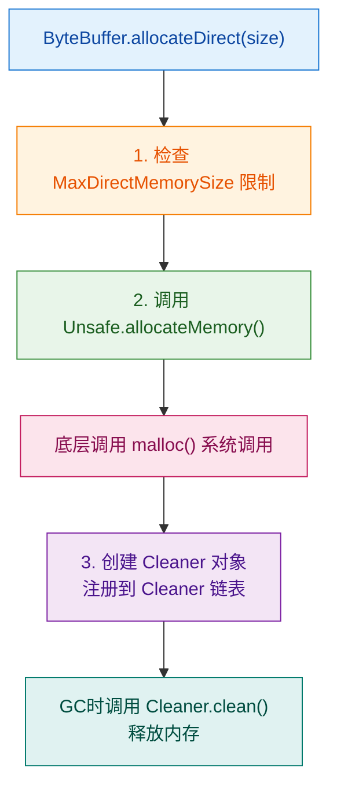

**核心结论**：DirectByteBuffer在JVM堆外分配内存，通过Unsafe.allocateMemory()调用操作系统malloc()，并注册Cleaner实现GC时自动释放，避免堆内存的GC停顿影响。

### 4.2 堆外内存优势

**堆内存与堆外内存对比**：

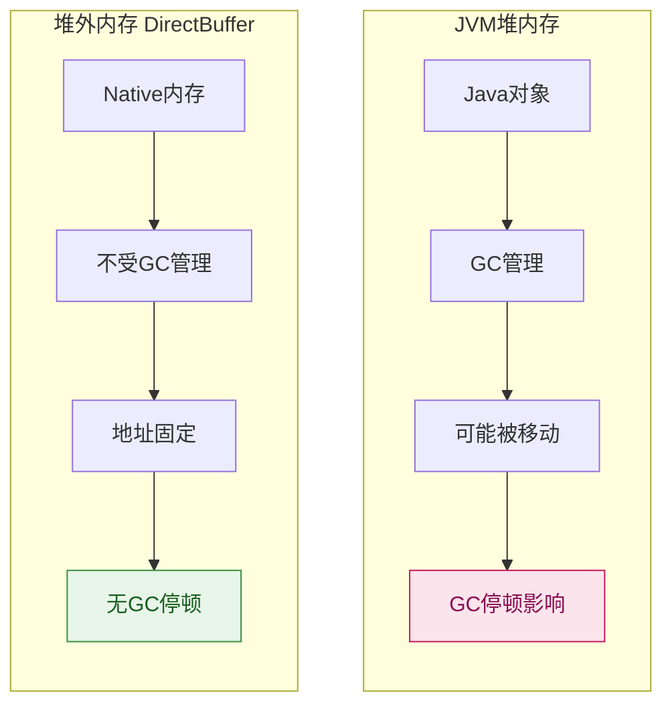

**核心结论**：堆外内存避免了GC停顿对I/O操作的影响，适合高性能I/O场景，但分配/释放成本较高，需要合理管理生命周期。

### 4.3 RocketMQ TransientStorePool实现

[TransientStorePool.java](../store/src/main/java/org/apache/rocketmq/store/TransientStorePool.java) 实现堆外内存池：

```java
public class TransientStorePool {
    private static final InternalLogger log = InternalLoggerFactory.getLogger(LoggerName.STORE_LOGGER_NAME);

    private final int poolSize;                           // 池大小，默认值：5 个
    private final int fileSize;                           // 单个缓冲区大小，默认值：1GB (1073741824 B)
    private final Deque<ByteBuffer> availableBuffers;     // 可用缓冲区队列（线程安全）
    private final MessageStoreConfig storeConfig;         // 存储配置引用

    public TransientStorePool(final MessageStoreConfig storeConfig) {
        this.storeConfig = storeConfig;
        this.poolSize = storeConfig.getTransientStorePoolSize();      // 默认值：5
        this.fileSize = storeConfig.getMappedFileSizeCommitLog();     // 默认值：1GB
        this.availableBuffers = new ConcurrentLinkedDeque<>();
    }

    /**
     * 初始化内存池：预分配堆外内存并锁定
     * 注意：这是一个重量级操作，会分配大量内存
     */
    public void init() {
        for (int i = 0; i < poolSize; i++) {
            // 分配堆外内存
            ByteBuffer byteBuffer = ByteBuffer.allocateDirect(fileSize);
            // 获取堆外内存地址并锁定，防止被 swap
            final long address = ((DirectBuffer) byteBuffer).address();
            Pointer pointer = new Pointer(address);
            LibC.INSTANCE.mlock(pointer, new NativeLong(fileSize));
            availableBuffers.offer(byteBuffer);
        }
    }

    /**
     * 销毁内存池：解锁所有缓冲区
     */
    public void destroy() {
        for (ByteBuffer byteBuffer : availableBuffers) {
            final long address = ((DirectBuffer) byteBuffer).address();
            Pointer pointer = new Pointer(address);
            LibC.INSTANCE.munlock(pointer, new NativeLong(fileSize));
        }
    }

    /**
     * 借用缓冲区
     * @return 可用的缓冲区，如果池为空则返回 null
     */
    public ByteBuffer borrowBuffer() {
        ByteBuffer buffer = availableBuffers.pollFirst();
        // 当可用缓冲区低于 40% 时打印警告
        if (availableBuffers.size() < poolSize * 0.4) {
            log.warn("TransientStorePool only remain {} sheets.", availableBuffers.size());
        }
        return buffer;
    }

    /**
     * 归还缓冲区到池中
     * @param byteBuffer 要归还的缓冲区
     */
    public void returnBuffer(ByteBuffer byteBuffer) {
        byteBuffer.position(0);
        byteBuffer.limit(fileSize);
        this.availableBuffers.offerFirst(byteBuffer);
    }

    /**
     * 获取可用缓冲区数量
     * @return 如果启用堆外内存池，返回可用数量；否则返回 Integer.MAX_VALUE
     */
    public int availableBufferNums() {
        if (storeConfig.isTransientStorePoolEnable()) {
            return availableBuffers.size();
        }
        return Integer.MAX_VALUE;
    }
}
```

**核心字段说明**：

| 字段 | 类型 | 默认值 | 说明 |
|------|------|--------|------|
| `poolSize` | `int` | 5 个 | 内存池大小（缓冲区个数），由 `transientStorePoolSize` 配置 |
| `fileSize` | `int` | 1GB (1073741824 B) | 单个缓冲区大小，由 `mappedFileSizeCommitLog` 配置 |
| `availableBuffers` | `Deque<ByteBuffer>` | - | 可用缓冲区队列，使用 `ConcurrentLinkedDeque` 保证线程安全 |
| `storeConfig` | `MessageStoreConfig` | - | 存储配置引用，用于获取配置参数 |

**方法说明**：

| 方法 | 说明 | 触发时机 |
|------|------|----------|
| `init()` | 预分配堆外内存并锁定 | Broker 启动时调用 |
| `destroy()` | 解锁所有缓冲区 | Broker 关闭时调用 |
| `borrowBuffer()` | 从池中借用缓冲区 | 创建 MappedFile 时调用 |
| `returnBuffer(ByteBuffer)` | 归还缓冲区到池中 | MappedFile 文件写满且提交完成时调用 |
| `availableBufferNums()` | 获取可用缓冲区数量 | 检查内存池状态时调用 |

**配置参数**：

| 参数 | 默认值 | 说明 |
|------|--------|------|
| `transientStorePoolEnable` | `false` | 是否启用堆外内存池 |
| `transientStorePoolSize` | 5 个 | 内存池大小（缓冲区个数） |
| `mappedFileSizeCommitLog` | 1GB (1073741824 B) | 单个缓冲区大小 |

**设计优势**：

| 特性 | 说明 |
|------|------|
| 内存池化 | 预分配复用，避免频繁分配/释放堆外内存的系统调用开销 |
| 锁定内存 | mlock 防止被 swap，保证性能稳定，避免 IO 抖动 |
| 异步刷盘 | 先写堆外内存，再异步 commit 到 FileChannel，提升写入性能 |
| 内存预警 | 当可用缓冲区低于 40% 时打印警告，便于监控 |

**数据流转流程**：

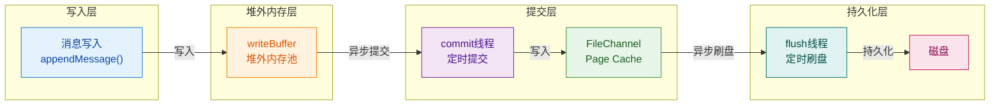

## 5. 内存优化技术

### 5.1 mlock内存锁定

**mlock系统调用**将内存锁定在物理内存中，禁止换出到swap：

```c
int mlock(const void *addr, size_t len);    // 锁定指定内存区域
int munlock(const void *addr, size_t len);  // 解锁指定内存区域
int mlockall(int flags);                     // 锁定所有内存
int munlockall(void);                        // 解锁所有内存
```

**参数说明**：

| 函数 | 参数 | 返回值 | 说明 |
|------|------|--------|------|
| `mlock(addr, len)` | 内存地址、长度 | 0成功，-1失败 | 锁定指定内存区域，防止被 swap |
| `munlock(addr, len)` | 内存地址、长度 | 0成功，-1失败 | 解锁指定内存区域 |
| `mlockall(flags)` | 锁定标志 | 0成功，-1失败 | 锁定进程所有内存 |
| `munlockall()` | 无 | 0成功，-1失败 | 解锁所有被 mlockall 锁定的内存 |

**mlockall 标志说明**：

| 标志 | 值 | 说明 |
|------|-----|------|
| `MCL_CURRENT` | 1 | 锁定当前所有已映射的页面 |
| `MCL_FUTURE` | 2 | 锁定将来所有映射的页面 |
| `MCL_ONFAULT` | 4 | Linux 4.4+，按需锁定（仅锁定实际访问的页面） |

**权限要求**：

| 要求 | 说明 |
|------|------|
| `CAP_IPC_LOCK` | Linux capability，允许锁定任意大小的内存 |
| `ulimit -l` | 限制非特权用户可锁定的内存大小，默认通常为 64KB |

**使用场景**：

| 场景 | 说明 |
|------|------|
| 实时系统 | 避免页面换入换出导致的延迟抖动 |
| 安全应用 | 防止敏感数据写入swap文件 |
| 高性能服务 | 保证热点数据始终在内存中 |

### 5.2 madvise内存建议

**madvise系统调用**向内核提供内存访问模式建议：

```c
int madvise(void *addr, size_t length, int advice);
// 返回值：成功返回 0，失败返回 -1
```

**参数说明**：

| 参数 | 类型 | 说明 |
|------|------|------|
| `addr` | `void *` | 内存区域起始地址，必须是页大小的整数倍 |
| `length` | `size_t` | 内存区域长度 |
| `advice` | `int` | 访问模式建议 |

**advice 参数说明**：

| 常量 | 值 | 说明 |
|------|-----|------|
| `MADV_NORMAL` | 0 | 正常访问模式，无特殊处理，默认行为 |
| `MADV_RANDOM` | 1 | 随机访问模式，禁用预读，减少不必要的缓存 |
| `MADV_SEQUENTIAL` | 2 | 顺序访问模式，激进预读，访问后可释放 |
| `MADV_WILLNEED` | 3 | 即将需要，建议内核立即预加载到内存 |
| `MADV_DONTNEED` | 4 | 不再需要，建议内核可释放页面，下次访问触发缺页 |
| `MADV_FREE` | 8 | Linux 4.5+，标记为可释放，内存紧张时优先回收 |
| `MADV_REMOVE` | 9 | 删除映射，释放底层资源（如 tmpfs） |
| `MADV_DONTFORK` | 10 | 子进程不继承此映射 |
| `MADV_DOFORK` | 11 | 子进程继承此映射（撤销 MADV_DONTFORK） |
| `MADV_MERGEABLE` | 12 | 启用 KSM（Kernel Samepage Merging）合并 |
| `MADV_UNMERGEABLE` | 13 | 禁用 KSM 合并 |
| `MADV_HUGEPAGE` | 14 | 启用透明大页 |
| `MADV_NOHUGEPAGE` | 15 | 禁用透明大页 |

**使用场景**：

| 场景 | 建议 | 说明 |
|------|------|------|
| 大文件顺序读取 | `MADV_SEQUENTIAL` | 激进预读，提升读取性能 |
| 随机访问数据库 | `MADV_RANDOM` | 禁用预读，减少缓存污染 |
| 预热内存 | `MADV_WILLNEED` | 提前加载，减少首次访问延迟 |
| 释放缓存 | `MADV_DONTNEED` | 立即释放，降低内存占用 |

**madvise建议模式对比**：

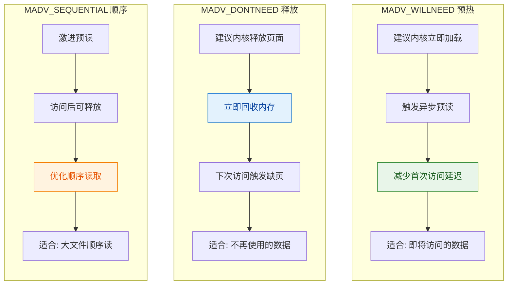

**核心结论**：madvise允许应用程序向内核提供内存访问模式提示，内核据此优化预读和缓存策略，提升I/O性能。

### 5.3 RocketMQ内存优化实现

[LibC.java](../store/src/main/java/org/apache/rocketmq/store/util/LibC.java) 通过JNA调用系统调用：

```java
public interface LibC extends Library {
    LibC INSTANCE = (LibC) Native.loadLibrary(Platform.isWindows() ? "msvcrt" : "c", LibC.class);
    
    // madvise 建议参数
    int MADV_WILLNEED = 3;   // 即将需要，建议内核立即预加载到内存
    int MADV_DONTNEED = 4;   // 不再需要，建议内核可释放页面

    // mlockall 标志参数
    int MCL_CURRENT = 1;     // 锁定当前所有映射的页面
    int MCL_FUTURE = 2;      // 锁定将来映射的页面
    int MCL_ONFAULT = 4;     // Linux 4.4+，按需锁定（仅锁定实际访问的页面）

    // msync 标志参数
    int MS_ASYNC = 0x0001;       // 异步同步，立即返回
    int MS_INVALIDATE = 0x0002;  // 使缓存失效，强制重新读取
    int MS_SYNC = 0x0004;        // 同步同步，等待完成

    // 内存锁定相关
    int mlock(Pointer address, NativeLong size);      // 锁定指定内存区域
    int munlock(Pointer address, NativeLong size);    // 解锁指定内存区域
    int mlockall(int flags);                          // 锁定所有内存

    // 内存建议相关
    int madvise(Pointer address, NativeLong size, int advice);  // 向内核提供内存访问建议

    // 内存操作相关
    Pointer memset(Pointer p, int v, long len);       // 设置内存区域为指定值
    int msync(Pointer p, NativeLong length, int flags); // 同步映射内存到文件
}
```

**常量说明**：

| 常量 | 值 | 说明 |
|------|-----|------|
| `MADV_WILLNEED` | 3 | 建议内核立即将页面加载到内存，用于预热 |
| `MADV_DONTNEED` | 4 | 告知内核页面不再需要，可释放，用于清理 |
| `MCL_CURRENT` | 1 | 锁定当前所有已映射的页面 |
| `MCL_FUTURE` | 2 | 锁定将来所有映射的页面 |
| `MCL_ONFAULT` | 4 | 按需锁定，仅锁定实际访问的页面（Linux 4.4+） |
| `MS_ASYNC` | 0x0001 | 异步同步，调用后立即返回 |
| `MS_INVALIDATE` | 0x0002 | 使映射缓存失效 |
| `MS_SYNC` | 0x0004 | 同步同步，等待所有写入完成 |

**方法说明**：

| 方法 | 参数 | 返回值 | 说明 |
|------|------|--------|------|
| `mlock(addr, size)` | 内存地址、大小 | 0成功，非0失败 | 锁定内存区域，防止被 swap |
| `munlock(addr, size)` | 内存地址、大小 | 0成功，非0失败 | 解锁内存区域 |
| `mlockall(flags)` | 锁定标志 | 0成功，非0失败 | 锁定进程所有内存 |
| `madvise(addr, size, advice)` | 内存地址、大小、建议 | 0成功，非0失败 | 向内核提供内存访问建议 |
| `memset(p, v, len)` | 指针、值、长度 | 指针 | 设置内存区域为指定值 |
| `msync(p, length, flags)` | 指针、长度、标志 | 0成功，非0失败 | 同步映射内存到文件 |

**平台兼容性说明**：

| 平台 | 库名称 | 说明 |
|------|--------|------|
| Windows | `msvcrt` | Microsoft C Runtime Library |
| Linux/Unix | `c` | libc 标准库 |

[DefaultMappedFile.java](../store/src/main/java/org/apache/rocketmq/store/logfile/DefaultMappedFile.java) 实现内存锁定：

```java
@Override
public void mlock() {
    final long address = ((DirectBuffer) (this.mappedByteBuffer)).address();
    Pointer pointer = new Pointer(address);
    
    // 锁定内存，防止被 swap
    int ret = LibC.INSTANCE.mlock(pointer, new NativeLong(this.fileSize));
    log.info("mlock {} {} {} ret = {}", address, this.fileName, this.fileSize, ret);
    
    // 建议内核预加载该内存区域
    ret = LibC.INSTANCE.madvise(pointer, new NativeLong(this.fileSize), LibC.MADV_WILLNEED);
    log.info("madvise {} {} {} ret = {}", address, this.fileName, this.fileSize, ret);
}
```

### 5.4 内存预热流程

**内存预热**：通过主动访问内存页，触发缺页中断，提前建立页表映射。

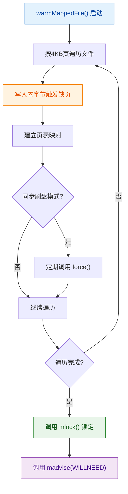

**核心结论**：内存预热通过主动触发缺页中断，提前建立所有页面的映射关系，配合mlock锁定确保后续访问无延迟。

```java
@Override
public void warmMappedFile(FlushDiskType type, int pages) {
    ByteBuffer byteBuffer = this.mappedByteBuffer.slice();
    
    // 按页写入零字节，触发缺页中断，OS_PAGE_SIZE = 4KB (4096 B)
    for (int i = 0; i < this.fileSize; i += DefaultMappedFile.OS_PAGE_SIZE) {
        byteBuffer.put(i, (byte) 0);
        
        // 同步刷盘模式下定期刷新
        if (type == FlushDiskType.SYNC_FLUSH) {
            if ((i / OS_PAGE_SIZE) - (flush / OS_PAGE_SIZE) >= pages) {
                flush = i;
                mappedByteBuffer.force();
            }
        }
    }
    
    // 预热完成后锁定内存
    this.mlock();
}
```

**预热配置参数**：

| 参数 | 默认值 | 说明 |
|------|--------|------|
| `warmMapedFileEnable` | `false` | 是否启用内存预热 |
| `flushLeastPagesWhenWarmMapedFile` | 4096 页 (16 MB) | 预热时每次刷新的页数 |

**预热效果对比**：

| 场景 | 无 mlock | 有 mlock |
|------|---------|---------|
| 内存压力大时 | 堆外内存可能被 swap | 内存被锁定，不会被 swap |
| 性能稳定性 | 可能出现 IO 抖动 | 性能稳定 |
| 首次访问延迟 | 需要触发缺页中断 | 已预加载，无延迟 |

## 6. 资源生命周期管理

### 6.1 引用计数原理

**资源生命周期管理**需要解决两个问题：

1. **何时释放**：确定资源不再被使用
2. **如何释放**：正确清理资源

**引用计数核心机制**：

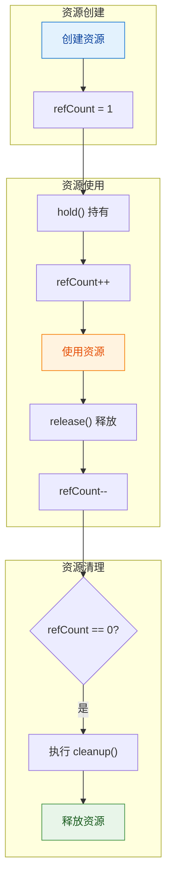

**核心结论**：引用计数通过跟踪资源的持有者数量，确保资源在最后一个持有者释放后才被清理，避免资源泄漏和悬空指针问题。

**引用计数**是一种简单的资源管理策略：

| 操作 | 说明 |
|------|------|
| hold() | 增加引用计数，表示资源正在被使用 |
| release() | 减少引用计数，表示资源不再被使用 |
| cleanup() | 引用计数归零时执行清理 |

### 6.2 RocketMQ ReferenceResource实现

[ReferenceResource.java](../store/src/main/java/org/apache/rocketmq/store/ReferenceResource.java) 实现引用计数：

```java
public abstract class ReferenceResource {
    protected final AtomicLong refCount = new AtomicLong(1);  // 初始引用计数：1
    protected volatile boolean available = true;              // 资源是否可用
    protected volatile boolean cleanupOver = false;           // 清理是否完成
    private volatile long firstShutdownTimestamp = 0;         // 首次关闭时间戳

    /**
     * 持有资源：增加引用计数
     * @return true-成功持有，false-资源不可用或引用计数已归零
     */
    public synchronized boolean hold() {
        if (this.isAvailable()) {
            if (this.refCount.getAndIncrement() > 0) {
                return true;
            } else {
                this.refCount.getAndDecrement();  // 回滚，因为引用计数已经 <= 0
            }
        }
        return false;
    }

    /**
     * 检查资源是否可用
     * @return true-可用，false-不可用
     */
    public boolean isAvailable() {
        return this.available;
    }

    /**
     * 关闭资源：标记为不可用，减少引用计数
     * @param intervalForcibly 强制关闭的时间间隔（毫秒），超过此时间强制清理
     */
    public void shutdown(final long intervalForcibly) {
        if (this.available) {
            // 首次关闭：标记为不可用，记录时间戳，减少引用计数
            this.available = false;
            this.firstShutdownTimestamp = System.currentTimeMillis();
            this.release();
        } else if (this.getRefCount() > 0) {
            // 非首次关闭：检查是否超时，超时则强制清理
            if ((System.currentTimeMillis() - this.firstShutdownTimestamp) >= intervalForcibly) {
                // 设置为负数，强制触发清理
                this.refCount.set(-1000 - this.getRefCount());
                this.release();
            }
        }
    }

    /**
     * 释放资源：减少引用计数，归零时执行清理
     */
    public void release() {
        long value = this.refCount.decrementAndGet();
        if (value > 0)
            return;
        synchronized (this) {
            this.cleanupOver = this.cleanup(value);
        }
    }

    /**
     * 获取当前引用计数
     * @return 引用计数值
     */
    public long getRefCount() {
        return this.refCount.get();
    }

    /**
     * 抽象方法：清理资源，由子类实现
     * @param currentRef 当前引用计数
     * @return true-清理成功，false-清理失败
     */
    public abstract boolean cleanup(final long currentRef);

    /**
     * 检查清理是否完成
     * @return true-清理完成，false-清理未完成
     */
    public boolean isCleanupOver() {
        return this.refCount.get() <= 0 && this.cleanupOver;
    }
}
```

**核心字段说明**：

| 字段 | 类型 | 默认值 | 说明 |
|------|------|--------|------|
| `refCount` | `AtomicLong` | 1 | 引用计数，初始值为1表示资源创建时即被引用 |
| `available` | `volatile boolean` | true | 资源是否可用，shutdown 后变为 false |
| `cleanupOver` | `volatile boolean` | false | 清理是否完成，cleanup 执行成功后变为 true |
| `firstShutdownTimestamp` | `volatile long` | 0 | 首次调用 shutdown 的时间戳，用于超时强制清理 |

**方法说明**：

| 方法 | 参数 | 返回值 | 说明 |
|------|------|--------|------|
| `hold()` | 无 | boolean | 持有资源，引用计数+1；成功返回 true，资源不可用或计数已归零返回 false |
| `isAvailable()` | 无 | boolean | 检查资源是否可用 |
| `shutdown(intervalForcibly)` | 强制关闭间隔(ms) | void | 关闭资源，标记为不可用；超时后强制清理 |
| `release()` | 无 | void | 释放资源，引用计数-1；归零时执行 cleanup |
| `getRefCount()` | 无 | long | 获取当前引用计数 |
| `cleanup(currentRef)` | 当前引用计数 | boolean | 抽象方法，子类实现具体清理逻辑 |
| `isCleanupOver()` | 无 | boolean | 检查清理是否完成（refCount<=0 且 cleanupOver=true） |

**方法协作流程**：

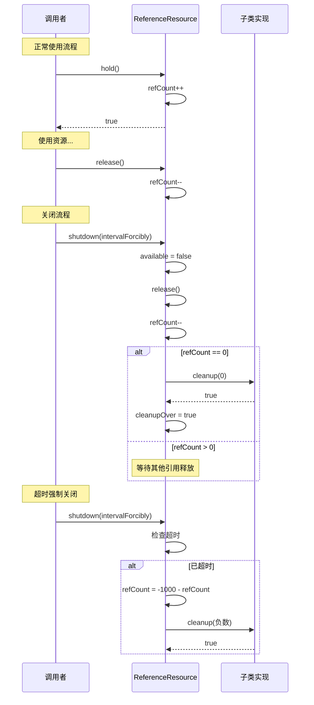

**引用计数状态转换图**：

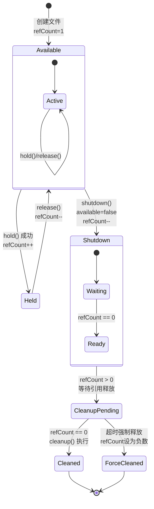

**引用计数状态说明**：

| 状态 | refCount | available | 说明 |
|------|----------|-----------|------|
| Available | >= 1 | true | 文件可用，可被访问 |
| Held | >= 2 | true | 文件被持有，正在被访问 |
| Shutdown | >= 0 | false | 文件已关闭，等待引用释放 |
| Cleaned | <= 0 | false | 文件已清理完成 |

**配置参数**：

| 参数 | 默认值 | 说明 |
|------|--------|------|
| `destroyMapedFileIntervalForcibly` | 120000 ms (2 min) | 强制销毁映射文件的时间间隔 |
| `redeleteHangedFileInterval` | 120000 ms (2 min) | 重新删除挂起文件的间隔 |

### 6.3 内存交换机制（MappedFile Swap）

#### 6.3.1 问题背景

**内存交换机制解决的问题**：

| 问题 | 说明 |
|------|------|
| 虚拟内存占用 | 长期运行的 MappedFile 会持续占用虚拟地址空间，即使文件已过期 |
| 映射数量限制 | 操作系统对进程的内存映射数量有限制（`/proc/sys/vm/max_map_count`） |
| 内存碎片 | 频繁创建和销毁映射可能导致内存碎片化 |

#### 6.3.2 交换机制原理

**MappedFile Swap 流程**：

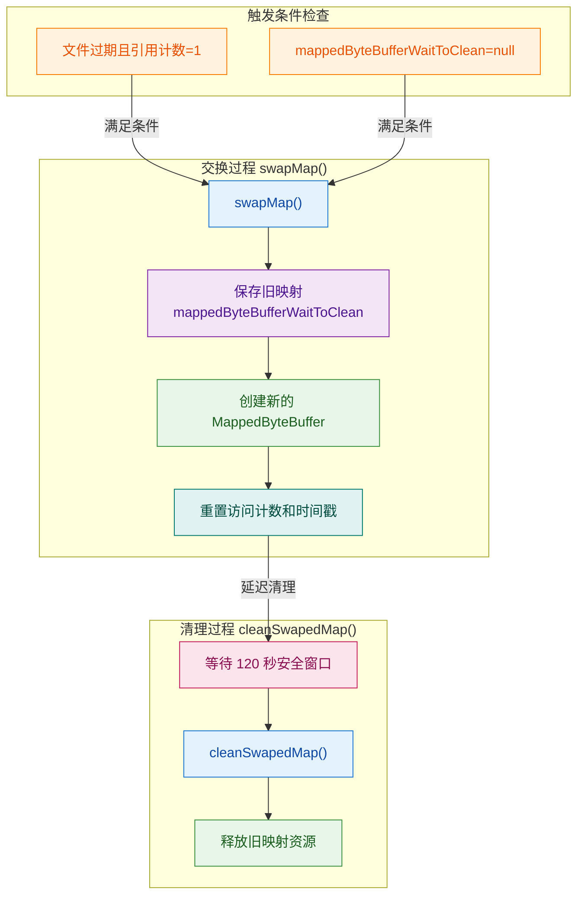

**核心结论**：内存交换机制通过创建新映射、延迟清理旧映射的方式，解决了长期运行的映射文件占用虚拟内存的问题，同时保证了正在访问的映射不会被意外清理。

#### 6.3.3 配置参数

| 参数 | 默认值 | 说明 |
|------|--------|------|
| `mappedFileSwapEnable` | `true` | 是否启用内存交换机制 |
| `commitLogSwapMapInterval` | 3600000 ms (1 h) | CommitLog 文件交换检查间隔 |
| `commitLogForceSwapMapInterval` | 43200000 ms (12 h) | CommitLog 文件强制交换间隔 |
| `commitLogSwapMapReserveFileNum` | 100 个 | 保留的最近文件数量，不参与交换 |
| `cleanSwapedMapInterval` | 300000 ms (5 min) | 清理已交换映射的检查间隔 |

#### 6.3.4 交换时机判断

**交换条件检查**：

| 条件 | 说明 |
|------|------|
| 引用计数 = 1 | 仅创建时的初始引用，无其他线程持有 |
| 无待清理映射 | `mappedByteBufferWaitToClean == null` |
| 文件已过期 | 超过保留时间的文件 |
| 非保留文件 | 在 `commitLogSwapMapReserveFileNum` 范围之外的文件 |

#### 6.3.5 访问计数机制

**访问计数的作用**：

```java
// 每次访问映射缓冲区时增加计数
@Override
public MappedByteBuffer getMappedByteBuffer() {
    this.mappedByteBufferAccessCountSinceLastSwap++;
    return mappedByteBuffer;
}

// 判断是否需要交换时检查访问计数
// 高访问计数的文件不应该被交换
```

| 字段 | 说明 |
|------|------|
| `mappedByteBufferAccessCountSinceLastSwap` | 自上次交换以来的访问次数，用于判断文件热度 |
| `swapMapTime` | 最近一次交换的时间戳，用于计算清理延迟 |

#### 6.3.6 清理延迟机制

**为什么要延迟清理**：

| 原因 | 说明 |
|------|------|
| 安全窗口 | 120 秒的安全窗口，确保所有线程完成对旧映射的访问 |
| 避免竞态 | 防止有线程正持有旧映射的引用时被清理 |
| 资源安全 | 确保资源释放的正确性 |

```java
@Override
public void cleanSwapedMap(boolean force) {
    if (this.mappedByteBufferWaitToClean == null) {
        return;
    }
    // 最小等待时间：120 秒
    long minGapTime = 120 * 1000L;  // 120000 ms (2 min)
    long gapTime = System.currentTimeMillis() - this.swapMapTime;
    if (!force && gapTime < minGapTime) {
        Thread.sleep(minGapTime - gapTime);  // 等待剩余时间
    }
    // 清理旧的映射缓冲区
    UtilAll.cleanBuffer(this.mappedByteBufferWaitToClean);
    mappedByteBufferWaitToClean = null;
}
```

### 6.4 引用计数与内存交换的协作

**交换机制与引用计数的协作关系**：

| 操作 | 引用计数变化 | 说明 |
|------|--------------|------|
| `swapMap()` | hold() → release() | 交换期间临时持有引用，确保交换过程中资源不被释放 |
| `cleanSwapedMap()` | 无变化 | 清理的是已替换的旧映射，不影响当前引用计数 |
| 正常访问 | hold() → release() | 访问期间持有引用，阻止交换 |

**协作流程**：

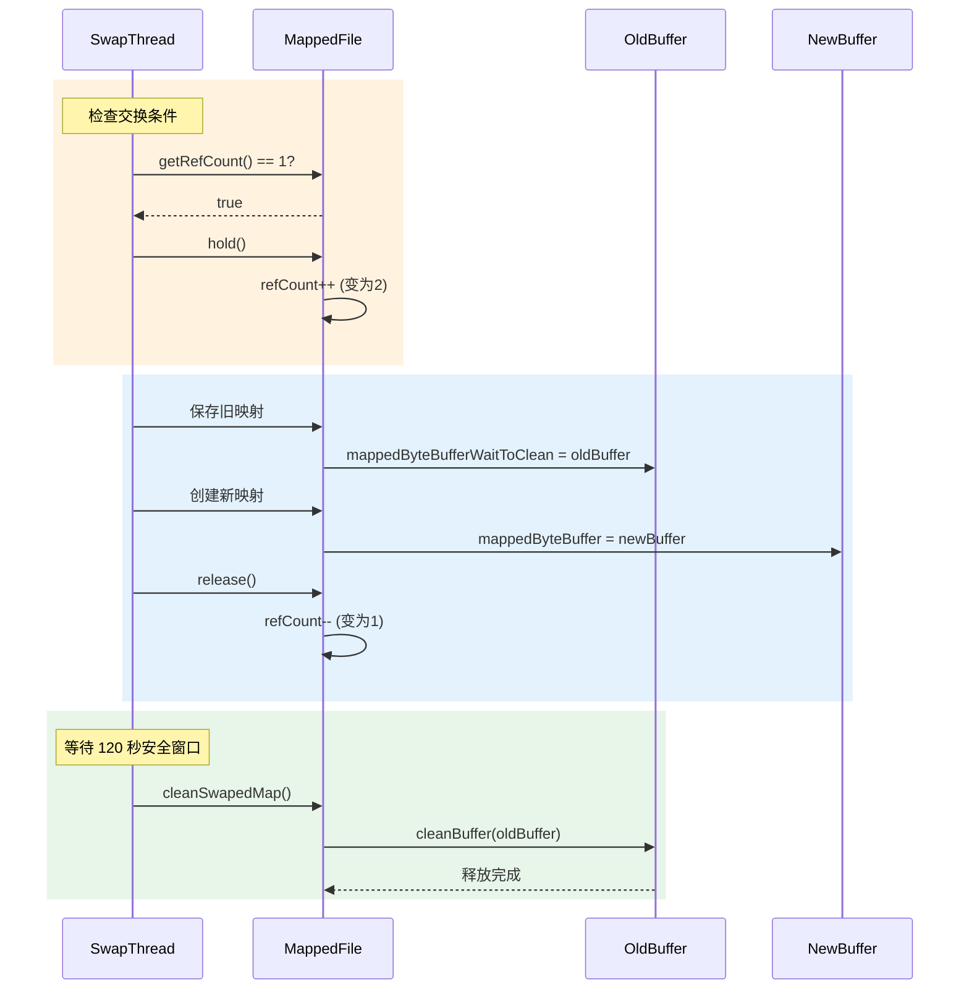
