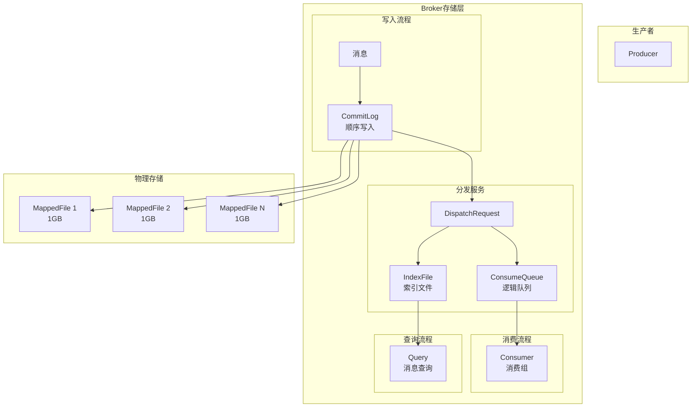
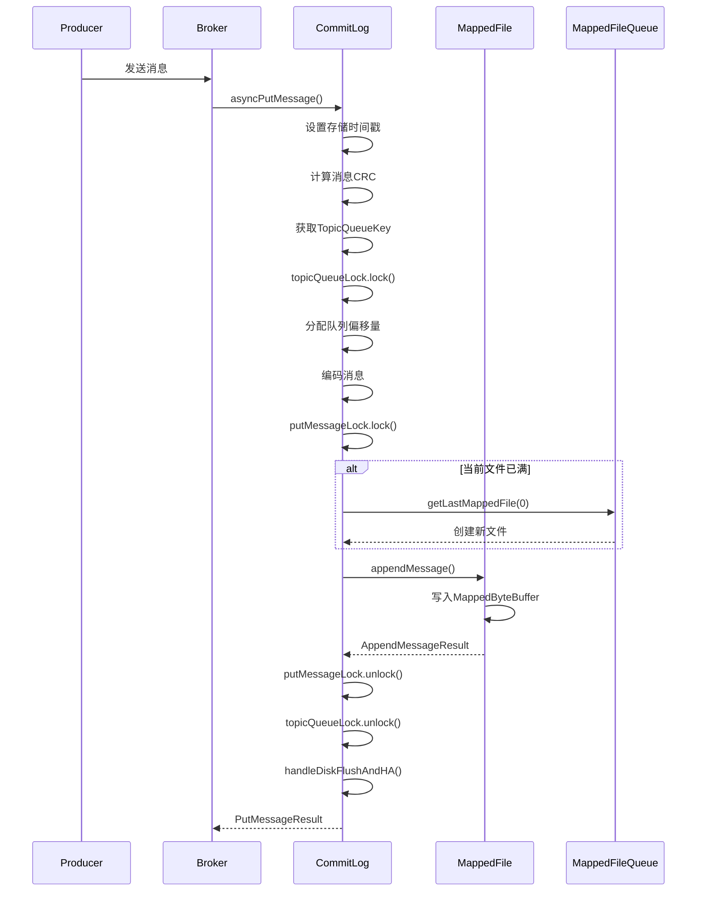
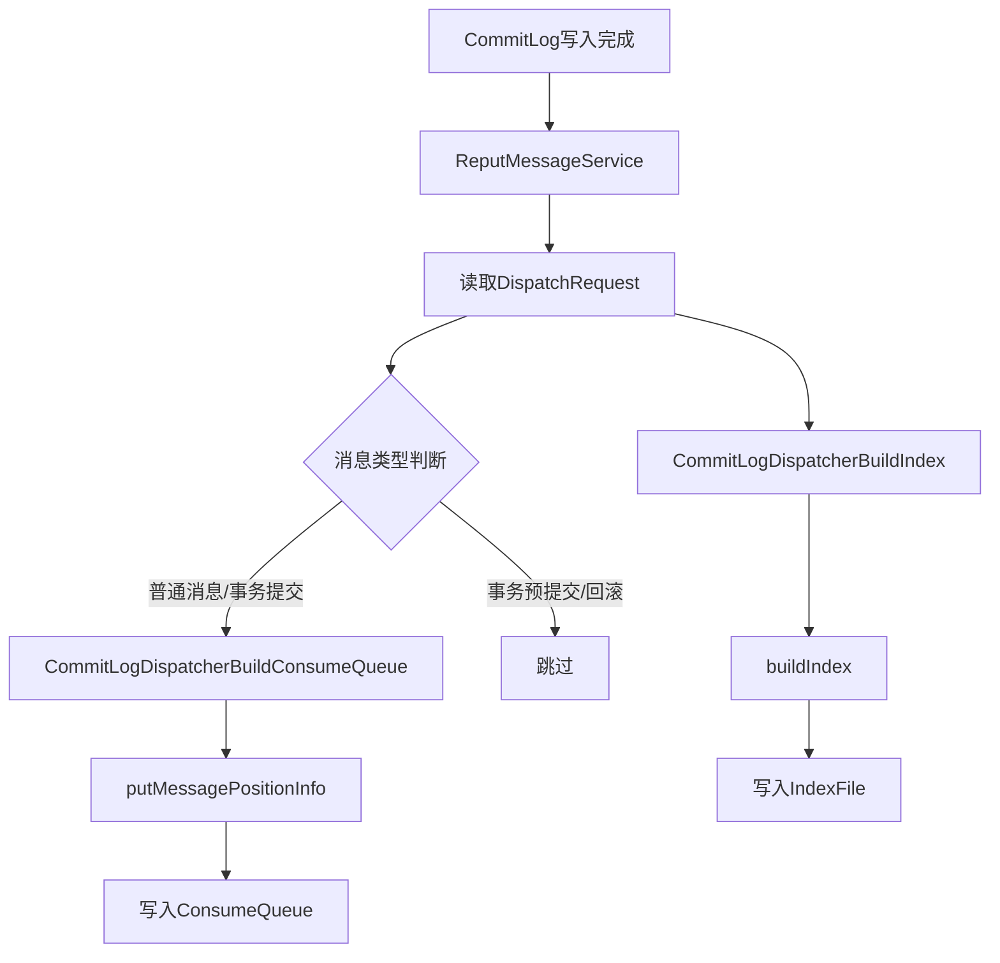
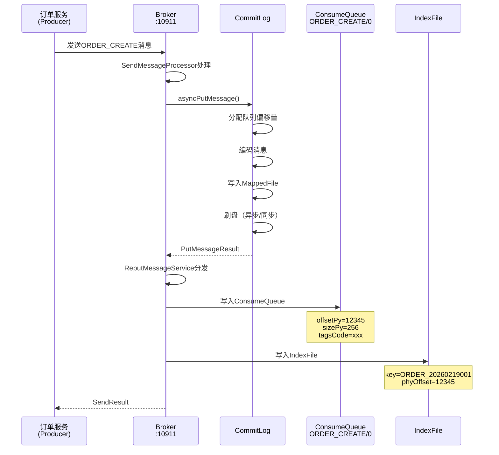

# RocketMQ 5.0.0 源码解读 - 消息存储引擎

> **文档版本**: v1.0  
> **生成时间**: 2026-02-19  
> **RocketMQ版本**: 5.0.0  
> **源码覆盖范围**: store/CommitLog.java、store/ConsumeQueue.java、store/index/IndexFile.java、store/index/IndexService.java、store/logfile/DefaultMappedFile.java、store/MappedFileQueue.java、store/DefaultMessageStore.java

---

## 一、模块定位与职责

### 1.1 模块定位

本文档是 RocketMQ 5.0.0 源码解读的**核心模块**，负责讲解消息存储引擎的设计与实现。消息存储引擎是 RocketMQ 的高性能基石，采用顺序写、零拷贝、内存映射等技术实现高吞吐量。

### 1.2 核心职责

| 职责项 | 说明 | 核心类 |
|--------|------|--------|
| 消息存储 | 消息写入CommitLog，构建索引 | [CommitLog.java](store/src/main/java/org/apache/rocketmq/store/CommitLog.java) |
| 消费队列 | 构建ConsumeQueue，提供消费索引 | [ConsumeQueue.java](store/src/main/java/org/apache/rocketmq/store/ConsumeQueue.java) |
| 索引服务 | 构建IndexFile，支持消息查询 | [IndexFile.java](store/src/main/java/org/apache/rocketmq/store/index/IndexFile.java) |
| 内存映射 | MappedFile实现零拷贝 | [DefaultMappedFile.java](store/src/main/java/org/apache/rocketmq/store/logfile/DefaultMappedFile.java) |
| 刷盘机制 | 同步/异步刷盘策略 | CommitLog.FlushRealTimeService |

### 1.3 模块划分准则符合性

- **高内聚**: 聚焦消息存储全流程，从写入到查询完整覆盖
- **低耦合**: 通过接口与上层交互，存储细节对上层透明
- **数量足够小**: 单一文档覆盖存储引擎核心，不拆分过细

---

## 二、存储架构设计

### 2.1 存储架构概览

RocketMQ 采用**CommitLog + ConsumeQueue + IndexFile**三层存储架构：



### 2.2 三层存储结构

| 存储层 | 文件名 | 单文件大小 | 存储内容 | 用途 |
|--------|--------|------------|----------|------|
| CommitLog | 00000000000000000000 | 1073741824字节（注释：CommitLog单文件大小，单位：字节）= 1GB（易读格式） | 消息完整内容 | 顺序写入，高吞吐 |
| ConsumeQueue | topic/queueId/00000000000000000000 | 6000000字节（注释：ConsumeQueue单文件大小，单位：字节）≈ 5.7MB（易读格式） | 消息偏移量、大小、Tag | 消费索引 |
| IndexFile | 时间戳命名 | 约400MB | Key哈希、偏移量、时间戳 | 消息查询 |

### 2.3 存储目录结构

```
${storePathRootDir}/
├── commitlog/                    # CommitLog目录
│   ├── 00000000000000000000      # 第一个CommitLog文件
│   ├── 00000000001073741824      # 第二个CommitLog文件（偏移量=1GB）
│   └── ...
├── consumequeue/                 # ConsumeQueue目录
│   ├── TopicA/                   # Topic目录
│   │   ├── 0/                    # QueueId目录
│   │   │   ├── 00000000000000000000
│   │   │   └── ...
│   │   ├── 1/
│   │   └── ...
│   └── ...
├── index/                        # IndexFile目录
│   ├── 20260219123456789
│   └── ...
├── checkpoint                    # 检查点文件
└── abort                         # 异常退出标识文件
```

---

## 三、CommitLog 源码解析

### 3.1 CommitLog 核心结构

CommitLog 是 RocketMQ 的**核心存储组件**，所有消息都顺序写入 CommitLog。

```java
// 文件路径: store/src/main/java/org/apache/rocketmq/store/CommitLog.java

public class CommitLog implements Swappable {
    // 消息魔数
    public final static int MESSAGE_MAGIC_CODE = -626843481;
    
    // 文件末尾空白魔数
    public final static int BLANK_MAGIC_CODE = -875286124;
    
    // MappedFile队列，管理所有CommitLog文件
    protected final MappedFileQueue mappedFileQueue;
    
    // 消息存储服务
    protected final DefaultMessageStore defaultMessageStore;
    
    // 刷盘管理器
    private final FlushManager flushManager;
    
    // 消息追加回调
    private final AppendMessageCallback appendMessageCallback;
    
    // 写消息锁（自旋锁或可重入锁）
    protected final PutMessageLock putMessageLock;
    
    // Topic-Queue锁
    protected final TopicQueueLock topicQueueLock;
    
    // CommitLog单文件大小
    protected int commitLogSize;
}
```

### 3.2 消息写入流程



### 3.3 消息写入核心源码

```java
// 文件路径: store/src/main/java/org/apache/rocketmq/store/CommitLog.java

public CompletableFuture<PutMessageResult> asyncPutMessage(final MessageExtBrokerInner msg) {
    // 设置存储时间戳
    if (!defaultMessageStore.getMessageStoreConfig().isDuplicationEnable()) {
        msg.setStoreTimestamp(System.currentTimeMillis());
    }
    
    // 设置消息体CRC
    msg.setBodyCRC(UtilAll.crc32(msg.getBody()));
    
    // 获取线程本地变量
    PutMessageThreadLocal putMessageThreadLocal = this.putMessageThreadLocal.get();
    String topicQueueKey = generateKey(putMessageThreadLocal.getKeyBuilder(), msg);
    
    // 获取当前写入偏移量
    MappedFile mappedFile = this.mappedFileQueue.getLastMappedFile();
    long currOffset;
    if (mappedFile == null) {
        currOffset = 0;
    } else {
        currOffset = mappedFile.getFileFromOffset() + mappedFile.getWrotePosition();
    }
    
    // 获取Topic-Queue锁
    topicQueueLock.lock(topicQueueKey);
    try {
        // 分配队列偏移量
        defaultMessageStore.assignOffset(msg, getMessageNum(msg));
        
        // 编码消息
        PutMessageResult encodeResult = putMessageThreadLocal.getEncoder().encode(msg);
        if (encodeResult != null) {
            return CompletableFuture.completedFuture(encodeResult);
        }
        msg.setEncodedBuff(putMessageThreadLocal.getEncoder().getEncoderBuffer());
        
        // 获取写锁
        putMessageLock.lock();
        try {
            long beginLockTimestamp = this.defaultMessageStore.getSystemClock().now();
            this.beginTimeInLock = beginLockTimestamp;
            
            // 再次设置存储时间戳（保证全局有序）
            if (!defaultMessageStore.getMessageStoreConfig().isDuplicationEnable()) {
                msg.setStoreTimestamp(beginLockTimestamp);
            }
            
            // 获取或创建MappedFile
            if (null == mappedFile || mappedFile.isFull()) {
                mappedFile = this.mappedFileQueue.getLastMappedFile(0);
            }
            if (null == mappedFile) {
                log.error("create mapped file1 error, topic: " + msg.getTopic());
                beginTimeInLock = 0;
                return CompletableFuture.completedFuture(
                    new PutMessageResult(PutMessageStatus.CREATE_MAPPED_FILE_FAILED, null));
            }
            
            // 追加消息到MappedFile
            result = mappedFile.appendMessage(msg, this.appendMessageCallback, putMessageContext);
            switch (result.getStatus()) {
                case PUT_OK:
                    onCommitLogAppend(msg, result, mappedFile);
                    break;
                case END_OF_FILE:
                    // 文件已满，创建新文件重新写入
                    onCommitLogAppend(msg, result, mappedFile);
                    unlockMappedFile = mappedFile;
                    mappedFile = this.mappedFileQueue.getLastMappedFile(0);
                    result = mappedFile.appendMessage(msg, this.appendMessageCallback, putMessageContext);
                    break;
                case MESSAGE_SIZE_EXCEEDED:
                case PROPERTIES_SIZE_EXCEEDED:
                    return CompletableFuture.completedFuture(
                        new PutMessageResult(PutMessageStatus.MESSAGE_ILLEGAL, result));
                default:
                    return CompletableFuture.completedFuture(
                        new PutMessageResult(PutMessageStatus.UNKNOWN_ERROR, result));
            }
            
            beginTimeInLock = 0;
        } finally {
            putMessageLock.unlock();
        }
    } finally {
        topicQueueLock.unlock(topicQueueKey);
    }
    
    // 处理刷盘和HA
    return handleDiskFlushAndHA(putMessageResult, msg, needAckNums, needHandleHA);
}
```

### 3.4 消息格式

CommitLog 中每条消息的存储格式：

```
┌─────────────────────────────────────────────────────────────────────────────┐
│                           CommitLog 消息存储格式                              │
├──────────┬──────────┬──────────┬──────────┬──────────┬──────────┬──────────┤
│ 4字节    │ 4字节    │ 4字节    │ 4字节    │ 4字节    │ 8字节    │ 8字节    │
│ TOTALSIZE│MAGICCODE │ BODYCRC  │ QUEUEID  │  FLAG    │QUEUEOFFSET│PHYOFFSET │
├──────────┼──────────┼──────────┼──────────┼──────────┼──────────┼──────────┤
│ 4字节    │ 8字节    │ 8字节    │ 变长     │ 8字节    │ 变长     │ 4字节    │
│ SYSFLAG  │BORNTIME  │STORETIME │ BORNHOST │STOREHOST │STOREHOST │RECONSUME │
├──────────┼──────────┼──────────┼──────────┼──────────┼──────────┼──────────┤
│ 8字节    │ 4字节    │ N字节    │ 1字节    │ M字节    │ 2字节    │ K字节    │
│TXNOFFSET │ BODYLEN  │  BODY    │TOPICLEN  │  TOPIC   │PROPLEN   │PROPERTIES│
└──────────┴──────────┴──────────┴──────────┴──────────┴──────────┴──────────┘
```

**消息长度计算**：

```java
// 文件路径: store/src/main/java/org/apache/rocketmq/store/CommitLog.java

protected static int calMsgLength(int sysFlag, int bodyLength, int topicLength, int propertiesLength) {
    int bornhostLength = (sysFlag & MessageSysFlag.BORNHOST_V6_FLAG) == 0 ? 8 : 20;
    int storehostAddressLength = (sysFlag & MessageSysFlag.STOREHOSTADDRESS_V6_FLAG) == 0 ? 8 : 20;
    
    final int msgLen = 4                           // TOTALSIZE
        + 4                                         // MAGICCODE
        + 4                                         // BODYCRC
        + 4                                         // QUEUEID
        + 4                                         // FLAG
        + 8                                         // QUEUEOFFSET
        + 8                                         // PHYSICALOFFSET
        + 4                                         // SYSFLAG
        + 8                                         // BORNTIMESTAMP
        + bornhostLength                            // BORNHOST
        + 8                                         // STORETIMESTAMP
        + storehostAddressLength                    // STOREHOSTADDRESS
        + 4                                         // RECONSUMETIMES
        + 8                                         // Prepared Transaction Offset
        + 4 + (bodyLength > 0 ? bodyLength : 0)    // BODY
        + 1 + topicLength                           // TOPIC
        + 2 + (propertiesLength > 0 ? propertiesLength : 0); // propertiesLength
    
    return msgLen;
}
```

---

## 四、ConsumeQueue 源码解析

### 4.1 ConsumeQueue 核心结构

ConsumeQueue 是消息的**逻辑消费队列**，存储消息在 CommitLog 中的索引信息。

```java
// 文件路径: store/src/main/java/org/apache/rocketmq/store/ConsumeQueue.java

public class ConsumeQueue implements ConsumeQueueInterface, FileQueueLifeCycle {
    // 每个存储单元大小：20字节
    public static final int CQ_STORE_UNIT_SIZE = 20;
    
    private final MessageStore messageStore;
    
    // MappedFile队列
    private final MappedFileQueue mappedFileQueue;
    
    // Topic名称
    private final String topic;
    
    // 队列ID
    private final int queueId;
    
    // 存储路径
    private final String storePath;
    
    // 单文件大小：300000 * 20 = 6000000字节（注释：ConsumeQueue单文件大小，单位：字节）≈ 5.7MB（易读格式）
    private final int mappedFileSize;
    
    // 最大物理偏移量
    private long maxPhysicOffset = -1;
    
    // 最小逻辑偏移量
    private volatile long minLogicOffset = 0;
}
```

### 4.2 ConsumeQueue 存储单元

每个 ConsumeQueue 存储单元固定 **20字节**：

```
┌─────────────────────────────────────────────────────────────────┐
│                    ConsumeQueue 存储单元（20字节）                │
├────────────────┬────────────────┬────────────────────────────────┤
│    8字节       │     4字节      │           8字节                │
│  CommitLog偏移量 │   消息大小    │        TagsCode               │
│  (offsetPy)    │   (sizePy)    │     (消息Tag哈希值)            │
└────────────────┴────────────────┴────────────────────────────────┘
```

### 4.3 消息分发流程



### 4.4 消息分发核心源码

```java
// 文件路径: store/src/main/java/org/apache/rocketmq/store/DefaultMessageStore.java

class CommitLogDispatcherBuildConsumeQueue implements CommitLogDispatcher {
    @Override
    public void dispatch(DispatchRequest request) {
        final int tranType = MessageSysFlag.getTransactionValue(request.getSysFlag());
        switch (tranType) {
            case MessageSysFlag.TRANSACTION_NOT_TYPE:
            case MessageSysFlag.TRANSACTION_COMMIT_TYPE:
                // 普通消息和事务提交消息写入ConsumeQueue
                DefaultMessageStore.this.putMessagePositionInfo(request);
                break;
            case MessageSysFlag.TRANSACTION_PREPARED_TYPE:
            case MessageSysFlag.TRANSACTION_ROLLBACK_TYPE:
                // 事务预提交和回滚消息不写入ConsumeQueue
                break;
        }
    }
}
```

---

## 五、IndexFile 源码解析

### 5.1 IndexFile 核心结构

IndexFile 用于**消息查询**，支持按 Key 和时间范围查询消息。

```java
// 文件路径: store/src/main/java/org/apache/rocketmq/store/index/IndexFile.java

public class IndexFile {
    // Hash槽大小：4字节
    private static int hashSlotSize = 4;
    
    // 索引项大小：20字节
    private static int indexSize = 20;
    
    // 无效索引标识
    private static int invalidIndex = 0;
    
    // Hash槽数量
    private final int hashSlotNum;
    
    // 索引数量
    private final int indexNum;
    
    // 文件总大小
    private final int fileTotalSize;
    
    // MappedFile
    private final MappedFile mappedFile;
    
    // 内存映射Buffer
    private final MappedByteBuffer mappedByteBuffer;
    
    // 索引头
    private final IndexHeader indexHeader;
}
```

### 5.2 IndexFile 文件结构

```
┌─────────────────────────────────────────────────────────────────────────────┐
│                           IndexFile 文件结构                                 │
├─────────────────────────────────────────────────────────────────────────────┤
│                              IndexHeader (40字节)                            │
│  ┌──────────┬──────────┬──────────┬──────────┬──────────┬──────────┐       │
│  │ 8字节    │ 8字节    │ 8字节    │ 8字节    │ 4字节    │ 4字节    │       │
│  │beginPhy  │endPhyOff │beginTime │endTime   │hashSlot  │indexCount│       │
│  │Offset    │set       │stamp     │stamp     │Count     │          │       │
│  └──────────┴──────────┴──────────┴──────────┴──────────┴──────────┘       │
├─────────────────────────────────────────────────────────────────────────────┤
│                              Hash槽区域                                      │
│  ┌──────────┬──────────┬──────────┬─────────────────────────────┐          │
│  │ 4字节    │ 4字节    │ 4字节    │ ...                         │          │
│  │slotValue │slotValue │slotValue │                             │          │
│  │   [0]    │   [1]    │   [2]    │                             │          │
│  └──────────┴──────────┴──────────┴─────────────────────────────┘          │
├─────────────────────────────────────────────────────────────────────────────┤
│                              索引项区域                                      │
│  ┌──────────┬──────────┬──────────┬──────────┐                             │
│  │ 4字节    │ 8字节    │ 4字节    │ 4字节    │                             │
│  │ keyHash  │phyOffset │timeDiff  │prevIndex │                             │
│  └──────────┴──────────┴──────────┴──────────┘                             │
│  ┌──────────┬──────────┬──────────┬──────────┐                             │
│  │ keyHash  │phyOffset │timeDiff  │prevIndex │                             │
│  └──────────┴──────────┴──────────┴──────────┘                             │
│  ...                                                                        │
└─────────────────────────────────────────────────────────────────────────────┘
```

### 5.3 索引写入流程

```java
// 文件路径: store/src/main/java/org/apache/rocketmq/store/index/IndexFile.java

public boolean putKey(final String key, final long phyOffset, final long storeTimestamp) {
    if (this.indexHeader.getIndexCount() < this.indexNum) {
        // 1. 计算Key的Hash值
        int keyHash = indexKeyHashMethod(key);
        
        // 2. 计算Hash槽位置
        int slotPos = keyHash % this.hashSlotNum;
        int absSlotPos = IndexHeader.INDEX_HEADER_SIZE + slotPos * hashSlotSize;
        
        // 3. 读取槽中当前的索引值（链表头）
        int slotValue = this.mappedByteBuffer.getInt(absSlotPos);
        if (slotValue <= invalidIndex || slotValue > this.indexHeader.getIndexCount()) {
            slotValue = invalidIndex;
        }
        
        // 4. 计算时间差（秒）
        long timeDiff = storeTimestamp - this.indexHeader.getBeginTimestamp();
        timeDiff = timeDiff / 1000;
        
        // 5. 计算索引项位置
        int absIndexPos = IndexHeader.INDEX_HEADER_SIZE 
            + this.hashSlotNum * hashSlotSize 
            + this.indexHeader.getIndexCount() * indexSize;
        
        // 6. 写入索引项
        this.mappedByteBuffer.putInt(absIndexPos, keyHash);           // Key Hash
        this.mappedByteBuffer.putLong(absIndexPos + 4, phyOffset);    // 物理偏移量
        this.mappedByteBuffer.putInt(absIndexPos + 4 + 8, (int) timeDiff); // 时间差
        this.mappedByteBuffer.putInt(absIndexPos + 4 + 8 + 4, slotValue);  // 前一个索引位置（链表）
        
        // 7. 更新Hash槽指向当前索引
        this.mappedByteBuffer.putInt(absSlotPos, this.indexHeader.getIndexCount());
        
        // 8. 更新IndexHeader
        if (this.indexHeader.getIndexCount() <= 1) {
            this.indexHeader.setBeginPhyOffset(phyOffset);
            this.indexHeader.setBeginTimestamp(storeTimestamp);
        }
        this.indexHeader.incIndexCount();
        this.indexHeader.setEndPhyOffset(phyOffset);
        this.indexHeader.setEndTimestamp(storeTimestamp);
        
        return true;
    }
    return false;
}
```

### 5.4 索引查询流程

```java
// 文件路径: store/src/main/java/org/apache/rocketmq/store/index/IndexFile.java

public void selectPhyOffset(final List<Long> phyOffsets, final String key, final int maxNum,
                            final long begin, final long end) {
    if (this.mappedFile.hold()) {
        // 1. 计算Key的Hash值
        int keyHash = indexKeyHashMethod(key);
        
        // 2. 计算Hash槽位置
        int slotPos = keyHash % this.hashSlotNum;
        int absSlotPos = IndexHeader.INDEX_HEADER_SIZE + slotPos * hashSlotSize;
        
        // 3. 读取槽中的索引值
        int slotValue = this.mappedByteBuffer.getInt(absSlotPos);
        
        // 4. 遍历链表查找匹配的索引
        for (int nextIndexToRead = slotValue; ; ) {
            if (phyOffsets.size() >= maxNum) {
                break;
            }
            
            // 计算索引项位置
            int absIndexPos = IndexHeader.INDEX_HEADER_SIZE 
                + this.hashSlotNum * hashSlotSize 
                + nextIndexToRead * indexSize;
            
            // 读取索引项
            int keyHashRead = this.mappedByteBuffer.getInt(absIndexPos);
            long phyOffsetRead = this.mappedByteBuffer.getLong(absIndexPos + 4);
            long timeDiff = this.mappedByteBuffer.getInt(absIndexPos + 4 + 8);
            int prevIndexRead = this.mappedByteBuffer.getInt(absIndexPos + 4 + 8 + 4);
            
            // 计算实际时间
            timeDiff *= 1000L;
            long timeRead = this.indexHeader.getBeginTimestamp() + timeDiff;
            
            // 检查时间范围和Key Hash匹配
            boolean timeMatched = timeRead >= begin && timeRead <= end;
            if (keyHash == keyHashRead && timeMatched) {
                phyOffsets.add(phyOffsetRead);
            }
            
            // 检查是否继续遍历
            if (prevIndexRead <= invalidIndex 
                || prevIndexRead > this.indexHeader.getIndexCount()
                || prevIndexRead == nextIndexToRead 
                || timeRead < begin) {
                break;
            }
            
            nextIndexToRead = prevIndexRead;
        }
    }
}
```

---

## 六、MappedFile 源码解析

### 6.1 MappedFile 核心结构

MappedFile 是 RocketMQ 存储层的**基础组件**，封装了内存映射文件操作。

```java
// 文件路径: store/src/main/java/org/apache/rocketmq/store/logfile/DefaultMappedFile.java

public class DefaultMappedFile extends AbstractMappedFile {
    // 操作系统页大小：4096字节
    public static final int OS_PAGE_SIZE = 1024 * 4;
    
    // 写入位置
    protected volatile int wrotePosition;
    
    // 提交位置
    protected volatile int committedPosition;
    
    // 刷盘位置
    protected volatile int flushedPosition;
    
    // 文件大小
    protected int fileSize;
    
    // 文件通道
    protected FileChannel fileChannel;
    
    // 写Buffer（启用TransientStorePool时使用）
    protected ByteBuffer writeBuffer = null;
    
    // 文件名
    protected String fileName;
    
    // 文件起始偏移量
    protected long fileFromOffset;
    
    // 内存映射Buffer
    protected MappedByteBuffer mappedByteBuffer;
    
    // 存储时间戳
    protected volatile long storeTimestamp = 0;
}
```

### 6.2 内存映射初始化

```java
// 文件路径: store/src/main/java/org/apache/rocketmq/store/logfile/DefaultMappedFile.java

private void init(final String fileName, final int fileSize) throws IOException {
    this.fileName = fileName;
    this.fileSize = fileSize;
    this.file = new File(fileName);
    this.fileFromOffset = Long.parseLong(this.file.getName());
    
    UtilAll.ensureDirOK(this.file.getParent());
    
    try {
        // 创建文件通道
        this.fileChannel = new RandomAccessFile(this.file, "rw").getChannel();
        
        // 内存映射：READ_WRITE模式，映射整个文件
        this.mappedByteBuffer = this.fileChannel.map(MapMode.READ_WRITE, 0, fileSize);
        
        // 统计映射内存和文件数量
        TOTAL_MAPPED_VIRTUAL_MEMORY.addAndGet(fileSize);
        TOTAL_MAPPED_FILES.incrementAndGet();
    } catch (FileNotFoundException e) {
        log.error("Failed to create file " + this.fileName, e);
        throw e;
    } catch (IOException e) {
        log.error("Failed to map file " + this.fileName, e);
        throw e;
    }
}
```

### 6.3 消息追加

```java
// 文件路径: store/src/main/java/org/apache/rocketmq/store/logfile/DefaultMappedFile.java

public AppendMessageResult appendMessagesInner(final MessageExt messageExt, final AppendMessageCallback cb,
                                               PutMessageContext putMessageContext) {
    int currentPos = WROTE_POSITION_UPDATER.get(this);
    
    if (currentPos < this.fileSize) {
        // 获取写入Buffer（writeBuffer或mappedByteBuffer）
        ByteBuffer byteBuffer = appendMessageBuffer().slice();
        byteBuffer.position(currentPos);
        
        AppendMessageResult result;
        if (messageExt instanceof MessageExtBatch && !((MessageExtBatch) messageExt).isInnerBatch()) {
            // 批量消息
            result = cb.doAppend(this.getFileFromOffset(), byteBuffer, this.fileSize - currentPos,
                    (MessageExtBatch) messageExt, putMessageContext);
        } else if (messageExt instanceof MessageExtBrokerInner) {
            // 单条消息
            result = cb.doAppend(this.getFileFromOffset(), byteBuffer, this.fileSize - currentPos,
                    (MessageExtBrokerInner) messageExt, putMessageContext);
        } else {
            return new AppendMessageResult(AppendMessageStatus.UNKNOWN_ERROR);
        }
        
        // 更新写入位置
        WROTE_POSITION_UPDATER.addAndGet(this, result.getWroteBytes());
        this.storeTimestamp = result.getStoreTimestamp();
        return result;
    }
    
    return new AppendMessageResult(AppendMessageStatus.UNKNOWN_ERROR);
}
```

### 6.4 刷盘机制

```java
// 文件路径: store/src/main/java/org/apache/rocketmq/store/logfile/DefaultMappedFile.java

public int flush(final int flushLeastPages) {
    if (this.isAbleToFlush(flushLeastPages)) {
        if (this.hold()) {
            int value = getReadPosition();
            
            try {
                // 判断使用哪种Buffer刷盘
                if (writeBuffer != null || this.fileChannel.position() != 0) {
                    // 使用FileChannel刷盘（TransientStorePool模式）
                    this.fileChannel.force(false);
                } else {
                    // 使用MappedByteBuffer刷盘
                    this.mappedByteBuffer.force();
                }
                this.lastFlushTime = System.currentTimeMillis();
            } catch (Throwable e) {
                log.error("Error occurred when force data to disk.", e);
            }
            
            FLUSHED_POSITION_UPDATER.set(this, value);
            this.release();
        }
    }
    return this.getFlushedPosition();
}

private boolean isAbleToFlush(final int flushLeastPages) {
    int flush = FLUSHED_POSITION_UPDATER.get(this);
    int write = getReadPosition();
    
    if (this.isFull()) {
        return true;
    }
    
    if (flushLeastPages > 0) {
        // 按页数判断是否需要刷盘
        return ((write / OS_PAGE_SIZE) - (flush / OS_PAGE_SIZE)) >= flushLeastPages;
    }
    
    return write > flush;
}
```

---

## 七、刷盘机制详解

### 7.1 刷盘策略

RocketMQ 支持两种刷盘策略：

| 刷盘方式 | 配置值 | 特点 | 适用场景 |
|----------|--------|------|----------|
| 异步刷盘 | ASYNC_FLUSH | 高吞吐，可能丢消息 | 允许少量消息丢失的场景 |
| 同步刷盘 | SYNC_FLUSH | 高可靠，吞吐量较低 | 金融、交易等高可靠场景 |

### 7.2 异步刷盘实现

```java
// 文件路径: store/src/main/java/org/apache/rocketmq/store/CommitLog.java

class FlushRealTimeService extends FlushCommitLogService {
    private long lastFlushTimestamp = 0;
    
    @Override
    public void run() {
        CommitLog.log.info(this.getServiceName() + " service started");
        
        while (!this.isStopped()) {
            // 刷盘间隔：默认500ms
            int interval = CommitLog.this.defaultMessageStore.getMessageStoreConfig().getFlushIntervalCommitLog();
            
            // 最少刷盘页数：默认4页
            int flushPhysicQueueLeastPages = CommitLog.this.defaultMessageStore.getMessageStoreConfig().getFlushCommitLogLeastPages();
            
            // 完全刷盘间隔：默认10秒
            int flushPhysicQueueThoroughInterval = 
                CommitLog.this.defaultMessageStore.getMessageStoreConfig().getFlushCommitLogThoroughInterval();
            
            // 判断是否需要完全刷盘
            long currentTimeMillis = System.currentTimeMillis();
            if (currentTimeMillis >= (this.lastFlushTimestamp + flushPhysicQueueThoroughInterval)) {
                this.lastFlushTimestamp = currentTimeMillis;
                flushPhysicQueueLeastPages = 0;  // 设置为0表示强制刷盘
            }
            
            try {
                // 等待刷盘间隔
                if (flushCommitLogTimed) {
                    Thread.sleep(interval);
                } else {
                    this.waitForRunning(interval);
                }
                
                // 执行刷盘
                long begin = System.currentTimeMillis();
                CommitLog.this.mappedFileQueue.flush(flushPhysicQueueLeastPages);
                
                // 更新检查点
                long storeTimestamp = CommitLog.this.mappedFileQueue.getStoreTimestamp();
                if (storeTimestamp > 0) {
                    CommitLog.this.defaultMessageStore.getStoreCheckpoint().setPhysicMsgTimestamp(storeTimestamp);
                }
            } catch (Throwable e) {
                CommitLog.log.warn(this.getServiceName() + " service has exception. ", e);
            }
        }
    }
}
```

### 7.3 同步刷盘实现

```java
// 文件路径: store/src/main/java/org/apache/rocketmq/store/CommitLog.java

class GroupCommitService extends FlushCommitLogService {
    private volatile LinkedList<GroupCommitRequest> requestsWrite = new LinkedList<>();
    private volatile LinkedList<GroupCommitRequest> requestsRead = new LinkedList<>();
    
    public synchronized void putRequest(final GroupCommitRequest request) {
        lock.lock();
        try {
            this.requestsWrite.add(request);
        } finally {
            lock.unlock();
        }
        this.wakeup();
    }
    
    private void doCommit() {
        if (!this.requestsRead.isEmpty()) {
            for (GroupCommitRequest req : this.requestsRead) {
                // 最多尝试1000次刷盘
                boolean flushOK = false;
                for (int i = 0; i < 1000; i++) {
                    flushOK = CommitLog.this.mappedFileQueue.getFlushedWhere() >= req.getNextOffset();
                    if (flushOK) {
                        break;
                    } else {
                        try {
                            Thread.sleep(1);
                        } catch (Throwable ignored) {
                        }
                    }
                }
                
                // 唤醒等待的请求
                req.wakeupCustomer(flushOK ? PutMessageStatus.PUT_OK : PutMessageStatus.FLUSH_DISK_TIMEOUT);
            }
            
            // 更新检查点
            long storeTimestamp = CommitLog.this.mappedFileQueue.getStoreTimestamp();
            if (storeTimestamp > 0) {
                CommitLog.this.defaultMessageStore.getStoreCheckpoint().setPhysicMsgTimestamp(storeTimestamp);
            }
            
            this.requestsRead.clear();
        }
    }
}
```

---

## 八、电商订单系统示例

基于《01-统一示例.md》中的电商订单场景，展示消息存储流程。

### 8.1 订单消息存储流程



### 8.2 消息查询示例

```java
// 根据订单ID查询消息
public MessageExt queryOrderMessage(String orderId) {
    // 1. 通过IndexFile查询物理偏移量
    QueryOffsetResult queryResult = indexService.queryOffset(
        "ORDER_CREATE",   // Topic
        orderId,          // Key
        1,                // 最大数量
        0,                // 开始时间
        Long.MAX_VALUE    // 结束时间
    );
    
    // 2. 获取物理偏移量
    List<Long> phyOffsets = queryResult.getPhyOffsets();
    if (phyOffsets.isEmpty()) {
        return null;
    }
    
    // 3. 从CommitLog读取消息
    long phyOffset = phyOffsets.get(0);
    SelectMappedBufferResult result = commitLog.getMessage(phyOffset, 4);
    if (result != null) {
        int size = result.getByteBuffer().getInt();
        result.release();
        
        result = commitLog.getMessage(phyOffset, size);
        MessageExt msg = MessageDecoder.decode(result.getByteBuffer(), true, false);
        result.release();
        return msg;
    }
    
    return null;
}
```

---

## 九、生产实践指南

### 9.1 关键配置参数

#### 9.1.1 CommitLog 配置

| 参数 | 默认值 | 说明 |
|------|--------|------|
| `mappedFileSizeCommitLog` | 1073741824（注释：CommitLog单文件大小，单位：字节）= 1GB（易读格式） | CommitLog单文件大小 |
| `flushIntervalCommitLog` | 500（注释：刷盘间隔，单位：毫秒）= 0.5秒（易读格式） | 异步刷盘间隔 |
| `flushCommitLogLeastPages` | 4（注释：最少刷盘页数，单位：页） | 触发刷盘的最少页数 |
| `flushCommitLogThoroughInterval` | 10000（注释：完全刷盘间隔，单位：毫秒）= 10秒（易读格式） | 强制刷盘间隔 |
| `flushDiskType` | ASYNC_FLUSH | 刷盘方式 |

#### 9.1.2 ConsumeQueue 配置

| 参数 | 默认值 | 说明 |
|------|--------|------|
| `mappedFileSizeConsumeQueue` | 6000000（注释：ConsumeQueue单文件大小，单位：字节）≈ 5.7MB（易读格式） | ConsumeQueue单文件大小 |
| `flushIntervalConsumeQueue` | 1000（注释：刷盘间隔，单位：毫秒）= 1秒（易读格式） | ConsumeQueue刷盘间隔 |

#### 9.1.3 IndexFile 配置

| 参数 | 默认值 | 说明 |
|------|--------|------|
| `maxHashSlotNum` | 5000000（注释：Hash槽数量，单位：个） | IndexFile Hash槽数量 |
| `maxIndexNum` | 20000000（注释：索引数量，单位：个） | IndexFile 索引数量 |
| `messageIndexEnable` | true | 是否启用索引 |
| `messageIndexSafe` | false | 索引安全模式 |

### 9.2 性能优化建议

| 场景 | 优化方案 | 配置调整 |
|------|----------|----------|
| 高吞吐 | 增大CommitLog文件、异步刷盘 | `mappedFileSizeCommitLog=1G`、`flushDiskType=ASYNC_FLUSH` |
| 高可靠 | 同步刷盘、同步复制 | `flushDiskType=SYNC_FLUSH`、`brokerRole=SYNC_MASTER` |
| 低延迟 | 启用TransientStorePool | `transientStorePoolEnable=true`、`transientStorePoolSize=5` |
| 大消息 | 增大消息大小限制 | `maxMessageSize=16M` |

### 9.3 避坑指南

| 问题 | 原因 | 解决方案 |
|------|------|----------|
| 刷盘超时 | 磁盘IO瓶颈 | 使用SSD、调整刷盘参数 |
| 消息积压 | 消费速度慢于生产 | 增加消费者数量、优化消费逻辑 |
| 索引查询慢 | IndexFile过大 | 调整`maxHashSlotNum`和`maxIndexNum` |
| 磁盘空间不足 | 消息保留时间过长 | 调整`fileReservedTime`参数 |

### 9.4 问题排查

```bash
# 查看CommitLog写入情况
ls -lh ${storePathRootDir}/commitlog/

# 查看ConsumeQueue情况
ls -lh ${storePathRootDir}/consumequeue/ORDER_CREATE/0/

# 查看IndexFile情况
ls -lh ${storePathRootDir}/index/

# 查看刷盘延迟
cat ${storePathRootDir}/checkpoint

# 查看存储统计
./mqadmin cmdPrintBrokerStats -n localhost:9876 -b broker-a
```

---

## 十、模块总结

### 10.1 核心要点回顾

1. **存储架构**: RocketMQ 采用 CommitLog + ConsumeQueue + IndexFile 三层存储架构，CommitLog 负责顺序写入，ConsumeQueue 提供消费索引，IndexFile 支持消息查询

2. **高性能设计**: 通过顺序写、内存映射、零拷贝等技术实现高吞吐量，单机可达百万级 TPS

3. **刷盘机制**: 支持同步刷盘和异步刷盘，同步刷盘保证高可靠，异步刷盘保证高吞吐

4. **消息分发**: ReputMessageService 异步分发消息到 ConsumeQueue 和 IndexFile，不阻塞消息写入

### 10.2 后续模块导航

| 模块 | 内容 | 链接 |
|------|------|------|
| 消息发送流程 | Producer 发送机制、路由选择、重试机制 | [03-消息发送流程源码解析.md](03-消息发送流程源码解析.md) |
| 消息消费流程 | Consumer 消费机制、Rebalance、Offset 管理 | [04-消息消费流程源码解析.md](04-消息消费流程源码解析.md) |
| 高可用与主从复制 | HA 服务、主从同步、DLedger 模式 | [05-高可用与主从复制源码解析.md](05-高可用与主从复制源码解析.md) |
| 操作系统概念与API | 内存映射、零拷贝、PageCache | [07-操作系统概念与API源码解析.md](07-操作系统概念与API源码解析.md) |

---

> **核对标识**: 已完成输出前核对，符合本技能所有既定要求（仅第2、3步添加跳转链接）
