# 文件存储

> **关联文档**：内存映射原理请参阅 [02-内存管理.md](02-内存管理.md)，刷盘服务实现请参阅 [06-中断与信号.md](06-中断与信号.md#64-servicethread等待唤醒)。

## 1. VFS虚拟文件系统

### 1.1 VFS原理

#### 操作系统原理

**VFS(Virtual File System，虚拟文件系统)**是Linux内核的统一文件系统抽象层，它屏蔽了底层文件系统的差异，为用户空间提供统一的文件操作接口。VFS实现了"一切皆文件"的Unix哲学。

**设计思想**：
- 提供统一的文件操作接口，屏蔽底层文件系统差异
- 支持多种文件系统共存（ext4、xfs、nfs等）
- 通过超级块、inode、dentry、file四个核心对象管理文件
- 支持文件系统挂载和卸载

#### 内核数据结构

```c
// 超级块（include/linux/fs.h）
struct super_block {
    struct list_head s_list;           // 超级块链表
    dev_t s_dev;                       // 设备标识符
    unsigned char s_blocksize_bits;    // 块大小位数
    unsigned long s_blocksize;         // 块大小
    loff_t s_maxbytes;                 // 文件最大大小
    struct file_system_type *s_type;   // 文件系统类型
    const struct super_operations *s_op; // 超级块操作函数
    
    unsigned long s_flags;             // 挂载标志
    unsigned long s_magic;             // 魔数
    struct dentry *s_root;             // 根目录dentry
    struct rw_semaphore s_umount;      // 卸载信号量
    int s_count;                       // 引用计数
    
    struct list_head s_inodes;         // inode链表
    struct list_head s_inodes_wb;      // 待写回inode链表
};

// inode（include/linux/fs.h）
struct inode {
    umode_t i_mode;                    // 文件类型和权限
    unsigned short i_opflags;          // 操作标志
    kuid_t i_uid;                      // 用户ID
    kgid_t i_gid;                      // 组ID
    unsigned int i_flags;              // 文件系统标志
    
    const struct inode_operations *i_op;  // inode操作函数
    struct super_block *i_sb;          // 所属超级块
    
    unsigned long i_ino;               // inode号
    union {
        const unsigned int i_nlink;    // 硬链接数
        unsigned int __i_nlink;        // 内部使用
    };
    
    loff_t i_size;                     // 文件大小
    struct timespec64 i_atime;         // 访问时间
    struct timespec64 i_mtime;         // 修改时间
    struct timespec64 i_ctime;         // 状态改变时间
    
    spinlock_t i_lock;                 // 保护inode的自旋锁
    unsigned short i_bytes;            // 使用的字节数（不足一块）
    u8 i_blkbits;                      // 块大小位数
    blkcnt_t i_blocks;                 // 分配的块数
    
    union {
        struct hlist_head i_dentry;    // dentry哈希链表头
        struct rcu_head i_rcu;         // RCU回调头
    };
    
    const struct file_operations *i_fop; // 文件操作函数
    void *i_private;                   // 文件系统私有数据
};

// dentry（include/linux/dcache.h）
struct dentry {
    unsigned int d_flags;              // dentry标志
    seqcount_spinlock_t d_seq;         // 序列计数
    struct hlist_bl_node d_hash;       // 哈希表节点
    struct dentry *d_parent;           // 父目录
    struct qstr d_name;                // 文件名
    struct inode *d_inode;             // 关联的inode
    unsigned char d_iname[DNAME_INLINE_LEN]; // 短文件名内联存储
    
    struct lockref d_lockref;          // 锁和引用计数
    const struct dentry_operations *d_op; // dentry操作函数
    struct super_block *d_sb;          // 所属超级块
    unsigned long d_time;              // 重新验证时间
    void *d_fsdata;                    // 文件系统私有数据
    
    struct list_head d_lru;            // LRU链表
    struct list_head d_child;          // 父目录的子目录链表
    struct list_head d_subdirs;        // 子目录链表
};

// file（include/linux/fs.h）
struct file {
    union {
        struct llist_node fu_llist;    // 链表节点
        struct rcu_head fu_rcuhead;    // RCU头
    } f_u;
    struct path f_path;                // 路径（包含dentry和挂载点）
    struct inode *f_inode;             // 关联的inode
    const struct file_operations *f_op; // 文件操作函数
    
    spinlock_t f_lock;                 // 保护file的自旋锁
    atomic_long_t f_count;             // 引用计数
    unsigned int f_flags;              // 打开标志（O_RDONLY等）
    fmode_t f_mode;                    // 访问模式
    struct mutex f_pos_lock;           // 保护文件位置
    loff_t f_pos;                      // 当前文件位置
    struct fown_struct f_owner;        // 属主信息（用于信号）
};
```

**VFS核心对象关系**：

| 对象 | 说明 | 关键字段 | 生命周期 |
|------|------|---------|---------|
| super_block | 文件系统元数据 | s_type, s_root, s_inodes | 挂载时创建，卸载时销毁 |
| inode | 文件元数据 | i_ino, i_size, i_mode, i_blocks | 打开文件时加载，关闭时释放 |
| dentry | 目录项缓存 | d_name, d_inode, d_parent | 路径查找时创建，可缓存 |
| file | 打开的文件实例 | f_pos, f_flags, f_inode | open()创建，close()销毁 |

#### 系统调用接口

| 系统调用 | 参数 | 返回值 | 说明 |
|----------|------|--------|------|
| `open()` | pathname, flags, mode | int fd | 打开文件，返回文件描述符 |
| `read()` | fd, buf, count | ssize_t | 从文件读取数据 |
| `write()` | fd, buf, count | ssize_t | 向文件写入数据 |
| `close()` | fd | int | 关闭文件描述符 |
| `lseek()` | fd, offset, whence | off_t | 设置文件位置 |
| `stat()` | pathname, statbuf | int | 获取文件元数据 |
| `fstat()` | fd, statbuf | int | 通过fd获取文件元数据 |
| `fsync()` | fd | int | 同步文件数据到磁盘 |
| `fdatasync()` | fd | int | 同步数据（不含元数据） |

#### 内核参数

| 参数路径 | 默认值 | 说明 |
|----------|--------|------|
| `/proc/sys/fs/file-max` | 依赖内存 | 系统最大文件描述符数 |
| `/proc/sys/fs/inode-state` | - | inode缓存状态 |
| `/proc/sys/vm/dirty_ratio` | 20 | 脏页占比阈值 |
| `/proc/sys/vm/dirty_background_ratio` | 10 | 后台刷盘阈值 |

#### 调试方法

```bash
# 查看进程打开的文件
ls -la /proc/[pid]/fd/

# 查看文件系统挂载信息
cat /proc/mounts

# 查看inode使用情况
df -i

# 查看文件详细信息
stat /path/to/file

# 使用lsof查看打开的文件
lsof -p [pid]
```

## 2. 顺序写优化

### 2.1 顺序写vs随机写

**顺序写入**相比随机写入有巨大性能优势：

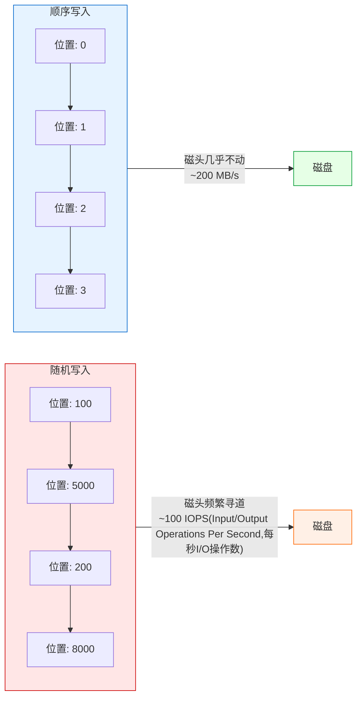

**核心结论**：顺序写入相比随机写入有10-100倍的性能提升，这是RocketMQ选择顺序写入作为核心存储策略的根本原因。

**关键概念**：
- **IOPS**：每秒I/O操作数，衡量磁盘随机访问性能的指标
- **顺序写入**：数据按物理位置连续写入，磁头移动距离最小
- **随机写入**：数据跳跃写入不同位置，磁头需要频繁寻道

**顺序写 vs 随机写性能对比说明**：

HDD(Hard Disk Drive,机械硬盘)的性能受磁头寻道时间影响较大。

| 写入方式 | 磁头移动 | 性能 | 说明 |
|---------|---------|------|------|
| 随机写入 | 频繁寻道 | ~100 IOPS(HDD) | 位置跳跃,磁头频繁移动 |
| 顺序写入 | 几乎不动 | ~200 MB/s(HDD) | 位置连续,磁头稳定移动 |
| 性能差异 | - | 10-100倍 | 顺序写比随机写快得多 |

**操作系统优化**：

| 优化 | 说明 |
|------|------|
| 预读 | 检测到顺序访问时，提前读取后续数据 |
| 合并写 | 将多个小写入合并为一个大写入 |
| 延迟分配 | ext4的delalloc，延迟分配磁盘块 |

### 2.2 CommitLog实现

[CommitLog.java](../store/src/main/java/org/apache/rocketmq/store/CommitLog.java) 实现顺序写入：

```java
public class CommitLog {
    private final MappedFileQueue mappedFileQueue;
    
    public PutMessageResult putMessage(final MessageExtBrokerInner msg) {
        // 获取当前写入的MappedFile
        MappedFile mappedFile = this.mappedFileQueue.getLastMappedFile();
        if (null == mappedFile || mappedFile.isFull()) {
            mappedFile = this.mappedFileQueue.getLastMappedFile(0);
        }
        
        // 顺序追加写入
        result = mappedFile.appendMessage(msg, this.appendMessageCallback);
        return result;
    }
}
```

**设计要点**：

| 要点 | 说明 |
|------|------|
| 所有消息写入同一文件 | CommitLog是全局唯一的写入点 |
| 追加写 | 始终在文件末尾追加，不修改已有数据 |
| 文件大小固定 | 单个文件1GB，写满后创建新文件 |

### 2.3 消息格式结构

CommitLog中每条消息的存储格式如下：

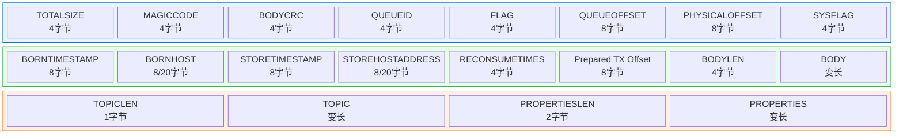

**核心结论**：消息存储格式分为三部分（消息头、消息体、消息尾），最小消息长度为68字节（IPv4）或92字节（IPv6），所有字段按固定顺序排列以实现高效解析。

**消息字段详解**：

| 字段 | 大小 | 说明 |
|------|------|------|
| TOTALSIZE | 4字节 | 消息总长度 |
| MAGICCODE | 4字节 | 魔数，用于标识消息类型：`MESSAGE_MAGIC_CODE = -626843481`（正常消息），`BLANK_MAGIC_CODE = -875286124`（文件末尾空白标记，用于填充文件末尾不足一条消息的空间） |
| BODYCRC | 4字节 | 消息体CRC32校验和 |
| QUEUEID | 4字节 | 消息队列ID |
| FLAG | 4字节 | 消息标志 |
| QUEUEOFFSET | 8字节 | 消息在队列中的偏移量 |
| PHYSICALOFFSET | 8字节 | 消息在CommitLog中的物理偏移量 |
| SYSFLAG | 4字节 | 系统标志，包含IPv6标志等 |
| BORNTIMESTAMP | 8字节 | 消息产生时间戳 |
| BORNHOST | 8/20字节 | 消息来源地址（IPv4为8字节，IPv6为20字节） |
| STORETIMESTAMP | 8字节 | 消息存储时间戳 |
| STOREHOSTADDRESS | 8/20字节 | 存储Broker地址（IPv4为8字节，IPv6为20字节） |
| RECONSUMETIMES | 4字节 | 重试消费次数 |
| Prepared Transaction Offset | 8字节 | 事务消息预处理偏移量 |
| BODYLEN | 4字节 | 消息体长度 |
| BODY | 变长 | 消息体内容 |
| TOPICLEN | 1字节 | Topic长度 |
| TOPIC | 变长 | Topic内容 |
| PROPERTIESLEN | 2字节 | 属性长度 |
| PROPERTIES | 变长 | 消息属性 |

**消息长度计算**（参考 [CommitLog.java:547-569](../store/src/main/java/org/apache/rocketmq/store/CommitLog.java#L547-L569)）：

```java
protected static int calMsgLength(int sysFlag, int bodyLength, int topicLength, int propertiesLength) {
    int bornhostLength = (sysFlag & MessageSysFlag.BORNHOST_V6_FLAG) == 0 ? 8 : 20;
    int storehostAddressLength = (sysFlag & MessageSysFlag.STOREHOSTADDRESS_V6_FLAG) == 0 ? 8 : 20;
    final int msgLen = 4 //TOTALSIZE
        + 4 //MAGICCODE
        + 4 //BODYCRC
        + 4 //QUEUEID
        + 4 //FLAG
        + 8 //QUEUEOFFSET
        + 8 //PHYSICALOFFSET
        + 4 //SYSFLAG
        + 8 //BORNTIMESTAMP
        + bornhostLength //BORNHOST
        + 8 //STORETIMESTAMP
        + storehostAddressLength //STOREHOSTADDRESS
        + 4 //RECONSUMETIMES
        + 8 //Prepared Transaction Offset
        + 4 + (bodyLength > 0 ? bodyLength : 0) //BODY
        + 1 + topicLength //TOPIC
        + 2 + (propertiesLength > 0 ? propertiesLength : 0) //propertiesLength
        + 0;
    return msgLen;
}
```

**消息最小长度**：

| 场景 | 最小长度 | 说明 |
|------|---------|------|
| IPv4地址 | 68字节 | 不含消息体和属性 |
| IPv6地址 | 92字节 | 不含消息体和属性 |

**文件末尾空白处理**：

当文件剩余空间不足以写入一条完整消息时（剩余空间 < 消息长度 + `END_FILE_MIN_BLANK_LENGTH`），会写入一个特殊的空白标记：

| 常量 | 值 | 说明 |
|------|-----|------|
| END_FILE_MIN_BLANK_LENGTH | 8字节 | 文件末尾最小空白长度 = TOTALSIZE(4字节) + MAGICCODE(4字节) |

空白标记格式：写入 `TOTALSIZE`（剩余空间大小）和 `BLANK_MAGIC_CODE`（-875286124），标识文件末尾的空白区域。

### 2.4 消息追加流程

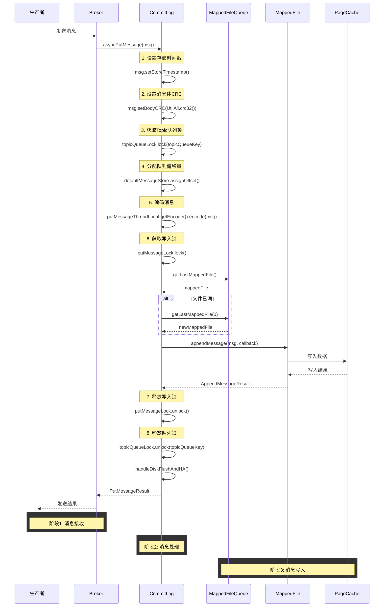

**核心结论**：消息追加流程采用双重锁机制（队列锁+写入锁）保证顺序性，通过MappedFile实现顺序写入PageCache，整个过程分为8个关键步骤，其中锁的获取和释放是性能关键点。

**追加流程关键步骤说明**：

| 步骤 | 操作 | 说明 |
|------|------|------|
| 1 | 设置存储时间戳 | 在锁内设置，保证全局有序 |
| 2 | 设置消息体CRC | 用于消息完整性校验 |
| 3 | 获取Topic队列锁 | 保证同一Topic-QueueId的消息顺序写入 |
| 4 | 分配队列偏移量 | 为消息分配唯一的队列偏移量 |
| 5 | 编码消息 | 将消息编码为字节序列 |
| 6 | 获取写入锁 | 使用自旋锁或可重入锁（可配置） |
| 7 | 追加消息 | 将消息写入MappedFile |
| 8 | 处理刷盘和HA | 根据配置执行同步/异步刷盘和主从同步 |

**写入锁类型选择**（参考 [CommitLog.java:114](../store/src/main/java/org/apache/rocketmq/store/CommitLog.java#L114)）：

| 配置项 | 锁类型 | 说明 |
|--------|--------|------|
| useReentrantLockWhenPutMessage=true | 可重入锁 | 默认值，适合高并发场景 |
| useReentrantLockWhenPutMessage=false | 自旋锁 | 适合锁竞争不激烈的场景 |

## 3. 文件预分配

### 3.1 预分配原理

**文件预分配**提前分配磁盘空间，获得连续块：

```c
// Linux 预分配系统调用
int fallocate(int fd, int mode, off_t offset, off_t len);
// mode: 0 = 预分配空间，FALLOC_FL_KEEP_SIZE = 不改变文件大小
```

**优势**：

| 优势 | 说明 |
|------|------|
| 减少碎片 | 预分配获得连续块 |
| 避免分配延迟 | 写入时无需等待分配 |
| 性能稳定 | 避免运行时分配的开销 |

### 3.2 异步预分配服务

[AllocateMappedFileService.java](../store/src/main/java/org/apache/rocketmq/store/AllocateMappedFileService.java) 异步预分配文件：

```java
public class AllocateMappedFileService extends ServiceThread {
    // 等待超时时间，默认值：5s
    private static int waitTimeOut = 1000 * 5;
    
    // 请求表，存储待分配的文件请求
    private ConcurrentMap<String, AllocateRequest> requestTable =
        new ConcurrentHashMap<String, AllocateRequest>();
    
    // 优先级阻塞队列，按文件大小和文件名排序
    private PriorityBlockingQueue<AllocateRequest> requestQueue =
        new PriorityBlockingQueue<AllocateRequest>();

    public MappedFile putRequestAndReturnMappedFile(
        String nextFilePath, String nextNextFilePath, int fileSize) {
        
        int canSubmitRequests = 2;
        
        // 如果启用了堆外内存池，检查可用缓冲区数量
        if (this.messageStore.getMessageStoreConfig().isTransientStorePoolEnable()) {
            if (this.messageStore.getMessageStoreConfig().isFastFailIfNoBufferInStorePool()
                && BrokerRole.SLAVE != this.messageStore.getMessageStoreConfig().getBrokerRole()) {
                canSubmitRequests = this.messageStore.getTransientStorePool()
                    .availableBufferNums() - this.requestQueue.size();
            }
        }

        // 创建下一个文件的分配请求
        AllocateRequest nextReq = new AllocateRequest(nextFilePath, fileSize);
        boolean nextPutOK = this.requestTable.putIfAbsent(nextFilePath, nextReq) == null;

        if (nextPutOK) {
            if (canSubmitRequests <= 0) {
                log.warn("[NOTIFYME]TransientStorePool is not enough...");
                this.requestTable.remove(nextFilePath);
                return null;
            }
            boolean offerOK = this.requestQueue.offer(nextReq);
            canSubmitRequests--;
        }

        // 预创建下下一个文件
        AllocateRequest nextNextReq = new AllocateRequest(nextNextFilePath, fileSize);
        boolean nextNextPutOK = this.requestTable.putIfAbsent(nextNextFilePath, nextNextReq) == null;
        if (nextNextPutOK) {
            if (canSubmitRequests <= 0) {
                this.requestTable.remove(nextNextFilePath);
            } else {
                this.requestQueue.offer(nextNextReq);
            }
        }

        // 等待文件创建完成
        AllocateRequest result = this.requestTable.get(nextFilePath);
        if (result != null) {
            boolean waitOK = result.getCountDownLatch().await(waitTimeOut, TimeUnit.MILLISECONDS);
            if (!waitOK) {
                log.warn("create mmap timeout " + result.getFilePath());
                return null;
            } else {
                this.requestTable.remove(nextFilePath);
                return result.getMappedFile();
            }
        }

        return null;
    }

    @Override
    public void run() {
        log.info(this.getServiceName() + " service started");

        while (!this.isStopped() && this.mmapOperation()) {
            // 循环执行mmap操作
        }
        log.info(this.getServiceName() + " service end");
    }

    /**
     * 执行mmap操作
     */
    private boolean mmapOperation() {
        boolean isSuccess = false;
        AllocateRequest req = null;
        try {
            // 从队列中获取请求
            req = this.requestQueue.take();
            
            AllocateRequest expectedRequest = this.requestTable.get(req.getFilePath());
            if (null == expectedRequest) {
                log.warn("this mmap request expired...");
                return true;
            }

            if (req.getMappedFile() == null) {
                long beginTime = System.currentTimeMillis();

                MappedFile mappedFile;
                // 根据配置选择创建方式
                if (messageStore.getMessageStoreConfig().isTransientStorePoolEnable()) {
                    mappedFile = ServiceLoader.load(MappedFile.class).iterator().next();
                    mappedFile.init(req.getFilePath(), req.getFileSize(), 
                        messageStore.getTransientStorePool());
                } else {
                    mappedFile = new DefaultMappedFile(req.getFilePath(), req.getFileSize());
                }

                long elapsedTime = UtilAll.computeElapsedTimeMilliseconds(beginTime);
                if (elapsedTime > 10) {
                    log.warn("create mappedFile spent time(ms) " + elapsedTime);
                }

                // 预热文件（如果启用）
                if (mappedFile.getFileSize() >= this.messageStore.getMessageStoreConfig()
                    .getMappedFileSizeCommitLog()
                    && this.messageStore.getMessageStoreConfig().isWarmMapedFileEnable()) {
                    mappedFile.warmMappedFile(
                        this.messageStore.getMessageStoreConfig().getFlushDiskType(),
                        this.messageStore.getMessageStoreConfig().getFlushLeastPagesWhenWarmMapedFile());
                }

                req.setMappedFile(mappedFile);
                this.hasException = false;
                isSuccess = true;
            }
        } catch (InterruptedException e) {
            log.warn(this.getServiceName() + " interrupted, possibly by shutdown.");
            this.hasException = true;
            return false;
        } catch (IOException e) {
            log.warn(this.getServiceName() + " service has exception. ", e);
            this.hasException = true;
            if (null != req) {
                requestQueue.offer(req);  // 重试
                Thread.sleep(1);
            }
        } finally {
            if (req != null && isSuccess)
                req.getCountDownLatch().countDown();  // 通知等待者
        }
        return true;
    }
}
```

**预分配流程图**：

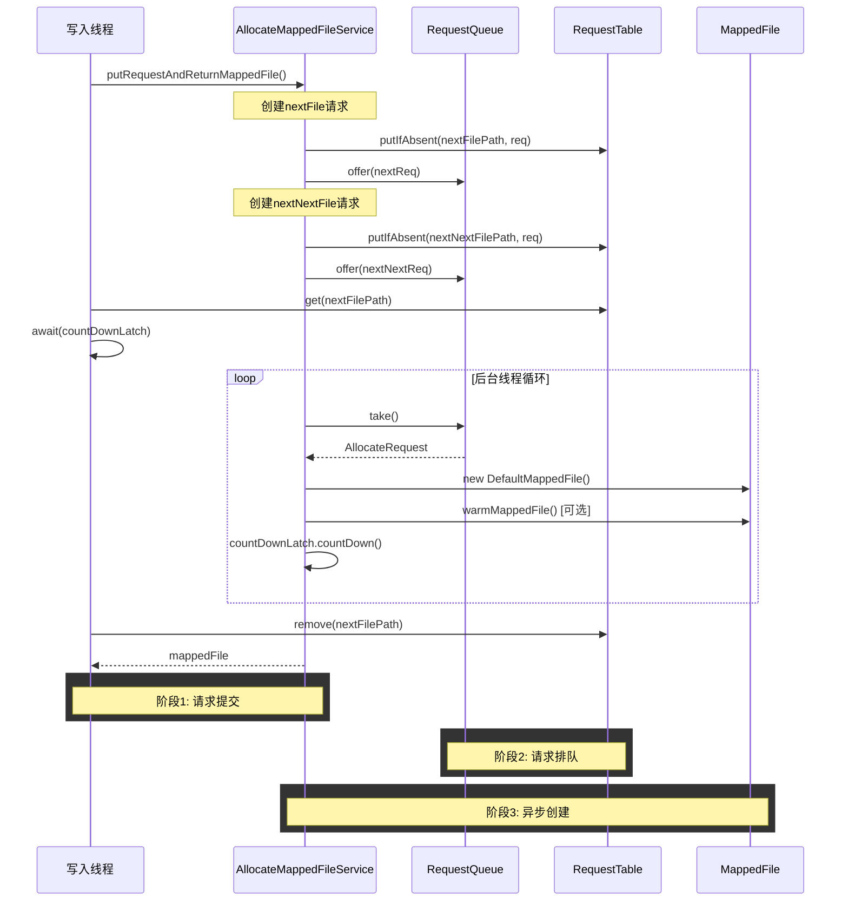

**核心结论**：预分配服务采用双文件预分配策略（nextFile + nextNextFile），通过异步后台线程提前创建MappedFile，写入线程通过CountDownLatch等待文件创建完成，实现写入零等待。

**预分配策略**：

| 策略 | 说明 |
|------|------|
| 双文件预分配 | 同时预创建下一个和下下一个文件 |
| 优先级队列 | 按文件大小和文件名排序处理请求 |
| 超时机制 | 等待文件创建超时时间为5s |
| 异常重试 | 创建失败时将请求重新放回队列 |

**AllocateRequest结构**：

```java
static class AllocateRequest implements Comparable<AllocateRequest> {
    private String filePath;                              // 文件完整路径
    private int fileSize;                                 // 文件大小
    private CountDownLatch countDownLatch = new CountDownLatch(1);  // 用于等待创建完成
    private volatile MappedFile mappedFile = null;        // 创建完成的MappedFile

    public int compareTo(AllocateRequest other) {
        // 优先按文件大小降序，再按文件名升序
        if (this.fileSize < other.fileSize) return 1;
        else if (this.fileSize > other.fileSize) return -1;
        else {
            // 按文件名（偏移量）排序
            long mName = Long.parseLong(this.filePath.substring(mIndex + 1));
            long oName = Long.parseLong(other.filePath.substring(oIndex + 1));
            return Long.compare(mName, oName);
        }
    }
}
```

## 4. PageCache刷盘机制

### 4.1 PageCache原理

**PageCache**是内核维护的文件缓存，脏页需要刷写到磁盘：

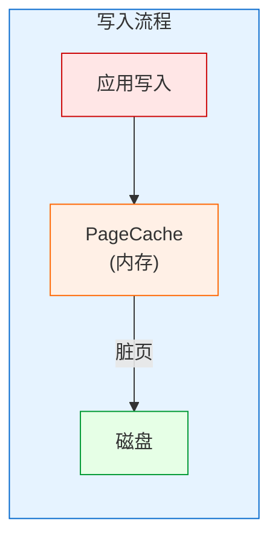

**核心结论**：PageCache作为应用与磁盘之间的缓存层，将写入操作从同步变为异步，显著提升写入性能，但需要在数据安全性与性能之间权衡。

**PageCache刷盘机制说明**：

PageCache是内核维护的文件缓存层，应用写入先到内存中的PageCache，形成脏页后再异步刷写到磁盘。

| 步骤 | 操作 | 类型 | 说明 |
|------|------|------|------|
| 1 | 应用写入 | 用户态 | 应用程序调用write()系统调用 |
| 2 | PageCache缓存 | 内核态 | 数据写入内存中的PageCache，形成脏页 |
| 3 | 脏页刷盘 | 内核态 | 脏页被刷写到磁盘，变为干净页 |

| 触发条件 | 说明 |
|---------|------|
| 显式调用 fsync()/fdatasync() | 应用主动触发刷盘 |
| 脏页比例超过 /proc/sys/vm/dirty_ratio | 内核自动触发 |
| 脏页存活时间超过 dirty_expire_centisecs | 定时触发 |
| 内存不足时回收页面 | 内存压力触发 |

**系统调用对比**：

| 系统调用 | 说明 |
|---------|------|
| fsync() | 同步数据和元数据（时间戳等） |
| fdatasync() | 仅同步数据，不同步元数据 |
| sync() | 同步所有文件系统缓存 |

### 4.2 异步刷盘流程

**异步刷盘流程**：

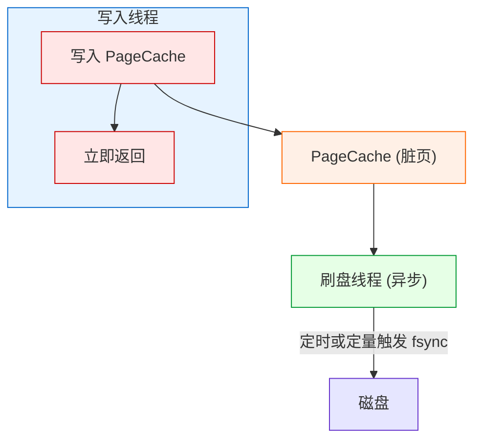

**核心结论**：异步刷盘将写入与刷盘分离，写入线程无需等待刷盘即可返回，由后台线程定时或定量触发刷盘，实现高吞吐量，但存在数据丢失风险。

**异步刷盘流程说明**：

异步刷盘将写入操作与刷盘操作分离，写入线程无需等待刷盘完成即可返回，由后台刷盘线程异步完成刷盘。

| 步骤 | 操作 | 类型 | 说明 |
|------|------|------|------|
| 1 | 写入 PageCache | 写入线程 | 应用数据写入内存中的PageCache |
| 2 | 立即返回 | 写入线程 | 写入完成立即返回，不等待刷盘 |
| 3 | PageCache 脏页 | 缓存层 | 数据在内存中等待刷盘 |
| 4 | 刷盘线程 | 后台线程 | 独立线程负责刷盘 |
| 5 | 定时或定量触发 | 刷盘策略 | 根据时间间隔或脏页数量触发 |
| 6 | fsync 刷盘 | 系统调用 | 将脏页写入磁盘 |

**关键概念**：

- **脏页(Dirty Page)**：已写入PageCache但尚未刷写到磁盘的页面
- **异步刷盘优势**：写入延迟低，吞吐量高
- **风险**：系统崩溃可能丢失未刷盘的数据

### 4.3 RocketMQ刷盘实现

[CommitLog.java](../store/src/main/java/org/apache/rocketmq/store/CommitLog.java) 实现多种刷盘策略：

**刷盘类型枚举**（参考 [FlushDiskType.java](../store/src/main/java/org/apache/rocketmq/store/config/FlushDiskType.java)）：

```java
public enum FlushDiskType {
    SYNC_FLUSH,    // 同步刷盘
    ASYNC_FLUSH    // 异步刷盘
}
```

#### 3.3.1.1 同步刷盘

**同步刷盘流程**：

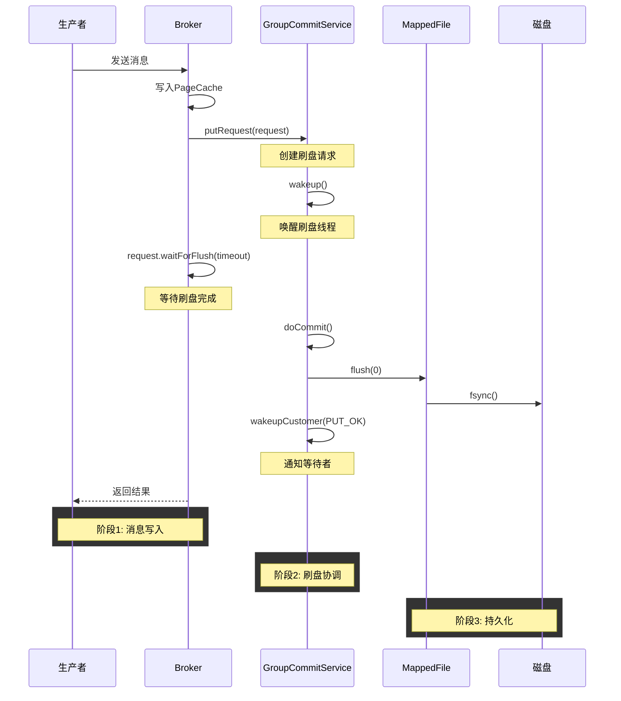

**核心结论**：同步刷盘通过GroupCommitService协调，生产者线程写入PageCache后阻塞等待刷盘完成，刷盘线程执行fsync后通知等待者，确保每条消息都持久化到磁盘。

**同步刷盘代码实现**（参考 [CommitLog.java:2106-2139](../store/src/main/java/org/apache/rocketmq/store/CommitLog.java#L2106-L2139)）：

```java
public void handleDiskFlush(AppendMessageResult result, PutMessageResult putMessageResult,
    MessageExt messageExt) {
    // 同步刷盘模式
    if (FlushDiskType.SYNC_FLUSH == CommitLog.this.defaultMessageStore
        .getMessageStoreConfig().getFlushDiskType()) {
        final GroupCommitService service = (GroupCommitService) this.flushCommitLogService;
        if (messageExt.isWaitStoreMsgOK()) {
            // 创建刷盘请求
            GroupCommitRequest request = new GroupCommitRequest(
                result.getWroteOffset() + result.getWroteBytes(), 
                CommitLog.this.defaultMessageStore.getMessageStoreConfig().getSyncFlushTimeout());  // 默认值：5s
            service.putRequest(request);
            
            // 等待刷盘完成
            CompletableFuture<PutMessageStatus> flushOkFuture = request.future();
            PutMessageStatus flushStatus = flushOkFuture.get(
                CommitLog.this.defaultMessageStore.getMessageStoreConfig().getSyncFlushTimeout(),
                TimeUnit.MILLISECONDS);
            
            if (flushStatus != PutMessageStatus.PUT_OK) {
                putMessageResult.setPutMessageStatus(PutMessageStatus.FLUSH_DISK_TIMEOUT);
            }
        } else {
            service.wakeup();
        }
    }
    // 异步刷盘模式
    else {
        if (!CommitLog.this.defaultMessageStore.getMessageStoreConfig().isTransientStorePoolEnable()) {
            flushCommitLogService.wakeup();
        } else {
            commitLogService.wakeup();
        }
    }
}
```

#### 3.3.3.2 GroupCommitRequest

**GroupCommitRequest**用于同步刷盘请求的协调：

```java
public static class GroupCommitRequest {
    private final long nextOffset;                    // 下一个刷盘偏移量
    private final CompletableFuture<PutMessageStatus> flushOKFuture = new CompletableFuture<>();
    private volatile int ackNums = 1;                 // 需要确认的数量
    private final long deadLine;                      // 截止时间

    public GroupCommitRequest(long nextOffset, long timeoutMillis) {
        this.nextOffset = nextOffset;
        this.deadLine = System.nanoTime() + (timeoutMillis * 1_000_000);  // 转换为纳秒
    }

    public GroupCommitRequest(long nextOffset, long timeoutMillis, int ackNums) {
        this(nextOffset, timeoutMillis);
        this.ackNums = ackNums;
    }

    // 唤醒等待者，设置刷盘结果
    public void wakeupCustomer(final PutMessageStatus status) {
        this.flushOKFuture.complete(status);
    }

    public CompletableFuture<PutMessageStatus> future() {
        return flushOKFuture;
    }
}
```

**GroupCommitRequest字段说明**：

| 字段 | 类型 | 说明 |
|------|------|------|
| nextOffset | long | 需要刷盘到的目标偏移量 |
| flushOKFuture | CompletableFuture | 用于异步等待刷盘结果 |
| ackNums | int | 需要确认的副本数（主从同步时使用） |
| deadLine | long | 请求截止时间（纳秒） |

#### 3.3.1.3 GroupCommitService

**GroupCommitService**是同步刷盘的核心服务：

```java
class GroupCommitService extends FlushCommitLogService {
    // 写请求队列
    private volatile LinkedList<GroupCommitRequest> requestsWrite = new LinkedList<GroupCommitRequest>();
    // 读请求队列（用于处理）
    private volatile LinkedList<GroupCommitRequest> requestsRead = new LinkedList<GroupCommitRequest>();
    private final PutMessageSpinLock lock = new PutMessageSpinLock();

    // 添加刷盘请求
    public synchronized void putRequest(final GroupCommitRequest request) {
        lock.lock();
        try {
            this.requestsWrite.add(request);
        } finally {
            lock.unlock();
        }
        this.wakeup();  // 唤醒刷盘线程
    }

    // 交换读写队列
    private void swapRequests() {
        lock.lock();
        try {
            LinkedList<GroupCommitRequest> tmp = this.requestsWrite;
            this.requestsWrite = this.requestsRead;
            this.requestsRead = tmp;
        } finally {
            lock.unlock();
        }
    }

    // 执行刷盘
    private void doCommit() {
        if (!this.requestsRead.isEmpty()) {
            for (GroupCommitRequest req : this.requestsRead) {
                // 检查是否已刷盘到目标偏移量
                boolean flushOK = CommitLog.this.mappedFileQueue.getFlushedWhere() >= req.getNextOffset();
                
                // 最多刷盘两次（可能跨文件）
                for (int i = 0; i < 2 && !flushOK; i++) {
                    CommitLog.this.mappedFileQueue.flush(0);
                    flushOK = CommitLog.this.mappedFileQueue.getFlushedWhere() >= req.getNextOffset();
                }

                // 通知等待者
                req.wakeupCustomer(flushOK ? PutMessageStatus.PUT_OK : PutMessageStatus.FLUSH_DISK_TIMEOUT);
            }

            // 更新检查点时间戳
            long storeTimestamp = CommitLog.this.mappedFileQueue.getStoreTimestamp();
            if (storeTimestamp > 0) {
                CommitLog.this.defaultMessageStore.getStoreCheckpoint().setPhysicMsgTimestamp(storeTimestamp);
            }

            this.requestsRead = new LinkedList<>();
        } else {
            // 没有请求时也执行一次刷盘
            CommitLog.this.mappedFileQueue.flush(0);
        }
    }

    public void run() {
        CommitLog.log.info(this.getServiceName() + " service started");

        while (!this.isStopped()) {
            try {
                this.waitForRunning(10);  // 等待10ms或被唤醒
                this.doCommit();
            } catch (Exception e) {
                CommitLog.log.warn(this.getServiceName() + " service has exception. ", e);
            }
        }

        // 关闭时处理剩余请求
        Thread.sleep(10);
        synchronized (this) {
            this.swapRequests();
        }
        this.doCommit();

        CommitLog.log.info(this.getServiceName() + " service end");
    }

    @Override
    protected void onWaitEnd() {
        this.swapRequests();  // 等待结束后交换队列
    }

    @Override
    public long getJoinTime() {
        return 1000 * 60 * 5;  // 5分钟
    }
}
```

**GroupCommitService工作原理**：

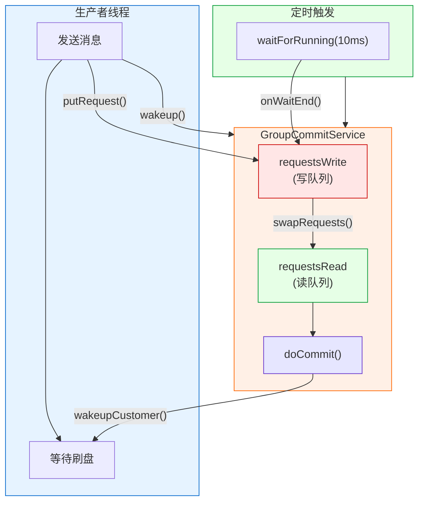

**核心结论**：GroupCommitService采用读写队列分离设计，通过swapRequests()交换队列避免锁竞争，生产者线程写入写队列，刷盘线程处理读队列，实现高效的异步刷盘协调。

**方法协作关系说明**：

| 方法 | 调用时机 | 协作关系 |
|------|---------|---------|
| `putRequest()` | 生产者线程写入消息后 | 将请求加入写队列，并调用`wakeup()`唤醒刷盘线程 |
| `wakeup()` | `putRequest()`内部调用 | 设置`hasNotified=true`，调用`waitPoint.countDown()`唤醒等待的线程 |
| `waitForRunning(10)` | 刷盘线程循环中调用 | 等待10ms或被`wakeup()`唤醒，唤醒后调用`onWaitEnd()` |
| `onWaitEnd()` | `waitForRunning()`结束后调用 | 交换读写队列，准备处理请求 |
| `doCommit()` | `onWaitEnd()`之后调用 | 遍历读队列执行刷盘，完成后调用`wakeupCustomer()`通知等待者 |

**onWaitEnd()回调触发条件**（参考 [ServiceThread.java:129-145](../common/src/main/java/org/apache/rocketmq/common/ServiceThread.java#L129-L145)）：

```java
protected void waitForRunning(long interval) {
    // 触发条件1：已被唤醒（hasNotified=true）
    if (hasNotified.compareAndSet(true, false)) {
        this.onWaitEnd();
        return;
    }

    // 触发条件2：定时等待超时
    waitPoint.reset();
    try {
        waitPoint.await(interval, TimeUnit.MILLISECONDS);
    } catch (InterruptedException e) {
        log.error("Interrupted", e);
    } finally {
        hasNotified.set(false);
        this.onWaitEnd();  // 无论是否被唤醒，都会调用
    }
}
```

| 触发方式 | 条件 | 说明 |
|---------|------|------|
| 被唤醒触发 | `hasNotified=true` | 其他线程调用`wakeup()`后立即触发 |
| 定时触发 | 等待超时 | 等待`interval`毫秒后自动触发 |

#### 3.3.1.4 异步刷盘

**异步刷盘流程**：

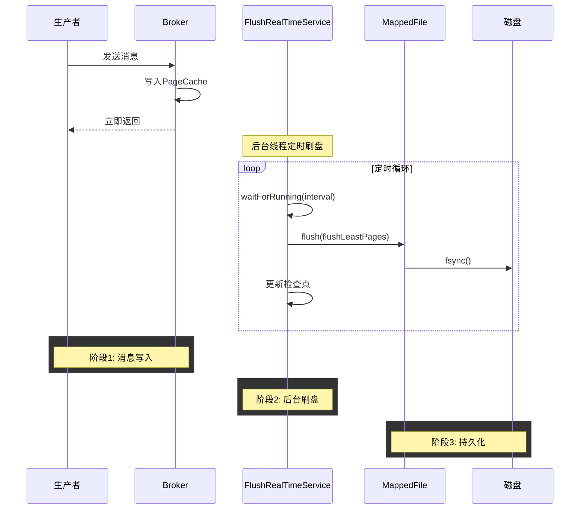

**核心结论**：异步刷盘由FlushRealTimeService后台线程定时执行，生产者写入PageCache后立即返回，刷盘线程根据时间间隔或脏页数量触发刷盘，实现高吞吐量但存在数据丢失风险。

**FlushRealTimeService实现**（参考 [CommitLog.java:1319-1403](../store/src/main/java/org/apache/rocketmq/store/CommitLog.java#L1319-L1403)）：

```java
class FlushRealTimeService extends FlushCommitLogService {
    private long lastFlushTimestamp = 0;
    private long printTimes = 0;

    @Override
    public void run() {
        CommitLog.log.info(this.getServiceName() + " service started");

        while (!this.isStopped()) {
            // 是否使用定时刷盘
            boolean flushCommitLogTimed = CommitLog.this.defaultMessageStore
                .getMessageStoreConfig().isFlushCommitLogTimed();  // 默认值：true

            // 刷盘间隔，默认值：500ms
            int interval = CommitLog.this.defaultMessageStore.getMessageStoreConfig()
                .getFlushIntervalCommitLog();
            
            // 最少刷盘页数，默认值：4页（16KB）
            int flushPhysicQueueLeastPages = CommitLog.this.defaultMessageStore
                .getMessageStoreConfig().getFlushCommitLogLeastPages();

            // 完全刷盘间隔，默认值：10s
            int flushPhysicQueueThoroughInterval = CommitLog.this.defaultMessageStore
                .getMessageStoreConfig().getFlushCommitLogThoroughInterval();

            boolean printFlushProgress = false;

            // 超过完全刷盘间隔，强制刷盘
            long currentTimeMillis = System.currentTimeMillis();
            if (currentTimeMillis >= (this.lastFlushTimestamp + flushPhysicQueueThoroughInterval)) {
                this.lastFlushTimestamp = currentTimeMillis;
                flushPhysicQueueLeastPages = 0;  // 设为0表示强制刷盘
                printFlushProgress = (printTimes++ % 10) == 0;
            }

            try {
                if (flushCommitLogTimed) {
                    Thread.sleep(interval);  // 定时睡眠
                } else {
                    this.waitForRunning(interval);  // 可被唤醒
                }

                if (printFlushProgress) {
                    this.printFlushProgress();
                }

                long begin = System.currentTimeMillis();
                CommitLog.this.mappedFileQueue.flush(flushPhysicQueueLeastPages);
                
                // 更新检查点
                long storeTimestamp = CommitLog.this.mappedFileQueue.getStoreTimestamp();
                if (storeTimestamp > 0) {
                    CommitLog.this.defaultMessageStore.getStoreCheckpoint()
                        .setPhysicMsgTimestamp(storeTimestamp);
                }
                
                long past = System.currentTimeMillis() - begin;
                if (past > 500) {
                    log.info("Flush data to disk costs {} ms", past);
                }
            } catch (Throwable e) {
                CommitLog.log.warn(this.getServiceName() + " service has exception. ", e);
            }
        }

        // 关闭时确保所有数据刷盘
        boolean result = false;
        for (int i = 0; i < RETRY_TIMES_OVER && !result; i++) {
            result = CommitLog.this.mappedFileQueue.flush(0);
        }

        this.printFlushProgress();
        CommitLog.log.info(this.getServiceName() + " service end");
    }

    @Override
    public long getJoinTime() {
        return 1000 * 60 * 5;  // 5分钟
    }
}
```

**异步刷盘策略说明**：

| 策略 | 配置项 | 默认值 | 说明 |
|------|--------|--------|------|
| 定时刷盘 | flushCommitLogTimed | true | 使用Thread.sleep()定时等待 |
| 可唤醒刷盘 | flushCommitLogTimed | false | 使用waitForRunning()可被唤醒 |
| 最少刷盘页数 | flushCommitLogLeastPages | 4页(16KB) | 脏页数少于此值不刷盘 |
| 完全刷盘间隔 | flushCommitLogThoroughInterval | 10s | 间隔超过此值强制刷盘 |

#### 3.3.1.5 CommitRealTimeService

当启用堆外内存池时，使用**CommitRealTimeService**将数据从堆外内存提交到FileChannel：

```java
class CommitRealTimeService extends FlushCommitLogService {
    private long lastCommitTimestamp = 0;

    @Override
    public void run() {
        CommitLog.log.info(this.getServiceName() + " service started");
        while (!this.isStopped()) {
            // 提交间隔，默认值：200ms
            int interval = CommitLog.this.defaultMessageStore.getMessageStoreConfig()
                .getCommitIntervalCommitLog();

            // 最少提交页数，默认值：4页（16KB）
            int commitDataLeastPages = CommitLog.this.defaultMessageStore.getMessageStoreConfig()
                .getCommitCommitLogLeastPages();

            // 完全提交间隔，默认值：200ms
            int commitDataThoroughInterval = CommitLog.this.defaultMessageStore.getMessageStoreConfig()
                .getCommitCommitLogThoroughInterval();

            long begin = System.currentTimeMillis();
            if (begin >= (this.lastCommitTimestamp + commitDataThoroughInterval)) {
                this.lastCommitTimestamp = begin;
                commitDataLeastPages = 0;  // 强制提交
            }

            try {
                boolean result = CommitLog.this.mappedFileQueue.commit(commitDataLeastPages);
                long end = System.currentTimeMillis();
                if (!result) {
                    this.lastCommitTimestamp = end;
                    CommitLog.this.flushManager.wakeUpFlush();  // 唤醒刷盘线程
                }
                if (end - begin > 500) {
                    log.info("Commit data to file costs {} ms", end - begin);
                }
                this.waitForRunning(interval);
            } catch (Throwable e) {
                CommitLog.log.error(this.getServiceName() + " service has exception. ", e);
            }
        }

        // 关闭时重试提交
        boolean result = false;
        for (int i = 0; i < RETRY_TIMES_OVER && !result; i++) {
            result = CommitLog.this.mappedFileQueue.commit(0);
        }
        CommitLog.log.info(this.getServiceName() + " service end");
    }
}
```

**commit与flush协作关系**：

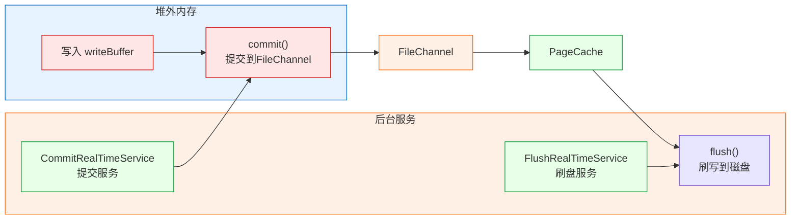

**核心结论**：启用堆外内存池后，写入流程分为三阶段：写入线程写入堆外内存，CommitRealTimeService提交到FileChannel，FlushRealTimeService刷写到磁盘，实现写入与刷盘完全解耦。

| 操作 | 作用 | 触发服务 |
|------|------|---------|
| commit() | 将堆外内存数据写入FileChannel | CommitRealTimeService |
| flush() | 将FileChannel数据刷写到磁盘 | FlushRealTimeService |

#### 3.3.1.6 GroupCheckService

**GroupCheckService**用于异步刷盘模式下检查刷盘状态：

**触发条件**：当启用堆外内存池（`transientStorePoolEnable=true`）时，GroupCheckService 用于检查异步刷盘请求是否完成。与 GroupCommitService 不同，GroupCheckService 不主动触发刷盘，而是被动等待 FlushRealTimeService 完成刷盘后检查状态。

```java
class GroupCheckService extends FlushCommitLogService {
    private volatile List<GroupCommitRequest> requestsWrite = new ArrayList<GroupCommitRequest>();
    private volatile List<GroupCommitRequest> requestsRead = new ArrayList<GroupCommitRequest>();

    public boolean isAsyncRequestsFull() {
        return requestsWrite.size() > CommitLog.this.defaultMessageStore.getMessageStoreConfig()
            .getMaxAsyncPutMessageRequests() * 2;  // 默认值：5000 * 2
    }

    private void doCommit() {
        synchronized (this.requestsRead) {
            if (!this.requestsRead.isEmpty()) {
                for (GroupCommitRequest req : this.requestsRead) {
                    boolean flushOK = false;
                    // 最多等待1000次检查
                    for (int i = 0; i < 1000; i++) {
                        flushOK = CommitLog.this.mappedFileQueue.getFlushedWhere() >= req.getNextOffset();
                        if (flushOK) {
                            break;
                        } else {
                            Thread.sleep(1);  // 等待1ms后重试
                        }
                    }
                    req.wakeupCustomer(flushOK ? PutMessageStatus.PUT_OK : PutMessageStatus.FLUSH_DISK_TIMEOUT);
                }

                // 更新检查点
                long storeTimestamp = CommitLog.this.mappedFileQueue.getStoreTimestamp();
                if (storeTimestamp > 0) {
                    CommitLog.this.defaultMessageStore.getStoreCheckpoint().setPhysicMsgTimestamp(storeTimestamp);
                }

                this.requestsRead.clear();
            }
        }
    }

    public void run() {
        while (!this.isStopped()) {
            try {
                this.waitForRunning(1);  // 等待1ms
                this.doCommit();
            } catch (Exception e) {
                CommitLog.log.warn(this.getServiceName() + " service has exception. ", e);
            }
        }
        // 关闭时处理剩余请求
        Thread.sleep(10);
        synchronized (this) {
            this.swapRequests();
        }
        this.doCommit();
    }
}
```

**GroupCheckService 工作原理**：

| 特性 | 说明 |
|------|------|
| 检查方式 | 轮询检查 `flushedWhere >= nextOffset` |
| 最大检查次数 | 1000次，每次间隔1ms，总计最长等待1s |
| 等待间隔 | `waitForRunning(1)`，每1ms检查一次 |
| 适用场景 | 堆外内存模式下的异步刷盘状态检查 |

**GroupCheckService vs GroupCommitService 对比**：

| 特性 | GroupCommitService | GroupCheckService |
|------|-------------------|-------------------|
| 刷盘模式 | 同步刷盘 | 堆外内存+异步刷盘 |
| 触发方式 | 主动调用 `flush(0)` 触发刷盘 | 被动检查刷盘状态 |
| 等待机制 | CountDownLatch 等待刷盘完成 | 轮询检查 flushedWhere |
| 最大等待时间 | syncFlushTimeout（默认5s） | 1000次 * 1ms = 1s |

### 4.4 刷盘策略对比

| 策略 | 数据安全 | 性能 | 适用场景 | 服务类 | 最大数据丢失风险 |
|------|---------|------|---------|--------|----------------|
| 同步刷盘 | 高（最多丢1条） | 低 | 金融交易 | GroupCommitService | 最多丢失1条正在写入的消息 |
| 异步刷盘 | 中（可能丢几秒数据） | 高 | 日志采集 | FlushRealTimeService | 最多丢失 flushCommitLogThoroughInterval（默认10s）内的数据 |
| 堆外内存+异步刷盘 | 中 | 最高 | 高吞吐场景 | CommitRealTimeService + FlushRealTimeService | 最多丢失 commitCommitLogThoroughInterval + flushCommitLogThoroughInterval（默认10.2s）内的数据 |

**刷盘策略对比图**：

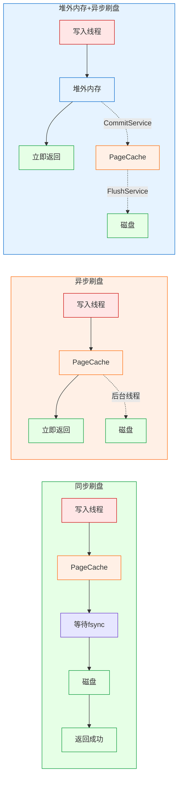

**核心结论**：三种刷盘策略在数据安全性与性能之间呈现此消彼长的关系，同步刷盘保证数据安全但性能最低，堆外内存+异步刷盘性能最高但数据丢失风险最大，异步刷盘介于两者之间，应根据业务场景选择合适的策略。

**刷盘策略选择建议**：

| 场景 | 推荐策略 | 配置 |
|------|---------|------|
| 金融交易、订单 | 同步刷盘 | flushDiskType=SYNC_FLUSH |
| 日志采集、监控 | 异步刷盘 | flushDiskType=ASYNC_FLUSH |
| 高吞吐、可容忍少量丢失 | 堆外内存+异步刷盘 | transientStorePoolEnable=true |

## 5. 堆外内存池

### 5.1 TransientStorePool原理

**TransientStorePool**是一个堆外内存池，用于提高写入性能：

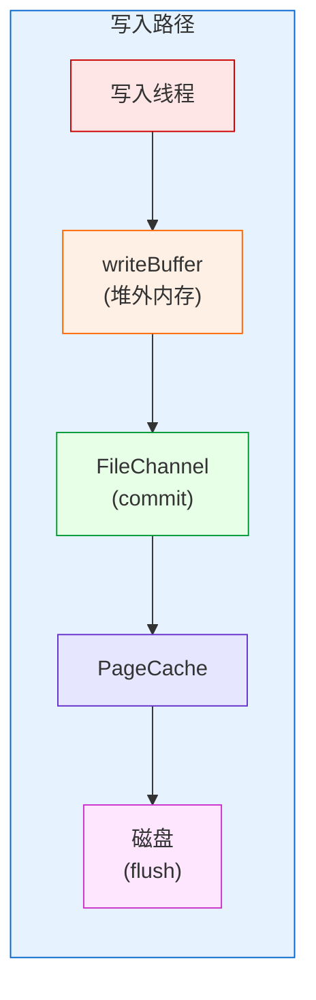

**核心结论**：堆外内存池通过TransientStorePool管理，写入线程直接写入堆外内存，避免与PageCache竞争，通过commit和flush两阶段异步持久化，实现最高写入吞吐量。

**堆外内存池优势**：

| 优势 | 说明 |
|------|------|
| 减少GC压力 | 堆外内存不受JVM GC管理 |
| 避免内存拷贝 | 直接写入堆外内存，减少一次拷贝 |
| 提高写入性能 | 写入与刷盘分离，提高吞吐量 |

### 4.2 TransientStorePool实现

[TransientStorePool.java](../store/src/main/java/org/apache/rocketmq/store/TransientStorePool.java)：

```java
public class TransientStorePool {
    private final int poolSize;                    // 池大小，默认值：5
    private final int fileSize;                    // 文件大小，默认值：1GB
    private final Deque<ByteBuffer> availableBuffers;  // 可用缓冲区队列
    private final MessageStoreConfig storeConfig;

    public TransientStorePool(final MessageStoreConfig storeConfig) {
        this.storeConfig = storeConfig;
        this.poolSize = storeConfig.getTransientStorePoolSize();  // 默认值：5
        this.fileSize = storeConfig.getMappedFileSizeCommitLog();  // 默认值：1GB
        this.availableBuffers = new ConcurrentLinkedDeque<>();
    }

    /**
     * 初始化内存池 - 这是一个重量级操作
     */
    public void init() {
        for (int i = 0; i < poolSize; i++) {
            // 分配直接内存
            ByteBuffer byteBuffer = ByteBuffer.allocateDirect(fileSize);

            // 锁定内存，防止被交换到磁盘
            final long address = ((DirectBuffer) byteBuffer).address();
            Pointer pointer = new Pointer(address);
            LibC.INSTANCE.mlock(pointer, new NativeLong(fileSize));

            availableBuffers.offer(byteBuffer);
        }
    }

    /**
     * 销毁内存池
     */
    public void destroy() {
        for (ByteBuffer byteBuffer : availableBuffers) {
            final long address = ((DirectBuffer) byteBuffer).address();
            Pointer pointer = new Pointer(address);
            LibC.INSTANCE.munlock(pointer, new NativeLong(fileSize));
        }
    }

    /**
     * 归还缓冲区
     */
    public void returnBuffer(ByteBuffer byteBuffer) {
        byteBuffer.position(0);
        byteBuffer.limit(fileSize);
        this.availableBuffers.offerFirst(byteBuffer);
    }

    /**
     * 借用缓冲区
     */
    public ByteBuffer borrowBuffer() {
        ByteBuffer buffer = availableBuffers.pollFirst();
        if (availableBuffers.size() < poolSize * 0.4) {
            log.warn("TransientStorePool only remain {} sheets.", availableBuffers.size());
        }
        return buffer;
    }

    /**
     * 可用缓冲区数量
     */
    public int availableBufferNums() {
        if (storeConfig.isTransientStorePoolEnable()) {
            return availableBuffers.size();
        }
        return Integer.MAX_VALUE;
    }
}
```

**TransientStorePool关键方法说明**：

| 方法 | 说明 | 调用时机 |
|------|------|---------|
| `init()` | 分配并锁定堆外内存 | Broker启动时 |
| `destroy()` | 解锁并释放堆外内存 | Broker关闭时 |
| `borrowBuffer()` | 从池中借用缓冲区 | 创建MappedFile时 |
| `returnBuffer()` | 归还缓冲区到池中 | MappedFile销毁时 |
| `availableBufferNums()` | 获取可用缓冲区数量 | 预分配文件时检查 |

### 5.3 堆外内存写入流程

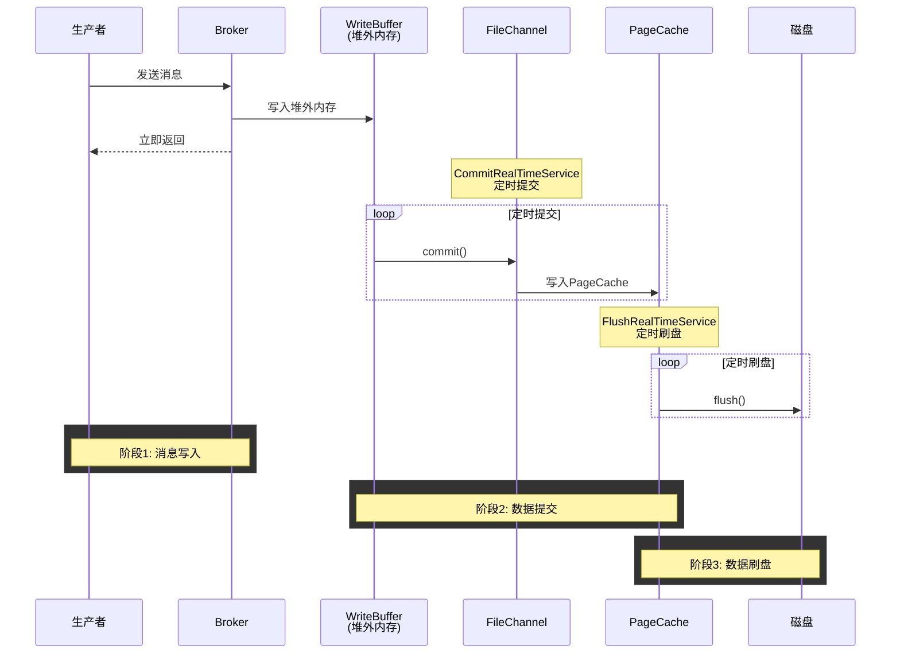

**核心结论**：堆外内存写入流程将写入、提交、刷盘三阶段完全异步化，生产者写入堆外内存后立即返回，由两个后台服务分别负责提交和刷盘，实现最高性能但需要权衡数据安全性。

**启用条件**（参考 [MessageStoreConfig.java](../store/src/main/java/org/apache/rocketmq/store/config/MessageStoreConfig.java)）：

```java
public boolean isTransientStorePoolEnable() {
    // 必须同时满足：配置启用 + 非Slave节点
    return transientStorePoolEnable && BrokerRole.SLAVE != getBrokerRole();
}
```

**堆外内存写入优势**：

| 优势 | 说明 |
|------|------|
| 减少GC压力 | 堆外内存不受JVM GC管理 |
| 避免内存拷贝 | 直接写入堆外内存，减少一次拷贝 |
| 提高写入性能 | 写入与刷盘分离，提高吞吐量 |
| 内存锁定 | 使用mlock防止内存被交换到磁盘 |

## 6. 内存锁定与预热

### 6.1 mlock内存锁定

**mlock**将内存锁定在物理内存中，防止被交换到磁盘：

```c
#include <sys/mman.h>
int mlock(const void *addr, size_t len);
int munlock(const void *addr, size_t len);
```

**mlock优势**：

| 优势 | 说明 |
|------|------|
| 避免页面交换 | 锁定的内存不会被交换到磁盘 |
| 降低访问延迟 | 内存访问延迟稳定 |
| 提高实时性 | 适合对延迟敏感的应用 |

### 5.2 madvise内存建议

**madvise**向内核提供内存访问模式的建议：

```c
#include <sys/mman.h>
int madvise(void *addr, size_t length, int advice);
```

**常用advice参数**：

| 参数 | 说明 |
|------|------|
| MADV_WILLNEED | 预读：告诉内核这些页面即将被访问 |
| MADV_DONTNEED | 释放：告诉内核这些页面不再需要 |
| MADV_SEQUENTIAL | 顺序访问：告诉内核将进行顺序访问 |
| MADV_RANDOM | 随机访问：告诉内核将进行随机访问 |

### 5.3 mlock实现

[DefaultMappedFile.java](../store/src/main/java/org/apache/rocketmq/store/logfile/DefaultMappedFile.java) 实现内存锁定：

```java
@Override
public void mlock() {
    final long beginTime = System.currentTimeMillis();
    final long address = ((DirectBuffer) (this.mappedByteBuffer)).address();
    Pointer pointer = new Pointer(address);
    
    // 锁定内存
    {
        int ret = LibC.INSTANCE.mlock(pointer, new NativeLong(this.fileSize));
        log.info("mlock {} {} {} ret = {} time consuming = {}", 
            address, this.fileName, this.fileSize, ret, 
            System.currentTimeMillis() - beginTime);
    }

    // 建议内核预读
    {
        int ret = LibC.INSTANCE.madvise(pointer, new NativeLong(this.fileSize), 
            LibC.MADV_WILLNEED);
        log.info("madvise {} {} {} ret = {} time consuming = {}", 
            address, this.fileName, this.fileSize, ret, 
            System.currentTimeMillis() - beginTime);
    }
}

@Override
public void munlock() {
    final long beginTime = System.currentTimeMillis();
    final long address = ((DirectBuffer) (this.mappedByteBuffer)).address();
    Pointer pointer = new Pointer(address);
    int ret = LibC.INSTANCE.munlock(pointer, new NativeLong(this.fileSize));
    log.info("munlock {} {} {} ret = {} time consuming = {}", 
        address, this.fileName, this.fileSize, ret, 
        System.currentTimeMillis() - beginTime);
}
```

### 6.4 文件预热流程

**warmMappedFile**方法预热文件，将数据加载到PageCache：

```java
@Override
public void warmMappedFile(FlushDiskType type, int pages) {
    this.mappedByteBufferAccessCountSinceLastSwap++;

    long beginTime = System.currentTimeMillis();
    ByteBuffer byteBuffer = this.mappedByteBuffer.slice();
    int flush = 0;
    long time = System.currentTimeMillis();
    
    // 按页写入0，触发缺页中断，将页加载到内存
    for (int i = 0, j = 0; i < this.fileSize; i += DefaultMappedFile.OS_PAGE_SIZE, j++) {
        byteBuffer.put(i, (byte) 0);
        
        // 同步刷盘模式下，按页刷盘
        if (type == FlushDiskType.SYNC_FLUSH) {
            if ((i / OS_PAGE_SIZE) - (flush / OS_PAGE_SIZE) >= pages) {
                flush = i;
                mappedByteBuffer.force();
            }
        }

        // 防止GC，每1000页让出CPU
        if (j % 1000 == 0) {
            log.info("j={}, costTime={}", j, System.currentTimeMillis() - time);
            time = System.currentTimeMillis();
            try {
                Thread.sleep(0);
            } catch (InterruptedException e) {
                log.error("Interrupted", e);
            }
        }
    }

    // 同步刷盘模式下，最后强制刷盘
    if (type == FlushDiskType.SYNC_FLUSH) {
        log.info("mapped file warm-up done, force to disk, mappedFile={}, costTime={}",
            this.getFileName(), System.currentTimeMillis() - beginTime);
        mappedByteBuffer.force();
    }
    log.info("mapped file warm-up done. mappedFile={}, costTime={}", 
        this.getFileName(), System.currentTimeMillis() - beginTime);

    // 预热后锁定内存
    this.mlock();
}
```

**文件预热流程**：

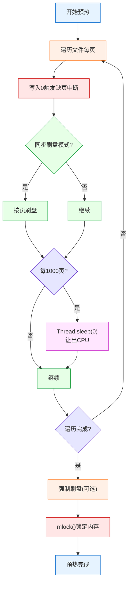

**核心结论**：文件预热通过遍历每页并写入0触发缺页中断，将文件数据提前加载到PageCache，预热后通过mlock锁定内存防止被交换，确保后续访问的低延迟。

**OS_PAGE_SIZE常量**（参考 [DefaultMappedFile.java:52](../store/src/main/java/org/apache/rocketmq/store/logfile/DefaultMappedFile.java#L52)）：

```java
public static final int OS_PAGE_SIZE = 1024 * 4;  // 4KB
```

## 7. 文件清理

### 7.1 崩溃恢复原理

**文件删除**涉及inode(Index Node,索引节点)和目录项的更新：

```c
int unlink(const char *pathname);  // 删除文件
// 实际上是减少文件的链接计数，当计数为0且无进程打开时才真正删除
```

**删除条件**：

| 条件 | 说明 |
|------|------|
| 引用计数为0 | 无进程打开文件 |
| 链接计数为0 | 无目录项指向文件 |

### 6.2 文件清理实现

[MappedFileQueue.java](../store/src/main/java/org/apache/rocketmq/store/MappedFileQueue.java) 实现文件清理：

```java
public int deleteExpiredFileByTime(
    final long expiredTime,           // 过期时间，默认值：72h
    final int deleteFilesInterval,    // 删除间隔，默认值：100ms
    final long intervalForcibly,      // 强制删除间隔，默认值：120s
    final boolean cleanImmediately,   // 是否立即清理
    final int deleteFileBatchMax) {   // 最大批量删除数，默认值：10
    
    Object[] mfs = this.copyMappedFiles(0);

    if (null == mfs)
        return 0;

    int mfsLength = mfs.length - 1;  // 保留最后一个文件
    int deleteCount = 0;
    List<MappedFile> files = new ArrayList<MappedFile>();
    int skipFileNum = 0;
    
    if (null != mfs) {
        // 删除前检查文件完整性
        checkSelf();
        
        for (int i = 0; i < mfsLength; i++) {
            MappedFile mappedFile = (MappedFile) mfs[i];
            long liveMaxTimestamp = mappedFile.getLastModifiedTimestamp() + expiredTime;
            
            // 判断文件是否过期或需要立即清理
            if (System.currentTimeMillis() >= liveMaxTimestamp || cleanImmediately) {
                if (skipFileNum > 0) {
                    log.info("Delete CommitLog {} but skip {} files", 
                        mappedFile.getFileName(), skipFileNum);
                }
                
                // 销毁文件
                if (mappedFile.destroy(intervalForcibly)) {
                    files.add(mappedFile);
                    deleteCount++;

                    // 达到批量删除上限
                    if (files.size() >= deleteFileBatchMax) {
                        break;
                    }

                    // 删除间隔
                    if (deleteFilesInterval > 0 && (i + 1) < mfsLength) {
                        try {
                            Thread.sleep(deleteFilesInterval);
                        } catch (InterruptedException e) {
                        }
                    }
                } else {
                    break;  // 销毁失败，停止删除
                }
            } else {
                skipFileNum++;
                break;  // 文件未过期，停止删除（避免删除中间文件）
            }
        }
    }

    deleteExpiredFile(files);

    return deleteCount;
}
```

### 6.3 文件清理触发流程

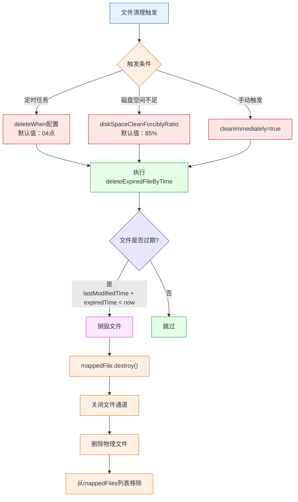

**核心结论**：文件清理由定时任务、磁盘空间不足或手动触发三种方式启动，通过判断文件最后修改时间是否超过保留时间来决定是否删除，确保过期数据及时清理释放磁盘空间。

**文件清理配置参数**：

| 参数 | 默认值 | 说明 |
|------|--------|------|
| fileReservedTime | 72h | 文件保留时间 |
| deleteWhen | "04" | 定时删除时间点 |
| deleteCommitLogFilesInterval | 100ms | 删除CommitLog文件间隔 |
| deleteConsumeQueueFilesInterval | 100ms | 删除ConsumeQueue文件间隔 |
| deleteFileBatchMax | 10 | 单次最大删除文件数 |
| destroyMapedFileIntervalForcibly | 120s | 强制销毁映射文件间隔 |
| diskMaxUsedSpaceRatio | 75% | 磁盘最大使用空间比例 |
| diskSpaceWarningLevelRatio | 90% | 磁盘空间警告级别比例 |
| diskSpaceCleanForciblyRatio | 85% | 磁盘空间强制清理比例 |

### 7.4 MappedFile销毁流程

```java
@Override
public boolean destroy(final long intervalForcibly) {
    this.shutdown(intervalForcibly);  // 先关闭

    if (this.isCleanupOver()) {
        try {
            long lastModified = getLastModifiedTimestamp();
            this.fileChannel.close();
            log.info("close file channel " + this.fileName + " OK");

            long beginTime = System.currentTimeMillis();
            boolean result = this.file.delete();
            log.info("delete file[REF:" + this.getRefCount() + "] " + this.fileName
                    + (result ? " OK, " : " Failed, ") + "W:" + this.getWrotePosition() 
                    + " M:" + this.getFlushedPosition() + ", "
                    + UtilAll.computeElapsedTimeMilliseconds(beginTime)
                    + "," + (System.currentTimeMillis() - lastModified));
        } catch (Exception e) {
            log.warn("close file channel " + this.fileName + " Failed. ", e);
        }

        return true;
    } else {
        log.warn("destroy mapped file[REF:" + this.getRefCount() + "] " + this.fileName
                + " Failed. cleanupOver: " + this.cleanupOver);
    }

    return false;
}
```

## 7. 文件恢复

### 7.1 崩溃恢复原理

**崩溃恢复**需要保证数据一致性：

| 恢复方式 | 说明 |
|---------|------|
| 日志恢复 | 通过日志重做/回滚 |
| 检查点(Checkpoint) | 从已知一致点开始恢复 |
| 校验和 | 检测数据是否损坏 |
```

**检查点**记录系统的一致性状态，用于快速恢复。

### 7.2 StoreCheckpoint实现

[StoreCheckpoint.java](../store/src/main/java/org/apache/rocketmq/store/StoreCheckpoint.java) 实现检查点持久化：

```java
public class StoreCheckpoint {
    private static final InternalLogger log = InternalLoggerFactory.getLogger(LoggerName.STORE_LOGGER_NAME);
    private final RandomAccessFile randomAccessFile;
    private final FileChannel fileChannel;
    private final MappedByteBuffer mappedByteBuffer;
    
    // CommitLog最后刷盘时间戳，默认值：0
    private volatile long physicMsgTimestamp = 0;
    // ConsumeQueue最后刷盘时间戳，默认值：0
    private volatile long logicsMsgTimestamp = 0;
    // IndexFile最后刷盘时间戳，默认值：0
    private volatile long indexMsgTimestamp = 0;
    // Master刷盘偏移量，默认值：0
    private volatile long masterFlushedOffset = 0;

    public StoreCheckpoint(final String scpPath) throws IOException {
        File file = new File(scpPath);
        UtilAll.ensureDirOK(file.getParent());
        boolean fileExists = file.exists();

        this.randomAccessFile = new RandomAccessFile(file, "rw");
        this.fileChannel = this.randomAccessFile.getChannel();
        this.mappedByteBuffer = fileChannel.map(MapMode.READ_WRITE, 0, DefaultMappedFile.OS_PAGE_SIZE);

        if (fileExists) {
            log.info("store checkpoint file exists, " + scpPath);
            // 从文件加载检查点数据
            this.physicMsgTimestamp = this.mappedByteBuffer.getLong(0);
            this.logicsMsgTimestamp = this.mappedByteBuffer.getLong(8);
            this.indexMsgTimestamp = this.mappedByteBuffer.getLong(16);
            this.masterFlushedOffset = this.mappedByteBuffer.getLong(24);

            log.info("store checkpoint file physicMsgTimestamp " + this.physicMsgTimestamp + ", "
                + UtilAll.timeMillisToHumanString(this.physicMsgTimestamp));
            log.info("store checkpoint file logicsMsgTimestamp " + this.logicsMsgTimestamp + ", "
                + UtilAll.timeMillisToHumanString(this.logicsMsgTimestamp));
            log.info("store checkpoint file indexMsgTimestamp " + this.indexMsgTimestamp + ", "
                + UtilAll.timeMillisToHumanString(this.indexMsgTimestamp));
            log.info("store checkpoint file masterFlushedOffset " + this.masterFlushedOffset);
        } else {
            log.info("store checkpoint file not exists, " + scpPath);
        }
    }

    /**
     * 刷盘检查点数据
     */
    public void flush() {
        this.mappedByteBuffer.putLong(0, this.physicMsgTimestamp);
        this.mappedByteBuffer.putLong(8, this.logicsMsgTimestamp);
        this.mappedByteBuffer.putLong(16, this.indexMsgTimestamp);
        this.mappedByteBuffer.putLong(24, this.masterFlushedOffset);
        this.mappedByteBuffer.force();  // 同步刷盘
    }

    /**
     * 获取最小时间戳（用于恢复）
     */
    public long getMinTimestamp() {
        long min = Math.min(this.physicMsgTimestamp, this.logicsMsgTimestamp);
        min -= 1000 * 3;  // 减去3秒，确保不丢失数据
        if (min < 0) {
            min = 0;
        }
        return min;
    }

    /**
     * 获取最小时间戳（包含IndexFile）
     */
    public long getMinTimestampIndex() {
        return Math.min(this.getMinTimestamp(), this.indexMsgTimestamp);
    }

    public void shutdown() {
        this.flush();
        UtilAll.cleanBuffer(this.mappedByteBuffer);
        try {
            this.fileChannel.close();
        } catch (IOException e) {
            log.error("Failed to properly close the channel", e);
        }
    }
}
```

**检查点数据结构**：

| 偏移量 | 字段 | 大小 | 说明 |
|--------|------|------|------|
| 0 | physicMsgTimestamp | 8字节 | CommitLog最后刷盘时间戳 |
| 8 | logicsMsgTimestamp | 8字节 | ConsumeQueue最后刷盘时间戳 |
| 16 | indexMsgTimestamp | 8字节 | IndexFile最后刷盘时间戳 |
| 24 | masterFlushedOffset | 8字节 | Master刷盘偏移量 |

**检查点数据结构图**：

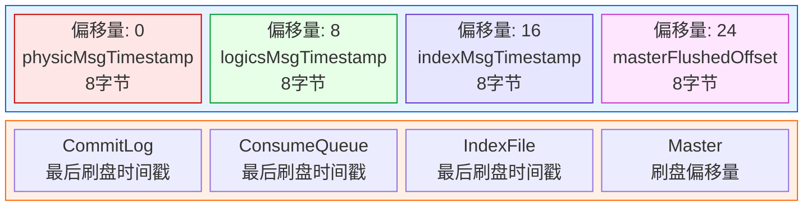

**核心结论**：检查点文件使用一个OS页（4KB）存储四个关键时间戳和偏移量，实际只使用前32字节，通过定期刷盘确保这些元数据的持久化，用于崩溃恢复时确定数据一致性的起点。

**检查点文件大小**：使用一个OS页（4KB），但实际只使用前32字节。

### 7.3 正常恢复流程

[CommitLog.java](../store/src/main/java/org/apache/rocketmq/store/CommitLog.java) 实现文件恢复：

```java
/**
 * 正常退出时的数据恢复，所有内存数据已刷盘
 */
public void recoverNormally(long maxPhyOffsetOfConsumeQueue) {
    boolean checkCRCOnRecover = this.defaultMessageStore.getMessageStoreConfig().isCheckCRCOnRecover();
    boolean checkDupInfo = this.defaultMessageStore.getMessageStoreConfig().isDuplicationEnable();
    final List<MappedFile> mappedFiles = this.mappedFileQueue.getMappedFiles();
    
    if (!mappedFiles.isEmpty()) {
        // 从倒数第三个文件开始恢复
        int index = mappedFiles.size() - 3;
        if (index < 0) {
            index = 0;
        }

        MappedFile mappedFile = mappedFiles.get(index);
        ByteBuffer byteBuffer = mappedFile.sliceByteBuffer();
        long processOffset = mappedFile.getFileFromOffset();
        long mappedFileOffset = 0;
        long lastValidMsgPhyOffset = this.getConfirmOffset();
        boolean doDispatch = false;  // 正常恢复不需要分发
        
        while (true) {
            DispatchRequest dispatchRequest = this.checkMessageAndReturnSize(byteBuffer, checkCRCOnRecover, checkDupInfo);
            int size = dispatchRequest.getMsgSize();
            
            // 正常数据
            if (dispatchRequest.isSuccess() && size > 0) {
                lastValidMsgPhyOffset = processOffset + mappedFileOffset;
                mappedFileOffset += size;
                this.getMessageStore().onCommitLogDispatch(dispatchRequest, doDispatch, mappedFile, true, false);
            }
            // 到达文件末尾，切换到下一个文件
            else if (dispatchRequest.isSuccess() && size == 0) {
                this.getMessageStore().onCommitLogDispatch(dispatchRequest, doDispatch, mappedFile, true, true);
                index++;
                if (index >= mappedFiles.size()) {
                    log.info("recover last 3 physics file over, last mapped file " + mappedFile.getFileName());
                    break;
                } else {
                    mappedFile = mappedFiles.get(index);
                    byteBuffer = mappedFile.sliceByteBuffer();
                    processOffset = mappedFile.getFileFromOffset();
                    mappedFileOffset = 0;
                    log.info("recover next physics file, " + mappedFile.getFileName());
                }
            }
            // 中间文件读取错误
            else if (!dispatchRequest.isSuccess()) {
                if (size > 0) {
                    log.warn("found a half message at {}, it will be truncated.", processOffset + mappedFileOffset);
                }
                log.info("recover physics file end, " + mappedFile.getFileName());
                break;
            }
        }

        processOffset += mappedFileOffset;
        this.setConfirmOffset(lastValidMsgPhyOffset);
        this.mappedFileQueue.setFlushedWhere(processOffset);
        this.mappedFileQueue.setCommittedWhere(processOffset);
        this.mappedFileQueue.truncateDirtyFiles(processOffset);

        // 清理ConsumeQueue冗余数据
        if (maxPhyOffsetOfConsumeQueue >= processOffset) {
            log.warn("maxPhyOffsetOfConsumeQueue({}) >= processOffset({}), truncate dirty logic files", 
                maxPhyOffsetOfConsumeQueue, processOffset);
            this.defaultMessageStore.truncateDirtyLogicFiles(processOffset);
        }

    } else {
        // CommitLog文件被删除
        log.warn("The commitlog files are deleted, and delete the consume queue files");
        this.mappedFileQueue.setFlushedWhere(0);
        this.mappedFileQueue.setCommittedWhere(0);
        this.defaultMessageStore.destroyLogics();
    }
}
```

**checkMessageAndReturnSize 方法返回值说明**（参考 [CommitLog.java:382-538](../store/src/main/java/org/apache/rocketmq/store/CommitLog.java#L382-L538)）：

该方法用于检查消息并返回消息大小，是恢复流程的核心方法。

| 返回值 | 含义 | 说明 |
|--------|------|------|
| size > 0 且 success=true | 正常消息 | 返回消息的实际大小，消息完整有效 |
| size = 0 且 success=true | 到达文件末尾 | 遇到 BLANK_MAGIC_CODE，表示文件末尾空白区域 |
| size > 0 且 success=false | 半消息/损坏消息 | 消息不完整或CRC校验失败，size 表示已读取的大小 |
| size = -1 且 success=false | 魔数错误或校验失败 | 消息魔数非法或CRC校验失败，需要截断 |

### 7.4 异常恢复流程

**MappedFile生命周期**：

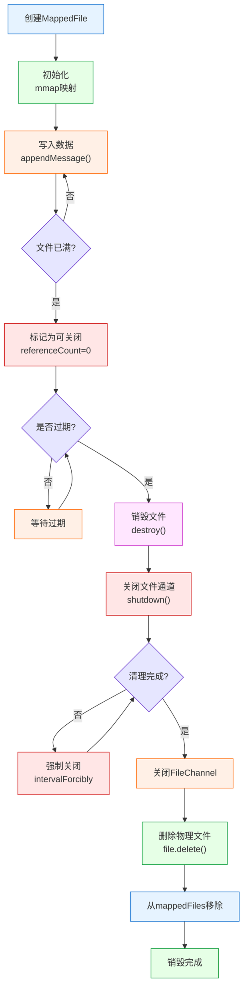

**核心结论**：MappedFile生命周期从创建、写入、满载到销毁，经历多个状态转换，销毁过程需要先关闭文件通道、清理资源，最后删除物理文件，整个过程确保数据完整性和资源正确释放。

```java
/**
 * 异常退出时的数据恢复，需要从检查点开始恢复
 */
public void recoverAbnormally(long maxPhyOffsetOfConsumeQueue) {
    boolean checkCRCOnRecover = this.defaultMessageStore.getMessageStoreConfig().isCheckCRCOnRecover();
    boolean checkDupInfo = this.defaultMessageStore.getMessageStoreConfig().isDuplicationEnable();
    final List<MappedFile> mappedFiles = this.mappedFileQueue.getMappedFiles();
    
    if (!mappedFiles.isEmpty()) {
        // 从哪个文件开始恢复
        int index = mappedFiles.size() - 1;
        MappedFile mappedFile = null;
        
        // 从后向前查找匹配检查点的文件
        for (; index >= 0; index--) {
            mappedFile = mappedFiles.get(index);
            if (this.isMappedFileMatchedRecover(mappedFile)) {
                log.info("recover from this mapped file " + mappedFile.getFileName());
                break;
            }
        }

        if (index < 0) {
            index = 0;
            mappedFile = mappedFiles.get(index);
        }

        ByteBuffer byteBuffer = mappedFile.sliceByteBuffer();
        long processOffset = mappedFile.getFileFromOffset();
        long mappedFileOffset = 0;
        long lastValidMsgPhyOffset = this.getConfirmOffset();
        boolean doDispatch = true;  // 异常恢复需要分发
        
        while (true) {
            DispatchRequest dispatchRequest = this.checkMessageAndReturnSize(byteBuffer, checkCRCOnRecover, checkDupInfo);
            int size = dispatchRequest.getMsgSize();

            if (dispatchRequest.isSuccess()) {
                if (size > 0) {
                    lastValidMsgPhyOffset = processOffset + mappedFileOffset;
                    mappedFileOffset += size;

                    if (this.defaultMessageStore.getMessageStoreConfig().isDuplicationEnable()) {
                        if (dispatchRequest.getCommitLogOffset() < this.defaultMessageStore.getConfirmOffset()) {
                            this.getMessageStore().onCommitLogDispatch(dispatchRequest, doDispatch, mappedFile, true, false);
                        }
                    } else {
                        this.getMessageStore().onCommitLogDispatch(dispatchRequest, doDispatch, mappedFile, true, false);
                    }
                }
                else if (size == 0) {
                    this.getMessageStore().onCommitLogDispatch(dispatchRequest, doDispatch, mappedFile, true, true);
                    index++;
                    if (index >= mappedFiles.size()) {
                        log.info("recover physics file over, last mapped file " + mappedFile.getFileName());
                        break;
                    } else {
                        mappedFile = mappedFiles.get(index);
                        byteBuffer = mappedFile.sliceByteBuffer();
                        processOffset = mappedFile.getFileFromOffset();
                        mappedFileOffset = 0;
                    }
                }
            } else {
                if (size > 0) {
                    log.warn("found a half message at {}, it will be truncated.", processOffset + mappedFileOffset);
                }
                log.info("recover physics file end, " + mappedFile.getFileName() + " pos=" + byteBuffer.position());
                break;
            }
        }

        processOffset += mappedFileOffset;
        this.setConfirmOffset(lastValidMsgPhyOffset);
        this.mappedFileQueue.setFlushedWhere(processOffset);
        this.mappedFileQueue.setCommittedWhere(processOffset);
        this.mappedFileQueue.truncateDirtyFiles(processOffset);

        if (maxPhyOffsetOfConsumeQueue >= processOffset) {
            log.warn("maxPhyOffsetOfConsumeQueue({}) >= processOffset({}), truncate dirty logic files", 
                maxPhyOffsetOfConsumeQueue, processOffset);
            this.defaultMessageStore.truncateDirtyLogicFiles(processOffset);
        }
    }
    else {
        log.warn("The commitlog files are deleted, and delete the consume queue files");
        this.mappedFileQueue.setFlushedWhere(0);
        this.mappedFileQueue.setCommittedWhere(0);
        this.defaultMessageStore.destroyLogics();
    }
}

/**
 * 检查MappedFile是否匹配恢复条件
 */
private boolean isMappedFileMatchedRecover(final MappedFile mappedFile) {
    ByteBuffer byteBuffer = mappedFile.sliceByteBuffer();

    int magicCode = byteBuffer.getInt(MessageDecoder.MESSAGE_MAGIC_CODE_POSITION);
    if (magicCode != MESSAGE_MAGIC_CODE) {
        return false;
    }

    int sysFlag = byteBuffer.getInt(MessageDecoder.SYSFLAG_POSITION);
    int bornhostLength = (sysFlag & MessageSysFlag.BORNHOST_V6_FLAG) == 0 ? 8 : 20;
    int msgStoreTimePos = 4 + 4 + 4 + 4 + 4 + 8 + 8 + 4 + 8 + bornhostLength;
    long storeTimestamp = byteBuffer.getLong(msgStoreTimePos);
    if (0 == storeTimestamp) {
        return false;
    }

    // 根据配置选择检查点
    if (this.defaultMessageStore.getMessageStoreConfig().isMessageIndexEnable()
        && this.defaultMessageStore.getMessageStoreConfig().isMessageIndexSafe()) {
        if (storeTimestamp <= this.defaultMessageStore.getStoreCheckpoint().getMinTimestampIndex()) {
            log.info("find check timestamp, {} {}",
                storeTimestamp, UtilAll.timeMillisToHumanString(storeTimestamp));
            return true;
        }
    } else {
        if (storeTimestamp <= this.defaultMessageStore.getStoreCheckpoint().getMinTimestamp()) {
            log.info("find check timestamp, {} {}",
                storeTimestamp, UtilAll.timeMillisToHumanString(storeTimestamp));
            return true;
        }
    }

    return false;
}
```

**isMappedFileMatchedRecover 方法详细说明**（参考 [CommitLog.java:711-745](../store/src/main/java/org/apache/rocketmq/store/CommitLog.java#L711-L745)）：

该方法用于判断一个 MappedFile 是否匹配异常恢复的条件，从后向前查找第一个匹配的文件作为恢复起点。

**判断流程**：

| 步骤 | 检查项 | 失败条件 |
|------|--------|---------|
| 1 | 魔数检查 | `magicCode != MESSAGE_MAGIC_CODE` |
| 2 | 存储时间戳检查 | `storeTimestamp == 0` |
| 3 | 检查点时间戳匹配 | 根据配置选择匹配条件 |

**检查点匹配条件**：

| 配置 | 匹配条件 | 说明 |
|------|---------|------|
| messageIndexEnable=true 且 messageIndexSafe=true | `storeTimestamp <= getMinTimestampIndex()` | 使用 IndexFile 检查点 |
| 其他情况 | `storeTimestamp <= getMinTimestamp()` | 使用 CommitLog 和 ConsumeQueue 的最小检查点 |

**msgStoreTimePos 计算公式**：
```
msgStoreTimePos = 4(TOTALSIZE) + 4(MAGICCODE) + 4(BODYCRC) + 4(QUEUEID) + 4(FLAG) + 8(QUEUEOFFSET) + 8(PHYSICALOFFSET) + 4(SYSFLAG) + 8(BORNTIMESTAMP) + bornhostLength
```

### 7.5 恢复流程对比

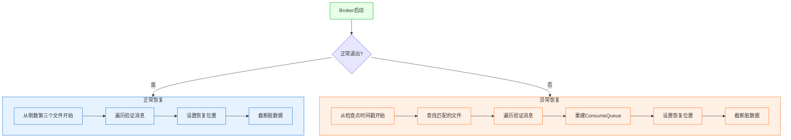

**核心结论**：正常恢复从倒数第三个文件开始快速验证，异常恢复从检查点时间戳开始完整重建索引，两种恢复方式都通过验证消息完整性来确保数据一致性，最终截断脏数据。

**正常恢复 vs 异常恢复对比**：

| 特性 | 正常恢复 | 异常恢复 |
|------|---------|---------|
| 起始位置 | 倒数第三个文件 | 检查点时间戳对应的文件 |
| 是否分发 | 否（doDispatch=false） | 是（doDispatch=true） |
| 重建索引 | 不需要 | 需要重建ConsumeQueue |
| 恢复速度 | 快 | 慢 |
| 适用场景 | 正常关闭 | 异常崩溃 |

**恢复流程关键步骤说明**：

| 步骤 | 正常恢复 | 异常恢复 | 说明 |
|------|---------|---------|------|
| 1 | 从倒数第三个文件开始 | 从检查点时间戳开始 | 确定恢复起点 |
| 2 | 遍历验证消息 | 遍历验证消息 | 逐条检查消息完整性 |
| 3 | 不需要分发 | 需要分发到ConsumeQueue | 异常恢复需要重建索引 |
| 4 | 设置恢复位置 | 设置恢复位置 | 更新flushedWhere等 |
| 5 | 截断脏数据 | 截断脏数据 | 删除不完整的消息 |

**文件恢复详细时序图**：

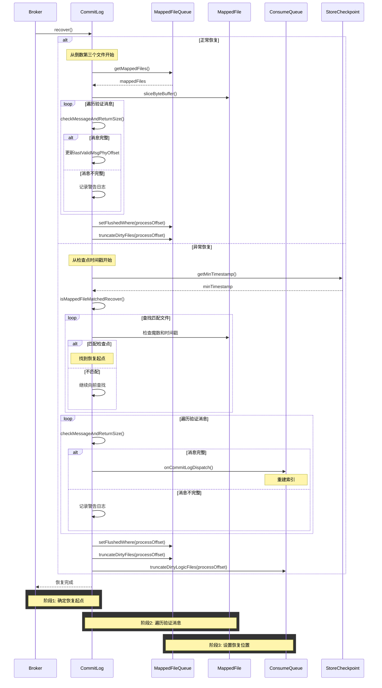

**核心结论**：文件恢复流程通过检查消息完整性和时间戳匹配来确定恢复起点，正常恢复快速验证最后几个文件，异常恢复从检查点开始完整重建索引，两种方式最终都通过截断脏数据确保数据一致性。

## 8. 存储配置参数

### 8.1 核心配置

| 配置项 | 默认值 | 说明 |
|--------|--------|------|
| mappedFileSizeCommitLog | 1GB (1073741824字节) | 单个CommitLog文件大小 |
| mappedFileSizeConsumeQueue | 30万 * 20字节 = 6MB | 单个ConsumeQueue文件大小 |
| mappedFileSizeTimerLog | 100MB | 单个TimerLog文件大小 |
| maxMessageSize | 4MB | 最大消息体大小 |
| maxTopicLength | 1000 | Topic最大长度 |

### 8.2 刷盘配置

| 配置项 | 默认值 | 说明 |
|--------|--------|------|
| flushDiskType | ASYNC_FLUSH | 刷盘方式：SYNC_FLUSH/ASYNC_FLUSH |
| syncFlushTimeout | 5s (5000ms) | 同步刷盘超时时间 |
| flushIntervalCommitLog | 500ms | 异步刷盘间隔 |
| flushCommitLogLeastPages | 4页 (16KB) | 最少刷盘页数 |
| flushCommitLogThoroughInterval | 10s | 完全刷盘间隔 |
| flushCommitLogTimed | true | 是否使用定时刷盘 |
| flushIntervalConsumeQueue | 1s | ConsumeQueue刷盘间隔 |
| flushConsumeQueueLeastPages | 2页 (8KB) | ConsumeQueue最少刷盘页数 |
| flushConsumeQueueThoroughInterval | 60s | ConsumeQueue完全刷盘间隔 |

### 8.3 堆外内存配置

| 配置项 | 默认值 | 说明 |
|--------|--------|------|
| transientStorePoolEnable | false | 是否启用堆外内存池 |
| transientStorePoolSize | 5 | 堆外内存池大小（个） |
| fastFailIfNoBufferInStorePool | false | 内存池不足时是否快速失败 |
| commitIntervalCommitLog | 200ms | 堆外内存提交间隔 |
| commitCommitLogLeastPages | 4页 (16KB) | 最少提交页数 |
| commitCommitLogThoroughInterval | 200ms | 完全提交间隔 |

### 8.4 文件清理配置

| 配置项 | 默认值 | 说明 |
|--------|--------|------|
| fileReservedTime | 72h | 文件保留时间 |
| deleteWhen | "04" | 定时删除时间点 |
| deleteCommitLogFilesInterval | 100ms | 删除CommitLog文件间隔 |
| deleteConsumeQueueFilesInterval | 100ms | 删除ConsumeQueue文件间隔 |
| deleteFileBatchMax | 10 | 单次最大删除文件数 |
| destroyMapedFileIntervalForcibly | 120s | 强制销毁映射文件间隔 |
| redeleteHangedFileInterval | 120s | 重删挂起文件间隔 |
| cleanResourceInterval | 10s | 资源清理间隔 |
| cleanFileForciblyEnable | true | 是否允许强制清理文件 |

### 8.5 磁盘空间配置

| 配置项 | 默认值 | 说明 |
|--------|--------|------|
| diskMaxUsedSpaceRatio | 75% | 磁盘最大使用空间比例 |
| diskSpaceWarningLevelRatio | 90% | 磁盘空间警告级别比例 |
| diskSpaceCleanForciblyRatio | 85% | 磁盘空间强制清理比例 |

### 8.6 文件预热与内存锁定配置

| 配置项 | 默认值 | 说明 |
|--------|--------|------|
| warmMapedFileEnable | false | 是否启用文件预热 |
| flushLeastPagesWhenWarmMapedFile | 4096页 (16MB) | 预热时刷盘页数，源码计算：`1024 / 4 * 16 = 4096` 页 |

### 8.7 恢复配置

| 配置项 | 默认值 | 说明 |
|--------|--------|------|
| checkCRCOnRecover | true | 恢复时是否检查CRC |
| maxRecoveryCommitlogFiles | 30 | 最大恢复CommitLog文件数 |
| maxAsyncPutMessageRequests | 5000 | 异步刷盘模式下最大等待刷盘的请求数，超过此值会触发警告日志 |

### 8.8 主从同步配置

| 配置项 | 默认值 | 说明 |
|--------|--------|------|
| brokerRole | ASYNC_MASTER | Broker角色：ASYNC_MASTER/SYNC_MASTER/SLAVE |
| slaveTimeout | 3s | Slave超时时间 |
| haListenPort | 10912 | HA监听端口 |
| haSendHeartbeatInterval | 5s | HA心跳发送间隔 |
| haHousekeepingInterval | 20s | HA保活检测间隔 |
| haTransferBatchSize | 32KB | HA传输批量大小 |
| haMaxGapNotInSync | 256MB | 最大不同步差距 |

---