# I/O多路复用

> **关联文档**：本文档详细讲解I/O多路复用原理与Reactor模式实现。线程模型概述请参阅 [01-线程与并发.md](01-线程与并发.md#15-reactor线程模型)。

## 1. 概述

### 1.1 文档目标

本文档系统讲解Linux网络编程中的五种I/O模型，重点深入I/O多路复用技术及其在RocketMQ中的应用。通过本文档，读者将掌握：

- 五种I/O模型的核心原理与差异
- I/O多路复用的操作系统实现机制
- epoll相比select/poll的性能优势
- RocketMQ基于Netty的高性能网络架构
- 事件驱动模型的设计思想与实现

### 1.2 学习路径


**推荐学习顺序**：

1. **理解基础模型**：掌握阻塞I/O、非阻塞I/O的基本概念
2. **深入多路复用**：理解select/poll/epoll的工作原理
3. **掌握epoll优势**：理解epoll为何成为高性能服务器的首选
4. **学习实践应用**：分析RocketMQ的网络层实现
5. **融会贯通**：理解事件驱动模型的设计思想

---

## 2. 阻塞I/O

**阻塞I/O (Blocking I/O)** 是最基础的I/O模型：

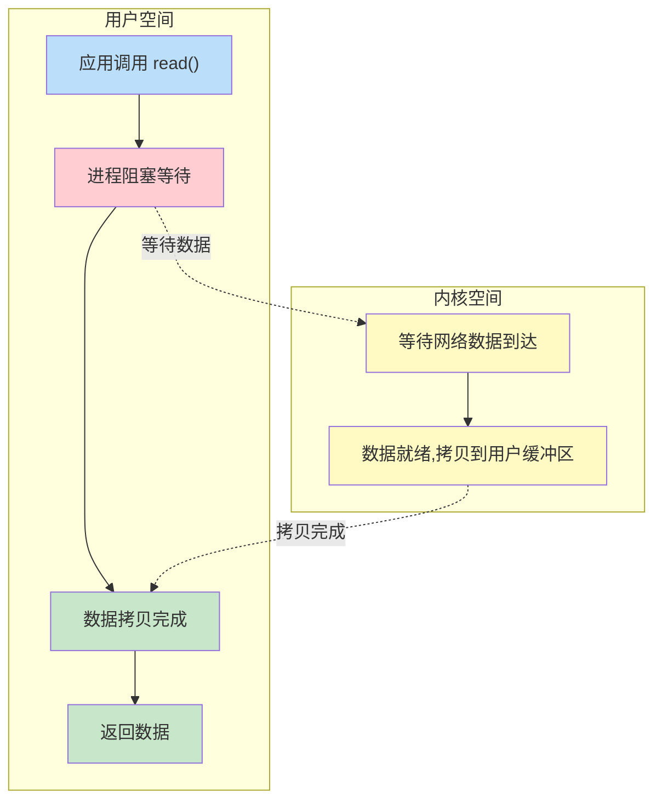

**核心结论**：阻塞I/O模型简单但效率低，整个过程中应用程序一直阻塞，无法执行其他任务。

**核心特点**：

| 特性 | 说明 |
|------|------|
| 同步/异步 | 同步 |
| 阻塞/非阻塞 | 阻塞 |
| 系统调用次数 | 1次read |
| CPU利用率 | 低（阻塞等待） |
| 连接数扩展性 | 差（每连接一线程） |
| 编程复杂度 | 低 |

**处理流程**：`read()` → 阻塞等待 → 数据到达 → 返回

**典型应用**：简单客户端、学习示例

**问题分析**：整个过程中应用程序一直阻塞，从调用read()到数据返回都无法执行其他任务。

---

## 3. 非阻塞I/O

**非阻塞I/O (Non-blocking I/O)** 允许调用立即返回：

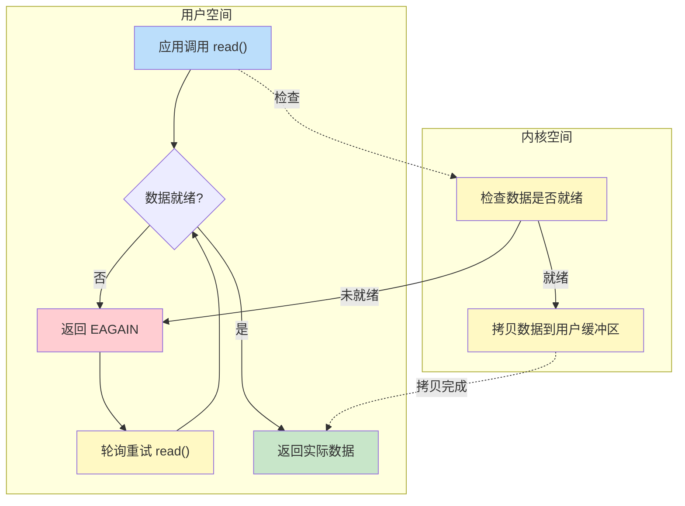

**核心结论**：非阻塞I/O调用立即返回，但需要不断轮询检查数据是否就绪，CPU空转开销大。

**核心特点**：

| 特性 | 说明 |
|------|------|
| 同步/异步 | 同步 |
| 阻塞/非阻塞 | 非阻塞 |
| 系统调用次数 | N次轮询 |
| CPU利用率 | 高（轮询空转） |
| 连接数扩展性 | 差（轮询开销大） |
| 编程复杂度 | 中 |

**非阻塞 read() 返回值说明**：

| 数据状态 | 返回值 |
|---------|--------|
| 数据未就绪 | 返回 `-1`，errno 设为 `EAGAIN`（或 `EWOULDBLOCK`） |
| 数据已就绪 | 返回实际读取的字节数（≥ 0） |
| 出错 | 返回 `-1`，errno 设为其他错误码 |

> **注意**：`EAGAIN` 的含义是"再试一次"(Resource temporarily unavailable)，只在数据**未就绪**时返回。数据就绪时直接返回数据，不会返回 EAGAIN。

**处理流程**：`read()` → EAGAIN → 轮询 → ... → 数据到达 → 返回

**典型应用**：少量连接场景

**问题分析**：调用立即返回，但需要不断轮询检查数据是否就绪，CPU空转开销大。

---

## 4. I/O多路复用

**I/O多路复用 (I/O Multiplexing)** 是高性能服务器的核心，允许单线程同时监控多个文件描述符：

### 4.1 操作系统原理

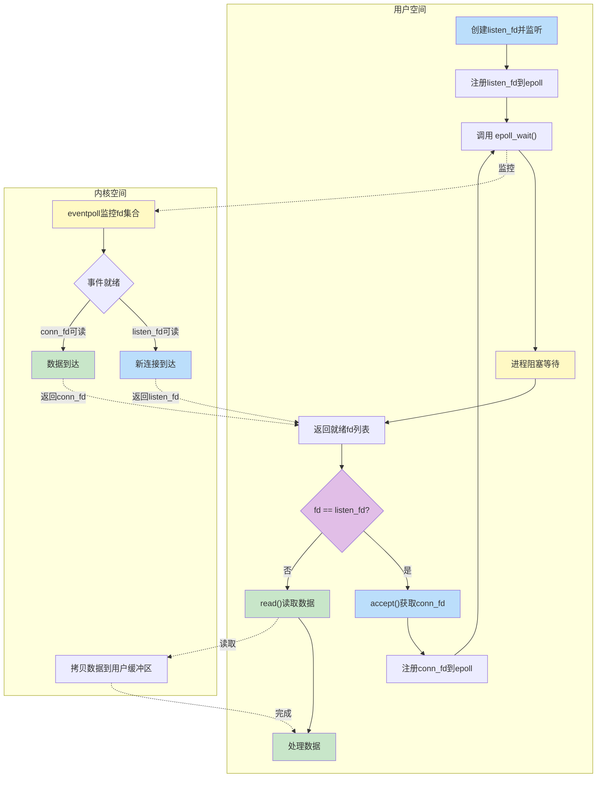

**核心结论**：I/O多路复用通过epoll_wait统一监控多个连接，单线程可处理大量并发连接，是高性能服务器的核心技术。

**事件区分机制**：通过文件描述符（fd）判断事件类型

| fd 类型 | 可读事件含义 | 处理方式 |
|---------|-------------|---------|
| `listen_fd` | 新连接到达 | 调用 `accept()` |
| `conn_fd` | 数据到达 | 调用 `read()` |

> **核心原理**：`epoll_wait()` 返回就绪的 fd，程序通过比较 `fd == listen_fd` 来判断是 accept 事件还是 read 事件。

**核心特点**：

| 特性 | 说明 |
|------|------|
| 同步/异步 | 同步 |
| 阻塞/非阻塞 | 部分阻塞 |
| 系统调用次数 | 1次epoll_wait + N次accept/read |
| CPU利用率 | 高（事件驱动） |
| 连接数扩展性 | 优（单线程处理多连接） |
| 编程复杂度 | 中 |

**处理流程**：
1. **初始化**：创建 `listen_fd` → 注册到 epoll
2. **事件循环**：`epoll_wait()` 阻塞等待
3. **新连接事件**：`accept()` → 获取 `conn_fd` → 注册到 epoll
4. **数据可读事件**：`read()` → 处理数据

**典型应用**：Nginx、Redis、RocketMQ

**优势分析**：单线程可同时监控多个连接，阻塞在epoll_wait而非单个read，是高性能服务器的首选方案。

### 4.2 select/poll与epoll对比

**select/poll机制**：

| 机制 | 说明 | 局限性 |
|------|------|--------|
| select | 遍历所有fd检查状态 | O(n)复杂度，fd限制1024 |
| poll | 类似select，无fd数量限制 | O(n)复杂度，每次调用需拷贝 |

**epoll机制**：Linux特有的高效I/O多路复用机制

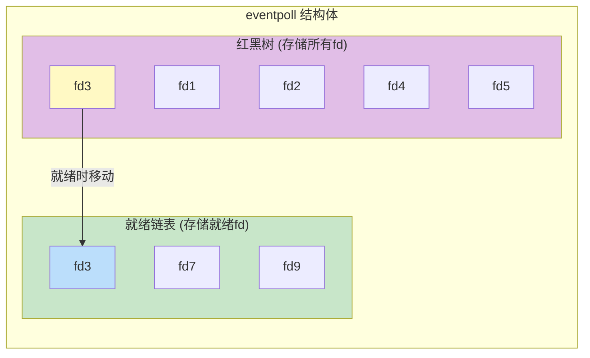

**核心结论**：epoll通过红黑树高效管理所有fd，通过就绪链表O(1)返回就绪事件，避免了select/poll的O(n)遍历开销。

### 4.3 epoll内核数据结构

#### 操作系统原理

**epoll**是Linux特有的I/O多路复用机制，通过事件驱动方式监控大量文件描述符。epoll的核心创新在于：
- 使用红黑树存储所有监控的fd，插入/删除/查找复杂度为O(log n)
- 使用就绪链表存储就绪的fd，获取就绪事件复杂度为O(1)
- 通过回调机制，fd就绪时内核主动通知，无需轮询

#### 内核数据结构

```c
// eventpoll结构体（fs/eventpoll.c）
struct eventpoll {
    spinlock_t lock;                // 保护eventpoll的自旋锁
    struct mutex mtx;               // 互斥锁
    
    wait_queue_head_t wq;           // 等待队列（epoll_wait使用）
    wait_queue_head_t poll_wait;    // poll等待队列
    
    struct list_head rdllist;       // 就绪链表（存储就绪的epitem）
    struct rb_root rbr;             // 红黑树根（存储所有epitem）
    
    struct epitem *ovflist;         // 溢出链表（传递事件时使用）
    struct wakeup_source *ws;       // 唤醒源
    struct user_struct *user;       // 用户结构
    struct file *file;              // 关联的file结构
    
    int visited;                    // 访问标记
    struct list_head visited_list_link; // 访问链表链接
};

// epitem结构体（fs/eventpoll.c）
struct epitem {
    union {
        struct rb_node rbn;         // 红黑树节点
        struct rcu_head rcu;        // RCU头
    };
    
    struct list_head rdllink;       // 就绪链表节点
    struct epitem *next;            // 溢出链表下一个节点
    
    struct epoll_event event;       // 事件结构
    struct file *file;              // 关联的file
    int fd;                         // 文件描述符
    
    struct eventpoll *ep;           // 所属的eventpoll
    
    struct list_head fllink;        // file链表节点
    struct wakeup_source __rcu *ws; // 唤醒源
    
    struct epoll_event event;       // 注册的事件
};

// epoll_event结构体（include/uapi/linux/eventpoll.h）
struct epoll_event {
    __u32 events;                   // 事件类型（EPOLLIN, EPOLLOUT等）
    __u64 data;                     // 用户数据
};

// 事件类型定义
#define EPOLLIN     0x00000001      // 可读
#define EPOLLPRI    0x00000002      // 紧急数据
#define EPOLLOUT    0x00000004      // 可写
#define EPOLLERR    0x00000008      // 错误
#define EPOLLHUP    0x00000010      // 挂起
#define EPOLLRDNORM 0x00000040      // 普通数据可读
#define EPOLLRDBAND 0x00000080      // 优先数据可读
#define EPOLLWRNORM 0x00000100      // 普通数据可写
#define EPOLLWRBAND 0x00000200      // 优先数据可写
#define EPOLLMSG    0x00000400      // 消息
#define EPOLLRDHUP  0x00002000      // 对端关闭连接
#define EPOLLEXCLUSIVE (1U << 28)   // 独占唤醒
#define EPOLLWAKEUP (1U << 29)      // 唤醒
#define EPOLLONESHOT (1U << 30)     // 一次性
#define EPOLLET    (1U << 31)       // 边缘触发
```

**eventpoll关键字段说明**：

| 字段 | 类型 | 说明 | 用途 |
|------|------|------|------|
| `rbr` | rb_root | 红黑树根 | 存储所有注册的epitem |
| `rdllist` | list_head | 就绪链表 | 存储就绪的epitem |
| `wq` | wait_queue_head_t | 等待队列 | epoll_wait阻塞时使用 |
| `lock` | spinlock_t | 自旋锁 | 保护eventpoll结构 |

#### 系统调用接口

| 系统调用 | 参数 | 返回值 | 说明 |
|----------|------|--------|------|
| `epoll_create1()` | flags | int epfd | 创建epoll实例 |
| `epoll_ctl()` | epfd, op, fd, event | int | 添加/修改/删除fd |
| `epoll_wait()` | epfd, events, maxevents, timeout | int | 等待事件就绪 |

#### 内核参数

| 参数路径 | 默认值 | 说明 |
|----------|--------|------|
| `/proc/sys/fs/epoll/max_user_watches` | 依赖内存 | 每用户最大epoll监控数 |
| `/proc/sys/fs/epoll/max_user_instances` | 128 | 每用户最大epoll实例数 |

#### 调试方法

```bash
# 查看epoll使用情况
cat /proc/sys/fs/epoll/max_user_watches

# 使用strace跟踪epoll调用
strace -e trace=epoll_create1,epoll_ctl,epoll_wait -p [pid]

# 使用perf分析epoll性能
perf record -e syscalls:sys_enter_epoll_wait -p [pid] sleep 10
```

### 4.4 epoll数据结构说明

epoll通过红黑树和就绪链表两个核心数据结构实现高效的I/O多路复用。

| 数据结构 | 作用 | 操作复杂度 |
|---------|------|-----------|
| 红黑树 | 存储所有注册的fd | O(log n) 插入/删除/查找 |
| 就绪链表 | 存储就绪的fd | O(1) 获取就绪事件 |

**工作流程**：

| 步骤 | 操作 | 说明 |
|------|------|------|
| 1 | epoll_create() | 创建eventpoll结构体，初始化红黑树和就绪链表 |
| 2 | epoll_ctl(EPOLL_CTL_ADD) | 将fd插入红黑树，注册回调函数 |
| 3 | 事件就绪 | 内核回调函数将fd从红黑树移动到就绪链表 |
| 4 | epoll_wait() | 从就绪链表返回就绪fd，O(1)复杂度 |

**关键概念**：

- **红黑树**：自平衡二叉搜索树，保证查找、插入、删除操作都是O(log n)
- **就绪链表**：存储已就绪的fd，epoll_wait直接返回，无需遍历
- **回调机制**：fd就绪时内核主动调用回调函数，将fd加入就绪链表
- **共享内存**：epoll通过mmap与用户空间共享内存，避免数据拷贝

**epoll核心系统调用**：

| 系统调用 | 功能 |
|---------|------|
| epoll_create() | 创建epoll实例 |
| epoll_ctl() | 添加/修改/删除fd(File Descriptor,文件描述符) |
| epoll_wait() | 等待事件就绪 |

**性能对比**：

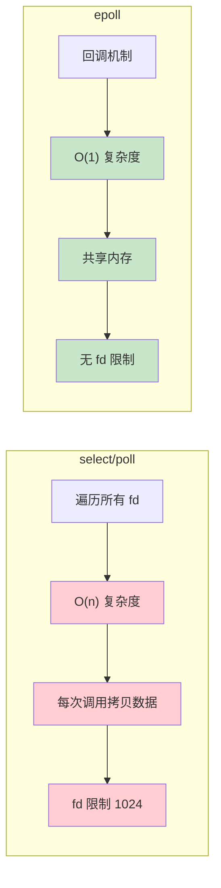

**核心结论**：epoll 通过回调机制和共享内存，将时间复杂度从 O(n) 降至 O(1)，是高并发场景的最优选择。

| 特性 | select/poll | epoll |
|------|-------------|-------|
| 时间复杂度 | O(n)遍历所有fd | O(1)只返回就绪fd |
| fd数量限制 | 1024 (select) | 无限制 |
| 触发模式 | 仅水平触发 | 水平触发+边缘触发 |
| 内存拷贝 | 每次调用都拷贝 | 共享内存 |

**触发模式**：

| 模式 | 说明 | 特点 |
|------|------|------|
| LT(Level Triggered，水平触发) | 缓冲区有数据就触发 | 简单，不易丢事件 |
| ET(Edge Triggered，边缘触发) | 状态变化时才触发 | 高效，需一次性读完 |

**水平触发与边缘触发详解**：

这是 I/O 多路复用中两种不同的事件通知机制，主要应用于 epoll 等系统调用。

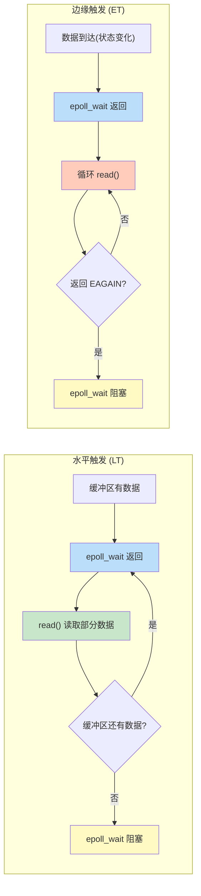

**核心结论**：水平触发持续通知直到数据读完，边缘触发只在状态变化时通知一次，必须循环读取直到 EAGAIN。

| 特性 | 水平触发 (LT) | 边缘触发 (ET) |
|------|---------------------------|-------------------------|
| 触发条件 | 只要缓冲区有数据就持续通知 | 只在状态变化时通知一次 |
| 通知频率 | 可能多次通知 | 只通知一次 |
| 数据读取 | 可以分多次读取 | 必须一次性读完所有数据 |
| 编程复杂度 | 简单，不易出错 | 较高，需循环读取直到 EAGAIN |
| 效率 | 相对较低 | 相对较高 |

**形象比喻**：

- **水平触发**：像"水位报警器"，只要水位高于警戒线，就持续报警；可以慢慢舀水，舀一点水位还在警戒线以上，继续报警
- **边缘触发**：像"门铃"，只有按下门铃的那一刻响一次，如果没听到，就错过了

**代码示例**：

```c
// 水平触发模式：假设缓冲区有 100 字节数据，每次读 30 字节
// 第1次 epoll_wait 返回
read(fd, buf, 30);  // 读了30字节，还剩70字节
// 第2次 epoll_wait 立即返回（因为还有数据）
read(fd, buf, 30);  // 读了30字节，还剩40字节
// 第3次 epoll_wait 立即返回
read(fd, buf, 30);  // 读了30字节，还剩10字节
// 第4次 epoll_wait 立即返回
read(fd, buf, 30);  // 读了10字节，缓冲区空了
// 第5次 epoll_wait 阻塞等待新数据

// 边缘触发模式：必须循环读取直到 EAGAIN
while (1) {
    int n = read(fd, buf, sizeof(buf));
    if (n == -1) {
        if (errno == EAGAIN || errno == EWOULDBLOCK) {
            break;  // 数据读完了，退出循环
        }
        // 其他错误处理
    } else if (n == 0) {
        break;  // 对端关闭连接
    }
    // 处理读取到的数据
}
```

**具体场景举例**：客户端发送 100 字节数据到服务器

```
水平触发流程：
1. 数据到达，epoll_wait 返回
2. 服务器 read(50字节) → 缓冲区还剩 50 字节
3. epoll_wait 再次返回（因为还有数据）
4. 服务器 read(50字节) → 缓冲区空
5. epoll_wait 阻塞等待

边缘触发流程：
1. 数据到达，epoll_wait 返回（只通知这一次！）
2. 服务器必须循环 read：
   - read(50字节) → 成功
   - read(50字节) → 成功
   - read() → 返回 EAGAIN（表示暂无数据）
3. 退出循环，epoll_wait 阻塞等待
```

**边缘触发注意事项**：

```c
// 设置边缘触发
struct epoll_event ev;
ev.events = EPOLLIN | EPOLLET;  // EPOLLET 表示边缘触发
ev.data.fd = listen_fd;
epoll_ctl(epfd, EPOLL_CTL_ADD, listen_fd, &ev);

// 边缘触发必须配合非阻塞 I/O 使用
int flags = fcntl(fd, F_GETFL, 0);
fcntl(fd, F_SETFL, flags | O_NONBLOCK);
```

**选择建议**：

| 场景 | 推荐模式 |
|------|----------|
| 简单应用、快速开发 | 水平触发 |
| 高并发、高性能服务器 | 边缘触发 |
| 不想处理 EAGAIN | 水平触发 |
| 想减少 epoll_wait 调用次数 | 边缘触发 |

> **总结**：水平触发更安全简单，边缘触发效率更高但编程难度更大。Nginx、Redis 等高性能服务器都采用边缘触发模式。

---

## 5. RocketMQ实现

RocketMQ 基于 Netty 框架实现 I/O 多路复用，采用 Reactor 线程模型，支持 Linux epoll 原生优化。

### 5.1 I/O模型选择

[NettyRemotingServer.java](../remoting/src/main/java/org/apache/rocketmq/remoting/netty/NettyRemotingServer.java) 选择I/O模型：

```java
private boolean useEpoll() {
    return RemotingUtil.isLinuxPlatform()                    // 条件1：必须是Linux平台
        && nettyServerConfig.isUseEpollNativeSelector()      // 条件2：配置允许使用epoll
        && Epoll.isAvailable();                              // 条件3：Netty epoll可用
}

private EventLoopGroup buildEventLoopGroupSelector() {
    if (useEpoll()) {
        return new EpollEventLoopGroup(
            nettyServerConfig.getServerSelectorThreads(),    // 默认值：3个线程
            new ThreadFactory() {
                @Override
                public Thread newThread(Runnable r) {
                    return new Thread(r, 
                        String.format("NettyServerEPOLLSelector_%d_%d", 
                            threadTotal, threadIndex.incrementAndGet()));
                }
            });
    }
    return new NioEventLoopGroup(
        nettyServerConfig.getServerSelectorThreads());       // 默认值：3个线程
}
```

**选择策略**：优先使用Linux原生epoll，不支持时回退到NIO。

**useEpoll() 三个条件详解**：

| 条件 | 说明 | 判断方式 |
|------|------|---------|
| `isLinuxPlatform()` | 必须是Linux操作系统 | 通过 `System.getProperty("os.name")` 判断 |
| `isUseEpollNativeSelector()` | 配置允许使用epoll | 默认值：`false`，需手动开启 |
| `Epoll.isAvailable()` | Netty epoll库可用 | 检查 Netty Epoll 类是否加载成功 |

> **注意**：默认配置下 `useEpollNativeSelector = false`，需要通过配置文件或代码显式开启才能使用 epoll。

### 5.2 Reactor线程模型

RocketMQ 采用主从 Reactor 线程模型，分为 Boss 线程组和 Selector 线程组：

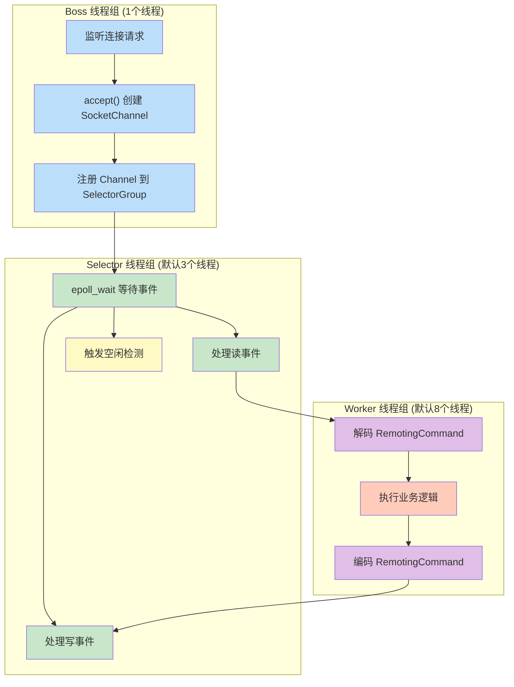

**核心结论**：RocketMQ采用三层线程模型，Boss负责连接建立，Selector负责I/O事件分发，Worker负责业务处理，各层职责清晰，实现高性能网络通信。

**线程组职责划分**：

| 线程组 | 线程数量 | 职责 | 线程名称格式 |
|--------|---------|------|-------------|
| Boss 线程组 | 1个 | 接受新连接，创建 SocketChannel | `NettyEPOLLBoss_1` 或 `NettyNIOBoss_1` |
| Selector 线程组 | 默认3个 | I/O 事件分发、读写操作 | `NettyServerEPOLLSelector_3_1` |
| Worker 线程组 | 默认8个 | 编解码、业务处理 | `NettyServerCodecThread_1` |

**Boss 线程组创建代码**：

```java
private EventLoopGroup buildBossEventLoopGroup() {
    if (useEpoll()) {
        return new EpollEventLoopGroup(1, new ThreadFactory() {  // 固定1个线程
            private final AtomicInteger threadIndex = new AtomicInteger(0);
            @Override
            public Thread newThread(Runnable r) {
                return new Thread(r, String.format("NettyEPOLLBoss_%d", this.threadIndex.incrementAndGet()));
            }
        });
    } else {
        return new NioEventLoopGroup(1, new ThreadFactory() {    // 固定1个线程
            private final AtomicInteger threadIndex = new AtomicInteger(0);
            @Override
            public Thread newThread(Runnable r) {
                return new Thread(r, String.format("NettyNIOBoss_%d", this.threadIndex.incrementAndGet()));
            }
        });
    }
}
```

### 5.3 核心配置参数

[NettyServerConfig.java](../remoting/src/main/java/org/apache/rocketmq/remoting/netty/NettyServerConfig.java) 定义了所有核心配置参数：

| 配置参数 | 默认值 | 说明 |
|---------|--------|------|
| `bindAddress` | `"0.0.0.0"` | 绑定地址，监听所有网卡 |
| `listenPort` | `0` | 监听端口，0表示随机分配 |
| `serverWorkerThreads` | `8` 个线程 | Worker 线程数，负责编解码 |
| `serverSelectorThreads` | `3` 个线程 | Selector 线程数，负责 I/O 事件分发 |
| `serverCallbackExecutorThreads` | `0` → 实际 `4` 个线程 | 回调线程数，0时默认使用4个 |
| `serverOnewaySemaphoreValue` | `256` 个并发 | Oneway 调用最大并发数 |
| `serverAsyncSemaphoreValue` | `64` 个并发 | 异步调用最大并发数 |
| `serverChannelMaxIdleTimeSeconds` | `120` 秒 (2分钟) | 通道最大空闲时间 |
| `useEpollNativeSelector` | `false` | 是否使用 Linux epoll |
| `serverPooledByteBufAllocatorEnable` | `true` | 是否启用池化 ByteBuf |
| `serverSocketSndBufSize` | `0` 字节 (系统默认) | Socket 发送缓冲区大小 |
| `serverSocketRcvBufSize` | `0` 字节 (系统默认) | Socket 接收缓冲区大小 |
| `serverSocketBacklog` | `1024` 个连接 | 服务端连接队列最大长度 |
| `writeBufferLowWaterMark` | `0` 字节 (系统默认) | 写缓冲区低水位线 |
| `writeBufferHighWaterMark` | `0` 字节 (系统默认) | 写缓冲区高水位线 |

**配置示例**：

```java
NettyServerConfig config = new NettyServerConfig();
config.setListenPort(10911);                          // 设置监听端口
config.setServerSelectorThreads(4);                   // 设置 Selector 线程数
config.setServerWorkerThreads(16);                    // 设置 Worker 线程数
config.setServerChannelMaxIdleTimeSeconds(180);       // 设置空闲超时为 180秒 (3分钟)
config.setUseEpollNativeSelector(true);               // 开启 epoll（仅Linux有效）
```

### 5.4 TCP参数配置

[NettyRemotingServer.java](../remoting/src/main/java/org/apache/rocketmq/remoting/netty/NettyRemotingServer.java#L217-L239) 配置 TCP 参数：

```java
serverBootstrap.group(this.eventLoopGroupBoss, this.eventLoopGroupSelector)
    .channel(useEpoll() ? EpollServerSocketChannel.class : NioServerSocketChannel.class)
    .option(ChannelOption.SO_BACKLOG, 1024)                    // 连接队列长度
    .option(ChannelOption.SO_REUSEADDR, true)                  // 允许端口重用
    .childOption(ChannelOption.SO_KEEPALIVE, false)            // 禁用 TCP KeepAlive
    .childOption(ChannelOption.TCP_NODELAY, true)              // 禁用 Nagle 算法
    .localAddress(new InetSocketAddress(this.nettyServerConfig.getBindAddress(),
        this.nettyServerConfig.getListenPort()))
    .childHandler(new ChannelInitializer<SocketChannel>() {
        @Override
        public void initChannel(SocketChannel ch) {
            // ...
        }
    });
```

**TCP 参数说明**：

| 参数 | 值 | 说明 |
|------|-----|------|
| `SO_BACKLOG` | `1024` 个连接 | 服务端连接队列最大长度，超过则拒绝新连接 |
| `SO_REUSEADDR` | `true` | 允许重启时重用处于 TIME_WAIT 状态的端口 |
| `SO_KEEPALIVE` | `false` | 禁用 TCP KeepAlive，使用应用层空闲检测代替 |
| `TCP_NODELAY` | `true` | 禁用 Nagle 算法，减少网络延迟 |

**自定义 TCP 缓冲区配置**：

```java
private void addCustomConfig(ServerBootstrap childHandler) {
    // 发送缓冲区大小（默认值：0，表示使用系统默认）
    if (nettyServerConfig.getServerSocketSndBufSize() > 0) {
        childHandler.childOption(ChannelOption.SO_SNDBUF, 
            nettyServerConfig.getServerSocketSndBufSize());
    }
    // 接收缓冲区大小（默认值：0，表示使用系统默认）
    if (nettyServerConfig.getServerSocketRcvBufSize() > 0) {
        childHandler.childOption(ChannelOption.SO_RCVBUF, 
            nettyServerConfig.getServerSocketRcvBufSize());
    }
    // 写缓冲区水位线（防止内存溢出）
    if (nettyServerConfig.getWriteBufferLowWaterMark() > 0 
        && nettyServerConfig.getWriteBufferHighWaterMark() > 0) {
        childHandler.childOption(ChannelOption.WRITE_BUFFER_WATER_MARK, 
            new WriteBufferWaterMark(
                nettyServerConfig.getWriteBufferLowWaterMark(),   // 低水位线
                nettyServerConfig.getWriteBufferHighWaterMark())); // 高水位线
    }
    // 池化 ByteBuf 分配器（默认启用）
    if (nettyServerConfig.isServerPooledByteBufAllocatorEnable()) {
        childHandler.childOption(ChannelOption.ALLOCATOR, PooledByteBufAllocator.DEFAULT);
    }
}
```

### 5.5 ChannelPipeline处理链

RocketMQ 使用责任链模式处理网络事件，每个连接创建独立的 ChannelPipeline：


**核心结论**：ChannelPipeline采用责任链模式，数据依次经过握手检测、编解码、空闲检测、连接管理和业务处理，各组件职责单一，易于扩展。

**处理链配置代码**：

```java
serverBootstrap.childHandler(new ChannelInitializer<SocketChannel>() {
    @Override
    public void initChannel(SocketChannel ch) {
        ch.pipeline()
            .addLast(defaultEventExecutorGroup, HANDSHAKE_HANDLER_NAME, handshakeHandler)
            .addLast(defaultEventExecutorGroup,
                encoder,                      // NettyEncoder（编码器）
                new NettyDecoder(),           // NettyDecoder（解码器）
                new IdleStateHandler(0, 0,    // 空闲检测：读0秒、写0秒、全双工120秒
                    nettyServerConfig.getServerChannelMaxIdleTimeSeconds()),
                connectionManageHandler,      // 连接管理
                serverHandler                 // 业务处理
            );
    }
});
```

**各组件详细说明**：

| 组件 | 类型 | 作用 | 线程池 |
|------|------|------|--------|
| `HandshakeHandler` | 入站处理器 | TLS 握手检测，判断是否启用 SSL | Worker 线程组 |
| `NettyEncoder` | 出站处理器 | 将 RemotingCommand 编码为字节流 | Worker 线程组 |
| `NettyDecoder` | 入站处理器 | 将字节流解码为 RemotingCommand | Worker 线程组 |
| `IdleStateHandler` | 双向处理器 | 空闲连接检测，触发 IdleStateEvent | Selector 线程组 |
| `NettyConnectManageHandler` | 双向处理器 | 连接生命周期管理 | Worker 线程组 |
| `NettyServerHandler` | 入站处理器 | 接收并分发请求消息 | Worker 线程组 |

### 5.6 编解码器

**NettyEncoder 编码器**：

[NettyEncoder.java](../remoting/src/main/java/org/apache/rocketmq/remoting/netty/NettyEncoder.java) 负责将 `RemotingCommand` 编码为字节流：

```java
@ChannelHandler.Sharable
public class NettyEncoder extends MessageToByteEncoder<RemotingCommand> {
    @Override
    public void encode(ChannelHandlerContext ctx, RemotingCommand remotingCommand, ByteBuf out)
        throws Exception {
        try {
            // 1. 编码消息头（包含长度字段）
            remotingCommand.fastEncodeHeader(out);
            // 2. 编码消息体
            byte[] body = remotingCommand.getBody();
            if (body != null) {
                out.writeBytes(body);
            }
        } catch (Exception e) {
            log.error("encode exception, " + RemotingHelper.parseChannelRemoteAddr(ctx.channel()), e);
            RemotingUtil.closeChannel(ctx.channel());  // 编码失败则关闭连接
        }
    }
}
```

**NettyDecoder 解码器**：

[NettyDecoder.java](../remoting/src/main/java/org/apache/rocketmq/remoting/netty/NettyDecoder.java) 负责将字节流解码为 `RemotingCommand`：

```java
public class NettyDecoder extends LengthFieldBasedFrameDecoder {
    // 帧最大长度：16MB（16777216字节）
    private static final int FRAME_MAX_LENGTH =
        Integer.parseInt(System.getProperty("com.rocketmq.remoting.frameMaxLength", "16777216"));

    public NettyDecoder() {
        super(FRAME_MAX_LENGTH, 0, 4, 0, 4);  // 参数说明见下表
    }

    @Override
    public Object decode(ChannelHandlerContext ctx, ByteBuf in) throws Exception {
        ByteBuf frame = null;
        try {
            // 1. 解码帧（解决 TCP 粘包/拆包问题）
            frame = (ByteBuf) super.decode(ctx, in);
            if (null == frame) {
                return null;  // 数据不完整，等待更多数据
            }
            // 2. 解码为 RemotingCommand
            return RemotingCommand.decode(frame);
        } catch (Exception e) {
            log.error("decode exception, " + RemotingHelper.parseChannelRemoteAddr(ctx.channel()), e);
            RemotingUtil.closeChannel(ctx.channel());  // 解码失败则关闭连接
        } finally {
            if (null != frame) {
                frame.release();  // 释放 ByteBuf，防止内存泄漏
            }
        }
        return null;
    }
}
```

**LengthFieldBasedFrameDecoder 参数说明**：

| 参数 | 值 | 说明 |
|------|-----|------|
| `maxFrameLength` | `16777216` 字节 (16MB) | 单个消息最大长度，超过则抛出异常 |
| `lengthFieldOffset` | `0` 字节 | 长度字段起始位置（位于消息头最开始） |
| `lengthFieldLength` | `4` 字节 | 长度字段占用字节数（int 类型） |
| `lengthAdjustment` | `0` 字节 | 长度字段修正值（长度字段值即为消息体长度） |
| `initialBytesToStrip` | `4` 字节 | 解码时跳过的字节数（跳过长度字段本身） |

**消息帧结构**：

```
+----------------+------------------+
| Length (4字节) | Body (变长)       |
+----------------+------------------+
| <--- 长度字段 --->| <--- 消息体 ---> |
```

### 5.7 空闲连接检测

RocketMQ 使用 `IdleStateHandler` 检测空闲连接，防止资源泄露：

```java
new IdleStateHandler(0, 0, 
    nettyServerConfig.getServerChannelMaxIdleTimeSeconds())  // 默认值：120秒 (2分钟)
```

**IdleStateHandler 参数说明**：

| 参数 | 默认值 | 说明 |
|------|--------|------|
| `readerIdleTime` | `0` 秒 | 读空闲时间，0表示不检测 |
| `writerIdleTime` | `0` 秒 | 写空闲时间，0表示不检测 |
| `allIdleTime` | `120` 秒 (2分钟) | 全双工空闲时间，超过则触发事件 |

**空闲检测工作流程**：

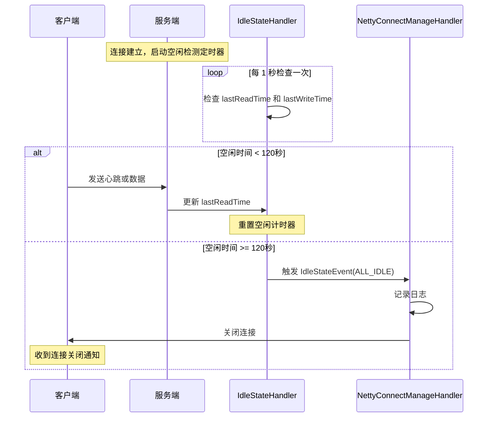

**核心结论**：IdleStateHandler每秒检查一次连接状态，超过120秒无读写则关闭连接，防止资源泄露。

**空闲事件处理代码**：

```java
@Override
public void userEventTriggered(ChannelHandlerContext ctx, Object evt) {
    if (evt instanceof IdleStateEvent) {
        IdleStateEvent event = (IdleStateEvent) evt;
        if (event.state().equals(IdleState.ALL_IDLE)) {  // 全双工空闲
            final String remoteAddress = RemotingHelper.parseChannelRemoteAddr(ctx.channel());
            log.warn("NETTY SERVER PIPELINE: IDLE exception [{}]", remoteAddress);
            RemotingUtil.closeChannel(ctx.channel());  // 关闭空闲连接
            if (NettyRemotingServer.this.channelEventListener != null) {
                NettyRemotingServer.this.putNettyEvent(
                    new NettyEvent(NettyEventType.IDLE, remoteAddress, ctx.channel()));
            }
        }
    }
    ctx.fireUserEventTriggered(evt);
}
```

### 5.8 连接生命周期管理

[NettyConnectManageHandler](../remoting/src/main/java/org/apache/rocketmq/remoting/netty/NettyRemotingServer.java#L484-L552) 负责管理连接的生命周期：

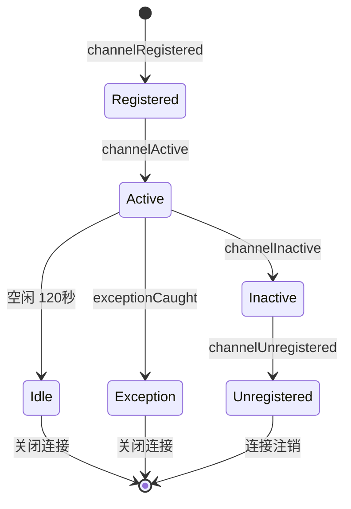

**核心结论**：连接从注册到注销经历完整的生命周期，空闲超时或异常时主动关闭，确保资源及时释放。

**连接事件类型**：

| 事件类型 | 触发时机 | 处理逻辑 |
|---------|---------|---------|
| `REGISTERED` | Channel 注册到 EventLoop | 记录日志 |
| `UNREGISTERED` | Channel 从 EventLoop 注销 | 记录日志 |
| `CONNECT` | 连接建立成功 | 记录日志，通知 ChannelEventListener |
| `CLOSE` | 连接关闭 | 记录日志，通知 ChannelEventListener |
| `IDLE` | 空闲超时 | 记录警告日志，关闭连接 |
| `EXCEPTION` | 发生异常 | 记录错误日志，关闭连接 |

**连接事件处理代码**：

```java
@ChannelHandler.Sharable
class NettyConnectManageHandler extends ChannelDuplexHandler {
    // 连接注册
    @Override
    public void channelRegistered(ChannelHandlerContext ctx) throws Exception {
        final String remoteAddress = RemotingHelper.parseChannelRemoteAddr(ctx.channel());
        log.info("NETTY SERVER PIPELINE: channelRegistered {}", remoteAddress);
        super.channelRegistered(ctx);
    }

    // 连接注销
    @Override
    public void channelUnregistered(ChannelHandlerContext ctx) throws Exception {
        final String remoteAddress = RemotingHelper.parseChannelRemoteAddr(ctx.channel());
        log.info("NETTY SERVER PIPELINE: channelUnregistered, the channel[{}]", remoteAddress);
        super.channelUnregistered(ctx);
    }

    // 连接激活
    @Override
    public void channelActive(ChannelHandlerContext ctx) throws Exception {
        final String remoteAddress = RemotingHelper.parseChannelRemoteAddr(ctx.channel());
        log.info("NETTY SERVER PIPELINE: channelActive, the channel[{}]", remoteAddress);
        super.channelActive(ctx);
        if (NettyRemotingServer.this.channelEventListener != null) {
            NettyRemotingServer.this.putNettyEvent(
                new NettyEvent(NettyEventType.CONNECT, remoteAddress, ctx.channel()));
        }
    }

    // 连接断开
    @Override
    public void channelInactive(ChannelHandlerContext ctx) throws Exception {
        final String remoteAddress = RemotingHelper.parseChannelRemoteAddr(ctx.channel());
        log.info("NETTY SERVER PIPELINE: channelInactive, the channel[{}]", remoteAddress);
        super.channelInactive(ctx);
        if (NettyRemotingServer.this.channelEventListener != null) {
            NettyRemotingServer.this.putNettyEvent(
                new NettyEvent(NettyEventType.CLOSE, remoteAddress, ctx.channel()));
        }
    }

    // 异常处理
    @Override
    public void exceptionCaught(ChannelHandlerContext ctx, Throwable cause) {
        final String remoteAddress = RemotingHelper.parseChannelRemoteAddr(ctx.channel());
        log.warn("NETTY SERVER PIPELINE: exceptionCaught {}", remoteAddress);
        log.warn("NETTY SERVER PIPELINE: exceptionCaught exception.", cause);
        if (NettyRemotingServer.this.channelEventListener != null) {
            NettyRemotingServer.this.putNettyEvent(
                new NettyEvent(NettyEventType.EXCEPTION, remoteAddress, ctx.channel()));
        }
        RemotingUtil.closeChannel(ctx.channel());  // 异常时关闭连接
    }
}
```

### 5.9 TLS/SSL支持

RocketMQ 支持 TLS 加密传输，通过 `HandshakeHandler` 检测并处理 TLS 握手：

```java
@ChannelHandler.Sharable
class HandshakeHandler extends SimpleChannelInboundHandler<ByteBuf> {
    private final TlsMode tlsMode;
    private static final byte HANDSHAKE_MAGIC_CODE = 0x16;  // TLS 握手起始字节

    @Override
    protected void channelRead0(ChannelHandlerContext ctx, ByteBuf msg) {
        msg.markReaderIndex();
        byte b = msg.getByte(0);  // 读取第一个字节

        if (b == HANDSHAKE_MAGIC_CODE) {  // 客户端发起 TLS 连接
            switch (tlsMode) {
                case DISABLED:
                    ctx.close();  // 服务端禁用 TLS，拒绝连接
                    log.warn("Clients intend to establish an SSL connection while this server is running in SSL disabled mode");
                    break;
                case PERMISSIVE:
                case ENFORCING:
                    if (null != sslContext) {
                        // 动态添加 SSL Handler
                        ctx.pipeline()
                            .addAfter(defaultEventExecutorGroup, HANDSHAKE_HANDLER_NAME, 
                                TLS_HANDLER_NAME, sslContext.newHandler(ctx.channel().alloc()))
                            .addAfter(defaultEventExecutorGroup, TLS_HANDLER_NAME, 
                                FILE_REGION_ENCODER_NAME, new FileRegionEncoder());
                        log.info("Handlers prepended to channel pipeline to establish SSL connection");
                    } else {
                        ctx.close();
                        log.error("Trying to establish an SSL connection but sslContext is null");
                    }
                    break;
            }
        } else if (tlsMode == TlsMode.ENFORCING) {
            ctx.close();  // 强制 TLS 模式，拒绝非加密连接
            log.warn("Clients intend to establish an insecure connection while this server is running in SSL enforcing mode");
        }

        msg.resetReaderIndex();
        ctx.pipeline().remove(this);  // 移除握手处理器（只执行一次）
        ctx.fireChannelRead(msg.retain());  // 传递给下一个处理器
    }
}
```

**TLS 模式说明**：

| 模式 | 说明 | 行为 |
|------|------|------|
| `DISABLED` | 禁用 TLS | 拒绝所有 TLS 连接 |
| `PERMISSIVE` | 宽松模式 | 允许 TLS 和非 TLS 连接共存 |
| `ENFORCING` | 强制模式 | 仅允许 TLS 连接，拒绝非加密连接 |

**TLS 握手检测原理**：

TLS 握手以 `0x16` 字节开头（ContentType: Handshake），服务端通过检查第一个字节判断客户端是否发起 TLS 连接。

### 5.10 系统配置参数

[NettySystemConfig.java](../remoting/src/main/java/org/apache/rocketmq/remoting/netty/NettySystemConfig.java) 定义了可通过 JVM 参数覆盖的系统配置：

| 系统属性 | 默认值 | 说明 |
|---------|--------|------|
| `com.rocketmq.remoting.frameMaxLength` | `16777216` 字节 (16MB) | 单个消息帧最大长度 |
| `com.rocketmq.remoting.socket.sndbuf.size` | `0` (系统默认) | Socket 发送缓冲区大小 |
| `com.rocketmq.remoting.socket.rcvbuf.size` | `0` (系统默认) | Socket 接收缓冲区大小 |
| `com.rocketmq.remoting.socket.backlog` | `1024` 个连接 | 连接队列长度 |
| `com.rocketmq.remoting.nettyPooledByteBufAllocatorEnable` | `false` | 是否启用池化 ByteBuf |
| `com.rocketmq.remoting.clientAsyncSemaphoreValue` | `65535` 个并发 | 客户端异步调用最大并发数 |
| `com.rocketmq.remoting.clientOnewaySemaphoreValue` | `65535` 个并发 | 客户端 Oneway 调用最大并发数 |
| `com.rocketmq.remoting.client.worker.size` | `4` 个线程 | 客户端 Worker 线程数 |
| `com.rocketmq.remoting.client.connect.timeout` | `3000` 毫秒 (3秒) | 客户端连接超时时间 |
| `com.rocketmq.remoting.client.channel.maxIdleTimeSeconds` | `120` 秒 (2分钟) | 客户端通道最大空闲时间 |
| `com.rocketmq.remoting.client.closeSocketIfTimeout` | `true` | 客户端超时时是否关闭 Socket |
| `com.rocketmq.remoting.write.buffer.high.water.mark` | `0` 字节 (系统默认) | 写缓冲区高水位线 |
| `com.rocketmq.remoting.write.buffer.low.water.mark` | `0` 字节 (系统默认) | 写缓冲区低水位线 |

**配置示例**：

```bash
# 设置消息帧最大长度为 32MB
java -Dcom.rocketmq.remoting.frameMaxLength=33554432 -jar rocketmq.jar

# 设置 Socket 缓冲区大小为 1MB
java -Dcom.rocketmq.remoting.socket.sndbuf.size=1048576 \
     -Dcom.rocketmq.remoting.socket.rcvbuf.size=1048576 \
     -jar rocketmq.jar

# 启用池化 ByteBuf
java -Dcom.rocketmq.remoting.nettyPooledByteBufAllocatorEnable=true -jar rocketmq.jar
```

### 5.11 SubRemotingServer多端口支持

[NettyRemotingServer.java](../remoting/src/main/java/org/apache/rocketmq/remoting/netty/NettyRemotingServer.java#L559-L665) 支持绑定多个端口，每个端口由独立的 `SubRemotingServer` 管理：

**设计目的**：允许单个 `NettyRemotingServer` 实例同时监听多个端口，每个端口可以有独立的处理器配置，同时共享底层的网络资源（Boss 线程组、Selector 线程组）。

**核心数据结构**：

```java
// 存储端口到 RemotingServer 的映射
private final ConcurrentMap<Integer/*Port*/, NettyRemotingAbstract> remotingServerTable = new ConcurrentHashMap<>();
```

**SubRemotingServer 核心方法**：

| 方法 | 功能 | 说明 |
|------|------|------|
| `newRemotingServer(port)` | 创建子服务器 | 在指定端口创建独立的 RemotingServer |
| `removeRemotingServer(port)` | 移除子服务器 | 从映射表中移除指定端口的 RemotingServer |
| `start()` | 启动子服务器 | 绑定端口并开始监听 |
| `shutdown()` | 关闭子服务器 | 关闭指定端口的 Channel（等待 5 秒） |

**SubRemotingServer 代码示例**：

```java
// 创建子服务器
RemotingServer subServer = nettyRemotingServer.newRemotingServer(10912);

// 注册处理器（独立于主服务器的处理器配置）
subServer.registerProcessor(RequestCode.SEND_MESSAGE, sendMessageProcessor, executor);

// 启动子服务器
subServer.start();

// 关闭子服务器
subServer.shutdown();
nettyRemotingServer.removeRemotingServer(10912);
```

**资源共享机制**：

| 资源 | 共享方式 | 说明 |
|------|---------|------|
| Boss 线程组 | 共享 | 所有端口共用同一个 Boss 线程组 |
| Selector 线程组 | 共享 | 所有端口共用同一个 Selector 线程组 |
| 公共线程池 | 共享 | 默认回调执行器共享 |
| ChannelEventListener | 共享 | 事件监听器共享 |
| 处理器表 | 独立 | 每个子服务器有独立的处理器映射表 |

**使用场景**：

- 同一 Broker 对外提供多个服务端口（如内网端口和外网端口）
- 不同端口处理不同类型的请求（如管理端口和数据端口）
- 动态添加/移除服务端口

> **注意**：`SubRemotingServer` 不支持嵌套创建子服务器，调用 `newRemotingServer()` 会抛出 `UnsupportedOperationException`。

### 5.12 事件驱动模型实现

RocketMQ 基于 Netty 的事件驱动模型实现高性能网络通信，采用责任链模式处理各类事件。

#### 5.12.1 事件处理链配置

[NettyRemotingServer.java](../remoting/src/main/java/org/apache/rocketmq/remoting/netty/NettyRemotingServer.java#L225-L239) 配置事件处理链：

```java
serverBootstrap.childHandler(new ChannelInitializer<SocketChannel>() {
    @Override
    public void initChannel(SocketChannel ch) {
        ch.pipeline()
            .addLast(defaultEventExecutorGroup, HANDSHAKE_HANDLER_NAME, handshakeHandler)
            .addLast(defaultEventExecutorGroup,
                encoder,                      // NettyEncoder（编码器）
                new NettyDecoder(),           // NettyDecoder（解码器）
                new IdleStateHandler(0, 0,    // 空闲检测：读0秒、写0秒、全双工120秒
                    nettyServerConfig.getServerChannelMaxIdleTimeSeconds()),
                connectionManageHandler,      // 连接管理
                serverHandler                 // 业务处理
            );
    }
});
```

#### 5.12.2 请求处理流程

[NettyServerHandler](../remoting/src/main/java/org/apache/rocketmq/remoting/netty/NettyRemotingServer.java#L468-L482) 负责接收并分发请求消息：

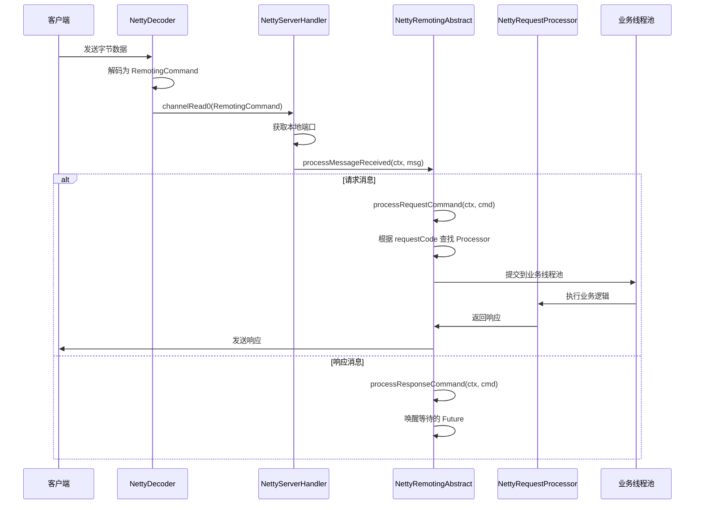

**核心结论**：请求处理流程从解码到业务执行采用异步方式，通过requestCode精准路由到对应Processor，实现高效的消息分发。

**NettyServerHandler 代码**：

```java
@ChannelHandler.Sharable
class NettyServerHandler extends SimpleChannelInboundHandler<RemotingCommand> {
    @Override
    protected void channelRead0(ChannelHandlerContext ctx, RemotingCommand msg) {
        // 1. 获取本地端口，查找对应的 RemotingServer
        int localPort = RemotingHelper.parseSocketAddressPort(ctx.channel().localAddress());
        NettyRemotingAbstract remotingAbstract = NettyRemotingServer.this.remotingServerTable.get(localPort);
        
        if (localPort != -1 && remotingAbstract != null) {
            // 2. 分发消息到对应的 RemotingServer 处理
            remotingAbstract.processMessageReceived(ctx, msg);
            return;
        }
        
        // 3. RemotingServer 已关闭，关闭连接
        RemotingUtil.closeChannel(ctx.channel());
    }
}
```

#### 5.12.3 消息类型区分

RocketMQ 通过 `RemotingCommand` 的类型字段区分请求和响应：

| 消息类型 | 标识 | 处理方法 |
|---------|------|---------|
| 请求消息 | `RPCRequest` | `processRequestCommand()` |
| 响应消息 | `RPCResponse` | `processResponseCommand()` |

**消息处理流程代码**：

```java
public void processMessageReceived(ChannelHandlerContext ctx, RemotingCommand msg) {
    final RemotingCommand cmd = msg;
    if (cmd != null) {
        switch (cmd.getType()) {
            case REQUEST_COMMAND:
                processRequestCommand(ctx, cmd);  // 处理请求
                break;
            case RESPONSE_COMMAND:
                processResponseCommand(ctx, cmd);  // 处理响应
                break;
            default:
                break;
        }
    }
}
```

#### 5.12.4 请求处理器注册

RocketMQ 支持为不同的请求码注册不同的处理器，实现请求的精准分发：

```java
@Override
public void registerProcessor(int requestCode, NettyRequestProcessor processor, ExecutorService executor) {
    ExecutorService executorThis = executor;
    if (null == executor) {
        executorThis = this.publicExecutor;  // 使用默认公共线程池
    }
    
    Pair<NettyRequestProcessor, ExecutorService> pair = new Pair<>(processor, executorThis);
    this.processorTable.put(requestCode, pair);  // 存储到处理器表
}
```

**处理器表结构**：

```
processorTable: ConcurrentHashMap<Integer/*requestCode*/, Pair<Processor, Executor>>
```

| requestCode | Processor | Executor | 说明 |
|-------------|-----------|----------|------|
| 10 | SendMessageProcessor | sendMessageExecutor | 发送消息请求 |
| 11 | PullMessageProcessor | pullMessageExecutor | 拉取消息请求 |
| 12 | QueryMessageProcessor | queryExecutor | 查询消息请求 |
| ... | ... | ... | 其他请求类型 |

#### 5.12.5 请求处理详细流程

```java
public void processRequestCommand(final ChannelHandlerContext ctx, final RemotingCommand cmd) {
    // 1. 根据 requestCode 查找处理器
    final Pair<NettyRequestProcessor, ExecutorService> matched = this.processorTable.get(cmd.getCode());
    final Pair<NettyRequestProcessor, ExecutorService> pair = 
        null == matched ? this.defaultRequestProcessorPair : matched;
    
    if (pair == null) {
        // 没有找到处理器，返回错误响应
        String error = " request type " + cmd.getCode() + " not supported";
        final RemotingCommand response = RemotingCommand.createResponseCommand(
            RemotingSysResponseCode.REQUEST_CODE_NOT_SUPPORTED, error);
        response.setOpaque(cmd.getOpaque());
        ctx.writeAndFlush(response);
        return;
    }
    
    // 2. 封装异步任务
    Runnable run = new Runnable() {
        @Override
        public void run() {
            try {
                // 2.1 执行前置钩子
                doBeforeRpcHooks(RemotingHelper.parseChannelRemoteAddr(ctx.channel()), cmd);
                
                // 2.2 执行处理器
                final RemotingCommand response = pair.getObject1().processRequest(ctx, cmd);
                
                // 2.3 执行后置钩子
                doAfterRpcHooks(RemotingHelper.parseChannelRemoteAddr(ctx.channel()), cmd, response);
                
                // 2.4 发送响应（如果不是 oneway 请求）
                if (!cmd.isOnewayRPC()) {
                    response.setOpaque(cmd.getOpaque());
                    response.markResponseType();
                    ctx.writeAndFlush(response);
                }
            } catch (Throwable e) {
                log.error("process request exception", e);
                // 异常处理
                if (!cmd.isOnewayRPC()) {
                    final RemotingCommand response = RemotingCommand.createResponseCommand(
                        RemotingSysResponseCode.SYSTEM_ERROR, 
                        RemotingHelper.exceptionSimpleDesc(e));
                    response.setOpaque(cmd.getOpaque());
                    ctx.writeAndFlush(response);
                }
            }
        }
    };
    
    // 3. 提交到线程池执行
    try {
        final RequestTask requestTask = new RequestTask(run, ctx.channel(), cmd);
        pair.getObject2().submit(requestTask);
    } catch (RejectedExecutionException e) {
        // 线程池拒绝，返回系统繁忙错误
        if (!cmd.isOnewayRPC()) {
            final RemotingCommand response = RemotingCommand.createResponseCommand(
                RemotingSysResponseCode.SYSTEM_BUSY,
                "[OVERLOAD]system busy, start flow control for a while");
            response.setOpaque(cmd.getOpaque());
            ctx.writeAndFlush(response);
        }
    }
}
```

#### 5.12.6 并发控制

RocketMQ 使用信号量控制并发请求数量，防止系统过载：

| 信号量 | 默认值 | 说明 |
|--------|--------|------|
| `serverOnewaySemaphoreValue` | `256` 个并发 | Oneway 调用最大并发数 |
| `serverAsyncSemaphoreValue` | `64` 个并发 | 异步调用最大并发数 |

**并发控制代码**：

```java
// 申请信号量
boolean acquired = this.semaphoreAsync.tryAcquire(timeoutMillis, TimeUnit.MILLISECONDS);
if (!acquired) {
    // 申请失败，返回系统繁忙
    return RemotingCommand.createResponseCommand(
        RemotingSysResponseCode.SYSTEM_BUSY,
        "[OVERLOAD]system busy, start flow control for a while");
}

try {
    // 执行业务逻辑
    // ...
} finally {
    // 释放信号量
    this.semaphoreAsync.release();
}
```

#### 5.12.7 NettyEvent事件机制

RocketMQ 使用 `NettyEvent` 机制异步处理连接事件，避免阻塞 I/O 线程：


**核心结论**：NettyEvent机制将连接事件异步化处理，I/O线程只负责事件入队，由专门的事件处理线程调用ChannelEventListener，避免阻塞I/O线程。

**NettyEvent 类型**：

| 事件类型 | 说明 | 触发时机 |
|---------|------|---------|
| `CONNECT` | 连接建立 | `channelActive()` |
| `CLOSE` | 连接关闭 | `channelInactive()` |
| `IDLE` | 空闲超时 | `userEventTriggered(IdleStateEvent)` |
| `EXCEPTION` | 异常发生 | `exceptionCaught()` |

**事件处理代码**：

```java
// 放入事件队列
public void putNettyEvent(final NettyEvent event) {
    this.nettyEventExecutor.putNettyEvent(event);
}

// 事件处理线程
class NettyEventExecutor extends ServiceThread {
    private final LinkedBlockingQueue<NettyEvent> eventQueue = new LinkedBlockingQueue<>();
    
    @Override
    public void run() {
        while (!this.isStopped()) {
            try {
                NettyEvent event = this.eventQueue.poll(3000, TimeUnit.MILLISECONDS);
                if (event != null) {
                    // 调用 ChannelEventListener 处理事件
                    invokeChannelEventListener(event);
                }
            } catch (Exception e) {
                log.warn("NettyEventExecutor service has exception. ", e);
            }
        }
    }
    
    private void invokeChannelEventListener(NettyEvent event) {
        if (channelEventListener != null) {
            switch (event.getType()) {
                case CONNECT:
                    channelEventListener.onChannelConnect(event.getRemoteAddr(), event.getChannel());
                    break;
                case CLOSE:
                    channelEventListener.onChannelClose(event.getRemoteAddr(), event.getChannel());
                    break;
                case IDLE:
                    channelEventListener.onChannelIdle(event.getRemoteAddr(), event.getChannel());
                    break;
                case EXCEPTION:
                    channelEventListener.onChannelException(event.getRemoteAddr(), event.getChannel());
                    break;
                default:
                    break;
            }
        }
    }
}
```

#### 5.12.8 定时任务

RocketMQ 启动定时任务扫描响应表，清理超时请求：

```java
this.timer.scheduleAtFixedRate(new TimerTask() {
    @Override
    public void run() {
        try {
            NettyRemotingServer.this.scanResponseTable();
        } catch (Throwable e) {
            log.error("scanResponseTable exception", e);
        }
    }
}, 1000 * 3, 1000);  // 延迟 3秒 启动，每 1秒 执行一次
```

**scanResponseTable 作用**：

| 功能 | 说明 |
|------|------|
| 清理超时请求 | 移除超过 `timeoutMillis` 的请求 |
| 释放资源 | 释放 ResponseFuture 占用的资源 |
| 防止内存泄漏 | 避免响应表无限增长 |

#### 5.12.9 完整事件处理流程图

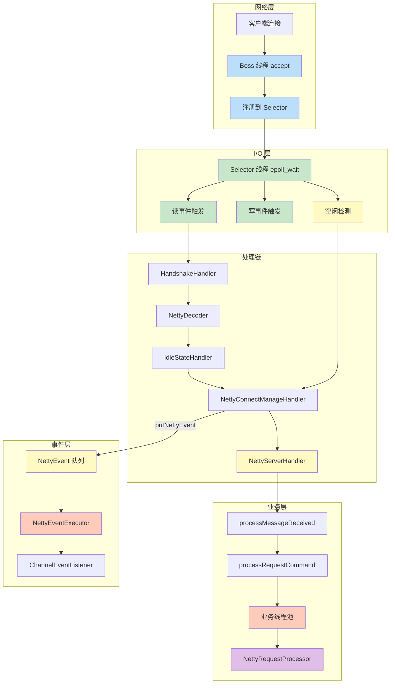

**核心结论**：RocketMQ网络处理采用分层架构，网络层负责连接建立，I/O层负责事件监控，处理链负责编解码和连接管理，业务层负责请求处理，事件层负责异步事件通知，各层职责清晰，实现高性能网络通信。

---

## 6. 信号驱动I/O

**信号驱动I/O (Signal-driven I/O)** 通过信号机制通知数据就绪：

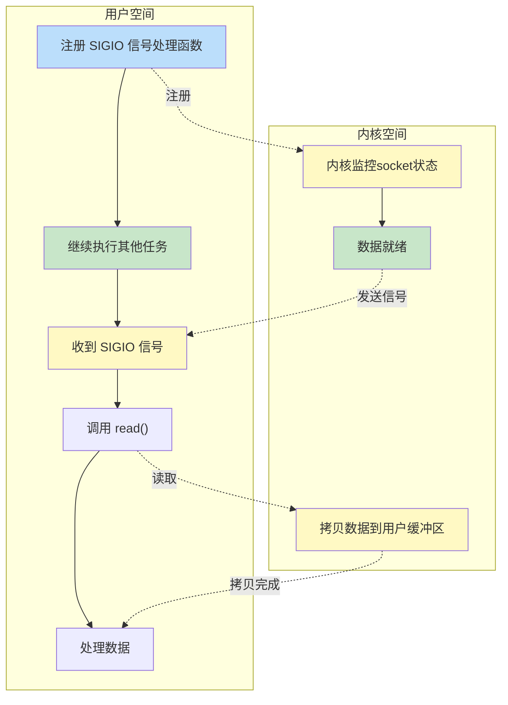

**核心结论**：信号驱动I/O通过内核主动发送信号通知数据就绪，应用程序无需轮询，但信号处理复杂且有限制。

**核心特点**：

| 特性 | 说明 |
|------|------|
| 同步/异步 | 同步 |
| 阻塞/非阻塞 | 非阻塞 |
| 系统调用次数 | 1次sigaction + 1次read |
| CPU利用率 | 高（信号通知） |
| 连接数扩展性 | 良（信号队列限制） |
| 编程复杂度 | 高 |

**处理流程**：`sigaction()` → 继续 → 信号到达 → `read()` → 返回

**典型应用**：TCP紧急数据

**特点分析**：数据就绪时内核主动发信号通知，应用程序无需轮询，但信号处理复杂且有限制。

---

## 7. 异步I/O

**异步I/O (Asynchronous I/O)** 是真正的异步模型：

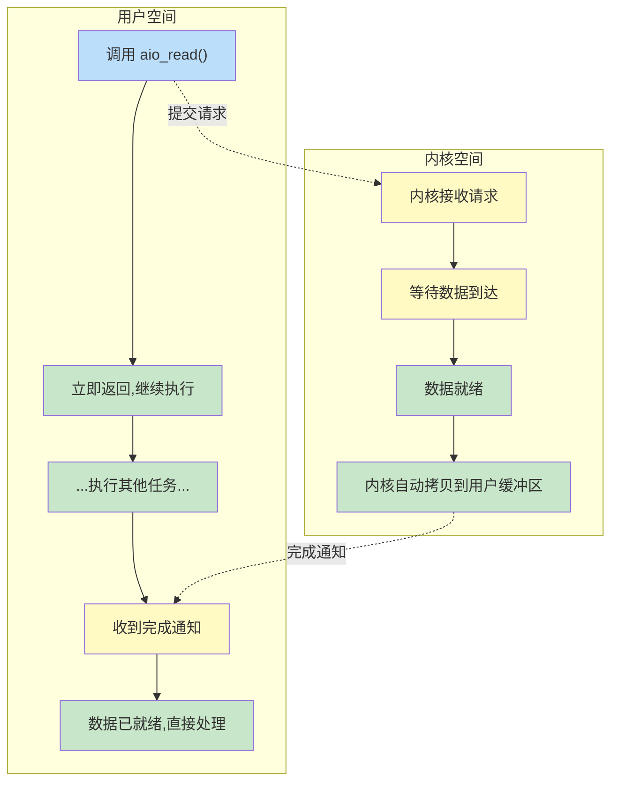

**核心结论**：异步I/O是真正的异步模型，从等待数据到拷贝数据全部由内核完成，应用程序完全不阻塞，但编程复杂度高。

**核心特点**：

| 特性 | 说明 |
|------|------|
| 同步/异步 | 异步 |
| 阻塞/非阻塞 | 非阻塞 |
| 系统调用次数 | 1次aio_read |
| CPU利用率 | 最高（完全非阻塞） |
| 连接数扩展性 | 优（内核级异步） |
| 编程复杂度 | 高 |

**处理流程**：`aio_read()` → 立即返回 → 继续 → 完成回调

**典型应用**：Windows IOCP、Linux AIO

**特点分析**：真正的异步模型，从等待数据到拷贝数据全部由内核完成，应用程序完全不阻塞。

---

## 8. I/O模型对比与选型

**五种I/O模型综合对比**：

```mermaid
flowchart TD
    subgraph Models["五种 I/O 模型对比"]
        direction TB
        
        subgraph BIO["阻塞 I/O"]
            B1["read()"] --> B2["阻塞等待"]
            B2 --> B3["数据到达"]
            B3 --> B4["返回数据"]
        end
        
        subgraph NIO["非阻塞 I/O"]
            N1["read()"] --> N2{"数据就绪?"}
            N2 -->|否| N3["返回 EAGAIN"]
            N3 --> N4["轮询重试"]
            N4 --> N2
            N2 -->|是| N5["返回数据"]
        end
        
        subgraph MUX["I/O 多路复用"]
            M1["select/epoll_wait()"] --> M2["阻塞等待"]
            M2 --> M3["就绪通知"]
            M3 --> M4["read()"]
            M4 --> M5["返回数据"]
        end
        
        subgraph SIG["信号驱动 I/O"]
            S1["sigaction()"] --> S2["继续执行"]
            S2 --> S3["收到 SIGIO"]
            S3 --> S4["read()"]
            S4 --> S5["返回数据"]
        end
        
        subgraph AIO["异步 I/O"]
            A1["aio_read()"] --> A2["立即返回"]
            A2 --> A3["继续执行"]
            A3 --> A4["完成回调"]
        end
    end

    style B2 fill:#ffcdd2
    style N3 fill:#fff9c4
    style N4 fill:#fff9c4
    style M2 fill:#bbdefb
    style S2 fill:#c8e6c9
    style A2 fill:#c8e6c9
    style A3 fill:#c8e6c9
```

**核心结论**：从阻塞I/O到异步I/O，应用程序的阻塞程度逐渐降低，但编程复杂度逐渐增加。I/O多路复用在性能和复杂度之间取得了最佳平衡。

| 模型 | 同步/异步 | 阻塞/非阻塞 | 系统调用次数 | CPU利用率 | 连接数扩展性 | 编程复杂度 | 典型应用 |
|------|----------|------------|-------------|----------|-------------|-----------|---------|
| 阻塞I/O | 同步 | 阻塞 | 1次read | 低（阻塞等待） | 差（每连接一线程） | 低 | 简单客户端 |
| 非阻塞I/O | 同步 | 非阻塞 | N次轮询 | 高（轮询空转） | 差（轮询开销大） | 中 | 少量连接场景 |
| I/O多路复用 | 同步 | 部分阻塞 | 1次select + N次read | 高（事件驱动） | 优（单线程处理多连接） | 中 | Nginx、Redis、RocketMQ |
| 信号驱动I/O | 同步 | 非阻塞 | 1次sigaction + 1次read | 高（信号通知） | 良（信号队列限制） | 高 | TCP紧急数据 |
| 异步I/O | 异步 | 非阻塞 | 1次aio_read | 最高（完全非阻塞） | 优（内核级异步） | 高 | Windows IOCP、AIO |

**统一案例：读取网络数据**：

以"从Socket读取1KB数据"为例，对比五种模型的处理流程：

| 模型 | 处理流程 | 应用程序行为 |
|------|---------|-------------|
| 阻塞I/O | `read()` → 阻塞等待 → 数据到达 → 返回 | 调用后阻塞，无法执行其他任务 |
| 非阻塞I/O | `read()` → EAGAIN → 轮询 → ... → 数据到达 → 返回 | 需要不断轮询，CPU占用高 |
| I/O多路复用 | `select()` → 阻塞 → 就绪通知 → `read()` → 返回 | 可同时监控多个连接，阻塞在select |
| 信号驱动I/O | `sigaction()` → 继续 → 信号到达 → `read()` → 返回 | 数据就绪时收到SIGIO信号 |
| 异步I/O | `aio_read()` → 立即返回 → 继续 → 完成回调 | 完全不阻塞，内核完成所有工作 |

**关键概念**：

- **同步 vs 异步**：同步需要应用程序主动读取数据，异步由内核完成读取后通知
- **阻塞 vs 非阻塞**：阻塞指调用后线程挂起，非阻塞指调用后立即返回
- **I/O多路复用优势**：单线程可处理大量连接，避免线程切换开销

### 8.1 为何选择epoll而非AIO

从理论上看，异步I/O（AIO）是最优模型，但RocketMQ、Nginx等高性能服务器选择epoll而非AIO，原因如下：

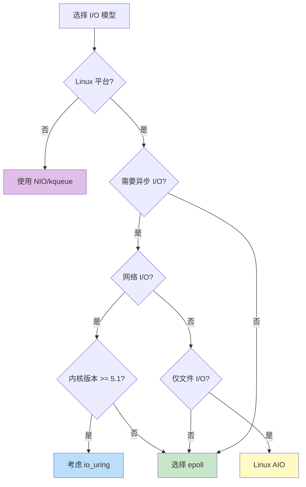

**核心结论**：虽然AIO理论最优，但Linux AIO对网络I/O支持不完善，epoll在实际工程中性能足够好且生态成熟，是当前最优选择。

**1. Linux AIO的历史局限性**：

| 问题 | 说明 |
|------|------|
| 仅支持直接I/O | Linux原生AIO（`io_submit`/`io_getevents`）只支持`O_DIRECT`方式，绕过页缓存 |
| 网络I/O支持差 | 早期Linux AIO对Socket支持不完善，主要面向磁盘I/O |
| 内核版本依赖 | 完整支持需要较新内核，兼容性是个问题 |

**2. epoll已经足够高效**：

虽然AIO理论上最优，但epoll在实际场景中：
- **已能处理百万级连接**：C10K/C10M问题已解决
- **性能差距微乎其微**：数据拷贝阶段的时间相比网络延迟可忽略
- **成熟稳定**：经过20+年生产验证

**3. 编程复杂度对比**：

```
AIO编程模型：
aio_read() → 注册回调 → 处理完成事件 → 状态机管理 → 错误恢复

epoll编程模型：
epoll_wait() → 循环处理就绪事件 → 简单直观
```

AIO的回调模式导致状态管理复杂、错误处理困难、调试困难。

**4. 跨平台一致性**：

| 平台 | 异步I/O机制 |
|------|------------|
| Windows | IOCP（真正的异步I/O） |
| Linux | epoll（事实标准） |
| macOS/BSD | kqueue |

使用epoll + 非阻塞I/O可以保持跨平台代码一致性。

**5. 新趋势：io_uring**：

Linux 5.1+引入了**io_uring**，这是真正现代化的异步I/O：

| 特性 | io_uring | 传统AIO | epoll |
|------|----------|---------|-------|
| 网络I/O | ✅ 完善支持 | ❌ 支持差 | ✅ |
| 文件I/O | ✅ 完善支持 | ✅ 仅O_DIRECT | ❌ |
| 零拷贝 | ✅ | 部分 | ❌ |
| 性能 | 最高 | 中 | 高 |

**选择原因总结**：

| 原因 | 说明 |
|------|------|
| Linux AIO不完善 | 原生AIO对网络I/O支持差 |
| epoll足够好 | 性能已接近理论最优，成熟稳定 |
| 编程简单 | 事件驱动模型更易理解和调试 |
| 跨平台 | 统一编程模型 |
| 生态成熟 | Netty、Nginx等框架深度优化 |

> **一句话总结**：AIO理论最优，但Linux AIO实现不完善；epoll实际性能足够好且生态成熟，是工程上的最优选择。

---

## 9. 事件驱动模型

### 9.1 操作系统原理

**事件驱动模型**基于I/O多路复用，将I/O事件分发给对应的处理器：

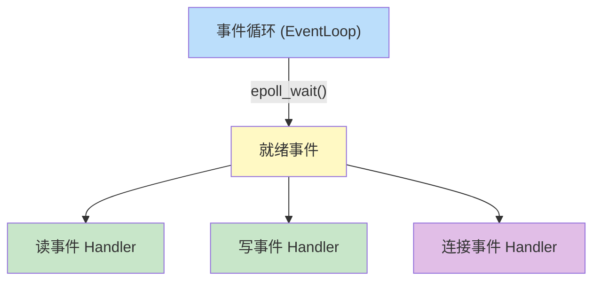

**核心结论**：事件驱动模型通过事件循环统一监控I/O事件，将不同类型的事件分发给对应的Handler处理，实现高效的非阻塞I/O。

**Netty事件模型**：基于ChannelPipeline的责任链模式处理事件。

---

## 10. 核心源码索引

### 10.1 关键源码文件

| 源码文件 | 功能 | 文档位置 |
|---------|------|---------|
| [NettyRemotingServer.java](../remoting/src/main/java/org/apache/rocketmq/remoting/netty/NettyRemotingServer.java) | Netty 服务端核心实现 | 5.1, 5.2, 5.4, 5.7, 5.8, 5.11 |
| [NettyServerConfig.java](../remoting/src/main/java/org/apache/rocketmq/remoting/netty/NettyServerConfig.java) | 服务端配置参数 | 5.3 |
| [NettySystemConfig.java](../remoting/src/main/java/org/apache/rocketmq/remoting/netty/NettySystemConfig.java) | 系统级配置参数 | 5.10 |
| [NettyEncoder.java](../remoting/src/main/java/org/apache/rocketmq/remoting/netty/NettyEncoder.java) | 消息编码器 | 5.6 |
| [NettyDecoder.java](../remoting/src/main/java/org/apache/rocketmq/remoting/netty/NettyDecoder.java) | 消息解码器 | 5.6 |
| [RemotingUtil.java](../remoting/src/main/java/org/apache/rocketmq/remoting/common/RemotingUtil.java) | 网络工具类 | 5.1 |

### 10.2 服务端配置参数

| 配置参数 | 默认值 | 源码位置 | 文档位置 |
|---------|--------|---------|---------|
| `bindAddress` | `"0.0.0.0"` | [NettyServerConfig.java:25](../remoting/src/main/java/org/apache/rocketmq/remoting/netty/NettyServerConfig.java#L25) | 5.3 |
| `listenPort` | `0` | [NettyServerConfig.java:26](../remoting/src/main/java/org/apache/rocketmq/remoting/netty/NettyServerConfig.java#L26) | 5.3 |
| `serverWorkerThreads` | `8` 个线程 | [NettyServerConfig.java:27](../remoting/src/main/java/org/apache/rocketmq/remoting/netty/NettyServerConfig.java#L27) | 5.3 |
| `serverSelectorThreads` | `3` 个线程 | [NettyServerConfig.java:29](../remoting/src/main/java/org/apache/rocketmq/remoting/netty/NettyServerConfig.java#L29) | 5.3 |
| `serverCallbackExecutorThreads` | `0` → 实际 `4` 个线程 | [NettyServerConfig.java:28](../remoting/src/main/java/org/apache/rocketmq/remoting/netty/NettyServerConfig.java#L28) | 5.3 |
| `serverOnewaySemaphoreValue` | `256` 个并发 | [NettyServerConfig.java:30](../remoting/src/main/java/org/apache/rocketmq/remoting/netty/NettyServerConfig.java#L30) | 5.3 |
| `serverAsyncSemaphoreValue` | `64` 个并发 | [NettyServerConfig.java:31](../remoting/src/main/java/org/apache/rocketmq/remoting/netty/NettyServerConfig.java#L31) | 5.3 |
| `serverChannelMaxIdleTimeSeconds` | `120` 秒 (2分钟) | [NettyServerConfig.java:32](../remoting/src/main/java/org/apache/rocketmq/remoting/netty/NettyServerConfig.java#L32) | 5.3 |
| `useEpollNativeSelector` | `false` | [NettyServerConfig.java:48](../remoting/src/main/java/org/apache/rocketmq/remoting/netty/NettyServerConfig.java#L48) | 5.3 |
| `serverPooledByteBufAllocatorEnable` | `true` | [NettyServerConfig.java:39](../remoting/src/main/java/org/apache/rocketmq/remoting/netty/NettyServerConfig.java#L39) | 5.3 |
| `serverSocketSndBufSize` | `0` 字节 (系统默认) | [NettyServerConfig.java:34](../remoting/src/main/java/org/apache/rocketmq/remoting/netty/NettyServerConfig.java#L34) | 5.3 |
| `serverSocketRcvBufSize` | `0` 字节 (系统默认) | [NettyServerConfig.java:35](../remoting/src/main/java/org/apache/rocketmq/remoting/netty/NettyServerConfig.java#L35) | 5.3 |
| `serverSocketBacklog` | `1024` 个连接 | [NettyServerConfig.java:38](../remoting/src/main/java/org/apache/rocketmq/remoting/netty/NettyServerConfig.java#L38) | 5.3 |
| `writeBufferLowWaterMark` | `0` 字节 (系统默认) | [NettyServerConfig.java:37](../remoting/src/main/java/org/apache/rocketmq/remoting/netty/NettyServerConfig.java#L37) | 5.3 |
| `writeBufferHighWaterMark` | `0` 字节 (系统默认) | [NettyServerConfig.java:36](../remoting/src/main/java/org/apache/rocketmq/remoting/netty/NettyServerConfig.java#L36) | 5.3 |

### 10.3 系统属性配置

| 系统属性 | 默认值 | 源码位置 | 文档位置 |
|---------|--------|---------|---------|
| `com.rocketmq.remoting.frameMaxLength` | `16777216` 字节 (16MB) | [NettyDecoder.java:31-32](../remoting/src/main/java/org/apache/rocketmq/remoting/netty/NettyDecoder.java#L31-L32) | 5.6 |
| `com.rocketmq.remoting.socket.sndbuf.size` | `0` (系统默认) | [NettySystemConfig.java:52-53](../remoting/src/main/java/org/apache/rocketmq/remoting/netty/NettySystemConfig.java#L52-L53) | 5.10 |
| `com.rocketmq.remoting.socket.rcvbuf.size` | `0` (系统默认) | [NettySystemConfig.java:54-55](../remoting/src/main/java/org/apache/rocketmq/remoting/netty/NettySystemConfig.java#L54-L55) | 5.10 |
| `com.rocketmq.remoting.socket.backlog` | `1024` 个连接 | [NettySystemConfig.java:56-57](../remoting/src/main/java/org/apache/rocketmq/remoting/netty/NettySystemConfig.java#L56-L57) | 5.10 |
| `com.rocketmq.remoting.clientAsyncSemaphoreValue` | `65535` 个并发 | [NettySystemConfig.java:48-49](../remoting/src/main/java/org/apache/rocketmq/remoting/netty/NettySystemConfig.java#L48-L49) | 5.10 |
| `com.rocketmq.remoting.clientOnewaySemaphoreValue` | `65535` 个并发 | [NettySystemConfig.java:50-51](../remoting/src/main/java/org/apache/rocketmq/remoting/netty/NettySystemConfig.java#L50-L51) | 5.10 |
| `com.rocketmq.remoting.client.worker.size` | `4` 个线程 | [NettySystemConfig.java:58-59](../remoting/src/main/java/org/apache/rocketmq/remoting/netty/NettySystemConfig.java#L58-L59) | 5.10 |
| `com.rocketmq.remoting.client.connect.timeout` | `3000` 毫秒 (3秒) | [NettySystemConfig.java:60-61](../remoting/src/main/java/org/apache/rocketmq/remoting/netty/NettySystemConfig.java#L60-L61) | 5.10 |
| `com.rocketmq.remoting.client.channel.maxIdleTimeSeconds` | `120` 秒 (2分钟) | [NettySystemConfig.java:62-63](../remoting/src/main/java/org/apache/rocketmq/remoting/netty/NettySystemConfig.java#L62-L63) | 5.10 |
| `com.rocketmq.remoting.client.closeSocketIfTimeout` | `true` | [NettySystemConfig.java:64-65](../remoting/src/main/java/org/apache/rocketmq/remoting/netty/NettySystemConfig.java#L64-L65) | 5.10 |
| `com.rocketmq.remoting.write.buffer.high.water.mark` | `0` 字节 (系统默认) | [NettySystemConfig.java:66-67](../remoting/src/main/java/org/apache/rocketmq/remoting/netty/NettySystemConfig.java#L66-L67) | 5.10 |
| `com.rocketmq.remoting.write.buffer.low.water.mark` | `0` 字节 (系统默认) | [NettySystemConfig.java:68-69](../remoting/src/main/java/org/apache/rocketmq/remoting/netty/NettySystemConfig.java#L68-L69) | 5.10 |

### 10.4 关键方法索引

| 方法名 | 功能 | 源码位置 | 文档位置 |
|--------|------|---------|---------|
| `useEpoll()` | 判断是否使用 epoll | [NettyRemotingServer.java:195-199](../remoting/src/main/java/org/apache/rocketmq/remoting/netty/NettyRemotingServer.java#L195-L199) | 5.1 |
| `buildEventLoopGroupSelector()` | 创建 Selector 线程组 | [NettyRemotingServer.java:119-141](../remoting/src/main/java/org/apache/rocketmq/remoting/netty/NettyRemotingServer.java#L119-L141) | 5.1 |
| `buildBossEventLoopGroup()` | 创建 Boss 线程组 | [NettyRemotingServer.java:143-163](../remoting/src/main/java/org/apache/rocketmq/remoting/netty/NettyRemotingServer.java#L143-L163) | 5.2 |
| `start()` | 启动服务器 | [NettyRemotingServer.java:202-272](../remoting/src/main/java/org/apache/rocketmq/remoting/netty/NettyRemotingServer.java#L202-L272) | 5.4 |
| `addCustomConfig()` | 添加自定义 TCP 配置 | [NettyRemotingServer.java:274-293](../remoting/src/main/java/org/apache/rocketmq/remoting/netty/NettyRemotingServer.java#L274-L293) | 5.4 |
| `channelRead0()` | 处理请求消息 | [NettyRemotingServer.java:472-481](../remoting/src/main/java/org/apache/rocketmq/remoting/netty/NettyRemotingServer.java#L472-L481) | 5.12.2 |
| `userEventTriggered()` | 处理空闲事件 | [NettyRemotingServer.java:523-538](../remoting/src/main/java/org/apache/rocketmq/remoting/netty/NettyRemotingServer.java#L523-L538) | 5.7 |
| `channelActive()` | 连接激活 | [NettyRemotingServer.java:501-509](../remoting/src/main/java/org/apache/rocketmq/remoting/netty/NettyRemotingServer.java#L501-L509) | 5.8 |
| `channelInactive()` | 连接断开 | [NettyRemotingServer.java:512-520](../remoting/src/main/java/org/apache/rocketmq/remoting/netty/NettyRemotingServer.java#L512-L520) | 5.8 |
| `exceptionCaught()` | 异常处理 | [NettyRemotingServer.java:541-551](../remoting/src/main/java/org/apache/rocketmq/remoting/netty/NettyRemotingServer.java#L541-L551) | 5.8 |
| `encode()` | 编码消息 | [NettyEncoder.java:34-49](../remoting/src/main/java/org/apache/rocketmq/remoting/netty/NettyEncoder.java#L34-L49) | 5.6 |
| `decode()` | 解码消息 | [NettyDecoder.java:39-57](../remoting/src/main/java/org/apache/rocketmq/remoting/netty/NettyDecoder.java#L39-L57) | 5.6 |
| `isLinuxPlatform()` | 判断是否为 Linux 平台 | [RemotingUtil.java:91-93](../remoting/src/main/java/org/apache/rocketmq/remoting/common/RemotingUtil.java#L91-L93) | 5.1 |
| `connect()` | 创建 Socket 连接（默认超时 5000 毫秒） | [RemotingUtil.java:186-217](../remoting/src/main/java/org/apache/rocketmq/remoting/common/RemotingUtil.java#L186-L217) | - |
| `closeChannel()` | 关闭 Channel | [RemotingUtil.java:219-232](../remoting/src/main/java/org/apache/rocketmq/remoting/common/RemotingUtil.java#L219-L232) | - |
| `newRemotingServer()` | 创建子服务器 | [NettyRemotingServer.java:354-363](../remoting/src/main/java/org/apache/rocketmq/remoting/netty/NettyRemotingServer.java#L354-L363) | 5.11 |
| `removeRemotingServer()` | 移除子服务器 | [NettyRemotingServer.java:366-368](../remoting/src/main/java/org/apache/rocketmq/remoting/netty/NettyRemotingServer.java#L366-L368) | 5.11 |
| `channelRegistered()` | Channel 注册事件 | [NettyRemotingServer.java:487-491](../remoting/src/main/java/org/apache/rocketmq/remoting/netty/NettyRemotingServer.java#L487-L491) | 5.8 |
| `channelUnregistered()` | Channel 注销事件 | [NettyRemotingServer.java:494-498](../remoting/src/main/java/org/apache/rocketmq/remoting/netty/NettyRemotingServer.java#L494-L498) | 5.8 |
