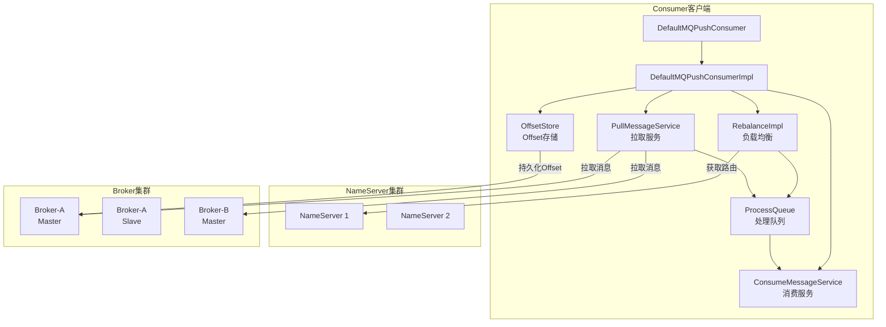
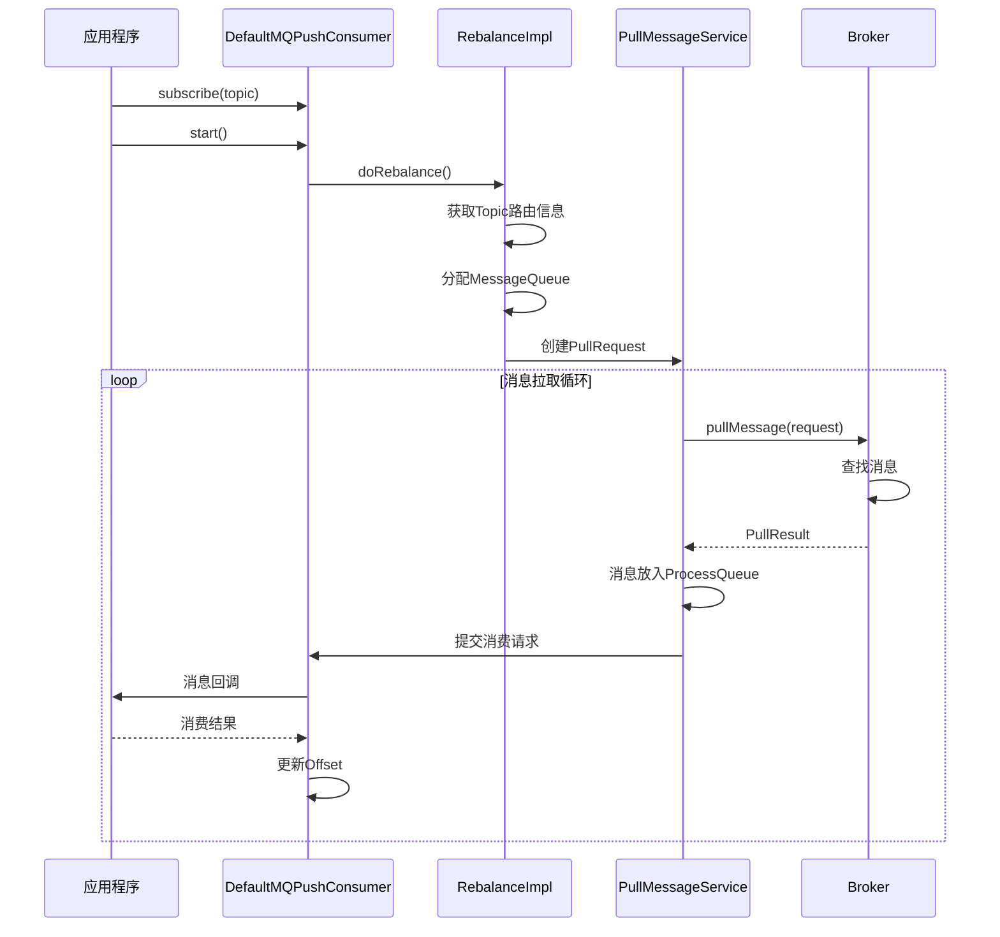
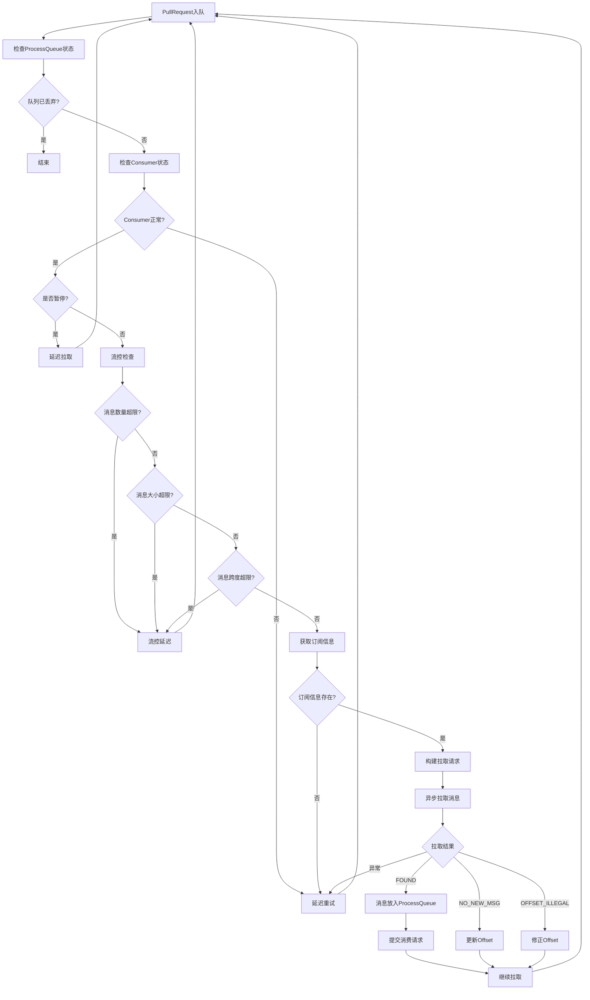
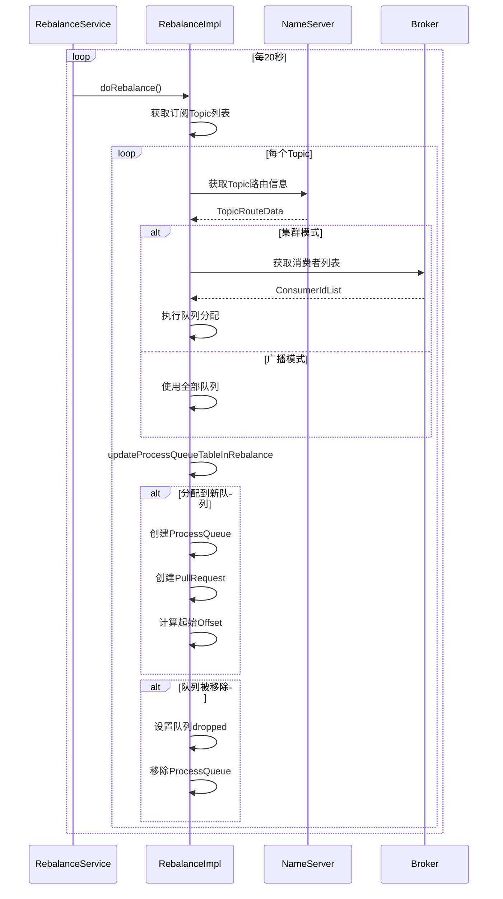
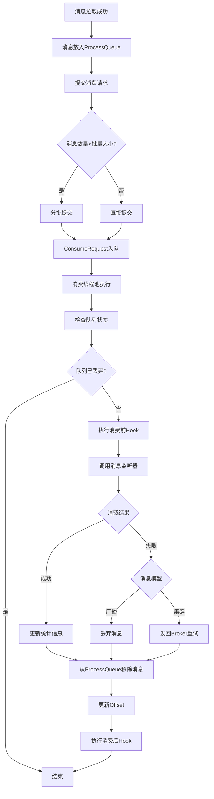
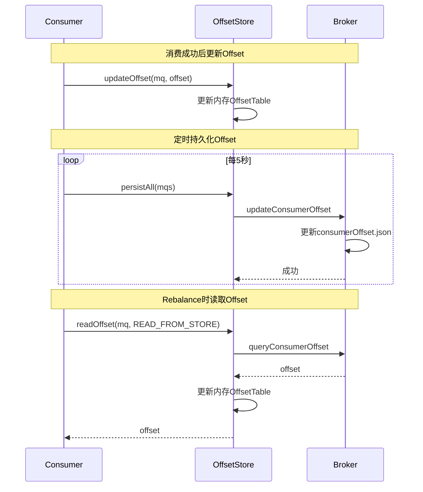
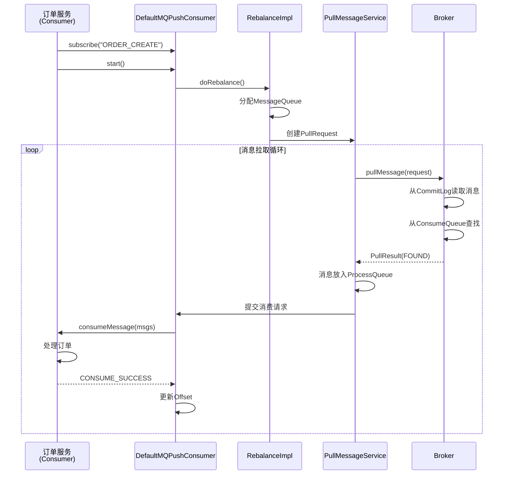

# RocketMQ 5.0.0 源码解读 - 消息消费流程

> **文档版本**: v1.0  
> **生成时间**: 2026-02-19  
> **RocketMQ版本**: 5.0.0  
> **源码覆盖范围**: client/consumer/DefaultMQPushConsumer.java、client/impl/consumer/DefaultMQPushConsumerImpl.java、client/impl/consumer/RebalanceImpl.java、client/impl/consumer/ConsumeMessageConcurrentlyService.java、client/impl/consumer/ProcessQueue.java、client/impl/consumer/PullMessageService.java、client/consumer/store/RemoteBrokerOffsetStore.java、broker/processor/PullMessageProcessor.java

---

## 一、模块定位与职责

### 1.1 模块定位

本文档是 RocketMQ 5.0.0 源码解读的**核心模块**，负责讲解消息消费流程的设计与实现。消息消费是 Consumer 的核心功能，涉及负载均衡(Rebalance)、消息拉取、消息消费、Offset管理等关键流程。

### 1.2 核心职责

| 职责项 | 说明 | 核心类 |
|--------|------|--------|
| 消费者入口 | 提供Push/Pull消费模式API | [DefaultMQPushConsumer.java](client/src/main/java/org/apache/rocketmq/client/consumer/DefaultMQPushConsumer.java) |
| 消费核心实现 | 消息拉取、消费调度、Offset管理 | [DefaultMQPushConsumerImpl.java](client/src/main/java/org/apache/rocketmq/client/impl/consumer/DefaultMQPushConsumerImpl.java) |
| 负载均衡 | 队列分配、Rebalance机制 | [RebalanceImpl.java](client/src/main/java/org/apache/rocketmq/client/impl/consumer/RebalanceImpl.java) |
| 消息消费服务 | 并发/顺序消费线程池 | [ConsumeMessageConcurrentlyService.java](client/src/main/java/org/apache/rocketmq/client/impl/consumer/ConsumeMessageConcurrentlyService.java) |
| 消息处理队列 | 本地消息缓存与消费状态管理 | [ProcessQueue.java](client/src/main/java/org/apache/rocketmq/client/impl/consumer/ProcessQueue.java) |
| 拉取服务 | 消息拉取请求调度 | [PullMessageService.java](client/src/main/java/org/apache/rocketmq/client/impl/consumer/PullMessageService.java) |
| Offset存储 | 消费进度持久化 | [RemoteBrokerOffsetStore.java](client/src/main/java/org/apache/rocketmq/client/consumer/store/RemoteBrokerOffsetStore.java) |
| Broker拉取处理 | 服务端消息拉取处理 | [PullMessageProcessor.java](broker/src/main/java/org/apache/rocketmq/broker/processor/PullMessageProcessor.java) |

### 1.3 模块划分准则符合性

- **高内聚**: 聚焦消息消费全流程，从Consumer到Broker完整覆盖
- **低耦合**: 通过接口与存储层、网络层交互，消费逻辑独立
- **数量足够小**: 单一文档覆盖消费流程核心，不拆分过细

---

## 二、消费架构设计

### 2.1 消费架构概览

RocketMQ 消息消费采用**Consumer → NameServer → Broker**三层架构，支持Push和Pull两种消费模式：



### 2.2 消费模式对比

| 消费模式 | 特点 | 适用场景 | 实现方式 |
|----------|------|----------|----------|
| Push模式 | Broker主动推送，实时性高 | 实时消息处理 | 长轮询+回调 |
| Pull模式 | Consumer主动拉取，可控性强 | 批量处理、流控 | 定时拉取 |
| Pop模式 | 5.0新增，简化消费逻辑 | 简化消费模型 | 类似Push |

### 2.3 消息模型对比

| 消息模型 | 特点 | Offset存储 | 消费方式 |
|----------|------|------------|----------|
| 集群消费(Clustering) | 同组消费者分摊消息 | Broker端存储 | 负载均衡 |
| 广播消费(Broadcasting) | 同组消费者都消费全量消息 | 本地存储 | 全量消费 |

### 2.4 消费流程概览



---

## 三、Consumer 核心源码解析

### 3.1 DefaultMQPushConsumer 结构

DefaultMQPushConsumer 是 Consumer 的**门面类**，提供简洁的API供应用使用。

```java
// 文件路径: client/src/main/java/org/apache/rocketmq/client/consumer/DefaultMQPushConsumer.java

public class DefaultMQPushConsumer extends ClientConfig implements MQPushConsumer {
    
    // 核心实现类
    protected final transient DefaultMQPushConsumerImpl defaultMQPushConsumerImpl;
    
    // 消费者组名
    private String consumerGroup;
    
    // 消息模型：集群消费/广播消费
    private MessageModel messageModel = MessageModel.CLUSTERING;
    
    // 消费起始位置
    private ConsumeFromWhere consumeFromWhere = ConsumeFromWhere.CONSUME_FROM_LAST_OFFSET;
    
    // 消费时间点（CONSUME_FROM_TIMESTAMP时使用）
    private String consumeTimestamp = UtilAll.timeMillisToHumanString3(System.currentTimeMillis() - (1000 * 60 * 30));
    
    // 队列分配策略
    private AllocateMessageQueueStrategy allocateMessageQueueStrategy;
    
    // 订阅关系
    private Map<String /* topic */, String /* sub expression */> subscription = new HashMap<String, String>();
    
    // 消息监听器
    private MessageListener messageListener;
    
    // Offset存储
    private OffsetStore offsetStore;
    
    // 最小消费线程数
    private int consumeThreadMin = 20;
    
    // 最大消费线程数
    private int consumeThreadMax = 20;
    
    // 并发消费最大跨度
    private int consumeConcurrentlyMaxSpan = 2000;
    
    // 队列级别流控阈值：消息数量
    private int pullThresholdForQueue = 1000;
    
    // 队列级别流控阈值：消息大小（MB）
    private int pullThresholdSizeForQueue = 100;
    
    // 拉取批量大小
    private int pullBatchSize = 32;
    
    // 消费批量大小
    private int consumeMessageBatchMaxSize = 1;
    
    // 最大重试次数
    private int maxReconsumeTimes = -1;
    
    // 消费超时时间（分钟）
    private long consumeTimeout = 15;
}
```

### 3.2 消费启动流程

```java
// 文件路径: client/src/main/java/org/apache/rocketmq/client/consumer/DefaultMQPushConsumer.java

@Override
public void start() throws MQClientException {
    this.setConsumerGroup(NamespaceUtil.wrapNamespace(this.getNamespace(), this.consumerGroup));
    this.defaultMQPushConsumerImpl.start();
    if (null != traceDispatcher) {
        try {
            traceDispatcher.start(this.getNamesrvAddr(), this.getAccessChannel());
        } catch (MQClientException e) {
            log.warn("trace dispatcher start failed.", e);
        }
    }
}

@Override
public void subscribe(String topic, String subExpression) throws MQClientException {
    this.defaultMQPushConsumerImpl.subscribe(withNamespace(topic), subExpression);
}

@Override
public void registerMessageListener(MessageListenerConcurrently messageListener) {
    this.messageListener = messageListener;
    this.defaultMQPushConsumerImpl.registerMessageListener(messageListener);
}
```

---

## 四、消费核心实现源码解析

### 4.1 DefaultMQPushConsumerImpl 结构

```java
// 文件路径: client/src/main/java/org/apache/rocketmq/client/impl/consumer/DefaultMQPushConsumerImpl.java

public class DefaultMQPushConsumerImpl implements MQConsumerInner {
    
    // 异常时拉取延迟
    private long pullTimeDelayMillsWhenException = 3000;
    
    // 流控延迟
    private static final long PULL_TIME_DELAY_MILLS_WHEN_FLOW_CONTROL = 50;
    
    // 暂停时拉取延迟
    private static final long PULL_TIME_DELAY_MILLS_WHEN_SUSPEND = 1000;
    
    // 日志
    private final InternalLogger log = ClientLogger.getLog();
    
    // Consumer配置
    private final DefaultMQPushConsumer defaultMQPushConsumer;
    
    // Rebalance实现
    private final RebalanceImpl rebalanceImpl = new RebalancePushImpl(this);
    
    // 消息过滤Hook
    private final ArrayList<FilterMessageHook> filterMessageHookList = new ArrayList<FilterMessageHook>();
    
    // 消费Hook
    private final ArrayList<ConsumeMessageHook> consumeMessageHookList = new ArrayList<ConsumeMessageHook>();
    
    // MQClient实例
    private MQClientInstance mQClientFactory;
    
    // 拉取API包装器
    private PullAPIWrapper pullAPIWrapper;
    
    // 是否暂停
    private volatile boolean pause = false;
    
    // 是否顺序消费
    private boolean consumeOrderly = false;
    
    // 消息监听器
    private MessageListener messageListenerInner;
    
    // Offset存储
    private OffsetStore offsetStore;
    
    // 消息消费服务
    private ConsumeMessageService consumeMessageService;
}
```

### 4.2 消息拉取核心流程

```java
// 文件路径: client/src/main/java/org/apache/rocketmq/client/impl/consumer/DefaultMQPushConsumerImpl.java

public void pullMessage(final PullRequest pullRequest) {
    final ProcessQueue processQueue = pullRequest.getProcessQueue();
    if (processQueue.isDropped()) {
        log.info("the pull request[{}] is dropped.", pullRequest.toString());
        return;
    }
    
    // 1. 更新最后拉取时间
    pullRequest.getProcessQueue().setLastPullTimestamp(System.currentTimeMillis());
    
    // 2. 检查Consumer状态
    try {
        this.makeSureStateOK();
    } catch (MQClientException e) {
        log.warn("pullMessage exception, consumer state not ok", e);
        this.executePullRequestLater(pullRequest, pullTimeDelayMillsWhenException);
        return;
    }
    
    // 3. 检查是否暂停
    if (this.isPause()) {
        log.warn("consumer was paused, execute pull request later.");
        this.executePullRequestLater(pullRequest, PULL_TIME_DELAY_MILLS_WHEN_SUSPEND);
        return;
    }
    
    // 4. 流控检查：消息数量
    long cachedMessageCount = processQueue.getMsgCount().get();
    long cachedMessageSizeInMiB = processQueue.getMsgSize().get() / (1024 * 1024);
    
    if (cachedMessageCount > this.defaultMQPushConsumer.getPullThresholdForQueue()) {
        this.executePullRequestLater(pullRequest, PULL_TIME_DELAY_MILLS_WHEN_FLOW_CONTROL);
        return;
    }
    
    // 5. 流控检查：消息大小
    if (cachedMessageSizeInMiB > this.defaultMQPushConsumer.getPullThresholdSizeForQueue()) {
        this.executePullRequestLater(pullRequest, PULL_TIME_DELAY_MILLS_WHEN_FLOW_CONTROL);
        return;
    }
    
    // 6. 流控检查：消息跨度
    if (!this.consumeOrderly) {
        if (processQueue.getMaxSpan() > this.defaultMQPushConsumer.getConsumeConcurrentlyMaxSpan()) {
            this.executePullRequestLater(pullRequest, PULL_TIME_DELAY_MILLS_WHEN_FLOW_CONTROL);
            return;
        }
    } else {
        // 顺序消费需要锁定队列
        if (processQueue.isLocked()) {
            // 计算拉取偏移量
            if (!pullRequest.isPreviouslyLocked()) {
                long offset = this.rebalanceImpl.computePullFromWhereWithException(pullRequest.getMessageQueue());
                pullRequest.setPreviouslyLocked(true);
                pullRequest.setNextOffset(offset);
            }
        } else {
            this.executePullRequestLater(pullRequest, pullTimeDelayMillsWhenException);
            return;
        }
    }
    
    // 7. 获取订阅信息
    final SubscriptionData subscriptionData = this.rebalanceImpl.getSubscriptionInner()
        .get(pullRequest.getMessageQueue().getTopic());
    if (null == subscriptionData) {
        this.executePullRequestLater(pullRequest, pullTimeDelayMillsWhenException);
        return;
    }
    
    // 8. 构建拉取回调
    PullCallback pullCallback = new PullCallback() {
        @Override
        public void onSuccess(PullResult pullResult) {
            if (pullResult != null) {
                pullResult = DefaultMQPushConsumerImpl.this.pullAPIWrapper.processPullResult(
                    pullRequest.getMessageQueue(), pullResult, subscriptionData);
                
                switch (pullResult.getPullStatus()) {
                    case FOUND:
                        // 更新下次拉取偏移量
                        pullRequest.setNextOffset(pullResult.getNextBeginOffset());
                        
                        if (pullResult.getMsgFoundList() == null || pullResult.getMsgFoundList().isEmpty()) {
                            // 没有消息，立即继续拉取
                            DefaultMQPushConsumerImpl.this.executePullRequestImmediately(pullRequest);
                        } else {
                            // 消息放入处理队列
                            boolean dispatchToConsume = processQueue.putMessage(pullResult.getMsgFoundList());
                            
                            // 提交消费请求
                            DefaultMQPushConsumerImpl.this.consumeMessageService.submitConsumeRequest(
                                pullResult.getMsgFoundList(),
                                processQueue,
                                pullRequest.getMessageQueue(),
                                dispatchToConsume);
                            
                            // 继续拉取
                            DefaultMQPushConsumerImpl.this.executePullRequestImmediately(pullRequest);
                        }
                        break;
                        
                    case NO_NEW_MSG:
                    case NO_MATCHED_MSG:
                        pullRequest.setNextOffset(pullResult.getNextBeginOffset());
                        DefaultMQPushConsumerImpl.this.executePullRequestImmediately(pullRequest);
                        break;
                        
                    case OFFSET_ILLEGAL:
                        log.warn("the pull request offset illegal, {} {}", pullRequest.toString(), pullResult.toString());
                        pullRequest.setNextOffset(pullResult.getNextBeginOffset());
                        DefaultMQPushConsumerImpl.this.executePullRequestImmediately(pullRequest);
                        break;
                }
            }
        }
        
        @Override
        public void onException(Throwable e) {
            log.warn("pullMessage exception", e);
            DefaultMQPushConsumerImpl.this.executePullRequestLater(pullRequest, pullTimeDelayMillsWhenException);
        }
    };
    
    // 9. 执行拉取
    this.pullAPIWrapper.pullKernelImpl(
        pullRequest.getMessageQueue(),
        subExpression,
        subscriptionData.getExpressionType(),
        pullRequest.getNextOffset(),
        this.defaultMQPushConsumer.getPullBatchSize(),
        sysFlag,
        commitOffsetValue,
        this.defaultMQPushConsumer.getBrokerSuspendMaxTimeMillis(),
        timeoutMillis,
        CommunicationMode.ASYNC,
        pullCallback);
}
```

### 4.3 消息拉取流程图



---

## 五、Rebalance 负载均衡源码解析

### 5.1 RebalanceImpl 结构

```java
// 文件路径: client/src/main/java/org/apache/rocketmq/client/impl/consumer/RebalanceImpl.java

public abstract class RebalanceImpl {
    
    // ProcessQueue表：MessageQueue -> ProcessQueue
    protected final ConcurrentMap<MessageQueue, ProcessQueue> processQueueTable = 
        new ConcurrentHashMap<MessageQueue, ProcessQueue>(64);
    
    // Pop ProcessQueue表
    protected final ConcurrentMap<MessageQueue, PopProcessQueue> popProcessQueueTable = 
        new ConcurrentHashMap<MessageQueue, PopProcessQueue>(64);
    
    // Topic订阅信息表
    protected final ConcurrentMap<String/* topic */, Set<MessageQueue>> topicSubscribeInfoTable =
        new ConcurrentHashMap<String, Set<MessageQueue>>();
    
    // 订阅数据表
    protected final ConcurrentMap<String /* topic */, SubscriptionData> subscriptionInner =
        new ConcurrentHashMap<String, SubscriptionData>();
    
    // 消费者组
    protected String consumerGroup;
    
    // 消息模型
    protected MessageModel messageModel;
    
    // 队列分配策略
    protected AllocateMessageQueueStrategy allocateMessageQueueStrategy;
    
    // MQClient实例
    protected MQClientInstance mQClientFactory;
}
```

### 5.2 Rebalance 核心流程

```java
// 文件路径: client/src/main/java/org/apache/rocketmq/client/impl/consumer/RebalanceImpl.java

public boolean doRebalance(final boolean isOrder) {
    boolean balanced = true;
    Map<String, SubscriptionData> subTable = this.getSubscriptionInner();
    
    if (subTable != null) {
        for (final Map.Entry<String, SubscriptionData> entry : subTable.entrySet()) {
            final String topic = entry.getKey();
            try {
                // 判断使用客户端Rebalance还是Broker端Rebalance
                if (!clientRebalance(topic) && tryQueryAssignment(topic)) {
                    balanced = this.getRebalanceResultFromBroker(topic, isOrder);
                } else {
                    balanced = this.rebalanceByTopic(topic, isOrder);
                }
            } catch (Throwable e) {
                if (!topic.startsWith(MixAll.RETRY_GROUP_TOPIC_PREFIX)) {
                    log.warn("rebalance Exception", e);
                    balanced = false;
                }
            }
        }
    }
    
    // 清理不属于当前Topic的队列
    this.truncateMessageQueueNotMyTopic();
    
    return balanced;
}

private boolean rebalanceByTopic(final String topic, final boolean isOrder) {
    boolean balanced = true;
    
    switch (messageModel) {
        case BROADCASTING: {
            // 广播模式：所有消费者都消费全量队列
            Set<MessageQueue> mqSet = this.topicSubscribeInfoTable.get(topic);
            if (mqSet != null) {
                boolean changed = this.updateProcessQueueTableInRebalance(topic, mqSet, isOrder);
                if (changed) {
                    this.messageQueueChanged(topic, mqSet, mqSet);
                }
                balanced = mqSet.equals(getWorkingMessageQueue(topic));
            }
            break;
        }
        
        case CLUSTERING: {
            // 集群模式：队列在消费者之间分配
            Set<MessageQueue> mqSet = this.topicSubscribeInfoTable.get(topic);
            List<String> cidAll = this.mQClientFactory.findConsumerIdList(topic, consumerGroup);
            
            if (mqSet != null && cidAll != null) {
                List<MessageQueue> mqAll = new ArrayList<MessageQueue>();
                mqAll.addAll(mqSet);
                
                // 排序保证分配一致性
                Collections.sort(mqAll);
                Collections.sort(cidAll);
                
                // 执行队列分配
                AllocateMessageQueueStrategy strategy = this.allocateMessageQueueStrategy;
                List<MessageQueue> allocateResult = strategy.allocate(
                    this.consumerGroup,
                    this.mQClientFactory.getClientId(),
                    mqAll,
                    cidAll);
                
                Set<MessageQueue> allocateResultSet = new HashSet<MessageQueue>();
                if (allocateResult != null) {
                    allocateResultSet.addAll(allocateResult);
                }
                
                // 更新ProcessQueue表
                boolean changed = this.updateProcessQueueTableInRebalance(topic, allocateResultSet, isOrder);
                if (changed) {
                    log.info(
                        "client rebalanced result changed. strategyName={}, group={}, topic={}, clientId={}, mqAllSize={}, cidAllSize={}, rebalanceResultSize={}",
                        strategy.getName(), consumerGroup, topic, this.mQClientFactory.getClientId(), 
                        mqSet.size(), cidAll.size(), allocateResultSet.size());
                    this.messageQueueChanged(topic, mqSet, allocateResultSet);
                }
                
                balanced = allocateResultSet.equals(getWorkingMessageQueue(topic));
            }
            break;
        }
        
        default:
            break;
    }
    
    return balanced;
}
```

### 5.3 队列分配策略

```java
// 文件路径: client/src/main/java/org/apache/rocketmq/client/consumer/rebalance/AllocateMessageQueueAveragely.java

public class AllocateMessageQueueAveragely implements AllocateMessageQueueStrategy {
    
    @Override
    public List<MessageQueue> allocate(String consumerGroup, String currentCID, 
        List<MessageQueue> mqAll, List<String> cidAll) {
        
        List<MessageQueue> result = new ArrayList<MessageQueue>();
        
        // 计算当前消费者在列表中的索引
        int currentIndex = cidAll.indexOf(currentCID);
        if (currentIndex < 0) {
            return result;
        }
        
        // 计算平均分配
        int mod = mqAll.size() % cidAll.size();
        int averageSize = mqAll.size() <= cidAll.size() ? 1 : 
            (mod > 0 && currentIndex < mod ? mqAll.size() / cidAll.size() + 1 : mqAll.size() / cidAll.size());
        
        int startIndex = (mod > 0 && currentIndex < mod) ? currentIndex * averageSize : 
            currentIndex * averageSize + mod;
        
        int range = Math.min(averageSize, mqAll.size() - startIndex);
        
        for (int i = 0; i < range; i++) {
            result.add(mqAll.get(startIndex + i));
        }
        
        return result;
    }
    
    @Override
    public String getName() {
        return "AVG";
    }
}
```

### 5.4 Rebalance 流程图



---

## 六、消息消费服务源码解析

### 6.1 ConsumeMessageConcurrentlyService 结构

```java
// 文件路径: client/src/main/java/org/apache/rocketmq/client/impl/consumer/ConsumeMessageConcurrentlyService.java

public class ConsumeMessageConcurrentlyService implements ConsumeMessageService {
    
    private static final InternalLogger log = ClientLogger.getLog();
    
    // Consumer实现
    private final DefaultMQPushConsumerImpl defaultMQPushConsumerImpl;
    
    // Consumer配置
    private final DefaultMQPushConsumer defaultMQPushConsumer;
    
    // 消息监听器
    private final MessageListenerConcurrently messageListener;
    
    // 消费请求队列
    private final BlockingQueue<Runnable> consumeRequestQueue;
    
    // 消费线程池
    private final ThreadPoolExecutor consumeExecutor;
    
    // 消费者组
    private final String consumerGroup;
    
    // 定时调度器
    private final ScheduledExecutorService scheduledExecutorService;
    
    // 过期消息清理调度器
    private final ScheduledExecutorService cleanExpireMsgExecutors;
    
    public ConsumeMessageConcurrentlyService(DefaultMQPushConsumerImpl defaultMQPushConsumerImpl,
        MessageListenerConcurrently messageListener) {
        this.defaultMQPushConsumerImpl = defaultMQPushConsumerImpl;
        this.messageListener = messageListener;
        this.defaultMQPushConsumer = this.defaultMQPushConsumerImpl.getDefaultMQPushConsumer();
        this.consumerGroup = this.defaultMQPushConsumer.getConsumerGroup();
        
        // 初始化消费请求队列
        this.consumeRequestQueue = new LinkedBlockingQueue<Runnable>();
        
        // 初始化消费线程池
        this.consumeExecutor = new ThreadPoolExecutor(
            this.defaultMQPushConsumer.getConsumeThreadMin(),
            this.defaultMQPushConsumer.getConsumeThreadMax(),
            1000 * 60,
            TimeUnit.MILLISECONDS,
            this.consumeRequestQueue,
            new ThreadFactoryImpl("ConsumeMessageThread_" + consumerGroup + "_"));
        
        this.scheduledExecutorService = Executors.newSingleThreadScheduledExecutor(
            new ThreadFactoryImpl("ConsumeMessageScheduledThread_"));
        this.cleanExpireMsgExecutors = Executors.newSingleThreadScheduledExecutor(
            new ThreadFactoryImpl("CleanExpireMsgScheduledThread_"));
    }
}
```

### 6.2 消费请求提交

```java
// 文件路径: client/src/main/java/org/apache/rocketmq/client/impl/consumer/ConsumeMessageConcurrentlyService.java

@Override
public void submitConsumeRequest(
    final List<MessageExt> msgs,
    final ProcessQueue processQueue,
    final MessageQueue messageQueue,
    final boolean dispatchToConsume) {
    
    final int consumeBatchSize = this.defaultMQPushConsumer.getConsumeMessageBatchMaxSize();
    
    if (msgs.size() <= consumeBatchSize) {
        // 消息数量不超过批量大小，直接提交
        ConsumeRequest consumeRequest = new ConsumeRequest(msgs, processQueue, messageQueue);
        try {
            this.consumeExecutor.submit(consumeRequest);
        } catch (RejectedExecutionException e) {
            this.submitConsumeRequestLater(consumeRequest);
        }
    } else {
        // 消息数量超过批量大小，分批提交
        for (int total = 0; total < msgs.size(); ) {
            List<MessageExt> msgThis = new ArrayList<MessageExt>(consumeBatchSize);
            for (int i = 0; i < consumeBatchSize && total < msgs.size(); i++, total++) {
                msgThis.add(msgs.get(total));
            }
            
            ConsumeRequest consumeRequest = new ConsumeRequest(msgThis, processQueue, messageQueue);
            try {
                this.consumeExecutor.submit(consumeRequest);
            } catch (RejectedExecutionException e) {
                this.submitConsumeRequestLater(consumeRequest);
            }
        }
    }
}
```

### 6.3 消费请求执行

```java
// 文件路径: client/src/main/java/org/apache/rocketmq/client/impl/consumer/ConsumeMessageConcurrentlyService.java

class ConsumeRequest implements Runnable {
    private final List<MessageExt> msgs;
    private final ProcessQueue processQueue;
    private final MessageQueue messageQueue;
    
    @Override
    public void run() {
        // 1. 检查队列是否已丢弃
        if (this.processQueue.isDropped()) {
            log.info("the message queue not be able to consume, because it's dropped.");
            return;
        }
        
        MessageListenerConcurrently listener = ConsumeMessageConcurrentlyService.this.messageListener;
        ConsumeConcurrentlyContext context = new ConsumeConcurrentlyContext(messageQueue);
        ConsumeConcurrentlyStatus status = null;
        
        // 2. 重置重试Topic和Namespace
        defaultMQPushConsumerImpl.resetRetryAndNamespace(msgs, defaultMQPushConsumer.getConsumerGroup());
        
        // 3. 执行消费前Hook
        ConsumeMessageContext consumeMessageContext = null;
        if (ConsumeMessageConcurrentlyService.this.defaultMQPushConsumerImpl.hasHook()) {
            consumeMessageContext = new ConsumeMessageContext();
            consumeMessageContext.setConsumerGroup(defaultMQPushConsumer.getConsumerGroup());
            consumeMessageContext.setMq(messageQueue);
            consumeMessageContext.setMsgList(msgs);
            ConsumeMessageConcurrentlyService.this.defaultMQPushConsumerImpl.executeHookBefore(consumeMessageContext);
        }
        
        long beginTimestamp = System.currentTimeMillis();
        boolean hasException = false;
        ConsumeReturnType returnType = ConsumeReturnType.CONSUME_SUCCESS;
        
        try {
            // 4. 设置消费开始时间
            for (MessageExt msg : msgs) {
                MessageAccessor.setConsumeStartTimeStamp(msg, String.valueOf(System.currentTimeMillis()));
            }
            
            // 5. 执行消费
            status = listener.consumeMessage(Collections.unmodifiableList(msgs), context);
            
            if (status == null) {
                throw new MQClientException("consumeMessage return null", null);
            }
            
            // 6. 处理消费结果
            if (status == ConsumeConcurrentlyStatus.RECONSUME_LATER) {
                returnType = ConsumeReturnType.RECONSUME_LATER;
            }
            
        } catch (Throwable e) {
            log.warn("consumeMessage exception: {} Group: {} Msgs: {} MQ: {}",
                RemotingHelper.exceptionSimpleDesc(e),
                ConsumeMessageConcurrentlyService.this.consumerGroup,
                msgs,
                messageQueue);
            hasException = true;
            returnType = ConsumeReturnType.EXCEPTION;
        }
        
        // 7. 执行消费后Hook
        if (ConsumeMessageConcurrentlyService.this.defaultMQPushConsumerImpl.hasHook()) {
            consumeMessageContext.setSuccess(!hasException);
            consumeMessageContext.setStatus(status.toString());
            consumeMessageContext.setConsumeRT(System.currentTimeMillis() - beginTimestamp);
            ConsumeMessageConcurrentlyService.this.defaultMQPushConsumerImpl.executeHookAfter(consumeMessageContext);
        }
        
        // 8. 处理消费结果
        ConsumeMessageConcurrentlyService.this.processConsumeResult(status, context, this);
    }
}
```

### 6.4 消费结果处理

```java
// 文件路径: client/src/main/java/org/apache/rocketmq/client/impl/consumer/ConsumeMessageConcurrentlyService.java

public void processConsumeResult(
    final ConsumeConcurrentlyStatus status,
    final ConsumeConcurrentlyContext context,
    final ConsumeRequest consumeRequest) {
    
    int ackIndex = context.getAckIndex();
    
    if (consumeRequest.getMsgs().isEmpty()) {
        return;
    }
    
    switch (status) {
        case CONSUME_SUCCESS:
            // 消费成功
            if (ackIndex >= consumeRequest.getMsgs().size()) {
                ackIndex = consumeRequest.getMsgs().size() - 1;
            }
            int ok = ackIndex + 1;
            int failed = consumeRequest.getMsgs().size() - ok;
            this.getConsumerStatsManager().incConsumeOKTPS(consumerGroup, consumeRequest.getMessageQueue().getTopic(), ok);
            this.getConsumerStatsManager().incConsumeFailedTPS(consumerGroup, consumeRequest.getMessageQueue().getTopic(), failed);
            break;
            
        case RECONSUME_LATER:
            // 消费失败，稍后重试
            ackIndex = -1;
            this.getConsumerStatsManager().incConsumeFailedTPS(consumerGroup, consumeRequest.getMessageQueue().getTopic(),
                consumeRequest.getMsgs().size());
            break;
            
        default:
            break;
    }
    
    // 根据消息模型处理失败消息
    switch (this.defaultMQPushConsumer.getMessageModel()) {
        case BROADCASTING:
            // 广播模式：失败消息直接丢弃
            for (int i = ackIndex + 1; i < consumeRequest.getMsgs().size(); i++) {
                MessageExt msg = consumeRequest.getMsgs().get(i);
                log.warn("BROADCASTING, the message consume failed, drop it, {}", msg.toString());
            }
            break;
            
        case CLUSTERING:
            // 集群模式：失败消息发回Broker重试
            List<MessageExt> msgBackFailed = new ArrayList<MessageExt>(consumeRequest.getMsgs().size());
            for (int i = ackIndex + 1; i < consumeRequest.getMsgs().size(); i++) {
                MessageExt msg = consumeRequest.getMsgs().get(i);
                boolean result = this.sendMessageBack(msg, context);
                if (!result) {
                    msg.setReconsumeTimes(msg.getReconsumeTimes() + 1);
                    msgBackFailed.add(msg);
                }
            }
            
            if (!msgBackFailed.isEmpty()) {
                // 发回失败的消息稍后重试
                consumeRequest.getMsgs().removeAll(msgBackFailed);
                this.submitConsumeRequestLater(msgBackFailed, consumeRequest.getProcessQueue(), consumeRequest.getMessageQueue());
            }
            break;
            
        default:
            break;
    }
    
    // 更新Offset
    long offset = consumeRequest.getProcessQueue().removeMessage(consumeRequest.getMsgs());
    if (offset >= 0 && !consumeRequest.getProcessQueue().isDropped()) {
        this.defaultMQPushConsumerImpl.getOffsetStore().updateOffset(consumeRequest.getMessageQueue(), offset, true);
    }
}
```

### 6.5 消费流程图



---

## 七、ProcessQueue 处理队列源码解析

### 7.1 ProcessQueue 结构

```java
// 文件路径: client/src/main/java/org/apache/rocketmq/client/impl/consumer/ProcessQueue.java

public class ProcessQueue {
    
    // Rebalance锁最大存活时间
    public final static long REBALANCE_LOCK_MAX_LIVE_TIME =
        Long.parseLong(System.getProperty("rocketmq.client.rebalance.lockMaxLiveTime", "30000"));
    
    // 拉取最大空闲时间
    private final static long PULL_MAX_IDLE_TIME = 
        Long.parseLong(System.getProperty("rocketmq.client.pull.pullMaxIdleTime", "120000"));
    
    // 日志
    private final InternalLogger log = ClientLogger.getLog();
    
    // 消息TreeMap：offset -> MessageExt
    private final ReadWriteLock treeMapLock = new ReentrantReadWriteLock();
    private final TreeMap<Long, MessageExt> msgTreeMap = new TreeMap<Long, MessageExt>();
    
    // 消息计数
    private final AtomicLong msgCount = new AtomicLong();
    
    // 消息大小
    private final AtomicLong msgSize = new AtomicLong();
    
    // 消费锁（顺序消费使用）
    private final Lock consumeLock = new ReentrantLock();
    
    // 顺序消费中的消息
    private final TreeMap<Long, MessageExt> consumingMsgOrderlyTreeMap = new TreeMap<Long, MessageExt>();
    
    // 最大队列偏移量
    private volatile long queueOffsetMax = 0L;
    
    // 是否已丢弃
    private volatile boolean dropped = false;
    
    // 最后拉取时间
    private volatile long lastPullTimestamp = System.currentTimeMillis();
    
    // 最后消费时间
    private volatile long lastConsumeTimestamp = System.currentTimeMillis();
    
    // 是否已锁定
    private volatile boolean locked = false;
    
    // 最后锁定时间
    private volatile long lastLockTimestamp = System.currentTimeMillis();
    
    // 是否正在消费
    private volatile boolean consuming = false;
    
    // 消息累积数量
    private volatile long msgAccCnt = 0;
}
```

### 7.2 消息添加与移除

```java
// 文件路径: client/src/main/java/org/apache/rocketmq/client/impl/consumer/ProcessQueue.java

// 添加消息
public boolean putMessage(final List<MessageExt> msgs) {
    boolean dispatchToConsume = false;
    try {
        this.treeMapLock.writeLock().lockInterruptibly();
        try {
            int validMsgCnt = 0;
            for (MessageExt msg : msgs) {
                // 按offset存储消息
                MessageExt old = msgTreeMap.put(msg.getQueueOffset(), msg);
                if (null == old) {
                    validMsgCnt++;
                    this.queueOffsetMax = msg.getQueueOffset();
                    msgSize.addAndGet(msg.getBody().length);
                }
            }
            msgCount.addAndGet(validMsgCnt);
            
            // 判断是否需要触发消费
            if (!msgTreeMap.isEmpty() && !this.consuming) {
                dispatchToConsume = true;
                this.consuming = true;
            }
            
            // 计算消息累积数量
            if (!msgs.isEmpty()) {
                MessageExt messageExt = msgs.get(msgs.size() - 1);
                String property = messageExt.getProperty(MessageConst.PROPERTY_MAX_OFFSET);
                if (property != null) {
                    long accTotal = Long.parseLong(property) - messageExt.getQueueOffset();
                    if (accTotal > 0) {
                        this.msgAccCnt = accTotal;
                    }
                }
            }
        } finally {
            this.treeMapLock.writeLock().unlock();
        }
    } catch (InterruptedException e) {
        log.error("putMessage exception", e);
    }
    
    return dispatchToConsume;
}

// 移除消息
public long removeMessage(final List<MessageExt> msgs) {
    long result = -1;
    final long now = System.currentTimeMillis();
    try {
        this.treeMapLock.writeLock().lockInterruptibly();
        this.lastConsumeTimestamp = now;
        try {
            if (!msgTreeMap.isEmpty()) {
                result = this.queueOffsetMax + 1;
                int removedCnt = 0;
                for (MessageExt msg : msgs) {
                    MessageExt prev = msgTreeMap.remove(msg.getQueueOffset());
                    if (prev != null) {
                        removedCnt--;
                        msgSize.addAndGet(0 - msg.getBody().length);
                    }
                }
                msgCount.addAndGet(removedCnt);
                
                // 返回最小offset
                if (!msgTreeMap.isEmpty()) {
                    result = msgTreeMap.firstKey();
                }
            }
        } finally {
            this.treeMapLock.writeLock().unlock();
        }
    } catch (Throwable t) {
        log.error("removeMessage exception", t);
    }
    
    return result;
}

// 获取消息跨度
public long getMaxSpan() {
    try {
        this.treeMapLock.readLock().lockInterruptibly();
        try {
            if (!this.msgTreeMap.isEmpty()) {
                return this.msgTreeMap.lastKey() - this.msgTreeMap.firstKey();
            }
        } finally {
            this.treeMapLock.readLock().unlock();
        }
    } catch (InterruptedException e) {
        log.error("getMaxSpan exception", e);
    }
    return 0;
}
```

---

## 八、Offset 管理源码解析

### 8.1 OffsetStore 接口

```java
// 文件路径: client/src/main/java/org/apache/rocketmq/client/consumer/store/OffsetStore.java

public interface OffsetStore {
    
    // 加载Offset
    void load() throws MQClientException;
    
    // 更新Offset
    void updateOffset(MessageQueue mq, long offset, boolean increaseOnly);
    
    // 读取Offset
    long readOffset(final MessageQueue mq, final ReadOffsetType type);
    
    // 持久化所有Offset
    void persistAll(Set<MessageQueue> mqs);
    
    // 持久化单个Offset
    void persist(MessageQueue mq);
    
    // 克隆Offset表
    Map<MessageQueue, Long> cloneOffsetTable(String topic);
    
    // 更新Offset到Broker
    void updateConsumeOffsetToBroker(MessageQueue mq, long offset, boolean isOneway) 
        throws RemotingException, MQBrokerException, InterruptedException, MQClientException;
}
```

### 8.2 RemoteBrokerOffsetStore 实现

```java
// 文件路径: client/src/main/java/org/apache/rocketmq/client/consumer/store/RemoteBrokerOffsetStore.java

public class RemoteBrokerOffsetStore implements OffsetStore {
    
    private final static InternalLogger log = ClientLogger.getLog();
    
    // MQClient实例
    private final MQClientInstance mQClientFactory;
    
    // 消费者组
    private final String groupName;
    
    // Offset表：MessageQueue -> AtomicLong
    private ConcurrentMap<MessageQueue, AtomicLong> offsetTable =
        new ConcurrentHashMap<MessageQueue, AtomicLong>();
    
    // 更新Offset
    @Override
    public void updateOffset(MessageQueue mq, long offset, boolean increaseOnly) {
        if (mq != null) {
            AtomicLong offsetOld = this.offsetTable.get(mq);
            if (null == offsetOld) {
                offsetOld = this.offsetTable.putIfAbsent(mq, new AtomicLong(offset));
            }
            
            if (null != offsetOld) {
                if (increaseOnly) {
                    // 只增不减
                    MixAll.compareAndIncreaseOnly(offsetOld, offset);
                } else {
                    offsetOld.set(offset);
                }
            }
        }
    }
    
    // 读取Offset
    @Override
    public long readOffset(final MessageQueue mq, final ReadOffsetType type) {
        if (mq != null) {
            switch (type) {
                case MEMORY_FIRST_THEN_STORE:
                case READ_FROM_MEMORY: {
                    // 先从内存读取
                    AtomicLong offset = this.offsetTable.get(mq);
                    if (offset != null) {
                        return offset.get();
                    } else if (ReadOffsetType.READ_FROM_MEMORY == type) {
                        return -1;
                    }
                }
                case READ_FROM_STORE: {
                    // 从Broker读取
                    try {
                        long brokerOffset = this.fetchConsumeOffsetFromBroker(mq);
                        AtomicLong offset = new AtomicLong(brokerOffset);
                        this.updateOffset(mq, offset.get(), false);
                        return brokerOffset;
                    } catch (OffsetNotFoundException e) {
                        return -1;
                    } catch (Exception e) {
                        log.warn("fetchConsumeOffsetFromBroker exception, " + mq, e);
                        return -2;
                    }
                }
                default:
                    break;
            }
        }
        return -3;
    }
    
    // 持久化Offset到Broker
    @Override
    public void updateConsumeOffsetToBroker(MessageQueue mq, long offset, boolean isOneway) 
        throws RemotingException, MQBrokerException, InterruptedException, MQClientException {
        
        FindBrokerResult findBrokerResult = this.mQClientFactory.findBrokerAddressInSubscribe(
            this.mQClientFactory.getBrokerNameFromMessageQueue(mq), MixAll.MASTER_ID, false);
        
        if (findBrokerResult != null) {
            UpdateConsumerOffsetRequestHeader requestHeader = new UpdateConsumerOffsetRequestHeader();
            requestHeader.setTopic(mq.getTopic());
            requestHeader.setConsumerGroup(this.groupName);
            requestHeader.setQueueId(mq.getQueueId());
            requestHeader.setCommitOffset(offset);
            requestHeader.setBname(mq.getBrokerName());
            
            if (isOneway) {
                this.mQClientFactory.getMQClientAPIImpl().updateConsumerOffsetOneway(
                    findBrokerResult.getBrokerAddr(), requestHeader, 1000 * 5);
            } else {
                this.mQClientFactory.getMQClientAPIImpl().updateConsumerOffset(
                    findBrokerResult.getBrokerAddr(), requestHeader, 1000 * 5);
            }
        } else {
            throw new MQClientException("The broker[" + mq.getBrokerName() + "] not exist", null);
        }
    }
}
```

### 8.3 Offset 管理流程



---

## 九、Broker 消息拉取处理源码解析

### 9.1 PullMessageProcessor 结构

```java
// 文件路径: broker/src/main/java/org/apache/rocketmq/broker/processor/PullMessageProcessor.java

public class PullMessageProcessor implements NettyRequestProcessor {
    
    private static final InternalLogger LOGGER = InternalLoggerFactory.getLogger(LoggerName.BROKER_LOGGER_NAME);
    
    // 消费Hook列表
    private List<ConsumeMessageHook> consumeMessageHookList;
    
    // 拉取结果处理器
    private PullMessageResultHandler pullMessageResultHandler;
    
    // Broker控制器
    private final BrokerController brokerController;
    
    @Override
    public RemotingCommand processRequest(final ChannelHandlerContext ctx, RemotingCommand request) 
        throws RemotingCommandException {
        return this.processRequest(ctx.channel(), request, true);
    }
    
    @Override
    public boolean rejectRequest() {
        // Slave节点不允许拉取（可配置）
        if (!this.brokerController.getBrokerConfig().isSlaveReadEnable()
            && this.brokerController.getMessageStoreConfig().getBrokerRole() == BrokerRole.SLAVE) {
            return true;
        }
        return false;
    }
}
```

### 9.2 消息拉取处理流程

```java
// 文件路径: broker/src/main/java/org/apache/rocketmq/broker/processor/PullMessageProcessor.java

private RemotingCommand processRequest(final Channel channel, RemotingCommand request, boolean brokerAllowSuspend)
    throws RemotingCommandException {
    
    RemotingCommand response = RemotingCommand.createResponseCommand(PullMessageResponseHeader.class);
    final PullMessageResponseHeader responseHeader = (PullMessageResponseHeader) response.readCustomHeader();
    final PullMessageRequestHeader requestHeader =
        (PullMessageRequestHeader) request.decodeCommandCustomHeader(PullMessageRequestHeader.class);
    
    // 1. 权限检查
    if (!PermName.isReadable(this.brokerController.getBrokerConfig().getBrokerPermission())) {
        response.setCode(ResponseCode.NO_PERMISSION);
        response.setRemark("the broker pulling message is forbidden");
        return response;
    }
    
    // 2. 订阅组检查
    SubscriptionGroupConfig subscriptionGroupConfig =
        this.brokerController.getSubscriptionGroupManager().findSubscriptionGroupConfig(requestHeader.getConsumerGroup());
    if (null == subscriptionGroupConfig) {
        response.setCode(ResponseCode.SUBSCRIPTION_GROUP_NOT_EXIST);
        return response;
    }
    
    if (!subscriptionGroupConfig.isConsumeEnable()) {
        response.setCode(ResponseCode.NO_PERMISSION);
        response.setRemark("subscription group no permission");
        return response;
    }
    
    // 3. Topic检查
    TopicConfig topicConfig = this.brokerController.getTopicConfigManager().selectTopicConfig(requestHeader.getTopic());
    if (null == topicConfig) {
        response.setCode(ResponseCode.TOPIC_NOT_EXIST);
        return response;
    }
    
    // 4. 队列ID检查
    if (requestHeader.getQueueId() < 0 || requestHeader.getQueueId() >= topicConfig.getReadQueueNums()) {
        response.setCode(ResponseCode.SYSTEM_ERROR);
        return response;
    }
    
    // 5. 构建订阅数据
    SubscriptionData subscriptionData = null;
    ConsumerFilterData consumerFilterData = null;
    if (hasSubscriptionFlag) {
        subscriptionData = FilterAPI.build(
            requestHeader.getTopic(), requestHeader.getSubscription(), requestHeader.getExpressionType());
    }
    
    // 6. 构建消息过滤器
    MessageFilter messageFilter;
    if (this.brokerController.getBrokerConfig().isFilterSupportRetry()) {
        messageFilter = new ExpressionForRetryMessageFilter(subscriptionData, consumerFilterData,
            this.brokerController.getConsumerFilterManager());
    } else {
        messageFilter = new ExpressionMessageFilter(subscriptionData, consumerFilterData,
            this.brokerController.getConsumerFilterManager());
    }
    
    // 7. 从存储获取消息
    final GetMessageResult getMessageResult = this.brokerController.getMessageStore().getMessage(
        requestHeader.getConsumerGroup(),
        requestHeader.getTopic(),
        requestHeader.getQueueId(),
        requestHeader.getQueueOffset(),
        requestHeader.getMaxMsgNums(),
        messageFilter);
    
    if (getMessageResult != null) {
        response.setRemark(getMessageResult.getStatus().name());
        responseHeader.setNextBeginOffset(getMessageResult.getNextBeginOffset());
        responseHeader.setMinOffset(getMessageResult.getMinOffset());
        responseHeader.setMaxOffset(getMessageResult.getMaxOffset());
        
        switch (getMessageResult.getStatus()) {
            case FOUND:
                response.setCode(ResponseCode.SUCCESS);
                break;
            case NO_MESSAGE_IN_QUEUE:
            case NO_MATCHED_LOGIC_QUEUE:
            case NO_MATCHED_MESSAGE:
                response.setCode(ResponseCode.PULL_RETRY_IMMEDIATELY);
                break;
            case OFFSET_FOUND_NULL:
            case OFFSET_OVERFLOW_ONE:
            case OFFSET_OVERFLOW_BADLY:
                response.setCode(ResponseCode.PULL_NOT_FOUND);
                break;
            case OFFSET_RESET:
                response.setCode(ResponseCode.PULL_OFFSET_MOVED);
                break;
            default:
                response.setCode(ResponseCode.SYSTEM_ERROR);
                break;
        }
        
        // 8. 设置消息体
        if (getMessageResult.getStatus() == GetMessageStatus.FOUND) {
            response.setBody(getMessageResult.getBufferList().get(0));
        }
    } else {
        response.setCode(ResponseCode.SYSTEM_ERROR);
    }
    
    return response;
}
```

---

## 十、电商订单系统示例

基于《01-统一示例.md》中的电商订单场景，展示消息消费流程。

### 10.1 订单消息消费示例

```java
// 订单消息消费者
public class OrderMessageConsumer {
    
    private DefaultMQPushConsumer consumer;
    
    public void start() throws MQClientException {
        consumer = new DefaultMQPushConsumer("ORDER_CONSUMER_GROUP");
        consumer.setNamesrvAddr("localhost:9876");
        consumer.setConsumeFromWhere(ConsumeFromWhere.CONSUME_FROM_LAST_OFFSET);
        consumer.setConsumeThreadMin(20);
        consumer.setConsumeThreadMax(50);
        consumer.setPullBatchSize(32);
        consumer.setConsumeMessageBatchMaxSize(10);
        
        // 订阅订单创建Topic
        consumer.subscribe("ORDER_CREATE", "CREATE || PAY || SHIP");
        
        // 注册消息监听器
        consumer.registerMessageListener(new MessageListenerConcurrently() {
            @Override
            public ConsumeConcurrentlyStatus consumeMessage(List<MessageExt> msgs, 
                ConsumeConcurrentlyContext context) {
                
                for (MessageExt msg : msgs) {
                    try {
                        // 解析订单消息
                        Order order = JSON.parseObject(msg.getBody(), Order.class);
                        
                        // 处理订单
                        processOrder(order, msg.getTags());
                        
                        log.info("订单消息消费成功: orderId={}, tag={}", order.getOrderId(), msg.getTags());
                        
                    } catch (Exception e) {
                        log.error("订单消息消费失败: msgId={}", msg.getMsgId(), e);
                        // 返回RECONSUME_LATER，消息将进入重试队列
                        return ConsumeConcurrentlyStatus.RECONSUME_LATER;
                    }
                }
                
                return ConsumeConcurrentlyStatus.CONSUME_SUCCESS;
            }
        });
        
        consumer.start();
        log.info("订单消费者启动成功");
    }
    
    private void processOrder(Order order, String tag) {
        switch (tag) {
            case "CREATE":
                // 处理订单创建
                handleOrderCreate(order);
                break;
            case "PAY":
                // 处理订单支付
                handleOrderPay(order);
                break;
            case "SHIP":
                // 处理订单发货
                handleOrderShip(order);
                break;
        }
    }
}
```

### 10.2 消费流程时序图



### 10.3 顺序消费示例

```java
// 订单状态变更顺序消费
public class OrderStatusConsumer {
    
    public void start() throws MQClientException {
        DefaultMQPushConsumer consumer = new DefaultMQPushConsumer("ORDER_STATUS_GROUP");
        consumer.setNamesrvAddr("localhost:9876");
        consumer.subscribe("ORDER_STATUS", "*");
        
        // 注册顺序消息监听器
        consumer.registerMessageListener(new MessageListenerOrderly() {
            @Override
            public ConsumeOrderlyStatus consumeMessage(List<MessageExt> msgs, 
                ConsumeOrderlyContext context) {
                
                context.setAutoCommit(true);
                
                for (MessageExt msg : msgs) {
                    try {
                        OrderStatus status = JSON.parseObject(msg.getBody(), OrderStatus.class);
                        
                        // 按订单ID顺序处理状态变更
                        processOrderStatus(status);
                        
                    } catch (Exception e) {
                        log.error("订单状态消费失败: msgId={}", msg.getMsgId(), e);
                        return ConsumeOrderlyStatus.SUSPEND_CURRENT_QUEUE_A_MOMENT;
                    }
                }
                
                return ConsumeOrderlyStatus.SUCCESS;
            }
        });
        
        consumer.start();
    }
}
```

---

## 十一、生产实践指南

### 11.1 关键配置参数

#### 11.1.1 Consumer 配置

| 参数 | 默认值 | 说明 |
|------|--------|------|
| `consumerGroup` | 必填 | 消费者组名 |
| `messageModel` | CLUSTERING | 消息模型：集群/广播 |
| `consumeFromWhere` | CONSUME_FROM_LAST_OFFSET | 消费起始位置 |
| `consumeThreadMin` | 20 | 最小消费线程数 |
| `consumeThreadMax` | 20 | 最大消费线程数 |
| `pullBatchSize` | 32 | 拉取批量大小 |
| `consumeMessageBatchMaxSize` | 1 | 消费批量大小 |
| `pullThresholdForQueue` | 1000（注释：队列流控阈值，单位：条） | 队列流控阈值（消息数） |
| `pullThresholdSizeForQueue` | 100（注释：队列流控阈值，单位：MB） | 队列流控阈值（大小） |
| `consumeConcurrentlyMaxSpan` | 2000（注释：并发消费最大跨度，单位：条） | 并发消费最大跨度 |
| `maxReconsumeTimes` | -1 | 最大重试次数 |
| `consumeTimeout` | 15（注释：消费超时时间，单位：分钟） | 消费超时时间（分钟） |

#### 11.1.2 Rebalance 配置

| 参数 | 默认值 | 说明 |
|------|--------|------|
| `rebalance.lockMaxLiveTime` | 30000（注释：Rebalance锁最大存活时间，单位：毫秒） | Rebalance锁最大存活时间 |
| `rebalance.lockInterval` | 20000（注释：Rebalance锁间隔，单位：毫秒） | Rebalance锁间隔 |

### 11.2 性能优化建议

| 场景 | 优化方案 | 配置调整 |
|------|----------|----------|
| 高吞吐 | 增加消费线程、批量消费 | `consumeThreadMax=100`、`consumeMessageBatchMaxSize=10` |
| 低延迟 | 减少流控阈值、快速拉取 | `pullThresholdForQueue=500`、`pullBatchSize=64` |
| 顺序消费 | 使用顺序监听器、锁定队列 | `MessageListenerOrderly` |
| 大消息 | 增大流控阈值 | `pullThresholdSizeForQueue=200` |

### 11.3 避坑指南

| 问题 | 原因 | 解决方案 |
|------|------|----------|
| 消费堆积 | 消费速度慢于生产速度 | 增加消费者实例、优化消费逻辑 |
| 消息重复 | Rebalance、网络抖动 | 消息幂等处理 |
| 消费超时 | 消费逻辑耗时过长 | 异步处理、拆分消息 |
| Rebalance频繁 | 消费者上下线频繁 | 保持消费者稳定、调整心跳间隔 |

### 11.4 问题排查

```bash
# 查看消费者状态
./mqadmin consumerProgress -n localhost:9876 -g ORDER_CONSUMER_GROUP

# 查看消费者连接
./mqadmin consumerConnection -n localhost:9876 -g ORDER_CONSUMER_GROUP

# 查看Topic消费情况
./mqadmin topicStatus -n localhost:9876 -t ORDER_CREATE

# 重置消费Offset
./mqadmin resetOffsetByTime -n localhost:9876 -g ORDER_CONSUMER_GROUP -t ORDER_CREATE -s "20260219120000"

# 查看消息轨迹
./mqadmin queryMsgByKey -n localhost:9876 -t ORDER_CREATE -k ORDER_12345
```

---

## 十二、模块总结

### 12.1 核心要点回顾

1. **消费模式**: 支持Push、Pull、Pop三种消费模式，Push模式通过长轮询实现

2. **消息模型**: 支持集群消费（负载均衡）和广播消费（全量消费）两种模型

3. **Rebalance机制**: 定时执行队列分配，支持客户端和Broker端两种分配方式

4. **消息拉取**: 流控机制保证消费稳定性，支持消息数量和大小双重限制

5. **Offset管理**: 集群模式存储在Broker，广播模式存储在本地

### 12.2 后续模块导航

| 模块 | 内容 | 链接 |
|------|------|------|
| 高可用与主从复制 | HA 服务、主从同步、DLedger 模式 | [05-高可用与主从复制源码解析.md](05-高可用与主从复制源码解析.md) |
| 网络通信层 | Netty 封装、协议设计、RPC 通信 | [06-网络通信层源码解析.md](06-网络通信层源码解析.md) |
| 操作系统概念与API | 内存映射、文件系统、系统调用 | [07-操作系统概念与API源码解析.md](07-操作系统概念与API源码解析.md) |

---

> **核对标识**: 已完成输出前核对，符合本技能所有既定要求（仅第2、3步添加跳转链接）
