# 网络通信

> **关联文档**：I/O多路复用原理请参阅 [04-IO多路复用.md](04-IO多路复用.md)，Reactor线程模型请参阅 [01-线程与并发.md](01-线程与并发.md#15-reactor线程模型)。

## 快速开始

**核心概念**：RocketMQ基于Netty实现高性能网络通信，支持同步、异步、单向三种请求方式，通过信号量限流保护系统资源。

**5分钟快速理解**：

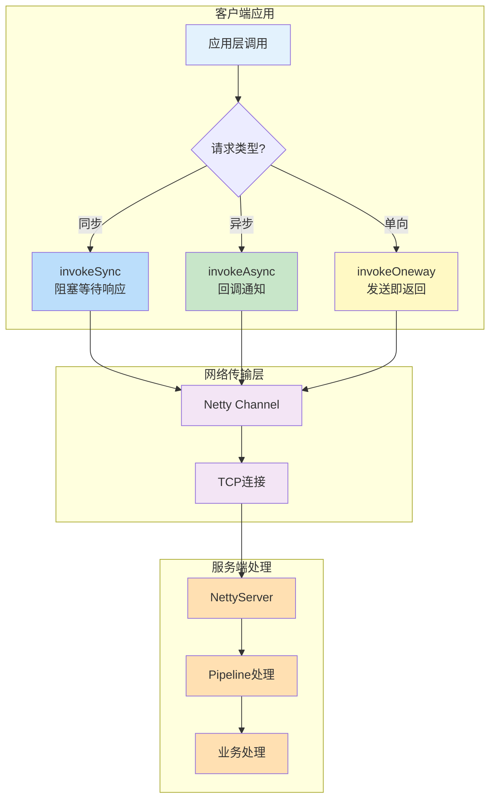
```mermaid
flowchart TD
    subgraph 客户端["客户端应用"]
        A["应用层调用"] --> B{"请求类型?"}
        B -->|同步| C["invokeSync<br/>阻塞等待响应"]
        B -->|异步| D["invokeAsync<br/>回调通知"]
        B -->|单向| E["invokeOneway<br/>发送即返回"]
    end
    
    subgraph 网络层["网络传输层"]
        F["Netty Channel"]
        G["TCP连接"]
        F --> G
    end
    
    subgraph 服务端["服务端处理"]
        H["NettyServer"]
        I["Pipeline处理"]
        J["业务处理"]
        H --> I --> J
    end
    
    C --> F
    D --> F
    E --> F
    G --> H
    
    style A fill:#e3f2fd
    style C fill:#bbdefb
    style D fill:#c8e6c9
    style E fill:#fff9c4
    style F fill:#f3e5f5
    style G fill:#f3e5f5
    style H fill:#ffe0b2
    style I fill:#ffe0b2
    style J fill:#ffe0b2
```

**三种请求方式对比**：

| 方式 | 方法 | 是否等待响应 | 信号量限制 | 典型场景 |
|------|------|-------------|-----------|---------|
| 同步 | invokeSync | 是（阻塞） | 否 | 需要立即获取结果 |
| 异步 | invokeAsync | 是（回调） | 是（默认64/65535） | 高并发、可延迟处理 |
| 单向 | invokeOneway | 否 | 是（默认256/65535） | 心跳、日志、监控 |

**关键配置参数**：

| 参数 | 服务端默认值 | 客户端默认值 | 说明 |
|------|-------------|-------------|------|
| Worker线程数 | 8个 | 4个 | 处理编解码和业务逻辑 |
| Selector线程数 | 3个 | 1个 | 处理IO多路复用 |
| 连接超时 | - | 3000ms | 建立连接的最大等待时间 |
| 空闲超时 | 120s | 120s | 连接空闲多久后关闭 |
| 异步信号量 | 64个 | 65535个 | 限制并发异步请求数 |

## 1. TCP/IP协议栈原理

### 1.1 协议栈分层架构

#### 操作系统原理

**TCP/IP协议栈**是Linux内核网络子系统的核心，采用分层架构实现网络通信。数据从应用层向下经过各层协议处理，最终通过网卡发送；接收时反向处理。

**设计思想**：
- 分层解耦，每层专注特定功能
- 协议无关性，支持多种协议共存
- 零拷贝优化，减少数据拷贝次数
- 异步处理，中断与软中断分离

#### 内核数据结构

```c
// socket结构体（include/linux/net.h）
struct socket {
    socket_state state;             // socket状态
    short type;                     // socket类型（SOCK_STREAM等）
    unsigned long flags;            // 标志位
    struct file *file;              // 关联的file结构
    struct sock *sk;                // 内核sock结构
    const struct proto_ops *ops;    // 协议操作函数
    struct socket_wq wq;            // 等待队列
};

// sock结构体（include/net/sock.h）
struct sock {
    struct sock_common __sk_common; // 公共字段
#define sk_state __sk_common.skc_state  // socket状态
#define sk_family __sk_common.skc_family // 协议族
#define sk_protocol __sk_common.skc_protocol // 协议
    struct proto *sk_prot;          // 协议处理函数
    struct net *sk_net;             // 网络命名空间
    
    struct dst_entry *sk_dst_cache; // 路由缓存
    atomic_t sk_refcnt;             // 引用计数
    
    struct sk_buff_head sk_receive_queue;  // 接收队列
    struct sk_buff_head sk_write_queue;    // 发送队列
    
    int sk_rcvbuf;                  // 接收缓冲区大小
    int sk_sndbuf;                  // 发送缓冲区大小
    
    unsigned long sk_flags;         // 标志位
    unsigned long sk_pacing_rate;   // 发送速率
    unsigned long sk_max_pacing_rate; // 最大发送速率
};

// sk_buff网络缓冲区（include/linux/skbuff.h）
struct sk_buff {
    union {
        struct {
            struct sk_buff *next, *prev; // 链表指针
            struct net_device *dev;      // 网络设备
        };
        struct rb_node rbnode;
    };
    
    struct sock *sk;                // 所属socket
    union {
        ktime_t tstamp;             // 时间戳
        u64 netmem_data;
    };
    
    char cb[48];                    // 控制块（各层私有数据）
    
    unsigned int len,               // 数据总长度
                 data_len;          // 分页数据长度
    __u16 mac_len,                  // MAC头长度
          hdr_len;                   // 头部克隆长度
    
    __u32 priority;                 // 优先级
    
    __be16 protocol;                // 协议类型
    __u16 transport_header;         // 传输层头偏移
    __u16 network_header;           // 网络层头偏移
    __u16 mac_header;               // MAC头偏移
    
    sk_buff_data_t tail;            // 数据尾指针
    sk_buff_data_t end;             // 缓冲区尾指针
    unsigned char *head,            // 缓冲区头指针
                  *data;             // 数据头指针
    unsigned int truesize;          // 实际分配大小
    atomic_t users;                 // 用户计数
};
```

**sk_buff数据结构说明**：

| 字段 | 说明 | 用途 |
|------|------|------|
| `head/tail/data/end` | 数据指针 | 管理数据缓冲区，支持头部/尾部添加 |
| `transport_header` | 传输层头偏移 | TCP/UDP头部位置 |
| `network_header` | 网络层头偏移 | IP头部位置 |
| `mac_header` | MAC头偏移 | 以太网帧头位置 |
| `len/data_len` | 数据长度 | 支持分页存储 |
| `sk` | 所属socket | 关联到socket |

#### 处理流程

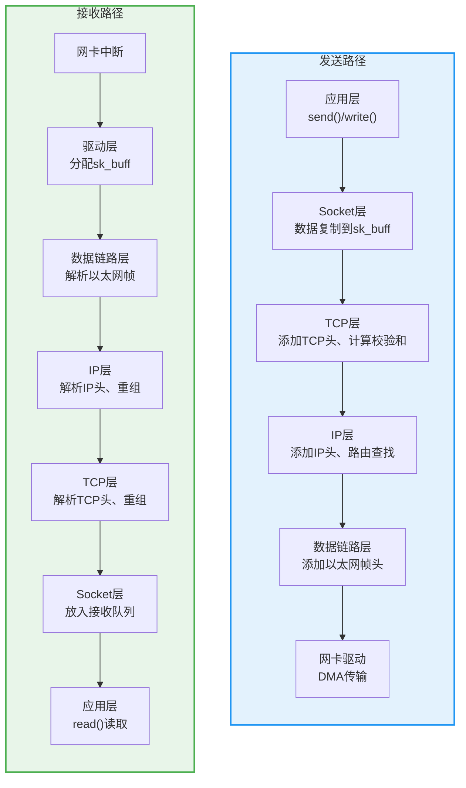
```mermaid
flowchart TD
    subgraph SendPath["发送路径"]
        direction TB
        S1["应用层<br/>send()/write()"] --> S2["Socket层<br/>数据复制到sk_buff"]
        S2 --> S3["TCP层<br/>添加TCP头、计算校验和"]
        S3 --> S4["IP层<br/>添加IP头、路由查找"]
        S4 --> S5["数据链路层<br/>添加以太网帧头"]
        S5 --> S6["网卡驱动<br/>DMA传输"]
    end
    
    subgraph RecvPath["接收路径"]
        direction TB
        R1["网卡中断"] --> R2["驱动层<br/>分配sk_buff"]
        R2 --> R3["数据链路层<br/>解析以太网帧"]
        R3 --> R4["IP层<br/>解析IP头、重组"]
        R4 --> R5["TCP层<br/>解析TCP头、重组"]
        R5 --> R6["Socket层<br/>放入接收队列"]
        R6 --> R7["应用层<br/>read()读取"]
    end
    
    %% 样式定义
    style SendPath fill:#e3f2fd,stroke:#2196f3,stroke-width:2px
    style RecvPath fill:#e8f5e9,stroke:#4caf50,stroke-width:2px
```

**图表核心结论**：网络数据包在内核中通过sk_buff结构管理，发送时从上到下添加各层协议头，接收时从下到上解析各层协议头，实现分层解耦。

#### 系统调用接口

| 系统调用 | 参数 | 返回值 | 说明 |
|----------|------|--------|------|
| `socket()` | domain, type, protocol | int fd | 创建socket |
| `bind()` | sockfd, addr, addrlen | int | 绑定地址 |
| `listen()` | sockfd, backlog | int | 开始监听 |
| `accept()` | sockfd, addr, addrlen | int fd | 接受连接 |
| `connect()` | sockfd, addr, addrlen | int | 发起连接 |
| `send()` | sockfd, buf, len, flags | ssize_t | 发送数据 |
| `recv()` | sockfd, buf, len, flags | ssize_t | 接收数据 |
| `close()` | sockfd | int | 关闭socket |

#### 内核参数

| 参数路径 | 默认值 | 说明 |
|----------|--------|------|
| `/proc/sys/net/core/rmem_max` | 212992 | 最大接收缓冲区 |
| `/proc/sys/net/core/wmem_max` | 212992 | 最大发送缓冲区 |
| `/proc/sys/net/ipv4/tcp_rmem` | 4096 87380 6291456 | TCP接收缓冲区（min default max） |
| `/proc/sys/net/ipv4/tcp_wmem` | 4096 65536 4194304 | TCP发送缓冲区（min default max） |
| `/proc/sys/net/core/somaxconn` | 128 | listen()最大backlog |
| `/proc/sys/net/ipv4/tcp_syncookies` | 1 | SYN Cookie防攻击 |
| `/proc/sys/net/ipv4/tcp_tw_reuse` | 2 | TIME_WAIT复用 |

#### 调试方法

```bash
# 查看socket统计
cat /proc/net/sockstat

# 查看TCP连接状态
cat /proc/net/tcp
cat /proc/net/tcp6

# 使用ss查看socket详情
ss -tulnp

# 使用netstat查看连接
netstat -tulnp

# 使用tcpdump抓包
tcpdump -i eth0 port 10911 -w capture.pcap

# 使用perf分析网络中断
perf record -e net:* -p [pid] sleep 10
```

## 2. 网络通信架构

### 2.1 整体架构设计

RocketMQ网络通信层基于Netty框架实现，采用Reactor线程模型，提供高性能、高可靠的网络通信能力。

**网络通信架构图**：

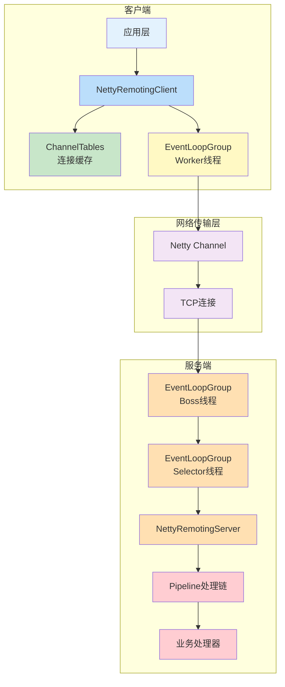
```mermaid
flowchart TD
    subgraph 客户端["客户端"]
        A1["应用层"]
        A2["NettyRemotingClient"]
        A3["ChannelTables<br/>连接缓存"]
        A4["EventLoopGroup<br/>Worker线程"]
    end
    
    subgraph 网络层["网络传输层"]
        B1["TCP连接"]
        B2["Netty Channel"]
    end
    
    subgraph 服务端["服务端"]
        C1["EventLoopGroup<br/>Boss线程"]
        C2["EventLoopGroup<br/>Selector线程"]
        C3["NettyRemotingServer"]
        C4["Pipeline处理链"]
        C5["业务处理器"]
    end
    
    A1 --> A2
    A2 --> A3
    A2 --> A4
    A4 --> B2
    B2 --> B1
    B1 --> C1
    C1 --> C2
    C2 --> C3
    C3 --> C4
    C4 --> C5
    
    style A1 fill:#e3f2fd
    style A2 fill:#bbdefb
    style A3 fill:#c8e6c9
    style A4 fill:#fff9c4
    style B1 fill:#f3e5f5
    style B2 fill:#f3e5f5
    style C1 fill:#ffe0b2
    style C2 fill:#ffe0b2
    style C3 fill:#ffe0b2
    style C4 fill:#ffcdd2
    style C5 fill:#ffcdd2
```

**核心结论**：RocketMQ网络通信采用分层架构，客户端通过ChannelTables缓存管理连接，服务端通过Pipeline责任链处理请求，实现了高性能的网络通信。

### 1.2 核心组件职责

**客户端核心组件**：

| 组件 | 职责 | 说明 |
|------|------|------|
| NettyRemotingClient | 网络通信客户端 | 管理连接、发送请求、处理响应 |
| ChannelTables | 连接缓存 | 维护地址到Channel的映射，支持连接复用 |
| EventLoopGroup | 事件循环组 | Worker线程处理网络IO事件 |

**服务端核心组件**：

| 组件 | 职责 | 说明 |
|------|------|------|
| NettyRemotingServer | 网络通信服务端 | 接收连接、处理请求、返回响应 |
| EventLoopGroup Boss | 连接接收线程 | 负责接收新连接 |
| EventLoopGroup Selector | IO处理线程 | 负责读写网络数据 |
| Pipeline | 处理链 | 编解码、空闲检测、业务处理 |

### 1.3 核心数据结构

[NettyRemotingAbstract.java](../remoting/src/main/java/org/apache/rocketmq/remoting/netty/NettyRemotingAbstract.java#L71-L102) 定义核心数据结构：

```java
/**
 * 缓存所有正在进行的请求，key为opaque，value为ResponseFuture
 * 初始容量：256
 */
protected final ConcurrentMap<Integer /* opaque */, ResponseFuture> responseTable =
        new ConcurrentHashMap<>(256);

/**
 * 存储请求码到处理器的映射，用于路由请求到对应的处理器
 * 初始容量：64
 */
protected final HashMap<Integer/* request code */, Pair<NettyRequestProcessor, ExecutorService>> processorTable =
        new HashMap<>(64);

/**
 * 网络事件执行器，异步处理连接、关闭、空闲、异常等事件
 */
protected final NettyEventExecutor nettyEventExecutor = new NettyEventExecutor();

/**
 * 默认请求处理器，当processorTable中找不到对应处理器时使用
 */
protected Pair<NettyRequestProcessor, ExecutorService> defaultRequestProcessorPair;

/**
 * 自定义RPC钩子列表，支持注册多个钩子
 */
protected List<RPCHook> rpcHooks = new ArrayList<>();
```

**核心数据结构说明**：

| 数据结构 | 类型 | 初始容量 | 说明 |
|---------|------|---------|------|
| responseTable | ConcurrentHashMap | 256 | 存储opaque到ResponseFuture的映射 |
| processorTable | HashMap | 64 | 存储请求码到处理器的映射 |
| nettyEventExecutor | NettyEventExecutor | - | 异步处理网络事件 |
| rpcHooks | ArrayList | - | RPC钩子列表 |

## 2. TCP参数优化

### 2.1 操作系统原理

**TCP参数**影响网络性能和可靠性：

| 参数 | 说明 | 内核路径 | 单位 |
|------|------|---------|------|
| SO_BACKLOG | 连接等待队列长度 | `/proc/sys/net/core/somaxconn` | 个 |
| SO_REUSEADDR | 允许重用端口 | 内核socket选项 | - |
| TCP_NODELAY | 禁用Nagle算法 | `/proc/sys/net/ipv4/tcp_low_latency` | - |
| SO_KEEPALIVE | TCP保活探测 | `/proc/sys/net/ipv4/tcp_keepalive_*` | - |
| SO_SNDBUF/SO_RCVBUF | 收发缓冲区大小 | `/proc/sys/net/ipv4/tcp_rmem/wmem` | B |

**Nagle算法**：将小包合并发送，减少网络负载，但增加延迟。

**问题背景**：在低延迟场景下（如RPC调用），Nagle算法会导致消息延迟累积，影响响应速度。禁用Nagle算法（TCP_NODELAY=true）可确保数据立即发送。

**TCP参数架构图**：

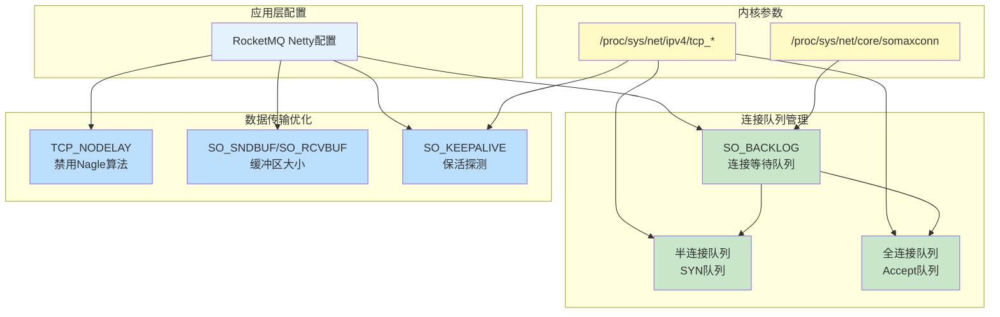
```mermaid
flowchart TD
    subgraph 应用层["应用层配置"]
        A["RocketMQ Netty配置"]
    end
    
    subgraph 内核层["内核参数"]
        B["/proc/sys/net/core/somaxconn"]
        C["/proc/sys/net/ipv4/tcp_*"]
    end
    
    subgraph 连接队列["连接队列管理"]
        D["SO_BACKLOG<br/>连接等待队列"]
        E["半连接队列<br/>SYN队列"]
        F["全连接队列<br/>Accept队列"]
    end
    
    subgraph 数据传输["数据传输优化"]
        G["TCP_NODELAY<br/>禁用Nagle算法"]
        H["SO_SNDBUF/SO_RCVBUF<br/>缓冲区大小"]
        I["SO_KEEPALIVE<br/>保活探测"]
    end
    
    A --> D
    A --> G
    A --> H
    A --> I
    B --> D
    C --> E
    C --> F
    C --> I
    D --> E
    D --> F
    
    style A fill:#e3f2fd
    style B fill:#fff9c4
    style C fill:#fff9c4
    style D fill:#c8e6c9
    style E fill:#c8e6c9
    style F fill:#c8e6c9
    style G fill:#bbdefb
    style H fill:#bbdefb
    style I fill:#bbdefb
```

**核心结论**：TCP参数配置分为应用层配置和内核层参数两部分，RocketMQ通过Netty配置应用层参数，同时需要配合内核参数调优以达到最佳性能。

### 2.2 RocketMQ实现

[NettyRemotingServer.java](../remoting/src/main/java/org/apache/rocketmq/remoting/netty/NettyRemotingServer.java) 配置TCP参数：

```java
serverBootstrap.group(this.eventLoopGroupBoss, this.eventLoopGroupSelector)
    .channel(useEpoll() ? EpollServerSocketChannel.class : NioServerSocketChannel.class)
    .option(ChannelOption.SO_BACKLOG, 1024)                    // 连接等待队列长度：1024个连接
    .option(ChannelOption.SO_REUSEADDR, true)                  // 允许重用端口
    .childOption(ChannelOption.SO_KEEPALIVE, false)            // 禁用TCP Keepalive，使用应用层心跳
    .childOption(ChannelOption.TCP_NODELAY, true);             // 禁用Nagle算法，降低延迟
```

**参数选择原因**：

| 参数 | 设置 | 原因 |
|------|------|------|
| SO_BACKLOG | 1024 | 支持高并发连接，与内核`/proc/sys/net/core/somaxconn`配合使用 |
| TCP_NODELAY | true | 禁用Nagle算法，降低消息延迟，适合RPC场景 |
| SO_KEEPALIVE | false | 使用应用层心跳替代，检测更及时、可控性更强 |

**扩展TCP参数配置**：

[NettyRemotingServer.java](../remoting/src/main/java/org/apache/rocketmq/remoting/netty/NettyRemotingServer.java#L274-L293) 支持自定义缓冲区配置：

```java
private void addCustomConfig(ServerBootstrap childHandler) {
    // 发送缓冲区大小配置
    if (nettyServerConfig.getServerSocketSndBufSize() > 0) {
        childHandler.childOption(ChannelOption.SO_SNDBUF, 
            nettyServerConfig.getServerSocketSndBufSize());
    }
    // 接收缓冲区大小配置
    if (nettyServerConfig.getServerSocketRcvBufSize() > 0) {
        childHandler.childOption(ChannelOption.SO_RCVBUF, 
            nettyServerConfig.getServerSocketRcvBufSize());
    }
    // 写缓冲区水位线配置（流控）
    if (nettyServerConfig.getWriteBufferLowWaterMark() > 0 
        && nettyServerConfig.getWriteBufferHighWaterMark() > 0) {
        childHandler.childOption(ChannelOption.WRITE_BUFFER_WATER_MARK, 
            new WriteBufferWaterMark(
                nettyServerConfig.getWriteBufferLowWaterMark(),   // 低水位线
                nettyServerConfig.getWriteBufferHighWaterMark())); // 高水位线
    }
    // 内存池化配置
    if (nettyServerConfig.isServerPooledByteBufAllocatorEnable()) {
        childHandler.childOption(ChannelOption.ALLOCATOR, PooledByteBufAllocator.DEFAULT);
    }
}
```

**WRITE_BUFFER_WATER_MARK 说明**：

| 参数 | 说明 | 触发条件 |
|------|------|----------|
| Low Water Mark | 低水位线 | 缓冲区低于此值时，channel变为可写状态 |
| High Water Mark | 高水位线 | 缓冲区高于此值时，channel变为不可写状态 |

## 3. 连接建立流程

### 3.1 操作系统原理

**TCP三次握手**建立连接：

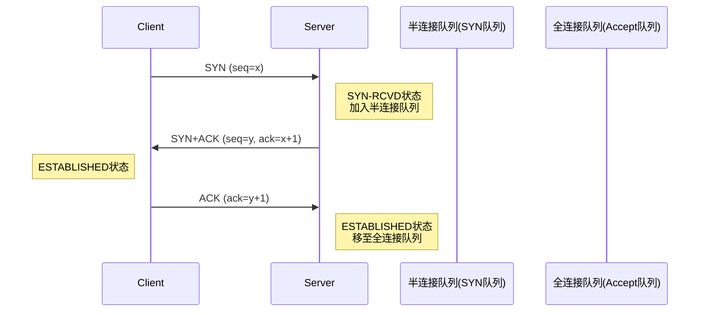
```mermaid
sequenceDiagram
    participant C as Client
    participant S as Server
    participant SQ as 半连接队列(SYN队列)
    participant AQ as 全连接队列(Accept队列)

    C->>S: SYN (seq=x)
    Note right of S: SYN-RCVD状态<br/>加入半连接队列
    S->>C: SYN+ACK (seq=y, ack=x+1)
    Note left of C: ESTABLISHED状态
    C->>S: ACK (ack=y+1)
    Note right of S: ESTABLISHED状态<br/>移至全连接队列
```

**核心结论**：TCP通过三次握手建立可靠连接，服务端使用两个队列（半连接队列和全连接队列）管理连接状态，确保高并发场景下的连接稳定性。

**关键概念**：
- **半连接队列(SYN队列)**：存放处于SYN-RCVD状态的连接，等待客户端ACK确认
- **全连接队列(Accept队列)**：存放已完成三次握手的ESTABLISHED连接，等待应用层accept()
- **SYN Flood攻击**：攻击者发送大量SYN但不回复ACK，导致半连接队列溢出

**关键队列**：

| 队列 | 说明 | 内核参数 | 单位 |
|------|------|---------|------|
| 半连接队列(SYN队列) | 存放SYN-RCVD状态的连接 | `/proc/sys/net/ipv4/tcp_max_syn_backlog` | 个 |
| 全连接队列(Accept队列) | 存放ESTABLISHED状态的连接 | `/proc/sys/net/core/somaxconn` | 个 |

**相关内核参数**：

| 参数 | 说明 |
|------|------|
| `/proc/sys/net/ipv4/tcp_max_syn_backlog` | 半连接队列长度 |
| `/proc/sys/net/core/somaxconn` | 全连接队列长度 |
| `/proc/sys/net/ipv4/tcp_syncookies` | SYN Cookie防护 |

### 3.2 RocketMQ服务端实现

[NettyRemotingServer.java](../remoting/src/main/java/org/apache/rocketmq/remoting/netty/NettyRemotingServer.java#L225-L239) 处理连接：

```java
serverBootstrap.childHandler(new ChannelInitializer<SocketChannel>() {
    @Override
    public void initChannel(SocketChannel ch) {
        ch.pipeline()
            // 握手处理器（处理TLS检测）
            .addLast(defaultEventExecutorGroup, HANDSHAKE_HANDLER_NAME, handshakeHandler)
            .addLast(defaultEventExecutorGroup,
                encoder,                                    // 编码器
                new NettyDecoder(),                         // 解码器
                new IdleStateHandler(0, 0,                  // 空闲检测：读写均不超时
                    nettyServerConfig.getServerChannelMaxIdleTimeSeconds()), // 默认值：120s
                connectionManageHandler,                     // 连接管理Handler
                serverHandler                                // 业务处理Handler
            );
    }
});
```

**Pipeline处理器顺序**：

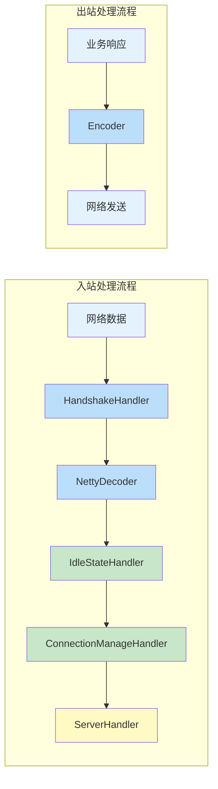
```mermaid
flowchart LR
    subgraph 入站处理["入站处理流程"]
        A["网络数据"] --> B["HandshakeHandler"]
        B --> C["NettyDecoder"]
        C --> D["IdleStateHandler"]
        D --> E["ConnectionManageHandler"]
        E --> F["ServerHandler"]
    end
    
    subgraph 出站处理["出站处理流程"]
        G["业务响应"] --> H["Encoder"]
        H --> I["网络发送"]
    end
    
    style A fill:#e3f2fd
    style B fill:#bbdefb
    style C fill:#bbdefb
    style D fill:#c8e6c9
    style E fill:#c8e6c9
    style F fill:#fff9c4
    style G fill:#e3f2fd
    style H fill:#bbdefb
    style I fill:#e3f2fd
```

**核心结论**：Netty Pipeline通过责任链模式处理请求，入站数据依次经过握手、解码、空闲检测、连接管理和业务处理，出站数据通过编码器发送到网络。

**处理器说明**：

| 处理器 | 类型 | 功能 |
|--------|------|------|
| HandshakeHandler | 入站 | 处理TLS握手检测 |
| NettyDecoder | 入站 | 解码网络数据为RemotingCommand |
| IdleStateHandler | 入站 | 检测连接空闲状态 |
| ConnectionManageHandler | 入站 | 管理连接生命周期 |
| ServerHandler | 入站 | 处理业务请求 |
| Encoder | 出站 | 编码RemotingCommand为网络数据 |

### 3.3 RocketMQ客户端实现

[NettyRemotingClient.java](../remoting/src/main/java/org/apache/rocketmq/remoting/netty/NettyRemotingClient.java#L196-L220) 配置客户端连接：

```java
Bootstrap handler = this.bootstrap.group(this.eventLoopGroupWorker)
    .channel(NioSocketChannel.class)
    .option(ChannelOption.TCP_NODELAY, true)                    // 禁用Nagle算法
    .option(ChannelOption.SO_KEEPALIVE, false)                  // 禁用TCP Keepalive
    .option(ChannelOption.CONNECT_TIMEOUT_MILLIS, 
        nettyClientConfig.getConnectTimeoutMillis())            // 连接超时：默认值3000ms
    .handler(new ChannelInitializer<SocketChannel>() {
        @Override
        public void initChannel(SocketChannel ch) throws Exception {
            ChannelPipeline pipeline = ch.pipeline();
            // TLS配置
            if (nettyClientConfig.isUseTLS()) {
                if (null != sslContext) {
                    pipeline.addFirst(defaultEventExecutorGroup, 
                        "sslHandler", sslContext.newHandler(ch.alloc()));
                }
            }
            ch.pipeline().addLast(
                nettyClientConfig.isDisableNettyWorkerGroup() ? null : defaultEventExecutorGroup,
                new NettyEncoder(),                              // 编码器
                new NettyDecoder(),                              // 解码器
                new IdleStateHandler(0, 0, 
                    nettyClientConfig.getClientChannelMaxIdleTimeSeconds()), // 空闲超时：默认值120s
                new NettyConnectManageHandler(),                  // 连接管理Handler
                new NettyClientHandler());                        // 业务处理Handler
        }
    });
```

**客户端连接创建流程**：

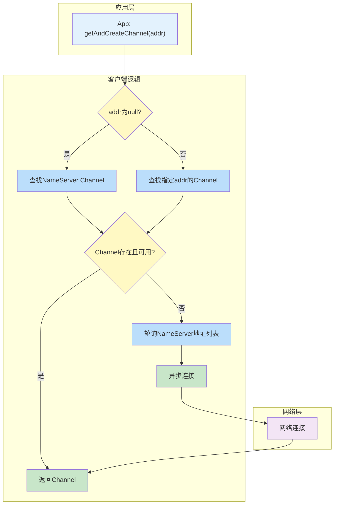
```mermaid
flowchart TD
    subgraph 应用层["应用层"]
        A["App: getAndCreateChannel(addr)"]
    end
    
    subgraph 客户端逻辑["客户端逻辑"]
        B{"addr为null?"}
        C["查找NameServer Channel"]
        D["轮询NameServer地址列表"]
        E["查找指定addr的Channel"]
        F{"Channel存在且可用?"}
        G["异步连接"]
        H["返回Channel"]
    end
    
    subgraph 网络层["网络层"]
        I["网络连接"]
    end
    
    A --> B
    B -->|是| C
    B -->|否| E
    C --> F
    E --> F
    F -->|是| H
    F -->|否| D
    D --> G
    G --> I
    I --> H
    
    style A fill:#e3f2fd
    style B fill:#fff9c4
    style C fill:#bbdefb
    style D fill:#bbdefb
    style E fill:#bbdefb
    style F fill:#fff9c4
    style G fill:#c8e6c9
    style H fill:#c8e6c9
    style I fill:#f3e5f5
```

**核心结论**：RocketMQ客户端通过ChannelTables缓存管理连接，优先复用已有连接，仅在连接不存在或不可用时才创建新连接，有效减少连接开销。

**关键概念**：
- **ChannelTables**：客户端维护的地址到Channel的映射表，支持连接复用
- **namesrvAddrChoosed**：当前选中的NameServer地址，支持轮询切换
- **ChannelWrapper**：封装Channel及其状态信息，包括最后响应时间

**分步详解**：

| 步骤 | 操作 | 类型 | 说明 |
|------|------|------|------|
| 1 | getAndCreateChannel | 入口 | 应用层请求获取或创建Channel |
| 2 | 判断addr | 分支 | 区分NameServer连接和Broker连接 |
| 3 | 查找Channel | 查询 | 从ChannelTables中查找已有连接 |
| 4 | 检查可用性 | 验证 | 确认Channel处于活跃状态 |
| 5 | 异步连接 | 网络 | 创建新的TCP连接 |

**ChannelWrapper 说明**：

[NettyRemotingClient.java](../remoting/src/main/java/org/apache/rocketmq/remoting/netty/NettyRemotingClient.java#L777-L810) 封装Channel状态：

```java
static class ChannelWrapper {
    private final ChannelFuture channelFuture;
    // 最后响应时间，用于检测不活跃连接
    // 仅受同步或异步请求影响，单向请求不更新此时间
    private long lastResponseTime;

    public ChannelWrapper(ChannelFuture channelFuture) {
        this.channelFuture = channelFuture;
        this.lastResponseTime = System.currentTimeMillis();  // 初始化为创建时间
    }

    public boolean isOK() {
        // Channel存在且处于活跃状态
        return this.channelFuture.channel() != null 
            && this.channelFuture.channel().isActive();
    }

    public boolean isWritable() {
        // Channel是否可写（用于流控）
        return this.channelFuture.channel().isWritable();
    }

    public void updateLastResponseTime() {
        this.lastResponseTime = System.currentTimeMillis();  // 更新最后响应时间
    }
}
```

**ChannelWrapper字段说明**：

| 字段 | 类型 | 说明 | 初始值 |
|------|------|------|--------|
| channelFuture | ChannelFuture | Netty Channel的异步操作结果 | 构造时传入 |
| lastResponseTime | long | 最后响应时间戳（毫秒），用于检测不活跃连接 | 创建时的系统时间 |

**ChannelWrapper方法说明**：

| 方法 | 返回类型 | 说明 |
|------|---------|------|
| isOK() | boolean | 判断Channel是否可用（存在且活跃） |
| isWritable() | boolean | 判断Channel是否可写（用于流控） |
| getChannel() | Channel | 获取底层的Channel对象 |
| getChannelFuture() | ChannelFuture | 获取ChannelFuture对象 |
| getLastResponseTime() | long | 获取最后响应时间戳 |
| updateLastResponseTime() | void | 更新最后响应时间为当前时间 |

## 4. 空闲连接检测

### 4.1 操作系统原理

**空闲连接检测**防止资源泄漏：

| 方式 | 说明 | 优缺点 |
|------|------|--------|
| TCP Keepalive | 内核定时发送探测包 | 简单，但间隔长（默认2小时） |
| 应用层心跳 | 应用自定义心跳协议 | 灵活，可快速检测 |

**TCP Keepalive参数**：

```bash
/proc/sys/net/ipv4/tcp_keepalive_time   # 首次探测时间，默认值：7200s (2小时)
/proc/sys/net/ipv4/tcp_keepalive_intvl  # 探测间隔，默认值：75s
/proc/sys/net/ipv4/tcp_keepalive_probes # 探测次数，默认值：9次
```

**参数详细说明**：

| 参数 | 默认值 | 单位 | 说明 |
|------|-------|------|------|
| tcp_keepalive_time | 7200 | s | 连接空闲多久后开始发送保活探测包 |
| tcp_keepalive_intvl | 75 | s | 保活探测包的发送间隔 |
| tcp_keepalive_probes | 9 | 次 | 探测失败多少次后认为连接断开 |

**问题背景**：TCP Keepalive 默认2小时才触发首次探测，对于需要快速检测连接断开的场景不适用。RocketMQ 使用应用层心跳机制，可在秒级检测到连接异常。

**空闲检测机制流程**：

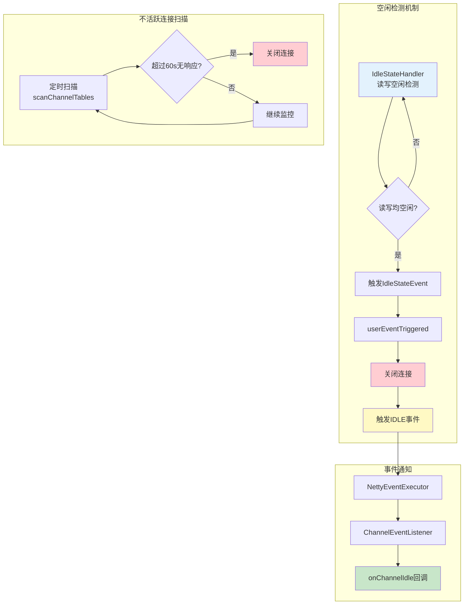
```mermaid
flowchart TD
    subgraph 检测机制["空闲检测机制"]
        A["IdleStateHandler<br/>读写空闲检测"]
        B{"读写均空闲?"}
        C["触发IdleStateEvent"]
        D["userEventTriggered"]
        E["关闭连接"]
        F["触发IDLE事件"]
    end
    
    subgraph 扫描机制["不活跃连接扫描"]
        G["定时扫描<br/>scanChannelTables"]
        H{"超过60s无响应?"}
        I["关闭连接"]
        J["继续监控"]
    end
    
    subgraph 事件处理["事件通知"]
        K["NettyEventExecutor"]
        L["ChannelEventListener"]
        M["onChannelIdle回调"]
    end
    
    A --> B
    B -->|是| C
    B -->|否| A
    C --> D
    D --> E
    E --> F
    F --> K
    K --> L
    L --> M
    
    G --> H
    H -->|是| I
    H -->|否| J
    J --> G
    
    style A fill:#e3f2fd
    style E fill:#ffcdd2
    style F fill:#fff9c4
    style I fill:#ffcdd2
    style M fill:#c8e6c9
```

**核心结论**：RocketMQ通过双重机制检测空闲连接：IdleStateHandler实时检测读写空闲（默认120s），定时扫描检测不活跃连接（默认60s无响应），确保及时释放资源。

### 4.2 RocketMQ服务端实现

[NettyRemotingServer.java](../remoting/src/main/java/org/apache/rocketmq/remoting/netty/NettyRemotingServer.java#L233-L236) 使用应用层心跳：

```java
// 空闲检测Handler
.addLast(new IdleStateHandler(0, 0,
    nettyServerConfig.getServerChannelMaxIdleTimeSeconds()))  // 默认值：120s
```

[NettyRemotingServer.java](../remoting/src/main/java/org/apache/rocketmq/remoting/netty/NettyRemotingServer.java#L523-L538) 处理空闲事件：

```java
@Override
public void userEventTriggered(ChannelHandlerContext ctx, Object evt) {
    if (evt instanceof IdleStateEvent) {
        IdleStateEvent event = (IdleStateEvent) evt;
        if (event.state().equals(IdleState.ALL_IDLE)) {
            // 读写均空闲，关闭连接
            final String remoteAddress = RemotingHelper.parseChannelRemoteAddr(ctx.channel());
            log.warn("NETTY SERVER PIPELINE: IDLE exception [{}]", remoteAddress);
            RemotingUtil.closeChannel(ctx.channel());
            // 触发IDLE事件通知
            if (NettyRemotingServer.this.channelEventListener != null) {
                NettyRemotingServer.this.putNettyEvent(
                    new NettyEvent(NettyEventType.IDLE, remoteAddress, ctx.channel()));
            }
        }
    }
    ctx.fireUserEventTriggered(evt);
}
```

### 4.3 RocketMQ客户端实现

[NettyRemotingClient.java](../remoting/src/main/java/org/apache/rocketmq/remoting/netty/NettyRemotingClient.java#L216) 客户端空闲检测：

```java
new IdleStateHandler(0, 0, 
    nettyClientConfig.getClientChannelMaxIdleTimeSeconds())  // 默认值：120s
```

**不活跃连接扫描**：

[NettyRemotingClient.java](../remoting/src/main/java/org/apache/rocketmq/remoting/netty/NettyRemotingClient.java#L729-L748) 定期扫描不活跃连接：

```java
protected void scanChannelTablesOfNameServer() {
    for (String addr : this.channelTables.keySet()) {
        ChannelWrapper channelWrapper = this.channelTables.get(addr);
        if (channelWrapper == null) {
            continue;
        }
        // 检测超过channelNotActiveInterval未响应的连接
        if ((System.currentTimeMillis() - channelWrapper.getLastResponseTime()) 
            > this.nettyClientConfig.getChannelNotActiveInterval()) {  // 默认值：60000ms (60s)
            log.warn("[SCAN] No response after {} from name server {}, so close it!", 
                channelWrapper.getLastResponseTime(), addr);
            closeChannel(addr, channelWrapper.getChannel());
        }
    }
}
```

**空闲检测参数对比**：

| 参数 | 服务端默认值 | 客户端默认值 | 说明 |
|------|-------------|-------------|------|
| ChannelMaxIdleTimeSeconds | 120s | 120s | 读写空闲超时时间 |
| ChannelNotActiveInterval | - | 60s | 无响应后关闭连接的时间 |

## 5. 连接管理

### 5.1 Channel生命周期

**Channel生命周期**：连接建立 -> 数据传输 -> 连接关闭

**Channel生命周期状态图**：

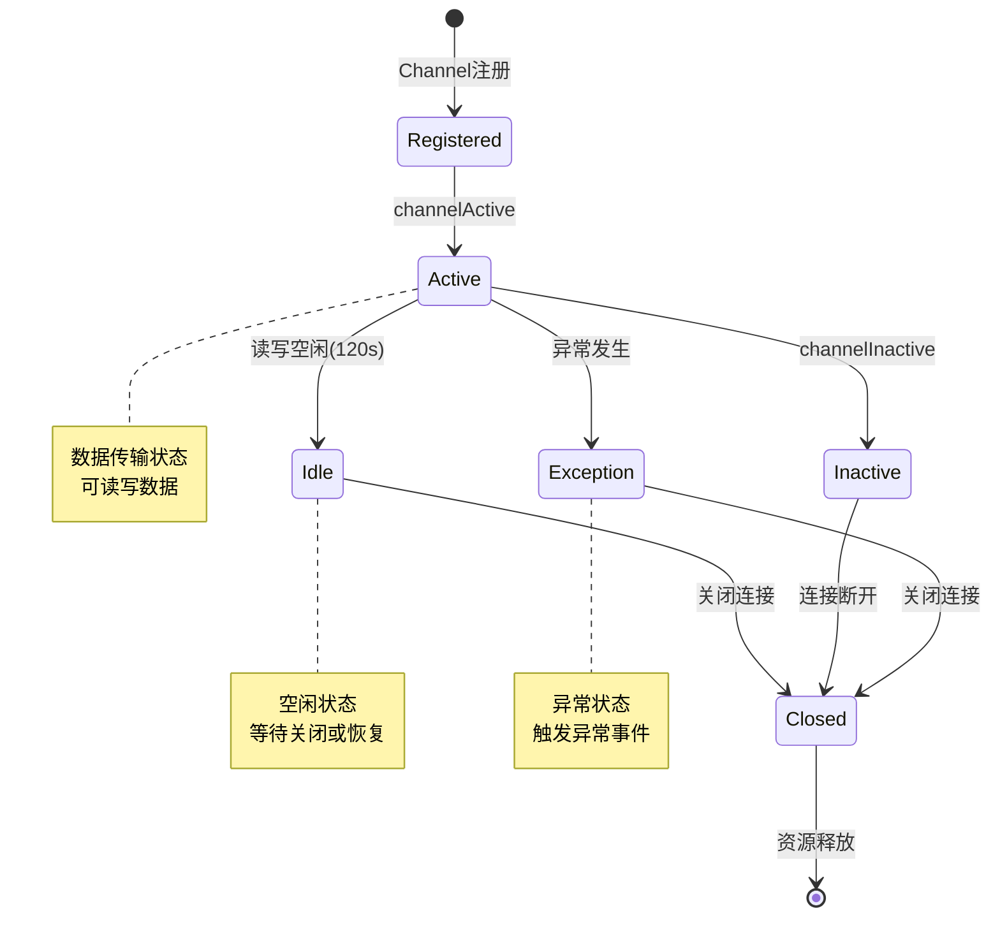
```mermaid
stateDiagram-v2
    [*] --> Registered: Channel注册
    Registered --> Active: channelActive
    Active --> Idle: 读写空闲(120s)
    Idle --> Closed: 关闭连接
    Active --> Inactive: channelInactive
    Inactive --> Closed: 连接断开
    Active --> Exception: 异常发生
    Exception --> Closed: 关闭连接
    Closed --> [*]: 资源释放
    
    note right of Active: 数据传输状态<br/>可读写数据
    note right of Idle: 空闲状态<br/>等待关闭或恢复
    note right of Exception: 异常状态<br/>触发异常事件
```

**核心结论**：Channel生命周期从注册开始，经历活跃、空闲、异常等状态，最终关闭并释放资源，每个状态转换都会触发相应的NettyEvent事件。

**状态转换说明**：

| 状态 | 触发事件 | 触发NettyEvent | 说明 |
|------|---------|---------------|------|
| Registered | channelRegistered | - | Channel注册到EventLoop |
| Active | channelActive | CONNECT | 连接建立，可传输数据 |
| Idle | IdleStateEvent | IDLE | 读写空闲超时 |
| Inactive | channelInactive | CLOSE | 连接断开 |
| Exception | exceptionCaught | EXCEPTION | 发生异常 |
| Closed | closeChannel | - | 资源释放 |

### 5.2 RocketMQ连接管理实现

[NettyConnectManageHandler](../remoting/src/main/java/org/apache/rocketmq/remoting/netty/NettyRemotingServer.java#L485-L552) 管理服务端连接：

```java
@ChannelHandler.Sharable
class NettyConnectManageHandler extends ChannelDuplexHandler {
    // Channel注册
    @Override
    public void channelRegistered(ChannelHandlerContext ctx) throws Exception {
        final String remoteAddress = RemotingHelper.parseChannelRemoteAddr(ctx.channel());
        log.info("NETTY SERVER PIPELINE: channelRegistered {}", remoteAddress);
        super.channelRegistered(ctx);
    }

    // Channel激活（连接建立）
    @Override
    public void channelActive(ChannelHandlerContext ctx) throws Exception {
        final String remoteAddress = RemotingHelper.parseChannelRemoteAddr(ctx.channel());
        log.info("NETTY SERVER PIPELINE: channelActive, the channel[{}]", remoteAddress);
        super.channelActive(ctx);
        // 触发CONNECT事件通知
        if (NettyRemotingServer.this.channelEventListener != null) {
            NettyRemotingServer.this.putNettyEvent(
                new NettyEvent(NettyEventType.CONNECT, remoteAddress, ctx.channel()));
        }
    }

    // Channel断开（连接关闭）
    @Override
    public void channelInactive(ChannelHandlerContext ctx) throws Exception {
        final String remoteAddress = RemotingHelper.parseChannelRemoteAddr(ctx.channel());
        log.info("NETTY SERVER PIPELINE: channelInactive, the channel[{}]", remoteAddress);
        super.channelInactive(ctx);
        // 触发CLOSE事件通知
        if (NettyRemotingServer.this.channelEventListener != null) {
            NettyRemotingServer.this.putNettyEvent(
                new NettyEvent(NettyEventType.CLOSE, remoteAddress, ctx.channel()));
        }
    }

    // 异常处理
    @Override
    public void exceptionCaught(ChannelHandlerContext ctx, Throwable cause) {
        final String remoteAddress = RemotingHelper.parseChannelRemoteAddr(ctx.channel());
        log.warn("NETTY SERVER PIPELINE: exceptionCaught {}", remoteAddress);
        log.warn("NETTY SERVER PIPELINE: exceptionCaught exception.", cause);
        // 触发EXCEPTION事件通知
        if (NettyRemotingServer.this.channelEventListener != null) {
            NettyRemotingServer.this.putNettyEvent(
                new NettyEvent(NettyEventType.EXCEPTION, remoteAddress, ctx.channel()));
        }
        RemotingUtil.closeChannel(ctx.channel());
    }
}
```

**NettyEventType 事件类型**：

[NettyEventType.java](../remoting/src/main/java/org/apache/rocketmq/remoting/netty/NettyEventType.java) 定义网络事件：

```java
public enum NettyEventType {
    CONNECT,    // 连接建立
    CLOSE,      // 连接关闭
    IDLE,       // 空闲超时
    EXCEPTION   // 异常发生
}
```

| 事件类型 | 枚举值 | 说明 | 触发时机 |
|---------|--------|------|---------|
| CONNECT | 0 | 连接建立 | channelActive() 被调用时 |
| CLOSE | 1 | 连接关闭 | channelInactive() 被调用时 |
| IDLE | 2 | 空闲超时 | IdleStateEvent 触发时 |
| EXCEPTION | 3 | 异常发生 | exceptionCaught() 被调用时 |

### 5.3 NettyEventExecutor事件处理

[NettyRemotingAbstract.java](../remoting/src/main/java/org/apache/rocketmq/remoting/netty/NettyRemotingAbstract.java#L557-L610) 实现事件处理：

```java
class NettyEventExecutor extends ServiceThread {
    // 事件队列，最大容量10000个事件
    private final LinkedBlockingQueue<NettyEvent> eventQueue = new LinkedBlockingQueue<>();

    public void putNettyEvent(final NettyEvent event) {
        int currentSize = this.eventQueue.size();
        int maxSize = 10000;  // 最大事件数量：10000个
        if (currentSize <= maxSize) {
            this.eventQueue.add(event);
        } else {
            // 队列已满，丢弃事件并打印警告日志
            log.warn("event queue size [{}] over the limit [{}], so drop this event {}", 
                currentSize, maxSize, event.toString());
        }
    }

    @Override
    public void run() {
        log.info(this.getServiceName() + " service started");

        final ChannelEventListener listener = NettyRemotingAbstract.this.getChannelEventListener();

        while (!this.isStopped()) {
            try {
                // 每3秒轮询一次事件队列
                NettyEvent event = this.eventQueue.poll(3000, TimeUnit.MILLISECONDS);
                if (event != null && listener != null) {
                    switch (event.getType()) {
                        case IDLE:
                            listener.onChannelIdle(event.getRemoteAddr(), event.getChannel());
                            break;
                        case CLOSE:
                            listener.onChannelClose(event.getRemoteAddr(), event.getChannel());
                            break;
                        case CONNECT:
                            listener.onChannelConnect(event.getRemoteAddr(), event.getChannel());
                            break;
                        case EXCEPTION:
                            listener.onChannelException(event.getRemoteAddr(), event.getChannel());
                            break;
                        default:
                            break;
                    }
                }
            } catch (Exception e) {
                log.warn(this.getServiceName() + " service has exception. ", e);
            }
        }

        log.info(this.getServiceName() + " service end");
    }
}
```

**事件处理流程**：

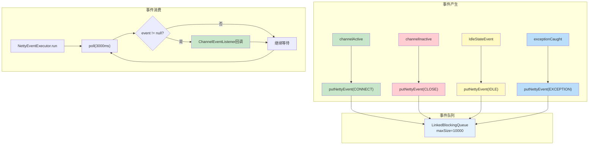
```mermaid
flowchart TD
    subgraph 事件产生["事件产生"]
        A["channelActive"] --> B["putNettyEvent(CONNECT)"]
        C["channelInactive"] --> D["putNettyEvent(CLOSE)"]
        E["IdleStateEvent"] --> F["putNettyEvent(IDLE)"]
        G["exceptionCaught"] --> H["putNettyEvent(EXCEPTION)"]
    end
    
    subgraph 事件队列["事件队列"]
        I["LinkedBlockingQueue<br/>maxSize=10000"]
    end
    
    subgraph 事件消费["事件消费"]
        J["NettyEventExecutor.run"]
        K["poll(3000ms)"]
        L{"event != null?"}
        M["ChannelEventListener回调"]
        N["继续等待"]
    end
    
    B --> I
    D --> I
    F --> I
    H --> I
    J --> K
    K --> L
    L -->|是| M
    L -->|否| N
    M --> N
    N --> K
    
    style A fill:#c8e6c9
    style B fill:#c8e6c9
    style C fill:#ffcdd2
    style D fill:#ffcdd2
    style E fill:#fff9c4
    style F fill:#fff9c4
    style G fill:#bbdefb
    style H fill:#bbdefb
    style I fill:#e3f2fd
    style M fill:#c8e6c9
```

**核心结论**：NettyEventExecutor使用独立线程异步处理网络事件，事件队列最大容量为10000个事件，超过限制的事件会被丢弃，避免内存溢出。

**关键参数**：

| 参数 | 值 | 说明 |
|------|-----|------|
| eventQueue maxSize | 10000个 | 事件队列最大容量，超过限制的事件会被丢弃 |
| poll timeout | 3000ms | 事件轮询超时时间，无事件时每3秒检查一次 |
| ServiceThread | 独立线程 | 事件处理在独立线程中执行，不阻塞IO线程 |

## 6. 请求处理机制

### 6.1 三种请求方式概述

RocketMQ支持三种请求方式，满足不同场景的网络通信需求。

**三种请求方式对比**：

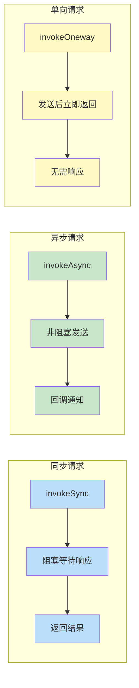
```mermaid
flowchart LR
    subgraph 同步请求["同步请求"]
        A1["invokeSync"]
        A2["阻塞等待响应"]
        A3["返回结果"]
        A1 --> A2 --> A3
    end
    
    subgraph 异步请求["异步请求"]
        B1["invokeAsync"]
        B2["非阻塞发送"]
        B3["回调通知"]
        B1 --> B2 --> B3
    end
    
    subgraph 单向请求["单向请求"]
        C1["invokeOneway"]
        C2["发送后立即返回"]
        C3["无需响应"]
        C1 --> C2 --> C3
    end
    
    style A1 fill:#bbdefb
    style A2 fill:#bbdefb
    style A3 fill:#bbdefb
    style B1 fill:#c8e6c9
    style B2 fill:#c8e6c9
    style B3 fill:#c8e6c9
    style C1 fill:#fff9c4
    style C2 fill:#fff9c4
    style C3 fill:#fff9c4
```

| 请求方式 | 是否等待响应 | 是否限流 | 适用场景 |
|---------|-------------|---------|---------|
| invokeSync | 是 | 否 | 需要同步获取结果的场景 |
| invokeAsync | 是（异步回调） | 是（semaphoreAsync） | 高并发、需要响应但可异步处理 |
| invokeOneway | 否 | 是（semaphoreOneway） | 不需要响应的场景，如心跳、日志 |

### 6.2 同步请求实现

**同步请求超时机制**：同步请求需要等待响应，超时机制防止无限等待：

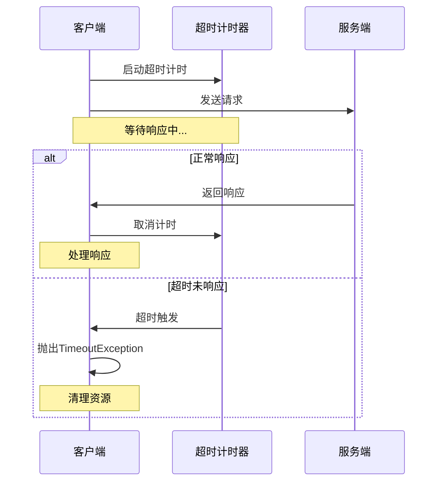
```mermaid
sequenceDiagram
    participant C as 客户端
    participant T as 超时计时器
    participant S as 服务端
    
    C->>T: 启动超时计时
    C->>S: 发送请求
    Note over C,T: 等待响应中...
    
    alt 正常响应
        S->>C: 返回响应
        C->>T: 取消计时
        Note over C: 处理响应
    else 超时未响应
        T->>C: 超时触发
        C->>C: 抛出TimeoutException
        Note over C: 清理资源
    end
```

**核心结论**：同步请求通过超时机制避免无限等待，确保系统资源及时释放，防止线程阻塞导致系统性能下降。

[NettyRemotingAbstract.java](../remoting/src/main/java/org/apache/rocketmq/remoting/netty/NettyRemotingAbstract.java#L407-L444) 实现同步请求：

```java
public RemotingCommand invokeSyncImpl(final Channel channel, final RemotingCommand request,
    final long timeoutMillis)
    throws InterruptedException, RemotingSendRequestException, RemotingTimeoutException {
    // 获取请求ID（opaque用于匹配请求和响应）
    final int opaque = request.getOpaque();

    try {
        // 创建响应Future，用于等待响应
        final ResponseFuture responseFuture = new ResponseFuture(
            channel, opaque, timeoutMillis, null, null);
        // 存入响应表，等待响应时根据opaque查找
        this.responseTable.put(opaque, responseFuture);
        final SocketAddress addr = channel.remoteAddress();
        
        // 发送请求，添加监听器处理发送结果
        channel.writeAndFlush(request).addListener((ChannelFutureListener) f -> {
            if (f.isSuccess()) {
                // 发送成功，设置标志位
                responseFuture.setSendRequestOK(true);
                return;
            }
            // 发送失败，清理资源
            responseFuture.setSendRequestOK(false);
            responseTable.remove(opaque);
            responseFuture.setCause(f.cause());
            responseFuture.putResponse(null);
            log.warn("Failed to write a request command to {}, caused by underlying I/O operation failure", addr);
        });

        // 阻塞等待响应
        RemotingCommand responseCommand = responseFuture.waitResponse(timeoutMillis);
        if (null == responseCommand) {
            if (responseFuture.isSendRequestOK()) {
                // 发送成功但超时未收到响应
                throw new RemotingTimeoutException(
                    RemotingHelper.parseSocketAddressAddr(addr), timeoutMillis,
                    responseFuture.getCause());
            } else {
                // 发送失败
                throw new RemotingSendRequestException(
                    RemotingHelper.parseSocketAddressAddr(addr), responseFuture.getCause());
            }
        }

        return responseCommand;
    } finally {
        // 清理响应表
        this.responseTable.remove(opaque);
    }
}
```

**同步请求流程图**：

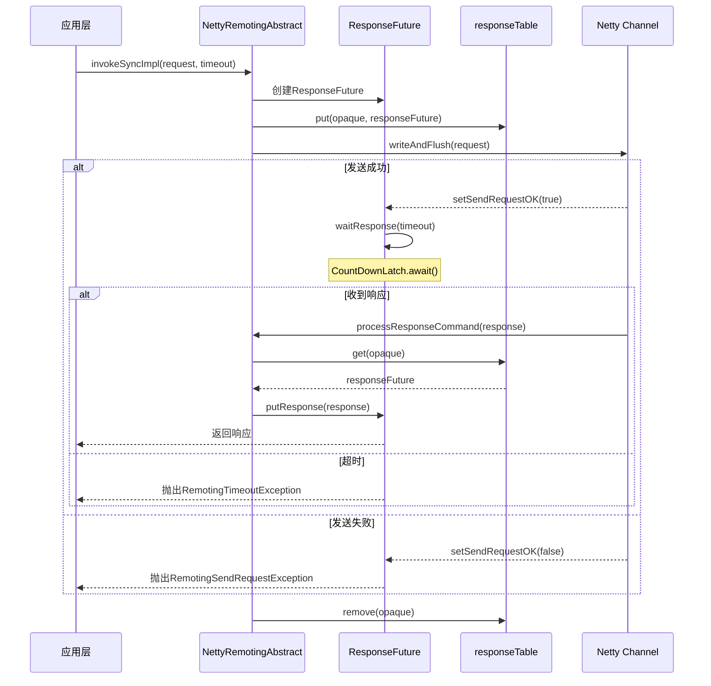
```mermaid
sequenceDiagram
    participant App as 应用层
    participant Abstract as NettyRemotingAbstract
    participant Future as ResponseFuture
    participant Table as responseTable
    participant Channel as Netty Channel

    App->>Abstract: invokeSyncImpl(request, timeout)
    Abstract->>Future: 创建ResponseFuture
    Abstract->>Table: put(opaque, responseFuture)
    Abstract->>Channel: writeAndFlush(request)
    
    alt 发送成功
        Channel-->>Future: setSendRequestOK(true)
        Future->>Future: waitResponse(timeout)
        Note over Future: CountDownLatch.await()
        
        alt 收到响应
            Channel->>Abstract: processResponseCommand(response)
            Abstract->>Table: get(opaque)
            Table-->>Abstract: responseFuture
            Abstract->>Future: putResponse(response)
            Future-->>App: 返回响应
        else 超时
            Future-->>App: 抛出RemotingTimeoutException
        end
    else 发送失败
        Channel-->>Future: setSendRequestOK(false)
        Future-->>App: 抛出RemotingSendRequestException
    end
    
    Abstract->>Table: remove(opaque)
```

**核心结论**：同步请求通过ResponseFuture和CountDownLatch实现阻塞等待，opaque标识符用于匹配请求和响应，确保响应正确返回给调用方。

**关键概念**：
- **opaque**：请求唯一标识符，用于匹配请求和响应，每次请求自增
- **ResponseFuture**：封装响应等待逻辑，包含CountDownLatch用于同步阻塞
- **responseTable**：ConcurrentHashMap，初始容量256，存储opaque到ResponseFuture的映射

**分步详解**：

| 步骤 | 操作 | 类型 | 说明 |
|------|------|------|------|
| 1 | 创建Future | 初始化 | 创建ResponseFuture对象，设置超时时间 |
| 2 | 存入响应表 | 注册 | 将opaque和Future存入responseTable |
| 3 | 发送请求 | 网络 | 异步发送请求到Channel |
| 4 | 等待响应 | 阻塞 | CountDownLatch.await()阻塞当前线程 |
| 5 | 处理响应 | 回调 | 收到响应后唤醒等待线程 |
| 6 | 清理资源 | 释放 | 从responseTable移除Future |

### 6.3 异步请求实现

[NettyRemotingAbstract.java](../remoting/src/main/java/org/apache/rocketmq/remoting/netty/NettyRemotingAbstract.java#L446-L490) 实现异步请求：

```java
public void invokeAsyncImpl(final Channel channel, final RemotingCommand request, 
    final long timeoutMillis, final InvokeCallback invokeCallback)
    throws InterruptedException, RemotingTooMuchRequestException, RemotingTimeoutException, 
           RemotingSendRequestException {
    long beginStartTime = System.currentTimeMillis();
    final int opaque = request.getOpaque();
    
    // 尝试获取异步信号量（限流保护）
    boolean acquired = this.semaphoreAsync.tryAcquire(timeoutMillis, TimeUnit.MILLISECONDS);
    if (acquired) {
        // 信号量释放器（确保只释放一次）
        final SemaphoreReleaseOnlyOnce once = new SemaphoreReleaseOnlyOnce(this.semaphoreAsync);
        long costTime = System.currentTimeMillis() - beginStartTime;
        if (timeoutMillis < costTime) {
            once.release();
            throw new RemotingTimeoutException("invokeAsyncImpl call timeout");
        }

        // 创建响应Future
        final ResponseFuture responseFuture = new ResponseFuture(
            channel, opaque, timeoutMillis - costTime, invokeCallback, once);
        this.responseTable.put(opaque, responseFuture);
        try {
            channel.writeAndFlush(request).addListener((ChannelFutureListener) f -> {
                if (f.isSuccess()) {
                    responseFuture.setSendRequestOK(true);
                    return;
                }
                // 发送失败，触发回调
                requestFail(opaque);
                log.warn("send a request command to channel <{}> failed.", 
                    RemotingHelper.parseChannelRemoteAddr(channel));
            });
        } catch (Exception e) {
            responseFuture.release();
            log.warn("send a request command to channel <" + 
                RemotingHelper.parseChannelRemoteAddr(channel) + "> Exception", e);
            throw new RemotingSendRequestException(
                RemotingHelper.parseChannelRemoteAddr(channel), e);
        }
    } else {
        // 获取信号量失败（请求过多）
        if (timeoutMillis <= 0) {
            throw new RemotingTooMuchRequestException("invokeAsyncImpl invoke too fast");
        } else {
            String info = String.format(
                "invokeAsyncImpl tryAcquire semaphore timeout, %dms, waiting thread nums: %d semaphoreAsyncValue: %d",
                timeoutMillis, this.semaphoreAsync.getQueueLength(), 
                this.semaphoreAsync.availablePermits());
            log.warn(info);
            throw new RemotingTimeoutException(info);
        }
    }
}
```

**异步请求流程图**：

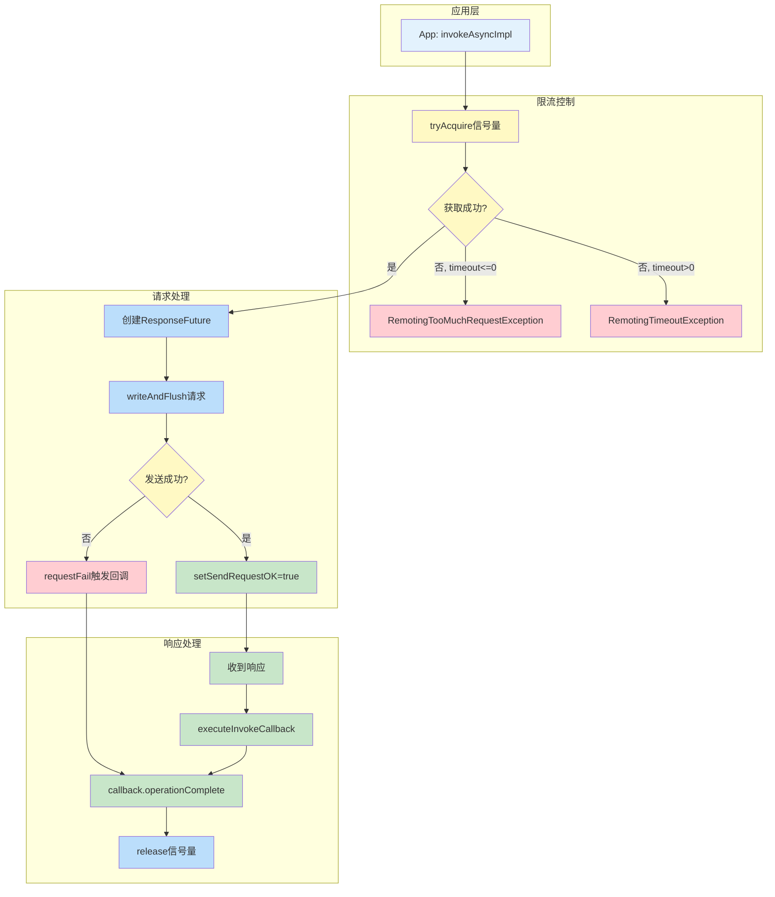
```mermaid
flowchart TD
    subgraph 应用层["应用层"]
        A["App: invokeAsyncImpl"]
    end
    
    subgraph 限流控制["限流控制"]
        B["tryAcquire信号量"]
        C{"获取成功?"}
        D["RemotingTooMuchRequestException"]
        E["RemotingTimeoutException"]
    end
    
    subgraph 请求处理["请求处理"]
        F["创建ResponseFuture"]
        G["writeAndFlush请求"]
        H{"发送成功?"}
        I["setSendRequestOK=true"]
        J["requestFail触发回调"]
    end
    
    subgraph 响应处理["响应处理"]
        K["收到响应"]
        L["executeInvokeCallback"]
        M["callback.operationComplete"]
        N["release信号量"]
    end
    
    A --> B
    B --> C
    C -->|是| F
    C -->|否, timeout<=0| D
    C -->|否, timeout>0| E
    F --> G
    G --> H
    H -->|是| I
    H -->|否| J
    I --> K
    J --> M
    K --> L
    L --> M
    M --> N
    
    style A fill:#e3f2fd
    style B fill:#fff9c4
    style C fill:#fff9c4
    style D fill:#ffcdd2
    style E fill:#ffcdd2
    style F fill:#bbdefb
    style G fill:#bbdefb
    style H fill:#fff9c4
    style I fill:#c8e6c9
    style J fill:#ffcdd2
    style K fill:#c8e6c9
    style L fill:#c8e6c9
    style M fill:#c8e6c9
    style N fill:#bbdefb
```

**核心结论**：异步请求通过信号量限流保护系统资源，使用回调机制避免线程阻塞，适合高并发场景下的请求处理。

**关键概念**：
- **semaphoreAsync**：异步请求信号量，限制同时进行的异步请求数量，默认值：服务端64个，客户端65535个
- **InvokeCallback**：异步回调接口，响应到达时执行回调逻辑
- **SemaphoreReleaseOnlyOnce**：确保信号量只释放一次，防止重复释放

**分步详解**：

| 步骤 | 操作 | 类型 | 说明 |
|------|------|------|------|
| 1 | tryAcquire | 限流 | 尝试获取异步请求信号量 |
| 2 | 创建Future | 初始化 | 创建包含回调的ResponseFuture |
| 3 | 发送请求 | 网络 | 异步发送请求到Channel |
| 4 | 等待响应 | 非阻塞 | 不阻塞线程，等待响应到达 |
| 5 | 执行回调 | 回调 | 响应到达后执行用户回调 |
| 6 | 释放信号量 | 资源释放 | 回调完成后释放信号量 |

**问题分析**：
- 信号量获取失败会导致请求被拒绝，需要合理设置信号量大小
- 回调执行在IO线程中，耗时操作会阻塞其他请求处理

### 6.4 单向请求实现

[NettyRemotingAbstract.java](../remoting/src/main/java/org/apache/rocketmq/remoting/netty/NettyRemotingAbstract.java#L523-L555) 实现单向请求：

```java
public void invokeOnewayImpl(final Channel channel, final RemotingCommand request, 
    final long timeoutMillis)
    throws InterruptedException, RemotingTooMuchRequestException, RemotingTimeoutException, 
           RemotingSendRequestException {
    // 标记为单向RPC
    request.markOnewayRPC();
    
    // 尝试获取单向信号量（限流保护）
    boolean acquired = this.semaphoreOneway.tryAcquire(timeoutMillis, TimeUnit.MILLISECONDS);
    if (acquired) {
        final SemaphoreReleaseOnlyOnce once = new SemaphoreReleaseOnlyOnce(this.semaphoreOneway);
        try {
            channel.writeAndFlush(request).addListener((ChannelFutureListener) f -> {
                // 无论成功失败，都释放信号量
                once.release();
                if (!f.isSuccess()) {
                    log.warn("send a request command to channel <" + channel.remoteAddress() + "> failed.");
                }
            });
        } catch (Exception e) {
            once.release();
            log.warn("write send a request command to channel <" + channel.remoteAddress() + "> failed.");
            throw new RemotingSendRequestException(
                RemotingHelper.parseChannelRemoteAddr(channel), e);
        }
    } else {
        if (timeoutMillis <= 0) {
            throw new RemotingTooMuchRequestException("invokeOnewayImpl invoke too fast");
        } else {
            String info = String.format(
                "invokeOnewayImpl tryAcquire semaphore timeout, %dms, waiting thread nums: %d semaphoreOnewayValue: %d",
                timeoutMillis, this.semaphoreOneway.getQueueLength(), 
                this.semaphoreOneway.availablePermits());
            log.warn(info);
            throw new RemotingTimeoutException(info);
        }
    }
}
```

## 7. 资源保护机制

### 7.1 信号量限流机制

**问题背景**：在高并发场景下，过多的并发请求会消耗大量内存（每个请求需要创建ResponseFuture并缓存），可能导致OOM。信号量机制限制同时进行的请求数量，保护系统稳定性。

**信号量限流机制**：

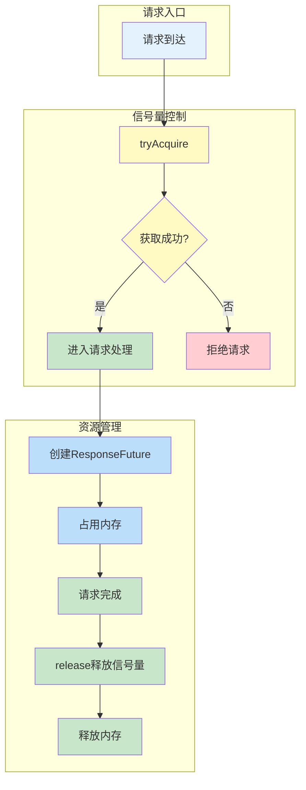
```mermaid
flowchart TD
    subgraph 请求入口["请求入口"]
        A["请求到达"]
    end
    
    subgraph 信号量控制["信号量控制"]
        B["tryAcquire"]
        C{"获取成功?"}
        D["进入请求处理"]
        E["拒绝请求"]
    end
    
    subgraph 资源管理["资源管理"]
        F["创建ResponseFuture"]
        G["占用内存"]
        H["请求完成"]
        I["release释放信号量"]
        J["释放内存"]
    end
    
    A --> B
    B --> C
    C -->|是| D
    C -->|否| E
    D --> F
    F --> G
    G --> H
    H --> I
    I --> J
    
    style A fill:#e3f2fd
    style B fill:#fff9c4
    style C fill:#fff9c4
    style D fill:#c8e6c9
    style E fill:#ffcdd2
    style F fill:#bbdefb
    style G fill:#bbdefb
    style H fill:#c8e6c9
    style I fill:#c8e6c9
    style J fill:#c8e6c9
```

**核心结论**：信号量通过限制并发请求数量，防止内存占用过高导致OOM，是保护系统稳定性的重要机制。

[NettyRemotingAbstract.java](../remoting/src/main/java/org/apache/rocketmq/remoting/netty/NettyRemotingAbstract.java#L64-L69) 定义信号量：

```java
/**
 * 限制单向请求的最大并发数，保护系统内存占用
 * 公平模式：先到先得，避免线程饥饿
 */
protected final Semaphore semaphoreOneway;

/**
 * 限制异步请求的最大并发数，保护系统内存占用
 * 公平模式：先到先得，避免线程饥饿
 */
protected final Semaphore semaphoreAsync;
```

### 7.2 信号量配置

**服务端信号量配置**：

[NettyServerConfig.java](../remoting/src/main/java/org/apache/rocketmq/remoting/netty/NettyServerConfig.java#L30-L31) 定义服务端信号量：

| 参数 | 默认值 | 说明 |
|------|-------|------|
| serverOnewaySemaphoreValue | 256 | 服务端单向请求信号量 |
| serverAsyncSemaphoreValue | 64 | 服务端异步请求信号量 |

**客户端信号量配置**：

[NettySystemConfig.java](../remoting/src/main/java/org/apache/rocketmq/remoting/netty/NettySystemConfig.java#L48-L51) 定义客户端信号量：

| 参数 | 默认值 | 说明 |
|------|-------|------|
| CLIENT_ASYNC_SEMAPHORE_VALUE | 65535 | 客户端异步请求信号量 |
| CLIENT_ONEWAY_SEMAPHORE_VALUE | 65535 | 客户端单向请求信号量 |

**信号量初始化**：

```java
// NettyRemotingAbstract构造函数
public NettyRemotingAbstract(final int permitsOneway, final int permitsAsync) {
    this.semaphoreOneway = new Semaphore(permitsOneway, true);  // 公平模式
    this.semaphoreAsync = new Semaphore(permitsAsync, true);    // 公平模式
}
```

### 7.3 超时扫描机制

**超时扫描机制**：

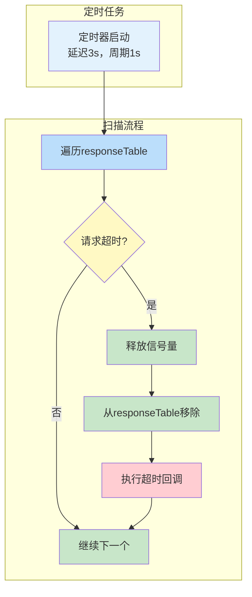
```mermaid
flowchart TD
    subgraph 定时任务["定时任务"]
        A["定时器启动<br/>延迟3s，周期1s"]
    end
    
    subgraph 扫描流程["扫描流程"]
        B["遍历responseTable"]
        C{"请求超时?"}
        D["释放信号量"]
        E["从responseTable移除"]
        F["执行超时回调"]
        G["继续下一个"]
    end
    
    A --> B
    B --> C
    C -->|是| D
    D --> E
    E --> F
    C -->|否| G
    F --> G
    
    style A fill:#e3f2fd
    style B fill:#bbdefb
    style C fill:#fff9c4
    style D fill:#c8e6c9
    style E fill:#c8e6c9
    style F fill:#ffcdd2
    style G fill:#c8e6c9
```

**核心结论**：定时扫描机制定期清理超时请求，释放占用的信号量和内存资源，防止资源泄漏。

[NettyRemotingAbstract.java](../remoting/src/main/java/org/apache/rocketmq/remoting/netty/NettyRemotingAbstract.java#L383-L405) 定期扫描超时请求：

```java
public void scanResponseTable() {
    final List<ResponseFuture> rfList = new LinkedList<>();
    Iterator<Entry<Integer, ResponseFuture>> it = this.responseTable.entrySet().iterator();
    while (it.hasNext()) {
        Entry<Integer, ResponseFuture> next = it.next();
        ResponseFuture rep = next.getValue();

        // 判断是否超时（超时时间 + 1秒容错）
        if ((rep.getBeginTimestamp() + rep.getTimeoutMillis() + 1000) <= System.currentTimeMillis()) {
            rep.release();      // 释放信号量
            it.remove();        // 从响应表中移除
            rfList.add(rep);
            log.warn("remove timeout request, " + rep);
        }
    }

    // 执行超时回调
    for (ResponseFuture rf : rfList) {
        try {
            executeInvokeCallback(rf);
        } catch (Throwable e) {
            log.warn("scanResponseTable, operationComplete Exception", e);
        }
    }
}
```

**扫描任务调度**：

[NettyRemotingServer.java](../remoting/src/main/java/org/apache/rocketmq/remoting/netty/NettyRemotingServer.java#L261-L272) 服务端扫描任务：

```java
// 启动后3秒开始，每1秒扫描一次
this.timer.scheduleAtFixedRate(new TimerTask() {
    @Override
    public void run() {
        try {
            NettyRemotingServer.this.scanResponseTable();
        } catch (Throwable e) {
            log.error("scanResponseTable exception", e);
        }
    }
}, 1000 * 3, 1000);  // 初始延迟：3s，周期：1s
```

### 7.4 failFast机制

[NettyRemotingAbstract.java](../remoting/src/main/java/org/apache/rocketmq/remoting/netty/NettyRemotingAbstract.java#L512-L521) 快速失败机制：

```java
/**
 * 将指定Channel的所有请求标记为失败，立即触发失败回调
 * @param channel 已关闭的Channel
 */
protected void failFast(final Channel channel) {
    for (Entry<Integer, ResponseFuture> entry : responseTable.entrySet()) {
        if (entry.getValue().getChannel() == channel) {
            Integer opaque = entry.getKey();
            if (opaque != null) {
                requestFail(opaque);
            }
        }
    }
}
```

**触发时机**：当Channel关闭时，立即将所有等待该Channel响应的请求标记为失败，避免请求长时间等待。

### 7.5 ResponseFuture详解

#### 7.5.1 核心字段

**ResponseFuture类图**：

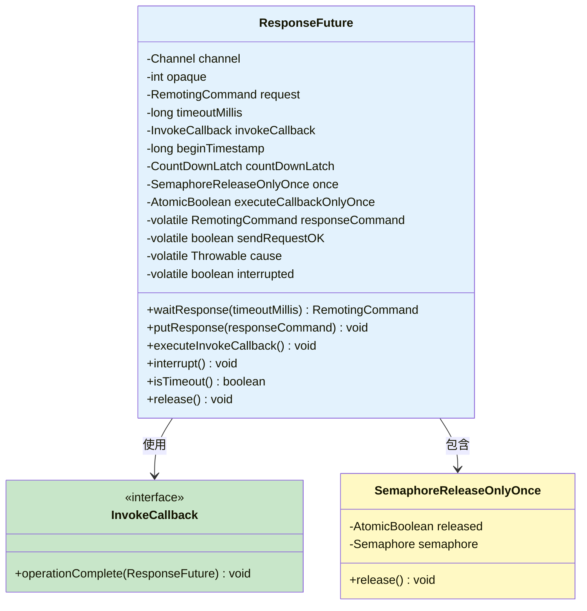
```mermaid
classDiagram
    class ResponseFuture {
        -Channel channel
        -int opaque
        -RemotingCommand request
        -long timeoutMillis
        -InvokeCallback invokeCallback
        -long beginTimestamp
        -CountDownLatch countDownLatch
        -SemaphoreReleaseOnlyOnce once
        -AtomicBoolean executeCallbackOnlyOnce
        -volatile RemotingCommand responseCommand
        -volatile boolean sendRequestOK
        -volatile Throwable cause
        -volatile boolean interrupted
        +waitResponse(timeoutMillis) RemotingCommand
        +putResponse(responseCommand) void
        +executeInvokeCallback() void
        +interrupt() void
        +isTimeout() boolean
        +release() void
    }
    
    class InvokeCallback {
        <<interface>>
        +operationComplete(ResponseFuture) void
    }
    
    class SemaphoreReleaseOnlyOnce {
        -AtomicBoolean released
        -Semaphore semaphore
        +release() void
    }
    
    ResponseFuture --> InvokeCallback : 使用
    ResponseFuture --> SemaphoreReleaseOnlyOnce : 包含
    
    style ResponseFuture fill:#e3f2fd
    style InvokeCallback fill:#c8e6c9
    style SemaphoreReleaseOnlyOnce fill:#fff9c4
```

**核心结论**：ResponseFuture封装了请求-响应的完整生命周期，通过CountDownLatch实现同步等待，通过InvokeCallback实现异步回调，通过SemaphoreReleaseOnlyOnce确保信号量只释放一次。

[ResponseFuture.java](../remoting/src/main/java/org/apache/rocketmq/remoting/netty/ResponseFuture.java#L27-L42) 定义响应Future：

```java
public class ResponseFuture {
    private final Channel channel;              // 关联的Channel
    private final int opaque;                   // 请求ID，用于匹配请求和响应
    private final RemotingCommand request;      // 请求命令（可选，用于中断请求时获取请求信息）
    private final long timeoutMillis;           // 超时时间（毫秒）
    private final InvokeCallback invokeCallback; // 异步回调接口
    private final long beginTimestamp = System.currentTimeMillis(); // 请求开始时间戳（毫秒）
    
    private final CountDownLatch countDownLatch = new CountDownLatch(1); // 同步等待锁，初始值为1
    private final SemaphoreReleaseOnlyOnce once; // 信号量释放器，确保信号量只释放一次
    
    private final AtomicBoolean executeCallbackOnlyOnce = new AtomicBoolean(false); // 回调执行标志，确保回调只执行一次
    private volatile RemotingCommand responseCommand; // 响应命令（volatile保证可见性）
    private volatile boolean sendRequestOK = true;    // 发送是否成功（volatile保证可见性）
    private volatile Throwable cause;                  // 异常原因（volatile保证可见性）
    private volatile boolean interrupted = false;      // 是否被中断（volatile保证可见性）
}
```

**字段详细说明**：

| 字段 | 类型 | 说明 | 默认值 |
|------|------|------|--------|
| channel | Channel | 关联的Netty Channel，用于发送请求和接收响应 | 构造时传入 |
| opaque | int | 请求唯一标识符，用于匹配请求和响应，由RemotingCommand生成 | 构造时传入 |
| request | RemotingCommand | 请求命令对象，用于中断时获取请求信息 | 构造时传入（可选） |
| timeoutMillis | long | 超时时间，单位：毫秒 | 构造时传入 |
| invokeCallback | InvokeCallback | 异步回调接口，响应到达时执行 | 构造时传入（同步请求为null） |
| beginTimestamp | long | 请求开始时间戳，单位：毫秒 | 创建时的系统时间 |
| countDownLatch | CountDownLatch | 同步计数器，初始值为1，用于阻塞等待响应 | new CountDownLatch(1) |
| once | SemaphoreReleaseOnlyOnce | 信号量释放器，确保信号量只释放一次 | 构造时传入 |
| executeCallbackOnlyOnce | AtomicBoolean | 原子布尔值，确保回调只执行一次 | false |
| responseCommand | RemotingCommand | 响应命令，收到响应后设置 | null |
| sendRequestOK | boolean | 请求是否成功发送到网络 | true |
| cause | Throwable | 异常原因，发送失败或处理异常时设置 | null |
| interrupted | boolean | 是否被中断，用于中断拉取请求 | false |

#### 7.5.2 核心方法协作关系

**同步等待响应**：

[ResponseFuture.java](../remoting/src/main/java/org/apache/rocketmq/remoting/netty/ResponseFuture.java#L83-L91) 实现同步等待：

```java
// 阻塞等待响应，直到putResponse被调用或超时
public RemotingCommand waitResponse(final long timeoutMillis) throws InterruptedException {
    this.countDownLatch.await(timeoutMillis, TimeUnit.MILLISECONDS);
    return this.responseCommand;
}

// 设置响应并唤醒等待线程
public void putResponse(final RemotingCommand responseCommand) {
    this.responseCommand = responseCommand;
    this.countDownLatch.countDown();  // 计数器减1，唤醒等待线程
}
```

**执行回调**：

[ResponseFuture.java](../remoting/src/main/java/org/apache/rocketmq/remoting/netty/ResponseFuture.java#L59-L65) 确保回调只执行一次：

```java
public void executeInvokeCallback() {
    if (invokeCallback != null) {
        // 使用CAS确保回调只执行一次，避免重复执行
        if (this.executeCallbackOnlyOnce.compareAndSet(false, true)) {
            invokeCallback.operationComplete(this);
        }
    }
}
```

**中断请求**：

[ResponseFuture.java](../remoting/src/main/java/org/apache/rocketmq/remoting/netty/ResponseFuture.java#L67-L70) 中断正在等待的请求：

```java
public void interrupt() {
    interrupted = true;              // 标记为已中断
    executeInvokeCallback();         // 立即触发回调，通知调用方
}
```

**超时检测**：

[ResponseFuture.java](../remoting/src/main/java/org/apache/rocketmq/remoting/netty/ResponseFuture.java#L78-L81) 判断请求是否超时：

```java
public boolean isTimeout() {
    long diff = System.currentTimeMillis() - this.beginTimestamp;
    return diff > this.timeoutMillis;  // 当前时间 - 开始时间 > 超时时间
}
```

**释放信号量**：

[ResponseFuture.java](../remoting/src/main/java/org/apache/rocketmq/remoting/netty/ResponseFuture.java#L72-L76) 释放信号量资源：

```java
public void release() {
    if (this.once != null) {
        this.once.release();  // 释放信号量，确保只释放一次
    }
}
```

**方法协作流程图**：

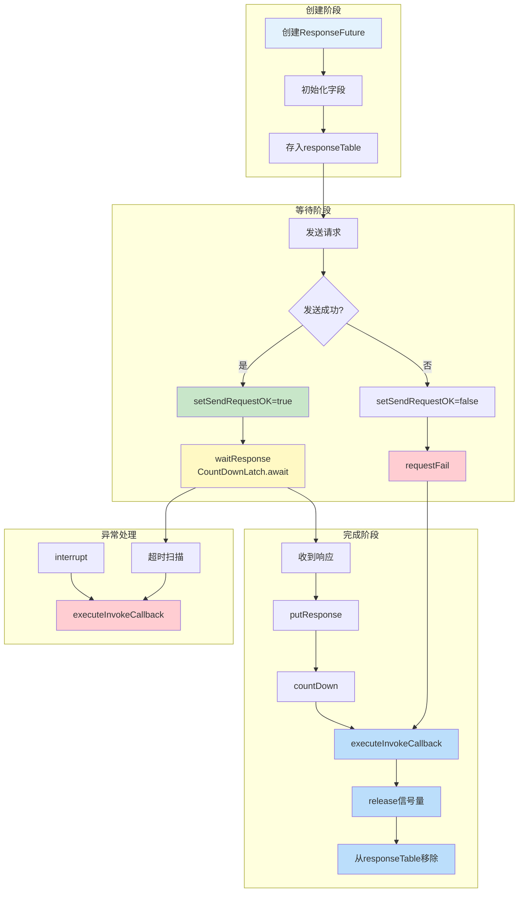
```mermaid
flowchart TD
    subgraph 创建阶段["创建阶段"]
        A["创建ResponseFuture"]
        B["初始化字段"]
        C["存入responseTable"]
    end
    
    subgraph 等待阶段["等待阶段"]
        D["发送请求"]
        E{"发送成功?"}
        F["setSendRequestOK=true"]
        G["waitResponse<br/>CountDownLatch.await"]
        H["setSendRequestOK=false"]
        I["requestFail"]
    end
    
    subgraph 完成阶段["完成阶段"]
        J["收到响应"]
        K["putResponse"]
        L["countDown"]
        M["executeInvokeCallback"]
        N["release信号量"]
        O["从responseTable移除"]
    end
    
    subgraph 异常阶段["异常处理"]
        P["超时扫描"]
        Q["interrupt"]
        R["executeInvokeCallback"]
    end
    
    A --> B --> C --> D --> E
    E -->|是| F --> G
    E -->|否| H --> I --> M
    G --> J
    J --> K --> L --> M
    M --> N --> O
    G --> P
    P --> R
    Q --> R
    
    style A fill:#e3f2fd
    style F fill:#c8e6c9
    style G fill:#fff9c4
    style I fill:#ffcdd2
    style M fill:#bbdefb
    style N fill:#bbdefb
    style O fill:#bbdefb
    style R fill:#ffcdd2
```

**核心结论**：ResponseFuture通过状态机管理请求生命周期，确保每个请求只被处理一次，避免资源泄漏和重复回调。

**关键概念**：
- **CountDownLatch**：同步计数器，用于阻塞等待响应
- **executeCallbackOnlyOnce**：原子布尔值，确保回调只执行一次
- **SemaphoreReleaseOnlyOnce**：确保信号量只释放一次

**状态转换说明**：

| 状态 | 触发条件 | 后续操作 |
|------|---------|---------|
| Created | 创建Future对象 | 等待发送请求 |
| Waiting | 请求发送成功 | 等待响应或超时 |
| Failed | 请求发送失败 | 执行失败回调 |
| Completed | 收到响应 | 执行成功回调 |
| Timeout | 超时未收到响应 | 执行超时回调 |
| Interrupted | 被中断 | 执行中断回调 |

#### 7.5.3 InvokeCallback接口

[InvokeCallback.java](../remoting/src/main/java/org/apache/rocketmq/remoting/InvokeCallback.java) 定义异步回调接口：

```java
public interface InvokeCallback {
    /**
     * 响应到达或请求失败时调用
     * @param responseFuture 响应Future对象，包含请求和响应信息
     */
    void operationComplete(final ResponseFuture responseFuture);
}
```

**使用场景**：

| 场景 | 说明 |
|------|------|
| 异步请求响应 | 收到响应后执行回调处理业务逻辑 |
| 请求失败处理 | 发送失败或超时时执行回调进行错误处理 |
| 请求中断处理 | 请求被中断时执行回调进行清理 |

**回调执行时机**：

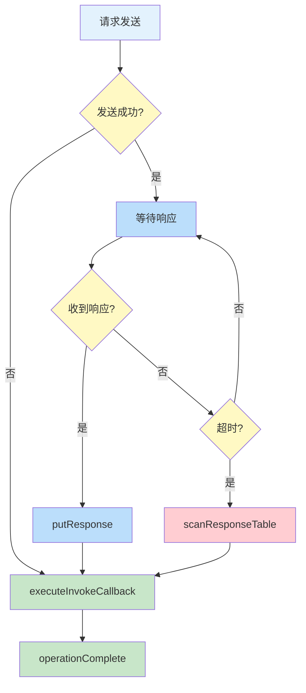
```mermaid
flowchart TD
    A["请求发送"] --> B{"发送成功?"}
    B -->|是| C["等待响应"]
    B -->|否| D["executeInvokeCallback"]
    C --> E{"收到响应?"}
    E -->|是| F["putResponse"]
    E -->|否| G{"超时?"}
    G -->|是| H["scanResponseTable"]
    G -->|否| C
    F --> D
    H --> D
    D --> I["operationComplete"]
    
    style A fill:#e3f2fd
    style B fill:#fff9c4
    style C fill:#bbdefb
    style D fill:#c8e6c9
    style E fill:#fff9c4
    style F fill:#bbdefb
    style G fill:#fff9c4
    style H fill:#ffcdd2
    style I fill:#c8e6c9
```

#### 7.5.4 SemaphoreReleaseOnlyOnce详解

[SemaphoreReleaseOnlyOnce.java](../remoting/src/main/java/org/apache/rocketmq/remoting/common/SemaphoreReleaseOnlyOnce.java) 确保信号量只释放一次：

```java
public class SemaphoreReleaseOnlyOnce {
    private final AtomicBoolean released = new AtomicBoolean(false);  // 释放标志，初始为false
    private final Semaphore semaphore;  // 关联的信号量

    public SemaphoreReleaseOnlyOnce(Semaphore semaphore) {
        this.semaphore = semaphore;
    }

    public void release() {
        if (this.semaphore != null) {
            // 使用CAS确保只释放一次，避免信号量计数错误
            if (this.released.compareAndSet(false, true)) {
                this.semaphore.release();
            }
        }
    }
}
```

**问题背景**：在异步请求处理中，可能存在多个地方触发信号量释放（如正常响应、超时扫描、请求失败等），如果多次释放信号量会导致信号量计数错误，进而影响限流功能。

**解决方案**：使用原子布尔值确保信号量只释放一次，即使多次调用release()方法，也只会真正释放一次信号量。

**使用示例**：

```java
// 创建信号量释放器
final SemaphoreReleaseOnlyOnce once = new SemaphoreReleaseOnlyOnce(semaphoreAsync);

// 在响应处理时释放
once.release();  // 第一次调用，信号量释放成功

// 在超时扫描时释放
once.release();  // 第二次调用，不会重复释放信号量
```

## 8. RPC Hook机制

### 8.1 Hook接口

[RPCHook.java](../remoting/src/main/java/org/apache/rocketmq/remoting/RPCHook.java) 定义RPC钩子接口：

```java
public interface RPCHook {
    /**
     * 请求前置钩子，在请求处理前执行
     * @param remoteAddr 远程地址
     * @param request 请求命令
     * @throws Exception 抛出异常可中断请求处理
     */
    void doBeforeRequest(final String remoteAddr, final RemotingCommand request);

    /**
     * 响应后置钩子，在响应返回前执行
     * @param remoteAddr 远程地址
     * @param request 请求命令
     * @param response 响应命令
     * @throws Exception 抛出异常可中断响应返回
     */
    void doAfterResponse(final String remoteAddr, final RemotingCommand request,
                         final RemotingCommand response);
}
```

[NettyRemotingAbstract.java](../remoting/src/main/java/org/apache/rocketmq/remoting/netty/NettyRemotingAbstract.java#L165-L179) 提供RPC钩子调用：

```java
protected void doBeforeRpcHooks(String addr, RemotingCommand request) {
    if (rpcHooks.size() > 0) {
        for (RPCHook rpcHook : rpcHooks) {
            rpcHook.doBeforeRequest(addr, request);  // 按顺序执行前置钩子
        }
    }
}

public void doAfterRpcHooks(String addr, RemotingCommand request, RemotingCommand response) {
    if (rpcHooks.size() > 0) {
        for (RPCHook rpcHook : rpcHooks) {
            rpcHook.doAfterResponse(addr, request, response);  // 按顺序执行后置钩子
        }
    }
}
```

**Hook注册方法**：

[NettyRemotingAbstract.java](../remoting/src/main/java/org/apache/rocketmq/remoting/netty/NettyRemotingAbstract.java#L360-L368) 提供Hook注册：

```java
// 注册单个Hook，避免重复注册
public void registerRPCHook(RPCHook rpcHook) {
    if (rpcHook != null && !rpcHooks.contains(rpcHook)) {
        rpcHooks.add(rpcHook);
    }
}

// 清除所有Hook
public void clearRPCHook() {
    rpcHooks.clear();
}
```

### 8.2 Hook调用时机

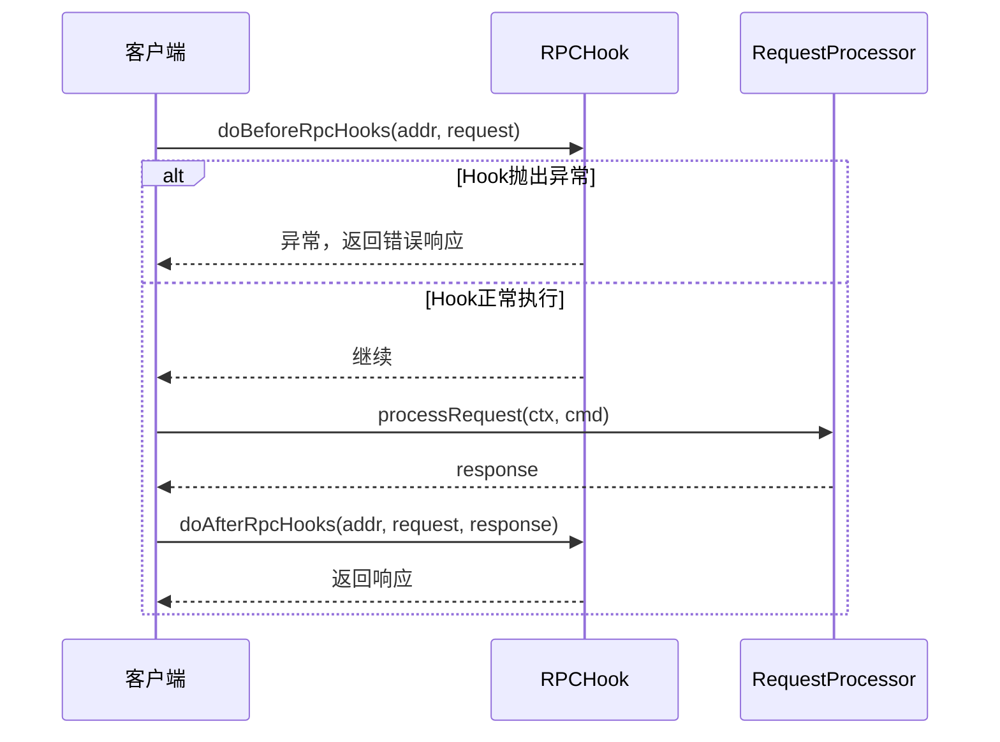
```mermaid
sequenceDiagram
    participant Client as 客户端
    participant Hook as RPCHook
    participant Processor as RequestProcessor

    Client->>Hook: doBeforeRpcHooks(addr, request)
    alt Hook抛出异常
        Hook-->>Client: 异常，返回错误响应
    else Hook正常执行
        Hook-->>Client: 继续
        Client->>Processor: processRequest(ctx, cmd)
        Processor-->>Client: response
        Client->>Hook: doAfterRpcHooks(addr, request, response)
        Hook-->>Client: 返回响应
    end
```

**核心结论**：RPC Hook在请求处理前后插入自定义逻辑，实现权限验证、日志记录、性能监控等功能，异常时可中断请求处理流程。

**关键概念**：
- **doBeforeRequest**：请求前置钩子，可用于权限验证、参数校验
- **doAfterResponse**：响应后置钩子，可用于日志记录、性能统计
- **Hook链**：支持注册多个Hook，按顺序执行

**应用场景**：

| 场景 | Hook类型 | 说明 |
|------|---------|------|
| 权限验证 | doBeforeRequest | 检查用户权限，拒绝非法请求 |
| 流量控制 | doBeforeRequest | 实现请求限流、熔断 |
| 日志记录 | doAfterResponse | 记录请求响应日志 |
| 性能监控 | doBeforeRequest + doAfterResponse | 统计请求耗时 |
| 链路追踪 | doBeforeRequest | 注入TraceID，实现分布式追踪 |

## 9. 配置参数汇总

**配置参数架构概览**：

```mermaid
flowchart TD
    subgraph 系统属性["系统属性配置"]
        A["com.rocketmq.remoting.*"]
    end
    
    subgraph 服务端配置["服务端配置"]
        B["NettyServerConfig"]
        C["Worker线程: 8个"]
        D["Selector线程: 3个"]
        E["异步信号量: 64"]
        F["单向信号量: 256"]
        G["空闲超时: 120s"]
    end
    
    subgraph 客户端配置["客户端配置"]
        H["NettyClientConfig"]
        I["Worker线程: 4个"]
        J["连接超时: 3000ms"]
        K["异步信号量: 65535"]
        L["单向信号量: 65535"]
        M["空闲超时: 120s"]
    end
    
    subgraph TCP参数["TCP参数"]
        N["SO_BACKLOG: 1024"]
        O["TCP_NODELAY: true"]
        P["SO_KEEPALIVE: false"]
    end
    
    A --> B
    A --> H
    B --> C
    B --> D
    B --> E
    B --> F
    B --> G
    H --> I
    H --> J
    H --> K
    H --> L
    H --> M
    B --> N
    B --> O
    B --> P
    H --> O
    H --> P
    
    style A fill:#fff9c4
    style B fill:#e3f2fd
    style H fill:#e3f2fd
    style N fill:#c8e6c9
    style O fill:#c8e6c9
    style P fill:#c8e6c9
```

**核心结论**：RocketMQ网络配置分为三层：系统属性（最高优先级）、服务端/客户端配置类、TCP参数配置，通过合理的参数调优可以显著提升网络性能。

### 9.1 服务端配置

[NettyServerConfig.java](../remoting/src/main/java/org/apache/rocketmq/remoting/netty/NettyServerConfig.java) 完整配置：

| 参数 | 默认值 | 单位 | 说明 |
|------|-------|------|------|
| bindAddress | "0.0.0.0" | - | 绑定地址，监听所有网卡 |
| listenPort | 0 | - | 监听端口，0表示随机分配 |
| serverWorkerThreads | 8 | 个 | Worker线程数，处理编解码和业务逻辑 |
| serverCallbackExecutorThreads | 0 | 个 | 回调线程数，<=0时使用4个线程 |
| serverSelectorThreads | 3 | 个 | Selector线程数，处理IO多路复用 |
| serverOnewaySemaphoreValue | 256 | 个 | 单向请求信号量，限制并发单向请求数 |
| serverAsyncSemaphoreValue | 64 | 个 | 异步请求信号量，限制并发异步请求数 |
| serverChannelMaxIdleTimeSeconds | 120 | s | Channel空闲超时时间，超时后关闭连接 |
| serverSocketSndBufSize | 0 | B | Socket发送缓冲区大小，0表示使用系统默认 |
| serverSocketRcvBufSize | 0 | B | Socket接收缓冲区大小，0表示使用系统默认 |
| writeBufferHighWaterMark | 0 | B | 写缓冲区高水位线，超过此值channel不可写 |
| writeBufferLowWaterMark | 0 | B | 写缓冲区低水位线，低于此值channel可写 |
| serverSocketBacklog | 1024 | 个 | 连接等待队列长度，来自NettySystemConfig |
| serverPooledByteBufAllocatorEnable | true | - | 是否启用内存池，减少GC压力 |
| useEpollNativeSelector | false | - | 是否使用Epoll（仅Linux有效） |

**配置来源说明**：

| 参数 | 来源 | 说明 |
|------|------|------|
| serverSocketSndBufSize | NettySystemConfig.socketSndbufSize | 默认值0，可通过系统属性配置 |
| serverSocketRcvBufSize | NettySystemConfig.socketRcvbufSize | 默认值0，可通过系统属性配置 |
| writeBufferHighWaterMark | NettySystemConfig.writeBufferHighWaterMark | 默认值0，可通过系统属性配置 |
| writeBufferLowWaterMark | NettySystemConfig.writeBufferLowWaterMark | 默认值0，可通过系统属性配置 |
| serverSocketBacklog | NettySystemConfig.socketBacklog | 默认值1024，可通过系统属性配置 |

### 9.2 客户端配置

[NettyClientConfig.java](../remoting/src/main/java/org/apache/rocketmq/remoting/netty/NettyClientConfig.java) 完整配置：

| 参数 | 默认值 | 单位 | 说明 |
|------|-------|------|------|
| clientWorkerThreads | 4 | 个 | Worker线程数，来自NettySystemConfig.clientWorkerSize |
| clientCallbackExecutorThreads | CPU核心数 | 个 | 回调线程数，默认为CPU核心数 |
| clientOnewaySemaphoreValue | 65535 | 个 | 单向请求信号量，来自NettySystemConfig |
| clientAsyncSemaphoreValue | 65535 | 个 | 异步请求信号量，来自NettySystemConfig |
| connectTimeoutMillis | 3000 | ms | 连接超时时间，来自NettySystemConfig |
| channelNotActiveInterval | 60000 | ms | Channel不活跃检测间隔，超过此时间无响应则关闭 |
| clientChannelMaxIdleTimeSeconds | 120 | s | Channel空闲超时时间，来自NettySystemConfig |
| clientSocketSndBufSize | 0 | B | Socket发送缓冲区大小，0表示使用系统默认 |
| clientSocketRcvBufSize | 0 | B | Socket接收缓冲区大小，0表示使用系统默认 |
| clientPooledByteBufAllocatorEnable | false | - | 是否启用内存池，客户端默认不启用 |
| clientCloseSocketIfTimeout | true | - | 超时是否关闭Socket，来自NettySystemConfig |
| useTLS | false | - | 是否使用TLS加密传输 |
| writeBufferHighWaterMark | 0 | B | 写缓冲区高水位线 |
| writeBufferLowWaterMark | 0 | B | 写缓冲区低水位线 |
| disableCallbackExecutor | false | - | 是否禁用回调线程池，禁用后在IO线程执行回调 |
| disableNettyWorkerGroup | false | - | 是否禁用Netty Worker Group |

### 9.3 系统属性配置

[NettySystemConfig.java](../remoting/src/main/java/org/apache/rocketmq/remoting/netty/NettySystemConfig.java) 系统属性：

| 系统属性 | 默认值 | 单位 | 说明 |
|---------|-------|------|------|
| com.rocketmq.remoting.nettyPooledByteBufAllocatorEnable | false | - | 是否启用内存池 |
| com.rocketmq.remoting.socket.sndbuf.size | 0 | B | Socket发送缓冲区大小 |
| com.rocketmq.remoting.socket.rcvbuf.size | 0 | B | Socket接收缓冲区大小 |
| com.rocketmq.remoting.socket.backlog | 1024 | 个 | 连接等待队列长度 |
| com.rocketmq.remoting.clientAsyncSemaphoreValue | 65535 | 个 | 客户端异步信号量 |
| com.rocketmq.remoting.clientOnewaySemaphoreValue | 65535 | 个 | 客户端单向信号量 |
| com.rocketmq.remoting.client.worker.size | 4 | 个 | 客户端Worker线程数 |
| com.rocketmq.remoting.client.connect.timeout | 3000 | ms | 连接超时时间 |
| com.rocketmq.remoting.client.channel.maxIdleTimeSeconds | 120 | s | Channel空闲超时时间 |
| com.rocketmq.remoting.client.closeSocketIfTimeout | true | - | 超时是否关闭Socket |
| com.rocketmq.remoting.write.buffer.high.water.mark | 0 | B | 写缓冲区高水位线 |
| com.rocketmq.remoting.write.buffer.low.water.mark | 0 | B | 写缓冲区低水位线 |

**配置使用示例**：

```bash
# 启动时通过JVM参数设置
java -Dcom.rocketmq.remoting.socket.backlog=2048 \
     -Dcom.rocketmq.remoting.client.connect.timeout=5000 \
     -jar rocketmq-broker.jar
```

**配置优先级**：系统属性 > 配置文件 > 默认值

---
