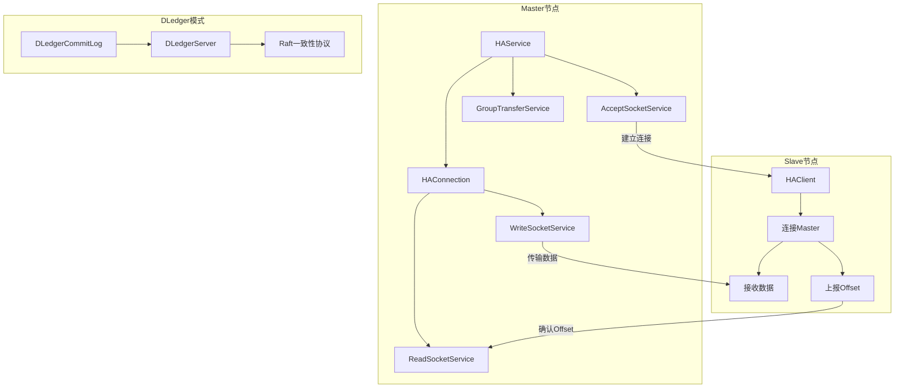
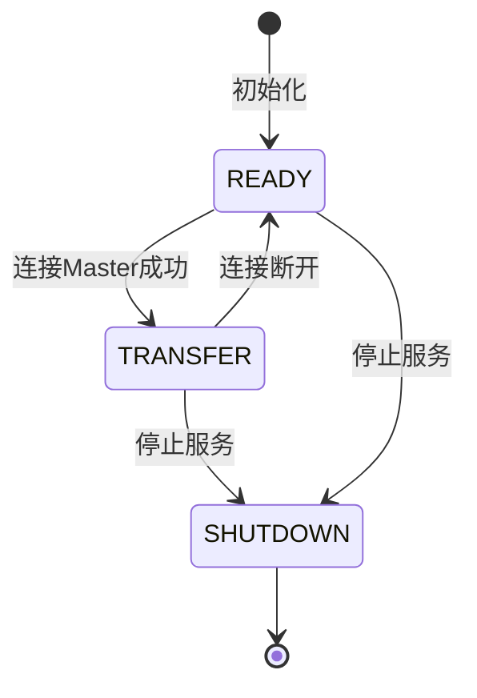
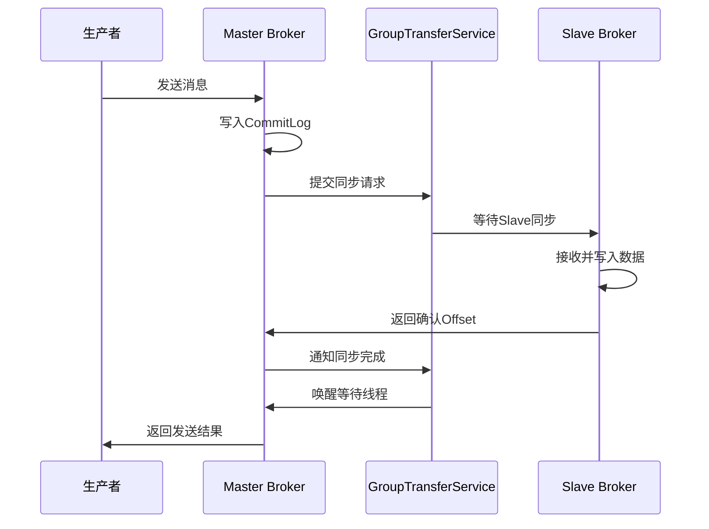
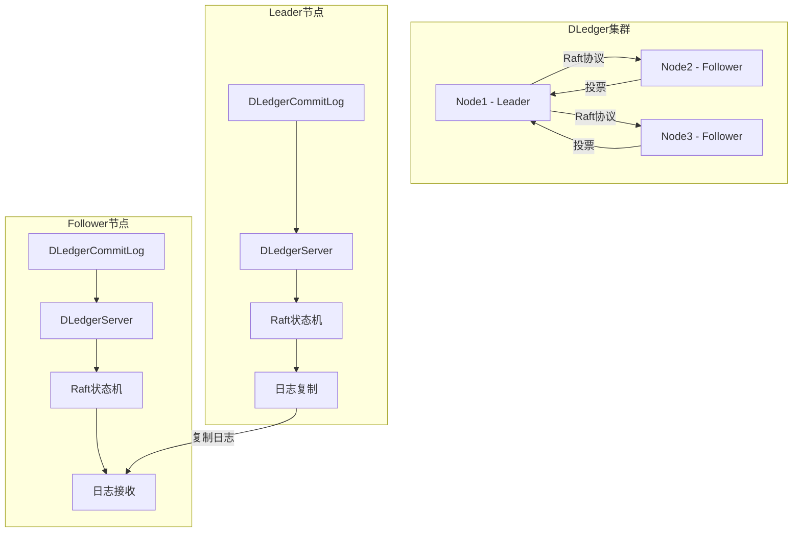
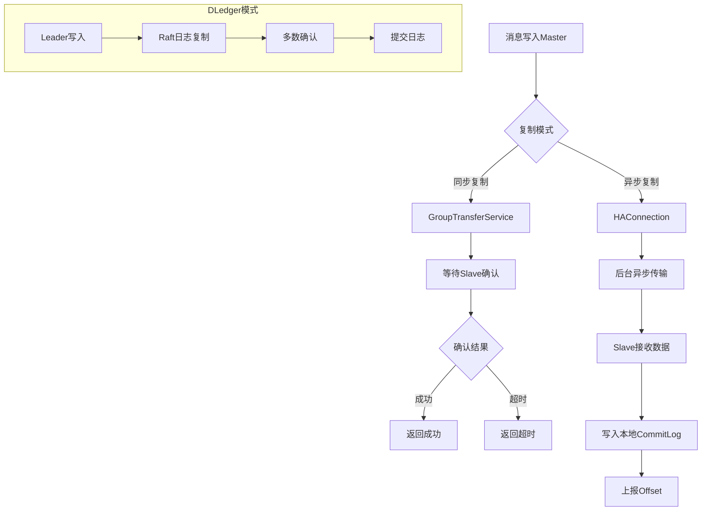

# 05-高可用与主从复制源码解析

## 1. 模块概述

RocketMQ的高可用（HA）机制是保证消息可靠性的核心组件，主要通过主从复制实现数据的冗余备份。当Master节点发生故障时，Slave节点可以接管服务，确保消息不丢失、服务不中断。

### 1.1 核心功能

- **主从复制**：Master节点将消息实时同步到Slave节点
- **同步复制**：消息写入Master后，等待Slave确认才返回成功
- **异步复制**：消息写入Master后立即返回，后台异步同步到Slave
- **自动切换**：支持Master/Slave角色的自动切换（DLedger模式）
- **流量控制**：限制主从同步的传输速率，避免影响正常服务

### 1.2 架构设计



## 2. 核心接口与实现

### 2.1 HAService接口

HAService是高可用服务的顶层接口，定义了HA服务的核心操作。

**源码位置**：[HAService.java](store/src/main/java/org/apache/rocketmq/store/ha/HAService.java)

```java
public interface HAService {
    void init(DefaultMessageStore defaultMessageStore) throws IOException;
    void start() throws Exception;
    void shutdown();
    boolean changeToMaster(int masterEpoch);
    boolean changeToSlave(String newMasterAddr, int newMasterEpoch, Long slaveId);
    void updateMasterAddress(String newAddr);
    int inSyncReplicasNums(long masterPutWhere);
    AtomicInteger getConnectionCount();
    void putRequest(final CommitLog.GroupCommitRequest request);
    List<HAConnection> getConnectionList();
    HAClient getHAClient();
    AtomicLong getPush2SlaveMaxOffset();
    HARuntimeInfo getRuntimeInfo(final long masterPutWhere);
    WaitNotifyObject getWaitNotifyObject();
    boolean isSlaveOK(long masterPutWhere);
}
```

**核心方法说明**：

| 方法 | 说明 |
|------|------|
| init | 初始化HA服务，创建相关组件 |
| start | 启动HA服务 |
| shutdown | 关闭HA服务 |
| changeToMaster | 切换为Master角色 |
| changeToSlave | 切换为Slave角色 |
| inSyncReplicasNums | 获取同步副本数量 |
| getConnectionCount | 获取当前连接数 |
| putRequest | 提交同步请求 |
| getPush2SlaveMaxOffset | 获取已推送到Slave的最大偏移量 |

### 2.2 DefaultHAService实现

DefaultHAService是HAService的默认实现，负责Master节点的HA服务管理。

**源码位置**：[DefaultHAService.java](store/src/main/java/org/apache/rocketmq/store/ha/DefaultHAService.java)

```java
public class DefaultHAService implements HAService {
    protected final AtomicInteger connectionCount = new AtomicInteger(0);
    protected final List<HAConnection> connectionList = new LinkedList<>();
    protected AcceptSocketService acceptSocketService;
    protected DefaultMessageStore defaultMessageStore;
    protected WaitNotifyObject waitNotifyObject = new WaitNotifyObject();
    protected AtomicLong push2SlaveMaxOffset = new AtomicLong(0);
    protected GroupTransferService groupTransferService;
    protected HAClient haClient;
    
    @Override
    public void init(final DefaultMessageStore defaultMessageStore) throws IOException {
        this.defaultMessageStore = defaultMessageStore;
        this.acceptSocketService = new DefaultAcceptSocketService(
            defaultMessageStore.getMessageStoreConfig());
        this.groupTransferService = new GroupTransferService(this, defaultMessageStore);
        if (this.defaultMessageStore.getMessageStoreConfig().getBrokerRole() == BrokerRole.SLAVE) {
            this.haClient = new DefaultHAClient(this.defaultMessageStore);
        }
    }
    
    @Override
    public void start() throws Exception {
        this.acceptSocketService.beginAccept();
        this.acceptSocketService.start();
        this.groupTransferService.start();
        if (haClient != null) {
            this.haClient.start();
        }
    }
    
    public void notifyTransferSome(final long offset) {
        for (long value = this.push2SlaveMaxOffset.get(); offset > value; ) {
            boolean ok = this.push2SlaveMaxOffset.compareAndSet(value, offset);
            if (ok) {
                this.groupTransferService.notifyTransferSome();
                break;
            } else {
                value = this.push2SlaveMaxOffset.get();
            }
        }
    }
}
```

**组件说明**：

| 组件 | 说明 |
|------|------|
| connectionCount | 当前Slave连接数 |
| connectionList | Slave连接列表 |
| acceptSocketService | 接受Slave连接的服务 |
| groupTransferService | 组传输服务，处理同步复制 |
| haClient | HA客户端（Slave节点使用） |
| push2SlaveMaxOffset | 已推送到Slave的最大偏移量 |

## 3. HA连接管理

### 3.1 HAConnection接口

HAConnection定义了Master与Slave之间的连接接口。

**源码位置**：[HAConnection.java](store/src/main/java/org/apache/rocketmq/store/ha/HAConnection.java)

```java
public interface HAConnection {
    void start();
    void shutdown();
    void close();
    SocketChannel getSocketChannel();
    HAConnectionState getCurrentState();
    String getClientAddress();
    long getTransferredByteInSecond();
    long getTransferFromWhere();
    long getSlaveAckOffset();
}
```

### 3.2 DefaultHAConnection实现

DefaultHAConnection实现了具体的HA连接，包含读服务和写服务两个线程。

**源码位置**：[DefaultHAConnection.java](store/src/main/java/org/apache/rocketmq/store/ha/DefaultHAConnection.java)

```java
public class DefaultHAConnection implements HAConnection {
    private final DefaultHAService haService;
    private final SocketChannel socketChannel;
    private final String clientAddress;
    private WriteSocketService writeSocketService;
    private ReadSocketService readSocketService;
    private volatile HAConnectionState currentState = HAConnectionState.TRANSFER;
    private volatile long slaveRequestOffset = -1;
    private volatile long slaveAckOffset = -1;
    private FlowMonitor flowMonitor;

    public DefaultHAConnection(final DefaultHAService haService, 
                               final SocketChannel socketChannel) throws IOException {
        this.haService = haService;
        this.socketChannel = socketChannel;
        this.clientAddress = this.socketChannel.socket().getRemoteSocketAddress().toString();
        this.socketChannel.configureBlocking(false);
        this.socketChannel.socket().setSoLinger(false, -1);
        this.socketChannel.socket().setTcpNoDelay(true);
        this.writeSocketService = new WriteSocketService(this.socketChannel);
        this.readSocketService = new ReadSocketService(this.socketChannel);
        this.haService.getConnectionCount().incrementAndGet();
        this.flowMonitor = new FlowMonitor(
            haService.getDefaultMessageStore().getMessageStoreConfig());
    }

    public void start() {
        changeCurrentState(HAConnectionState.TRANSFER);
        this.flowMonitor.start();
        this.readSocketService.start();
        this.writeSocketService.start();
    }
}
```

### 3.3 WriteSocketService写服务

WriteSocketService负责向Slave传输数据。

```java
class WriteSocketService extends ServiceThread {
    private final Selector selector;
    private final SocketChannel socketChannel;
    private final int headerSize = 8 + 4;
    private final ByteBuffer byteBufferHeader = ByteBuffer.allocate(headerSize);
    private long nextTransferFromWhere = -1;
    private SelectMappedBufferResult selectMappedBufferResult;
    private boolean lastWriteOver = true;
    private long lastWriteTimestamp = System.currentTimeMillis();

    @Override
    public void run() {
        log.info(this.getServiceName() + " service started");

        while (!this.isStopped()) {
            try {
                this.selector.select(1000);

                if (-1 == DefaultHAConnection.this.slaveRequestOffset) {
                    Thread.sleep(10);
                    continue;
                }

                if (-1 == this.nextTransferFromWhere) {
                    if (0 == DefaultHAConnection.this.slaveRequestOffset) {
                        long masterOffset = DefaultHAConnection.this.haService
                            .getDefaultMessageStore().getCommitLog().getMaxOffset();
                        masterOffset = masterOffset - (masterOffset % 
                            DefaultHAConnection.this.haService.getDefaultMessageStore()
                            .getMessageStoreConfig().getMappedFileSizeCommitLog());
                        if (masterOffset < 0) {
                            masterOffset = 0;
                        }
                        this.nextTransferFromWhere = masterOffset;
                    } else {
                        this.nextTransferFromWhere = DefaultHAConnection.this.slaveRequestOffset;
                    }
                    log.info("master transfer data from " + this.nextTransferFromWhere + 
                        " to slave[" + DefaultHAConnection.this.clientAddress + "]");
                }

                if (this.lastWriteOver) {
                    long interval = DefaultHAConnection.this.haService
                        .getDefaultMessageStore().getSystemClock().now() - this.lastWriteTimestamp;
                    if (interval > DefaultHAConnection.this.haService.getDefaultMessageStore()
                        .getMessageStoreConfig().getHaSendHeartbeatInterval()) {
                        this.byteBufferHeader.position(0);
                        this.byteBufferHeader.limit(headerSize);
                        this.byteBufferHeader.putLong(this.nextTransferFromWhere);
                        this.byteBufferHeader.putInt(0);
                        this.byteBufferHeader.flip();
                        this.lastWriteOver = this.transferData();
                        if (!this.lastWriteOver) continue;
                    }
                } else {
                    this.lastWriteOver = this.transferData();
                    if (!this.lastWriteOver) continue;
                }

                SelectMappedBufferResult selectResult = DefaultHAConnection.this.haService
                    .getDefaultMessageStore().getCommitLogData(this.nextTransferFromWhere);
                if (selectResult != null) {
                    int size = selectResult.getSize();
                    if (size > DefaultHAConnection.this.haService.getDefaultMessageStore()
                        .getMessageStoreConfig().getHaTransferBatchSize()) {
                        size = DefaultHAConnection.this.haService.getDefaultMessageStore()
                            .getMessageStoreConfig().getHaTransferBatchSize();
                    }

                    int canTransferMaxBytes = flowMonitor.canTransferMaxByteNum();
                    if (size > canTransferMaxBytes) {
                        size = canTransferMaxBytes;
                    }

                    long thisOffset = this.nextTransferFromWhere;
                    this.nextTransferFromWhere += size;

                    selectResult.getByteBuffer().limit(size);
                    this.selectMappedBufferResult = selectResult;

                    this.byteBufferHeader.position(0);
                    this.byteBufferHeader.limit(headerSize);
                    this.byteBufferHeader.putLong(thisOffset);
                    this.byteBufferHeader.putInt(size);
                    this.byteBufferHeader.flip();

                    this.lastWriteOver = this.transferData();
                } else {
                    DefaultHAConnection.this.haService.getWaitNotifyObject()
                        .allWaitForRunning(100);
                }
            } catch (Exception e) {
                DefaultHAConnection.log.error(this.getServiceName() + 
                    " service has exception.", e);
                break;
            }
        }
    }
}
```

**传输数据格式**：

```
+----------------+----------------+
|  Offset (8B)   |  Size (4B)     |  Header
+----------------+----------------+
|           Message Data          |  Body
+---------------------------------+
```

### 3.4 ReadSocketService读服务

ReadSocketService负责接收Slave的确认信息。

```java
class ReadSocketService extends ServiceThread {
    private static final int READ_MAX_BUFFER_SIZE = 1024 * 1024;
    private final Selector selector;
    private final SocketChannel socketChannel;
    private final ByteBuffer byteBufferRead = ByteBuffer.allocate(READ_MAX_BUFFER_SIZE);
    private int processPosition = 0;
    private volatile long lastReadTimestamp = System.currentTimeMillis();

    private boolean processReadEvent() {
        int readSizeZeroTimes = 0;

        if (!this.byteBufferRead.hasRemaining()) {
            this.byteBufferRead.flip();
            this.processPosition = 0;
        }

        while (this.byteBufferRead.hasRemaining()) {
            try {
                int readSize = this.socketChannel.read(this.byteBufferRead);
                if (readSize > 0) {
                    readSizeZeroTimes = 0;
                    this.lastReadTimestamp = DefaultHAConnection.this.haService
                        .getDefaultMessageStore().getSystemClock().now();
                    if ((this.byteBufferRead.position() - this.processPosition) >= 8) {
                        int pos = this.byteBufferRead.position() - 
                            (this.byteBufferRead.position() % 8);
                        long readOffset = this.byteBufferRead.getLong(pos - 8);
                        this.processPosition = pos;

                        DefaultHAConnection.this.slaveAckOffset = readOffset;
                        if (DefaultHAConnection.this.slaveRequestOffset < 0) {
                            DefaultHAConnection.this.slaveRequestOffset = readOffset;
                            log.info("slave[" + DefaultHAConnection.this.clientAddress + 
                                "] request offset " + readOffset);
                        }

                        DefaultHAConnection.this.haService.notifyTransferSome(
                            DefaultHAConnection.this.slaveAckOffset);
                    }
                } else if (readSize == 0) {
                    if (++readSizeZeroTimes >= 3) {
                        break;
                    }
                } else {
                    log.error("read socket[" + DefaultHAConnection.this.clientAddress + "] < 0");
                    return false;
                }
            } catch (IOException e) {
                log.error("processReadEvent exception", e);
                return false;
            }
        }
        return true;
    }
}
```

## 4. Slave端HAClient

### 4.1 HAClient接口

HAClient定义了Slave端的HA客户端接口。

**源码位置**：[HAClient.java](store/src/main/java/org/apache/rocketmq/store/ha/HAClient.java)

### 4.2 DefaultHAClient实现

DefaultHAClient是Slave端的HA客户端实现，负责连接Master并同步数据。

**源码位置**：[DefaultHAClient.java](store/src/main/java/org/apache/rocketmq/store/ha/DefaultHAClient.java)

```java
public class DefaultHAClient extends ServiceThread implements HAClient {
    private final AtomicReference<String> masterHaAddress = new AtomicReference<>();
    private final AtomicReference<String> masterAddress = new AtomicReference<>();
    private final ByteBuffer reportOffset = ByteBuffer.allocate(8);
    private SocketChannel socketChannel;
    private Selector selector;
    private long lastReadTimestamp = System.currentTimeMillis();
    private long lastWriteTimestamp = System.currentTimeMillis();
    private long currentReportedOffset = 0;
    private int dispatchPosition = 0;
    private ByteBuffer byteBufferRead = ByteBuffer.allocate(READ_MAX_BUFFER_SIZE);
    private ByteBuffer byteBufferBackup = ByteBuffer.allocate(READ_MAX_BUFFER_SIZE);
    private DefaultMessageStore defaultMessageStore;
    private volatile HAConnectionState currentState = HAConnectionState.READY;

    @Override
    public void run() {
        log.info(this.getServiceName() + " service started");
        while (!this.isStopped()) {
            try {
                switch (this.currentState) {
                    case SHUTDOWN:
                        return;
                    case READY:
                        if (!this.connectMaster()) {
                            log.warn("HAClient connect to master {} failed", 
                                this.masterHaAddress.get());
                            this.waitForRunning(1000 * 5);
                        }
                        continue;
                    case TRANSFER:
                        if (!transferFromMaster()) {
                            closeMasterAndWait();
                            continue;
                        }
                        break;
                    default:
                        this.waitForRunning(1000 * 2);
                        continue;
                }

                long interval = System.currentTimeMillis() - this.lastReadTimestamp;
                if (interval > this.defaultMessageStore.getMessageStoreConfig()
                    .getHaHousekeepingInterval()) {
                    log.warn("HAClient, housekeeping, found this connection[" + 
                        this.masterHaAddress.get() + "] expired, " + interval);
                    this.closeMasterAndWait();
                }
            } catch (Exception e) {
                log.warn(this.getServiceName() + " service has exception. ", e);
                this.closeMasterAndWait();
            }
        }
        log.info(this.getServiceName() + " service end");
    }

    private boolean transferFromMaster() throws IOException {
        boolean result;
        if (this.isTimeToReportOffset()) {
            result = this.reportSlaveMaxOffset(this.currentReportedOffset);
            if (!result) {
                return false;
            }
        }
        this.selector.select(1000);
        result = this.processReadEvent();
        if (!result) {
            return false;
        }
        return reportSlaveMaxOffsetPlus();
    }

    private boolean reportSlaveMaxOffset(final long maxOffset) {
        this.reportOffset.position(0);
        this.reportOffset.limit(8);
        this.reportOffset.putLong(maxOffset);
        this.reportOffset.position(0);
        this.reportOffset.limit(8);

        for (int i = 0; i < 3 && this.reportOffset.hasRemaining(); i++) {
            try {
                this.socketChannel.write(this.reportOffset);
            } catch (IOException e) {
                log.error(this.getServiceName() + 
                    " reportSlaveMaxOffset this.socketChannel.write exception", e);
                return false;
            }
        }
        this.lastWriteTimestamp = System.currentTimeMillis();
        return !this.reportOffset.hasRemaining();
    }
}
```

**状态流转**：



## 5. 同步复制机制

### 5.1 GroupTransferService

GroupTransferService负责处理同步复制请求，确保消息在多个节点间同步成功。

**源码位置**：[GroupTransferService.java](store/src/main/java/org/apache/rocketmq/store/ha/GroupTransferService.java)

```java
public class GroupTransferService extends ServiceThread {
    private final WaitNotifyObject notifyTransferObject = new WaitNotifyObject();
    private volatile List<CommitLog.GroupCommitRequest> requestsWrite = new ArrayList<>();
    private volatile List<CommitLog.GroupCommitRequest> requestsRead = new ArrayList<>();
    private HAService haService;
    private DefaultMessageStore defaultMessageStore;

    public synchronized void putRequest(final CommitLog.GroupCommitRequest request) {
        synchronized (this.requestsWrite) {
            this.requestsWrite.add(request);
        }
        if (hasNotified.compareAndSet(false, true)) {
            waitPoint.countDown();
        }
    }

    public void notifyTransferSome() {
        this.notifyTransferObject.wakeup();
    }

    private void swapRequests() {
        List<CommitLog.GroupCommitRequest> tmp = this.requestsWrite;
        this.requestsWrite = this.requestsRead;
        this.requestsRead = tmp;
    }

    private void doWaitTransfer() {
        synchronized (this.requestsRead) {
            if (!this.requestsRead.isEmpty()) {
                for (CommitLog.GroupCommitRequest req : this.requestsRead) {
                    boolean transferOK = false;

                    long deadLine = req.getDeadLine();
                    final boolean allAckInSyncStateSet = 
                        req.getAckNums() == MixAll.ALL_ACK_IN_SYNC_STATE_SET;

                    for (int i = 0; !transferOK && deadLine - System.nanoTime() > 0; i++) {
                        if (i > 0) {
                            this.notifyTransferObject.waitForRunning(1000);
                        }

                        if (!allAckInSyncStateSet && req.getAckNums() <= 1) {
                            transferOK = haService.getPush2SlaveMaxOffset().get() >= req.getNextOffset();
                            continue;
                        }

                        if (allAckInSyncStateSet && this.haService instanceof AutoSwitchHAService) {
                            final AutoSwitchHAService autoSwitchHAService = 
                                (AutoSwitchHAService) this.haService;
                            final Set<String> syncStateSet = autoSwitchHAService.getSyncStateSet();
                            if (syncStateSet.size() <= 1) {
                                transferOK = true;
                                break;
                            }

                            int ackNums = 1;
                            for (HAConnection conn : haService.getConnectionList()) {
                                final AutoSwitchHAConnection autoSwitchHAConnection = 
                                    (AutoSwitchHAConnection) conn;
                                if (syncStateSet.contains(autoSwitchHAConnection.getSlaveAddress()) && 
                                    autoSwitchHAConnection.getSlaveAckOffset() >= req.getNextOffset()) {
                                    ackNums++;
                                }
                                if (ackNums >= syncStateSet.size()) {
                                    transferOK = true;
                                    break;
                                }
                            }
                        } else {
                            int ackNums = 1;
                            for (HAConnection conn : haService.getConnectionList()) {
                                if (conn.getSlaveAckOffset() >= req.getNextOffset()) {
                                    ackNums++;
                                }
                                if (ackNums >= req.getAckNums()) {
                                    transferOK = true;
                                    break;
                                }
                            }
                        }
                    }

                    if (!transferOK) {
                        log.warn("transfer message to slave timeout, offset : {}, request acks: {}",
                            req.getNextOffset(), req.getAckNums());
                    }

                    req.wakeupCustomer(transferOK ? PutMessageStatus.PUT_OK : 
                        PutMessageStatus.FLUSH_SLAVE_TIMEOUT);
                }

                this.requestsRead.clear();
            }
        }
    }

    @Override
    public void run() {
        log.info(this.getServiceName() + " service started");

        while (!this.isStopped()) {
            try {
                this.waitForRunning(10);
                this.doWaitTransfer();
            } catch (Exception e) {
                log.warn(this.getServiceName() + " service has exception. ", e);
            }
        }

        log.info(this.getServiceName() + " service end");
    }
}
```

### 5.2 同步复制流程



## 6. DLedger模式

### 6.1 DLedger概述

DLedger是RocketMQ基于Raft协议实现的高可用方案，支持自动选主和故障切换。

**源码位置**：[DLedgerCommitLog.java](store/src/main/java/org/apache/rocketmq/store/dledger/DLedgerCommitLog.java)

### 6.2 DLedgerCommitLog实现

DLedgerCommitLog继承自CommitLog，使用DLedger进行日志复制。

```java
public class DLedgerCommitLog extends CommitLog {
    private final DLedgerServer dLedgerServer;
    private final DLedgerConfig dLedgerConfig;
    private final DLedgerMmapFileStore dLedgerFileStore;
    private final MmapFileList dLedgerFileList;
    private final int id;
    private final MessageSerializer messageSerializer;
    private volatile long beginTimeInDledgerLock = 0;
    private long dividedCommitlogOffset = -1;

    public DLedgerCommitLog(final DefaultMessageStore defaultMessageStore) {
        super(defaultMessageStore);
        dLedgerConfig = new DLedgerConfig();
        dLedgerConfig.setEnableDiskForceClean(
            defaultMessageStore.getMessageStoreConfig().isCleanFileForciblyEnable());
        dLedgerConfig.setStoreType(DLedgerConfig.FILE);
        dLedgerConfig.setSelfId(defaultMessageStore.getMessageStoreConfig().getdLegerSelfId());
        dLedgerConfig.setGroup(defaultMessageStore.getMessageStoreConfig().getdLegerGroup());
        dLedgerConfig.setPeers(defaultMessageStore.getMessageStoreConfig().getdLegerPeers());
        dLedgerConfig.setStoreBaseDir(
            defaultMessageStore.getMessageStoreConfig().getStorePathRootDir());
        dLedgerConfig.setDataStorePath(
            defaultMessageStore.getMessageStoreConfig().getStorePathDLedgerCommitLog());
        dLedgerConfig.setMappedFileSizeForEntryData(
            defaultMessageStore.getMessageStoreConfig().getMappedFileSizeCommitLog());

        id = Integer.parseInt(dLedgerConfig.getSelfId().substring(1)) + 1;
        dLedgerServer = new DLedgerServer(dLedgerConfig);
        dLedgerFileStore = (DLedgerMmapFileStore) dLedgerServer.getdLedgerStore();
        dLedgerFileList = dLedgerFileStore.getDataFileList();
        this.messageSerializer = new MessageSerializer(
            defaultMessageStore.getMessageStoreConfig().getMaxMessageSize());
    }

    @Override
    public CompletableFuture<PutMessageResult> asyncPutMessage(MessageExtBrokerInner msg) {
        StoreStatsService storeStatsService = this.defaultMessageStore.getStoreStatsService();
        final int tranType = MessageSysFlag.getTransactionValue(msg.getSysFlag());

        setMessageInfo(msg, tranType);

        final String finalTopic = msg.getTopic();

        AppendMessageResult appendResult;
        AppendFuture<AppendEntryResponse> dledgerFuture;
        EncodeResult encodeResult;

        String topicQueueKey = msg.getTopic() + "-" + msg.getQueueId();
        topicQueueLock.lock(topicQueueKey);
        try {
            defaultMessageStore.assignOffset(msg, getMessageNum(msg));

            encodeResult = this.messageSerializer.serialize(msg);
            if (encodeResult.status != AppendMessageStatus.PUT_OK) {
                return CompletableFuture.completedFuture(
                    new PutMessageResult(PutMessageStatus.MESSAGE_ILLEGAL, 
                    new AppendMessageResult(encodeResult.status)));
            }
            putMessageLock.lock();
            long elapsedTimeInLock;
            long queueOffset;
            try {
                beginTimeInDledgerLock = this.defaultMessageStore.getSystemClock().now();
                queueOffset = getQueueOffsetByKey(msg, tranType);
                encodeResult.setQueueOffsetKey(queueOffset, false);
                AppendEntryRequest request = new AppendEntryRequest();
                request.setGroup(dLedgerConfig.getGroup());
                request.setRemoteId(dLedgerServer.getMemberState().getSelfId());
                request.setBody(encodeResult.getData());
                dledgerFuture = (AppendFuture<AppendEntryResponse>) 
                    dLedgerServer.handleAppend(request);
                if (dledgerFuture.getPos() == -1) {
                    return CompletableFuture.completedFuture(
                        new PutMessageResult(PutMessageStatus.OS_PAGE_CACHE_BUSY, 
                        new AppendMessageResult(AppendMessageStatus.UNKNOWN_ERROR)));
                }
                long wroteOffset = dledgerFuture.getPos() + DLedgerEntry.BODY_OFFSET;

                int msgIdLength = (msg.getSysFlag() & MessageSysFlag.STOREHOSTADDRESS_V6_FLAG) == 0 
                    ? 4 + 4 + 8 : 16 + 4 + 8;
                ByteBuffer buffer = ByteBuffer.allocate(msgIdLength);

                String msgId = MessageDecoder.createMessageId(buffer, msg.getStoreHostBytes(), wroteOffset);
                elapsedTimeInLock = this.defaultMessageStore.getSystemClock().now() - beginTimeInDledgerLock;
                appendResult = new AppendMessageResult(AppendMessageStatus.PUT_OK, wroteOffset, 
                    encodeResult.getData().length, msgId, System.currentTimeMillis(), 
                    queueOffset, elapsedTimeInLock);
            } catch (Exception e) {
                log.error("Put message error", e);
                return CompletableFuture.completedFuture(
                    new PutMessageResult(PutMessageStatus.UNKNOWN_ERROR, 
                    new AppendMessageResult(AppendMessageStatus.UNKNOWN_ERROR)));
            } finally {
                beginTimeInDledgerLock = 0;
                putMessageLock.unlock();
            }
        } finally {
            topicQueueLock.unlock(topicQueueKey);
        }

        return dledgerFuture.thenApply(appendEntryResponse -> {
            PutMessageStatus putMessageStatus = PutMessageStatus.UNKNOWN_ERROR;
            switch (DLedgerResponseCode.valueOf(appendEntryResponse.getCode())) {
                case SUCCESS:
                    putMessageStatus = PutMessageStatus.PUT_OK;
                    break;
                case INCONSISTENT_LEADER:
                case NOT_LEADER:
                case LEADER_NOT_READY:
                case DISK_FULL:
                    putMessageStatus = PutMessageStatus.SERVICE_NOT_AVAILABLE;
                    break;
                case WAIT_QUORUM_ACK_TIMEOUT:
                    putMessageStatus = PutMessageStatus.IN_SYNC_REPLICAS_NOT_ENOUGH;
                    break;
                case LEADER_PENDING_FULL:
                    putMessageStatus = PutMessageStatus.OS_PAGE_CACHE_BUSY;
                    break;
            }
            PutMessageResult putMessageResult = new PutMessageResult(putMessageStatus, appendResult);
            if (putMessageStatus == PutMessageStatus.PUT_OK) {
                storeStatsService.getSinglePutMessageTopicTimesTotal(finalTopic).add(1);
                storeStatsService.getSinglePutMessageTopicSizeTotal(msg.getTopic()).add(appendResult.getWroteBytes());
            }
            return putMessageResult;
        });
    }
}
```

### 6.3 DLedger架构



## 7. 自动切换服务

### 7.1 AutoSwitchHAService

AutoSwitchHAService支持Master/Slave角色的自动切换。

**源码位置**：[AutoSwitchHAService.java](store/src/main/java/org/apache/rocketmq/store/ha/autoswitch/AutoSwitchHAService.java)

```java
public class AutoSwitchHAService extends DefaultHAService {
    private final ExecutorService executorService = Executors.newSingleThreadExecutor(
        new ThreadFactoryImpl("AutoSwitchHAService_Executor_"));
    private final List<Consumer<Set<String>>> syncStateSetChangedListeners = new ArrayList<>();
    private final CopyOnWriteArraySet<String> syncStateSet = new CopyOnWriteArraySet<>();
    private final ConcurrentHashMap<String, Long> connectionCaughtUpTimeTable = 
        new ConcurrentHashMap<>();
    private volatile long confirmOffset = -1;
    private String localAddress;
    private EpochFileCache epochCache;
    private AutoSwitchHAClient haClient;

    @Override
    public void init(final DefaultMessageStore defaultMessageStore) throws IOException {
        this.epochCache = new EpochFileCache(
            defaultMessageStore.getMessageStoreConfig().getStorePathEpochFile());
        this.epochCache.initCacheFromFile();
        this.defaultMessageStore = defaultMessageStore;
        this.acceptSocketService = new AutoSwitchAcceptSocketService(
            defaultMessageStore.getMessageStoreConfig());
        this.groupTransferService = new GroupTransferService(this, defaultMessageStore);
        this.haConnectionStateNotificationService = new HAConnectionStateNotificationService(
            this, defaultMessageStore);
    }

    @Override
    public boolean changeToMaster(int masterEpoch) {
        final int lastEpoch = this.epochCache.lastEpoch();
        if (masterEpoch < lastEpoch) {
            LOGGER.warn("newMasterEpoch {} < lastEpoch {}, fail to change to master", 
                masterEpoch, lastEpoch);
            return false;
        }
        destroyConnections();
        if (this.haClient != null) {
            this.haClient.shutdown();
        }

        final long truncateOffset = truncateInvalidMsg();

        updateConfirmOffset(computeConfirmOffset());

        if (truncateOffset >= 0) {
            this.epochCache.truncateSuffixByOffset(truncateOffset);
        }

        final EpochEntry newEpochEntry = new EpochEntry(masterEpoch, 
            this.defaultMessageStore.getMaxPhyOffset());
        if (this.epochCache.lastEpoch() >= masterEpoch) {
            this.epochCache.truncateSuffixByEpoch(masterEpoch);
        }
        this.epochCache.appendEntry(newEpochEntry);

        while (defaultMessageStore.dispatchBehindBytes() > 0) {
            try {
                Thread.sleep(100);
            } catch (Exception ignored) {
            }
        }

        LOGGER.info("TruncateOffset is {}, confirmOffset is {}, maxPhyOffset is {}", 
            truncateOffset, getConfirmOffset(), this.defaultMessageStore.getMaxPhyOffset());

        this.defaultMessageStore.recoverTopicQueueTable();
        LOGGER.info("Change ha to master success, newMasterEpoch:{}, startOffset:{}", 
            masterEpoch, newEpochEntry.getStartOffset());
        return true;
    }

    @Override
    public boolean changeToSlave(String newMasterAddr, int newMasterEpoch, Long slaveId) {
        final int lastEpoch = this.epochCache.lastEpoch();
        if (newMasterEpoch < lastEpoch) {
            LOGGER.warn("newMasterEpoch {} < lastEpoch {}, fail to change to slave", 
                newMasterEpoch, lastEpoch);
            return false;
        }
        try {
            destroyConnections();
            if (this.haClient == null) {
                this.haClient = new AutoSwitchHAClient(this, defaultMessageStore, this.epochCache);
            } else {
                this.haClient.reOpen();
            }
            this.haClient.setLocalAddress(this.localAddress);
            this.haClient.updateSlaveId(slaveId);
            this.haClient.updateMasterAddress(newMasterAddr);
            this.haClient.updateHaMasterAddress(null);
            this.haClient.start();
            LOGGER.info("Change ha to slave success, newMasterAddress:{}, newMasterEpoch:{}", 
                newMasterAddr, newMasterEpoch);
            return true;
        } catch (final Exception e) {
            LOGGER.error("Error happen when change ha to slave", e);
            return false;
        }
    }

    public Set<String> maybeShrinkInSyncStateSet() {
        final Set<String> newSyncStateSet = getSyncStateSet();
        final long haMaxTimeSlaveNotCatchup = this.defaultMessageStore.getMessageStoreConfig()
            .getHaMaxTimeSlaveNotCatchup();
        for (Map.Entry<String, Long> next : this.connectionCaughtUpTimeTable.entrySet()) {
            final String slaveAddress = next.getKey();
            if (newSyncStateSet.contains(slaveAddress)) {
                final Long lastCaughtUpTimeMs = this.connectionCaughtUpTimeTable.get(slaveAddress);
                if ((System.currentTimeMillis() - lastCaughtUpTimeMs) > haMaxTimeSlaveNotCatchup) {
                    newSyncStateSet.remove(slaveAddress);
                }
            }
        }
        return newSyncStateSet;
    }

    public void maybeExpandInSyncStateSet(final String slaveAddress, final long slaveMaxOffset) {
        final Set<String> currentSyncStateSet = getSyncStateSet();
        if (currentSyncStateSet.contains(slaveAddress)) {
            return;
        }
        final long confirmOffset = getConfirmOffset();
        if (slaveMaxOffset >= confirmOffset) {
            final EpochEntry currentLeaderEpoch = this.epochCache.lastEntry();
            if (slaveMaxOffset >= currentLeaderEpoch.getStartOffset()) {
                currentSyncStateSet.add(slaveAddress);
                notifySyncStateSetChanged(currentSyncStateSet);
            }
        }
    }

    public long getConfirmOffset() {
        if (this.defaultMessageStore.getMessageStoreConfig().getBrokerRole() != BrokerRole.SLAVE) {
            if (this.syncStateSet.size() == 1) {
                return this.defaultMessageStore.getMaxPhyOffset();
            }
            if (this.confirmOffset <= 0) {
                this.confirmOffset = computeConfirmOffset();
            }
        }
        return confirmOffset;
    }

    private long computeConfirmOffset() {
        final Set<String> currentSyncStateSet = getSyncStateSet();
        long confirmOffset = this.defaultMessageStore.getMaxPhyOffset();
        for (HAConnection connection : this.connectionList) {
            final String slaveAddress = ((AutoSwitchHAConnection) connection).getSlaveAddress();
            if (currentSyncStateSet.contains(slaveAddress)) {
                confirmOffset = Math.min(confirmOffset, connection.getSlaveAckOffset());
            }
        }
        return confirmOffset;
    }
}
```

### 7.2 EpochFileCache

EpochFileCache用于管理Epoch信息，支持角色切换时的数据一致性。

**源码位置**：[EpochFileCache.java](store/src/main/java/org/apache/rocketmq/store/ha/autoswitch/EpochFileCache.java)

```java
public class EpochFileCache {
    private final ReadWriteLock readWriteLock = new ReentrantReadWriteLock();
    private final Lock readLock = this.readWriteLock.readLock();
    private final Lock writeLock = this.readWriteLock.writeLock();
    private final TreeMap<Integer, EpochEntry> epochMap;
    private CheckpointFile<EpochEntry> checkpoint;

    public boolean appendEntry(final EpochEntry entry) {
        this.writeLock.lock();
        try {
            if (!this.epochMap.isEmpty()) {
                final EpochEntry lastEntry = this.epochMap.lastEntry().getValue();
                if (lastEntry.getEpoch() >= entry.getEpoch() || 
                    lastEntry.getStartOffset() >= entry.getStartOffset()) {
                    log.error("The appending entry's lastEpoch or endOffset {} is not bigger " +
                        "than lastEntry {}, append failed", entry, lastEntry);
                    return false;
                }
                lastEntry.setEndOffset(entry.getStartOffset());
            }
            this.epochMap.put(entry.getEpoch(), new EpochEntry(entry));
            flush();
            return true;
        } finally {
            this.writeLock.unlock();
        }
    }

    public EpochEntry lastEntry() {
        this.readLock.lock();
        try {
            if (this.epochMap.isEmpty()) {
                return null;
            }
            return new EpochEntry(this.epochMap.lastEntry().getValue());
        } finally {
            this.readLock.unlock();
        }
    }

    public int lastEpoch() {
        final EpochEntry entry = lastEntry();
        if (entry != null) {
            return entry.getEpoch();
        }
        return -1;
    }

    public EpochEntry findEpochEntryByOffset(final long offset) {
        this.readLock.lock();
        try {
            if (!this.epochMap.isEmpty()) {
                for (Map.Entry<Integer, EpochEntry> entry : this.epochMap.entrySet()) {
                    if (entry.getValue().getStartOffset() <= offset && 
                        entry.getValue().getEndOffset() > offset) {
                        return new EpochEntry(entry.getValue());
                    }
                }
            }
            return null;
        } finally {
            this.readLock.unlock();
        }
    }
}
```

## 8. 流量控制

### 8.1 FlowMonitor

FlowMonitor用于控制HA同步的传输速率，避免影响正常服务。

**源码位置**：[FlowMonitor.java](store/src/main/java/org/apache/rocketmq/store/ha/FlowMonitor.java)

```java
public class FlowMonitor extends ServiceThread {
    private final MessageStoreConfig messageStoreConfig;
    private final LongAdder byteCountTransferred = new LongAdder();
    private final LongAdder transferredByteInSecond = new LongAdder();
    private volatile long maxTransferByteInSecond = Long.MAX_VALUE;

    public FlowMonitor(MessageStoreConfig messageStoreConfig) {
        this.messageStoreConfig = messageStoreConfig;
        this.maxTransferByteInSecond = 
            messageStoreConfig.getMaxHaTransferByteInSecond();
    }

    public void addByteCountTransferred(final long count) {
        this.byteCountTransferred.add(count);
    }

    public long getTransferredByteInSecond() {
        return this.transferredByteInSecond.sum();
    }

    public long maxTransferByteInSecond() {
        return this.maxTransferByteInSecond;
    }

    public int canTransferMaxByteNum() {
        final long diff = this.maxTransferByteInSecond - this.transferredByteInSecond.sum();
        if (diff <= 0) {
            return 0;
        }
        return (int) Math.min(diff, Integer.MAX_VALUE);
    }

    @Override
    public void run() {
        log.info(this.getServiceName() + " service started");

        while (!this.isStopped()) {
            this.waitForRunning(1000);
            this.transferredByteInSecond.reset();
            this.transferredByteInSecond.add(this.byteCountTransferred.sumThenReset());
        }

        log.info(this.getServiceName() + " service end");
    }
}
```

## 9. 配置参数

### 9.1 HA相关配置

| 配置项 | 默认值 | 说明 |
|--------|--------|------|
| haListenPort | 10912 | HA服务监听端口 |
| haSendHeartbeatInterval | 5000 | 发送心跳间隔（毫秒） |
| haHousekeepingInterval | 1000 * 20 | 连接保活间隔（毫秒） |
| haTransferBatchSize | 32 * 1024 | HA传输批量大小 |
| haMasterAddress | 无 | Master地址（Slave配置） |
| maxHaTransferByteInSecond | Long.MAX_VALUE | HA最大传输速率 |

### 9.2 同步复制配置

| 配置项 | 默认值 | 说明 |
|--------|--------|------|
| brokerRole | ASYNC_MASTER | Broker角色 |
| flushDiskType | ASYNC_FLUSH | 刷盘方式 |
| syncFlushTimeout | 5000 | 同步刷盘超时 |
| slaveReadEnable | false | 是否允许Slave读 |

### 9.3 DLedger配置

| 配置项 | 说明 |
|--------|------|
| dLegerGroup | DLedger组名 |
| dLegerPeers | DLedger节点列表 |
| dLegerSelfId | 当前节点ID |
| preferredLeaderId | 优先Leader ID |

## 10. 业务场景示例

### 10.1 同步复制场景

```java
public class SyncReplicationExample {
    public static void main(String[] args) throws Exception {
        DefaultMQProducer producer = new DefaultMQProducer("sync_group");
        producer.setNamesrvAddr("localhost:9876");
        producer.start();

        Message message = new Message("sync_topic", "sync_tag", 
            "Hello Sync Replication".getBytes());
        
        message.putUserProperty("waitStoreMsgAck", "true");
        
        SendResult result = producer.send(message);
        System.out.println("发送结果: " + result);
        
        producer.shutdown();
    }
}
```

### 10.2 异步复制场景

```java
public class AsyncReplicationExample {
    public static void main(String[] args) throws Exception {
        DefaultMQProducer producer = new DefaultMQProducer("async_group");
        producer.setNamesrvAddr("localhost:9876");
        producer.start();

        Message message = new Message("async_topic", "async_tag", 
            "Hello Async Replication".getBytes());
        
        producer.send(message, new SendCallback() {
            @Override
            public void onSuccess(SendResult sendResult) {
                System.out.println("异步发送成功: " + sendResult);
            }

            @Override
            public void onException(Throwable e) {
                System.err.println("异步发送失败: " + e.getMessage());
            }
        });
        
        Thread.sleep(5000);
        producer.shutdown();
    }
}
```

### 10.3 DLedger集群场景

```java
public class DLedgerClusterExample {
    public static void main(String[] args) throws Exception {
        DefaultMQProducer producer = new DefaultMQProducer("dledger_group");
        producer.setNamesrvAddr("localhost:9876");
        producer.start();

        for (int i = 0; i < 10; i++) {
            Message message = new Message("dledger_topic", 
                ("DLedger Message " + i).getBytes());
            
            SendResult result = producer.send(message);
            System.out.println("发送结果: " + result);
        }
        
        producer.shutdown();
    }
}
```

## 11. 总结

### 11.1 核心流程



### 11.2 设计亮点

1. **双通道设计**：Master端同时维护读写两个服务，实现全双工通信
2. **流量控制**：通过FlowMonitor限制传输速率，保护系统稳定性
3. **状态机管理**：HAClient使用状态机模式管理连接状态
4. **Epoch机制**：通过EpochFileCache实现角色切换时的数据一致性
5. **Raft协议**：DLedger基于Raft实现自动选主和故障切换

### 11.3 最佳实践

1. 根据业务需求选择合适的复制模式
2. 合理配置HA传输速率，避免影响正常服务
3. DLedger模式下建议部署奇数个节点
4. 监控主从同步延迟，及时发现问题
5. 定期进行故障切换演练，验证高可用能力
