# 中断与信号

> **关联文档**：ServiceThread 的详细实现请参阅 [01-线程与并发.md](01-线程与并发.md#112-rocketmq服务线程实现)。

**文档目录**：

1. [线程睡眠状态基础](#1-线程睡眠状态基础)
2. [CountDownLatch2 可重置计数器](#2-countdownlatch2-可重置计数器)
3. [信号处理机制](#3-信号处理机制)
4. [优雅关闭实现](#4-优雅关闭实现)

## 1. 线程睡眠状态基础

### 1.1 TASK_INTERRUPTIBLE 可中断睡眠状态

**TASK_INTERRUPTIBLE** 是 Linux 线程的一种睡眠状态，线程在等待事件时可以被信号唤醒。

**特点**：

| 特性 | 说明 |
|------|------|
| 状态值 | 1 |
| 唤醒方式 | 事件发生或收到信号 |
| 信号响应 | ✅ 响应所有信号 |
| top显示 | S (Sleeping) |
| 典型场景 | 网络I/O、锁等待、定时等待 |

**触发条件**：

- 等待网络I/O（如 `epoll_wait()`）
- 等待锁释放（如 `futex(FUTEX_WAIT)`）
- 等待信号量（如 `sem_wait()`）
- 调用 `sleep()`、`usleep()`、`nanosleep()`
- 执行 `wait()`、`waitpid()` 等待子进程

**Java映射**：

| Java状态 | Linux状态 | 说明 |
|---------|----------|------|
| BLOCKED | TASK_INTERRUPTIBLE | 等待monitor锁 |
| WAITING | TASK_INTERRUPTIBLE | 无限等待 |
| TIMED_WAITING | TASK_INTERRUPTIBLE | 计时等待 |

### 1.2 TASK_UNINTERRUPTIBLE 不可中断睡眠状态

**TASK_UNINTERRUPTIBLE** 是 Linux 线程的一种睡眠状态，线程只能被事件唤醒，不响应任何信号。

**特点**：

| 特性 | 说明 |
|------|------|
| 状态值 | 2 |
| 唤醒方式 | 仅事件发生 |
| 信号响应 | ❌ 不响应任何信号 |
| top显示 | D (Disk Sleep) |
| 典型场景 | 磁盘I/O、内存换页 |

**触发条件**：

- 等待磁盘I/O完成
- 内存换页操作
- 某些内核同步原语

**设计原因**：

不可中断睡眠是为了保证关键操作的原子性。例如：
- 磁盘I/O操作中途被中断可能导致数据不一致
- 内存换页操作不能被打断

**问题**：

如果大量线程处于 D 状态，可能导致：
- 系统负载升高（load average 包含 D 状态线程）
- 进程无法被 `kill` 杀死
- 系统响应变慢

### 1.3 两种状态对比

| 对比维度 | TASK_INTERRUPTIBLE | TASK_UNINTERRUPTIBLE |
|---------|-------------------|---------------------|
| 状态值 | 1 | 2 |
| 唤醒方式 | 事件发生或收到信号 | 仅事件发生 |
| 信号响应 | ✅ 响应所有信号 | ❌ 不响应任何信号 |
| top显示 | S (Sleeping) | D (Disk Sleep) |
| 典型场景 | 网络I/O、锁等待、定时等待 | 磁盘I/O、内存换页 |
| 可被kill | ✅ 可以 | ❌ 不可以 |

## 2. CountDownLatch2 可重置计数器

### 2.1 核心设计

**CountDownLatch2** 是 RocketMQ 对 Java 标准 `CountDownLatch` 的扩展，增加了 `reset()` 方法实现计数器重置功能。

**源码实现**：[CountDownLatch2.java](d:\work\github\rocketmq\common\src\main\java\org\apache\rocketmq\common\CountDownLatch2.java)

**工作机制**：

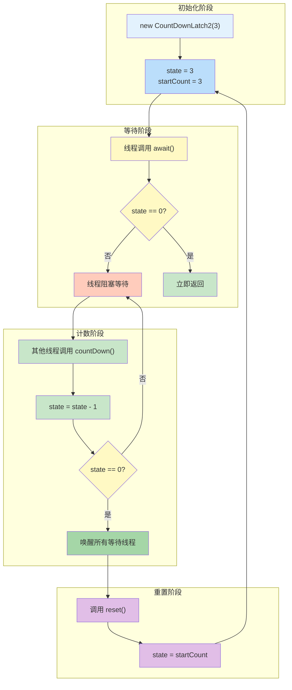

**图表说明**：

- **核心结论**：CountDownLatch2 通过保存初始计数值实现可重置功能，支持循环等待/唤醒场景。
- **关键概念**：
  - **state**：AQS 的同步状态，表示当前计数值
  - **startCount**：初始计数值，用于 reset() 时恢复
  - **await()**：阻塞直到 state 归零
  - **countDown()**：递减 state，归零时唤醒所有等待线程

```java
public class CountDownLatch2 {
    private final Sync sync;

    public CountDownLatch2(int count) {
        if (count < 0)
            throw new IllegalArgumentException("count < 0");
        this.sync = new Sync(count);
    }

    // 阻塞等待计数器归零
    public void await() throws InterruptedException {
        sync.acquireSharedInterruptibly(1);
    }

    // 带超时的阻塞等待，返回是否成功
    public boolean await(long timeout, TimeUnit unit) throws InterruptedException {
        return sync.tryAcquireSharedNanos(1, unit.toNanos(timeout));
    }

    // 计数器减1
    public void countDown() {
        sync.releaseShared(1);
    }

    // 重置计数器到初始值（核心扩展功能）
    public void reset() {
        sync.reset();
    }

    // 内部同步器，基于 AQS 实现
    private static final class Sync extends AbstractQueuedSynchronizer {
        private final int startCount;  // 保存初始计数值，用于 reset()

        Sync(int count) {
            this.startCount = count;
            setState(count);
        }

        @Override
        protected int tryAcquireShared(int acquires) {
            return (getState() == 0) ? 1 : -1;  // 状态为0时返回成功
        }

        @Override
        protected boolean tryReleaseShared(int releases) {
            for (;;) {
                int c = getState();
                if (c == 0)
                    return false;
                int nextc = c - 1;
                if (compareAndSetState(c, nextc))
                    return nextc == 0;
            }
        }

        protected void reset() {
            setState(startCount);  // 重置到初始计数值
        }
    }
}
```

### 2.2 与标准 CountDownLatch 的对比

| 特性 | CountDownLatch | CountDownLatch2 |
|------|---------------|-----------------|
| 计数器递减 | ✅ 支持 | ✅ 支持 |
| 阻塞等待 | ✅ 支持 | ✅ 支持 |
| 超时等待 | ✅ 支持 | ✅ 支持 |
| 重置计数器 | ❌ 不支持 | ✅ 支持 |
| 重复使用 | ❌ 一次性 | ✅ 可重复使用 |
| 适用场景 | 一次性事件 | 循环等待/唤醒场景 |

### 2.3 在 ServiceThread 中的应用

**问题背景**：标准的 `CountDownLatch` 只能使用一次，而 ServiceThread 需要反复等待和唤醒。

**等待唤醒机制时序图**：

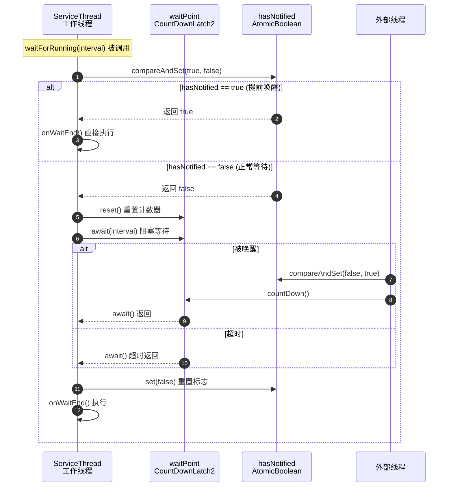

**图表说明**：

- **核心结论**：ServiceThread 通过 hasNotified 标志位解决信号丢失问题，确保 wakeup() 在 waitForRunning() 之前调用时也能正确响应。
- **关键概念**：
  - **提前唤醒**：wakeup() 在 waitForRunning() 之前调用，hasNotified 为 true，跳过等待
  - **正常唤醒**：等待期间收到 wakeup()，waitPoint.await() 返回
  - **超时唤醒**：等待时间到达 interval，await() 超时返回

**解决方案**：

```java
public abstract class ServiceThread implements Runnable {
    protected final CountDownLatch2 waitPoint = new CountDownLatch2(1);

    protected void waitForRunning(long interval) {
        // 检查是否已被提前唤醒
        if (hasNotified.compareAndSet(true, false)) {
            this.onWaitEnd();
            return;
        }

        // 重置计数器，准备下一次等待
        waitPoint.reset();

        try {
            // 阻塞等待，最多 interval 毫秒
            waitPoint.await(interval, TimeUnit.MILLISECONDS);
        } catch (InterruptedException e) {
            log.error("Interrupted", e);
        } finally {
            hasNotified.set(false);
            this.onWaitEnd();
        }
    }

    public void wakeup() {
        // CAS 保证只唤醒一次
        if (hasNotified.compareAndSet(false, true)) {
            waitPoint.countDown();  // 唤醒等待的线程
        }
    }
}
```

**关键点说明**：

| 方法 | 作用 | 调用时机 |
|------|------|---------|
| `waitPoint.reset()` | 重置计数器为1 | 每次 `waitForRunning()` 开始等待前 |
| `waitPoint.await()` | 阻塞等待计数器归零 | 进入等待状态 |
| `waitPoint.countDown()` | 计数器减1（归零则唤醒） | `wakeup()` 被调用时 |
| `hasNotified` | 防止信号丢失的标志位 | 记录是否收到唤醒信号 |

## 3. 信号处理机制

### 3.1 信号机制原理

**信号(Signal)** 是 Linux 进程间通信的一种机制，用于通知进程发生了某个事件。

**信号处理流程**：

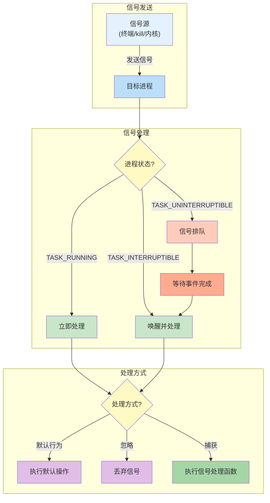

**图表说明**：

- **核心结论**：信号处理结果取决于进程当前状态和处理方式配置，TASK_INTERRUPTIBLE 状态可被信号唤醒，TASK_UNINTERRUPTIBLE 状态需等待事件完成后才能处理信号。
- **关键概念**：
  - **信号排队**：D 状态进程收到的信号被内核暂存，待进程唤醒后处理
  - **默认行为**：如 SIGTERM 默认终止进程，SIGSEGV 默认终止并转储核心
  - **捕获**：通过 signal() 或 sigaction() 注册自定义处理函数

**常见信号**：

| 信号 | 值 | 说明 | 默认行为 |
|------|-----|------|---------|
| SIGINT | 2 | 中断信号（Ctrl+C） | 终止进程 |
| SIGQUIT | 3 | 退出信号（Ctrl+\） | 终止进程并转储核心 |
| SIGKILL | 9 | 强制终止 | 终止进程，不可捕获 |
| SIGTERM | 15 | 终止信号 | 终止进程，可捕获 |
| SIGSTOP | 19 | 暂停信号 | 暂停进程，不可捕获 |
| SIGCONT | 18 | 继续信号 | 继续暂停的进程 |
| SIGSEGV | 11 | 段错误 | 终止进程并转储核心 |
| SIGPIPE | 13 | 管道破裂 | 终止进程 |
| SIGIO | 29 | I/O就绪信号 | 终止进程 |

**信号处理方式**：

| 方式 | 说明 |
|------|------|
| 默认行为 | 执行系统默认操作 |
| 忽略 | 忽略信号（SIGKILL、SIGSTOP除外） |
| 捕获 | 执行用户定义的信号处理函数 |

### 3.2 信号与线程状态的关系

**信号只能唤醒 TASK_INTERRUPTIBLE 状态的线程**：

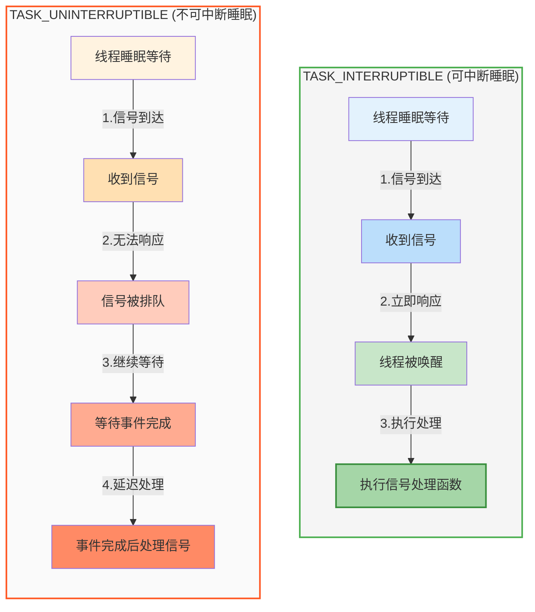

**图表说明**：

- **核心结论**：TASK_INTERRUPTIBLE 状态的线程可以立即响应信号，而 TASK_UNINTERRUPTIBLE 状态的线程必须等待事件完成后才能处理信号。
- **关键概念**：
  - **信号排队**：当线程处于 D 状态时，信号不会丢失，而是被内核排队，等待线程唤醒后处理
  - **事件完成**：指磁盘 I/O、内存换页等内核操作完成，线程状态转换为 TASK_RUNNING

**关键点**：

1. **TASK_INTERRUPTIBLE**：信号可以立即唤醒线程
2. **TASK_UNINTERRUPTIBLE**：信号被排队，等待事件完成后才处理
3. **SIGKILL/SIGSTOP**：无法被阻塞或忽略，但 D 状态线程仍需等待事件完成

### 3.3 Java信号处理

Java 通过 `sun.misc.Signal` 类支持信号处理：

```java
import sun.misc.Signal;
import sun.misc.SignalHandler;

public class SignalExample {
    public static void main(String[] args) {
        // 注册 SIGINT (Ctrl+C) 处理器
        Signal.handle(new Signal("INT"), new SignalHandler() {
            @Override
            public void handle(Signal signal) {
                System.out.println("Received SIGINT, shutting down gracefully...");
                // 执行清理操作
                System.exit(0);
            }
        });

        // 注册 SIGTERM 处理器
        Signal.handle(new Signal("TERM"), new SignalHandler() {
            @Override
            public void handle(Signal signal) {
                System.out.println("Received SIGTERM, shutting down gracefully...");
                // 执行清理操作
                System.exit(0);
            }
        });
    }
}
```

**RocketMQ中的信号处理**：

RocketMQ 的 Broker 在启动时注册了关闭钩子，用于优雅关闭。详见 [BrokerStartup.java](d:\work\github\rocketmq\broker\src\main\java\org\apache\rocketmq\broker\BrokerStartup.java#L230-L247)：

```java
Runtime.getRuntime().addShutdownHook(new Thread(new Runnable() {
    private volatile boolean hasShutdown = false;          // 确保只关闭一次
    private AtomicInteger shutdownTimes = new AtomicInteger(0);  // 关闭次数计数

    @Override
    public void run() {
        synchronized (this) {
            log.info("Shutdown hook was invoked, {}", this.shutdownTimes.incrementAndGet());
            if (!this.hasShutdown) {
                this.hasShutdown = true;
                long beginTime = System.currentTimeMillis();
                controller.shutdown();  // 执行关闭逻辑
                long consumingTimeTotal = System.currentTimeMillis() - beginTime;
                log.info("Shutdown hook over, consuming total time(ms): {}", consumingTimeTotal);
            }
        }
    }
}, "ShutdownHook"));
```

**关闭钩子触发时机**：

| 触发方式 | 说明 |
|---------|------|
| SIGINT (Ctrl+C) | 终端发送中断信号 |
| SIGTERM | kill 命令默认信号 |
| System.exit() | Java 代码主动退出 |
| JVM 正常退出 | 所有非守护线程结束 |

### 3.4 SIGTERM 终止信号

**SIGTERM (信号值15)** 是标准的终止信号，用于请求进程正常退出。

| 特性 | 说明 |
|------|------|
| 信号值 | 15 |
| 可捕获 | ✅ 可捕获 |
| 可忽略 | ✅ 可忽略 |
| 可阻塞 | ✅ 可阻塞 |
| 默认行为 | 终止进程 |

**SIGTERM 处理流程**：

1. 进程收到 SIGTERM 信号
2. 如果注册了信号处理器，执行清理逻辑
3. 关闭连接、刷盘数据、释放资源
4. 进程正常退出

### 3.5 SIGKILL 强制终止信号

**SIGKILL (信号值9)** 是最强制的终止信号：

| 特性 | 说明 |
|------|------|
| 信号值 | 9 |
| 可捕获 | ❌ 不可捕获 |
| 可忽略 | ❌ 不可忽略 |
| 可阻塞 | ❌ 不可阻塞 |
| 默认行为 | 立即终止进程 |

**SIGKILL vs SIGTERM 对比**：

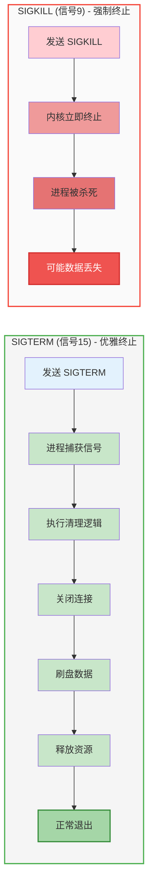

**图表说明**：

- **核心结论**：SIGTERM 允许进程执行清理逻辑后优雅退出，SIGKILL 则立即强制终止，可能导致数据丢失。
- **关键概念**：
  - **优雅终止**：进程有机会保存数据、关闭连接、释放资源
  - **强制终止**：内核直接回收进程资源，不给予清理机会

**SIGKILL vs SIGTERM 详细对比**：

| 对比项 | SIGTERM | SIGKILL |
|--------|---------|---------|
| 信号值 | 15 | 9 |
| 可捕获 | ✅ | ❌ |
| 可忽略 | ✅ | ❌ |
| 优雅关闭 | ✅ | ❌ |
| 数据安全 | 可安全保存数据 | 可能丢失数据 |

**SIGKILL 无法杀死 D 状态进程**：

```bash
# 查看进程状态
ps aux | grep <pid>

# 如果进程状态为 D，kill -9 也无法杀死
kill -9 <pid>  # 无效
```

**原因**：

1. D 状态进程正在等待内核完成关键操作
2. 内核无法安全地中断这些操作
3. 必须等待操作完成或重启系统

### 3.6 推荐关闭流程

**推荐关闭流程**：

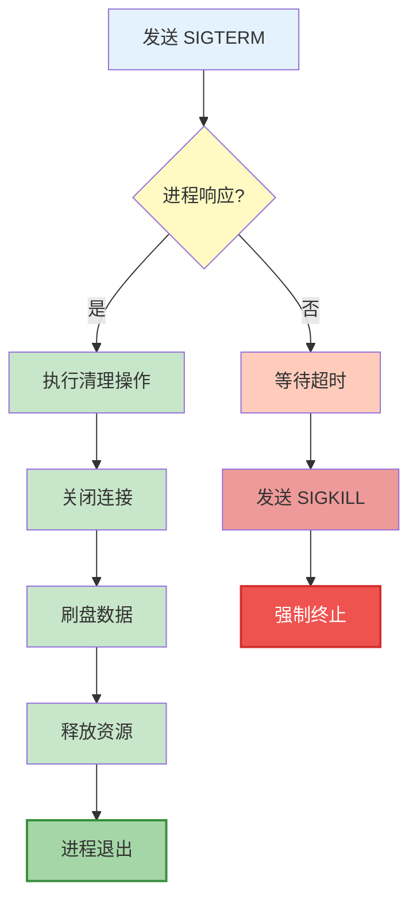

**图表说明**：

- **核心结论**：优雅关闭应优先使用 SIGTERM，给予进程清理资源的机会；仅在超时无响应时才使用 SIGKILL 强制终止。
- **关键概念**：
  - **SIGTERM (信号15)**：可捕获的终止信号，允许进程执行清理逻辑
  - **SIGKILL (信号9)**：不可捕获的强制终止信号，可能导致数据丢失

**Shell脚本示例**：

```bash
#!/bin/bash

# 优雅关闭 Java 进程
PID=$(cat app.pid)

# 发送 SIGTERM
kill -15 $PID

# 等待最多 30 秒
for i in {1..30}; do
    if ! ps -p $PID > /dev/null; then
        echo "Process terminated gracefully"
        exit 0
    fi
    sleep 1
done

# 超时后强制终止
echo "Timeout, force killing..."
kill -9 $PID
```

## 4. 优雅关闭实现

### 4.1 RocketMQ优雅关闭架构

**优雅关闭** 是指在关闭服务时，确保：
1. 正在处理的请求完成
2. 数据正确刷盘
3. 资源正确释放

**优雅关闭整体架构**：

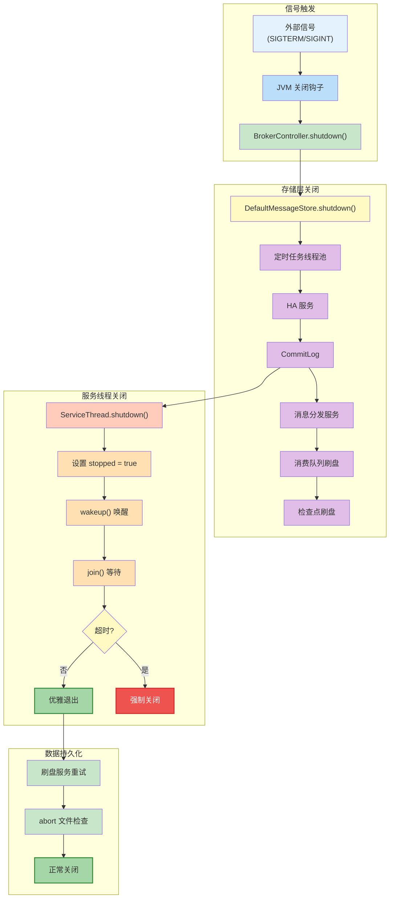

**图表说明**：

- **核心结论**：RocketMQ 的优雅关闭遵循"信号触发 → 存储层关闭 → 服务线程关闭 → 数据持久化"的层次化流程，确保数据完整性。
- **关键概念**：
  - **关闭钩子**：JVM 注册的 ShutdownHook，响应 SIGTERM/SIGINT 信号
  - **层次化关闭**：按依赖关系依次关闭各组件，避免资源竞争
  - **abort 文件**：启动时创建，正常关闭时删除；存在则说明上次异常关闭

**关闭流程**：

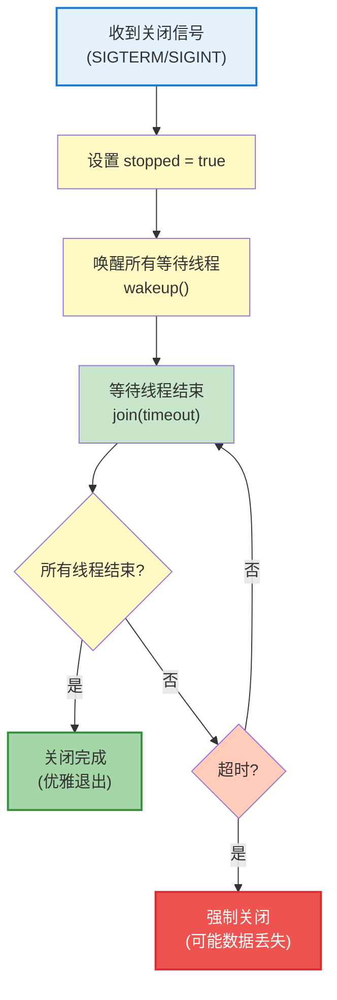

**图表说明**：

- **核心结论**：ServiceThread 的优雅关闭流程通过设置停止标志、唤醒等待线程、等待线程结束三个步骤，确保资源正确释放；超时后才会强制关闭。
- **关键概念**：
  - **stopped 标志**：volatile 布尔值，通知线程停止运行
  - **wakeup()**：唤醒阻塞在 waitForRunning() 的线程，使其检测到 stopped 标志
  - **join(timeout)**：等待线程结束，最多等待 getJoinTime() 毫秒

### 4.2 ServiceThread关闭方法

**ServiceThread 提供多种关闭方法**：

```java
public abstract class ServiceThread implements Runnable {
    private static final long JOIN_TIME = 90 * 1000;  // 默认值：90,000ms (90s)
    private final AtomicBoolean started = new AtomicBoolean(false);
    protected volatile boolean stopped = false;

    /**
     * 默认关闭方法（不中断线程）
     */
    public void shutdown() {
        this.shutdown(false);
    }

    /**
     * 完整关闭方法
     * @param interrupt 是否中断线程
     */
    public void shutdown(final boolean interrupt) {
        log.info("Try to shutdown service thread:{} started:{} lastThread:{}",
            getServiceName(), started.get(), thread);

        // CAS 保证只关闭一次
        if (!started.compareAndSet(true, false)) {
            return;
        }

        // 设置停止标志
        this.stopped = true;
        log.info("shutdown thread " + this.getServiceName() + " interrupt " + interrupt);

        // 唤醒等待的线程
        if (hasNotified.compareAndSet(false, true)) {
            waitPoint.countDown();  // notify
        }

        try {
            // 可选：中断线程
            if (interrupt) {
                this.thread.interrupt();
            }

            long beginTime = System.currentTimeMillis();
            // 非守护线程需要等待结束
            if (!this.thread.isDaemon()) {
                this.thread.join(this.getJoinTime());  // 最多等待 getJoinTime() 毫秒
            }
            long elapsedTime = System.currentTimeMillis() - beginTime;
            log.info("join thread " + this.getServiceName() + " elapsed time(ms) "
                + elapsedTime + " " + this.getJoinTime());
        } catch (InterruptedException e) {
            log.error("Interrupted", e);
        }
    }

    /**
     * @deprecated 使用 shutdown() 替代
     */
    @Deprecated
    public void stop() {
        this.stop(false);
    }

    /**
     * @deprecated 使用 shutdown(boolean) 替代
     * 只设置停止标志和唤醒线程，不等待线程结束
     */
    @Deprecated
    public void stop(final boolean interrupt) {
        if (!started.get()) {
            return;
        }
        this.stopped = true;
        log.info("stop thread " + this.getServiceName() + " interrupt " + interrupt);

        if (hasNotified.compareAndSet(false, true)) {
            waitPoint.countDown();  // notify
        }

        if (interrupt) {
            this.thread.interrupt();
        }
    }

    /**
     * 只设置停止标志，不唤醒线程
     * 用于批量停止场景
     */
    public void makeStop() {
        if (!started.get()) {
            return;
        }
        this.stopped = true;
        log.info("makestop thread " + this.getServiceName());
    }
}
```

**关闭方法对比**：

```mermaid
flowchart LR
    subgraph 方法对比
        direction TB
        
        subgraph shutdown["shutdown() - 标准关闭"]
            S1["设置 stopped = true"] --> S2["唤醒等待线程"]
            S2 --> S3["等待线程结束"]
            S3 --> S4["优雅退出"]
        end
        
        subgraph shutdown_true["shutdown(true) - 强制关闭"]
            ST1["设置 stopped = true"] --> ST2["唤醒等待线程"]
            ST2 --> ST3["中断线程"]
            ST3 --> ST4["等待线程结束"]
            ST4 --> ST5["强制退出"]
        end
        
        subgraph makeStop["makeStop() - 批量停止"]
            M1["设置 stopped = true"]
            M2["不唤醒线程"]
        end
    end

    style S1 fill:#c8e6c9
    style S2 fill:#c8e6c9
    style S3 fill:#c8e6c9
    style S4 fill:#a5d6a7,stroke:#388e3c,stroke-width:2px
    style ST1 fill:#fff9c4
    style ST2 fill:#fff9c4
    style ST3 fill:#ffccbc
    style ST4 fill:#fff9c4
    style ST5 fill:#ef5350,stroke:#d32f2f,stroke-width:2px,color:#fff
    style M1 fill:#e1bee7
    style M2 fill:#e1bee7
    style shutdown fill:#f5f5f5,stroke:#4caf50,stroke-width:2px
    style shutdown_true fill:#fafafa,stroke:#ff9800,stroke-width:2px
    style makeStop fill:#fafafa,stroke:#9c27b0,stroke-width:2px
```

**图表说明**：

- **核心结论**：shutdown() 是标准关闭方法，确保线程优雅退出；shutdown(true) 适用于线程无响应时强制关闭；makeStop() 用于批量停止场景，不等待线程结束。
- **关键概念**：
  - **优雅退出**：线程完成当前任务后正常退出
  - **强制退出**：通过中断线程强制终止，可能导致数据不一致
  - **批量停止**：先设置停止标志，后续统一唤醒或等待

| 方法 | 设置 stopped | 唤醒线程 | 中断线程 | 等待结束 | 使用场景 |
|------|------------|---------|---------|---------|---------|
| shutdown() | ✅ | ✅ | ❌ | ✅ | 标准关闭 |
| shutdown(true) | ✅ | ✅ | ✅ | ✅ | 强制关闭 |
| stop() | ✅ | ✅ | ❌ | ❌ | 已废弃 |
| makeStop() | ✅ | ❌ | ❌ | ❌ | 批量停止 |

### 4.3 DefaultMessageStore关闭流程

**DefaultMessageStore.shutdown()** 实现了完整的存储服务关闭流程。

**源码实现**：[DefaultMessageStore.java](d:\work\github\rocketmq\store\src\main\java\org\apache\rocketmq\store\DefaultMessageStore.java#L414-L457)

```java
public void shutdown() {
    if (!this.shutdown) {
        this.shutdown = true;

        // 1. 关闭定时任务线程池
        this.scheduledExecutorService.shutdown();
        try {
            Thread.sleep(1000 * 3);  // 等待 3,000ms (3s)，让定时任务完成
        } catch (InterruptedException e) {
            LOGGER.error("shutdown Exception, ", e);
        }

        // 2. 关闭 HA 服务（主从同步）
        if (this.haService != null) {
            this.haService.shutdown();
        }

        // 3. 关闭统计服务
        this.storeStatsService.shutdown();

        // 4. 关闭索引服务
        this.indexService.shutdown();

        // 5. 关闭 CommitLog
        this.commitLog.shutdown();

        // 6. 关闭消息分发服务
        this.reputMessageService.shutdown();

        // 7. 关闭 ConsumeQueue 刷盘服务
        this.flushConsumeQueueService.shutdown();

        // 8. 关闭内存映射文件分配服务
        this.allocateMappedFileService.shutdown();

        // 9. 刷盘检查点
        this.storeCheckpoint.flush();
        this.storeCheckpoint.shutdown();

        // 10. 关闭性能统计
        this.perfs.shutdown();

        // 11. 检查是否正常关闭
        if (this.runningFlags.isWriteable() && dispatchBehindBytes() == 0) {
            // 正常关闭：删除 abort 文件
            this.deleteFile(StorePathConfigHelper.getAbortFile(
                this.messageStoreConfig.getStorePathRootDir()));
            shutDownNormal = true;
        } else {
            // 异常关闭：保留 abort 文件，下次启动时恢复
            LOGGER.warn("the store may be wrong, so shutdown abnormally, and keep abort file.");
        }
    }

    // 12. 销毁堆外内存池
    this.transientStorePool.destroy();

    // 13. 释放文件锁
    if (lockFile != null && lock != null) {
        try {
            lock.release();
            lockFile.close();
        } catch (IOException e) {
            // ignore
        }
    }
}
```

**关闭顺序图**：

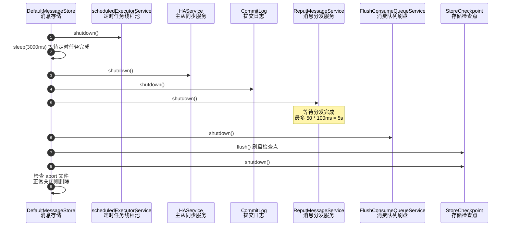

**图表说明**：

- **核心结论**：DefaultMessageStore 的关闭顺序遵循"先停接收、再停处理、最后刷盘"的原则，确保数据完整性。
- **关键概念**：
  - **关闭顺序**：定时任务 → HA同步 → CommitLog → 消息分发 → 消费队列刷盘 → 检查点
  - **abort 文件**：启动时创建，正常关闭时删除；存在则说明上次异常关闭，需要恢复数据
  - **等待分发完成**：ReputMessageService 关闭前等待消息分发到 ConsumeQueue，最多 5 秒

### 4.4 关闭超时配置

**ReputMessageService** 关闭时需要等待消息分发完成：

```java
public void shutdown() {
    // 等待分发完成，最多 50 * 100ms = 5,000ms (5s)
    for (int i = 0; i < 50 && this.isCommitLogAvailable(); i++) {
        try {
            Thread.sleep(100);  // 每次等待 100ms
        } catch (InterruptedException ignored) {
        }
    }

    // 超时警告
    if (this.isCommitLogAvailable()) {
        LOGGER.warn("shutdown ReputMessageService, but CommitLog have not finish to be dispatched, "
            + "CommitLog max offset={}, reputFromOffset={}",
            DefaultMessageStore.this.commitLog.getMaxOffset(),
            this.reputFromOffset);
    }

    super.shutdown();  // 调用父类关闭方法
}
```

### 4.5 各服务关闭超时时间

**各服务的关闭超时时间**：

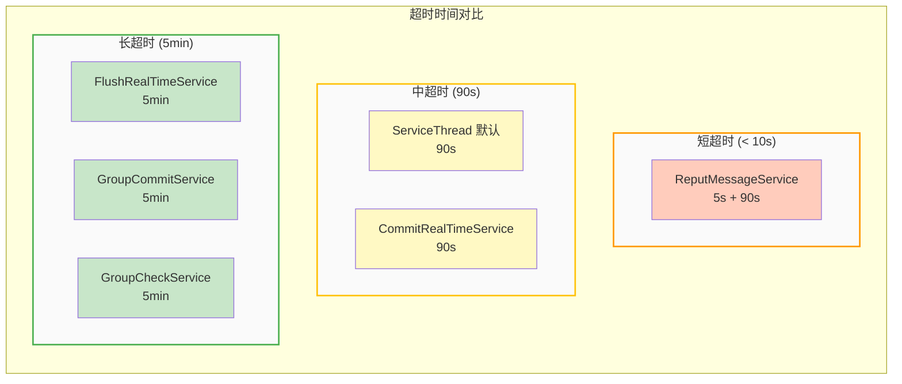

**图表说明**：

- **核心结论**：刷盘相关服务设置较长超时时间（5分钟），确保数据完整持久化；消息分发服务超时较短（5秒），避免关闭过程阻塞过久。
- **关键概念**：
  - **刷盘服务超时**：FlushRealTimeService 和 GroupCommitService 需要 5 分钟，确保大量数据刷盘完成
  - **分发服务超时**：ReputMessageService 先等待 5 秒分发完成，再等待 90 秒线程结束
  - **默认超时**：ServiceThread 默认 90 秒，适用于大多数服务

| 服务类 | 超时时间 | 说明 |
|-------|---------|------|
| ServiceThread（默认） | 90,000ms (90s) | [JOIN_TIME](d:\work\github\rocketmq\common\src\main\java\org\apache\rocketmq\common\ServiceThread.java#L28) |
| FlushRealTimeService | 300,000ms (5min) | [getJoinTime()](d:\work\github\rocketmq\store\src\main\java\org\apache\rocketmq\store\CommitLog.java#L1400-L1402) |
| GroupCommitService | 300,000ms (5min) | [getJoinTime()](d:\work\github\rocketmq\store\src\main\java\org\apache\rocketmq\store\CommitLog.java#L1542-L1544) |
| GroupCheckService | 300,000ms (5min) | [getJoinTime()](d:\work\github\rocketmq\store\src\main\java\org\apache\rocketmq\store\CommitLog.java#L1653-L1655) |
| CommitRealTimeService | 90,000ms (90s) | 使用默认值 |
| ReputMessageService | 5,000ms (5s) + 90,000ms (90s) | 先等待分发完成，再等待线程结束 |

**刷盘服务关闭重试**：

刷盘服务关闭时会重试刷盘，确保数据持久化：

```java
// RETRY_TIMES_OVER = 10 次
for (int i = 0; i < RETRY_TIMES_OVER && !result; i++) {
    result = CommitLog.this.mappedFileQueue.flush(0);  // 强制刷盘
    CommitLog.log.info(this.getServiceName() + " service shutdown, retry "
        + (i + 1) + " times " + (result ? "OK" : "Not OK"));
}
```

### 4.6 超时场景处理

**超时场景**：

| 场景 | 原因 | 处理方式 |
|------|------|---------|
| 线程阻塞在I/O | 网络或磁盘I/O未完成 | 超时后强制关闭 |
| 线程死锁 | 锁竞争导致死锁 | 超时后强制关闭 |
| 线程无限循环 | 代码bug | 超时后强制关闭 |
| 分发未完成 | ReputMessageService 积压 | 最多等待 5s 后强制关闭 |

### 4.7 最佳实践总结

**1. 注册关闭钩子**：

```java
Runtime.getRuntime().addShutdownHook(new Thread(() -> {
    log.info("Shutdown hook triggered");
    brokerController.shutdown();
}, "ShutdownHook"));
```

**2. 使用 SIGTERM 而非 SIGKILL**：

```bash
# 推荐：优雅关闭
kill -15 <pid>

# 不推荐：强制关闭（除非必要）
kill -9 <pid>
```

**3. 设置合理的超时时间**：

```java
// 根据业务特点设置
@Override
public long getJoinTime() {
    return 90 * 1000;  // 90,000ms (90s)
}
```

**4. 记录关闭日志**：

```java
public void shutdown() {
    log.info("shutdown begin");
    long beginTime = System.currentTimeMillis();

    // 关闭逻辑...

    long elapsedTime = System.currentTimeMillis() - beginTime;
    log.info("shutdown end, cost {} ms", elapsedTime);
}
```

**5. 检查 abort 文件**：

```java
// 正常关闭时删除 abort 文件
if (this.runningFlags.isWriteable() && dispatchBehindBytes() == 0) {
    this.deleteFile(StorePathConfigHelper.getAbortFile(storePath));
}

// 启动时检查 abort 文件，存在则说明上次异常关闭
File abortFile = new File(StorePathConfigHelper.getAbortFile(storePath));
if (abortFile.exists()) {
    // 执行恢复逻辑
    this.recover();
}
```

---
