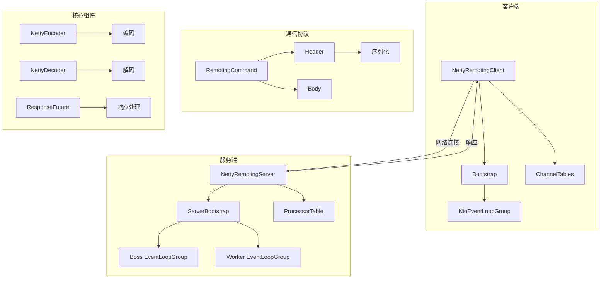
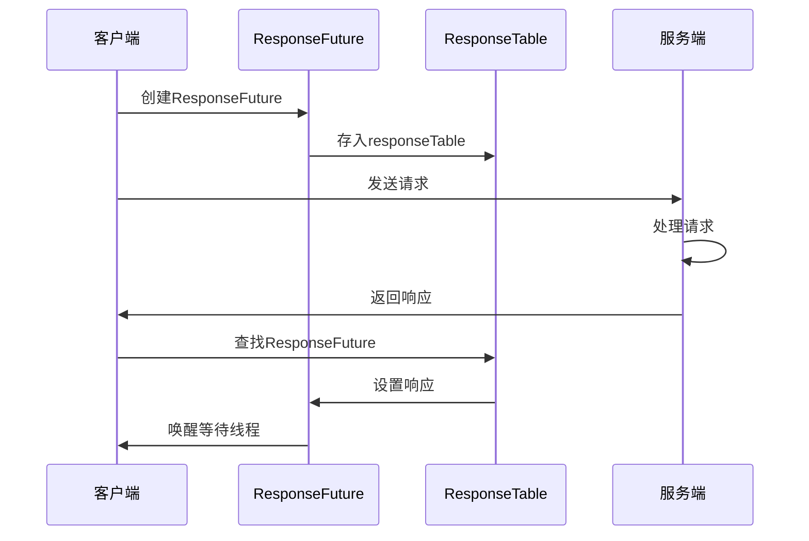
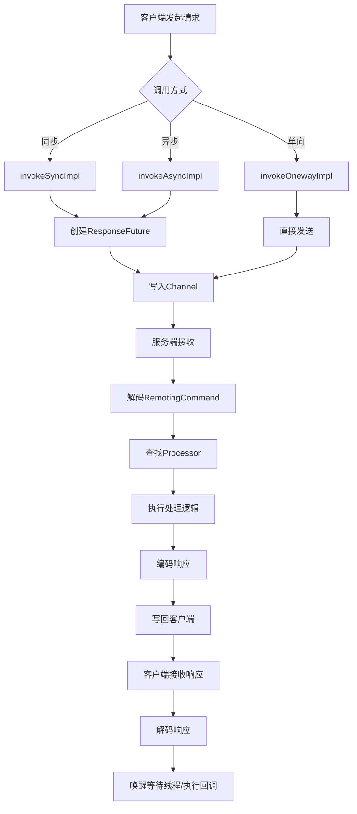

# 06-网络通信层源码解析

## 1. 模块概述

RocketMQ的网络通信层基于Netty框架实现，提供了高性能、高可靠的网络通信能力。该模块是RocketMQ各组件间通信的基础，支持同步、异步、单向等多种调用方式。

### 1.1 核心功能

- **多调用方式**：支持同步、异步、单向三种调用方式
- **协议编解码**：支持JSON和RocketMQ两种序列化协议
- **连接管理**：自动管理连接的创建、维护和关闭
- **流量控制**：通过信号量限制并发请求数量
- **超时处理**：自动扫描和清理超时请求
- **TLS支持**：支持SSL/TLS加密通信

### 1.2 架构设计



## 2. 核心接口定义

### 2.1 RemotingService接口

RemotingService是远程通信服务的基础接口。

**源码位置**：[RemotingService.java](remoting/src/main/java/org/apache/rocketmq/remoting/RemotingService.java)

```java
public interface RemotingService {
    void start();
    void shutdown();
    void registerRPCHook(RPCHook rpcHook);
}
```

### 2.2 RemotingServer接口

RemotingServer定义了服务端的远程通信接口。

**源码位置**：[RemotingServer.java](remoting/src/main/java/org/apache/rocketmq/remoting/RemotingServer.java)

```java
public interface RemotingServer extends RemotingService {
    void registerProcessor(final int requestCode, final NettyRequestProcessor processor,
        final ExecutorService executor);

    void registerDefaultProcessor(final NettyRequestProcessor processor, 
        final ExecutorService executor);

    int localListenPort();

    Pair<NettyRequestProcessor, ExecutorService> getProcessorPair(final int requestCode);

    Pair<NettyRequestProcessor, ExecutorService> getDefaultProcessorPair();

    RemotingCommand invokeSync(final Channel channel, final RemotingCommand request,
        final long timeoutMillis) throws InterruptedException, RemotingSendRequestException,
        RemotingTimeoutException;

    void invokeAsync(final Channel channel, final RemotingCommand request, 
        final long timeoutMillis, final InvokeCallback invokeCallback) 
        throws InterruptedException, RemotingTooMuchRequestException, 
        RemotingTimeoutException, RemotingSendRequestException;

    void invokeOneway(final Channel channel, final RemotingCommand request, 
        final long timeoutMillis) throws InterruptedException, 
        RemotingTooMuchRequestException, RemotingTimeoutException, 
        RemotingSendRequestException;
}
```

### 2.3 RemotingClient接口

RemotingClient定义了客户端的远程通信接口。

**源码位置**：[RemotingClient.java](remoting/src/main/java/org/apache/rocketmq/remoting/RemotingClient.java)

```java
public interface RemotingClient extends RemotingService {
    void updateNameServerAddressList(final List<String> addrs);

    List<String> getNameServerAddressList();

    List<String> getAvailableNameSrvList();

    RemotingCommand invokeSync(final String addr, final RemotingCommand request,
        final long timeoutMillis) throws InterruptedException, RemotingConnectException,
        RemotingSendRequestException, RemotingTimeoutException;

    void invokeAsync(final String addr, final RemotingCommand request, 
        final long timeoutMillis, final InvokeCallback invokeCallback) 
        throws InterruptedException, RemotingConnectException,
        RemotingTooMuchRequestException, RemotingTimeoutException, 
        RemotingSendRequestException;

    void invokeOneway(final String addr, final RemotingCommand request, 
        final long timeoutMillis) throws InterruptedException, 
        RemotingConnectException, RemotingTooMuchRequestException, 
        RemotingTimeoutException, RemotingSendRequestException;

    void registerProcessor(final int requestCode, final NettyRequestProcessor processor,
        final ExecutorService executor);

    void setCallbackExecutor(final ExecutorService callbackExecutor);

    boolean isChannelWritable(final String addr);

    void closeChannels(final List<String> addrList);
}
```

## 3. NettyRemotingAbstract抽象类

NettyRemotingAbstract是网络通信的核心抽象类，实现了请求处理、响应处理、流量控制等核心逻辑。

**源码位置**：[NettyRemotingAbstract.java](remoting/src/main/java/org/apache/rocketmq/remoting/netty/NettyRemotingAbstract.java)

### 3.1 核心属性

```java
public abstract class NettyRemotingAbstract {
    private static final InternalLogger log = InternalLoggerFactory.getLogger(
        RemotingHelper.ROCKETMQ_REMOTING);

    protected final Semaphore semaphoreOneway;

    protected final Semaphore semaphoreAsync;

    protected final ConcurrentMap<Integer /* opaque */, ResponseFuture> responseTable =
            new ConcurrentHashMap<>(256);

    protected final HashMap<Integer/* request code */, 
        Pair<NettyRequestProcessor, ExecutorService>> processorTable =
            new HashMap<>(64);

    protected final NettyEventExecutor nettyEventExecutor = new NettyEventExecutor();

    protected Pair<NettyRequestProcessor, ExecutorService> defaultRequestProcessorPair;

    protected volatile SslContext sslContext;

    protected List<RPCHook> rpcHooks = new ArrayList<>();

    public NettyRemotingAbstract(final int permitsOneway, final int permitsAsync) {
        this.semaphoreOneway = new Semaphore(permitsOneway, true);
        this.semaphoreAsync = new Semaphore(permitsAsync, true);
    }
}
```

**属性说明**：

| 属性 | 说明 |
|------|------|
| semaphoreOneway | 单向请求信号量，限制并发单向请求数 |
| semaphoreAsync | 异步请求信号量，限制并发异步请求数 |
| responseTable | 响应表，存储待处理的请求 |
| processorTable | 处理器表，存储请求码与处理器的映射 |
| nettyEventExecutor | Netty事件执行器 |
| defaultRequestProcessorPair | 默认请求处理器 |
| rpcHooks | RPC钩子列表 |

### 3.2 消息处理入口

```java
public void processMessageReceived(ChannelHandlerContext ctx, RemotingCommand msg) {
    if (msg != null) {
        switch (msg.getType()) {
            case REQUEST_COMMAND:
                processRequestCommand(ctx, msg);
                break;
            case RESPONSE_COMMAND:
                processResponseCommand(ctx, msg);
                break;
            default:
                break;
        }
    }
}
```

### 3.3 请求处理

```java
public void processRequestCommand(final ChannelHandlerContext ctx, final RemotingCommand cmd) {
    final Pair<NettyRequestProcessor, ExecutorService> matched = 
        this.processorTable.get(cmd.getCode());
    final Pair<NettyRequestProcessor, ExecutorService> pair = 
        null == matched ? this.defaultRequestProcessorPair : matched;
    final int opaque = cmd.getOpaque();

    if (pair == null) {
        String error = " request type " + cmd.getCode() + " not supported";
        final RemotingCommand response =
            RemotingCommand.createResponseCommand(
                RemotingSysResponseCode.REQUEST_CODE_NOT_SUPPORTED, error);
        response.setOpaque(opaque);
        ctx.writeAndFlush(response);
        log.error(RemotingHelper.parseChannelRemoteAddr(ctx.channel()) + error);
        return;
    }

    Runnable run = buildProcessRequestHandler(ctx, cmd, pair, opaque);

    if (pair.getObject1().rejectRequest()) {
        final RemotingCommand response = RemotingCommand.createResponseCommand(
            RemotingSysResponseCode.SYSTEM_BUSY,
            "[REJECTREQUEST]system busy, start flow control for a while");
        response.setOpaque(opaque);
        ctx.writeAndFlush(response);
        return;
    }

    try {
        final RequestTask requestTask = new RequestTask(run, ctx.channel(), cmd);
        pair.getObject2().submit(requestTask);
    } catch (RejectedExecutionException e) {
        if ((System.currentTimeMillis() % 10000) == 0) {
            log.warn(RemotingHelper.parseChannelRemoteAddr(ctx.channel())
                    + ", too many requests and system thread pool busy, "
                    + "RejectedExecutionException " + pair.getObject2().toString()
                    + " request code: " + cmd.getCode());
        }

        if (!cmd.isOnewayRPC()) {
            final RemotingCommand response = RemotingCommand.createResponseCommand(
                RemotingSysResponseCode.SYSTEM_BUSY,
                "[OVERLOAD]system busy, start flow control for a while");
            response.setOpaque(opaque);
            ctx.writeAndFlush(response);
        }
    }
}

private Runnable buildProcessRequestHandler(ChannelHandlerContext ctx, RemotingCommand cmd, 
    Pair<NettyRequestProcessor, ExecutorService> pair, int opaque) {
    return () -> {
        Exception exception = null;
        RemotingCommand response;

        try {
            String remoteAddr = RemotingHelper.parseChannelRemoteAddr(ctx.channel());
            try {
                doBeforeRpcHooks(remoteAddr, cmd);
            } catch (Exception e) {
                exception = e;
            }

            if (exception == null) {
                response = pair.getObject1().processRequest(ctx, cmd);
            } else {
                response = RemotingCommand.createResponseCommand(
                    RemotingSysResponseCode.SYSTEM_ERROR, null);
            }

            try {
                doAfterRpcHooks(remoteAddr, cmd, response);
            } catch (Exception e) {
                exception = e;
            }

            if (exception != null) {
                throw exception;
            }

            if (!cmd.isOnewayRPC()) {
                if (response != null) {
                    response.setOpaque(opaque);
                    response.markResponseType();
                    try {
                        ctx.writeAndFlush(response);
                    } catch (Throwable e) {
                        log.error("process request over, but response failed", e);
                    }
                }
            }
        } catch (Throwable e) {
            log.error("process request exception", e);

            if (!cmd.isOnewayRPC()) {
                response = RemotingCommand.createResponseCommand(
                    RemotingSysResponseCode.SYSTEM_ERROR,
                    RemotingHelper.exceptionSimpleDesc(e));
                response.setOpaque(opaque);
                ctx.writeAndFlush(response);
            }
        }
    };
}
```

### 3.4 响应处理

```java
public void processResponseCommand(ChannelHandlerContext ctx, RemotingCommand cmd) {
    final int opaque = cmd.getOpaque();
    final ResponseFuture responseFuture = responseTable.get(opaque);
    if (responseFuture != null) {
        responseFuture.setResponseCommand(cmd);

        responseTable.remove(opaque);

        if (responseFuture.getInvokeCallback() != null) {
            executeInvokeCallback(responseFuture);
        } else {
            responseFuture.putResponse(cmd);
            responseFuture.release();
        }
    } else {
        log.warn("receive response, but not matched any request, " + 
            RemotingHelper.parseChannelRemoteAddr(ctx.channel()));
    }
}
```

### 3.5 同步调用实现

```java
public RemotingCommand invokeSyncImpl(final Channel channel, final RemotingCommand request,
    final long timeoutMillis)
    throws InterruptedException, RemotingSendRequestException, RemotingTimeoutException {
    final int opaque = request.getOpaque();

    try {
        final ResponseFuture responseFuture = new ResponseFuture(
            channel, opaque, timeoutMillis, null, null);
        this.responseTable.put(opaque, responseFuture);
        final SocketAddress addr = channel.remoteAddress();
        channel.writeAndFlush(request).addListener((ChannelFutureListener) f -> {
            if (f.isSuccess()) {
                responseFuture.setSendRequestOK(true);
                return;
            }

            responseFuture.setSendRequestOK(false);
            responseTable.remove(opaque);
            responseFuture.setCause(f.cause());
            responseFuture.putResponse(null);
            log.warn("Failed to write a request command to {}, caused by " +
                "underlying I/O operation failure", addr);
        });

        RemotingCommand responseCommand = responseFuture.waitResponse(timeoutMillis);
        if (null == responseCommand) {
            if (responseFuture.isSendRequestOK()) {
                throw new RemotingTimeoutException(
                    RemotingHelper.parseSocketAddressAddr(addr), timeoutMillis,
                    responseFuture.getCause());
            } else {
                throw new RemotingSendRequestException(
                    RemotingHelper.parseSocketAddressAddr(addr), responseFuture.getCause());
            }
        }

        return responseCommand;
    } finally {
        this.responseTable.remove(opaque);
    }
}
```

### 3.6 异步调用实现

```java
public void invokeAsyncImpl(final Channel channel, final RemotingCommand request, 
    final long timeoutMillis, final InvokeCallback invokeCallback)
    throws InterruptedException, RemotingTooMuchRequestException, 
    RemotingTimeoutException, RemotingSendRequestException {
    long beginStartTime = System.currentTimeMillis();
    final int opaque = request.getOpaque();
    boolean acquired = this.semaphoreAsync.tryAcquire(timeoutMillis, TimeUnit.MILLISECONDS);
    if (acquired) {
        final SemaphoreReleaseOnlyOnce once = new SemaphoreReleaseOnlyOnce(this.semaphoreAsync);
        long costTime = System.currentTimeMillis() - beginStartTime;
        if (timeoutMillis < costTime) {
            once.release();
            throw new RemotingTimeoutException("invokeAsyncImpl call timeout");
        }

        final ResponseFuture responseFuture = new ResponseFuture(
            channel, opaque, timeoutMillis - costTime, invokeCallback, once);
        this.responseTable.put(opaque, responseFuture);
        try {
            channel.writeAndFlush(request).addListener((ChannelFutureListener) f -> {
                if (f.isSuccess()) {
                    responseFuture.setSendRequestOK(true);
                    return;
                }
                requestFail(opaque);
                log.warn("send a request command to channel <{}> failed.", 
                    RemotingHelper.parseChannelRemoteAddr(channel));
            });
        } catch (Exception e) {
            responseFuture.release();
            log.warn("send a request command to channel <" + 
                RemotingHelper.parseChannelRemoteAddr(channel) + "> Exception", e);
            throw new RemotingSendRequestException(
                RemotingHelper.parseChannelRemoteAddr(channel), e);
        }
    } else {
        if (timeoutMillis <= 0) {
            throw new RemotingTooMuchRequestException("invokeAsyncImpl invoke too fast");
        } else {
            String info = String.format(
                "invokeAsyncImpl tryAcquire semaphore timeout, %dms, " +
                "waiting thread nums: %d semaphoreAsyncValue: %d",
                timeoutMillis, this.semaphoreAsync.getQueueLength(),
                this.semaphoreAsync.availablePermits());
            log.warn(info);
            throw new RemotingTimeoutException(info);
        }
    }
}
```

### 3.7 超时扫描

```java
public void scanResponseTable() {
    final List<ResponseFuture> rfList = new LinkedList<>();
    Iterator<Entry<Integer, ResponseFuture>> it = this.responseTable.entrySet().iterator();
    while (it.hasNext()) {
        Entry<Integer, ResponseFuture> next = it.next();
        ResponseFuture rep = next.getValue();

        if ((rep.getBeginTimestamp() + rep.getTimeoutMillis() + 1000) 
            <= System.currentTimeMillis()) {
            rep.release();
            it.remove();
            rfList.add(rep);
            log.warn("remove timeout request, " + rep);
        }
    }

    for (ResponseFuture rf : rfList) {
        try {
            executeInvokeCallback(rf);
        } catch (Throwable e) {
            log.warn("scanResponseTable, operationComplete Exception", e);
        }
    }
}
```

## 4. NettyRemotingServer服务端实现

### 4.1 核心属性

**源码位置**：[NettyRemotingServer.java](remoting/src/main/java/org/apache/rocketmq/remoting/netty/NettyRemotingServer.java)

```java
public class NettyRemotingServer extends NettyRemotingAbstract implements RemotingServer {
    private static final InternalLogger log = InternalLoggerFactory.getLogger(
        RemotingHelper.ROCKETMQ_REMOTING);
    private final ServerBootstrap serverBootstrap;
    private final EventLoopGroup eventLoopGroupSelector;
    private final EventLoopGroup eventLoopGroupBoss;
    private final NettyServerConfig nettyServerConfig;

    private final ExecutorService publicExecutor;
    private final ChannelEventListener channelEventListener;

    private final Timer timer = new Timer("ServerHouseKeepingService", true);
    private DefaultEventExecutorGroup defaultEventExecutorGroup;

    private final ConcurrentMap<Integer/*Port*/, NettyRemotingAbstract> remotingServerTable = 
        new ConcurrentHashMap<>();

    private static final String HANDSHAKE_HANDLER_NAME = "handshakeHandler";
    private static final String TLS_HANDLER_NAME = "sslHandler";
    private static final String FILE_REGION_ENCODER_NAME = "fileRegionEncoder";

    private HandshakeHandler handshakeHandler;
    private NettyEncoder encoder;
    private NettyConnectManageHandler connectionManageHandler;
    private NettyServerHandler serverHandler;

    public NettyRemotingServer(final NettyServerConfig nettyServerConfig,
        final ChannelEventListener channelEventListener) {
        super(nettyServerConfig.getServerOnewaySemaphoreValue(), 
            nettyServerConfig.getServerAsyncSemaphoreValue());
        this.serverBootstrap = new ServerBootstrap();
        this.nettyServerConfig = nettyServerConfig;
        this.channelEventListener = channelEventListener;

        this.publicExecutor = buildPublicExecutor(nettyServerConfig);

        this.eventLoopGroupBoss = buildBossEventLoopGroup();

        this.eventLoopGroupSelector = buildEventLoopGroupSelector();

        loadSslContext();
    }
}
```

### 4.2 服务启动

```java
@Override
public void start() {
    this.defaultEventExecutorGroup = new DefaultEventExecutorGroup(
        nettyServerConfig.getServerWorkerThreads(),
        new ThreadFactory() {
            private final AtomicInteger threadIndex = new AtomicInteger(0);

            @Override
            public Thread newThread(Runnable r) {
                return new Thread(r, "NettyServerCodecThread_" + 
                    this.threadIndex.incrementAndGet());
            }
        });

    prepareSharableHandlers();

    serverBootstrap.group(this.eventLoopGroupBoss, this.eventLoopGroupSelector)
        .channel(useEpoll() ? EpollServerSocketChannel.class : NioServerSocketChannel.class)
        .option(ChannelOption.SO_BACKLOG, 1024)
        .option(ChannelOption.SO_REUSEADDR, true)
        .childOption(ChannelOption.SO_KEEPALIVE, false)
        .childOption(ChannelOption.TCP_NODELAY, true)
        .localAddress(new InetSocketAddress(this.nettyServerConfig.getBindAddress(),
            this.nettyServerConfig.getListenPort()))
        .childHandler(new ChannelInitializer<SocketChannel>() {
            @Override
            public void initChannel(SocketChannel ch) {
                ch.pipeline()
                    .addLast(defaultEventExecutorGroup, HANDSHAKE_HANDLER_NAME, handshakeHandler)
                    .addLast(defaultEventExecutorGroup,
                        encoder,
                        new NettyDecoder(),
                        new IdleStateHandler(0, 0,
                            nettyServerConfig.getServerChannelMaxIdleTimeSeconds()),
                        connectionManageHandler,
                        serverHandler
                    );
            }
        });

    addCustomConfig(serverBootstrap);

    try {
        ChannelFuture sync = serverBootstrap.bind().sync();
        InetSocketAddress addr = (InetSocketAddress) sync.channel().localAddress();
        if (0 == nettyServerConfig.getListenPort()) {
            this.nettyServerConfig.setListenPort(addr.getPort());
        }
        log.info("RemotingServer started, listening {}:{}",
            this.nettyServerConfig.getBindAddress(),
            this.nettyServerConfig.getListenPort());
        this.remotingServerTable.put(this.nettyServerConfig.getListenPort(), this);
    } catch (Exception e) {
        throw new IllegalStateException(String.format("Failed to bind to %s:%d", 
            nettyServerConfig.getBindAddress(), nettyServerConfig.getListenPort()), e);
    }

    if (this.channelEventListener != null) {
        this.nettyEventExecutor.start();
    }

    this.timer.scheduleAtFixedRate(new TimerTask() {
        @Override
        public void run() {
            try {
                NettyRemotingServer.this.scanResponseTable();
            } catch (Throwable e) {
                log.error("scanResponseTable exception", e);
            }
        }
    }, 1000 * 3, 1000);
}
```

### 4.3 Pipeline结构


### 4.4 Epoll优化

```java
private boolean useEpoll() {
    return RemotingUtil.isLinuxPlatform()
        && nettyServerConfig.isUseEpollNativeSelector()
        && Epoll.isAvailable();
}

private EventLoopGroup buildEventLoopGroupSelector() {
    if (useEpoll()) {
        return new EpollEventLoopGroup(nettyServerConfig.getServerSelectorThreads(), 
            new ThreadFactory() {
                private final AtomicInteger threadIndex = new AtomicInteger(0);
                private final int threadTotal = nettyServerConfig.getServerSelectorThreads();

                @Override
                public Thread newThread(Runnable r) {
                    return new Thread(r, String.format("NettyServerEPOLLSelector_%d_%d", 
                        threadTotal, this.threadIndex.incrementAndGet()));
                }
            });
    } else {
        return new NioEventLoopGroup(nettyServerConfig.getServerSelectorThreads(), 
            new ThreadFactory() {
                private final AtomicInteger threadIndex = new AtomicInteger(0);
                private final int threadTotal = nettyServerConfig.getServerSelectorThreads();

                @Override
                public Thread newThread(Runnable r) {
                    return new Thread(r, String.format("NettyServerNIOSelector_%d_%d", 
                        threadTotal, this.threadIndex.incrementAndGet()));
                }
            });
    }
}
```

## 5. NettyRemotingClient客户端实现

### 5.1 核心属性

**源码位置**：[NettyRemotingClient.java](remoting/src/main/java/org/apache/rocketmq/remoting/netty/NettyRemotingClient.java)

```java
public class NettyRemotingClient extends NettyRemotingAbstract implements RemotingClient {
    private static final InternalLogger LOGGER = InternalLoggerFactory.getLogger(
        RemotingHelper.ROCKETMQ_REMOTING);

    private static final long LOCK_TIMEOUT_MILLIS = 3000;

    private final NettyClientConfig nettyClientConfig;
    private final Bootstrap bootstrap = new Bootstrap();
    private final EventLoopGroup eventLoopGroupWorker;
    private final Lock lockChannelTables = new ReentrantLock();
    private final ConcurrentMap<String /* addr */, ChannelWrapper> channelTables = 
        new ConcurrentHashMap<String, ChannelWrapper>();

    private final Timer timer = new Timer("ClientHouseKeepingService", true);

    private final AtomicReference<List<String>> namesrvAddrList = 
        new AtomicReference<List<String>>();
    private final ConcurrentMap<String, Boolean> availableNamesrvAddrMap = 
        new ConcurrentHashMap<String, Boolean>();
    private final AtomicReference<String> namesrvAddrChoosed = new AtomicReference<String>();
    private final AtomicInteger namesrvIndex = new AtomicInteger(initValueIndex());
    private final Lock namesrvChannelLock = new ReentrantLock();

    private final ExecutorService publicExecutor;
    private final ExecutorService scanExecutor;

    private ExecutorService callbackExecutor;
    private final ChannelEventListener channelEventListener;
    private EventExecutorGroup defaultEventExecutorGroup;

    public NettyRemotingClient(final NettyClientConfig nettyClientConfig,
        final ChannelEventListener channelEventListener,
        final EventLoopGroup eventLoopGroup,
        final EventExecutorGroup eventExecutorGroup) {
        super(nettyClientConfig.getClientOnewaySemaphoreValue(), 
            nettyClientConfig.getClientAsyncSemaphoreValue());
        this.nettyClientConfig = nettyClientConfig;
        this.channelEventListener = channelEventListener;

        int publicThreadNums = nettyClientConfig.getClientCallbackExecutorThreads();
        if (publicThreadNums <= 0) {
            publicThreadNums = 4;
        }

        this.publicExecutor = Executors.newFixedThreadPool(publicThreadNums, new ThreadFactory() {
            private final AtomicInteger threadIndex = new AtomicInteger(0);

            @Override
            public Thread newThread(Runnable r) {
                return new Thread(r, "NettyClientPublicExecutor_" + 
                    this.threadIndex.incrementAndGet());
            }
        });

        this.scanExecutor = new ThreadPoolExecutor(4, 10, 60, TimeUnit.SECONDS,
            new ArrayBlockingQueue<Runnable>(32), new ThreadFactory() {
                private final AtomicInteger threadIndex = new AtomicInteger(0);

                @Override
                public Thread newThread(Runnable r) {
                    return new Thread(r, "NettyClientScan_thread_" + 
                        this.threadIndex.incrementAndGet());
                }
            }
        );

        if (eventLoopGroup != null) {
            this.eventLoopGroupWorker = eventLoopGroup;
        } else {
            this.eventLoopGroupWorker = new NioEventLoopGroup(1, new ThreadFactory() {
                private final AtomicInteger threadIndex = new AtomicInteger(0);

                @Override
                public Thread newThread(Runnable r) {
                    return new Thread(r, String.format("NettyClientSelector_%d", 
                        this.threadIndex.incrementAndGet()));
                }
            });
        }
    }
}
```

### 5.2 客户端启动

```java
@Override
public void start() {
    if (this.defaultEventExecutorGroup == null) {
        this.defaultEventExecutorGroup = new DefaultEventExecutorGroup(
            nettyClientConfig.getClientWorkerThreads(),
            new ThreadFactory() {
                private AtomicInteger threadIndex = new AtomicInteger(0);

                @Override
                public Thread newThread(Runnable r) {
                    return new Thread(r, "NettyClientWorkerThread_" + 
                        this.threadIndex.incrementAndGet());
                }
            });
    }
    Bootstrap handler = this.bootstrap.group(this.eventLoopGroupWorker)
        .channel(NioSocketChannel.class)
        .option(ChannelOption.TCP_NODELAY, true)
        .option(ChannelOption.SO_KEEPALIVE, false)
        .option(ChannelOption.CONNECT_TIMEOUT_MILLIS, 
            nettyClientConfig.getConnectTimeoutMillis())
        .handler(new ChannelInitializer<SocketChannel>() {
            @Override
            public void initChannel(SocketChannel ch) throws Exception {
                ChannelPipeline pipeline = ch.pipeline();
                if (nettyClientConfig.isUseTLS()) {
                    if (null != sslContext) {
                        pipeline.addFirst(defaultEventExecutorGroup, "sslHandler", 
                            sslContext.newHandler(ch.alloc()));
                        LOGGER.info("Prepend SSL handler");
                    } else {
                        LOGGER.warn("Connections are insecure as SSLContext is null!");
                    }
                }
                ch.pipeline().addLast(
                    nettyClientConfig.isDisableNettyWorkerGroup() ? null : defaultEventExecutorGroup,
                    new NettyEncoder(),
                    new NettyDecoder(),
                    new IdleStateHandler(0, 0, 
                        nettyClientConfig.getClientChannelMaxIdleTimeSeconds()),
                    new NettyConnectManageHandler(),
                    new NettyClientHandler());
            }
        });

    this.timer.scheduleAtFixedRate(new TimerTask() {
        @Override
        public void run() {
            try {
                NettyRemotingClient.this.scanResponseTable();
            } catch (Throwable e) {
                LOGGER.error("scanResponseTable exception", e);
            }
        }
    }, 1000 * 3, 1000);

    this.timer.scheduleAtFixedRate(new TimerTask() {
        @Override
        public void run() {
            try {
                NettyRemotingClient.this.scanAvailableNameSrv();
            } catch (Exception e) {
                LOGGER.error("scanAvailableNameSrv exception", e);
            }
        }
    }, 0, this.nettyClientConfig.getConnectTimeoutMillis());
}
```

## 6. RemotingCommand通信协议

### 6.1 协议结构

**源码位置**：[RemotingCommand.java](remoting/src/main/java/org/apache/rocketmq/remoting/protocol/RemotingCommand.java)

```java
public class RemotingCommand {
    public static final String SERIALIZE_TYPE_PROPERTY = "rocketmq.serialize.type";
    public static final String SERIALIZE_TYPE_ENV = "ROCKETMQ_SERIALIZE_TYPE";
    public static final String REMOTING_VERSION_KEY = "rocketmq.remoting.version";

    private static final int RPC_TYPE = 0;
    private static final int RPC_ONEWAY = 1;

    private int code;
    private LanguageCode language = LanguageCode.JAVA;
    private int version = 0;
    private int opaque = requestId.getAndIncrement();
    private int flag = 0;
    private String remark;
    private HashMap<String, String> extFields;
    private transient CommandCustomHeader customHeader;

    private SerializeType serializeTypeCurrentRPC = serializeTypeConfigInThisServer;

    private transient byte[] body;

    public static RemotingCommand createRequestCommand(int code, 
        CommandCustomHeader customHeader) {
        RemotingCommand cmd = new RemotingCommand();
        cmd.setCode(code);
        cmd.customHeader = customHeader;
        setCmdVersion(cmd);
        return cmd;
    }

    public static RemotingCommand createResponseCommand(int code, String remark,
        Class<? extends CommandCustomHeader> classHeader) {
        RemotingCommand cmd = new RemotingCommand();
        cmd.markResponseType();
        cmd.setCode(code);
        cmd.setRemark(remark);
        setCmdVersion(cmd);

        if (classHeader != null) {
            try {
                CommandCustomHeader objectHeader = 
                    classHeader.getDeclaredConstructor().newInstance();
                cmd.customHeader = objectHeader;
            } catch (Exception e) {
                return null;
            }
        }

        return cmd;
    }
}
```

### 6.2 协议格式

```
+----------------+----------------+----------------+
|  Total Length | Protocol Type  | Header Length  |
|    (4 bytes)   |   (1 byte)     |   (3 bytes)    |
+----------------+----------------+----------------+
|                  Header Data                    |
+-------------------------------------------------+
|                     Body                        |
+-------------------------------------------------+
```

**字段说明**：

| 字段 | 长度 | 说明 |
|------|------|------|
| Total Length | 4字节 | 整个消息长度（不含自身） |
| Protocol Type | 1字节 | 序列化类型（JSON/ROCKETMQ） |
| Header Length | 3字节 | Header长度 |
| Header Data | 变长 | Header数据 |
| Body | 变长 | 消息体 |

### 6.3 序列化类型

```java
public enum SerializeType {
    JSON((byte) 0),
    ROCKETMQ((byte) 1);

    private final byte code;

    SerializeType(byte code) {
        this.code = code;
    }

    public static SerializeType valueOf(byte code) {
        for (SerializeType serializeType : SerializeType.values()) {
            if (serializeType.getCode() == code) {
                return serializeType;
            }
        }
        return null;
    }

    public byte getCode() {
        return code;
    }
}
```

## 7. 编解码器

### 7.1 NettyEncoder编码器

**源码位置**：[NettyEncoder.java](remoting/src/main/java/org/apache/rocketmq/remoting/netty/NettyEncoder.java)

```java
@ChannelHandler.Sharable
public class NettyEncoder extends MessageToByteEncoder<RemotingCommand> {
    private static final InternalLogger log = InternalLoggerFactory.getLogger(
        RemotingHelper.ROCKETMQ_REMOTING);

    @Override
    public void encode(ChannelHandlerContext ctx, RemotingCommand remotingCommand, ByteBuf out)
        throws Exception {
        try {
            remotingCommand.fastEncodeHeader(out);
            byte[] body = remotingCommand.getBody();
            if (body != null) {
                out.writeBytes(body);
            }
        } catch (Exception e) {
            log.error("encode exception, " + 
                RemotingHelper.parseChannelRemoteAddr(ctx.channel()), e);
            if (remotingCommand != null) {
                log.error(remotingCommand.toString());
            }
            RemotingUtil.closeChannel(ctx.channel());
        }
    }
}
```

### 7.2 NettyDecoder解码器

**源码位置**：[NettyDecoder.java](remoting/src/main/java/org/apache/rocketmq/remoting/netty/NettyDecoder.java)

```java
public class NettyDecoder extends LengthFieldBasedFrameDecoder {
    private static final InternalLogger log = InternalLoggerFactory.getLogger(
        RemotingHelper.ROCKETMQ_REMOTING);

    private static final int FRAME_MAX_LENGTH =
        Integer.parseInt(System.getProperty("com.rocketmq.remoting.frameMaxLength", "16777216"));

    public NettyDecoder() {
        super(FRAME_MAX_LENGTH, 0, 4, 0, 4);
    }

    @Override
    public Object decode(ChannelHandlerContext ctx, ByteBuf in) throws Exception {
        ByteBuf frame = null;
        try {
            frame = (ByteBuf) super.decode(ctx, in);
            if (null == frame) {
                return null;
            }
            return RemotingCommand.decode(frame);
        } catch (Exception e) {
            log.error("decode exception, " + 
                RemotingHelper.parseChannelRemoteAddr(ctx.channel()), e);
            RemotingUtil.closeChannel(ctx.channel());
        } finally {
            if (null != frame) {
                frame.release();
            }
        }

        return null;
    }
}
```

## 8. ResponseFuture响应处理

### 8.1 核心实现

**源码位置**：[ResponseFuture.java](remoting/src/main/java/org/apache/rocketmq/remoting/netty/ResponseFuture.java)

```java
public class ResponseFuture {
    private final Channel channel;
    private final int opaque;
    private final RemotingCommand request;
    private final long timeoutMillis;
    private final InvokeCallback invokeCallback;
    private final long beginTimestamp = System.currentTimeMillis();
    private final CountDownLatch countDownLatch = new CountDownLatch(1);

    private final SemaphoreReleaseOnlyOnce once;

    private final AtomicBoolean executeCallbackOnlyOnce = new AtomicBoolean(false);
    private volatile RemotingCommand responseCommand;
    private volatile boolean sendRequestOK = true;
    private volatile Throwable cause;
    private volatile boolean interrupted = false;

    public ResponseFuture(Channel channel, int opaque, RemotingCommand request, 
        long timeoutMillis, InvokeCallback invokeCallback,
        SemaphoreReleaseOnlyOnce once) {
        this.channel = channel;
        this.opaque = opaque;
        this.request = request;
        this.timeoutMillis = timeoutMillis;
        this.invokeCallback = invokeCallback;
        this.once = once;
    }

    public void executeInvokeCallback() {
        if (invokeCallback != null) {
            if (this.executeCallbackOnlyOnce.compareAndSet(false, true)) {
                invokeCallback.operationComplete(this);
            }
        }
    }

    public void release() {
        if (this.once != null) {
            this.once.release();
        }
    }

    public boolean isTimeout() {
        long diff = System.currentTimeMillis() - this.beginTimestamp;
        return diff > this.timeoutMillis;
    }

    public RemotingCommand waitResponse(final long timeoutMillis) throws InterruptedException {
        this.countDownLatch.await(timeoutMillis, TimeUnit.MILLISECONDS);
        return this.responseCommand;
    }

    public void putResponse(final RemotingCommand responseCommand) {
        this.responseCommand = responseCommand;
        this.countDownLatch.countDown();
    }
}
```

### 8.2 响应处理流程



## 9. 配置参数

### 9.1 服务端配置

**源码位置**：[NettyServerConfig.java](remoting/src/main/java/org/apache/rocketmq/remoting/netty/NettyServerConfig.java)

| 配置项 | 默认值 | 说明 |
|--------|--------|------|
| bindAddress | 0.0.0.0 | 绑定地址 |
| listenPort | 0 | 监听端口 |
| serverWorkerThreads | 8 | Worker线程数 |
| serverCallbackExecutorThreads | 0 | 回调线程数 |
| serverSelectorThreads | 3 | Selector线程数 |
| serverOnewaySemaphoreValue | 256 | 单向请求信号量 |
| serverAsyncSemaphoreValue | 64 | 异步请求信号量 |
| serverChannelMaxIdleTimeSeconds | 120 | 通道最大空闲时间 |
| serverSocketSndBufSize | 系统默认 | Socket发送缓冲区 |
| serverSocketRcvBufSize | 系统默认 | Socket接收缓冲区 |
| useEpollNativeSelector | false | 是否使用Epoll |

### 9.2 客户端配置

**源码位置**：[NettyClientConfig.java](remoting/src/main/java/org/apache/rocketmq/remoting/netty/NettyClientConfig.java)

| 配置项 | 默认值 | 说明 |
|--------|--------|------|
| clientWorkerThreads | 系统默认 | Worker线程数 |
| clientCallbackExecutorThreads | CPU核数 | 回调线程数 |
| clientOnewaySemaphoreValue | 系统默认 | 单向请求信号量 |
| clientAsyncSemaphoreValue | 系统默认 | 异步请求信号量 |
| connectTimeoutMillis | 系统默认 | 连接超时时间 |
| channelNotActiveInterval | 60000 | 通道不活跃间隔 |
| clientChannelMaxIdleTimeSeconds | 系统默认 | 通道最大空闲时间 |
| useTLS | false | 是否使用TLS |

## 10. 业务场景示例

### 10.1 同步调用示例

```java
public class SyncInvokeExample {
    public static void main(String[] args) throws Exception {
        NettyClientConfig clientConfig = new NettyClientConfig();
        NettyRemotingClient client = new NettyRemotingClient(clientConfig);
        client.start();

        RemotingCommand request = RemotingCommand.createRequestCommand(
            RequestCode.GET_BROKER_RUNTIME_INFO, null);
        
        RemotingCommand response = client.invokeSync(
            "127.0.0.1:10911", request, 3000);
        
        System.out.println("响应码: " + response.getCode());
        System.out.println("响应内容: " + response.getRemark());
        
        client.shutdown();
    }
}
```

### 10.2 异步调用示例

```java
public class AsyncInvokeExample {
    public static void main(String[] args) throws Exception {
        NettyClientConfig clientConfig = new NettyClientConfig();
        NettyRemotingClient client = new NettyRemotingClient(clientConfig);
        client.start();

        RemotingCommand request = RemotingCommand.createRequestCommand(
            RequestCode.GET_BROKER_RUNTIME_INFO, null);
        
        client.invokeAsync("127.0.0.1:10911", request, 3000, 
            new InvokeCallback() {
                @Override
                public void operationComplete(ResponseFuture responseFuture) {
                    if (responseFuture.isSendRequestOK()) {
                        RemotingCommand response = responseFuture.getResponseCommand();
                        System.out.println("响应码: " + response.getCode());
                    } else {
                        System.err.println("请求失败: " + responseFuture.getCause());
                    }
                }
            });
        
        Thread.sleep(5000);
        client.shutdown();
    }
}
```

### 10.3 单向调用示例

```java
public class OnewayInvokeExample {
    public static void main(String[] args) throws Exception {
        NettyClientConfig clientConfig = new NettyClientConfig();
        NettyRemotingClient client = new NettyRemotingClient(clientConfig);
        client.start();

        RemotingCommand request = RemotingCommand.createRequestCommand(
            RequestCode.UNREGISTER_BROKER, null);
        request.setOnewayRPC(true);
        
        client.invokeOneway("127.0.0.1:9876", request, 3000);
        
        System.out.println("单向请求已发送");
        
        client.shutdown();
    }
}
```

### 10.4 自定义处理器示例

```java
public class CustomProcessorExample {
    public static void main(String[] args) throws Exception {
        NettyServerConfig serverConfig = new NettyServerConfig();
        serverConfig.setListenPort(10911);
        
        NettyRemotingServer server = new NettyRemotingServer(serverConfig);
        
        server.registerProcessor(RequestCode.SEND_MESSAGE, 
            new NettyRequestProcessor() {
                @Override
                public RemotingCommand processRequest(ChannelHandlerContext ctx, 
                    RemotingCommand request) throws Exception {
                    System.out.println("收到消息发送请求");
                    return RemotingCommand.createResponseCommand(
                        ResponseCode.SUCCESS, "消息发送成功");
                }

                @Override
                public boolean rejectRequest() {
                    return false;
                }
            }, 
            Executors.newFixedThreadPool(4));
        
        server.start();
        
        System.out.println("服务端已启动，监听端口: 10911");
        
        Thread.sleep(Long.MAX_VALUE);
    }
}
```

## 11. 总结

### 11.1 核心流程



### 11.2 设计亮点

1. **抽象设计**：通过NettyRemotingAbstract抽象类复用核心逻辑
2. **流量控制**：使用信号量限制并发请求数，保护系统稳定性
3. **超时处理**：定时扫描超时请求，避免资源泄漏
4. **协议扩展**：支持JSON和RocketMQ两种序列化协议
5. **Epoll优化**：Linux环境下使用Epoll提升性能
6. **RPC钩子**：支持请求前后的自定义处理

### 11.3 最佳实践

1. 根据业务场景选择合适的调用方式
2. 合理配置线程池和信号量参数
3. 生产环境建议启用TLS加密
4. Linux环境建议启用Epoll
5. 监控网络通信指标，及时发现异常
6. 为不同类型的请求注册独立的处理器和线程池
