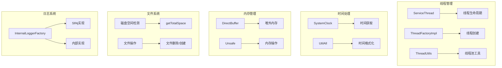
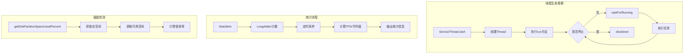

# 07-操作系统概念与API源码解析

## 1. 模块概述

RocketMQ作为一个高性能分布式消息中间件，在操作系统层面进行了大量优化。本章将深入解析RocketMQ中涉及的操作系统概念和相关API，包括线程管理、内存管理、文件系统、时间处理等核心内容。

### 1.1 核心功能

- **线程管理**：服务线程抽象、线程池管理、线程工厂
- **时间处理**：系统时钟、时间格式化、定时任务
- **内存管理**：DirectBuffer清理、内存映射
- **文件系统**：磁盘空间检测、文件操作
- **网络相关**：IP地址获取、网络接口检测
- **日志系统**：内部日志框架抽象

### 1.2 架构设计



## 2. 线程管理

### 2.1 ServiceThread服务线程

ServiceThread是RocketMQ中服务线程的抽象基类，提供了线程的启动、停止、等待等核心功能。

**源码位置**：[ServiceThread.java](common/src/main/java/org/apache/rocketmq/common/ServiceThread.java)

```java
public abstract class ServiceThread implements Runnable {
    private static final InternalLogger log = InternalLoggerFactory.getLogger(
        LoggerName.COMMON_LOGGER_NAME);

    private static final long JOIN_TIME = 90 * 1000;

    protected Thread thread;
    protected final CountDownLatch2 waitPoint = new CountDownLatch2(1);
    protected volatile AtomicBoolean hasNotified = new AtomicBoolean(false);
    protected volatile boolean stopped = false;
    protected boolean isDaemon = false;

    private final AtomicBoolean started = new AtomicBoolean(false);

    public abstract String getServiceName();

    public void start() {
        log.info("Try to start service thread:{} started:{} lastThread:{}", 
            getServiceName(), started.get(), thread);
        if (!started.compareAndSet(false, true)) {
            return;
        }
        stopped = false;
        this.thread = new Thread(this, getServiceName());
        this.thread.setDaemon(isDaemon);
        this.thread.start();
    }

    public void shutdown() {
        this.shutdown(false);
    }

    public void shutdown(final boolean interrupt) {
        log.info("Try to shutdown service thread:{} started:{} lastThread:{}", 
            getServiceName(), started.get(), thread);
        if (!started.compareAndSet(true, false)) {
            return;
        }
        this.stopped = true;
        log.info("shutdown thread " + this.getServiceName() + " interrupt " + interrupt);

        if (hasNotified.compareAndSet(false, true)) {
            waitPoint.countDown();
        }

        try {
            if (interrupt) {
                this.thread.interrupt();
            }

            long beginTime = System.currentTimeMillis();
            if (!this.thread.isDaemon()) {
                this.thread.join(this.getJoinTime());
            }
            long elapsedTime = System.currentTimeMillis() - beginTime;
            log.info("join thread " + this.getServiceName() + 
                " elapsed time(ms) " + elapsedTime + " " + this.getJoinTime());
        } catch (InterruptedException e) {
            log.error("Interrupted", e);
        }
    }

    public void wakeup() {
        if (hasNotified.compareAndSet(false, true)) {
            waitPoint.countDown();
        }
    }

    protected void waitForRunning(long interval) {
        if (hasNotified.compareAndSet(true, false)) {
            this.onWaitEnd();
            return;
        }

        waitPoint.reset();

        try {
            waitPoint.await(interval, TimeUnit.MILLISECONDS);
        } catch (InterruptedException e) {
            log.error("Interrupted", e);
        } finally {
            hasNotified.set(false);
            this.onWaitEnd();
        }
    }

    protected void onWaitEnd() {
    }
}
```

**核心方法说明**：

| 方法 | 说明 |
|------|------|
| start | 启动服务线程，使用CAS确保只启动一次 |
| shutdown | 关闭服务线程，支持中断模式 |
| wakeup | 唤醒等待中的线程 |
| waitForRunning | 等待指定时间，可被wakeup唤醒 |
| onWaitEnd | 等待结束后的回调方法 |

### 2.2 CountDownLatch2可重置计数器

CountDownLatch2是对JDK CountDownLatch的扩展，增加了reset功能。

**源码位置**：[CountDownLatch2.java](common/src/main/java/org/apache/rocketmq/common/CountDownLatch2.java)

```java
public class CountDownLatch2 {
    private final Sync sync;

    public CountDownLatch2(int count) {
        if (count < 0)
            throw new IllegalArgumentException("count < 0");
        this.sync = new Sync(count);
    }

    public void await() throws InterruptedException {
        sync.acquireSharedInterruptibly(1);
    }

    public boolean await(long timeout, TimeUnit unit)
        throws InterruptedException {
        return sync.tryAcquireSharedNanos(1, unit.toNanos(timeout));
    }

    public void countDown() {
        sync.releaseShared(1);
    }

    public void reset() {
        sync.reset();
    }

    private static final class Sync extends AbstractQueuedSynchronizer {
        private static final long serialVersionUID = 4982264981922014994L;

        Sync(int count) {
            setState(count);
        }

        int getCount() {
            return getState();
        }

        protected int tryAcquireShared(int acquires) {
            return (getState() == 0) ? 1 : -1;
        }

        protected boolean tryReleaseShared(int releases) {
            for (;;) {
                int c = getState();
                if (c == 0)
                    return false;
                int nextc = c - releases;
                if (compareAndSetState(c, nextc))
                    return nextc == 0;
            }
        }

        protected void reset() {
            setState(1);
        }
    }
}
```

### 2.3 ThreadFactoryImpl线程工厂

ThreadFactoryImpl是RocketMQ自定义的线程工厂实现。

**源码位置**：[ThreadFactoryImpl.java](common/src/main/java/org/apache/rocketmq/common/ThreadFactoryImpl.java)

```java
public class ThreadFactoryImpl implements ThreadFactory {
    private final AtomicLong threadIndex = new AtomicLong(0);
    private final String threadNamePrefix;
    private final boolean daemon;

    public ThreadFactoryImpl(final String threadNamePrefix) {
        this(threadNamePrefix, false);
    }

    public ThreadFactoryImpl(final String threadNamePrefix, boolean daemon) {
        this.threadNamePrefix = threadNamePrefix;
        this.daemon = daemon;
    }

    public ThreadFactoryImpl(final String threadNamePrefix, BrokerIdentity brokerIdentity) {
        this(threadNamePrefix, false, brokerIdentity);
    }

    public ThreadFactoryImpl(final String threadNamePrefix, boolean daemon, 
        BrokerIdentity brokerIdentity) {
        this.daemon = daemon;
        if (brokerIdentity != null && brokerIdentity.isInBrokerContainer()) {
            this.threadNamePrefix = brokerIdentity.getLoggerIdentifier() + threadNamePrefix;
        } else {
            this.threadNamePrefix = threadNamePrefix;
        }
    }

    @Override
    public Thread newThread(Runnable r) {
        Thread thread = new Thread(r, threadNamePrefix + this.threadIndex.incrementAndGet());
        thread.setDaemon(daemon);
        return thread;
    }
}
```

### 2.4 ThreadUtils线程工具类

ThreadUtils提供了线程池创建和关闭的工具方法。

**源码位置**：[ThreadUtils.java](common/src/main/java/org/apache/rocketmq/common/utils/ThreadUtils.java)

```java
public final class ThreadUtils {
    private static final InternalLogger LOGGER = InternalLoggerFactory.getLogger(
        LoggerName.TOOLS_LOGGER_NAME);

    public static ExecutorService newThreadPoolExecutor(int corePoolSize, int maximumPoolSize, 
        long keepAliveTime, TimeUnit unit, BlockingQueue<Runnable> workQueue, 
        String processName, boolean isDaemon) {
        return new ThreadPoolExecutor(corePoolSize, maximumPoolSize, keepAliveTime, unit, 
            workQueue, newThreadFactory(processName, isDaemon));
    }

    public static ExecutorService newSingleThreadExecutor(String processName, boolean isDaemon) {
        return Executors.newSingleThreadExecutor(newThreadFactory(processName, isDaemon));
    }

    public static ScheduledExecutorService newSingleThreadScheduledExecutor(
        String processName, boolean isDaemon) {
        return Executors.newSingleThreadScheduledExecutor(
            newThreadFactory(processName, isDaemon));
    }

    public static ThreadFactory newThreadFactory(String processName, boolean isDaemon) {
        return newGenericThreadFactory("Remoting-" + processName, isDaemon);
    }

    public static ThreadFactory newGenericThreadFactory(final String processName, 
        final boolean isDaemon) {
        return new ThreadFactory() {
            private AtomicInteger threadIndex = new AtomicInteger(0);

            @Override
            public Thread newThread(Runnable r) {
                Thread thread = new Thread(r, 
                    String.format("%s_%d", processName, this.threadIndex.incrementAndGet()));
                thread.setDaemon(isDaemon);
                return thread;
            }
        };
    }

    public static Thread newThread(String name, Runnable runnable, boolean daemon) {
        Thread thread = new Thread(runnable, name);
        thread.setDaemon(daemon);
        thread.setUncaughtExceptionHandler(new Thread.UncaughtExceptionHandler() {
            public void uncaughtException(Thread t, Throwable e) {
                LOGGER.error("Uncaught exception in thread '" + t.getName() + "':", e);
            }
        });
        return thread;
    }

    public static void shutdownGracefully(ExecutorService executor, long timeout, 
        TimeUnit timeUnit) {
        executor.shutdown();
        try {
            if (!executor.awaitTermination(timeout, timeUnit)) {
                executor.shutdownNow();
                if (!executor.awaitTermination(timeout, timeUnit)) {
                    LOGGER.warn("ExecutorService did not terminate");
                }
            }
        } catch (InterruptedException ie) {
            executor.shutdownNow();
            Thread.currentThread().interrupt();
        }
    }
}
```

## 3. 时间处理

### 3.1 SystemClock系统时钟

SystemClock是对系统时钟的抽象，便于测试和扩展。

**源码位置**：[SystemClock.java](common/src/main/java/org/apache/rocketmq/common/SystemClock.java)

```java
public class SystemClock {
    public long now() {
        return System.currentTimeMillis();
    }
}
```

### 3.2 UtilAll时间工具方法

UtilAll提供了丰富的时间处理工具方法。

**源码位置**：[UtilAll.java](common/src/main/java/org/apache/rocketmq/common/UtilAll.java)

```java
public class UtilAll {
    public static final String YYYY_MM_DD_HH_MM_SS = "yyyy-MM-dd HH:mm:ss";
    public static final String YYYY_MM_DD_HH_MM_SS_SSS = "yyyy-MM-dd#HH:mm:ss:SSS";
    public static final String YYYYMMDDHHMMSS = "yyyyMMddHHmmss";

    public static int getPid() {
        try {
            String hostName = ManagementFactory.getRuntimeMXBean().getName();
            return Integer.parseInt(hostName.substring(0, hostName.indexOf('@')));
        } catch (Exception e) {
            return -1;
        }
    }

    public static String timeMillisToHumanString() {
        return timeMillisToHumanString(System.currentTimeMillis());
    }

    public static String timeMillisToHumanString(final long t) {
        Calendar cal = Calendar.getInstance();
        cal.setTimeInMillis(t);
        return String.format("%04d%02d%02d%02d%02d%02d%03d", 
            cal.get(Calendar.YEAR), cal.get(Calendar.MONTH) + 1,
            cal.get(Calendar.DAY_OF_MONTH), cal.get(Calendar.HOUR_OF_DAY), 
            cal.get(Calendar.MINUTE), cal.get(Calendar.SECOND),
            cal.get(Calendar.MILLISECOND));
    }

    public static String timeMillisToHumanString2(final long t) {
        Calendar cal = Calendar.getInstance();
        cal.setTimeInMillis(t);
        return String.format("%04d-%02d-%02d %02d:%02d:%02d,%03d",
            cal.get(Calendar.YEAR), cal.get(Calendar.MONTH) + 1,
            cal.get(Calendar.DAY_OF_MONTH), cal.get(Calendar.HOUR_OF_DAY),
            cal.get(Calendar.MINUTE), cal.get(Calendar.SECOND),
            cal.get(Calendar.MILLISECOND));
    }

    public static long computeNextMorningTimeMillis() {
        Calendar cal = Calendar.getInstance();
        cal.setTimeInMillis(System.currentTimeMillis());
        cal.add(Calendar.DAY_OF_MONTH, 1);
        cal.set(Calendar.HOUR_OF_DAY, 0);
        cal.set(Calendar.MINUTE, 0);
        cal.set(Calendar.SECOND, 0);
        cal.set(Calendar.MILLISECOND, 0);
        return cal.getTimeInMillis();
    }

    public static long computeNextMinutesTimeMillis() {
        Calendar cal = Calendar.getInstance();
        cal.setTimeInMillis(System.currentTimeMillis());
        cal.add(Calendar.MINUTE, 1);
        cal.set(Calendar.SECOND, 0);
        cal.set(Calendar.MILLISECOND, 0);
        return cal.getTimeInMillis();
    }

    public static long computeNextHourTimeMillis() {
        Calendar cal = Calendar.getInstance();
        cal.setTimeInMillis(System.currentTimeMillis());
        cal.add(Calendar.HOUR_OF_DAY, 1);
        cal.set(Calendar.MINUTE, 0);
        cal.set(Calendar.SECOND, 0);
        cal.set(Calendar.MILLISECOND, 0);
        return cal.getTimeInMillis();
    }

    public static boolean isItTimeToDo(final String when) {
        String[] whiles = when.split(";");
        if (whiles.length > 0) {
            Calendar now = Calendar.getInstance();
            for (String w : whiles) {
                int nowHour = Integer.parseInt(w);
                if (nowHour == now.get(Calendar.HOUR_OF_DAY)) {
                    return true;
                }
            }
        }
        return false;
    }

    public static long computeElapsedTimeMilliseconds(final long beginTime) {
        return System.currentTimeMillis() - beginTime;
    }
}
```

## 4. 内存管理

### 4.1 DirectBuffer清理

RocketMQ使用DirectBuffer进行零拷贝传输，但DirectBuffer的清理需要特殊处理。

```java
public class UtilAll {
    public static void cleanBuffer(final ByteBuffer buffer) {
        if (buffer == null || !buffer.isDirect() || buffer.capacity() == 0) {
            return;
        }
        invoke(invoke(viewed(buffer), "cleaner"), "clean");
    }

    private static Object invoke(final Object target, final String methodName, 
        final Object... args) {
        return AccessController.doPrivileged(new PrivilegedAction<Object>() {
            @Override
            public Object run() {
                try {
                    Method method = method(target, methodName, args);
                    method.setAccessible(true);
                    return method.invoke(target, args);
                } catch (Exception e) {
                    throw new IllegalStateException(e);
                }
            }
        });
    }

    private static ByteBuffer viewed(ByteBuffer buffer) {
        if (!buffer.isDirect()) {
            throw new IllegalArgumentException("buffer is not direct");
        }
        ByteBuffer viewedBuffer = (ByteBuffer) invoke(buffer, "viewedBuffer");
        if (viewedBuffer == null) {
            return buffer;
        } else {
            return viewed(viewedBuffer);
        }
    }
}
```

### 4.2 Unsafe内存操作

RocketMQ使用sun.misc.Unsafe进行底层内存操作。

```java
public class UtilAll {
    private static final Unsafe unsafe;

    static {
        Unsafe tmpUnsafe = null;
        try {
            Field unsafeField = Unsafe.class.getDeclaredField("theUnsafe");
            unsafeField.setAccessible(true);
            tmpUnsafe = (Unsafe) unsafeField.get(null);
        } catch (Exception e) {
            log.error("Get Unsafe instance failed", e);
        }
        unsafe = tmpUnsafe;
    }

    public static long getByteBufferAddress(ByteBuffer buffer) {
        if (!buffer.isDirect()) {
            throw new IllegalArgumentException("Only direct buffer supported");
        }
        DirectBuffer directBuffer = (DirectBuffer) buffer;
        return directBuffer.address();
    }
}
```

## 5. 文件系统

### 5.1 磁盘空间检测

RocketMQ需要实时监控磁盘空间使用情况。

**源码位置**：[UtilAll.java](common/src/main/java/org/apache/rocketmq/common/UtilAll.java)

```java
public class UtilAll {
    public static long getTotalSpace(final String path) {
        if (null == path || path.isEmpty())
            return -1;
        try {
            File file = new File(path);
            if (!file.exists())
                return -1;
            return file.getTotalSpace();
        } catch (Exception e) {
            return -1;
        }
    }

    public static double getDiskPartitionSpaceUsedPercent(final String path) {
        if (null == path || path.isEmpty()) {
            STORE_LOG.error("Error when measuring disk space usage, " +
                "path is null or empty, path : {}", path);
            return -1;
        }

        try {
            File file = new File(path);

            if (!file.exists()) {
                STORE_LOG.error("Error when measuring disk space usage, " +
                    "file doesn't exist on this path: {}", path);
                return -1;
            }

            long totalSpace = file.getTotalSpace();

            if (totalSpace > 0) {
                long usedSpace = totalSpace - file.getFreeSpace();
                long usableSpace = file.getUsableSpace();
                long entireSpace = usedSpace + usableSpace;
                long roundNum = 0;
                if (usedSpace * 100 % entireSpace != 0) {
                    roundNum = 1;
                }
                long result = usedSpace * 100 / entireSpace + roundNum;
                return result / 100.0;
            }
        } catch (Exception e) {
            STORE_LOG.error("Error when measuring disk space usage, got exception: :", e);
            return -1;
        }

        return -1;
    }

    public static long getDiskPartitionTotalSpace(final String path) {
        if (null == path || path.isEmpty()) {
            return -1;
        }

        try {
            File file = new File(path);

            if (!file.exists()) {
                return -1;
            }

            return file.getTotalSpace() - file.getFreeSpace() + file.getUsableSpace();
        } catch (Exception e) {
            return -1;
        }
    }

    public static boolean isPathExists(final String path) {
        File file = new File(path);
        return file.exists();
    }
}
```

### 5.2 文件删除

```java
public class UtilAll {
    public static boolean deleteFile(File file) {
        if (!file.exists()) {
            return true;
        }

        if (file.isFile()) {
            return file.delete();
        } else if (file.isDirectory()) {
            File[] files = file.listFiles();
            if (files != null) {
                for (File subFile : files) {
                    deleteFile(subFile);
                }
            }
            return file.delete();
        }
        return false;
    }
}
```

## 6. 网络相关

### 6.1 IP地址获取

```java
public class UtilAll {
    public static String getIP() {
        try {
            Enumeration<NetworkInterface> networkInterfaces = 
                NetworkInterface.getNetworkInterfaces();
            while (networkInterfaces.hasMoreElements()) {
                NetworkInterface networkInterface = networkInterfaces.nextElement();
                Enumeration<InetAddress> inetAddresses = 
                    networkInterface.getInetAddresses();
                while (inetAddresses.hasMoreElements()) {
                    InetAddress inetAddress = inetAddresses.nextElement();
                    if (inetAddress instanceof Inet4Address) {
                        if (!inetAddress.isLoopbackAddress()) {
                            return inetAddress.getHostAddress();
                        }
                    }
                }
            }
        } catch (Exception e) {
            log.error("Get IP failed", e);
        }
        return null;
    }
}
```

## 7. 日志系统

### 7.1 InternalLoggerFactory日志工厂

InternalLoggerFactory是RocketMQ日志系统的抽象工厂。

**源码位置**：[InternalLoggerFactory.java](logging/src/main/java/org/apache/rocketmq/logging/InternalLoggerFactory.java)

```java
public abstract class InternalLoggerFactory {

    public static final String LOGGER_SLF4J = "slf4j";
    public static final String LOGGER_INNER = "inner";
    public static final String DEFAULT_LOGGER = LOGGER_SLF4J;

    public static final String CONSUMER_STATS_LOGGER_NAME = "RocketmqConsumerStats";
    public static final String COMMERCIAL_LOGGER_NAME = "RocketmqCommercial";
    public static final String ACCOUNT_LOGGER_NAME = "RocketmqAccount";

    private static String loggerType = null;

    private static ConcurrentHashMap<String, InternalLoggerFactory> loggerFactoryCache = 
        new ConcurrentHashMap<String, InternalLoggerFactory>();

    public static InternalLogger getLogger(Class clazz) {
        return getLogger(clazz.getName());
    }

    public static InternalLogger getLogger(String name) {
        return getLoggerFactory().getLoggerInstance(name);
    }

    private static InternalLoggerFactory getLoggerFactory() {
        InternalLoggerFactory internalLoggerFactory = null;
        if (loggerType != null) {
            internalLoggerFactory = loggerFactoryCache.get(loggerType);
        }
        if (internalLoggerFactory == null) {
            internalLoggerFactory = loggerFactoryCache.get(DEFAULT_LOGGER);
        }
        if (internalLoggerFactory == null) {
            internalLoggerFactory = loggerFactoryCache.get(LOGGER_INNER);
        }
        if (internalLoggerFactory == null) {
            throw new RuntimeException("[RocketMQ] Logger init failed, please check logger");
        }
        return internalLoggerFactory;
    }

    public static void setCurrentLoggerType(String type) {
        loggerType = type;
    }

    static {
        try {
            new Slf4jLoggerFactory();
        } catch (Throwable e) {
        }
        try {
            new InnerLoggerFactory();
        } catch (Throwable e) {
        }
    }

    protected abstract void shutdown();
    protected abstract InternalLogger getLoggerInstance(String name);
    protected abstract String getLoggerType();
}
```

### 7.2 日志名称常量

**源码位置**：[LoggerName.java](common/src/main/java/org/apache/rocketmq/common/constant/LoggerName.java)

```java
public class LoggerName {
    public static final String NAMESRV_LOGGER_NAME = "RocketmqNamesrv";
    public static final String NAMESRV_CONSOLE_LOGGER_NAME = "RocketmqNamesrvConsole";
    public static final String BROKER_LOGGER_NAME = "RocketmqBroker";
    public static final String CLIENT_LOGGER_NAME = "RocketmqClient";
    public static final String TOOLS_LOGGER_NAME = "RocketmqTools";
    public static final String COMMON_LOGGER_NAME = "RocketmqCommon";
    public static final String STORE_LOGGER_NAME = "RocketmqStore";
    public static final String STORE_ERROR_LOGGER_NAME = "RocketmqStoreError";
    public static final String TRANSACTION_LOGGER_NAME = "RocketmqTransaction";
    public static final String REBALANCE_LOCK_LOGGER_NAME = "RocketmqRebalanceLock";
    public static final String FILTER_LOGGER_NAME = "RocketmqFilter";
    public static final String ROCKETMQ_REMOTING = "RocketmqRemoting";
}
```

## 8. 统计监控

### 8.1 StatsItem统计项

StatsItem用于统计各类指标数据。

**源码位置**：[StatsItem.java](common/src/main/java/org/apache/rocketmq/common/stats/StatsItem.java)

```java
public class StatsItem {
    private final LongAdder value = new LongAdder();
    private final LongAdder times = new LongAdder();

    private final LinkedList<CallSnapshot> csListMinute = new LinkedList<CallSnapshot>();
    private final LinkedList<CallSnapshot> csListHour = new LinkedList<CallSnapshot>();
    private final LinkedList<CallSnapshot> csListDay = new LinkedList<CallSnapshot>();

    private final String statsName;
    private final String statsKey;
    private final ScheduledExecutorService scheduledExecutorService;
    private final InternalLogger log;

    private static StatsSnapshot computeStatsData(final LinkedList<CallSnapshot> csList) {
        StatsSnapshot statsSnapshot = new StatsSnapshot();
        synchronized (csList) {
            double tps = 0;
            double avgpt = 0;
            long sum = 0;
            long timesDiff = 0;
            if (!csList.isEmpty()) {
                CallSnapshot first = csList.getFirst();
                CallSnapshot last = csList.getLast();
                sum = last.getValue() - first.getValue();
                tps = (sum * 1000.0d) / (last.getTimestamp() - first.getTimestamp());

                timesDiff = last.getTimes() - first.getTimes();
                if (timesDiff > 0) {
                    avgpt = (sum * 1.0d) / timesDiff;
                }
            }

            statsSnapshot.setSum(sum);
            statsSnapshot.setTps(tps);
            statsSnapshot.setAvgpt(avgpt);
            statsSnapshot.setTimes(timesDiff);
        }

        return statsSnapshot;
    }

    public StatsSnapshot getStatsDataInMinute() {
        return computeStatsData(this.csListMinute);
    }

    public StatsSnapshot getStatsDataInHour() {
        return computeStatsData(this.csListHour);
    }

    public StatsSnapshot getStatsDataInDay() {
        return computeStatsData(this.csListDay);
    }

    public void init() {
        this.scheduledExecutorService.scheduleAtFixedRate(new Runnable() {
            @Override
            public void run() {
                try {
                    samplingInSeconds();
                } catch (Throwable ignored) {
                }
            }
        }, 0, 10, TimeUnit.SECONDS);

        this.scheduledExecutorService.scheduleAtFixedRate(new Runnable() {
            @Override
            public void run() {
                try {
                    samplingInMinutes();
                } catch (Throwable ignored) {
                }
            }
        }, 0, 10, TimeUnit.MINUTES);

        this.scheduledExecutorService.scheduleAtFixedRate(new Runnable() {
            @Override
            public void run() {
                try {
                    samplingInHour();
                } catch (Throwable ignored) {
                }
            }
        }, 0, 1, TimeUnit.HOURS);
    }
}
```

### 8.2 StatsSnapshot统计快照

```java
public class StatsSnapshot {
    private long sum;
    private double tps;
    private double avgpt;
    private long times;

    public long getSum() {
        return sum;
    }

    public void setSum(long sum) {
        this.sum = sum;
    }

    public double getTps() {
        return tps;
    }

    public void setTps(double tps) {
        this.tps = tps;
    }

    public double getAvgpt() {
        return avgpt;
    }

    public void setAvgpt(double avgpt) {
        this.avgpt = avgpt;
    }

    public long getTimes() {
        return times;
    }

    public void setTimes(long times) {
        this.times = times;
    }
}
```

## 9. CRC校验

### 9.1 CRC32计算

```java
public class UtilAll {
    public static int crc32(byte[] array) {
        if (array != null) {
            return crc32(array, 0, array.length);
        }
        return 0;
    }

    public static int crc32(byte[] array, int offset, int length) {
        CRC32 crc32 = new CRC32();
        crc32.update(array, offset, length);
        return (int) (crc32.getValue() & 0x7FFFFFFF);
    }
}
```

## 10. 压缩解压

### 10.1 压缩工具

```java
public class UtilAll {
    public static byte[] compress(final byte[] src, final int level) throws IOException {
        ByteArrayOutputStream byteArrayOutputStream = new ByteArrayOutputStream();
        DeflaterOutputStream deflaterOutputStream = new DeflaterOutputStream(
            byteArrayOutputStream, new Deflater(level));
        deflaterOutputStream.write(src);
        deflaterOutputStream.close();
        return byteArrayOutputStream.toByteArray();
    }

    public static byte[] uncompress(final byte[] src) throws IOException {
        ByteArrayOutputStream byteArrayOutputStream = new ByteArrayOutputStream();
        InflaterInputStream inflaterInputStream = new InflaterInputStream(
            new ByteArrayInputStream(src));
        byte[] buf = new byte[1024];
        int len;
        while ((len = inflaterInputStream.read(buf)) > 0) {
            byteArrayOutputStream.write(buf, 0, len);
        }
        inflaterInputStream.close();
        return byteArrayOutputStream.toByteArray();
    }
}
```

## 11. 业务场景示例

### 11.1 自定义服务线程示例

```java
public class CustomServiceThread extends ServiceThread {
    private volatile boolean running = true;

    @Override
    public String getServiceName() {
        return "CustomServiceThread";
    }

    @Override
    public void run() {
        log.info(getServiceName() + " started");
        
        while (!this.isStopped()) {
            try {
                this.waitForRunning(5000);
                
                doWork();
                
            } catch (Exception e) {
                log.error(getServiceName() + " exception", e);
            }
        }
        
        log.info(getServiceName() + " stopped");
    }

    private void doWork() {
        log.info("Doing work at " + UtilAll.timeMillisToHumanString2(System.currentTimeMillis()));
    }

    public void triggerWork() {
        this.wakeup();
    }
}
```

### 11.2 磁盘监控示例

```java
public class DiskMonitorExample {
    public static void main(String[] args) {
        String storePath = "/data/rocketmq/store";
        
        double usedPercent = UtilAll.getDiskPartitionSpaceUsedPercent(storePath);
        System.out.println("磁盘使用率: " + String.format("%.2f%%", usedPercent * 100));
        
        long totalSpace = UtilAll.getTotalSpace(storePath);
        System.out.println("总空间: " + formatSize(totalSpace));
        
        long usedSpace = UtilAll.getDiskPartitionTotalSpace(storePath);
        System.out.println("已用空间: " + formatSize(usedSpace));
    }

    private static String formatSize(long size) {
        if (size < 1024) {
            return size + " B";
        } else if (size < 1024 * 1024) {
            return String.format("%.2f KB", size / 1024.0);
        } else if (size < 1024 * 1024 * 1024) {
            return String.format("%.2f MB", size / (1024.0 * 1024));
        } else {
            return String.format("%.2f GB", size / (1024.0 * 1024 * 1024));
        }
    }
}
```

### 11.3 统计监控示例

```java
public class StatsMonitorExample {
    public static void main(String[] args) throws InterruptedException {
        ScheduledExecutorService scheduler = Executors.newSingleThreadScheduledExecutor();
        
        StatsItem statsItem = new StatsItem("MESSAGE_COUNT", "TOPIC_A", scheduler, 
            InternalLoggerFactory.getLogger(StatsMonitorExample.class));
        statsItem.init();

        for (int i = 0; i < 100; i++) {
            statsItem.getValue().add(1);
            statsItem.getTimes().add(1);
            Thread.sleep(100);
        }

        StatsSnapshot minuteStats = statsItem.getStatsDataInMinute();
        System.out.println("分钟统计:");
        System.out.println("  总量: " + minuteStats.getSum());
        System.out.println("  TPS: " + String.format("%.2f", minuteStats.getTps()));
        System.out.println("  平均值: " + String.format("%.2f", minuteStats.getAvgpt()));

        scheduler.shutdown();
    }
}
```

## 12. 总结

### 12.1 核心流程



### 12.2 设计亮点

1. **服务线程抽象**：ServiceThread提供统一的线程生命周期管理
2. **可重置计数器**：CountDownLatch2支持重置，提高复用性
3. **线程工厂统一**：ThreadFactoryImpl统一线程命名和守护线程设置
4. **日志抽象**：支持SLF4J和内部日志两种实现
5. **统计监控**：StatsItem提供分钟、小时、天级别的统计数据

### 12.3 最佳实践

1. 继承ServiceThread实现自定义服务线程
2. 使用ThreadFactoryImpl创建线程池，便于线程识别
3. 合理设置磁盘使用率阈值，及时清理过期数据
4. 使用StatsItem进行关键指标统计
5. 根据环境选择合适的日志实现
