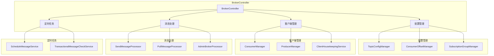

# 08-服务端管理源码解析

## 1. 模块概述

RocketMQ Broker作为服务端核心组件，负责消息存储、消息索引、消费者管理等核心功能。本章将深入解析Broker的服务端管理机制，包括BrokerController核心控制器、配置管理、客户端管理、订阅管理等关键模块。

### 1.1 核心功能

- **BrokerController**：Broker核心控制器，负责组件初始化和生命周期管理
- **TopicConfigManager**：Topic配置管理
- **ConsumerOffsetManager**：消费者偏移量管理
- **ConsumerManager**：消费者连接管理
- **ProducerManager**：生产者连接管理
- **SubscriptionGroupManager**：订阅组管理
- **ScheduleMessageService**：定时消息服务
- **BrokerOuterAPI**：与NameServer通信API

### 1.2 架构设计



## 2. BrokerController核心控制器

### 2.1 类定义

BrokerController是Broker的核心控制器，负责初始化和管理所有组件。

**源码位置**：[BrokerController.java](broker/src/main/java/org/apache/rocketmq/broker/BrokerController.java)

```java
public class BrokerController {
    protected static final InternalLogger LOG = InternalLoggerFactory.getLogger(
        LoggerName.BROKER_LOGGER_NAME);
    private static final InternalLogger LOG_PROTECTION = InternalLoggerFactory.getLogger(
        LoggerName.PROTECTION_LOGGER_NAME);
    private static final InternalLogger LOG_WATER_MARK = InternalLoggerFactory.getLogger(
        LoggerName.WATER_MARK_LOGGER_NAME);
    protected static final int HA_ADDRESS_MIN_LENGTH = 6;

    protected final BrokerConfig brokerConfig;
    private final NettyServerConfig nettyServerConfig;
    private final NettyClientConfig nettyClientConfig;
    protected final MessageStoreConfig messageStoreConfig;

    protected final ConsumerOffsetManager consumerOffsetManager;
    protected final ConsumerManager consumerManager;
    protected final ConsumerFilterManager consumerFilterManager;
    protected final ConsumerOrderInfoManager consumerOrderInfoManager;
    protected final ProducerManager producerManager;
    protected final ScheduleMessageService scheduleMessageService;
    protected final ClientHousekeepingService clientHousekeepingService;

    protected final PullMessageProcessor pullMessageProcessor;
    protected final PeekMessageProcessor peekMessageProcessor;
    protected final PopMessageProcessor popMessageProcessor;
    protected final AckMessageProcessor ackMessageProcessor;
    protected final SendMessageProcessor sendMessageProcessor;
    protected final ReplyMessageProcessor replyMessageProcessor;
    protected final AdminBrokerProcessor adminBrokerProcessor;

    protected final PullRequestHoldService pullRequestHoldService;
    protected final MessageArrivingListener messageArrivingListener;
    protected final SubscriptionGroupManager subscriptionGroupManager;

    protected BrokerOuterAPI brokerOuterAPI;
    protected ScheduledExecutorService scheduledExecutorService;
    protected RemotingServer remotingServer;
    protected RemotingServer fastRemotingServer;
    protected TopicConfigManager topicConfigManager;
    protected MessageStore messageStore;

    protected ExecutorService sendMessageExecutor;
    protected ExecutorService pullMessageExecutor;
    protected ExecutorService adminBrokerExecutor;
    protected ExecutorService clientManageExecutor;
    protected ExecutorService heartbeatExecutor;

    protected BrokerStats brokerStats;
    protected BrokerFastFailure brokerFastFailure;
    protected TransactionalMessageCheckService transactionalMessageCheckService;
    protected TransactionalMessageService transactionalMessageService;
    protected ReplicasManager replicasManager;
    protected EscapeBridge escapeBridge;
}
```

### 2.2 初始化流程

```java
public BrokerController(
    final BrokerConfig brokerConfig,
    final NettyServerConfig nettyServerConfig,
    final NettyClientConfig nettyClientConfig,
    final MessageStoreConfig messageStoreConfig
) {
    this.brokerConfig = brokerConfig;
    this.nettyServerConfig = nettyServerConfig;
    this.nettyClientConfig = nettyClientConfig;
    this.messageStoreConfig = messageStoreConfig;

    this.setStoreHost(new InetSocketAddress(
        this.getBrokerConfig().getBrokerIP1(), getListenPort()));

    this.brokerStatsManager = messageStoreConfig.isEnableLmq() 
        ? new LmqBrokerStatsManager(this.brokerConfig.getBrokerClusterName(), 
            this.brokerConfig.isEnableDetailStat()) 
        : new BrokerStatsManager(this.brokerConfig.getBrokerClusterName(), 
            this.brokerConfig.isEnableDetailStat());

    this.consumerOffsetManager = messageStoreConfig.isEnableLmq() 
        ? new LmqConsumerOffsetManager(this) 
        : new ConsumerOffsetManager(this);

    this.topicConfigManager = messageStoreConfig.isEnableLmq() 
        ? new LmqTopicConfigManager(this) 
        : new TopicConfigManager(this);

    this.topicQueueMappingManager = new TopicQueueMappingManager(this);

    this.pullMessageProcessor = new PullMessageProcessor(this);
    this.peekMessageProcessor = new PeekMessageProcessor(this);
    this.pullRequestHoldService = messageStoreConfig.isEnableLmq() 
        ? new LmqPullRequestHoldService(this) 
        : new PullRequestHoldService(this);

    this.popMessageProcessor = new PopMessageProcessor(this);
    this.sendMessageProcessor = new SendMessageProcessor(this);
    this.replyMessageProcessor = new ReplyMessageProcessor(this);

    this.messageArrivingListener = new NotifyMessageArrivingListener(
        this.pullRequestHoldService, this.popMessageProcessor, this.notificationProcessor);

    this.consumerIdsChangeListener = new DefaultConsumerIdsChangeListener(this);
    this.consumerManager = new ConsumerManager(this.consumerIdsChangeListener, 
        this.brokerStatsManager);
    this.producerManager = new ProducerManager(this.brokerStatsManager);

    this.subscriptionGroupManager = messageStoreConfig.isEnableLmq() 
        ? new LmqSubscriptionGroupManager(this) 
        : new SubscriptionGroupManager(this);

    this.scheduleMessageService = new ScheduleMessageService(this);

    if (nettyClientConfig != null) {
        this.brokerOuterAPI = new BrokerOuterAPI(nettyClientConfig);
    }

    this.filterServerManager = new FilterServerManager(this);
    this.slaveSynchronize = new SlaveSynchronize(this);
    this.endTransactionProcessor = new EndTransactionProcessor(this);

    this.sendThreadPoolQueue = new LinkedBlockingQueue<Runnable>(
        this.brokerConfig.getSendThreadPoolQueueCapacity());
    this.pullThreadPoolQueue = new LinkedBlockingQueue<Runnable>(
        this.brokerConfig.getPullThreadPoolQueueCapacity());
    this.queryThreadPoolQueue = new LinkedBlockingQueue<Runnable>(
        this.brokerConfig.getQueryThreadPoolQueueCapacity());
}
```

### 2.3 initialize方法

```java
public boolean initialize() throws CloneNotSupportedException {
    boolean result = this.topicConfigManager.load();
    result = result && this.topicQueueMappingManager.load();
    result = result && this.consumerOffsetManager.load();
    result = result && this.subscriptionGroupManager.load();
    result = result && this.consumerFilterManager.load();
    result = result && this.consumerOrderInfoManager.load();

    if (result) {
        try {
            DefaultMessageStore defaultMessageStore = new DefaultMessageStore(
                this.messageStoreConfig, this.brokerStatsManager, 
                this.messageArrivingListener, this.brokerConfig);
            defaultMessageStore.setTopicConfigTable(topicConfigManager.getTopicConfigTable());

            if (messageStoreConfig.isEnableDLegerCommitLog()) {
                DLedgerRoleChangeHandler roleChangeHandler = 
                    new DLedgerRoleChangeHandler(this, defaultMessageStore);
                ((DLedgerCommitLog) defaultMessageStore.getCommitLog())
                    .getdLedgerServer().getdLedgerLeaderElector()
                    .addRoleChangeHandler(roleChangeHandler);
            }

            this.brokerStats = new BrokerStats(defaultMessageStore);

            MessageStorePluginContext context = new MessageStorePluginContext(
                this, messageStoreConfig, brokerStatsManager, messageArrivingListener);
            this.messageStore = MessageStoreFactory.build(context, defaultMessageStore);

            this.messageStore.getDispatcherList().addFirst(
                new CommitLogDispatcherCalcBitMap(this.brokerConfig, this.consumerFilterManager));

            if (this.brokerConfig.isEnableControllerMode()) {
                this.replicasManager = new ReplicasManager(this);
            }

            if (messageStoreConfig.isTimerWheelEnable()) {
                this.timerCheckpoint = new TimerCheckpoint(
                    BrokerPathConfigHelper.getTimerCheckPath(
                        messageStoreConfig.getStorePathRootDir()));
                TimerMetrics timerMetrics = new TimerMetrics(
                    BrokerPathConfigHelper.getTimerMetricsPath(
                        messageStoreConfig.getStorePathRootDir()));
                this.timerMessageStore = new TimerMessageStore(
                    messageStore, messageStoreConfig, timerCheckpoint, 
                    timerMetrics, brokerStatsManager);
                this.messageStore.setTimerMessageStore(this.timerMessageStore);
            }
        } catch (IOException e) {
            result = false;
            LOG.error("BrokerController#initialize: unexpected error occurs", e);
        }
    }

    if (messageStore != null) {
        registerMessageStoreHook();
    }

    result = result && this.messageStore.load();

    if (messageStoreConfig.isTimerWheelEnable()) {
        result = result && this.timerMessageStore.load();
    }

    result = result && this.scheduleMessageService.load();

    if (result) {
        initializeRemotingServer();
        initializeResources();
        registerProcessor();
        initializeScheduledTasks();
        initialTransaction();
        initialAcl();
        initialRpcHooks();
    }

    return result;
}
```

### 2.4 资源初始化

```java
protected void initializeResources() {
    this.scheduledExecutorService = new ScheduledThreadPoolExecutor(1,
        new ThreadFactoryImpl("BrokerControllerScheduledThread", true, getBrokerIdentity()));

    this.sendMessageExecutor = new BrokerFixedThreadPoolExecutor(
        this.brokerConfig.getSendMessageThreadPoolNums(),
        this.brokerConfig.getSendMessageThreadPoolNums(),
        1000 * 60,
        TimeUnit.MILLISECONDS,
        this.sendThreadPoolQueue,
        new ThreadFactoryImpl("SendMessageThread_", getBrokerIdentity()));

    this.pullMessageExecutor = new BrokerFixedThreadPoolExecutor(
        this.brokerConfig.getPullMessageThreadPoolNums(),
        this.brokerConfig.getPullMessageThreadPoolNums(),
        1000 * 60,
        TimeUnit.MILLISECONDS,
        this.pullThreadPoolQueue,
        new ThreadFactoryImpl("PullMessageThread_", getBrokerIdentity()));

    this.queryMessageExecutor = new BrokerFixedThreadPoolExecutor(
        this.brokerConfig.getQueryMessageThreadPoolNums(),
        this.brokerConfig.getQueryMessageThreadPoolNums(),
        1000 * 60,
        TimeUnit.MILLISECONDS,
        this.queryThreadPoolQueue,
        new ThreadFactoryImpl("QueryMessageThread_", getBrokerIdentity()));

    this.adminBrokerExecutor = new BrokerFixedThreadPoolExecutor(
        this.brokerConfig.getAdminBrokerThreadPoolNums(),
        this.brokerConfig.getAdminBrokerThreadPoolNums(),
        1000 * 60,
        TimeUnit.MILLISECONDS,
        this.adminBrokerThreadPoolQueue,
        new ThreadFactoryImpl("AdminBrokerThread_", getBrokerIdentity()));

    this.clientManageExecutor = new BrokerFixedThreadPoolExecutor(
        this.brokerConfig.getClientManageThreadPoolNums(),
        this.brokerConfig.getClientManageThreadPoolNums(),
        1000 * 60,
        TimeUnit.MILLISECONDS,
        this.clientManagerThreadPoolQueue,
        new ThreadFactoryImpl("ClientManageThread_", getBrokerIdentity()));

    this.heartbeatExecutor = new BrokerFixedThreadPoolExecutor(
        this.brokerConfig.getHeartbeatThreadPoolNums(),
        this.brokerConfig.getHeartbeatThreadPoolNums(),
        1000 * 60,
        TimeUnit.MILLISECONDS,
        this.heartbeatThreadPoolQueue,
        new ThreadFactoryImpl("HeartbeatThread_", true, getBrokerIdentity()));
}
```

### 2.5 定时任务初始化

```java
protected void initializeBrokerScheduledTasks() {
    final long initialDelay = UtilAll.computeNextMorningTimeMillis() - 
        System.currentTimeMillis();
    final long period = TimeUnit.DAYS.toMillis(1);

    this.scheduledExecutorService.scheduleAtFixedRate(new Runnable() {
        @Override
        public void run() {
            try {
                BrokerController.this.getBrokerStats().record();
            } catch (Throwable e) {
                LOG.error("BrokerController: failed to record broker stats", e);
            }
        }
    }, initialDelay, period, TimeUnit.MILLISECONDS);

    this.scheduledExecutorService.scheduleAtFixedRate(new Runnable() {
        @Override
        public void run() {
            try {
                BrokerController.this.consumerOffsetManager.persist();
            } catch (Throwable e) {
                LOG.error("BrokerController: failed to persist config file", e);
            }
        }
    }, 1000 * 10, this.brokerConfig.getFlushConsumerOffsetInterval(), 
        TimeUnit.MILLISECONDS);

    this.scheduledExecutorService.scheduleAtFixedRate(new Runnable() {
        @Override
        public void run() {
            try {
                BrokerController.this.protectBroker();
            } catch (Throwable e) {
                LOG.error("BrokerController: failed to protectBroker", e);
            }
        }
    }, 3, 3, TimeUnit.MINUTES);

    this.scheduledExecutorService.scheduleAtFixedRate(new Runnable() {
        @Override
        public void run() {
            try {
                BrokerController.this.printWaterMark();
            } catch (Throwable e) {
                LOG.error("BrokerController: failed to print broker watermark", e);
            }
        }
    }, 10, 1, TimeUnit.SECONDS);

    if (BrokerRole.SLAVE == this.messageStoreConfig.getBrokerRole()) {
        this.scheduledExecutorService.scheduleAtFixedRate(new Runnable() {
            @Override
            public void run() {
                try {
                    if (System.currentTimeMillis() - lastSyncTimeMs > 60 * 1000) {
                        BrokerController.this.getSlaveSynchronize().syncAll();
                        lastSyncTimeMs = System.currentTimeMillis();
                    }
                    BrokerController.this.getSlaveSynchronize().syncTimerCheckPoint();
                } catch (Throwable e) {
                    LOG.error("Failed to sync all config for slave.", e);
                }
            }
        }, 1000 * 10, 3 * 1000, TimeUnit.MILLISECONDS);
    }
}
```

## 3. TopicConfigManager主题配置管理

### 3.1 类定义

TopicConfigManager负责管理Broker上所有Topic的配置信息。

**源码位置**：[TopicConfigManager.java](broker/src/main/java/org/apache/rocketmq/broker/topic/TopicConfigManager.java)

```java
public class TopicConfigManager extends ConfigManager {
    private static final InternalLogger log = InternalLoggerFactory.getLogger(
        LoggerName.BROKER_LOGGER_NAME);
    private static final long LOCK_TIMEOUT_MILLIS = 3000;
    private static final int SCHEDULE_TOPIC_QUEUE_NUM = 18;

    private transient final Lock topicConfigTableLock = new ReentrantLock();

    private final ConcurrentMap<String, TopicConfig> topicConfigTable =
        new ConcurrentHashMap<String, TopicConfig>(1024);
    private final DataVersion dataVersion = new DataVersion();
    private transient BrokerController brokerController;
}
```

### 3.2 系统Topic初始化

```java
public TopicConfigManager(BrokerController brokerController) {
    this.brokerController = brokerController;

    {
        String topic = TopicValidator.RMQ_SYS_SELF_TEST_TOPIC;
        TopicConfig topicConfig = new TopicConfig(topic);
        TopicValidator.addSystemTopic(topic);
        topicConfig.setReadQueueNums(1);
        topicConfig.setWriteQueueNums(1);
        this.topicConfigTable.put(topicConfig.getTopicName(), topicConfig);
    }

    {
        if (this.brokerController.getBrokerConfig().isAutoCreateTopicEnable()) {
            String topic = TopicValidator.AUTO_CREATE_TOPIC_KEY_TOPIC;
            TopicConfig topicConfig = new TopicConfig(topic);
            TopicValidator.addSystemTopic(topic);
            topicConfig.setReadQueueNums(this.brokerController.getBrokerConfig()
                .getDefaultTopicQueueNums());
            topicConfig.setWriteQueueNums(this.brokerController.getBrokerConfig()
                .getDefaultTopicQueueNums());
            int perm = PermName.PERM_INHERIT | PermName.PERM_READ | PermName.PERM_WRITE;
            topicConfig.setPerm(perm);
            this.topicConfigTable.put(topicConfig.getTopicName(), topicConfig);
        }
    }

    {
        String topic = TopicValidator.RMQ_SYS_BENCHMARK_TOPIC;
        TopicConfig topicConfig = new TopicConfig(topic);
        TopicValidator.addSystemTopic(topic);
        topicConfig.setReadQueueNums(1024);
        topicConfig.setWriteQueueNums(1024);
        this.topicConfigTable.put(topicConfig.getTopicName(), topicConfig);
    }

    {
        String topic = this.brokerController.getBrokerConfig().getBrokerClusterName();
        TopicConfig topicConfig = new TopicConfig(topic);
        TopicValidator.addSystemTopic(topic);
        int perm = PermName.PERM_INHERIT;
        if (this.brokerController.getBrokerConfig().isClusterTopicEnable()) {
            perm |= PermName.PERM_READ | PermName.PERM_WRITE;
        }
        topicConfig.setPerm(perm);
        this.topicConfigTable.put(topicConfig.getTopicName(), topicConfig);
    }

    {
        String topic = TopicValidator.RMQ_SYS_SCHEDULE_TOPIC;
        TopicConfig topicConfig = new TopicConfig(topic);
        TopicValidator.addSystemTopic(topic);
        topicConfig.setReadQueueNums(SCHEDULE_TOPIC_QUEUE_NUM);
        topicConfig.setWriteQueueNums(SCHEDULE_TOPIC_QUEUE_NUM);
        this.topicConfigTable.put(topicConfig.getTopicName(), topicConfig);
    }

    {
        String topic = TopicValidator.RMQ_SYS_TRANS_HALF_TOPIC;
        TopicConfig topicConfig = new TopicConfig(topic);
        TopicValidator.addSystemTopic(topic);
        topicConfig.setReadQueueNums(1);
        topicConfig.setWriteQueueNums(1);
        this.topicConfigTable.put(topicConfig.getTopicName(), topicConfig);
    }
}
```

### 3.3 Topic配置查询与更新

```java
public TopicConfig selectTopicConfig(final String topic) {
    return this.topicConfigTable.get(topic);
}

public void updateTopicConfig(final TopicConfig topicConfig) {
    TopicConfig old = this.topicConfigTable.put(topicConfig.getTopicName(), topicConfig);
    if (old != null) {
        log.info("update topic config, old: {} new: {}", old, topicConfig);
    } else {
        log.info("create new topic, {}", topicConfig);
    }

    long stateMachineVersion = brokerController.getMessageStore() != null 
        ? brokerController.getMessageStore().getStateMachineVersion() : 0;
    dataVersion.nextVersion(stateMachineVersion);

    this.persist();
}

public boolean isTopicCanSendMessage(final String topic) {
    TopicConfig topicConfig = this.topicConfigTable.get(topic);
    if (topicConfig == null) {
        return false;
    }

    if (!PermName.isWriteable(topicConfig.getPerm())) {
        return false;
    }

    return true;
}
```

## 4. ConsumerOffsetManager消费者偏移量管理

### 4.1 类定义

ConsumerOffsetManager负责管理消费者组的消费偏移量。

**源码位置**：[ConsumerOffsetManager.java](broker/src/main/java/org/apache/rocketmq/broker/offset/ConsumerOffsetManager.java)

```java
public class ConsumerOffsetManager extends ConfigManager {
    private static final InternalLogger LOG = InternalLoggerFactory.getLogger(
        LoggerName.BROKER_LOGGER_NAME);
    public static final String TOPIC_GROUP_SEPARATOR = "@";

    private DataVersion dataVersion = new DataVersion();

    protected ConcurrentMap<String/* topic@group */, ConcurrentMap<Integer, Long>> offsetTable =
        new ConcurrentHashMap<String, ConcurrentMap<Integer, Long>>(512);

    protected transient BrokerController brokerController;
    private transient AtomicLong versionChangeCounter = new AtomicLong(0);
}
```

### 4.2 偏移量提交

```java
public void commitOffset(final String clientHost, final String group, 
    final String topic, final int queueId, final long offset) {
    String key = topic + TOPIC_GROUP_SEPARATOR + group;
    this.commitOffset(clientHost, key, queueId, offset);
}

private void commitOffset(final String clientHost, final String key, 
    final int queueId, final long offset) {
    ConcurrentMap<Integer, Long> map = this.offsetTable.get(key);
    if (null == map) {
        map = new ConcurrentHashMap<Integer, Long>(32);
        map.put(queueId, offset);
        this.offsetTable.put(key, map);
    } else {
        Long storeOffset = map.put(queueId, offset);
        if (storeOffset != null && offset < storeOffset) {
            LOG.warn("[NOTIFYME]update consumer offset less than store. " +
                "clientHost={}, key={}, queueId={}, requestOffset={}, storeOffset={}", 
                clientHost, key, queueId, offset, storeOffset);
        }
    }

    if (versionChangeCounter.incrementAndGet() % 
        brokerController.getBrokerConfig().getConsumerOffsetUpdateVersionStep() == 0) {
        long stateMachineVersion = brokerController.getMessageStore() != null 
            ? brokerController.getMessageStore().getStateMachineVersion() : 0;
        dataVersion.nextVersion(stateMachineVersion);
    }
}
```

### 4.3 偏移量查询

```java
public long queryOffset(final String group, final String topic, final int queueId) {
    String key = topic + TOPIC_GROUP_SEPARATOR + group;
    ConcurrentMap<Integer, Long> map = this.offsetTable.get(key);
    if (null != map) {
        Long offset = map.get(queueId);
        if (offset != null) {
            return offset;
        }
    }
    return -1;
}

public Map<Integer, Long> queryOffset(final String group, final String topic) {
    String key = topic + TOPIC_GROUP_SEPARATOR + group;
    return this.offsetTable.get(key);
}

public Set<String> whichTopicByConsumer(final String group) {
    Set<String> topics = new HashSet<String>();

    Iterator<Entry<String, ConcurrentMap<Integer, Long>>> it = 
        this.offsetTable.entrySet().iterator();
    while (it.hasNext()) {
        Entry<String, ConcurrentMap<Integer, Long>> next = it.next();
        String topicAtGroup = next.getKey();
        String[] arrays = topicAtGroup.split(TOPIC_GROUP_SEPARATOR);
        if (arrays.length == 2) {
            if (group.equals(arrays[1])) {
                topics.add(arrays[0]);
            }
        }
    }

    return topics;
}
```

### 4.4 清理过期偏移量

```java
public void cleanOffset(String group) {
    Iterator<Entry<String, ConcurrentMap<Integer, Long>>> it = 
        this.offsetTable.entrySet().iterator();
    while (it.hasNext()) {
        Entry<String, ConcurrentMap<Integer, Long>> next = it.next();
        String topicAtGroup = next.getKey();
        if (topicAtGroup.contains(group)) {
            String[] arrays = topicAtGroup.split(TOPIC_GROUP_SEPARATOR);
            if (arrays.length == 2 && group.equals(arrays[1])) {
                it.remove();
                LOG.warn("Clean group's offset, {}, {}", topicAtGroup, next.getValue());
            }
        }
    }
}

public void cleanOffsetByTopic(String topic) {
    Iterator<Entry<String, ConcurrentMap<Integer, Long>>> it = 
        this.offsetTable.entrySet().iterator();
    while (it.hasNext()) {
        Entry<String, ConcurrentMap<Integer, Long>> next = it.next();
        String topicAtGroup = next.getKey();
        if (topicAtGroup.contains(topic)) {
            String[] arrays = topicAtGroup.split(TOPIC_GROUP_SEPARATOR);
            if (arrays.length == 2 && topic.equals(arrays[0])) {
                it.remove();
                LOG.warn("Clean topic's offset, {}, {}", topicAtGroup, next.getValue());
            }
        }
    }
}
```

## 5. ConsumerManager消费者管理

### 5.1 类定义

ConsumerManager负责管理消费者组的连接和订阅信息。

**源码位置**：[ConsumerManager.java](broker/src/main/java/org/apache/rocketmq/broker/client/ConsumerManager.java)

```java
public class ConsumerManager {
    private static final InternalLogger LOGGER = InternalLoggerFactory.getLogger(
        LoggerName.BROKER_LOGGER_NAME);
    private static final long CHANNEL_EXPIRED_TIMEOUT = 1000 * 120;

    private final ConcurrentMap<String, ConsumerGroupInfo> consumerTable =
        new ConcurrentHashMap<String, ConsumerGroupInfo>(1024);

    private final List<ConsumerIdsChangeListener> consumerIdsChangeListenerList = 
        new CopyOnWriteArrayList<>();
    protected final BrokerStatsManager brokerStatsManager;
}
```

### 5.2 消费者注册

```java
public boolean registerConsumer(final String group, final ClientChannelInfo clientChannelInfo,
    ConsumeType consumeType, MessageModel messageModel, ConsumeFromWhere consumeFromWhere,
    final Set<SubscriptionData> subList, boolean isNotifyConsumerIdsChangedEnable) {
    return registerConsumer(group, clientChannelInfo, consumeType, messageModel, 
        consumeFromWhere, subList, isNotifyConsumerIdsChangedEnable, true);
}

public boolean registerConsumer(final String group, final ClientChannelInfo clientChannelInfo,
    ConsumeType consumeType, MessageModel messageModel, ConsumeFromWhere consumeFromWhere,
    final Set<SubscriptionData> subList, boolean isNotifyConsumerIdsChangedEnable, 
    boolean updateSubscription) {
    long start = System.currentTimeMillis();
    ConsumerGroupInfo consumerGroupInfo = this.consumerTable.get(group);
    if (null == consumerGroupInfo) {
        callConsumerIdsChangeListener(ConsumerGroupEvent.CLIENT_REGISTER, group, 
            clientChannelInfo, subList.stream().map(SubscriptionData::getTopic)
                .collect(Collectors.toSet()));
        ConsumerGroupInfo tmp = new ConsumerGroupInfo(group, consumeType, 
            messageModel, consumeFromWhere);
        ConsumerGroupInfo prev = this.consumerTable.putIfAbsent(group, tmp);
        consumerGroupInfo = prev != null ? prev : tmp;
    }

    boolean r1 = consumerGroupInfo.updateChannel(clientChannelInfo, consumeType, 
        messageModel, consumeFromWhere);
    boolean r2 = false;
    if (updateSubscription) {
        r2 = consumerGroupInfo.updateSubscription(subList);
    }

    if (r1 || r2) {
        if (isNotifyConsumerIdsChangedEnable) {
            callConsumerIdsChangeListener(ConsumerGroupEvent.CHANGE, group, 
                consumerGroupInfo.getAllChannel());
        }
    }

    this.brokerStatsManager.incConsumerRegisterTime(
        (int) (System.currentTimeMillis() - start));

    return r1 || r2;
}
```

### 5.3 消费者注销

```java
public boolean doChannelCloseEvent(final String remoteAddr, final Channel channel) {
    boolean removed = false;
    Iterator<Entry<String, ConsumerGroupInfo>> it = this.consumerTable.entrySet().iterator();
    while (it.hasNext()) {
        Entry<String, ConsumerGroupInfo> next = it.next();
        ConsumerGroupInfo info = next.getValue();
        ClientChannelInfo clientChannelInfo = info.doChannelCloseEvent(remoteAddr, channel);
        if (clientChannelInfo != null) {
            callConsumerIdsChangeListener(ConsumerGroupEvent.CLIENT_UNREGISTER, 
                next.getKey(), clientChannelInfo, info.getSubscribeTopics());
            if (info.getChannelInfoTable().isEmpty()) {
                ConsumerGroupInfo remove = this.consumerTable.remove(next.getKey());
                if (remove != null) {
                    LOGGER.info("unregister consumer ok, no any connection, " +
                        "and remove consumer group, {}", next.getKey());
                    callConsumerIdsChangeListener(ConsumerGroupEvent.UNREGISTER, next.getKey());
                }
            }

            callConsumerIdsChangeListener(ConsumerGroupEvent.CHANGE, next.getKey(), 
                info.getAllChannel());
        }
    }
    return removed;
}
```

### 5.4 订阅信息查询

```java
public SubscriptionData findSubscriptionData(final String group, final String topic) {
    ConsumerGroupInfo consumerGroupInfo = this.getConsumerGroupInfo(group);
    if (consumerGroupInfo != null) {
        return consumerGroupInfo.findSubscriptionData(topic);
    }
    return null;
}

public int findSubscriptionDataCount(final String group) {
    ConsumerGroupInfo consumerGroupInfo = this.getConsumerGroupInfo(group);
    if (consumerGroupInfo != null) {
        return consumerGroupInfo.getSubscriptionTable().size();
    }
    return 0;
}
```

## 6. ProducerManager生产者管理

### 6.1 类定义

ProducerManager负责管理生产者组的连接信息。

**源码位置**：[ProducerManager.java](broker/src/main/java/org/apache/rocketmq/broker/client/ProducerManager.java)

```java
public class ProducerManager {
    private static final InternalLogger log = InternalLoggerFactory.getLogger(
        LoggerName.BROKER_LOGGER_NAME);
    private static final long CHANNEL_EXPIRED_TIMEOUT = 1000 * 120;
    private static final int GET_AVAILABLE_CHANNEL_RETRY_COUNT = 3;

    private final ConcurrentHashMap<String /* group name */, 
        ConcurrentHashMap<Channel, ClientChannelInfo>> groupChannelTable =
        new ConcurrentHashMap<>();

    private final ConcurrentHashMap<String, Channel> clientChannelTable = 
        new ConcurrentHashMap<>();

    protected final BrokerStatsManager brokerStatsManager;
    private PositiveAtomicCounter positiveAtomicCounter = new PositiveAtomicCounter();
    private final List<ProducerChangeListener> producerChangeListenerList = 
        new CopyOnWriteArrayList<>();
}
```

### 6.2 生产者注册

```java
public void registerProducer(final String group, final ClientChannelInfo clientChannelInfo) {
    ClientChannelInfo old = null;
    ConcurrentHashMap<Channel, ClientChannelInfo> channelTable = 
        this.groupChannelTable.get(group);
    if (null == channelTable) {
        channelTable = new ConcurrentHashMap<>();
        ConcurrentHashMap<Channel, ClientChannelInfo> prev = 
            this.groupChannelTable.putIfAbsent(group, channelTable);
        channelTable = prev != null ? prev : channelTable;
    }

    old = channelTable.put(clientChannelInfo.getChannel(), clientChannelInfo);
    clientChannelTable.put(clientChannelInfo.getClientId(), clientChannelInfo.getChannel());

    if (old == null) {
        log.info("new producer connected, group: {}, channel: {}", group, 
            clientChannelInfo.toString());
        callProducerChangeListener(ProducerGroupEvent.CLIENT_REGISTER, group, clientChannelInfo);
    } else {
        log.info("producer already exist, group: {}, channel: {}", group, 
            clientChannelInfo.toString());
    }
}
```

### 6.3 非活跃Channel扫描

```java
public void scanNotActiveChannel() {
    Iterator<Map.Entry<String, ConcurrentHashMap<Channel, ClientChannelInfo>>> iterator = 
        this.groupChannelTable.entrySet().iterator();

    while (iterator.hasNext()) {
        Map.Entry<String, ConcurrentHashMap<Channel, ClientChannelInfo>> entry = 
            iterator.next();

        final String group = entry.getKey();
        final ConcurrentHashMap<Channel, ClientChannelInfo> chlMap = entry.getValue();

        Iterator<Entry<Channel, ClientChannelInfo>> it = chlMap.entrySet().iterator();
        while (it.hasNext()) {
            Entry<Channel, ClientChannelInfo> item = it.next();
            final ClientChannelInfo info = item.getValue();

            long diff = System.currentTimeMillis() - info.getLastUpdateTimestamp();
            if (diff > CHANNEL_EXPIRED_TIMEOUT) {
                it.remove();
                clientChannelTable.remove(info.getClientId());
                log.warn("ProducerManager#scanNotActiveChannel: remove expired channel[{}] " +
                    "from ProducerManager groupChannelTable, producer group name: {}",
                    RemotingHelper.parseChannelRemoteAddr(info.getChannel()), group);
                callProducerChangeListener(ProducerGroupEvent.CLIENT_UNREGISTER, group, info);
                RemotingUtil.closeChannel(info.getChannel());
            }
        }

        if (chlMap.isEmpty()) {
            log.warn("SCAN: remove expired channel from ProducerManager " +
                "groupChannelTable, all clear, group={}", group);
            iterator.remove();
            callProducerChangeListener(ProducerGroupEvent.GROUP_UNREGISTER, group, null);
        }
    }
}
```

## 7. SubscriptionGroupManager订阅组管理

### 7.1 类定义

SubscriptionGroupManager负责管理订阅组的配置信息。

**源码位置**：[SubscriptionGroupManager.java](broker/src/main/java/org/apache/rocketmq/broker/subscription/SubscriptionGroupManager.java)

```java
public class SubscriptionGroupManager extends ConfigManager {
    private static final InternalLogger log = InternalLoggerFactory.getLogger(
        LoggerName.BROKER_LOGGER_NAME);

    private final ConcurrentMap<String, SubscriptionGroupConfig> subscriptionGroupTable =
        new ConcurrentHashMap<String, SubscriptionGroupConfig>(1024);

    private final ConcurrentMap<String, ConcurrentMap<String, Integer>> forbiddenTable =
        new ConcurrentHashMap<String, ConcurrentMap<String, Integer>>(4);

    private final DataVersion dataVersion = new DataVersion();
    private transient BrokerController brokerController;
}
```

### 7.2 系统订阅组初始化

```java
private void init() {
    {
        SubscriptionGroupConfig subscriptionGroupConfig = new SubscriptionGroupConfig();
        subscriptionGroupConfig.setGroupName(MixAll.TOOLS_CONSUMER_GROUP);
        this.subscriptionGroupTable.put(MixAll.TOOLS_CONSUMER_GROUP, subscriptionGroupConfig);
    }

    {
        SubscriptionGroupConfig subscriptionGroupConfig = new SubscriptionGroupConfig();
        subscriptionGroupConfig.setGroupName(MixAll.FILTERSRV_CONSUMER_GROUP);
        this.subscriptionGroupTable.put(MixAll.FILTERSRV_CONSUMER_GROUP, subscriptionGroupConfig);
    }

    {
        SubscriptionGroupConfig subscriptionGroupConfig = new SubscriptionGroupConfig();
        subscriptionGroupConfig.setGroupName(MixAll.SELF_TEST_CONSUMER_GROUP);
        this.subscriptionGroupTable.put(MixAll.SELF_TEST_CONSUMER_GROUP, subscriptionGroupConfig);
    }

    {
        SubscriptionGroupConfig subscriptionGroupConfig = new SubscriptionGroupConfig();
        subscriptionGroupConfig.setGroupName(MixAll.CID_SYS_RMQ_TRANS);
        subscriptionGroupConfig.setConsumeBroadcastEnable(true);
        this.subscriptionGroupTable.put(MixAll.CID_SYS_RMQ_TRANS, subscriptionGroupConfig);
    }
}
```

### 7.3 订阅组配置更新

```java
public void updateSubscriptionGroupConfig(final SubscriptionGroupConfig config) {
    SubscriptionGroupConfig old = this.subscriptionGroupTable.put(config.getGroupName(), config);
    if (old != null) {
        log.info("update subscription group config, old: {} new: {}", old, config);
    } else {
        log.info("create new subscription group, {}", config);
    }

    long stateMachineVersion = brokerController.getMessageStore() != null 
        ? brokerController.getMessageStore().getStateMachineVersion() : 0;
    dataVersion.nextVersion(stateMachineVersion);

    this.persist();
}
```

## 8. ScheduleMessageService定时消息服务

### 8.1 类定义

ScheduleMessageService负责处理定时消息的调度和投递。

**源码位置**：[ScheduleMessageService.java](broker/src/main/java/org/apache/rocketmq/broker/schedule/ScheduleMessageService.java)

```java
public class ScheduleMessageService extends ConfigManager {
    private static final InternalLogger log = InternalLoggerFactory.getLogger(
        LoggerName.STORE_LOGGER_NAME);

    private static final long FIRST_DELAY_TIME = 1000L;
    private static final long DELAY_FOR_A_WHILE = 100L;
    private static final long DELAY_FOR_A_PERIOD = 10000L;
    private static final long WAIT_FOR_SHUTDOWN = 5000L;

    private final ConcurrentMap<Integer /* level */, Long/* delay timeMillis */> delayLevelTable =
        new ConcurrentHashMap<Integer, Long>(32);

    private final ConcurrentMap<Integer /* level */, Long/* offset */> offsetTable =
        new ConcurrentHashMap<Integer, Long>(32);

    private final AtomicBoolean started = new AtomicBoolean(false);
    private ScheduledExecutorService deliverExecutorService;
    private int maxDelayLevel;
    private DataVersion dataVersion = new DataVersion();
    private boolean enableAsyncDeliver = false;
    private final BrokerController brokerController;
}
```

### 8.2 服务启动

```java
public void start() {
    if (started.compareAndSet(false, true)) {
        this.load();
        this.deliverExecutorService = new ScheduledThreadPoolExecutor(
            this.maxDelayLevel, 
            new ThreadFactoryImpl("ScheduleMessageTimerThread_"));

        if (this.enableAsyncDeliver) {
            this.handleExecutorService = new ScheduledThreadPoolExecutor(
                this.maxDelayLevel, 
                new ThreadFactoryImpl("ScheduleMessageExecutorHandleThread_"));
        }

        for (Map.Entry<Integer, Long> entry : this.delayLevelTable.entrySet()) {
            Integer level = entry.getKey();
            Long timeDelay = entry.getValue();
            Long offset = this.offsetTable.get(level);
            if (null == offset) {
                offset = 0L;
            }

            if (timeDelay != null) {
                if (this.enableAsyncDeliver) {
                    this.handleExecutorService.schedule(
                        new HandlePutResultTask(level), 
                        FIRST_DELAY_TIME, TimeUnit.MILLISECONDS);
                }
                this.deliverExecutorService.schedule(
                    new DeliverDelayedMessageTimerTask(level, offset), 
                    FIRST_DELAY_TIME, TimeUnit.MILLISECONDS);
            }
        }
    }
}
```

### 8.3 延迟级别转换

```java
public static int queueId2DelayLevel(final int queueId) {
    return queueId + 1;
}

public static int delayLevel2QueueId(final int delayLevel) {
    return delayLevel - 1;
}

public long computeDeliverTimestamp(final int delayLevel, final long storeTimestamp) {
    Long time = this.delayLevelTable.get(delayLevel);
    if (time != null) {
        return time + storeTimestamp;
    }
    return storeTimestamp + 1000;
}
```

## 9. BrokerOuterAPI外部通信

### 9.1 类定义

BrokerOuterAPI负责Broker与NameServer之间的通信。

**源码位置**：[BrokerOuterAPI.java](broker/src/main/java/org/apache/rocketmq/broker/out/BrokerOuterAPI.java)

```java
public class BrokerOuterAPI {
    private static final InternalLogger LOGGER = InternalLoggerFactory.getLogger(
        LoggerName.BROKER_LOGGER_NAME);

    private final RemotingClient remotingClient;
    private final TopAddressing topAddressing = new DefaultTopAddressing(MixAll.getWSAddr());
    private String nameSrvAddr = null;
    private BrokerFixedThreadPoolExecutor brokerOuterExecutor = 
        new BrokerFixedThreadPoolExecutor(4, 10, 1, TimeUnit.MINUTES,
            new ArrayBlockingQueue<>(32), 
            new ThreadFactoryImpl("brokerOutApi_thread_", true));

    private ClientMetadata clientMetadata;
    private RpcClient rpcClient;
}
```

### 9.2 NameServer地址获取

```java
public String fetchNameServerAddr() {
    try {
        String addrs = this.topAddressing.fetchNSAddr();
        if (!UtilAll.isBlank(addrs)) {
            if (!addrs.equals(this.nameSrvAddr)) {
                LOGGER.info("name server address changed, old: {} new: {}", 
                    this.nameSrvAddr, addrs);
                this.updateNameServerAddressList(addrs);
                this.nameSrvAddr = addrs;
                return nameSrvAddr;
            }
        }
    } catch (Exception e) {
        LOGGER.error("fetchNameServerAddr Exception", e);
    }
    return nameSrvAddr;
}

public void updateNameServerAddressList(final String addrs) {
    String[] addrArray = addrs.split(";");
    List<String> lst = new ArrayList<String>(Arrays.asList(addrArray));
    this.remotingClient.updateNameServerAddressList(lst);
}
```

## 10. 业务场景示例

### 10.1 动态创建Topic示例

```java
public class TopicManageExample {
    public static void main(String[] args) {
        BrokerController brokerController = createBrokerController();
        TopicConfigManager topicConfigManager = brokerController.getTopicConfigManager();

        TopicConfig topicConfig = new TopicConfig();
        topicConfig.setTopicName("TestTopic");
        topicConfig.setReadQueueNums(8);
        topicConfig.setWriteQueueNums(8);
        topicConfig.setPerm(PermName.PERM_READ | PermName.PERM_WRITE);

        topicConfigManager.updateTopicConfig(topicConfig);

        System.out.println("Topic created: " + topicConfig.getTopicName());
    }
}
```

### 10.2 消费偏移量管理示例

```java
public class OffsetManageExample {
    public static void main(String[] args) {
        BrokerController brokerController = createBrokerController();
        ConsumerOffsetManager offsetManager = brokerController.getConsumerOffsetManager();

        String group = "TestConsumerGroup";
        String topic = "TestTopic";
        int queueId = 0;
        long offset = 1000L;

        offsetManager.commitOffset("127.0.0.1", group, topic, queueId, offset);

        long queryOffset = offsetManager.queryOffset(group, topic, queueId);
        System.out.println("Committed offset: " + queryOffset);

        Set<String> topics = offsetManager.whichTopicByConsumer(group);
        System.out.println("Topics consumed by group: " + topics);
    }
}
```

### 10.3 消费者状态监控示例

```java
public class ConsumerMonitorExample {
    public static void main(String[] args) {
        BrokerController brokerController = createBrokerController();
        ConsumerManager consumerManager = brokerController.getConsumerManager();

        ConcurrentMap<String, ConsumerGroupInfo> consumerTable = 
            consumerManager.getConsumerTable();

        for (Map.Entry<String, ConsumerGroupInfo> entry : consumerTable.entrySet()) {
            String group = entry.getKey();
            ConsumerGroupInfo groupInfo = entry.getValue();

            System.out.println("Consumer Group: " + group);
            System.out.println("  ConsumeType: " + groupInfo.getConsumeType());
            System.out.println("  MessageModel: " + groupInfo.getMessageModel());
            System.out.println("  Channel Count: " + groupInfo.getChannelInfoTable().size());

            for (Map.Entry<String, SubscriptionData> subEntry : 
                groupInfo.getSubscriptionTable().entrySet()) {
                System.out.println("  Subscription: " + subEntry.getKey());
            }
        }
    }
}
```

## 11. 总结

### 11.1 核心流程

```mermaid
flowchart TB
    subgraph Broker启动流程
        A[BrokerStartup] --> B[创建BrokerController]
        B --> C[initialize]
        C --> D[加载配置]
        D --> E[初始化MessageStore]
        E --> F[初始化RemotingServer]
        F --> G[初始化线程池]
        G --> H[注册Processor]
        H --> I[启动定时任务]
        I --> J[start]
    end
    
    subgraph 配置管理流程
        K[TopicConfigManager] --> L[load配置]
        L --> M[内存维护]
        M --> N[persist持久化]
    end
    
    subgraph 客户端管理流程
        O[客户端连接] --> P[注册到Manager]
        P --> Q[心跳检测]
        Q --> R{是否过期}
        R --> |是| S[移除连接]
        R --> |否| Q
    end
```



### 11.2 设计亮点

1. **模块化设计**：BrokerController作为核心控制器，各组件职责清晰
2. **配置持久化**：所有配置支持持久化到磁盘，重启后自动恢复
3. **心跳检测**：通过定时扫描非活跃连接，及时清理资源
4. **线程池隔离**：不同类型的请求使用独立的线程池，避免相互影响
5. **版本控制**：配置变更时更新版本号，支持主从同步

### 11.3 最佳实践

1. 合理配置线程池大小，避免资源浪费
2. 定期检查消费者连接状态，及时清理无效连接
3. 监控消费偏移量，确保消费进度正常
4. 根据业务需求调整Topic的队列数量
5. 合理配置订阅组权限，确保消息安全
