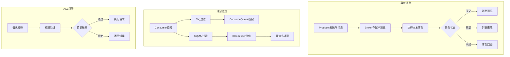
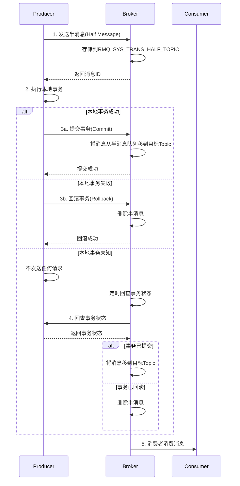
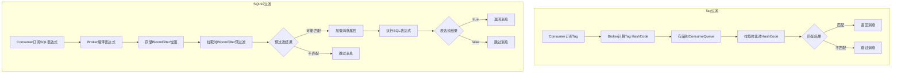
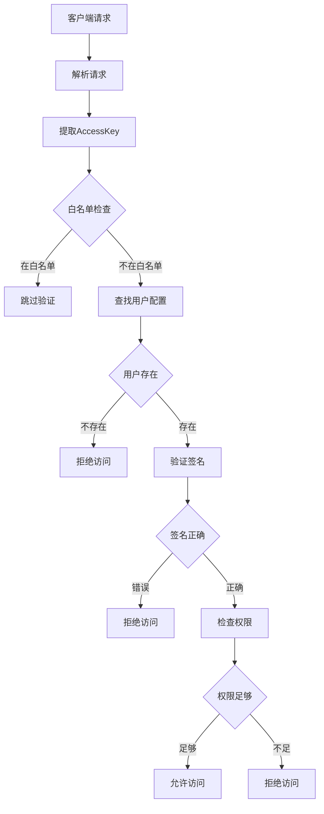
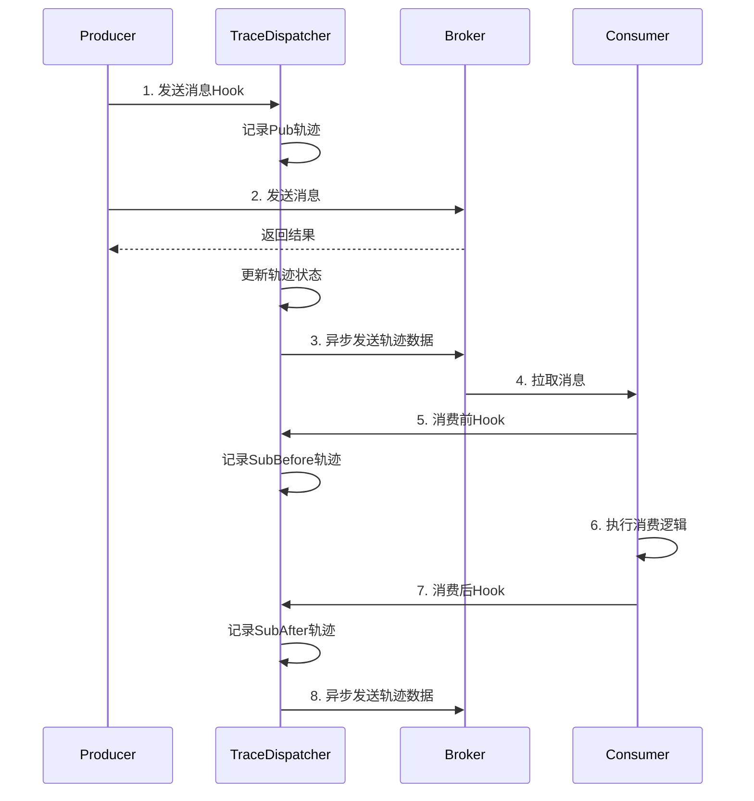
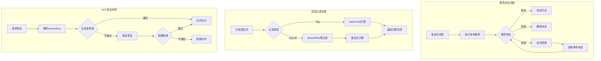

# 09-高级特性源码解析

## 1. 模块概述

RocketMQ提供了丰富的高级特性来满足企业级应用场景的需求。本章将深入解析RocketMQ的核心高级特性，包括事务消息、消息过滤、ACL权限控制、消息轨迹追踪等关键功能。

### 1.1 核心特性

- **事务消息**：分布式事务解决方案，保证消息发送与本地事务的原子性
- **消息过滤**：支持Tag过滤和SQL92表达式过滤
- **ACL权限控制**：访问控制列表，实现细粒度的权限管理
- **消息轨迹追踪**：全链路消息追踪，便于问题排查

### 1.2 架构设计



## 2. 事务消息

### 2.1 TransactionalMessageService接口

TransactionalMessageService是事务消息服务的核心接口。

**源码位置**：[TransactionalMessageService.java](broker/src/main/java/org/apache/rocketmq/broker/transaction/TransactionalMessageService.java)

```java
public interface TransactionalMessageService {

    /**
     * 处理准备消息，将消息存储到存储服务
     */
    PutMessageResult prepareMessage(MessageExtBrokerInner messageInner);

    /**
     * 异步处理准备消息
     */
    CompletableFuture<PutMessageResult> asyncPrepareMessage(MessageExtBrokerInner messageInner);

    /**
     * 删除准备消息（提交或回滚后）
     */
    boolean deletePrepareMessage(MessageExt messageExt);

    /**
     * 提交准备消息
     */
    OperationResult commitMessage(EndTransactionRequestHeader requestHeader);

    /**
     * 回滚准备消息
     */
    OperationResult rollbackMessage(EndTransactionRequestHeader requestHeader);

    /**
     * 检查未提交/未回滚的半消息
     */
    void check(long transactionTimeout, int transactionCheckMax, 
        AbstractTransactionalMessageCheckListener listener);

    /**
     * 开启事务服务
     */
    boolean open();

    /**
     * 关闭事务服务
     */
    void close();
}
```

### 2.2 TransactionalMessageServiceImpl实现

**源码位置**：[TransactionalMessageServiceImpl.java](broker/src/main/java/org/apache/rocketmq/broker/transaction/queue/TransactionalMessageServiceImpl.java)

```java
public class TransactionalMessageServiceImpl implements TransactionalMessageService {
    private static final InternalLogger log = InternalLoggerFactory.getLogger(
        LoggerName.TRANSACTION_LOGGER_NAME);

    private TransactionalMessageBridge transactionalMessageBridge;

    private static final int PULL_MSG_RETRY_NUMBER = 1;
    private static final int MAX_PROCESS_TIME_LIMIT = 60000;
    private static final int MAX_RETRY_COUNT_WHEN_HALF_NULL = 1;

    private ConcurrentHashMap<MessageQueue, MessageQueue> opQueueMap = new ConcurrentHashMap<>();

    @Override
    public CompletableFuture<PutMessageResult> asyncPrepareMessage(MessageExtBrokerInner messageInner) {
        return transactionalMessageBridge.asyncPutHalfMessage(messageInner);
    }

    @Override
    public PutMessageResult prepareMessage(MessageExtBrokerInner messageInner) {
        return transactionalMessageBridge.putHalfMessage(messageInner);
    }

    private boolean needDiscard(MessageExt msgExt, int transactionCheckMax) {
        String checkTimes = msgExt.getProperty(MessageConst.PROPERTY_TRANSACTION_CHECK_TIMES);
        int checkTime = 1;
        if (null != checkTimes) {
            checkTime = getInt(checkTimes);
            if (checkTime >= transactionCheckMax) {
                return true;
            } else {
                checkTime++;
            }
        }
        msgExt.putUserProperty(MessageConst.PROPERTY_TRANSACTION_CHECK_TIMES, 
            String.valueOf(checkTime));
        return false;
    }

    private boolean needSkip(MessageExt msgExt) {
        long valueOfCurrentMinusBorn = System.currentTimeMillis() - msgExt.getBornTimestamp();
        if (valueOfCurrentMinusBorn > 
            transactionalMessageBridge.getBrokerController().getMessageStoreConfig()
                .getFileReservedTime() * 3600L * 1000) {
            log.info("Half message exceed file reserved time, so skip it. " +
                "messageId={}, bornTime={}", msgExt.getMsgId(), msgExt.getBornTimestamp());
            return true;
        }
        return false;
    }

    @Override
    public void check(long transactionTimeout, int transactionCheckMax,
        AbstractTransactionalMessageCheckListener listener) {
        try {
            String topic = TopicValidator.RMQ_SYS_TRANS_HALF_TOPIC;
            Set<MessageQueue> msgQueues = transactionalMessageBridge.fetchMessageQueues(topic);
            if (msgQueues == null || msgQueues.size() == 0) {
                log.warn("The queue of topic is empty: " + topic);
                return;
            }
            log.debug("Check topic={}, queues={}", topic, msgQueues);

            for (MessageQueue messageQueue : msgQueues) {
                long startTime = System.currentTimeMillis();
                MessageQueue opQueue = getOpQueue(messageQueue);
                long halfOffset = transactionalMessageBridge.fetchConsumeOffset(messageQueue);
                long opOffset = transactionalMessageBridge.fetchConsumeOffset(opQueue);
                log.info("Before check, the queue={} msgOffset={} opOffset={}", 
                    messageQueue, halfOffset, opOffset);

                if (halfOffset < 0 || opOffset < 0) {
                    log.error("MessageQueue: {} illegal offset read: {}, op offset: {}, skip this queue",
                        messageQueue, halfOffset, opOffset);
                    continue;
                }

                List<Long> doneOpOffset = new ArrayList<>();
                HashMap<Long, Long> removeMap = new HashMap<>();
                PullResult pullResult = fillOpRemoveMap(removeMap, opQueue, opOffset, 
                    halfOffset, doneOpOffset);

                if (null == pullResult) {
                    log.error("The queue={} check msgOffset={} with opOffset={} failed, " +
                        "pullResult is null", messageQueue, halfOffset, opOffset);
                    continue;
                }

                int getMessageNullCount = 1;
                long newOffset = halfOffset;
                long i = halfOffset;

                while (true) {
                    if (System.currentTimeMillis() - startTime > MAX_PROCESS_TIME_LIMIT) {
                        log.info("Queue={} process time reach max={}", 
                            messageQueue, MAX_PROCESS_TIME_LIMIT);
                        break;
                    }
                    if (removeMap.containsKey(i)) {
                        log.debug("Half offset {} has been committed/rolled back", i);
                        Long removedOpOffset = removeMap.remove(i);
                        doneOpOffset.add(removedOpOffset);
                    } else {
                        GetResult getResult = getHalfMsg(messageQueue, i);
                        MessageExt msgExt = getResult.getMsg();
                        if (msgExt == null) {
                            if (getMessageNullCount++ > MAX_RETRY_COUNT_WHEN_HALF_NULL) {
                                break;
                            }
                            if (getResult.getPullResult().getPullStatus() == 
                                PullStatus.NO_NEW_MSG) {
                                log.debug("No new msg, the miss offset={} in={}, " +
                                    "continue check={}", i, messageQueue, getMessageNullCount);
                                break;
                            } else {
                                log.info("Illegal offset, the miss offset={} in={}, " +
                                    "continue check={}", i, messageQueue, getMessageNullCount);
                                i = getResult.getPullResult().getNextBeginOffset();
                                newOffset = i;
                                continue;
                            }
                        }

                        if (needDiscard(msgExt, transactionCheckMax) || needSkip(msgExt)) {
                            listener.resolveDiscardMsg(msgExt);
                            newOffset = i + 1;
                            i++;
                            continue;
                        }

                        if (msgExt.getStoreTimestamp() >= startTime) {
                            log.debug("Fresh stored. the miss offset={}, check it later", i);
                            break;
                        }

                        long valueOfCurrentMinusBorn = System.currentTimeMillis() - 
                            msgExt.getBornTimestamp();
                        long checkImmunityTime = transactionTimeout;
                        String checkImmunityTimeStr = msgExt.getUserProperty(
                            MessageConst.PROPERTY_CHECK_IMMUNITY_TIME_IN_SECONDS);
                        if (null != checkImmunityTimeStr) {
                            checkImmunityTime = getImmunityTime(checkImmunityTimeStr, 
                                transactionTimeout);
                        }

                        if (valueOfCurrentMinusBorn < checkImmunityTime * 1000) {
                            log.debug("New born, not check, born time={}, checkImmunityTime={}",
                                msgExt.getBornTimestamp(), checkImmunityTime);
                        } else if ((checkImmunityTime > 0) && 
                            (valueOfCurrentMinusBorn - checkImmunityTime * 1000) > 
                            transactionTimeout * 1000) {
                            log.info("Check transaction, born time={}, checkImmunityTime={}",
                                msgExt.getBornTimestamp(), checkImmunityTime);
                            listener.resolveHalfMsg(msgExt);
                        } else {
                            listener.resolveHalfMsg(msgExt);
                        }
                    }
                    newOffset = i + 1;
                    i++;
                }

                if (newOffset != halfOffset) {
                    transactionalMessageBridge.updateConsumeOffset(messageQueue, newOffset);
                }

                long newOpOffset = calculateOpOffset(doneOpOffset, opOffset);
                if (newOpOffset != opOffset) {
                    transactionalMessageBridge.updateConsumeOffset(opQueue, newOpOffset);
                }
            }
        } catch (Throwable e) {
            log.error("Check transaction message error", e);
        }
    }
}
```

### 2.3 TransactionalMessageCheckService事务回查服务

**源码位置**：[TransactionalMessageCheckService.java](broker/src/main/java/org/apache/rocketmq/broker/transaction/TransactionalMessageCheckService.java)

```java
public class TransactionalMessageCheckService extends ServiceThread {
    private static final InternalLogger log = InternalLoggerFactory.getLogger(
        LoggerName.TRANSACTION_LOGGER_NAME);

    private BrokerController brokerController;

    public TransactionalMessageCheckService(BrokerController brokerController) {
        this.brokerController = brokerController;
    }

    @Override
    public String getServiceName() {
        if (brokerController != null && 
            brokerController.getBrokerConfig().isInBrokerContainer()) {
            return brokerController.getBrokerIdentity().getLoggerIdentifier() + 
                TransactionalMessageCheckService.class.getSimpleName();
        }
        return TransactionalMessageCheckService.class.getSimpleName();
    }

    @Override
    public void run() {
        log.info("Start transaction check service thread!");
        while (!this.isStopped()) {
            long checkInterval = brokerController.getBrokerConfig()
                .getTransactionCheckInterval();
            this.waitForRunning(checkInterval);
        }
        log.info("End transaction check service thread!");
    }

    @Override
    protected void onWaitEnd() {
        long timeout = brokerController.getBrokerConfig().getTransactionTimeOut();
        int checkMax = brokerController.getBrokerConfig().getTransactionCheckMax();
        long begin = System.currentTimeMillis();
        log.info("Begin to check prepare message, begin time:{}", begin);
        this.brokerController.getTransactionalMessageService()
            .check(timeout, checkMax, 
                this.brokerController.getTransactionalMessageCheckListener());
        log.info("End to check prepare message, consumed time:{}", 
            System.currentTimeMillis() - begin);
    }
}
```

### 2.4 事务消息流程



## 3. 消息过滤

### 3.1 ExpressionMessageFilter消息过滤器

**源码位置**：[ExpressionMessageFilter.java](broker/src/main/java/org/apache/rocketmq/broker/filter/ExpressionMessageFilter.java)

```java
public class ExpressionMessageFilter implements MessageFilter {

    protected static final InternalLogger log = InternalLoggerFactory.getLogger(
        LoggerName.FILTER_LOGGER_NAME);

    protected final SubscriptionData subscriptionData;
    protected final ConsumerFilterData consumerFilterData;
    protected final ConsumerFilterManager consumerFilterManager;
    protected final boolean bloomDataValid;

    public ExpressionMessageFilter(SubscriptionData subscriptionData, 
        ConsumerFilterData consumerFilterData,
        ConsumerFilterManager consumerFilterManager) {
        this.subscriptionData = subscriptionData;
        this.consumerFilterData = consumerFilterData;
        this.consumerFilterManager = consumerFilterManager;
        if (consumerFilterData == null) {
            bloomDataValid = false;
            return;
        }
        BloomFilter bloomFilter = this.consumerFilterManager.getBloomFilter();
        if (bloomFilter != null && 
            bloomFilter.isValid(consumerFilterData.getBloomFilterData())) {
            bloomDataValid = true;
        } else {
            bloomDataValid = false;
        }
    }

    @Override
    public boolean isMatchedByConsumeQueue(Long tagsCode, 
        ConsumeQueueExt.CqExtUnit cqExtUnit) {
        if (null == subscriptionData) {
            return true;
        }

        if (subscriptionData.isClassFilterMode()) {
            return true;
        }

        if (ExpressionType.isTagType(subscriptionData.getExpressionType())) {
            if (tagsCode == null) {
                return true;
            }

            if (subscriptionData.getSubString().equals(SubscriptionData.SUB_ALL)) {
                return true;
            }

            return subscriptionData.getCodeSet().contains(tagsCode.intValue());
        } else {
            if (consumerFilterData == null || 
                consumerFilterData.getExpression() == null ||
                consumerFilterData.getCompiledExpression() == null || 
                consumerFilterData.getBloomFilterData() == null) {
                return true;
            }

            if (cqExtUnit == null || 
                !consumerFilterData.isMsgInLive(cqExtUnit.getMsgStoreTime())) {
                log.debug("Pull matched because not in live: {}, {}", 
                    consumerFilterData, cqExtUnit);
                return true;
            }

            byte[] filterBitMap = cqExtUnit.getFilterBitMap();
            BloomFilter bloomFilter = this.consumerFilterManager.getBloomFilter();
            if (filterBitMap == null || !this.bloomDataValid ||
                filterBitMap.length * Byte.SIZE != 
                consumerFilterData.getBloomFilterData().getBitNum()) {
                return true;
            }

            BitsArray bitsArray = null;
            try {
                bitsArray = BitsArray.create(filterBitMap);
                boolean ret = bloomFilter.isHit(consumerFilterData.getBloomFilterData(), 
                    bitsArray);
                log.debug("Pull {} by bit map:{}, {}, {}", 
                    ret, consumerFilterData, bitsArray, cqExtUnit);
                return ret;
            } catch (Throwable e) {
                log.error("bloom filter error, sub=" + subscriptionData +
                    ", filter=" + consumerFilterData + ", bitMap=" + bitsArray, e);
            }
        }

        return true;
    }

    @Override
    public boolean isMatchedByCommitLog(ByteBuffer msgBuffer, 
        Map<String, String> properties) {
        if (subscriptionData == null) {
            return true;
        }

        if (subscriptionData.isClassFilterMode()) {
            return true;
        }

        if (ExpressionType.isTagType(subscriptionData.getExpressionType())) {
            return true;
        }

        ConsumerFilterData realFilterData = this.consumerFilterData;
        Map<String, String> tempProperties = properties;

        if (realFilterData == null || realFilterData.getExpression() == null ||
            realFilterData.getCompiledExpression() == null) {
            return true;
        }

        if (tempProperties == null && msgBuffer != null) {
            tempProperties = MessageDecoder.decodeProperties(msgBuffer);
        }

        Object ret = null;
        try {
            MessageEvaluationContext context = new MessageEvaluationContext(tempProperties);
            ret = realFilterData.getCompiledExpression().evaluate(context);
        } catch (Throwable e) {
            log.error("Message Filter error, " + realFilterData + ", " + tempProperties, e);
        }

        log.debug("Pull result: {}, {}, {}", ret, realFilterData, tempProperties);

        if (ret == null || !(ret instanceof Boolean)) {
            return false;
        }

        return (Boolean) ret;
    }
}
```

### 3.2 SqlFilter SQL92过滤器

**源码位置**：[SqlFilter.java](filter/src/main/java/org/apache/rocketmq/filter/SqlFilter.java)

```java
public class SqlFilter implements FilterSpi {

    @Override
    public Expression compile(final String expr) throws MQFilterException {
        return SelectorParser.parse(expr);
    }

    @Override
    public String ofType() {
        return ExpressionType.SQL92;
    }
}
```

### 3.3 消息过滤流程



## 4. ACL权限控制

### 4.1 AccessValidator接口

**源码位置**：[AccessValidator.java](acl/src/main/java/org/apache/rocketmq/acl/AccessValidator.java)

```java
public interface AccessValidator {

    /**
     * 解析请求获取访问资源信息
     */
    AccessResource parse(RemotingCommand request, String remoteAddr);

    /**
     * 从gRPC协议解析访问资源
     */
    AccessResource parse(GeneratedMessageV3 messageV3, AuthenticationHeader header);

    /**
     * 验证访问资源
     */
    void validate(AccessResource accessResource);

    /**
     * 更新访问配置
     */
    boolean updateAccessConfig(PlainAccessConfig plainAccessConfig);

    /**
     * 删除访问配置
     */
    boolean deleteAccessConfig(String accesskey);

    /**
     * 获取ACL配置版本
     */
    String getAclConfigVersion();

    /**
     * 更新全局白名单
     */
    boolean updateGlobalWhiteAddrsConfig(List<String> globalWhiteAddrsList);

    /**
     * 获取所有ACL配置
     */
    AclConfig getAllAclConfig();

    /**
     * 获取所有ACL配置版本
     */
    Map<String, DataVersion> getAllAclConfigVersion();
}
```

### 4.2 PlainAccessValidator实现

**源码位置**：[PlainAccessValidator.java](acl/src/main/java/org/apache/rocketmq/acl/plain/PlainAccessValidator.java)

```java
public class PlainAccessValidator implements AccessValidator {

    private PlainPermissionManager aclPlugEngine;

    public PlainAccessValidator() {
        aclPlugEngine = new PlainPermissionManager();
    }

    @Override
    public AccessResource parse(RemotingCommand request, String remoteAddr) {
        return PlainAccessResource.parse(request, remoteAddr);
    }

    @Override
    public AccessResource parse(GeneratedMessageV3 messageV3, AuthenticationHeader header) {
        return PlainAccessResource.parse(messageV3, header);
    }

    @Override
    public void validate(AccessResource accessResource) {
        aclPlugEngine.validate((PlainAccessResource) accessResource);
    }

    @Override
    public boolean updateAccessConfig(PlainAccessConfig plainAccessConfig) {
        return aclPlugEngine.updateAccessConfig(plainAccessConfig);
    }

    @Override
    public boolean deleteAccessConfig(String accesskey) {
        return aclPlugEngine.deleteAccessConfig(accesskey);
    }

    @Override
    public String getAclConfigVersion() {
        return aclPlugEngine.getAclConfigDataVersion();
    }

    @Override
    public boolean updateGlobalWhiteAddrsConfig(List<String> globalWhiteAddrsList) {
        return aclPlugEngine.updateGlobalWhiteAddrsConfig(globalWhiteAddrsList);
    }

    @Override
    public AclConfig getAllAclConfig() {
        return aclPlugEngine.getAllAclConfig();
    }

    @Override
    public Map<String, DataVersion> getAllAclConfigVersion() {
        return aclPlugEngine.getDataVersionMap();
    }
}
```

### 4.3 ACL配置示例

```yaml
globalWhiteRemoteAddresses:
  - 10.10.103.*
  - 192.168.0.*

accounts:
  - accessKey: RocketMQ
    secretKey: 12345678
    whiteRemoteAddress:
    admin: false
    defaultTopicPerm: DENY
    defaultGroupPerm: SUB
    topicPerms:
      - topicA=DENY
      - topicB=PUB|SUB
      - topicC=SUB
    groupPerms:
      - groupA=DENY
      - groupB=PUB|SUB
      - groupC=SUB

  - accessKey: admin
    secretKey: 12345678
    whiteRemoteAddress:
    admin: true
```

### 4.4 ACL验证流程



## 5. 消息轨迹追踪

### 5.1 TraceContext轨迹上下文

**源码位置**：[TraceContext.java](client/src/main/java/org/apache/rocketmq/client/trace/TraceContext.java)

```java
public class TraceContext implements Comparable<TraceContext> {

    private TraceType traceType;
    private long timeStamp = System.currentTimeMillis();
    private String regionId = "";
    private String regionName = "";
    private String groupName = "";
    private int costTime = 0;
    private boolean isSuccess = true;
    private String requestId = MessageClientIDSetter.createUniqID();
    private int contextCode = 0;
    private List<TraceBean> traceBeans;

    public TraceType getTraceType() {
        return traceType;
    }

    public void setTraceType(TraceType traceType) {
        this.traceType = traceType;
    }

    public long getTimeStamp() {
        return timeStamp;
    }

    public void setTimeStamp(long timeStamp) {
        this.timeStamp = timeStamp;
    }

    public String getGroupName() {
        return groupName;
    }

    public void setGroupName(String groupName) {
        this.groupName = groupName;
    }

    public int getCostTime() {
        return costTime;
    }

    public void setCostTime(int costTime) {
        this.costTime = costTime;
    }

    public boolean isSuccess() {
        return isSuccess;
    }

    public void setSuccess(boolean success) {
        isSuccess = success;
    }

    public List<TraceBean> getTraceBeans() {
        return traceBeans;
    }

    public void setTraceBeans(List<TraceBean> traceBeans) {
        this.traceBeans = traceBeans;
    }

    @Override
    public int compareTo(TraceContext o) {
        return (int) (this.timeStamp - o.getTimeStamp());
    }
}
```

### 5.2 TraceType轨迹类型

```java
public enum TraceType {
    Pub,
    SubBefore,
    SubAfter,
    EndTransaction;
}
```

### 5.3 TraceBean轨迹数据

```java
public class TraceBean {
    private String topic;
    private String msgId;
    private String tags;
    private String keys;
    private String storeHost;
    private String clientHost;
    private long storeTime;
    private int retryTimes;
    private int bodyLength;
    private MessageExt msg;
}
```

### 5.4 轨迹数据格式

轨迹数据以特定格式存储在轨迹Topic中：

```
Pub	traceType	timeStamp	regionId	regionName	groupName	costTime	isSuccess	requestId	contextCode
topic	msgId	tags	keys	storeHost	clientHost	storeTime	retryTimes	bodyLength
```

### 5.5 消息轨迹流程



## 6. 业务场景示例

### 6.1 事务消息示例

```java
public class TransactionProducerExample {
    public static void main(String[] args) throws MQClientException {
        TransactionMQProducer producer = new TransactionMQProducer(
            "TransactionProducerGroup");
        producer.setNamesrvAddr("localhost:9876");

        producer.setTransactionListener(new TransactionListener() {
            @Override
            public LocalTransactionState executeLocalTransaction(Message msg, 
                Object arg) {
                try {
                    updateDatabase();
                    return LocalTransactionState.COMMIT_MESSAGE;
                } catch (Exception e) {
                    return LocalTransactionState.ROLLBACK_MESSAGE;
                }
            }

            @Override
            public LocalTransactionState checkLocalTransaction(MessageExt msg) {
                boolean success = checkTransactionStatus(msg);
                if (success) {
                    return LocalTransactionState.COMMIT_MESSAGE;
                }
                return LocalTransactionState.ROLLBACK_MESSAGE;
            }
        });

        producer.start();

        Message msg = new Message("TransactionTopic", "TagA", 
            "Hello Transaction".getBytes());
        TransactionSendResult result = producer.sendMessageInTransaction(msg, null);
        System.out.println("Send result: " + result);

        producer.shutdown();
    }
}
```

### 6.2 SQL92过滤示例

```java
public class SqlFilterConsumerExample {
    public static void main(String[] args) throws MQClientException {
        DefaultMQPushConsumer consumer = new DefaultMQPushConsumer(
            "SqlFilterConsumerGroup");
        consumer.setNamesrvAddr("localhost:9876");

        consumer.subscribe("SqlFilterTopic", 
            MessageSelector.bySql("age > 18 AND region = 'beijing'"));

        consumer.registerMessageListener(new MessageListenerConcurrently() {
            @Override
            public ConsumeConcurrentlyStatus consumeMessage(
                List<MessageExt> msgs, ConsumeConcurrentlyContext context) {
                for (MessageExt msg : msgs) {
                    System.out.println("Received: " + new String(msg.getBody()));
                }
                return ConsumeConcurrentlyStatus.CONSUME_SUCCESS;
            }
        });

        consumer.start();
        System.out.println("Consumer started");
    }
}

public class SqlFilterProducerExample {
    public static void main(String[] args) throws Exception {
        DefaultMQProducer producer = new DefaultMQProducer("SqlFilterProducerGroup");
        producer.setNamesrvAddr("localhost:9876");
        producer.start();

        Message msg = new Message("SqlFilterTopic", "TagA", 
            "Hello SQL Filter".getBytes());
        msg.putUserProperty("age", "25");
        msg.putUserProperty("region", "beijing");

        SendResult result = producer.send(msg);
        System.out.println("Send result: " + result);

        producer.shutdown();
    }
}
```

### 6.3 ACL权限配置示例

```java
public class AclProducerExample {
    public static void main(String[] args) throws Exception {
        DefaultMQProducer producer = new DefaultMQProducer(
            "AclProducerGroup", 
            new AclClientRPCHook(new SessionCredentials("RocketMQ", "12345678")));
        producer.setNamesrvAddr("localhost:9876");
        producer.start();

        Message msg = new Message("AclTopic", "TagA", 
            "Hello ACL".getBytes());
        SendResult result = producer.send(msg);
        System.out.println("Send result: " + result);

        producer.shutdown();
    }
}
```

### 6.4 消息轨迹示例

```java
public class TraceProducerExample {
    public static void main(String[] args) throws Exception {
        DefaultMQProducer producer = new DefaultMQProducer(
            "TraceProducerGroup", 
            true);
        producer.setNamesrvAddr("localhost:9876");
        producer.setTraceTopic("RMQ_SYS_TRACE_TOPIC");
        producer.start();

        Message msg = new Message("TraceTopic", "TagA", 
            "Hello Trace".getBytes());
        SendResult result = producer.send(msg);
        System.out.println("Send result: " + result);

        producer.shutdown();
    }
}

public class TraceConsumerExample {
    public static void main(String[] args) throws MQClientException {
        DefaultMQPushConsumer consumer = new DefaultMQPushConsumer(
            "TraceConsumerGroup", 
            true);
        consumer.setNamesrvAddr("localhost:9876");
        consumer.setTraceTopic("RMQ_SYS_TRACE_TOPIC");

        consumer.subscribe("TraceTopic", "*");

        consumer.registerMessageListener(new MessageListenerConcurrently() {
            @Override
            public ConsumeConcurrentlyStatus consumeMessage(
                List<MessageExt> msgs, ConsumeConcurrentlyContext context) {
                for (MessageExt msg : msgs) {
                    System.out.println("Received: " + new String(msg.getBody()));
                }
                return ConsumeConcurrentlyStatus.CONSUME_SUCCESS;
            }
        });

        consumer.start();
        System.out.println("Consumer started");
    }
}
```

## 7. 总结

### 7.1 核心流程



### 7.2 设计亮点

1. **事务消息**：通过半消息机制实现分布式事务，保证消息发送与本地事务的原子性
2. **消息过滤**：支持Tag和SQL92两种过滤方式，BloomFilter优化过滤性能
3. **ACL权限**：细粒度的权限控制，支持Topic和Group级别的权限管理
4. **消息轨迹**：全链路追踪，便于问题排查和性能分析

### 7.3 最佳实践

1. 事务消息的本地事务要尽量简短，避免长时间占用资源
2. SQL92过滤表达式要尽量简单，避免复杂的计算逻辑
3. ACL配置要遵循最小权限原则，避免过度授权
4. 消息轨迹Topic要独立配置，避免与业务Topic混淆
5. 定期检查事务消息的回查状态，避免消息积压
