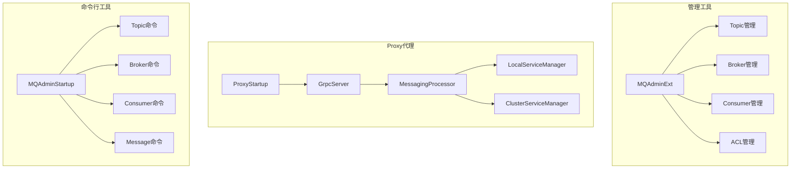
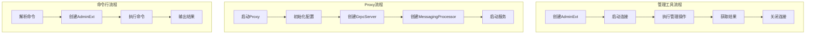

# 10-扩展组件与实战指南

## 1. 模块概述

RocketMQ提供了丰富的扩展组件来支持运维管理、监控告警、协议代理等功能。本章将深入解析RocketMQ的扩展组件，包括管理工具、Proxy代理、命令行工具等，并提供实战指南。

### 1.1 核心组件

- **MQAdminExt**：管理接口扩展，提供丰富的管理功能
- **Proxy**：gRPC代理，支持多协议接入
- **命令行工具**：运维管理命令集合
- **监控服务**：消息监控和告警

### 1.2 架构设计



## 2. MQAdminExt管理接口

### 2.1 接口定义

MQAdminExt是RocketMQ管理接口的核心扩展。

**源码位置**：[MQAdminExt.java](tools/src/main/java/org/apache/rocketmq/tools/admin/MQAdminExt.java)

```java
public interface MQAdminExt extends MQAdmin {
    void start() throws MQClientException;
    void shutdown();

    void addBrokerToContainer(final String brokerContainerAddr, 
        final String brokerConfig) throws InterruptedException,
        MQBrokerException, RemotingTimeoutException, 
        RemotingSendRequestException, RemotingConnectException;

    void removeBrokerFromContainer(final String brokerContainerAddr, 
        String clusterName, final String brokerName, long brokerId);

    void updateBrokerConfig(final String brokerAddr, 
        final Properties properties) throws RemotingConnectException,
        RemotingSendRequestException, RemotingTimeoutException, 
        UnsupportedEncodingException, InterruptedException, 
        MQBrokerException, MQClientException;

    Properties getBrokerConfig(final String brokerAddr);

    void createAndUpdateTopicConfig(final String addr,
        final TopicConfig config) throws RemotingException, 
        MQBrokerException, InterruptedException, MQClientException;

    void createAndUpdatePlainAccessConfig(final String addr,
        final PlainAccessConfig plainAccessConfig);

    void deletePlainAccessConfig(final String addr, final String accessKey);

    void updateGlobalWhiteAddrConfig(final String addr,
        final String globalWhiteAddrs);

    void createAndUpdateSubscriptionGroupConfig(final String addr,
        final SubscriptionGroupConfig config);

    TopicStatsTable examineTopicStats(final String topic);

    TopicList fetchAllTopicList();

    ConsumeStats examineConsumeStats(final String consumerGroup);

    ClusterInfo examineBrokerClusterInfo();

    TopicRouteData examineTopicRouteInfo(final String topic);

    ConsumerConnection examineConsumerConnectionInfo(final String consumerGroup);

    ProducerConnection examineProducerConnectionInfo(final String group,
        final String topic);

    List<MessageTrack> messageTrackDetail(MessageExt msg);

    void startMessageTrace();

    void deleteTopicInNameServer(final String topic, 
        final String clusterName);

    void deleteTopicInBroker(final String addr, final String topic);

    void resetOffsetByTimestamp(String clusterName, String topic, 
        String group, long timestamp, boolean force);

    void resetOffsetNew(String consumerGroup, String topic, long offset);

    MessageExt viewMessage(String topic, String msgId);

    QueryResult queryMessage(String topic, String key, 
        int maxNum, long begin, long end);
}
```

### 2.2 DefaultMQAdminExt实现

```java
public class DefaultMQAdminExt extends ClientConfig implements MQAdminExt {
    private final DefaultMQAdminExtImpl defaultMQAdminExtImpl;
    private String adminExtGroup = "admin_ext_group";
    private String createTopicKey = MixAll.AUTO_CREATE_TOPIC_KEY_TOPIC;
    private long timeoutMillis = 5000;

    public DefaultMQAdminExt() {
        this.defaultMQAdminExtImpl = new DefaultMQAdminExtImpl(this, null, timeoutMillis);
    }

    public DefaultMQAdminExt(long timeoutMillis) {
        this.defaultMQAdminExtImpl = new DefaultMQAdminExtImpl(this, null, timeoutMillis);
    }

    public DefaultMQAdminExt(RPCHook rpcHook) {
        this.defaultMQAdminExtImpl = new DefaultMQAdminExtImpl(this, rpcHook, timeoutMillis);
    }

    public DefaultMQAdminExt(RPCHook rpcHook, long timeoutMillis) {
        this.defaultMQAdminExtImpl = new DefaultMQAdminExtImpl(this, rpcHook, timeoutMillis);
    }

    @Override
    public void start() throws MQClientException {
        defaultMQAdminExtImpl.start();
    }

    @Override
    public void shutdown() {
        defaultMQAdminExtImpl.shutdown();
    }

    @Override
    public void createAndUpdateTopicConfig(String addr, TopicConfig config)
        throws RemotingException, MQBrokerException, InterruptedException, MQClientException {
        defaultMQAdminExtImpl.createAndUpdateTopicConfig(addr, config);
    }

    @Override
    public TopicStatsTable examineTopicStats(String topic)
        throws RemotingException, MQClientException, InterruptedException, MQBrokerException {
        return defaultMQAdminExtImpl.examineTopicStats(topic);
    }

    @Override
    public TopicList fetchAllTopicList() 
        throws RemotingException, MQClientException, InterruptedException {
        return defaultMQAdminExtImpl.fetchAllTopicList();
    }

    @Override
    public ConsumeStats examineConsumeStats(String consumerGroup)
        throws RemotingException, MQClientException, InterruptedException, MQBrokerException {
        return defaultMQAdminExtImpl.examineConsumeStats(consumerGroup);
    }

    @Override
    public ClusterInfo examineBrokerClusterInfo()
        throws InterruptedException, MQBrokerException, RemotingTimeoutException,
        RemotingSendRequestException, RemotingConnectException {
        return defaultMQAdminExtImpl.examineBrokerClusterInfo();
    }
}
```

## 3. Proxy代理

### 3.1 ProxyStartup启动类

**源码位置**：[ProxyStartup.java](proxy/src/main/java/org/apache/rocketmq/proxy/ProxyStartup.java)

```java
public class ProxyStartup {
    private static final InternalLogger log = InternalLoggerFactory.getLogger(
        LoggerName.PROXY_LOGGER_NAME);
    private static final ProxyStartAndShutdown PROXY_START_AND_SHUTDOWN = 
        new ProxyStartAndShutdown();

    private static class ProxyStartAndShutdown extends AbstractStartAndShutdown {
        @Override
        public void appendStartAndShutdown(StartAndShutdown startAndShutdown) {
            super.appendStartAndShutdown(startAndShutdown);
        }
    }

    public static void main(String[] args) {
        try {
            CommandLineArgument commandLineArgument = parseCommandLineArgument(args);
            initLogAndConfiguration(commandLineArgument);

            initThreadPoolMonitor();

            ThreadPoolExecutor executor = createServerExecutor();

            MessagingProcessor messagingProcessor = createMessagingProcessor();

            GrpcServer grpcServer = GrpcServerBuilder.newBuilder(executor, 
                ConfigurationManager.getProxyConfig().getGrpcServerPort())
                .addService(createServiceProcessor(messagingProcessor))
                .addService(ChannelzService.newInstance(100))
                .addService(ProtoReflectionService.newInstance())
                .configInterceptor()
                .build();
            PROXY_START_AND_SHUTDOWN.appendStartAndShutdown(grpcServer);

            PROXY_START_AND_SHUTDOWN.start();

            Runtime.getRuntime().addShutdownHook(new Thread(() -> {
                log.info("try to shutdown server");
                try {
                    PROXY_START_AND_SHUTDOWN.shutdown();
                } catch (Exception e) {
                    log.error("err when shutdown rocketmq-proxy", e);
                }
            }));

            log.info("RocketMQ Proxy started success, version: {}, " +
                "startup time: {} ms", 
                System.getProperty("rocketmq.version", "unknown"),
                System.currentTimeMillis());

            Thread.sleep(Long.MAX_VALUE);
        } catch (Throwable e) {
            log.error("start rocketmq proxy error.", e);
            System.exit(-1);
        }
    }

    private static MessagingProcessor createMessagingProcessor() throws Exception {
        ServiceManager serviceManager = ServiceManagerFactory.create(
            ConfigurationManager.getProxyConfig());
        PROXY_START_AND_SHUTDOWN.appendStartAndShutdown(serviceManager);
        return DefaultMessagingProcessor.create(serviceManager);
    }

    private static GrpcMessagingApplication createServiceProcessor(
        MessagingProcessor messagingProcessor) {
        return GrpcMessagingApplication.create(messagingProcessor);
    }
}
```

### 3.2 Proxy模式

RocketMQ Proxy支持两种运行模式：

#### 3.2.1 Local模式

```yaml
proxyMode: LOCAL
namesrvAddr: localhost:9876
grpcServerPort: 8081
```

Local模式下，Proxy与Broker在同一进程中运行，直接访问本地存储。

#### 3.2.2 Cluster模式

```yaml
proxyMode: CLUSTER
namesrvAddr: localhost:9876
grpcServerPort: 8081
```

Cluster模式下，Proxy独立部署，通过RPC访问Broker集群。

### 3.3 GrpcMessagingApplication

```java
public class GrpcMessagingApplication extends MessagingServiceGrpc.MessagingServiceImplBase {
    private final MessagingProcessor messagingProcessor;

    public static GrpcMessagingApplication create(MessagingProcessor messagingProcessor) {
        return new GrpcMessagingApplication(messagingProcessor);
    }

    @Override
    public void queryRoute(QueryRouteRequest request,
        StreamObserver<QueryRouteResponse> responseObserver) {
        routeActivity.queryRoute(request, responseObserver);
    }

    @Override
    public void sendMessage(SendMessageRequest request,
        StreamObserver<SendMessageResponse> responseObserver) {
        sendMessageActivity.sendMessage(request, responseObserver);
    }

    @Override
    public void receiveMessage(ReceiveMessageRequest request,
        StreamObserver<ReceiveMessageResponse> responseObserver) {
        receiveMessageActivity.receiveMessage(request, responseObserver);
    }

    @Override
    public void ackMessage(AckMessageRequest request,
        StreamObserver<AckMessageResponse> responseObserver) {
        ackMessageActivity.ackMessage(request, responseObserver);
    }

    @Override
    public void changeInvisibleDuration(ChangeInvisibleDurationRequest request,
        StreamObserver<ChangeInvisibleDurationResponse> responseObserver) {
        changeInvisibleDurationActivity.changeInvisibleDuration(request, responseObserver);
    }
}
```

## 4. 命令行工具

### 4.1 MQAdminStartup

**源码位置**：[MQAdminStartup.java](tools/src/main/java/org/apache/rocketmq/tools/command/MQAdminStartup.java)

```java
public class MQAdminStartup {
    private static List<SubCommand> subCommandList = new ArrayList<>();

    public static void main(String[] args) {
        main0(args, null);
    }

    public static void main0(String[] args, RPCHook rpcHook) {
        System.setProperty(RemotingCommand.REMOTING_VERSION_KEY, 
            Integer.toString(MQVersion.CURRENT_VERSION));

        initCommand();

        try {
            switch (args.length) {
                case 0:
                    printHelp();
                    break;
                case 2:
                    if (args[0].equals("help")) {
                        SubCommand cmd = findSubCommand(args[1]);
                        if (cmd != null) {
                            Options options = ServerUtil.buildCommandlineOptions(
                                new Options());
                            options = cmd.buildCommandlineOptions(options);
                            ServerUtil.printCommandLineHelp(
                                "mqadmin " + cmd.commandName(), options);
                        } else {
                            System.out.printf(
                                "The sub command %s not exist.%n", args[1]);
                        }
                        break;
                    }
                case 1:
                default:
                    SubCommand cmd = findSubCommand(args[0]);
                    if (cmd != null) {
                        String[] subargs = parseSubArgs(args);

                        Options options = ServerUtil.buildCommandlineOptions(
                            new Options());
                        final CommandLine commandLine = 
                            ServerUtil.parseCmdLine("mqadmin " + cmd.commandName(),
                                subargs, cmd.buildCommandlineOptions(options),
                                new DefaultParser());
                        if (null == commandLine) {
                            return;
                        }

                        if (commandLine.hasOption('n')) {
                            String namesrvAddr = commandLine.getOptionValue('n');
                            System.setProperty(MixAll.NAMESRV_ADDR_PROPERTY, namesrvAddr);
                        }

                        cmd.execute(commandLine, options, rpcHook);
                    } else {
                        printHelp();
                    }
            }
        } catch (Exception e) {
            e.printStackTrace();
        }
    }

    private static void initCommand() {
        initCommand(new UpdateTopicSubCommand());
        initCommand(new DeleteTopicSubCommand());
        initCommand(new UpdateSubGroupSubCommand());
        initCommand(new DeleteSubscriptionGroupCommand());
        initCommand(new UpdateBrokerConfigSubCommand());
        initCommand(new UpdateTopicPermSubCommand());

        initCommand(new TopicStatusSubCommand());
        initCommand(new TopicRouteSubCommand());
        initCommand(new TopicListSubCommand());
        initCommand(new TopicClusterSubCommand());

        initCommand(new BrokerStatusSubCommand());
        initCommand(new QueryMsgByIdSubCommand());
        initCommand(new QueryMsgByKeySubCommand());
        initCommand(new QueryMsgByUniqueKeySubCommand());
        initCommand(new QueryMsgByOffsetSubCommand());

        initCommand(new PrintMessageSubCommand());
        initCommand(new SendMessageCommand());
        initCommand(new ConsumeMessageCommand());

        initCommand(new ConsumerProgressSubCommand());
        initCommand(new ConsumerStatusSubCommand());
        initCommand(new ConsumerConnectionSubCommand());
        initCommand(new ProducerConnectionSubCommand());

        initCommand(new ClusterListSubCommand());
        initCommand(new ResetOffsetByTimeCommand());

        initCommand(new UpdateAccessConfigSubCommand());
        initCommand(new DeleteAccessConfigSubCommand());
        initCommand(new GetAccessConfigSubCommand());
        initCommand(new UpdateGlobalWhiteAddrSubCommand());
    }
}
```

### 4.2 常用命令列表

| 命令 | 说明 | 示例 |
|------|------|------|
| updateTopic | 创建/更新Topic | mqadmin updateTopic -n localhost:9876 -t TestTopic -c DefaultCluster |
| deleteTopic | 删除Topic | mqadmin deleteTopic -n localhost:9876 -t TestTopic -c DefaultCluster |
| topicList | 查看Topic列表 | mqadmin topicList -n localhost:9876 |
| topicRoute | 查看Topic路由 | mqadmin topicRoute -n localhost:9876 -t TestTopic |
| topicStatus | 查看Topic状态 | mqadmin topicStatus -n localhost:9876 -t TestTopic |
| brokerStatus | 查看Broker状态 | mqadmin brokerStatus -n localhost:9876 -b localhost:10911 |
| clusterList | 查看集群信息 | mqadmin clusterList -n localhost:9876 |
| consumerProgress | 查看消费进度 | mqadmin consumerProgress -n localhost:9876 -g TestGroup |
| resetOffsetByTime | 重置消费位点 | mqadmin resetOffsetByTime -n localhost:9876 -t TestTopic -g TestGroup -s now |
| queryMsgById | 按ID查询消息 | mqadmin queryMsgById -n localhost:9876 -i msgId |
| sendMessage | 发送消息 | mqadmin sendMessage -n localhost:9876 -t TestTopic -p "hello" |
| consumeMessage | 消费消息 | mqadmin consumeMessage -n localhost:9876 -t TestTopic -g TestGroup |

### 4.3 SubCommand接口

```java
public interface SubCommand {
    String commandName();

    String commandDesc();

    Options buildCommandlineOptions(Options options);

    void execute(CommandLine commandLine, Options options, 
        RPCHook rpcHook) throws SubCommandException;
}
```

## 5. 监控服务

### 5.1 MonitorService监控服务

**源码位置**：[MonitorService.java](tools/src/main/java/org/apache/rocketmq/tools/monitor/MonitorService.java)

```java
public class MonitorService extends ServiceThread {
    private static final InternalLogger log = InternalLoggerFactory.getLogger(
        LoggerName.TOOLS_LOGGER_NAME);

    private final MonitorConfig monitorConfig;
    private final MonitorListener monitorListener;
    private final DefaultMQAdminExt defaultMQAdminExt;

    public MonitorService(MonitorConfig monitorConfig, 
        MonitorListener monitorListener) {
        this.monitorConfig = monitorConfig;
        this.monitorListener = monitorListener;
        this.defaultMQAdminExt = new DefaultMQAdminExt(
            monitorConfig.getAdminGroup());
    }

    @Override
    public String getServiceName() {
        return MonitorService.class.getSimpleName();
    }

    @Override
    public void run() {
        log.info(this.getServiceName() + " service started");

        while (!this.isStopped()) {
            try {
                this.waitForRunning(monitorConfig.getPollingInterval());

                this.doMonitorWork();
            } catch (Exception e) {
                log.warn(this.getServiceName() + " service has exception. ", e);
            }
        }

        log.info(this.getServiceName() + " service end");
    }

    private void doMonitorWork() throws RemotingException, 
        MQClientException, InterruptedException {
        long beginTime = System.currentTimeMillis();

        ClusterInfo clusterInfo = defaultMQAdminExt.examineBrokerClusterInfo();

        for (String topic : defaultMQAdminExt.fetchAllTopicList().getTopicList()) {
            if (topic.startsWith(MixAll.SYSTEM_TOPIC_PREFIX)) {
                continue;
            }

            TopicStatsTable topicStatsTable = 
                defaultMQAdminExt.examineTopicStats(topic);

            GroupList groupList = defaultMQAdminExt.queryTopicConsumeByWho(topic);

            if (groupList != null && groupList.getGroupList() != null) {
                for (String group : groupList.getGroupList()) {
                    ConsumeStats consumeStats = 
                        defaultMQAdminExt.examineConsumeStats(group, topic);

                    UndoneMsgs undoneMsgs = new UndoneMsgs();
                    undoneMsgs.setGroup(group);
                    undoneMsgs.setTopic(topic);
                    undoneMsgs.setTotalDiff(
                        consumeStats.computeTotalDiff());

                    if (consumeStats.computeTotalDiff() > 
                        this.monitorConfig.getMaxDiffTotal()) {
                        this.monitorListener.undoneMsgs(undoneMsgs);
                    }
                }
            }
        }

        log.info("Monitor work done, cost: {} ms", 
            System.currentTimeMillis() - beginTime);
    }
}
```

### 5.2 MonitorListener监听器

```java
public interface MonitorListener {
    void beginRound();

    void endRound();

    void undoneMsgs(UndoneMsgs undoneMsgs);

    void failedMsgs(FailedMsgs failedMsgs);

    void deleteMsgsEvent(DeleteMsgsEvent deleteMsgsEvent);
}
```

## 6. 业务场景示例

### 6.1 管理工具使用示例

```java
public class AdminToolExample {
    public static void main(String[] args) throws Exception {
        DefaultMQAdminExt admin = new DefaultMQAdminExt();
        admin.setNamesrvAddr("localhost:9876");
        admin.start();

        TopicConfig topicConfig = new TopicConfig();
        topicConfig.setTopicName("TestTopic");
        topicConfig.setReadQueueNums(8);
        topicConfig.setWriteQueueNums(8);
        topicConfig.setPerm(PermName.PERM_READ | PermName.PERM_WRITE);

        ClusterInfo clusterInfo = admin.examineBrokerClusterInfo();
        for (String brokerAddr : clusterInfo.getBrokerAddrTable().keySet()) {
            admin.createAndUpdateTopicConfig(brokerAddr, topicConfig);
            System.out.println("Topic created on broker: " + brokerAddr);
        }

        TopicStatsTable stats = admin.examineTopicStats("TestTopic");
        System.out.println("Topic stats: " + stats);

        TopicList topicList = admin.fetchAllTopicList();
        System.out.println("All topics: " + topicList.getTopicList());

        admin.shutdown();
    }
}
```

### 6.2 消费进度监控示例

```java
public class ConsumerMonitorExample {
    public static void main(String[] args) throws Exception {
        DefaultMQAdminExt admin = new DefaultMQAdminExt();
        admin.setNamesrvAddr("localhost:9876");
        admin.start();

        String group = "TestConsumerGroup";
        ConsumeStats stats = admin.examineConsumeStats(group);

        Map<MessageQueue, OffsetWrapper> offsetTable = stats.getOffsetTable();
        for (Map.Entry<MessageQueue, OffsetWrapper> entry : offsetTable.entrySet()) {
            MessageQueue mq = entry.getKey();
            OffsetWrapper offset = entry.getValue();

            long diff = offset.getBrokerOffset() - offset.getConsumerOffset();
            System.out.printf("Queue: %s, BrokerOffset: %d, ConsumerOffset: %d, Diff: %d%n",
                mq, offset.getBrokerOffset(), offset.getConsumerOffset(), diff);

            if (diff > 10000) {
                System.out.println("Warning: Consumer lag detected!");
            }
        }

        admin.shutdown();
    }
}
```

### 6.3 消息轨迹查询示例

```java
public class MessageTraceExample {
    public static void main(String[] args) throws Exception {
        DefaultMQAdminExt admin = new DefaultMQAdminExt();
        admin.setNamesrvAddr("localhost:9876");
        admin.start();

        String topic = "TestTopic";
        String msgId = "AC14000A00002A9F0000000000000000";

        MessageExt msg = admin.viewMessage(topic, msgId);
        System.out.println("Message: " + new String(msg.getBody()));

        List<MessageTrack> tracks = admin.messageTrackDetail(msg);
        for (MessageTrack track : tracks) {
            System.out.println("Track: " + track.getConsumerGroup() + 
                ", TrackType: " + track.getTrackType() +
                ", ExceptionDesc: " + track.getExceptionDesc());
        }

        admin.shutdown();
    }
}
```

### 6.4 Proxy部署示例

```yaml
proxyConfig:
  proxyMode: CLUSTER
  namesrvAddr: localhost:9876
  grpcServerPort: 8081
  remotingListenPort: 8080
  
  threadPoolConfig:
    corePoolSize: 8
    maxPoolSize: 32
    queueCapacity: 10000
    
  metricConfig:
    enableMetric: true
    metricPort: 9090
```

## 7. 最佳实践

### 7.1 Topic管理最佳实践

1. **命名规范**：使用有意义的Topic名称，如`Order_Payment_Success`
2. **队列数量**：根据并发需求设置合理的队列数量
3. **权限控制**：生产环境建议禁用自动创建Topic

```java
TopicConfig topicConfig = new TopicConfig();
topicConfig.setTopicName("Order_Payment_Success");
topicConfig.setReadQueueNums(16);
topicConfig.setWriteQueueNums(16);
topicConfig.setPerm(PermName.PERM_READ | PermName.PERM_WRITE);
```

### 7.2 消费者管理最佳实践

1. **消费进度监控**：定期检查消费进度，及时发现积压
2. **消费重试**：合理设置重试次数和间隔
3. **死信队列**：处理无法正常消费的消息

```java
SubscriptionGroupConfig subConfig = new SubscriptionGroupConfig();
subConfig.setGroupName("OrderConsumerGroup");
subConfig.setRetryMaxTimes(16);
subConfig.setRetryQueueNums(1);
subConfig.setEnableRetryWhenConsumeFailed(true);
```

### 7.3 运维监控最佳实践

1. **监控指标**：监控TPS、延迟、积压量等关键指标
2. **告警策略**：设置合理的告警阈值
3. **日志管理**：定期清理和归档日志

```java
MonitorConfig config = new MonitorConfig();
config.setMaxDiffTotal(100000);
config.setPollingInterval(30000);

MonitorService monitorService = new MonitorService(config, 
    new DefaultMonitorListener());
monitorService.start();
```

### 7.4 Proxy部署最佳实践

1. **负载均衡**：部署多个Proxy实例，使用负载均衡
2. **资源隔离**：Proxy与Broker分开部署
3. **监控告警**：监控Proxy的连接数、吞吐量等指标

## 8. 总结

### 8.1 核心流程



### 8.2 设计亮点

1. **统一管理接口**：MQAdminExt提供统一的管理接口
2. **多协议支持**：Proxy支持gRPC等多种协议
3. **丰富的命令行工具**：覆盖Topic、Broker、Consumer等管理场景
4. **可扩展的监控服务**：支持自定义监听器

### 8.3 最佳实践总结

1. 使用管理工具进行自动化运维
2. 合理配置Topic和Consumer参数
3. 建立完善的监控告警体系
4. 定期进行容量规划和性能优化
5. 做好故障预案和应急演练
