# RocketMQ 操作系统核心知识

本文档从 RocketMQ 源码中提取操作系统核心知识，以操作系统原理为主，项目代码为辅，涵盖进程线程管理、内存管理、文件系统、I/O系统、网络系统、并发同步六大领域。

---

## 1. 进程与线程管理

### 1.1 线程生命周期管理

#### 1.1.1 线程状态与转换

**线程是CPU调度的基本单位**，Linux中线程通过`clone()`系统调用创建，本质是共享资源的轻量级进程(LWP，Light Weight Process)。每个线程对应内核中的`task_struct`结构体。

**task_struct关键字段**：

| 字段 | 示例值 | 说明 |
|------|--------|------|
| `state` | `TASK_RUNNING (0)` | 线程状态 |
| `pid` | `12345` | 进程/线程的唯一标识符 |
| `tgid` | `12345` | 线程组ID，等于主线程pid |
| `mm` | `0xffff...` | 内存描述符指针 |
| `files` | `0xffff...` | 打开文件表指针 |

**Linux内核线程状态**：

| 状态 | 值 | 说明 | 触发条件 |
|------|-----|------|---------|
| `TASK_RUNNING` | 0 | 运行态，正在运行或等待CPU调度 | 获得CPU时间片 |
| `TASK_INTERRUPTIBLE` | 1 | 可中断睡眠，等待事件，可被信号唤醒 | 等待I/O、锁、信号量 |
| `TASK_UNINTERRUPTIBLE` | 2 | 不可中断睡眠，只能被事件唤醒 | 等待磁盘I/O完成 |
| `TASK_ZOMBIE` | 4 | 僵尸态，进程已终止但父进程未回收 | 进程exit()后 |
| `TASK_STOPPED` | 8 | 停止态，被信号暂停 | SIGSTOP、SIGTSTP信号 |
| `TASK_TRACED` | 16 | 跟踪态，被调试器跟踪 | ptrace()系统调用 |

**两种核心睡眠状态对比**：

| 对比维度 | TASK_INTERRUPTIBLE | TASK_UNINTERRUPTIBLE |
|---------|-------------------|---------------------|
| 状态值 | 1 | 2 |
| 唤醒方式 | 事件发生或收到信号 | 仅事件发生 |
| 信号响应 | ✅ 响应所有信号 | ❌ 不响应任何信号 |
| top显示 | S (Sleeping) | D (Disk Sleep) |
| 典型场景 | 网络I/O、锁等待、定时等待 | 磁盘I/O、内存换页 |

**状态转换关系**：

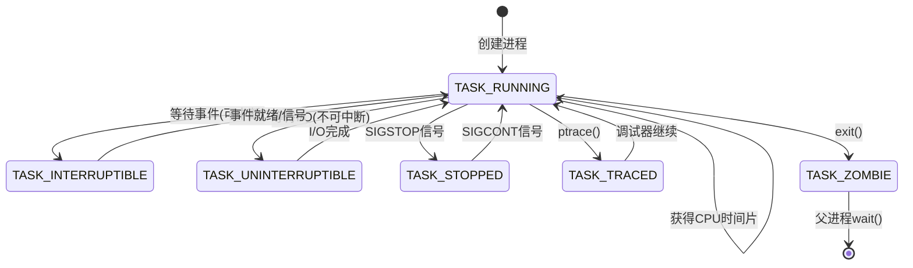
```mermaid
stateDiagram-v2
    [*] --> TASK_RUNNING: 创建进程
    TASK_RUNNING --> TASK_RUNNING: 获得CPU时间片
    TASK_RUNNING --> TASK_INTERRUPTIBLE: 等待事件(可中断)
    TASK_RUNNING --> TASK_UNINTERRUPTIBLE: 等待I/O(不可中断)
    TASK_RUNNING --> TASK_STOPPED: SIGSTOP信号
    TASK_RUNNING --> TASK_TRACED: ptrace()
    TASK_INTERRUPTIBLE --> TASK_RUNNING: 事件就绪/信号
    TASK_UNINTERRUPTIBLE --> TASK_RUNNING: I/O完成
    TASK_STOPPED --> TASK_RUNNING: SIGCONT信号
    TASK_TRACED --> TASK_RUNNING: 调试器继续
    TASK_RUNNING --> TASK_ZOMBIE: exit()
    TASK_ZOMBIE --> [*]: 父进程wait()
```

**Linux线程状态转换流程说明**：

Linux线程在生命周期中会经历多种状态转换，核心是TASK_RUNNING状态的流转。

| 步骤 | 状态转换 | 触发条件 | 说明 |
|------|----------|----------|------|
| 1 | `[*] → TASK_RUNNING` | 创建进程 | 通过fork()或clone()创建新线程 |
| 2 | `TASK_RUNNING → TASK_RUNNING` | 获得CPU时间片 | 调度器分配CPU，线程执行 |
| 3 | `TASK_RUNNING → TASK_INTERRUPTIBLE` | 等待事件 | 等待I/O、锁、信号量，可被信号中断 |
| 4 | `TASK_RUNNING → TASK_UNINTERRUPTIBLE` | 等待磁盘I/O | 等待磁盘操作完成，不可被信号中断 |
| 5 | `TASK_RUNNING → TASK_STOPPED` | SIGSTOP信号 | 进程被暂停，如Ctrl+Z |
| 6 | `TASK_RUNNING → TASK_TRACED` | ptrace() | 被调试器跟踪 |
| 7 | `TASK_RUNNING → TASK_ZOMBIE` | exit() | 线程执行完毕，等待父进程回收 |
| 8 | `TASK_ZOMBIE → [*]` | 父进程wait() | 父进程回收子进程资源 |

**关键概念**：

- **TASK_RUNNING**：唯一可被CPU执行的状态，包含"正在运行"和"就绪等待调度"两种情况
- **TASK_INTERRUPTIBLE vs TASK_UNINTERRUPTIBLE**：前者可被信号唤醒（如网络I/O），后者只能等待事件完成（如磁盘I/O），避免关键操作被中断
- **TASK_ZOMBIE**：线程已终止但资源未回收，父进程需调用wait()避免僵尸进程累积

**Java线程状态与Linux状态映射**：

| Java状态 | Linux状态 | 说明 |
|---------|----------|------|
| RUNNABLE | TASK_RUNNING | 可运行状态 |
| BLOCKED | TASK_INTERRUPTIBLE | 等待monitor锁 |
| WAITING | TASK_INTERRUPTIBLE | 无限等待 |
| TIMED_WAITING | TASK_INTERRUPTIBLE | 计时等待 |
| TERMINATED | TASK_ZOMBIE | 终止状态 |

**Java线程状态转换**：

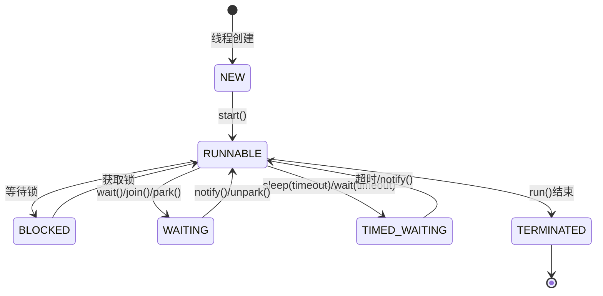
```mermaid
stateDiagram-v2
    [*] --> NEW: 线程创建
    NEW --> RUNNABLE: start()
    RUNNABLE --> BLOCKED: 等待锁
    RUNNABLE --> WAITING: wait()/join()/park()
    RUNNABLE --> TIMED_WAITING: sleep(timeout)/wait(timeout)
    BLOCKED --> RUNNABLE: 获取锁
    WAITING --> RUNNABLE: notify()/unpark()
    TIMED_WAITING --> RUNNABLE: 超时/notify()
    RUNNABLE --> TERMINATED: run()结束
    TERMINATED --> [*]
```

**Java线程状态转换流程说明**：

Java线程有6种状态，RUNNABLE是核心执行状态，其他状态都是等待状态。

| 步骤 | 状态转换 | 触发方法 | 说明 |
|------|----------|----------|------|
| 1 | `[*] → NEW` | new Thread() | 线程对象创建，但未启动 |
| 2 | `NEW → RUNNABLE` | start() | 调用start()后线程进入可运行状态 |
| 3 | `RUNNABLE → BLOCKED` | synchronized | 等待获取monitor锁 |
| 4 | `RUNNABLE → WAITING` | wait()/join()/park() | 无限期等待，需其他线程唤醒 |
| 5 | `RUNNABLE → TIMED_WAITING` | sleep()/wait(timeout) | 计时等待，超时自动唤醒 |
| 6 | `BLOCKED → RUNNABLE` | 获取锁 | 成功获取monitor锁 |
| 7 | `WAITING → RUNNABLE` | notify()/unpark() | 被其他线程唤醒 |
| 8 | `TIMED_WAITING → RUNNABLE` | 超时/notify() | 超时或被唤醒 |
| 9 | `RUNNABLE → TERMINATED` | run()结束 | 线程执行完毕 |
| 10 | `TERMINATED → [*]` | GC回收 | 线程对象被垃圾回收 |

**关键概念**：

- **RUNNABLE**：Java中唯一"活跃"状态，对应Linux的TASK_RUNNING，包含"正在执行"和"等待CPU调度"
- **BLOCKED vs WAITING**：BLOCKED是等待synchronized锁，WAITING是主动等待（如Object.wait()）
- **WAITING vs TIMED_WAITING**：前者无限等待需显式唤醒，后者有超时机制

**关键系统调用**：

| 系统调用 | 功能 | 说明 |
|---------|------|------|
| `clone()` | 创建线程 | 通过flags控制资源共享 |
| `futex()` | 线程等待/唤醒 | Fast Userspace Mutex，无竞争时用户态完成 |
| `sched_yield()` | 让出CPU | 当前线程主动让出CPU |

#### 1.1.2 RocketMQ服务线程实现

RocketMQ所有后台服务线程继承自 [ServiceThread.java](../common/src/main/java/org/apache/rocketmq/common/ServiceThread.java)：

```java
public abstract class ServiceThread implements Runnable {
    private static final long JOIN_TIME = 90 * 1000;  // 等待线程结束超时，默认值：90s
    protected Thread thread;
    protected volatile boolean stopped = false;
    private final AtomicBoolean started = new AtomicBoolean(false);

    public void start() {
        if (!started.compareAndSet(false, true)) {
            return;  // CAS保证单次启动
        }
        stopped = false;
        this.thread = new Thread(this, getServiceName());
        this.thread.setDaemon(isDaemon);
        this.thread.start();
    }

    public void shutdown(final boolean interrupt) {
        if (!started.compareAndSet(true, false)) {
            return;
        }
        this.stopped = true;
        if (!this.thread.isDaemon()) {
            this.thread.join(this.getJoinTime());
        }
    }
}
```

**设计要点**：

| 要点 | 操作系统原理 | RocketMQ实现 |
|------|-------------|-------------|
| 单次启动 | 线程只能启动一次 | CAS保证`started`只从false变true一次 |
| 优雅关闭 | 等待线程执行完毕 | `join()`等待线程结束，默认90s超时 |
| 守护线程 | JVM退出时不等待守护线程 | `setDaemon()`控制是否为守护线程 |

### 1.2 线程等待与唤醒

#### 1.2.1 操作系统原理

**futex(Fast Userspace Mutex，快速用户空间互斥锁)** 是Linux实现高效同步的核心机制：

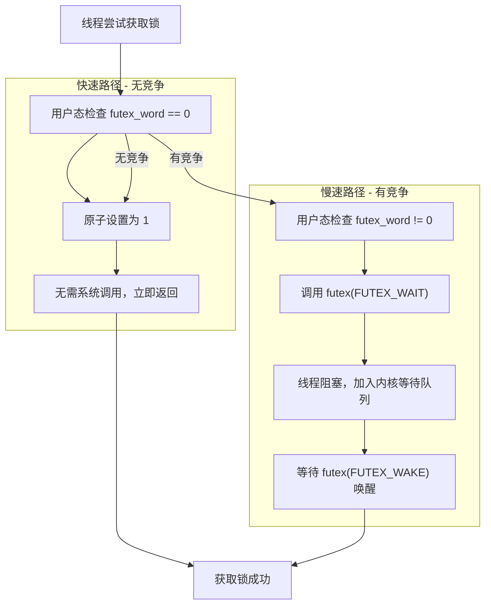
```mermaid
flowchart TD
    subgraph FastPath["快速路径 - 无竞争"]
        A1["用户态检查 futex_word == 0"]
        A2["原子设置为 1"]
        A3["无需系统调用，立即返回"]
        A1 --> A2 --> A3
    end

    subgraph SlowPath["慢速路径 - 有竞争"]
        B1["用户态检查 futex_word != 0"]
        B2["调用 futex(FUTEX_WAIT)"]
        B3["线程阻塞，加入内核等待队列"]
        B4["等待 futex(FUTEX_WAKE) 唤醒"]
        B1 --> B2 --> B3 --> B4
    end

    Start["线程尝试获取锁"] --> A1
    A1 -->|"无竞争"| A2
    A1 -->|"有竞争"| B1
    A3 --> End["获取锁成功"]
    B4 --> End
```

**futex工作原理说明**：

futex通过用户态快速路径和内核态慢速路径的组合，实现高效的线程同步。

| 路径 | 步骤 | 操作 | 类型 | 说明 |
|------|------|------|------|------|
| 快速路径 | 1 | 检查futex_word == 0 | 用户态 | 无竞争时直接在用户态完成 |
| 快速路径 | 2 | 原子设置为1 | 用户态 | CAS原子操作，无需系统调用 |
| 快速路径 | 3 | 立即返回 | 用户态 | 避免内核切换开销 |
| 慢速路径 | 1 | 检查futex_word != 0 | 用户态 | 发现锁被占用 |
| 慢速路径 | 2 | futex(FUTEX_WAIT) | 内核态 | 系统调用，线程阻塞 |
| 慢速路径 | 3 | 加入等待队列 | 内核态 | 线程进入TASK_INTERRUPTIBLE状态 |
| 慢速路径 | 4 | futex(FUTEX_WAKE) | 内核态 | 释放锁时唤醒等待线程 |

**关键概念**：

- **快速路径**：无竞争时完全在用户态完成，避免系统调用开销（约几十纳秒）
- **慢速路径**：有竞争时进入内核态，线程阻塞等待唤醒（约几微秒）
- **FUTEX_WAIT**：让当前线程在futex_word上等待，进入睡眠状态
- **FUTEX_WAKE**：唤醒等待在futex_word上的线程

**避免虚假唤醒**：条件变量的`wait()`可能在条件未满足时被唤醒，必须在循环中检查条件。

#### 1.2.2 RocketMQ实现

RocketMQ使用 [CountDownLatch2.java](../common/src/main/java/org/apache/rocketmq/common/CountDownLatch2.java) 实现可重置的等待/唤醒机制：

```java
public class CountDownLatch2 {
    private final Sync sync;
    
    public void await(long timeout, TimeUnit unit) {
        sync.tryAcquireSharedNanos(1, unit.toNanos(timeout));
    }
    
    public void countDown() { 
        sync.releaseShared(1); 
    }
    
    public void reset() { 
        sync.reset();  // 支持重置，可重复使用
    }
}
```

ServiceThread中的等待/唤醒实现：

```java
public abstract class ServiceThread implements Runnable {
    protected final CountDownLatch2 waitPoint = new CountDownLatch2(1);
    protected volatile AtomicBoolean hasNotified = new AtomicBoolean(false);

    public void wakeup() {
        if (hasNotified.compareAndSet(false, true)) {
            waitPoint.countDown();
        }
    }

    protected void waitForRunning(long interval) {
        if (hasNotified.compareAndSet(true, false)) {
            this.onWaitEnd();
            return;
        }
        waitPoint.reset();
        waitPoint.await(interval, TimeUnit.MILLISECONDS);
        hasNotified.set(false);
        this.onWaitEnd();
    }
}
```

**关键设计**：

| 问题 | 操作系统原理 | RocketMQ解决方案 |
|------|-------------|-----------------|
| 虚假唤醒 | wait可能无故返回 | 循环检查`hasNotified`标志 |
| 信号丢失 | wakeup在wait之前调用 | `hasNotified`标志位记录唤醒信号 |
| 可重用性 | CountDownLatch只能用一次 | `reset()`方法重置计数器 |

### 1.3 线程池模型

#### 1.3.1 操作系统原理

**线程池的核心是任务队列和线程复用**，减少线程创建/销毁的开销：

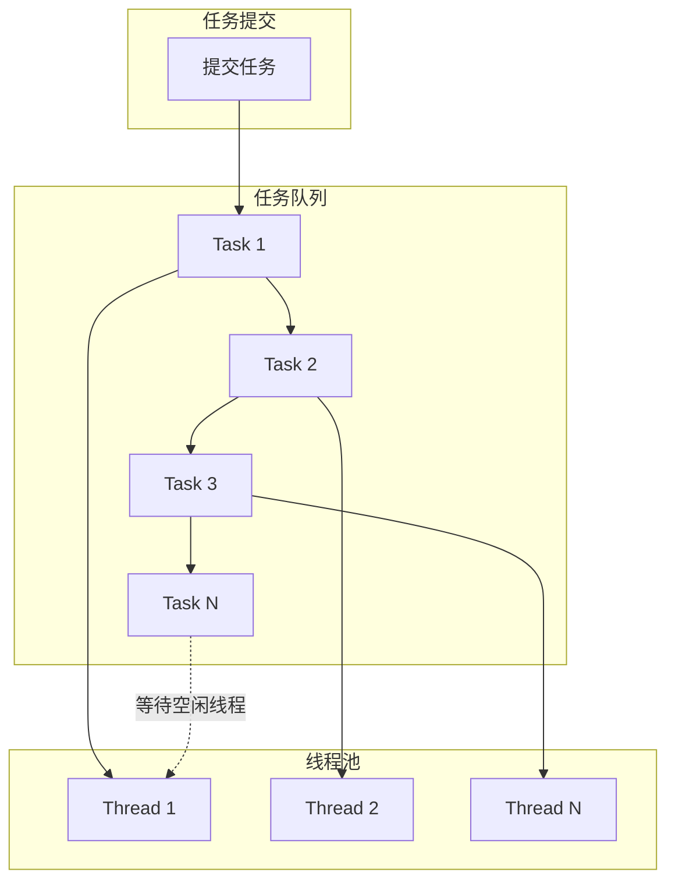
```mermaid
flowchart TD
    subgraph TaskSubmit["任务提交"]
        T1["提交任务"]
    end

    subgraph TaskQueue["任务队列"]
        Q1["Task 1"]
        Q2["Task 2"]
        Q3["Task 3"]
        Q4["Task N"]
    end

    subgraph ThreadPool["线程池"]
        W1["Thread 1"]
        W2["Thread 2"]
        W3["Thread N"]
    end

    T1 --> Q1
    Q1 --> Q2 --> Q3 --> Q4
    Q1 --> W1
    Q2 --> W2
    Q3 --> W3
    Q4 -.->|"等待空闲线程"| W1
```

**线程池工作原理说明**：

线程池通过任务队列解耦任务提交与执行，实现线程复用和资源控制。

| 步骤 | 操作 | 类型 | 说明 |
|------|------|------|------|
| 1 | 提交任务 | 入队 | 任务通过execute()或submit()提交 |
| 2 | 入队等待 | 排队 | 任务进入工作队列，等待空闲线程 |
| 3 | 获取线程 | 分配 | 空闲线程从队列取出任务执行 |
| 4 | 执行任务 | 执行 | 线程执行任务的run()方法 |
| 5 | 线程复用 | 循环 | 执行完毕后线程返回池中等待下一个任务 |

**关键概念**：

- **任务队列**：缓冲区，解耦任务提交与执行速度差异
- **线程复用**：避免频繁创建/销毁线程的开销（每次约几毫秒）
- **背压控制**：有界队列可防止任务积压导致内存溢出

**关键参数**：

| 参数 | 说明 | 默认值 | 内核影响 |
|------|------|--------|---------|
| `corePoolSize` | 核心线程数 | 依赖具体配置 | 常驻线程，不回收 |
| `maximumPoolSize` | 最大线程数 | 依赖具体配置 | 任务积压时临时创建 |
| `keepAliveTime` | 空闲线程存活时间 | 60s | 临时线程超时回收 |
| `workQueue` | 任务队列 | LinkedBlockingQueue | 有界/无界，影响背压 |

#### 1.3.2 RocketMQ实现

[ThreadPoolMonitor.java](../common/src/main/java/org/apache/rocketmq/common/thread/ThreadPoolMonitor.java) 提供线程池监控：

```java
public class ThreadPoolMonitor {
    public static ThreadPoolExecutor createAndMonitor(
        int corePoolSize, int maximumPoolSize, 
        long keepAliveTime, TimeUnit unit,
        String name, int queueCapacity) {
        
        ThreadPoolExecutor executor = new ThreadPoolExecutor(
            corePoolSize, maximumPoolSize, keepAliveTime, unit,
            new LinkedBlockingQueue<>(queueCapacity),
            new ThreadFactoryBuilder().setNameFormat(name + "-%d").build(),
            new ThreadPoolExecutor.DiscardOldestPolicy());

        MONITOR_EXECUTOR.add(ThreadPoolWrapper.builder()
            .name(name)
            .threadPoolExecutor(executor)
            .statusPrinters(Lists.newArrayList(
                new ThreadPoolQueueSizeMonitor(queueCapacity)))
            .build());
        return executor;
    }
}
```

**监控能力**：

| 监控项 | 说明 | 作用 |
|--------|------|------|
| 队列大小 | 监控任务积压 | 发现性能瓶颈 |
| 自动jstack | 队列积压时打印线程堆栈 | 排查阻塞原因 |
| 定时输出 | 每3s输出状态 | 持续监控 |

### 1.4 守护线程与服务线程

#### 1.4.1 操作系统原理

**守护线程(Daemon Thread)** 是为其他线程提供服务的后台线程，JVM(Java Virtual Machine，Java虚拟机)退出时不等待守护线程完成：

| 线程类型 | JVM退出行为 | 典型用途 |
|---------|------------|---------|
| 用户线程 | 等待所有用户线程结束 | 业务逻辑执行 |
| 守护线程 | 不等待，直接退出 | GC(Garbage Collection，垃圾回收)、监控、心跳 |

**线程命名**：有意义的线程命名便于问题排查，可通过`jstack`或`top -H`查看。

#### 1.4.2 RocketMQ实现

[FlowMonitor.java](../store/src/main/java/org/apache/rocketmq/store/ha/FlowMonitor.java) 是典型的服务线程：

```java
public class FlowMonitor extends ServiceThread {
    private final AtomicLong transferredByte = new AtomicLong(0L);
    
    @Override
    public void run() {
        while (!this.isStopped()) {
            this.waitForRunning(TimeUnit.SECONDS.toMillis(1));  // 等待1s
        }
    }
    
    @Override
    protected void onWaitEnd() {
        transferredByteInSecond = transferredByte.getAndSet(0);
    }
}
```

**线程命名规范**：

```java
// 服务线程命名
public abstract String getServiceName();  // 子类实现

// 线程池命名
new ThreadFactoryBuilder().setNameFormat(name + "-%d").build()

// Netty线程命名
new Thread(r, String.format("NettyServerEPOLLSelector_%d_%d", total, index));
```

### 1.5 Reactor线程模型

#### 1.5.1 操作系统原理

**Reactor模式**基于I/O多路复用，用少量线程处理大量连接：

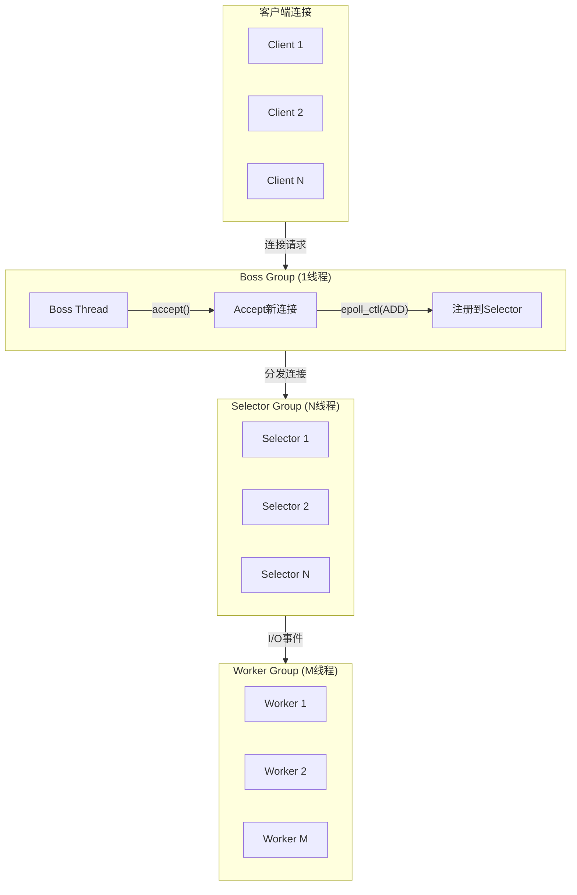
```mermaid
flowchart TD
    subgraph Clients["客户端连接"]
        C1[Client 1]
        C2[Client 2]
        C3[Client N]
    end

    subgraph BossGroup["Boss Group (1线程)"]
        B1[Boss Thread]
        B1 --> |"accept()"| B2["Accept新连接"]
        B2 --> |"epoll_ctl(ADD)"| B3["注册到Selector"]
    end

    subgraph SelectorGroup["Selector Group (N线程)"]
        S1[Selector 1]
        S2[Selector 2]
        S3[Selector N]
    end

    subgraph WorkerGroup["Worker Group (M线程)"]
        W1[Worker 1]
        W2[Worker 2]
        W3[Worker M]
    end

    Clients --> |"连接请求"| BossGroup
    BossGroup --> |"分发连接"| SelectorGroup
    SelectorGroup --> |"I/O事件"| WorkerGroup
```

**Reactor线程模型流程说明**：

Reactor模式将I/O事件驱动与业务处理分离，通过三级线程组实现高并发处理。

| 步骤 | 线程组 | 操作 | 类型 | 说明 |
|------|--------|------|------|------|
| 1 | Boss Group | accept() | I/O | 接受客户端连接请求 |
| 2 | Boss Group | epoll_ctl(ADD) | I/O | 将新连接注册到Selector |
| 3 | Selector Group | epoll_wait() | I/O | 等待I/O事件就绪 |
| 4 | Selector Group | read()/write() | I/O | 读写网络数据 |
| 5 | Selector Group | 提交任务 | 分发 | 将业务逻辑提交到Worker |
| 6 | Worker Group | 业务处理 | 计算 | 执行业务逻辑，无I/O阻塞 |

**关键概念**：

- **Boss Group**：单线程负责Accept连接，避免多线程竞争
- **Selector Group**：N线程处理I/O读写，基于epoll多路复用
- **Worker Group**：M线程执行业务逻辑，与I/O线程分离避免阻塞
- **I/O多路复用**：一个线程同时监控多个连接，减少线程数量

#### 1.5.2 RocketMQ实现

[NettyRemotingServer.java](../remoting/src/main/java/org/apache/rocketmq/remoting/netty/NettyRemotingServer.java) 实现Reactor模型：

```java
public class NettyRemotingServer {
    private final EventLoopGroup eventLoopGroupBoss;      // 1线程
    private final EventLoopGroup eventLoopGroupSelector;  // N线程
    private DefaultEventExecutorGroup defaultEventExecutorGroup;  // M线程

    private EventLoopGroup buildBossEventLoopGroup() {
        if (useEpoll()) {
            return new EpollEventLoopGroup(1, ...);
        }
        return new NioEventLoopGroup(1, ...);
    }

    private EventLoopGroup buildEventLoopGroupSelector() {
        if (useEpoll()) {
            return new EpollEventLoopGroup(
                nettyServerConfig.getServerSelectorThreads(), ...);
        }
        return new NioEventLoopGroup(
            nettyServerConfig.getServerSelectorThreads(), ...);
    }
}
```

**线程组配置**：

| 线程组 | 线程数 | 职责 | 系统调用 |
|--------|--------|------|---------|
| Boss Group | 1 | Accept连接 | `accept()`、`epoll_ctl()` |
| Selector Group | serverSelectorThreads(默认值:3) | I/O读写 | `epoll_wait()`、`read()`、`write()` |
| Worker Group | serverWorkerThreads(默认值:8) | 业务处理 | 无I/O系统调用 |

---

## 2. 内存管理

### 2.1 虚拟内存与内存映射

**虚拟内存**为每个进程提供独立的地址空间，通过页表映射到物理内存。

**mmap(Memory Map，内存映射)** 系统调用将文件映射到进程地址空间：

```c
void *mmap(void *addr, size_t length, int prot, int flags, int fd, off_t offset);
// prot: PROT_READ, PROT_WRITE
// flags: MAP_SHARED, MAP_PRIVATE
```

**mmap与传统I/O对比**：

| 特性 | 传统I/O | mmap |
|------|---------|------|
| 数据拷贝 | 4次 | 2次 |
| 上下文切换 | 4次 | 2次 |
| 内存占用 | 需要用户态缓冲区 | 直接映射 |
| 适用场景 | 小文件、随机访问 | 大文件、顺序访问 |

**RocketMQ实现**：[DefaultMappedFile.java](../store/src/main/java/org/apache/rocketmq/store/logfile/DefaultMappedFile.java) 映射1GB文件：

```java
public class DefaultMappedFile extends AbstractMappedFile {
    protected MappedByteBuffer mappedByteBuffer;
    protected int fileSize;  // 默认值：1GB
    
    private void init(String fileName, int fileSize) throws IOException {
        this.fileChannel = new RandomAccessFile(this.file, "rw").getChannel();
        this.mappedByteBuffer = this.fileChannel.map(
            MapMode.READ_WRITE, 0, fileSize);
    }
}
```

**为什么是1GB**：

| 原因 | 说明 |
|------|------|
| Integer.MAX_VALUE限制 | Java的map方法最大映射2GB，1GB留有余量 |
| 内存管理 | 1GB映射占用虚拟地址空间适中 |
| 清理粒度 | 过期清理以文件为单位，1GB粒度适中 |

### 2.2 零拷贝技术

#### 2.2.1 操作系统原理

**零拷贝**减少数据在内核态和用户态之间的拷贝次数，显著提升I/O性能。

**零拷贝技术对比**：

| 方式 | 拷贝次数 | 上下文切换 | 数据路径 | 适用场景 |
|------|----------|------------|----------|----------|
| 传统I/O | 4次 | 4次 | 磁盘→内核→用户→Socket→网卡 | 需要处理数据的场景 |
| mmap | 3次 | 2次 | 磁盘→内核→Socket→网卡 | 大文件传输 |
| sendfile | 2次 | 2次 | 磁盘→内核→网卡 | 静态文件传输 |

**传统 I/O 的 4 次数据拷贝详解**：


```mermaid
flowchart LR
    D["磁盘"] -->|"① DMA拷贝"| K["内核缓冲区"]
    K -->|"② CPU拷贝"| U["用户缓冲区"]
    U -->|"③ CPU拷贝"| S["Socket缓冲区"]
    S -->|"④ DMA拷贝"| N["网卡"]
```

| 序号 | 拷贝类型 | 数据流向 | 说明 |
|------|----------|----------|------|
| ① | DMA 拷贝 | 磁盘 → 内核缓冲区 | DMA 控制器将磁盘数据读取到内核态的 Page Cache |
| ② | CPU 拷贝 | 内核缓冲区 → 用户缓冲区 | CPU 将数据从内核态拷贝到用户态缓冲区 |
| ③ | CPU 拷贝 | 用户缓冲区 → Socket 缓冲区 | CPU 将数据从用户态拷贝到内核态 Socket 缓冲区 |
| ④ | DMA 拷贝 | Socket 缓冲区 → 网卡 | DMA 控制器将数据发送到网卡 |

**传统 I/O 的 4 次上下文切换详解**：

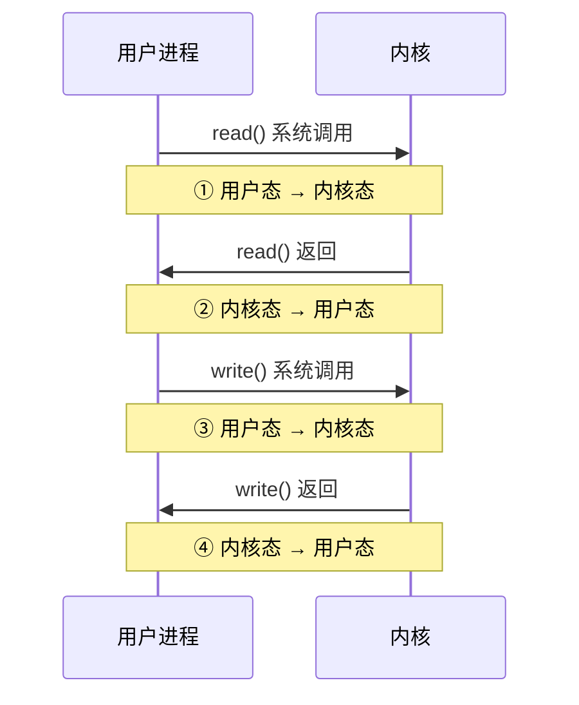
```mermaid
sequenceDiagram
    participant U as 用户进程
    participant K as 内核
    
    U->>K: read() 系统调用
    Note over U,K: ① 用户态 → 内核态
    K->>U: read() 返回
    Note over U,K: ② 内核态 → 用户态
    U->>K: write() 系统调用
    Note over U,K: ③ 用户态 → 内核态
    K->>U: write() 返回
    Note over U,K: ④ 内核态 → 用户态
```

| 序号 | 切换方向 | 触发原因 |
|------|----------|----------|
| ① | 用户态 → 内核态 | 调用 `read()` 系统调用 |
| ② | 内核态 → 用户态 | `read()` 执行完毕返回 |
| ③ | 用户态 → 内核态 | 调用 `write()` 系统调用 |
| ④ | 内核态 → 用户态 | `write()` 执行完毕返回 |

**mmap 的 3 次数据拷贝详解**：

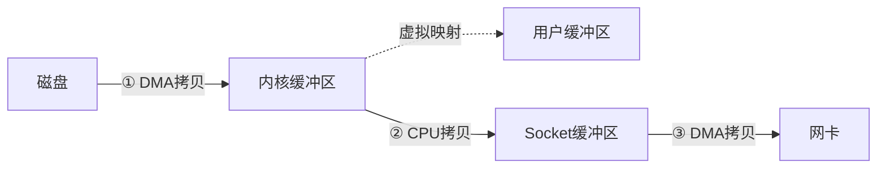
```mermaid
flowchart LR
    D["磁盘"] -->|"① DMA拷贝"| K["内核缓冲区"]
    K -.->|"虚拟映射"| U["用户缓冲区"]
    K -->|"② CPU拷贝"| S["Socket缓冲区"]
    S -->|"③ DMA拷贝"| N["网卡"]
```

| 序号 | 拷贝类型 | 数据流向 | 说明 |
|------|----------|----------|------|
| ① | DMA 拷贝 | 磁盘 → 内核缓冲区 | DMA 控制器将磁盘数据读取到内核态 Page Cache |
| - | 虚拟映射 | 内核缓冲区 ↔ 用户缓冲区 | 通过页表映射，用户态可直接访问内核数据（无物理拷贝） |
| ② | CPU 拷贝 | 内核缓冲区 → Socket 缓冲区 | CPU 将数据从 Page Cache 拷贝到 Socket 缓冲区 |
| ③ | DMA 拷贝 | Socket 缓冲区 → 网卡 | DMA 控制器将数据发送到网卡 |

**mmap 的 2 次上下文切换详解**：

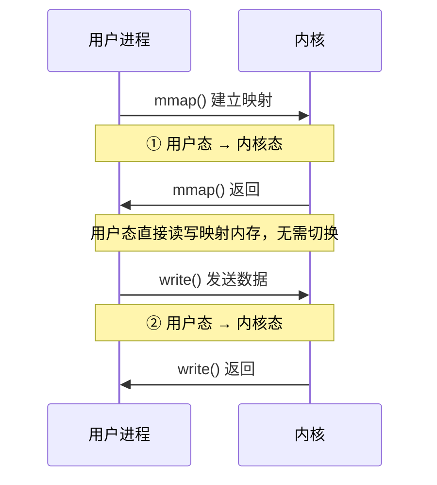
```mermaid
sequenceDiagram
    participant U as 用户进程
    participant K as 内核
    
    U->>K: mmap() 建立映射
    Note over U,K: ① 用户态 → 内核态
    K->>U: mmap() 返回
    Note over U,K: 用户态直接读写映射内存，无需切换
    U->>K: write() 发送数据
    Note over U,K: ② 用户态 → 内核态
    K->>U: write() 返回
```

| 序号 | 切换方向 | 触发原因 |
|------|----------|----------|
| ① | 用户态 → 内核态 | 调用 `mmap()` 建立映射 |
| ② | 用户态 → 内核态 | 调用 `write()` 发送数据 |

> **注意**：mmap 映射建立后，用户态可直接访问映射内存，无需 `read()` 系统调用，因此减少了一次上下文切换。

**sendfile 的 2 次数据拷贝详解**：


```mermaid
flowchart LR
    D["磁盘"] -->|"① DMA拷贝"| K["内核缓冲区"]
    K -->|"② DMA拷贝"| N["网卡"]
```

| 序号 | 拷贝类型 | 数据流向 | 说明 |
|------|----------|----------|------|
| ① | DMA 拷贝 | 磁盘 → 内核缓冲区 | DMA 控制器将磁盘数据读取到内核态 Page Cache |
| ② | DMA 拷贝 | 内核缓冲区 → 网卡 | DMA 控制器直接将数据发送到网卡（Linux 2.4+ 支持） |

> **注意**：Linux 2.4 之前，sendfile 需要 CPU 将数据从内核缓冲区拷贝到 Socket 缓冲区。Linux 2.4 之后，支持 DMA 直接从 Page Cache 传输到网卡，实现真正的"零拷贝"。

**sendfile 的 2 次上下文切换详解**：

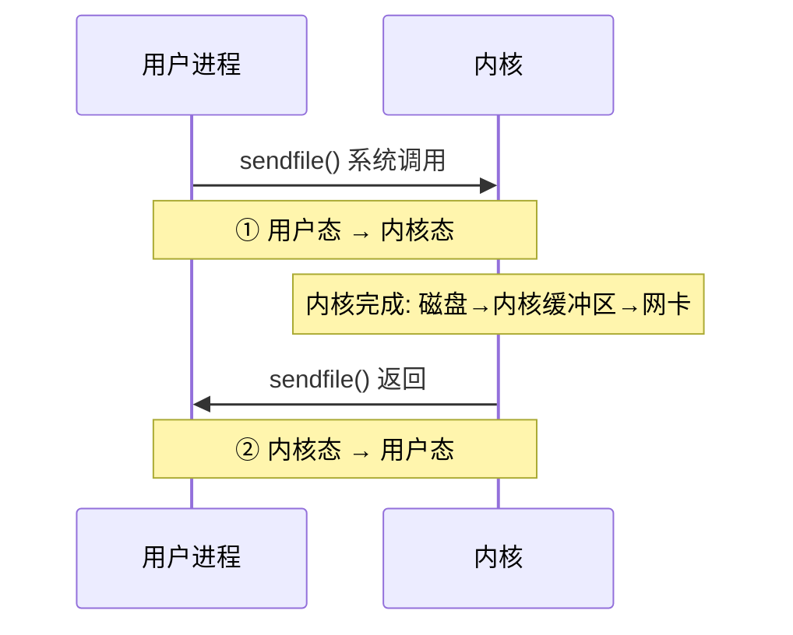
```mermaid
sequenceDiagram
    participant U as 用户进程
    participant K as 内核
    
    U->>K: sendfile() 系统调用
    Note over U,K: ① 用户态 → 内核态
    Note over K: 内核完成: 磁盘→内核缓冲区→网卡
    K->>U: sendfile() 返回
    Note over U,K: ② 内核态 → 用户态
```

| 序号 | 切换方向 | 触发原因 |
|------|----------|----------|
| ① | 用户态 → 内核态 | 调用 `sendfile()` 系统调用 |
| ② | 内核态 → 用户态 | `sendfile()` 执行完毕返回 |

> **优势**：数据完全不经过用户态，整个过程只需一次系统调用，适合静态文件传输场景。

**关键概念**：

- **DMA(Direct Memory Access)**：直接内存访问，硬件自动完成数据传输，无需CPU参与
- **上下文切换**：用户态与内核态切换，每次约几微秒开销
- **mmap**：通过虚拟地址映射共享内存，避免内核到用户态的拷贝
- **sendfile**：Linux 2.1引入，数据完全不经过用户态

**sendfile系统调用**：

```c
ssize_t sendfile(int out_fd, int in_fd, off_t *offset, size_t count);
// 直接在内核中从文件描述符传输到socket，无需用户态参与
```

#### 2.2.2 RocketMQ实现

[DefaultMappedFile.java](../store/src/main/java/org/apache/rocketmq/store/logfile/DefaultMappedFile.java) 使用transferTo实现零拷贝：

```java
public int transferTo(long position, int count, WritableByteChannel target) {
    return fileChannel.transferTo(position, count, target);
}
```

**应用场景**：消息消费时，Broker直接将CommitLog数据传输到网络，无需拷贝到用户态。

### 2.3 堆外内存池

#### 2.3.1 操作系统原理

**堆外内存(DirectByteBuffer)** 在JVM堆外分配，不受GC管理：

| 内存类型 | 分配位置 | GC影响 | 分配速度 |
|---------|---------|--------|---------|
| 堆内存 | JVM堆 | GC管理，可能移动 | 快 |
| 堆外内存 | 操作系统 | 不受GC管理 | 较慢（需系统调用） |

**DirectByteBuffer分配过程**：

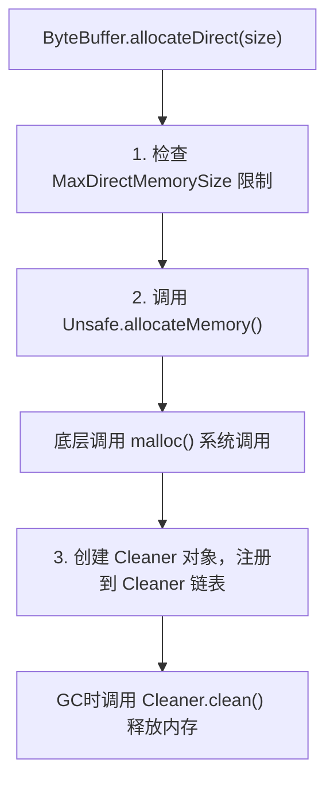
```mermaid
flowchart TD
    A["ByteBuffer.allocateDirect(size)"] --> B["1. 检查 MaxDirectMemorySize 限制"]
    B --> C["2. 调用 Unsafe.allocateMemory()"]
    C --> D["底层调用 malloc() 系统调用"]
    D --> E["3. 创建 Cleaner 对象，注册到 Cleaner 链表"]
    E --> F["GC时调用 Cleaner.clean() 释放内存"]
```

**DirectByteBuffer分配流程说明**：

| 步骤 | 操作 | 类型 | 说明 |
|------|------|------|------|
| 1 | 检查限制 | JVM | 确保 direct memory 不超过 -XX:MaxDirectMemorySize |
| 2 | 分配内存 | Native | 调用 Unsafe.allocateMemory() |
| 3 | 系统调用 | 内核 | 底层调用 malloc() 分配堆外内存 |
| 4 | 注册清理器 | JVM | 创建 Cleaner 对象，关联释放逻辑 |
| 5 | GC释放 | JVM | GC 时 Cleaner 自动调用 free() 释放 |

**关键概念**：

- **MaxDirectMemorySize**：JVM参数，限制堆外内存总量，默认值与堆大小相同
- **Unsafe.allocateMemory()**：直接调用操作系统分配内存，绕过JVM堆
- **Cleaner**：Java 9+ 的清理机制，GC时自动释放堆外内存
- **malloc/free**：C标准库函数，操作系统级别的内存分配

#### 2.3.2 RocketMQ实现

[TransientStorePool.java](../store/src/main/java/org/apache/rocketmq/store/TransientStorePool.java) 实现堆外内存池：

```java
public class TransientStorePool {
    private final int poolSize;    // 池大小，默认值：5
    private final int fileSize;    // 单个缓冲区大小，默认值：1GB
    private final Deque<ByteBuffer> availableBuffers;

    public void init() {
        for (int i = 0; i < poolSize; i++) {
            ByteBuffer byteBuffer = ByteBuffer.allocateDirect(fileSize);
            // 锁定内存，防止被swap
            final long address = ((DirectBuffer) byteBuffer).address();
            LibC.INSTANCE.mlock(new Pointer(address), new NativeLong(fileSize));
            availableBuffers.offer(byteBuffer);
        }
    }

    public ByteBuffer borrowBuffer() { 
        return availableBuffers.pollFirst(); 
    }
    
    public void returnBuffer(ByteBuffer buffer) { 
        buffer.clear(); 
        availableBuffers.offerFirst(buffer); 
    }
}
```

**设计优势**：

| 特性 | 说明 |
|------|------|
| 内存池化 | 预分配复用，避免频繁分配/释放 |
| 锁定内存 | mlock防止被swap，保证性能稳定 |
| 异步刷盘 | 先写堆外内存，再异步commit到FileChannel |

### 2.4 内存锁定与预热

#### 2.4.1 操作系统原理

**mlock系统调用**将内存锁定在物理内存中，禁止换出到swap：

```c
int mlock(const void *addr, size_t len);    // 锁定内存
int munlock(const void *addr, size_t len);  // 解锁内存
int mlockall(int flags);                     // 锁定所有内存
```

**madvise系统调用**向内核提供内存访问模式建议：

```c
int madvise(void *addr, size_t length, int advice);

// advice参数：
#define MADV_NORMAL     0   // 正常访问
#define MADV_RANDOM     1   // 随机访问，禁用预读
#define MADV_SEQUENTIAL 2   // 顺序访问，激进预读
#define MADV_WILLNEED   3   // 即将需要，立即加载
#define MADV_DONTNEED   4   // 不再需要，可释放
```

**内存预热**：通过主动访问内存页，触发缺页中断，提前建立页表映射。

**使用场景**：

| 场景 | 说明 |
|------|------|
| 实时系统 | 避免页面换入换出导致的延迟抖动 |
| 安全应用 | 防止敏感数据写入swap文件 |
| 高性能服务 | 保证热点数据始终在内存中 |

**权限要求**：需要`CAP_IPC_LOCK`权限，或`ulimit -l`设置的限制内。

#### 2.4.2 RocketMQ实现

[LibC.java](../store/src/main/java/org/apache/rocketmq/store/util/LibC.java) 通过JNA(Java Native Access，Java本地访问)调用系统调用：

```java
public interface LibC extends Library {
    LibC INSTANCE = Native.loadLibrary("c", LibC.class);
    
    int mlock(Pointer address, NativeLong size);      // 锁定内存
    int munlock(Pointer address, NativeLong size);    // 解锁内存
    int madvise(Pointer address, NativeLong size, int advice);  // 内存访问建议
}
```

[DefaultMappedFile.java](../store/src/main/java/org/apache/rocketmq/store/logfile/DefaultMappedFile.java) 实现内存预热：

```java
@Override
public void warmMappedFile(FlushDiskType type, int pages) {
    ByteBuffer byteBuffer = this.mappedByteBuffer;
    byte[] zeroBytes = new byte[pageSize];  // pageSize默认值：4KB
    
    // 按页写入零字节，触发缺页中断
    for (int i = 0; i < this.fileSize; i += pageSize) {
        byteBuffer.position(i);
        byteBuffer.put(zeroBytes, 0, pageSize);
        // 同步刷盘时定期刷新
        if (type == FlushDiskType.SYNC_FLUSH && (i / pageSize) % pages == 0) {
            byteBuffer.force();
        }
    }
    byteBuffer.force();
    
    // 建议顺序访问，启用激进预读
    LibC.INSTANCE.madvise(pointer, new NativeLong(this.fileSize), 
        LibC.MADV_SEQUENTIAL);
}
```

**效果对比**：

| 场景 | 无mlock | 有mlock |
|------|---------|---------|
| 内存压力大时 | 堆外内存可能被swap | 内存被锁定，不会被swap |
| 性能稳定性 | 可能出现IO抖动 | 性能稳定 |
| 内存占用 | 可能被回收 | 始终占用物理内存 |

### 2.5 引用计数与资源释放

#### 2.5.1 操作系统原理

**资源生命周期管理**需要解决两个问题：

1. **何时释放**：确定资源不再被使用
2. **如何释放**：正确清理资源

**引用计数**是一种简单的资源管理策略。

#### 2.5.2 RocketMQ实现

[ReferenceResource.java](../store/src/main/java/org/apache/rocketmq/store/ReferenceResource.java) 实现引用计数：

```java
public abstract class ReferenceResource {
    protected final AtomicLong refCount = new AtomicLong(1);  // 初始引用计数
    protected volatile boolean available = true;
    private volatile long firstShutdownTimestamp = 0;

    public synchronized boolean hold() {
        if (this.isAvailable() && this.refCount.getAndIncrement() > 0) {
            return true;
        }
        this.refCount.getAndDecrement();
        return false;
    }

    public void release() {
        long value = this.refCount.decrementAndGet();
        if (value <= 0) {
            synchronized (this) {
                this.cleanupOver = this.cleanup(value);
            }
        }
    }

    public void shutdown(final long intervalForcibly) {
        if (this.available) {
            this.available = false;
            this.firstShutdownTimestamp = System.currentTimeMillis();
            this.release();
        } else if (this.getRefCount() > 0) {
            // 强制释放：超时后强制清理
            if ((System.currentTimeMillis() - this.firstShutdownTimestamp) 
                >= intervalForcibly) {
                this.refCount.set(-1000 - this.getRefCount());
                this.release();
            }
        }
    }
}
```

**强制释放机制**：当资源长时间无法正常释放（引用计数不为0），通过设置负数强制触发清理。

---

## 3. 文件系统

### 3.1 顺序写入优化

#### 3.1.1 操作系统原理

**顺序写入**相比随机写入有巨大性能优势：

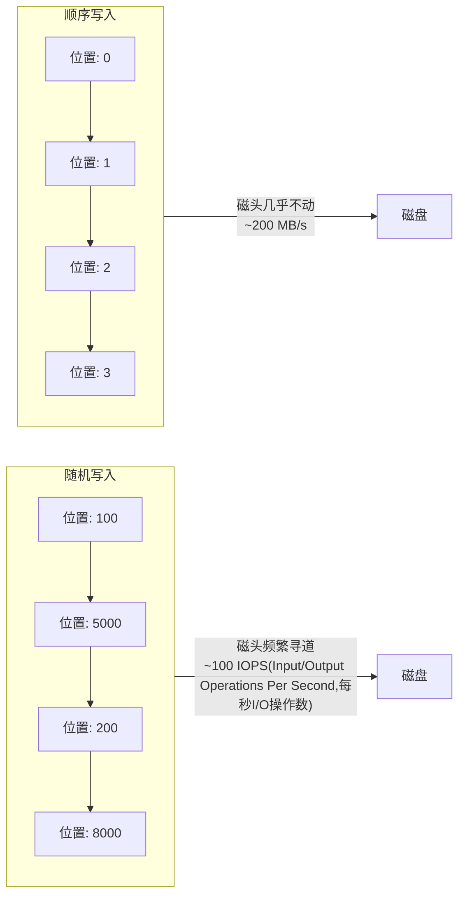
```mermaid
flowchart LR
    subgraph RandomWrite["随机写入"]
        R1["位置: 100"] --> R2["位置: 5000"]
        R2 --> R3["位置: 200"]
        R3 --> R4["位置: 8000"]
    end

    subgraph SequentialWrite["顺序写入"]
        S1["位置: 0"] --> S2["位置: 1"]
        S2 --> S3["位置: 2"]
        S3 --> S4["位置: 3"]
    end

    RandomWrite -->|"磁头频繁寻道<br/>~100 IOPS(Input/Output Operations Per Second,每秒I/O操作数)"| Disk1["磁盘"]
    SequentialWrite -->|"磁头几乎不动<br/>~200 MB/s"| Disk2["磁盘"]
```

**顺序写 vs 随机写性能对比说明**：

HDD(Hard Disk Drive,机械硬盘)的性能受磁头寻道时间影响较大。

| 写入方式 | 磁头移动 | 性能 | 说明 |
|---------|---------|------|------|
| 随机写入 | 频繁寻道 | ~100 IOPS(HDD) | 位置跳跃,磁头频繁移动 |
| 顺序写入 | 几乎不动 | ~200 MB/s(HDD) | 位置连续,磁头稳定移动 |
| 性能差异 | - | 10-100倍 | 顺序写比随机写快得多 |

**操作系统优化**：

| 优化 | 说明 |
|------|------|
| 预读 | 检测到顺序访问时，提前读取后续数据 |
| 合并写 | 将多个小写入合并为一个大写入 |
| 延迟分配 | ext4的delalloc，延迟分配磁盘块 |

#### 3.1.2 RocketMQ实现

[CommitLog.java](../store/src/main/java/org/apache/rocketmq/store/CommitLog.java) 实现顺序写入：

```java
public class CommitLog {
    private final MappedFileQueue mappedFileQueue;
    
    public PutMessageResult putMessage(final MessageExtBrokerInner msg) {
        // 获取当前写入的MappedFile
        MappedFile mappedFile = this.mappedFileQueue.getLastMappedFile();
        if (null == mappedFile || mappedFile.isFull()) {
            mappedFile = this.mappedFileQueue.getLastMappedFile(0);
        }
        
        // 顺序追加写入
        result = mappedFile.appendMessage(msg, this.appendMessageCallback);
        return result;
    }
}
```

**设计要点**：

| 要点 | 说明 |
|------|------|
| 所有消息写入同一文件 | CommitLog是全局唯一的写入点 |
| 追加写 | 始终在文件末尾追加，不修改已有数据 |
| 文件大小固定 | 单个文件1GB，写满后创建新文件 |

### 3.2 文件预分配

#### 3.2.1 操作系统原理

**文件预分配**提前分配磁盘空间，获得连续块：

```c
// Linux 预分配系统调用
int fallocate(int fd, int mode, off_t offset, off_t len);
// mode: 0 = 预分配空间，FALLOC_FL_KEEP_SIZE = 不改变文件大小
```

**优势**：

| 优势 | 说明 |
|------|------|
| 减少碎片 | 预分配获得连续块 |
| 避免分配延迟 | 写入时无需等待分配 |
| 性能稳定 | 避免运行时分配的开销 |

#### 3.2.2 RocketMQ实现

[AllocateMappedFileService.java](../store/src/main/java/org/apache/rocketmq/store/AllocateMappedFileService.java) 异步预分配文件：

```java
public class AllocateMappedFileService extends ServiceThread {
    private ConcurrentMap<String, AllocateRequest> requestTable = 
        new ConcurrentHashMap<>();

    public MappedFile putRequestAndReturnMappedFile(
        String nextFilePath, String nextNextFilePath, int fileSize) {
        
        // 预分配下一个文件
        AllocateRequest nextReq = new AllocateRequest(nextNextFilePath, fileSize);
        if (requestTable.putIfAbsent(nextReq.getFilePath(), nextReq) == null) {
            this.messageQueue.put(nextReq);  // 异步创建
        }
    }

    @Override
    public void run() {
        while (!stopped) {
            AllocateRequest req = this.messageQueue.take();
            MappedFile mappedFile = new DefaultMappedFile(
                req.getFilePath(), req.getFileSize());
            req.getMappedFile().set(mappedFile);
        }
    }
}
```

**预分配策略**：当前文件即将写满时，异步预创建下一个文件。

### 3.3 PageCache刷盘机制

#### 3.3.1 操作系统原理

**PageCache**是内核维护的文件缓存，脏页需要刷写到磁盘：

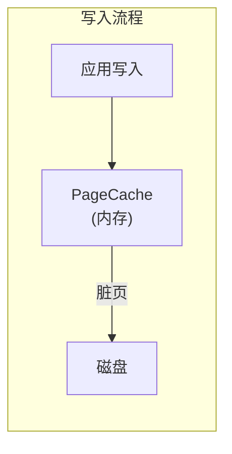
```mermaid
flowchart LR
    subgraph WriteFlow["写入流程"]
        A["应用写入"] --> B["PageCache<br/>(内存)"]
        B -->|"脏页"| C["磁盘"]
    end
```

**PageCache刷盘机制说明**：

| 触发条件 | 说明 |
|---------|------|
| 显式调用 fsync()/fdatasync() | 应用主动触发刷盘 |
| 脏页比例超过 /proc/sys/vm/dirty_ratio | 内核自动触发 |
| 脏页存活时间超过 dirty_expire_centisecs | 定时触发 |
| 内存不足时回收页面 | 内存压力触发 |

**系统调用对比**：

| 系统调用 | 说明 |
|---------|------|
| fsync() | 同步数据和元数据（时间戳等） |
| fdatasync() | 仅同步数据，不同步元数据 |
| sync() | 同步所有文件系统缓存 |

**异步刷盘流程**：

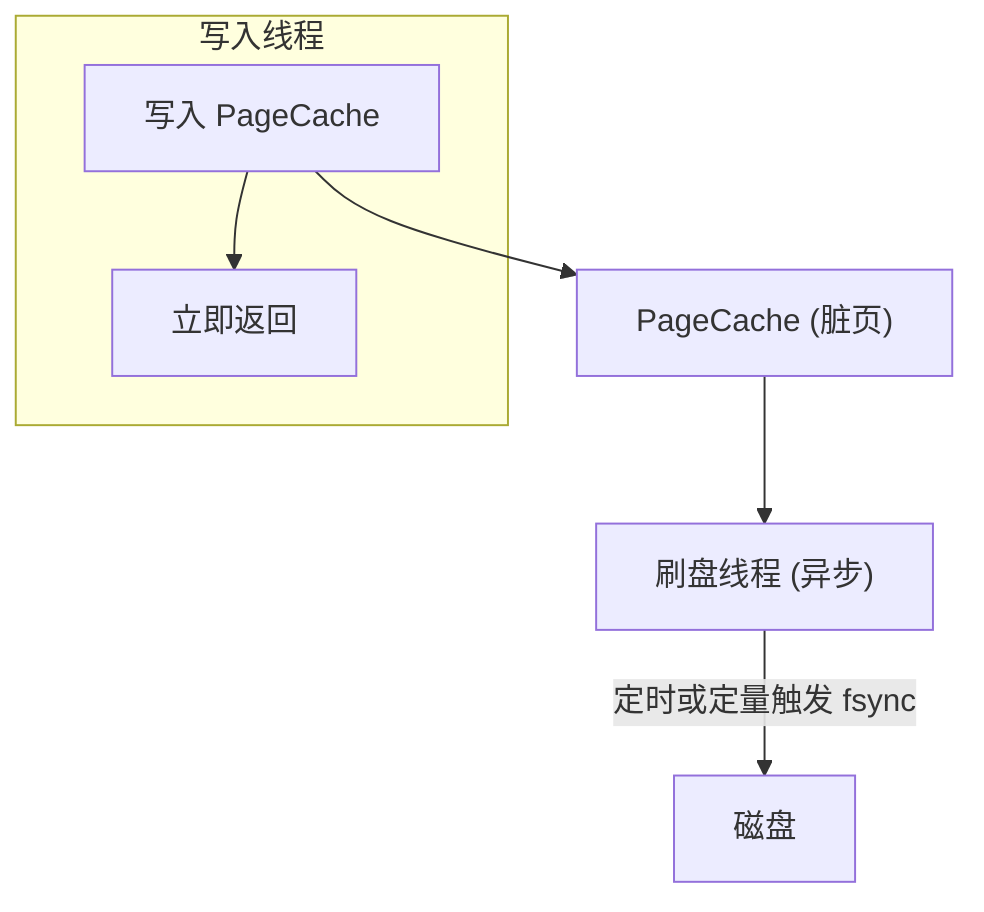
```mermaid
flowchart TD
    subgraph WriteThread["写入线程"]
        W1["写入 PageCache"] --> W2["立即返回"]
    end
    
    W1 --> P["PageCache (脏页)"]
    P --> F["刷盘线程 (异步)"]
    F -->|"定时或定量触发 fsync"| D["磁盘"]
```

**风险**：系统崩溃可能丢失未刷盘的数据。

#### 3.3.2 RocketMQ实现

[CommitLog.java](../store/src/main/java/org/apache/rocketmq/store/CommitLog.java) 实现多种刷盘策略：

**同步刷盘**：

```java
public PutMessageResult submitFlushRequest(
    AppendMessageResult result, MessageExt messageExt) {
    
    if (FlushDiskType.SYNC_FLUSH == config.getFlushDiskType()) {
        GroupCommitRequest request = new GroupCommitRequest(
            result.getWroteOffset() + result.getWroteBytes());
        flushCommitLogService.wakeup();
        boolean flushOK = request.waitForFlush(
            config.getSyncFlushTimeout());  // 默认值：5s
        if (!flushOK) {
            return PutMessageResult.FLUSH_DISK_TIMEOUT;
        }
    }
}
```

**异步刷盘**：

```java
public class FlushCommitLogService extends ServiceThread {
    @Override
    public void run() {
        while (!stopped) {
            waitForRunning(interval);  // 默认值：500ms
            // flushPhysicQueueLeastPages：最小刷盘页数，默认值：4页
            CommitLog.this.mappedFileQueue.flush(flushPhysicQueueLeastPages);
        }
    }
}
```

**GroupCommit机制**：将多个刷盘请求合并处理，减少fsync调用次数。

```java
public static class GroupCommitRequest {
    private final long nextOffset;
    private final CountDownLatch2 countDownLatch = new CountDownLatch2(1);
    private volatile boolean flushOK = false;

    public boolean waitForFlush(long timeout) {
        return this.countDownLatch.await(timeout, TimeUnit.MILLISECONDS);
    }

    public void wakeupCustomer(final boolean flushOK) {
        this.flushOK = flushOK;
        this.countDownLatch.countDown();
    }
}
```

**刷盘策略对比**：

| 策略 | 数据安全 | 性能 | 适用场景 |
|------|---------|------|---------|
| 同步刷盘 | 高（最多丢1条） | 低 | 金融交易 |
| 异步刷盘 | 中（可能丢几秒数据） | 高 | 日志采集 |

### 3.4 文件过期清理

#### 3.4.1 操作系统原理

**文件删除**涉及inode(Index Node,索引节点)和目录项的更新：

```c
int unlink(const char *pathname);  // 删除文件
// 实际上是减少文件的链接计数，当计数为0且无进程打开时才真正删除
```

**删除条件**：

| 条件 | 说明 |
|------|------|
| 引用计数为0 | 无进程打开文件 |
| 链接计数为0 | 无目录项指向文件 |

#### 3.4.2 RocketMQ实现

[MappedFileQueue.java](../store/src/main/java/org/apache/rocketmq/store/MappedFileQueue.java) 实现文件清理：

```java
public int deleteExpiredFileByTime(
    final long expiredTime,           // 过期时间，默认值：72h
    final int deleteFilesInterval,    // 删除间隔，默认值：100ms
    final long intervalForcibly,      // 强制删除间隔，默认值：120s
    final boolean cleanImmediately,   // 是否立即清理
    final int deleteFileBatchMax) {   // 最大批量删除数，默认值：10
    
    for (MappedFile mappedFile : mappedFiles) {
        long liveMaxTimestamp = mappedFile.getLastModifiedTimestamp() 
            + expiredTime;
        
        if (System.currentTimeMillis() >= liveMaxTimestamp 
            || cleanImmediately) {
            
            if (mappedFile.destroy(intervalForcibly)) {
                files.add(mappedFile);
                if (files.size() >= deleteFileBatchMax) break;
            }
        }
    }
}
```

### 3.5 文件恢复与检查点

#### 3.5.1 操作系统原理

**崩溃恢复**需要保证数据一致性：

| 恢复方式 | 说明 |
|---------|------|
| 日志恢复 | 通过日志重做/回滚 |
| 检查点(Checkpoint) | 从已知一致点开始恢复 |
| 校验和 | 检测数据是否损坏 |

**检查点**记录系统的一致性状态，用于快速恢复。

#### 3.5.2 RocketMQ实现

[CommitLog.java](../store/src/main/java/org/apache/rocketmq/store/CommitLog.java) 实现文件恢复：

```java
public void recoverNormally(long maxPhyOffsetOfConsumeQueue) {
    List<MappedFile> mappedFiles = this.mappedFileQueue.getMappedFiles();
    
    for (MappedFile mappedFile : mappedFiles) {
        int processOffset = mappedFile.getFileSize();
        while (processOffset > 0) {
            // 校验消息完整性
            if (checkMessageValid(mappedFile, processOffset)) {
                break;
            }
            processOffset -= messageSize;
        }
    }
    // 设置恢复后的位置
    this.mappedFileQueue.setFlushedWhere(processOffset);
    this.mappedFileQueue.setCommittedWhere(processOffset);
}
```

[StoreCheckpoint.java](../store/src/main/java/org/apache/rocketmq/store/StoreCheckpoint.java) 实现检查点持久化：

```java
public class StoreCheckpoint {
    private final AtomicLong physicMsgTimestamp = new AtomicLong(0);  // 默认值：0
    private final AtomicLong logicsMsgTimestamp = new AtomicLong(0);  // 默认值：0
    private final AtomicLong indexMsgTimestamp = new AtomicLong(0);   // 默认值：0

    public void flush() {
        ByteBuffer buffer = ByteBuffer.allocate(24);  // 3个long，共24字节
        buffer.putLong(physicMsgTimestamp.get());
        buffer.putLong(logicsMsgTimestamp.get());
        buffer.putLong(indexMsgTimestamp.get());
        buffer.flip();
        fileChannel.position(0);
        fileChannel.write(buffer);
        fileChannel.force(true);  // 同步刷盘，确保持久化
    }
}
```

---

## 4. I/O系统

### 4.1 阻塞I/O

**阻塞I/O (Blocking I/O)** 是最基础的I/O模型：

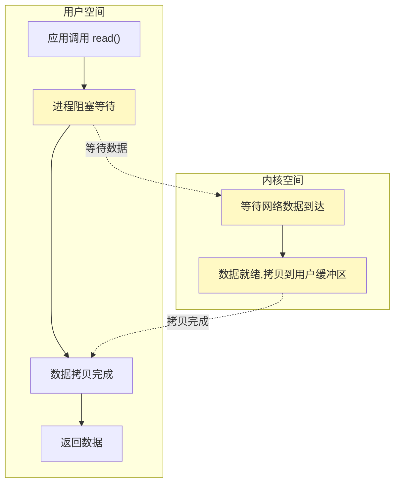
```mermaid
flowchart TD
    subgraph UserSpace["用户空间"]
        A1["应用调用 read()"] --> A2["进程阻塞等待"]
        A2 --> A5["数据拷贝完成"]
        A5 --> A6["返回数据"]
    end

    subgraph KernelSpace["内核空间"]
        A2 -.->|等待数据| A3["等待网络数据到达"]
        A3 --> A4["数据就绪,拷贝到用户缓冲区"]
        A4 -.->|拷贝完成| A5
    end

    style A2 fill:#fff9c4
    style A3 fill:#fff9c4
    style A4 fill:#fff9c4
```

**核心特点**：

| 特性 | 说明 |
|------|------|
| 同步/异步 | 同步 |
| 阻塞/非阻塞 | 阻塞 |
| 系统调用次数 | 1次read |
| CPU利用率 | 低（阻塞等待） |
| 连接数扩展性 | 差（每连接一线程） |
| 编程复杂度 | 低 |

**处理流程**：`read()` → 阻塞等待 → 数据到达 → 返回

**典型应用**：简单客户端、学习示例

**问题分析**：整个过程中应用程序一直阻塞，从调用read()到数据返回都无法执行其他任务。

---

### 4.2 非阻塞I/O

**非阻塞I/O (Non-blocking I/O)** 允许调用立即返回：

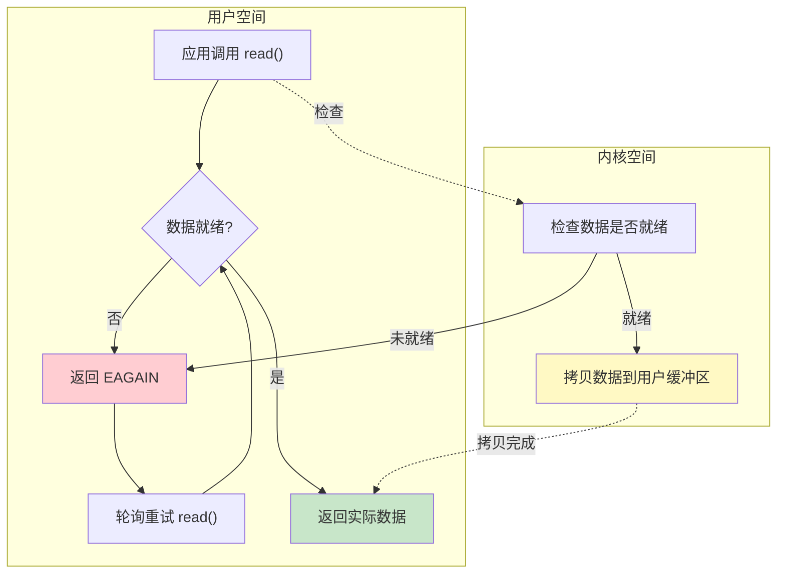
```mermaid
flowchart TD
    subgraph UserSpace["用户空间"]
        B1["应用调用 read()"] --> B2{"数据就绪?"}
        B2 -->|否| B3["返回 EAGAIN"]
        B3 --> B4["轮询重试 read()"]
        B4 --> B2
        B2 -->|是| B5["返回实际数据"]
    end

    subgraph KernelSpace["内核空间"]
        B1 -.->|检查| K1["检查数据是否就绪"]
        K1 -->|未就绪| B3
        K1 -->|就绪| K2["拷贝数据到用户缓冲区"]
        K2 -.->|拷贝完成| B5
    end

    style B3 fill:#ffcdd2
    style B5 fill:#c8e6c9
    style K2 fill:#fff9c4
```

**核心特点**：

| 特性 | 说明 |
|------|------|
| 同步/异步 | 同步 |
| 阻塞/非阻塞 | 非阻塞 |
| 系统调用次数 | N次轮询 |
| CPU利用率 | 高（轮询空转） |
| 连接数扩展性 | 差（轮询开销大） |
| 编程复杂度 | 中 |

**非阻塞 read() 返回值说明**：

| 数据状态 | 返回值 |
|---------|--------|
| 数据未就绪 | 返回 `-1`，errno 设为 `EAGAIN`（或 `EWOULDBLOCK`） |
| 数据已就绪 | 返回实际读取的字节数（≥ 0） |
| 出错 | 返回 `-1`，errno 设为其他错误码 |

> **注意**：`EAGAIN` 的含义是"再试一次"(Resource temporarily unavailable)，只在数据**未就绪**时返回。数据就绪时直接返回数据，不会返回 EAGAIN。

**处理流程**：`read()` → EAGAIN → 轮询 → ... → 数据到达 → 返回

**典型应用**：少量连接场景

**问题分析**：调用立即返回，但需要不断轮询检查数据是否就绪，CPU空转开销大。

---

### 4.3 I/O多路复用

**I/O多路复用 (I/O Multiplexing)** 是高性能服务器的核心，允许单线程同时监控多个文件描述符：

#### 4.3.1 操作系统原理

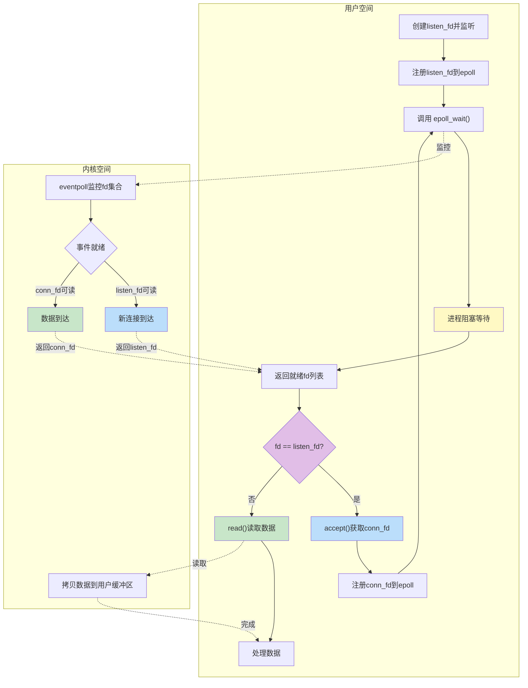
```mermaid
flowchart TD
    subgraph UserSpace["用户空间"]
        C1["创建listen_fd并监听"] --> C2["注册listen_fd到epoll"]
        C2 --> C3["调用 epoll_wait()"]
        C3 --> C4["进程阻塞等待"]
        C4 --> C5["返回就绪fd列表"]
        C5 --> C6{"fd == listen_fd?"}
        C6 -->|是| C7["accept()获取conn_fd"]
        C7 --> C8["注册conn_fd到epoll"]
        C8 --> C3
        C6 -->|否| C9["read()读取数据"]
        C9 --> C10["处理数据"]
    end

    subgraph KernelSpace["内核空间"]
        C3 -.->|监控| K1["eventpoll监控fd集合"]
        K1 --> K2{"事件就绪"}
        K2 -->|listen_fd可读| K3["新连接到达"]
        K3 -.->|返回listen_fd| C5
        K2 -->|conn_fd可读| K4["数据到达"]
        K4 -.->|返回conn_fd| C5
        C9 -.->|读取| K5["拷贝数据到用户缓冲区"]
        K5 -.->|完成| C10
    end

    style C4 fill:#fff9c4
    style C6 fill:#e1bee7
    style C7 fill:#bbdefb
    style C9 fill:#c8e6c9
    style K3 fill:#bbdefb
    style K4 fill:#c8e6c9
```

**事件区分机制**：通过文件描述符（fd）判断事件类型

| fd 类型 | 可读事件含义 | 处理方式 |
|---------|-------------|---------|
| `listen_fd` | 新连接到达 | 调用 `accept()` |
| `conn_fd` | 数据到达 | 调用 `read()` |

> **核心原理**：`epoll_wait()` 返回就绪的 fd，程序通过比较 `fd == listen_fd` 来判断是 accept 事件还是 read 事件。

**核心特点**：

| 特性 | 说明 |
|------|------|
| 同步/异步 | 同步 |
| 阻塞/非阻塞 | 部分阻塞 |
| 系统调用次数 | 1次epoll_wait + N次accept/read |
| CPU利用率 | 高（事件驱动） |
| 连接数扩展性 | 优（单线程处理多连接） |
| 编程复杂度 | 中 |

**处理流程**：
1. **初始化**：创建 `listen_fd` → 注册到 epoll
2. **事件循环**：`epoll_wait()` 阻塞等待
3. **新连接事件**：`accept()` → 获取 `conn_fd` → 注册到 epoll
4. **数据可读事件**：`read()` → 处理数据

**典型应用**：Nginx、Redis、RocketMQ

**优势分析**：单线程可同时监控多个连接，阻塞在epoll_wait而非单个read，是高性能服务器的首选方案。

#### 4.3.2 select/poll与epoll对比

**select/poll机制**：

| 机制 | 说明 | 局限性 |
|------|------|--------|
| select | 遍历所有fd检查状态 | O(n)复杂度，fd限制1024 |
| poll | 类似select，无fd数量限制 | O(n)复杂度，每次调用需拷贝 |

**epoll机制**：Linux特有的高效I/O多路复用机制

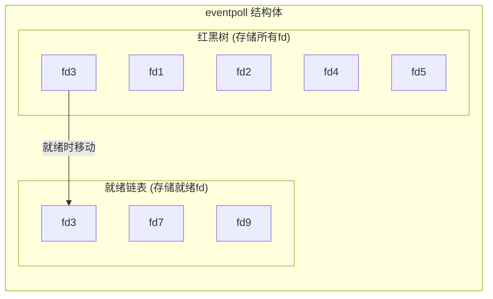
```mermaid
flowchart LR
    subgraph EventPoll["eventpoll 结构体"]
        subgraph RBTree["红黑树 (存储所有fd)"]
            FD1["fd1"]
            FD2["fd2"]
            FD3["fd3"]
            FD4["fd4"]
            FD5["fd5"]
        end
        
        subgraph ReadyList["就绪链表 (存储就绪fd)"]
            R1["fd3"]
            R2["fd7"]
            R3["fd9"]
        end
        
        FD3 -->|"就绪时移动"| R1
    end
```

**epoll数据结构说明**：

epoll通过红黑树和就绪链表两个核心数据结构实现高效的I/O多路复用。

| 数据结构 | 作用 | 操作复杂度 |
|---------|------|-----------|
| 红黑树 | 存储所有注册的fd | O(log n) 插入/删除/查找 |
| 就绪链表 | 存储就绪的fd | O(1) 获取就绪事件 |

**工作流程**：

| 步骤 | 操作 | 说明 |
|------|------|------|
| 1 | epoll_create() | 创建eventpoll结构体，初始化红黑树和就绪链表 |
| 2 | epoll_ctl(EPOLL_CTL_ADD) | 将fd插入红黑树，注册回调函数 |
| 3 | 事件就绪 | 内核回调函数将fd从红黑树移动到就绪链表 |
| 4 | epoll_wait() | 从就绪链表返回就绪fd，O(1)复杂度 |

**关键概念**：

- **红黑树**：自平衡二叉搜索树，保证查找、插入、删除操作都是O(log n)
- **就绪链表**：存储已就绪的fd，epoll_wait直接返回，无需遍历
- **回调机制**：fd就绪时内核主动调用回调函数，将fd加入就绪链表
- **共享内存**：epoll通过mmap与用户空间共享内存，避免数据拷贝

**epoll核心系统调用**：

| 系统调用 | 功能 |
|---------|------|
| epoll_create() | 创建epoll实例 |
| epoll_ctl() | 添加/修改/删除fd(File Descriptor,文件描述符) |
| epoll_wait() | 等待事件就绪 |

**性能对比**：

| 特性 | select/poll | epoll |
|------|-------------|-------|
| 时间复杂度 | O(n)遍历所有fd | O(1)只返回就绪fd |
| fd数量限制 | 1024 (select) | 无限制 |
| 触发模式 | 仅水平触发 | 水平触发+边缘触发 |
| 内存拷贝 | 每次调用都拷贝 | 共享内存 |

**触发模式**：

| 模式 | 说明 | 特点 |
|------|------|------|
| LT(Level Triggered，水平触发) | 缓冲区有数据就触发 | 简单，不易丢事件 |
| ET(Edge Triggered，边缘触发) | 状态变化时才触发 | 高效，需一次性读完 |

**水平触发与边缘触发详解**：

这是 I/O 多路复用中两种不同的事件通知机制，主要应用于 epoll 等系统调用。

| 特性 | 水平触发 (LT) | 边缘触发 (ET) |
|------|---------------------------|-------------------------|
| 触发条件 | 只要缓冲区有数据就持续通知 | 只在状态变化时通知一次 |
| 通知频率 | 可能多次通知 | 只通知一次 |
| 数据读取 | 可以分多次读取 | 必须一次性读完所有数据 |
| 编程复杂度 | 简单，不易出错 | 较高，需循环读取直到 EAGAIN |
| 效率 | 相对较低 | 相对较高 |

**形象比喻**：

- **水平触发**：像"水位报警器"，只要水位高于警戒线，就持续报警；可以慢慢舀水，舀一点水位还在警戒线以上，继续报警
- **边缘触发**：像"门铃"，只有按下门铃的那一刻响一次，如果没听到，就错过了

**代码示例**：

```c
// 水平触发模式：假设缓冲区有 100 字节数据，每次读 30 字节
// 第1次 epoll_wait 返回
read(fd, buf, 30);  // 读了30字节，还剩70字节
// 第2次 epoll_wait 立即返回（因为还有数据）
read(fd, buf, 30);  // 读了30字节，还剩40字节
// 第3次 epoll_wait 立即返回
read(fd, buf, 30);  // 读了30字节，还剩10字节
// 第4次 epoll_wait 立即返回
read(fd, buf, 30);  // 读了10字节，缓冲区空了
// 第5次 epoll_wait 阻塞等待新数据

// 边缘触发模式：必须循环读取直到 EAGAIN
while (1) {
    int n = read(fd, buf, sizeof(buf));
    if (n == -1) {
        if (errno == EAGAIN || errno == EWOULDBLOCK) {
            break;  // 数据读完了，退出循环
        }
        // 其他错误处理
    } else if (n == 0) {
        break;  // 对端关闭连接
    }
    // 处理读取到的数据
}
```

**具体场景举例**：客户端发送 100 字节数据到服务器

```
水平触发流程：
1. 数据到达，epoll_wait 返回
2. 服务器 read(50字节) → 缓冲区还剩 50 字节
3. epoll_wait 再次返回（因为还有数据）
4. 服务器 read(50字节) → 缓冲区空
5. epoll_wait 阻塞等待

边缘触发流程：
1. 数据到达，epoll_wait 返回（只通知这一次！）
2. 服务器必须循环 read：
   - read(50字节) → 成功
   - read(50字节) → 成功
   - read() → 返回 EAGAIN（表示暂无数据）
3. 退出循环，epoll_wait 阻塞等待
```

**边缘触发注意事项**：

```c
// 设置边缘触发
struct epoll_event ev;
ev.events = EPOLLIN | EPOLLET;  // EPOLLET 表示边缘触发
ev.data.fd = listen_fd;
epoll_ctl(epfd, EPOLL_CTL_ADD, listen_fd, &ev);

// 边缘触发必须配合非阻塞 I/O 使用
int flags = fcntl(fd, F_GETFL, 0);
fcntl(fd, F_SETFL, flags | O_NONBLOCK);
```

**选择建议**：

| 场景 | 推荐模式 |
|------|----------|
| 简单应用、快速开发 | 水平触发 |
| 高并发、高性能服务器 | 边缘触发 |
| 不想处理 EAGAIN | 水平触发 |
| 想减少 epoll_wait 调用次数 | 边缘触发 |

> **总结**：水平触发更安全简单，边缘触发效率更高但编程难度更大。Nginx、Redis 等高性能服务器都采用边缘触发模式。

#### 4.3.3 RocketMQ实现

[NettyRemotingServer.java](../remoting/src/main/java/org/apache/rocketmq/remoting/netty/NettyRemotingServer.java) 选择I/O模型：

```java
private boolean useEpoll() {
    return RemotingUtil.isLinuxPlatform()
        && nettyServerConfig.isUseEpollNativeSelector()
        && Epoll.isAvailable();
}

private EventLoopGroup buildEventLoopGroupSelector() {
    if (useEpoll()) {
        return new EpollEventLoopGroup(
            nettyServerConfig.getServerSelectorThreads(),
            new ThreadFactory() {
                @Override
                public Thread newThread(Runnable r) {
                    return new Thread(r, 
                        String.format("NettyServerEPOLLSelector_%d_%d", 
                            threadTotal, threadIndex.incrementAndGet()));
                }
            });
    }
    return new NioEventLoopGroup(
        nettyServerConfig.getServerSelectorThreads());
}
```

**选择策略**：优先使用Linux原生epoll，不支持时回退到NIO。

---

### 4.4 信号驱动I/O

**信号驱动I/O (Signal-driven I/O)** 通过信号机制通知数据就绪：

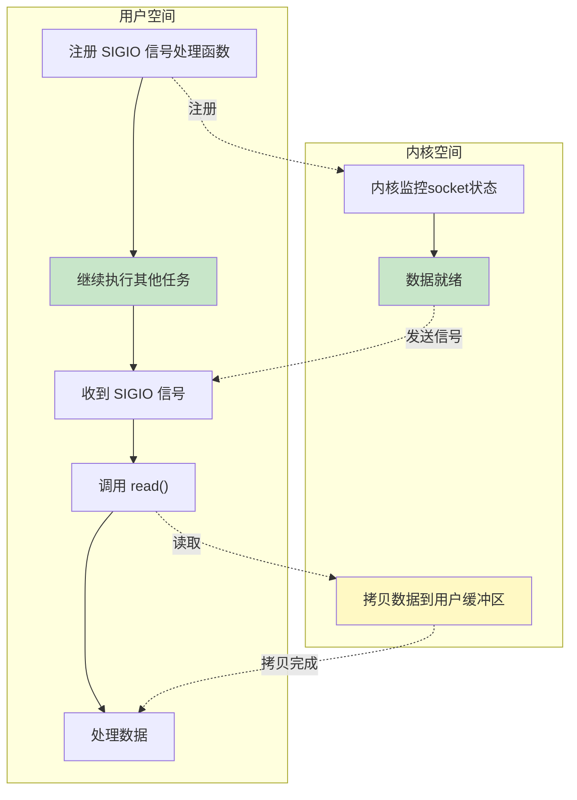
```mermaid
flowchart TD
    subgraph UserSpace["用户空间"]
        D1["注册 SIGIO 信号处理函数"] --> D2["继续执行其他任务"]
        D2 --> D3["收到 SIGIO 信号"]
        D3 --> D4["调用 read()"]
        D4 --> D5["处理数据"]
    end

    subgraph KernelSpace["内核空间"]
        D1 -.->|注册| K1["内核监控socket状态"]
        K1 --> K2["数据就绪"]
        K2 -.->|发送信号| D3
        D4 -.->|读取| K3["拷贝数据到用户缓冲区"]
        K3 -.->|拷贝完成| D5
    end

    style D2 fill:#c8e6c9
    style K2 fill:#c8e6c9
    style K3 fill:#fff9c4
```

**核心特点**：

| 特性 | 说明 |
|------|------|
| 同步/异步 | 同步 |
| 阻塞/非阻塞 | 非阻塞 |
| 系统调用次数 | 1次sigaction + 1次read |
| CPU利用率 | 高（信号通知） |
| 连接数扩展性 | 良（信号队列限制） |
| 编程复杂度 | 高 |

**处理流程**：`sigaction()` → 继续 → 信号到达 → `read()` → 返回

**典型应用**：TCP紧急数据

**特点分析**：数据就绪时内核主动发信号通知，应用程序无需轮询，但信号处理复杂且有限制。

---

### 4.5 异步I/O

**异步I/O (Asynchronous I/O)** 是真正的异步模型：

```mermaid
flowchart TD
    subgraph UserSpace["用户空间"]
        E1["调用 aio_read()"] --> E2["立即返回,继续执行"]
        E2 --> E3["...执行其他任务..."]
        E3 --> E4["收到完成通知"]
        E4 --> E5["数据已就绪,直接处理"]
    end

    subgraph KernelSpace["内核空间"]
        E1 -.->|提交请求| K1["内核接收请求"]
        K1 --> K2["等待数据到达"]
        K2 --> K3["数据就绪"]
        K3 --> K4["内核自动拷贝到用户缓冲区"]
        K4 -.->|完成通知| E4
    end

    style E1 fill:#c8e6c9
    style E2 fill:#c8e6c9
    style E3 fill:#c8e6c9
    style K2 fill:#c8e6c9
    style K3 fill:#c8e6c9
    style K4 fill:#c8e6c9
```

**核心特点**：

| 特性 | 说明 |
|------|------|
| 同步/异步 | 异步 |
| 阻塞/非阻塞 | 非阻塞 |
| 系统调用次数 | 1次aio_read |
| CPU利用率 | 最高（完全非阻塞） |
| 连接数扩展性 | 优（内核级异步） |
| 编程复杂度 | 高 |

**处理流程**：`aio_read()` → 立即返回 → 继续 → 完成回调

**典型应用**：Windows IOCP、Linux AIO

**特点分析**：真正的异步模型，从等待数据到拷贝数据全部由内核完成，应用程序完全不阻塞。

---

### 4.6 I/O模型对比与选型

**五种I/O模型综合对比**：

| 模型 | 同步/异步 | 阻塞/非阻塞 | 系统调用次数 | CPU利用率 | 连接数扩展性 | 编程复杂度 | 典型应用 |
|------|----------|------------|-------------|----------|-------------|-----------|---------|
| 阻塞I/O | 同步 | 阻塞 | 1次read | 低（阻塞等待） | 差（每连接一线程） | 低 | 简单客户端 |
| 非阻塞I/O | 同步 | 非阻塞 | N次轮询 | 高（轮询空转） | 差（轮询开销大） | 中 | 少量连接场景 |
| I/O多路复用 | 同步 | 部分阻塞 | 1次select + N次read | 高（事件驱动） | 优（单线程处理多连接） | 中 | Nginx、Redis、RocketMQ |
| 信号驱动I/O | 同步 | 非阻塞 | 1次sigaction + 1次read | 高（信号通知） | 良（信号队列限制） | 高 | TCP紧急数据 |
| 异步I/O | 异步 | 非阻塞 | 1次aio_read | 最高（完全非阻塞） | 优（内核级异步） | 高 | Windows IOCP、AIO |

**统一案例：读取网络数据**：

以"从Socket读取1KB数据"为例，对比五种模型的处理流程：

| 模型 | 处理流程 | 应用程序行为 |
|------|---------|-------------|
| 阻塞I/O | `read()` → 阻塞等待 → 数据到达 → 返回 | 调用后阻塞，无法执行其他任务 |
| 非阻塞I/O | `read()` → EAGAIN → 轮询 → ... → 数据到达 → 返回 | 需要不断轮询，CPU占用高 |
| I/O多路复用 | `select()` → 阻塞 → 就绪通知 → `read()` → 返回 | 可同时监控多个连接，阻塞在select |
| 信号驱动I/O | `sigaction()` → 继续 → 信号到达 → `read()` → 返回 | 数据就绪时收到SIGIO信号 |
| 异步I/O | `aio_read()` → 立即返回 → 继续 → 完成回调 | 完全不阻塞，内核完成所有工作 |

**关键概念**：

- **同步 vs 异步**：同步需要应用程序主动读取数据，异步由内核完成读取后通知
- **阻塞 vs 非阻塞**：阻塞指调用后线程挂起，非阻塞指调用后立即返回
- **I/O多路复用优势**：单线程可处理大量连接，避免线程切换开销

#### 4.6.1 为何选择epoll而非AIO

从理论上看，异步I/O（AIO）是最优模型，但RocketMQ、Nginx等高性能服务器选择epoll而非AIO，原因如下：

**1. Linux AIO的历史局限性**：

| 问题 | 说明 |
|------|------|
| 仅支持直接I/O | Linux原生AIO（`io_submit`/`io_getevents`）只支持`O_DIRECT`方式，绕过页缓存 |
| 网络I/O支持差 | 早期Linux AIO对Socket支持不完善，主要面向磁盘I/O |
| 内核版本依赖 | 完整支持需要较新内核，兼容性是个问题 |

**2. epoll已经足够高效**：

虽然AIO理论上最优，但epoll在实际场景中：
- **已能处理百万级连接**：C10K/C10M问题已解决
- **性能差距微乎其微**：数据拷贝阶段的时间相比网络延迟可忽略
- **成熟稳定**：经过20+年生产验证

**3. 编程复杂度对比**：

```
AIO编程模型：
aio_read() → 注册回调 → 处理完成事件 → 状态机管理 → 错误恢复

epoll编程模型：
epoll_wait() → 循环处理就绪事件 → 简单直观
```

AIO的回调模式导致状态管理复杂、错误处理困难、调试困难。

**4. 跨平台一致性**：

| 平台 | 异步I/O机制 |
|------|------------|
| Windows | IOCP（真正的异步I/O） |
| Linux | epoll（事实标准） |
| macOS/BSD | kqueue |

使用epoll + 非阻塞I/O可以保持跨平台代码一致性。

**5. 新趋势：io_uring**：

Linux 5.1+引入了**io_uring**，这是真正现代化的异步I/O：

| 特性 | io_uring | 传统AIO | epoll |
|------|----------|---------|-------|
| 网络I/O | ✅ 完善支持 | ❌ 支持差 | ✅ |
| 文件I/O | ✅ 完善支持 | ✅ 仅O_DIRECT | ❌ |
| 零拷贝 | ✅ | 部分 | ❌ |
| 性能 | 最高 | 中 | 高 |

**选择原因总结**：

| 原因 | 说明 |
|------|------|
| Linux AIO不完善 | 原生AIO对网络I/O支持差 |
| epoll足够好 | 性能已接近理论最优，成熟稳定 |
| 编程简单 | 事件驱动模型更易理解和调试 |
| 跨平台 | 统一编程模型 |
| 生态成熟 | Netty、Nginx等框架深度优化 |

> **一句话总结**：AIO理论最优，但Linux AIO实现不完善；epoll实际性能足够好且生态成熟，是工程上的最优选择。

---

### 4.7 事件驱动模型

#### 4.7.1 操作系统原理

**事件驱动模型**基于I/O多路复用，将I/O事件分发给对应的处理器：

```mermaid
flowchart TD
    E["事件循环 (EventLoop)"] -->|"epoll_wait()"| R["就绪事件"]
    R --> H1["读事件 Handler"]
    R --> H2["写事件 Handler"]
    R --> H3["连接事件 Handler"]
```

**Netty事件模型**：基于ChannelPipeline的责任链模式处理事件。

#### 4.7.2 RocketMQ实现

[NettyRemotingServer.java](../remoting/src/main/java/org/apache/rocketmq/remoting/netty/NettyRemotingServer.java) 配置事件处理链：

```java
serverBootstrap.childHandler(new ChannelInitializer<SocketChannel>() {
    @Override
    public void initChannel(SocketChannel ch) {
        ch.pipeline()
            .addLast(defaultEventExecutorGroup, HANDSHAKE_HANDLER_NAME, handshakeHandler)
            .addLast(defaultEventExecutorGroup,
                encoder,
                new NettyDecoder(),
                new IdleStateHandler(0, 0,
                    nettyServerConfig.getServerChannelMaxIdleTimeSeconds()),  // 默认值：120s
                connectionManageHandler,
                serverHandler);
    }
});
```

---

## 5. 网络系统

### 5.1 TCP参数优化

#### 5.1.1 操作系统原理

**TCP参数**影响网络性能和可靠性：

| 参数 | 说明 | 内核路径 |
|------|------|---------|
| SO_BACKLOG | 连接等待队列长度 | `/proc/sys/net/core/somaxconn` |
| SO_REUSEADDR | 允许重用端口 | 内核socket选项 |
| TCP_NODELAY | 禁用Nagle算法 | `/proc/sys/net/ipv4/tcp_low_latency` |
| SO_KEEPALIVE | TCP保活探测 | `/proc/sys/net/ipv4/tcp_keepalive_*` |
| SO_SNDBUF/SO_RCVBUF | 收发缓冲区大小 | `/proc/sys/net/ipv4/tcp_rmem/wmem` |

**Nagle算法**：将小包合并发送，减少网络负载，但增加延迟。

#### 5.1.2 RocketMQ实现

[NettyRemotingServer.java](../remoting/src/main/java/org/apache/rocketmq/remoting/netty/NettyRemotingServer.java) 配置TCP参数：

```java
serverBootstrap.group(this.eventLoopGroupBoss, this.eventLoopGroupSelector)
    .channel(useEpoll() ? EpollServerSocketChannel.class : NioServerSocketChannel.class)
    .option(ChannelOption.SO_BACKLOG, 1024)
    .option(ChannelOption.SO_REUSEADDR, true)
    .childOption(ChannelOption.SO_KEEPALIVE, false)
    .childOption(ChannelOption.TCP_NODELAY, true);
```

**参数选择原因**：

| 参数 | 设置 | 原因 |
|------|------|------|
| SO_BACKLOG | 1024 | 支持高并发连接 |
| TCP_NODELAY | true | 禁用Nagle，降低延迟 |
| SO_KEEPALIVE | false | 使用应用层心跳替代 |

### 5.2 连接建立流程

#### 5.2.1 操作系统原理

**TCP三次握手**建立连接：

```mermaid
sequenceDiagram
    participant C as Client
    participant S as Server
    participant SQ as 半连接队列(SYN队列)
    participant AQ as 全连接队列(Accept队列)

    C->>S: SYN (seq=x)
    Note right of S: SYN-RCVD状态<br/>加入半连接队列
    S->>C: SYN+ACK (seq=y, ack=x+1)
    Note left of C: ESTABLISHED状态
    C->>S: ACK (ack=y+1)
    Note right of S: ESTABLISHED状态<br/>移至全连接队列
```

**关键队列**：

| 队列 | 说明 | 内核参数 |
|------|------|---------|
| 半连接队列(SYN队列) | 存放SYN-RCVD状态的连接 | `/proc/sys/net/ipv4/tcp_max_syn_backlog` |
| 全连接队列(Accept队列) | 存放ESTABLISHED状态的连接 | `/proc/sys/net/core/somaxconn` |

**相关内核参数**：

| 参数 | 说明 |
|------|------|
| `/proc/sys/net/ipv4/tcp_max_syn_backlog` | 半连接队列长度 |
| `/proc/sys/net/core/somaxconn` | 全连接队列长度 |
| `/proc/sys/net/ipv4/tcp_syncookies` | SYN Cookie防护 |

#### 5.2.2 RocketMQ实现

[NettyRemotingServer.java](../remoting/src/main/java/org/apache/rocketmq/remoting/netty/NettyRemotingServer.java) 处理连接：

```java
serverBootstrap.childHandler(new ChannelInitializer<SocketChannel>() {
    @Override
    public void initChannel(SocketChannel ch) {
        ch.pipeline()
            .addLast(defaultEventExecutorGroup, HANDSHAKE_HANDLER_NAME, handshakeHandler)
            .addLast(defaultEventExecutorGroup,
                encoder,
                new NettyDecoder(),
                new IdleStateHandler(0, 0,
                    nettyServerConfig.getServerChannelMaxIdleTimeSeconds()),
                connectionManageHandler,
                serverHandler);
    }
});
```

### 5.3 空闲连接检测

#### 5.3.1 操作系统原理

**空闲连接检测**防止资源泄漏：

| 方式 | 说明 | 优缺点 |
|------|------|--------|
| TCP Keepalive | 内核定时发送探测包 | 简单，但间隔长（默认2小时） |
| 应用层心跳 | 应用自定义心跳协议 | 灵活，可快速检测 |

**TCP Keepalive参数**：

```bash
/proc/sys/net/ipv4/tcp_keepalive_time   # 首次探测时间，默认值：7200s
/proc/sys/net/ipv4/tcp_keepalive_intvl  # 探测间隔，默认值：75s
/proc/sys/net/ipv4/tcp_keepalive_probes # 探测次数，默认值：9次
```

#### 5.3.2 RocketMQ实现

[NettyRemotingServer.java](../remoting/src/main/java/org/apache/rocketmq/remoting/netty/NettyRemotingServer.java) 使用应用层心跳：

```java
// 空闲检测Handler
.addLast(new IdleStateHandler(0, 0,
    nettyServerConfig.getServerChannelMaxIdleTimeSeconds()))  // 默认值：120s

// 连接管理Handler
class NettyConnectManageHandler extends ChannelDuplexHandler {
    @Override
    public void userEventTriggered(ChannelHandlerContext ctx, Object evt) {
        if (evt instanceof IdleStateEvent) {
            IdleStateEvent event = (IdleStateEvent) evt;
            if (event.state().equals(IdleState.ALL_IDLE)) {
                ctx.close();  // 关闭空闲连接
            }
        }
    }
}
```

### 5.4 连接管理与同步请求

#### 5.4.1 操作系统原理

**Channel生命周期**：连接建立 → 数据传输 → 连接关闭

**同步请求超时机制**：同步请求需要等待响应，超时机制防止无限等待：

```mermaid
sequenceDiagram
    participant C as 客户端
    participant S as 服务端
    
    C->>S: 请求
    Note over C: 等待响应 (超时计时)
    S->>C: 响应
    
    alt 超时未收到响应
        C->>C: 抛出TimeoutException
    end
```

#### 5.4.2 RocketMQ实现

[NettyConnectManageHandler](../remoting/src/main/java/org/apache/rocketmq/remoting/netty/NettyRemotingServer.java) 管理连接：

```java
class NettyConnectManageHandler extends ChannelDuplexHandler {
    @Override
    public void channelActive(ChannelHandlerContext ctx) {
        final String remoteAddress = RemotingHelper.parseChannelRemoteAddr(ctx.channel());
        log.info("NETTY SERVER PIPELINE: channelActive, the channel[{}]", remoteAddress);
        super.channelActive(ctx);
        if (NettyRemotingServer.this.channelEventListener != null) {
            NettyRemotingServer.this.putNettyEvent(
                new NettyEvent(NettyEventType.CONNECT, remoteAddress, ctx.channel()));
        }
    }
}
```

[NettyRemotingAbstract.java](../remoting/src/main/java/org/apache/rocketmq/remoting/netty/NettyRemotingAbstract.java) 实现同步请求：

```java
public RemotingCommand invokeSync(String addr, RemotingCommand request, long timeoutMillis) {
    final ResponseFuture responseFuture = new ResponseFuture(
        channel, request.getOpaque(), timeoutMillis, null, null);
    
    this.responseTable.put(request.getOpaque(), responseFuture);
    channel.writeAndFlush(request).addListener(future -> {
        if (!future.isSuccess()) {
            responseFuture.setCause(future.cause());
            responseFuture.putResponse(null);
        }
    });
    
    RemotingCommand response = responseFuture.waitResponse(timeoutMillis);
    if (response == null) {
        throw new RemotingTimeoutException("wait response timeout");
    }
    return response;
}
```

---

## 6. 并发与同步

### 6.1 自旋锁

#### 6.1.1 操作系统原理

**自旋锁(Spinlock)**是一种忙等待锁：

```mermaid
flowchart TD
    subgraph AcquireLock["获取锁"]
        A1["do {"] --> A2["CAS指令: 原子比较并交换"]
        A2 --> A3{"lock == 0 && CAS(lock, 0, 1)?"}
        A3 -->|"成功"| A4["获取锁成功, break"]
        A3 -->|"失败"| A5["自旋等待, CPU空转"]
        A5 --> A1
    end

    subgraph ReleaseLock["释放锁"]
        R1["lock = 0 (原子写入)"]
    end
```

**自旋锁工作原理说明**：

| 操作 | 说明 |
|------|------|
| CPU指令 | x86 的 cmpxchg (CAS) |
| 特点 | 无上下文切换，但CPU空转 |

**关键概念**：

- **CAS(Compare-And-Swap)**：原子指令，比较内存值与期望值，相等则更新
- **自旋(Spin)**：循环检查锁状态，不释放CPU
- **忙等待(Busy Waiting)**：线程在等待时持续占用CPU
- **适用条件**：锁持有时间短于上下文切换时间（约几微秒）

**适用场景**：

| 场景 | 是否适合 | 原因 |
|------|---------|------|
| 锁持有时间短 | ✅ 适合 | 等待时间短，上下文切换开销更大 |
| 锁竞争少 | ✅ 适合 | 很少需要自旋 |
| 锁持有时间长 | ❌ 不适合 | CPU空转浪费严重 |
| 锁竞争激烈 | ❌ 不适合 | 大量线程自旋，CPU占用高 |

#### 6.1.2 RocketMQ实现

[PutMessageSpinLock.java](../store/src/main/java/org/apache/rocketmq/store/PutMessageSpinLock.java) 实现自旋锁：

```java
public class PutMessageSpinLock implements PutMessageLock {
    // true: Can lock, false: in lock
    private AtomicBoolean putMessageSpinLock = new AtomicBoolean(true);

    @Override
    public void lock() {
        boolean flag;
        do {
            flag = this.putMessageSpinLock.compareAndSet(true, false);
        } while (!flag);  // 自旋等待
    }

    @Override
    public void unlock() {
        this.putMessageSpinLock.compareAndSet(false, true);
    }
}
```

### 6.2 可重入锁

#### 6.2.1 操作系统原理

**可重入锁(ReentrantLock)**基于AQS(AbstractQueuedSynchronizer，抽象队列同步器)实现，竞争时线程阻塞：

```mermaid
flowchart TD
    subgraph AcquireLock["获取锁"]
        L1["1. 尝试 CAS 获取锁"] --> L2{"成功?"}
        L2 -->|"成功"| L3["设置 owner = 当前线程"]
        L2 -->|"失败"| L4["加入 CLH 等待队列"]
        L4 --> L5["调用 LockSupport.park() 阻塞"]
        L5 --> L6["底层调用 futex(FUTEX_WAIT)"]
    end

    subgraph ReleaseLock["释放锁"]
        R1["1. CAS 释放锁"] --> R2["唤醒等待队列中的下一个线程"]
        R2 --> R3["调用 LockSupport.unpark()"]
        R3 --> R4["底层调用 futex(FUTEX_WAKE)"]
    end
```

**AQS工作原理说明**：

| 组件 | 说明 |
|------|------|
| CLH队列 | Craig, Landin, and Hagersten队列，双向链表 |
| 节点内容 | 线程信息和等待状态 |

**公平锁 vs 非公平锁**：

| 类型 | 说明 | 特点 |
|------|------|------|
| 公平锁 | 按请求顺序获取 | 公平，但吞吐量低 |
| 非公平锁 | 允许插队 | 吞吐量高，但可能饥饿 |

#### 6.2.2 RocketMQ实现

[PutMessageReentrantLock.java](../store/src/main/java/org/apache/rocketmq/store/PutMessageReentrantLock.java) 实现可重入锁：

```java
public class PutMessageReentrantLock implements PutMessageLock {
    private ReentrantLock putMessageNormalLock = new ReentrantLock(); // NonfairSync

    @Override
    public void lock() {
        putMessageNormalLock.lock();
    }

    @Override
    public void unlock() {
        putMessageNormalLock.unlock();
    }
}
```

### 6.3 锁选择与分段锁

#### 6.3.1 操作系统原理

**锁选择**需要权衡上下文切换开销和CPU空转开销：

| 因素 | 选择自旋锁 | 选择阻塞锁 |
|------|-----------|-----------|
| 持锁时间 | 短（微秒级） | 长（毫秒级） |
| 竞争程度 | 低 | 高 |
| CPU资源 | 充足 | 紧张 |

**分段锁**通过将锁分成多个段，减少锁竞争：

```mermaid
flowchart LR
    subgraph SingleLock["单锁模式"]
        S1["所有操作"] --> S2["单个锁"]
        S2 --> S3["串行执行"]
    end

    subgraph SegmentLock["分段锁模式"]
        O1["操作1"] -->|"Hash"| L1["Lock 0"]
        O2["操作2"] -->|"Hash"| L2["Lock 1"]
        O3["操作3"] -->|"Hash"| L3["Lock 2"]
        O4["操作N"] -->|"Hash"| L4["Lock N"]
    end

    SingleLock -->|"竞争激烈, 吞吐量低"| R1["结果"]
    SegmentLock -->|"竞争分散, 吞吐量高"| R2["结果"]
```

**分段锁工作原理说明**：

| 模式 | 锁数量 | 并发度 | 适用场景 |
|------|--------|--------|---------|
| 单锁模式 | 1个 | 低 | 操作简单、竞争少的场景 |
| 分段锁模式 | N个 | 高 | 操作复杂、竞争激烈的场景 |

**关键概念**：

- **Hash映射**：根据key的hash值分配到对应的锁段
- **锁粒度**：分段数越多，锁粒度越细，并发度越高
- **一致性保证**：相同key的操作映射到同一锁段，保证顺序性
- **典型应用**：ConcurrentHashMap（16段）、RocketMQ TopicQueueLock（32段）

#### 6.3.2 RocketMQ实现

[CommitLog.java](../store/src/main/java/org/apache/rocketmq/store/CommitLog.java) 根据配置选择锁：

```java
public CommitLog(final DefaultMessageStore messageStore) {
    // 根据配置选择锁类型
    this.putMessageLock = messageStore.getMessageStoreConfig()
        .isUseReentrantLockWhenPutMessage() 
        ? new PutMessageReentrantLock()   // 使用可重入锁
        : new PutMessageSpinLock();       // 使用自旋锁（默认）
}
```

**配置项**：`useReentrantLockWhenPutMessage`，默认值：false（使用自旋锁）。

[TopicQueueLock.java](../store/src/main/java/org/apache/rocketmq/store/TopicQueueLock.java) 实现分段锁：

```java
public class TopicQueueLock {
    private static final int MAX_LOCK_NUM = 32;  // 32个分段，默认值：32
    private final Lock[] lockList = new ReentrantLock[MAX_LOCK_NUM];

    public TopicQueueLock() {
        for (int i = 0; i < MAX_LOCK_NUM; i++) {
            this.lockList[i] = new ReentrantLock();
        }
    }

    public Lock lock(final String topic, final int queueId) {
        // 根据topic+queueId哈希到对应分段
        int index = Math.abs((topic.hashCode() + queueId) % MAX_LOCK_NUM);
        return this.lockList[index];
    }
}
```

**设计要点**：相同topic+queueId的操作映射到同一个锁，保证顺序性。

### 6.4 原子操作

#### 6.4.1 操作系统原理

**CAS(Compare-And-Swap，比较并交换)** 是原子操作的基础：

```c
// CAS 伪代码
bool CAS(int *addr, int expected, int new_value) {
    if (*addr == expected) {
        *addr = new_value;
        return true;
    }
    return false;
}

// x86 汇编
lock cmpxchg [dest], source
```

**CAS问题**：

| 问题 | 说明 | 解决方案 |
|------|------|---------|
| ABA问题 | 值从A变B再变回A | 使用版本号（AtomicStampedReference） |
| 自旋开销 | 高竞争时CPU空转 | 使用自适应自旋或阻塞锁 |
| 单变量限制 | 只能操作一个变量 | 使用锁或AtomicReference |

#### 6.4.2 RocketMQ实现

[ServiceThread.java](../common/src/main/java/org/apache/rocketmq/common/ServiceThread.java) 使用CAS保证线程安全：

```java
public abstract class ServiceThread implements Runnable {
    private final AtomicBoolean started = new AtomicBoolean(false);
    protected volatile boolean stopped = false;

    public void start() {
        if (!started.compareAndSet(false, true)) {
            return;  // 已经启动，直接返回
        }
        stopped = false;
        this.thread = new Thread(this, getServiceName());
        this.thread.setDaemon(isDaemon);
        this.thread.start();
    }

    public void shutdown(final boolean interrupt) {
        if (!started.compareAndSet(true, false)) {
            return;  // 已经关闭，直接返回
        }
        this.stopped = true;
        // ...
    }
}
```

[ReferenceResource.java](../store/src/main/java/org/apache/rocketmq/store/ReferenceResource.java) 使用AtomicLong实现引用计数：

```java
public abstract class ReferenceResource {
    protected final AtomicLong refCount = new AtomicLong(1);  // 初始引用计数

    public synchronized boolean hold() {
        if (this.isAvailable() && this.refCount.getAndIncrement() > 0) {
            return true;
        }
        this.refCount.getAndDecrement();
        return false;
    }

    public void release() {
        long value = this.refCount.decrementAndGet();
        if (value <= 0) {
            synchronized (this) {
                this.cleanupOver = this.cleanup(value);
            }
        }
    }
}
```

**原子操作应用场景**：

| 场景 | 使用类 | 说明 |
|------|--------|------|
| 状态标志 | AtomicBoolean | 线程启动/停止状态 |
| 引用计数 | AtomicLong | 资源生命周期管理 |
| 统计计数 | AtomicLong | 流量统计、消息计数 |
| 唤醒标志 | AtomicBoolean | 避免重复唤醒 |

---

## 总结

本文档从RocketMQ源码中提取了六大操作系统核心知识领域：

| 领域 | 核心概念 | RocketMQ应用 |
|------|---------|-------------|
| 进程线程 | 线程生命周期、futex、线程池、Reactor | ServiceThread、CountDownLatch2、Netty线程模型 |
| 内存管理 | 虚拟内存、mmap、零拷贝、堆外内存 | MappedFile、transferTo、TransientStorePool |
| 文件系统 | 顺序写、预分配、PageCache、检查点 | CommitLog顺序写、异步刷盘、StoreCheckpoint |
| I/O系统 | I/O模型、epoll、事件驱动 | Netty Epoll、ChannelPipeline |
| 网络系统 | TCP参数、三次握手、空闲检测 | SO_BACKLOG、TCP_NODELAY、IdleStateHandler |
| 并发同步 | 自旋锁、可重入锁、分段锁、CAS | PutMessageSpinLock、TopicQueueLock |

**设计原则**：

1. **性能优先**：顺序写、零拷贝、堆外内存池
2. **可靠性保障**：同步刷盘、检查点、崩溃恢复
3. **高并发处理**：Reactor模型、分段锁、CAS原子操作
4. **资源管理**：引用计数、优雅关闭、内存锁定