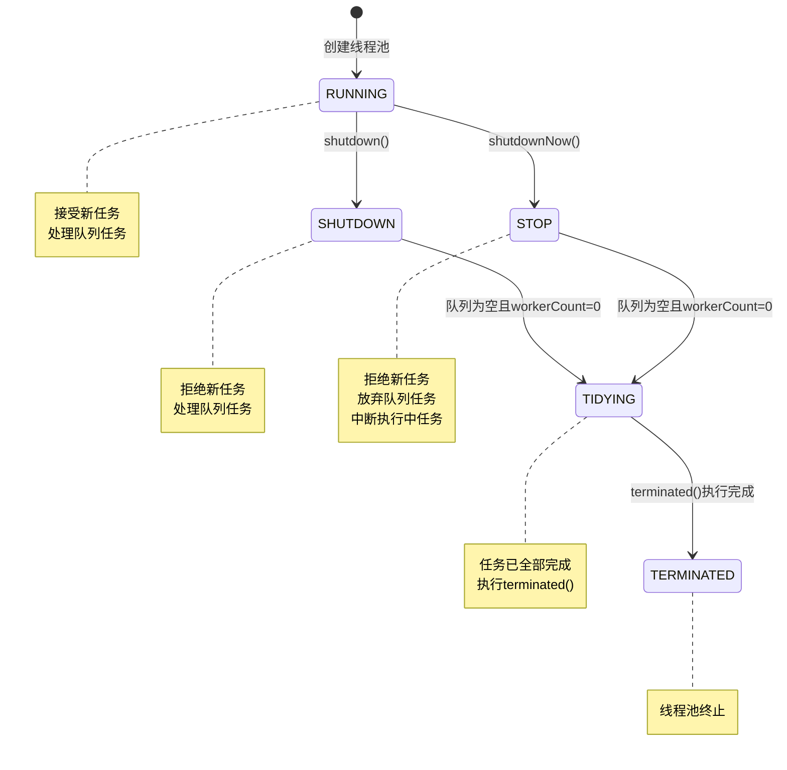
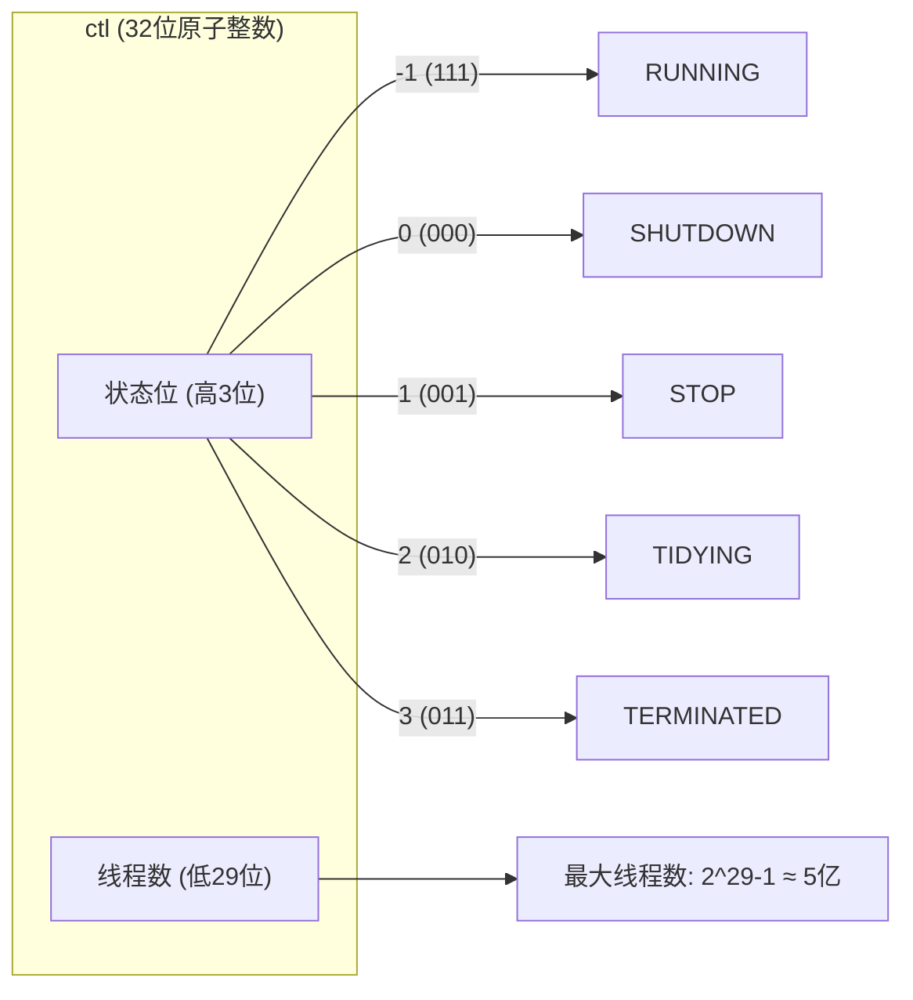

# 线程池状态转换图

## 状态概述

Java线程池（ThreadPoolExecutor）使用一个原子整数`ctl`来同时记录运行状态和线程数量：

```java
private final AtomicInteger ctl = new AtomicInteger(ctlOf(RUNNING, 0));
// 高3位存储运行状态，低29位存储线程数量
private static final int COUNT_BITS = Integer.SIZE - 3;
```

## 五种状态

| 状态 | 值 | 说明 |
|------|-----|------|
| RUNNING | -1 | 接受新任务并处理队列任务 |
| SHUTDOWN | 0 | 不接受新任务，但处理队列任务 |
| STOP | 1 | 不接受新任务，不处理队列任务，中断正在执行的任务 |
| TIDYING | 2 | 所有任务已终止，workerCount为0，即将执行terminated() |
| TERMINATED | 3 | terminated()执行完成 |

## 状态转换图



## 状态转换流程说明

线程池从创建到终止经历5种状态，状态转换是单向的，不可逆。

| 转换路径 | 触发条件 | 说明 |
|---------|---------|------|
| RUNNING → SHUTDOWN | 调用shutdown() | 优雅关闭，等待队列任务完成 |
| RUNNING → STOP | 调用shutdownNow() | 立即关闭，中断所有任务 |
| SHUTDOWN → TIDYING | 队列为空且workerCount=0 | 所有任务执行完毕 |
| STOP → TIDYING | 队列为空且workerCount=0 | 所有任务被中断或完成 |
| TIDYING → TERMINATED | terminated()执行完成 | 线程池彻底终止 |

## ctl控制变量详解



## 关键概念

- **ctl原子变量**：高3位存储状态，低29位存储线程数，通过CAS保证线程安全
- **状态不可逆**：状态只能向前转换，不能回退
- **状态检查**：通过runStateOf(ctl)获取状态，workerCountOf(ctl)获取线程数
