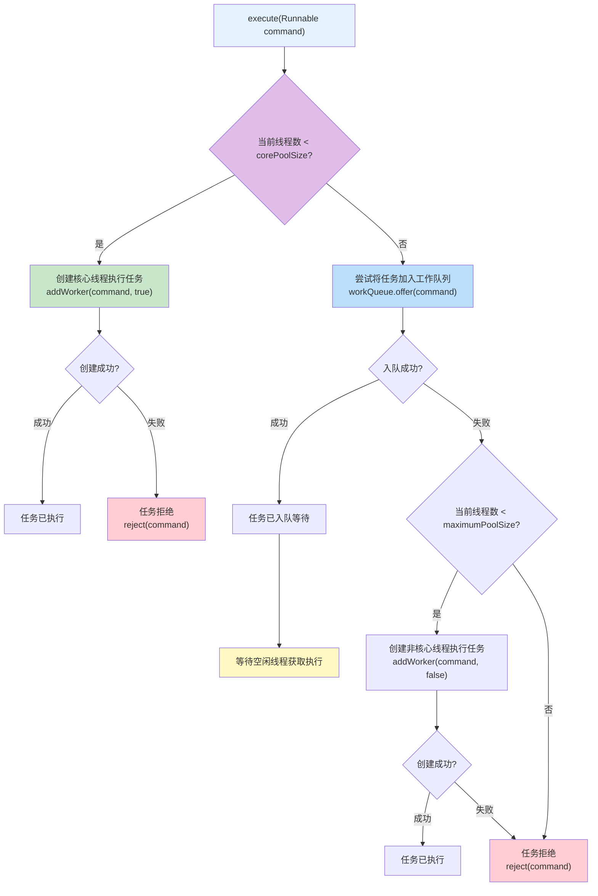
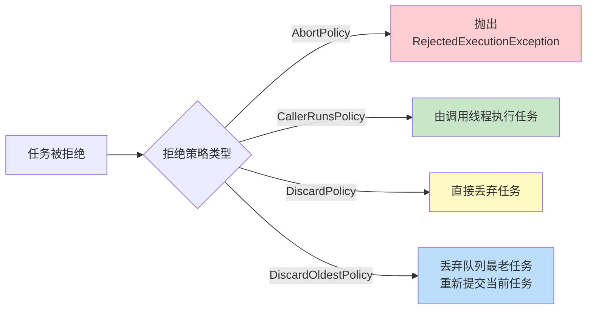

# 线程池任务提交流程图

## execute()方法处理流程

线程池通过execute()方法提交任务，根据当前线程数和队列状态采取不同策略。

## 任务提交流程说明

| 步骤 | 条件 | 操作 | 说明 |
|------|------|------|------|
| 1 | 线程数 < corePoolSize | 创建核心线程 | 直接执行任务，无需入队 |
| 2 | 线程数 >= corePoolSize | 任务入队 | 任务进入工作队列等待 |
| 3 | 入队失败且线程数 < maximumPoolSize | 创建非核心线程 | 创建临时线程执行任务 |
| 4 | 入队失败且线程数 >= maximumPoolSize | 拒绝任务 | 执行拒绝策略 |

## 拒绝策略

当任务无法被接受时，执行拒绝策略：

## 四种拒绝策略对比

| 策略 | 行为 | 适用场景 |
|------|------|---------|
| AbortPolicy | 抛出异常（默认） | 需要感知任务被拒绝的场景 |
| CallerRunsPolicy | 调用者线程执行 | 需要保证任务不丢失 |
| DiscardPolicy | 静默丢弃 | 可容忍任务丢失 |
| DiscardOldestPolicy | 丢弃最老任务 | 优先处理新任务 |

## 关键概念

- **核心线程**：常驻线程，即使空闲也不会被回收（除非allowCoreThreadTimeOut=true）
- **非核心线程**：临时线程，空闲超过keepAliveTime后会被回收
- **工作队列**：缓冲区，解耦任务提交与执行速度差异
- **拒绝策略**：任务无法接受时的处理方式
