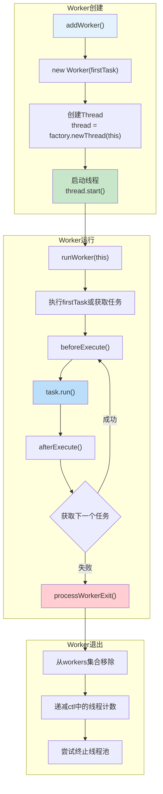
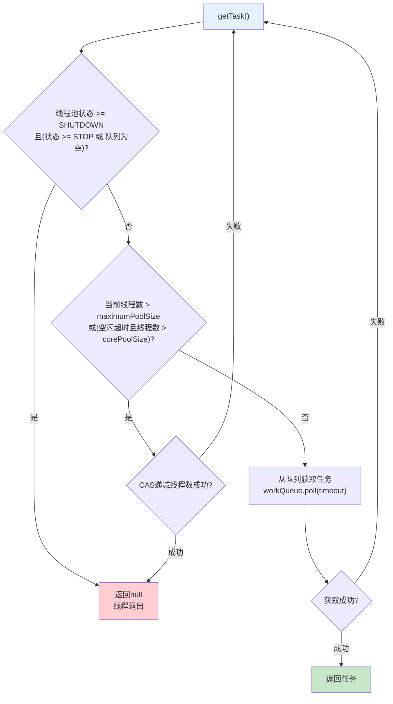
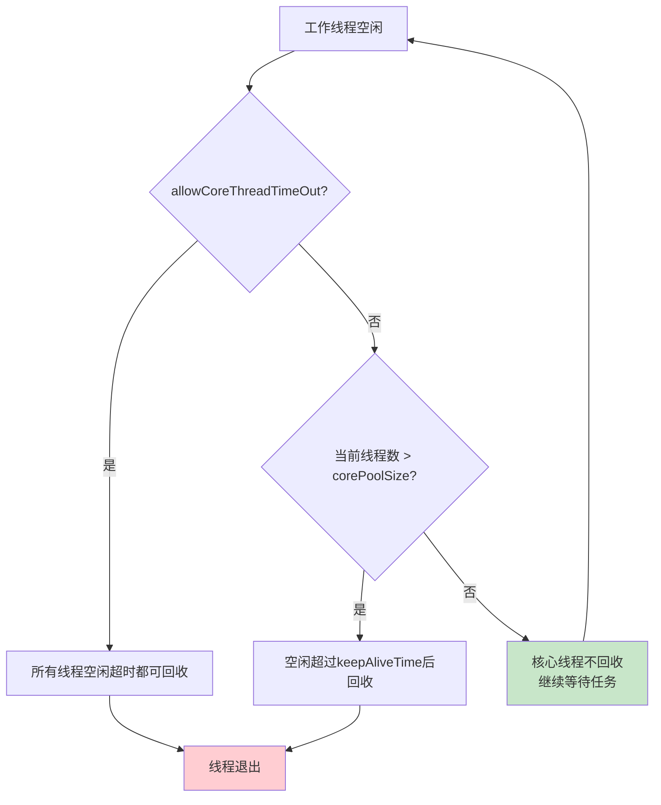

# 线程池工作线程生命周期图

## Worker线程概述

线程池中的工作线程由Worker类封装，每个Worker持有一个Thread实例和一个首次任务。

## getTask()获取任务流程

## 工作线程生命周期说明

| 阶段 | 操作 | 说明 |
|------|------|------|
| 创建 | addWorker() | 创建Worker对象并启动线程 |
| 初始化 | new Worker(firstTask) | 设置首次任务，创建线程 |
| 运行 | runWorker() | 循环获取并执行任务 |
| 获取任务 | getTask() | 从队列获取任务，可能阻塞 |
| 执行任务 | task.run() | 执行任务的run方法 |
| 退出 | processWorkerExit() | 清理Worker，更新线程计数 |

## 线程回收机制

## 关键概念

- **Worker**：线程池的工作线程封装类，实现了Runnable接口
- **firstTask**：Worker创建时的首个任务，可能为null
- **runWorker()**：Worker的主循环方法，不断获取并执行任务
- **getTask()**：从工作队列获取任务，支持超时等待
- **线程回收**：空闲线程超时后自动退出，减少资源占用
