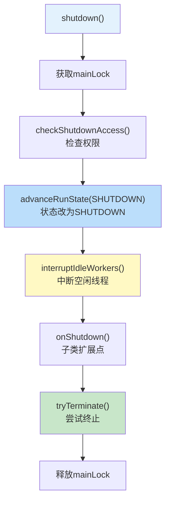
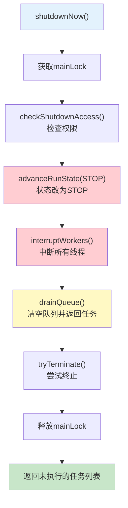
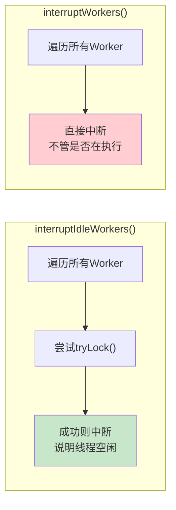
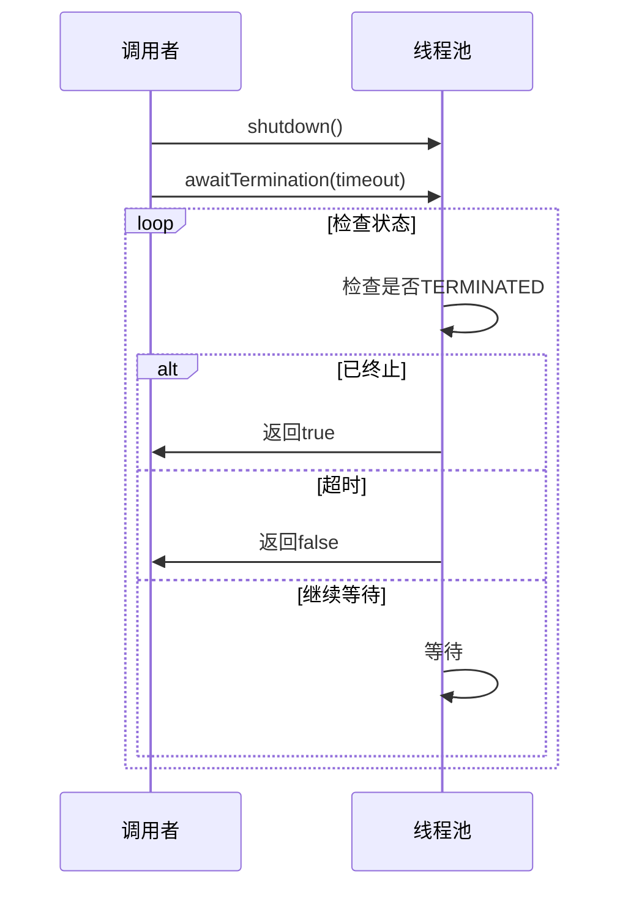

# 线程池关闭流程图

## 两种关闭方式对比

线程池提供两种关闭方式：shutdown()和shutdownNow()。

```mermaid
flowchart TD
    subgraph Shutdown["shutdown() - 优雅关闭"]
        S1["调用shutdown()"] --> S2["状态改为SHUTDOWN"]
        S2 --> S3["中断空闲线程<br/>tryLock()成功的中断"]
        S3 --> S4["等待队列任务执行完成"]
        S4 --> S5["workerCount变为0"]
        S5 --> S6["状态改为TIDYING"]
        S6 --> S7["执行terminated()"]
        S7 --> S8["状态改为TERMINATED"]
    end

    subgraph ShutdownNow["shutdownNow() - 立即关闭"]
        N1["调用shutdownNow()"] --> N2["状态改为STOP"]
        N2 --> N3["中断所有线程<br/>包括正在执行的"]
        N3 --> N4["清空工作队列"]
        N4 --> N5["返回未执行的任务列表"]
        N5 --> N6["workerCount变为0"]
        N6 --> N7["状态改为TIDYING"]
        N7 --> N8["执行terminated()"]
        N8 --> N9["状态改为TERMINATED"]
    end

    style S1 fill:#e3f2fd
    style N1 fill:#e3f2fd
    style S8 fill:#c8e6c9
    style N9 fill:#c8e6c9
```

## shutdown()详细流程

## shutdownNow()详细流程

## 中断线程的区别

## 关闭流程说明

| 步骤 | shutdown() | shutdownNow() |
|------|-----------|---------------|
| 状态变更 | RUNNING → SHUTDOWN | RUNNING → STOP |
| 新任务 | 拒绝 | 拒绝 |
| 队列任务 | 继续执行 | 丢弃并返回 |
| 执行中任务 | 继续执行 | 尝试中断 |
| 空闲线程 | 中断 | 中断 |

## awaitTermination()等待终止

## 关键概念

- **优雅关闭**：shutdown()等待队列任务完成，不中断执行中任务
- **立即关闭**：shutdownNow()中断所有任务，返回未执行任务
- **空闲线程**：未在执行任务的线程，通过tryLock()判断
- **terminated()**：线程池终止时的回调方法，可被子类重写
