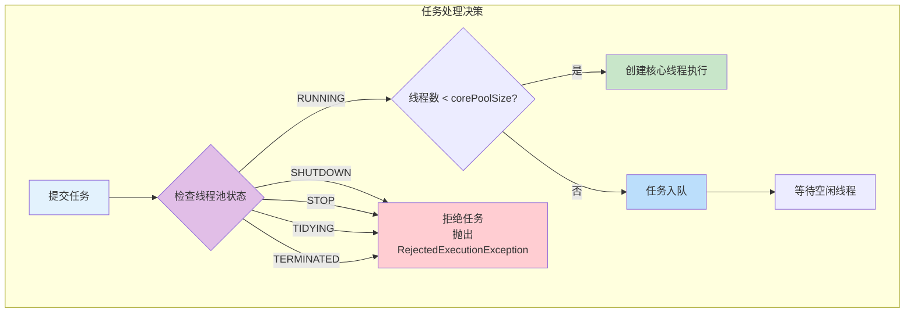
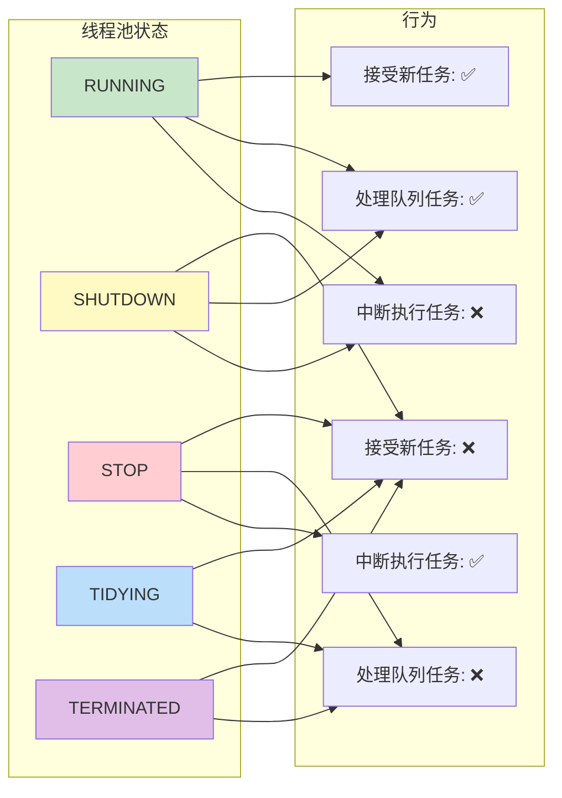
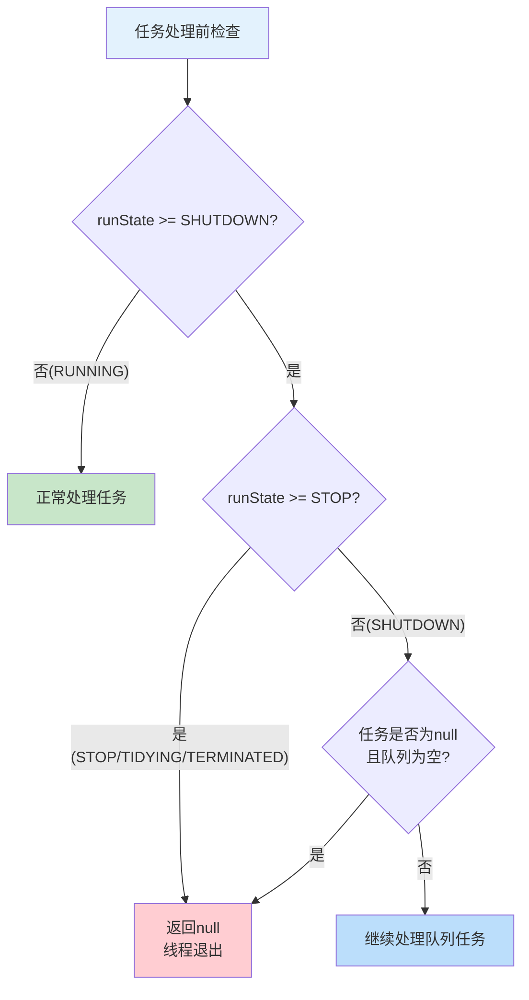
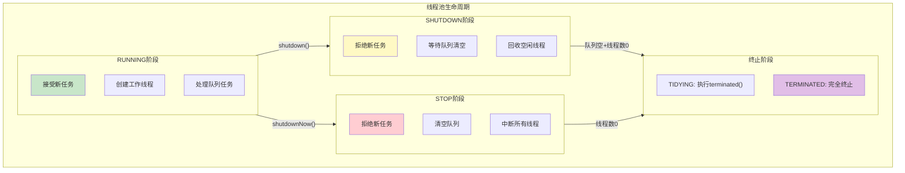

# 线程池状态与任务处理关系图

## 不同状态下的任务处理方式

线程池在不同状态下对任务的处理方式不同。

## 状态与行为对照表

## 状态检查流程

## 线程池生命周期全景图

## 状态与任务处理关系说明

| 状态 | 接受新任务 | 处理队列任务 | 中断执行任务 | 典型场景 |
|------|----------|-------------|-------------|---------|
| RUNNING | ✅ 是 | ✅ 是 | ❌ 否 | 正常运行 |
| SHUTDOWN | ❌ 否 | ✅ 是 | ❌ 否 | 优雅关闭 |
| STOP | ❌ 否 | ❌ 否 | ✅ 是 | 立即关闭 |
| TIDYING | ❌ 否 | ❌ 否 | ❌ 否 | 即将终止 |
| TERMINATED | ❌ 否 | ❌ 否 | ❌ 否 | 已终止 |

## 关键概念

- **状态优先检查**：任何操作前先检查线程池状态
- **状态决定行为**：不同状态下对任务的处理方式完全不同
- **状态转换不可逆**：一旦进入关闭流程，无法恢复运行
- **优雅关闭**：SHUTDOWN状态保证队列任务执行完成
